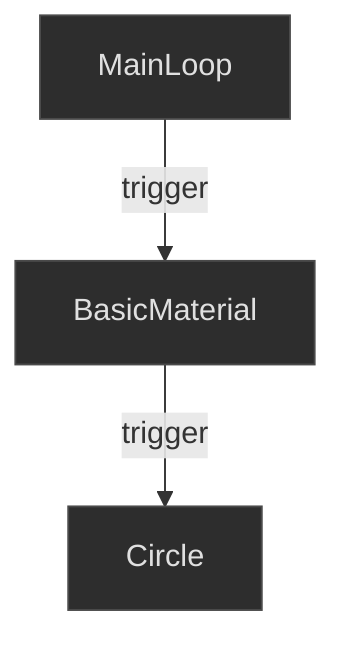

# Getting Started with Cables.gl

## Creating Your Account

1. Go to [cables.gl](https://cables.gl)
2. Click "Sign Up" to create a free account
3. Verify your email
4. You're ready to start creating!

## The Interface

### Main Areas

```
┌─────────────────────────────────────────────────────────────┐
│                       TOOLBAR                                │
|-──────────────────────┬──────────────────────────────────────┤
│                      │                                       │
│      OP LIBRARY      │           CANVAS (Preview)           │
│                      │                                       │
|-──────────────────────┤                                       │
│                      │                                       │
│    PATCH EDITOR      │                                       │
│   (Node workspace)   │                                       │
│                      │                                       │
`-──────────────────────┴──────────────────────────────────────┘
```

### Key Interface Elements

1. **Canvas** - Live preview of your creation
2. **Patch Editor** - Where you place and connect ops
3. **Op Library** - Browse and search for operators
4. **Parameters Panel** - Adjust settings for selected ops
5. **Timeline** - For animation keyframes

## Navigation Controls

| Action | Control |
|--------|---------|
| Pan the view | Middle mouse drag or Space + drag |
| Zoom in/out | Mouse scroll wheel |
| Select op | Left click |
| Multi-select | Shift + click or drag box |
| Delete selected | Delete or Backspace |
| Add new op | Double-click or Tab |
| Connect ports | Drag from output to input |

## Keyboard Shortcuts

Mastering keyboard shortcuts will significantly speed up your workflow in cables.gl.

### Essential Shortcuts

| Shortcut | Action |
|----------|--------|
| **Tab** or **Double-click** | Add new op (opens search) |
| **Delete** or **Backspace** | Delete selected op(s) |
| **Ctrl + C** / **Cmd + C** | Copy selected op(s) |
| **Ctrl + V** / **Cmd + V** | Paste op(s) |
| **Ctrl + X** / **Cmd + X** | Cut selected op(s) |
| **Ctrl + D** / **Cmd + D** | Duplicate selected op(s) |
| **Ctrl + Z** / **Cmd + Z** | Undo |
| **Ctrl + Shift + Z** / **Cmd + Shift + Z** | Redo |

### Selection & Navigation

| Shortcut | Action |
|----------|--------|
| **Ctrl + A** / **Cmd + A** | Select all ops |
| **Shift + Click** | Add to selection |
| **Ctrl + Click** / **Cmd + Click** | Toggle selection |
| **Escape** | Deselect all |
| **Space + Drag** | Pan the patch view |
| **Mouse Wheel** | Zoom in/out |
| **Ctrl + 0** / **Cmd + 0** | Zoom to fit all ops |
| **F** | Focus/frame selected op(s) |

### Organizing & Aligning

| Shortcut | Action |
|----------|--------|
| **Ctrl + Shift + A** / **Cmd + Shift + A** | Align selected ops horizontally |
| **Ctrl + Shift + D** / **Cmd + Shift + D** | Distribute selected ops evenly |
| **Ctrl + G** / **Cmd + G** | Group selected ops |
| **Arrow Keys** | Nudge selected op(s) by small amount |
| **Shift + Arrow Keys** | Nudge selected op(s) by larger amount |

### Working with Ops

| Shortcut | Action |
|----------|--------|
| **Enter** | Open/edit selected op's parameters |
| **Ctrl + E** / **Cmd + E** | Enable/disable selected op |
| **Ctrl + M** / **Cmd + M** | Mute selected op |
| **R** | Rename selected op |
| **C** | Add comment node |
| **Ctrl + F** / **Cmd + F** | Find/search ops in patch |

### Cables & Connections

| Shortcut | Action |
|----------|--------|
| **Drag from port** | Create connection |
| **Click connection** | Select cable |
| **Alt + Click connection** | Delete cable |
| **Shift + Drag port** | Create cable with search |

### View & Interface

| Shortcut | Action |
|----------|--------|
| **T** | Toggle timeline |
| **Ctrl + /** / **Cmd + /** | Toggle op library |
| **H** | Toggle patch editor visibility |
| **P** | Toggle parameters panel |
| **Ctrl + S** / **Cmd + S** | Save patch |
| **Ctrl + Shift + S** / **Cmd + Shift + S** | Save as... |

### Performance & Debugging

| Shortcut | Action |
|----------|--------|
| **Ctrl + Shift + P** / **Cmd + Shift + P** | Performance monitor |
| **Ctrl + Shift + L** / **Cmd + Shift + L** | Show patch loading info |
| **Alt + Click op** | View op documentation |

### Pro Tips

- **Hold Shift while connecting**: Automatically opens op search to insert an op in the connection
- **Hold Alt while dragging**: Duplicate op while moving
- **Double-click a connection**: Insert a new op in that cable
- **Right-click an op**: Quick access to op menu (rename, mute, group, etc.)
- **Click and drag in empty space**: Selection box for multiple ops

## Your First Patch

Let's create a simple animated shape!

### Step 1: Create the Render Pipeline

1. Double-click in the patch editor to open the op search
2. Search for `MainLoop` and add it
3. The MainLoop is the heartbeat of your patch - it triggers every frame

### Step 2: Add a BasicMaterial

1. Add a `BasicMaterial` op
2. Connect `MainLoop`'s trigger output to `BasicMaterial`'s trigger input
3. You should see a black canvas appear

### Step 3: Draw a Circle

1. Add a `Circle` op
2. Connect `BasicMaterial` -> `Circle`
3. A white circle appears!

Here's what your patch should look like:

#### Visualization Options

**Option 1: Screenshot from Real Cables.gl (Most Authentic)**

See [Screenshot Guide](images/screenshot-guide.md) for instructions on capturing real cables.gl patches.

**Option 3: HTML/CSS Interactive**

Open [HTML Version](images/basic-render-chain-html.html) in your browser for an interactive view.

**Option 4: Mermaid Diagram (Simple Flow)**



*The basic render chain: MainLoop triggers the BasicMaterial, which then draws the Circle*

### Step 4: Add Color

1. Select the `BasicMaterial` op
2. Adjust the color values (r, g, b) in the parameters panel
3. Or connect a `SetColor` op's output to `BasicMaterial`'s color input ports
4. The circle will display with your chosen color

### Step 5: Animate It

1. Add a `Time` op (outputs current time)
2. Add a `Math` op (for calculations)
3. Add a `Sin` op (sine wave)
4. Connect: `Time` -> `Sin` -> Circle's `Scale` input
5. Watch your circle pulse!

## Understanding the Flow

Data flows from **top to bottom** and **left to right**:

```
MainLoop (starts the frame)
    |
BasicMaterial (defines appearance and color)
    |
Circle (draws the shape)
```

The **trigger** connection (grey) determines WHEN things happen.
The **value** connections (colored) determine WHAT values are used.

## Saving Your Work

- Patches auto-save regularly
- Click the save icon to force a save
- Use "Save As" to create copies
- Export for standalone deployment

## Tips for Beginners

1. **Start Simple** - Begin with basic shapes before complex 3D
2. **Explore Examples** - Study public patches to learn patterns
3. **Use Comments** - Add comment ops to document your work
4. **Name Your Ops** - Rename ops for clarity in complex patches
5. **Save Often** - And use versioning for major changes

## Featured Videos

<!-- Add getting started videos here -->

<!-- Example:
```vid
https://youtu.be/XXXXX
Title: Cables.gl Beginner Tutorial
Author: Channel Name
Thumbnail: https://i.ytimg.com/vi/XXXXX/mqdefault.jpg
```
-->

## Common First-Patch Issues

### "I don't see anything!"
- Make sure MainLoop is connected to BasicMaterial
- Check that your shape ops are connected in the chain
- Verify the canvas is visible (not minimized)

### "Colors aren't changing!"
- Check BasicMaterial's color values (r, g, b) in the parameters panel
- Make sure RGB values aren't all 0 (black)
- If using SetColor, connect it to BasicMaterial's color input ports

### "Animation isn't working!"
- Ensure Time op is connected
- Check that the animated value is actually changing (view the port value)

---

**Previous**: [<- Introduction](01-introduction.md) | **Next**: [2D Graphics ->](03-2d-graphics.md)


