# All Operators Reference

This chapter provides a comprehensive reference for all operators (ops) available in cables.gl.

**Statistics:** 1340 total ops, 1334 with port documentation

**Last Updated:** 2025-12-29 16:47

**Note:** This reference is scraped from [cables.gl/ops](https://cables.gl/ops/).

---

## Ops.Anim

### AnimNumber

**Full Name:** `Ops.Anim.AnimNumber`
**Description:** *Visit [documentation](https://cables.gl/op/Ops.Anim.AnimNumber) for details*

**> Input Ports:**
- **Exe** (Trigger): *See documentation*
- **Value** (Number): *See documentation*
- **Duration** (Number): *See documentation*
- **Easing Index** (Number: Integer): *See documentation*

**< Output Ports:**
- **Next** (Trigger): *See documentation*
- **Result** (Number): *See documentation*
- **Finished** (Trigger): *See documentation*

**Example Patch:** [Open in Editor](https://cables.gl/op/Ops.Anim.AnimNumber#example)
**Patches Using This Op:** *Search [cables.gl patches](https://cables.gl/patches) for "AnimNumber"*
**Docs:** [https://cables.gl/op/Ops.Anim.AnimNumber](https://cables.gl/op/Ops.Anim.AnimNumber)

---

### Bang

**Full Name:** `Ops.Anim.Bang`
**Description:** *Visit [documentation](https://cables.gl/op/Ops.Anim.Bang) for details*

**> Input Ports:**
- **Update** (Trigger): *See documentation*
- **Bang** (Trigger): *See documentation*
- **Duration** (Number): *See documentation*
- **Invert** (Number: Boolean): *See documentation*

**< Output Ports:**
- **Trigger Out** (Trigger): *See documentation*
- **Value** (Number): *See documentation*

**Example Patch:** [Open in Editor](https://cables.gl/op/Ops.Anim.Bang#example)
**Patches Using This Op:** *Search [cables.gl patches](https://cables.gl/patches) for "Bang"*
**Docs:** [https://cables.gl/op/Ops.Anim.Bang](https://cables.gl/op/Ops.Anim.Bang)

---

### BoolAnim

**Full Name:** `Ops.Anim.BoolAnim`
**Description:** *Visit [documentation](https://cables.gl/op/Ops.Anim.BoolAnim) for details*

**> Input Ports:**
- **Exe** (Trigger): *See documentation*
- **Bool** (Number: Boolean): *See documentation*
- **Easing Index** (Number: Integer): *See documentation*
- **Duration** (Number): *See documentation*
- **Direction Index** (Number: Integer): *See documentation*
- **Value False** (Number): *See documentation*
- **Value True** (Number): *See documentation*

**< Output Ports:**
- **Trigger** (Trigger): *See documentation*
- **Value** (Number): *See documentation*
- **Finished** (booleanNumber): *See documentation*
- **Finished Trigger** (Trigger): *See documentation*

**Example Patch:** [Open in Editor](https://cables.gl/op/Ops.Anim.BoolAnim#example)
**Patches Using This Op:** *Search [cables.gl patches](https://cables.gl/patches) for "BoolAnim"*
**Docs:** [https://cables.gl/op/Ops.Anim.BoolAnim](https://cables.gl/op/Ops.Anim.BoolAnim)

---

### Crossfade

**Full Name:** `Ops.Anim.Crossfade`
**Description:** *Visit [documentation](https://cables.gl/op/Ops.Anim.Crossfade) for details*

**> Input Ports:**
- **Crossfade** (Number): *See documentation*
- **Out Min** (Number): *See documentation*
- **Out Max** (Number): *See documentation*
- **Easing Index** (Number: Integer): *See documentation*

**< Output Ports:**
- **A** (Number): *See documentation*
- **B** (Number): *See documentation*

**Example Patch:** [Open in Editor](https://cables.gl/op/Ops.Anim.Crossfade#example)
**Patches Using This Op:** *Search [cables.gl patches](https://cables.gl/patches) for "Crossfade"*
**Docs:** [https://cables.gl/op/Ops.Anim.Crossfade](https://cables.gl/op/Ops.Anim.Crossfade)

---

### FrameRangeAnim_v2

**Full Name:** `Ops.Anim.FrameRangeAnim_v2`
**Description:** *Visit [documentation](https://cables.gl/op/Ops.Anim.FrameRangeAnim_v2) for details*

**> Input Ports:**
- **Time** (Number): *See documentation*
- **Frames** (String): *See documentation*
- **frame range** (ex. "0-10"): *See documentation*
- **Loop** (Number: Boolean): *See documentation*
- **Rewind** (Trigger): *See documentation*

**< Output Ports:**
- **Result Time** (Number): *See documentation*
- **Expanded Frames** (Array): *See documentation*
- **Finished** (booleanNumber): *See documentation*
- **Finished Trigger** (Trigger): *See documentation*
- **Anim Length** (Number): *See documentation*
- **Progress** (Number): *See documentation*

**Example Patch:** [Open in Editor](https://cables.gl/op/Ops.Anim.FrameRangeAnim_v2#example)
**Patches Using This Op:** *Search [cables.gl patches](https://cables.gl/patches) for "FrameRangeAnim_v2"*
**Docs:** [https://cables.gl/op/Ops.Anim.FrameRangeAnim_v2](https://cables.gl/op/Ops.Anim.FrameRangeAnim_v2)

---

### FrameRangeAnimSwitcher

**Full Name:** `Ops.Anim.FrameRangeAnimSwitcher`
**Description:** *Visit [documentation](https://cables.gl/op/Ops.Anim.FrameRangeAnimSwitcher) for details*

**> Input Ports:**
- **Index** (Number: Integer): *See documentation*
- **Duration** (Number): *See documentation*
- **Easing Index** (Number: Integer): *See documentation*
- **Value 0** (Number): *See documentation*
- **Value 1** (Number): *See documentation*
- **Value 2** (Number): *See documentation*
- **Value 3** (Number): *See documentation*
- **Value 4** (Number): *See documentation*
- **Value 5** (Number): *See documentation*
- **Value 6** (Number): *See documentation*
- **Value 7** (Number): *See documentation*
- **Value 8** (Number): *See documentation*
- **Value 9** (Number): *See documentation*

**< Output Ports:**
- **Time 1** (Number): *See documentation*
- **Time Fade** (Number): *See documentation*
- **Time 2** (Number): *See documentation*

**Example Patch:** [Open in Editor](https://cables.gl/op/Ops.Anim.FrameRangeAnimSwitcher#example)
**Patches Using This Op:** *Search [cables.gl patches](https://cables.gl/patches) for "FrameRangeAnimSwitcher"*
**Docs:** [https://cables.gl/op/Ops.Anim.FrameRangeAnimSwitcher](https://cables.gl/op/Ops.Anim.FrameRangeAnimSwitcher)

---

### InOutInAnim

**Full Name:** `Ops.Anim.InOutInAnim`
**Description:** *Visit [documentation](https://cables.gl/op/Ops.Anim.InOutInAnim) for details*

**> Input Ports:**
- **Update** (Trigger): *See documentation*
- **Duration In** (Number): *See documentation*
- **Easing In Index** (Number: Integer): *See documentation*
- **Value In** (Number): *See documentation*
- **Hold Duration** (Number): *See documentation*
- **Duration Out** (Number): *See documentation*
- **Easing Out Index** (Number: Integer): *See documentation*
- **Value Out** (Number): *See documentation*
- **Start** (Trigger): *See documentation*

**< Output Ports:**
- **Next** (Trigger): *See documentation*
- **Result** (Number): *See documentation*
- **Started** (Trigger): *See documentation*
- **Middle** (Trigger): *See documentation*
- **Finished** (Trigger): *See documentation*

**Example Patch:** [Open in Editor](https://cables.gl/op/Ops.Anim.InOutInAnim#example)
**Patches Using This Op:** *Search [cables.gl patches](https://cables.gl/patches) for "InOutInAnim"*
**Docs:** [https://cables.gl/op/Ops.Anim.InOutInAnim](https://cables.gl/op/Ops.Anim.InOutInAnim)

---

### LFO_v3

**Full Name:** `Ops.Anim.LFO_v3`
**Description:** *Visit [documentation](https://cables.gl/op/Ops.Anim.LFO_v3) for details*

**> Input Ports:**
- **Time** (Number): *See documentation*
- **Frequency** (Number): *See documentation*
- **Type Index** (Number: Integer): *See documentation*
- **Phase** (Number): *See documentation*
- **Range Min** (Number): *See documentation*
- **Range Max** (Number): *See documentation*

**< Output Ports:**
- **Result** (Number): *See documentation*

**Example Patch:** [Open in Editor](https://cables.gl/op/Ops.Anim.LFO_v3#example)
**Patches Using This Op:** *Search [cables.gl patches](https://cables.gl/patches) for "LFO_v3"*
**Docs:** [https://cables.gl/op/Ops.Anim.LFO_v3](https://cables.gl/op/Ops.Anim.LFO_v3)

---

### RandomAnim_v2

**Full Name:** `Ops.Anim.RandomAnim_v2`
**Description:** *Visit [documentation](https://cables.gl/op/Ops.Anim.RandomAnim_v2) for details*

**> Input Ports:**
- **Exe** (Trigger): *See documentation*
- **Min** (Number): *See documentation*
- **Max** (Number): *See documentation*
- **Duration** (Number): *See documentation*
- **Pause Between** (Number): *See documentation*
- **Easing Index** (Number: Integer): *See documentation*

**< Output Ports:**
- **Next** (Trigger): *See documentation*
- **Result** (Number): *See documentation*
- **Looped** (Trigger): *See documentation*

**Example Patch:** [Open in Editor](https://cables.gl/op/Ops.Anim.RandomAnim_v2#example)
**Patches Using This Op:** *Search [cables.gl patches](https://cables.gl/patches) for "RandomAnim_v2"*
**Docs:** [https://cables.gl/op/Ops.Anim.RandomAnim_v2](https://cables.gl/op/Ops.Anim.RandomAnim_v2)

---

### SimpleAnim

**Full Name:** `Ops.Anim.SimpleAnim`
**Description:** *Visit [documentation](https://cables.gl/op/Ops.Anim.SimpleAnim) for details*

**> Input Ports:**
- **Exe** (Trigger): *See documentation*
- **Reset** (Trigger): *See documentation*
- **Rewind** (Trigger): *See documentation*
- **Start** (Number): *See documentation*
- **End** (Number): *See documentation*
- **Duration** (Number): *See documentation*
- **Loop** (Number: Boolean): *See documentation*
- **Wait For Reset** (Number: Boolean): *See documentation*
- **Easing Index** (Number: Integer): *See documentation*

**< Output Ports:**
- **Next** (Trigger): *See documentation*
- **Result** (Number): *See documentation*
- **Finished** (Number): *See documentation*
- **Finished Trigger** (Trigger): *See documentation*

**Example Patch:** [Open in Editor](https://cables.gl/op/Ops.Anim.SimpleAnim#example)
**Patches Using This Op:** *Search [cables.gl patches](https://cables.gl/patches) for "SimpleAnim"*
**Docs:** [https://cables.gl/op/Ops.Anim.SimpleAnim](https://cables.gl/op/Ops.Anim.SimpleAnim)

---

### SineAnim

**Full Name:** `Ops.Anim.SineAnim`
**Description:** *Visit [documentation](https://cables.gl/op/Ops.Anim.SineAnim) for details*

**> Input Ports:**
- **Exe** (Trigger): *See documentation*
- **Mode Index** (Number: Integer): *See documentation*
- **Phase** (Number): *See documentation*
- **Frequency** (Number): *See documentation*
- **Amplitude** (Number): *See documentation*

**< Output Ports:**
- **Trigger Out** (Trigger): *See documentation*
- **Result** (Number): *See documentation*

**Example Patch:** [Open in Editor](https://cables.gl/op/Ops.Anim.SineAnim#example)
**Patches Using This Op:** *Search [cables.gl patches](https://cables.gl/patches) for "SineAnim"*
**Docs:** [https://cables.gl/op/Ops.Anim.SineAnim](https://cables.gl/op/Ops.Anim.SineAnim)

---

### Smooth

**Full Name:** `Ops.Anim.Smooth`
**Description:** *Visit [documentation](https://cables.gl/op/Ops.Anim.Smooth) for details*

**> Input Ports:**
- **Update** (Trigger): *See documentation*
- **Value** (Number): *See documentation*
- **Dec Factor** (Number): *See documentation*

**< Output Ports:**
- **Next** (Trigger): *See documentation*
- **Result** (Number): *See documentation*

**Example Patch:** [Open in Editor](https://cables.gl/op/Ops.Anim.Smooth#example)
**Patches Using This Op:** *Search [cables.gl patches](https://cables.gl/patches) for "Smooth"*
**Docs:** [https://cables.gl/op/Ops.Anim.Smooth](https://cables.gl/op/Ops.Anim.Smooth)

---

### Snap

**Full Name:** `Ops.Anim.Snap`
**Description:** *Visit [documentation](https://cables.gl/op/Ops.Anim.Snap) for details*

**> Input Ports:**
- **Delta** (Number): *See documentation*
- **Snap At Values** (Array): *See documentation*
- **Snap Distance** (Number): *See documentation*
- **Snap Distance Release** (Number): *See documentation*
- **Slowdown** (Number): *See documentation*
- **Block Input After Snap** (Number): *See documentation*
- **Reset** (Trigger): *See documentation*
- **Min** (Number): *See documentation*
- **Max** (Number): *See documentation*
- **Value Mul** (Number): *See documentation*
- **Enabled** (Number: Boolean): *See documentation*

**< Output Ports:**
- **Result** (Number): *See documentation*
- **Distance** (Number): *See documentation*
- **Snapped** (Number): *See documentation*
- **Was Snapped** (Number): *See documentation*

**Example Patch:** [Open in Editor](https://cables.gl/op/Ops.Anim.Snap#example)
**Patches Using This Op:** *Search [cables.gl patches](https://cables.gl/patches) for "Snap"*
**Docs:** [https://cables.gl/op/Ops.Anim.Snap](https://cables.gl/op/Ops.Anim.Snap)

---

### Spring

**Full Name:** `Ops.Anim.Spring`
**Description:** *Visit [documentation](https://cables.gl/op/Ops.Anim.Spring) for details*

**> Input Ports:**
- **Exe** (Trigger): *See documentation*
- **Value** (Number): *See documentation*
- **Damping** (Number): *See documentation*
- **Stiffness** (Number): *See documentation*

**< Output Ports:**
- **Trigger** (Trigger): *See documentation*
- **Result** (Number): *See documentation*

**Example Patch:** [Open in Editor](https://cables.gl/op/Ops.Anim.Spring#example)
**Patches Using This Op:** *Search [cables.gl patches](https://cables.gl/patches) for "Spring"*
**Docs:** [https://cables.gl/op/Ops.Anim.Spring](https://cables.gl/op/Ops.Anim.Spring)

---

### StringTypeAnimation_v2

**Full Name:** `Ops.Anim.StringTypeAnimation_v2`
**Description:** *Visit [documentation](https://cables.gl/op/Ops.Anim.StringTypeAnimation_v2) for details*

**> Input Ports:**
- **Text** (String): *See documentation*
- **Restart** (Trigger): *See documentation*
- **Speed** (Number): *See documentation*
- **Speed Variation** (Number): *See documentation*
- **Show Cursor** (Number: Boolean): *See documentation*

**< Output Ports:**
- **Result** (String): *See documentation*
- **Changed** (Trigger): *See documentation*
- **Finished** (Trigger): *See documentation*

**Example Patch:** [Open in Editor](https://cables.gl/op/Ops.Anim.StringTypeAnimation_v2#example)
**Patches Using This Op:** *Search [cables.gl patches](https://cables.gl/patches) for "StringTypeAnimation_v2"*
**Docs:** [https://cables.gl/op/Ops.Anim.StringTypeAnimation_v2](https://cables.gl/op/Ops.Anim.StringTypeAnimation_v2)

---

### TimeDelta

**Full Name:** `Ops.Anim.TimeDelta`
**Description:** *Visit [documentation](https://cables.gl/op/Ops.Anim.TimeDelta) for details*

**> Input Ports:**
- **Exe** (Trigger): *See documentation*
- **Smooth** (Number: Boolean): *See documentation*
- **Seconds** (Number: Boolean): *See documentation*

**< Output Ports:**
- **Trigger** (Trigger): *See documentation*
- **Result** (Number): *See documentation*

**Example Patch:** [Open in Editor](https://cables.gl/op/Ops.Anim.TimeDelta#example)
**Patches Using This Op:** *Search [cables.gl patches](https://cables.gl/patches) for "TimeDelta"*
**Docs:** [https://cables.gl/op/Ops.Anim.TimeDelta](https://cables.gl/op/Ops.Anim.TimeDelta)

---

### Timer_v2

**Full Name:** `Ops.Anim.Timer_v2`
**Description:** *Visit [documentation](https://cables.gl/op/Ops.Anim.Timer_v2) for details*

**> Input Ports:**
- **Speed** (Number): *See documentation*
- **Play** (Number: Boolean): *See documentation*
- **Reset** (Trigger): *See documentation*
- **Sync To Timeline** (Number: Boolean): *See documentation*

**< Output Ports:**
- **Time** (Number): *See documentation*

**Example Patch:** [Open in Editor](https://cables.gl/op/Ops.Anim.Timer_v2#example)
**Patches Using This Op:** *Search [cables.gl patches](https://cables.gl/patches) for "Timer_v2"*
**Docs:** [https://cables.gl/op/Ops.Anim.Timer_v2](https://cables.gl/op/Ops.Anim.Timer_v2)

---

## Ops.Array

### AnglesBetweenPoints

**Full Name:** `Ops.Array.AnglesBetweenPoints`
**Description:** *Visit [documentation](https://cables.gl/op/Ops.Array.AnglesBetweenPoints) for details*

**> Input Ports:**
- **Points** (Array): *See documentation*
- **Theta** (Number): *See documentation*
- **Phi** (Number): *See documentation*

**< Output Ports:**
- **Rotations** (Array): *See documentation*

**Example Patch:** [Open in Editor](https://cables.gl/op/Ops.Array.AnglesBetweenPoints#example)
**Patches Using This Op:** *Search [cables.gl patches](https://cables.gl/patches) for "AnglesBetweenPoints"*
**Docs:** [https://cables.gl/op/Ops.Array.AnglesBetweenPoints](https://cables.gl/op/Ops.Array.AnglesBetweenPoints)

---

### AnimArray_v2

**Full Name:** `Ops.Array.AnimArray_v2`
**Description:** *Visit [documentation](https://cables.gl/op/Ops.Array.AnimArray_v2) for details*

**> Input Ports:**
- **Update** (Trigger): *See documentation*
- **Next Array** (Array): *See documentation*
- **Duration** (Number): *See documentation*
- **Easing Index** (Number: Integer): *See documentation*

**< Output Ports:**
- **Next** (Trigger): *See documentation*
- **Matrix** (Array): *See documentation*

**Example Patch:** [Open in Editor](https://cables.gl/op/Ops.Array.AnimArray_v2#example)
**Patches Using This Op:** *Search [cables.gl patches](https://cables.gl/patches) for "AnimArray_v2"*
**Docs:** [https://cables.gl/op/Ops.Array.AnimArray_v2](https://cables.gl/op/Ops.Array.AnimArray_v2)

---

### Array1toX_v2

**Full Name:** `Ops.Array.Array1toX_v2`
**Description:** *Visit [documentation](https://cables.gl/op/Ops.Array.Array1toX_v2) for details*

**> Input Ports:**
- **Array1x** (Array): *See documentation*

**< Output Ports:**
- **Array3x** (Array): *See documentation*
- **Total Points** (Number): *See documentation*
- **Array Length** (Number): *See documentation*

**Example Patch:** [Open in Editor](https://cables.gl/op/Ops.Array.Array1toX_v2#example)
**Patches Using This Op:** *Search [cables.gl patches](https://cables.gl/patches) for "Array1toX_v2"*
**Docs:** [https://cables.gl/op/Ops.Array.Array1toX_v2](https://cables.gl/op/Ops.Array.Array1toX_v2)

---

### Array2To3

**Full Name:** `Ops.Array.Array2To3`
**Description:** *Visit [documentation](https://cables.gl/op/Ops.Array.Array2To3) for details*

**> Input Ports:**
- **Array2x** (Array): *See documentation*

**< Output Ports:**
- **Array3x** (Array): *See documentation*
- **Total Points** (Number): *See documentation*
- **Array Length** (Number): *See documentation*

**Example Patch:** [Open in Editor](https://cables.gl/op/Ops.Array.Array2To3#example)
**Patches Using This Op:** *Search [cables.gl patches](https://cables.gl/patches) for "Array2To3"*
**Docs:** [https://cables.gl/op/Ops.Array.Array2To3](https://cables.gl/op/Ops.Array.Array2To3)

---

### Array3

**Full Name:** `Ops.Array.Array3`
**Description:** *Visit [documentation](https://cables.gl/op/Ops.Array.Array3) for details*

**> Input Ports:**
- **Num Triplets** (Number: Integer): *See documentation*
- **X** (Number): *See documentation*
- **Y** (Number): *See documentation*
- **Z** (Number): *See documentation*

**< Output Ports:**
- **Array** (Array): *See documentation*
- **Total Points** (Number): *See documentation*
- **Array Length** (Number): *See documentation*

**Example Patch:** [Open in Editor](https://cables.gl/op/Ops.Array.Array3#example)
**Patches Using This Op:** *Search [cables.gl patches](https://cables.gl/patches) for "Array3"*
**Docs:** [https://cables.gl/op/Ops.Array.Array3](https://cables.gl/op/Ops.Array.Array3)

---

### Array3GetAverage

**Full Name:** `Ops.Array.Array3GetAverage`
**Description:** *Visit [documentation](https://cables.gl/op/Ops.Array.Array3GetAverage) for details*

**> Input Ports:**
- **Array** (Array): *See documentation*

**< Output Ports:**
- **Average X** (Number): *See documentation*
- **Average Y** (Number): *See documentation*
- **Average Z** (Number): *See documentation*

**Example Patch:** [Open in Editor](https://cables.gl/op/Ops.Array.Array3GetAverage#example)
**Patches Using This Op:** *Search [cables.gl patches](https://cables.gl/patches) for "Array3GetAverage"*
**Docs:** [https://cables.gl/op/Ops.Array.Array3GetAverage](https://cables.gl/op/Ops.Array.Array3GetAverage)

---

### Array3GetNumbers

**Full Name:** `Ops.Array.Array3GetNumbers`
**Description:** *Visit [documentation](https://cables.gl/op/Ops.Array.Array3GetNumbers) for details*

**> Input Ports:**
- **Array** (Array): *See documentation*
- **Index** (Number: Integer): *See documentation*

**< Output Ports:**
- **X** (Number): *See documentation*
- **Y** (Number): *See documentation*
- **Z** (Number): *See documentation*

**Example Patch:** [Open in Editor](https://cables.gl/op/Ops.Array.Array3GetNumbers#example)
**Patches Using This Op:** *Search [cables.gl patches](https://cables.gl/patches) for "Array3GetNumbers"*
**Docs:** [https://cables.gl/op/Ops.Array.Array3GetNumbers](https://cables.gl/op/Ops.Array.Array3GetNumbers)

---

### Array3InterpolateDistributed

**Full Name:** `Ops.Array.Array3InterpolateDistributed`
**Description:** *Visit [documentation](https://cables.gl/op/Ops.Array.Array3InterpolateDistributed) for details*

**> Input Ports:**
- **Update** (Trigger): *See documentation*
- **Array 1** (Array): *See documentation*
- **Array 2** (Array): *See documentation*
- **Progress** (Number): *See documentation*

**< Output Ports:**
- **Result** (Array): *See documentation*
- **Array Length** (Number): *See documentation*

**Example Patch:** [Open in Editor](https://cables.gl/op/Ops.Array.Array3InterpolateDistributed#example)
**Patches Using This Op:** *Search [cables.gl patches](https://cables.gl/patches) for "Array3InterpolateDistributed"*
**Docs:** [https://cables.gl/op/Ops.Array.Array3InterpolateDistributed](https://cables.gl/op/Ops.Array.Array3InterpolateDistributed)

---

### Array3Iterator

**Full Name:** `Ops.Array.Array3Iterator`
**Description:** *Visit [documentation](https://cables.gl/op/Ops.Array.Array3Iterator) for details*

**> Input Ports:**
- **Execute** (Trigger): *See documentation*
- **Array** (Array): *See documentation*
- **Step** (Number): *See documentation*

**< Output Ports:**
- **Trigger** (Trigger): *See documentation*
- **Triggers for every iteration step** (triplet in the array): *See documentation*
- **Index** (Number): *See documentation*
- **Value 1** (Number): *See documentation*
- **First value of the current triplet** (e.g. x): *See documentation*
- **Value 2** (Number): *See documentation*
- **Second value of the current triplet** (e.g. y): *See documentation*
- **Value 3** (Number): *See documentation*
- **Third value of the current triplet** (e.g. z): *See documentation*

**Example Patch:** [Open in Editor](https://cables.gl/op/Ops.Array.Array3Iterator#example)
**Patches Using This Op:** *Search [cables.gl patches](https://cables.gl/patches) for "Array3Iterator"*
**Docs:** [https://cables.gl/op/Ops.Array.Array3Iterator](https://cables.gl/op/Ops.Array.Array3Iterator)

---

### Array3Multiply

**Full Name:** `Ops.Array.Array3Multiply`
**Description:** *Visit [documentation](https://cables.gl/op/Ops.Array.Array3Multiply) for details*

**> Input Ports:**
- **Array3x** (Array): *See documentation*
- **Mul X** (Number): *See documentation*
- **Mul Y** (Number): *See documentation*
- **Mul Z** (Number): *See documentation*

**< Output Ports:**
- **Result** (Array): *See documentation*

**Example Patch:** [Open in Editor](https://cables.gl/op/Ops.Array.Array3Multiply#example)
**Patches Using This Op:** *Search [cables.gl patches](https://cables.gl/patches) for "Array3Multiply"*
**Docs:** [https://cables.gl/op/Ops.Array.Array3Multiply](https://cables.gl/op/Ops.Array.Array3Multiply)

---

### Array3PushNumbers_v2

**Full Name:** `Ops.Array.Array3PushNumbers_v2`
**Description:** *Visit [documentation](https://cables.gl/op/Ops.Array.Array3PushNumbers_v2) for details*

**> Input Ports:**
- **Execute** (Trigger): *See documentation*
- **Array** (Array): *See documentation*
- **Value 1** (Number): *See documentation*
- **Value 2** (Number): *See documentation*
- **Value 3** (Number): *See documentation*
- **Reset** (Trigger): *See documentation*

**< Output Ports:**
- **Next** (Trigger): *See documentation*
- **Result Array** (Array): *See documentation*

**Example Patch:** [Open in Editor](https://cables.gl/op/Ops.Array.Array3PushNumbers_v2#example)
**Patches Using This Op:** *Search [cables.gl patches](https://cables.gl/patches) for "Array3PushNumbers_v2"*
**Docs:** [https://cables.gl/op/Ops.Array.Array3PushNumbers_v2](https://cables.gl/op/Ops.Array.Array3PushNumbers_v2)

---

### Array3RandomSelection

**Full Name:** `Ops.Array.Array3RandomSelection`
**Description:** *Visit [documentation](https://cables.gl/op/Ops.Array.Array3RandomSelection) for details*

**> Input Ports:**
- **Array** (Array): *See documentation*
- **Elements** (Number: Integer): *See documentation*
- **Seed** (Number): *See documentation*

**< Output Ports:**
- **Result** (Array): *See documentation*
- **Total Points** (Number): *See documentation*
- **Array Length** (Number): *See documentation*

**Example Patch:** [Open in Editor](https://cables.gl/op/Ops.Array.Array3RandomSelection#example)
**Patches Using This Op:** *Search [cables.gl patches](https://cables.gl/patches) for "Array3RandomSelection"*
**Docs:** [https://cables.gl/op/Ops.Array.Array3RandomSelection](https://cables.gl/op/Ops.Array.Array3RandomSelection)

---

### Array3SetNumber

**Full Name:** `Ops.Array.Array3SetNumber`
**Description:** *Visit [documentation](https://cables.gl/op/Ops.Array.Array3SetNumber) for details*

**> Input Ports:**
- **Array** (Array): *See documentation*
- **Index** (Number: Integer): *See documentation*
- **Value X** (Number): *See documentation*
- **Value Y** (Number): *See documentation*
- **Value Z** (Number): *See documentation*

**< Output Ports:**
- **Result** (Array): *See documentation*

**Example Patch:** [Open in Editor](https://cables.gl/op/Ops.Array.Array3SetNumber#example)
**Patches Using This Op:** *Search [cables.gl patches](https://cables.gl/patches) for "Array3SetNumber"*
**Docs:** [https://cables.gl/op/Ops.Array.Array3SetNumber](https://cables.gl/op/Ops.Array.Array3SetNumber)

---

### Array3Sum

**Full Name:** `Ops.Array.Array3Sum`
**Description:** *Visit [documentation](https://cables.gl/op/Ops.Array.Array3Sum) for details*

**> Input Ports:**
- **Array3x** (Array): *See documentation*
- **Add X** (Number): *See documentation*
- **Add Y** (Number): *See documentation*
- **Add Z** (Number): *See documentation*

**< Output Ports:**
- **Result** (Array): *See documentation*

**Example Patch:** [Open in Editor](https://cables.gl/op/Ops.Array.Array3Sum#example)
**Patches Using This Op:** *Search [cables.gl patches](https://cables.gl/patches) for "Array3Sum"*
**Docs:** [https://cables.gl/op/Ops.Array.Array3Sum](https://cables.gl/op/Ops.Array.Array3Sum)

---

### Array3To2

**Full Name:** `Ops.Array.Array3To2`
**Description:** *Visit [documentation](https://cables.gl/op/Ops.Array.Array3To2) for details*

**> Input Ports:**
- **Array3x** (Array): *See documentation*

**< Output Ports:**
- **Array2x** (Array): *See documentation*

**Example Patch:** [Open in Editor](https://cables.gl/op/Ops.Array.Array3To2#example)
**Patches Using This Op:** *Search [cables.gl patches](https://cables.gl/patches) for "Array3To2"*
**Docs:** [https://cables.gl/op/Ops.Array.Array3To2](https://cables.gl/op/Ops.Array.Array3To2)

---

### Array3To4

**Full Name:** `Ops.Array.Array3To4`
**Description:** *Visit [documentation](https://cables.gl/op/Ops.Array.Array3To4) for details*

**> Input Ports:**
- **Array3x** (Array): *See documentation*

**< Output Ports:**
- **Array4x** (Array): *See documentation*
- **Total Points** (Number): *See documentation*
- **Array Length** (Number): *See documentation*

**Example Patch:** [Open in Editor](https://cables.gl/op/Ops.Array.Array3To4#example)
**Patches Using This Op:** *Search [cables.gl patches](https://cables.gl/patches) for "Array3To4"*
**Docs:** [https://cables.gl/op/Ops.Array.Array3To4](https://cables.gl/op/Ops.Array.Array3To4)

---

### Array3VectorLength

**Full Name:** `Ops.Array.Array3VectorLength`
**Description:** *Visit [documentation](https://cables.gl/op/Ops.Array.Array3VectorLength) for details*

**> Input Ports:**
- **Array In** (Array): *See documentation*

**< Output Ports:**
- **Array Out** (Array): *See documentation*
- **Array Lengths** (Number): *See documentation*

**Example Patch:** [Open in Editor](https://cables.gl/op/Ops.Array.Array3VectorLength#example)
**Patches Using This Op:** *Search [cables.gl patches](https://cables.gl/patches) for "Array3VectorLength"*
**Docs:** [https://cables.gl/op/Ops.Array.Array3VectorLength](https://cables.gl/op/Ops.Array.Array3VectorLength)

---

### Array4

**Full Name:** `Ops.Array.Array4`
**Description:** *Visit [documentation](https://cables.gl/op/Ops.Array.Array4) for details*

**> Input Ports:**
- **Num Quadruplets** (Number: Integer): *See documentation*
- **X** (Number): *See documentation*
- **Y** (Number): *See documentation*
- **Z** (Number): *See documentation*
- **W** (Number): *See documentation*

**< Output Ports:**
- **Array** (Array): *See documentation*
- **Total Quadruplets** (Number): *See documentation*
- **Array Length** (Number): *See documentation*

**Example Patch:** [Open in Editor](https://cables.gl/op/Ops.Array.Array4#example)
**Patches Using This Op:** *Search [cables.gl patches](https://cables.gl/patches) for "Array4"*
**Docs:** [https://cables.gl/op/Ops.Array.Array4](https://cables.gl/op/Ops.Array.Array4)

---

### Array4GetNumbers

**Full Name:** `Ops.Array.Array4GetNumbers`
**Description:** *Visit [documentation](https://cables.gl/op/Ops.Array.Array4GetNumbers) for details*

**> Input Ports:**
- **Array** (Array): *See documentation*
- **Index** (Number: Integer): *See documentation*

**< Output Ports:**
- **X** (Number): *See documentation*
- **Y** (Number): *See documentation*
- **Z** (Number): *See documentation*
- **W** (Number): *See documentation*

**Example Patch:** [Open in Editor](https://cables.gl/op/Ops.Array.Array4GetNumbers#example)
**Patches Using This Op:** *Search [cables.gl patches](https://cables.gl/patches) for "Array4GetNumbers"*
**Docs:** [https://cables.gl/op/Ops.Array.Array4GetNumbers](https://cables.gl/op/Ops.Array.Array4GetNumbers)

---

### Array4SetNumber

**Full Name:** `Ops.Array.Array4SetNumber`
**Description:** *Visit [documentation](https://cables.gl/op/Ops.Array.Array4SetNumber) for details*

**> Input Ports:**
- **Array** (Array): *See documentation*
- **Index** (Number: Integer): *See documentation*
- **Value X** (Number): *See documentation*
- **Value Y** (Number): *See documentation*
- **Value Z** (Number): *See documentation*
- **Value W** (Number): *See documentation*

**< Output Ports:**
- **Result** (Array): *See documentation*

**Example Patch:** [Open in Editor](https://cables.gl/op/Ops.Array.Array4SetNumber#example)
**Patches Using This Op:** *Search [cables.gl patches](https://cables.gl/patches) for "Array4SetNumber"*
**Docs:** [https://cables.gl/op/Ops.Array.Array4SetNumber](https://cables.gl/op/Ops.Array.Array4SetNumber)

---

### Array4toArray3

**Full Name:** `Ops.Array.Array4toArray3`
**Description:** *Visit [documentation](https://cables.gl/op/Ops.Array.Array4toArray3) for details*

**> Input Ports:**
- **Array** (Array): *See documentation*

**< Output Ports:**
- **Result** (Array): *See documentation*
- **Array Length** (Number): *See documentation*

**Example Patch:** [Open in Editor](https://cables.gl/op/Ops.Array.Array4toArray3#example)
**Patches Using This Op:** *Search [cables.gl patches](https://cables.gl/patches) for "Array4toArray3"*
**Docs:** [https://cables.gl/op/Ops.Array.Array4toArray3](https://cables.gl/op/Ops.Array.Array4toArray3)

---

### Array_v3

**Full Name:** `Ops.Array.Array_v3`
**Description:** *Visit [documentation](https://cables.gl/op/Ops.Array.Array_v3) for details*

**> Input Ports:**
- **Array Length** (Number: Integer): *See documentation*
- **Mode Select Index** (Number: Integer): *See documentation*
- **Default Value** (Number): *See documentation*
- **Reverse** (Number: Boolean): *See documentation*

**< Output Ports:**
- **Array** (Array): *See documentation*
- **Array Length Out** (Number): *See documentation*

**Example Patch:** [Open in Editor](https://cables.gl/op/Ops.Array.Array_v3#example)
**Patches Using This Op:** *Search [cables.gl patches](https://cables.gl/patches) for "Array_v3"*
**Docs:** [https://cables.gl/op/Ops.Array.Array_v3](https://cables.gl/op/Ops.Array.Array_v3)

---

### ArrayAbs

**Full Name:** `Ops.Array.ArrayAbs`
**Description:** *Visit [documentation](https://cables.gl/op/Ops.Array.ArrayAbs) for details*

**> Input Ports:**
- **In** (Array): *See documentation*

**< Output Ports:**
- **Result** (Array): *See documentation*

**Example Patch:** [Open in Editor](https://cables.gl/op/Ops.Array.ArrayAbs#example)
**Patches Using This Op:** *Search [cables.gl patches](https://cables.gl/patches) for "ArrayAbs"*
**Docs:** [https://cables.gl/op/Ops.Array.ArrayAbs](https://cables.gl/op/Ops.Array.ArrayAbs)

---

### ArrayAppendArray

**Full Name:** `Ops.Array.ArrayAppendArray`
**Description:** *Visit [documentation](https://cables.gl/op/Ops.Array.ArrayAppendArray) for details*

**> Input Ports:**
- **Join** (Trigger): *See documentation*
- **Array** (Array): *See documentation*
- **Reset** (Trigger): *See documentation*

**< Output Ports:**
- **Result** (Array): *See documentation*
- **Array Length** (Number): *See documentation*

**Example Patch:** [Open in Editor](https://cables.gl/op/Ops.Array.ArrayAppendArray#example)
**Patches Using This Op:** *Search [cables.gl patches](https://cables.gl/patches) for "ArrayAppendArray"*
**Docs:** [https://cables.gl/op/Ops.Array.ArrayAppendArray](https://cables.gl/op/Ops.Array.ArrayAppendArray)

---

### ArrayBuffer

**Full Name:** `Ops.Array.ArrayBuffer`
**Description:** *Visit [documentation](https://cables.gl/op/Ops.Array.ArrayBuffer) for details*

**> Input Ports:**
- **Exec** (Trigger): *See documentation*
- **Value** (Number): *See documentation*
- **Max Length** (Number: Integer): *See documentation*
- **Reset** (Trigger): *See documentation*

**< Output Ports:**
- **Trigger Out** (Trigger): *See documentation*
- **Result** (Array): *See documentation*
- **Array Length** (Number): *See documentation*

**Example Patch:** [Open in Editor](https://cables.gl/op/Ops.Array.ArrayBuffer#example)
**Patches Using This Op:** *Search [cables.gl patches](https://cables.gl/patches) for "ArrayBuffer"*
**Docs:** [https://cables.gl/op/Ops.Array.ArrayBuffer](https://cables.gl/op/Ops.Array.ArrayBuffer)

---

### ArrayBuffer3

**Full Name:** `Ops.Array.ArrayBuffer3`
**Description:** *Visit [documentation](https://cables.gl/op/Ops.Array.ArrayBuffer3) for details*

**> Input Ports:**
- **Exec** (Trigger): *See documentation*
- **Max Num Elements** (Number): *See documentation*
- **Value X** (Number): *See documentation*
- **Value Y** (Number): *See documentation*
- **Value Z** (Number): *See documentation*
- **Reset** (Trigger): *See documentation*

**< Output Ports:**
- **Trigger Out** (Trigger): *See documentation*
- **Result** (Array): *See documentation*
- **Array Length** (Number): *See documentation*

**Example Patch:** [Open in Editor](https://cables.gl/op/Ops.Array.ArrayBuffer3#example)
**Patches Using This Op:** *Search [cables.gl patches](https://cables.gl/patches) for "ArrayBuffer3"*
**Docs:** [https://cables.gl/op/Ops.Array.ArrayBuffer3](https://cables.gl/op/Ops.Array.ArrayBuffer3)

---

### ArrayCeil

**Full Name:** `Ops.Array.ArrayCeil`
**Description:** *Visit [documentation](https://cables.gl/op/Ops.Array.ArrayCeil) for details*

**> Input Ports:**
- **In** (Array): *See documentation*

**< Output Ports:**
- **Result** (Array): *See documentation*

**Example Patch:** [Open in Editor](https://cables.gl/op/Ops.Array.ArrayCeil#example)
**Patches Using This Op:** *Search [cables.gl patches](https://cables.gl/patches) for "ArrayCeil"*
**Docs:** [https://cables.gl/op/Ops.Array.ArrayCeil](https://cables.gl/op/Ops.Array.ArrayCeil)

---

### ArrayChunk

**Full Name:** `Ops.Array.ArrayChunk`
**Description:** *Visit [documentation](https://cables.gl/op/Ops.Array.ArrayChunk) for details*

**> Input Ports:**
- **Input Array** (Array): *See documentation*
- **Begin Index** (Number: Integer): *See documentation*
- **Chunk Size** (Number: Integer): *See documentation*
- **Circular** (Number: Boolean): *See documentation*

**< Output Ports:**
- **Output Array** (Array): *See documentation*
- **Array Length** (Number): *See documentation*

**Example Patch:** [Open in Editor](https://cables.gl/op/Ops.Array.ArrayChunk#example)
**Patches Using This Op:** *Search [cables.gl patches](https://cables.gl/patches) for "ArrayChunk"*
**Docs:** [https://cables.gl/op/Ops.Array.ArrayChunk](https://cables.gl/op/Ops.Array.ArrayChunk)

---

### ArrayChunkDuplicate

**Full Name:** `Ops.Array.ArrayChunkDuplicate`
**Description:** *Visit [documentation](https://cables.gl/op/Ops.Array.ArrayChunkDuplicate) for details*

**> Input Ports:**
- **Array** (Array): *See documentation*
- **Chunk Size** (Number: Integer): *See documentation*
- **Repeats** (Number: Integer): *See documentation*

**< Output Ports:**
- **Result** (Array): *See documentation*

**Example Patch:** [Open in Editor](https://cables.gl/op/Ops.Array.ArrayChunkDuplicate#example)
**Patches Using This Op:** *Search [cables.gl patches](https://cables.gl/patches) for "ArrayChunkDuplicate"*
**Docs:** [https://cables.gl/op/Ops.Array.ArrayChunkDuplicate](https://cables.gl/op/Ops.Array.ArrayChunkDuplicate)

---

### ArrayClamp

**Full Name:** `Ops.Array.ArrayClamp`
**Description:** *Visit [documentation](https://cables.gl/op/Ops.Array.ArrayClamp) for details*

**> Input Ports:**
- **Array In** (Array): *See documentation*
- **Min** (Number): *See documentation*
- **Max** (Number): *See documentation*

**< Output Ports:**
- **Array Out** (Array): *See documentation*

**Example Patch:** [Open in Editor](https://cables.gl/op/Ops.Array.ArrayClamp#example)
**Patches Using This Op:** *Search [cables.gl patches](https://cables.gl/patches) for "ArrayClamp"*
**Docs:** [https://cables.gl/op/Ops.Array.ArrayClamp](https://cables.gl/op/Ops.Array.ArrayClamp)

---

### ArrayContains_v2

**Full Name:** `Ops.Array.ArrayContains_v2`
**Description:** *Visit [documentation](https://cables.gl/op/Ops.Array.ArrayContains_v2) for details*

**> Input Ports:**
- **Array** (Array): *See documentation*
- **SearchValue** (Number): *See documentation*

**< Output Ports:**
- **Found** (booleanNumber): *See documentation*
- **Index** (Number): *See documentation*

**Example Patch:** [Open in Editor](https://cables.gl/op/Ops.Array.ArrayContains_v2#example)
**Patches Using This Op:** *Search [cables.gl patches](https://cables.gl/patches) for "ArrayContains_v2"*
**Docs:** [https://cables.gl/op/Ops.Array.ArrayContains_v2](https://cables.gl/op/Ops.Array.ArrayContains_v2)

---

### ArrayDivide

**Full Name:** `Ops.Array.ArrayDivide`
**Description:** *Visit [documentation](https://cables.gl/op/Ops.Array.ArrayDivide) for details*

**> Input Ports:**
- **Array In** (Array): *See documentation*
- **Value** (Number): *See documentation*

**< Output Ports:**
- **Array Out** (Array): *See documentation*

**Example Patch:** [Open in Editor](https://cables.gl/op/Ops.Array.ArrayDivide#example)
**Patches Using This Op:** *Search [cables.gl patches](https://cables.gl/patches) for "ArrayDivide"*
**Docs:** [https://cables.gl/op/Ops.Array.ArrayDivide](https://cables.gl/op/Ops.Array.ArrayDivide)

---

### ArrayFindStrings

**Full Name:** `Ops.Array.ArrayFindStrings`
**Description:** *Visit [documentation](https://cables.gl/op/Ops.Array.ArrayFindStrings) for details*

**> Input Ports:**
- **Array** (Array): *See documentation*
- **SearchValue** (String): *See documentation*

**< Output Ports:**
- **Index** (Array): *See documentation*
- **Found** (booleanNumber): *See documentation*

**Example Patch:** [Open in Editor](https://cables.gl/op/Ops.Array.ArrayFindStrings#example)
**Patches Using This Op:** *Search [cables.gl patches](https://cables.gl/patches) for "ArrayFindStrings"*
**Docs:** [https://cables.gl/op/Ops.Array.ArrayFindStrings](https://cables.gl/op/Ops.Array.ArrayFindStrings)

---

### ArrayFloor

**Full Name:** `Ops.Array.ArrayFloor`
**Description:** *Visit [documentation](https://cables.gl/op/Ops.Array.ArrayFloor) for details*

**> Input Ports:**
- **In** (Array): *See documentation*

**< Output Ports:**
- **Result** (Array): *See documentation*

**Example Patch:** [Open in Editor](https://cables.gl/op/Ops.Array.ArrayFloor#example)
**Patches Using This Op:** *Search [cables.gl patches](https://cables.gl/patches) for "ArrayFloor"*
**Docs:** [https://cables.gl/op/Ops.Array.ArrayFloor](https://cables.gl/op/Ops.Array.ArrayFloor)

---

### ArrayFract

**Full Name:** `Ops.Array.ArrayFract`
**Description:** *Visit [documentation](https://cables.gl/op/Ops.Array.ArrayFract) for details*

**> Input Ports:**
- **In** (Array): *See documentation*

**< Output Ports:**
- **Result** (Array): *See documentation*

**Example Patch:** [Open in Editor](https://cables.gl/op/Ops.Array.ArrayFract#example)
**Patches Using This Op:** *Search [cables.gl patches](https://cables.gl/patches) for "ArrayFract"*
**Docs:** [https://cables.gl/op/Ops.Array.ArrayFract](https://cables.gl/op/Ops.Array.ArrayFract)

---

### ArrayFromNumbers

**Full Name:** `Ops.Array.ArrayFromNumbers`
**Description:** *Visit [documentation](https://cables.gl/op/Ops.Array.ArrayFromNumbers) for details*

**> Input Ports:**
- **Update** (Trigger): *See documentation*
- **Limit** (Number: Integer): *See documentation*
- **Slider** (Number: Boolean): *See documentation*
- **Index 0** (Number): *See documentation*
- **Index 1** (Number): *See documentation*
- **Index 2** (Number): *See documentation*
- **Index 3** (Number): *See documentation*
- **Index 4** (Number): *See documentation*
- **Index 5** (Number): *See documentation*
- **Index 6** (Number): *See documentation*
- **Index 7** (Number): *See documentation*
- **Index 8** (Number): *See documentation*
- **Index 9** (Number): *See documentation*
- **Index 10** (Number): *See documentation*
- **Index 11** (Number): *See documentation*
- **Index 12** (Number): *See documentation*
- **Index 13** (Number): *See documentation*
- **Index 14** (Number): *See documentation*
- **Index 15** (Number): *See documentation*
- **Index 16** (Number): *See documentation*
- **Index 17** (Number): *See documentation*
- **Index 18** (Number): *See documentation*
- **Index 19** (Number): *See documentation*
- **Index 20** (Number): *See documentation*
- **Index 21** (Number): *See documentation*
- **Index 22** (Number): *See documentation*
- **Index 23** (Number): *See documentation*
- **Index 24** (Number): *See documentation*
- **Index 25** (Number): *See documentation*
- **Index 26** (Number): *See documentation*
- **Index 27** (Number): *See documentation*
- **Index 28** (Number): *See documentation*
- **Index 29** (Number): *See documentation*

**< Output Ports:**
- **Next** (Trigger): *See documentation*
- **Array** (Array): *See documentation*

**Example Patch:** [Open in Editor](https://cables.gl/op/Ops.Array.ArrayFromNumbers#example)
**Patches Using This Op:** *Search [cables.gl patches](https://cables.gl/patches) for "ArrayFromNumbers"*
**Docs:** [https://cables.gl/op/Ops.Array.ArrayFromNumbers](https://cables.gl/op/Ops.Array.ArrayFromNumbers)

---

### ArrayGetArray

**Full Name:** `Ops.Array.ArrayGetArray`
**Description:** *Visit [documentation](https://cables.gl/op/Ops.Array.ArrayGetArray) for details*

**> Input Ports:**
- **Array Of Arrays** (Array): *See documentation*
- **Index** (Number: Integer): *See documentation*

**< Output Ports:**
- **Result Array** (Array): *See documentation*

**Example Patch:** [Open in Editor](https://cables.gl/op/Ops.Array.ArrayGetArray#example)
**Patches Using This Op:** *Search [cables.gl patches](https://cables.gl/patches) for "ArrayGetArray"*
**Docs:** [https://cables.gl/op/Ops.Array.ArrayGetArray](https://cables.gl/op/Ops.Array.ArrayGetArray)

---

### ArrayGetNumber

**Full Name:** `Ops.Array.ArrayGetNumber`
**Description:** *Visit [documentation](https://cables.gl/op/Ops.Array.ArrayGetNumber) for details*

**> Input Ports:**
- **Array** (Array): *See documentation*
- **Index** (Number: Integer): *See documentation*
- **Value Invalid Index** (Number): *See documentation*

**< Output Ports:**
- **Value** (Number): *See documentation*
- **Valid Index** (booleanNumber): *See documentation*

**Example Patch:** [Open in Editor](https://cables.gl/op/Ops.Array.ArrayGetNumber#example)
**Patches Using This Op:** *Search [cables.gl patches](https://cables.gl/patches) for "ArrayGetNumber"*
**Docs:** [https://cables.gl/op/Ops.Array.ArrayGetNumber](https://cables.gl/op/Ops.Array.ArrayGetNumber)

---

### ArrayGetObject

**Full Name:** `Ops.Array.ArrayGetObject`
**Description:** *Visit [documentation](https://cables.gl/op/Ops.Array.ArrayGetObject) for details*

**> Input Ports:**
- **Array** (Array): *See documentation*
- **Index** (Number: Integer): *See documentation*

**< Output Ports:**
- **Value** (Object): *See documentation*

**Example Patch:** [Open in Editor](https://cables.gl/op/Ops.Array.ArrayGetObject#example)
**Patches Using This Op:** *Search [cables.gl patches](https://cables.gl/patches) for "ArrayGetObject"*
**Docs:** [https://cables.gl/op/Ops.Array.ArrayGetObject](https://cables.gl/op/Ops.Array.ArrayGetObject)

---

### ArrayGetString_v2

**Full Name:** `Ops.Array.ArrayGetString_v2`
**Description:** *Visit [documentation](https://cables.gl/op/Ops.Array.ArrayGetString_v2) for details*

**> Input Ports:**
- **Array** (Array): *See documentation*
- **Index** (Number: Integer): *See documentation*

**< Output Ports:**
- **Result** (String): *See documentation*
- **Found** (booleanNumber): *See documentation*

**Example Patch:** [Open in Editor](https://cables.gl/op/Ops.Array.ArrayGetString_v2#example)
**Patches Using This Op:** *Search [cables.gl patches](https://cables.gl/patches) for "ArrayGetString_v2"*
**Docs:** [https://cables.gl/op/Ops.Array.ArrayGetString_v2](https://cables.gl/op/Ops.Array.ArrayGetString_v2)

---

### ArrayGetTexture

**Full Name:** `Ops.Array.ArrayGetTexture`
**Description:** *Visit [documentation](https://cables.gl/op/Ops.Array.ArrayGetTexture) for details*

**> Input Ports:**
- **Array** (Array): *See documentation*
- **Index** (Number: Integer): *See documentation*

**< Output Ports:**
- **Value** (Object): *See documentation*

**Example Patch:** [Open in Editor](https://cables.gl/op/Ops.Array.ArrayGetTexture#example)
**Patches Using This Op:** *Search [cables.gl patches](https://cables.gl/patches) for "ArrayGetTexture"*
**Docs:** [https://cables.gl/op/Ops.Array.ArrayGetTexture](https://cables.gl/op/Ops.Array.ArrayGetTexture)

---

### ArrayGetValuesByIndexArray

**Full Name:** `Ops.Array.ArrayGetValuesByIndexArray`
**Description:** *Visit [documentation](https://cables.gl/op/Ops.Array.ArrayGetValuesByIndexArray) for details*

**> Input Ports:**
- **Array** (Array): *See documentation*
- **Array Stride Index** (Number: Integer): *See documentation*
- **Indices** (Array): *See documentation*

**< Output Ports:**
- **Results** (Array): *See documentation*

**Example Patch:** [Open in Editor](https://cables.gl/op/Ops.Array.ArrayGetValuesByIndexArray#example)
**Patches Using This Op:** *Search [cables.gl patches](https://cables.gl/patches) for "ArrayGetValuesByIndexArray"*
**Docs:** [https://cables.gl/op/Ops.Array.ArrayGetValuesByIndexArray](https://cables.gl/op/Ops.Array.ArrayGetValuesByIndexArray)

---

### ArrayIndexBetween

**Full Name:** `Ops.Array.ArrayIndexBetween`
**Description:** *Visit [documentation](https://cables.gl/op/Ops.Array.ArrayIndexBetween) for details*

**> Input Ports:**
- **Array** (Array): *See documentation*
- **Value** (Number): *See documentation*

**< Output Ports:**
- **Index** (Number): *See documentation*

**Example Patch:** [Open in Editor](https://cables.gl/op/Ops.Array.ArrayIndexBetween#example)
**Patches Using This Op:** *Search [cables.gl patches](https://cables.gl/patches) for "ArrayIndexBetween"*
**Docs:** [https://cables.gl/op/Ops.Array.ArrayIndexBetween](https://cables.gl/op/Ops.Array.ArrayIndexBetween)

---

### ArrayIndexMinMax

**Full Name:** `Ops.Array.ArrayIndexMinMax`
**Description:** *Visit [documentation](https://cables.gl/op/Ops.Array.ArrayIndexMinMax) for details*

**> Input Ports:**
- **Array** (Array): *See documentation*

**< Output Ports:**
- **Max** (Number): *See documentation*
- **Index Max** (Number): *See documentation*
- **Min** (Number): *See documentation*
- **Index Min** (Number): *See documentation*

**Example Patch:** [Open in Editor](https://cables.gl/op/Ops.Array.ArrayIndexMinMax#example)
**Patches Using This Op:** *Search [cables.gl patches](https://cables.gl/patches) for "ArrayIndexMinMax"*
**Docs:** [https://cables.gl/op/Ops.Array.ArrayIndexMinMax](https://cables.gl/op/Ops.Array.ArrayIndexMinMax)

---

### ArrayIteratorArray

**Full Name:** `Ops.Array.ArrayIteratorArray`
**Description:** *Visit [documentation](https://cables.gl/op/Ops.Array.ArrayIteratorArray) for details*

**> Input Ports:**
- **Exe** (Trigger): *See documentation*
- **Array** (Array): *See documentation*

**< Output Ports:**
- **Trigger** (Trigger): *See documentation*
- **Index** (Number): *See documentation*
- **Result** (Array): *See documentation*

**Example Patch:** [Open in Editor](https://cables.gl/op/Ops.Array.ArrayIteratorArray#example)
**Patches Using This Op:** *Search [cables.gl patches](https://cables.gl/patches) for "ArrayIteratorArray"*
**Docs:** [https://cables.gl/op/Ops.Array.ArrayIteratorArray](https://cables.gl/op/Ops.Array.ArrayIteratorArray)

---

### ArrayIteratorNumbers

**Full Name:** `Ops.Array.ArrayIteratorNumbers`
**Description:** *Visit [documentation](https://cables.gl/op/Ops.Array.ArrayIteratorNumbers) for details*

**> Input Ports:**
- **Exe** (Trigger): *See documentation*
- **Array** (Array): *See documentation*

**< Output Ports:**
- **Trigger** (Trigger): *See documentation*
- **Index** (Number): *See documentation*
- **Value** (Number): *See documentation*

**Example Patch:** [Open in Editor](https://cables.gl/op/Ops.Array.ArrayIteratorNumbers#example)
**Patches Using This Op:** *Search [cables.gl patches](https://cables.gl/patches) for "ArrayIteratorNumbers"*
**Docs:** [https://cables.gl/op/Ops.Array.ArrayIteratorNumbers](https://cables.gl/op/Ops.Array.ArrayIteratorNumbers)

---

### ArrayIteratorObjects

**Full Name:** `Ops.Array.ArrayIteratorObjects`
**Description:** *Visit [documentation](https://cables.gl/op/Ops.Array.ArrayIteratorObjects) for details*

**> Input Ports:**
- **Exe** (Trigger): *See documentation*
- **Array** (Array): *See documentation*

**< Output Ports:**
- **Trigger** (Trigger): *See documentation*
- **Finished** (Trigger): *See documentation*
- **Index** (Number): *See documentation*
- **Value** (Object): *See documentation*

**Example Patch:** [Open in Editor](https://cables.gl/op/Ops.Array.ArrayIteratorObjects#example)
**Patches Using This Op:** *Search [cables.gl patches](https://cables.gl/patches) for "ArrayIteratorObjects"*
**Docs:** [https://cables.gl/op/Ops.Array.ArrayIteratorObjects](https://cables.gl/op/Ops.Array.ArrayIteratorObjects)

---

### ArrayIteratorStrings

**Full Name:** `Ops.Array.ArrayIteratorStrings`
**Description:** *Visit [documentation](https://cables.gl/op/Ops.Array.ArrayIteratorStrings) for details*

**> Input Ports:**
- **Exe** (Trigger): *See documentation*
- **Array** (Array): *See documentation*

**< Output Ports:**
- **Trigger** (Trigger): *See documentation*
- **Index** (Number): *See documentation*
- **Value** (String): *See documentation*

**Example Patch:** [Open in Editor](https://cables.gl/op/Ops.Array.ArrayIteratorStrings#example)
**Patches Using This Op:** *Search [cables.gl patches](https://cables.gl/patches) for "ArrayIteratorStrings"*
**Docs:** [https://cables.gl/op/Ops.Array.ArrayIteratorStrings](https://cables.gl/op/Ops.Array.ArrayIteratorStrings)

---

### ArrayIteratorTextures

**Full Name:** `Ops.Array.ArrayIteratorTextures`
**Description:** *Visit [documentation](https://cables.gl/op/Ops.Array.ArrayIteratorTextures) for details*

**> Input Ports:**
- **Exe** (Trigger): *See documentation*
- **Array** (Array): *See documentation*

**< Output Ports:**
- **Trigger** (Trigger): *See documentation*
- **Finished** (Trigger): *See documentation*
- **Index** (Number): *See documentation*
- **Value** (Object): *See documentation*

**Example Patch:** [Open in Editor](https://cables.gl/op/Ops.Array.ArrayIteratorTextures#example)
**Patches Using This Op:** *Search [cables.gl patches](https://cables.gl/patches) for "ArrayIteratorTextures"*
**Docs:** [https://cables.gl/op/Ops.Array.ArrayIteratorTextures](https://cables.gl/op/Ops.Array.ArrayIteratorTextures)

---

### ArrayLength_v2

**Full Name:** `Ops.Array.ArrayLength_v2`
**Description:** *Visit [documentation](https://cables.gl/op/Ops.Array.ArrayLength_v2) for details*

**> Input Ports:**
- **Array** (Array): *See documentation*

**< Output Ports:**
- **Length** (Number): *See documentation*

**Example Patch:** [Open in Editor](https://cables.gl/op/Ops.Array.ArrayLength_v2#example)
**Patches Using This Op:** *Search [cables.gl patches](https://cables.gl/patches) for "ArrayLength_v2"*
**Docs:** [https://cables.gl/op/Ops.Array.ArrayLength_v2](https://cables.gl/op/Ops.Array.ArrayLength_v2)

---

### ArrayLogic

**Full Name:** `Ops.Array.ArrayLogic`
**Description:** *Visit [documentation](https://cables.gl/op/Ops.Array.ArrayLogic) for details*

**> Input Ports:**
- **Array 0** (Array): *See documentation*
- **Comparison Mode Index** (Number: Integer): *See documentation*
- **Number For Comparison** (Number): *See documentation*
- **Value If True** (Number): *See documentation*
- **Value If False** (Number): *See documentation*

**< Output Ports:**
- **Array Result** (Array): *See documentation*
- **Array Length** (Number): *See documentation*

**Example Patch:** [Open in Editor](https://cables.gl/op/Ops.Array.ArrayLogic#example)
**Patches Using This Op:** *Search [cables.gl patches](https://cables.gl/patches) for "ArrayLogic"*
**Docs:** [https://cables.gl/op/Ops.Array.ArrayLogic](https://cables.gl/op/Ops.Array.ArrayLogic)

---

### ArrayLogicArray

**Full Name:** `Ops.Array.ArrayLogicArray`
**Description:** *Visit [documentation](https://cables.gl/op/Ops.Array.ArrayLogicArray) for details*

**> Input Ports:**
- **Array 0** (Array): *See documentation*
- **Array 1** (Array): *See documentation*
- **Value If True** (Number): *See documentation*
- **Value If False** (Number): *See documentation*
- **Comparison Mode Index** (Number: Integer): *See documentation*

**< Output Ports:**
- **Array Result** (Array): *See documentation*
- **Array Length** (Number): *See documentation*

**Example Patch:** [Open in Editor](https://cables.gl/op/Ops.Array.ArrayLogicArray#example)
**Patches Using This Op:** *Search [cables.gl patches](https://cables.gl/patches) for "ArrayLogicArray"*
**Docs:** [https://cables.gl/op/Ops.Array.ArrayLogicArray](https://cables.gl/op/Ops.Array.ArrayLogicArray)

---

### ArrayLogicBetween_v2

**Full Name:** `Ops.Array.ArrayLogicBetween_v2`
**Description:** *Visit [documentation](https://cables.gl/op/Ops.Array.ArrayLogicBetween_v2) for details*

**> Input Ports:**
- **Array** (Array): *See documentation*
- **Min** (Number): *See documentation*
- **Max** (Number): *See documentation*
- **Pass Value When True** (Number: Boolean): *See documentation*

**< Output Ports:**
- **Result** (Array): *See documentation*

**Example Patch:** [Open in Editor](https://cables.gl/op/Ops.Array.ArrayLogicBetween_v2#example)
**Patches Using This Op:** *Search [cables.gl patches](https://cables.gl/patches) for "ArrayLogicBetween_v2"*
**Docs:** [https://cables.gl/op/Ops.Array.ArrayLogicBetween_v2](https://cables.gl/op/Ops.Array.ArrayLogicBetween_v2)

---

### ArrayLookup

**Full Name:** `Ops.Array.ArrayLookup`
**Description:** *Visit [documentation](https://cables.gl/op/Ops.Array.ArrayLookup) for details*

**> Input Ports:**
- **Indices** (Array): *See documentation*
- **Values** (Array): *See documentation*
- **Stride** (Number: Integer): *See documentation*

**< Output Ports:**
- **Result** (Array): *See documentation*

**Example Patch:** [Open in Editor](https://cables.gl/op/Ops.Array.ArrayLookup#example)
**Patches Using This Op:** *Search [cables.gl patches](https://cables.gl/patches) for "ArrayLookup"*
**Docs:** [https://cables.gl/op/Ops.Array.ArrayLookup](https://cables.gl/op/Ops.Array.ArrayLookup)

---

### ArrayMath

**Full Name:** `Ops.Array.ArrayMath`
**Description:** *Visit [documentation](https://cables.gl/op/Ops.Array.ArrayMath) for details*

**> Input Ports:**
- **Array 0** (Array): *See documentation*
- **Number For Math** (Number): *See documentation*
- **Math Function Index** (Number: Integer): *See documentation*

**< Output Ports:**
- **Array Result** (Array): *See documentation*
- **Array Length** (Number): *See documentation*

**Example Patch:** [Open in Editor](https://cables.gl/op/Ops.Array.ArrayMath#example)
**Patches Using This Op:** *Search [cables.gl patches](https://cables.gl/patches) for "ArrayMath"*
**Docs:** [https://cables.gl/op/Ops.Array.ArrayMath](https://cables.gl/op/Ops.Array.ArrayMath)

---

### ArrayMathArray

**Full Name:** `Ops.Array.ArrayMathArray`
**Description:** *Visit [documentation](https://cables.gl/op/Ops.Array.ArrayMathArray) for details*

**> Input Ports:**
- **Array 0** (Array): *See documentation*
- **Array 1** (Array): *See documentation*
- **Math Function Index** (Number: Integer): *See documentation*

**< Output Ports:**
- **Array Result** (Array): *See documentation*
- **Array Length** (Number): *See documentation*

**Example Patch:** [Open in Editor](https://cables.gl/op/Ops.Array.ArrayMathArray#example)
**Patches Using This Op:** *Search [cables.gl patches](https://cables.gl/patches) for "ArrayMathArray"*
**Docs:** [https://cables.gl/op/Ops.Array.ArrayMathArray](https://cables.gl/op/Ops.Array.ArrayMathArray)

---

### ArrayMathExpression

**Full Name:** `Ops.Array.ArrayMathExpression`
**Description:** *Visit [documentation](https://cables.gl/op/Ops.Array.ArrayMathExpression) for details*

**> Input Ports:**
- **A** (Array): *See documentation*
- **B** (Array): *See documentation*
- **C** (Array): *See documentation*
- **X** (Number): *See documentation*
- **Y** (Number): *See documentation*
- **Z** (Number): *See documentation*
- **Expression** (String): *See documentation*

**< Output Ports:**
- **Result Array** (Array): *See documentation*
- **Array Length** (Number): *See documentation*
- **Expression Valid** (booleanNumber): *See documentation*

**Example Patch:** [Open in Editor](https://cables.gl/op/Ops.Array.ArrayMathExpression#example)
**Patches Using This Op:** *Search [cables.gl patches](https://cables.gl/patches) for "ArrayMathExpression"*
**Docs:** [https://cables.gl/op/Ops.Array.ArrayMathExpression](https://cables.gl/op/Ops.Array.ArrayMathExpression)

---

### ArrayMathExpressionTrigger

**Full Name:** `Ops.Array.ArrayMathExpressionTrigger`
**Description:** *Visit [documentation](https://cables.gl/op/Ops.Array.ArrayMathExpressionTrigger) for details*

**> Input Ports:**
- **Update** (Trigger): *See documentation*
- **A** (Array): *See documentation*
- **B** (Array): *See documentation*
- **C** (Array): *See documentation*
- **X** (Number): *See documentation*
- **Y** (Number): *See documentation*
- **Z** (Number): *See documentation*
- **Expression** (String): *See documentation*

**< Output Ports:**
- **Next** (Trigger): *See documentation*
- **Result Array** (Array): *See documentation*
- **Array Length** (Number): *See documentation*
- **Expression Valid** (booleanNumber): *See documentation*

**Example Patch:** [Open in Editor](https://cables.gl/op/Ops.Array.ArrayMathExpressionTrigger#example)
**Patches Using This Op:** *Search [cables.gl patches](https://cables.gl/patches) for "ArrayMathExpressionTrigger"*
**Docs:** [https://cables.gl/op/Ops.Array.ArrayMathExpressionTrigger](https://cables.gl/op/Ops.Array.ArrayMathExpressionTrigger)

---

### ArrayMax

**Full Name:** `Ops.Array.ArrayMax`
**Description:** *Visit [documentation](https://cables.gl/op/Ops.Array.ArrayMax) for details*

**> Input Ports:**
- **Array In** (Array): *See documentation*
- **Value** (Number): *See documentation*

**< Output Ports:**
- **Array Out** (Array): *See documentation*

**Example Patch:** [Open in Editor](https://cables.gl/op/Ops.Array.ArrayMax#example)
**Patches Using This Op:** *Search [cables.gl patches](https://cables.gl/patches) for "ArrayMax"*
**Docs:** [https://cables.gl/op/Ops.Array.ArrayMax](https://cables.gl/op/Ops.Array.ArrayMax)

---

### ArrayMerge_v3

**Full Name:** `Ops.Array.ArrayMerge_v3`
**Description:** *Visit [documentation](https://cables.gl/op/Ops.Array.ArrayMerge_v3) for details*

**> Input Ports:**
- **Array 0** (Array): *See documentation*
- **Array 1** (Array): *See documentation*
- **Array 2** (Array): *See documentation*
- **Array 3** (Array): *See documentation*
- **Array 4** (Array): *See documentation*
- **Array 5** (Array): *See documentation*
- **Array 6** (Array): *See documentation*
- **Array 7** (Array): *See documentation*

**< Output Ports:**
- **Result** (Array): *See documentation*
- **Array Length** (Number): *See documentation*

**Example Patch:** [Open in Editor](https://cables.gl/op/Ops.Array.ArrayMerge_v3#example)
**Patches Using This Op:** *Search [cables.gl patches](https://cables.gl/patches) for "ArrayMerge_v3"*
**Docs:** [https://cables.gl/op/Ops.Array.ArrayMerge_v3](https://cables.gl/op/Ops.Array.ArrayMerge_v3)

---

### ArrayMergeTrigger

**Full Name:** `Ops.Array.ArrayMergeTrigger`
**Description:** *Visit [documentation](https://cables.gl/op/Ops.Array.ArrayMergeTrigger) for details*

**> Input Ports:**
- **Merge** (Trigger): *See documentation*
- **Array 0** (Array): *See documentation*
- **Array 1** (Array): *See documentation*
- **Array 2** (Array): *See documentation*
- **Array 3** (Array): *See documentation*
- **Array 4** (Array): *See documentation*
- **Array 5** (Array): *See documentation*
- **Array 6** (Array): *See documentation*
- **Array 7** (Array): *See documentation*
- **Array 8** (Array): *See documentation*
- **Array 9** (Array): *See documentation*
- **Array 10** (Array): *See documentation*
- **Array 11** (Array): *See documentation*

**< Output Ports:**
- **Next** (Trigger): *See documentation*
- **Result** (Array): *See documentation*
- **Array Length** (Number): *See documentation*

**Example Patch:** [Open in Editor](https://cables.gl/op/Ops.Array.ArrayMergeTrigger#example)
**Patches Using This Op:** *Search [cables.gl patches](https://cables.gl/patches) for "ArrayMergeTrigger"*
**Docs:** [https://cables.gl/op/Ops.Array.ArrayMergeTrigger](https://cables.gl/op/Ops.Array.ArrayMergeTrigger)

---

### ArrayMin

**Full Name:** `Ops.Array.ArrayMin`
**Description:** *Visit [documentation](https://cables.gl/op/Ops.Array.ArrayMin) for details*

**> Input Ports:**
- **Array In** (Array): *See documentation*
- **Value** (Number): *See documentation*

**< Output Ports:**
- **Array Out** (Array): *See documentation*

**Example Patch:** [Open in Editor](https://cables.gl/op/Ops.Array.ArrayMin#example)
**Patches Using This Op:** *Search [cables.gl patches](https://cables.gl/patches) for "ArrayMin"*
**Docs:** [https://cables.gl/op/Ops.Array.ArrayMin](https://cables.gl/op/Ops.Array.ArrayMin)

---

### ArrayModulo

**Full Name:** `Ops.Array.ArrayModulo`
**Description:** *Visit [documentation](https://cables.gl/op/Ops.Array.ArrayModulo) for details*

**> Input Ports:**
- **Array In** (Array): *See documentation*
- **Value** (Number): *See documentation*

**< Output Ports:**
- **Array Out** (Array): *See documentation*

**Example Patch:** [Open in Editor](https://cables.gl/op/Ops.Array.ArrayModulo#example)
**Patches Using This Op:** *Search [cables.gl patches](https://cables.gl/patches) for "ArrayModulo"*
**Docs:** [https://cables.gl/op/Ops.Array.ArrayModulo](https://cables.gl/op/Ops.Array.ArrayModulo)

---

### ArrayMultiply

**Full Name:** `Ops.Array.ArrayMultiply`
**Description:** *Visit [documentation](https://cables.gl/op/Ops.Array.ArrayMultiply) for details*

**> Input Ports:**
- **In** (Array): *See documentation*
- **Value** (Number): *See documentation*

**< Output Ports:**
- **Result** (Array): *See documentation*

**Example Patch:** [Open in Editor](https://cables.gl/op/Ops.Array.ArrayMultiply#example)
**Patches Using This Op:** *Search [cables.gl patches](https://cables.gl/patches) for "ArrayMultiply"*
**Docs:** [https://cables.gl/op/Ops.Array.ArrayMultiply](https://cables.gl/op/Ops.Array.ArrayMultiply)

---

### ArrayNumberRamp_v2

**Full Name:** `Ops.Array.ArrayNumberRamp_v2`
**Description:** *Visit [documentation](https://cables.gl/op/Ops.Array.ArrayNumberRamp_v2) for details*

**> Input Ports:**
- **Start Value** (Number): *See documentation*
- **End Value** (Number): *See documentation*
- **Entries** (Number: Integer): *See documentation*

**< Output Ports:**
- **Result** (Array): *See documentation*

**Example Patch:** [Open in Editor](https://cables.gl/op/Ops.Array.ArrayNumberRamp_v2#example)
**Patches Using This Op:** *Search [cables.gl patches](https://cables.gl/patches) for "ArrayNumberRamp_v2"*
**Docs:** [https://cables.gl/op/Ops.Array.ArrayNumberRamp_v2](https://cables.gl/op/Ops.Array.ArrayNumberRamp_v2)

---

### ArrayOfArrays

**Full Name:** `Ops.Array.ArrayOfArrays`
**Description:** *Visit [documentation](https://cables.gl/op/Ops.Array.ArrayOfArrays) for details*

**> Input Ports:**
- **Update** (Trigger): *See documentation*
- **Array 0** (Array): *See documentation*
- **Array 1** (Array): *See documentation*
- **Array 2** (Array): *See documentation*
- **Array 3** (Array): *See documentation*
- **Array 4** (Array): *See documentation*
- **Array 5** (Array): *See documentation*
- **Array 6** (Array): *See documentation*
- **Array 7** (Array): *See documentation*
- **Array 8** (Array): *See documentation*
- **Array 9** (Array): *See documentation*

**< Output Ports:**
- **Result** (Array): *See documentation*

**Example Patch:** [Open in Editor](https://cables.gl/op/Ops.Array.ArrayOfArrays#example)
**Patches Using This Op:** *Search [cables.gl patches](https://cables.gl/patches) for "ArrayOfArrays"*
**Docs:** [https://cables.gl/op/Ops.Array.ArrayOfArrays](https://cables.gl/op/Ops.Array.ArrayOfArrays)

---

### ArrayOfObjectsFilterByKeyValue_v3

**Full Name:** `Ops.Array.ArrayOfObjectsFilterByKeyValue_v3`
**Description:** *Visit [documentation](https://cables.gl/op/Ops.Array.ArrayOfObjectsFilterByKeyValue_v3) for details*

**> Input Ports:**
- **Array** (Array): *See documentation*
- **Filter Key** (String): *See documentation*
- **Filter Value** (String): *See documentation*
- **Invert Filter** (Number: Boolean): *See documentation*
- **invert result** (discard all objects that have key-value pair): *See documentation*

**< Output Ports:**
- **ArrayOut** (Array): *See documentation*

**Example Patch:** [Open in Editor](https://cables.gl/op/Ops.Array.ArrayOfObjectsFilterByKeyValue_v3#example)
**Patches Using This Op:** *Search [cables.gl patches](https://cables.gl/patches) for "ArrayOfObjectsFilterByKeyValue_v3"*
**Docs:** [https://cables.gl/op/Ops.Array.ArrayOfObjectsFilterByKeyValue_v3](https://cables.gl/op/Ops.Array.ArrayOfObjectsFilterByKeyValue_v3)

---

### ArrayOfObjectsFilterKeys

**Full Name:** `Ops.Array.ArrayOfObjectsFilterKeys`
**Description:** *Visit [documentation](https://cables.gl/op/Ops.Array.ArrayOfObjectsFilterKeys) for details*

**> Input Ports:**
- **Array** (Array): *See documentation*
- **Keys** (String): *See documentation*
- **Seperator** (String): *See documentation*
- **Invert Filter** (Number: Boolean): *See documentation*

**< Output Ports:**
- **Array Out** (Array): *See documentation*

**Example Patch:** [Open in Editor](https://cables.gl/op/Ops.Array.ArrayOfObjectsFilterKeys#example)
**Patches Using This Op:** *Search [cables.gl patches](https://cables.gl/patches) for "ArrayOfObjectsFilterKeys"*
**Docs:** [https://cables.gl/op/Ops.Array.ArrayOfObjectsFilterKeys](https://cables.gl/op/Ops.Array.ArrayOfObjectsFilterKeys)

---

### ArrayOfObjectsToString

**Full Name:** `Ops.Array.ArrayOfObjectsToString`
**Description:** *Visit [documentation](https://cables.gl/op/Ops.Array.ArrayOfObjectsToString) for details*

**> Input Ports:**
- **Array In** (Array): *See documentation*

**< Output Ports:**
- **String** (String): *See documentation*

**Example Patch:** [Open in Editor](https://cables.gl/op/Ops.Array.ArrayOfObjectsToString#example)
**Patches Using This Op:** *Search [cables.gl patches](https://cables.gl/patches) for "ArrayOfObjectsToString"*
**Docs:** [https://cables.gl/op/Ops.Array.ArrayOfObjectsToString](https://cables.gl/op/Ops.Array.ArrayOfObjectsToString)

---

### ArrayPack

**Full Name:** `Ops.Array.ArrayPack`
**Description:** *Visit [documentation](https://cables.gl/op/Ops.Array.ArrayPack) for details*

**> Input Ports:**
- **Array 0** (Array): *See documentation*
- **Array 1** (Array): *See documentation*
- **Array 2** (Array): *See documentation*
- **Array 3** (Array): *See documentation*
- **Array 4** (Array): *See documentation*
- **Array 5** (Array): *See documentation*
- **Array 6** (Array): *See documentation*
- **Array 7** (Array): *See documentation*

**< Output Ports:**
- **Result** (Array): *See documentation*

**Example Patch:** [Open in Editor](https://cables.gl/op/Ops.Array.ArrayPack#example)
**Patches Using This Op:** *Search [cables.gl patches](https://cables.gl/patches) for "ArrayPack"*
**Docs:** [https://cables.gl/op/Ops.Array.ArrayPack](https://cables.gl/op/Ops.Array.ArrayPack)

---

### ArrayPack2

**Full Name:** `Ops.Array.ArrayPack2`
**Description:** *Visit [documentation](https://cables.gl/op/Ops.Array.ArrayPack2) for details*

**> Input Ports:**
- **Trigger In** (Trigger): *See documentation*
- **Array 1** (Array): *See documentation*
- **Array 2** (Array): *See documentation*

**< Output Ports:**
- **Trigger Out** (Trigger): *See documentation*
- **Array Out** (Array): *See documentation*
- **Array Length** (Number): *See documentation*

**Example Patch:** [Open in Editor](https://cables.gl/op/Ops.Array.ArrayPack2#example)
**Patches Using This Op:** *Search [cables.gl patches](https://cables.gl/patches) for "ArrayPack2"*
**Docs:** [https://cables.gl/op/Ops.Array.ArrayPack2](https://cables.gl/op/Ops.Array.ArrayPack2)

---

### ArrayPack2Simple

**Full Name:** `Ops.Array.ArrayPack2Simple`
**Description:** *Visit [documentation](https://cables.gl/op/Ops.Array.ArrayPack2Simple) for details*

**> Input Ports:**
- **Array 1** (Array): *See documentation*
- **Array 2** (Array): *See documentation*

**< Output Ports:**
- **Array Out** (Array): *See documentation*
- **Num Points** (Number): *See documentation*
- **Array Length** (Number): *See documentation*

**Example Patch:** [Open in Editor](https://cables.gl/op/Ops.Array.ArrayPack2Simple#example)
**Patches Using This Op:** *Search [cables.gl patches](https://cables.gl/patches) for "ArrayPack2Simple"*
**Docs:** [https://cables.gl/op/Ops.Array.ArrayPack2Simple](https://cables.gl/op/Ops.Array.ArrayPack2Simple)

---

### ArrayPack3

**Full Name:** `Ops.Array.ArrayPack3`
**Description:** *Visit [documentation](https://cables.gl/op/Ops.Array.ArrayPack3) for details*

**> Input Ports:**
- **Trigger In** (Trigger): *See documentation*
- **Array 1** (Array): *See documentation*
- **Array 2** (Array): *See documentation*
- **Array 3** (Array): *See documentation*

**< Output Ports:**
- **Trigger Out** (Trigger): *See documentation*
- **Array Out** (Array): *See documentation*
- **Num Points** (Number): *See documentation*
- **Array Length** (Number): *See documentation*

**Example Patch:** [Open in Editor](https://cables.gl/op/Ops.Array.ArrayPack3#example)
**Patches Using This Op:** *Search [cables.gl patches](https://cables.gl/patches) for "ArrayPack3"*
**Docs:** [https://cables.gl/op/Ops.Array.ArrayPack3](https://cables.gl/op/Ops.Array.ArrayPack3)

---

### ArrayPack3Simple

**Full Name:** `Ops.Array.ArrayPack3Simple`
**Description:** *Visit [documentation](https://cables.gl/op/Ops.Array.ArrayPack3Simple) for details*

**> Input Ports:**
- **Array 1** (Array): *See documentation*
- **Array 2** (Array): *See documentation*
- **Array 3** (Array): *See documentation*

**< Output Ports:**
- **Array Out** (Array): *See documentation*
- **Num Points** (Number): *See documentation*
- **Array Length** (Number): *See documentation*

**Example Patch:** [Open in Editor](https://cables.gl/op/Ops.Array.ArrayPack3Simple#example)
**Patches Using This Op:** *Search [cables.gl patches](https://cables.gl/patches) for "ArrayPack3Simple"*
**Docs:** [https://cables.gl/op/Ops.Array.ArrayPack3Simple](https://cables.gl/op/Ops.Array.ArrayPack3Simple)

---

### ArrayPack4

**Full Name:** `Ops.Array.ArrayPack4`
**Description:** *Visit [documentation](https://cables.gl/op/Ops.Array.ArrayPack4) for details*

**> Input Ports:**
- **Trigger In** (Trigger): *See documentation*
- **Array 1** (Array): *See documentation*
- **Array 2** (Array): *See documentation*
- **Array 3** (Array): *See documentation*
- **Array 4** (Array): *See documentation*

**< Output Ports:**
- **Trigger Out** (Trigger): *See documentation*
- **Array Out** (Array): *See documentation*
- **Array Length** (Number): *See documentation*

**Example Patch:** [Open in Editor](https://cables.gl/op/Ops.Array.ArrayPack4#example)
**Patches Using This Op:** *Search [cables.gl patches](https://cables.gl/patches) for "ArrayPack4"*
**Docs:** [https://cables.gl/op/Ops.Array.ArrayPack4](https://cables.gl/op/Ops.Array.ArrayPack4)

---

### ArrayPack4Simple

**Full Name:** `Ops.Array.ArrayPack4Simple`
**Description:** *Visit [documentation](https://cables.gl/op/Ops.Array.ArrayPack4Simple) for details*

**> Input Ports:**
- **Array 1** (Array): *See documentation*
- **Array 2** (Array): *See documentation*
- **Array 3** (Array): *See documentation*
- **Array 4** (Array): *See documentation*

**< Output Ports:**
- **Array Out** (Array): *See documentation*
- **Num Points** (Number): *See documentation*
- **Array Length** (Number): *See documentation*

**Example Patch:** [Open in Editor](https://cables.gl/op/Ops.Array.ArrayPack4Simple#example)
**Patches Using This Op:** *Search [cables.gl patches](https://cables.gl/patches) for "ArrayPack4Simple"*
**Docs:** [https://cables.gl/op/Ops.Array.ArrayPack4Simple](https://cables.gl/op/Ops.Array.ArrayPack4Simple)

---

### ArrayPow

**Full Name:** `Ops.Array.ArrayPow`
**Description:** *Visit [documentation](https://cables.gl/op/Ops.Array.ArrayPow) for details*

**> Input Ports:**
- **Array In** (Array): *See documentation*
- **Pow Factor** (Number): *See documentation*

**< Output Ports:**
- **Array Out** (Array): *See documentation*

**Example Patch:** [Open in Editor](https://cables.gl/op/Ops.Array.ArrayPow#example)
**Patches Using This Op:** *Search [cables.gl patches](https://cables.gl/patches) for "ArrayPow"*
**Docs:** [https://cables.gl/op/Ops.Array.ArrayPow](https://cables.gl/op/Ops.Array.ArrayPow)

---

### ArrayPushString

**Full Name:** `Ops.Array.ArrayPushString`
**Description:** *Visit [documentation](https://cables.gl/op/Ops.Array.ArrayPushString) for details*

**> Input Ports:**
- **Array** (Array): *See documentation*
- **String** (String): *See documentation*

**< Output Ports:**
- **Result** (Array): *See documentation*

**Example Patch:** [Open in Editor](https://cables.gl/op/Ops.Array.ArrayPushString#example)
**Patches Using This Op:** *Search [cables.gl patches](https://cables.gl/patches) for "ArrayPushString"*
**Docs:** [https://cables.gl/op/Ops.Array.ArrayPushString](https://cables.gl/op/Ops.Array.ArrayPushString)

---

### ArrayQuantizer

**Full Name:** `Ops.Array.ArrayQuantizer`
**Description:** *Visit [documentation](https://cables.gl/op/Ops.Array.ArrayQuantizer) for details*

**> Input Ports:**
- **Value** (Number): *See documentation*
- **Constraints Array Input** (Array): *See documentation*

**< Output Ports:**
- **Quantized Value** (Number): *See documentation*
- **Quantization Error** (Number): *See documentation*

**Example Patch:** [Open in Editor](https://cables.gl/op/Ops.Array.ArrayQuantizer#example)
**Patches Using This Op:** *Search [cables.gl patches](https://cables.gl/patches) for "ArrayQuantizer"*
**Docs:** [https://cables.gl/op/Ops.Array.ArrayQuantizer](https://cables.gl/op/Ops.Array.ArrayQuantizer)

---

### ArrayRandomSelection

**Full Name:** `Ops.Array.ArrayRandomSelection`
**Description:** *Visit [documentation](https://cables.gl/op/Ops.Array.ArrayRandomSelection) for details*

**> Input Ports:**
- **Array** (Array): *See documentation*
- **Elements** (Number: Integer): *See documentation*
- **Seed** (Number): *See documentation*

**< Output Ports:**
- **Result** (Array): *See documentation*
- **Array Length** (Number): *See documentation*

**Example Patch:** [Open in Editor](https://cables.gl/op/Ops.Array.ArrayRandomSelection#example)
**Patches Using This Op:** *Search [cables.gl patches](https://cables.gl/patches) for "ArrayRandomSelection"*
**Docs:** [https://cables.gl/op/Ops.Array.ArrayRandomSelection](https://cables.gl/op/Ops.Array.ArrayRandomSelection)

---

### ArrayRemoveFalsy

**Full Name:** `Ops.Array.ArrayRemoveFalsy`
**Description:** *Visit [documentation](https://cables.gl/op/Ops.Array.ArrayRemoveFalsy) for details*

**> Input Ports:**
- **Array** (Array): *See documentation*
- **Remove Falsy** (Number: Boolean): *See documentation*

**< Output Ports:**
- **Result Array** (Array): *See documentation*

**Example Patch:** [Open in Editor](https://cables.gl/op/Ops.Array.ArrayRemoveFalsy#example)
**Patches Using This Op:** *Search [cables.gl patches](https://cables.gl/patches) for "ArrayRemoveFalsy"*
**Docs:** [https://cables.gl/op/Ops.Array.ArrayRemoveFalsy](https://cables.gl/op/Ops.Array.ArrayRemoveFalsy)

---

### ArrayReverse

**Full Name:** `Ops.Array.ArrayReverse`
**Description:** *Visit [documentation](https://cables.gl/op/Ops.Array.ArrayReverse) for details*

**> Input Ports:**
- **Active** (Number: Boolean): *See documentation*

**< Output Ports:**
- **Result** (Array): *See documentation*

**Example Patch:** [Open in Editor](https://cables.gl/op/Ops.Array.ArrayReverse#example)
**Patches Using This Op:** *Search [cables.gl patches](https://cables.gl/patches) for "ArrayReverse"*
**Docs:** [https://cables.gl/op/Ops.Array.ArrayReverse](https://cables.gl/op/Ops.Array.ArrayReverse)

---

### ArrayRound

**Full Name:** `Ops.Array.ArrayRound`
**Description:** *Visit [documentation](https://cables.gl/op/Ops.Array.ArrayRound) for details*

**> Input Ports:**
- **In** (Array): *See documentation*
- **Method Index** (Number: Integer): *See documentation*
- **Decimal Places** (Number: Integer): *See documentation*

**< Output Ports:**
- **Result** (Array): *See documentation*

**Example Patch:** [Open in Editor](https://cables.gl/op/Ops.Array.ArrayRound#example)
**Patches Using This Op:** *Search [cables.gl patches](https://cables.gl/patches) for "ArrayRound"*
**Docs:** [https://cables.gl/op/Ops.Array.ArrayRound](https://cables.gl/op/Ops.Array.ArrayRound)

---

### ArraySetNumber_v3

**Full Name:** `Ops.Array.ArraySetNumber_v3`
**Description:** *Visit [documentation](https://cables.gl/op/Ops.Array.ArraySetNumber_v3) for details*

**> Input Ports:**
- **Array** (Array): *See documentation*
- **Index** (Number: Integer): *See documentation*
- **Number** (Number): *See documentation*

**< Output Ports:**
- **Result** (Array): *See documentation*

**Example Patch:** [Open in Editor](https://cables.gl/op/Ops.Array.ArraySetNumber_v3#example)
**Patches Using This Op:** *Search [cables.gl patches](https://cables.gl/patches) for "ArraySetNumber_v3"*
**Docs:** [https://cables.gl/op/Ops.Array.ArraySetNumber_v3](https://cables.gl/op/Ops.Array.ArraySetNumber_v3)

---

### ArraySetString

**Full Name:** `Ops.Array.ArraySetString`
**Description:** *Visit [documentation](https://cables.gl/op/Ops.Array.ArraySetString) for details*

**> Input Ports:**
- **Array** (Array): *See documentation*
- **Index** (Number: Integer): *See documentation*
- **Value** (String): *See documentation*

**< Output Ports:**
- **Result** (Array): *See documentation*

**Example Patch:** [Open in Editor](https://cables.gl/op/Ops.Array.ArraySetString#example)
**Patches Using This Op:** *Search [cables.gl patches](https://cables.gl/patches) for "ArraySetString"*
**Docs:** [https://cables.gl/op/Ops.Array.ArraySetString](https://cables.gl/op/Ops.Array.ArraySetString)

---

### ArraySin

**Full Name:** `Ops.Array.ArraySin`
**Description:** *Visit [documentation](https://cables.gl/op/Ops.Array.ArraySin) for details*

**> Input Ports:**
- **Array In** (Array): *See documentation*
- **Math Function Index** (Number: Integer): *See documentation*
- **Phase** (Number): *See documentation*
- **Frequency** (Number): *See documentation*
- **Amplitude** (Number): *See documentation*

**< Output Ports:**
- **Array Result** (Array): *See documentation*

**Example Patch:** [Open in Editor](https://cables.gl/op/Ops.Array.ArraySin#example)
**Patches Using This Op:** *Search [cables.gl patches](https://cables.gl/patches) for "ArraySin"*
**Docs:** [https://cables.gl/op/Ops.Array.ArraySin](https://cables.gl/op/Ops.Array.ArraySin)

---

### ArraySmoothStep

**Full Name:** `Ops.Array.ArraySmoothStep`
**Description:** *Visit [documentation](https://cables.gl/op/Ops.Array.ArraySmoothStep) for details*

**> Input Ports:**
- **Array In** (Array): *See documentation*
- **Min** (Number): *See documentation*
- **Max** (Number): *See documentation*

**< Output Ports:**
- **Array Out** (Array): *See documentation*

**Example Patch:** [Open in Editor](https://cables.gl/op/Ops.Array.ArraySmoothStep#example)
**Patches Using This Op:** *Search [cables.gl patches](https://cables.gl/patches) for "ArraySmoothStep"*
**Docs:** [https://cables.gl/op/Ops.Array.ArraySmoothStep](https://cables.gl/op/Ops.Array.ArraySmoothStep)

---

### ArraySqrt

**Full Name:** `Ops.Array.ArraySqrt`
**Description:** *Visit [documentation](https://cables.gl/op/Ops.Array.ArraySqrt) for details*

**> Input Ports:**
- **In** (Array): *See documentation*

**< Output Ports:**
- **Result** (Array): *See documentation*

**Example Patch:** [Open in Editor](https://cables.gl/op/Ops.Array.ArraySqrt#example)
**Patches Using This Op:** *Search [cables.gl patches](https://cables.gl/patches) for "ArraySqrt"*
**Docs:** [https://cables.gl/op/Ops.Array.ArraySqrt](https://cables.gl/op/Ops.Array.ArraySqrt)

---

### ArraysToArrayMultiPort

**Full Name:** `Ops.Array.ArraysToArrayMultiPort`
**Description:** *Visit [documentation](https://cables.gl/op/Ops.Array.ArraysToArrayMultiPort) for details*

**> Input Ports:**
- **Arrays_0** (Array): *See documentation*
- **Arrays_1** (Array): *See documentation*
- **Add Port** (Array): *See documentation*

**< Output Ports:**
- **Result** (Array): *See documentation*
- **Num Values** (Number): *See documentation*

**Example Patch:** [Open in Editor](https://cables.gl/op/Ops.Array.ArraysToArrayMultiPort#example)
**Patches Using This Op:** *Search [cables.gl patches](https://cables.gl/patches) for "ArraysToArrayMultiPort"*
**Docs:** [https://cables.gl/op/Ops.Array.ArraysToArrayMultiPort](https://cables.gl/op/Ops.Array.ArraysToArrayMultiPort)

---

### ArraySubtract

**Full Name:** `Ops.Array.ArraySubtract`
**Description:** *Visit [documentation](https://cables.gl/op/Ops.Array.ArraySubtract) for details*

**> Input Ports:**
- **Array In** (Array): *See documentation*
- **Value** (Number): *See documentation*

**< Output Ports:**
- **Array Out** (Array): *See documentation*

**Example Patch:** [Open in Editor](https://cables.gl/op/Ops.Array.ArraySubtract#example)
**Patches Using This Op:** *Search [cables.gl patches](https://cables.gl/patches) for "ArraySubtract"*
**Docs:** [https://cables.gl/op/Ops.Array.ArraySubtract](https://cables.gl/op/Ops.Array.ArraySubtract)

---

### ArraySum

**Full Name:** `Ops.Array.ArraySum`
**Description:** *Visit [documentation](https://cables.gl/op/Ops.Array.ArraySum) for details*

**> Input Ports:**
- **In** (Array): *See documentation*
- **Value** (Number): *See documentation*

**< Output Ports:**
- **Result** (Array): *See documentation*

**Example Patch:** [Open in Editor](https://cables.gl/op/Ops.Array.ArraySum#example)
**Patches Using This Op:** *Search [cables.gl patches](https://cables.gl/patches) for "ArraySum"*
**Docs:** [https://cables.gl/op/Ops.Array.ArraySum](https://cables.gl/op/Ops.Array.ArraySum)

---

### ArraySumPrevious

**Full Name:** `Ops.Array.ArraySumPrevious`
**Description:** *Visit [documentation](https://cables.gl/op/Ops.Array.ArraySumPrevious) for details*

**> Input Ports:**
- **Array** (Array): *See documentation*
- **Padding** (Number): *See documentation*

**< Output Ports:**
- **Result** (Array): *See documentation*

**Example Patch:** [Open in Editor](https://cables.gl/op/Ops.Array.ArraySumPrevious#example)
**Patches Using This Op:** *Search [cables.gl patches](https://cables.gl/patches) for "ArraySumPrevious"*
**Docs:** [https://cables.gl/op/Ops.Array.ArraySumPrevious](https://cables.gl/op/Ops.Array.ArraySumPrevious)

---

### ArraySumUp

**Full Name:** `Ops.Array.ArraySumUp`
**Description:** *Visit [documentation](https://cables.gl/op/Ops.Array.ArraySumUp) for details*

**> Input Ports:**
- **Array** (Array): *See documentation*

**< Output Ports:**
- **Sum** (Number): *See documentation*

**Example Patch:** [Open in Editor](https://cables.gl/op/Ops.Array.ArraySumUp#example)
**Patches Using This Op:** *Search [cables.gl patches](https://cables.gl/patches) for "ArraySumUp"*
**Docs:** [https://cables.gl/op/Ops.Array.ArraySumUp](https://cables.gl/op/Ops.Array.ArraySumUp)

---

### ArraySwizzle

**Full Name:** `Ops.Array.ArraySwizzle`
**Description:** *Visit [documentation](https://cables.gl/op/Ops.Array.ArraySwizzle) for details*

**> Input Ports:**
- **Array** (Array): *See documentation*

**< Output Ports:**
- **Result** (Array): *See documentation*

**Example Patch:** [Open in Editor](https://cables.gl/op/Ops.Array.ArraySwizzle#example)
**Patches Using This Op:** *Search [cables.gl patches](https://cables.gl/patches) for "ArraySwizzle"*
**Docs:** [https://cables.gl/op/Ops.Array.ArraySwizzle](https://cables.gl/op/Ops.Array.ArraySwizzle)

---

### ArrayToArrays

**Full Name:** `Ops.Array.ArrayToArrays`
**Description:** *Visit [documentation](https://cables.gl/op/Ops.Array.ArrayToArrays) for details*

**> Input Ports:**
- **Array** (Array): *See documentation*
- **Stride** (Number: Integer): *See documentation*

**< Output Ports:**
- **Result** (Array): *See documentation*

**Example Patch:** [Open in Editor](https://cables.gl/op/Ops.Array.ArrayToArrays#example)
**Patches Using This Op:** *Search [cables.gl patches](https://cables.gl/patches) for "ArrayToArrays"*
**Docs:** [https://cables.gl/op/Ops.Array.ArrayToArrays](https://cables.gl/op/Ops.Array.ArrayToArrays)

---

### ArrayToByteBuffer

**Full Name:** `Ops.Array.ArrayToByteBuffer`
**Description:** *Visit [documentation](https://cables.gl/op/Ops.Array.ArrayToByteBuffer) for details*

**> Input Ports:**
- **Array** (Array): *See documentation*

**< Output Ports:**
- **Buffer** (Object): *See documentation*

**Example Patch:** [Open in Editor](https://cables.gl/op/Ops.Array.ArrayToByteBuffer#example)
**Patches Using This Op:** *Search [cables.gl patches](https://cables.gl/patches) for "ArrayToByteBuffer"*
**Docs:** [https://cables.gl/op/Ops.Array.ArrayToByteBuffer](https://cables.gl/op/Ops.Array.ArrayToByteBuffer)

---

### ArrayToString_v3

**Full Name:** `Ops.Array.ArrayToString_v3`
**Description:** *Visit [documentation](https://cables.gl/op/Ops.Array.ArrayToString_v3) for details*

**> Input Ports:**
- **Array** (Array): *See documentation*
- **Seperator** (String): *See documentation*
- **New Line** (Number: Boolean): *See documentation*

**< Output Ports:**
- **Result** (String): *See documentation*

**Example Patch:** [Open in Editor](https://cables.gl/op/Ops.Array.ArrayToString_v3#example)
**Patches Using This Op:** *Search [cables.gl patches](https://cables.gl/patches) for "ArrayToString_v3"*
**Docs:** [https://cables.gl/op/Ops.Array.ArrayToString_v3](https://cables.gl/op/Ops.Array.ArrayToString_v3)

---

### ArrayTrigger

**Full Name:** `Ops.Array.ArrayTrigger`
**Description:** *Visit [documentation](https://cables.gl/op/Ops.Array.ArrayTrigger) for details*

**> Input Ports:**
- **Exec** (Trigger): *See documentation*
- **Array** (Array): *See documentation*

**< Output Ports:**
- **Trigger Out** (Trigger): *See documentation*
- **Result** (Array): *See documentation*

**Example Patch:** [Open in Editor](https://cables.gl/op/Ops.Array.ArrayTrigger#example)
**Patches Using This Op:** *Search [cables.gl patches](https://cables.gl/patches) for "ArrayTrigger"*
**Docs:** [https://cables.gl/op/Ops.Array.ArrayTrigger](https://cables.gl/op/Ops.Array.ArrayTrigger)

---

### ArrayUnique

**Full Name:** `Ops.Array.ArrayUnique`
**Description:** *Visit [documentation](https://cables.gl/op/Ops.Array.ArrayUnique) for details*

**> Input Ports:**
- **Array** (Array): *See documentation*
- **Format Index** (Number: Integer): *See documentation*
- **Format** (String): *See documentation*

**< Output Ports:**
- **ArrayOut** (Array): *See documentation*
- **Array Length Out** (Number): *See documentation*

**Example Patch:** [Open in Editor](https://cables.gl/op/Ops.Array.ArrayUnique#example)
**Patches Using This Op:** *Search [cables.gl patches](https://cables.gl/patches) for "ArrayUnique"*
**Docs:** [https://cables.gl/op/Ops.Array.ArrayUnique](https://cables.gl/op/Ops.Array.ArrayUnique)

---

### ArrayUniqueItemInfo

**Full Name:** `Ops.Array.ArrayUniqueItemInfo`
**Description:** *Visit [documentation](https://cables.gl/op/Ops.Array.ArrayUniqueItemInfo) for details*

**> Input Ports:**
- **Array** (Array): *See documentation*

**< Output Ports:**
- **ObjectOut** (Object): *See documentation*

**Example Patch:** [Open in Editor](https://cables.gl/op/Ops.Array.ArrayUniqueItemInfo#example)
**Patches Using This Op:** *Search [cables.gl patches](https://cables.gl/patches) for "ArrayUniqueItemInfo"*
**Docs:** [https://cables.gl/op/Ops.Array.ArrayUniqueItemInfo](https://cables.gl/op/Ops.Array.ArrayUniqueItemInfo)

---

### ArrayUnpack2

**Full Name:** `Ops.Array.ArrayUnpack2`
**Description:** *Visit [documentation](https://cables.gl/op/Ops.Array.ArrayUnpack2) for details*

**> Input Ports:**
- **Array In Xyz** (Array): *See documentation*

**< Output Ports:**
- **Array 1 Out** (Array): *See documentation*
- **Array 2 Out** (Array): *See documentation*
- **Array Lengths** (Number): *See documentation*

**Example Patch:** [Open in Editor](https://cables.gl/op/Ops.Array.ArrayUnpack2#example)
**Patches Using This Op:** *Search [cables.gl patches](https://cables.gl/patches) for "ArrayUnpack2"*
**Docs:** [https://cables.gl/op/Ops.Array.ArrayUnpack2](https://cables.gl/op/Ops.Array.ArrayUnpack2)

---

### ArrayUnpack3

**Full Name:** `Ops.Array.ArrayUnpack3`
**Description:** *Visit [documentation](https://cables.gl/op/Ops.Array.ArrayUnpack3) for details*

**> Input Ports:**
- **Array In Xyz** (Array): *See documentation*

**< Output Ports:**
- **Array 1 Out** (Array): *See documentation*
- **Array 2 Out** (Array): *See documentation*
- **Array 3 Out** (Array): *See documentation*
- **Array Lengths** (Number): *See documentation*

**Example Patch:** [Open in Editor](https://cables.gl/op/Ops.Array.ArrayUnpack3#example)
**Patches Using This Op:** *Search [cables.gl patches](https://cables.gl/patches) for "ArrayUnpack3"*
**Docs:** [https://cables.gl/op/Ops.Array.ArrayUnpack3](https://cables.gl/op/Ops.Array.ArrayUnpack3)

---

### ArrayUnpack4

**Full Name:** `Ops.Array.ArrayUnpack4`
**Description:** *Visit [documentation](https://cables.gl/op/Ops.Array.ArrayUnpack4) for details*

**> Input Ports:**
- **Array In Xyzw** (Array): *See documentation*

**< Output Ports:**
- **Array 1 Out** (Array): *See documentation*
- **Array 2 Out** (Array): *See documentation*
- **Array 3 Out** (Array): *See documentation*
- **Array 4 Out** (Array): *See documentation*
- **Array Lengths** (Number): *See documentation*

**Example Patch:** [Open in Editor](https://cables.gl/op/Ops.Array.ArrayUnpack4#example)
**Patches Using This Op:** *Search [cables.gl patches](https://cables.gl/patches) for "ArrayUnpack4"*
**Docs:** [https://cables.gl/op/Ops.Array.ArrayUnpack4](https://cables.gl/op/Ops.Array.ArrayUnpack4)

---

### ArrayUnshiftString

**Full Name:** `Ops.Array.ArrayUnshiftString`
**Description:** *Visit [documentation](https://cables.gl/op/Ops.Array.ArrayUnshiftString) for details*

**> Input Ports:**
- **Array** (Array): *See documentation*
- **String** (String): *See documentation*

**< Output Ports:**
- **Result** (Array): *See documentation*

**Example Patch:** [Open in Editor](https://cables.gl/op/Ops.Array.ArrayUnshiftString#example)
**Patches Using This Op:** *Search [cables.gl patches](https://cables.gl/patches) for "ArrayUnshiftString"*
**Docs:** [https://cables.gl/op/Ops.Array.ArrayUnshiftString](https://cables.gl/op/Ops.Array.ArrayUnshiftString)

---

### AverageArray

**Full Name:** `Ops.Array.AverageArray`
**Description:** *Visit [documentation](https://cables.gl/op/Ops.Array.AverageArray) for details*

**> Input Ports:**
- **Array** (Array): *See documentation*
- **Iterations** (Number: Integer): *See documentation*
- **Mode Index** (Number: Integer): *See documentation*

**< Output Ports:**
- **Smoothed Array** (Array): *See documentation*
- **Array Length** (Number): *See documentation*

**Example Patch:** [Open in Editor](https://cables.gl/op/Ops.Array.AverageArray#example)
**Patches Using This Op:** *Search [cables.gl patches](https://cables.gl/patches) for "AverageArray"*
**Docs:** [https://cables.gl/op/Ops.Array.AverageArray](https://cables.gl/op/Ops.Array.AverageArray)

---

### BoolStateArray

**Full Name:** `Ops.Array.BoolStateArray`
**Description:** *Visit [documentation](https://cables.gl/op/Ops.Array.BoolStateArray) for details*

**> Input Ports:**
- **Array Length** (Number): *See documentation*
- **Active Index** (Number): *See documentation*
- **Inactive Value** (Number): *See documentation*
- **Active Value** (Number): *See documentation*

**< Output Ports:**
- **State Array** (Array): *See documentation*

**Example Patch:** [Open in Editor](https://cables.gl/op/Ops.Array.BoolStateArray#example)
**Patches Using This Op:** *Search [cables.gl patches](https://cables.gl/patches) for "BoolStateArray"*
**Docs:** [https://cables.gl/op/Ops.Array.BoolStateArray](https://cables.gl/op/Ops.Array.BoolStateArray)

---

### CopyArray

**Full Name:** `Ops.Array.CopyArray`
**Description:** *Visit [documentation](https://cables.gl/op/Ops.Array.CopyArray) for details*

**> Input Ports:**
- **Exec** (Trigger): *See documentation*
- **Array** (Array): *See documentation*
- **Reset** (Trigger): *See documentation*
- **Default** (Array): *See documentation*

**< Output Ports:**
- **Result** (Array): *See documentation*

**Example Patch:** [Open in Editor](https://cables.gl/op/Ops.Array.CopyArray#example)
**Patches Using This Op:** *Search [cables.gl patches](https://cables.gl/patches) for "CopyArray"*
**Docs:** [https://cables.gl/op/Ops.Array.CopyArray](https://cables.gl/op/Ops.Array.CopyArray)

---

### CopyArraySimple

**Full Name:** `Ops.Array.CopyArraySimple`
**Description:** *Visit [documentation](https://cables.gl/op/Ops.Array.CopyArraySimple) for details*

**> Input Ports:**
- *Visit [Ops.Array.CopyArraySimple documentation](https://cables.gl/op/Ops.Array.CopyArraySimple) for input port details*

**< Output Ports:**
- **Result** (Array): *See documentation*

**Example Patch:** [Open in Editor](https://cables.gl/op/Ops.Array.CopyArraySimple#example)
**Patches Using This Op:** *Search [cables.gl patches](https://cables.gl/patches) for "CopyArraySimple"*
**Docs:** [https://cables.gl/op/Ops.Array.CopyArraySimple](https://cables.gl/op/Ops.Array.CopyArraySimple)

---

### CropArray

**Full Name:** `Ops.Array.CropArray`
**Description:** *Visit [documentation](https://cables.gl/op/Ops.Array.CropArray) for details*

**> Input Ports:**
- **Source Array** (Array): *See documentation*
- **Start Index** (Number: Integer): *See documentation*
- **New Length** (Number: Integer): *See documentation*

**< Output Ports:**
- **Cropped Array** (Array): *See documentation*
- **Array Length** (Number): *See documentation*

**Example Patch:** [Open in Editor](https://cables.gl/op/Ops.Array.CropArray#example)
**Patches Using This Op:** *Search [cables.gl patches](https://cables.gl/patches) for "CropArray"*
**Docs:** [https://cables.gl/op/Ops.Array.CropArray](https://cables.gl/op/Ops.Array.CropArray)

---

### CutArray

**Full Name:** `Ops.Array.CutArray`
**Description:** *Visit [documentation](https://cables.gl/op/Ops.Array.CutArray) for details*

**> Input Ports:**
- **Source Array** (Array): *See documentation*
- **Remove From Start** (Number: Integer): *See documentation*
- **Remove From End** (Number: Integer): *See documentation*

**< Output Ports:**
- **Cut Array** (Array): *See documentation*
- **Array Length** (Number): *See documentation*

**Example Patch:** [Open in Editor](https://cables.gl/op/Ops.Array.CutArray#example)
**Patches Using This Op:** *Search [cables.gl patches](https://cables.gl/patches) for "CutArray"*
**Docs:** [https://cables.gl/op/Ops.Array.CutArray](https://cables.gl/op/Ops.Array.CutArray)

---

### EaseArray

**Full Name:** `Ops.Array.EaseArray`
**Description:** *Visit [documentation](https://cables.gl/op/Ops.Array.EaseArray) for details*

**> Input Ports:**
- **Array** (Array): *See documentation*
- **Min** (Number): *See documentation*
- **Max** (Number): *See documentation*
- **Easing Index** (Number: Integer): *See documentation*

**< Output Ports:**
- **Result Array** (Array): *See documentation*

**Example Patch:** [Open in Editor](https://cables.gl/op/Ops.Array.EaseArray#example)
**Patches Using This Op:** *Search [cables.gl patches](https://cables.gl/patches) for "EaseArray"*
**Docs:** [https://cables.gl/op/Ops.Array.EaseArray](https://cables.gl/op/Ops.Array.EaseArray)

---

### EmptyArray

**Full Name:** `Ops.Array.EmptyArray`
**Description:** *Visit [documentation](https://cables.gl/op/Ops.Array.EmptyArray) for details*

**> Input Ports:**
- *Visit [Ops.Array.EmptyArray documentation](https://cables.gl/op/Ops.Array.EmptyArray) for input port details*

**< Output Ports:**
- **Result** (Array): *See documentation*

**Example Patch:** [Open in Editor](https://cables.gl/op/Ops.Array.EmptyArray#example)
**Patches Using This Op:** *Search [cables.gl patches](https://cables.gl/patches) for "EmptyArray"*
**Docs:** [https://cables.gl/op/Ops.Array.EmptyArray](https://cables.gl/op/Ops.Array.EmptyArray)

---

### FillArrayRandomDuplicates_v2

**Full Name:** `Ops.Array.FillArrayRandomDuplicates_v2`
**Description:** *Visit [documentation](https://cables.gl/op/Ops.Array.FillArrayRandomDuplicates_v2) for details*

**> Input Ports:**
- **Array** (Array): *See documentation*
- **Num Elements** (Number: Integer): *See documentation*
- **Random Seed** (Number): *See documentation*

**< Output Ports:**
- **Result** (Array): *See documentation*

**Example Patch:** [Open in Editor](https://cables.gl/op/Ops.Array.FillArrayRandomDuplicates_v2#example)
**Patches Using This Op:** *Search [cables.gl patches](https://cables.gl/patches) for "FillArrayRandomDuplicates_v2"*
**Docs:** [https://cables.gl/op/Ops.Array.FillArrayRandomDuplicates_v2](https://cables.gl/op/Ops.Array.FillArrayRandomDuplicates_v2)

---

### FilterArray

**Full Name:** `Ops.Array.FilterArray`
**Description:** *Visit [documentation](https://cables.gl/op/Ops.Array.FilterArray) for details*

**> Input Ports:**
- **Array** (Array): *See documentation*
- **Stride Index** (Number: Integer): *See documentation*
- **the type of the array** (Array3, Array2, ...): *See documentation*
- **Compare Element Index** (Number: Integer): *See documentation*
- **which element to compare** (see stride): *See documentation*
- **Filter Method Index** (Number: Integer): *See documentation*
- **Compare To** (Number): *See documentation*

**< Output Ports:**
- **Result** (Array): *See documentation*

**Example Patch:** [Open in Editor](https://cables.gl/op/Ops.Array.FilterArray#example)
**Patches Using This Op:** *Search [cables.gl patches](https://cables.gl/patches) for "FilterArray"*
**Docs:** [https://cables.gl/op/Ops.Array.FilterArray](https://cables.gl/op/Ops.Array.FilterArray)

---

### FilterValidArray

**Full Name:** `Ops.Array.FilterValidArray`
**Description:** *Visit [documentation](https://cables.gl/op/Ops.Array.FilterValidArray) for details*

**> Input Ports:**
- **Array** (Array): *See documentation*
- **Invalid When Length Is 0** (Number: Boolean): *See documentation*

**< Output Ports:**
- **Last Valid Array** (Array): *See documentation*
- **Is Valid** (booleanNumber): *See documentation*

**Example Patch:** [Open in Editor](https://cables.gl/op/Ops.Array.FilterValidArray#example)
**Patches Using This Op:** *Search [cables.gl patches](https://cables.gl/patches) for "FilterValidArray"*
**Docs:** [https://cables.gl/op/Ops.Array.FilterValidArray](https://cables.gl/op/Ops.Array.FilterValidArray)

---

### FlattenArray

**Full Name:** `Ops.Array.FlattenArray`
**Description:** *Visit [documentation](https://cables.gl/op/Ops.Array.FlattenArray) for details*

**> Input Ports:**
- **Array** (Array): *See documentation*

**< Output Ports:**
- **Result** (Array): *See documentation*

**Example Patch:** [Open in Editor](https://cables.gl/op/Ops.Array.FlattenArray#example)
**Patches Using This Op:** *Search [cables.gl patches](https://cables.gl/patches) for "FlattenArray"*
**Docs:** [https://cables.gl/op/Ops.Array.FlattenArray](https://cables.gl/op/Ops.Array.FlattenArray)

---

### FreezeArray

**Full Name:** `Ops.Array.FreezeArray`
**Description:** *Visit [documentation](https://cables.gl/op/Ops.Array.FreezeArray) for details*

**> Input Ports:**
- **Number** (Array): *See documentation*
- **Button** (Trigger): *See documentation*

**< Output Ports:**
- **Frozen Array** (Array): *See documentation*

**Example Patch:** [Open in Editor](https://cables.gl/op/Ops.Array.FreezeArray#example)
**Patches Using This Op:** *Search [cables.gl patches](https://cables.gl/patches) for "FreezeArray"*
**Docs:** [https://cables.gl/op/Ops.Array.FreezeArray](https://cables.gl/op/Ops.Array.FreezeArray)

---

### GateArray_v2

**Full Name:** `Ops.Array.GateArray_v2`
**Description:** *Visit [documentation](https://cables.gl/op/Ops.Array.GateArray_v2) for details*

**> Input Ports:**
- **Array In** (Array): *See documentation*
- **Pass Through** (Number: Boolean): *See documentation*

**< Output Ports:**
- **Array Out** (Array): *See documentation*

**Example Patch:** [Open in Editor](https://cables.gl/op/Ops.Array.GateArray_v2#example)
**Patches Using This Op:** *Search [cables.gl patches](https://cables.gl/patches) for "GateArray_v2"*
**Docs:** [https://cables.gl/op/Ops.Array.GateArray_v2](https://cables.gl/op/Ops.Array.GateArray_v2)

---

### GetValuesFromArrayOfObjects

**Full Name:** `Ops.Array.GetValuesFromArrayOfObjects`
**Description:** *Visit [documentation](https://cables.gl/op/Ops.Array.GetValuesFromArrayOfObjects) for details*

**> Input Ports:**
- **Array** (Array): *See documentation*
- **Key** (String): *See documentation*
- **Numbers Only** (Number: Boolean): *See documentation*

**< Output Ports:**
- **Result** (Array): *See documentation*

**Example Patch:** [Open in Editor](https://cables.gl/op/Ops.Array.GetValuesFromArrayOfObjects#example)
**Patches Using This Op:** *Search [cables.gl patches](https://cables.gl/patches) for "GetValuesFromArrayOfObjects"*
**Docs:** [https://cables.gl/op/Ops.Array.GetValuesFromArrayOfObjects](https://cables.gl/op/Ops.Array.GetValuesFromArrayOfObjects)

---

### HSBtoRGBArray

**Full Name:** `Ops.Array.HSBtoRGBArray`
**Description:** *Visit [documentation](https://cables.gl/op/Ops.Array.HSBtoRGBArray) for details*

**> Input Ports:**
- **Trigger Input** (Trigger): *See documentation*
- **In Hue Array** (Array): *See documentation*
- **In Saturation Array** (Array): *See documentation*
- **In Brightness Array** (Array): *See documentation*
- **In Alpha Array** (Array): *See documentation*

**< Output Ports:**
- **Trigger Output** (Trigger): *See documentation*
- **Result Array** (Array): *See documentation*
- **Array Length** (Number): *See documentation*
- **RGBA Tuple Length** (Number): *See documentation*

**Example Patch:** [Open in Editor](https://cables.gl/op/Ops.Array.HSBtoRGBArray#example)
**Patches Using This Op:** *Search [cables.gl patches](https://cables.gl/patches) for "HSBtoRGBArray"*
**Docs:** [https://cables.gl/op/Ops.Array.HSBtoRGBArray](https://cables.gl/op/Ops.Array.HSBtoRGBArray)

---

### InfoArray

**Full Name:** `Ops.Array.InfoArray`
**Description:** *Visit [documentation](https://cables.gl/op/Ops.Array.InfoArray) for details*

**> Input Ports:**
- **Array** (Array): *See documentation*

**< Output Ports:**
- **Min** (Number): *See documentation*
- **Max** (Number): *See documentation*
- **Average** (Number): *See documentation*

**Example Patch:** [Open in Editor](https://cables.gl/op/Ops.Array.InfoArray#example)
**Patches Using This Op:** *Search [cables.gl patches](https://cables.gl/patches) for "InfoArray"*
**Docs:** [https://cables.gl/op/Ops.Array.InfoArray](https://cables.gl/op/Ops.Array.InfoArray)

---

### InfoArray2

**Full Name:** `Ops.Array.InfoArray2`
**Description:** *Visit [documentation](https://cables.gl/op/Ops.Array.InfoArray2) for details*

**> Input Ports:**
- **Array** (Array): *See documentation*

**< Output Ports:**
- **Num Items** (Number): *See documentation*
- **Min X** (Number): *See documentation*
- **Max X** (Number): *See documentation*
- **Average X** (Number): *See documentation*
- **Min Y** (Number): *See documentation*
- **Max Y** (Number): *See documentation*
- **Average Y** (Number): *See documentation*

**Example Patch:** [Open in Editor](https://cables.gl/op/Ops.Array.InfoArray2#example)
**Patches Using This Op:** *Search [cables.gl patches](https://cables.gl/patches) for "InfoArray2"*
**Docs:** [https://cables.gl/op/Ops.Array.InfoArray2](https://cables.gl/op/Ops.Array.InfoArray2)

---

### InfoArray3

**Full Name:** `Ops.Array.InfoArray3`
**Description:** *Visit [documentation](https://cables.gl/op/Ops.Array.InfoArray3) for details*

**> Input Ports:**
- **Array** (Array): *See documentation*

**< Output Ports:**
- **Num Items** (Number): *See documentation*
- **Min X** (Number): *See documentation*
- **Min Y** (Number): *See documentation*
- **Min Z** (Number): *See documentation*
- **Max X** (Number): *See documentation*
- **Max Y** (Number): *See documentation*
- **Max Z** (Number): *See documentation*
- **Average X** (Number): *See documentation*
- **Average Y** (Number): *See documentation*
- **Average Z** (Number): *See documentation*
- **Center X** (Number): *See documentation*
- **Center Y** (Number): *See documentation*
- **Center Z** (Number): *See documentation*

**Example Patch:** [Open in Editor](https://cables.gl/op/Ops.Array.InfoArray3#example)
**Patches Using This Op:** *Search [cables.gl patches](https://cables.gl/patches) for "InfoArray3"*
**Docs:** [https://cables.gl/op/Ops.Array.InfoArray3](https://cables.gl/op/Ops.Array.InfoArray3)

---

### InterpolateArrays

**Full Name:** `Ops.Array.InterpolateArrays`
**Description:** *Visit [documentation](https://cables.gl/op/Ops.Array.InterpolateArrays) for details*

**> Input Ports:**
- **Exe** (Trigger): *See documentation*
- **Array 1** (Array): *See documentation*
- **Array 2** (Array): *See documentation*
- **Perc** (Number): *See documentation*

**< Output Ports:**
- **Next** (Trigger): *See documentation*
- **Result** (Array): *See documentation*

**Example Patch:** [Open in Editor](https://cables.gl/op/Ops.Array.InterpolateArrays#example)
**Patches Using This Op:** *Search [cables.gl patches](https://cables.gl/patches) for "InterpolateArrays"*
**Docs:** [https://cables.gl/op/Ops.Array.InterpolateArrays](https://cables.gl/op/Ops.Array.InterpolateArrays)

---

### InterpolateArraysRange

**Full Name:** `Ops.Array.InterpolateArraysRange`
**Description:** *Visit [documentation](https://cables.gl/op/Ops.Array.InterpolateArraysRange) for details*

**> Input Ports:**
- **Exe** (Trigger): *See documentation*
- **Array 1** (Array): *See documentation*
- **Array 2** (Array): *See documentation*
- **Pos** (Number): *See documentation*
- **Width** (Number): *See documentation*
- **Easing Index** (Number: Integer): *See documentation*
- **Reverse** (Number: Boolean): *See documentation*

**< Output Ports:**
- **Next** (Trigger): *See documentation*
- **Result** (Array): *See documentation*

**Example Patch:** [Open in Editor](https://cables.gl/op/Ops.Array.InterpolateArraysRange#example)
**Patches Using This Op:** *Search [cables.gl patches](https://cables.gl/patches) for "InterpolateArraysRange"*
**Docs:** [https://cables.gl/op/Ops.Array.InterpolateArraysRange](https://cables.gl/op/Ops.Array.InterpolateArraysRange)

---

### InterpolateNumbersArray

**Full Name:** `Ops.Array.InterpolateNumbersArray`
**Description:** *Visit [documentation](https://cables.gl/op/Ops.Array.InterpolateNumbersArray) for details*

**> Input Ports:**
- **Index Position** (Number): *See documentation*
- **Array** (Array): *See documentation*

**< Output Ports:**
- **Result** (Number): *See documentation*

**Example Patch:** [Open in Editor](https://cables.gl/op/Ops.Array.InterpolateNumbersArray#example)
**Patches Using This Op:** *Search [cables.gl patches](https://cables.gl/patches) for "InterpolateNumbersArray"*
**Docs:** [https://cables.gl/op/Ops.Array.InterpolateNumbersArray](https://cables.gl/op/Ops.Array.InterpolateNumbersArray)

---

### InterpolateNumbersArray3

**Full Name:** `Ops.Array.InterpolateNumbersArray3`
**Description:** *Visit [documentation](https://cables.gl/op/Ops.Array.InterpolateNumbersArray3) for details*

**> Input Ports:**
- **Index Position** (Number): *See documentation*
- **Array** (Array): *See documentation*

**< Output Ports:**
- **X** (Number): *See documentation*
- **Y** (Number): *See documentation*
- **Z** (Number): *See documentation*

**Example Patch:** [Open in Editor](https://cables.gl/op/Ops.Array.InterpolateNumbersArray3#example)
**Patches Using This Op:** *Search [cables.gl patches](https://cables.gl/patches) for "InterpolateNumbersArray3"*
**Docs:** [https://cables.gl/op/Ops.Array.InterpolateNumbersArray3](https://cables.gl/op/Ops.Array.InterpolateNumbersArray3)

---

### LissajouseSpline

**Full Name:** `Ops.Array.LissajouseSpline`
**Description:** *Visit [documentation](https://cables.gl/op/Ops.Array.LissajouseSpline) for details*

**> Input Ports:**
- **Formula Index** (Number: Integer): *See documentation*
- **A** (Number: Integer): *See documentation*
- **B** (Number: Integer): *See documentation*
- **C** (Number: Integer): *See documentation*
- **D** (Number: Integer): *See documentation*

**< Output Ports:**
- **Result** (Array): *See documentation*
- **Total Points** (Number): *See documentation*
- **Array Length** (Number): *See documentation*

**Example Patch:** [Open in Editor](https://cables.gl/op/Ops.Array.LissajouseSpline#example)
**Patches Using This Op:** *Search [cables.gl patches](https://cables.gl/patches) for "LissajouseSpline"*
**Docs:** [https://cables.gl/op/Ops.Array.LissajouseSpline](https://cables.gl/op/Ops.Array.LissajouseSpline)

---

### LoopArray3

**Full Name:** `Ops.Array.LoopArray3`
**Description:** *Visit [documentation](https://cables.gl/op/Ops.Array.LoopArray3) for details*

**> Input Ports:**
- **Array In** (Array): *See documentation*

**< Output Ports:**
- **Array Out** (Array): *See documentation*

**Example Patch:** [Open in Editor](https://cables.gl/op/Ops.Array.LoopArray3#example)
**Patches Using This Op:** *Search [cables.gl patches](https://cables.gl/patches) for "LoopArray3"*
**Docs:** [https://cables.gl/op/Ops.Array.LoopArray3](https://cables.gl/op/Ops.Array.LoopArray3)

---

### MapRangeArray

**Full Name:** `Ops.Array.MapRangeArray`
**Description:** *Visit [documentation](https://cables.gl/op/Ops.Array.MapRangeArray) for details*

**> Input Ports:**
- **Array** (Array): *See documentation*
- **Old Min** (Number): *See documentation*
- **Old Max** (Number): *See documentation*
- **New Min** (Number): *See documentation*
- **New Max** (Number): *See documentation*
- **Easing Index** (Number: Integer): *See documentation*

**< Output Ports:**
- **Result** (Array): *See documentation*

**Example Patch:** [Open in Editor](https://cables.gl/op/Ops.Array.MapRangeArray#example)
**Patches Using This Op:** *Search [cables.gl patches](https://cables.gl/patches) for "MapRangeArray"*
**Docs:** [https://cables.gl/op/Ops.Array.MapRangeArray](https://cables.gl/op/Ops.Array.MapRangeArray)

---

### NumbersToArrayMultiPort_v2

**Full Name:** `Ops.Array.NumbersToArrayMultiPort_v2`
**Description:** *Visit [documentation](https://cables.gl/op/Ops.Array.NumbersToArrayMultiPort_v2) for details*

**> Input Ports:**
- **Numbers_0** (Number): *See documentation*
- **Add Port** (Number): *See documentation*

**< Output Ports:**
- **Result** (Array): *See documentation*
- **Num Values** (Number): *See documentation*

**Example Patch:** [Open in Editor](https://cables.gl/op/Ops.Array.NumbersToArrayMultiPort_v2#example)
**Patches Using This Op:** *Search [cables.gl patches](https://cables.gl/patches) for "NumbersToArrayMultiPort_v2"*
**Docs:** [https://cables.gl/op/Ops.Array.NumbersToArrayMultiPort_v2](https://cables.gl/op/Ops.Array.NumbersToArrayMultiPort_v2)

---

### ObjectIteratorKeys

**Full Name:** `Ops.Array.ObjectIteratorKeys`
**Description:** *Visit [documentation](https://cables.gl/op/Ops.Array.ObjectIteratorKeys) for details*

**> Input Ports:**
- **Exe** (Trigger): *See documentation*
- **Array** (Array): *See documentation*

**< Output Ports:**
- **Trigger** (Trigger): *See documentation*
- **Finished** (Trigger): *See documentation*
- **Index** (Number): *See documentation*
- **Value** (Object): *See documentation*

**Example Patch:** [Open in Editor](https://cables.gl/op/Ops.Array.ObjectIteratorKeys#example)
**Patches Using This Op:** *Search [cables.gl patches](https://cables.gl/patches) for "ObjectIteratorKeys"*
**Docs:** [https://cables.gl/op/Ops.Array.ObjectIteratorKeys](https://cables.gl/op/Ops.Array.ObjectIteratorKeys)

---

### PaletteLibrary

**Full Name:** `Ops.Array.PaletteLibrary`
**Description:** *Visit [documentation](https://cables.gl/op/Ops.Array.PaletteLibrary) for details*

**> Input Ports:**
- *Visit [Ops.Array.PaletteLibrary documentation](https://cables.gl/op/Ops.Array.PaletteLibrary) for input port details*

**< Output Ports:**
- **Palette Array Out** (Array): *See documentation*

**Example Patch:** [Open in Editor](https://cables.gl/op/Ops.Array.PaletteLibrary#example)
**Patches Using This Op:** *Search [cables.gl patches](https://cables.gl/patches) for "PaletteLibrary"*
**Docs:** [https://cables.gl/op/Ops.Array.PaletteLibrary](https://cables.gl/op/Ops.Array.PaletteLibrary)

---

### PerlinArray

**Full Name:** `Ops.Array.PerlinArray`
**Description:** *Visit [documentation](https://cables.gl/op/Ops.Array.PerlinArray) for details*

**> Input Ports:**
- **Array In X** (Array): *See documentation*
- **Array Time** (Array): *See documentation*
- **Time In Y** (Number): *See documentation*
- **Seed 0-1** (Number): *See documentation*
- **Frequency** (Number): *See documentation*

**< Output Ports:**
- **Array Out** (Array): *See documentation*
- **Array Length Out** (Number): *See documentation*

**Example Patch:** [Open in Editor](https://cables.gl/op/Ops.Array.PerlinArray#example)
**Patches Using This Op:** *Search [cables.gl patches](https://cables.gl/patches) for "PerlinArray"*
**Docs:** [https://cables.gl/op/Ops.Array.PerlinArray](https://cables.gl/op/Ops.Array.PerlinArray)

---

### Phyllotaxis

**Full Name:** `Ops.Array.Phyllotaxis`
**Description:** *Visit [documentation](https://cables.gl/op/Ops.Array.Phyllotaxis) for details*

**> Input Ports:**
- **Render** (Trigger): *See documentation*
- **Num** (Number: Integer): *See documentation*
- **Scale** (Number): *See documentation*
- **Param** (Number): *See documentation*

**< Output Ports:**
- **Coordinates** (Array): *See documentation*

**Example Patch:** [Open in Editor](https://cables.gl/op/Ops.Array.Phyllotaxis#example)
**Patches Using This Op:** *Search [cables.gl patches](https://cables.gl/patches) for "Phyllotaxis"*
**Docs:** [https://cables.gl/op/Ops.Array.Phyllotaxis](https://cables.gl/op/Ops.Array.Phyllotaxis)

---

### RandomNumbersArray_v4

**Full Name:** `Ops.Array.RandomNumbersArray_v4`
**Description:** *Visit [documentation](https://cables.gl/op/Ops.Array.RandomNumbersArray_v4) for details*

**> Input Ports:**
- **Num Values** (Number: Integer): *See documentation*
- **Mode Index** (Number: Integer): *See documentation*
- **Random Seed** (Number): *See documentation*
- **Integer** (Number: Boolean): *See documentation*
- **Min A** (Number): *See documentation*
- **Max A** (Number): *See documentation*
- **Min B** (Number): *See documentation*
- **Max B** (Number): *See documentation*
- **Min C** (Number): *See documentation*
- **Max C** (Number): *See documentation*
- **Min D** (Number): *See documentation*
- **Max D** (Number): *See documentation*

**< Output Ports:**
- **Array Out** (Array): *See documentation*
- **Chunks Amount** (Number): *See documentation*
- **Array Length** (Number): *See documentation*

**Example Patch:** [Open in Editor](https://cables.gl/op/Ops.Array.RandomNumbersArray_v4#example)
**Patches Using This Op:** *Search [cables.gl patches](https://cables.gl/patches) for "RandomNumbersArray_v4"*
**Docs:** [https://cables.gl/op/Ops.Array.RandomNumbersArray_v4](https://cables.gl/op/Ops.Array.RandomNumbersArray_v4)

---

### RandomWordsArray

**Full Name:** `Ops.Array.RandomWordsArray`
**Description:** *Visit [documentation](https://cables.gl/op/Ops.Array.RandomWordsArray) for details*

**> Input Ports:**
- **Random Seed** (Number): *See documentation*
- **Content Index** (Number: Integer): *See documentation*

**< Output Ports:**
- **Words** (Array): *See documentation*

**Example Patch:** [Open in Editor](https://cables.gl/op/Ops.Array.RandomWordsArray#example)
**Patches Using This Op:** *Search [cables.gl patches](https://cables.gl/patches) for "RandomWordsArray"*
**Docs:** [https://cables.gl/op/Ops.Array.RandomWordsArray](https://cables.gl/op/Ops.Array.RandomWordsArray)

---

### ReduceArray3_v3

**Full Name:** `Ops.Array.ReduceArray3_v3`
**Description:** *Visit [documentation](https://cables.gl/op/Ops.Array.ReduceArray3_v3) for details*

**> Input Ports:**
- **Array** (Array): *See documentation*
- **Remove Index** (Number: Integer): *See documentation*
- **Every Xth Item** (Number: Integer): *See documentation*
- **Threshold** (Number): *See documentation*
- **Seed** (Number): *See documentation*

**< Output Ports:**
- **Result Array** (Array): *See documentation*

**Example Patch:** [Open in Editor](https://cables.gl/op/Ops.Array.ReduceArray3_v3#example)
**Patches Using This Op:** *Search [cables.gl patches](https://cables.gl/patches) for "ReduceArray3_v3"*
**Docs:** [https://cables.gl/op/Ops.Array.ReduceArray3_v3](https://cables.gl/op/Ops.Array.ReduceArray3_v3)

---

### ReverseArray3

**Full Name:** `Ops.Array.ReverseArray3`
**Description:** *Visit [documentation](https://cables.gl/op/Ops.Array.ReverseArray3) for details*

**> Input Ports:**
- **Array** (Array): *See documentation*
- **The Array you want to reverse** (containing triplets): *See documentation*

**< Output Ports:**
- **Reversed Array** (Array): *See documentation*

**Example Patch:** [Open in Editor](https://cables.gl/op/Ops.Array.ReverseArray3#example)
**Patches Using This Op:** *Search [cables.gl patches](https://cables.gl/patches) for "ReverseArray3"*
**Docs:** [https://cables.gl/op/Ops.Array.ReverseArray3](https://cables.gl/op/Ops.Array.ReverseArray3)

---

### RingBuffer

**Full Name:** `Ops.Array.RingBuffer`
**Description:** *Visit [documentation](https://cables.gl/op/Ops.Array.RingBuffer) for details*

**> Input Ports:**
- **Value** (Number): *See documentation*
- **Write** (Trigger): *See documentation*
- **Length** (Number: Integer): *See documentation*
- **Reset Index** (Trigger): *See documentation*

**< Output Ports:**
- **Result** (Array): *See documentation*
- **Index** (Number): *See documentation*

**Example Patch:** [Open in Editor](https://cables.gl/op/Ops.Array.RingBuffer#example)
**Patches Using This Op:** *Search [cables.gl patches](https://cables.gl/patches) for "RingBuffer"*
**Docs:** [https://cables.gl/op/Ops.Array.RingBuffer](https://cables.gl/op/Ops.Array.RingBuffer)

---

### RotateArray

**Full Name:** `Ops.Array.RotateArray`
**Description:** *Visit [documentation](https://cables.gl/op/Ops.Array.RotateArray) for details*

**> Input Ports:**
- **Array In** (Array): *See documentation*
- **Rotate Amount** (Number: Integer): *See documentation*

**< Output Ports:**
- **ArrayOut** (Array): *See documentation*

**Example Patch:** [Open in Editor](https://cables.gl/op/Ops.Array.RotateArray#example)
**Patches Using This Op:** *Search [cables.gl patches](https://cables.gl/patches) for "RotateArray"*
**Docs:** [https://cables.gl/op/Ops.Array.RotateArray](https://cables.gl/op/Ops.Array.RotateArray)

---

### RouteArray

**Full Name:** `Ops.Array.RouteArray`
**Description:** *Visit [documentation](https://cables.gl/op/Ops.Array.RouteArray) for details*

**> Input Ports:**
- **Index** (Number: Integer): *See documentation*
- **Array In** (Array): *See documentation*
- **Default Array** (Array): *See documentation*

**< Output Ports:**
- **Index 0 Array** (Array): *See documentation*
- **Index 1 Array** (Array): *See documentation*
- **Index 2 Array** (Array): *See documentation*
- **Index 3 Array** (Array): *See documentation*
- **Index 4 Array** (Array): *See documentation*
- **Index 5 Array** (Array): *See documentation*
- **Index 6 Array** (Array): *See documentation*
- **Index 7 Array** (Array): *See documentation*
- **Index 8 Array** (Array): *See documentation*
- **Index 9 Array** (Array): *See documentation*

**Example Patch:** [Open in Editor](https://cables.gl/op/Ops.Array.RouteArray#example)
**Patches Using This Op:** *Search [cables.gl patches](https://cables.gl/patches) for "RouteArray"*
**Docs:** [https://cables.gl/op/Ops.Array.RouteArray](https://cables.gl/op/Ops.Array.RouteArray)

---

### SetNumberArray

**Full Name:** `Ops.Array.SetNumberArray`
**Description:** *Visit [documentation](https://cables.gl/op/Ops.Array.SetNumberArray) for details*

**> Input Ports:**
- **Exe** (Trigger): *See documentation*
- **Array** (Array): *See documentation*
- **Index** (Number: Integer): *See documentation*
- **Value** (Number): *See documentation*

**< Output Ports:**
- **Next** (Trigger): *See documentation*
- **Values** (Array): *See documentation*

**Example Patch:** [Open in Editor](https://cables.gl/op/Ops.Array.SetNumberArray#example)
**Patches Using This Op:** *Search [cables.gl patches](https://cables.gl/patches) for "SetNumberArray"*
**Docs:** [https://cables.gl/op/Ops.Array.SetNumberArray](https://cables.gl/op/Ops.Array.SetNumberArray)

---

### SetNumbersArray3

**Full Name:** `Ops.Array.SetNumbersArray3`
**Description:** *Visit [documentation](https://cables.gl/op/Ops.Array.SetNumbersArray3) for details*

**> Input Ports:**
- **Exe** (Trigger): *See documentation*
- **Array** (Array): *See documentation*
- **Index** (Number: Integer): *See documentation*
- **Value 1** (Number): *See documentation*
- **Value 2** (Number): *See documentation*
- **Value 3** (Number): *See documentation*

**< Output Ports:**
- **Values** (Array): *See documentation*

**Example Patch:** [Open in Editor](https://cables.gl/op/Ops.Array.SetNumbersArray3#example)
**Patches Using This Op:** *Search [cables.gl patches](https://cables.gl/patches) for "SetNumbersArray3"*
**Docs:** [https://cables.gl/op/Ops.Array.SetNumbersArray3](https://cables.gl/op/Ops.Array.SetNumbersArray3)

---

### ShuffleArray3_v3

**Full Name:** `Ops.Array.ShuffleArray3_v3`
**Description:** *Visit [documentation](https://cables.gl/op/Ops.Array.ShuffleArray3_v3) for details*

**> Input Ports:**
- **Array3** (Array): *See documentation*
- **Seed** (Number): *See documentation*

**< Output Ports:**
- **Result** (Array): *See documentation*

**Example Patch:** [Open in Editor](https://cables.gl/op/Ops.Array.ShuffleArray3_v3#example)
**Patches Using This Op:** *Search [cables.gl patches](https://cables.gl/patches) for "ShuffleArray3_v3"*
**Docs:** [https://cables.gl/op/Ops.Array.ShuffleArray3_v3](https://cables.gl/op/Ops.Array.ShuffleArray3_v3)

---

### ShuffleArray_v3

**Full Name:** `Ops.Array.ShuffleArray_v3`
**Description:** *Visit [documentation](https://cables.gl/op/Ops.Array.ShuffleArray_v3) for details*

**> Input Ports:**
- **Array3** (Array): *See documentation*
- **Seed** (Number): *See documentation*

**< Output Ports:**
- **Result** (Array): *See documentation*

**Example Patch:** [Open in Editor](https://cables.gl/op/Ops.Array.ShuffleArray_v3#example)
**Patches Using This Op:** *Search [cables.gl patches](https://cables.gl/patches) for "ShuffleArray_v3"*
**Docs:** [https://cables.gl/op/Ops.Array.ShuffleArray_v3](https://cables.gl/op/Ops.Array.ShuffleArray_v3)

---

### SimplexArray

**Full Name:** `Ops.Array.SimplexArray`
**Description:** *Visit [documentation](https://cables.gl/op/Ops.Array.SimplexArray) for details*

**> Input Ports:**
- **Array In X** (Array): *See documentation*
- **Array Time** (Array): *See documentation*
- **Time In Y** (Number): *See documentation*
- **Seed 0-1** (Number): *See documentation*
- **Frequency** (Number): *See documentation*

**< Output Ports:**
- **Array Out** (Array): *See documentation*
- **Array Length Out** (Number): *See documentation*

**Example Patch:** [Open in Editor](https://cables.gl/op/Ops.Array.SimplexArray#example)
**Patches Using This Op:** *Search [cables.gl patches](https://cables.gl/patches) for "SimplexArray"*
**Docs:** [https://cables.gl/op/Ops.Array.SimplexArray](https://cables.gl/op/Ops.Array.SimplexArray)

---

### SmoothArray

**Full Name:** `Ops.Array.SmoothArray`
**Description:** *Visit [documentation](https://cables.gl/op/Ops.Array.SmoothArray) for details*

**> Input Ports:**
- **Execute** (Trigger): *See documentation*
- **Array In** (Array): *See documentation*
- **Inc Factor** (Number): *See documentation*
- **Dec Factor** (Number): *See documentation*

**< Output Ports:**
- **Next** (Trigger): *See documentation*
- **Array Out** (Array): *See documentation*

**Example Patch:** [Open in Editor](https://cables.gl/op/Ops.Array.SmoothArray#example)
**Patches Using This Op:** *Search [cables.gl patches](https://cables.gl/patches) for "SmoothArray"*
**Docs:** [https://cables.gl/op/Ops.Array.SmoothArray](https://cables.gl/op/Ops.Array.SmoothArray)

---

### SortArray

**Full Name:** `Ops.Array.SortArray`
**Description:** *Visit [documentation](https://cables.gl/op/Ops.Array.SortArray) for details*

**> Input Ports:**
- **Array To Sort** (Array): *See documentation*

**< Output Ports:**
- **Sorted Array** (Array): *See documentation*

**Example Patch:** [Open in Editor](https://cables.gl/op/Ops.Array.SortArray#example)
**Patches Using This Op:** *Search [cables.gl patches](https://cables.gl/patches) for "SortArray"*
**Docs:** [https://cables.gl/op/Ops.Array.SortArray](https://cables.gl/op/Ops.Array.SortArray)

---

### SortArray3

**Full Name:** `Ops.Array.SortArray3`
**Description:** *Visit [documentation](https://cables.gl/op/Ops.Array.SortArray3) for details*

**> Input Ports:**
- **Array** (Array): *See documentation*
- **What Index** (Number: Integer): *See documentation*

**< Output Ports:**
- **Result** (Array): *See documentation*
- **The sorted array** (new array): *See documentation*

**Example Patch:** [Open in Editor](https://cables.gl/op/Ops.Array.SortArray3#example)
**Patches Using This Op:** *Search [cables.gl patches](https://cables.gl/patches) for "SortArray3"*
**Docs:** [https://cables.gl/op/Ops.Array.SortArray3](https://cables.gl/op/Ops.Array.SortArray3)

---

### SortArrayOfOjects

**Full Name:** `Ops.Array.SortArrayOfOjects`
**Description:** *Visit [documentation](https://cables.gl/op/Ops.Array.SortArrayOfOjects) for details*

**> Input Ports:**
- **Array** (Array): *See documentation*
- **Key** (String): *See documentation*
- **Reverse** (Number: Boolean): *See documentation*

**< Output Ports:**
- **Result** (Array): *See documentation*

**Example Patch:** [Open in Editor](https://cables.gl/op/Ops.Array.SortArrayOfOjects#example)
**Patches Using This Op:** *Search [cables.gl patches](https://cables.gl/patches) for "SortArrayOfOjects"*
**Docs:** [https://cables.gl/op/Ops.Array.SortArrayOfOjects](https://cables.gl/op/Ops.Array.SortArrayOfOjects)

---

### SortArrayWithIndices_v2

**Full Name:** `Ops.Array.SortArrayWithIndices_v2`
**Description:** *Visit [documentation](https://cables.gl/op/Ops.Array.SortArrayWithIndices_v2) for details*

**> Input Ports:**
- **Array To Sort** (Array): *See documentation*
- **Sorting Mode Index** (Number: Integer): *See documentation*

**< Output Ports:**
- **Sorted Array** (Array): *See documentation*
- **Sorted Indices** (Array): *See documentation*

**Example Patch:** [Open in Editor](https://cables.gl/op/Ops.Array.SortArrayWithIndices_v2#example)
**Patches Using This Op:** *Search [cables.gl patches](https://cables.gl/patches) for "SortArrayWithIndices_v2"*
**Docs:** [https://cables.gl/op/Ops.Array.SortArrayWithIndices_v2](https://cables.gl/op/Ops.Array.SortArrayWithIndices_v2)

---

### SplineLengthArray3

**Full Name:** `Ops.Array.SplineLengthArray3`
**Description:** *Visit [documentation](https://cables.gl/op/Ops.Array.SplineLengthArray3) for details*

**> Input Ports:**
- **Array3x** (Array): *See documentation*
- **Calculate** (Trigger): *See documentation*

**< Output Ports:**
- **Length** (Number): *See documentation*

**Example Patch:** [Open in Editor](https://cables.gl/op/Ops.Array.SplineLengthArray3#example)
**Patches Using This Op:** *Search [cables.gl patches](https://cables.gl/patches) for "SplineLengthArray3"*
**Docs:** [https://cables.gl/op/Ops.Array.SplineLengthArray3](https://cables.gl/op/Ops.Array.SplineLengthArray3)

---

### SplinesToLineStripArray

**Full Name:** `Ops.Array.SplinesToLineStripArray`
**Description:** *Visit [documentation](https://cables.gl/op/Ops.Array.SplinesToLineStripArray) for details*

**> Input Ports:**
- **Array** (Array): *See documentation*

**< Output Ports:**
- **Result** (Array): *See documentation*

**Example Patch:** [Open in Editor](https://cables.gl/op/Ops.Array.SplinesToLineStripArray#example)
**Patches Using This Op:** *Search [cables.gl patches](https://cables.gl/patches) for "SplinesToLineStripArray"*
**Docs:** [https://cables.gl/op/Ops.Array.SplinesToLineStripArray](https://cables.gl/op/Ops.Array.SplinesToLineStripArray)

---

### StringToArray_v2

**Full Name:** `Ops.Array.StringToArray_v2`
**Description:** *Visit [documentation](https://cables.gl/op/Ops.Array.StringToArray_v2) for details*

**> Input Ports:**
- **Text** (String): *See documentation*
- **Separator** (String): *See documentation*
- **Numbers** (Number: Boolean): *See documentation*
- **Trim** (Number: Boolean): *See documentation*
- **Split Lines** (Number: Boolean): *See documentation*

**< Output Ports:**
- **Array** (Array): *See documentation*
- **Parsed** (Trigger): *See documentation*
- **Length** (Number): *See documentation*

**Example Patch:** [Open in Editor](https://cables.gl/op/Ops.Array.StringToArray_v2#example)
**Patches Using This Op:** *Search [cables.gl patches](https://cables.gl/patches) for "StringToArray_v2"*
**Docs:** [https://cables.gl/op/Ops.Array.StringToArray_v2](https://cables.gl/op/Ops.Array.StringToArray_v2)

---

### StringToCharArray

**Full Name:** `Ops.Array.StringToCharArray`
**Description:** *Visit [documentation](https://cables.gl/op/Ops.Array.StringToCharArray) for details*

**> Input Ports:**
- **String** (String): *See documentation*
- **Convert To Numbers** (Number: Boolean): *See documentation*

**< Output Ports:**
- **Array Out** (Array): *See documentation*

**Example Patch:** [Open in Editor](https://cables.gl/op/Ops.Array.StringToCharArray#example)
**Patches Using This Op:** *Search [cables.gl patches](https://cables.gl/patches) for "StringToCharArray"*
**Docs:** [https://cables.gl/op/Ops.Array.StringToCharArray](https://cables.gl/op/Ops.Array.StringToCharArray)

---

### StringToLineNumberArray

**Full Name:** `Ops.Array.StringToLineNumberArray`
**Description:** *Visit [documentation](https://cables.gl/op/Ops.Array.StringToLineNumberArray) for details*

**> Input Ports:**
- **String** (String): *See documentation*

**< Output Ports:**
- **Result** (Array): *See documentation*

**Example Patch:** [Open in Editor](https://cables.gl/op/Ops.Array.StringToLineNumberArray#example)
**Patches Using This Op:** *Search [cables.gl patches](https://cables.gl/patches) for "StringToLineNumberArray"*
**Docs:** [https://cables.gl/op/Ops.Array.StringToLineNumberArray](https://cables.gl/op/Ops.Array.StringToLineNumberArray)

---

### SubdivideArray1

**Full Name:** `Ops.Array.SubdivideArray1`
**Description:** *Visit [documentation](https://cables.gl/op/Ops.Array.SubdivideArray1) for details*

**> Input Ports:**
- **Points** (Array): *See documentation*
- **Num Subdivs** (Number: Integer): *See documentation*
- **Smooth** (Number: Boolean): *See documentation*

**< Output Ports:**
- **Result** (Array): *See documentation*

**Example Patch:** [Open in Editor](https://cables.gl/op/Ops.Array.SubdivideArray1#example)
**Patches Using This Op:** *Search [cables.gl patches](https://cables.gl/patches) for "SubdivideArray1"*
**Docs:** [https://cables.gl/op/Ops.Array.SubdivideArray1](https://cables.gl/op/Ops.Array.SubdivideArray1)

---

### SwitchArray

**Full Name:** `Ops.Array.SwitchArray`
**Description:** *Visit [documentation](https://cables.gl/op/Ops.Array.SwitchArray) for details*

**> Input Ports:**
- **Index** (Number: Integer): *See documentation*
- **Array 0** (Array): *See documentation*
- **Array 1** (Array): *See documentation*
- **Array 2** (Array): *See documentation*
- **Array 3** (Array): *See documentation*
- **Array 4** (Array): *See documentation*
- **Array 5** (Array): *See documentation*
- **Array 6** (Array): *See documentation*
- **Array 7** (Array): *See documentation*
- **Array 8** (Array): *See documentation*
- **Array 9** (Array): *See documentation*

**< Output Ports:**
- **Result** (Array): *See documentation*

**Example Patch:** [Open in Editor](https://cables.gl/op/Ops.Array.SwitchArray#example)
**Patches Using This Op:** *Search [cables.gl patches](https://cables.gl/patches) for "SwitchArray"*
**Docs:** [https://cables.gl/op/Ops.Array.SwitchArray](https://cables.gl/op/Ops.Array.SwitchArray)

---

### SwitchArrayMultiPort_v2

**Full Name:** `Ops.Array.SwitchArrayMultiPort_v2`
**Description:** *Visit [documentation](https://cables.gl/op/Ops.Array.SwitchArrayMultiPort_v2) for details*

**> Input Ports:**
- **Index** (Number: Integer): *See documentation*
- **Arrays_0** (Array): *See documentation*
- **Add Port** (Array): *See documentation*

**< Output Ports:**
- **Number** (Array): *See documentation*
- **Num Values** (Number): *See documentation*

**Example Patch:** [Open in Editor](https://cables.gl/op/Ops.Array.SwitchArrayMultiPort_v2#example)
**Patches Using This Op:** *Search [cables.gl patches](https://cables.gl/patches) for "SwitchArrayMultiPort_v2"*
**Docs:** [https://cables.gl/op/Ops.Array.SwitchArrayMultiPort_v2](https://cables.gl/op/Ops.Array.SwitchArrayMultiPort_v2)

---

### SwitchArrayOnTrigger

**Full Name:** `Ops.Array.SwitchArrayOnTrigger`
**Description:** *Visit [documentation](https://cables.gl/op/Ops.Array.SwitchArrayOnTrigger) for details*

**> Input Ports:**
- **Trigger 1** (Trigger): *See documentation*
- **Array 1** (Array): *See documentation*
- **Trigger 2** (Trigger): *See documentation*
- **Array 2** (Array): *See documentation*
- **Trigger 3** (Trigger): *See documentation*
- **Array 3** (Array): *See documentation*
- **Trigger 4** (Trigger): *See documentation*
- **Array 4** (Array): *See documentation*
- **Trigger 5** (Trigger): *See documentation*
- **Array 5** (Array): *See documentation*
- **Trigger 6** (Trigger): *See documentation*
- **Array 6** (Array): *See documentation*
- **Trigger 7** (Trigger): *See documentation*
- **Array 7** (Array): *See documentation*
- **Trigger 8** (Trigger): *See documentation*
- **Array 8** (Array): *See documentation*

**< Output Ports:**
- **Out Array** (Array): *See documentation*

**Example Patch:** [Open in Editor](https://cables.gl/op/Ops.Array.SwitchArrayOnTrigger#example)
**Patches Using This Op:** *Search [cables.gl patches](https://cables.gl/patches) for "SwitchArrayOnTrigger"*
**Docs:** [https://cables.gl/op/Ops.Array.SwitchArrayOnTrigger](https://cables.gl/op/Ops.Array.SwitchArrayOnTrigger)

---

### TextureBufferArray

**Full Name:** `Ops.Array.TextureBufferArray`
**Description:** *Visit [documentation](https://cables.gl/op/Ops.Array.TextureBufferArray) for details*

**> Input Ports:**
- **Write** (Trigger): *See documentation*
- **Texture** (Object:Texture): *See documentation*
- **Num** (Number: Integer): *See documentation*
- **The size of the ring buffer** (how many textures it can hold): *See documentation*
- **Order** (Number: Boolean): *See documentation*
- **Clear** (Number: Boolean): *See documentation*

**< Output Ports:**
- **Result** (Array): *See documentation*

**Example Patch:** [Open in Editor](https://cables.gl/op/Ops.Array.TextureBufferArray#example)
**Patches Using This Op:** *Search [cables.gl patches](https://cables.gl/patches) for "TextureBufferArray"*
**Docs:** [https://cables.gl/op/Ops.Array.TextureBufferArray](https://cables.gl/op/Ops.Array.TextureBufferArray)

---

### WeaveArrays

**Full Name:** `Ops.Array.WeaveArrays`
**Description:** *Visit [documentation](https://cables.gl/op/Ops.Array.WeaveArrays) for details*

**> Input Ports:**
- **Array 1** (Array): *See documentation*
- **Array 2** (Array): *See documentation*
- **Chunk Size** (Number): *See documentation*

**< Output Ports:**
- **Combined Array** (Array): *See documentation*

**Example Patch:** [Open in Editor](https://cables.gl/op/Ops.Array.WeaveArrays#example)
**Patches Using This Op:** *Search [cables.gl patches](https://cables.gl/patches) for "WeaveArrays"*
**Docs:** [https://cables.gl/op/Ops.Array.WeaveArrays](https://cables.gl/op/Ops.Array.WeaveArrays)

---

## Ops.Array.PointArray

### Array3AreaRemove

**Full Name:** `Ops.Array.PointArray.Array3AreaRemove`
**Description:** *Visit [documentation](https://cables.gl/op/Ops.Array.PointArray.Array3AreaRemove) for details*

**> Input Ports:**
- **In Trigger** (Trigger): *See documentation*
- **In Array** (Array): *See documentation*
- **Mode Index** (Number: Integer): *See documentation*
- **Size** (Number): *See documentation*
- **Invert** (Number: Boolean): *See documentation*
- **X** (Number): *See documentation*
- **Y** (Number): *See documentation*
- **Z** (Number): *See documentation*

**< Output Ports:**
- **Out Trigger** (Trigger): *See documentation*
- **Out Array** (Array): *See documentation*
- **Array Length** (Number): *See documentation*
- **Out X** (Number): *See documentation*
- **Out Y** (Number): *See documentation*
- **Out Z** (Number): *See documentation*

**Example Patch:** [Open in Editor](https://cables.gl/op/Ops.Array.PointArray.Array3AreaRemove#example)
**Patches Using This Op:** *Search [cables.gl patches](https://cables.gl/patches) for "Array3AreaRemove"*
**Docs:** [https://cables.gl/op/Ops.Array.PointArray.Array3AreaRemove](https://cables.gl/op/Ops.Array.PointArray.Array3AreaRemove)

---

### Array3PointEditor

**Full Name:** `Ops.Array.PointArray.Array3PointEditor`
**Description:** *Visit [documentation](https://cables.gl/op/Ops.Array.PointArray.Array3PointEditor) for details*

**> Input Ports:**
- **Execute** (Trigger): *See documentation*
- **Total Points** (Number: Integer): *See documentation*
- **Edit** (Number: Boolean): *See documentation*
- **Index** (Number: Integer): *See documentation*
- **Copy From Index** (Number: Integer): *See documentation*
- **Copy Coordinates** (Trigger): *See documentation*
- **Reset** (Trigger): *See documentation*

**< Output Ports:**
- **Next** (Trigger): *See documentation*
- **Coordinates** (Array): *See documentation*

**Example Patch:** [Open in Editor](https://cables.gl/op/Ops.Array.PointArray.Array3PointEditor#example)
**Patches Using This Op:** *Search [cables.gl patches](https://cables.gl/patches) for "Array3PointEditor"*
**Docs:** [https://cables.gl/op/Ops.Array.PointArray.Array3PointEditor](https://cables.gl/op/Ops.Array.PointArray.Array3PointEditor)

---

### Array3RepeatTransform

**Full Name:** `Ops.Array.PointArray.Array3RepeatTransform`
**Description:** *Visit [documentation](https://cables.gl/op/Ops.Array.PointArray.Array3RepeatTransform) for details*

**> Input Ports:**
- **Trigger** (Trigger): *See documentation*
- **Array** (Array): *See documentation*
- **Times** (Number: Integer): *See documentation*
- **Translate X** (Number): *See documentation*
- **Translate Y** (Number): *See documentation*
- **Translate Z** (Number): *See documentation*
- **Scale X** (Number): *See documentation*
- **Scale Y** (Number): *See documentation*
- **Scale Z** (Number): *See documentation*
- **Rotation X** (Number): *See documentation*
- **Rotation Y** (Number): *See documentation*
- **Rotation Z** (Number): *See documentation*
- **Position Array** (Array): *See documentation*

**< Output Ports:**
- **Next** (Trigger): *See documentation*
- **Result** (Array): *See documentation*

**Example Patch:** [Open in Editor](https://cables.gl/op/Ops.Array.PointArray.Array3RepeatTransform#example)
**Patches Using This Op:** *Search [cables.gl patches](https://cables.gl/patches) for "Array3RepeatTransform"*
**Docs:** [https://cables.gl/op/Ops.Array.PointArray.Array3RepeatTransform](https://cables.gl/op/Ops.Array.PointArray.Array3RepeatTransform)

---

### Array3VectorDistance

**Full Name:** `Ops.Array.PointArray.Array3VectorDistance`
**Description:** *Visit [documentation](https://cables.gl/op/Ops.Array.PointArray.Array3VectorDistance) for details*

**> Input Ports:**
- **Array In 1** (Array): *See documentation*
- **Array In 2** (Array): *See documentation*

**< Output Ports:**
- **Array Out** (Array): *See documentation*

**Example Patch:** [Open in Editor](https://cables.gl/op/Ops.Array.PointArray.Array3VectorDistance#example)
**Patches Using This Op:** *Search [cables.gl patches](https://cables.gl/patches) for "Array3VectorDistance"*
**Docs:** [https://cables.gl/op/Ops.Array.PointArray.Array3VectorDistance](https://cables.gl/op/Ops.Array.PointArray.Array3VectorDistance)

---

### ArraySpray

**Full Name:** `Ops.Array.PointArray.ArraySpray`
**Description:** *Visit [documentation](https://cables.gl/op/Ops.Array.PointArray.ArraySpray) for details*

**> Input Ports:**
- **Exe** (Trigger): *See documentation*
- **Time** (Number): *See documentation*
- **Num** (Number): *See documentation*
- **Size X** (Number): *See documentation*
- **Size Y** (Number): *See documentation*
- **Size Z** (Number): *See documentation*
- **Movement X** (Number): *See documentation*
- **Movement Y** (Number): *See documentation*
- **Movement Z** (Number): *See documentation*
- **Center X** (Number: Boolean): *See documentation*
- **Center Y** (Number: Boolean): *See documentation*
- **Center Z** (Number: Boolean): *See documentation*
- **Reset** (Trigger): *See documentation*
- **Lifetime** (Number): *See documentation*
- **Lifetime Minimum** (Number): *See documentation*

**< Output Ports:**
- **Trigger Out** (Trigger): *See documentation*
- **Positions** (Array): *See documentation*
- **Lifetime** (Array): *See documentation*

**Example Patch:** [Open in Editor](https://cables.gl/op/Ops.Array.PointArray.ArraySpray#example)
**Patches Using This Op:** *Search [cables.gl patches](https://cables.gl/patches) for "ArraySpray"*
**Docs:** [https://cables.gl/op/Ops.Array.PointArray.ArraySpray](https://cables.gl/op/Ops.Array.PointArray.ArraySpray)

---

### CircularPoints_v2

**Full Name:** `Ops.Array.PointArray.CircularPoints_v2`
**Description:** *Visit [documentation](https://cables.gl/op/Ops.Array.PointArray.CircularPoints_v2) for details*

**> Input Ports:**
- **Radius** (Number): *See documentation*
- **Round Segments** (Number): *See documentation*
- **Rounds** (Number): *See documentation*
- **Radius Add Round** (Number): *See documentation*
- **Radius Add Point** (Number): *See documentation*
- **Offset** (Number): *See documentation*
- **Point Offset XY** (Number): *See documentation*
- **Point Offset Z** (Number): *See documentation*
- **Offset Rotation** (Number): *See documentation*
- **Loop** (Number: Boolean): *See documentation*

**< Output Ports:**
- **Points** (Array): *See documentation*
- **Rotation** (Array): *See documentation*
- **Total Points** (Number): *See documentation*
- **Array Lengths** (Number): *See documentation*

**Example Patch:** [Open in Editor](https://cables.gl/op/Ops.Array.PointArray.CircularPoints_v2#example)
**Patches Using This Op:** *Search [cables.gl patches](https://cables.gl/patches) for "CircularPoints_v2"*
**Docs:** [https://cables.gl/op/Ops.Array.PointArray.CircularPoints_v2](https://cables.gl/op/Ops.Array.PointArray.CircularPoints_v2)

---

### FillPointArrayDuplicates

**Full Name:** `Ops.Array.PointArray.FillPointArrayDuplicates`
**Description:** *Visit [documentation](https://cables.gl/op/Ops.Array.PointArray.FillPointArrayDuplicates) for details*

**> Input Ports:**
- **Array** (Array): *See documentation*
- **Num Elements** (Number: Integer): *See documentation*
- **Calculate** (Trigger): *See documentation*

**< Output Ports:**
- **Result** (Array): *See documentation*

**Example Patch:** [Open in Editor](https://cables.gl/op/Ops.Array.PointArray.FillPointArrayDuplicates#example)
**Patches Using This Op:** *Search [cables.gl patches](https://cables.gl/patches) for "FillPointArrayDuplicates"*
**Docs:** [https://cables.gl/op/Ops.Array.PointArray.FillPointArrayDuplicates](https://cables.gl/op/Ops.Array.PointArray.FillPointArrayDuplicates)

---

### PointsCube

**Full Name:** `Ops.Array.PointArray.PointsCube`
**Description:** *Visit [documentation](https://cables.gl/op/Ops.Array.PointArray.PointsCube) for details*

**> Input Ports:**
- **Num X** (Number: Integer): *See documentation*
- **Num Y** (Number: Integer): *See documentation*
- **Num Z** (Number: Integer): *See documentation*
- **Mul** (Number): *See documentation*
- **Center** (Number: Boolean): *See documentation*

**< Output Ports:**
- **Array Out** (Array): *See documentation*
- **Total Points** (Number): *See documentation*
- **Array Length** (Number): *See documentation*

**Example Patch:** [Open in Editor](https://cables.gl/op/Ops.Array.PointArray.PointsCube#example)
**Patches Using This Op:** *Search [cables.gl patches](https://cables.gl/patches) for "PointsCube"*
**Docs:** [https://cables.gl/op/Ops.Array.PointArray.PointsCube](https://cables.gl/op/Ops.Array.PointArray.PointsCube)

---

### PointsHexagonGrid

**Full Name:** `Ops.Array.PointArray.PointsHexagonGrid`
**Description:** *Visit [documentation](https://cables.gl/op/Ops.Array.PointArray.PointsHexagonGrid) for details*

**> Input Ports:**
- **Rows** (Number: Integer): *See documentation*
- **Colums** (Number: Integer): *See documentation*
- **Hex Facing Index** (Number: Integer): *See documentation*
- **Hex Facing** (String): *See documentation*
- **Flip Corners** (Number: Boolean): *See documentation*
- **Tile X Offset** (Number): *See documentation*
- **Tile Y Offset** (Number): *See documentation*
- **Multiplier** (Number): *See documentation*

**< Output Ports:**
- **Array Out** (Array): *See documentation*

**Example Patch:** [Open in Editor](https://cables.gl/op/Ops.Array.PointArray.PointsHexagonGrid#example)
**Patches Using This Op:** *Search [cables.gl patches](https://cables.gl/patches) for "PointsHexagonGrid"*
**Docs:** [https://cables.gl/op/Ops.Array.PointArray.PointsHexagonGrid](https://cables.gl/op/Ops.Array.PointArray.PointsHexagonGrid)

---

### PointsPlane_v2

**Full Name:** `Ops.Array.PointArray.PointsPlane_v2`
**Description:** *Visit [documentation](https://cables.gl/op/Ops.Array.PointArray.PointsPlane_v2) for details*

**> Input Ports:**
- **Rows** (Number: Integer): *See documentation*
- **Columns** (Number: Integer): *See documentation*
- **Width** (Number): *See documentation*
- **Height** (Number): *See documentation*
- **Row Offset** (Number): *See documentation*
- **Center** (Number: Boolean): *See documentation*

**< Output Ports:**
- **Result** (Array): *See documentation*
- **Total Points** (Number): *See documentation*
- **Array Length** (Number): *See documentation*
- **Row Numbers** (Array): *See documentation*
- **Column Numbers** (Array): *See documentation*

**Example Patch:** [Open in Editor](https://cables.gl/op/Ops.Array.PointArray.PointsPlane_v2#example)
**Patches Using This Op:** *Search [cables.gl patches](https://cables.gl/patches) for "PointsPlane_v2"*
**Docs:** [https://cables.gl/op/Ops.Array.PointArray.PointsPlane_v2](https://cables.gl/op/Ops.Array.PointArray.PointsPlane_v2)

---

### PointsRectangle_v2

**Full Name:** `Ops.Array.PointArray.PointsRectangle_v2`
**Description:** *Visit [documentation](https://cables.gl/op/Ops.Array.PointArray.PointsRectangle_v2) for details*

**> Input Ports:**
- **Line Strip** (Number: Boolean): *See documentation*
- **Segments** (Number: Integer): *See documentation*
- **Width** (Number): *See documentation*
- **Height** (Number): *See documentation*
- **Border Radius** (Number): *See documentation*
- **Loop** (Number: Boolean): *See documentation*
- **Top Left** (Number: Boolean): *See documentation*
- **Top Right** (Number: Boolean): *See documentation*
- **Bottom Left** (Number: Boolean): *See documentation*
- **Bottom Right** (Number: Boolean): *See documentation*

**< Output Ports:**
- **Points** (Array): *See documentation*

**Example Patch:** [Open in Editor](https://cables.gl/op/Ops.Array.PointArray.PointsRectangle_v2#example)
**Patches Using This Op:** *Search [cables.gl patches](https://cables.gl/patches) for "PointsRectangle_v2"*
**Docs:** [https://cables.gl/op/Ops.Array.PointArray.PointsRectangle_v2](https://cables.gl/op/Ops.Array.PointArray.PointsRectangle_v2)

---

### PointsRectangleRounded_v2

**Full Name:** `Ops.Array.PointArray.PointsRectangleRounded_v2`
**Description:** *Visit [documentation](https://cables.gl/op/Ops.Array.PointArray.PointsRectangleRounded_v2) for details*

**> Input Ports:**
- **Render** (Trigger): *See documentation*
- **Segments** (Number: Integer): *See documentation*
- **Width** (Number): *See documentation*
- **Height** (Number): *See documentation*
- **Border Radius** (Number): *See documentation*
- **Top Left** (Number: Boolean): *See documentation*
- **Top Right** (Number: Boolean): *See documentation*
- **Bottom Left** (Number: Boolean): *See documentation*
- **Bottom Right** (Number: Boolean): *See documentation*
- **Draw** (Number: Boolean): *See documentation*

**< Output Ports:**
- **Trigger** (Trigger): *See documentation*
- **Points** (Array): *See documentation*

**Example Patch:** [Open in Editor](https://cables.gl/op/Ops.Array.PointArray.PointsRectangleRounded_v2#example)
**Patches Using This Op:** *Search [cables.gl patches](https://cables.gl/patches) for "PointsRectangleRounded_v2"*
**Docs:** [https://cables.gl/op/Ops.Array.PointArray.PointsRectangleRounded_v2](https://cables.gl/op/Ops.Array.PointArray.PointsRectangleRounded_v2)

---

### PointsSphereRandom

**Full Name:** `Ops.Array.PointArray.PointsSphereRandom`
**Description:** *Visit [documentation](https://cables.gl/op/Ops.Array.PointArray.PointsSphereRandom) for details*

**> Input Ports:**
- **Amount Of Points** (Number: Integer): *See documentation*
- **Sphere Size** (Number): *See documentation*
- **Random Seed** (Number): *See documentation*
- **Random Distance From Sphere** (Number): *See documentation*
- **Distribution Index** (Number: Integer): *See documentation*

**< Output Ports:**
- **Array Out** (Array): *See documentation*
- **Total Points** (Number): *See documentation*
- **Array Length** (Number): *See documentation*

**Example Patch:** [Open in Editor](https://cables.gl/op/Ops.Array.PointArray.PointsSphereRandom#example)
**Patches Using This Op:** *Search [cables.gl patches](https://cables.gl/patches) for "PointsSphereRandom"*
**Docs:** [https://cables.gl/op/Ops.Array.PointArray.PointsSphereRandom](https://cables.gl/op/Ops.Array.PointArray.PointsSphereRandom)

---

### RedistributeSplinePoints

**Full Name:** `Ops.Array.PointArray.RedistributeSplinePoints`
**Description:** *Visit [documentation](https://cables.gl/op/Ops.Array.PointArray.RedistributeSplinePoints) for details*

**> Input Ports:**
- **Array3x** (Array): *See documentation*
- **Num Points** (Number: Integer): *See documentation*
- **Calculate** (Trigger): *See documentation*
- **Normalized** (Number: Boolean): *See documentation*

**< Output Ports:**
- **Result** (Array): *See documentation*
- **Spline Length** (Number): *See documentation*

**Example Patch:** [Open in Editor](https://cables.gl/op/Ops.Array.PointArray.RedistributeSplinePoints#example)
**Patches Using This Op:** *Search [cables.gl patches](https://cables.gl/patches) for "RedistributeSplinePoints"*
**Docs:** [https://cables.gl/op/Ops.Array.PointArray.RedistributeSplinePoints](https://cables.gl/op/Ops.Array.PointArray.RedistributeSplinePoints)

---

### SortArray3ByDistance

**Full Name:** `Ops.Array.PointArray.SortArray3ByDistance`
**Description:** *Visit [documentation](https://cables.gl/op/Ops.Array.PointArray.SortArray3ByDistance) for details*

**> Input Ports:**
- **Array** (Array): *See documentation*

**< Output Ports:**
- **Result** (Array): *See documentation*
- **Result Index** (Array): *See documentation*

**Example Patch:** [Open in Editor](https://cables.gl/op/Ops.Array.PointArray.SortArray3ByDistance#example)
**Patches Using This Op:** *Search [cables.gl patches](https://cables.gl/patches) for "SortArray3ByDistance"*
**Docs:** [https://cables.gl/op/Ops.Array.PointArray.SortArray3ByDistance](https://cables.gl/op/Ops.Array.PointArray.SortArray3ByDistance)

---

### SplinePositionAtDistanceArray3

**Full Name:** `Ops.Array.PointArray.SplinePositionAtDistanceArray3`
**Description:** *Visit [documentation](https://cables.gl/op/Ops.Array.PointArray.SplinePositionAtDistanceArray3) for details*

**> Input Ports:**
- **Calculate** (Trigger): *See documentation*
- **Array3x** (Array): *See documentation*
- **Distance** (Number): *See documentation*
- **Normalized** (Number: Boolean): *See documentation*

**< Output Ports:**
- **Next** (Trigger): *See documentation*
- **X** (Number): *See documentation*
- **Y** (Number): *See documentation*
- **Z** (Number): *See documentation*
- **Spline Length** (Number): *See documentation*

**Example Patch:** [Open in Editor](https://cables.gl/op/Ops.Array.PointArray.SplinePositionAtDistanceArray3#example)
**Patches Using This Op:** *Search [cables.gl patches](https://cables.gl/patches) for "SplinePositionAtDistanceArray3"*
**Docs:** [https://cables.gl/op/Ops.Array.PointArray.SplinePositionAtDistanceArray3](https://cables.gl/op/Ops.Array.PointArray.SplinePositionAtDistanceArray3)

---

### SubdivideArray3_v2

**Full Name:** `Ops.Array.PointArray.SubdivideArray3_v2`
**Description:** *Visit [documentation](https://cables.gl/op/Ops.Array.PointArray.SubdivideArray3_v2) for details*

**> Input Ports:**
- **Points** (Array): *See documentation*
- **Num Subdivs** (Number: Integer): *See documentation*
- **Smooth** (Number: Boolean): *See documentation*
- **Loop** (Number: Boolean): *See documentation*

**< Output Ports:**
- **Result** (Array): *See documentation*

**Example Patch:** [Open in Editor](https://cables.gl/op/Ops.Array.PointArray.SubdivideArray3_v2#example)
**Patches Using This Op:** *Search [cables.gl patches](https://cables.gl/patches) for "SubdivideArray3_v2"*
**Docs:** [https://cables.gl/op/Ops.Array.PointArray.SubdivideArray3_v2](https://cables.gl/op/Ops.Array.PointArray.SubdivideArray3_v2)

---

### TransformArray3

**Full Name:** `Ops.Array.PointArray.TransformArray3`
**Description:** *Visit [documentation](https://cables.gl/op/Ops.Array.PointArray.TransformArray3) for details*

**> Input Ports:**
- **Transform** (Trigger): *See documentation*
- **Array** (Array): *See documentation*
- **Translate X** (Number): *See documentation*
- **Translate Y** (Number): *See documentation*
- **Translate Z** (Number): *See documentation*
- **Scale X** (Number): *See documentation*
- **Scale Y** (Number): *See documentation*
- **Scale Z** (Number): *See documentation*
- **Rotation X** (Number): *See documentation*
- **Rotation Y** (Number): *See documentation*
- **Rotation Z** (Number): *See documentation*

**< Output Ports:**
- **Next** (Trigger): *See documentation*
- **Result** (Array): *See documentation*

**Example Patch:** [Open in Editor](https://cables.gl/op/Ops.Array.PointArray.TransformArray3#example)
**Patches Using This Op:** *Search [cables.gl patches](https://cables.gl/patches) for "TransformArray3"*
**Docs:** [https://cables.gl/op/Ops.Array.PointArray.TransformArray3](https://cables.gl/op/Ops.Array.PointArray.TransformArray3)

---

## Ops.Audio

### BpmTap

**Full Name:** `Ops.Audio.BpmTap`
**Description:** *Visit [documentation](https://cables.gl/op/Ops.Audio.BpmTap) for details*

**> Input Ports:**
- **Exe** (Trigger): *See documentation*
- **Tap** (Trigger): *See documentation*
- **Sync** (Trigger): *See documentation*
- **NudgeLeft** (Trigger): *See documentation*
- **NudgeRight** (Trigger): *See documentation*
- **Active** (Number: Boolean): *See documentation*

**< Output Ports:**
- **Beat** (Trigger): *See documentation*
- **Bpm** (Number): *See documentation*
- **The resulting BPM** (beats per minute): *See documentation*
- **States** (Array): *See documentation*
- **Beat Index** (Number): *See documentation*

**Example Patch:** [Open in Editor](https://cables.gl/op/Ops.Audio.BpmTap#example)
**Patches Using This Op:** *Search [cables.gl patches](https://cables.gl/patches) for "BpmTap"*
**Docs:** [https://cables.gl/op/Ops.Audio.BpmTap](https://cables.gl/op/Ops.Audio.BpmTap)

---

### MidiJson

**Full Name:** `Ops.Audio.MidiJson`
**Description:** *Visit [documentation](https://cables.gl/op/Ops.Audio.MidiJson) for details*

**> Input Ports:**
- **MidiJson** (Object): *See documentation*
- **Time** (Number): *See documentation*

**< Output Ports:**
- **Beat** (Number): *See documentation*
- **Track Names** (Array): *See documentation*
- **Names** (Array): *See documentation*
- **Progress** (Array): *See documentation*
- **Velocity** (Array): *See documentation*
- **Num Tracks** (Number): *See documentation*
- **BPM** (Number): *See documentation*
- **Data** (Object): *See documentation*

**Example Patch:** [Open in Editor](https://cables.gl/op/Ops.Audio.MidiJson#example)
**Patches Using This Op:** *Search [cables.gl patches](https://cables.gl/patches) for "MidiJson"*
**Docs:** [https://cables.gl/op/Ops.Audio.MidiJson](https://cables.gl/op/Ops.Audio.MidiJson)

---

### MidiJsonNote_v2

**Full Name:** `Ops.Audio.MidiJsonNote_v2`
**Description:** *Visit [documentation](https://cables.gl/op/Ops.Audio.MidiJsonNote_v2) for details*

**> Input Ports:**
- **Data** (Object): *See documentation*
- **Note** (String): *See documentation*
- **Channel** (Number: String): *See documentation*
- **Beat Start** (Number: Integer): *See documentation*
- **Beat End** (Number: Integer): *See documentation*

**< Output Ports:**
- **Count** (Number): *See documentation*
- **Progress** (Number): *See documentation*
- **Time Since Last** (Number): *See documentation*
- **Trigger** (Trigger): *See documentation*
- **Reseted** (Trigger): *See documentation*

**Example Patch:** [Open in Editor](https://cables.gl/op/Ops.Audio.MidiJsonNote_v2#example)
**Patches Using This Op:** *Search [cables.gl patches](https://cables.gl/patches) for "MidiJsonNote_v2"*
**Docs:** [https://cables.gl/op/Ops.Audio.MidiJsonNote_v2](https://cables.gl/op/Ops.Audio.MidiJsonNote_v2)

---

## Ops.Boolean

### And

**Full Name:** `Ops.Boolean.And`
**Description:** *Visit [documentation](https://cables.gl/op/Ops.Boolean.And) for details*

**> Input Ports:**
- **Bool 1** (Number: Boolean): *See documentation*
- **Bool 2** (Number: Boolean): *See documentation*

**< Output Ports:**
- **Result** (Number): *See documentation*

**Example Patch:** [Open in Editor](https://cables.gl/op/Ops.Boolean.And#example)
**Patches Using This Op:** *Search [cables.gl patches](https://cables.gl/patches) for "And"*
**Docs:** [https://cables.gl/op/Ops.Boolean.And](https://cables.gl/op/Ops.Boolean.And)

---

### AndMultiPort_v2

**Full Name:** `Ops.Boolean.AndMultiPort_v2`
**Description:** *Visit [documentation](https://cables.gl/op/Ops.Boolean.AndMultiPort_v2) for details*

**> Input Ports:**
- **Booleans_0** (Number: Boolean): *See documentation*
- **Add Port** (Number: Boolean): *See documentation*

**< Output Ports:**
- **Result** (Number): *See documentation*

**Example Patch:** [Open in Editor](https://cables.gl/op/Ops.Boolean.AndMultiPort_v2#example)
**Patches Using This Op:** *Search [cables.gl patches](https://cables.gl/patches) for "AndMultiPort_v2"*
**Docs:** [https://cables.gl/op/Ops.Boolean.AndMultiPort_v2](https://cables.gl/op/Ops.Boolean.AndMultiPort_v2)

---

### BoolByTrigger

**Full Name:** `Ops.Boolean.BoolByTrigger`
**Description:** *Visit [documentation](https://cables.gl/op/Ops.Boolean.BoolByTrigger) for details*

**> Input Ports:**
- **True** (Trigger): *See documentation*
- **False** (Trigger): *See documentation*

**< Output Ports:**
- **Result** (Number): *See documentation*

**Example Patch:** [Open in Editor](https://cables.gl/op/Ops.Boolean.BoolByTrigger#example)
**Patches Using This Op:** *Search [cables.gl patches](https://cables.gl/patches) for "BoolByTrigger"*
**Docs:** [https://cables.gl/op/Ops.Boolean.BoolByTrigger](https://cables.gl/op/Ops.Boolean.BoolByTrigger)

---

### Boolean

**Full Name:** `Ops.Boolean.Boolean`
**Description:** *Visit [documentation](https://cables.gl/op/Ops.Boolean.Boolean) for details*

**> Input Ports:**
- **Value** (Number: Boolean): *See documentation*

**< Output Ports:**
- **Result** (booleanNumber): *See documentation*

**Example Patch:** [Open in Editor](https://cables.gl/op/Ops.Boolean.Boolean#example)
**Patches Using This Op:** *Search [cables.gl patches](https://cables.gl/patches) for "Boolean"*
**Docs:** [https://cables.gl/op/Ops.Boolean.Boolean](https://cables.gl/op/Ops.Boolean.Boolean)

---

### BoolToColor

**Full Name:** `Ops.Boolean.BoolToColor`
**Description:** *Visit [documentation](https://cables.gl/op/Ops.Boolean.BoolToColor) for details*

**> Input Ports:**
- **Boolean** (Number: Boolean): *See documentation*
- **R True** (Number): *See documentation*
- **G True** (Number): *See documentation*
- **B True** (Number): *See documentation*
- **A True** (Number): *See documentation*
- **R False** (Number): *See documentation*
- **G False** (Number): *See documentation*
- **B False** (Number): *See documentation*
- **A False** (Number): *See documentation*

**< Output Ports:**
- **R** (Number): *See documentation*
- **G** (Number): *See documentation*
- **B** (Number): *See documentation*
- **A** (Number): *See documentation*

**Example Patch:** [Open in Editor](https://cables.gl/op/Ops.Boolean.BoolToColor#example)
**Patches Using This Op:** *Search [cables.gl patches](https://cables.gl/patches) for "BoolToColor"*
**Docs:** [https://cables.gl/op/Ops.Boolean.BoolToColor](https://cables.gl/op/Ops.Boolean.BoolToColor)

---

### BoolToNumber_v2

**Full Name:** `Ops.Boolean.BoolToNumber_v2`
**Description:** *Visit [documentation](https://cables.gl/op/Ops.Boolean.BoolToNumber_v2) for details*

**> Input Ports:**
- **Use Value 1** (Number: Boolean): *See documentation*
- **Value 0** (Number): *See documentation*
- **Value 1** (Number): *See documentation*

**< Output Ports:**
- **Out Value** (Number): *See documentation*

**Example Patch:** [Open in Editor](https://cables.gl/op/Ops.Boolean.BoolToNumber_v2#example)
**Patches Using This Op:** *Search [cables.gl patches](https://cables.gl/patches) for "BoolToNumber_v2"*
**Docs:** [https://cables.gl/op/Ops.Boolean.BoolToNumber_v2](https://cables.gl/op/Ops.Boolean.BoolToNumber_v2)

---

### BoolToString

**Full Name:** `Ops.Boolean.BoolToString`
**Description:** *Visit [documentation](https://cables.gl/op/Ops.Boolean.BoolToString) for details*

**> Input Ports:**
- **Boolean** (Number: Boolean): *See documentation*
- **False** (String): *See documentation*
- **True** (String): *See documentation*

**< Output Ports:**
- **String** (String): *See documentation*

**Example Patch:** [Open in Editor](https://cables.gl/op/Ops.Boolean.BoolToString#example)
**Patches Using This Op:** *Search [cables.gl patches](https://cables.gl/patches) for "BoolToString"*
**Docs:** [https://cables.gl/op/Ops.Boolean.BoolToString](https://cables.gl/op/Ops.Boolean.BoolToString)

---

### DelayBooleanSimple

**Full Name:** `Ops.Boolean.DelayBooleanSimple`
**Description:** *Visit [documentation](https://cables.gl/op/Ops.Boolean.DelayBooleanSimple) for details*

**> Input Ports:**
- **Value** (Number): *See documentation*
- **Delay True** (Number): *See documentation*
- **Delay False** (Number): *See documentation*

**< Output Ports:**
- **Out Value** (Number): *See documentation*

**Example Patch:** [Open in Editor](https://cables.gl/op/Ops.Boolean.DelayBooleanSimple#example)
**Patches Using This Op:** *Search [cables.gl patches](https://cables.gl/patches) for "DelayBooleanSimple"*
**Docs:** [https://cables.gl/op/Ops.Boolean.DelayBooleanSimple](https://cables.gl/op/Ops.Boolean.DelayBooleanSimple)

---

### IfFalseThen

**Full Name:** `Ops.Boolean.IfFalseThen`
**Description:** *Visit [documentation](https://cables.gl/op/Ops.Boolean.IfFalseThen) for details*

**> Input Ports:**
- **Exe** (Trigger): *See documentation*
- **Boolean** (Number: Boolean): *See documentation*

**< Output Ports:**
- **Exe** (Trigger): *See documentation*
- **Boolean** (Number: Boolean): *See documentation*
- **Then** (Trigger): *See documentation*
- **Else** (Trigger): *See documentation*

**Example Patch:** [Open in Editor](https://cables.gl/op/Ops.Boolean.IfFalseThen#example)
**Patches Using This Op:** *Search [cables.gl patches](https://cables.gl/patches) for "IfFalseThen"*
**Docs:** [https://cables.gl/op/Ops.Boolean.IfFalseThen](https://cables.gl/op/Ops.Boolean.IfFalseThen)

---

### IfTrueThen_v2

**Full Name:** `Ops.Boolean.IfTrueThen_v2`
**Description:** *Visit [documentation](https://cables.gl/op/Ops.Boolean.IfTrueThen_v2) for details*

**> Input Ports:**
- **Exe** (Trigger): *See documentation*
- **Boolean** (Number: Boolean): *See documentation*

**< Output Ports:**
- **Then** (Trigger): *See documentation*
- **Else** (Trigger): *See documentation*

**Example Patch:** [Open in Editor](https://cables.gl/op/Ops.Boolean.IfTrueThen_v2#example)
**Patches Using This Op:** *Search [cables.gl patches](https://cables.gl/patches) for "IfTrueThen_v2"*
**Docs:** [https://cables.gl/op/Ops.Boolean.IfTrueThen_v2](https://cables.gl/op/Ops.Boolean.IfTrueThen_v2)

---

### IsOne

**Full Name:** `Ops.Boolean.IsOne`
**Description:** *Visit [documentation](https://cables.gl/op/Ops.Boolean.IsOne) for details*

**> Input Ports:**
- **Value** (Number): *See documentation*

**< Output Ports:**
- **Result** (Number): *See documentation*

**Example Patch:** [Open in Editor](https://cables.gl/op/Ops.Boolean.IsOne#example)
**Patches Using This Op:** *Search [cables.gl patches](https://cables.gl/patches) for "IsOne"*
**Docs:** [https://cables.gl/op/Ops.Boolean.IsOne](https://cables.gl/op/Ops.Boolean.IsOne)

---

### IsZero

**Full Name:** `Ops.Boolean.IsZero`
**Description:** *Visit [documentation](https://cables.gl/op/Ops.Boolean.IsZero) for details*

**> Input Ports:**
- **Value** (Number): *See documentation*

**< Output Ports:**
- **Result** (Number): *See documentation*

**Example Patch:** [Open in Editor](https://cables.gl/op/Ops.Boolean.IsZero#example)
**Patches Using This Op:** *Search [cables.gl patches](https://cables.gl/patches) for "IsZero"*
**Docs:** [https://cables.gl/op/Ops.Boolean.IsZero](https://cables.gl/op/Ops.Boolean.IsZero)

---

### MonoFlop

**Full Name:** `Ops.Boolean.MonoFlop`
**Description:** *Visit [documentation](https://cables.gl/op/Ops.Boolean.MonoFlop) for details*

**> Input Ports:**
- **Trigger** (Trigger): *See documentation*
- **Duration** (Number): *See documentation*
- **Value True** (Number): *See documentation*
- **Value False** (Number): *See documentation*
- **Reset** (Trigger): *See documentation*

**< Output Ports:**
- **Activated** (Trigger): *See documentation*
- **Ended** (Trigger): *See documentation*
- **Result** (Number): *See documentation*

**Example Patch:** [Open in Editor](https://cables.gl/op/Ops.Boolean.MonoFlop#example)
**Patches Using This Op:** *Search [cables.gl patches](https://cables.gl/patches) for "MonoFlop"*
**Docs:** [https://cables.gl/op/Ops.Boolean.MonoFlop](https://cables.gl/op/Ops.Boolean.MonoFlop)

---

### Not

**Full Name:** `Ops.Boolean.Not`
**Description:** *Visit [documentation](https://cables.gl/op/Ops.Boolean.Not) for details*

**> Input Ports:**
- **Boolean** (Number: Boolean): *See documentation*

**< Output Ports:**
- **Result** (Number): *See documentation*

**Example Patch:** [Open in Editor](https://cables.gl/op/Ops.Boolean.Not#example)
**Patches Using This Op:** *Search [cables.gl patches](https://cables.gl/patches) for "Not"*
**Docs:** [https://cables.gl/op/Ops.Boolean.Not](https://cables.gl/op/Ops.Boolean.Not)

---

### Or

**Full Name:** `Ops.Boolean.Or`
**Description:** *Visit [documentation](https://cables.gl/op/Ops.Boolean.Or) for details*

**> Input Ports:**
- **Bool 1** (Number: Boolean): *See documentation*
- **Bool 2** (Number: Boolean): *See documentation*
- **Bool 3** (Number: Boolean): *See documentation*
- **Bool 4** (Number: Boolean): *See documentation*
- **Bool 5** (Number: Boolean): *See documentation*
- **Bool 6** (Number: Boolean): *See documentation*
- **Bool 7** (Number: Boolean): *See documentation*
- **Bool 8** (Number: Boolean): *See documentation*
- **Bool 9** (Number: Boolean): *See documentation*
- **Bool 10** (Number: Boolean): *See documentation*

**< Output Ports:**
- **Result** (booleanNumber): *See documentation*

**Example Patch:** [Open in Editor](https://cables.gl/op/Ops.Boolean.Or#example)
**Patches Using This Op:** *Search [cables.gl patches](https://cables.gl/patches) for "Or"*
**Docs:** [https://cables.gl/op/Ops.Boolean.Or](https://cables.gl/op/Ops.Boolean.Or)

---

### OrNumber_v2

**Full Name:** `Ops.Boolean.OrNumber_v2`
**Description:** *Visit [documentation](https://cables.gl/op/Ops.Boolean.OrNumber_v2) for details*

**> Input Ports:**
- **Number** (Number): *See documentation*
- **Number 2** (Number): *See documentation*
- **Number 3** (Number): *See documentation*
- **Number 4** (Number): *See documentation*
- **Number 5** (Number): *See documentation*
- **Number 6** (Number): *See documentation*
- **Number 7** (Number): *See documentation*
- **Number 8** (Number): *See documentation*

**< Output Ports:**
- **Result** (Number): *See documentation*

**Example Patch:** [Open in Editor](https://cables.gl/op/Ops.Boolean.OrNumber_v2#example)
**Patches Using This Op:** *Search [cables.gl patches](https://cables.gl/patches) for "OrNumber_v2"*
**Docs:** [https://cables.gl/op/Ops.Boolean.OrNumber_v2](https://cables.gl/op/Ops.Boolean.OrNumber_v2)

---

### ParseBoolean_v2

**Full Name:** `Ops.Boolean.ParseBoolean_v2`
**Description:** *Visit [documentation](https://cables.gl/op/Ops.Boolean.ParseBoolean_v2) for details*

**> Input Ports:**
- **String** (String): *See documentation*

**< Output Ports:**
- **Result** (booleanNumber): *See documentation*

**Example Patch:** [Open in Editor](https://cables.gl/op/Ops.Boolean.ParseBoolean_v2#example)
**Patches Using This Op:** *Search [cables.gl patches](https://cables.gl/patches) for "ParseBoolean_v2"*
**Docs:** [https://cables.gl/op/Ops.Boolean.ParseBoolean_v2](https://cables.gl/op/Ops.Boolean.ParseBoolean_v2)

---

### RouteBoolean

**Full Name:** `Ops.Boolean.RouteBoolean`
**Description:** *Visit [documentation](https://cables.gl/op/Ops.Boolean.RouteBoolean) for details*

**> Input Ports:**
- **Index** (Number: Integer): *See documentation*
- **Boolean In** (Number: Boolean): *See documentation*
- **Default Boolean** (Number: Boolean): *See documentation*

**< Output Ports:**
- **Index 0 Boolean** (booleanNumber): *See documentation*
- **Index 1 Boolean** (booleanNumber): *See documentation*
- **Index 2 Boolean** (booleanNumber): *See documentation*
- **Index 3 Boolean** (booleanNumber): *See documentation*
- **Index 4 Boolean** (booleanNumber): *See documentation*
- **Index 5 Boolean** (booleanNumber): *See documentation*
- **Index 6 Boolean** (booleanNumber): *See documentation*
- **Index 7 Boolean** (booleanNumber): *See documentation*
- **Index 8 Boolean** (booleanNumber): *See documentation*
- **Index 9 Boolean** (booleanNumber): *See documentation*

**Example Patch:** [Open in Editor](https://cables.gl/op/Ops.Boolean.RouteBoolean#example)
**Patches Using This Op:** *Search [cables.gl patches](https://cables.gl/patches) for "RouteBoolean"*
**Docs:** [https://cables.gl/op/Ops.Boolean.RouteBoolean](https://cables.gl/op/Ops.Boolean.RouteBoolean)

---

### ToggleBool_v2

**Full Name:** `Ops.Boolean.ToggleBool_v2`
**Description:** *Visit [documentation](https://cables.gl/op/Ops.Boolean.ToggleBool_v2) for details*

**> Input Ports:**
- **Trigger** (Trigger): *See documentation*
- **Reset** (Trigger): *See documentation*
- **Default** (Number: Boolean): *See documentation*

**< Output Ports:**
- **Next** (Trigger): *See documentation*
- **Result** (booleanNumber): *See documentation*

**Example Patch:** [Open in Editor](https://cables.gl/op/Ops.Boolean.ToggleBool_v2#example)
**Patches Using This Op:** *Search [cables.gl patches](https://cables.gl/patches) for "ToggleBool_v2"*
**Docs:** [https://cables.gl/op/Ops.Boolean.ToggleBool_v2](https://cables.gl/op/Ops.Boolean.ToggleBool_v2)

---

### TriggerChangedFalse

**Full Name:** `Ops.Boolean.TriggerChangedFalse`
**Description:** *Visit [documentation](https://cables.gl/op/Ops.Boolean.TriggerChangedFalse) for details*

**> Input Ports:**
- **Value** (Number: Boolean): *See documentation*

**< Output Ports:**
- **Next** (Trigger): *See documentation*

**Example Patch:** [Open in Editor](https://cables.gl/op/Ops.Boolean.TriggerChangedFalse#example)
**Patches Using This Op:** *Search [cables.gl patches](https://cables.gl/patches) for "TriggerChangedFalse"*
**Docs:** [https://cables.gl/op/Ops.Boolean.TriggerChangedFalse](https://cables.gl/op/Ops.Boolean.TriggerChangedFalse)

---

### TriggerChangedTrue

**Full Name:** `Ops.Boolean.TriggerChangedTrue`
**Description:** *Visit [documentation](https://cables.gl/op/Ops.Boolean.TriggerChangedTrue) for details*

**> Input Ports:**
- **Value** (Number: Boolean): *See documentation*

**< Output Ports:**
- **Next** (Trigger): *See documentation*

**Example Patch:** [Open in Editor](https://cables.gl/op/Ops.Boolean.TriggerChangedTrue#example)
**Patches Using This Op:** *Search [cables.gl patches](https://cables.gl/patches) for "TriggerChangedTrue"*
**Docs:** [https://cables.gl/op/Ops.Boolean.TriggerChangedTrue](https://cables.gl/op/Ops.Boolean.TriggerChangedTrue)

---

### TriggerOnChangeBoolean_v2

**Full Name:** `Ops.Boolean.TriggerOnChangeBoolean_v2`
**Description:** *Visit [documentation](https://cables.gl/op/Ops.Boolean.TriggerOnChangeBoolean_v2) for details*

**> Input Ports:**
- **Value** (Number: Boolean): *See documentation*

**< Output Ports:**
- **True** (Trigger): *See documentation*
- **False** (Trigger): *See documentation*

**Example Patch:** [Open in Editor](https://cables.gl/op/Ops.Boolean.TriggerOnChangeBoolean_v2#example)
**Patches Using This Op:** *Search [cables.gl patches](https://cables.gl/patches) for "TriggerOnChangeBoolean_v2"*
**Docs:** [https://cables.gl/op/Ops.Boolean.TriggerOnChangeBoolean_v2](https://cables.gl/op/Ops.Boolean.TriggerOnChangeBoolean_v2)

---

## Ops.Cables

### AssetPathURL

**Full Name:** `Ops.Cables.AssetPathURL`
**Description:** *Visit [documentation](https://cables.gl/op/Ops.Cables.AssetPathURL) for details*

**> Input Ports:**
- **Filename** (String): *See documentation*

**< Output Ports:**
- **Path** (String): *See documentation*

**Example Patch:** [Open in Editor](https://cables.gl/op/Ops.Cables.AssetPathURL#example)
**Patches Using This Op:** *Search [cables.gl patches](https://cables.gl/patches) for "AssetPathURL"*
**Docs:** [https://cables.gl/op/Ops.Cables.AssetPathURL](https://cables.gl/op/Ops.Cables.AssetPathURL)

---

### CablesInfo

**Full Name:** `Ops.Cables.CablesInfo`
**Description:** *Visit [documentation](https://cables.gl/op/Ops.Cables.CablesInfo) for details*

**> Input Ports:**
- *Visit [Ops.Cables.CablesInfo documentation](https://cables.gl/op/Ops.Cables.CablesInfo) for input port details*

**< Output Ports:**
- **URL** (String): *See documentation*

**Example Patch:** [Open in Editor](https://cables.gl/op/Ops.Cables.CablesInfo#example)
**Patches Using This Op:** *Search [cables.gl patches](https://cables.gl/patches) for "CablesInfo"*
**Docs:** [https://cables.gl/op/Ops.Cables.CablesInfo](https://cables.gl/op/Ops.Cables.CablesInfo)

---

### CallBack_v2

**Full Name:** `Ops.Cables.CallBack_v2`
**Description:** *Visit [documentation](https://cables.gl/op/Ops.Cables.CallBack_v2) for details*

**> Input Ports:**
- **Exe** (Trigger): *See documentation*
- **Callback Name** (String): *See documentation*
- **Parameter 1** (String): *See documentation*
- **Parameter 2** (String): *See documentation*
- **Parameter 3** (String): *See documentation*
- **Public** (7): LANDINGPORTAFOLIO
- **LOGICX BED** (PUBLIC): wirmachenbunt - Published Sep 30, 2021 at 12:25

**< Output Ports:**
- *Visit [Ops.Cables.CallBack_v2 documentation](https://cables.gl/op/Ops.Cables.CallBack_v2) for output port details*

**Example Patch:** [Open in Editor](https://cables.gl/op/Ops.Cables.CallBack_v2#example)
**Patches Using This Op:** *Search [cables.gl patches](https://cables.gl/patches) for "CallBack_v2"*
**Docs:** [https://cables.gl/op/Ops.Cables.CallBack_v2](https://cables.gl/op/Ops.Cables.CallBack_v2)

---

### FPS_v2

**Full Name:** `Ops.Cables.FPS_v2`
**Description:** *Visit [documentation](https://cables.gl/op/Ops.Cables.FPS_v2) for details*

**> Input Ports:**
- *Visit [Ops.Cables.FPS_v2 documentation](https://cables.gl/op/Ops.Cables.FPS_v2) for input port details*

**< Output Ports:**
- **FPS** (Number): *See documentation*
- **MS** (Number): *See documentation*

**Example Patch:** [Open in Editor](https://cables.gl/op/Ops.Cables.FPS_v2#example)
**Patches Using This Op:** *Search [cables.gl patches](https://cables.gl/patches) for "FPS_v2"*
**Docs:** [https://cables.gl/op/Ops.Cables.FPS_v2](https://cables.gl/op/Ops.Cables.FPS_v2)

---

### Function_v2

**Full Name:** `Ops.Cables.Function_v2`
**Description:** *Visit [documentation](https://cables.gl/op/Ops.Cables.Function_v2) for details*

**> Input Ports:**
- **Function Name** (String): *See documentation*
- **Trigger** (Trigger): *See documentation*
- **Default Parameter 1** (String): *See documentation*
- **Default Parameter 2** (String): *See documentation*
- **Default Parameter 3** (String): *See documentation*

**< Output Ports:**
- **Next** (Trigger): *See documentation*
- **Parameter 1** (String): *See documentation*
- **Parameter 2** (String): *See documentation*
- **Parameter 3** (String): *See documentation*

**Example Patch:** [Open in Editor](https://cables.gl/op/Ops.Cables.Function_v2#example)
**Patches Using This Op:** *Search [cables.gl patches](https://cables.gl/patches) for "Function_v2"*
**Docs:** [https://cables.gl/op/Ops.Cables.Function_v2](https://cables.gl/op/Ops.Cables.Function_v2)

---

### GetOpName

**Full Name:** `Ops.Cables.GetOpName`
**Description:** *Visit [documentation](https://cables.gl/op/Ops.Cables.GetOpName) for details*

**> Input Ports:**
- **OpId** (String): *See documentation*

**< Output Ports:**
- **Found** (booleanNumber): *See documentation*
- **Name** (String): *See documentation*
- **Shortname** (String): *See documentation*
- **Version** (Number): *See documentation*

**Example Patch:** [Open in Editor](https://cables.gl/op/Ops.Cables.GetOpName#example)
**Patches Using This Op:** *Search [cables.gl patches](https://cables.gl/patches) for "GetOpName"*
**Docs:** [https://cables.gl/op/Ops.Cables.GetOpName](https://cables.gl/op/Ops.Cables.GetOpName)

---

### GetSubPatchName

**Full Name:** `Ops.Cables.GetSubPatchName`
**Description:** *Visit [documentation](https://cables.gl/op/Ops.Cables.GetSubPatchName) for details*

**> Input Ports:**
- *Visit [Ops.Cables.GetSubPatchName documentation](https://cables.gl/op/Ops.Cables.GetSubPatchName) for input port details*

**< Output Ports:**
- **Name** (String): *See documentation*
- **ShortName** (String): *See documentation*

**Example Patch:** [Open in Editor](https://cables.gl/op/Ops.Cables.GetSubPatchName#example)
**Patches Using This Op:** *Search [cables.gl patches](https://cables.gl/patches) for "GetSubPatchName"*
**Docs:** [https://cables.gl/op/Ops.Cables.GetSubPatchName](https://cables.gl/op/Ops.Cables.GetSubPatchName)

---

### LoadingJob

**Full Name:** `Ops.Cables.LoadingJob`
**Description:** *Visit [documentation](https://cables.gl/op/Ops.Cables.LoadingJob) for details*

**> Input Ports:**
- **Loading Active** (Number: Boolean): *See documentation*

**< Output Ports:**
- *Visit [Ops.Cables.LoadingJob documentation](https://cables.gl/op/Ops.Cables.LoadingJob) for output port details*

**Example Patch:** [Open in Editor](https://cables.gl/op/Ops.Cables.LoadingJob#example)
**Patches Using This Op:** *Search [cables.gl patches](https://cables.gl/patches) for "LoadingJob"*
**Docs:** [https://cables.gl/op/Ops.Cables.LoadingJob](https://cables.gl/op/Ops.Cables.LoadingJob)

---

### LoadingStatus_v2

**Full Name:** `Ops.Cables.LoadingStatus_v2`
**Description:** *Visit [documentation](https://cables.gl/op/Ops.Cables.LoadingStatus_v2) for details*

**> Input Ports:**
- **Exe** (Trigger): *See documentation*
- **Play Timeline** (Number: Boolean): *See documentation*

**< Output Ports:**
- **Next** (Trigger): *See documentation*
- **Finished Initial Loading** (booleanNumber): *See documentation*
- **Loading** (booleanNumber): *See documentation*
- **Progress** (Number): *See documentation*
- **Jobs** (Array): *See documentation*
- **Trigger Loading Finished** (Trigger): *See documentation*

**Example Patch:** [Open in Editor](https://cables.gl/op/Ops.Cables.LoadingStatus_v2#example)
**Patches Using This Op:** *Search [cables.gl patches](https://cables.gl/patches) for "LoadingStatus_v2"*
**Docs:** [https://cables.gl/op/Ops.Cables.LoadingStatus_v2](https://cables.gl/op/Ops.Cables.LoadingStatus_v2)

---

### PatchInfo_v2

**Full Name:** `Ops.Cables.PatchInfo_v2`
**Description:** *Visit [documentation](https://cables.gl/op/Ops.Cables.PatchInfo_v2) for details*

**> Input Ports:**
- *Visit [Ops.Cables.PatchInfo_v2 documentation](https://cables.gl/op/Ops.Cables.PatchInfo_v2) for input port details*

**< Output Ports:**
- **Config** (Object): *See documentation*
- **Name** (String): *See documentation*
- **Patch Id** (String): *See documentation*
- **Namespace** (String): *See documentation*
- **Last Saved** (Number): *See documentation*
- **Last Exported** (Number): *See documentation*

**Example Patch:** [Open in Editor](https://cables.gl/op/Ops.Cables.PatchInfo_v2#example)
**Patches Using This Op:** *Search [cables.gl patches](https://cables.gl/patches) for "PatchInfo_v2"*
**Docs:** [https://cables.gl/op/Ops.Cables.PatchInfo_v2](https://cables.gl/op/Ops.Cables.PatchInfo_v2)

---

### UIMode

**Full Name:** `Ops.Cables.UIMode`
**Description:** *Visit [documentation](https://cables.gl/op/Ops.Cables.UIMode) for details*

**> Input Ports:**
- *Visit [Ops.Cables.UIMode documentation](https://cables.gl/op/Ops.Cables.UIMode) for input port details*

**< Output Ports:**
- **UI** (booleanNumber): *See documentation*
- **Overlay Mode** (booleanNumber): *See documentation*
- **Remote Viewer** (booleanNumber): *See documentation*
- **Is Standalone** (booleanNumber): *See documentation*
- **Canvas Mode** (Number): *See documentation*
- **Patch Field Visible** (booleanNumber): *See documentation*

**Example Patch:** [Open in Editor](https://cables.gl/op/Ops.Cables.UIMode#example)
**Patches Using This Op:** *Search [cables.gl patches](https://cables.gl/patches) for "UIMode"*
**Docs:** [https://cables.gl/op/Ops.Cables.UIMode](https://cables.gl/op/Ops.Cables.UIMode)

---

### UploadAsset

**Full Name:** `Ops.Cables.UploadAsset`
**Description:** *Visit [documentation](https://cables.gl/op/Ops.Cables.UploadAsset) for details*

**> Input Ports:**
- **Filename** (String): *See documentation*
- **Base64 String** (String): *See documentation*
- **Upload** (Trigger): *See documentation*

**< Output Ports:**
- **Result** (String): *See documentation*
- **Error** (booleanNumber): *See documentation*
- **Finished** (Trigger): *See documentation*

**Example Patch:** [Open in Editor](https://cables.gl/op/Ops.Cables.UploadAsset#example)
**Patches Using This Op:** *Search [cables.gl patches](https://cables.gl/patches) for "UploadAsset"*
**Docs:** [https://cables.gl/op/Ops.Cables.UploadAsset](https://cables.gl/op/Ops.Cables.UploadAsset)

---

### UploadScreenshot

**Full Name:** `Ops.Cables.UploadScreenshot`
**Description:** *Visit [documentation](https://cables.gl/op/Ops.Cables.UploadScreenshot) for details*

**> Input Ports:**
- **Trigger** (Trigger): *See documentation*
- **DataUrl** (String): *See documentation*

**< Output Ports:**
- **Result** (Number): *See documentation*

**Example Patch:** [Open in Editor](https://cables.gl/op/Ops.Cables.UploadScreenshot#example)
**Patches Using This Op:** *Search [cables.gl patches](https://cables.gl/patches) for "UploadScreenshot"*
**Docs:** [https://cables.gl/op/Ops.Cables.UploadScreenshot](https://cables.gl/op/Ops.Cables.UploadScreenshot)

---

## Ops.Color

### ColorArraySort

**Full Name:** `Ops.Color.ColorArraySort`
**Description:** *Visit [documentation](https://cables.gl/op/Ops.Color.ColorArraySort) for details*

**> Input Ports:**
- **Colors** (Array): *See documentation*

**< Output Ports:**
- **New Colors** (Array): *See documentation*

**Example Patch:** [Open in Editor](https://cables.gl/op/Ops.Color.ColorArraySort#example)
**Patches Using This Op:** *Search [cables.gl patches](https://cables.gl/patches) for "ColorArraySort"*
**Docs:** [https://cables.gl/op/Ops.Color.ColorArraySort](https://cables.gl/op/Ops.Color.ColorArraySort)

---

### ColorPalettes

**Full Name:** `Ops.Color.ColorPalettes`
**Description:** *Visit [documentation](https://cables.gl/op/Ops.Color.ColorPalettes) for details*

**> Input Ports:**
- **Index** (Number: Integer): *See documentation*
- **Smooth** (Number: Boolean): *See documentation*

**< Output Ports:**
- **Texture** (Object): *See documentation*
- **Color Array** (Array): *See documentation*
- **The color array containing 5 colors** (15 values in total, 3 values per color – r, g and b): *See documentation*

**Example Patch:** [Open in Editor](https://cables.gl/op/Ops.Color.ColorPalettes#example)
**Patches Using This Op:** *Search [cables.gl patches](https://cables.gl/patches) for "ColorPalettes"*
**Docs:** [https://cables.gl/op/Ops.Color.ColorPalettes](https://cables.gl/op/Ops.Color.ColorPalettes)

---

### ColorValue

**Full Name:** `Ops.Color.ColorValue`
**Description:** *Visit [documentation](https://cables.gl/op/Ops.Color.ColorValue) for details*

**> Input Ports:**
- **R** (Number): *See documentation*
- **G** (Number): *See documentation*
- **B** (Number): *See documentation*
- **A** (Number): *See documentation*

**< Output Ports:**
- **Outr** (Number): *See documentation*
- **Outg** (Number): *See documentation*
- **Outb** (Number): *See documentation*
- **Outa** (Number): *See documentation*
- **Hex** (Number): *See documentation*
- **Array** (Array): *See documentation*

**Example Patch:** [Open in Editor](https://cables.gl/op/Ops.Color.ColorValue#example)
**Patches Using This Op:** *Search [cables.gl patches](https://cables.gl/patches) for "ColorValue"*
**Docs:** [https://cables.gl/op/Ops.Color.ColorValue](https://cables.gl/op/Ops.Color.ColorValue)

---

### EyeDropper

**Full Name:** `Ops.Color.EyeDropper`
**Description:** *Visit [documentation](https://cables.gl/op/Ops.Color.EyeDropper) for details*

**> Input Ports:**
- **Open** (Trigger): *See documentation*

**< Output Ports:**
- **Hex** (String): *See documentation*
- **R** (Number): *See documentation*
- **G** (Number): *See documentation*
- **B** (Number): *See documentation*
- **Supported** (booleanNumber): *See documentation*

**Example Patch:** [Open in Editor](https://cables.gl/op/Ops.Color.EyeDropper#example)
**Patches Using This Op:** *Search [cables.gl patches](https://cables.gl/patches) for "EyeDropper"*
**Docs:** [https://cables.gl/op/Ops.Color.EyeDropper](https://cables.gl/op/Ops.Color.EyeDropper)

---

### Gradient

**Full Name:** `Ops.Color.Gradient`
**Description:** *Visit [documentation](https://cables.gl/op/Ops.Color.Gradient) for details*

**> Input Ports:**
- **Gradient** (Number): *See documentation*
- **Randomize Colors** (Trigger): *See documentation*

**< Output Ports:**
- **Gradient Object** (Object): *See documentation*

**Example Patch:** [Open in Editor](https://cables.gl/op/Ops.Color.Gradient#example)
**Patches Using This Op:** *Search [cables.gl patches](https://cables.gl/patches) for "Gradient"*
**Docs:** [https://cables.gl/op/Ops.Color.Gradient](https://cables.gl/op/Ops.Color.Gradient)

---

### GradientColorArray

**Full Name:** `Ops.Color.GradientColorArray`
**Description:** *Visit [documentation](https://cables.gl/op/Ops.Color.GradientColorArray) for details*

**> Input Ports:**
- **Gradient** (Number): *See documentation*
- **Direction Index** (Number: Integer): *See documentation*
- **Smoothstep** (Number: Boolean): *See documentation*
- **Step** (Number: Boolean): *See documentation*
- **Flip** (Number: Boolean): *See documentation*
- **SRGB** (Number: Boolean): *See documentation*
- **Oklab** (Number: Boolean): *See documentation*
- **Size** (Number: Integer): *See documentation*
- **Dither** (Number): *See documentation*
- **Gradient Array** (Array): *See documentation*
- **Randomize Colors** (Trigger): *See documentation*

**< Output Ports:**
- **Color Array** (Array): *See documentation*
- **Width** (Number): *See documentation*
- **Height** (Number): *See documentation*
- **Colors** (Array): *See documentation*
- **Colors Pos** (Array): *See documentation*

**Example Patch:** [Open in Editor](https://cables.gl/op/Ops.Color.GradientColorArray#example)
**Patches Using This Op:** *Search [cables.gl patches](https://cables.gl/patches) for "GradientColorArray"*
**Docs:** [https://cables.gl/op/Ops.Color.GradientColorArray](https://cables.gl/op/Ops.Color.GradientColorArray)

---

### HexToRGB_v2

**Full Name:** `Ops.Color.HexToRGB_v2`
**Description:** *Visit [documentation](https://cables.gl/op/Ops.Color.HexToRGB_v2) for details*

**> Input Ports:**
- **Hex** (String): *See documentation*
- **Bytes** (Number: Boolean): *See documentation*

**< Output Ports:**
- **R** (Number): *See documentation*
- **G** (Number): *See documentation*
- **B** (Number): *See documentation*
- **RGB Array** (Array): *See documentation*

**Example Patch:** [Open in Editor](https://cables.gl/op/Ops.Color.HexToRGB_v2#example)
**Patches Using This Op:** *Search [cables.gl patches](https://cables.gl/patches) for "HexToRGB_v2"*
**Docs:** [https://cables.gl/op/Ops.Color.HexToRGB_v2](https://cables.gl/op/Ops.Color.HexToRGB_v2)

---

### HSLtoRGB

**Full Name:** `Ops.Color.HSLtoRGB`
**Description:** *Visit [documentation](https://cables.gl/op/Ops.Color.HSLtoRGB) for details*

**> Input Ports:**
- **Hue** (Number): *See documentation*
- **Saturation** (Number): *See documentation*
- **Lightness** (Number): *See documentation*

**< Output Ports:**
- **R** (Number): *See documentation*
- **G** (Number): *See documentation*
- **B** (Number): *See documentation*

**Example Patch:** [Open in Editor](https://cables.gl/op/Ops.Color.HSLtoRGB#example)
**Patches Using This Op:** *Search [cables.gl patches](https://cables.gl/patches) for "HSLtoRGB"*
**Docs:** [https://cables.gl/op/Ops.Color.HSLtoRGB](https://cables.gl/op/Ops.Color.HSLtoRGB)

---

### LuminanceContrast

**Full Name:** `Ops.Color.LuminanceContrast`
**Description:** *Visit [documentation](https://cables.gl/op/Ops.Color.LuminanceContrast) for details*

**> Input Ports:**
- **R 1** (Number): *See documentation*
- **G 1** (Number): *See documentation*
- **B 1** (Number): *See documentation*
- **R 2** (Number): *See documentation*
- **G 2** (Number): *See documentation*
- **B 2** (Number): *See documentation*

**< Output Ports:**
- **Contrast** (Number): *See documentation*

**Example Patch:** [Open in Editor](https://cables.gl/op/Ops.Color.LuminanceContrast#example)
**Patches Using This Op:** *Search [cables.gl patches](https://cables.gl/patches) for "LuminanceContrast"*
**Docs:** [https://cables.gl/op/Ops.Color.LuminanceContrast](https://cables.gl/op/Ops.Color.LuminanceContrast)

---

### RGBLuminance

**Full Name:** `Ops.Color.RGBLuminance`
**Description:** *Visit [documentation](https://cables.gl/op/Ops.Color.RGBLuminance) for details*

**> Input Ports:**
- **R** (Number): *See documentation*
- **G** (Number): *See documentation*
- **B** (Number): *See documentation*

**< Output Ports:**
- **Luminance** (Number): *See documentation*

**Example Patch:** [Open in Editor](https://cables.gl/op/Ops.Color.RGBLuminance#example)
**Patches Using This Op:** *Search [cables.gl patches](https://cables.gl/patches) for "RGBLuminance"*
**Docs:** [https://cables.gl/op/Ops.Color.RGBLuminance](https://cables.gl/op/Ops.Color.RGBLuminance)

---

### RGBToCMYK

**Full Name:** `Ops.Color.RGBToCMYK`
**Description:** *Visit [documentation](https://cables.gl/op/Ops.Color.RGBToCMYK) for details*

**> Input Ports:**
- **R** (Number): *See documentation*
- **G** (Number): *See documentation*
- **B** (Number): *See documentation*

**< Output Ports:**
- **C** (Number): *See documentation*
- **M** (Number): *See documentation*
- **Y** (Number): *See documentation*
- **K** (Number): *See documentation*

**Example Patch:** [Open in Editor](https://cables.gl/op/Ops.Color.RGBToCMYK#example)
**Patches Using This Op:** *Search [cables.gl patches](https://cables.gl/patches) for "RGBToCMYK"*
**Docs:** [https://cables.gl/op/Ops.Color.RGBToCMYK](https://cables.gl/op/Ops.Color.RGBToCMYK)

---

### RgbToHex

**Full Name:** `Ops.Color.RgbToHex`
**Description:** *Visit [documentation](https://cables.gl/op/Ops.Color.RgbToHex) for details*

**> Input Ports:**
- **R** (Number): *See documentation*
- **G** (Number): *See documentation*
- **B** (Number): *See documentation*

**< Output Ports:**
- **Result** (String): *See documentation*

**Example Patch:** [Open in Editor](https://cables.gl/op/Ops.Color.RgbToHex#example)
**Patches Using This Op:** *Search [cables.gl patches](https://cables.gl/patches) for "RgbToHex"*
**Docs:** [https://cables.gl/op/Ops.Color.RgbToHex](https://cables.gl/op/Ops.Color.RgbToHex)

---

### RGBtoHSB

**Full Name:** `Ops.Color.RGBtoHSB`
**Description:** *Visit [documentation](https://cables.gl/op/Ops.Color.RGBtoHSB) for details*

**> Input Ports:**
- **R** (Number): *See documentation*
- **G** (Number): *See documentation*
- **B** (Number): *See documentation*

**< Output Ports:**
- **Hue** (Number): *See documentation*
- **Saturation** (Number): *See documentation*
- **Brightness** (Number): *See documentation*

**Example Patch:** [Open in Editor](https://cables.gl/op/Ops.Color.RGBtoHSB#example)
**Patches Using This Op:** *Search [cables.gl patches](https://cables.gl/patches) for "RGBtoHSB"*
**Docs:** [https://cables.gl/op/Ops.Color.RGBtoHSB](https://cables.gl/op/Ops.Color.RGBtoHSB)

---

### RGBtoHSL

**Full Name:** `Ops.Color.RGBtoHSL`
**Description:** *Visit [documentation](https://cables.gl/op/Ops.Color.RGBtoHSL) for details*

**> Input Ports:**
- **R** (Number): *See documentation*
- **G** (Number): *See documentation*
- **B** (Number): *See documentation*

**< Output Ports:**
- **Hue** (Number): *See documentation*
- **Saturation** (Number): *See documentation*
- **Lightness** (Number): *See documentation*

**Example Patch:** [Open in Editor](https://cables.gl/op/Ops.Color.RGBtoHSL#example)
**Patches Using This Op:** *Search [cables.gl patches](https://cables.gl/patches) for "RGBtoHSL"*
**Docs:** [https://cables.gl/op/Ops.Color.RGBtoHSL](https://cables.gl/op/Ops.Color.RGBtoHSL)

---

## Ops.Data

### SpreadSheetArray

**Full Name:** `Ops.Data.SpreadSheetArray`
**Description:** *Visit [documentation](https://cables.gl/op/Ops.Data.SpreadSheetArray) for details*

**> Input Ports:**
- *Visit [Ops.Data.SpreadSheetArray documentation](https://cables.gl/op/Ops.Data.SpreadSheetArray) for input port details*

**< Output Ports:**
- **Array** (Array): *See documentation*
- **Width** (Number): *See documentation*
- **Height** (Number): *See documentation*
- **Column Names** (Array): *See documentation*

**Example Patch:** [Open in Editor](https://cables.gl/op/Ops.Data.SpreadSheetArray#example)
**Patches Using This Op:** *Search [cables.gl patches](https://cables.gl/patches) for "SpreadSheetArray"*
**Docs:** [https://cables.gl/op/Ops.Data.SpreadSheetArray](https://cables.gl/op/Ops.Data.SpreadSheetArray)

---

## Ops.Data.Compose.Array

### CompArray

**Full Name:** `Ops.Data.Compose.Array.CompArray`
**Description:** *Visit [documentation](https://cables.gl/op/Ops.Data.Compose.Array.CompArray) for details*

**> Input Ports:**
- **Update** (Trigger): *See documentation*
- **Active** (Number: Boolean): *See documentation*
- **Clear** (Number: Boolean): *See documentation*
- **Reset** (Trigger): *See documentation*

**< Output Ports:**
- **Next** (Trigger): *See documentation*
- **Result** (Array): *See documentation*

**Example Patch:** [Open in Editor](https://cables.gl/op/Ops.Data.Compose.Array.CompArray#example)
**Patches Using This Op:** *Search [cables.gl patches](https://cables.gl/patches) for "CompArray"*
**Docs:** [https://cables.gl/op/Ops.Data.Compose.Array.CompArray](https://cables.gl/op/Ops.Data.Compose.Array.CompArray)

---

### CompArrayPopNumber

**Full Name:** `Ops.Data.Compose.Array.CompArrayPopNumber`
**Description:** *Visit [documentation](https://cables.gl/op/Ops.Data.Compose.Array.CompArrayPopNumber) for details*

**> Input Ports:**
- **Update** (Trigger): *See documentation*

**< Output Ports:**
- **Next** (Trigger): *See documentation*
- **Result** (Number): *See documentation*

**Example Patch:** [Open in Editor](https://cables.gl/op/Ops.Data.Compose.Array.CompArrayPopNumber#example)
**Patches Using This Op:** *Search [cables.gl patches](https://cables.gl/patches) for "CompArrayPopNumber"*
**Docs:** [https://cables.gl/op/Ops.Data.Compose.Array.CompArrayPopNumber](https://cables.gl/op/Ops.Data.Compose.Array.CompArrayPopNumber)

---

### CompArrayPushArray

**Full Name:** `Ops.Data.Compose.Array.CompArrayPushArray`
**Description:** *Visit [documentation](https://cables.gl/op/Ops.Data.Compose.Array.CompArrayPushArray) for details*

**> Input Ports:**
- **Update** (Trigger): *See documentation*
- **Array** (Array): *See documentation*

**< Output Ports:**
- **Next** (Trigger): *See documentation*

**Example Patch:** [Open in Editor](https://cables.gl/op/Ops.Data.Compose.Array.CompArrayPushArray#example)
**Patches Using This Op:** *Search [cables.gl patches](https://cables.gl/patches) for "CompArrayPushArray"*
**Docs:** [https://cables.gl/op/Ops.Data.Compose.Array.CompArrayPushArray](https://cables.gl/op/Ops.Data.Compose.Array.CompArrayPushArray)

---

### CompArrayPushArrayItems

**Full Name:** `Ops.Data.Compose.Array.CompArrayPushArrayItems`
**Description:** *Visit [documentation](https://cables.gl/op/Ops.Data.Compose.Array.CompArrayPushArrayItems) for details*

**> Input Ports:**
- **Update** (Trigger): *See documentation*
- **Array** (Array): *See documentation*

**< Output Ports:**
- **Next** (Trigger): *See documentation*

**Example Patch:** [Open in Editor](https://cables.gl/op/Ops.Data.Compose.Array.CompArrayPushArrayItems#example)
**Patches Using This Op:** *Search [cables.gl patches](https://cables.gl/patches) for "CompArrayPushArrayItems"*
**Docs:** [https://cables.gl/op/Ops.Data.Compose.Array.CompArrayPushArrayItems](https://cables.gl/op/Ops.Data.Compose.Array.CompArrayPushArrayItems)

---

### CompArrayPushNumber

**Full Name:** `Ops.Data.Compose.Array.CompArrayPushNumber`
**Description:** *Visit [documentation](https://cables.gl/op/Ops.Data.Compose.Array.CompArrayPushNumber) for details*

**> Input Ports:**
- **Update** (Trigger): *See documentation*
- **Number** (Number): *See documentation*

**< Output Ports:**
- **Next** (Trigger): *See documentation*

**Example Patch:** [Open in Editor](https://cables.gl/op/Ops.Data.Compose.Array.CompArrayPushNumber#example)
**Patches Using This Op:** *Search [cables.gl patches](https://cables.gl/patches) for "CompArrayPushNumber"*
**Docs:** [https://cables.gl/op/Ops.Data.Compose.Array.CompArrayPushNumber](https://cables.gl/op/Ops.Data.Compose.Array.CompArrayPushNumber)

---

### CompArrayPushNumbers

**Full Name:** `Ops.Data.Compose.Array.CompArrayPushNumbers`
**Description:** *Visit [documentation](https://cables.gl/op/Ops.Data.Compose.Array.CompArrayPushNumbers) for details*

**> Input Ports:**
- **Update** (Trigger): *See documentation*
- **X** (Number): *See documentation*
- **Y** (Number): *See documentation*
- **Z** (Number): *See documentation*
- **W** (Number): *See documentation*

**< Output Ports:**
- **Next** (Trigger): *See documentation*

**Example Patch:** [Open in Editor](https://cables.gl/op/Ops.Data.Compose.Array.CompArrayPushNumbers#example)
**Patches Using This Op:** *Search [cables.gl patches](https://cables.gl/patches) for "CompArrayPushNumbers"*
**Docs:** [https://cables.gl/op/Ops.Data.Compose.Array.CompArrayPushNumbers](https://cables.gl/op/Ops.Data.Compose.Array.CompArrayPushNumbers)

---

### CompArrayPushObject

**Full Name:** `Ops.Data.Compose.Array.CompArrayPushObject`
**Description:** *Visit [documentation](https://cables.gl/op/Ops.Data.Compose.Array.CompArrayPushObject) for details*

**> Input Ports:**
- **Update** (Trigger): *See documentation*
- **Object** (Object): *See documentation*

**< Output Ports:**
- **Next** (Trigger): *See documentation*

**Example Patch:** [Open in Editor](https://cables.gl/op/Ops.Data.Compose.Array.CompArrayPushObject#example)
**Patches Using This Op:** *Search [cables.gl patches](https://cables.gl/patches) for "CompArrayPushObject"*
**Docs:** [https://cables.gl/op/Ops.Data.Compose.Array.CompArrayPushObject](https://cables.gl/op/Ops.Data.Compose.Array.CompArrayPushObject)

---

### CompArrayPushString

**Full Name:** `Ops.Data.Compose.Array.CompArrayPushString`
**Description:** *Visit [documentation](https://cables.gl/op/Ops.Data.Compose.Array.CompArrayPushString) for details*

**> Input Ports:**
- **Update** (Trigger): *See documentation*
- **String** (String): *See documentation*

**< Output Ports:**
- **Next** (Trigger): *See documentation*

**Example Patch:** [Open in Editor](https://cables.gl/op/Ops.Data.Compose.Array.CompArrayPushString#example)
**Patches Using This Op:** *Search [cables.gl patches](https://cables.gl/patches) for "CompArrayPushString"*
**Docs:** [https://cables.gl/op/Ops.Data.Compose.Array.CompArrayPushString](https://cables.gl/op/Ops.Data.Compose.Array.CompArrayPushString)

---

### CompArrayPushTexture

**Full Name:** `Ops.Data.Compose.Array.CompArrayPushTexture`
**Description:** *Visit [documentation](https://cables.gl/op/Ops.Data.Compose.Array.CompArrayPushTexture) for details*

**> Input Ports:**
- **Update** (Trigger): *See documentation*
- **Object** (Object): *See documentation*

**< Output Ports:**
- **Next** (Trigger): *See documentation*

**Example Patch:** [Open in Editor](https://cables.gl/op/Ops.Data.Compose.Array.CompArrayPushTexture#example)
**Patches Using This Op:** *Search [cables.gl patches](https://cables.gl/patches) for "CompArrayPushTexture"*
**Docs:** [https://cables.gl/op/Ops.Data.Compose.Array.CompArrayPushTexture](https://cables.gl/op/Ops.Data.Compose.Array.CompArrayPushTexture)

---

### CompArraySetNumber

**Full Name:** `Ops.Data.Compose.Array.CompArraySetNumber`
**Description:** *Visit [documentation](https://cables.gl/op/Ops.Data.Compose.Array.CompArraySetNumber) for details*

**> Input Ports:**
- **Update** (Trigger): *See documentation*
- **Index** (Number): *See documentation*
- **Number** (Number): *See documentation*

**< Output Ports:**
- **Next** (Trigger): *See documentation*

**Example Patch:** [Open in Editor](https://cables.gl/op/Ops.Data.Compose.Array.CompArraySetNumber#example)
**Patches Using This Op:** *Search [cables.gl patches](https://cables.gl/patches) for "CompArraySetNumber"*
**Docs:** [https://cables.gl/op/Ops.Data.Compose.Array.CompArraySetNumber](https://cables.gl/op/Ops.Data.Compose.Array.CompArraySetNumber)

---

### CompArraySetObject

**Full Name:** `Ops.Data.Compose.Array.CompArraySetObject`
**Description:** *Visit [documentation](https://cables.gl/op/Ops.Data.Compose.Array.CompArraySetObject) for details*

**> Input Ports:**
- **Update** (Trigger): *See documentation*
- **Index** (Number): *See documentation*
- **Object** (Object): *See documentation*

**< Output Ports:**
- **Next** (Trigger): *See documentation*

**Example Patch:** [Open in Editor](https://cables.gl/op/Ops.Data.Compose.Array.CompArraySetObject#example)
**Patches Using This Op:** *Search [cables.gl patches](https://cables.gl/patches) for "CompArraySetObject"*
**Docs:** [https://cables.gl/op/Ops.Data.Compose.Array.CompArraySetObject](https://cables.gl/op/Ops.Data.Compose.Array.CompArraySetObject)

---

### CompArrayShiftNumber

**Full Name:** `Ops.Data.Compose.Array.CompArrayShiftNumber`
**Description:** *Visit [documentation](https://cables.gl/op/Ops.Data.Compose.Array.CompArrayShiftNumber) for details*

**> Input Ports:**
- **Update** (Trigger): *See documentation*

**< Output Ports:**
- **Next** (Trigger): *See documentation*
- **Result** (Number): *See documentation*

**Example Patch:** [Open in Editor](https://cables.gl/op/Ops.Data.Compose.Array.CompArrayShiftNumber#example)
**Patches Using This Op:** *Search [cables.gl patches](https://cables.gl/patches) for "CompArrayShiftNumber"*
**Docs:** [https://cables.gl/op/Ops.Data.Compose.Array.CompArrayShiftNumber](https://cables.gl/op/Ops.Data.Compose.Array.CompArrayShiftNumber)

---

### CompArraySnapshot

**Full Name:** `Ops.Data.Compose.Array.CompArraySnapshot`
**Description:** *Visit [documentation](https://cables.gl/op/Ops.Data.Compose.Array.CompArraySnapshot) for details*

**> Input Ports:**
- **Update** (Trigger): *See documentation*

**< Output Ports:**
- **Next** (Trigger): *See documentation*
- **Result** (Array): *See documentation*

**Example Patch:** [Open in Editor](https://cables.gl/op/Ops.Data.Compose.Array.CompArraySnapshot#example)
**Patches Using This Op:** *Search [cables.gl patches](https://cables.gl/patches) for "CompArraySnapshot"*
**Docs:** [https://cables.gl/op/Ops.Data.Compose.Array.CompArraySnapshot](https://cables.gl/op/Ops.Data.Compose.Array.CompArraySnapshot)

---

## Ops.Data.Compose.Object

### CompObject

**Full Name:** `Ops.Data.Compose.Object.CompObject`
**Description:** *Visit [documentation](https://cables.gl/op/Ops.Data.Compose.Object.CompObject) for details*

**> Input Ports:**
- **Update** (Trigger): *See documentation*
- **Clear** (Number: Boolean): *See documentation*
- **Reset** (Trigger): *See documentation*

**< Output Ports:**
- **Next** (Trigger): *See documentation*
- **Result** (Object): *See documentation*

**Example Patch:** [Open in Editor](https://cables.gl/op/Ops.Data.Compose.Object.CompObject#example)
**Patches Using This Op:** *Search [cables.gl patches](https://cables.gl/patches) for "CompObject"*
**Docs:** [https://cables.gl/op/Ops.Data.Compose.Object.CompObject](https://cables.gl/op/Ops.Data.Compose.Object.CompObject)

---

### CompObjectFromObject

**Full Name:** `Ops.Data.Compose.Object.CompObjectFromObject`
**Description:** *Visit [documentation](https://cables.gl/op/Ops.Data.Compose.Object.CompObjectFromObject) for details*

**> Input Ports:**
- **Update** (Trigger): *See documentation*
- **Object** (Object): *See documentation*

**< Output Ports:**
- **Next** (Trigger): *See documentation*

**Example Patch:** [Open in Editor](https://cables.gl/op/Ops.Data.Compose.Object.CompObjectFromObject#example)
**Patches Using This Op:** *Search [cables.gl patches](https://cables.gl/patches) for "CompObjectFromObject"*
**Docs:** [https://cables.gl/op/Ops.Data.Compose.Object.CompObjectFromObject](https://cables.gl/op/Ops.Data.Compose.Object.CompObjectFromObject)

---

### CompObjectSetArray

**Full Name:** `Ops.Data.Compose.Object.CompObjectSetArray`
**Description:** *Visit [documentation](https://cables.gl/op/Ops.Data.Compose.Object.CompObjectSetArray) for details*

**> Input Ports:**
- **Update** (Trigger): *See documentation*
- **Key** (String): *See documentation*
- **Array** (Array): *See documentation*

**< Output Ports:**
- **Next** (Trigger): *See documentation*

**Example Patch:** [Open in Editor](https://cables.gl/op/Ops.Data.Compose.Object.CompObjectSetArray#example)
**Patches Using This Op:** *Search [cables.gl patches](https://cables.gl/patches) for "CompObjectSetArray"*
**Docs:** [https://cables.gl/op/Ops.Data.Compose.Object.CompObjectSetArray](https://cables.gl/op/Ops.Data.Compose.Object.CompObjectSetArray)

---

### CompObjectSetBool

**Full Name:** `Ops.Data.Compose.Object.CompObjectSetBool`
**Description:** *Visit [documentation](https://cables.gl/op/Ops.Data.Compose.Object.CompObjectSetBool) for details*

**> Input Ports:**
- **Update** (Trigger): *See documentation*
- **Key** (String): *See documentation*
- **Boolean** (Number: Boolean): *See documentation*

**< Output Ports:**
- **Next** (Trigger): *See documentation*

**Example Patch:** [Open in Editor](https://cables.gl/op/Ops.Data.Compose.Object.CompObjectSetBool#example)
**Patches Using This Op:** *Search [cables.gl patches](https://cables.gl/patches) for "CompObjectSetBool"*
**Docs:** [https://cables.gl/op/Ops.Data.Compose.Object.CompObjectSetBool](https://cables.gl/op/Ops.Data.Compose.Object.CompObjectSetBool)

---

### CompObjectSetNumber

**Full Name:** `Ops.Data.Compose.Object.CompObjectSetNumber`
**Description:** *Visit [documentation](https://cables.gl/op/Ops.Data.Compose.Object.CompObjectSetNumber) for details*

**> Input Ports:**
- **Update** (Trigger): *See documentation*
- **Key** (String): *See documentation*
- **Number** (Number): *See documentation*

**< Output Ports:**
- **Next** (Trigger): *See documentation*

**Example Patch:** [Open in Editor](https://cables.gl/op/Ops.Data.Compose.Object.CompObjectSetNumber#example)
**Patches Using This Op:** *Search [cables.gl patches](https://cables.gl/patches) for "CompObjectSetNumber"*
**Docs:** [https://cables.gl/op/Ops.Data.Compose.Object.CompObjectSetNumber](https://cables.gl/op/Ops.Data.Compose.Object.CompObjectSetNumber)

---

### CompObjectSetObject

**Full Name:** `Ops.Data.Compose.Object.CompObjectSetObject`
**Description:** *Visit [documentation](https://cables.gl/op/Ops.Data.Compose.Object.CompObjectSetObject) for details*

**> Input Ports:**
- **Update** (Trigger): *See documentation*
- **Key** (String): *See documentation*
- **Object** (Object): *See documentation*

**< Output Ports:**
- **Next** (Trigger): *See documentation*

**Example Patch:** [Open in Editor](https://cables.gl/op/Ops.Data.Compose.Object.CompObjectSetObject#example)
**Patches Using This Op:** *Search [cables.gl patches](https://cables.gl/patches) for "CompObjectSetObject"*
**Docs:** [https://cables.gl/op/Ops.Data.Compose.Object.CompObjectSetObject](https://cables.gl/op/Ops.Data.Compose.Object.CompObjectSetObject)

---

### CompObjectSetString

**Full Name:** `Ops.Data.Compose.Object.CompObjectSetString`
**Description:** *Visit [documentation](https://cables.gl/op/Ops.Data.Compose.Object.CompObjectSetString) for details*

**> Input Ports:**
- **Update** (Trigger): *See documentation*
- **Key** (String): *See documentation*
- **String** (String): *See documentation*

**< Output Ports:**
- **Next** (Trigger): *See documentation*

**Example Patch:** [Open in Editor](https://cables.gl/op/Ops.Data.Compose.Object.CompObjectSetString#example)
**Patches Using This Op:** *Search [cables.gl patches](https://cables.gl/patches) for "CompObjectSetString"*
**Docs:** [https://cables.gl/op/Ops.Data.Compose.Object.CompObjectSetString](https://cables.gl/op/Ops.Data.Compose.Object.CompObjectSetString)

---

## Ops.Data.Compose.String

### CompString

**Full Name:** `Ops.Data.Compose.String.CompString`
**Description:** *Visit [documentation](https://cables.gl/op/Ops.Data.Compose.String.CompString) for details*

**> Input Ports:**
- **Update** (Trigger): *See documentation*
- **Clear** (Number: Boolean): *See documentation*
- **Reset** (Trigger): *See documentation*

**< Output Ports:**
- **Next** (Trigger): *See documentation*
- **Result** (String): *See documentation*

**Example Patch:** [Open in Editor](https://cables.gl/op/Ops.Data.Compose.String.CompString#example)
**Patches Using This Op:** *Search [cables.gl patches](https://cables.gl/patches) for "CompString"*
**Docs:** [https://cables.gl/op/Ops.Data.Compose.String.CompString](https://cables.gl/op/Ops.Data.Compose.String.CompString)

---

### CompStringAppend

**Full Name:** `Ops.Data.Compose.String.CompStringAppend`
**Description:** *Visit [documentation](https://cables.gl/op/Ops.Data.Compose.String.CompStringAppend) for details*

**> Input Ports:**
- **Update** (Trigger): *See documentation*
- **String** (String): *See documentation*
- **Add Break** (Number: Boolean): *See documentation*

**< Output Ports:**
- **Next** (Trigger): *See documentation*

**Example Patch:** [Open in Editor](https://cables.gl/op/Ops.Data.Compose.String.CompStringAppend#example)
**Patches Using This Op:** *Search [cables.gl patches](https://cables.gl/patches) for "CompStringAppend"*
**Docs:** [https://cables.gl/op/Ops.Data.Compose.String.CompStringAppend](https://cables.gl/op/Ops.Data.Compose.String.CompStringAppend)

---

### CompStringShorten

**Full Name:** `Ops.Data.Compose.String.CompStringShorten`
**Description:** *Visit [documentation](https://cables.gl/op/Ops.Data.Compose.String.CompStringShorten) for details*

**> Input Ports:**
- **Update** (Trigger): *See documentation*
- **Direction Index** (Number: Integer): *See documentation*
- **Num Chars** (Number: Integer): *See documentation*

**< Output Ports:**
- **Next** (Trigger): *See documentation*

**Example Patch:** [Open in Editor](https://cables.gl/op/Ops.Data.Compose.String.CompStringShorten#example)
**Patches Using This Op:** *Search [cables.gl patches](https://cables.gl/patches) for "CompStringShorten"*
**Docs:** [https://cables.gl/op/Ops.Data.Compose.String.CompStringShorten](https://cables.gl/op/Ops.Data.Compose.String.CompStringShorten)

---

## Ops.Data.JsonPath

### ArrayGetArrayByPath

**Full Name:** `Ops.Data.JsonPath.ArrayGetArrayByPath`
**Description:** *Visit [documentation](https://cables.gl/op/Ops.Data.JsonPath.ArrayGetArrayByPath) for details*

**> Input Ports:**
- **Array** (Array): *See documentation*
- **Path** (String): *See documentation*
- **path to array** (i.e. data.numbers): *See documentation*

**< Output Ports:**
- **Found** (booleanNumber): *See documentation*

**Example Patch:** [Open in Editor](https://cables.gl/op/Ops.Data.JsonPath.ArrayGetArrayByPath#example)
**Patches Using This Op:** *Search [cables.gl patches](https://cables.gl/patches) for "ArrayGetArrayByPath"*
**Docs:** [https://cables.gl/op/Ops.Data.JsonPath.ArrayGetArrayByPath](https://cables.gl/op/Ops.Data.JsonPath.ArrayGetArrayByPath)

---

### ArrayGetArrayValuesByPath

**Full Name:** `Ops.Data.JsonPath.ArrayGetArrayValuesByPath`
**Description:** *Visit [documentation](https://cables.gl/op/Ops.Data.JsonPath.ArrayGetArrayValuesByPath) for details*

**> Input Ports:**
- **Array** (Array): *See documentation*
- **Path** (String): *See documentation*
- **path to first array field** (i.e. "data.0.firstName"): *See documentation*

**< Output Ports:**
- **Found** (booleanNumber): *See documentation*

**Example Patch:** [Open in Editor](https://cables.gl/op/Ops.Data.JsonPath.ArrayGetArrayValuesByPath#example)
**Patches Using This Op:** *Search [cables.gl patches](https://cables.gl/patches) for "ArrayGetArrayValuesByPath"*
**Docs:** [https://cables.gl/op/Ops.Data.JsonPath.ArrayGetArrayValuesByPath](https://cables.gl/op/Ops.Data.JsonPath.ArrayGetArrayValuesByPath)

---

### ArrayGetNumberByPath

**Full Name:** `Ops.Data.JsonPath.ArrayGetNumberByPath`
**Description:** *Visit [documentation](https://cables.gl/op/Ops.Data.JsonPath.ArrayGetNumberByPath) for details*

**> Input Ports:**
- **Array** (Array): *See documentation*
- **Path** (String): *See documentation*
- **the past** (i.e. person.age): *See documentation*

**< Output Ports:**
- **Found** (booleanNumber): *See documentation*

**Example Patch:** [Open in Editor](https://cables.gl/op/Ops.Data.JsonPath.ArrayGetNumberByPath#example)
**Patches Using This Op:** *Search [cables.gl patches](https://cables.gl/patches) for "ArrayGetNumberByPath"*
**Docs:** [https://cables.gl/op/Ops.Data.JsonPath.ArrayGetNumberByPath](https://cables.gl/op/Ops.Data.JsonPath.ArrayGetNumberByPath)

---

### ArrayGetObjectByPath

**Full Name:** `Ops.Data.JsonPath.ArrayGetObjectByPath`
**Description:** *Visit [documentation](https://cables.gl/op/Ops.Data.JsonPath.ArrayGetObjectByPath) for details*

**> Input Ports:**
- **Array** (Array): *See documentation*
- **Path** (String): *See documentation*

**< Output Ports:**
- **Found** (booleanNumber): *See documentation*

**Example Patch:** [Open in Editor](https://cables.gl/op/Ops.Data.JsonPath.ArrayGetObjectByPath#example)
**Patches Using This Op:** *Search [cables.gl patches](https://cables.gl/patches) for "ArrayGetObjectByPath"*
**Docs:** [https://cables.gl/op/Ops.Data.JsonPath.ArrayGetObjectByPath](https://cables.gl/op/Ops.Data.JsonPath.ArrayGetObjectByPath)

---

### ArrayGetStringByPath_v2

**Full Name:** `Ops.Data.JsonPath.ArrayGetStringByPath_v2`
**Description:** *Visit [documentation](https://cables.gl/op/Ops.Data.JsonPath.ArrayGetStringByPath_v2) for details*

**> Input Ports:**
- **Array** (Array): *See documentation*
- **Path** (String): *See documentation*
- **the path** (i.e. data.names): *See documentation*
- **Return Path If Missing** (Number: Boolean): *See documentation*

**< Output Ports:**
- **Found** (booleanNumber): *See documentation*

**Example Patch:** [Open in Editor](https://cables.gl/op/Ops.Data.JsonPath.ArrayGetStringByPath_v2#example)
**Patches Using This Op:** *Search [cables.gl patches](https://cables.gl/patches) for "ArrayGetStringByPath_v2"*
**Docs:** [https://cables.gl/op/Ops.Data.JsonPath.ArrayGetStringByPath_v2](https://cables.gl/op/Ops.Data.JsonPath.ArrayGetStringByPath_v2)

---

### ObjectGetArrayByPath

**Full Name:** `Ops.Data.JsonPath.ObjectGetArrayByPath`
**Description:** *Visit [documentation](https://cables.gl/op/Ops.Data.JsonPath.ObjectGetArrayByPath) for details*

**> Input Ports:**
- **Object** (Object): *See documentation*
- **Path** (String): *See documentation*
- **path to array** (i.e. data.numbers): *See documentation*

**< Output Ports:**
- **Found** (booleanNumber): *See documentation*

**Example Patch:** [Open in Editor](https://cables.gl/op/Ops.Data.JsonPath.ObjectGetArrayByPath#example)
**Patches Using This Op:** *Search [cables.gl patches](https://cables.gl/patches) for "ObjectGetArrayByPath"*
**Docs:** [https://cables.gl/op/Ops.Data.JsonPath.ObjectGetArrayByPath](https://cables.gl/op/Ops.Data.JsonPath.ObjectGetArrayByPath)

---

### ObjectGetArrayValuesByPath

**Full Name:** `Ops.Data.JsonPath.ObjectGetArrayValuesByPath`
**Description:** *Visit [documentation](https://cables.gl/op/Ops.Data.JsonPath.ObjectGetArrayValuesByPath) for details*

**> Input Ports:**
- **Object** (Object): *See documentation*
- **Path** (String): *See documentation*
- **path to first array field** (i.e. "data.0.firstName"): *See documentation*

**< Output Ports:**
- **Found** (booleanNumber): *See documentation*

**Example Patch:** [Open in Editor](https://cables.gl/op/Ops.Data.JsonPath.ObjectGetArrayValuesByPath#example)
**Patches Using This Op:** *Search [cables.gl patches](https://cables.gl/patches) for "ObjectGetArrayValuesByPath"*
**Docs:** [https://cables.gl/op/Ops.Data.JsonPath.ObjectGetArrayValuesByPath](https://cables.gl/op/Ops.Data.JsonPath.ObjectGetArrayValuesByPath)

---

### ObjectGetNumberByPath

**Full Name:** `Ops.Data.JsonPath.ObjectGetNumberByPath`
**Description:** *Visit [documentation](https://cables.gl/op/Ops.Data.JsonPath.ObjectGetNumberByPath) for details*

**> Input Ports:**
- **Object** (Object): *See documentation*
- **Path** (String): *See documentation*
- **the past** (i.e. person.age): *See documentation*

**< Output Ports:**
- **Found** (booleanNumber): *See documentation*

**Example Patch:** [Open in Editor](https://cables.gl/op/Ops.Data.JsonPath.ObjectGetNumberByPath#example)
**Patches Using This Op:** *Search [cables.gl patches](https://cables.gl/patches) for "ObjectGetNumberByPath"*
**Docs:** [https://cables.gl/op/Ops.Data.JsonPath.ObjectGetNumberByPath](https://cables.gl/op/Ops.Data.JsonPath.ObjectGetNumberByPath)

---

### ObjectGetObjectByPath

**Full Name:** `Ops.Data.JsonPath.ObjectGetObjectByPath`
**Description:** *Visit [documentation](https://cables.gl/op/Ops.Data.JsonPath.ObjectGetObjectByPath) for details*

**> Input Ports:**
- **Object** (Object): *See documentation*
- **Path** (String): *See documentation*

**< Output Ports:**
- **Found** (booleanNumber): *See documentation*

**Example Patch:** [Open in Editor](https://cables.gl/op/Ops.Data.JsonPath.ObjectGetObjectByPath#example)
**Patches Using This Op:** *Search [cables.gl patches](https://cables.gl/patches) for "ObjectGetObjectByPath"*
**Docs:** [https://cables.gl/op/Ops.Data.JsonPath.ObjectGetObjectByPath](https://cables.gl/op/Ops.Data.JsonPath.ObjectGetObjectByPath)

---

### ObjectGetStringByPath_v2

**Full Name:** `Ops.Data.JsonPath.ObjectGetStringByPath_v2`
**Description:** *Visit [documentation](https://cables.gl/op/Ops.Data.JsonPath.ObjectGetStringByPath_v2) for details*

**> Input Ports:**
- **Object** (Object): *See documentation*
- **Path** (String): *See documentation*
- **the path** (i.e. data.names): *See documentation*
- **Output Path If Missing** (Number: Boolean): *See documentation*

**< Output Ports:**
- **Found** (booleanNumber): *See documentation*

**Example Patch:** [Open in Editor](https://cables.gl/op/Ops.Data.JsonPath.ObjectGetStringByPath_v2#example)
**Patches Using This Op:** *Search [cables.gl patches](https://cables.gl/patches) for "ObjectGetStringByPath_v2"*
**Docs:** [https://cables.gl/op/Ops.Data.JsonPath.ObjectGetStringByPath_v2](https://cables.gl/op/Ops.Data.JsonPath.ObjectGetStringByPath_v2)

---

## Ops.Data.StackValues

### StackGetArray

**Full Name:** `Ops.Data.StackValues.StackGetArray`
**Description:** *Visit [documentation](https://cables.gl/op/Ops.Data.StackValues.StackGetArray) for details*

**> Input Ports:**
- **Trigger** (Trigger): *See documentation*
- **Name** (String): *See documentation*

**< Output Ports:**
- **Next** (Trigger): *See documentation*
- **Array** (Array): *See documentation*

**Example Patch:** [Open in Editor](https://cables.gl/op/Ops.Data.StackValues.StackGetArray#example)
**Patches Using This Op:** *Search [cables.gl patches](https://cables.gl/patches) for "StackGetArray"*
**Docs:** [https://cables.gl/op/Ops.Data.StackValues.StackGetArray](https://cables.gl/op/Ops.Data.StackValues.StackGetArray)

---

### StackGetNumber

**Full Name:** `Ops.Data.StackValues.StackGetNumber`
**Description:** *Visit [documentation](https://cables.gl/op/Ops.Data.StackValues.StackGetNumber) for details*

**> Input Ports:**
- **Exec** (Trigger): *See documentation*
- **Name** (String): *See documentation*

**< Output Ports:**
- **Next** (Trigger): *See documentation*
- **Value** (Number): *See documentation*

**Example Patch:** [Open in Editor](https://cables.gl/op/Ops.Data.StackValues.StackGetNumber#example)
**Patches Using This Op:** *Search [cables.gl patches](https://cables.gl/patches) for "StackGetNumber"*
**Docs:** [https://cables.gl/op/Ops.Data.StackValues.StackGetNumber](https://cables.gl/op/Ops.Data.StackValues.StackGetNumber)

---

### StackGetTexture

**Full Name:** `Ops.Data.StackValues.StackGetTexture`
**Description:** *Visit [documentation](https://cables.gl/op/Ops.Data.StackValues.StackGetTexture) for details*

**> Input Ports:**
- **Exec** (Trigger): *See documentation*
- **Name** (String): *See documentation*

**< Output Ports:**
- **Next** (Trigger): *See documentation*
- **Texture** (Object): *See documentation*

**Example Patch:** [Open in Editor](https://cables.gl/op/Ops.Data.StackValues.StackGetTexture#example)
**Patches Using This Op:** *Search [cables.gl patches](https://cables.gl/patches) for "StackGetTexture"*
**Docs:** [https://cables.gl/op/Ops.Data.StackValues.StackGetTexture](https://cables.gl/op/Ops.Data.StackValues.StackGetTexture)

---

### StackPushArray

**Full Name:** `Ops.Data.StackValues.StackPushArray`
**Description:** *Visit [documentation](https://cables.gl/op/Ops.Data.StackValues.StackPushArray) for details*

**> Input Ports:**
- **Trigger** (Trigger): *See documentation*
- **Name** (String): *See documentation*

**< Output Ports:**
- **Next** (Trigger): *See documentation*

**Example Patch:** [Open in Editor](https://cables.gl/op/Ops.Data.StackValues.StackPushArray#example)
**Patches Using This Op:** *Search [cables.gl patches](https://cables.gl/patches) for "StackPushArray"*
**Docs:** [https://cables.gl/op/Ops.Data.StackValues.StackPushArray](https://cables.gl/op/Ops.Data.StackValues.StackPushArray)

---

### StackPushNumber

**Full Name:** `Ops.Data.StackValues.StackPushNumber`
**Description:** *Visit [documentation](https://cables.gl/op/Ops.Data.StackValues.StackPushNumber) for details*

**> Input Ports:**
- **Exec** (Trigger): *See documentation*
- **Name** (String): *See documentation*
- **Value** (Number): *See documentation*

**< Output Ports:**
- **Next** (Trigger): *See documentation*

**Example Patch:** [Open in Editor](https://cables.gl/op/Ops.Data.StackValues.StackPushNumber#example)
**Patches Using This Op:** *Search [cables.gl patches](https://cables.gl/patches) for "StackPushNumber"*
**Docs:** [https://cables.gl/op/Ops.Data.StackValues.StackPushNumber](https://cables.gl/op/Ops.Data.StackValues.StackPushNumber)

---

### StackPushTexture

**Full Name:** `Ops.Data.StackValues.StackPushTexture`
**Description:** *Visit [documentation](https://cables.gl/op/Ops.Data.StackValues.StackPushTexture) for details*

**> Input Ports:**
- **Trigger** (Trigger): *See documentation*
- **Name** (String): *See documentation*
- **Texture** (Object:Texture): *See documentation*

**< Output Ports:**
- **Next** (Trigger): *See documentation*

**Example Patch:** [Open in Editor](https://cables.gl/op/Ops.Data.StackValues.StackPushTexture#example)
**Patches Using This Op:** *Search [cables.gl patches](https://cables.gl/patches) for "StackPushTexture"*
**Docs:** [https://cables.gl/op/Ops.Data.StackValues.StackPushTexture](https://cables.gl/op/Ops.Data.StackValues.StackPushTexture)

---

## Ops.Date

### DateAndTime

**Full Name:** `Ops.Date.DateAndTime`
**Description:** *Visit [documentation](https://cables.gl/op/Ops.Date.DateAndTime) for details*

**> Input Ports:**
- **Update Rate** (Number): *See documentation*
- **How often the op should update the output** (in milliseconds): *See documentation*

**< Output Ports:**
- **Year** (Number): *See documentation*
- **Month** (Number): *See documentation*
- **Day** (Number): *See documentation*
- **Hours** (Number): *See documentation*
- **Minutes** (Number): *See documentation*
- **Seconds** (Number): *See documentation*
- **Timestamp** (Number): *See documentation*

**Example Patch:** [Open in Editor](https://cables.gl/op/Ops.Date.DateAndTime#example)
**Patches Using This Op:** *Search [cables.gl patches](https://cables.gl/patches) for "DateAndTime"*
**Docs:** [https://cables.gl/op/Ops.Date.DateAndTime](https://cables.gl/op/Ops.Date.DateAndTime)

---

### DateCalc

**Full Name:** `Ops.Date.DateCalc`
**Description:** *Visit [documentation](https://cables.gl/op/Ops.Date.DateCalc) for details*

**> Input Ports:**
- **Timestamp** (Number): *See documentation*
- **Difference** (Number: Integer): *See documentation*
- **Type Index** (Number: Integer): *See documentation*
- **Update** (Trigger): *See documentation*
- **Update time value** (not needed if an timestamp input is used): *See documentation*

**< Output Ports:**
- **Date** (Object): *See documentation*
- **Timestamp** (Number): *See documentation*

**Example Patch:** [Open in Editor](https://cables.gl/op/Ops.Date.DateCalc#example)
**Patches Using This Op:** *Search [cables.gl patches](https://cables.gl/patches) for "DateCalc"*
**Docs:** [https://cables.gl/op/Ops.Date.DateCalc](https://cables.gl/op/Ops.Date.DateCalc)

---

### DateDifference

**Full Name:** `Ops.Date.DateDifference`
**Description:** *Visit [documentation](https://cables.gl/op/Ops.Date.DateDifference) for details*

**> Input Ports:**
- **Timestamp 1** (Number): *See documentation*
- **Timestamp 2** (Number): *See documentation*
- **Stop At 0** (Number: Boolean): *See documentation*

**< Output Ports:**
- **Year** (Number): *See documentation*
- **Month** (Number): *See documentation*
- **Day** (Number): *See documentation*
- **Hours** (Number): *See documentation*
- **Minutes** (Number): *See documentation*
- **Seconds** (Number): *See documentation*
- **Milliseconds** (Number): *See documentation*
- **Diff** (Number): *See documentation*

**Example Patch:** [Open in Editor](https://cables.gl/op/Ops.Date.DateDifference#example)
**Patches Using This Op:** *Search [cables.gl patches](https://cables.gl/patches) for "DateDifference"*
**Docs:** [https://cables.gl/op/Ops.Date.DateDifference](https://cables.gl/op/Ops.Date.DateDifference)

---

### DateFormatter

**Full Name:** `Ops.Date.DateFormatter`
**Description:** *Visit [documentation](https://cables.gl/op/Ops.Date.DateFormatter) for details*

**> Input Ports:**
- **Timestamp** (Number): *See documentation*
- **Date** (Object): *See documentation*
- **Format** (String): *See documentation*

**< Output Ports:**
- **StringDate** (String): *See documentation*

**Example Patch:** [Open in Editor](https://cables.gl/op/Ops.Date.DateFormatter#example)
**Patches Using This Op:** *Search [cables.gl patches](https://cables.gl/patches) for "DateFormatter"*
**Docs:** [https://cables.gl/op/Ops.Date.DateFormatter](https://cables.gl/op/Ops.Date.DateFormatter)

---

### DateIsoToTimestamp

**Full Name:** `Ops.Date.DateIsoToTimestamp`
**Description:** *Visit [documentation](https://cables.gl/op/Ops.Date.DateIsoToTimestamp) for details*

**> Input Ports:**
- **Datetime** (String): *See documentation*

**< Output Ports:**
- **Timestamp** (Number): *See documentation*

**Example Patch:** [Open in Editor](https://cables.gl/op/Ops.Date.DateIsoToTimestamp#example)
**Patches Using This Op:** *Search [cables.gl patches](https://cables.gl/patches) for "DateIsoToTimestamp"*
**Docs:** [https://cables.gl/op/Ops.Date.DateIsoToTimestamp](https://cables.gl/op/Ops.Date.DateIsoToTimestamp)

---

### DateTimestamp

**Full Name:** `Ops.Date.DateTimestamp`
**Description:** *Visit [documentation](https://cables.gl/op/Ops.Date.DateTimestamp) for details*

**> Input Ports:**
- **Year** (Number: Integer): *See documentation*
- **Month** (Number: Integer): *See documentation*
- **Day** (Number: Integer): *See documentation*
- **Hour** (Number: Integer): *See documentation*
- **Minute** (Number: Integer): *See documentation*

**< Output Ports:**
- **Timestamp** (Number): *See documentation*

**Example Patch:** [Open in Editor](https://cables.gl/op/Ops.Date.DateTimestamp#example)
**Patches Using This Op:** *Search [cables.gl patches](https://cables.gl/patches) for "DateTimestamp"*
**Docs:** [https://cables.gl/op/Ops.Date.DateTimestamp](https://cables.gl/op/Ops.Date.DateTimestamp)

---

### Milliseconds

**Full Name:** `Ops.Date.Milliseconds`
**Description:** *Visit [documentation](https://cables.gl/op/Ops.Date.Milliseconds) for details*

**> Input Ports:**
- **Update** (Trigger): *See documentation*

**< Output Ports:**
- **Result** (Number): *See documentation*

**Example Patch:** [Open in Editor](https://cables.gl/op/Ops.Date.Milliseconds#example)
**Patches Using This Op:** *Search [cables.gl patches](https://cables.gl/patches) for "Milliseconds"*
**Docs:** [https://cables.gl/op/Ops.Date.Milliseconds](https://cables.gl/op/Ops.Date.Milliseconds)

---

### TimestampToIsoDate

**Full Name:** `Ops.Date.TimestampToIsoDate`
**Description:** *Visit [documentation](https://cables.gl/op/Ops.Date.TimestampToIsoDate) for details*

**> Input Ports:**
- **Timestamp** (Number): *See documentation*

**< Output Ports:**
- **ISO Date** (String): *See documentation*

**Example Patch:** [Open in Editor](https://cables.gl/op/Ops.Date.TimestampToIsoDate#example)
**Patches Using This Op:** *Search [cables.gl patches](https://cables.gl/patches) for "TimestampToIsoDate"*
**Docs:** [https://cables.gl/op/Ops.Date.TimestampToIsoDate](https://cables.gl/op/Ops.Date.TimestampToIsoDate)

---

## Ops.Debug

### Console

**Full Name:** `Ops.Debug.Console`
**Description:** *Visit [documentation](https://cables.gl/op/Ops.Debug.Console) for details*

**> Input Ports:**
- **Visible** (Number: Boolean): *See documentation*
- **Clear** (Trigger): *See documentation*

**< Output Ports:**
- **Element** (Object): *See documentation*

**Example Patch:** [Open in Editor](https://cables.gl/op/Ops.Debug.Console#example)
**Patches Using This Op:** *Search [cables.gl patches](https://cables.gl/patches) for "Console"*
**Docs:** [https://cables.gl/op/Ops.Debug.Console](https://cables.gl/op/Ops.Debug.Console)

---

### ConsoleLog

**Full Name:** `Ops.Debug.ConsoleLog`
**Description:** *Visit [documentation](https://cables.gl/op/Ops.Debug.ConsoleLog) for details*

**> Input Ports:**
- **Number** (Number): *See documentation*
- **String** (String): *See documentation*

**< Output Ports:**
- *Visit [Ops.Debug.ConsoleLog documentation](https://cables.gl/op/Ops.Debug.ConsoleLog) for output port details*

**Example Patch:** [Open in Editor](https://cables.gl/op/Ops.Debug.ConsoleLog#example)
**Patches Using This Op:** *Search [cables.gl patches](https://cables.gl/patches) for "ConsoleLog"*
**Docs:** [https://cables.gl/op/Ops.Debug.ConsoleLog](https://cables.gl/op/Ops.Debug.ConsoleLog)

---

### CrashOp

**Full Name:** `Ops.Debug.CrashOp`
**Description:** *Visit [documentation](https://cables.gl/op/Ops.Debug.CrashOp) for details*

**> Input Ports:**
- **Async Crash** (Trigger): *See documentation*
- **Undefined Crash** (Trigger): *See documentation*
- **Throw Exception** (Trigger): *See documentation*
- **Float** (Number): *See documentation*
- **Array Exception** (Trigger): *See documentation*
- **Promise Fail** (Trigger): *See documentation*
- **Shader Error** (Trigger): *See documentation*

**< Output Ports:**
- **NaN** (Number): *See documentation*
- **Infinity** (Number): *See documentation*

**Example Patch:** [Open in Editor](https://cables.gl/op/Ops.Debug.CrashOp#example)
**Patches Using This Op:** *Search [cables.gl patches](https://cables.gl/patches) for "CrashOp"*
**Docs:** [https://cables.gl/op/Ops.Debug.CrashOp](https://cables.gl/op/Ops.Debug.CrashOp)

---

### GlLogErrors

**Full Name:** `Ops.Debug.GlLogErrors`
**Description:** *Visit [documentation](https://cables.gl/op/Ops.Debug.GlLogErrors) for details*

**> Input Ports:**
- **Exec** (Trigger): *See documentation*
- **Limit Error Logs Num** (Number: Integer): *See documentation*
- **Stop Trigger After Limit** (Number: Boolean): *See documentation*
- **Show Gl History** (Trigger): *See documentation*

**< Output Ports:**
- **Next** (Trigger): *See documentation*

**Example Patch:** [Open in Editor](https://cables.gl/op/Ops.Debug.GlLogErrors#example)
**Patches Using This Op:** *Search [cables.gl patches](https://cables.gl/patches) for "GlLogErrors"*
**Docs:** [https://cables.gl/op/Ops.Debug.GlLogErrors](https://cables.gl/op/Ops.Debug.GlLogErrors)

---

### GlStates

**Full Name:** `Ops.Debug.GlStates`
**Description:** *Visit [documentation](https://cables.gl/op/Ops.Debug.GlStates) for details*

**> Input Ports:**
- **Update** (Trigger): *See documentation*

**< Output Ports:**
- **Next** (Trigger): *See documentation*
- **GlGetError** (Number): *See documentation*
- **Depthtest** (Number): *See documentation*
- **Stack Depthtest** (Number): *See documentation*
- **Depth Writing** (Number): *See documentation*
- **Stack Depth Writing** (Number): *See documentation*
- **DepthFunc** (Number): *See documentation*
- **Stack DepthFunc** (Number): *See documentation*
- **Blend** (Number): *See documentation*
- **Blend Stack** (Number): *See documentation*
- **Cull Mode** (Number): *See documentation*
- **Face Culling** (Number): *See documentation*
- **Is Shadowpass** (booleanNumber): *See documentation*

**Example Patch:** [Open in Editor](https://cables.gl/op/Ops.Debug.GlStates#example)
**Patches Using This Op:** *Search [cables.gl patches](https://cables.gl/patches) for "GlStates"*
**Docs:** [https://cables.gl/op/Ops.Debug.GlStates](https://cables.gl/op/Ops.Debug.GlStates)

---

### ProfileGL

**Full Name:** `Ops.Debug.ProfileGL`
**Description:** *Visit [documentation](https://cables.gl/op/Ops.Debug.ProfileGL) for details*

**> Input Ports:**
- **Exec** (Trigger): *See documentation*
- **Debug One Frame** (Trigger): *See documentation*

**< Output Ports:**
- **Next** (Trigger): *See documentation*

**Example Patch:** [Open in Editor](https://cables.gl/op/Ops.Debug.ProfileGL#example)
**Patches Using This Op:** *Search [cables.gl patches](https://cables.gl/patches) for "ProfileGL"*
**Docs:** [https://cables.gl/op/Ops.Debug.ProfileGL](https://cables.gl/op/Ops.Debug.ProfileGL)

---

### StopWatch

**Full Name:** `Ops.Debug.StopWatch`
**Description:** *Visit [documentation](https://cables.gl/op/Ops.Debug.StopWatch) for details*

**> Input Ports:**
- **Exec** (Trigger): *See documentation*

**< Output Ports:**
- **Next** (Trigger): *See documentation*
- **Time Used** (Number): *See documentation*
- **Times** (Array): *See documentation*

**Example Patch:** [Open in Editor](https://cables.gl/op/Ops.Debug.StopWatch#example)
**Patches Using This Op:** *Search [cables.gl patches](https://cables.gl/patches) for "StopWatch"*
**Docs:** [https://cables.gl/op/Ops.Debug.StopWatch](https://cables.gl/op/Ops.Debug.StopWatch)

---

## Ops.Devices

### TouchGesture

**Full Name:** `Ops.Devices.TouchGesture`
**Description:** *Visit [documentation](https://cables.gl/op/Ops.Devices.TouchGesture) for details*

**> Input Ports:**
- **Active** (Number: Boolean): *See documentation*
- **Vertical Swipe** (Number: Boolean): *See documentation*
- **Vertical Pan** (Number: Boolean): *See documentation*

**< Output Ports:**
- **Press** (Trigger): *See documentation*
- **Press Up** (Trigger): *See documentation*
- **Pan Left** (Trigger): *See documentation*
- **Pan Right** (Trigger): *See documentation*
- **Swipe Left** (Trigger): *See documentation*
- **Swipe Right** (Trigger): *See documentation*
- **Swipe Up** (Trigger): *See documentation*
- **Swipe Down** (Trigger): *See documentation*
- **Event** (Object): *See documentation*

**Example Patch:** [Open in Editor](https://cables.gl/op/Ops.Devices.TouchGesture#example)
**Patches Using This Op:** *Search [cables.gl patches](https://cables.gl/patches) for "TouchGesture"*
**Docs:** [https://cables.gl/op/Ops.Devices.TouchGesture](https://cables.gl/op/Ops.Devices.TouchGesture)

---

### TouchScreen

**Full Name:** `Ops.Devices.TouchScreen`
**Description:** *Visit [documentation](https://cables.gl/op/Ops.Devices.TouchScreen) for details*

**> Input Ports:**
- **Disable Scaling** (Number: Boolean): *See documentation*
- **Disable Scroll** (Number: Boolean): *See documentation*
- **HDPI Coordinates** (Number: Boolean): *See documentation*
- **Active** (Number: Boolean): *See documentation*
- **Normalize Coordinates** (Number: Boolean): *See documentation*
- **Flip Y** (Number: Boolean): *See documentation*

**< Output Ports:**
- **Touched** (Number): *See documentation*
- **Fingers** (Number): *See documentation*
- **Finger 1 X** (Number): *See documentation*
- **Finger 1 Y** (Number): *See documentation*
- **Finger 1 Force** (Number): *See documentation*
- **Finger 2 X** (Number): *See documentation*
- **Finger 2 Y** (Number): *See documentation*
- **Finger 2 Force** (Number): *See documentation*
- **Events** (Array): *See documentation*
- **Touch Start** (Trigger): *See documentation*
- **Touch End** (Trigger): *See documentation*

**Example Patch:** [Open in Editor](https://cables.gl/op/Ops.Devices.TouchScreen#example)
**Patches Using This Op:** *Search [cables.gl patches](https://cables.gl/patches) for "TouchScreen"*
**Docs:** [https://cables.gl/op/Ops.Devices.TouchScreen](https://cables.gl/op/Ops.Devices.TouchScreen)

---

## Ops.Devices.Browser

### BrowserInfo_v3

**Full Name:** `Ops.Devices.Browser.BrowserInfo_v3`
**Description:** *Visit [documentation](https://cables.gl/op/Ops.Devices.Browser.BrowserInfo_v3) for details*

**> Input Ports:**
- *Visit [Ops.Devices.Browser.BrowserInfo_v3 documentation](https://cables.gl/op/Ops.Devices.Browser.BrowserInfo_v3) for input port details*

**< Output Ports:**
- **Is Mobile** (booleanNumber): *See documentation*
- **Is Touchscreen** (booleanNumber): *See documentation*
- **Is IE** (booleanNumber): *See documentation*
- **Is Edge** (booleanNumber): *See documentation*
- **Is Chrome** (booleanNumber): *See documentation*
- **Is Firefox** (booleanNumber): *See documentation*
- **Is Opera** (booleanNumber): *See documentation*
- **Is Safari** (booleanNumber): *See documentation*
- **True if the browser is Safari** (iOS & macOS & OS X): *See documentation*
- **Is Windows** (booleanNumber): *See documentation*
- **Is Linux** (booleanNumber): *See documentation*
- **Is Mac** (booleanNumber): *See documentation*
- **Is IOS** (booleanNumber): *See documentation*
- **Is Android** (booleanNumber): *See documentation*
- **Is Electron** (booleanNumber): *See documentation*
- **Operating System** (String): *See documentation*
- **Browser Name** (String): *See documentation*
- **Browser Version** (String): *See documentation*
- **OS Version** (String): *See documentation*
- **Language** (String): *See documentation*
- **User Agent** (String): *See documentation*
- **Platform Object** (Object): *See documentation*

**Example Patch:** [Open in Editor](https://cables.gl/op/Ops.Devices.Browser.BrowserInfo_v3#example)
**Patches Using This Op:** *Search [cables.gl patches](https://cables.gl/patches) for "BrowserInfo_v3"*
**Docs:** [https://cables.gl/op/Ops.Devices.Browser.BrowserInfo_v3](https://cables.gl/op/Ops.Devices.Browser.BrowserInfo_v3)

---

### ColorScheme

**Full Name:** `Ops.Devices.Browser.ColorScheme`
**Description:** *Visit [documentation](https://cables.gl/op/Ops.Devices.Browser.ColorScheme) for details*

**> Input Ports:**
- *Visit [Ops.Devices.Browser.ColorScheme documentation](https://cables.gl/op/Ops.Devices.Browser.ColorScheme) for input port details*

**< Output Ports:**
- **Color Scheme** (String): *See documentation*
- **Dark Mode** (booleanNumber): *See documentation*
- **Light Mode** (booleanNumber): *See documentation*
- **Supported** (booleanNumber): *See documentation*

**Example Patch:** [Open in Editor](https://cables.gl/op/Ops.Devices.Browser.ColorScheme#example)
**Patches Using This Op:** *Search [cables.gl patches](https://cables.gl/patches) for "ColorScheme"*
**Docs:** [https://cables.gl/op/Ops.Devices.Browser.ColorScheme](https://cables.gl/op/Ops.Devices.Browser.ColorScheme)

---

### History

**Full Name:** `Ops.Devices.Browser.History`
**Description:** *Visit [documentation](https://cables.gl/op/Ops.Devices.Browser.History) for details*

**> Input Ports:**
- **Back** (Trigger): *See documentation*
- **Forward** (Trigger): *See documentation*

**< Output Ports:**
- *Visit [Ops.Devices.Browser.History documentation](https://cables.gl/op/Ops.Devices.Browser.History) for output port details*

**Example Patch:** [Open in Editor](https://cables.gl/op/Ops.Devices.Browser.History#example)
**Patches Using This Op:** *Search [cables.gl patches](https://cables.gl/patches) for "History"*
**Docs:** [https://cables.gl/op/Ops.Devices.Browser.History](https://cables.gl/op/Ops.Devices.Browser.History)

---

### JsExpression

**Full Name:** `Ops.Devices.Browser.JsExpression`
**Description:** *Visit [documentation](https://cables.gl/op/Ops.Devices.Browser.JsExpression) for details*

**> Input Ports:**
- **JS Expression** (String): *See documentation*

**< Output Ports:**
- **Result String** (String): *See documentation*
- **Result Number** (Number): *See documentation*
- **Result Array** (Array): *See documentation*
- **Result Object** (Object): *See documentation*
- **Error** (booleanNumber): *See documentation*

**Example Patch:** [Open in Editor](https://cables.gl/op/Ops.Devices.Browser.JsExpression#example)
**Patches Using This Op:** *Search [cables.gl patches](https://cables.gl/patches) for "JsExpression"*
**Docs:** [https://cables.gl/op/Ops.Devices.Browser.JsExpression](https://cables.gl/op/Ops.Devices.Browser.JsExpression)

---

### JsMemory

**Full Name:** `Ops.Devices.Browser.JsMemory`
**Description:** *Visit [documentation](https://cables.gl/op/Ops.Devices.Browser.JsMemory) for details*

**> Input Ports:**
- **Update** (Trigger): *See documentation*

**< Output Ports:**
- **Used Heap Size** (Number): *See documentation*
- **Total Heap Size** (Number): *See documentation*

**Example Patch:** [Open in Editor](https://cables.gl/op/Ops.Devices.Browser.JsMemory#example)
**Patches Using This Op:** *Search [cables.gl patches](https://cables.gl/patches) for "JsMemory"*
**Docs:** [https://cables.gl/op/Ops.Devices.Browser.JsMemory](https://cables.gl/op/Ops.Devices.Browser.JsMemory)

---

### UserActivation

**Full Name:** `Ops.Devices.Browser.UserActivation`
**Description:** *Visit [documentation](https://cables.gl/op/Ops.Devices.Browser.UserActivation) for details*

**> Input Ports:**
- **Update** (Trigger): *See documentation*

**< Output Ports:**
- **Next** (Trigger): *See documentation*
- **User Is Or Was Active** (booleanNumber): *See documentation*
- **User Has Been Active** (booleanNumber): *See documentation*
- **User Is Active** (booleanNumber): *See documentation*
- **Supported** (booleanNumber): *See documentation*

**Example Patch:** [Open in Editor](https://cables.gl/op/Ops.Devices.Browser.UserActivation#example)
**Patches Using This Op:** *Search [cables.gl patches](https://cables.gl/patches) for "UserActivation"*
**Docs:** [https://cables.gl/op/Ops.Devices.Browser.UserActivation](https://cables.gl/op/Ops.Devices.Browser.UserActivation)

---

### WebShare

**Full Name:** `Ops.Devices.Browser.WebShare`
**Description:** *Visit [documentation](https://cables.gl/op/Ops.Devices.Browser.WebShare) for details*

**> Input Ports:**
- **Text** (String): *See documentation*
- **URL** (String): *See documentation*
- **Base64 File** (String): *See documentation*
- **Data URL** (String): *See documentation*
- **Filetype** (String): *See documentation*
- **Filename** (String): *See documentation*
- **Share** (Trigger): *See documentation*

**< Output Ports:**
- **Status** (String): *See documentation*
- **Supported** (Number): *See documentation*

**Example Patch:** [Open in Editor](https://cables.gl/op/Ops.Devices.Browser.WebShare#example)
**Patches Using This Op:** *Search [cables.gl patches](https://cables.gl/patches) for "WebShare"*
**Docs:** [https://cables.gl/op/Ops.Devices.Browser.WebShare](https://cables.gl/op/Ops.Devices.Browser.WebShare)

---

## Ops.Devices.GamePad

### GamePad

**Full Name:** `Ops.Devices.GamePad.GamePad`
**Description:** *Visit [documentation](https://cables.gl/op/Ops.Devices.GamePad.GamePad) for details*

**> Input Ports:**
- **GamePad Data** (Object): *See documentation*
- **Analog To Digital** (Number: Boolean): *See documentation*

**< Output Ports:**
- **ID** (String): *See documentation*
- **Axes** (Array): *See documentation*
- **Pad Left** (booleanNumber): *See documentation*
- **Pad Right** (booleanNumber): *See documentation*
- **Pad Up** (booleanNumber): *See documentation*
- **Pad Down** (booleanNumber): *See documentation*
- **Button 1** (booleanNumber): *See documentation*
- **Button 2** (booleanNumber): *See documentation*
- **Button 3** (booleanNumber): *See documentation*
- **Button 4** (booleanNumber): *See documentation*
- **Left Shoulder** (Number): *See documentation*
- **Left Shoulder Bottom** (Number): *See documentation*
- **Right Shoulder** (Number): *See documentation*
- **Right Shoulder Bottom** (Number): *See documentation*

**Example Patch:** [Open in Editor](https://cables.gl/op/Ops.Devices.GamePad.GamePad#example)
**Patches Using This Op:** *Search [cables.gl patches](https://cables.gl/patches) for "GamePad"*
**Docs:** [https://cables.gl/op/Ops.Devices.GamePad.GamePad](https://cables.gl/op/Ops.Devices.GamePad.GamePad)

---

### GamePadJoystickAxis

**Full Name:** `Ops.Devices.GamePad.GamePadJoystickAxis`
**Description:** *Visit [documentation](https://cables.gl/op/Ops.Devices.GamePad.GamePadJoystickAxis) for details*

**> Input Ports:**
- **Axis** (Array): *See documentation*
- **Index** (Number: Integer): *See documentation*

**< Output Ports:**
- **X** (Number): *See documentation*
- **Y** (Number): *See documentation*
- **DeadZone** (Number): *See documentation*
- **Angle** (Number): *See documentation*

**Example Patch:** [Open in Editor](https://cables.gl/op/Ops.Devices.GamePad.GamePadJoystickAxis#example)
**Patches Using This Op:** *Search [cables.gl patches](https://cables.gl/patches) for "GamePadJoystickAxis"*
**Docs:** [https://cables.gl/op/Ops.Devices.GamePad.GamePadJoystickAxis](https://cables.gl/op/Ops.Devices.GamePad.GamePadJoystickAxis)

---

### GamePads

**Full Name:** `Ops.Devices.GamePad.GamePads`
**Description:** *Visit [documentation](https://cables.gl/op/Ops.Devices.GamePad.GamePads) for details*

**> Input Ports:**
- **Exe** (Trigger): *See documentation*

**< Output Ports:**
- **Num Gamepads** (Number): *See documentation*
- **Pad 0** (Object): *See documentation*
- **Pad 1** (Object): *See documentation*
- **Pad 2** (Object): *See documentation*
- **Pad 3** (Object): *See documentation*

**Example Patch:** [Open in Editor](https://cables.gl/op/Ops.Devices.GamePad.GamePads#example)
**Patches Using This Op:** *Search [cables.gl patches](https://cables.gl/patches) for "GamePads"*
**Docs:** [https://cables.gl/op/Ops.Devices.GamePad.GamePads](https://cables.gl/op/Ops.Devices.GamePad.GamePads)

---

## Ops.Devices.Keyboard

### CursorKeys

**Full Name:** `Ops.Devices.Keyboard.CursorKeys`
**Description:** *Visit [documentation](https://cables.gl/op/Ops.Devices.Keyboard.CursorKeys) for details*

**> Input Ports:**
- **Canvas Only** (Number: Boolean): *See documentation*
- **Cursor Keys** (Number: Boolean): *See documentation*
- **WASD** (Number: Boolean): *See documentation*
- **Active** (Number: Boolean): *See documentation*

**< Output Ports:**
- **Degree** (Number): *See documentation*
- **Up** (booleanNumber): *See documentation*
- **Up Pressed** (Trigger): *See documentation*
- **Down** (booleanNumber): *See documentation*
- **Down Pressed** (Trigger): *See documentation*
- **Left** (booleanNumber): *See documentation*
- **Left Pressed** (Trigger): *See documentation*
- **Right** (booleanNumber): *See documentation*
- **Right Pressed** (Trigger): *See documentation*
- **Any Button Pressed** (Number): *See documentation*

**Example Patch:** [Open in Editor](https://cables.gl/op/Ops.Devices.Keyboard.CursorKeys#example)
**Patches Using This Op:** *Search [cables.gl patches](https://cables.gl/patches) for "CursorKeys"*
**Docs:** [https://cables.gl/op/Ops.Devices.Keyboard.CursorKeys](https://cables.gl/op/Ops.Devices.Keyboard.CursorKeys)

---

### KeyPress_v2

**Full Name:** `Ops.Devices.Keyboard.KeyPress_v2`
**Description:** *Visit [documentation](https://cables.gl/op/Ops.Devices.Keyboard.KeyPress_v2) for details*

**> Input Ports:**
- **Area Index** (Number: Integer): *See documentation*
- **Prevent Default** (Number: Boolean): *See documentation*
- **Enabled** (Number: Boolean): *See documentation*

**< Output Ports:**
- **On Press** (Trigger): *See documentation*
- **Key Code** (Number): *See documentation*
- **Key** (String): *See documentation*

**Example Patch:** [Open in Editor](https://cables.gl/op/Ops.Devices.Keyboard.KeyPress_v2#example)
**Patches Using This Op:** *Search [cables.gl patches](https://cables.gl/patches) for "KeyPress_v2"*
**Docs:** [https://cables.gl/op/Ops.Devices.Keyboard.KeyPress_v2](https://cables.gl/op/Ops.Devices.Keyboard.KeyPress_v2)

---

### KeyPressLearn

**Full Name:** `Ops.Devices.Keyboard.KeyPressLearn`
**Description:** *Visit [documentation](https://cables.gl/op/Ops.Devices.Keyboard.KeyPressLearn) for details*

**> Input Ports:**
- **Key Code** (Number: Integer): *See documentation*
- **Canvas Only** (Number: Boolean): *See documentation*
- **Mod Key Index** (Number: Integer): *See documentation*
- **Enabled** (Number: Boolean): *See documentation*
- **Prevent Default** (Number: Boolean): *See documentation*
- **Learn** (Trigger): *See documentation*

**< Output Ports:**
- **On Press** (Trigger): *See documentation*
- **On Release** (Trigger): *See documentation*
- **Pressed** (booleanNumber): *See documentation*
- **Key** (String): *See documentation*

**Example Patch:** [Open in Editor](https://cables.gl/op/Ops.Devices.Keyboard.KeyPressLearn#example)
**Patches Using This Op:** *Search [cables.gl patches](https://cables.gl/patches) for "KeyPressLearn"*
**Docs:** [https://cables.gl/op/Ops.Devices.Keyboard.KeyPressLearn](https://cables.gl/op/Ops.Devices.Keyboard.KeyPressLearn)

---

### PersonController

**Full Name:** `Ops.Devices.Keyboard.PersonController`
**Description:** *Visit [documentation](https://cables.gl/op/Ops.Devices.Keyboard.PersonController) for details*

**> Input Ports:**
- **Exe** (Trigger): *See documentation*
- **Speed** (Number): *See documentation*
- **North** (Number: Boolean): *See documentation*
- **East** (Number: Boolean): *See documentation*
- **South** (Number: Boolean): *See documentation*
- **West** (Number: Boolean): *See documentation*
- **Reset** (Trigger): *See documentation*

**< Output Ports:**
- **X** (Number): *See documentation*
- **Y** (Number): *See documentation*
- **Dir** (Number): *See documentation*

**Example Patch:** [Open in Editor](https://cables.gl/op/Ops.Devices.Keyboard.PersonController#example)
**Patches Using This Op:** *Search [cables.gl patches](https://cables.gl/patches) for "PersonController"*
**Docs:** [https://cables.gl/op/Ops.Devices.Keyboard.PersonController](https://cables.gl/op/Ops.Devices.Keyboard.PersonController)

---

### QWERTYtoMidi

**Full Name:** `Ops.Devices.Keyboard.QWERTYtoMidi`
**Description:** *Visit [documentation](https://cables.gl/op/Ops.Devices.Keyboard.QWERTYtoMidi) for details*

**> Input Ports:**
- **Canvas Only** (Number: Boolean): *See documentation*

**< Output Ports:**
- **Note Number** (Number): *See documentation*
- **Velocity** (Number): *See documentation*
- **Channel** (Number): *See documentation*
- **Command** (Number): *See documentation*

**Example Patch:** [Open in Editor](https://cables.gl/op/Ops.Devices.Keyboard.QWERTYtoMidi#example)
**Patches Using This Op:** *Search [cables.gl patches](https://cables.gl/patches) for "QWERTYtoMidi"*
**Docs:** [https://cables.gl/op/Ops.Devices.Keyboard.QWERTYtoMidi](https://cables.gl/op/Ops.Devices.Keyboard.QWERTYtoMidi)

---

## Ops.Devices.Midi

### DeviceList

**Full Name:** `Ops.Devices.Midi.DeviceList`
**Description:** *Visit [documentation](https://cables.gl/op/Ops.Devices.Midi.DeviceList) for details*

**> Input Ports:**
- *Visit [Ops.Devices.Midi.DeviceList documentation](https://cables.gl/op/Ops.Devices.Midi.DeviceList) for input port details*

**< Output Ports:**
- **Num Devices** (Number): *See documentation*
- **Midi Support** (booleanNumber): *See documentation*
- **Device Names** (Array): *See documentation*

**Example Patch:** [Open in Editor](https://cables.gl/op/Ops.Devices.Midi.DeviceList#example)
**Patches Using This Op:** *Search [cables.gl patches](https://cables.gl/patches) for "DeviceList"*
**Docs:** [https://cables.gl/op/Ops.Devices.Midi.DeviceList](https://cables.gl/op/Ops.Devices.Midi.DeviceList)

---

### MidiCC_v3

**Full Name:** `Ops.Devices.Midi.MidiCC_v3`
**Description:** *Visit [documentation](https://cables.gl/op/Ops.Devices.Midi.MidiCC_v3) for details*

**> Input Ports:**
- **MIDI Event In** (Object): *See documentation*
- **MIDI Channel Index** (Number: Integer): *See documentation*
- **CC Index** (Number: Integer): *See documentation*
- **Speed** (Number): *See documentation*
- **Learn** (Trigger): *See documentation*
- **Clear** (Trigger): *See documentation*

**< Output Ports:**
- **CC Value Out** (Number): *See documentation*
- **Event** (Object): *See documentation*
- **Trigger Out** (Trigger): *See documentation*
- **CC Index Out** (Number): *See documentation*

**Example Patch:** [Open in Editor](https://cables.gl/op/Ops.Devices.Midi.MidiCC_v3#example)
**Patches Using This Op:** *Search [cables.gl patches](https://cables.gl/patches) for "MidiCC_v3"*
**Docs:** [https://cables.gl/op/Ops.Devices.Midi.MidiCC_v3](https://cables.gl/op/Ops.Devices.Midi.MidiCC_v3)

---

### MidiCCOut_v2

**Full Name:** `Ops.Devices.Midi.MidiCCOut_v2`
**Description:** *Visit [documentation](https://cables.gl/op/Ops.Devices.Midi.MidiCCOut_v2) for details*

**> Input Ports:**
- **Send** (Trigger): *See documentation*
- **MIDI Channel Index** (Number: Integer): *See documentation*
- **CC Index** (Number: Integer): *See documentation*
- **CC Value** (Number: Integer): *See documentation*
- **Auto Send Value Change** (Number: Boolean): *See documentation*

**< Output Ports:**
- **MIDI Event Out** (Object): *See documentation*

**Example Patch:** [Open in Editor](https://cables.gl/op/Ops.Devices.Midi.MidiCCOut_v2#example)
**Patches Using This Op:** *Search [cables.gl patches](https://cables.gl/patches) for "MidiCCOut_v2"*
**Docs:** [https://cables.gl/op/Ops.Devices.Midi.MidiCCOut_v2](https://cables.gl/op/Ops.Devices.Midi.MidiCCOut_v2)

---

### MidiChord3

**Full Name:** `Ops.Devices.Midi.MidiChord3`
**Description:** *Visit [documentation](https://cables.gl/op/Ops.Devices.Midi.MidiChord3) for details*

**> Input Ports:**
- **MIDI Event In** (Object): *See documentation*
- **MIDI Channel Index** (Number: Integer): *See documentation*
- **Note 1 Index** (Number: Integer): *See documentation*
- **Note 2 Index** (Number: Integer): *See documentation*
- **Note 3 Index** (Number: Integer): *See documentation*
- **Normalize Velocity Index** (Number: Integer): *See documentation*
- **Learn** (Trigger): *See documentation*
- **Reset** (Trigger): *See documentation*

**< Output Ports:**
- **MIDI Event Out** (Object): *See documentation*
- **Trigger Out** (Trigger): *See documentation*
- **Note Out 1** (Number): *See documentation*
- **Velocity 1** (Number): *See documentation*
- **Gate 1** (booleanNumber): *See documentation*
- **Note Out 2** (Number): *See documentation*
- **Velocity 2** (Number): *See documentation*
- **Gate 2** (booleanNumber): *See documentation*
- **Note Out 3** (Number): *See documentation*
- **Velocity 3** (Number): *See documentation*
- **Gate 3** (booleanNumber): *See documentation*

**Example Patch:** [Open in Editor](https://cables.gl/op/Ops.Devices.Midi.MidiChord3#example)
**Patches Using This Op:** *Search [cables.gl patches](https://cables.gl/patches) for "MidiChord3"*
**Docs:** [https://cables.gl/op/Ops.Devices.Midi.MidiChord3](https://cables.gl/op/Ops.Devices.Midi.MidiChord3)

---

### MidiClock

**Full Name:** `Ops.Devices.Midi.MidiClock`
**Description:** *Visit [documentation](https://cables.gl/op/Ops.Devices.Midi.MidiClock) for details*

**> Input Ports:**
- **MIDI Event In** (Object): *See documentation*
- **Timing Index** (Number: Integer): *See documentation*

**< Output Ports:**
- **MIDI Event Out** (Object): *See documentation*
- **Tick Out** (Trigger): *See documentation*
- **Clock Start** (Trigger): *See documentation*
- **Clock Stop** (Trigger): *See documentation*
- **Clock Continue** (Trigger): *See documentation*
- **BPM** (Number): *See documentation*
- **Tick Duration** (Number): *See documentation*
- **Sub Tick** (Number): *See documentation*
- **current subtick** (value between 0 - 24): *See documentation*
- **outputs a trigger every bar** (dotted: 1.5 bars, triplet: full-note triplet): *See documentation*
- **outputs a trigger every half note** (dotted: trigger every 3/4, triplet: half-note triplet): *See documentation*
- **outputs a trigger every quarter note** (dotted: trigger every 3/8, triplet: quarter-note triplet): *See documentation*
- **outputs a trigger every eigth note** (dotted: trigger every 3/16, triplet: eigth-note triplet): *See documentation*
- **outputs a trigger every sixteenth note** (dotted: trigger every 3/32, triplet: sixteenth-note triplet): *See documentation*

**Example Patch:** [Open in Editor](https://cables.gl/op/Ops.Devices.Midi.MidiClock#example)
**Patches Using This Op:** *Search [cables.gl patches](https://cables.gl/patches) for "MidiClock"*
**Docs:** [https://cables.gl/op/Ops.Devices.Midi.MidiClock](https://cables.gl/op/Ops.Devices.Midi.MidiClock)

---

### MidiInputDevice_v2

**Full Name:** `Ops.Devices.Midi.MidiInputDevice_v2`
**Description:** *Visit [documentation](https://cables.gl/op/Ops.Devices.Midi.MidiInputDevice_v2) for details*

**> Input Ports:**
- **Device Index** (Number: Integer): *See documentation*
- **Learn** (Trigger): *See documentation*

**< Output Ports:**
- **Event** (Object): *See documentation*
- **Note** (Object): *See documentation*
- **CC** (Object): *See documentation*
- **NRPN** (Object): *See documentation*
- **Program Change** (Object): *See documentation*
- **Clock** (Object): *See documentation*

**Example Patch:** [Open in Editor](https://cables.gl/op/Ops.Devices.Midi.MidiInputDevice_v2#example)
**Patches Using This Op:** *Search [cables.gl patches](https://cables.gl/patches) for "MidiInputDevice_v2"*
**Docs:** [https://cables.gl/op/Ops.Devices.Midi.MidiInputDevice_v2](https://cables.gl/op/Ops.Devices.Midi.MidiInputDevice_v2)

---

### MidiMonitor

**Full Name:** `Ops.Devices.Midi.MidiMonitor`
**Description:** *Visit [documentation](https://cables.gl/op/Ops.Devices.Midi.MidiMonitor) for details*

**> Input Ports:**
- **Event** (Object): *See documentation*

**< Output Ports:**
- **MIDI Event Out** (Object): *See documentation*
- **Trigger Out** (Trigger): *See documentation*
- **Device** (Number): *See documentation*
- **MIDI Channel** (Number): *See documentation*
- **Message Type** (Number): *See documentation*
- **the type of the message** (CC, Note, NRPN, Clock, ...): *See documentation*
- **Note** (Number): *See documentation*
- **Note Velocity** (Number): *See documentation*
- **CC Number** (Number): *See documentation*
- **CC Value** (Number): *See documentation*
- **Pitch Bend Value** (Number): *See documentation*
- **NRPN Number** (Number): *See documentation*
- **NRPN Value** (Number): *See documentation*
- **Program Change Value** (Number): *See documentation*

**Example Patch:** [Open in Editor](https://cables.gl/op/Ops.Devices.Midi.MidiMonitor#example)
**Patches Using This Op:** *Search [cables.gl patches](https://cables.gl/patches) for "MidiMonitor"*
**Docs:** [https://cables.gl/op/Ops.Devices.Midi.MidiMonitor](https://cables.gl/op/Ops.Devices.Midi.MidiMonitor)

---

### MidiNote

**Full Name:** `Ops.Devices.Midi.MidiNote`
**Description:** *Visit [documentation](https://cables.gl/op/Ops.Devices.Midi.MidiNote) for details*

**> Input Ports:**
- **MIDI Event In** (Object): *See documentation*
- **MIDI Channel Index** (Number: Integer): *See documentation*
- **Note Index** (Number: Integer): *See documentation*
- **Normalize Velocity Index** (Number: Integer): *See documentation*
- **Toggle Gate** (Number: Boolean): *See documentation*
- **Learn** (Trigger): *See documentation*
- **Clear** (Trigger): *See documentation*

**< Output Ports:**
- **MIDI Event Out** (Object): *See documentation*
- **Trigger Out** (Trigger): *See documentation*
- **Current Note** (Number): *See documentation*
- **Velocity** (Number): *See documentation*
- **Gate** (booleanNumber): *See documentation*
- **Velocity Array** (Array): *See documentation*

**Example Patch:** [Open in Editor](https://cables.gl/op/Ops.Devices.Midi.MidiNote#example)
**Patches Using This Op:** *Search [cables.gl patches](https://cables.gl/patches) for "MidiNote"*
**Docs:** [https://cables.gl/op/Ops.Devices.Midi.MidiNote](https://cables.gl/op/Ops.Devices.Midi.MidiNote)

---

### MidiNoteFilter

**Full Name:** `Ops.Devices.Midi.MidiNoteFilter`
**Description:** *Visit [documentation](https://cables.gl/op/Ops.Devices.Midi.MidiNoteFilter) for details*

**> Input Ports:**
- **MIDI Event** (Object): *See documentation*
- **MIDI Channel Index** (Number: Integer): *See documentation*
- **Note Start Index** (Number: Integer): *See documentation*
- **Note End Index** (Number: Integer): *See documentation*
- **Normalize Velocity Index** (Number: Integer): *See documentation*
- **Learn** (Trigger): *See documentation*
- **Reset** (Trigger): *See documentation*

**< Output Ports:**
- **Event** (Object): *See documentation*
- **Trigger Out** (Trigger): *See documentation*
- **Current Note** (Number): *See documentation*
- **Velocity** (Number): *See documentation*
- **Gate** (booleanNumber): *See documentation*

**Example Patch:** [Open in Editor](https://cables.gl/op/Ops.Devices.Midi.MidiNoteFilter#example)
**Patches Using This Op:** *Search [cables.gl patches](https://cables.gl/patches) for "MidiNoteFilter"*
**Docs:** [https://cables.gl/op/Ops.Devices.Midi.MidiNoteFilter](https://cables.gl/op/Ops.Devices.Midi.MidiNoteFilter)

---

### MidiNoteOut

**Full Name:** `Ops.Devices.Midi.MidiNoteOut`
**Description:** *Visit [documentation](https://cables.gl/op/Ops.Devices.Midi.MidiNoteOut) for details*

**> Input Ports:**
- **MIDI Channel Index** (Number: Integer): *See documentation*
- **Note Index** (Number: Integer): *See documentation*
- **Note Number** (Number: Integer): *See documentation*
- **Velocity** (Number: Integer): *See documentation*
- **Min In Velocity** (Number): *See documentation*
- **Max In Velocity** (Number): *See documentation*
- **Velocity Array In** (Array): *See documentation*

**< Output Ports:**
- **MIDI Event Out** (Object): *See documentation*

**Example Patch:** [Open in Editor](https://cables.gl/op/Ops.Devices.Midi.MidiNoteOut#example)
**Patches Using This Op:** *Search [cables.gl patches](https://cables.gl/patches) for "MidiNoteOut"*
**Docs:** [https://cables.gl/op/Ops.Devices.Midi.MidiNoteOut](https://cables.gl/op/Ops.Devices.Midi.MidiNoteOut)

---

### MidiNRPN

**Full Name:** `Ops.Devices.Midi.MidiNRPN`
**Description:** *Visit [documentation](https://cables.gl/op/Ops.Devices.Midi.MidiNRPN) for details*

**> Input Ports:**
- **MIDI Event In** (Object): *See documentation*
- **MIDI Channel Index** (Number: Integer): *See documentation*
- **NRPN Index** (Number: Integer): *See documentation*
- **Normalize Index** (Number: Integer): *See documentation*
- **Learn** (Trigger): *See documentation*
- **Clear** (Trigger): *See documentation*

**< Output Ports:**
- **MIDI Event Out** (Object): *See documentation*
- **Trigger Out** (Trigger): *See documentation*
- **NRPN Index Out** (Number): *See documentation*
- **NRPN Value** (Number): *See documentation*

**Example Patch:** [Open in Editor](https://cables.gl/op/Ops.Devices.Midi.MidiNRPN#example)
**Patches Using This Op:** *Search [cables.gl patches](https://cables.gl/patches) for "MidiNRPN"*
**Docs:** [https://cables.gl/op/Ops.Devices.Midi.MidiNRPN](https://cables.gl/op/Ops.Devices.Midi.MidiNRPN)

---

### MidiNRPNOut

**Full Name:** `Ops.Devices.Midi.MidiNRPNOut`
**Description:** *Visit [documentation](https://cables.gl/op/Ops.Devices.Midi.MidiNRPNOut) for details*

**> Input Ports:**
- **MIDI Channel Index** (Number: Integer): *See documentation*
- **NRPN Index** (Number: Integer): *See documentation*
- **NRPN Value** (Number: Integer): *See documentation*
- **Min In Value** (Number): *See documentation*
- **Max In Value** (Number): *See documentation*

**< Output Ports:**
- **MIDI Event Out** (Object): *See documentation*

**Example Patch:** [Open in Editor](https://cables.gl/op/Ops.Devices.Midi.MidiNRPNOut#example)
**Patches Using This Op:** *Search [cables.gl patches](https://cables.gl/patches) for "MidiNRPNOut"*
**Docs:** [https://cables.gl/op/Ops.Devices.Midi.MidiNRPNOut](https://cables.gl/op/Ops.Devices.Midi.MidiNRPNOut)

---

### MidiOutputDevice

**Full Name:** `Ops.Devices.Midi.MidiOutputDevice`
**Description:** *Visit [documentation](https://cables.gl/op/Ops.Devices.Midi.MidiOutputDevice) for details*

**> Input Ports:**
- **Device Index** (Number: Integer): *See documentation*
- **Note** (Object): *See documentation*
- **CC** (Object): *See documentation*
- **NRPN** (Object): *See documentation*

**< Output Ports:**
- *Visit [Ops.Devices.Midi.MidiOutputDevice documentation](https://cables.gl/op/Ops.Devices.Midi.MidiOutputDevice) for output port details*

**Example Patch:** [Open in Editor](https://cables.gl/op/Ops.Devices.Midi.MidiOutputDevice#example)
**Patches Using This Op:** *Search [cables.gl patches](https://cables.gl/patches) for "MidiOutputDevice"*
**Docs:** [https://cables.gl/op/Ops.Devices.Midi.MidiOutputDevice](https://cables.gl/op/Ops.Devices.Midi.MidiOutputDevice)

---

### MidiTranspose

**Full Name:** `Ops.Devices.Midi.MidiTranspose`
**Description:** *Visit [documentation](https://cables.gl/op/Ops.Devices.Midi.MidiTranspose) for details*

**> Input Ports:**
- **MIDI Event In** (Object): *See documentation*
- **MIDI Channel Index** (Number: Integer): *See documentation*
- **Transpose Amount** (Number: Integer): *See documentation*
- **Learn** (Trigger): *See documentation*

**< Output Ports:**
- **MIDI Event Out** (Object): *See documentation*
- **Trigger Out** (Trigger): *See documentation*

**Example Patch:** [Open in Editor](https://cables.gl/op/Ops.Devices.Midi.MidiTranspose#example)
**Patches Using This Op:** *Search [cables.gl patches](https://cables.gl/patches) for "MidiTranspose"*
**Docs:** [https://cables.gl/op/Ops.Devices.Midi.MidiTranspose](https://cables.gl/op/Ops.Devices.Midi.MidiTranspose)

---

### MidiValueToNote_v2

**Full Name:** `Ops.Devices.Midi.MidiValueToNote_v2`
**Description:** *Visit [documentation](https://cables.gl/op/Ops.Devices.Midi.MidiValueToNote_v2) for details*

**> Input Ports:**
- **Midi Value** (Number): *See documentation*

**< Output Ports:**
- **Note** (String): *See documentation*

**Example Patch:** [Open in Editor](https://cables.gl/op/Ops.Devices.Midi.MidiValueToNote_v2#example)
**Patches Using This Op:** *Search [cables.gl patches](https://cables.gl/patches) for "MidiValueToNote_v2"*
**Docs:** [https://cables.gl/op/Ops.Devices.Midi.MidiValueToNote_v2](https://cables.gl/op/Ops.Devices.Midi.MidiValueToNote_v2)

---

## Ops.Devices.Mobile

### DeviceVibrate

**Full Name:** `Ops.Devices.Mobile.DeviceVibrate`
**Description:** *Visit [documentation](https://cables.gl/op/Ops.Devices.Mobile.DeviceVibrate) for details*

**> Input Ports:**
- **Vibrate** (Trigger): *See documentation*

**< Output Ports:**
- **Supported** (Number): *See documentation*

**Example Patch:** [Open in Editor](https://cables.gl/op/Ops.Devices.Mobile.DeviceVibrate#example)
**Patches Using This Op:** *Search [cables.gl patches](https://cables.gl/patches) for "DeviceVibrate"*
**Docs:** [https://cables.gl/op/Ops.Devices.Mobile.DeviceVibrate](https://cables.gl/op/Ops.Devices.Mobile.DeviceVibrate)

---

### GeoLocation

**Full Name:** `Ops.Devices.Mobile.GeoLocation`
**Description:** *Visit [documentation](https://cables.gl/op/Ops.Devices.Mobile.GeoLocation) for details*

**> Input Ports:**
- *Visit [Ops.Devices.Mobile.GeoLocation documentation](https://cables.gl/op/Ops.Devices.Mobile.GeoLocation) for input port details*

**< Output Ports:**
- **Browser Support** (booleanNumber): *See documentation*
- **Latitude** (Number): *See documentation*
- **Longitude** (Number): *See documentation*
- **Data** (Object): *See documentation*

**Example Patch:** [Open in Editor](https://cables.gl/op/Ops.Devices.Mobile.GeoLocation#example)
**Patches Using This Op:** *Search [cables.gl patches](https://cables.gl/patches) for "GeoLocation"*
**Docs:** [https://cables.gl/op/Ops.Devices.Mobile.GeoLocation](https://cables.gl/op/Ops.Devices.Mobile.GeoLocation)

---

### LockOrientation

**Full Name:** `Ops.Devices.Mobile.LockOrientation`
**Description:** *Visit [documentation](https://cables.gl/op/Ops.Devices.Mobile.LockOrientation) for details*

**> Input Ports:**
- **Portrait** (Number: Boolean): *See documentation*
- **Landscape** (Number: Boolean): *See documentation*

**< Output Ports:**
- **Supported** (Number): *See documentation*
- **Locked** (Number): *See documentation*

**Example Patch:** [Open in Editor](https://cables.gl/op/Ops.Devices.Mobile.LockOrientation#example)
**Patches Using This Op:** *Search [cables.gl patches](https://cables.gl/patches) for "LockOrientation"*
**Docs:** [https://cables.gl/op/Ops.Devices.Mobile.LockOrientation](https://cables.gl/op/Ops.Devices.Mobile.LockOrientation)

---

### MotionSensor_v2

**Full Name:** `Ops.Devices.Mobile.MotionSensor_v2`
**Description:** *Visit [documentation](https://cables.gl/op/Ops.Devices.Mobile.MotionSensor_v2) for details*

**> Input Ports:**
- **Mul Orientation** (Number): *See documentation*
- **Request Permissions** (Trigger): *See documentation*

**< Output Ports:**
- **Orientation Alpha** (Number): *See documentation*
- **Orientation Beta** (Number): *See documentation*
- **Orientation Gamma** (Number): *See documentation*
- **Acceleration X** (Number): *See documentation*
- **Acceleration Y** (Number): *See documentation*
- **Acceleration Z** (Number): *See documentation*
- **Acceleration X No Gravity** (Number): *See documentation*
- **Acceleration Y No Gravity** (Number): *See documentation*
- **Acceleration Z No Gravity** (Number): *See documentation*
- **Rotation Rate Alpha** (Number): *See documentation*
- **Rotation Rate Beta** (Number): *See documentation*
- **Rotation Rate Gamma** (Number): *See documentation*
- **Permissions** (String): *See documentation*
- **Object** (Object): *See documentation*

**Example Patch:** [Open in Editor](https://cables.gl/op/Ops.Devices.Mobile.MotionSensor_v2#example)
**Patches Using This Op:** *Search [cables.gl patches](https://cables.gl/patches) for "MotionSensor_v2"*
**Docs:** [https://cables.gl/op/Ops.Devices.Mobile.MotionSensor_v2](https://cables.gl/op/Ops.Devices.Mobile.MotionSensor_v2)

---

### Pinch

**Full Name:** `Ops.Devices.Mobile.Pinch`
**Description:** *Visit [documentation](https://cables.gl/op/Ops.Devices.Mobile.Pinch) for details*

**> Input Ports:**
- **Enabled** (Number: Boolean): *See documentation*
- **Min Scale** (Number): *See documentation*
- **Max Scale** (Number): *See documentation*
- **Reset Scale** (Trigger): *See documentation*
- **Limit** (Number: Boolean): *See documentation*

**< Output Ports:**
- **Scale** (Number): *See documentation*
- **Event Details** (Object): *See documentation*
- **Delta** (Number): *See documentation*

**Example Patch:** [Open in Editor](https://cables.gl/op/Ops.Devices.Mobile.Pinch#example)
**Patches Using This Op:** *Search [cables.gl patches](https://cables.gl/patches) for "Pinch"*
**Docs:** [https://cables.gl/op/Ops.Devices.Mobile.Pinch](https://cables.gl/op/Ops.Devices.Mobile.Pinch)

---

### ScreenOrientation_v2

**Full Name:** `Ops.Devices.Mobile.ScreenOrientation_v2`
**Description:** *Visit [documentation](https://cables.gl/op/Ops.Devices.Mobile.ScreenOrientation_v2) for details*

**> Input Ports:**
- *Visit [Ops.Devices.Mobile.ScreenOrientation_v2 documentation](https://cables.gl/op/Ops.Devices.Mobile.ScreenOrientation_v2) for input port details*

**< Output Ports:**
- **Angle** (Number): *See documentation*
- **Type** (String): *See documentation*

**Example Patch:** [Open in Editor](https://cables.gl/op/Ops.Devices.Mobile.ScreenOrientation_v2#example)
**Patches Using This Op:** *Search [cables.gl patches](https://cables.gl/patches) for "ScreenOrientation_v2"*
**Docs:** [https://cables.gl/op/Ops.Devices.Mobile.ScreenOrientation_v2](https://cables.gl/op/Ops.Devices.Mobile.ScreenOrientation_v2)

---

### ShakeGesture

**Full Name:** `Ops.Devices.Mobile.ShakeGesture`
**Description:** *Visit [documentation](https://cables.gl/op/Ops.Devices.Mobile.ShakeGesture) for details*

**> Input Ports:**
- *Visit [Ops.Devices.Mobile.ShakeGesture documentation](https://cables.gl/op/Ops.Devices.Mobile.ShakeGesture) for input port details*

**< Output Ports:**
- **Acceleration X** (Number): *See documentation*
- **Acceleration Y** (Number): *See documentation*
- **Acceleration Z** (Number): *See documentation*

**Example Patch:** [Open in Editor](https://cables.gl/op/Ops.Devices.Mobile.ShakeGesture#example)
**Patches Using This Op:** *Search [cables.gl patches](https://cables.gl/patches) for "ShakeGesture"*
**Docs:** [https://cables.gl/op/Ops.Devices.Mobile.ShakeGesture](https://cables.gl/op/Ops.Devices.Mobile.ShakeGesture)

---

## Ops.Devices.Mouse

### Mouse_v4

**Full Name:** `Ops.Devices.Mouse.Mouse_v4`
**Description:** *Visit [documentation](https://cables.gl/op/Ops.Devices.Mouse.Mouse_v4) for details*

**> Input Ports:**
- **Area Index** (Number: Integer): *See documentation*
- **Flip Y** (Number: Boolean): *See documentation*
- **Right Click Prevent Default** (Number: Boolean): *See documentation*
- **Passive Events** (Number: Boolean): *See documentation*
- **Element** (Object): *See documentation*
- **Active** (Number: Boolean): *See documentation*

**< Output Ports:**
- **X** (Number): *See documentation*
- **Y** (Number): *See documentation*
- **Click** (Trigger): *See documentation*
- **Click Right** (Trigger): *See documentation*
- **Button Is Down** (booleanNumber): *See documentation*
- **Mouse Is Hovering** (booleanNumber): *See documentation*
- **Movement X** (Number): *See documentation*
- **Movement Y** (Number): *See documentation*
- **Event** (Object): *See documentation*

**Example Patch:** [Open in Editor](https://cables.gl/op/Ops.Devices.Mouse.Mouse_v4#example)
**Patches Using This Op:** *Search [cables.gl patches](https://cables.gl/patches) for "Mouse_v4"*
**Docs:** [https://cables.gl/op/Ops.Devices.Mouse.Mouse_v4](https://cables.gl/op/Ops.Devices.Mouse.Mouse_v4)

---

### MouseButtons

**Full Name:** `Ops.Devices.Mouse.MouseButtons`
**Description:** *Visit [documentation](https://cables.gl/op/Ops.Devices.Mouse.MouseButtons) for details*

**> Input Ports:**
- **Area Index** (Number: Integer): *See documentation*
- **Active** (Number: Boolean): *See documentation*

**< Output Ports:**
- **Click Left** (Trigger): *See documentation*
- **Click Right** (Trigger): *See documentation*
- **Double Click** (Trigger): *See documentation*
- **Button Pressed Left** (Number): *See documentation*
- **Button Pressed Middle** (Number): *See documentation*
- **Button Pressed Right** (Number): *See documentation*
- **Mouse Down Left** (Trigger): *See documentation*
- **Mouse Down Middle** (Trigger): *See documentation*
- **Mouse Down Right** (Trigger): *See documentation*
- **Mouse Up Left** (Trigger): *See documentation*
- **Mouse Up Middle** (Trigger): *See documentation*
- **Mouse Up Right** (Trigger): *See documentation*

**Example Patch:** [Open in Editor](https://cables.gl/op/Ops.Devices.Mouse.MouseButtons#example)
**Patches Using This Op:** *Search [cables.gl patches](https://cables.gl/patches) for "MouseButtons"*
**Docs:** [https://cables.gl/op/Ops.Devices.Mouse.MouseButtons](https://cables.gl/op/Ops.Devices.Mouse.MouseButtons)

---

### MouseDrag

**Full Name:** `Ops.Devices.Mouse.MouseDrag`
**Description:** *Visit [documentation](https://cables.gl/op/Ops.Devices.Mouse.MouseDrag) for details*

**> Input Ports:**
- **Active** (Number: Boolean): *See documentation*
- **Speed** (Number): *See documentation*
- **Input Type Index** (Number: Integer): *See documentation*
- **Area Index** (Number: Integer): *See documentation*

**< Output Ports:**
- **Delta X** (Number): *See documentation*
- **Delta Y** (Number): *See documentation*
- **Is Dragging** (Number): *See documentation*

**Example Patch:** [Open in Editor](https://cables.gl/op/Ops.Devices.Mouse.MouseDrag#example)
**Patches Using This Op:** *Search [cables.gl patches](https://cables.gl/patches) for "MouseDrag"*
**Docs:** [https://cables.gl/op/Ops.Devices.Mouse.MouseDrag](https://cables.gl/op/Ops.Devices.Mouse.MouseDrag)

---

### MouseWheel_v2

**Full Name:** `Ops.Devices.Mouse.MouseWheel_v2`
**Description:** *Visit [documentation](https://cables.gl/op/Ops.Devices.Mouse.MouseWheel_v2) for details*

**> Input Ports:**
- **Speed** (Number): *See documentation*
- **Prevent Scroll** (Number: Boolean): *See documentation*
- **Flip Direction** (Number: Boolean): *See documentation*
- **Simple Delta** (Number: Boolean): *See documentation*
- **Active** (Number: Boolean): *See documentation*

**< Output Ports:**
- **Delta** (Number): *See documentation*
- **Delta X** (Number): *See documentation*
- **Browser Event Delta** (Number): *See documentation*
- **Wheel Action** (Trigger): *See documentation*

**Example Patch:** [Open in Editor](https://cables.gl/op/Ops.Devices.Mouse.MouseWheel_v2#example)
**Patches Using This Op:** *Search [cables.gl patches](https://cables.gl/patches) for "MouseWheel_v2"*
**Docs:** [https://cables.gl/op/Ops.Devices.Mouse.MouseWheel_v2](https://cables.gl/op/Ops.Devices.Mouse.MouseWheel_v2)

---

### PointerLock

**Full Name:** `Ops.Devices.Mouse.PointerLock`
**Description:** *Visit [documentation](https://cables.gl/op/Ops.Devices.Mouse.PointerLock) for details*

**> Input Ports:**
- **Render** (Trigger): *See documentation*
- **Start** (Trigger): *See documentation*

**< Output Ports:**
- **Next** (Trigger): *See documentation*
- **Supported** (booleanNumber): *See documentation*
- **Is Locked** (booleanNumber): *See documentation*

**Example Patch:** [Open in Editor](https://cables.gl/op/Ops.Devices.Mouse.PointerLock#example)
**Patches Using This Op:** *Search [cables.gl patches](https://cables.gl/patches) for "PointerLock"*
**Docs:** [https://cables.gl/op/Ops.Devices.Mouse.PointerLock](https://cables.gl/op/Ops.Devices.Mouse.PointerLock)

---

## Ops.Devices.WebXr.Vr

### Vr

**Full Name:** `Ops.Devices.WebXr.Vr.Vr`
**Description:** *Visit [documentation](https://cables.gl/op/Ops.Devices.WebXr.Vr.Vr) for details*

**> Input Ports:**
- **Mainloop** (Trigger): *See documentation*
- **Stop** (Trigger): *See documentation*
- **Show Button** (Number: Boolean): *See documentation*
- **Button Style** (String): *See documentation*
- **Render To Texture** (Number: Boolean): *See documentation*
- **Shader** (Object:Shader): *See documentation*

**< Output Ports:**
- **Next** (Trigger): *See documentation*
- **Render After Eyes** (Trigger): *See documentation*
- **Viewer Pose** (Object): *See documentation*
- **Eye Index** (Number): *See documentation*
- **VR Support** (booleanNumber): *See documentation*
- **Matrix** (Array): *See documentation*
- **DOM Overlay Ele** (Object): *See documentation*
- **In Session** (booleanNumber): *See documentation*
- **Ms Per Eye** (Array): *See documentation*
- **Texture** (Object): *See documentation*
- **Texture Depth** (Object): *See documentation*

**Example Patch:** [Open in Editor](https://cables.gl/op/Ops.Devices.WebXr.Vr.Vr#example)
**Patches Using This Op:** *Search [cables.gl patches](https://cables.gl/patches) for "Vr"*
**Docs:** [https://cables.gl/op/Ops.Devices.WebXr.Vr.Vr](https://cables.gl/op/Ops.Devices.WebXr.Vr.Vr)

---

### VrController

**Full Name:** `Ops.Devices.WebXr.Vr.VrController`
**Description:** *Visit [documentation](https://cables.gl/op/Ops.Devices.WebXr.Vr.VrController) for details*

**> Input Ports:**
- **Update** (Trigger): *See documentation*
- **Handedness Index** (Number: Integer): *See documentation*

**< Output Ports:**
- **Next** (Trigger): *See documentation*
- **Axis 1** (Number): *See documentation*
- **Axis 2** (Number): *See documentation*
- **Axis 3** (Number): *See documentation*
- **Axis 4** (Number): *See documentation*
- **Button 1 Pressed** (Number): *See documentation*
- **Button 2 Pressed** (Number): *See documentation*
- **Button 3 Pressed** (Number): *See documentation*
- **Button 4 Pressed** (Number): *See documentation*
- **Button 5 Pressed** (Number): *See documentation*
- **Button 6 Pressed** (Number): *See documentation*
- **Button 7 Pressed** (Number): *See documentation*
- **Button 1 Touched** (Number): *See documentation*
- **Button 2 Touched** (Number): *See documentation*
- **Button 3 Touched** (Number): *See documentation*
- **Button 4 Touched** (Number): *See documentation*
- **Button 5 Touched** (Number): *See documentation*
- **Button 6 Touched** (Number): *See documentation*
- **Button 7 Touched** (Number): *See documentation*
- **Position X** (Number): *See documentation*
- **Position Y** (Number): *See documentation*
- **Position Z** (Number): *See documentation*
- **Gamepad Values** (Object): *See documentation*
- **Transformed Position** (Trigger): *See documentation*
- **Found** (Number): *See documentation*

**Example Patch:** [Open in Editor](https://cables.gl/op/Ops.Devices.WebXr.Vr.VrController#example)
**Patches Using This Op:** *Search [cables.gl patches](https://cables.gl/patches) for "VrController"*
**Docs:** [https://cables.gl/op/Ops.Devices.WebXr.Vr.VrController](https://cables.gl/op/Ops.Devices.WebXr.Vr.VrController)

---

## Ops.Extension.Ai

### LLmModelList

**Full Name:** `Ops.Extension.Ai.LLmModelList`
**Description:** *Visit [documentation](https://cables.gl/op/Ops.Extension.Ai.LLmModelList) for details*

**> Input Ports:**
- **String1** (String): *See documentation*
- **Headers** (Object): *See documentation*
- **Reload** (Trigger): *See documentation*

**< Output Ports:**
- **Z2gtag4y7** (Array): *See documentation*
- **Jcju8npa2** (booleanNumber): *See documentation*
- **Ozg9pnd1z** (String): *See documentation*

**Example Patch:** [Open in Editor](https://cables.gl/op/Ops.Extension.Ai.LLmModelList#example)
**Patches Using This Op:** *Search [cables.gl patches](https://cables.gl/patches) for "LLmModelList"*
**Docs:** [https://cables.gl/op/Ops.Extension.Ai.LLmModelList](https://cables.gl/op/Ops.Extension.Ai.LLmModelList)

---

### LlmPrompt

**Full Name:** `Ops.Extension.Ai.LlmPrompt`
**Description:** *Visit [documentation](https://cables.gl/op/Ops.Extension.Ai.LlmPrompt) for details*

**> Input Ports:**
- **Prompt** (String): *See documentation*
- **Value** (String): *See documentation*
- **API URL** (String): *See documentation*
- **Authentication** (String): *See documentation*
- **Run** (Trigger): *See documentation*
- **Auto Request** (Number: Boolean): *See documentation*

**< Output Ports:**
- **I4feefw9n** (Object): *See documentation*
- **Klu6r35ga** (booleanNumber): *See documentation*
- **Xs18z73z0** (booleanNumber): *See documentation*
- **Aosval1gx** (String): *See documentation*

**Example Patch:** [Open in Editor](https://cables.gl/op/Ops.Extension.Ai.LlmPrompt#example)
**Patches Using This Op:** *Search [cables.gl patches](https://cables.gl/patches) for "LlmPrompt"*
**Docs:** [https://cables.gl/op/Ops.Extension.Ai.LlmPrompt](https://cables.gl/op/Ops.Extension.Ai.LlmPrompt)

---

## Ops.Extension.AmmoPhysics

### AmmoBody

**Full Name:** `Ops.Extension.AmmoPhysics.AmmoBody`
**Description:** *Visit [documentation](https://cables.gl/op/Ops.Extension.AmmoPhysics.AmmoBody) for details*

**> Input Ports:**
- **Update** (Trigger): *See documentation*
- **Name** (String): *See documentation*
- **Mass** (Number): *See documentation*
- **Friction** (Number): *See documentation*
- **Rolling Friction** (Number): *See documentation*
- **Restitution** (Number): *See documentation*
- **Shape Index** (Number: Integer): *See documentation*
- **Geometry** (Object:Geometry): *See documentation*
- **Simplify Max Triangles** (Number: Integer): *See documentation*
- **Radius** (Number): *See documentation*
- **Size X** (Number): *See documentation*
- **Size Y** (Number): *See documentation*
- **Size Z** (Number): *See documentation*
- **Positions** (Array): *See documentation*
- **Append Index To Name** (Number: Boolean): *See documentation*
- **Never Deactivate** (Number: Boolean): *See documentation*
- **Ghost Object** (Number: Boolean): *See documentation*
- **Active** (Number: Boolean): *See documentation*
- **Reset** (Trigger): *See documentation*
- **Activate** (Trigger): *See documentation*

**< Output Ports:**
- **Next** (Trigger): *See documentation*
- **Ray Hit** (booleanNumber): *See documentation*
- **Transformed** (Trigger): *See documentation*

**Example Patch:** [Open in Editor](https://cables.gl/op/Ops.Extension.AmmoPhysics.AmmoBody#example)
**Patches Using This Op:** *Search [cables.gl patches](https://cables.gl/patches) for "AmmoBody"*
**Docs:** [https://cables.gl/op/Ops.Extension.AmmoPhysics.AmmoBody](https://cables.gl/op/Ops.Extension.AmmoPhysics.AmmoBody)

---

### AmmoBodyCollision

**Full Name:** `Ops.Extension.AmmoPhysics.AmmoBodyCollision`
**Description:** *Visit [documentation](https://cables.gl/op/Ops.Extension.AmmoPhysics.AmmoBodyCollision) for details*

**> Input Ports:**
- **Update** (Trigger): *See documentation*
- **Name 1** (String): *See documentation*
- **Match Name 1 Index** (Number: Integer): *See documentation*
- **Name 2** (String): *See documentation*
- **name of physics object** (optional): *See documentation*
- **Match Name 2 Index** (Number: Integer): *See documentation*
- **match name 2** (if set): *See documentation*

**< Output Ports:**
- **Next** (Trigger): *See documentation*
- **Colliding** (Number): *See documentation*
- **collision detected** (Boolean): *See documentation*
- **Num Collisions** (Number): *See documentation*
- **Collisions** (Array): *See documentation*

**Example Patch:** [Open in Editor](https://cables.gl/op/Ops.Extension.AmmoPhysics.AmmoBodyCollision#example)
**Patches Using This Op:** *Search [cables.gl patches](https://cables.gl/patches) for "AmmoBodyCollision"*
**Docs:** [https://cables.gl/op/Ops.Extension.AmmoPhysics.AmmoBodyCollision](https://cables.gl/op/Ops.Extension.AmmoPhysics.AmmoBodyCollision)

---

### AmmoCharacter

**Full Name:** `Ops.Extension.AmmoPhysics.AmmoCharacter`
**Description:** *Visit [documentation](https://cables.gl/op/Ops.Extension.AmmoPhysics.AmmoCharacter) for details*

**> Input Ports:**
- **Update** (Trigger): *See documentation*
- **Radius** (Number): *See documentation*
- **View Index** (Number: Integer): *See documentation*
- **Height** (Number): *See documentation*
- **Mass** (Number): *See documentation*
- **Name** (String): *See documentation*
- **Activate** (Trigger): *See documentation*
- **Move X-** (Number: Boolean): *See documentation*
- **Move Y-** (Number: Boolean): *See documentation*
- **Move Z-** (Number: Boolean): *See documentation*
- **Dir X** (Number): *See documentation*
- **X axis rotation value** (from AmmoCharacterFpsCamera for example): *See documentation*
- **Dir Y** (Number): *See documentation*
- **Y axis ratation value** (from AmmoCharacterFpsCamera for example): *See documentation*
- **Dir Z** (Number): *See documentation*
- **Z axis rotation value** (from AmmoCharacterFpsCamera for example): *See documentation*
- **Set Pos X** (Number): *See documentation*
- **Set Pos Y** (Number): *See documentation*
- **Set Pos Z** (Number): *See documentation*
- **Reset** (Trigger): *See documentation*
- **Speed** (Number): *See documentation*
- **Add Velocity Y** (Number): *See documentation*

**< Output Ports:**
- **Next** (Trigger): *See documentation*
- **Position X** (Number): *See documentation*
- **Position Y** (Number): *See documentation*
- **Position Z** (Number): *See documentation*
- **Transformed** (Trigger): *See documentation*

**Example Patch:** [Open in Editor](https://cables.gl/op/Ops.Extension.AmmoPhysics.AmmoCharacter#example)
**Patches Using This Op:** *Search [cables.gl patches](https://cables.gl/patches) for "AmmoCharacter"*
**Docs:** [https://cables.gl/op/Ops.Extension.AmmoPhysics.AmmoCharacter](https://cables.gl/op/Ops.Extension.AmmoPhysics.AmmoCharacter)

---

### AmmoCharacterFpsCamera

**Full Name:** `Ops.Extension.AmmoPhysics.AmmoCharacterFpsCamera`
**Description:** *Visit [documentation](https://cables.gl/op/Ops.Extension.AmmoPhysics.AmmoCharacterFpsCamera) for details*

**> Input Ports:**
- **Render** (Trigger): *See documentation*
- **Enable Pointer Lock** (Number: Boolean): *See documentation*
- **Height** (Number): *See documentation*
- **Character Name** (String): *See documentation*
- **Mouse Speed** (Number): *See documentation*
- **Active** (Number: Boolean): *See documentation*

**< Output Ports:**
- **Trigger** (Trigger): *See documentation*
- **IsLocked** (Number): *See documentation*
- **has the mouse cursor been locked** (Boolean): *See documentation*
- **Mouse Left** (Trigger): *See documentation*
- **Mouse Right** (Trigger): *See documentation*
- **Dir X** (Number): *See documentation*
- **Dir Y** (Number): *See documentation*
- **Dir Z** (Number): *See documentation*
- **Rot X** (Number): *See documentation*
- **Rot Y** (Number): *See documentation*

**Example Patch:** [Open in Editor](https://cables.gl/op/Ops.Extension.AmmoPhysics.AmmoCharacterFpsCamera#example)
**Patches Using This Op:** *Search [cables.gl patches](https://cables.gl/patches) for "AmmoCharacterFpsCamera"*
**Docs:** [https://cables.gl/op/Ops.Extension.AmmoPhysics.AmmoCharacterFpsCamera](https://cables.gl/op/Ops.Extension.AmmoPhysics.AmmoCharacterFpsCamera)

---

### AmmoDebugRenderer

**Full Name:** `Ops.Extension.AmmoPhysics.AmmoDebugRenderer`
**Description:** *Visit [documentation](https://cables.gl/op/Ops.Extension.AmmoPhysics.AmmoDebugRenderer) for details*

**> Input Ports:**
- **Render** (Trigger): *See documentation*
- **Draw Wireframe** (Number: Boolean): *See documentation*
- **Draw AABB** (Number: Boolean): *See documentation*
- **Draw Contact Points** (Number: Boolean): *See documentation*
- **Draw Constraints** (Number: Boolean): *See documentation*
- **Depth** (Number: Boolean): *See documentation*
- **Active** (Number: Boolean): *See documentation*

**< Output Ports:**
- **Next** (Trigger): *See documentation*

**Example Patch:** [Open in Editor](https://cables.gl/op/Ops.Extension.AmmoPhysics.AmmoDebugRenderer#example)
**Patches Using This Op:** *Search [cables.gl patches](https://cables.gl/patches) for "AmmoDebugRenderer"*
**Docs:** [https://cables.gl/op/Ops.Extension.AmmoPhysics.AmmoDebugRenderer](https://cables.gl/op/Ops.Extension.AmmoPhysics.AmmoDebugRenderer)

---

### AmmoEmitter

**Full Name:** `Ops.Extension.AmmoPhysics.AmmoEmitter`
**Description:** *Visit [documentation](https://cables.gl/op/Ops.Extension.AmmoPhysics.AmmoEmitter) for details*

**> Input Ports:**
- **Exec** (Trigger): *See documentation*
- **Limit Bodies** (Number: Integer): *See documentation*
- **Radius** (Number): *See documentation*
- **Mass** (Number): *See documentation*
- **Add Index To Name** (Number: Boolean): *See documentation*
- **Name** (String): *See documentation*
- **Friction** (Number): *See documentation*
- **Rolling Friction** (Number): *See documentation*
- **Restitution** (Number): *See documentation*
- **Dir X** (Number): *See documentation*
- **Dir Y** (Number): *See documentation*
- **Dir Z** (Number): *See documentation*
- **Speed** (Number): *See documentation*
- **Spawn One** (Trigger): *See documentation*
- **Remove All** (Trigger): *See documentation*
- **Activate All** (Trigger): *See documentation*

**< Output Ports:**
- **Next** (Trigger): *See documentation*
- **Total Bodies** (Number): *See documentation*
- **Positions** (Array): *See documentation*
- **Rotations Quats** (Array): *See documentation*

**Example Patch:** [Open in Editor](https://cables.gl/op/Ops.Extension.AmmoPhysics.AmmoEmitter#example)
**Patches Using This Op:** *Search [cables.gl patches](https://cables.gl/patches) for "AmmoEmitter"*
**Docs:** [https://cables.gl/op/Ops.Extension.AmmoPhysics.AmmoEmitter](https://cables.gl/op/Ops.Extension.AmmoPhysics.AmmoEmitter)

---

### AmmoRaycast

**Full Name:** `Ops.Extension.AmmoPhysics.AmmoRaycast`

**Description:** *Visit [documentation](https://cables.gl/op/Ops.Extension.AmmoPhysics.AmmoRaycast) for details*

**> Input Ports:**
- **Update** (Trigger): *See documentation*
- **Screen X** (Number): *See documentation*
- **Normalize screencoordinates on X Axis** (0-1): *See documentation*
- **Screen Y** (Number): *See documentation*
- **Normalize screencoordinates on Y Axis** (0-1): *See documentation*
- **Ray Points** (Array): *See documentation*
- **Active** (Number: Boolean): *See documentation*
- **Change Cursor** (Number: Boolean): *See documentation*

**< Output Ports:**
- **Next** (Trigger): *See documentation*
- **Has Hit** (booleanNumber): *See documentation*
- **Hit Body Name** (String): *See documentation*
- **Hit X** (Number): *See documentation*
- **Hit Y** (Number): *See documentation*
- **Hit Z** (Number): *See documentation*

**Example Patch:** [Open in Editor](https://cables.gl/op/Ops.Extension.AmmoPhysics.AmmoRaycast#example)

**Patches Using This Op:** *Search [cables.gl patches](https://cables.gl/patches) for "AmmoRaycast"*

**Docs:** [https://cables.gl/op/Ops.Extension.AmmoPhysics.AmmoRaycast](https://cables.gl/op/Ops.Extension.AmmoPhysics.AmmoRaycast)

---

### AmmoWorld

**Full Name:** `Ops.Extension.AmmoPhysics.AmmoWorld`
**Description:** *Visit [documentation](https://cables.gl/op/Ops.Extension.AmmoPhysics.AmmoWorld) for details*

**> Input Ports:**
- **Update** (Trigger): *See documentation*
- **Simulate** (Number: Boolean): *See documentation*
- **Auto Remove Inactive** (Number: Boolean): *See documentation*
- **Gravity X** (Number): *See documentation*
- **Gravity Y** (Number): *See documentation*
- **Gravity Z** (Number): *See documentation*
- **Activate All** (Trigger): *See documentation*
- **Reset** (Trigger): *See documentation*

**< Output Ports:**
- **Next** (Trigger): *See documentation*
- **Total Bodies** (Number): *See documentation*
- **Debug Points** (Array): *See documentation*
- **Bodies Meta** (Array): *See documentation*
- **Collisions** (Array): *See documentation*

**Example Patch:** [Open in Editor](https://cables.gl/op/Ops.Extension.AmmoPhysics.AmmoWorld#example)
**Patches Using This Op:** *Search [cables.gl patches](https://cables.gl/patches) for "AmmoWorld"*
**Docs:** [https://cables.gl/op/Ops.Extension.AmmoPhysics.AmmoWorld](https://cables.gl/op/Ops.Extension.AmmoPhysics.AmmoWorld)

---

### GltfAmmoBodies

**Full Name:** `Ops.Extension.AmmoPhysics.GltfAmmoBodies`
**Description:** *Visit [documentation](https://cables.gl/op/Ops.Extension.AmmoPhysics.GltfAmmoBodies) for details*

**> Input Ports:**
- **Exec** (Trigger): *See documentation*
- **Shape Index** (Number: Integer): *See documentation*
- **Filter Meshes** (String): *See documentation*
- **Mass Kg** (Number): *See documentation*
- **Active** (Number: Boolean): *See documentation*

**< Output Ports:**
- **Meshes** (Number): *See documentation*

**Example Patch:** [Open in Editor](https://cables.gl/op/Ops.Extension.AmmoPhysics.GltfAmmoBodies#example)
**Patches Using This Op:** *Search [cables.gl patches](https://cables.gl/patches) for "GltfAmmoBodies"*
**Docs:** [https://cables.gl/op/Ops.Extension.AmmoPhysics.GltfAmmoBodies](https://cables.gl/op/Ops.Extension.AmmoPhysics.GltfAmmoBodies)

---

## Ops.Extension.DetectGpu

### DetectGPU

**Full Name:** `Ops.Extension.DetectGpu.DetectGPU`
**Description:** *Visit [documentation](https://cables.gl/op/Ops.Extension.DetectGpu.DetectGPU) for details*

**> Input Ports:**
- **Run** (Trigger): *See documentation*

**< Output Ports:**
- **Finished** (Trigger): *See documentation*
- **Tier** (Number): *See documentation*
- **Is Mobile** (booleanNumber): *See documentation*
- **GPU Name** (String): *See documentation*
- **FPS** (Number): *See documentation*

**Example Patch:** [Open in Editor](https://cables.gl/op/Ops.Extension.DetectGpu.DetectGPU#example)
**Patches Using This Op:** *Search [cables.gl patches](https://cables.gl/patches) for "DetectGPU"*
**Docs:** [https://cables.gl/op/Ops.Extension.DetectGpu.DetectGPU](https://cables.gl/op/Ops.Extension.DetectGpu.DetectGPU)

---

## Ops.Extension.ECharts

### ECharts

**Full Name:** `Ops.Extension.ECharts.ECharts`
**Description:** *Visit [documentation](https://cables.gl/op/Ops.Extension.ECharts.ECharts) for details*

**> Input Ports:**
- **Create** (Trigger): *See documentation*
- **Parent DOM Element** (Object): *See documentation*
- **Id** (String): *See documentation*
- **Width** (Number: Integer): *See documentation*
- **Height** (Number: Integer): *See documentation*
- **Chart Object** (Object): *See documentation*
- **Merge Options** (Object): *See documentation*
- **Renderer Index** (Number: Integer): *See documentation*
- **Renderer** (String): *See documentation*
- **Theme Index** (Number: Integer): *See documentation*
- **Theme** (String): *See documentation*
- **Custom Theme Obj** (Object): *See documentation*
- **Init Extra Options** (Object): *See documentation*
- **Style** (Number: String): *See documentation*
- **Visible** (Number: Boolean): *See documentation*

**< Output Ports:**
- **DOM Element** (Object): *See documentation*
- **ECharts Instance** (Object): *See documentation*
- **Chart Updated** (Trigger): *See documentation*
- **Theme Changed** (Trigger): *See documentation*

**Example Patch:** [Open in Editor](https://cables.gl/op/Ops.Extension.ECharts.ECharts#example)
**Patches Using This Op:** *Search [cables.gl patches](https://cables.gl/patches) for "ECharts"*
**Docs:** [https://cables.gl/op/Ops.Extension.ECharts.ECharts](https://cables.gl/op/Ops.Extension.ECharts.ECharts)

---

### EChartsEvent

**Full Name:** `Ops.Extension.ECharts.EChartsEvent`
**Description:** *Visit [documentation](https://cables.gl/op/Ops.Extension.ECharts.EChartsEvent) for details*

**> Input Ports:**
- **ECharts Instance** (Object): *See documentation*
- **Event Name** (String): *See documentation*
- **Query String** (String): *See documentation*
- **Query Object** (Object): *See documentation*
- **Refresh Event Binding** (Trigger): *See documentation*

**< Output Ports:**
- **Out Chart** (Object): *See documentation*
- **Trigger** (Trigger): *See documentation*
- **Event Params** (Object): *See documentation*

**Example Patch:** [Open in Editor](https://cables.gl/op/Ops.Extension.ECharts.EChartsEvent#example)
**Patches Using This Op:** *Search [cables.gl patches](https://cables.gl/patches) for "EChartsEvent"*
**Docs:** [https://cables.gl/op/Ops.Extension.ECharts.EChartsEvent](https://cables.gl/op/Ops.Extension.ECharts.EChartsEvent)

---

## Ops.Extension.FxHash

### FxHash

**Full Name:** `Ops.Extension.FxHash.FxHash`

**Description:** *Visit [documentation](https://cables.gl/op/Ops.Extension.FxHash.FxHash) for details*

**> Input Ports:**
- **Hash** (String): *See documentation*
- **Randomize Hash** (Trigger): *See documentation*

**< Output Ports:**
- **Fxhash** (String): *See documentation*
- **Fxrand 1** (Number): *See documentation*
- **Fxrand 2** (Number): *See documentation*
- **Fxrand 3** (Number): *See documentation*
- **Fxrand 4** (Number): *See documentation*
- **Random Numbers** (Array): *See documentation*
- **Fxhash Environment** (booleanNumber): *See documentation*

**Example Patch:** [Open in Editor](https://cables.gl/op/Ops.Extension.FxHash.FxHash#example)

**Patches Using This Op:** *Search [cables.gl patches](https://cables.gl/patches) for "FxHash"*

**Docs:** [https://cables.gl/op/Ops.Extension.FxHash.FxHash](https://cables.gl/op/Ops.Extension.FxHash.FxHash)

---

## Ops.Extension.GlParticles

### VelocityBoundaries

**Full Name:** `Ops.Extension.GlParticles.VelocityBoundaries`
**Description:** *Visit [documentation](https://cables.gl/op/Ops.Extension.GlParticles.VelocityBoundaries) for details*

**> Input Ports:**
- **Render** (Trigger): *See documentation*
- **Area Index** (Number: Integer): *See documentation*
- **Method Index** (Number: Integer): *See documentation*
- **Invert Area** (Number: Boolean): *See documentation*
- **Strength** (Number): *See documentation*
- **Size** (Number): *See documentation*
- **Falloff** (Number): *See documentation*
- **Boncyness** (Number): *See documentation*
- **Collision Fade** (Number): *See documentation*
- **Dir Randomness** (Number): *See documentation*
- **InForceOutwards** (Number): *See documentation*
- **X** (Number): *See documentation*
- **Y** (Number): *See documentation*
- **Z** (Number): *See documentation*
- **Velocity Dir X** (Number): *See documentation*
- **Velocity Dir Y** (Number): *See documentation*
- **Velocity Dir Z** (Number): *See documentation*
- **Size X** (Number): *See documentation*
- **Size Y** (Number): *See documentation*
- **Size Z** (Number): *See documentation*
- **Multiply** (Object:Texture): *See documentation*
- **Age Start** (Number): *See documentation*
- **Age End** (Number): *See documentation*
- **Age Fade** (Number): *See documentation*

**< Output Ports:**
- **Trigger** (Trigger): *See documentation*
- **Velocity** (Object): *See documentation*
- **Collision** (Object): *See documentation*

**Example Patch:** [Open in Editor](https://cables.gl/op/Ops.Extension.GlParticles.VelocityBoundaries#example)
**Patches Using This Op:** *Search [cables.gl patches](https://cables.gl/patches) for "VelocityBoundaries"*
**Docs:** [https://cables.gl/op/Ops.Extension.GlParticles.VelocityBoundaries](https://cables.gl/op/Ops.Extension.GlParticles.VelocityBoundaries)

---

## Ops.Extension.HtmlElementArray

### DivElements

**Full Name:** `Ops.Extension.HtmlElementArray.DivElements`
**Description:** *Visit [documentation](https://cables.gl/op/Ops.Extension.HtmlElementArray.DivElements) for details*

**> Input Ports:**
- **Class** (String): *See documentation*
- **Parent** (Object:Element): *See documentation*
- **Num** (Number: Integer): *See documentation*
- **Active** (Number: Boolean): *See documentation*
- **Text** (Array): *See documentation*
- **Reset Hover** (Trigger): *See documentation*

**< Output Ports:**
- **Elements** (Array): *See documentation*
- **Index Clicked** (Number): *See documentation*
- **Element Clicked** (Trigger): *See documentation*
- **Pointer Up** (Trigger): *See documentation*
- **Index Hovered** (Number): *See documentation*

**Example Patch:** [Open in Editor](https://cables.gl/op/Ops.Extension.HtmlElementArray.DivElements#example)
**Patches Using This Op:** *Search [cables.gl patches](https://cables.gl/patches) for "DivElements"*
**Docs:** [https://cables.gl/op/Ops.Extension.HtmlElementArray.DivElements](https://cables.gl/op/Ops.Extension.HtmlElementArray.DivElements)

---

### ElementArrayCssPropertyNumber

**Full Name:** `Ops.Extension.HtmlElementArray.ElementArrayCssPropertyNumber`
**Description:** *Visit [documentation](https://cables.gl/op/Ops.Extension.HtmlElementArray.ElementArrayCssPropertyNumber) for details*

**> Input Ports:**
- **Element** (Object): *See documentation*
- **Update** (Trigger): *See documentation*
- **Property** (String): *See documentation*
- **Value** (Number): *See documentation*
- **Value Suffix** (String): *See documentation*

**< Output Ports:**
- **HTML Element** (Object): *See documentation*

**Example Patch:** [Open in Editor](https://cables.gl/op/Ops.Extension.HtmlElementArray.ElementArrayCssPropertyNumber#example)
**Patches Using This Op:** *Search [cables.gl patches](https://cables.gl/patches) for "ElementArrayCssPropertyNumber"*
**Docs:** [https://cables.gl/op/Ops.Extension.HtmlElementArray.ElementArrayCssPropertyNumber](https://cables.gl/op/Ops.Extension.HtmlElementArray.ElementArrayCssPropertyNumber)

---

### ElementArrayCssPropertyString

**Full Name:** `Ops.Extension.HtmlElementArray.ElementArrayCssPropertyString`
**Description:** *Visit [documentation](https://cables.gl/op/Ops.Extension.HtmlElementArray.ElementArrayCssPropertyString) for details*

**> Input Ports:**
- **Element** (Object): *See documentation*
- **Update** (Trigger): *See documentation*
- **Property** (String): *See documentation*
- **Value** (String): *See documentation*
- **Value Suffix** (String): *See documentation*

**< Output Ports:**
- **HTML Element** (Object): *See documentation*

**Example Patch:** [Open in Editor](https://cables.gl/op/Ops.Extension.HtmlElementArray.ElementArrayCssPropertyString#example)
**Patches Using This Op:** *Search [cables.gl patches](https://cables.gl/patches) for "ElementArrayCssPropertyString"*
**Docs:** [https://cables.gl/op/Ops.Extension.HtmlElementArray.ElementArrayCssPropertyString](https://cables.gl/op/Ops.Extension.HtmlElementArray.ElementArrayCssPropertyString)

---

## Ops.Extension.HtmlToTexture

### HtmlToTexture

**Full Name:** `Ops.Extension.HtmlToTexture.HtmlToTexture`
**Description:** *Visit [documentation](https://cables.gl/op/Ops.Extension.HtmlToTexture.HtmlToTexture) for details*

**> Input Ports:**
- **Element** (Object:Element): *See documentation*
- **Update** (Trigger): *See documentation*

**< Output Ports:**
- **Image DataUrl** (String): *See documentation*
- **Progress** (Number): *See documentation*
- **Finished** (Trigger): *See documentation*

**Example Patch:** [Open in Editor](https://cables.gl/op/Ops.Extension.HtmlToTexture.HtmlToTexture#example)
**Patches Using This Op:** *Search [cables.gl patches](https://cables.gl/patches) for "HtmlToTexture"*
**Docs:** [https://cables.gl/op/Ops.Extension.HtmlToTexture.HtmlToTexture](https://cables.gl/op/Ops.Extension.HtmlToTexture.HtmlToTexture)

---

## Ops.Extension.LSystem

### Lsystem_v2

**Full Name:** `Ops.Extension.LSystem.Lsystem_v2`
**Description:** *Visit [documentation](https://cables.gl/op/Ops.Extension.LSystem.Lsystem_v2) for details*

**> Input Ports:**
- **Trigger** (Trigger): *See documentation*
- **Iterations** (Number: Integer): *See documentation*
- **Step Length** (Number): *See documentation*
- **Step Scale Multiplier** (Number): *See documentation*
- **Default Angle** (Number): *See documentation*
- **Rotation Multiplier** (Number): *See documentation*
- **Random Seed** (Number): *See documentation*
- **Random Strength** (Number): *See documentation*

**< Output Ports:**
- **Out Trigger Geometry** (Trigger): *See documentation*
- **Points Out** (Array): *See documentation*
- **Max Size** (Number): *See documentation*
- **Final Generated String** (String): *See documentation*

**Example Patch:** [Open in Editor](https://cables.gl/op/Ops.Extension.LSystem.Lsystem_v2#example)
**Patches Using This Op:** *Search [cables.gl patches](https://cables.gl/patches) for "Lsystem_v2"*
**Docs:** [https://cables.gl/op/Ops.Extension.LSystem.Lsystem_v2](https://cables.gl/op/Ops.Extension.LSystem.Lsystem_v2)

---

## Ops.Extension.Lottie

### LottieSVGPlayer

**Full Name:** `Ops.Extension.Lottie.LottieSVGPlayer`
**Description:** *Visit [documentation](https://cables.gl/op/Ops.Extension.Lottie.LottieSVGPlayer) for details*

**> Input Ports:**
- **HTML Element** (Object:Element): *See documentation*
- **JSON Data** (Object): *See documentation*
- **Render Frame** (Number): *See documentation*
- **Loop** (Number: Boolean): *See documentation*
- **Play** (Number: Boolean): *See documentation*
- **Play Backward** (Number: Boolean): *See documentation*
- **Rewind** (Trigger): *See documentation*
- **Active** (Number: Boolean): *See documentation*

**< Output Ports:**
- **Completed** (booleanNumber): *See documentation*
- **Progress** (Number): *See documentation*
- **Total Frames** (Number): *See documentation*

**Example Patch:** [Open in Editor](https://cables.gl/op/Ops.Extension.Lottie.LottieSVGPlayer#example)
**Patches Using This Op:** *Search [cables.gl patches](https://cables.gl/patches) for "LottieSVGPlayer"*
**Docs:** [https://cables.gl/op/Ops.Extension.Lottie.LottieSVGPlayer](https://cables.gl/op/Ops.Extension.Lottie.LottieSVGPlayer)

---

### LottieTexturePlayer_v2

**Full Name:** `Ops.Extension.Lottie.LottieTexturePlayer_v2`
**Description:** *Visit [documentation](https://cables.gl/op/Ops.Extension.Lottie.LottieTexturePlayer_v2) for details*

**> Input Ports:**
- **Exe** (Trigger): *See documentation*
- **JSON Data** (Object): *See documentation*
- **Play Mode Index** (Number: Integer): *See documentation*
- **Frame** (Number): *See documentation*
- **Play** (Number: Boolean): *See documentation*
- **Rewind** (Trigger): *See documentation*
- **Speed** (Number): *See documentation*
- **Texture Width** (Number: Integer): *See documentation*
- **Texture Height** (Number: Integer): *See documentation*
- **Filter Index** (Number: Integer): *See documentation*
- **Wrap Index** (Number: Integer): *See documentation*
- **Scale Index** (Number: Integer): *See documentation*

**< Output Ports:**
- **Texture** (Object): *See documentation*
- **Total Frames** (Number): *See documentation*

**Example Patch:** [Open in Editor](https://cables.gl/op/Ops.Extension.Lottie.LottieTexturePlayer_v2#example)
**Patches Using This Op:** *Search [cables.gl patches](https://cables.gl/patches) for "LottieTexturePlayer_v2"*
**Docs:** [https://cables.gl/op/Ops.Extension.Lottie.LottieTexturePlayer_v2](https://cables.gl/op/Ops.Extension.Lottie.LottieTexturePlayer_v2)

---

## Ops.Extension.Mediapipe

### FaceMesh

**Full Name:** `Ops.Extension.Mediapipe.FaceMesh`
**Description:** *Visit [documentation](https://cables.gl/op/Ops.Extension.Mediapipe.FaceMesh) for details*

**> Input Ports:**
- **Geom** (Object): *See documentation*
- **Points** (Array): *See documentation*

**< Output Ports:**
- **Result Geom** (Object): *See documentation*

**Example Patch:** [Open in Editor](https://cables.gl/op/Ops.Extension.Mediapipe.FaceMesh#example)
**Patches Using This Op:** *Search [cables.gl patches](https://cables.gl/patches) for "FaceMesh"*
**Docs:** [https://cables.gl/op/Ops.Extension.Mediapipe.FaceMesh](https://cables.gl/op/Ops.Extension.Mediapipe.FaceMesh)

---

### MpFaceTracking

**Full Name:** `Ops.Extension.Mediapipe.MpFaceTracking`
**Description:** *Visit [documentation](https://cables.gl/op/Ops.Extension.Mediapipe.MpFaceTracking) for details*

**> Input Ports:**
- **Element** (Object): *See documentation*
- **Refine LandMarks** (Number: Boolean): *See documentation*

**< Output Ports:**
- **Points** (Array): *See documentation*
- **Found** (Number): *See documentation*
- **Result** (Object): *See documentation*

**Example Patch:** [Open in Editor](https://cables.gl/op/Ops.Extension.Mediapipe.MpFaceTracking#example)
**Patches Using This Op:** *Search [cables.gl patches](https://cables.gl/patches) for "MpFaceTracking"*
**Docs:** [https://cables.gl/op/Ops.Extension.Mediapipe.MpFaceTracking](https://cables.gl/op/Ops.Extension.Mediapipe.MpFaceTracking)

---

### MpHand

**Full Name:** `Ops.Extension.Mediapipe.MpHand`
**Description:** *Visit [documentation](https://cables.gl/op/Ops.Extension.Mediapipe.MpHand) for details*

**> Input Ports:**
- **Hands Result** (Object): *See documentation*
- **Hand Index** (Number: Integer): *See documentation*
- **Min Score** (Number): *See documentation*

**< Output Ports:**
- **Points** (Array): *See documentation*
- **Lines** (Array): *See documentation*
- **Data** (Object): *See documentation*
- **Found Hand** (Number): *See documentation*
- **Score** (Number): *See documentation*

**Example Patch:** [Open in Editor](https://cables.gl/op/Ops.Extension.Mediapipe.MpHand#example)
**Patches Using This Op:** *Search [cables.gl patches](https://cables.gl/patches) for "MpHand"*
**Docs:** [https://cables.gl/op/Ops.Extension.Mediapipe.MpHand](https://cables.gl/op/Ops.Extension.Mediapipe.MpHand)

---

### MpHandCoordinate

**Full Name:** `Ops.Extension.Mediapipe.MpHandCoordinate`
**Description:** *Visit [documentation](https://cables.gl/op/Ops.Extension.Mediapipe.MpHandCoordinate) for details*

**> Input Ports:**
- **Hand Points** (Array): *See documentation*
- **Joint Index** (Number: Integer): *See documentation*

**< Output Ports:**
- **X** (Number): *See documentation*
- **Y** (Number): *See documentation*
- **Z** (Number): *See documentation*

**Example Patch:** [Open in Editor](https://cables.gl/op/Ops.Extension.Mediapipe.MpHandCoordinate#example)
**Patches Using This Op:** *Search [cables.gl patches](https://cables.gl/patches) for "MpHandCoordinate"*
**Docs:** [https://cables.gl/op/Ops.Extension.Mediapipe.MpHandCoordinate](https://cables.gl/op/Ops.Extension.Mediapipe.MpHandCoordinate)

---

### MpHandTracking

**Full Name:** `Ops.Extension.Mediapipe.MpHandTracking`
**Description:** *Visit [documentation](https://cables.gl/op/Ops.Extension.Mediapipe.MpHandTracking) for details*

**> Input Ports:**
- **Element** (Object:Element): *See documentation*
- **Min Confidence Detect** (Number): *See documentation*
- **Min Confidence Tracking** (Number): *See documentation*

**< Output Ports:**
- **Result** (Object): *See documentation*
- **Found Hands** (Number): *See documentation*

**Example Patch:** [Open in Editor](https://cables.gl/op/Ops.Extension.Mediapipe.MpHandTracking#example)
**Patches Using This Op:** *Search [cables.gl patches](https://cables.gl/patches) for "MpHandTracking"*
**Docs:** [https://cables.gl/op/Ops.Extension.Mediapipe.MpHandTracking](https://cables.gl/op/Ops.Extension.Mediapipe.MpHandTracking)

---

### MpPoseGetCoordinate

**Full Name:** `Ops.Extension.Mediapipe.MpPoseGetCoordinate`
**Description:** *Visit [documentation](https://cables.gl/op/Ops.Extension.Mediapipe.MpPoseGetCoordinate) for details*

**> Input Ports:**
- **Landmarks** (Array): *See documentation*
- **Landmark Index** (Number: Integer): *See documentation*

**< Output Ports:**
- **X** (Number): *See documentation*
- **Y** (Number): *See documentation*
- **Z** (Number): *See documentation*

**Example Patch:** [Open in Editor](https://cables.gl/op/Ops.Extension.Mediapipe.MpPoseGetCoordinate#example)
**Patches Using This Op:** *Search [cables.gl patches](https://cables.gl/patches) for "MpPoseGetCoordinate"*
**Docs:** [https://cables.gl/op/Ops.Extension.Mediapipe.MpPoseGetCoordinate](https://cables.gl/op/Ops.Extension.Mediapipe.MpPoseGetCoordinate)

---

### MpPoseTracking

**Full Name:** `Ops.Extension.Mediapipe.MpPoseTracking`
**Description:** *Visit [documentation](https://cables.gl/op/Ops.Extension.Mediapipe.MpPoseTracking) for details*

**> Input Ports:**
- **Element** (Object:Element): *See documentation*
- **Smooth Landmarks** (Number: Boolean): *See documentation*
- **Min Detection Confidence** (Number): *See documentation*
- **Min Tracking Confidence** (Number): *See documentation*
- **Enable Segmentation** (Number: Boolean): *See documentation*
- **Update Texture** (Trigger): *See documentation*
- **Smooth Segmentation** (Number: Boolean): *See documentation*
- **Flip X** (Number: Boolean): *See documentation*
- **Flip Y** (Number: Boolean): *See documentation*

**< Output Ports:**
- **Points** (Array): *See documentation*
- **Segmentation Mask** (Object): *See documentation*
- **Landmarks** (Array): *See documentation*
- **Lines** (Array): *See documentation*
- **Found** (Number): *See documentation*

**Example Patch:** [Open in Editor](https://cables.gl/op/Ops.Extension.Mediapipe.MpPoseTracking#example)
**Patches Using This Op:** *Search [cables.gl patches](https://cables.gl/patches) for "MpPoseTracking"*
**Docs:** [https://cables.gl/op/Ops.Extension.Mediapipe.MpPoseTracking](https://cables.gl/op/Ops.Extension.Mediapipe.MpPoseTracking)

---

## Ops.Extension.OpenType

### OpentypeFont

**Full Name:** `Ops.Extension.OpenType.OpentypeFont`
**Description:** *Visit [documentation](https://cables.gl/op/Ops.Extension.OpenType.OpentypeFont) for details*

**> Input Ports:**
- **Font File** (String): *See documentation*

**< Output Ports:**
- **Opentype Font** (Object): *See documentation*

**Example Patch:** [Open in Editor](https://cables.gl/op/Ops.Extension.OpenType.OpentypeFont#example)
**Patches Using This Op:** *Search [cables.gl patches](https://cables.gl/patches) for "OpentypeFont"*
**Docs:** [https://cables.gl/op/Ops.Extension.OpenType.OpentypeFont](https://cables.gl/op/Ops.Extension.OpenType.OpentypeFont)

---

### OpentypeToSvgPath

**Full Name:** `Ops.Extension.OpenType.OpentypeToSvgPath`
**Description:** *Visit [documentation](https://cables.gl/op/Ops.Extension.OpenType.OpentypeToSvgPath) for details*

**> Input Ports:**
- **Opentype Font** (Object): *See documentation*
- **Text** (String): *See documentation*
- **Letter Spacing** (Number): *See documentation*

**< Output Ports:**
- **Path String** (String): *See documentation*

**Example Patch:** [Open in Editor](https://cables.gl/op/Ops.Extension.OpenType.OpentypeToSvgPath#example)
**Patches Using This Op:** *Search [cables.gl patches](https://cables.gl/patches) for "OpentypeToSvgPath"*
**Docs:** [https://cables.gl/op/Ops.Extension.OpenType.OpentypeToSvgPath](https://cables.gl/op/Ops.Extension.OpenType.OpentypeToSvgPath)

---

## Ops.Extension.Osc2Ws

### Osc2WsArray

**Full Name:** `Ops.Extension.Osc2Ws.Osc2WsArray`
**Description:** *Visit [documentation](https://cables.gl/op/Ops.Extension.Osc2Ws.Osc2WsArray) for details*

**> Input Ports:**
- **Message** (Object): *See documentation*
- **Address** (String): *See documentation*
- **Learn** (Trigger): *See documentation*

**< Output Ports:**
- **Result Message** (Object): *See documentation*
- **Array Out** (Array): *See documentation*
- **Array Length** (Number): *See documentation*
- **Received** (Trigger): *See documentation*

**Example Patch:** [Open in Editor](https://cables.gl/op/Ops.Extension.Osc2Ws.Osc2WsArray#example)
**Patches Using This Op:** *Search [cables.gl patches](https://cables.gl/patches) for "Osc2WsArray"*
**Docs:** [https://cables.gl/op/Ops.Extension.Osc2Ws.Osc2WsArray](https://cables.gl/op/Ops.Extension.Osc2Ws.Osc2WsArray)

---

### Osc2WsMessage

**Full Name:** `Ops.Extension.Osc2Ws.Osc2WsMessage`
**Description:** *Visit [documentation](https://cables.gl/op/Ops.Extension.Osc2Ws.Osc2WsMessage) for details*

**> Input Ports:**
- **Message** (Object): *See documentation*

**< Output Ports:**
- **Adress** (String): *See documentation*
- **Arguments** (Array): *See documentation*
- **Total Arguments** (Number): *See documentation*

**Example Patch:** [Open in Editor](https://cables.gl/op/Ops.Extension.Osc2Ws.Osc2WsMessage#example)
**Patches Using This Op:** *Search [cables.gl patches](https://cables.gl/patches) for "Osc2WsMessage"*
**Docs:** [https://cables.gl/op/Ops.Extension.Osc2Ws.Osc2WsMessage](https://cables.gl/op/Ops.Extension.Osc2Ws.Osc2WsMessage)

---

### Osc2WsNumber

**Full Name:** `Ops.Extension.Osc2Ws.Osc2WsNumber`
**Description:** *Visit [documentation](https://cables.gl/op/Ops.Extension.Osc2Ws.Osc2WsNumber) for details*

**> Input Ports:**
- **Message** (Object): *See documentation*
- **Address** (String): *See documentation*
- **Learn** (Trigger): *See documentation*

**< Output Ports:**
- **Result Message** (Object): *See documentation*
- **Value** (Number): *See documentation*
- **Received** (Trigger): *See documentation*

**Example Patch:** [Open in Editor](https://cables.gl/op/Ops.Extension.Osc2Ws.Osc2WsNumber#example)
**Patches Using This Op:** *Search [cables.gl patches](https://cables.gl/patches) for "Osc2WsNumber"*
**Docs:** [https://cables.gl/op/Ops.Extension.Osc2Ws.Osc2WsNumber](https://cables.gl/op/Ops.Extension.Osc2Ws.Osc2WsNumber)

---

### Osc2WsNumbers

**Full Name:** `Ops.Extension.Osc2Ws.Osc2WsNumbers`
**Description:** *Visit [documentation](https://cables.gl/op/Ops.Extension.Osc2Ws.Osc2WsNumbers) for details*

**> Input Ports:**
- **Message In** (Object): *See documentation*
- **Osc Address** (String): *See documentation*
- **Learn** (Trigger): *See documentation*

**< Output Ports:**
- **Message Through** (Object): *See documentation*
- **Received** (Trigger): *See documentation*
- **Number 0** (Number): *See documentation*
- **Number 1** (Number): *See documentation*
- **Number 2** (Number): *See documentation*
- **Number 3** (Number): *See documentation*

**Example Patch:** [Open in Editor](https://cables.gl/op/Ops.Extension.Osc2Ws.Osc2WsNumbers#example)
**Patches Using This Op:** *Search [cables.gl patches](https://cables.gl/patches) for "Osc2WsNumbers"*
**Docs:** [https://cables.gl/op/Ops.Extension.Osc2Ws.Osc2WsNumbers](https://cables.gl/op/Ops.Extension.Osc2Ws.Osc2WsNumbers)

---

## Ops.Extension.ReactionDiffusion

### ReactionDiffusionSystem_v2

**Full Name:** `Ops.Extension.ReactionDiffusion.ReactionDiffusionSystem_v2`
**Description:** *Visit [documentation](https://cables.gl/op/Ops.Extension.ReactionDiffusion.ReactionDiffusionSystem_v2) for details*

**> Input Ports:**
- **Render** (Trigger): *See documentation*
- **Reset** (Trigger): *See documentation*
- **Use Viewport Size** (Number: Boolean): *See documentation*
- **Width** (Number: Integer): *See documentation*
- **Height** (Number: Integer): *See documentation*
- **Texture In** (Object:Texture): *See documentation*
- **Speed** (Number: Integer): *See documentation*
- **Seed** (Number): *See documentation*
- **Presets Index** (Number: Integer): *See documentation*
- **Feed** (Number): *See documentation*
- **Feed Variation** (Number): *See documentation*
- **Kill** (Number): *See documentation*
- **Kill Variation** (Number): *See documentation*
- **Diffusion Scale** (Number): *See documentation*
- **Diffusion Scale Variation** (Number): *See documentation*
- **Anisotropy** (Number): *See documentation*
- **Noise Scale** (Number): *See documentation*
- **Separate Fields** (Number: Boolean): *See documentation*

**< Output Ports:**
- **Trigger** (Trigger): *See documentation*
- **Texture Out** (Object): *See documentation*

**Example Patch:** [Open in Editor](https://cables.gl/op/Ops.Extension.ReactionDiffusion.ReactionDiffusionSystem_v2#example)
**Patches Using This Op:** *Search [cables.gl patches](https://cables.gl/patches) for "ReactionDiffusionSystem_v2"*
**Docs:** [https://cables.gl/op/Ops.Extension.ReactionDiffusion.ReactionDiffusionSystem_v2](https://cables.gl/op/Ops.Extension.ReactionDiffusion.ReactionDiffusionSystem_v2)

---

## Ops.Extension.SocketCluster

### SocketClusterClient_v2

**Full Name:** `Ops.Extension.SocketCluster.SocketClusterClient_v2`
**Description:** *Visit [documentation](https://cables.gl/op/Ops.Extension.SocketCluster.SocketClusterClient_v2) for details*

**> Input Ports:**
- **Channel** (String): *See documentation*
- **Server Hostname** (String): *See documentation*
- **Server Port** (Number): *See documentation*
- **Use SSL** (Number: Boolean): *See documentation*
- **enable encryption** (needs to be supported by server): *See documentation*
- **Server Path** (String): *See documentation*
- **Allow Send** (Number: Boolean): *See documentation*
- **Allow Multiple Senders** (Number: Boolean): *See documentation*
- **Additional Serverdata** (Object): *See documentation*
- **additional data send with every message** (can be used for auth-token): *See documentation*
- **Active** (Number: Boolean): *See documentation*

**< Output Ports:**
- **Ready** (booleanNumber): *See documentation*
- **Socket** (Object): *See documentation*
- **Own Client Id** (String): *See documentation*
- **Can Send** (booleanNumber): *See documentation*
- **Error** (String): *See documentation*

**Example Patch:** [Open in Editor](https://cables.gl/op/Ops.Extension.SocketCluster.SocketClusterClient_v2#example)
**Patches Using This Op:** *Search [cables.gl patches](https://cables.gl/patches) for "SocketClusterClient_v2"*
**Docs:** [https://cables.gl/op/Ops.Extension.SocketCluster.SocketClusterClient_v2](https://cables.gl/op/Ops.Extension.SocketCluster.SocketClusterClient_v2)

---

### SocketClusterReceiveObject

**Full Name:** `Ops.Extension.SocketCluster.SocketClusterReceiveObject`
**Description:** *Visit [documentation](https://cables.gl/op/Ops.Extension.SocketCluster.SocketClusterReceiveObject) for details*

**> Input Ports:**
- **Socket** (Object:Socketcluster): *See documentation*
- **Topic** (String): *See documentation*
- **Receive Own Data** (Number: Boolean): *See documentation*

**< Output Ports:**
- **Client Id** (String): *See documentation*
- **Data** (Object): *See documentation*
- **Received** (Trigger): *See documentation*

**Example Patch:** [Open in Editor](https://cables.gl/op/Ops.Extension.SocketCluster.SocketClusterReceiveObject#example)
**Patches Using This Op:** *Search [cables.gl patches](https://cables.gl/patches) for "SocketClusterReceiveObject"*
**Docs:** [https://cables.gl/op/Ops.Extension.SocketCluster.SocketClusterReceiveObject](https://cables.gl/op/Ops.Extension.SocketCluster.SocketClusterReceiveObject)

---

### SocketClusterReceiveTrigger

**Full Name:** `Ops.Extension.SocketCluster.SocketClusterReceiveTrigger`
**Description:** *Visit [documentation](https://cables.gl/op/Ops.Extension.SocketCluster.SocketClusterReceiveTrigger) for details*

**> Input Ports:**
- **Socket** (Object:Socketcluster): *See documentation*
- **Topic** (String): *See documentation*
- **Receive Own Data** (Number: Boolean): *See documentation*
- **Use Named Trigger** (Number: Boolean): *See documentation*

**< Output Ports:**
- **Client Id** (String): *See documentation*
- **Trigger Name** (String): *See documentation*
- **Received** (Trigger): *See documentation*

**Example Patch:** [Open in Editor](https://cables.gl/op/Ops.Extension.SocketCluster.SocketClusterReceiveTrigger#example)
**Patches Using This Op:** *Search [cables.gl patches](https://cables.gl/patches) for "SocketClusterReceiveTrigger"*
**Docs:** [https://cables.gl/op/Ops.Extension.SocketCluster.SocketClusterReceiveTrigger](https://cables.gl/op/Ops.Extension.SocketCluster.SocketClusterReceiveTrigger)

---

### SocketClusterSendObject

**Full Name:** `Ops.Extension.SocketCluster.SocketClusterSendObject`
**Description:** *Visit [documentation](https://cables.gl/op/Ops.Extension.SocketCluster.SocketClusterSendObject) for details*

**> Input Ports:**
- **Socket** (Object:Socketcluster): *See documentation*
- **Topic** (String): *See documentation*
- **Data** (Object): *See documentation*
- **Send** (Trigger): *See documentation*

**< Output Ports:**
- **Sent Data** (Trigger): *See documentation*

**Example Patch:** [Open in Editor](https://cables.gl/op/Ops.Extension.SocketCluster.SocketClusterSendObject#example)
**Patches Using This Op:** *Search [cables.gl patches](https://cables.gl/patches) for "SocketClusterSendObject"*
**Docs:** [https://cables.gl/op/Ops.Extension.SocketCluster.SocketClusterSendObject](https://cables.gl/op/Ops.Extension.SocketCluster.SocketClusterSendObject)

---

### SocketClusterSendTrigger

**Full Name:** `Ops.Extension.SocketCluster.SocketClusterSendTrigger`
**Description:** *Visit [documentation](https://cables.gl/op/Ops.Extension.SocketCluster.SocketClusterSendTrigger) for details*

**> Input Ports:**
- **Data** (Trigger): *See documentation*
- **Socket** (Object:Socketcluster): *See documentation*
- **Topic** (String): *See documentation*
- **Trigger Name** (String): *See documentation*
- **the name of the trigger** (created with TriggerSend): *See documentation*

**< Output Ports:**
- *Visit [Ops.Extension.SocketCluster.SocketClusterSendTrigger documentation](https://cables.gl/op/Ops.Extension.SocketCluster.SocketClusterSendTrigger) for output port details*

**Example Patch:** [Open in Editor](https://cables.gl/op/Ops.Extension.SocketCluster.SocketClusterSendTrigger#example)
**Patches Using This Op:** *Search [cables.gl patches](https://cables.gl/patches) for "SocketClusterSendTrigger"*
**Docs:** [https://cables.gl/op/Ops.Extension.SocketCluster.SocketClusterSendTrigger](https://cables.gl/op/Ops.Extension.SocketCluster.SocketClusterSendTrigger)

---

### SocketClusterTopicInfo_v2

**Full Name:** `Ops.Extension.SocketCluster.SocketClusterTopicInfo_v2`
**Description:** *Visit [documentation](https://cables.gl/op/Ops.Extension.SocketCluster.SocketClusterTopicInfo_v2) for details*

**> Input Ports:**
- **Socket** (Object:Socketcluster): *See documentation*
- **Topic** (String): *See documentation*
- **Timeout Seconds** (Number: Integer): *See documentation*
- **Soft Timeout Seconds** (Number: Integer): *See documentation*
- **Retain Messages** (Number: Integer): *See documentation*
- **Update** (Trigger): *See documentation*
- **Receive My Data** (Number: Boolean): *See documentation*

**< Output Ports:**
- **Active Clients** (Array): *See documentation*
- **Will Time Out** (Object): *See documentation*
- **Timed Out Clients** (Array): *See documentation*
- **Messages** (Object): *See documentation*
- **Updated** (Trigger): *See documentation*

**Example Patch:** [Open in Editor](https://cables.gl/op/Ops.Extension.SocketCluster.SocketClusterTopicInfo_v2#example)
**Patches Using This Op:** *Search [cables.gl patches](https://cables.gl/patches) for "SocketClusterTopicInfo_v2"*
**Docs:** [https://cables.gl/op/Ops.Extension.SocketCluster.SocketClusterTopicInfo_v2](https://cables.gl/op/Ops.Extension.SocketCluster.SocketClusterTopicInfo_v2)

---

## Ops.Extension.SocketCluster.Deprecated

### SocketClusterReceiveArray

**Full Name:** `Ops.Extension.SocketCluster.Deprecated.SocketClusterReceiveArray`
**Description:** *Visit [documentation](https://cables.gl/op/Ops.Extension.SocketCluster.Deprecated.SocketClusterReceiveArray) for details*

**> Input Ports:**
- **Socket** (Object): *See documentation*
- **Topic** (String): *See documentation*

**< Output Ports:**
- **Client Id** (String): *See documentation*
- **Data** (Array): *See documentation*
- **Received** (Trigger): *See documentation*

**Example Patch:** [Open in Editor](https://cables.gl/op/Ops.Extension.SocketCluster.Deprecated.SocketClusterReceiveArray#example)
**Patches Using This Op:** *Search [cables.gl patches](https://cables.gl/patches) for "SocketClusterReceiveArray"*
**Docs:** [https://cables.gl/op/Ops.Extension.SocketCluster.Deprecated.SocketClusterReceiveArray](https://cables.gl/op/Ops.Extension.SocketCluster.Deprecated.SocketClusterReceiveArray)

---

### SocketClusterReceiveBoolean

**Full Name:** `Ops.Extension.SocketCluster.Deprecated.SocketClusterReceiveBoolean`

**Description:** *Visit [documentation](https://cables.gl/op/Ops.Extension.SocketCluster.Deprecated.SocketClusterReceiveBoolean) for details*

**> Input Ports:**
- **Socket** (Object): *See documentation*
- **Topic** (String): *See documentation*

**< Output Ports:**
- **Client Id** (String): *See documentation*
- **Data** (booleanNumber): *See documentation*
- **Received** (Trigger): *See documentation*

**Example Patch:** [Open in Editor](https://cables.gl/op/Ops.Extension.SocketCluster.Deprecated.SocketClusterReceiveBoolean#example)

**Patches Using This Op:** *Search [cables.gl patches](https://cables.gl/patches) for "SocketClusterReceiveBoolean"*

**Docs:** [https://cables.gl/op/Ops.Extension.SocketCluster.Deprecated.SocketClusterReceiveBoolean](https://cables.gl/op/Ops.Extension.SocketCluster.Deprecated.SocketClusterReceiveBoolean)

---

### SocketClusterReceiveNumber

**Full Name:** `Ops.Extension.SocketCluster.Deprecated.SocketClusterReceiveNumber`
**Description:** *Visit [documentation](https://cables.gl/op/Ops.Extension.SocketCluster.Deprecated.SocketClusterReceiveNumber) for details*

**> Input Ports:**
- **Socket** (Object): *See documentation*
- **Topic** (String): *See documentation*

**< Output Ports:**
- **Client Id** (String): *See documentation*
- **Data** (Number): *See documentation*
- **Received** (Trigger): *See documentation*

**Example Patch:** [Open in Editor](https://cables.gl/op/Ops.Extension.SocketCluster.Deprecated.SocketClusterReceiveNumber#example)
**Patches Using This Op:** *Search [cables.gl patches](https://cables.gl/patches) for "SocketClusterReceiveNumber"*
**Docs:** [https://cables.gl/op/Ops.Extension.SocketCluster.Deprecated.SocketClusterReceiveNumber](https://cables.gl/op/Ops.Extension.SocketCluster.Deprecated.SocketClusterReceiveNumber)

---

### SocketClusterReceiveString

**Full Name:** `Ops.Extension.SocketCluster.Deprecated.SocketClusterReceiveString`
**Description:** *Visit [documentation](https://cables.gl/op/Ops.Extension.SocketCluster.Deprecated.SocketClusterReceiveString) for details*

**> Input Ports:**
- **Socket** (Object:Socketcluster): *See documentation*
- **Topic** (String): *See documentation*

**< Output Ports:**
- **Data** (String): *See documentation*
- **Client Id** (String): *See documentation*
- **Received** (Trigger): *See documentation*

**Example Patch:** [Open in Editor](https://cables.gl/op/Ops.Extension.SocketCluster.Deprecated.SocketClusterReceiveString#example)
**Patches Using This Op:** *Search [cables.gl patches](https://cables.gl/patches) for "SocketClusterReceiveString"*
**Docs:** [https://cables.gl/op/Ops.Extension.SocketCluster.Deprecated.SocketClusterReceiveString](https://cables.gl/op/Ops.Extension.SocketCluster.Deprecated.SocketClusterReceiveString)

---

### SocketClusterSendArray

**Full Name:** `Ops.Extension.SocketCluster.Deprecated.SocketClusterSendArray`
**Description:** *Visit [documentation](https://cables.gl/op/Ops.Extension.SocketCluster.Deprecated.SocketClusterSendArray) for details*

**> Input Ports:**
- **Send** (Trigger): *See documentation*
- **Socket** (Object:Socketcluster): *See documentation*
- **Topic** (String): *See documentation*
- **Data** (Array): *See documentation*
- **Public** (2): MOUSE MOVEMENT SEND

**< Output Ports:**
- *Visit [Ops.Extension.SocketCluster.Deprecated.SocketClusterSendArray documentation](https://cables.gl/op/Ops.Extension.SocketCluster.Deprecated.SocketClusterSendArray) for output port details*

**Example Patch:** [Open in Editor](https://cables.gl/op/Ops.Extension.SocketCluster.Deprecated.SocketClusterSendArray#example)
**Patches Using This Op:** *Search [cables.gl patches](https://cables.gl/patches) for "SocketClusterSendArray"*
**Docs:** [https://cables.gl/op/Ops.Extension.SocketCluster.Deprecated.SocketClusterSendArray](https://cables.gl/op/Ops.Extension.SocketCluster.Deprecated.SocketClusterSendArray)

---

### SocketClusterSendBoolean

**Full Name:** `Ops.Extension.SocketCluster.Deprecated.SocketClusterSendBoolean`
**Description:** *Visit [documentation](https://cables.gl/op/Ops.Extension.SocketCluster.Deprecated.SocketClusterSendBoolean) for details*

**> Input Ports:**
- **Send** (Trigger): *See documentation*
- **Socket** (Object): *See documentation*
- **Topic** (String): *See documentation*
- **Data** (Number: Boolean): *See documentation*

**< Output Ports:**
- *Visit [Ops.Extension.SocketCluster.Deprecated.SocketClusterSendBoolean documentation](https://cables.gl/op/Ops.Extension.SocketCluster.Deprecated.SocketClusterSendBoolean) for output port details*

**Example Patch:** [Open in Editor](https://cables.gl/op/Ops.Extension.SocketCluster.Deprecated.SocketClusterSendBoolean#example)
**Patches Using This Op:** *Search [cables.gl patches](https://cables.gl/patches) for "SocketClusterSendBoolean"*
**Docs:** [https://cables.gl/op/Ops.Extension.SocketCluster.Deprecated.SocketClusterSendBoolean](https://cables.gl/op/Ops.Extension.SocketCluster.Deprecated.SocketClusterSendBoolean)

---

### SocketClusterSendNumber

**Full Name:** `Ops.Extension.SocketCluster.Deprecated.SocketClusterSendNumber`
**Description:** *Visit [documentation](https://cables.gl/op/Ops.Extension.SocketCluster.Deprecated.SocketClusterSendNumber) for details*

**> Input Ports:**
- **Send** (Trigger): *See documentation*
- **Socket** (Object): *See documentation*
- **Topic** (String): *See documentation*
- **Data** (Number): *See documentation*

**< Output Ports:**
- *Visit [Ops.Extension.SocketCluster.Deprecated.SocketClusterSendNumber documentation](https://cables.gl/op/Ops.Extension.SocketCluster.Deprecated.SocketClusterSendNumber) for output port details*

**Example Patch:** [Open in Editor](https://cables.gl/op/Ops.Extension.SocketCluster.Deprecated.SocketClusterSendNumber#example)
**Patches Using This Op:** *Search [cables.gl patches](https://cables.gl/patches) for "SocketClusterSendNumber"*
**Docs:** [https://cables.gl/op/Ops.Extension.SocketCluster.Deprecated.SocketClusterSendNumber](https://cables.gl/op/Ops.Extension.SocketCluster.Deprecated.SocketClusterSendNumber)

---

### SocketClusterSendString

**Full Name:** `Ops.Extension.SocketCluster.Deprecated.SocketClusterSendString`
**Description:** *Visit [documentation](https://cables.gl/op/Ops.Extension.SocketCluster.Deprecated.SocketClusterSendString) for details*

**> Input Ports:**
- **Send** (Trigger): *See documentation*
- **Socket** (Object:Socketcluster): *See documentation*
- **Topic** (String): *See documentation*
- **Data** (String): *See documentation*

**< Output Ports:**
- *Visit [Ops.Extension.SocketCluster.Deprecated.SocketClusterSendString documentation](https://cables.gl/op/Ops.Extension.SocketCluster.Deprecated.SocketClusterSendString) for output port details*

**Example Patch:** [Open in Editor](https://cables.gl/op/Ops.Extension.SocketCluster.Deprecated.SocketClusterSendString#example)
**Patches Using This Op:** *Search [cables.gl patches](https://cables.gl/patches) for "SocketClusterSendString"*
**Docs:** [https://cables.gl/op/Ops.Extension.SocketCluster.Deprecated.SocketClusterSendString](https://cables.gl/op/Ops.Extension.SocketCluster.Deprecated.SocketClusterSendString)

---

## Ops.Extension.Standalone

### Ffmpeg

**Full Name:** `Ops.Extension.Standalone.Ffmpeg`
**Description:** *Visit [documentation](https://cables.gl/op/Ops.Extension.Standalone.Ffmpeg) for details*

**> Input Ports:**
- **Source Video** (String): *See documentation*
- **Destination File** (String): *See documentation*
- **Set Bitrate** (Number: Boolean): *See documentation*
- **Bitrate** (String): *See documentation*
- **Constant** (Number: Boolean): *See documentation*
- **Set Codec** (Number: Boolean): *See documentation*
- **Codec** (String): *See documentation*
- **Set Size** (Number: Boolean): *See documentation*
- **Size** (String): *See documentation*
- **Crop Time** (Number: Boolean): *See documentation*
- **Start Time** (String): *See documentation*
- **Duration** (String): *See documentation*
- **Process** (Trigger): *See documentation*

**< Output Ports:**
- **Processing** (booleanNumber): *See documentation*

**Example Patch:** [Open in Editor](https://cables.gl/op/Ops.Extension.Standalone.Ffmpeg#example)
**Patches Using This Op:** *Search [cables.gl patches](https://cables.gl/patches) for "Ffmpeg"*
**Docs:** [https://cables.gl/op/Ops.Extension.Standalone.Ffmpeg](https://cables.gl/op/Ops.Extension.Standalone.Ffmpeg)

---

## Ops.Extension.Standalone.Files

### CreateFile

**Full Name:** `Ops.Extension.Standalone.Files.CreateFile`
**Description:** *Visit [documentation](https://cables.gl/op/Ops.Extension.Standalone.Files.CreateFile) for details*

**> Input Ports:**
- **Default Path** (String): *See documentation*
- **Create File** (Trigger): *See documentation*

**< Output Ports:**
- **Path** (String): *See documentation*
- **Next** (Trigger): *See documentation*

**Example Patch:** [Open in Editor](https://cables.gl/op/Ops.Extension.Standalone.Files.CreateFile#example)
**Patches Using This Op:** *Search [cables.gl patches](https://cables.gl/patches) for "CreateFile"*
**Docs:** [https://cables.gl/op/Ops.Extension.Standalone.Files.CreateFile](https://cables.gl/op/Ops.Extension.Standalone.Files.CreateFile)

---

### Exist

**Full Name:** `Ops.Extension.Standalone.Files.Exist`
**Description:** *Visit [documentation](https://cables.gl/op/Ops.Extension.Standalone.Files.Exist) for details*

**> Input Ports:**
- **Path** (String): *See documentation*
- **Execute** (Trigger): *See documentation*

**< Output Ports:**
- **Exists** (booleanNumber): *See documentation*

**Example Patch:** [Open in Editor](https://cables.gl/op/Ops.Extension.Standalone.Files.Exist#example)
**Patches Using This Op:** *Search [cables.gl patches](https://cables.gl/patches) for "Exist"*
**Docs:** [https://cables.gl/op/Ops.Extension.Standalone.Files.Exist](https://cables.gl/op/Ops.Extension.Standalone.Files.Exist)

---

### FileUrlToPath

**Full Name:** `Ops.Extension.Standalone.Files.FileUrlToPath`
**Description:** *Visit [documentation](https://cables.gl/op/Ops.Extension.Standalone.Files.FileUrlToPath) for details*

**> Input Ports:**
- **FileUrl** (String): *See documentation*

**< Output Ports:**
- **Path** (String): *See documentation*

**Example Patch:** [Open in Editor](https://cables.gl/op/Ops.Extension.Standalone.Files.FileUrlToPath#example)
**Patches Using This Op:** *Search [cables.gl patches](https://cables.gl/patches) for "FileUrlToPath"*
**Docs:** [https://cables.gl/op/Ops.Extension.Standalone.Files.FileUrlToPath](https://cables.gl/op/Ops.Extension.Standalone.Files.FileUrlToPath)

---

### Makedir

**Full Name:** `Ops.Extension.Standalone.Files.Makedir`
**Description:** *Visit [documentation](https://cables.gl/op/Ops.Extension.Standalone.Files.Makedir) for details*

**> Input Ports:**
- **Path** (String): *See documentation*
- **Create** (Trigger): *See documentation*

**< Output Ports:**
- **Next** (Trigger): *See documentation*

**Example Patch:** [Open in Editor](https://cables.gl/op/Ops.Extension.Standalone.Files.Makedir#example)
**Patches Using This Op:** *Search [cables.gl patches](https://cables.gl/patches) for "Makedir"*
**Docs:** [https://cables.gl/op/Ops.Extension.Standalone.Files.Makedir](https://cables.gl/op/Ops.Extension.Standalone.Files.Makedir)

---

### OpenFileManager

**Full Name:** `Ops.Extension.Standalone.Files.OpenFileManager`
**Description:** *Visit [documentation](https://cables.gl/op/Ops.Extension.Standalone.Files.OpenFileManager) for details*

**> Input Ports:**
- **Path** (String): *See documentation*
- **Open File Manager** (Trigger): *See documentation*

**< Output Ports:**
- *Visit [Ops.Extension.Standalone.Files.OpenFileManager documentation](https://cables.gl/op/Ops.Extension.Standalone.Files.OpenFileManager) for output port details*

**Example Patch:** [Open in Editor](https://cables.gl/op/Ops.Extension.Standalone.Files.OpenFileManager#example)
**Patches Using This Op:** *Search [cables.gl patches](https://cables.gl/patches) for "OpenFileManager"*
**Docs:** [https://cables.gl/op/Ops.Extension.Standalone.Files.OpenFileManager](https://cables.gl/op/Ops.Extension.Standalone.Files.OpenFileManager)

---

### PathToFileUrl

**Full Name:** `Ops.Extension.Standalone.Files.PathToFileUrl`
**Description:** *Visit [documentation](https://cables.gl/op/Ops.Extension.Standalone.Files.PathToFileUrl) for details*

**> Input Ports:**
- **Path** (String): *See documentation*

**< Output Ports:**
- **FileUrl** (String): *See documentation*

**Example Patch:** [Open in Editor](https://cables.gl/op/Ops.Extension.Standalone.Files.PathToFileUrl#example)
**Patches Using This Op:** *Search [cables.gl patches](https://cables.gl/patches) for "PathToFileUrl"*
**Docs:** [https://cables.gl/op/Ops.Extension.Standalone.Files.PathToFileUrl](https://cables.gl/op/Ops.Extension.Standalone.Files.PathToFileUrl)

---

### ReadDir

**Full Name:** `Ops.Extension.Standalone.Files.ReadDir`
**Description:** *Visit [documentation](https://cables.gl/op/Ops.Extension.Standalone.Files.ReadDir) for details*

**> Input Ports:**
- **Path** (String): *See documentation*
- **Reload** (Trigger): *See documentation*

**< Output Ports:**
- **Entries** (Array): *See documentation*
- **Has Error** (booleanNumber): *See documentation*
- **Error** (String): *See documentation*

**Example Patch:** [Open in Editor](https://cables.gl/op/Ops.Extension.Standalone.Files.ReadDir#example)
**Patches Using This Op:** *Search [cables.gl patches](https://cables.gl/patches) for "ReadDir"*
**Docs:** [https://cables.gl/op/Ops.Extension.Standalone.Files.ReadDir](https://cables.gl/op/Ops.Extension.Standalone.Files.ReadDir)

---

### ResolvePath

**Full Name:** `Ops.Extension.Standalone.Files.ResolvePath`
**Description:** *Visit [documentation](https://cables.gl/op/Ops.Extension.Standalone.Files.ResolvePath) for details*

**> Input Ports:**
- **Path** (String): *See documentation*

**< Output Ports:**
- **Result** (String): *See documentation*

**Example Patch:** [Open in Editor](https://cables.gl/op/Ops.Extension.Standalone.Files.ResolvePath#example)
**Patches Using This Op:** *Search [cables.gl patches](https://cables.gl/patches) for "ResolvePath"*
**Docs:** [https://cables.gl/op/Ops.Extension.Standalone.Files.ResolvePath](https://cables.gl/op/Ops.Extension.Standalone.Files.ResolvePath)

---

### SelectDir

**Full Name:** `Ops.Extension.Standalone.Files.SelectDir`
**Description:** *Visit [documentation](https://cables.gl/op/Ops.Extension.Standalone.Files.SelectDir) for details*

**> Input Ports:**
- **Default Path** (String): *See documentation*
- **Select Directory** (Trigger): *See documentation*

**< Output Ports:**
- **Path** (String): *See documentation*
- **Next** (Trigger): *See documentation*

**Example Patch:** [Open in Editor](https://cables.gl/op/Ops.Extension.Standalone.Files.SelectDir#example)
**Patches Using This Op:** *Search [cables.gl patches](https://cables.gl/patches) for "SelectDir"*
**Docs:** [https://cables.gl/op/Ops.Extension.Standalone.Files.SelectDir](https://cables.gl/op/Ops.Extension.Standalone.Files.SelectDir)

---

### SelectFile

**Full Name:** `Ops.Extension.Standalone.Files.SelectFile`

**Description:** *Visit [documentation](https://cables.gl/op/Ops.Extension.Standalone.Files.SelectFile) for details*

**> Input Ports:**
- **Default Path** (String): *See documentation*
- **Select File** (Trigger): *See documentation*

**< Output Ports:**
- **Path** (String): *See documentation*
- **Next** (Trigger): *See documentation*

**Example Patch:** [Open in Editor](https://cables.gl/op/Ops.Extension.Standalone.Files.SelectFile#example)

**Patches Using This Op:** *Search [cables.gl patches](https://cables.gl/patches) for "SelectFile"*

**Docs:** [https://cables.gl/op/Ops.Extension.Standalone.Files.SelectFile](https://cables.gl/op/Ops.Extension.Standalone.Files.SelectFile)

---

### Stat

**Full Name:** `Ops.Extension.Standalone.Files.Stat`
**Description:** *Visit [documentation](https://cables.gl/op/Ops.Extension.Standalone.Files.Stat) for details*

**> Input Ports:**
- **Path** (String): *See documentation*

**< Output Ports:**
- **Stats** (Object): *See documentation*
- **Is Directory** (booleanNumber): *See documentation*
- **Is File** (booleanNumber): *See documentation*
- **Has Error** (booleanNumber): *See documentation*
- **Error** (String): *See documentation*

**Example Patch:** [Open in Editor](https://cables.gl/op/Ops.Extension.Standalone.Files.Stat#example)
**Patches Using This Op:** *Search [cables.gl patches](https://cables.gl/patches) for "Stat"*
**Docs:** [https://cables.gl/op/Ops.Extension.Standalone.Files.Stat](https://cables.gl/op/Ops.Extension.Standalone.Files.Stat)

---

### SystemDirs

**Full Name:** `Ops.Extension.Standalone.Files.SystemDirs`
**Description:** *Visit [documentation](https://cables.gl/op/Ops.Extension.Standalone.Files.SystemDirs) for details*

**> Input Ports:**
- *Visit [Ops.Extension.Standalone.Files.SystemDirs documentation](https://cables.gl/op/Ops.Extension.Standalone.Files.SystemDirs) for input port details*

**< Output Ports:**
- **Home** (String): *See documentation*
- **Downloads** (String): *See documentation*
- **Documents** (String): *See documentation*
- **Desktop** (String): *See documentation*
- **Exe** (String): *See documentation*

**Example Patch:** [Open in Editor](https://cables.gl/op/Ops.Extension.Standalone.Files.SystemDirs#example)
**Patches Using This Op:** *Search [cables.gl patches](https://cables.gl/patches) for "SystemDirs"*
**Docs:** [https://cables.gl/op/Ops.Extension.Standalone.Files.SystemDirs](https://cables.gl/op/Ops.Extension.Standalone.Files.SystemDirs)

---

### Watch

**Full Name:** `Ops.Extension.Standalone.Files.Watch`
**Description:** *Visit [documentation](https://cables.gl/op/Ops.Extension.Standalone.Files.Watch) for details*

**> Input Ports:**
- **Path** (String): *See documentation*
- **Read** (Trigger): *See documentation*

**< Output Ports:**
- **Event Type** (String): *See documentation*
- **Event Filename** (String): *See documentation*
- **Event Happened** (Trigger): *See documentation*
- **Content** (String): *See documentation*
- **Has Error** (booleanNumber): *See documentation*
- **Error** (String): *See documentation*

**Example Patch:** [Open in Editor](https://cables.gl/op/Ops.Extension.Standalone.Files.Watch#example)
**Patches Using This Op:** *Search [cables.gl patches](https://cables.gl/patches) for "Watch"*
**Docs:** [https://cables.gl/op/Ops.Extension.Standalone.Files.Watch](https://cables.gl/op/Ops.Extension.Standalone.Files.Watch)

---

### WriteBinaryFileFromBase64

**Full Name:** `Ops.Extension.Standalone.Files.WriteBinaryFileFromBase64`
**Description:** *Visit [documentation](https://cables.gl/op/Ops.Extension.Standalone.Files.WriteBinaryFileFromBase64) for details*

**> Input Ports:**
- **Trigger** (Trigger): *See documentation*
- **Base64** (String): *See documentation*
- **Filename** (String): *See documentation*

**< Output Ports:**
- *Visit [Ops.Extension.Standalone.Files.WriteBinaryFileFromBase64 documentation](https://cables.gl/op/Ops.Extension.Standalone.Files.WriteBinaryFileFromBase64) for output port details*

**Example Patch:** [Open in Editor](https://cables.gl/op/Ops.Extension.Standalone.Files.WriteBinaryFileFromBase64#example)
**Patches Using This Op:** *Search [cables.gl patches](https://cables.gl/patches) for "WriteBinaryFileFromBase64"*
**Docs:** [https://cables.gl/op/Ops.Extension.Standalone.Files.WriteBinaryFileFromBase64](https://cables.gl/op/Ops.Extension.Standalone.Files.WriteBinaryFileFromBase64)

---

### WriteTextFile

**Full Name:** `Ops.Extension.Standalone.Files.WriteTextFile`
**Description:** *Visit [documentation](https://cables.gl/op/Ops.Extension.Standalone.Files.WriteTextFile) for details*

**> Input Ports:**
- **Filename** (String): *See documentation*
- **Content** (String): *See documentation*
- **Write** (Trigger): *See documentation*

**< Output Ports:**
- **Next** (Trigger): *See documentation*
- **Has Error** (booleanNumber): *See documentation*
- **Error** (String): *See documentation*

**Example Patch:** [Open in Editor](https://cables.gl/op/Ops.Extension.Standalone.Files.WriteTextFile#example)
**Patches Using This Op:** *Search [cables.gl patches](https://cables.gl/patches) for "WriteTextFile"*
**Docs:** [https://cables.gl/op/Ops.Extension.Standalone.Files.WriteTextFile](https://cables.gl/op/Ops.Extension.Standalone.Files.WriteTextFile)

---

## Ops.Extension.Standalone.Net

### HttpServer

**Full Name:** `Ops.Extension.Standalone.Net.HttpServer`

**Description:** *Visit [documentation](https://cables.gl/op/Ops.Extension.Standalone.Net.HttpServer) for details*

**> Input Ports:**
- **Hostname** (String): *See documentation*
- **Port** (Number: Integer): *See documentation*

**< Output Ports:**
- **Trigger Request** (Trigger): *See documentation*
- **Response** (Object): *See documentation*
- **Request URL** (String): *See documentation*
- **Request** (Object): *See documentation*
- **Running** (booleanNumber): *See documentation*

**Example Patch:** [Open in Editor](https://cables.gl/op/Ops.Extension.Standalone.Net.HttpServer#example)

**Patches Using This Op:** *Search [cables.gl patches](https://cables.gl/patches) for "HttpServer"*

**Docs:** [https://cables.gl/op/Ops.Extension.Standalone.Net.HttpServer](https://cables.gl/op/Ops.Extension.Standalone.Net.HttpServer)

---

### HttpServerResponse

**Full Name:** `Ops.Extension.Standalone.Net.HttpServerResponse`
**Description:** *Visit [documentation](https://cables.gl/op/Ops.Extension.Standalone.Net.HttpServerResponse) for details*

**> Input Ports:**
- **Trigger** (Trigger): *See documentation*
- **Response** (Object): *See documentation*
- **Body** (String): *See documentation*

**< Output Ports:**
- *Visit [Ops.Extension.Standalone.Net.HttpServerResponse documentation](https://cables.gl/op/Ops.Extension.Standalone.Net.HttpServerResponse) for output port details*

**Example Patch:** [Open in Editor](https://cables.gl/op/Ops.Extension.Standalone.Net.HttpServerResponse#example)
**Patches Using This Op:** *Search [cables.gl patches](https://cables.gl/patches) for "HttpServerResponse"*
**Docs:** [https://cables.gl/op/Ops.Extension.Standalone.Net.HttpServerResponse](https://cables.gl/op/Ops.Extension.Standalone.Net.HttpServerResponse)

---

### IpAddress

**Full Name:** `Ops.Extension.Standalone.Net.IpAddress`
**Description:** *Visit [documentation](https://cables.gl/op/Ops.Extension.Standalone.Net.IpAddress) for details*

**> Input Ports:**
- *Visit [Ops.Extension.Standalone.Net.IpAddress documentation](https://cables.gl/op/Ops.Extension.Standalone.Net.IpAddress) for input port details*

**< Output Ports:**
- **Local IP** (String): *See documentation*
- **Interface** (String): *See documentation*
- **Data** (Object): *See documentation*

**Example Patch:** [Open in Editor](https://cables.gl/op/Ops.Extension.Standalone.Net.IpAddress#example)
**Patches Using This Op:** *Search [cables.gl patches](https://cables.gl/patches) for "IpAddress"*
**Docs:** [https://cables.gl/op/Ops.Extension.Standalone.Net.IpAddress](https://cables.gl/op/Ops.Extension.Standalone.Net.IpAddress)

---

### Osc_v2

**Full Name:** `Ops.Extension.Standalone.Net.Osc_v2`
**Description:** *Visit [documentation](https://cables.gl/op/Ops.Extension.Standalone.Net.Osc_v2) for details*

**> Input Ports:**
- **Port** (Number: Integer): *See documentation*

**< Output Ports:**
- **Message Received** (Trigger): *See documentation*
- **Message** (Object): *See documentation*
- **Connection** (Object): *See documentation*
- **Status** (String): *See documentation*

**Example Patch:** [Open in Editor](https://cables.gl/op/Ops.Extension.Standalone.Net.Osc_v2#example)
**Patches Using This Op:** *Search [cables.gl patches](https://cables.gl/patches) for "Osc_v2"*
**Docs:** [https://cables.gl/op/Ops.Extension.Standalone.Net.Osc_v2](https://cables.gl/op/Ops.Extension.Standalone.Net.Osc_v2)

---

### OscSend

**Full Name:** `Ops.Extension.Standalone.Net.OscSend`
**Description:** *Visit [documentation](https://cables.gl/op/Ops.Extension.Standalone.Net.OscSend) for details*

**> Input Ports:**
- **Connection** (Object): *See documentation*
- **Net Address** (String): *See documentation*
- **Port** (Number: Integer): *See documentation*
- **OSC Address** (String): *See documentation*
- **Number** (Number): *See documentation*
- **Send** (Trigger): *See documentation*
- **Public** (1): OSC: READ / SEND

**< Output Ports:**
- *Visit [Ops.Extension.Standalone.Net.OscSend documentation](https://cables.gl/op/Ops.Extension.Standalone.Net.OscSend) for output port details*

**Example Patch:** [Open in Editor](https://cables.gl/op/Ops.Extension.Standalone.Net.OscSend#example)
**Patches Using This Op:** *Search [cables.gl patches](https://cables.gl/patches) for "OscSend"*
**Docs:** [https://cables.gl/op/Ops.Extension.Standalone.Net.OscSend](https://cables.gl/op/Ops.Extension.Standalone.Net.OscSend)

---

### ReadTextFile

**Full Name:** `Ops.Extension.Standalone.Net.ReadTextFile`
**Description:** *Visit [documentation](https://cables.gl/op/Ops.Extension.Standalone.Net.ReadTextFile) for details*

**> Input Ports:**
- **Filename** (String): *See documentation*
- **Read** (Trigger): *See documentation*

**< Output Ports:**
- **Next** (Trigger): *See documentation*
- **Content** (String): *See documentation*
- **Has Error** (booleanNumber): *See documentation*
- **Error** (String): *See documentation*

**Example Patch:** [Open in Editor](https://cables.gl/op/Ops.Extension.Standalone.Net.ReadTextFile#example)
**Patches Using This Op:** *Search [cables.gl patches](https://cables.gl/patches) for "ReadTextFile"*
**Docs:** [https://cables.gl/op/Ops.Extension.Standalone.Net.ReadTextFile](https://cables.gl/op/Ops.Extension.Standalone.Net.ReadTextFile)

---

### SocketClusterServer

**Full Name:** `Ops.Extension.Standalone.Net.SocketClusterServer`
**Description:** *Visit [documentation](https://cables.gl/op/Ops.Extension.Standalone.Net.SocketClusterServer) for details*

**> Input Ports:**
- **Active** (Number: Boolean): *See documentation*
- **Hostname** (String): *See documentation*
- **Port** (Number: Integer): *See documentation*
- **Path** (String): *See documentation*

**< Output Ports:**
- **Receiving** (Trigger): *See documentation*
- **Data** (Object): *See documentation*
- **Listening** (booleanNumber): *See documentation*
- **Clients** (Number): *See documentation*
- **Error** (String): *See documentation*

**Example Patch:** [Open in Editor](https://cables.gl/op/Ops.Extension.Standalone.Net.SocketClusterServer#example)
**Patches Using This Op:** *Search [cables.gl patches](https://cables.gl/patches) for "SocketClusterServer"*
**Docs:** [https://cables.gl/op/Ops.Extension.Standalone.Net.SocketClusterServer](https://cables.gl/op/Ops.Extension.Standalone.Net.SocketClusterServer)

---

## Ops.Extension.SuperShapes

### SuperShapesCpu

**Full Name:** `Ops.Extension.SuperShapes.SuperShapesCpu`
**Description:** *Visit [documentation](https://cables.gl/op/Ops.Extension.SuperShapes.SuperShapesCpu) for details*

**> Input Ports:**
- **Update** (Trigger): *See documentation*
- **Shape Index** (Number: Integer): *See documentation*
- **Tesselation** (Number: Integer): *See documentation*
- **Param 0** (Number): *See documentation*
- **Param 1** (Number): *See documentation*
- **Param 2** (Number): *See documentation*
- **Param 3** (Number): *See documentation*
- **Param 4** (Number): *See documentation*
- **Param 5** (Number): *See documentation*
- **Param 6** (Number): *See documentation*
- **Param 7** (Number): *See documentation*
- **Param 8** (Number): *See documentation*
- **Param 9** (Number): *See documentation*
- **Param 10** (Number): *See documentation*
- **Param 11** (Number): *See documentation*
- **Param 12** (Number): *See documentation*
- **Param 13** (Number): *See documentation*
- **Param 14** (Number): *See documentation*
- **Param 15** (Number): *See documentation*

**< Output Ports:**
- **Next** (Trigger): *See documentation*
- **Coords** (Array): *See documentation*
- **Faces** (Array): *See documentation*
- **TexCoords** (Array): *See documentation*

**Example Patch:** [Open in Editor](https://cables.gl/op/Ops.Extension.SuperShapes.SuperShapesCpu#example)
**Patches Using This Op:** *Search [cables.gl patches](https://cables.gl/patches) for "SuperShapesCpu"*
**Docs:** [https://cables.gl/op/Ops.Extension.SuperShapes.SuperShapesCpu](https://cables.gl/op/Ops.Extension.SuperShapes.SuperShapesCpu)

---

### SuperShapesGpu

**Full Name:** `Ops.Extension.SuperShapes.SuperShapesGpu`
**Description:** *Visit [documentation](https://cables.gl/op/Ops.Extension.SuperShapes.SuperShapesGpu) for details*

**> Input Ports:**
- **Update** (Trigger): *See documentation*
- **Render** (Number: Boolean): *See documentation*
- **Shape Index** (Number: Integer): *See documentation*
- **Tesselation** (Number: Integer): *See documentation*
- **Param 0** (Number): *See documentation*
- **Param 1** (Number): *See documentation*
- **Param 2** (Number): *See documentation*
- **Param 3** (Number): *See documentation*
- **Param 4** (Number): *See documentation*
- **Param 5** (Number): *See documentation*
- **Param 6** (Number): *See documentation*
- **Param 7** (Number): *See documentation*
- **Param 8** (Number): *See documentation*
- **Param 9** (Number): *See documentation*
- **Param 10** (Number): *See documentation*
- **Param 11** (Number): *See documentation*
- **Param 12** (Number): *See documentation*
- **Param 13** (Number): *See documentation*
- **Param 14** (Number): *See documentation*
- **Param 15** (Number): *See documentation*

**< Output Ports:**
- **Next** (Trigger): *See documentation*

**Example Patch:** [Open in Editor](https://cables.gl/op/Ops.Extension.SuperShapes.SuperShapesGpu#example)
**Patches Using This Op:** *Search [cables.gl patches](https://cables.gl/patches) for "SuperShapesGpu"*
**Docs:** [https://cables.gl/op/Ops.Extension.SuperShapes.SuperShapesGpu](https://cables.gl/op/Ops.Extension.SuperShapes.SuperShapesGpu)

---

## Ops.Extension.TeachableMachines

### AudioClassifier

**Full Name:** `Ops.Extension.TeachableMachines.AudioClassifier`
**Description:** *Visit [documentation](https://cables.gl/op/Ops.Extension.TeachableMachines.AudioClassifier) for details*

**> Input Ports:**
- **Trigger In** (Trigger): *See documentation*
- **Initialize** (Trigger): *See documentation*
- **Model URL** (String): *See documentation*

**< Output Ports:**
- **Trigger** (Trigger): *See documentation*
- **Initialized** (Trigger): *See documentation*
- **Classifier** (Array): *See documentation*

**Example Patch:** [Open in Editor](https://cables.gl/op/Ops.Extension.TeachableMachines.AudioClassifier#example)
**Patches Using This Op:** *Search [cables.gl patches](https://cables.gl/patches) for "AudioClassifier"*
**Docs:** [https://cables.gl/op/Ops.Extension.TeachableMachines.AudioClassifier](https://cables.gl/op/Ops.Extension.TeachableMachines.AudioClassifier)

---

### ImageClassifier_v2

**Full Name:** `Ops.Extension.TeachableMachines.ImageClassifier_v2`
**Description:** *Visit [documentation](https://cables.gl/op/Ops.Extension.TeachableMachines.ImageClassifier_v2) for details*

**> Input Ports:**
- **Trigger In** (Trigger): *See documentation*
- **Initialize** (Trigger): *See documentation*
- **Model URL** (String): *See documentation*
- **Webcam Element** (Object): *See documentation*

**< Output Ports:**
- **Trigger** (Trigger): *See documentation*
- **Initialized** (Trigger): *See documentation*
- **Classifier** (Array): *See documentation*

**Example Patch:** [Open in Editor](https://cables.gl/op/Ops.Extension.TeachableMachines.ImageClassifier_v2#example)
**Patches Using This Op:** *Search [cables.gl patches](https://cables.gl/patches) for "ImageClassifier_v2"*
**Docs:** [https://cables.gl/op/Ops.Extension.TeachableMachines.ImageClassifier_v2](https://cables.gl/op/Ops.Extension.TeachableMachines.ImageClassifier_v2)

---

### PoseDetection_v2

**Full Name:** `Ops.Extension.TeachableMachines.PoseDetection_v2`
**Description:** *Visit [documentation](https://cables.gl/op/Ops.Extension.TeachableMachines.PoseDetection_v2) for details*

**> Input Ports:**
- **Render** (Trigger): *See documentation*
- **Initialize** (Trigger): *See documentation*
- **Model URL** (String): *See documentation*
- **Webcam Element** (Object): *See documentation*
- **Flip Image** (Number: Boolean): *See documentation*

**< Output Ports:**
- **Trigger** (Trigger): *See documentation*
- **Initialized** (Trigger): *See documentation*
- **Classifier** (Array): *See documentation*
- **Pose Positions** (Array): *See documentation*
- **Image Flipped** (Number): *See documentation*

**Example Patch:** [Open in Editor](https://cables.gl/op/Ops.Extension.TeachableMachines.PoseDetection_v2#example)
**Patches Using This Op:** *Search [cables.gl patches](https://cables.gl/patches) for "PoseDetection_v2"*
**Docs:** [https://cables.gl/op/Ops.Extension.TeachableMachines.PoseDetection_v2](https://cables.gl/op/Ops.Extension.TeachableMachines.PoseDetection_v2)

---

## Ops.Extension.Trackingjs

### TrackWebcamColor

**Full Name:** `Ops.Extension.Trackingjs.TrackWebcamColor`
**Description:** *Visit [documentation](https://cables.gl/op/Ops.Extension.Trackingjs.TrackWebcamColor) for details*

**> Input Ports:**
- **Update** (Trigger): *See documentation*
- **Video Element** (Object): *See documentation*
- **Threshold** (Number): *See documentation*
- **Resize Video** (Number): *See documentation*
- **R** (Number): *See documentation*
- **G** (Number): *See documentation*
- **B** (Number): *See documentation*

**< Output Ports:**
- **Positions** (Array): *See documentation*
- **Sizes** (Array): *See documentation*

**Example Patch:** [Open in Editor](https://cables.gl/op/Ops.Extension.Trackingjs.TrackWebcamColor#example)
**Patches Using This Op:** *Search [cables.gl patches](https://cables.gl/patches) for "TrackWebcamColor"*
**Docs:** [https://cables.gl/op/Ops.Extension.Trackingjs.TrackWebcamColor](https://cables.gl/op/Ops.Extension.Trackingjs.TrackWebcamColor)

---

## Ops.Extension.Voice

### MeSpeak

**Full Name:** `Ops.Extension.Voice.MeSpeak`
**Description:** *Visit [documentation](https://cables.gl/op/Ops.Extension.Voice.MeSpeak) for details*

**> Input Ports:**
- **Text** (String): *See documentation*
- **Say** (Trigger): *See documentation*
- **Amplitude** (Number): *See documentation*
- **Pitch** (Number): *See documentation*
- **Voice Index** (Number: Integer): *See documentation*
- **Word Gap** (Number: Integer): *See documentation*
- **Variants Index** (Number: Integer): *See documentation*
- **Line-Break Length** (Number: Integer): *See documentation*
- **Capitals** (Number: Integer): *See documentation*
- **Punctuation** (String): *See documentation*
- **No Stop** (Number: Boolean): *See documentation*
- **UTF16** (Number: Boolean): *See documentation*
- **SSML** (Number: Boolean): *See documentation*
- **Log Console** (Number: Boolean): *See documentation*
- **Pan** (Number): *See documentation*

**< Output Ports:**
- **Audio Out** (Object): *See documentation*
- **Speaking** (booleanNumber): *See documentation*
- **Voice Loaded** (booleanNumber): *See documentation*

**Example Patch:** [Open in Editor](https://cables.gl/op/Ops.Extension.Voice.MeSpeak#example)
**Patches Using This Op:** *Search [cables.gl patches](https://cables.gl/patches) for "MeSpeak"*
**Docs:** [https://cables.gl/op/Ops.Extension.Voice.MeSpeak](https://cables.gl/op/Ops.Extension.Voice.MeSpeak)

---

### Say_v2

**Full Name:** `Ops.Extension.Voice.Say_v2`
**Description:** *Visit [documentation](https://cables.gl/op/Ops.Extension.Voice.Say_v2) for details*

**> Input Ports:**
- **Update State** (Trigger): *See documentation*
- **Text** (String): *See documentation*
- **Say** (Trigger): *See documentation*
- **Voice** (Number: Select Box): *See documentation*
- **Pitch** (Number): *See documentation*
- **Rate** (Number): *See documentation*
- **Volume** (Number): *See documentation*
- **Say On Text Change** (Number: Boolean): *See documentation*
- **Pause** (Trigger): *See documentation*
- **Resume** (Trigger): *See documentation*
- **Cancel** (Trigger): *See documentation*

**< Output Ports:**
- **Next** (Trigger): *See documentation*
- **Speaking** (Number): *See documentation*
- **Pending** (Number): *See documentation*
- **Paused** (Number): *See documentation*

**Example Patch:** [Open in Editor](https://cables.gl/op/Ops.Extension.Voice.Say_v2#example)
**Patches Using This Op:** *Search [cables.gl patches](https://cables.gl/patches) for "Say_v2"*
**Docs:** [https://cables.gl/op/Ops.Extension.Voice.Say_v2](https://cables.gl/op/Ops.Extension.Voice.Say_v2)

---

### SpeechRecognition

**Full Name:** `Ops.Extension.Voice.SpeechRecognition`
**Description:** *Visit [documentation](https://cables.gl/op/Ops.Extension.Voice.SpeechRecognition) for details*

**> Input Ports:**
- **Language** (String): *See documentation*
- **Active** (Number: Boolean): *See documentation*
- **Start** (Trigger): *See documentation*

**< Output Ports:**
- **Result** (String): *See documentation*
- **Confidence** (Number): *See documentation*
- **Supported** (booleanNumber): *See documentation*
- **New Result** (Trigger): *See documentation*
- **Started** (booleanNumber): *See documentation*

**Example Patch:** [Open in Editor](https://cables.gl/op/Ops.Extension.Voice.SpeechRecognition#example)
**Patches Using This Op:** *Search [cables.gl patches](https://cables.gl/patches) for "SpeechRecognition"*
**Docs:** [https://cables.gl/op/Ops.Extension.Voice.SpeechRecognition](https://cables.gl/op/Ops.Extension.Voice.SpeechRecognition)

---

## Ops.Extension.WebGpu

### ArrayToGpuBuffer

**Full Name:** `Ops.Extension.WebGpu.ArrayToGpuBuffer`
**Description:** *Visit [documentation](https://cables.gl/op/Ops.Extension.WebGpu.ArrayToGpuBuffer) for details*

**> Input Ports:**
- **Arr** (Array): *See documentation*

**< Output Ports:**
- **GPUBuffer** (Object): *See documentation*

**Example Patch:** [Open in Editor](https://cables.gl/op/Ops.Extension.WebGpu.ArrayToGpuBuffer#example)
**Patches Using This Op:** *Search [cables.gl patches](https://cables.gl/patches) for "ArrayToGpuBuffer"*
**Docs:** [https://cables.gl/op/Ops.Extension.WebGpu.ArrayToGpuBuffer](https://cables.gl/op/Ops.Extension.WebGpu.ArrayToGpuBuffer)

---

### ArrayToTexture

**Full Name:** `Ops.Extension.WebGpu.ArrayToTexture`
**Description:** *Visit [documentation](https://cables.gl/op/Ops.Extension.WebGpu.ArrayToTexture) for details*

**> Input Ports:**
- **Update** (Trigger): *See documentation*
- **Array** (Array): *See documentation*
- **Wrap Index** (Number: Integer): *See documentation*
- **Width** (Number: Integer): *See documentation*
- **Height** (Number: Integer): *See documentation*

**< Output Ports:**
- **Next** (Trigger): *See documentation*
- **Texture** (Object): *See documentation*

**Example Patch:** [Open in Editor](https://cables.gl/op/Ops.Extension.WebGpu.ArrayToTexture#example)
**Patches Using This Op:** *Search [cables.gl patches](https://cables.gl/patches) for "ArrayToTexture"*
**Docs:** [https://cables.gl/op/Ops.Extension.WebGpu.ArrayToTexture](https://cables.gl/op/Ops.Extension.WebGpu.ArrayToTexture)

---

### AttributeAsColorMaterial

**Full Name:** `Ops.Extension.WebGpu.AttributeAsColorMaterial`
**Description:** *Visit [documentation](https://cables.gl/op/Ops.Extension.WebGpu.AttributeAsColorMaterial) for details*

**> Input Ports:**
- **Render** (Trigger): *See documentation*

**< Output Ports:**
- **Next** (Trigger): *See documentation*

**Example Patch:** [Open in Editor](https://cables.gl/op/Ops.Extension.WebGpu.AttributeAsColorMaterial#example)
**Patches Using This Op:** *Search [cables.gl patches](https://cables.gl/patches) for "AttributeAsColorMaterial"*
**Docs:** [https://cables.gl/op/Ops.Extension.WebGpu.AttributeAsColorMaterial](https://cables.gl/op/Ops.Extension.WebGpu.AttributeAsColorMaterial)

---

### BasicMaterial

**Full Name:** `Ops.Extension.WebGpu.BasicMaterial`
**Description:** *Visit [documentation](https://cables.gl/op/Ops.Extension.WebGpu.BasicMaterial) for details*

**> Input Ports:**
- **Render** (Trigger): *See documentation*
- **R** (Number): *See documentation*
- **G** (Number): *See documentation*
- **B** (Number): *See documentation*
- **A** (Number): *See documentation*
- **Colorize Texture** (Number: Boolean): *See documentation*
- **DiffuseRepeatX** (Number): *See documentation*
- **DiffuseRepeatY** (Number): *See documentation*
- **Tex Offset X** (Number): *See documentation*
- **Tex Offset Y** (Number): *See documentation*
- **Texture** (Object:Texture): *See documentation*
- **Mask** (Object:Texture): *See documentation*

**< Output Ports:**
- **Next** (Trigger): *See documentation*

**Example Patch:** [Open in Editor](https://cables.gl/op/Ops.Extension.WebGpu.BasicMaterial#example)
**Patches Using This Op:** *Search [cables.gl patches](https://cables.gl/patches) for "BasicMaterial"*
**Docs:** [https://cables.gl/op/Ops.Extension.WebGpu.BasicMaterial](https://cables.gl/op/Ops.Extension.WebGpu.BasicMaterial)

---

### ColorTexture

**Full Name:** `Ops.Extension.WebGpu.ColorTexture`
**Description:** *Visit [documentation](https://cables.gl/op/Ops.Extension.WebGpu.ColorTexture) for details*

**> Input Ports:**
- **Render** (Trigger): *See documentation*
- **R** (Number): *See documentation*
- **G** (Number): *See documentation*
- **B** (Number): *See documentation*
- **A** (Number): *See documentation*

**< Output Ports:**
- **Next** (Trigger): *See documentation*
- **Texture_out** (Object): *See documentation*

**Example Patch:** [Open in Editor](https://cables.gl/op/Ops.Extension.WebGpu.ColorTexture#example)
**Patches Using This Op:** *Search [cables.gl patches](https://cables.gl/patches) for "ColorTexture"*
**Docs:** [https://cables.gl/op/Ops.Extension.WebGpu.ColorTexture](https://cables.gl/op/Ops.Extension.WebGpu.ColorTexture)

---

### CompCompute

**Full Name:** `Ops.Extension.WebGpu.CompCompute`
**Description:** *Visit [documentation](https://cables.gl/op/Ops.Extension.WebGpu.CompCompute) for details*

**> Input Ports:**
- **Compute** (Trigger): *See documentation*
- **Source** (String): *See documentation*
- **Workgroups 1** (Number: Integer): *See documentation*
- **Workgroups 2** (Number: Integer): *See documentation*
- **Workgroups 3** (Number: Integer): *See documentation*
- **Force Update** (Trigger): *See documentation*

**< Output Ports:**
- **Next** (Trigger): *See documentation*
- **Code** (String): *See documentation*
- **Buffer** (Object): *See documentation*
- **Length** (Number): *See documentation*

**Example Patch:** [Open in Editor](https://cables.gl/op/Ops.Extension.WebGpu.CompCompute#example)
**Patches Using This Op:** *Search [cables.gl patches](https://cables.gl/patches) for "CompCompute"*
**Docs:** [https://cables.gl/op/Ops.Extension.WebGpu.CompCompute](https://cables.gl/op/Ops.Extension.WebGpu.CompCompute)

---

### ComputeStorageInput

**Full Name:** `Ops.Extension.WebGpu.ComputeStorageInput`
**Description:** *Visit [documentation](https://cables.gl/op/Ops.Extension.WebGpu.ComputeStorageInput) for details*

**> Input Ports:**
- **Trigger** (Trigger): *See documentation*
- **Name** (String): *See documentation*
- **Buffer** (Object): *See documentation*

**< Output Ports:**
- **Next** (Trigger): *See documentation*

**Example Patch:** [Open in Editor](https://cables.gl/op/Ops.Extension.WebGpu.ComputeStorageInput#example)
**Patches Using This Op:** *Search [cables.gl patches](https://cables.gl/patches) for "ComputeStorageInput"*
**Docs:** [https://cables.gl/op/Ops.Extension.WebGpu.ComputeStorageInput](https://cables.gl/op/Ops.Extension.WebGpu.ComputeStorageInput)

---

### ComputeStorageOutput

**Full Name:** `Ops.Extension.WebGpu.ComputeStorageOutput`
**Description:** *Visit [documentation](https://cables.gl/op/Ops.Extension.WebGpu.ComputeStorageOutput) for details*

**> Input Ports:**
- **Trigger** (Trigger): *See documentation*
- **Name** (String): *See documentation*
- **Length** (Number: Integer): *See documentation*

**< Output Ports:**
- **Next** (Trigger): *See documentation*
- **Buffer** (Object): *See documentation*
- **Buffer Length** (Number): *See documentation*

**Example Patch:** [Open in Editor](https://cables.gl/op/Ops.Extension.WebGpu.ComputeStorageOutput#example)
**Patches Using This Op:** *Search [cables.gl patches](https://cables.gl/patches) for "ComputeStorageOutput"*
**Docs:** [https://cables.gl/op/Ops.Extension.WebGpu.ComputeStorageOutput](https://cables.gl/op/Ops.Extension.WebGpu.ComputeStorageOutput)

---

### ComputeUniform

**Full Name:** `Ops.Extension.WebGpu.ComputeUniform`
**Description:** *Visit [documentation](https://cables.gl/op/Ops.Extension.WebGpu.ComputeUniform) for details*

**> Input Ports:**
- **Trigger** (Trigger): *See documentation*
- **Name** (String): *See documentation*
- **X** (Number): *See documentation*
- **Y** (Number): *See documentation*
- **Z** (Number): *See documentation*
- **W** (Number): *See documentation*

**< Output Ports:**
- **Next** (Trigger): *See documentation*

**Example Patch:** [Open in Editor](https://cables.gl/op/Ops.Extension.WebGpu.ComputeUniform#example)
**Patches Using This Op:** *Search [cables.gl patches](https://cables.gl/patches) for "ComputeUniform"*
**Docs:** [https://cables.gl/op/Ops.Extension.WebGpu.ComputeUniform](https://cables.gl/op/Ops.Extension.WebGpu.ComputeUniform)

---

### DefaultTextures

**Full Name:** `Ops.Extension.WebGpu.DefaultTextures`

**Description:** *Visit [documentation](https://cables.gl/op/Ops.Extension.WebGpu.DefaultTextures) for details*

**> Input Ports:**
- *Visit [Ops.Extension.WebGpu.DefaultTextures documentation](https://cables.gl/op/Ops.Extension.WebGpu.DefaultTextures) for input port details*

**< Output Ports:**
- **Result** (Object): *See documentation*

**Example Patch:** [Open in Editor](https://cables.gl/op/Ops.Extension.WebGpu.DefaultTextures#example)

**Patches Using This Op:** *Search [cables.gl patches](https://cables.gl/patches) for "DefaultTextures"*

**Docs:** [https://cables.gl/op/Ops.Extension.WebGpu.DefaultTextures](https://cables.gl/op/Ops.Extension.WebGpu.DefaultTextures)

---

### FaceCulling

**Full Name:** `Ops.Extension.WebGpu.FaceCulling`
**Description:** *Visit [documentation](https://cables.gl/op/Ops.Extension.WebGpu.FaceCulling) for details*

**> Input Ports:**
- **Render** (Trigger): *See documentation*

**< Output Ports:**
- **Trigger** (Trigger): *See documentation*

**Example Patch:** [Open in Editor](https://cables.gl/op/Ops.Extension.WebGpu.FaceCulling#example)
**Patches Using This Op:** *Search [cables.gl patches](https://cables.gl/patches) for "FaceCulling"*
**Docs:** [https://cables.gl/op/Ops.Extension.WebGpu.FaceCulling](https://cables.gl/op/Ops.Extension.WebGpu.FaceCulling)

---

### FrontBacksideMaterial

**Full Name:** `Ops.Extension.WebGpu.FrontBacksideMaterial`
**Description:** *Visit [documentation](https://cables.gl/op/Ops.Extension.WebGpu.FrontBacksideMaterial) for details*

**> Input Ports:**
- **Render** (Trigger): *See documentation*
- **R** (Number): *See documentation*
- **G** (Number): *See documentation*
- **B** (Number): *See documentation*
- **A** (Number): *See documentation*
- **R 2** (Number): *See documentation*
- **G 2** (Number): *See documentation*
- **B 2** (Number): *See documentation*
- **A 2** (Number): *See documentation*

**< Output Ports:**
- **Next** (Trigger): *See documentation*

**Example Patch:** [Open in Editor](https://cables.gl/op/Ops.Extension.WebGpu.FrontBacksideMaterial#example)
**Patches Using This Op:** *Search [cables.gl patches](https://cables.gl/patches) for "FrontBacksideMaterial"*
**Docs:** [https://cables.gl/op/Ops.Extension.WebGpu.FrontBacksideMaterial](https://cables.gl/op/Ops.Extension.WebGpu.FrontBacksideMaterial)

---

### FullScreenRect

**Full Name:** `Ops.Extension.WebGpu.FullScreenRect`
**Description:** *Visit [documentation](https://cables.gl/op/Ops.Extension.WebGpu.FullScreenRect) for details*

**> Input Ports:**
- **Render** (Trigger): *See documentation*
- **Flip Y** (Number: Boolean): *See documentation*
- **Flip X** (Number: Boolean): *See documentation*
- **Texture** (Object:Texture): *See documentation*

**< Output Ports:**
- **Trigger** (Trigger): *See documentation*

**Example Patch:** [Open in Editor](https://cables.gl/op/Ops.Extension.WebGpu.FullScreenRect#example)
**Patches Using This Op:** *Search [cables.gl patches](https://cables.gl/patches) for "FullScreenRect"*
**Docs:** [https://cables.gl/op/Ops.Extension.WebGpu.FullScreenRect](https://cables.gl/op/Ops.Extension.WebGpu.FullScreenRect)

---

### GpuBufferToArray

**Full Name:** `Ops.Extension.WebGpu.GpuBufferToArray`
**Description:** *Visit [documentation](https://cables.gl/op/Ops.Extension.WebGpu.GpuBufferToArray) for details*

**> Input Ports:**
- **Trigger** (Trigger): *See documentation*
- **Pos Buffer** (Object): *See documentation*

**< Output Ports:**
- **Result** (Array): *See documentation*

**Example Patch:** [Open in Editor](https://cables.gl/op/Ops.Extension.WebGpu.GpuBufferToArray#example)
**Patches Using This Op:** *Search [cables.gl patches](https://cables.gl/patches) for "GpuBufferToArray"*
**Docs:** [https://cables.gl/op/Ops.Extension.WebGpu.GpuBufferToArray](https://cables.gl/op/Ops.Extension.WebGpu.GpuBufferToArray)

---

### MatCapMaterial

**Full Name:** `Ops.Extension.WebGpu.MatCapMaterial`
**Description:** *Visit [documentation](https://cables.gl/op/Ops.Extension.WebGpu.MatCapMaterial) for details*

**> Input Ports:**
- **Render** (Trigger): *See documentation*
- **R** (Number): *See documentation*
- **G** (Number): *See documentation*
- **B** (Number): *See documentation*
- **A** (Number): *See documentation*
- **Colorize Texture** (Number: Boolean): *See documentation*
- **DiffuseRepeatX** (Number): *See documentation*
- **DiffuseRepeatY** (Number): *See documentation*
- **Tex Offset X** (Number): *See documentation*
- **Tex Offset Y** (Number): *See documentation*
- **Matcap** (Object:Texture): *See documentation*
- **Diffuse** (Object:Texture): *See documentation*

**< Output Ports:**
- **Next** (Trigger): *See documentation*

**Example Patch:** [Open in Editor](https://cables.gl/op/Ops.Extension.WebGpu.MatCapMaterial#example)
**Patches Using This Op:** *Search [cables.gl patches](https://cables.gl/patches) for "MatCapMaterial"*
**Docs:** [https://cables.gl/op/Ops.Extension.WebGpu.MatCapMaterial](https://cables.gl/op/Ops.Extension.WebGpu.MatCapMaterial)

---

### MeshInstancer

**Full Name:** `Ops.Extension.WebGpu.MeshInstancer`
**Description:** *Visit [documentation](https://cables.gl/op/Ops.Extension.WebGpu.MeshInstancer) for details*

**> Input Ports:**
- **Render** (Trigger): *See documentation*
- **Geometry** (Object:Geometry): *See documentation*
- **Pos Buffer** (Object): *See documentation*
- **Scale Buffer** (Object): *See documentation*
- **Num Instances** (Number: Integer): *See documentation*
- **Reset** (Trigger): *See documentation*
- **Test** (Trigger): *See documentation*

**< Output Ports:**
- **Next** (Trigger): *See documentation*
- **Total Instances** (Number): *See documentation*

**Example Patch:** [Open in Editor](https://cables.gl/op/Ops.Extension.WebGpu.MeshInstancer#example)
**Patches Using This Op:** *Search [cables.gl patches](https://cables.gl/patches) for "MeshInstancer"*
**Docs:** [https://cables.gl/op/Ops.Extension.WebGpu.MeshInstancer](https://cables.gl/op/Ops.Extension.WebGpu.MeshInstancer)

---

### Pipeline

**Full Name:** `Ops.Extension.WebGpu.Pipeline`

**Description:** *Visit [documentation](https://cables.gl/op/Ops.Extension.WebGpu.Pipeline) for details*

**> Input Ports:**
- **Trigger** (Trigger): *See documentation*
- **Force Rebuild** (Trigger): *See documentation*

**< Output Ports:**
- **Next** (Trigger): *See documentation*
- **Pipeline** (Object): *See documentation*
- **Shader Info** (Object): *See documentation*
- **Shader Source** (String): *See documentation*
- **Compile Count** (Number): *See documentation*
- **Shader Id** (String): *See documentation*
- **Defines** (Array): *See documentation*

**Example Patch:** [Open in Editor](https://cables.gl/op/Ops.Extension.WebGpu.Pipeline#example)

**Patches Using This Op:** *Search [cables.gl patches](https://cables.gl/patches) for "Pipeline"*

**Docs:** [https://cables.gl/op/Ops.Extension.WebGpu.Pipeline](https://cables.gl/op/Ops.Extension.WebGpu.Pipeline)

---

### RenderToTexture

**Full Name:** `Ops.Extension.WebGpu.RenderToTexture`
**Description:** *Visit [documentation](https://cables.gl/op/Ops.Extension.WebGpu.RenderToTexture) for details*

**> Input Ports:**
- **Trigger** (Trigger): *See documentation*
- **Texture Width** (Number: Integer): *See documentation*
- **Texture Height** (Number: Integer): *See documentation*
- **Clear** (Number: Boolean): *See documentation*

**< Output Ports:**
- **Next** (Trigger): *See documentation*
- **Texture** (Object): *See documentation*

**Example Patch:** [Open in Editor](https://cables.gl/op/Ops.Extension.WebGpu.RenderToTexture#example)
**Patches Using This Op:** *Search [cables.gl patches](https://cables.gl/patches) for "RenderToTexture"*
**Docs:** [https://cables.gl/op/Ops.Extension.WebGpu.RenderToTexture](https://cables.gl/op/Ops.Extension.WebGpu.RenderToTexture)

---

### SaselHund

**Full Name:** `Ops.Extension.WebGpu.SaselHund`

**Description:** *Visit [documentation](https://cables.gl/op/Ops.Extension.WebGpu.SaselHund) for details*

**> Input Ports:**
- *Visit [Ops.Extension.WebGpu.SaselHund documentation](https://cables.gl/op/Ops.Extension.WebGpu.SaselHund) for input port details*

**< Output Ports:**
- *Visit [Ops.Extension.WebGpu.SaselHund documentation](https://cables.gl/op/Ops.Extension.WebGpu.SaselHund) for output port details*

**Example Patch:** [Open in Editor](https://cables.gl/op/Ops.Extension.WebGpu.SaselHund#example)

**Patches Using This Op:** *Search [cables.gl patches](https://cables.gl/patches) for "SaselHund"*

**Docs:** [https://cables.gl/op/Ops.Extension.WebGpu.SaselHund](https://cables.gl/op/Ops.Extension.WebGpu.SaselHund)

---

### Texture

**Full Name:** `Ops.Extension.WebGpu.Texture`
**Description:** *Visit [documentation](https://cables.gl/op/Ops.Extension.WebGpu.Texture) for details*

**> Input Ports:**
- **File** (String): *See documentation*
- **Wrap Index** (Number: Integer): *See documentation*

**< Output Ports:**
- **Texture** (Object): *See documentation*
- **Width** (Number): *See documentation*
- **Height** (Number): *See documentation*
- **Pixelformat** (Number): *See documentation*

**Example Patch:** [Open in Editor](https://cables.gl/op/Ops.Extension.WebGpu.Texture#example)
**Patches Using This Op:** *Search [cables.gl patches](https://cables.gl/patches) for "Texture"*
**Docs:** [https://cables.gl/op/Ops.Extension.WebGpu.Texture](https://cables.gl/op/Ops.Extension.WebGpu.Texture)

---

### VizTexture

**Full Name:** `Ops.Extension.WebGpu.VizTexture`
**Description:** *Visit [documentation](https://cables.gl/op/Ops.Extension.WebGpu.VizTexture) for details*

**> Input Ports:**
- **Texture In** (Object:Texture): *See documentation*

**< Output Ports:**
- *Visit [Ops.Extension.WebGpu.VizTexture documentation](https://cables.gl/op/Ops.Extension.WebGpu.VizTexture) for output port details*

**Example Patch:** [Open in Editor](https://cables.gl/op/Ops.Extension.WebGpu.VizTexture#example)
**Patches Using This Op:** *Search [cables.gl patches](https://cables.gl/patches) for "VizTexture"*
**Docs:** [https://cables.gl/op/Ops.Extension.WebGpu.VizTexture](https://cables.gl/op/Ops.Extension.WebGpu.VizTexture)

---

### WebGpuCanvas

**Full Name:** `Ops.Extension.WebGpu.WebGpuCanvas`
**Description:** *Visit [documentation](https://cables.gl/op/Ops.Extension.WebGpu.WebGpuCanvas) for details*

**> Input Ports:**
- **Active** (Number: Boolean): *See documentation*
- **Catch Errors** (Number: Boolean): *See documentation*
- **Stop On Errors** (Number: Boolean): *See documentation*
- **Profile** (Number: Boolean): *See documentation*

**< Output Ports:**
- **Next** (Trigger): *See documentation*
- **Next2** (Trigger): *See documentation*
- **Supported** (booleanNumber): *See documentation*
- **MS Frame** (Number): *See documentation*
- **Canvas** (Object): *See documentation*
- **Canvas Prev** (Object): *See documentation*
- **Profiler Data** (Object): *See documentation*

**Example Patch:** [Open in Editor](https://cables.gl/op/Ops.Extension.WebGpu.WebGpuCanvas#example)
**Patches Using This Op:** *Search [cables.gl patches](https://cables.gl/patches) for "WebGpuCanvas"*
**Docs:** [https://cables.gl/op/Ops.Extension.WebGpu.WebGpuCanvas](https://cables.gl/op/Ops.Extension.WebGpu.WebGpuCanvas)

---

### WebGpuInfo

**Full Name:** `Ops.Extension.WebGpu.WebGpuInfo`
**Description:** *Visit [documentation](https://cables.gl/op/Ops.Extension.WebGpu.WebGpuInfo) for details*

**> Input Ports:**
- **Trigger** (Trigger): *See documentation*

**< Output Ports:**
- **Next** (Trigger): *See documentation*
- **Limits** (Object): *See documentation*
- **Vendor** (String): *See documentation*
- **Architecture** (String): *See documentation*
- **Presentation Format** (String): *See documentation*

**Example Patch:** [Open in Editor](https://cables.gl/op/Ops.Extension.WebGpu.WebGpuInfo#example)
**Patches Using This Op:** *Search [cables.gl patches](https://cables.gl/patches) for "WebGpuInfo"*
**Docs:** [https://cables.gl/op/Ops.Extension.WebGpu.WebGpuInfo](https://cables.gl/op/Ops.Extension.WebGpu.WebGpuInfo)

---

## Ops.Gl

### ArrayToTexture_v2

**Full Name:** `Ops.Gl.ArrayToTexture_v2`
**Description:** *Visit [documentation](https://cables.gl/op/Ops.Gl.ArrayToTexture_v2) for details*

**> Input Ports:**
- **Update** (Trigger): *See documentation*
- **Array** (Array): *See documentation*
- **Width** (Number: Integer): *See documentation*
- **Height** (Number: Integer): *See documentation*
- **Fill Up** (Number: Boolean): *See documentation*
- **Flip** (Number: Boolean): *See documentation*
- **Pixel Format Index** (Number: Integer): *See documentation*
- **Wrap Index** (Number: Integer): *See documentation*

**< Output Ports:**
- **Next** (Trigger): *See documentation*
- **Texture Out** (Object): *See documentation*
- **Tex Width** (Number): *See documentation*
- **Tex Height** (Number): *See documentation*

**Example Patch:** [Open in Editor](https://cables.gl/op/Ops.Gl.ArrayToTexture_v2#example)
**Patches Using This Op:** *Search [cables.gl patches](https://cables.gl/patches) for "ArrayToTexture_v2"*
**Docs:** [https://cables.gl/op/Ops.Gl.ArrayToTexture_v2](https://cables.gl/op/Ops.Gl.ArrayToTexture_v2)

---

### BlendMode

**Full Name:** `Ops.Gl.BlendMode`
**Description:** *Visit [documentation](https://cables.gl/op/Ops.Gl.BlendMode) for details*

**> Input Ports:**
- **Render** (Trigger): *See documentation*
- **Blendmode Index** (Number: Integer): *See documentation*
- **Premultiplied** (Number: Boolean): *See documentation*

**< Output Ports:**
- **Next** (Trigger): *See documentation*

**Example Patch:** [Open in Editor](https://cables.gl/op/Ops.Gl.BlendMode#example)
**Patches Using This Op:** *Search [cables.gl patches](https://cables.gl/patches) for "BlendMode"*
**Docs:** [https://cables.gl/op/Ops.Gl.BlendMode](https://cables.gl/op/Ops.Gl.BlendMode)

---

### CanvasFocus

**Full Name:** `Ops.Gl.CanvasFocus`
**Description:** *Visit [documentation](https://cables.gl/op/Ops.Gl.CanvasFocus) for details*

**> Input Ports:**
- **Focus** (Trigger): *See documentation*

**< Output Ports:**
- **Has Focus** (booleanNumber): *See documentation*

**Example Patch:** [Open in Editor](https://cables.gl/op/Ops.Gl.CanvasFocus#example)
**Patches Using This Op:** *Search [cables.gl patches](https://cables.gl/patches) for "CanvasFocus"*
**Docs:** [https://cables.gl/op/Ops.Gl.CanvasFocus](https://cables.gl/op/Ops.Gl.CanvasFocus)

---

### CanvasInfo_v3

**Full Name:** `Ops.Gl.CanvasInfo_v3`
**Description:** *Visit [documentation](https://cables.gl/op/Ops.Gl.CanvasInfo_v3) for details*

**> Input Ports:**
- *Visit [Ops.Gl.CanvasInfo_v3 documentation](https://cables.gl/op/Ops.Gl.CanvasInfo_v3) for input port details*

**< Output Ports:**
- **CSS Width** (Number): *See documentation*
- **CSS Height** (Number): *See documentation*
- **Pixel Ratio** (Number): *See documentation*
- **Pixel Width** (Number): *See documentation*
- **Pixel Height** (Number): *See documentation*
- **Aspect Ratio** (Number): *See documentation*
- **Landscape** (booleanNumber): *See documentation*
- **Canvas** (Object): *See documentation*
- **Canvas Parent** (Object): *See documentation*
- **Resized** (Trigger): *See documentation*

**Example Patch:** [Open in Editor](https://cables.gl/op/Ops.Gl.CanvasInfo_v3#example)
**Patches Using This Op:** *Search [cables.gl patches](https://cables.gl/patches) for "CanvasInfo_v3"*
**Docs:** [https://cables.gl/op/Ops.Gl.CanvasInfo_v3](https://cables.gl/op/Ops.Gl.CanvasInfo_v3)

---

### CanvasToTexture

**Full Name:** `Ops.Gl.CanvasToTexture`
**Description:** *Visit [documentation](https://cables.gl/op/Ops.Gl.CanvasToTexture) for details*

**> Input Ports:**
- **Canvas** (Object): *See documentation*
- **Filter Index** (Number: Integer): *See documentation*
- **Wrap Index** (Number: Integer): *See documentation*
- **Force Update** (Trigger): *See documentation*

**< Output Ports:**
- **Texture** (Object): *See documentation*
- **Width** (Number): *See documentation*
- **Height** (Number): *See documentation*

**Example Patch:** [Open in Editor](https://cables.gl/op/Ops.Gl.CanvasToTexture#example)
**Patches Using This Op:** *Search [cables.gl patches](https://cables.gl/patches) for "CanvasToTexture"*
**Docs:** [https://cables.gl/op/Ops.Gl.CanvasToTexture](https://cables.gl/op/Ops.Gl.CanvasToTexture)

---

### ClearColor

**Full Name:** `Ops.Gl.ClearColor`
**Description:** *Visit [documentation](https://cables.gl/op/Ops.Gl.ClearColor) for details*

**> Input Ports:**
- **Render** (Trigger): *See documentation*
- **R** (Number): *See documentation*
- **G** (Number): *See documentation*
- **B** (Number): *See documentation*
- **A** (Number): *See documentation*

**< Output Ports:**
- **Trigger** (Trigger): *See documentation*

**Example Patch:** [Open in Editor](https://cables.gl/op/Ops.Gl.ClearColor#example)
**Patches Using This Op:** *Search [cables.gl patches](https://cables.gl/patches) for "ClearColor"*
**Docs:** [https://cables.gl/op/Ops.Gl.ClearColor](https://cables.gl/op/Ops.Gl.ClearColor)

---

### ClearDepth

**Full Name:** `Ops.Gl.ClearDepth`
**Description:** *Visit [documentation](https://cables.gl/op/Ops.Gl.ClearDepth) for details*

**> Input Ports:**
- **Render** (Trigger): *See documentation*

**< Output Ports:**
- **Trigger** (Trigger): *See documentation*

**Example Patch:** [Open in Editor](https://cables.gl/op/Ops.Gl.ClearDepth#example)
**Patches Using This Op:** *Search [cables.gl patches](https://cables.gl/patches) for "ClearDepth"*
**Docs:** [https://cables.gl/op/Ops.Gl.ClearDepth](https://cables.gl/op/Ops.Gl.ClearDepth)

---

### ColorMask

**Full Name:** `Ops.Gl.ColorMask`
**Description:** *Visit [documentation](https://cables.gl/op/Ops.Gl.ColorMask) for details*

**> Input Ports:**
- **Execute** (Trigger): *See documentation*
- **Red** (Number: Boolean): *See documentation*
- **Green** (Number: Boolean): *See documentation*
- **Blue** (Number: Boolean): *See documentation*
- **Alpha** (Number: Boolean): *See documentation*

**< Output Ports:**
- **Next** (Trigger): *See documentation*

**Example Patch:** [Open in Editor](https://cables.gl/op/Ops.Gl.ColorMask#example)
**Patches Using This Op:** *Search [cables.gl patches](https://cables.gl/patches) for "ColorMask"*
**Docs:** [https://cables.gl/op/Ops.Gl.ColorMask](https://cables.gl/op/Ops.Gl.ColorMask)

---

### ColorPick

**Full Name:** `Ops.Gl.ColorPick`
**Description:** *Visit [documentation](https://cables.gl/op/Ops.Gl.ColorPick) for details*

**> Input Ports:**
- **Render** (Trigger): *See documentation*
- **X** (Number): *See documentation*
- **Y** (Number): *See documentation*

**< Output Ports:**
- **R** (Number): *See documentation*
- **G** (Number): *See documentation*
- **B** (Number): *See documentation*
- **A** (Number): *See documentation*

**Example Patch:** [Open in Editor](https://cables.gl/op/Ops.Gl.ColorPick#example)
**Patches Using This Op:** *Search [cables.gl patches](https://cables.gl/patches) for "ColorPick"*
**Docs:** [https://cables.gl/op/Ops.Gl.ColorPick](https://cables.gl/op/Ops.Gl.ColorPick)

---

### DirectionalTranslate

**Full Name:** `Ops.Gl.DirectionalTranslate`
**Description:** *Visit [documentation](https://cables.gl/op/Ops.Gl.DirectionalTranslate) for details*

**> Input Ports:**
- **Exec** (Trigger): *See documentation*
- **Center Model Matrix** (Array): *See documentation*
- **Amount** (Number): *See documentation*

**< Output Ports:**
- **Next** (Trigger): *See documentation*

**Example Patch:** [Open in Editor](https://cables.gl/op/Ops.Gl.DirectionalTranslate#example)
**Patches Using This Op:** *Search [cables.gl patches](https://cables.gl/patches) for "DirectionalTranslate"*
**Docs:** [https://cables.gl/op/Ops.Gl.DirectionalTranslate](https://cables.gl/op/Ops.Gl.DirectionalTranslate)

---

### DownloadTexture_v3

**Full Name:** `Ops.Gl.DownloadTexture_v3`
**Description:** *Visit [documentation](https://cables.gl/op/Ops.Gl.DownloadTexture_v3) for details*

**> Input Ports:**
- **Texture** (Object:Texture): *See documentation*
- **Quality** (Number): *See documentation*
- **Filename** (String): *See documentation*
- **Download** (Trigger): *See documentation*

**< Output Ports:**
- **Jcrmz8mnz** (Trigger): *See documentation*

**Example Patch:** [Open in Editor](https://cables.gl/op/Ops.Gl.DownloadTexture_v3#example)
**Patches Using This Op:** *Search [cables.gl patches](https://cables.gl/patches) for "DownloadTexture_v3"*
**Docs:** [https://cables.gl/op/Ops.Gl.DownloadTexture_v3](https://cables.gl/op/Ops.Gl.DownloadTexture_v3)

---

### DrawTextureMapping

**Full Name:** `Ops.Gl.DrawTextureMapping`
**Description:** *Visit [documentation](https://cables.gl/op/Ops.Gl.DrawTextureMapping) for details*

**> Input Ports:**
- **Render** (Trigger): *See documentation*
- **Geometry** (Object:Geometry): *See documentation*
- **Num Points** (Number): *See documentation*

**< Output Ports:**
- **Next** (Trigger): *See documentation*

**Example Patch:** [Open in Editor](https://cables.gl/op/Ops.Gl.DrawTextureMapping#example)
**Patches Using This Op:** *Search [cables.gl patches](https://cables.gl/patches) for "DrawTextureMapping"*
**Docs:** [https://cables.gl/op/Ops.Gl.DrawTextureMapping](https://cables.gl/op/Ops.Gl.DrawTextureMapping)

---

### ElementInBrowserViewport

**Full Name:** `Ops.Gl.ElementInBrowserViewport`
**Description:** *Visit [documentation](https://cables.gl/op/Ops.Gl.ElementInBrowserViewport) for details*

**> Input Ports:**
- **Update** (Trigger): *See documentation*
- **Element** (Object:Element): *See documentation*

**< Output Ports:**
- **Next** (Trigger): *See documentation*
- **Fully Visible** (booleanNumber): *See documentation*
- **Partly Visible** (booleanNumber): *See documentation*

**Example Patch:** [Open in Editor](https://cables.gl/op/Ops.Gl.ElementInBrowserViewport#example)
**Patches Using This Op:** *Search [cables.gl patches](https://cables.gl/patches) for "ElementInBrowserViewport"*
**Docs:** [https://cables.gl/op/Ops.Gl.ElementInBrowserViewport](https://cables.gl/op/Ops.Gl.ElementInBrowserViewport)

---

### ExternalCanvas

**Full Name:** `Ops.Gl.ExternalCanvas`
**Description:** *Visit [documentation](https://cables.gl/op/Ops.Gl.ExternalCanvas) for details*

**> Input Ports:**
- **Update** (Trigger): *See documentation*
- **Pos X** (Number: Integer): *See documentation*
- **Pos Y** (Number: Integer): *See documentation*
- **Width** (Number: Integer): *See documentation*
- **Height** (Number: Integer): *See documentation*
- **Smoothing** (Number: Boolean): *See documentation*
- **Stretch** (Number: Boolean): *See documentation*
- **Title** (String): *See documentation*
- **Open Window** (Trigger): *See documentation*
- **Fullscreen** (Trigger): *See documentation*
- **Close** (Trigger): *See documentation*

**< Output Ports:**
- **Next** (Trigger): *See documentation*
- **Element** (Object): *See documentation*

**Example Patch:** [Open in Editor](https://cables.gl/op/Ops.Gl.ExternalCanvas#example)
**Patches Using This Op:** *Search [cables.gl patches](https://cables.gl/patches) for "ExternalCanvas"*
**Docs:** [https://cables.gl/op/Ops.Gl.ExternalCanvas](https://cables.gl/op/Ops.Gl.ExternalCanvas)

---

### FaceCulling_v2

**Full Name:** `Ops.Gl.FaceCulling_v2`
**Description:** *Visit [documentation](https://cables.gl/op/Ops.Gl.FaceCulling_v2) for details*

**> Input Ports:**
- **Render** (Trigger): *See documentation*
- **Active** (Number: Boolean): *See documentation*

**< Output Ports:**
- **Trigger** (Trigger): *See documentation*

**Example Patch:** [Open in Editor](https://cables.gl/op/Ops.Gl.FaceCulling_v2#example)
**Patches Using This Op:** *Search [cables.gl patches](https://cables.gl/patches) for "FaceCulling_v2"*
**Docs:** [https://cables.gl/op/Ops.Gl.FaceCulling_v2](https://cables.gl/op/Ops.Gl.FaceCulling_v2)

---

### FontMSDF_v2

**Full Name:** `Ops.Gl.FontMSDF_v2`
**Description:** *Visit [documentation](https://cables.gl/op/Ops.Gl.FontMSDF_v2) for details*

**> Input Ports:**
- **Font Name** (String): *See documentation*
- **Font Data** (String): *See documentation*
- **Font Image** (String): *See documentation*
- **Font Image 1** (String): *See documentation*
- **Font Image 2** (String): *See documentation*
- **Font Image 3** (String): *See documentation*

**< Output Ports:**
- **Loaded** (booleanNumber): *See documentation*
- **Total Chars** (Number): *See documentation*
- **Chars** (String): *See documentation*

**Example Patch:** [Open in Editor](https://cables.gl/op/Ops.Gl.FontMSDF_v2#example)
**Patches Using This Op:** *Search [cables.gl patches](https://cables.gl/patches) for "FontMSDF_v2"*
**Docs:** [https://cables.gl/op/Ops.Gl.FontMSDF_v2](https://cables.gl/op/Ops.Gl.FontMSDF_v2)

---

### ForceCanvasSize

**Full Name:** `Ops.Gl.ForceCanvasSize`
**Description:** *Visit [documentation](https://cables.gl/op/Ops.Gl.ForceCanvasSize) for details*

**> Input Ports:**
- **Trigger** (Trigger): *See documentation*
- **Active** (Number: Boolean): *See documentation*
- **Center In Parent** (Number: Boolean): *See documentation*
- **Scale To Fit Parent** (Number: Boolean): *See documentation*
- **Set Width** (Number: Integer): *See documentation*
- **Set Height** (Number: Integer): *See documentation*
- **Aspect Ratio Index** (Number: Integer): *See documentation*
- **Ratio** (Number): *See documentation*
- **Fill Parent Index** (Number: Integer): *See documentation*

**< Output Ports:**
- **Next** (Trigger): *See documentation*
- **Width** (Number): *See documentation*
- **Height** (Number): *See documentation*
- **Margin Left** (Number): *See documentation*
- **Margin Top** (Number): *See documentation*

**Example Patch:** [Open in Editor](https://cables.gl/op/Ops.Gl.ForceCanvasSize#example)
**Patches Using This Op:** *Search [cables.gl patches](https://cables.gl/patches) for "ForceCanvasSize"*
**Docs:** [https://cables.gl/op/Ops.Gl.ForceCanvasSize](https://cables.gl/op/Ops.Gl.ForceCanvasSize)

---

### GateTexture

**Full Name:** `Ops.Gl.GateTexture`
**Description:** *Visit [documentation](https://cables.gl/op/Ops.Gl.GateTexture) for details*

**> Input Ports:**
- **Object In** (Object:Texture): *See documentation*
- **Pass Through** (Number: Boolean): *See documentation*
- **Only Valid Textures** (Number: Boolean): *See documentation*

**< Output Ports:**
- **Object Out** (Object): *See documentation*

**Example Patch:** [Open in Editor](https://cables.gl/op/Ops.Gl.GateTexture#example)
**Patches Using This Op:** *Search [cables.gl patches](https://cables.gl/patches) for "GateTexture"*
**Docs:** [https://cables.gl/op/Ops.Gl.GateTexture](https://cables.gl/op/Ops.Gl.GateTexture)

---

### GlBlendFunc

**Full Name:** `Ops.Gl.GlBlendFunc`
**Description:** *Visit [documentation](https://cables.gl/op/Ops.Gl.GlBlendFunc) for details*

**> Input Ports:**
- **Exec** (Trigger): *See documentation*
- **Src RGB Index** (Number: Integer): *See documentation*
- **Dst RGB Index** (Number: Integer): *See documentation*
- **Src Alpha Index** (Number: Integer): *See documentation*
- **Dst Alpha Index** (Number: Integer): *See documentation*
- **Blend Equation Index** (Number: Integer): *See documentation*

**< Output Ports:**
- **Next** (Trigger): *See documentation*

**Example Patch:** [Open in Editor](https://cables.gl/op/Ops.Gl.GlBlendFunc#example)
**Patches Using This Op:** *Search [cables.gl patches](https://cables.gl/patches) for "GlBlendFunc"*
**Docs:** [https://cables.gl/op/Ops.Gl.GlBlendFunc](https://cables.gl/op/Ops.Gl.GlBlendFunc)

---

### GlInfo_v2

**Full Name:** `Ops.Gl.GlInfo_v2`
**Description:** *Visit [documentation](https://cables.gl/op/Ops.Gl.GlInfo_v2) for details*

**> Input Ports:**
- *Visit [Ops.Gl.GlInfo_v2 documentation](https://cables.gl/op/Ops.Gl.GlInfo_v2) for input port details*

**< Output Ports:**
- **WebGl Version Short** (Number): *See documentation*
- **WebGl Version** (String): *See documentation*
- **GLSL Version** (String): *See documentation*
- **Max Frag Uniforms** (Number): *See documentation*
- **Max Vert Uniforms** (Number): *See documentation*
- **Max Texture Size** (Number): *See documentation*
- **Max Texture Units** (Number): *See documentation*
- **Max Varying Vectors** (Number): *See documentation*
- **Max MSAA Samples** (Number): *See documentation*
- **Extensions** (Array): *See documentation*
- **Vendor** (String): *See documentation*
- **Renderer** (String): *See documentation*

**Example Patch:** [Open in Editor](https://cables.gl/op/Ops.Gl.GlInfo_v2#example)
**Patches Using This Op:** *Search [cables.gl patches](https://cables.gl/patches) for "GlInfo_v2"*
**Docs:** [https://cables.gl/op/Ops.Gl.GlInfo_v2](https://cables.gl/op/Ops.Gl.GlInfo_v2)

---

### GlPrimitive

**Full Name:** `Ops.Gl.GlPrimitive`
**Description:** *Visit [documentation](https://cables.gl/op/Ops.Gl.GlPrimitive) for details*

**> Input Ports:**
- **Execute** (Trigger): *See documentation*
- **Primitive Index** (Number: Integer): *See documentation*

**< Output Ports:**
- **Next** (Trigger): *See documentation*

**Example Patch:** [Open in Editor](https://cables.gl/op/Ops.Gl.GlPrimitive#example)
**Patches Using This Op:** *Search [cables.gl patches](https://cables.gl/patches) for "GlPrimitive"*
**Docs:** [https://cables.gl/op/Ops.Gl.GlPrimitive](https://cables.gl/op/Ops.Gl.GlPrimitive)

---

### GradientTexture

**Full Name:** `Ops.Gl.GradientTexture`
**Description:** *Visit [documentation](https://cables.gl/op/Ops.Gl.GradientTexture) for details*

**> Input Ports:**
- **Gradient** (Number): *See documentation*
- **Direction Index** (Number: Integer): *See documentation*
- **Smoothstep** (Number: Boolean): *See documentation*
- **Step** (Number: Boolean): *See documentation*
- **Flip** (Number: Boolean): *See documentation*
- **SRGB** (Number: Boolean): *See documentation*
- **Oklab** (Number: Boolean): *See documentation*
- **Size** (Number: Integer): *See documentation*
- **Wrap Index** (Number: Integer): *See documentation*
- **Dither** (Number): *See documentation*
- **Gradient Array** (Array): *See documentation*
- **Randomize Colors** (Trigger): *See documentation*

**< Output Ports:**
- **Texture** (Object): *See documentation*
- **Alpha Mask** (Object): *See documentation*
- **Colors** (Array): *See documentation*
- **Colors Pos** (Array): *See documentation*

**Example Patch:** [Open in Editor](https://cables.gl/op/Ops.Gl.GradientTexture#example)
**Patches Using This Op:** *Search [cables.gl patches](https://cables.gl/patches) for "GradientTexture"*
**Docs:** [https://cables.gl/op/Ops.Gl.GradientTexture](https://cables.gl/op/Ops.Gl.GradientTexture)

---

### GridTransform

**Full Name:** `Ops.Gl.GridTransform`
**Description:** *Visit [documentation](https://cables.gl/op/Ops.Gl.GridTransform) for details*

**> Input Ports:**
- **Render** (Trigger): *See documentation*
- **Num X** (Number: Integer): *See documentation*
- **Num Y** (Number: Integer): *See documentation*
- **Space X** (Number): *See documentation*
- **Space Y** (Number): *See documentation*

**< Output Ports:**
- **Next** (Trigger): *See documentation*
- **Index** (Number): *See documentation*
- **X Index** (Number): *See documentation*
- **Y Index** (Number): *See documentation*

**Example Patch:** [Open in Editor](https://cables.gl/op/Ops.Gl.GridTransform#example)
**Patches Using This Op:** *Search [cables.gl patches](https://cables.gl/patches) for "GridTransform"*
**Docs:** [https://cables.gl/op/Ops.Gl.GridTransform](https://cables.gl/op/Ops.Gl.GridTransform)

---

### Identity

**Full Name:** `Ops.Gl.Identity`
**Description:** *Visit [documentation](https://cables.gl/op/Ops.Gl.Identity) for details*

**> Input Ports:**
- **Exe** (Trigger): *See documentation*

**< Output Ports:**
- **Trigger** (Trigger): *See documentation*

**Example Patch:** [Open in Editor](https://cables.gl/op/Ops.Gl.Identity#example)
**Patches Using This Op:** *Search [cables.gl patches](https://cables.gl/patches) for "Identity"*
**Docs:** [https://cables.gl/op/Ops.Gl.Identity](https://cables.gl/op/Ops.Gl.Identity)

---

### IdentityViewMatrix

**Full Name:** `Ops.Gl.IdentityViewMatrix`
**Description:** *Visit [documentation](https://cables.gl/op/Ops.Gl.IdentityViewMatrix) for details*

**> Input Ports:**
- **Exe** (Trigger): *See documentation*

**< Output Ports:**
- **Trigger** (Trigger): *See documentation*

**Example Patch:** [Open in Editor](https://cables.gl/op/Ops.Gl.IdentityViewMatrix#example)
**Patches Using This Op:** *Search [cables.gl patches](https://cables.gl/patches) for "IdentityViewMatrix"*
**Docs:** [https://cables.gl/op/Ops.Gl.IdentityViewMatrix](https://cables.gl/op/Ops.Gl.IdentityViewMatrix)

---

### ImageSequenceAnim_v2

**Full Name:** `Ops.Gl.ImageSequenceAnim_v2`
**Description:** *Visit [documentation](https://cables.gl/op/Ops.Gl.ImageSequenceAnim_v2) for details*

**> Input Ports:**
- **Time** (Number): *See documentation*
- **FPS** (Number): *See documentation*
- **Num X** (Number): *See documentation*
- **Num Y** (Number): *See documentation*
- **Max Frames** (Number: Integer): *See documentation*
- **Flip Y** (Number: Boolean): *See documentation*

**< Output Ports:**
- **Repeat X** (Number): *See documentation*
- **Repeat Y** (Number): *See documentation*
- **Offset X** (Number): *See documentation*
- **Offset Y** (Number): *See documentation*
- **Frame** (Number): *See documentation*
- **Progress** (Number): *See documentation*

**Example Patch:** [Open in Editor](https://cables.gl/op/Ops.Gl.ImageSequenceAnim_v2#example)
**Patches Using This Op:** *Search [cables.gl patches](https://cables.gl/patches) for "ImageSequenceAnim_v2"*
**Docs:** [https://cables.gl/op/Ops.Gl.ImageSequenceAnim_v2](https://cables.gl/op/Ops.Gl.ImageSequenceAnim_v2)

---

### InteractiveRectangle_v2

**Full Name:** `Ops.Gl.InteractiveRectangle_v2`
**Description:** *Visit [documentation](https://cables.gl/op/Ops.Gl.InteractiveRectangle_v2) for details*

**> Input Ports:**
- **Trigger In** (Trigger): *See documentation*
- **Width** (Number): *See documentation*
- **Height** (Number): *See documentation*
- **ID** (String): *See documentation*
- **Class** (String): *See documentation*
- **Pivot X Index** (Number: Integer): *See documentation*
- **Pivot Y Index** (Number: Integer): *See documentation*
- **Axis Index** (Number: Integer): *See documentation*
- **Is Interactive** (Number: Boolean): *See documentation*
- **Render Rectangle** (Number: Boolean): *See documentation*
- **Show Boundings** (Number: Boolean): *See documentation*
- **Cursor Index** (Number: Integer): *See documentation*
- **Active** (Number: Boolean): *See documentation*

**< Output Ports:**
- **Trigger Out** (Trigger): *See documentation*
- **Geometry** (Object): *See documentation*
- **Pointer Hover** (booleanNumber): *See documentation*
- **Pointer Down** (booleanNumber): *See documentation*
- **Pointer X** (Number): *See documentation*
- **Pointer Y** (Number): *See documentation*
- **Top** (Number): *See documentation*
- **Left** (Number): *See documentation*
- **Right** (Number): *See documentation*
- **Bottom** (Number): *See documentation*
- **Left Click** (Trigger): *See documentation*
- **Dom Element** (Object): *See documentation*

**Example Patch:** [Open in Editor](https://cables.gl/op/Ops.Gl.InteractiveRectangle_v2#example)
**Patches Using This Op:** *Search [cables.gl patches](https://cables.gl/patches) for "InteractiveRectangle_v2"*
**Docs:** [https://cables.gl/op/Ops.Gl.InteractiveRectangle_v2](https://cables.gl/op/Ops.Gl.InteractiveRectangle_v2)

---

### LayerSequence

**Full Name:** `Ops.Gl.LayerSequence`
**Description:** *Visit [documentation](https://cables.gl/op/Ops.Gl.LayerSequence) for details*

**> Input Ports:**
- **Exe** (Trigger): *See documentation*

**< Output Ports:**
- **Trigger 0** (Trigger): *See documentation*
- **Trigger 1** (Trigger): *See documentation*
- **Trigger 2** (Trigger): *See documentation*
- **Trigger 3** (Trigger): *See documentation*
- **Trigger 4** (Trigger): *See documentation*
- **Trigger 5** (Trigger): *See documentation*
- **Trigger 6** (Trigger): *See documentation*
- **Trigger 7** (Trigger): *See documentation*
- **Trigger 8** (Trigger): *See documentation*
- **Trigger 9** (Trigger): *See documentation*
- **Trigger 10** (Trigger): *See documentation*
- **Trigger 11** (Trigger): *See documentation*
- **Trigger 12** (Trigger): *See documentation*
- **Trigger 13** (Trigger): *See documentation*
- **Trigger 14** (Trigger): *See documentation*
- **Trigger 15** (Trigger): *See documentation*

**Example Patch:** [Open in Editor](https://cables.gl/op/Ops.Gl.LayerSequence#example)
**Patches Using This Op:** *Search [cables.gl patches](https://cables.gl/patches) for "LayerSequence"*
**Docs:** [https://cables.gl/op/Ops.Gl.LayerSequence](https://cables.gl/op/Ops.Gl.LayerSequence)

---

### LineFont_v2

**Full Name:** `Ops.Gl.LineFont_v2`
**Description:** *Visit [documentation](https://cables.gl/op/Ops.Gl.LineFont_v2) for details*

**> Input Ports:**
- **Render** (Trigger): *See documentation*
- **Text** (String): *See documentation*
- **Letter Spacing** (Number): *See documentation*

**< Output Ports:**
- **Lines** (Array): *See documentation*

**Example Patch:** [Open in Editor](https://cables.gl/op/Ops.Gl.LineFont_v2#example)
**Patches Using This Op:** *Search [cables.gl patches](https://cables.gl/patches) for "LineFont_v2"*
**Docs:** [https://cables.gl/op/Ops.Gl.LineFont_v2](https://cables.gl/op/Ops.Gl.LineFont_v2)

---

### MainLoop_v2

**Full Name:** `Ops.Gl.MainLoop_v2`
**Description:** *Visit [documentation](https://cables.gl/op/Ops.Gl.MainLoop_v2) for details*

**> Input Ports:**
- **FPS Limit** (Number): *See documentation*
- **Reduce FPS Unfocussed** (Number: Boolean): *See documentation*
- **Transparent** (Number: Boolean): *See documentation*
- **Active** (Number: Boolean): *See documentation*
- **Focus Canvas** (Number: Boolean): *See documentation*

**< Output Ports:**
- **Trigger** (Trigger): *See documentation*
- **Width** (Number): *See documentation*
- **Height** (Number): *See documentation*
- **Pixel Density** (Number): *See documentation*

**Example Patch:** [Open in Editor](https://cables.gl/op/Ops.Gl.MainLoop_v2#example)
**Patches Using This Op:** *Search [cables.gl patches](https://cables.gl/patches) for "MainLoop_v2"*
**Docs:** [https://cables.gl/op/Ops.Gl.MainLoop_v2](https://cables.gl/op/Ops.Gl.MainLoop_v2)

---

### MediaRecorder_v2

**Full Name:** `Ops.Gl.MediaRecorder_v2`
**Description:** *Visit [documentation](https://cables.gl/op/Ops.Gl.MediaRecorder_v2) for details*

**> Input Ports:**
- **Recording** (Number: Boolean): *See documentation*
- **Filename** (String): *See documentation*
- **Download Video** (Number: Boolean): *See documentation*
- **Mimetype Index** (Number: Integer): *See documentation*
- **MBit** (Number): *See documentation*
- **Max FPS** (Number): *See documentation*
- **Force FPS** (Number): *See documentation*
- **Audio In** (Object:AudioNode): *See documentation*
- **Video Canvas Id** (String): *See documentation*

**< Output Ports:**
- **State** (String): *See documentation*
- **Error** (String): *See documentation*
- **Final Mimetype** (String): *See documentation*
- **Valid Mimetypes** (Array): *See documentation*
- **Duration** (Number): *See documentation*
- **Finished Recording** (Trigger): *See documentation*
- **Video DataUrl** (String): *See documentation*

**Example Patch:** [Open in Editor](https://cables.gl/op/Ops.Gl.MediaRecorder_v2#example)
**Patches Using This Op:** *Search [cables.gl patches](https://cables.gl/patches) for "MediaRecorder_v2"*
**Docs:** [https://cables.gl/op/Ops.Gl.MediaRecorder_v2](https://cables.gl/op/Ops.Gl.MediaRecorder_v2)

---

### MeshInstancer_v4

**Full Name:** `Ops.Gl.MeshInstancer_v4`
**Description:** *Visit [documentation](https://cables.gl/op/Ops.Gl.MeshInstancer_v4) for details*

**> Input Ports:**
- **Exe** (Trigger): *See documentation*
- **Geom** (Object:Geometry): *See documentation*
- **Scale** (Number): *See documentation*
- **Limit Instances** (Number: Boolean): *See documentation*
- **Limit** (Number: Integer): *See documentation*
- **Positions** (Array): *See documentation*
- **Scale Array** (Array): *See documentation*
- **Rotations** (Array): *See documentation*
- **Colors** (Array): *See documentation*
- **TexCoords** (Array): *See documentation*

**< Output Ports:**
- **Trigger Out** (Trigger): *See documentation*
- **Num** (Number): *See documentation*

**Example Patch:** [Open in Editor](https://cables.gl/op/Ops.Gl.MeshInstancer_v4#example)
**Patches Using This Op:** *Search [cables.gl patches](https://cables.gl/patches) for "MeshInstancer_v4"*
**Docs:** [https://cables.gl/op/Ops.Gl.MeshInstancer_v4](https://cables.gl/op/Ops.Gl.MeshInstancer_v4)

---

### MeshMorph

**Full Name:** `Ops.Gl.MeshMorph`
**Description:** *Visit [documentation](https://cables.gl/op/Ops.Gl.MeshMorph) for details*

**> Input Ports:**
- **Render** (Trigger): *See documentation*
- **Geometry** (Number: Integer): *See documentation*
- **Duration** (Number): *See documentation*
- **Index** (Number): *See documentation*
- **Index 2** (Number): *See documentation*
- **Fade** (Number): *See documentation*
- **Easing Index** (Number: Integer): *See documentation*
- **Geometry 0** (Object): *See documentation*
- **Geometry 1** (Object): *See documentation*
- **Geometry 2** (Object): *See documentation*
- **Geometry 3** (Object): *See documentation*
- **Geometry 4** (Object): *See documentation*
- **Geometry 5** (Object): *See documentation*
- **Geometry 6** (Object): *See documentation*
- **Geometry 7** (Object): *See documentation*
- **Geometry 8** (Object): *See documentation*
- **Geometry 9** (Object): *See documentation*
- **Geometry 10** (Object): *See documentation*
- **Geometry 11** (Object): *See documentation*
- **Geometry 12** (Object): *See documentation*
- **Geometry 13** (Object): *See documentation*
- **Geometry 14** (Object): *See documentation*
- **Geometry 15** (Object): *See documentation*

**< Output Ports:**
- **Finished** (booleanNumber): *See documentation*
- **Trigger** (Trigger): *See documentation*

**Example Patch:** [Open in Editor](https://cables.gl/op/Ops.Gl.MeshMorph#example)
**Patches Using This Op:** *Search [cables.gl patches](https://cables.gl/patches) for "MeshMorph"*
**Docs:** [https://cables.gl/op/Ops.Gl.MeshMorph](https://cables.gl/op/Ops.Gl.MeshMorph)

---

### NormalizeScreenCoordinates

**Full Name:** `Ops.Gl.NormalizeScreenCoordinates`
**Description:** *Visit [documentation](https://cables.gl/op/Ops.Gl.NormalizeScreenCoordinates) for details*

**> Input Ports:**
- **X** (Number): *See documentation*
- **Y** (Number): *See documentation*

**< Output Ports:**
- **Result X** (Number): *See documentation*
- **Result Y** (Number): *See documentation*

**Example Patch:** [Open in Editor](https://cables.gl/op/Ops.Gl.NormalizeScreenCoordinates#example)
**Patches Using This Op:** *Search [cables.gl patches](https://cables.gl/patches) for "NormalizeScreenCoordinates"*
**Docs:** [https://cables.gl/op/Ops.Gl.NormalizeScreenCoordinates](https://cables.gl/op/Ops.Gl.NormalizeScreenCoordinates)

---

### OrTexture

**Full Name:** `Ops.Gl.OrTexture`
**Description:** *Visit [documentation](https://cables.gl/op/Ops.Gl.OrTexture) for details*

**> Input Ports:**
- **Texture 1** (Object:Texture): *See documentation*
- **Texture 2** (Object:Texture): *See documentation*
- **Texture 3** (Object:Texture): *See documentation*
- **Texture 4** (Object:Texture): *See documentation*
- **Texture 5** (Object:Texture): *See documentation*
- **Texture 6** (Object:Texture): *See documentation*
- **Texture 7** (Object:Texture): *See documentation*
- **Texture 8** (Object:Texture): *See documentation*

**< Output Ports:**
- **Result** (Object): *See documentation*

**Example Patch:** [Open in Editor](https://cables.gl/op/Ops.Gl.OrTexture#example)
**Patches Using This Op:** *Search [cables.gl patches](https://cables.gl/patches) for "OrTexture"*
**Docs:** [https://cables.gl/op/Ops.Gl.OrTexture](https://cables.gl/op/Ops.Gl.OrTexture)

---

### Orthogonal_v2

**Full Name:** `Ops.Gl.Orthogonal_v2`
**Description:** *Visit [documentation](https://cables.gl/op/Ops.Gl.Orthogonal_v2) for details*

**> Input Ports:**
- **Render** (Trigger): *See documentation*
- **Bounds** (Number): *See documentation*
- **Axis Index** (Number: Integer): *See documentation*
- **Frustum Near** (Number): *See documentation*
- **Frustum Far** (Number): *See documentation*

**< Output Ports:**
- **Trigger** (Trigger): *See documentation*
- **Ratio** (Number): *See documentation*
- **Width** (Number): *See documentation*
- **Height** (Number): *See documentation*

**Example Patch:** [Open in Editor](https://cables.gl/op/Ops.Gl.Orthogonal_v2#example)
**Patches Using This Op:** *Search [cables.gl patches](https://cables.gl/patches) for "Orthogonal_v2"*
**Docs:** [https://cables.gl/op/Ops.Gl.Orthogonal_v2](https://cables.gl/op/Ops.Gl.Orthogonal_v2)

---

### OverwriteViewportSize

**Full Name:** `Ops.Gl.OverwriteViewportSize`
**Description:** *Visit [documentation](https://cables.gl/op/Ops.Gl.OverwriteViewportSize) for details*

**> Input Ports:**
- **Exec** (Trigger): *See documentation*
- **Width** (Number: Integer): *See documentation*
- **Height** (Number: Integer): *See documentation*

**< Output Ports:**
- **Next** (Trigger): *See documentation*

**Example Patch:** [Open in Editor](https://cables.gl/op/Ops.Gl.OverwriteViewportSize#example)
**Patches Using This Op:** *Search [cables.gl patches](https://cables.gl/patches) for "OverwriteViewportSize"*
**Docs:** [https://cables.gl/op/Ops.Gl.OverwriteViewportSize](https://cables.gl/op/Ops.Gl.OverwriteViewportSize)

---

### Performance

**Full Name:** `Ops.Gl.Performance`
**Description:** *Visit [documentation](https://cables.gl/op/Ops.Gl.Performance) for details*

**> Input Ports:**
- **Exe** (Trigger): *See documentation*
- **Active** (Number: Boolean): *See documentation*
- **Visible** (Number: Boolean): *See documentation*
- **Measure GPU** (Number: Boolean): *See documentation*
- **Open** (Number: Boolean): *See documentation*
- **Smooth Graph** (Number: Boolean): *See documentation*
- **Scale** (Number): *See documentation*
- **Size** (Number): *See documentation*

**< Output Ports:**
- **Childs** (Trigger): *See documentation*
- **Canvas** (Object): *See documentation*
- **FPS** (Number): *See documentation*

**Example Patch:** [Open in Editor](https://cables.gl/op/Ops.Gl.Performance#example)
**Patches Using This Op:** *Search [cables.gl patches](https://cables.gl/patches) for "Performance"*
**Docs:** [https://cables.gl/op/Ops.Gl.Performance](https://cables.gl/op/Ops.Gl.Performance)

---

### PerformanceMeasure

**Full Name:** `Ops.Gl.PerformanceMeasure`
**Description:** *Visit [documentation](https://cables.gl/op/Ops.Gl.PerformanceMeasure) for details*

**> Input Ports:**
- **Execute** (Trigger): *See documentation*
- **Name** (String): *See documentation*

**< Output Ports:**
- **Childs** (Trigger): *See documentation*
- **Time Used** (Number): *See documentation*

**Example Patch:** [Open in Editor](https://cables.gl/op/Ops.Gl.PerformanceMeasure#example)
**Patches Using This Op:** *Search [cables.gl patches](https://cables.gl/patches) for "PerformanceMeasure"*
**Docs:** [https://cables.gl/op/Ops.Gl.PerformanceMeasure](https://cables.gl/op/Ops.Gl.PerformanceMeasure)

---

### Perspective

**Full Name:** `Ops.Gl.Perspective`
**Description:** *Visit [documentation](https://cables.gl/op/Ops.Gl.Perspective) for details*

**> Input Ports:**
- **Render** (Trigger): *See documentation*
- **FOV Degrees** (Number): *See documentation*
- **Frustum Near** (Number): *See documentation*
- **Frustum Far** (Number): *See documentation*
- **Auto Aspect Ratio** (Number: Boolean): *See documentation*
- **Aspect Ratio** (Number): *See documentation*

**< Output Ports:**
- **Trigger** (Trigger): *See documentation*
- **Aspect** (Number): *See documentation*

**Example Patch:** [Open in Editor](https://cables.gl/op/Ops.Gl.Perspective#example)
**Patches Using This Op:** *Search [cables.gl patches](https://cables.gl/patches) for "Perspective"*
**Docs:** [https://cables.gl/op/Ops.Gl.Perspective](https://cables.gl/op/Ops.Gl.Perspective)

---

### PixelProjection_v3

**Full Name:** `Ops.Gl.PixelProjection_v3`
**Description:** *Visit [documentation](https://cables.gl/op/Ops.Gl.PixelProjection_v3) for details*

**> Input Ports:**
- **Render** (Trigger): *See documentation*
- **Width** (Number): *See documentation*
- **Height** (Number): *See documentation*
- **Frustum Near** (Number): *See documentation*
- **Frustum Far** (Number): *See documentation*
- **Flip X** (Number: Boolean): *See documentation*
- **Flip Y** (Number: Boolean): *See documentation*
- **Zero Y** (Number: Boolean): *See documentation*

**< Output Ports:**
- **Trigger** (Trigger): *See documentation*
- **Size Width** (Number): *See documentation*
- **Size Height** (Number): *See documentation*

**Example Patch:** [Open in Editor](https://cables.gl/op/Ops.Gl.PixelProjection_v3#example)
**Patches Using This Op:** *Search [cables.gl patches](https://cables.gl/patches) for "PixelProjection_v3"*
**Docs:** [https://cables.gl/op/Ops.Gl.PixelProjection_v3](https://cables.gl/op/Ops.Gl.PixelProjection_v3)

---

### PointCollector

**Full Name:** `Ops.Gl.PointCollector`
**Description:** *Visit [documentation](https://cables.gl/op/Ops.Gl.PointCollector) for details*

**> Input Ports:**
- **Render** (Trigger): *See documentation*
- **Absolute** (Number: Boolean): *See documentation*

**< Output Ports:**
- **Trigger** (Trigger): *See documentation*
- **Points** (Array): *See documentation*

**Example Patch:** [Open in Editor](https://cables.gl/op/Ops.Gl.PointCollector#example)
**Patches Using This Op:** *Search [cables.gl patches](https://cables.gl/patches) for "PointCollector"*
**Docs:** [https://cables.gl/op/Ops.Gl.PointCollector](https://cables.gl/op/Ops.Gl.PointCollector)

---

### PointCollectorCollect

**Full Name:** `Ops.Gl.PointCollectorCollect`
**Description:** *Visit [documentation](https://cables.gl/op/Ops.Gl.PointCollectorCollect) for details*

**> Input Ports:**
- **Render** (Trigger): *See documentation*

**< Output Ports:**
- **Trigger** (Trigger): *See documentation*

**Example Patch:** [Open in Editor](https://cables.gl/op/Ops.Gl.PointCollectorCollect#example)
**Patches Using This Op:** *Search [cables.gl patches](https://cables.gl/patches) for "PointCollectorCollect"*
**Docs:** [https://cables.gl/op/Ops.Gl.PointCollectorCollect](https://cables.gl/op/Ops.Gl.PointCollectorCollect)

---

### PointCollectorScreenCoords

**Full Name:** `Ops.Gl.PointCollectorScreenCoords`
**Description:** *Visit [documentation](https://cables.gl/op/Ops.Gl.PointCollectorScreenCoords) for details*

**> Input Ports:**
- **Render** (Trigger): *See documentation*

**< Output Ports:**
- **Trigger** (Trigger): *See documentation*

**Example Patch:** [Open in Editor](https://cables.gl/op/Ops.Gl.PointCollectorScreenCoords#example)
**Patches Using This Op:** *Search [cables.gl patches](https://cables.gl/patches) for "PointCollectorScreenCoords"*
**Docs:** [https://cables.gl/op/Ops.Gl.PointCollectorScreenCoords](https://cables.gl/op/Ops.Gl.PointCollectorScreenCoords)

---

### RandomCluster

**Full Name:** `Ops.Gl.RandomCluster`
**Description:** *Visit [documentation](https://cables.gl/op/Ops.Gl.RandomCluster) for details*

**> Input Ports:**
- **Exe** (Trigger): *See documentation*
- **Num** (Number: Integer): *See documentation*
- **Random Seed** (Number): *See documentation*
- **Round** (Number: Boolean): *See documentation*
- **Size** (Number): *See documentation*
- **ScaleX** (Number): *See documentation*
- **ScaleY** (Number): *See documentation*
- **ScaleZ** (Number): *See documentation*
- **Rotate X** (Number): *See documentation*
- **Rotate Y** (Number): *See documentation*
- **Rotate Z** (Number): *See documentation*
- **Scroll X** (Number): *See documentation*

**< Output Ports:**
- **Trigger** (Trigger): *See documentation*
- **Index** (Number): *See documentation*
- **Rnd** (Number): *See documentation*

**Example Patch:** [Open in Editor](https://cables.gl/op/Ops.Gl.RandomCluster#example)
**Patches Using This Op:** *Search [cables.gl patches](https://cables.gl/patches) for "RandomCluster"*
**Docs:** [https://cables.gl/op/Ops.Gl.RandomCluster](https://cables.gl/op/Ops.Gl.RandomCluster)

---

### RenderAnim_v2

**Full Name:** `Ops.Gl.RenderAnim_v2`
**Description:** *Visit [documentation](https://cables.gl/op/Ops.Gl.RenderAnim_v2) for details*

**> Input Ports:**
- **Render** (Trigger): *See documentation*
- **File Type Index** (Number: Integer): *See documentation*
- **ZIP Multiple Files** (Number: Boolean): *See documentation*
- **Download Files** (Number: Boolean): *See documentation*
- **Filename** (String): *See documentation*
- **Quality** (Number): *See documentation*
- **Duration** (Number: Integer): *See documentation*
- **FPS** (Number: Integer): *See documentation*
- **Transparency** (Number: Boolean): *See documentation*
- **Use Canvas Size** (Number: Boolean): *See documentation*
- **Texture Width** (Number: Integer): *See documentation*
- **Texture Height** (Number: Integer): *See documentation*
- **Start** (Trigger): *See documentation*

**< Output Ports:**
- **Next** (Trigger): *See documentation*
- **Progress** (Number): *See documentation*
- **Frame** (Number): *See documentation*
- **Status** (String): *See documentation*
- **Started** (booleanNumber): *See documentation*
- **Data URL** (String): *See documentation*
- **Finished** (Trigger): *See documentation*

**Example Patch:** [Open in Editor](https://cables.gl/op/Ops.Gl.RenderAnim_v2#example)
**Patches Using This Op:** *Search [cables.gl patches](https://cables.gl/patches) for "RenderAnim_v2"*
**Docs:** [https://cables.gl/op/Ops.Gl.RenderAnim_v2](https://cables.gl/op/Ops.Gl.RenderAnim_v2)

---

### RenderGeometry_v2

**Full Name:** `Ops.Gl.RenderGeometry_v2`
**Description:** *Visit [documentation](https://cables.gl/op/Ops.Gl.RenderGeometry_v2) for details*

**> Input Ports:**
- **Render** (Trigger): *See documentation*
- **Geometry** (Object:Geometry): *See documentation*
- **Add Vertex Numbers** (Number: Boolean): *See documentation*
- **Render Mesh** (Number: Boolean): *See documentation*

**< Output Ports:**
- **Trigger** (Trigger): *See documentation*

**Example Patch:** [Open in Editor](https://cables.gl/op/Ops.Gl.RenderGeometry_v2#example)
**Patches Using This Op:** *Search [cables.gl patches](https://cables.gl/patches) for "RenderGeometry_v2"*
**Docs:** [https://cables.gl/op/Ops.Gl.RenderGeometry_v2](https://cables.gl/op/Ops.Gl.RenderGeometry_v2)

---

### RenderToTexture_v3

**Full Name:** `Ops.Gl.RenderToTexture_v3`
**Description:** *Visit [documentation](https://cables.gl/op/Ops.Gl.RenderToTexture_v3) for details*

**> Input Ports:**
- **Render** (Trigger): *See documentation*
- **Texture Width** (Number: Integer): *See documentation*
- **Texture Height** (Number: Integer): *See documentation*
- **Auto Aspect** (Number: Boolean): *See documentation*
- **Pixel Format Index** (Number: Integer): *See documentation*
- **Depth** (Number: Boolean): *See documentation*
- **Clear** (Number: Boolean): *See documentation*

**< Output Ports:**
- **Trigger** (Trigger): *See documentation*
- **Texture** (Object): *See documentation*
- **TextureDepth** (Object): *See documentation*

**Example Patch:** [Open in Editor](https://cables.gl/op/Ops.Gl.RenderToTexture_v3#example)
**Patches Using This Op:** *Search [cables.gl patches](https://cables.gl/patches) for "RenderToTexture_v3"*
**Docs:** [https://cables.gl/op/Ops.Gl.RenderToTexture_v3](https://cables.gl/op/Ops.Gl.RenderToTexture_v3)

---

### RenderToTextures_v3

**Full Name:** `Ops.Gl.RenderToTextures_v3`
**Description:** *Visit [documentation](https://cables.gl/op/Ops.Gl.RenderToTextures_v3) for details*

**> Input Ports:**
- **Render** (Trigger): *See documentation*
- **Texture Width** (Number: Integer): *See documentation*
- **Texture Height** (Number: Integer): *See documentation*
- **Auto Aspect** (Number: Boolean): *See documentation*
- **Pixel Format Index** (Number: Integer): *See documentation*
- **Wrap Index** (Number: Integer): *See documentation*
- **Clear** (Number: Boolean): *See documentation*
- **Texture 0 Index** (Number: Integer): *See documentation*
- **Texture 1 Index** (Number: Integer): *See documentation*
- **Texture 2 Index** (Number: Integer): *See documentation*
- **Texture 3 Index** (Number: Integer): *See documentation*
- **Texture 4 Index** (Number: Integer): *See documentation*
- **Texture 5 Index** (Number: Integer): *See documentation*
- **Texture 6 Index** (Number: Integer): *See documentation*
- **Texture 7 Index** (Number: Integer): *See documentation*

**< Output Ports:**
- **Next** (Trigger): *See documentation*
- **Result Texture 0** (Object): *See documentation*
- **Result Texture 1** (Object): *See documentation*
- **Result Texture 2** (Object): *See documentation*
- **Result Texture 3** (Object): *See documentation*
- **Result Texture 4** (Object): *See documentation*
- **Result Texture 5** (Object): *See documentation*
- **Result Texture 6** (Object): *See documentation*
- **Result Texture 7** (Object): *See documentation*
- **TextureDepth** (Object): *See documentation*

**Example Patch:** [Open in Editor](https://cables.gl/op/Ops.Gl.RenderToTextures_v3#example)
**Patches Using This Op:** *Search [cables.gl patches](https://cables.gl/patches) for "RenderToTextures_v3"*
**Docs:** [https://cables.gl/op/Ops.Gl.RenderToTextures_v3](https://cables.gl/op/Ops.Gl.RenderToTextures_v3)

---

### ResetTransform

**Full Name:** `Ops.Gl.ResetTransform`
**Description:** *Visit [documentation](https://cables.gl/op/Ops.Gl.ResetTransform) for details*

**> Input Ports:**
- **Exe** (Trigger): *See documentation*
- **Reset Model Transform** (Number: Boolean): *See documentation*
- **Reset View Transform** (Number: Boolean): *See documentation*
- **Default View** (Number: Boolean): *See documentation*

**< Output Ports:**
- **Trigger** (Trigger): *See documentation*

**Example Patch:** [Open in Editor](https://cables.gl/op/Ops.Gl.ResetTransform#example)
**Patches Using This Op:** *Search [cables.gl patches](https://cables.gl/patches) for "ResetTransform"*
**Docs:** [https://cables.gl/op/Ops.Gl.ResetTransform](https://cables.gl/op/Ops.Gl.ResetTransform)

---

### SaveScreenShot_v3

**Full Name:** `Ops.Gl.SaveScreenShot_v3`
**Description:** *Visit [documentation](https://cables.gl/op/Ops.Gl.SaveScreenShot_v3) for details*

**> Input Ports:**
- **Filename** (String): *See documentation*
- **Use Canvas Size** (Number: Boolean): *See documentation*
- **Screenshot** (Trigger): *See documentation*
- **Width** (Number: Integer): *See documentation*
- **Height** (Number: Integer): *See documentation*

**< Output Ports:**
- **Finished** (Trigger): *See documentation*

**Example Patch:** [Open in Editor](https://cables.gl/op/Ops.Gl.SaveScreenShot_v3#example)
**Patches Using This Op:** *Search [cables.gl patches](https://cables.gl/patches) for "SaveScreenShot_v3"*
**Docs:** [https://cables.gl/op/Ops.Gl.SaveScreenShot_v3](https://cables.gl/op/Ops.Gl.SaveScreenShot_v3)

---

### ShowNormals_v2

**Full Name:** `Ops.Gl.ShowNormals_v2`
**Description:** *Visit [documentation](https://cables.gl/op/Ops.Gl.ShowNormals_v2) for details*

**> Input Ports:**
- **Render** (Trigger): *See documentation*
- **Draw** (Number: Boolean): *See documentation*
- **Geometry** (Object:Geometry): *See documentation*
- **Length** (Number): *See documentation*
- **Colorize** (Number: Boolean): *See documentation*
- **R** (Number): *See documentation*
- **G** (Number): *See documentation*
- **B** (Number): *See documentation*
- **A** (Number): *See documentation*

**< Output Ports:**
- **Trigger** (Trigger): *See documentation*
- **Line Geom** (Object): *See documentation*

**Example Patch:** [Open in Editor](https://cables.gl/op/Ops.Gl.ShowNormals_v2#example)
**Patches Using This Op:** *Search [cables.gl patches](https://cables.gl/patches) for "ShowNormals_v2"*
**Docs:** [https://cables.gl/op/Ops.Gl.ShowNormals_v2](https://cables.gl/op/Ops.Gl.ShowNormals_v2)

---

### SurfaceScatter_v2

**Full Name:** `Ops.Gl.SurfaceScatter_v2`
**Description:** *Visit [documentation](https://cables.gl/op/Ops.Gl.SurfaceScatter_v2) for details*

**> Input Ports:**
- **Render** (Trigger): *See documentation*
- **Draw** (Number: Boolean): *See documentation*
- **Num** (Number: Integer): *See documentation*
- **Geom Surface** (Object): *See documentation*
- **Distribution Index** (Number: Integer): *See documentation*
- **Selection Index** (Number: Integer): *See documentation*
- **Random Seed** (Number): *See documentation*
- **Size Min** (Number): *See documentation*
- **Size Max** (Number): *See documentation*
- **Limit** (Number: Boolean): *See documentation*
- **Limit Num** (Number: Integer): *See documentation*
- **Random Rotate** (Number: Boolean): *See documentation*

**< Output Ports:**
- **Next** (Trigger): *See documentation*
- **Positions** (Array): *See documentation*
- **Scale** (Array): *See documentation*
- **Quaternions** (Array): *See documentation*

**Example Patch:** [Open in Editor](https://cables.gl/op/Ops.Gl.SurfaceScatter_v2#example)
**Patches Using This Op:** *Search [cables.gl patches](https://cables.gl/patches) for "SurfaceScatter_v2"*
**Docs:** [https://cables.gl/op/Ops.Gl.SurfaceScatter_v2](https://cables.gl/op/Ops.Gl.SurfaceScatter_v2)

---

### TextMeshMSDF_v2

**Full Name:** `Ops.Gl.TextMeshMSDF_v2`
**Description:** *Visit [documentation](https://cables.gl/op/Ops.Gl.TextMeshMSDF_v2) for details*

**> Input Ports:**
- **Render** (Trigger): *See documentation*
- **Text** (String): *See documentation*
- **Scale** (Number): *See documentation*
- **Letter Spacing** (Number): *See documentation*
- **Line Height** (Number): *See documentation*
- **R** (Number): *See documentation*
- **G** (Number): *See documentation*
- **B** (Number): *See documentation*
- **A** (Number): *See documentation*
- **SDF** (Number: Boolean): *See documentation*
- **Smoothing** (Number): *See documentation*
- **Border** (Number: Boolean): *See documentation*
- **Border Width** (Number): *See documentation*
- **Smoothness** (Number): *See documentation*
- **Border R** (Number): *See documentation*
- **Border G** (Number): *See documentation*
- **Border B** (Number): *See documentation*
- **Shadow** (Number: Boolean): *See documentation*
- **Texture Color** (Object:Texture): *See documentation*
- **Texture Mask** (Object:Texture): *See documentation*
- **Positions** (Array): *See documentation*
- **Scalings** (Array): *See documentation*
- **Rotations** (Array): *See documentation*
- **Colors** (Array): *See documentation*
- **Premultiply** (Number: Boolean): *See documentation*

**< Output Ports:**
- **Next** (Trigger): *See documentation*
- **Positions Original** (Array): *See documentation*
- **Scales** (Array): *See documentation*
- **Num Lines** (Number): *See documentation*
- **Width** (Number): *See documentation*
- **Height** (Number): *See documentation*
- **Start Y** (Number): *See documentation*
- **Num Chars** (Number): *See documentation*

**Example Patch:** [Open in Editor](https://cables.gl/op/Ops.Gl.TextMeshMSDF_v2#example)
**Patches Using This Op:** *Search [cables.gl patches](https://cables.gl/patches) for "TextMeshMSDF_v2"*
**Docs:** [https://cables.gl/op/Ops.Gl.TextMeshMSDF_v2](https://cables.gl/op/Ops.Gl.TextMeshMSDF_v2)

---

### Texture_v2

**Full Name:** `Ops.Gl.Texture_v2`
**Description:** *Visit [documentation](https://cables.gl/op/Ops.Gl.Texture_v2) for details*

**> Input Ports:**
- **File** (String): *See documentation*
- **Wrap Index** (Number: Integer): *See documentation*
- **Flip** (Number: Boolean): *See documentation*
- **Active** (Number: Boolean): *See documentation*
- **Save Memory** (Number: Boolean): *See documentation*
- **Add Cachebuster** (Number: Boolean): *See documentation*
- **Reload** (Trigger): *See documentation*

**< Output Ports:**
- **Texture** (Object): *See documentation*
- **Width** (Number): *See documentation*
- **Height** (Number): *See documentation*
- **Aspect Ratio** (Number): *See documentation*
- **Loaded** (booleanNumber): *See documentation*
- **Loading** (booleanNumber): *See documentation*

**Example Patch:** [Open in Editor](https://cables.gl/op/Ops.Gl.Texture_v2#example)
**Patches Using This Op:** *Search [cables.gl patches](https://cables.gl/patches) for "Texture_v2"*
**Docs:** [https://cables.gl/op/Ops.Gl.Texture_v2](https://cables.gl/op/Ops.Gl.Texture_v2)

---

### TextureArray

**Full Name:** `Ops.Gl.TextureArray`
**Description:** *Visit [documentation](https://cables.gl/op/Ops.Gl.TextureArray) for details*

**> Input Ports:**
- **Texture 0** (Object:Texture): *See documentation*
- **Texture 1** (Object:Texture): *See documentation*
- **Texture 2** (Object:Texture): *See documentation*
- **Texture 3** (Object:Texture): *See documentation*
- **Texture 4** (Object:Texture): *See documentation*
- **Texture 5** (Object:Texture): *See documentation*
- **Texture 6** (Object:Texture): *See documentation*
- **Texture 7** (Object:Texture): *See documentation*
- **Texture 8** (Object:Texture): *See documentation*
- **Texture 9** (Object:Texture): *See documentation*
- **Texture 10** (Object:Texture): *See documentation*
- **Texture 11** (Object:Texture): *See documentation*
- **Texture 12** (Object:Texture): *See documentation*
- **Texture 13** (Object:Texture): *See documentation*
- **Texture 14** (Object:Texture): *See documentation*

**< Output Ports:**
- **Array** (Array): *See documentation*
- **Count** (Number): *See documentation*

**Example Patch:** [Open in Editor](https://cables.gl/op/Ops.Gl.TextureArray#example)
**Patches Using This Op:** *Search [cables.gl patches](https://cables.gl/patches) for "TextureArray"*
**Docs:** [https://cables.gl/op/Ops.Gl.TextureArray](https://cables.gl/op/Ops.Gl.TextureArray)

---

### TextureArrayLoader_v2

**Full Name:** `Ops.Gl.TextureArrayLoader_v2`
**Description:** *Visit [documentation](https://cables.gl/op/Ops.Gl.TextureArrayLoader_v2) for details*

**> Input Ports:**
- **Url** (String): *See documentation*
- **Left Pad** (Number: Boolean): *See documentation*
- **Index Start** (Number: Integer): *See documentation*
- **Index End** (Number: Integer): *See documentation*
- **Filter Index** (Number: Integer): *See documentation*
- **Wrap Index** (Number: Integer): *See documentation*
- **Flip** (Number: Boolean): *See documentation*
- **UnpackPreMultipliedAlpha** (Number: Boolean): *See documentation*

**< Output Ports:**
- **TextureArray** (Array): *See documentation*
- **Width** (Number): *See documentation*
- **Height** (Number): *See documentation*
- **Loading** (booleanNumber): *See documentation*
- **Aspect Ratio** (Number): *See documentation*

**Example Patch:** [Open in Editor](https://cables.gl/op/Ops.Gl.TextureArrayLoader_v2#example)
**Patches Using This Op:** *Search [cables.gl patches](https://cables.gl/patches) for "TextureArrayLoader_v2"*
**Docs:** [https://cables.gl/op/Ops.Gl.TextureArrayLoader_v2](https://cables.gl/op/Ops.Gl.TextureArrayLoader_v2)

---

### TextureArrayLoaderFromArray_v3

**Full Name:** `Ops.Gl.TextureArrayLoaderFromArray_v3`
**Description:** *Visit [documentation](https://cables.gl/op/Ops.Gl.TextureArrayLoaderFromArray_v3) for details*

**> Input Ports:**
- **Urls** (Array): *See documentation*
- **Filter Index** (Number: Integer): *See documentation*
- **Wrap Index** (Number: Integer): *See documentation*
- **Flip** (Number: Boolean): *See documentation*
- **UnpackPreMultipliedAlpha** (Number: Boolean): *See documentation*
- **Caching** (Number: Boolean): *See documentation*
- **Asset In Patch** (Number: Boolean): *See documentation*

**< Output Ports:**
- **TextureArray** (Array): *See documentation*
- **Width** (Number): *See documentation*
- **Height** (Number): *See documentation*
- **Loading** (booleanNumber): *See documentation*
- **Aspect Ratio** (Number): *See documentation*

**Example Patch:** [Open in Editor](https://cables.gl/op/Ops.Gl.TextureArrayLoaderFromArray_v3#example)
**Patches Using This Op:** *Search [cables.gl patches](https://cables.gl/patches) for "TextureArrayLoaderFromArray_v3"*
**Docs:** [https://cables.gl/op/Ops.Gl.TextureArrayLoaderFromArray_v3](https://cables.gl/op/Ops.Gl.TextureArrayLoaderFromArray_v3)

---

### TextureColorPick

**Full Name:** `Ops.Gl.TextureColorPick`
**Description:** *Visit [documentation](https://cables.gl/op/Ops.Gl.TextureColorPick) for details*

**> Input Ports:**
- **Update** (Trigger): *See documentation*
- **X** (Number: Integer): *See documentation*
- **Y** (Number: Integer): *See documentation*
- **Texture** (Object:Texture): *See documentation*
- **Active** (Number: Boolean): *See documentation*

**< Output Ports:**
- **Trigger** (Trigger): *See documentation*
- **Red** (Number): *See documentation*
- **Green** (Number): *See documentation*
- **Blue** (Number): *See documentation*
- **Alpha** (Number): *See documentation*

**Example Patch:** [Open in Editor](https://cables.gl/op/Ops.Gl.TextureColorPick#example)
**Patches Using This Op:** *Search [cables.gl patches](https://cables.gl/patches) for "TextureColorPick"*
**Docs:** [https://cables.gl/op/Ops.Gl.TextureColorPick](https://cables.gl/op/Ops.Gl.TextureColorPick)

---

### TextureToArray_v4

**Full Name:** `Ops.Gl.TextureToArray_v4`
**Description:** *Visit [documentation](https://cables.gl/op/Ops.Gl.TextureToArray_v4) for details*

**> Input Ports:**
- **Update** (Trigger): *See documentation*
- **Texture** (Object): *See documentation*

**< Output Ports:**
- **Trigger** (Trigger): *See documentation*
- **Colors** (Array): *See documentation*
- **Floating Point** (booleanNumber): *See documentation*
- **Num Pixel** (Number): *See documentation*

**Example Patch:** [Open in Editor](https://cables.gl/op/Ops.Gl.TextureToArray_v4#example)
**Patches Using This Op:** *Search [cables.gl patches](https://cables.gl/patches) for "TextureToArray_v4"*
**Docs:** [https://cables.gl/op/Ops.Gl.TextureToArray_v4](https://cables.gl/op/Ops.Gl.TextureToArray_v4)

---

### TextureToPointArray3

**Full Name:** `Ops.Gl.TextureToPointArray3`
**Description:** *Visit [documentation](https://cables.gl/op/Ops.Gl.TextureToPointArray3) for details*

**> Input Ports:**
- **Update** (Trigger): *See documentation*
- **Center** (Number: Boolean): *See documentation*
- **Threshold Remove** (Number): *See documentation*
- **Z Multiply** (Number): *See documentation*
- **Texture** (Object): *See documentation*
- **Width** (Number): *See documentation*
- **Height** (Number): *See documentation*

**< Output Ports:**
- **Trigger** (Trigger): *See documentation*
- **Points** (Array): *See documentation*
- **Total Points** (Number): *See documentation*
- **Min Z** (Number): *See documentation*
- **Max Z** (Number): *See documentation*

**Example Patch:** [Open in Editor](https://cables.gl/op/Ops.Gl.TextureToPointArray3#example)
**Patches Using This Op:** *Search [cables.gl patches](https://cables.gl/patches) for "TextureToPointArray3"*
**Docs:** [https://cables.gl/op/Ops.Gl.TextureToPointArray3](https://cables.gl/op/Ops.Gl.TextureToPointArray3)

---

### TextureToRandomPoints

**Full Name:** `Ops.Gl.TextureToRandomPoints`
**Description:** *Visit [documentation](https://cables.gl/op/Ops.Gl.TextureToRandomPoints) for details*

**> Input Ports:**
- **Update** (Trigger): *See documentation*
- **Num Points** (Number: Integer): *See documentation*
- **Seed** (Number): *See documentation*
- **Z Position Index** (Number: Integer): *See documentation*
- **Z Multiply** (Number): *See documentation*
- **Texture** (Object): *See documentation*

**< Output Ports:**
- **Trigger** (Trigger): *See documentation*
- **Points** (Array): *See documentation*
- **NumPoints** (Number): *See documentation*

**Example Patch:** [Open in Editor](https://cables.gl/op/Ops.Gl.TextureToRandomPoints#example)
**Patches Using This Op:** *Search [cables.gl patches](https://cables.gl/patches) for "TextureToRandomPoints"*
**Docs:** [https://cables.gl/op/Ops.Gl.TextureToRandomPoints](https://cables.gl/op/Ops.Gl.TextureToRandomPoints)

---

### TriggerOnCanvasResize

**Full Name:** `Ops.Gl.TriggerOnCanvasResize`
**Description:** *Visit [documentation](https://cables.gl/op/Ops.Gl.TriggerOnCanvasResize) for details*

**> Input Ports:**
- *Visit [Ops.Gl.TriggerOnCanvasResize documentation](https://cables.gl/op/Ops.Gl.TriggerOnCanvasResize) for input port details*

**< Output Ports:**
- **Resized** (Trigger): *See documentation*

**Example Patch:** [Open in Editor](https://cables.gl/op/Ops.Gl.TriggerOnCanvasResize#example)
**Patches Using This Op:** *Search [cables.gl patches](https://cables.gl/patches) for "TriggerOnCanvasResize"*
**Docs:** [https://cables.gl/op/Ops.Gl.TriggerOnCanvasResize](https://cables.gl/op/Ops.Gl.TriggerOnCanvasResize)

---

### ValidTexture

**Full Name:** `Ops.Gl.ValidTexture`
**Description:** *Visit [documentation](https://cables.gl/op/Ops.Gl.ValidTexture) for details*

**> Input Ports:**
- **Texture** (Object:Texture): *See documentation*

**< Output Ports:**
- **Result** (Object): *See documentation*

**Example Patch:** [Open in Editor](https://cables.gl/op/Ops.Gl.ValidTexture#example)
**Patches Using This Op:** *Search [cables.gl patches](https://cables.gl/patches) for "ValidTexture"*
**Docs:** [https://cables.gl/op/Ops.Gl.ValidTexture](https://cables.gl/op/Ops.Gl.ValidTexture)

---

### ViewPortSize

**Full Name:** `Ops.Gl.ViewPortSize`
**Description:** *Visit [documentation](https://cables.gl/op/Ops.Gl.ViewPortSize) for details*

**> Input Ports:**
- **Exec** (Trigger): *See documentation*

**< Output Ports:**
- **Next** (Trigger): *See documentation*
- **X** (Number): *See documentation*
- **Y** (Number): *See documentation*
- **Width** (Number): *See documentation*
- **Height** (Number): *See documentation*

**Example Patch:** [Open in Editor](https://cables.gl/op/Ops.Gl.ViewPortSize#example)
**Patches Using This Op:** *Search [cables.gl patches](https://cables.gl/patches) for "ViewPortSize"*
**Docs:** [https://cables.gl/op/Ops.Gl.ViewPortSize](https://cables.gl/op/Ops.Gl.ViewPortSize)

---

## Ops.Gl.CubeMap

### CubeMapFromTextures_v2

**Full Name:** `Ops.Gl.CubeMap.CubeMapFromTextures_v2`
**Description:** *Visit [documentation](https://cables.gl/op/Ops.Gl.CubeMap.CubeMapFromTextures_v2) for details*

**> Input Ports:**
- **Posx** (String): *See documentation*
- **Negx** (String): *See documentation*
- **Posy** (String): *See documentation*
- **Negy** (String): *See documentation*
- **Posz** (String): *See documentation*
- **Negz** (String): *See documentation*
- **Flip Y** (Number: Boolean): *See documentation*

**< Output Ports:**
- **Cubemap** (Object): *See documentation*

**Example Patch:** [Open in Editor](https://cables.gl/op/Ops.Gl.CubeMap.CubeMapFromTextures_v2#example)
**Patches Using This Op:** *Search [cables.gl patches](https://cables.gl/patches) for "CubeMapFromTextures_v2"*
**Docs:** [https://cables.gl/op/Ops.Gl.CubeMap.CubeMapFromTextures_v2](https://cables.gl/op/Ops.Gl.CubeMap.CubeMapFromTextures_v2)

---

### CubeMapMaterial_v2

**Full Name:** `Ops.Gl.CubeMap.CubeMapMaterial_v2`
**Description:** *Visit [documentation](https://cables.gl/op/Ops.Gl.CubeMap.CubeMapMaterial_v2) for details*

**> Input Ports:**
- **Render** (Trigger): *See documentation*
- **Cubemap** (Object): *See documentation*
- **Use Reflection** (Number: Boolean): *See documentation*
- **Blur** (Number): *See documentation*
- **Rotation** (Number): *See documentation*
- **Flip X** (Number: Boolean): *See documentation*
- **Flip Y** (Number: Boolean): *See documentation*
- **Flip Z** (Number: Boolean): *See documentation*
- **Colorize** (Number: Boolean): *See documentation*
- **R** (Number): *See documentation*
- **G** (Number): *See documentation*
- **B** (Number): *See documentation*

**< Output Ports:**
- **Trigger** (Trigger): *See documentation*

**Example Patch:** [Open in Editor](https://cables.gl/op/Ops.Gl.CubeMap.CubeMapMaterial_v2#example)
**Patches Using This Op:** *Search [cables.gl patches](https://cables.gl/patches) for "CubeMapMaterial_v2"*
**Docs:** [https://cables.gl/op/Ops.Gl.CubeMap.CubeMapMaterial_v2](https://cables.gl/op/Ops.Gl.CubeMap.CubeMapMaterial_v2)

---

### CubemapToEquirectangularTexture_v2

**Full Name:** `Ops.Gl.CubeMap.CubemapToEquirectangularTexture_v2`
**Description:** *Visit [documentation](https://cables.gl/op/Ops.Gl.CubeMap.CubemapToEquirectangularTexture_v2) for details*

**> Input Ports:**
- **In Trigger** (Trigger): *See documentation*
- **Cubemap** (Object): *See documentation*
- **Projection Index** (Number: Integer): *See documentation*
- **Format Index** (Number: Integer): *See documentation*
- **Filter Index** (Number: Integer): *See documentation*
- **Width** (Number: Integer): *See documentation*
- **Height** (Number: Integer): *See documentation*

**< Output Ports:**
- **Out Trigger** (Trigger): *See documentation*
- **Result** (Object): *See documentation*

**Example Patch:** [Open in Editor](https://cables.gl/op/Ops.Gl.CubeMap.CubemapToEquirectangularTexture_v2#example)
**Patches Using This Op:** *Search [cables.gl patches](https://cables.gl/patches) for "CubemapToEquirectangularTexture_v2"*
**Docs:** [https://cables.gl/op/Ops.Gl.CubeMap.CubemapToEquirectangularTexture_v2](https://cables.gl/op/Ops.Gl.CubeMap.CubemapToEquirectangularTexture_v2)

---

### EquirectangularTextureToCubemap

**Full Name:** `Ops.Gl.CubeMap.EquirectangularTextureToCubemap`
**Description:** *Visit [documentation](https://cables.gl/op/Ops.Gl.CubeMap.EquirectangularTextureToCubemap) for details*

**> Input Ports:**
- **Trigger In** (Trigger): *See documentation*
- **Equirectangular Map** (Object:Texture): *See documentation*
- **Cubemap Size Index** (Number: Integer): *See documentation*
- **Advanced** (Number: Boolean): *See documentation*
- **Filter Index** (Number: Integer): *See documentation*

**< Output Ports:**
- **Trigger Out** (Trigger): *See documentation*
- **Cubemap Projection** (Object): *See documentation*

**Example Patch:** [Open in Editor](https://cables.gl/op/Ops.Gl.CubeMap.EquirectangularTextureToCubemap#example)
**Patches Using This Op:** *Search [cables.gl patches](https://cables.gl/patches) for "EquirectangularTextureToCubemap"*
**Docs:** [https://cables.gl/op/Ops.Gl.CubeMap.EquirectangularTextureToCubemap](https://cables.gl/op/Ops.Gl.CubeMap.EquirectangularTextureToCubemap)

---

### RenderToCubemap_v3

**Full Name:** `Ops.Gl.CubeMap.RenderToCubemap_v3`
**Description:** *Visit [documentation](https://cables.gl/op/Ops.Gl.CubeMap.RenderToCubemap_v3) for details*

**> Input Ports:**
- **Render** (Trigger): *See documentation*
- **Size Index** (Number: Integer): *See documentation*
- **Pixel Format Index** (Number: Integer): *See documentation*
- **MSAA Index** (Number: Integer): *See documentation*

**< Output Ports:**
- **Next** (Trigger): *See documentation*
- **Cubemap** (Object): *See documentation*

**Example Patch:** [Open in Editor](https://cables.gl/op/Ops.Gl.CubeMap.RenderToCubemap_v3#example)
**Patches Using This Op:** *Search [cables.gl patches](https://cables.gl/patches) for "RenderToCubemap_v3"*
**Docs:** [https://cables.gl/op/Ops.Gl.CubeMap.RenderToCubemap_v3](https://cables.gl/op/Ops.Gl.CubeMap.RenderToCubemap_v3)

---

### Skybox

**Full Name:** `Ops.Gl.CubeMap.Skybox`
**Description:** *Visit [documentation](https://cables.gl/op/Ops.Gl.CubeMap.Skybox) for details*

**> Input Ports:**
- **Trigger In** (Trigger): *See documentation*
- **Render** (Number: Boolean): *See documentation*
- **Skybox** (Object:Texture): *See documentation*
- **Rotate** (Number): *See documentation*
- **RGBE Format** (Number: Boolean): *See documentation*
- **Exposure** (Number): *See documentation*
- **Gamma** (Number): *See documentation*

**< Output Ports:**
- **Trigger Out** (Trigger): *See documentation*

**Example Patch:** [Open in Editor](https://cables.gl/op/Ops.Gl.CubeMap.Skybox#example)
**Patches Using This Op:** *Search [cables.gl patches](https://cables.gl/patches) for "Skybox"*
**Docs:** [https://cables.gl/op/Ops.Gl.CubeMap.Skybox](https://cables.gl/op/Ops.Gl.CubeMap.Skybox)

---

## Ops.Gl.GLTF

### GltfAnimationArray

**Full Name:** `Ops.Gl.GLTF.GltfAnimationArray`
**Description:** *Visit [documentation](https://cables.gl/op/Ops.Gl.GLTF.GltfAnimationArray) for details*

**> Input Ports:**
- **Render** (Trigger): *See documentation*
- **Node Name** (String): *See documentation*
- **Steps** (Number: Integer): *See documentation*
- **Full Animation** (Number: Boolean): *See documentation*
- **Start** (Number): *See documentation*
- **Length** (Number): *See documentation*

**< Output Ports:**
- **Next** (Trigger): *See documentation*
- **Found** (booleanNumber): *See documentation*
- **Positions** (Array): *See documentation*

**Example Patch:** [Open in Editor](https://cables.gl/op/Ops.Gl.GLTF.GltfAnimationArray#example)
**Patches Using This Op:** *Search [cables.gl patches](https://cables.gl/patches) for "GltfAnimationArray"*
**Docs:** [https://cables.gl/op/Ops.Gl.GLTF.GltfAnimationArray](https://cables.gl/op/Ops.Gl.GLTF.GltfAnimationArray)

---

### GltfCameraViewMatrix

**Full Name:** `Ops.Gl.GLTF.GltfCameraViewMatrix`
**Description:** *Visit [documentation](https://cables.gl/op/Ops.Gl.GLTF.GltfCameraViewMatrix) for details*

**> Input Ports:**
- **Update** (Trigger): *See documentation*
- **Node Name** (String): *See documentation*

**< Output Ports:**
- **Matrix** (Array): *See documentation*
- **Found** (booleanNumber): *See documentation*

**Example Patch:** [Open in Editor](https://cables.gl/op/Ops.Gl.GLTF.GltfCameraViewMatrix#example)
**Patches Using This Op:** *Search [cables.gl patches](https://cables.gl/patches) for "GltfCameraViewMatrix"*
**Docs:** [https://cables.gl/op/Ops.Gl.GLTF.GltfCameraViewMatrix](https://cables.gl/op/Ops.Gl.GLTF.GltfCameraViewMatrix)

---

### GltfDracoCompression

**Full Name:** `Ops.Gl.GLTF.GltfDracoCompression`

**Description:** *Visit [documentation](https://cables.gl/op/Ops.Gl.GLTF.GltfDracoCompression) for details*

**> Input Ports:**
- *Visit [Ops.Gl.GLTF.GltfDracoCompression documentation](https://cables.gl/op/Ops.Gl.GLTF.GltfDracoCompression) for input port details*

**< Output Ports:**
- *Visit [Ops.Gl.GLTF.GltfDracoCompression documentation](https://cables.gl/op/Ops.Gl.GLTF.GltfDracoCompression) for output port details*

**Example Patch:** [Open in Editor](https://cables.gl/op/Ops.Gl.GLTF.GltfDracoCompression#example)

**Patches Using This Op:** *Search [cables.gl patches](https://cables.gl/patches) for "GltfDracoCompression"*

**Docs:** [https://cables.gl/op/Ops.Gl.GLTF.GltfDracoCompression](https://cables.gl/op/Ops.Gl.GLTF.GltfDracoCompression)

---

### GltfGeometry

**Full Name:** `Ops.Gl.GLTF.GltfGeometry`
**Description:** *Visit [documentation](https://cables.gl/op/Ops.Gl.GLTF.GltfGeometry) for details*

**> Input Ports:**
- **Update** (Trigger): *See documentation*
- **Name** (String): *See documentation*
- **Submesh** (Number: Integer): *See documentation*

**< Output Ports:**
- **Next** (Trigger): *See documentation*
- **Geometry** (Object): *See documentation*
- **Found** (booleanNumber): *See documentation*

**Example Patch:** [Open in Editor](https://cables.gl/op/Ops.Gl.GLTF.GltfGeometry#example)
**Patches Using This Op:** *Search [cables.gl patches](https://cables.gl/patches) for "GltfGeometry"*
**Docs:** [https://cables.gl/op/Ops.Gl.GLTF.GltfGeometry](https://cables.gl/op/Ops.Gl.GLTF.GltfGeometry)

---

### GltfHierarchy

**Full Name:** `Ops.Gl.GLTF.GltfHierarchy`
**Description:** *Visit [documentation](https://cables.gl/op/Ops.Gl.GLTF.GltfHierarchy) for details*

**> Input Ports:**
- **Trigger** (Trigger): *See documentation*
- **Node Name** (String): *See documentation*

**< Output Ports:**
- **Next** (Trigger): *See documentation*
- **Bones Lines** (Array): *See documentation*

**Example Patch:** [Open in Editor](https://cables.gl/op/Ops.Gl.GLTF.GltfHierarchy#example)
**Patches Using This Op:** *Search [cables.gl patches](https://cables.gl/patches) for "GltfHierarchy"*
**Docs:** [https://cables.gl/op/Ops.Gl.GLTF.GltfHierarchy](https://cables.gl/op/Ops.Gl.GLTF.GltfHierarchy)

---

### GltfInfo

**Full Name:** `Ops.Gl.GLTF.GltfInfo`
**Description:** *Visit [documentation](https://cables.gl/op/Ops.Gl.GLTF.GltfInfo) for details*

**> Input Ports:**
- **Exec** (Trigger): *See documentation*

**< Output Ports:**
- **Num Nodes** (Number): *See documentation*
- **Num Cams** (Number): *See documentation*
- **FileUrl** (String): *See documentation*
- **FileName** (String): *See documentation*
- **Camera Names** (Array): *See documentation*

**Example Patch:** [Open in Editor](https://cables.gl/op/Ops.Gl.GLTF.GltfInfo#example)
**Patches Using This Op:** *Search [cables.gl patches](https://cables.gl/patches) for "GltfInfo"*
**Docs:** [https://cables.gl/op/Ops.Gl.GLTF.GltfInfo](https://cables.gl/op/Ops.Gl.GLTF.GltfInfo)

---

### GltfMeshSequence_v2

**Full Name:** `Ops.Gl.GLTF.GltfMeshSequence_v2`
**Description:** *Visit [documentation](https://cables.gl/op/Ops.Gl.GLTF.GltfMeshSequence_v2) for details*

**> Input Ports:**
- **Render** (Trigger): *See documentation*
- **Index** (Number: Integer): *See documentation*
- **Node Name** (String): *See documentation*
- **Transformation** (Number: Boolean): *See documentation*
- **Ignore Material** (Number: Boolean): *See documentation*

**< Output Ports:**
- **Next** (Trigger): *See documentation*
- **Found** (Number): *See documentation*
- **Current Index** (Number): *See documentation*

**Example Patch:** [Open in Editor](https://cables.gl/op/Ops.Gl.GLTF.GltfMeshSequence_v2#example)
**Patches Using This Op:** *Search [cables.gl patches](https://cables.gl/patches) for "GltfMeshSequence_v2"*
**Docs:** [https://cables.gl/op/Ops.Gl.GLTF.GltfMeshSequence_v2](https://cables.gl/op/Ops.Gl.GLTF.GltfMeshSequence_v2)

---

### GltfMorphTargets

**Full Name:** `Ops.Gl.GLTF.GltfMorphTargets`
**Description:** *Visit [documentation](https://cables.gl/op/Ops.Gl.GLTF.GltfMorphTargets) for details*

**> Input Ports:**
- **Render** (Trigger): *See documentation*
- **Node Name** (String): *See documentation*
- **Scene Time** (Number: Boolean): *See documentation*
- **Time** (Number): *See documentation*
- **Submesh** (Number: Integer): *See documentation*
- **Target Weights** (Array): *See documentation*

**< Output Ports:**
- **Found Node** (booleanNumber): *See documentation*
- **Found Skin** (booleanNumber): *See documentation*
- **Target Names** (Array): *See documentation*
- **MorphTargets Tex** (Object): *See documentation*
- **Next** (Trigger): *See documentation*

**Example Patch:** [Open in Editor](https://cables.gl/op/Ops.Gl.GLTF.GltfMorphTargets#example)
**Patches Using This Op:** *Search [cables.gl patches](https://cables.gl/patches) for "GltfMorphTargets"*
**Docs:** [https://cables.gl/op/Ops.Gl.GLTF.GltfMorphTargets](https://cables.gl/op/Ops.Gl.GLTF.GltfMorphTargets)

---

### GltfNode_v2

**Full Name:** `Ops.Gl.GLTF.GltfNode_v2`
**Description:** *Visit [documentation](https://cables.gl/op/Ops.Gl.GLTF.GltfNode_v2) for details*

**> Input Ports:**
- **Render** (Trigger): *See documentation*
- **Node Name** (String): *See documentation*
- **Transformation** (Number: Boolean): *See documentation*
- **Draw Mesh** (Number: Boolean): *See documentation*
- **Draw Childs** (Number: Boolean): *See documentation*
- **Ignore Material** (Number: Boolean): *See documentation*
- **Use Scene Time** (Number: Boolean): *See documentation*
- **Time** (Number): *See documentation*

**< Output Ports:**
- **Next** (Trigger): *See documentation*
- **Geometry** (Object): *See documentation*
- **Found** (booleanNumber): *See documentation*

**Example Patch:** [Open in Editor](https://cables.gl/op/Ops.Gl.GLTF.GltfNode_v2#example)
**Patches Using This Op:** *Search [cables.gl patches](https://cables.gl/patches) for "GltfNode_v2"*
**Docs:** [https://cables.gl/op/Ops.Gl.GLTF.GltfNode_v2](https://cables.gl/op/Ops.Gl.GLTF.GltfNode_v2)

---

### GltfNodeSineAnim

**Full Name:** `Ops.Gl.GLTF.GltfNodeSineAnim`
**Description:** *Visit [documentation](https://cables.gl/op/Ops.Gl.GLTF.GltfNodeSineAnim) for details*

**> Input Ports:**
- **Update** (Trigger): *See documentation*
- **Filter** (String): *See documentation*
- **Time** (Number): *See documentation*
- **Offset** (Number): *See documentation*
- **Amplitude** (Number): *See documentation*
- **Axis X** (Number): *See documentation*
- **Axis Y** (Number): *See documentation*
- **Axis Z** (Number): *See documentation*

**< Output Ports:**
- **Next** (Trigger): *See documentation*
- **Found** (Number): *See documentation*

**Example Patch:** [Open in Editor](https://cables.gl/op/Ops.Gl.GLTF.GltfNodeSineAnim#example)
**Patches Using This Op:** *Search [cables.gl patches](https://cables.gl/patches) for "GltfNodeSineAnim"*
**Docs:** [https://cables.gl/op/Ops.Gl.GLTF.GltfNodeSineAnim](https://cables.gl/op/Ops.Gl.GLTF.GltfNodeSineAnim)

---

### GltfNodeTransform_v2

**Full Name:** `Ops.Gl.GLTF.GltfNodeTransform_v2`
**Description:** *Visit [documentation](https://cables.gl/op/Ops.Gl.GLTF.GltfNodeTransform_v2) for details*

**> Input Ports:**
- **Render** (Trigger): *See documentation*
- **Node Name** (String): *See documentation*
- **Set Matrix** (Number: Boolean): *See documentation*

**< Output Ports:**
- **Next** (Trigger): *See documentation*
- **Found** (booleanNumber): *See documentation*
- **Matrix** (Array): *See documentation*

**Example Patch:** [Open in Editor](https://cables.gl/op/Ops.Gl.GLTF.GltfNodeTransform_v2#example)
**Patches Using This Op:** *Search [cables.gl patches](https://cables.gl/patches) for "GltfNodeTransform_v2"*
**Docs:** [https://cables.gl/op/Ops.Gl.GLTF.GltfNodeTransform_v2](https://cables.gl/op/Ops.Gl.GLTF.GltfNodeTransform_v2)

---

### GltfNodeTransforms_v3

**Full Name:** `Ops.Gl.GLTF.GltfNodeTransforms_v3`
**Description:** *Visit [documentation](https://cables.gl/op/Ops.Gl.GLTF.GltfNodeTransforms_v3) for details*

**> Input Ports:**
- **Render** (Trigger): *See documentation*
- **Search** (String): *See documentation*
- **Order Index** (Number: Integer): *See documentation*
- **Space Index** (Number: Integer): *See documentation*
- **Time** (Number): *See documentation*

**< Output Ports:**
- **Next** (Trigger): *See documentation*
- **Positions** (Array): *See documentation*
- **Scale** (Array): *See documentation*
- **Rotation** (Array): *See documentation*
- **Names** (Array): *See documentation*

**Example Patch:** [Open in Editor](https://cables.gl/op/Ops.Gl.GLTF.GltfNodeTransforms_v3#example)
**Patches Using This Op:** *Search [cables.gl patches](https://cables.gl/patches) for "GltfNodeTransforms_v3"*
**Docs:** [https://cables.gl/op/Ops.Gl.GLTF.GltfNodeTransforms_v3](https://cables.gl/op/Ops.Gl.GLTF.GltfNodeTransforms_v3)

---

### GltfScene_v4

**Full Name:** `Ops.Gl.GLTF.GltfScene_v4`
**Description:** *Visit [documentation](https://cables.gl/op/Ops.Gl.GLTF.GltfScene_v4) for details*

**> Input Ports:**
- **Render** (Trigger): *See documentation*
- **Glb File** (String): *See documentation*
- **Draw** (Number: Boolean): *See documentation*
- **Camera Index** (Number: Integer): *See documentation*
- **Animation** (String): *See documentation*
- **Show Structure** (Trigger): *See documentation*
- **Rescale** (Number: Boolean): *See documentation*
- **Rescale Size** (Number): *See documentation*
- **Time** (Number): *See documentation*
- **Sync To Timeline** (Number: Boolean): *See documentation*
- **Loop** (Number: Boolean): *See documentation*
- **Materials** (Object): *See documentation*
- **Hide Nodes** (Array): *See documentation*
- **Use Material Properties** (Number: Boolean): *See documentation*
- **Active** (Number: Boolean): *See documentation*

**< Output Ports:**
- **Render Before** (Trigger): *See documentation*
- **Next** (Trigger): *See documentation*
- **Generator** (String): *See documentation*
- **GLTF Version** (Number): *See documentation*
- **GLTF Extensions Used** (Array): *See documentation*
- **Anim Length** (Number): *See documentation*
- **Anim Time** (Number): *See documentation*
- **Json** (Object): *See documentation*
- **Anims** (Array): *See documentation*
- **BoundingPoints** (Array): *See documentation*
- **Bounds** (Object): *See documentation*
- **Finished** (Trigger): *See documentation*
- **Loading** (booleanNumber): *See documentation*

**Example Patch:** [Open in Editor](https://cables.gl/op/Ops.Gl.GLTF.GltfScene_v4#example)
**Patches Using This Op:** *Search [cables.gl patches](https://cables.gl/patches) for "GltfScene_v4"*
**Docs:** [https://cables.gl/op/Ops.Gl.GLTF.GltfScene_v4](https://cables.gl/op/Ops.Gl.GLTF.GltfScene_v4)

---

### GltfSetMaterial

**Full Name:** `Ops.Gl.GLTF.GltfSetMaterial`
**Description:** *Visit [documentation](https://cables.gl/op/Ops.Gl.GLTF.GltfSetMaterial) for details*

**> Input Ports:**
- **Shader** (Object:Shader): *See documentation*
- **Material Name** (String): *See documentation*

**< Output Ports:**
- **Material** (Object): *See documentation*

**Example Patch:** [Open in Editor](https://cables.gl/op/Ops.Gl.GLTF.GltfSetMaterial#example)
**Patches Using This Op:** *Search [cables.gl patches](https://cables.gl/patches) for "GltfSetMaterial"*
**Docs:** [https://cables.gl/op/Ops.Gl.GLTF.GltfSetMaterial](https://cables.gl/op/Ops.Gl.GLTF.GltfSetMaterial)

---

### GltfSkin

**Full Name:** `Ops.Gl.GLTF.GltfSkin`
**Description:** *Visit [documentation](https://cables.gl/op/Ops.Gl.GLTF.GltfSkin) for details*

**> Input Ports:**
- **Render** (Trigger): *See documentation*
- **Node Name** (String): *See documentation*
- **Scene Time** (Number: Boolean): *See documentation*
- **Time** (Number): *See documentation*
- **Blend Anims** (Array): *See documentation*

**< Output Ports:**
- **Found Node** (booleanNumber): *See documentation*
- **Found Skin** (booleanNumber): *See documentation*
- **Next** (Trigger): *See documentation*

**Example Patch:** [Open in Editor](https://cables.gl/op/Ops.Gl.GLTF.GltfSkin#example)
**Patches Using This Op:** *Search [cables.gl patches](https://cables.gl/patches) for "GltfSkin"*
**Docs:** [https://cables.gl/op/Ops.Gl.GLTF.GltfSkin](https://cables.gl/op/Ops.Gl.GLTF.GltfSkin)

---

### GltfTexture

**Full Name:** `Ops.Gl.GLTF.GltfTexture`
**Description:** *Visit [documentation](https://cables.gl/op/Ops.Gl.GLTF.GltfTexture) for details*

**> Input Ports:**
- **Render** (Trigger): *See documentation*
- **Name** (String): *See documentation*
- **Filter Index** (Number: Integer): *See documentation*
- **Wrap Index** (Number: Integer): *See documentation*
- **Anisotropic Index** (Number: Integer): *See documentation*
- **Flip** (Number: Boolean): *See documentation*
- **Pre Multiplied Alpha** (Number: Boolean): *See documentation*

**< Output Ports:**
- **Texture** (Object): *See documentation*
- **Width** (Number): *See documentation*
- **Height** (Number): *See documentation*
- **Type** (String): *See documentation*
- **Found** (booleanNumber): *See documentation*

**Example Patch:** [Open in Editor](https://cables.gl/op/Ops.Gl.GLTF.GltfTexture#example)
**Patches Using This Op:** *Search [cables.gl patches](https://cables.gl/patches) for "GltfTexture"*
**Docs:** [https://cables.gl/op/Ops.Gl.GLTF.GltfTexture](https://cables.gl/op/Ops.Gl.GLTF.GltfTexture)

---

### GltfTransformNode

**Full Name:** `Ops.Gl.GLTF.GltfTransformNode`
**Description:** *Visit [documentation](https://cables.gl/op/Ops.Gl.GLTF.GltfTransformNode) for details*

**> Input Ports:**
- **Render** (Trigger): *See documentation*
- **Node Name** (String): *See documentation*
- **Translate X** (Number): *See documentation*
- **Translate Y** (Number): *See documentation*
- **Translate Z** (Number): *See documentation*
- **Rotation X** (Number): *See documentation*
- **Rotation Y** (Number): *See documentation*
- **Rotation Z** (Number): *See documentation*

**< Output Ports:**
- **Next** (Trigger): *See documentation*
- **Found** (booleanNumber): *See documentation*

**Example Patch:** [Open in Editor](https://cables.gl/op/Ops.Gl.GLTF.GltfTransformNode#example)
**Patches Using This Op:** *Search [cables.gl patches](https://cables.gl/patches) for "GltfTransformNode"*
**Docs:** [https://cables.gl/op/Ops.Gl.GLTF.GltfTransformNode](https://cables.gl/op/Ops.Gl.GLTF.GltfTransformNode)

---

### GltfVertexAnim

**Full Name:** `Ops.Gl.GLTF.GltfVertexAnim`
**Description:** *Visit [documentation](https://cables.gl/op/Ops.Gl.GLTF.GltfVertexAnim) for details*

**> Input Ports:**
- **Render** (Trigger): *See documentation*
- **Node Name** (String): *See documentation*
- **Scene Time** (Number: Boolean): *See documentation*
- **Time** (Number): *See documentation*

**< Output Ports:**
- **Found Node** (Number): *See documentation*
- **Next** (Trigger): *See documentation*

**Example Patch:** [Open in Editor](https://cables.gl/op/Ops.Gl.GLTF.GltfVertexAnim#example)
**Patches Using This Op:** *Search [cables.gl patches](https://cables.gl/patches) for "GltfVertexAnim"*
**Docs:** [https://cables.gl/op/Ops.Gl.GLTF.GltfVertexAnim](https://cables.gl/op/Ops.Gl.GLTF.GltfVertexAnim)

---

## Ops.Gl.Geometry

### BoundingBoxVisible

**Full Name:** `Ops.Gl.Geometry.BoundingBoxVisible`
**Description:** *Visit [documentation](https://cables.gl/op/Ops.Gl.Geometry.BoundingBoxVisible) for details*

**> Input Ports:**
- **Exec** (Trigger): *See documentation*
- **Boundings** (Object): *See documentation*
- **Active** (Number: Boolean): *See documentation*
- **Draw** (Number: Boolean): *See documentation*
- **Width** (Number): *See documentation*
- **Height** (Number): *See documentation*
- **Length** (Number): *See documentation*

**< Output Ports:**
- **Next** (Trigger): *See documentation*
- **Visible** (booleanNumber): *See documentation*

**Example Patch:** [Open in Editor](https://cables.gl/op/Ops.Gl.Geometry.BoundingBoxVisible#example)
**Patches Using This Op:** *Search [cables.gl patches](https://cables.gl/patches) for "BoundingBoxVisible"*
**Docs:** [https://cables.gl/op/Ops.Gl.Geometry.BoundingBoxVisible](https://cables.gl/op/Ops.Gl.Geometry.BoundingBoxVisible)

---

### GeometryBoundingBox

**Full Name:** `Ops.Gl.Geometry.GeometryBoundingBox`
**Description:** *Visit [documentation](https://cables.gl/op/Ops.Gl.Geometry.GeometryBoundingBox) for details*

**> Input Ports:**
- **Geometry** (Object): *See documentation*

**< Output Ports:**
- **Boundings** (Object): *See documentation*
- **Min X** (Number): *See documentation*
- **Min Y** (Number): *See documentation*
- **Min Z** (Number): *See documentation*
- **Max X** (Number): *See documentation*
- **Max Y** (Number): *See documentation*
- **Max Z** (Number): *See documentation*
- **MaxMin Points** (Array): *See documentation*

**Example Patch:** [Open in Editor](https://cables.gl/op/Ops.Gl.Geometry.GeometryBoundingBox#example)
**Patches Using This Op:** *Search [cables.gl patches](https://cables.gl/patches) for "GeometryBoundingBox"*
**Docs:** [https://cables.gl/op/Ops.Gl.Geometry.GeometryBoundingBox](https://cables.gl/op/Ops.Gl.Geometry.GeometryBoundingBox)

---

## Ops.Gl.ImageCompose

### Alpha

**Full Name:** `Ops.Gl.ImageCompose.Alpha`
**Description:** *Visit [documentation](https://cables.gl/op/Ops.Gl.ImageCompose.Alpha) for details*

**> Input Ports:**
- **Render** (Trigger): *See documentation*
- **Amount** (Number): *See documentation*
- **Clamp** (Number: Boolean): *See documentation*

**< Output Ports:**
- **Next** (Trigger): *See documentation*

**Example Patch:** [Open in Editor](https://cables.gl/op/Ops.Gl.ImageCompose.Alpha#example)
**Patches Using This Op:** *Search [cables.gl patches](https://cables.gl/patches) for "Alpha"*
**Docs:** [https://cables.gl/op/Ops.Gl.ImageCompose.Alpha](https://cables.gl/op/Ops.Gl.ImageCompose.Alpha)

---

### AlphaMask_v2

**Full Name:** `Ops.Gl.ImageCompose.AlphaMask_v2`
**Description:** *Visit [documentation](https://cables.gl/op/Ops.Gl.ImageCompose.AlphaMask_v2) for details*

**> Input Ports:**
- **Render** (Trigger): *See documentation*
- **Amount** (Number): *See documentation*
- **Invert** (Number: Boolean): *See documentation*
- **Image** (Object:Texture): *See documentation*
- **Method Index** (Number: Integer): *See documentation*

**< Output Ports:**
- **Trigger** (Trigger): *See documentation*

**Example Patch:** [Open in Editor](https://cables.gl/op/Ops.Gl.ImageCompose.AlphaMask_v2#example)
**Patches Using This Op:** *Search [cables.gl patches](https://cables.gl/patches) for "AlphaMask_v2"*
**Docs:** [https://cables.gl/op/Ops.Gl.ImageCompose.AlphaMask_v2](https://cables.gl/op/Ops.Gl.ImageCompose.AlphaMask_v2)

---

### BarrelDistortion_v3

**Full Name:** `Ops.Gl.ImageCompose.BarrelDistortion_v3`
**Description:** *Visit [documentation](https://cables.gl/op/Ops.Gl.ImageCompose.BarrelDistortion_v3) for details*

**> Input Ports:**
- **Render** (Trigger): *See documentation*
- **Blend Mode Index** (Number: Integer): *See documentation*
- **Amount** (Number): *See documentation*
- **Intensity** (Number): *See documentation*

**< Output Ports:**
- **Trigger** (Trigger): *See documentation*

**Example Patch:** [Open in Editor](https://cables.gl/op/Ops.Gl.ImageCompose.BarrelDistortion_v3#example)
**Patches Using This Op:** *Search [cables.gl patches](https://cables.gl/patches) for "BarrelDistortion_v3"*
**Docs:** [https://cables.gl/op/Ops.Gl.ImageCompose.BarrelDistortion_v3](https://cables.gl/op/Ops.Gl.ImageCompose.BarrelDistortion_v3)

---

### Blur

**Full Name:** `Ops.Gl.ImageCompose.Blur`
**Description:** *Visit [documentation](https://cables.gl/op/Ops.Gl.ImageCompose.Blur) for details*

**> Input Ports:**
- **Render** (Trigger): *See documentation*
- **Amount** (Number): *See documentation*
- **Direction Index** (Number: Integer): *See documentation*
- **Direction** (String): *See documentation*
- **Fast** (Number: Boolean): *See documentation*
- **Mask** (Object:Texture): *See documentation*

**< Output Ports:**
- **Trigger** (Trigger): *See documentation*

**Example Patch:** [Open in Editor](https://cables.gl/op/Ops.Gl.ImageCompose.Blur#example)
**Patches Using This Op:** *Search [cables.gl patches](https://cables.gl/patches) for "Blur"*
**Docs:** [https://cables.gl/op/Ops.Gl.ImageCompose.Blur](https://cables.gl/op/Ops.Gl.ImageCompose.Blur)

---

### Border_v2

**Full Name:** `Ops.Gl.ImageCompose.Border_v2`
**Description:** *Visit [documentation](https://cables.gl/op/Ops.Gl.ImageCompose.Border_v2) for details*

**> Input Ports:**
- **Render** (Trigger): *See documentation*
- **Width** (Number): *See documentation*
- **Blend Mode Index** (Number: Integer): *See documentation*
- **Alpha Mask Index** (Number: Integer): *See documentation*
- **Amount** (Number): *See documentation*
- **Smooth** (Number: Boolean): *See documentation*
- **R** (Number): *See documentation*
- **G** (Number): *See documentation*
- **B** (Number): *See documentation*
- **Side A** (Number): *See documentation*
- **Side B** (Number): *See documentation*
- **Side C** (Number): *See documentation*
- **Side D** (Number): *See documentation*

**< Output Ports:**
- **Trigger** (Trigger): *See documentation*

**Example Patch:** [Open in Editor](https://cables.gl/op/Ops.Gl.ImageCompose.Border_v2#example)
**Patches Using This Op:** *Search [cables.gl patches](https://cables.gl/patches) for "Border_v2"*
**Docs:** [https://cables.gl/op/Ops.Gl.ImageCompose.Border_v2](https://cables.gl/op/Ops.Gl.ImageCompose.Border_v2)

---

### BrightnessContrast

**Full Name:** `Ops.Gl.ImageCompose.BrightnessContrast`
**Description:** *Visit [documentation](https://cables.gl/op/Ops.Gl.ImageCompose.BrightnessContrast) for details*

**> Input Ports:**
- **Render** (Trigger): *See documentation*
- **Contrast** (Number): *See documentation*
- **Brightness** (Number): *See documentation*

**< Output Ports:**
- **Trigger** (Trigger): *See documentation*

**Example Patch:** [Open in Editor](https://cables.gl/op/Ops.Gl.ImageCompose.BrightnessContrast#example)
**Patches Using This Op:** *Search [cables.gl patches](https://cables.gl/patches) for "BrightnessContrast"*
**Docs:** [https://cables.gl/op/Ops.Gl.ImageCompose.BrightnessContrast](https://cables.gl/op/Ops.Gl.ImageCompose.BrightnessContrast)

---

### BulgePinch

**Full Name:** `Ops.Gl.ImageCompose.BulgePinch`
**Description:** *Visit [documentation](https://cables.gl/op/Ops.Gl.ImageCompose.BulgePinch) for details*

**> Input Ports:**
- **Render** (Trigger): *See documentation*
- **Radius** (Number): *See documentation*
- **Strength** (Number): *See documentation*
- **Center X** (Number): *See documentation*
- **Center Y** (Number): *See documentation*

**< Output Ports:**
- **Trigger** (Trigger): *See documentation*

**Example Patch:** [Open in Editor](https://cables.gl/op/Ops.Gl.ImageCompose.BulgePinch#example)
**Patches Using This Op:** *Search [cables.gl patches](https://cables.gl/patches) for "BulgePinch"*
**Docs:** [https://cables.gl/op/Ops.Gl.ImageCompose.BulgePinch](https://cables.gl/op/Ops.Gl.ImageCompose.BulgePinch)

---

### CheckerBoard_v2

**Full Name:** `Ops.Gl.ImageCompose.CheckerBoard_v2`
**Description:** *Visit [documentation](https://cables.gl/op/Ops.Gl.ImageCompose.CheckerBoard_v2) for details*

**> Input Ports:**
- **Render** (Trigger): *See documentation*
- **Blend Mode Index** (Number: Integer): *See documentation*
- **Alpha Mask Index** (Number: Integer): *See documentation*
- **Amount** (Number): *See documentation*
- **Square** (Number: Boolean): *See documentation*
- **Num X** (Number): *See documentation*
- **Num Y** (Number): *See documentation*
- **Rotate** (Number): *See documentation*
- **Centered** (Number: Boolean): *See documentation*

**< Output Ports:**
- **Trigger** (Trigger): *See documentation*

**Example Patch:** [Open in Editor](https://cables.gl/op/Ops.Gl.ImageCompose.CheckerBoard_v2#example)
**Patches Using This Op:** *Search [cables.gl patches](https://cables.gl/patches) for "CheckerBoard_v2"*
**Docs:** [https://cables.gl/op/Ops.Gl.ImageCompose.CheckerBoard_v2](https://cables.gl/op/Ops.Gl.ImageCompose.CheckerBoard_v2)

---

### ChromaticAberration_v2

**Full Name:** `Ops.Gl.ImageCompose.ChromaticAberration_v2`
**Description:** *Visit [documentation](https://cables.gl/op/Ops.Gl.ImageCompose.ChromaticAberration_v2) for details*

**> Input Ports:**
- **Render** (Trigger): *See documentation*
- **Blend Mode Index** (Number: Integer): *See documentation*
- **Amount** (Number): *See documentation*
- **Pixel** (Number): *See documentation*
- **Lens Distort** (Number): *See documentation*
- **Smooth** (Number: Boolean): *See documentation*
- **Mask** (Object:Texture): *See documentation*

**< Output Ports:**
- **Trigger** (Trigger): *See documentation*

**Example Patch:** [Open in Editor](https://cables.gl/op/Ops.Gl.ImageCompose.ChromaticAberration_v2#example)
**Patches Using This Op:** *Search [cables.gl patches](https://cables.gl/patches) for "ChromaticAberration_v2"*
**Docs:** [https://cables.gl/op/Ops.Gl.ImageCompose.ChromaticAberration_v2](https://cables.gl/op/Ops.Gl.ImageCompose.ChromaticAberration_v2)

---

### CircleTexture_v4

**Full Name:** `Ops.Gl.ImageCompose.CircleTexture_v4`
**Description:** *Visit [documentation](https://cables.gl/op/Ops.Gl.ImageCompose.CircleTexture_v4) for details*

**> Input Ports:**
- **Render** (Trigger): *See documentation*
- **Amount** (Number): *See documentation*
- **Blend Mode Index** (Number: Integer): *See documentation*
- **Alpha Mask Index** (Number: Integer): *See documentation*
- **Size** (Number): *See documentation*
- **Inner** (Number): *See documentation*
- **Stretch X** (Number): *See documentation*
- **Stretch Y** (Number): *See documentation*
- **Pos X** (Number): *See documentation*
- **Pos Y** (Number): *See documentation*
- **FallOff Index** (Number: Integer): *See documentation*
- **Fade Out** (Number): *See documentation*
- **Warn Overflow** (Number: Boolean): *See documentation*
- **R** (Number): *See documentation*
- **G** (Number): *See documentation*
- **B** (Number): *See documentation*
- **A** (Number): *See documentation*

**< Output Ports:**
- **Next** (Trigger): *See documentation*

**Example Patch:** [Open in Editor](https://cables.gl/op/Ops.Gl.ImageCompose.CircleTexture_v4#example)
**Patches Using This Op:** *Search [cables.gl patches](https://cables.gl/patches) for "CircleTexture_v4"*
**Docs:** [https://cables.gl/op/Ops.Gl.ImageCompose.CircleTexture_v4](https://cables.gl/op/Ops.Gl.ImageCompose.CircleTexture_v4)

---

### ClampTexture_v2

**Full Name:** `Ops.Gl.ImageCompose.ClampTexture_v2`
**Description:** *Visit [documentation](https://cables.gl/op/Ops.Gl.ImageCompose.ClampTexture_v2) for details*

**> Input Ports:**
- **Render** (Trigger): *See documentation*
- **Blend Mode Index** (Number: Integer): *See documentation*
- **Amount** (Number): *See documentation*
- **Mode Index** (Number: Integer): *See documentation*
- **R** (Number: Boolean): *See documentation*
- **R Min** (Number): *See documentation*
- **R Max** (Number): *See documentation*
- **G** (Number: Boolean): *See documentation*
- **G Min** (Number): *See documentation*
- **G Max** (Number): *See documentation*
- **B** (Number: Boolean): *See documentation*
- **B Min** (Number): *See documentation*
- **B Max** (Number): *See documentation*

**< Output Ports:**
- **Trigger** (Trigger): *See documentation*

**Example Patch:** [Open in Editor](https://cables.gl/op/Ops.Gl.ImageCompose.ClampTexture_v2#example)
**Patches Using This Op:** *Search [cables.gl patches](https://cables.gl/patches) for "ClampTexture_v2"*
**Docs:** [https://cables.gl/op/Ops.Gl.ImageCompose.ClampTexture_v2](https://cables.gl/op/Ops.Gl.ImageCompose.ClampTexture_v2)

---

### Clarity

**Full Name:** `Ops.Gl.ImageCompose.Clarity`
**Description:** *Visit [documentation](https://cables.gl/op/Ops.Gl.ImageCompose.Clarity) for details*

**> Input Ports:**
- **Render** (Trigger): *See documentation*
- **Amount** (Number): *See documentation*

**< Output Ports:**
- **Trigger** (Trigger): *See documentation*

**Example Patch:** [Open in Editor](https://cables.gl/op/Ops.Gl.ImageCompose.Clarity#example)
**Patches Using This Op:** *Search [cables.gl patches](https://cables.gl/patches) for "Clarity"*
**Docs:** [https://cables.gl/op/Ops.Gl.ImageCompose.Clarity](https://cables.gl/op/Ops.Gl.ImageCompose.Clarity)

---

### Color_v2

**Full Name:** `Ops.Gl.ImageCompose.Color_v2`
**Description:** *Visit [documentation](https://cables.gl/op/Ops.Gl.ImageCompose.Color_v2) for details*

**> Input Ports:**
- **Render** (Trigger): *See documentation*
- **Blend Mode Index** (Number: Integer): *See documentation*
- **Amount** (Number): *See documentation*
- **Alpha Mask Index** (Number: Integer): *See documentation*
- **Mask** (Object:Texture): *See documentation*
- **Mask Invert** (Number: Boolean): *See documentation*
- **R** (Number): *See documentation*
- **G** (Number): *See documentation*
- **B** (Number): *See documentation*
- **A** (Number): *See documentation*

**< Output Ports:**
- **Trigger** (Trigger): *See documentation*

**Example Patch:** [Open in Editor](https://cables.gl/op/Ops.Gl.ImageCompose.Color_v2#example)
**Patches Using This Op:** *Search [cables.gl patches](https://cables.gl/patches) for "Color_v2"*
**Docs:** [https://cables.gl/op/Ops.Gl.ImageCompose.Color_v2](https://cables.gl/op/Ops.Gl.ImageCompose.Color_v2)

---

### ColorBalance_v2

**Full Name:** `Ops.Gl.ImageCompose.ColorBalance_v2`
**Description:** *Visit [documentation](https://cables.gl/op/Ops.Gl.ImageCompose.ColorBalance_v2) for details*

**> Input Ports:**
- **Render** (Trigger): *See documentation*
- **Tone Index** (Number: Integer): *See documentation*
- **R** (Number): *See documentation*
- **G** (Number): *See documentation*
- **B** (Number): *See documentation*

**< Output Ports:**
- **Trigger** (Trigger): *See documentation*

**Example Patch:** [Open in Editor](https://cables.gl/op/Ops.Gl.ImageCompose.ColorBalance_v2#example)
**Patches Using This Op:** *Search [cables.gl patches](https://cables.gl/patches) for "ColorBalance_v2"*
**Docs:** [https://cables.gl/op/Ops.Gl.ImageCompose.ColorBalance_v2](https://cables.gl/op/Ops.Gl.ImageCompose.ColorBalance_v2)

---

### ColorChannel_v2

**Full Name:** `Ops.Gl.ImageCompose.ColorChannel_v2`
**Description:** *Visit [documentation](https://cables.gl/op/Ops.Gl.ImageCompose.ColorChannel_v2) for details*

**> Input Ports:**
- **Render** (Trigger): *See documentation*
- **ChannelR** (Number: Boolean): *See documentation*
- **ChannelG** (Number: Boolean): *See documentation*
- **ChannelB** (Number: Boolean): *See documentation*
- **ChannelA** (Number: Boolean): *See documentation*
- **Mono** (Number: Boolean): *See documentation*

**< Output Ports:**
- **Trigger** (Trigger): *See documentation*

**Example Patch:** [Open in Editor](https://cables.gl/op/Ops.Gl.ImageCompose.ColorChannel_v2#example)
**Patches Using This Op:** *Search [cables.gl patches](https://cables.gl/patches) for "ColorChannel_v2"*
**Docs:** [https://cables.gl/op/Ops.Gl.ImageCompose.ColorChannel_v2](https://cables.gl/op/Ops.Gl.ImageCompose.ColorChannel_v2)

---

### ColorMap_v2

**Full Name:** `Ops.Gl.ImageCompose.ColorMap_v2`
**Description:** *Visit [documentation](https://cables.gl/op/Ops.Gl.ImageCompose.ColorMap_v2) for details*

**> Input Ports:**
- **Render** (Trigger): *See documentation*
- **Blend Mode Index** (Number: Integer): *See documentation*
- **Amount** (Number): *See documentation*
- **Gradient** (Object:Texture): *See documentation*
- **Method Index** (Number: Integer): *See documentation*
- **Min** (Number): *See documentation*
- **Max** (Number): *See documentation*
- **Position** (Number): *See documentation*

**< Output Ports:**
- **Trigger** (Trigger): *See documentation*

**Example Patch:** [Open in Editor](https://cables.gl/op/Ops.Gl.ImageCompose.ColorMap_v2#example)
**Patches Using This Op:** *Search [cables.gl patches](https://cables.gl/patches) for "ColorMap_v2"*
**Docs:** [https://cables.gl/op/Ops.Gl.ImageCompose.ColorMap_v2](https://cables.gl/op/Ops.Gl.ImageCompose.ColorMap_v2)

---

### Denoise

**Full Name:** `Ops.Gl.ImageCompose.Denoise`
**Description:** *Visit [documentation](https://cables.gl/op/Ops.Gl.ImageCompose.Denoise) for details*

**> Input Ports:**
- **Render** (Trigger): *See documentation*
- **Exponent** (Number): *See documentation*

**< Output Ports:**
- **Trigger** (Trigger): *See documentation*

**Example Patch:** [Open in Editor](https://cables.gl/op/Ops.Gl.ImageCompose.Denoise#example)
**Patches Using This Op:** *Search [cables.gl patches](https://cables.gl/patches) for "Denoise"*
**Docs:** [https://cables.gl/op/Ops.Gl.ImageCompose.Denoise](https://cables.gl/op/Ops.Gl.ImageCompose.Denoise)

---

### DepthTexture_v2

**Full Name:** `Ops.Gl.ImageCompose.DepthTexture_v2`
**Description:** *Visit [documentation](https://cables.gl/op/Ops.Gl.ImageCompose.DepthTexture_v2) for details*

**> Input Ports:**
- **Render** (Trigger): *See documentation*
- **Image** (Object:Texture): *See documentation*
- **Blend Mode Index** (Number: Integer): *See documentation*
- **Amount** (Number): *See documentation*
- **Farplane** (Number): *See documentation*
- **Nearplane** (Number): *See documentation*
- **Invert** (Number: Boolean): *See documentation*

**< Output Ports:**
- **Trigger** (Trigger): *See documentation*

**Example Patch:** [Open in Editor](https://cables.gl/op/Ops.Gl.ImageCompose.DepthTexture_v2#example)
**Patches Using This Op:** *Search [cables.gl patches](https://cables.gl/patches) for "DepthTexture_v2"*
**Docs:** [https://cables.gl/op/Ops.Gl.ImageCompose.DepthTexture_v2](https://cables.gl/op/Ops.Gl.ImageCompose.DepthTexture_v2)

---

### DepthTextureFocus_v2

**Full Name:** `Ops.Gl.ImageCompose.DepthTextureFocus_v2`
**Description:** *Visit [documentation](https://cables.gl/op/Ops.Gl.ImageCompose.DepthTextureFocus_v2) for details*

**> Input Ports:**
- **Render** (Trigger): *See documentation*
- **Depth Texture** (Object): *See documentation*
- **Focus** (Number): *See documentation*
- **focus distance** (in world space): *See documentation*
- **Width** (Number): *See documentation*
- **width of the focus** (in world space): *See documentation*
- **Invert** (Number: Boolean): *See documentation*
- **Nearplane** (Number): *See documentation*
- **Farplane** (Number): *See documentation*

**< Output Ports:**
- **Trigger** (Trigger): *See documentation*

**Example Patch:** [Open in Editor](https://cables.gl/op/Ops.Gl.ImageCompose.DepthTextureFocus_v2#example)
**Patches Using This Op:** *Search [cables.gl patches](https://cables.gl/patches) for "DepthTextureFocus_v2"*
**Docs:** [https://cables.gl/op/Ops.Gl.ImageCompose.DepthTextureFocus_v2](https://cables.gl/op/Ops.Gl.ImageCompose.DepthTextureFocus_v2)

---

### Desaturate

**Full Name:** `Ops.Gl.ImageCompose.Desaturate`
**Description:** *Visit [documentation](https://cables.gl/op/Ops.Gl.ImageCompose.Desaturate) for details*

**> Input Ports:**
- **Render** (Trigger): *See documentation*
- **Amount** (Number): *See documentation*
- **Mask** (Object): *See documentation*
- **Invert Mask** (Number: Boolean): *See documentation*

**< Output Ports:**
- **Trigger** (Trigger): *See documentation*

**Example Patch:** [Open in Editor](https://cables.gl/op/Ops.Gl.ImageCompose.Desaturate#example)
**Patches Using This Op:** *Search [cables.gl patches](https://cables.gl/patches) for "Desaturate"*
**Docs:** [https://cables.gl/op/Ops.Gl.ImageCompose.Desaturate](https://cables.gl/op/Ops.Gl.ImageCompose.Desaturate)

---

### Dither_v2

**Full Name:** `Ops.Gl.ImageCompose.Dither_v2`
**Description:** *Visit [documentation](https://cables.gl/op/Ops.Gl.ImageCompose.Dither_v2) for details*

**> Input Ports:**
- **Render** (Trigger): *See documentation*
- **Blend Mode Index** (Number: Integer): *See documentation*
- **Amount** (Number): *See documentation*
- **Threshold** (Number): *See documentation*
- **Strength** (Number): *See documentation*
- **Mask** (Object:Texture): *See documentation*

**< Output Ports:**
- **Trigger** (Trigger): *See documentation*

**Example Patch:** [Open in Editor](https://cables.gl/op/Ops.Gl.ImageCompose.Dither_v2#example)
**Patches Using This Op:** *Search [cables.gl patches](https://cables.gl/patches) for "Dither_v2"*
**Docs:** [https://cables.gl/op/Ops.Gl.ImageCompose.Dither_v2](https://cables.gl/op/Ops.Gl.ImageCompose.Dither_v2)

---

### DrawImage_v3

**Full Name:** `Ops.Gl.ImageCompose.DrawImage_v3`
**Description:** *Visit [documentation](https://cables.gl/op/Ops.Gl.ImageCompose.DrawImage_v3) for details*

**> Input Ports:**
- **Render** (Trigger): *See documentation*
- **BlendMode Index** (Number: Integer): *See documentation*
- **Amount** (Number): *See documentation*
- **Image** (Object:Texture): *See documentation*
- **Premultiplied** (Number: Boolean): *See documentation*
- **Alpha Mask** (Number: Boolean): *See documentation*
- **RemoveAlphaSrc** (Number: Boolean): *See documentation*
- **Mask** (Object:Texture): *See documentation*
- **Mask Src Index** (Number: Integer): *See documentation*
- **Invert Alpha Channel** (Number: Boolean): *See documentation*
- **Aspect Ratio** (Number: Boolean): *See documentation*
- **Stretch Axis Index** (Number: Integer): *See documentation*
- **Position** (Number): *See documentation*
- **Crop** (Number: Boolean): *See documentation*
- **Flip X** (Number: Boolean): *See documentation*
- **Flip Y** (Number: Boolean): *See documentation*
- **Transform** (Number: Boolean): *See documentation*
- **Scale X** (Number): *See documentation*
- **Scale Y** (Number): *See documentation*
- **Position X** (Number): *See documentation*
- **Position Y** (Number): *See documentation*
- **Rotation** (Number): *See documentation*
- **Clip Repeat** (Number: Boolean): *See documentation*

**< Output Ports:**
- **Trigger** (Trigger): *See documentation*

**Example Patch:** [Open in Editor](https://cables.gl/op/Ops.Gl.ImageCompose.DrawImage_v3#example)
**Patches Using This Op:** *Search [cables.gl patches](https://cables.gl/patches) for "DrawImage_v3"*
**Docs:** [https://cables.gl/op/Ops.Gl.ImageCompose.DrawImage_v3](https://cables.gl/op/Ops.Gl.ImageCompose.DrawImage_v3)

---

### EdgeDetection_v4

**Full Name:** `Ops.Gl.ImageCompose.EdgeDetection_v4`
**Description:** *Visit [documentation](https://cables.gl/op/Ops.Gl.ImageCompose.EdgeDetection_v4) for details*

**> Input Ports:**
- **Render** (Trigger): *See documentation*
- **Blend Mode Index** (Number: Integer): *See documentation*
- **Amount** (Number): *See documentation*
- **Strength** (Number): *See documentation*
- **Width** (Number): *See documentation*
- **Mul Color** (Number): *See documentation*

**< Output Ports:**
- **Trigger** (Trigger): *See documentation*

**Example Patch:** [Open in Editor](https://cables.gl/op/Ops.Gl.ImageCompose.EdgeDetection_v4#example)
**Patches Using This Op:** *Search [cables.gl patches](https://cables.gl/patches) for "EdgeDetection_v4"*
**Docs:** [https://cables.gl/op/Ops.Gl.ImageCompose.EdgeDetection_v4](https://cables.gl/op/Ops.Gl.ImageCompose.EdgeDetection_v4)

---

### Emboss

**Full Name:** `Ops.Gl.ImageCompose.Emboss`
**Description:** *Visit [documentation](https://cables.gl/op/Ops.Gl.ImageCompose.Emboss) for details*

**> Input Ports:**
- **Render** (Trigger): *See documentation*
- **Strength** (Number): *See documentation*
- **Clear** (Number: Boolean): *See documentation*

**< Output Ports:**
- **Trigger** (Trigger): *See documentation*

**Example Patch:** [Open in Editor](https://cables.gl/op/Ops.Gl.ImageCompose.Emboss#example)
**Patches Using This Op:** *Search [cables.gl patches](https://cables.gl/patches) for "Emboss"*
**Docs:** [https://cables.gl/op/Ops.Gl.ImageCompose.Emboss](https://cables.gl/op/Ops.Gl.ImageCompose.Emboss)

---

### FastBlur_v2

**Full Name:** `Ops.Gl.ImageCompose.FastBlur_v2`
**Description:** *Visit [documentation](https://cables.gl/op/Ops.Gl.ImageCompose.FastBlur_v2) for details*

**> Input Ports:**
- **Render** (Trigger): *See documentation*
- **Passes** (Number: Integer): *See documentation*
- **Clamp** (Number: Boolean): *See documentation*
- **Direction Index** (Number: Integer): *See documentation*
- **Mask** (Object:Texture): *See documentation*
- **Mask Invert** (Number: Boolean): *See documentation*

**< Output Ports:**
- **Trigger** (Trigger): *See documentation*

**Example Patch:** [Open in Editor](https://cables.gl/op/Ops.Gl.ImageCompose.FastBlur_v2#example)
**Patches Using This Op:** *Search [cables.gl patches](https://cables.gl/patches) for "FastBlur_v2"*
**Docs:** [https://cables.gl/op/Ops.Gl.ImageCompose.FastBlur_v2](https://cables.gl/op/Ops.Gl.ImageCompose.FastBlur_v2)

---

### Flip

**Full Name:** `Ops.Gl.ImageCompose.Flip`
**Description:** *Visit [documentation](https://cables.gl/op/Ops.Gl.ImageCompose.Flip) for details*

**> Input Ports:**
- **Render** (Trigger): *See documentation*
- **X** (Number: Boolean): *See documentation*
- **Y** (Number: Boolean): *See documentation*

**< Output Ports:**
- **Trigger** (Trigger): *See documentation*

**Example Patch:** [Open in Editor](https://cables.gl/op/Ops.Gl.ImageCompose.Flip#example)
**Patches Using This Op:** *Search [cables.gl patches](https://cables.gl/patches) for "Flip"*
**Docs:** [https://cables.gl/op/Ops.Gl.ImageCompose.Flip](https://cables.gl/op/Ops.Gl.ImageCompose.Flip)

---

### Float32ToRgbeTexture

**Full Name:** `Ops.Gl.ImageCompose.Float32ToRgbeTexture`
**Description:** *Visit [documentation](https://cables.gl/op/Ops.Gl.ImageCompose.Float32ToRgbeTexture) for details*

**> Input Ports:**
- **Render** (Trigger): *See documentation*

**< Output Ports:**
- **Trigger** (Trigger): *See documentation*

**Example Patch:** [Open in Editor](https://cables.gl/op/Ops.Gl.ImageCompose.Float32ToRgbeTexture#example)
**Patches Using This Op:** *Search [cables.gl patches](https://cables.gl/patches) for "Float32ToRgbeTexture"*
**Docs:** [https://cables.gl/op/Ops.Gl.ImageCompose.Float32ToRgbeTexture](https://cables.gl/op/Ops.Gl.ImageCompose.Float32ToRgbeTexture)

---

### Fog_v4

**Full Name:** `Ops.Gl.ImageCompose.Fog_v4`
**Description:** *Visit [documentation](https://cables.gl/op/Ops.Gl.ImageCompose.Fog_v4) for details*

**> Input Ports:**
- **Render** (Trigger): *See documentation*
- **BlendMode Index** (Number: Integer): *See documentation*
- **Amount** (Number): *See documentation*
- **Depth Texture** (Object:Texture): *See documentation*
- **Gradient Texture** (Object:Texture): *See documentation*
- **Background Texture** (Object:Texture): *See documentation*
- **Fog Start** (Number): *See documentation*
- **Fog End** (Number): *See documentation*
- **Fog Density** (Number): *See documentation*
- **Ignore Infinity** (Number: Boolean): *See documentation*
- **Nearplane** (Number): *See documentation*
- **Farplane** (Number): *See documentation*
- **Fog R** (Number): *See documentation*
- **Fog G** (Number): *See documentation*
- **Fog B** (Number): *See documentation*
- **Fog A** (Number): *See documentation*

**< Output Ports:**
- **Trigger** (Trigger): *See documentation*

**Example Patch:** [Open in Editor](https://cables.gl/op/Ops.Gl.ImageCompose.Fog_v4#example)
**Patches Using This Op:** *Search [cables.gl patches](https://cables.gl/patches) for "Fog_v4"*
**Docs:** [https://cables.gl/op/Ops.Gl.ImageCompose.Fog_v4](https://cables.gl/op/Ops.Gl.ImageCompose.Fog_v4)

---

### FXAA

**Full Name:** `Ops.Gl.ImageCompose.FXAA`
**Description:** *Visit [documentation](https://cables.gl/op/Ops.Gl.ImageCompose.FXAA) for details*

**> Input Ports:**
- **Render** (Trigger): *See documentation*
- **Span Index** (Number: Integer): *See documentation*
- **ReduceMin** (Number): *See documentation*
- **ReduceMul** (Number): *See documentation*
- **Use Viewport Size** (Number: Boolean): *See documentation*
- **Width** (Number: Integer): *See documentation*
- **Height** (Number: Integer): *See documentation*

**< Output Ports:**
- **Trigger** (Trigger): *See documentation*

**Example Patch:** [Open in Editor](https://cables.gl/op/Ops.Gl.ImageCompose.FXAA#example)
**Patches Using This Op:** *Search [cables.gl patches](https://cables.gl/patches) for "FXAA"*
**Docs:** [https://cables.gl/op/Ops.Gl.ImageCompose.FXAA](https://cables.gl/op/Ops.Gl.ImageCompose.FXAA)

---

### GammaCorrection_v2

**Full Name:** `Ops.Gl.ImageCompose.GammaCorrection_v2`
**Description:** *Visit [documentation](https://cables.gl/op/Ops.Gl.ImageCompose.GammaCorrection_v2) for details*

**> Input Ports:**
- **Render** (Trigger): *See documentation*
- **Blend Mode Index** (Number: Integer): *See documentation*
- **Amount** (Number): *See documentation*
- **Multiply Texture** (Number): *See documentation*
- **Gamma Correction** (Number): *See documentation*

**< Output Ports:**
- **Trigger** (Trigger): *See documentation*

**Example Patch:** [Open in Editor](https://cables.gl/op/Ops.Gl.ImageCompose.GammaCorrection_v2#example)
**Patches Using This Op:** *Search [cables.gl patches](https://cables.gl/patches) for "GammaCorrection_v2"*
**Docs:** [https://cables.gl/op/Ops.Gl.ImageCompose.GammaCorrection_v2](https://cables.gl/op/Ops.Gl.ImageCompose.GammaCorrection_v2)

---

### Gradient_v2

**Full Name:** `Ops.Gl.ImageCompose.Gradient_v2`
**Description:** *Visit [documentation](https://cables.gl/op/Ops.Gl.ImageCompose.Gradient_v2) for details*

**> Input Ports:**
- **Render** (Trigger): *See documentation*
- **Blend Mode Index** (Number: Integer): *See documentation*
- **Alpha Mask Index** (Number: Integer): *See documentation*
- **Amount** (Number): *See documentation*
- **Width** (Number): *See documentation*
- **Type Index** (Number: Integer): *See documentation*
- **Pos** (Number): *See documentation*
- **Smoothstep** (Number: Boolean): *See documentation*
- **SRGB** (Number: Boolean): *See documentation*
- **Color Space Index** (Number: Integer): *See documentation*
- **R** (Number): *See documentation*
- **G** (Number): *See documentation*
- **B** (Number): *See documentation*
- **R2** (Number): *See documentation*
- **G2** (Number): *See documentation*
- **B2** (Number): *See documentation*
- **R3** (Number): *See documentation*
- **G3** (Number): *See documentation*
- **B3** (Number): *See documentation*
- **Randomize** (Trigger): *See documentation*

**< Output Ports:**
- **Next** (Trigger): *See documentation*

**Example Patch:** [Open in Editor](https://cables.gl/op/Ops.Gl.ImageCompose.Gradient_v2#example)
**Patches Using This Op:** *Search [cables.gl patches](https://cables.gl/patches) for "Gradient_v2"*
**Docs:** [https://cables.gl/op/Ops.Gl.ImageCompose.Gradient_v2](https://cables.gl/op/Ops.Gl.ImageCompose.Gradient_v2)

---

### GridTexture_v2

**Full Name:** `Ops.Gl.ImageCompose.GridTexture_v2`
**Description:** *Visit [documentation](https://cables.gl/op/Ops.Gl.ImageCompose.GridTexture_v2) for details*

**> Input Ports:**
- **Render** (Trigger): *See documentation*
- **Blend Mode Index** (Number: Integer): *See documentation*
- **Alpha Mask Index** (Number: Integer): *See documentation*
- **Amount** (Number): *See documentation*
- **Line Thickness X** (Number): *See documentation*
- **Line Thickness Y** (Number): *See documentation*
- **Cells X** (Number): *See documentation*
- **Cells Y** (Number): *See documentation*
- **Rotate** (Number): *See documentation*
- **Offset X** (Number): *See documentation*
- **Offset Y** (Number): *See documentation*
- **Invert Color** (Number: Boolean): *See documentation*
- **Line Red** (Number): *See documentation*
- **Line Green** (Number): *See documentation*
- **Line Blue** (Number): *See documentation*

**< Output Ports:**
- **Trigger** (Trigger): *See documentation*

**Example Patch:** [Open in Editor](https://cables.gl/op/Ops.Gl.ImageCompose.GridTexture_v2#example)
**Patches Using This Op:** *Search [cables.gl patches](https://cables.gl/patches) for "GridTexture_v2"*
**Docs:** [https://cables.gl/op/Ops.Gl.ImageCompose.GridTexture_v2](https://cables.gl/op/Ops.Gl.ImageCompose.GridTexture_v2)

---

### GrowPixels_v2

**Full Name:** `Ops.Gl.ImageCompose.GrowPixels_v2`
**Description:** *Visit [documentation](https://cables.gl/op/Ops.Gl.ImageCompose.GrowPixels_v2) for details*

**> Input Ports:**
- **Render** (Trigger): *See documentation*
- **Blend Mode Index** (Number: Integer): *See documentation*
- **Amount** (Number): *See documentation*
- **Strength** (Number): *See documentation*
- **Iterations** (Number: Integer): *See documentation*
- **R** (Number): *See documentation*
- **G** (Number): *See documentation*
- **B** (Number): *See documentation*

**< Output Ports:**
- **Trigger** (Trigger): *See documentation*

**Example Patch:** [Open in Editor](https://cables.gl/op/Ops.Gl.ImageCompose.GrowPixels_v2#example)
**Patches Using This Op:** *Search [cables.gl patches](https://cables.gl/patches) for "GrowPixels_v2"*
**Docs:** [https://cables.gl/op/Ops.Gl.ImageCompose.GrowPixels_v2](https://cables.gl/op/Ops.Gl.ImageCompose.GrowPixels_v2)

---

### Hue

**Full Name:** `Ops.Gl.ImageCompose.Hue`
**Description:** *Visit [documentation](https://cables.gl/op/Ops.Gl.ImageCompose.Hue) for details*

**> Input Ports:**
- **Render** (Trigger): *See documentation*
- **Hue** (Number): *See documentation*
- **Mask** (Object:Texture): *See documentation*
- **Offset** (Object:Texture): *See documentation*

**< Output Ports:**
- **Trigger** (Trigger): *See documentation*

**Example Patch:** [Open in Editor](https://cables.gl/op/Ops.Gl.ImageCompose.Hue#example)
**Patches Using This Op:** *Search [cables.gl patches](https://cables.gl/patches) for "Hue"*
**Docs:** [https://cables.gl/op/Ops.Gl.ImageCompose.Hue](https://cables.gl/op/Ops.Gl.ImageCompose.Hue)

---

### ImageCompose_v4

**Full Name:** `Ops.Gl.ImageCompose.ImageCompose_v4`
**Description:** *Visit [documentation](https://cables.gl/op/Ops.Gl.ImageCompose.ImageCompose_v4) for details*

**> Input Ports:**
- **Render** (Trigger): *See documentation*
- **Base Texture** (Object:Texture): *See documentation*
- **UV Texture** (Object:Texture): *See documentation*
- **Width** (Number: Integer): *See documentation*
- **Height** (Number: Integer): *See documentation*
- **Wrap Index** (Number: Integer): *See documentation*
- **Pixel Format Index** (Number: Integer): *See documentation*
- **Clear** (Number: Boolean): *See documentation*
- **R** (Number): *See documentation*
- **G** (Number): *See documentation*
- **B** (Number): *See documentation*
- **A** (Number): *See documentation*

**< Output Ports:**
- **Next** (Trigger): *See documentation*
- **Texture_out** (Object): *See documentation*
- **Aspect Ratio** (Number): *See documentation*
- **Texture Width** (Number): *See documentation*
- **Texture Height** (Number): *See documentation*

**Example Patch:** [Open in Editor](https://cables.gl/op/Ops.Gl.ImageCompose.ImageCompose_v4#example)
**Patches Using This Op:** *Search [cables.gl patches](https://cables.gl/patches) for "ImageCompose_v4"*
**Docs:** [https://cables.gl/op/Ops.Gl.ImageCompose.ImageCompose_v4](https://cables.gl/op/Ops.Gl.ImageCompose.ImageCompose_v4)

---

### ImageComposeAspectRatio

**Full Name:** `Ops.Gl.ImageCompose.ImageComposeAspectRatio`
**Description:** *Visit [documentation](https://cables.gl/op/Ops.Gl.ImageCompose.ImageComposeAspectRatio) for details*

**> Input Ports:**
- **Update** (Trigger): *See documentation*
- **Aspect** (Number): *See documentation*

**< Output Ports:**
- **Next** (Trigger): *See documentation*

**Example Patch:** [Open in Editor](https://cables.gl/op/Ops.Gl.ImageCompose.ImageComposeAspectRatio#example)
**Patches Using This Op:** *Search [cables.gl patches](https://cables.gl/patches) for "ImageComposeAspectRatio"*
**Docs:** [https://cables.gl/op/Ops.Gl.ImageCompose.ImageComposeAspectRatio](https://cables.gl/op/Ops.Gl.ImageCompose.ImageComposeAspectRatio)

---

### ImageComposeSnapshot

**Full Name:** `Ops.Gl.ImageCompose.ImageComposeSnapshot`
**Description:** *Visit [documentation](https://cables.gl/op/Ops.Gl.ImageCompose.ImageComposeSnapshot) for details*

**> Input Ports:**
- **Update** (Trigger): *See documentation*

**< Output Ports:**
- **Trigger** (Trigger): *See documentation*
- **Texture** (Object): *See documentation*

**Example Patch:** [Open in Editor](https://cables.gl/op/Ops.Gl.ImageCompose.ImageComposeSnapshot#example)
**Patches Using This Op:** *Search [cables.gl patches](https://cables.gl/patches) for "ImageComposeSnapshot"*
**Docs:** [https://cables.gl/op/Ops.Gl.ImageCompose.ImageComposeSnapshot](https://cables.gl/op/Ops.Gl.ImageCompose.ImageComposeSnapshot)

---

### Interlace

**Full Name:** `Ops.Gl.ImageCompose.Interlace`
**Description:** *Visit [documentation](https://cables.gl/op/Ops.Gl.ImageCompose.Interlace) for details*

**> Input Ports:**
- **Render** (Trigger): *See documentation*
- **Amount** (Number): *See documentation*
- **Lumi Scale** (Number): *See documentation*
- **X Or Y** (Number: Boolean): *See documentation*
- **Line Size** (Number): *See documentation*
- **Displacement** (Number): *See documentation*
- **Add** (Number): *See documentation*
- **Scroll** (Number): *See documentation*

**< Output Ports:**
- **Trigger** (Trigger): *See documentation*

**Example Patch:** [Open in Editor](https://cables.gl/op/Ops.Gl.ImageCompose.Interlace#example)
**Patches Using This Op:** *Search [cables.gl patches](https://cables.gl/patches) for "Interlace"*
**Docs:** [https://cables.gl/op/Ops.Gl.ImageCompose.Interlace](https://cables.gl/op/Ops.Gl.ImageCompose.Interlace)

---

### Invert_v2

**Full Name:** `Ops.Gl.ImageCompose.Invert_v2`
**Description:** *Visit [documentation](https://cables.gl/op/Ops.Gl.ImageCompose.Invert_v2) for details*

**> Input Ports:**
- **Render** (Trigger): *See documentation*
- **Blend Mode Index** (Number: Integer): *See documentation*
- **Amount** (Number): *See documentation*
- **Mask Invert** (Number: Boolean): *See documentation*
- **Mask** (Object:Texture): *See documentation*
- **Invert R** (Number: Boolean): *See documentation*
- **Invert G** (Number: Boolean): *See documentation*
- **Invert B** (Number: Boolean): *See documentation*

**< Output Ports:**
- **Trigger** (Trigger): *See documentation*

**Example Patch:** [Open in Editor](https://cables.gl/op/Ops.Gl.ImageCompose.Invert_v2#example)
**Patches Using This Op:** *Search [cables.gl patches](https://cables.gl/patches) for "Invert_v2"*
**Docs:** [https://cables.gl/op/Ops.Gl.ImageCompose.Invert_v2](https://cables.gl/op/Ops.Gl.ImageCompose.Invert_v2)

---

### Kaleidoscope_v2

**Full Name:** `Ops.Gl.ImageCompose.Kaleidoscope_v2`
**Description:** *Visit [documentation](https://cables.gl/op/Ops.Gl.ImageCompose.Kaleidoscope_v2) for details*

**> Input Ports:**
- **Render** (Trigger): *See documentation*
- **Blend Mode Index** (Number: Integer): *See documentation*
- **Amount** (Number): *See documentation*
- **Sides** (Number): *See documentation*
- **Angle** (Number): *See documentation*
- **Slide X** (Number): *See documentation*
- **Slide Y** (Number): *See documentation*
- **Center X** (Number): *See documentation*
- **Center Y** (Number): *See documentation*
- **Aspect Ratio** (Number: Boolean): *See documentation*

**< Output Ports:**
- **Next** (Trigger): *See documentation*

**Example Patch:** [Open in Editor](https://cables.gl/op/Ops.Gl.ImageCompose.Kaleidoscope_v2#example)
**Patches Using This Op:** *Search [cables.gl patches](https://cables.gl/patches) for "Kaleidoscope_v2"*
**Docs:** [https://cables.gl/op/Ops.Gl.ImageCompose.Kaleidoscope_v2](https://cables.gl/op/Ops.Gl.ImageCompose.Kaleidoscope_v2)

---

### LensDirt_v2

**Full Name:** `Ops.Gl.ImageCompose.LensDirt_v2`
**Description:** *Visit [documentation](https://cables.gl/op/Ops.Gl.ImageCompose.LensDirt_v2) for details*

**> Input Ports:**
- **Render** (Trigger): *See documentation*
- **Blend Mode Index** (Number: Integer): *See documentation*
- **Amount** (Number): *See documentation*
- **Alpha Mask Index** (Number: Integer): *See documentation*
- **Offset X** (Number): *See documentation*
- **Offset Y** (Number): *See documentation*
- **Zoom** (Number): *See documentation*
- **Iterations** (Number: Integer): *See documentation*
- **Seed** (Number: Integer): *See documentation*
- **Spot Edge** (Number): *See documentation*
- **Gamma** (Number): *See documentation*

**< Output Ports:**
- **Trigger** (Trigger): *See documentation*

**Example Patch:** [Open in Editor](https://cables.gl/op/Ops.Gl.ImageCompose.LensDirt_v2#example)
**Patches Using This Op:** *Search [cables.gl patches](https://cables.gl/patches) for "LensDirt_v2"*
**Docs:** [https://cables.gl/op/Ops.Gl.ImageCompose.LensDirt_v2](https://cables.gl/op/Ops.Gl.ImageCompose.LensDirt_v2)

---

### LensScratches_v2

**Full Name:** `Ops.Gl.ImageCompose.LensScratches_v2`
**Description:** *Visit [documentation](https://cables.gl/op/Ops.Gl.ImageCompose.LensScratches_v2) for details*

**> Input Ports:**
- **Render** (Trigger): *See documentation*
- **Blend Mode Index** (Number: Integer): *See documentation*
- **Amount** (Number): *See documentation*
- **Alpha Mask Index** (Number: Integer): *See documentation*
- **Offset X** (Number): *See documentation*
- **Offset Y** (Number): *See documentation*
- **Wavyness** (Number): *See documentation*
- **Scale** (Number): *See documentation*
- **Layers** (Number: Integer): *See documentation*
- **AA Iterations** (Number): *See documentation*
- **Frequency** (Number): *See documentation*
- **Frequency Step Size** (Number): *See documentation*

**< Output Ports:**
- **Trigger** (Trigger): *See documentation*

**Example Patch:** [Open in Editor](https://cables.gl/op/Ops.Gl.ImageCompose.LensScratches_v2#example)
**Patches Using This Op:** *Search [cables.gl patches](https://cables.gl/patches) for "LensScratches_v2"*
**Docs:** [https://cables.gl/op/Ops.Gl.ImageCompose.LensScratches_v2](https://cables.gl/op/Ops.Gl.ImageCompose.LensScratches_v2)

---

### Levels_v2

**Full Name:** `Ops.Gl.ImageCompose.Levels_v2`
**Description:** *Visit [documentation](https://cables.gl/op/Ops.Gl.ImageCompose.Levels_v2) for details*

**> Input Ports:**
- **Render** (Trigger): *See documentation*
- **In Min** (Number): *See documentation*
- **Midpoint** (Number): *See documentation*
- **In Max** (Number): *See documentation*
- **Out Min** (Number): *See documentation*
- **Out Max** (Number): *See documentation*

**< Output Ports:**
- **Next** (Trigger): *See documentation*

**Example Patch:** [Open in Editor](https://cables.gl/op/Ops.Gl.ImageCompose.Levels_v2#example)
**Patches Using This Op:** *Search [cables.gl patches](https://cables.gl/patches) for "Levels_v2"*
**Docs:** [https://cables.gl/op/Ops.Gl.ImageCompose.Levels_v2](https://cables.gl/op/Ops.Gl.ImageCompose.Levels_v2)

---

### LumaKey_v3

**Full Name:** `Ops.Gl.ImageCompose.LumaKey_v3`
**Description:** *Visit [documentation](https://cables.gl/op/Ops.Gl.ImageCompose.LumaKey_v3) for details*

**> Input Ports:**
- **Render** (Trigger): *See documentation*
- **Invert** (Number: Boolean): *See documentation*
- **Black White** (Number: Boolean): *See documentation*
- **Remove Alpha** (Number: Boolean): *See documentation*
- **Remap** (Number: Boolean): *See documentation*
- **Threshold Low** (Number): *See documentation*
- **Threshold High** (Number): *See documentation*

**< Output Ports:**
- **Trigger** (Trigger): *See documentation*

**Example Patch:** [Open in Editor](https://cables.gl/op/Ops.Gl.ImageCompose.LumaKey_v3#example)
**Patches Using This Op:** *Search [cables.gl patches](https://cables.gl/patches) for "LumaKey_v3"*
**Docs:** [https://cables.gl/op/Ops.Gl.ImageCompose.LumaKey_v3](https://cables.gl/op/Ops.Gl.ImageCompose.LumaKey_v3)

---

### LUTMap

**Full Name:** `Ops.Gl.ImageCompose.LUTMap`
**Description:** *Visit [documentation](https://cables.gl/op/Ops.Gl.ImageCompose.LUTMap) for details*

**> Input Ports:**
- **Render** (Trigger): *See documentation*
- **LUT Image** (Object:Texture): *See documentation*
- **Amount** (Number): *See documentation*

**< Output Ports:**
- **Trigger** (Trigger): *See documentation*

**Example Patch:** [Open in Editor](https://cables.gl/op/Ops.Gl.ImageCompose.LUTMap#example)
**Patches Using This Op:** *Search [cables.gl patches](https://cables.gl/patches) for "LUTMap"*
**Docs:** [https://cables.gl/op/Ops.Gl.ImageCompose.LUTMap](https://cables.gl/op/Ops.Gl.ImageCompose.LUTMap)

---

### Mirror

**Full Name:** `Ops.Gl.ImageCompose.Mirror`
**Description:** *Visit [documentation](https://cables.gl/op/Ops.Gl.ImageCompose.Mirror) for details*

**> Input Ports:**
- **Render** (Trigger): *See documentation*
- **Axis Index** (Number: Integer): *See documentation*
- **Width** (Number): *See documentation*
- **Offset** (Number): *See documentation*
- **Flip** (Number: Boolean): *See documentation*

**< Output Ports:**
- **Trigger** (Trigger): *See documentation*

**Example Patch:** [Open in Editor](https://cables.gl/op/Ops.Gl.ImageCompose.Mirror#example)
**Patches Using This Op:** *Search [cables.gl patches](https://cables.gl/patches) for "Mirror"*
**Docs:** [https://cables.gl/op/Ops.Gl.ImageCompose.Mirror](https://cables.gl/op/Ops.Gl.ImageCompose.Mirror)

---

### Mix

**Full Name:** `Ops.Gl.ImageCompose.Mix`
**Description:** *Visit [documentation](https://cables.gl/op/Ops.Gl.ImageCompose.Mix) for details*

**> Input Ports:**
- **Render** (Trigger): *See documentation*
- **Texture 1** (Object:Texture): *See documentation*
- **Fade** (Number): *See documentation*
- **Texture 2** (Object:Texture): *See documentation*

**< Output Ports:**
- **Trigger** (Trigger): *See documentation*

**Example Patch:** [Open in Editor](https://cables.gl/op/Ops.Gl.ImageCompose.Mix#example)
**Patches Using This Op:** *Search [cables.gl patches](https://cables.gl/patches) for "Mix"*
**Docs:** [https://cables.gl/op/Ops.Gl.ImageCompose.Mix](https://cables.gl/op/Ops.Gl.ImageCompose.Mix)

---

### MultiDrawImage

**Full Name:** `Ops.Gl.ImageCompose.MultiDrawImage`
**Description:** *Visit [documentation](https://cables.gl/op/Ops.Gl.ImageCompose.MultiDrawImage) for details*

**> Input Ports:**
- **Render** (Trigger): *See documentation*
- **Mask Invert** (Number: Boolean): *See documentation*
- **Texture 1** (Object:Texture): *See documentation*
- **Blendmode 1 Index** (Number: Integer): *See documentation*
- **Mask 1** (Object:Texture): *See documentation*
- **Mask Source 1 Index** (Number: Integer): *See documentation*
- **Opacity 1 Index** (Number: Integer): *See documentation*
- **Amount 1** (Number): *See documentation*
- **Texture 2** (Object:Texture): *See documentation*
- **Blendmode 2 Index** (Number: Integer): *See documentation*
- **Mask 2** (Object:Texture): *See documentation*
- **Mask Source 2 Index** (Number: Integer): *See documentation*
- **Opacity 2 Index** (Number: Integer): *See documentation*
- **Amount 2** (Number): *See documentation*
- **Texture 3** (Object:Texture): *See documentation*
- **Blendmode 3 Index** (Number: Integer): *See documentation*
- **Mask 3** (Object:Texture): *See documentation*
- **Mask Source 3 Index** (Number: Integer): *See documentation*
- **Opacity 3 Index** (Number: Integer): *See documentation*
- **Amount 3** (Number): *See documentation*
- **Texture 4** (Object:Texture): *See documentation*
- **Blendmode 4 Index** (Number: Integer): *See documentation*
- **Mask 4** (Object:Texture): *See documentation*
- **Mask Source 4 Index** (Number: Integer): *See documentation*
- **Opacity 4 Index** (Number: Integer): *See documentation*
- **Amount 4** (Number): *See documentation*
- **Texture 5** (Object:Texture): *See documentation*
- **Blendmode 5 Index** (Number: Integer): *See documentation*
- **Mask 5** (Object:Texture): *See documentation*
- **Mask Source 5 Index** (Number: Integer): *See documentation*
- **Opacity 5 Index** (Number: Integer): *See documentation*
- **Amount 5** (Number): *See documentation*
- **Texture 6** (Object:Texture): *See documentation*
- **Blendmode 6 Index** (Number: Integer): *See documentation*
- **Mask 6** (Object:Texture): *See documentation*
- **Mask Source 6 Index** (Number: Integer): *See documentation*
- **Opacity 6 Index** (Number: Integer): *See documentation*
- **Amount 6** (Number): *See documentation*
- **Texture 7** (Object:Texture): *See documentation*
- **Blendmode 7 Index** (Number: Integer): *See documentation*
- **Mask 7** (Object:Texture): *See documentation*
- **Mask Source 7 Index** (Number: Integer): *See documentation*
- **Opacity 7 Index** (Number: Integer): *See documentation*
- **Amount 7** (Number): *See documentation*
- **Texture 8** (Object:Texture): *See documentation*
- **Blendmode 8 Index** (Number: Integer): *See documentation*
- **Mask 8** (Object:Texture): *See documentation*
- **Mask Source 8 Index** (Number: Integer): *See documentation*
- **Opacity 8 Index** (Number: Integer): *See documentation*
- **Amount 8** (Number): *See documentation*

**< Output Ports:**
- **Trigger** (Trigger): *See documentation*

**Example Patch:** [Open in Editor](https://cables.gl/op/Ops.Gl.ImageCompose.MultiDrawImage#example)
**Patches Using This Op:** *Search [cables.gl patches](https://cables.gl/patches) for "MultiDrawImage"*
**Docs:** [https://cables.gl/op/Ops.Gl.ImageCompose.MultiDrawImage](https://cables.gl/op/Ops.Gl.ImageCompose.MultiDrawImage)

---

### OnePassBlur

**Full Name:** `Ops.Gl.ImageCompose.OnePassBlur`
**Description:** *Visit [documentation](https://cables.gl/op/Ops.Gl.ImageCompose.OnePassBlur) for details*

**> Input Ports:**
- **Render** (Trigger): *See documentation*
- **Blend Mode Index** (Number: Integer): *See documentation*
- **Amount** (Number): *See documentation*
- **Radius** (Number): *See documentation*
- **Mask** (Object:Texture): *See documentation*
- **Mask Invert** (Number: Boolean): *See documentation*

**< Output Ports:**
- **Next** (Trigger): *See documentation*

**Example Patch:** [Open in Editor](https://cables.gl/op/Ops.Gl.ImageCompose.OnePassBlur#example)
**Patches Using This Op:** *Search [cables.gl patches](https://cables.gl/patches) for "OnePassBlur"*
**Docs:** [https://cables.gl/op/Ops.Gl.ImageCompose.OnePassBlur](https://cables.gl/op/Ops.Gl.ImageCompose.OnePassBlur)

---

### PatternLookup

**Full Name:** `Ops.Gl.ImageCompose.PatternLookup`
**Description:** *Visit [documentation](https://cables.gl/op/Ops.Gl.ImageCompose.PatternLookup) for details*

**> Input Ports:**
- **Render** (Trigger): *See documentation*
- **Multiplier** (Object): *See documentation*
- **Blend Mode** (Number: String): *See documentation*
- **Amount** (Number): *See documentation*
- **Width** (Number): *See documentation*
- **Height** (Number): *See documentation*

**< Output Ports:**
- **Trigger** (Trigger): *See documentation*

**Example Patch:** [Open in Editor](https://cables.gl/op/Ops.Gl.ImageCompose.PatternLookup#example)
**Patches Using This Op:** *Search [cables.gl patches](https://cables.gl/patches) for "PatternLookup"*
**Docs:** [https://cables.gl/op/Ops.Gl.ImageCompose.PatternLookup](https://cables.gl/op/Ops.Gl.ImageCompose.PatternLookup)

---

### Pixelate_v2

**Full Name:** `Ops.Gl.ImageCompose.Pixelate_v2`
**Description:** *Visit [documentation](https://cables.gl/op/Ops.Gl.ImageCompose.Pixelate_v2) for details*

**> Input Ports:**
- **Render** (Trigger): *See documentation*
- **Multiplier** (Object:Texture): *See documentation*
- **Blend Mode Index** (Number: Integer): *See documentation*
- **Amount** (Number): *See documentation*
- **Width** (Number): *See documentation*
- **Height** (Number): *See documentation*

**< Output Ports:**
- **Trigger** (Trigger): *See documentation*

**Example Patch:** [Open in Editor](https://cables.gl/op/Ops.Gl.ImageCompose.Pixelate_v2#example)
**Patches Using This Op:** *Search [cables.gl patches](https://cables.gl/patches) for "Pixelate_v2"*
**Docs:** [https://cables.gl/op/Ops.Gl.ImageCompose.Pixelate_v2](https://cables.gl/op/Ops.Gl.ImageCompose.Pixelate_v2)

---

### PixelColor

**Full Name:** `Ops.Gl.ImageCompose.PixelColor`
**Description:** *Visit [documentation](https://cables.gl/op/Ops.Gl.ImageCompose.PixelColor) for details*

**> Input Ports:**
- **Render** (Trigger): *See documentation*
- **Source Texture** (Object:Texture): *See documentation*
- **Blend Mode Index** (Number: Integer): *See documentation*
- **Amount** (Number): *See documentation*
- **Pos X** (Number): *See documentation*
- **Pos Y** (Number): *See documentation*

**< Output Ports:**
- **Trigger** (Trigger): *See documentation*

**Example Patch:** [Open in Editor](https://cables.gl/op/Ops.Gl.ImageCompose.PixelColor#example)
**Patches Using This Op:** *Search [cables.gl patches](https://cables.gl/patches) for "PixelColor"*
**Docs:** [https://cables.gl/op/Ops.Gl.ImageCompose.PixelColor](https://cables.gl/op/Ops.Gl.ImageCompose.PixelColor)

---

### PixelDifference

**Full Name:** `Ops.Gl.ImageCompose.PixelDifference`
**Description:** *Visit [documentation](https://cables.gl/op/Ops.Gl.ImageCompose.PixelDifference) for details*

**> Input Ports:**
- **Render** (Trigger): *See documentation*
- **Strength** (Number): *See documentation*
- **Step** (Number): *See documentation*
- **Red Index** (Number: Integer): *See documentation*
- **Red Flip** (Number: Boolean): *See documentation*
- **Green Index** (Number: Integer): *See documentation*
- **Green Flip** (Number: Boolean): *See documentation*
- **Blue Index** (Number: Integer): *See documentation*
- **Blue Flip** (Number: Boolean): *See documentation*

**< Output Ports:**
- **Trigger** (Trigger): *See documentation*

**Example Patch:** [Open in Editor](https://cables.gl/op/Ops.Gl.ImageCompose.PixelDifference#example)
**Patches Using This Op:** *Search [cables.gl patches](https://cables.gl/patches) for "PixelDifference"*
**Docs:** [https://cables.gl/op/Ops.Gl.ImageCompose.PixelDifference](https://cables.gl/op/Ops.Gl.ImageCompose.PixelDifference)

---

### PixelDisplacement_v4

**Full Name:** `Ops.Gl.ImageCompose.PixelDisplacement_v4`
**Description:** *Visit [documentation](https://cables.gl/op/Ops.Gl.ImageCompose.PixelDisplacement_v4) for details*

**> Input Ports:**
- **Render** (Trigger): *See documentation*
- **DisplaceTex** (Object:Texture): *See documentation*
- **Blend Mode Index** (Number: Integer): *See documentation*
- **Amount** (Number): *See documentation*
- **Amount X** (Number): *See documentation*
- **Amount Y** (Number): *See documentation*
- **Input Index** (Number: Integer): *See documentation*

**< Output Ports:**
- **Trigger** (Trigger): *See documentation*

**Example Patch:** [Open in Editor](https://cables.gl/op/Ops.Gl.ImageCompose.PixelDisplacement_v4#example)
**Patches Using This Op:** *Search [cables.gl patches](https://cables.gl/patches) for "PixelDisplacement_v4"*
**Docs:** [https://cables.gl/op/Ops.Gl.ImageCompose.PixelDisplacement_v4](https://cables.gl/op/Ops.Gl.ImageCompose.PixelDisplacement_v4)

---

### Plasma_v2

**Full Name:** `Ops.Gl.ImageCompose.Plasma_v2`
**Description:** *Visit [documentation](https://cables.gl/op/Ops.Gl.ImageCompose.Plasma_v2) for details*

**> Input Ports:**
- **Render** (Trigger): *See documentation*
- **Blend Mode Index** (Number: Integer): *See documentation*
- **Alpha Mask Index** (Number: Integer): *See documentation*
- **Amount** (Number): *See documentation*
- **Width** (Number): *See documentation*
- **Height** (Number): *See documentation*
- **Aspect** (Number: Boolean): *See documentation*
- **Mul** (Number): *See documentation*
- **X** (Number): *See documentation*
- **Y** (Number): *See documentation*
- **Time** (Number): *See documentation*
- **Greyscale** (Number: Boolean): *See documentation*
- **Offset** (Object:Texture): *See documentation*
- **Offset Multiply** (Number): *See documentation*
- **Offset X Index** (Number: Integer): *See documentation*
- **Offset Y Index** (Number: Integer): *See documentation*
- **Offset Time Index** (Number: Integer): *See documentation*
- **Mask** (Object:Texture): *See documentation*

**< Output Ports:**
- **Trigger** (Trigger): *See documentation*

**Example Patch:** [Open in Editor](https://cables.gl/op/Ops.Gl.ImageCompose.Plasma_v2#example)
**Patches Using This Op:** *Search [cables.gl patches](https://cables.gl/patches) for "Plasma_v2"*
**Docs:** [https://cables.gl/op/Ops.Gl.ImageCompose.Plasma_v2](https://cables.gl/op/Ops.Gl.ImageCompose.Plasma_v2)

---

### PolarCoords

**Full Name:** `Ops.Gl.ImageCompose.PolarCoords`
**Description:** *Visit [documentation](https://cables.gl/op/Ops.Gl.ImageCompose.PolarCoords) for details*

**> Input Ports:**
- **Render** (Trigger): *See documentation*
- **Radius Inner** (Number): *See documentation*
- **Radius Outer** (Number): *See documentation*
- **Crop** (Number: Boolean): *See documentation*

**< Output Ports:**
- **Trigger** (Trigger): *See documentation*

**Example Patch:** [Open in Editor](https://cables.gl/op/Ops.Gl.ImageCompose.PolarCoords#example)
**Patches Using This Op:** *Search [cables.gl patches](https://cables.gl/patches) for "PolarCoords"*
**Docs:** [https://cables.gl/op/Ops.Gl.ImageCompose.PolarCoords](https://cables.gl/op/Ops.Gl.ImageCompose.PolarCoords)

---

### Posterize_v2

**Full Name:** `Ops.Gl.ImageCompose.Posterize_v2`
**Description:** *Visit [documentation](https://cables.gl/op/Ops.Gl.ImageCompose.Posterize_v2) for details*

**> Input Ports:**
- **Render** (Trigger): *See documentation*
- **Blend Mode Index** (Number: Integer): *See documentation*
- **Amount** (Number): *See documentation*
- **Levels** (Number): *See documentation*

**< Output Ports:**
- **Trigger** (Trigger): *See documentation*

**Example Patch:** [Open in Editor](https://cables.gl/op/Ops.Gl.ImageCompose.Posterize_v2#example)
**Patches Using This Op:** *Search [cables.gl patches](https://cables.gl/patches) for "Posterize_v2"*
**Docs:** [https://cables.gl/op/Ops.Gl.ImageCompose.Posterize_v2](https://cables.gl/op/Ops.Gl.ImageCompose.Posterize_v2)

---

### PseudoLensFlares

**Full Name:** `Ops.Gl.ImageCompose.PseudoLensFlares`
**Description:** *Visit [documentation](https://cables.gl/op/Ops.Gl.ImageCompose.PseudoLensFlares) for details*

**> Input Ports:**
- **Render** (Trigger): *See documentation*
- **Ghosts** (Number): *See documentation*
- **Num Ghosts** (Number: Integer): *See documentation*
- **Dispersal** (Number): *See documentation*
- **Halo** (Number): *See documentation*
- **Halo Width** (Number): *See documentation*
- **Color Lookup** (Object): *See documentation*

**< Output Ports:**
- **Trigger** (Trigger): *See documentation*

**Example Patch:** [Open in Editor](https://cables.gl/op/Ops.Gl.ImageCompose.PseudoLensFlares#example)
**Patches Using This Op:** *Search [cables.gl patches](https://cables.gl/patches) for "PseudoLensFlares"*
**Docs:** [https://cables.gl/op/Ops.Gl.ImageCompose.PseudoLensFlares](https://cables.gl/op/Ops.Gl.ImageCompose.PseudoLensFlares)

---

### RandomNumberTexture

**Full Name:** `Ops.Gl.ImageCompose.RandomNumberTexture`
**Description:** *Visit [documentation](https://cables.gl/op/Ops.Gl.ImageCompose.RandomNumberTexture) for details*

**> Input Ports:**
- **Render** (Trigger): *See documentation*
- **Blend Mode Index** (Number: Integer): *See documentation*
- **Amount** (Number): *See documentation*
- **Seed** (Number): *See documentation*
- **Min R** (Number): *See documentation*
- **Max R** (Number): *See documentation*
- **Min G** (Number): *See documentation*
- **Max G** (Number): *See documentation*
- **Min B** (Number): *See documentation*
- **Max B** (Number): *See documentation*
- **Min A** (Number): *See documentation*
- **Max A** (Number): *See documentation*
- **Multiply** (Object:Texture): *See documentation*

**< Output Ports:**
- **Next** (Trigger): *See documentation*

**Example Patch:** [Open in Editor](https://cables.gl/op/Ops.Gl.ImageCompose.RandomNumberTexture#example)
**Patches Using This Op:** *Search [cables.gl patches](https://cables.gl/patches) for "RandomNumberTexture"*
**Docs:** [https://cables.gl/op/Ops.Gl.ImageCompose.RandomNumberTexture](https://cables.gl/op/Ops.Gl.ImageCompose.RandomNumberTexture)

---

### RectangleTexture_v5

**Full Name:** `Ops.Gl.ImageCompose.RectangleTexture_v5`
**Description:** *Visit [documentation](https://cables.gl/op/Ops.Gl.ImageCompose.RectangleTexture_v5) for details*

**> Input Ports:**
- **Render** (Trigger): *See documentation*
- **Amount** (Number): *See documentation*
- **Blend Mode Index** (Number: Integer): *See documentation*
- **Center** (Number: Boolean): *See documentation*
- **X** (Number): *See documentation*
- **Y** (Number): *See documentation*
- **Inner** (Number): *See documentation*
- **Width** (Number): *See documentation*
- **Height** (Number): *See documentation*
- **Rotate** (Number): *See documentation*
- **Roundness** (Number): *See documentation*
- **R** (Number): *See documentation*
- **G** (Number): *See documentation*
- **B** (Number): *See documentation*
- **A** (Number): *See documentation*
- **Map Texture** (Object:Texture): *See documentation*
- **Start X** (Number): *See documentation*
- **Start Y** (Number): *See documentation*
- **Map Width** (Number): *See documentation*
- **Map Height** (Number): *See documentation*
- **Mask** (Object:Texture): *See documentation*

**< Output Ports:**
- **Trigger** (Trigger): *See documentation*

**Example Patch:** [Open in Editor](https://cables.gl/op/Ops.Gl.ImageCompose.RectangleTexture_v5#example)
**Patches Using This Op:** *Search [cables.gl patches](https://cables.gl/patches) for "RectangleTexture_v5"*
**Docs:** [https://cables.gl/op/Ops.Gl.ImageCompose.RectangleTexture_v5](https://cables.gl/op/Ops.Gl.ImageCompose.RectangleTexture_v5)

---

### RemoveAlpha

**Full Name:** `Ops.Gl.ImageCompose.RemoveAlpha`
**Description:** *Visit [documentation](https://cables.gl/op/Ops.Gl.ImageCompose.RemoveAlpha) for details*

**> Input Ports:**
- **Render** (Trigger): *See documentation*

**< Output Ports:**
- **Trigger** (Trigger): *See documentation*

**Example Patch:** [Open in Editor](https://cables.gl/op/Ops.Gl.ImageCompose.RemoveAlpha#example)
**Patches Using This Op:** *Search [cables.gl patches](https://cables.gl/patches) for "RemoveAlpha"*
**Docs:** [https://cables.gl/op/Ops.Gl.ImageCompose.RemoveAlpha](https://cables.gl/op/Ops.Gl.ImageCompose.RemoveAlpha)

---

### RepeatTexture_v2

**Full Name:** `Ops.Gl.ImageCompose.RepeatTexture_v2`
**Description:** *Visit [documentation](https://cables.gl/op/Ops.Gl.ImageCompose.RepeatTexture_v2) for details*

**> Input Ports:**
- **Render** (Trigger): *See documentation*
- **Blend Mode Index** (Number: Integer): *See documentation*
- **Amount** (Number): *See documentation*
- **X** (Number): *See documentation*
- **Y** (Number): *See documentation*
- **Clear** (Number: Boolean): *See documentation*
- **Multiply** (Object:Texture): *See documentation*

**< Output Ports:**
- **Trigger** (Trigger): *See documentation*

**Example Patch:** [Open in Editor](https://cables.gl/op/Ops.Gl.ImageCompose.RepeatTexture_v2#example)
**Patches Using This Op:** *Search [cables.gl patches](https://cables.gl/patches) for "RepeatTexture_v2"*
**Docs:** [https://cables.gl/op/Ops.Gl.ImageCompose.RepeatTexture_v2](https://cables.gl/op/Ops.Gl.ImageCompose.RepeatTexture_v2)

---

### RgbMultiply

**Full Name:** `Ops.Gl.ImageCompose.RgbMultiply`
**Description:** *Visit [documentation](https://cables.gl/op/Ops.Gl.ImageCompose.RgbMultiply) for details*

**> Input Ports:**
- **Render** (Trigger): *See documentation*
- **R** (Number): *See documentation*
- **G** (Number): *See documentation*
- **B** (Number): *See documentation*

**< Output Ports:**
- **Trigger** (Trigger): *See documentation*

**Example Patch:** [Open in Editor](https://cables.gl/op/Ops.Gl.ImageCompose.RgbMultiply#example)
**Patches Using This Op:** *Search [cables.gl patches](https://cables.gl/patches) for "RgbMultiply"*
**Docs:** [https://cables.gl/op/Ops.Gl.ImageCompose.RgbMultiply](https://cables.gl/op/Ops.Gl.ImageCompose.RgbMultiply)

---

### RGBOffset_v2

**Full Name:** `Ops.Gl.ImageCompose.RGBOffset_v2`
**Description:** *Visit [documentation](https://cables.gl/op/Ops.Gl.ImageCompose.RGBOffset_v2) for details*

**> Input Ports:**
- **Render** (Trigger): *See documentation*
- **Blend Mode Index** (Number: Integer): *See documentation*
- **Amount** (Number): *See documentation*
- **Red Offset X** (Number): *See documentation*
- **Red Offset Y** (Number): *See documentation*
- **Red Amount** (Number): *See documentation*
- **amount of red** (fade, hide, show): *See documentation*
- **Green Offset X** (Number): *See documentation*
- **Green Offset Y** (Number): *See documentation*
- **Green Amount** (Number): *See documentation*
- **amount of green** (fade, hide, show): *See documentation*
- **Blue Offset X** (Number): *See documentation*
- **Blue Offset Y** (Number): *See documentation*
- **Blue Amount** (Number): *See documentation*
- **amount of blue** (fade, hide, show): *See documentation*

**< Output Ports:**
- **Trigger** (Trigger): *See documentation*

**Example Patch:** [Open in Editor](https://cables.gl/op/Ops.Gl.ImageCompose.RGBOffset_v2#example)
**Patches Using This Op:** *Search [cables.gl patches](https://cables.gl/patches) for "RGBOffset_v2"*
**Docs:** [https://cables.gl/op/Ops.Gl.ImageCompose.RGBOffset_v2](https://cables.gl/op/Ops.Gl.ImageCompose.RGBOffset_v2)

---

### RgbToHsvTexture

**Full Name:** `Ops.Gl.ImageCompose.RgbToHsvTexture`
**Description:** *Visit [documentation](https://cables.gl/op/Ops.Gl.ImageCompose.RgbToHsvTexture) for details*

**> Input Ports:**
- **Render** (Trigger): *See documentation*
- **Output RGB Index** (Number: Integer): *See documentation*

**< Output Ports:**
- **Trigger** (Trigger): *See documentation*

**Example Patch:** [Open in Editor](https://cables.gl/op/Ops.Gl.ImageCompose.RgbToHsvTexture#example)
**Patches Using This Op:** *Search [cables.gl patches](https://cables.gl/patches) for "RgbToHsvTexture"*
**Docs:** [https://cables.gl/op/Ops.Gl.ImageCompose.RgbToHsvTexture](https://cables.gl/op/Ops.Gl.ImageCompose.RgbToHsvTexture)

---

### RotateTexture_v2

**Full Name:** `Ops.Gl.ImageCompose.RotateTexture_v2`
**Description:** *Visit [documentation](https://cables.gl/op/Ops.Gl.ImageCompose.RotateTexture_v2) for details*

**> Input Ports:**
- **Render** (Trigger): *See documentation*
- **Multiplier** (Object:Texture): *See documentation*
- **Blend Mode Index** (Number: Integer): *See documentation*
- **Amount** (Number): *See documentation*
- **Rotate** (Number): *See documentation*
- **Crop** (Number: Boolean): *See documentation*
- **Clear** (Number: Boolean): *See documentation*

**< Output Ports:**
- **Trigger** (Trigger): *See documentation*

**Example Patch:** [Open in Editor](https://cables.gl/op/Ops.Gl.ImageCompose.RotateTexture_v2#example)
**Patches Using This Op:** *Search [cables.gl patches](https://cables.gl/patches) for "RotateTexture_v2"*
**Docs:** [https://cables.gl/op/Ops.Gl.ImageCompose.RotateTexture_v2](https://cables.gl/op/Ops.Gl.ImageCompose.RotateTexture_v2)

---

### RoundCorners

**Full Name:** `Ops.Gl.ImageCompose.RoundCorners`
**Description:** *Visit [documentation](https://cables.gl/op/Ops.Gl.ImageCompose.RoundCorners) for details*

**> Input Ports:**
- **Render** (Trigger): *See documentation*
- **Radius** (Number): *See documentation*
- **R** (Number): *See documentation*
- **G** (Number): *See documentation*
- **B** (Number): *See documentation*
- **A** (Number): *See documentation*

**< Output Ports:**
- **Next** (Trigger): *See documentation*

**Example Patch:** [Open in Editor](https://cables.gl/op/Ops.Gl.ImageCompose.RoundCorners#example)
**Patches Using This Op:** *Search [cables.gl patches](https://cables.gl/patches) for "RoundCorners"*
**Docs:** [https://cables.gl/op/Ops.Gl.ImageCompose.RoundCorners](https://cables.gl/op/Ops.Gl.ImageCompose.RoundCorners)

---

### ScaleTexture_v3

**Full Name:** `Ops.Gl.ImageCompose.ScaleTexture_v3`
**Description:** *Visit [documentation](https://cables.gl/op/Ops.Gl.ImageCompose.ScaleTexture_v3) for details*

**> Input Ports:**
- **Render** (Trigger): *See documentation*
- **Multiplier** (Object:Texture): *See documentation*
- **Blend Mode Index** (Number: Integer): *See documentation*
- **Amount** (Number): *See documentation*
- **Scale X** (Number): *See documentation*
- **Scale Y** (Number): *See documentation*
- **Offset X** (Number): *See documentation*
- **Offset Y** (Number): *See documentation*
- **Center X** (Number): *See documentation*
- **Center Y** (Number): *See documentation*
- **Clear** (Number: Boolean): *See documentation*

**< Output Ports:**
- **Trigger** (Trigger): *See documentation*

**Example Patch:** [Open in Editor](https://cables.gl/op/Ops.Gl.ImageCompose.ScaleTexture_v3#example)
**Patches Using This Op:** *Search [cables.gl patches](https://cables.gl/patches) for "ScaleTexture_v3"*
**Docs:** [https://cables.gl/op/Ops.Gl.ImageCompose.ScaleTexture_v3](https://cables.gl/op/Ops.Gl.ImageCompose.ScaleTexture_v3)

---

### ScrollTexture

**Full Name:** `Ops.Gl.ImageCompose.ScrollTexture`
**Description:** *Visit [documentation](https://cables.gl/op/Ops.Gl.ImageCompose.ScrollTexture) for details*

**> Input Ports:**
- **Render** (Trigger): *See documentation*
- **AmountX** (Number): *See documentation*
- **AmountY** (Number): *See documentation*
- **Mask** (Object:Texture): *See documentation*
- **Repeat** (Number: Boolean): *See documentation*

**< Output Ports:**
- **Trigger** (Trigger): *See documentation*

**Example Patch:** [Open in Editor](https://cables.gl/op/Ops.Gl.ImageCompose.ScrollTexture#example)
**Patches Using This Op:** *Search [cables.gl patches](https://cables.gl/patches) for "ScrollTexture"*
**Docs:** [https://cables.gl/op/Ops.Gl.ImageCompose.ScrollTexture](https://cables.gl/op/Ops.Gl.ImageCompose.ScrollTexture)

---

### Shapes2d_v2

**Full Name:** `Ops.Gl.ImageCompose.Shapes2d_v2`
**Description:** *Visit [documentation](https://cables.gl/op/Ops.Gl.ImageCompose.Shapes2d_v2) for details*

**> Input Ports:**
- **Render** (Trigger): *See documentation*
- **Blend Mode Index** (Number: Integer): *See documentation*
- **Alpha Mask Index** (Number: Integer): *See documentation*
- **Amount** (Number): *See documentation*
- **Shape Index** (Number: Integer): *See documentation*
- **Mirror X** (Number: Boolean): *See documentation*
- **Mirror Y** (Number: Boolean): *See documentation*
- **Offset X** (Number): *See documentation*
- **Offset Y** (Number): *See documentation*
- **FillShape** (Number: Boolean): *See documentation*
- **Line Thickness** (Number): *See documentation*
- **Invert Color** (Number: Boolean): *See documentation*
- **Width** (Number): *See documentation*
- **Height** (Number): *See documentation*
- **Rotate** (Number): *See documentation*
- **R** (Number): *See documentation*
- **G** (Number): *See documentation*
- **B** (Number): *See documentation*
- **A** (Number): *See documentation*

**< Output Ports:**
- **Trigger** (Trigger): *See documentation*

**Example Patch:** [Open in Editor](https://cables.gl/op/Ops.Gl.ImageCompose.Shapes2d_v2#example)
**Patches Using This Op:** *Search [cables.gl patches](https://cables.gl/patches) for "Shapes2d_v2"*
**Docs:** [https://cables.gl/op/Ops.Gl.ImageCompose.Shapes2d_v2](https://cables.gl/op/Ops.Gl.ImageCompose.Shapes2d_v2)

---

### Sharpen

**Full Name:** `Ops.Gl.ImageCompose.Sharpen`
**Description:** *Visit [documentation](https://cables.gl/op/Ops.Gl.ImageCompose.Sharpen) for details*

**> Input Ports:**
- **Render** (Trigger): *See documentation*
- **Amount** (Number): *See documentation*

**< Output Ports:**
- **Trigger** (Trigger): *See documentation*

**Example Patch:** [Open in Editor](https://cables.gl/op/Ops.Gl.ImageCompose.Sharpen#example)
**Patches Using This Op:** *Search [cables.gl patches](https://cables.gl/patches) for "Sharpen"*
**Docs:** [https://cables.gl/op/Ops.Gl.ImageCompose.Sharpen](https://cables.gl/op/Ops.Gl.ImageCompose.Sharpen)

---

### SkewStretchImage_v2

**Full Name:** `Ops.Gl.ImageCompose.SkewStretchImage_v2`
**Description:** *Visit [documentation](https://cables.gl/op/Ops.Gl.ImageCompose.SkewStretchImage_v2) for details*

**> Input Ports:**
- **Render** (Trigger): *See documentation*
- **Blend Mode Index** (Number: Integer): *See documentation*
- **Amount** (Number): *See documentation*
- **Clamp** (Number: Boolean): *See documentation*
- **Stretch Top** (Number): *See documentation*
- **Stretch Bottom** (Number): *See documentation*
- **Stretch Left** (Number): *See documentation*
- **Stretch Right** (Number): *See documentation*

**< Output Ports:**
- **Trigger** (Trigger): *See documentation*

**Example Patch:** [Open in Editor](https://cables.gl/op/Ops.Gl.ImageCompose.SkewStretchImage_v2#example)
**Patches Using This Op:** *Search [cables.gl patches](https://cables.gl/patches) for "SkewStretchImage_v2"*
**Docs:** [https://cables.gl/op/Ops.Gl.ImageCompose.SkewStretchImage_v2](https://cables.gl/op/Ops.Gl.ImageCompose.SkewStretchImage_v2)

---

### Stripes_v4

**Full Name:** `Ops.Gl.ImageCompose.Stripes_v4`
**Description:** *Visit [documentation](https://cables.gl/op/Ops.Gl.ImageCompose.Stripes_v4) for details*

**> Input Ports:**
- **Render** (Trigger): *See documentation*
- **Blend Mode Index** (Number: Integer): *See documentation*
- **Amount** (Number): *See documentation*
- **Alpha Mask Index** (Number: Integer): *See documentation*
- **Num** (Number): *See documentation*
- **Width** (Number): *See documentation*
- **Rotate** (Number): *See documentation*
- **Offset** (Number): *See documentation*
- **Gradients** (Number: Boolean): *See documentation*
- **Circular** (Number: Boolean): *See documentation*
- **Invert** (Number: Boolean): *See documentation*
- **R** (Number): *See documentation*
- **G** (Number): *See documentation*
- **B** (Number): *See documentation*

**< Output Ports:**
- **Trigger** (Trigger): *See documentation*

**Example Patch:** [Open in Editor](https://cables.gl/op/Ops.Gl.ImageCompose.Stripes_v4#example)
**Patches Using This Op:** *Search [cables.gl patches](https://cables.gl/patches) for "Stripes_v4"*
**Docs:** [https://cables.gl/op/Ops.Gl.ImageCompose.Stripes_v4](https://cables.gl/op/Ops.Gl.ImageCompose.Stripes_v4)

---

### TexMathModulo

**Full Name:** `Ops.Gl.ImageCompose.TexMathModulo`
**Description:** *Visit [documentation](https://cables.gl/op/Ops.Gl.ImageCompose.TexMathModulo) for details*

**> Input Ports:**
- **Render** (Trigger): *See documentation*
- **Blend Mode Index** (Number: Integer): *See documentation*
- **Mask Invert** (Number: Boolean): *See documentation*
- **Mask** (Object:Texture): *See documentation*
- **Amount** (Number): *See documentation*
- **Modulo** (Number): *See documentation*

**< Output Ports:**
- **Trigger** (Trigger): *See documentation*

**Example Patch:** [Open in Editor](https://cables.gl/op/Ops.Gl.ImageCompose.TexMathModulo#example)
**Patches Using This Op:** *Search [cables.gl patches](https://cables.gl/patches) for "TexMathModulo"*
**Docs:** [https://cables.gl/op/Ops.Gl.ImageCompose.TexMathModulo](https://cables.gl/op/Ops.Gl.ImageCompose.TexMathModulo)

---

### TextureDifference

**Full Name:** `Ops.Gl.ImageCompose.TextureDifference`
**Description:** *Visit [documentation](https://cables.gl/op/Ops.Gl.ImageCompose.TextureDifference) for details*

**> Input Ports:**
- **Render** (Trigger): *See documentation*
- **Texture 1** (Object:Texture): *See documentation*
- **Texture 2** (Object:Texture): *See documentation*

**< Output Ports:**
- **Next** (Trigger): *See documentation*

**Example Patch:** [Open in Editor](https://cables.gl/op/Ops.Gl.ImageCompose.TextureDifference#example)
**Patches Using This Op:** *Search [cables.gl patches](https://cables.gl/patches) for "TextureDifference"*
**Docs:** [https://cables.gl/op/Ops.Gl.ImageCompose.TextureDifference](https://cables.gl/op/Ops.Gl.ImageCompose.TextureDifference)

---

### ToNormalMap_v2

**Full Name:** `Ops.Gl.ImageCompose.ToNormalMap_v2`
**Description:** *Visit [documentation](https://cables.gl/op/Ops.Gl.ImageCompose.ToNormalMap_v2) for details*

**> Input Ports:**
- **Render** (Trigger): *See documentation*
- **Strength** (Number): *See documentation*
- **Step Multiplier** (Number): *See documentation*

**< Output Ports:**
- **Trigger** (Trigger): *See documentation*

**Example Patch:** [Open in Editor](https://cables.gl/op/Ops.Gl.ImageCompose.ToNormalMap_v2#example)
**Patches Using This Op:** *Search [cables.gl patches](https://cables.gl/patches) for "ToNormalMap_v2"*
**Docs:** [https://cables.gl/op/Ops.Gl.ImageCompose.ToNormalMap_v2](https://cables.gl/op/Ops.Gl.ImageCompose.ToNormalMap_v2)

---

### Twirl_v4

**Full Name:** `Ops.Gl.ImageCompose.Twirl_v4`
**Description:** *Visit [documentation](https://cables.gl/op/Ops.Gl.ImageCompose.Twirl_v4) for details*

**> Input Ports:**
- **Render** (Trigger): *See documentation*
- **Blend Mode Index** (Number: Integer): *See documentation*
- **Amount** (Number): *See documentation*
- **Twist Amount** (Number): *See documentation*
- **Radius** (Number): *See documentation*
- **Center X** (Number): *See documentation*
- **Center Y** (Number): *See documentation*

**< Output Ports:**
- **Next** (Trigger): *See documentation*

**Example Patch:** [Open in Editor](https://cables.gl/op/Ops.Gl.ImageCompose.Twirl_v4#example)
**Patches Using This Op:** *Search [cables.gl patches](https://cables.gl/patches) for "Twirl_v4"*
**Docs:** [https://cables.gl/op/Ops.Gl.ImageCompose.Twirl_v4](https://cables.gl/op/Ops.Gl.ImageCompose.Twirl_v4)

---

### Vibrance

**Full Name:** `Ops.Gl.ImageCompose.Vibrance`
**Description:** *Visit [documentation](https://cables.gl/op/Ops.Gl.ImageCompose.Vibrance) for details*

**> Input Ports:**
- **Render** (Trigger): *See documentation*
- **Amount** (Number): *See documentation*

**< Output Ports:**
- **Trigger** (Trigger): *See documentation*

**Example Patch:** [Open in Editor](https://cables.gl/op/Ops.Gl.ImageCompose.Vibrance#example)
**Patches Using This Op:** *Search [cables.gl patches](https://cables.gl/patches) for "Vibrance"*
**Docs:** [https://cables.gl/op/Ops.Gl.ImageCompose.Vibrance](https://cables.gl/op/Ops.Gl.ImageCompose.Vibrance)

---

### Vignette_v3

**Full Name:** `Ops.Gl.ImageCompose.Vignette_v3`
**Description:** *Visit [documentation](https://cables.gl/op/Ops.Gl.ImageCompose.Vignette_v3) for details*

**> Input Ports:**
- **Render** (Trigger): *See documentation*
- **Blend Mode Index** (Number: Integer): *See documentation*
- **Alpha Mask Index** (Number: Integer): *See documentation*
- **Amount** (Number): *See documentation*
- **Strength** (Number): *See documentation*
- **Radius** (Number): *See documentation*
- **Sharp** (Number): *See documentation*
- **Aspect** (Number): *See documentation*
- **R** (Number): *See documentation*
- **G** (Number): *See documentation*
- **B** (Number): *See documentation*
- **Alpha** (Number: Boolean): *See documentation*

**< Output Ports:**
- **Trigger** (Trigger): *See documentation*

**Example Patch:** [Open in Editor](https://cables.gl/op/Ops.Gl.ImageCompose.Vignette_v3#example)
**Patches Using This Op:** *Search [cables.gl patches](https://cables.gl/patches) for "Vignette_v3"*
**Docs:** [https://cables.gl/op/Ops.Gl.ImageCompose.Vignette_v3](https://cables.gl/op/Ops.Gl.ImageCompose.Vignette_v3)

---

### Waveform_v3

**Full Name:** `Ops.Gl.ImageCompose.Waveform_v3`
**Description:** *Visit [documentation](https://cables.gl/op/Ops.Gl.ImageCompose.Waveform_v3) for details*

**> Input Ports:**
- **Render** (Trigger): *See documentation*
- **Blend Mode Index** (Number: Integer): *See documentation*
- **Amount** (Number): *See documentation*
- **Alpha Mask Index** (Number: Integer): *See documentation*
- **Waveform Index** (Number: Integer): *See documentation*
- **Amplitude** (Number): *See documentation*
- **Frequency** (Number): *See documentation*
- **Line Width** (Number): *See documentation*
- **Line Glow** (Number): *See documentation*
- **Invert Color** (Number: Boolean): *See documentation*
- **Solid Fill** (Number: Boolean): *See documentation*
- **Offset X** (Number): *See documentation*
- **Offset Y** (Number): *See documentation*
- **Rotate** (Number): *See documentation*
- **R** (Number): *See documentation*
- **G** (Number): *See documentation*
- **B** (Number): *See documentation*

**< Output Ports:**
- **Trigger** (Trigger): *See documentation*

**Example Patch:** [Open in Editor](https://cables.gl/op/Ops.Gl.ImageCompose.Waveform_v3#example)
**Patches Using This Op:** *Search [cables.gl patches](https://cables.gl/patches) for "Waveform_v3"*
**Docs:** [https://cables.gl/op/Ops.Gl.ImageCompose.Waveform_v3](https://cables.gl/op/Ops.Gl.ImageCompose.Waveform_v3)

---

### WaveformGradient_v4

**Full Name:** `Ops.Gl.ImageCompose.WaveformGradient_v4`
**Description:** *Visit [documentation](https://cables.gl/op/Ops.Gl.ImageCompose.WaveformGradient_v4) for details*

**> Input Ports:**
- **Render** (Trigger): *See documentation*
- **Blend Mode Index** (Number: Integer): *See documentation*
- **Alpha Mask Index** (Number: Integer): *See documentation*
- **Amount** (Number): *See documentation*
- **Mode Index** (Number: Integer): *See documentation*
- **Frequency** (Number): *See documentation*
- **Pow Factor** (Number): *See documentation*
- **Offset** (Number): *See documentation*
- **Rotate** (Number): *See documentation*
- **R** (Number): *See documentation*
- **G** (Number): *See documentation*
- **B** (Number): *See documentation*

**< Output Ports:**
- **Trigger** (Trigger): *See documentation*

**Example Patch:** [Open in Editor](https://cables.gl/op/Ops.Gl.ImageCompose.WaveformGradient_v4#example)
**Patches Using This Op:** *Search [cables.gl patches](https://cables.gl/patches) for "WaveformGradient_v4"*
**Docs:** [https://cables.gl/op/Ops.Gl.ImageCompose.WaveformGradient_v4](https://cables.gl/op/Ops.Gl.ImageCompose.WaveformGradient_v4)

---

### Wobble_v2

**Full Name:** `Ops.Gl.ImageCompose.Wobble_v2`
**Description:** *Visit [documentation](https://cables.gl/op/Ops.Gl.ImageCompose.Wobble_v2) for details*

**> Input Ports:**
- **Render** (Trigger): *See documentation*
- **Time** (Number): *See documentation*
- **SpeedX** (Number): *See documentation*
- **SpeedY** (Number): *See documentation*
- **RepeatX** (Number): *See documentation*
- **RepeatY** (Number): *See documentation*
- **Multiply** (Number): *See documentation*
- **Amount Map** (Object:Texture): *See documentation*
- **Source Amount Map Index** (Number: Integer): *See documentation*
- **Invert Amount Map** (Number: Boolean): *See documentation*

**< Output Ports:**
- **Trigger** (Trigger): *See documentation*

**Example Patch:** [Open in Editor](https://cables.gl/op/Ops.Gl.ImageCompose.Wobble_v2#example)
**Patches Using This Op:** *Search [cables.gl patches](https://cables.gl/patches) for "Wobble_v2"*
**Docs:** [https://cables.gl/op/Ops.Gl.ImageCompose.Wobble_v2](https://cables.gl/op/Ops.Gl.ImageCompose.Wobble_v2)

---

### ZoomBlur_v2

**Full Name:** `Ops.Gl.ImageCompose.ZoomBlur_v2`
**Description:** *Visit [documentation](https://cables.gl/op/Ops.Gl.ImageCompose.ZoomBlur_v2) for details*

**> Input Ports:**
- **Render** (Trigger): *See documentation*
- **Strength** (Number): *See documentation*
- **Samples** (Number: Integer): *See documentation*
- **X** (Number): *See documentation*
- **Y** (Number): *See documentation*
- **Strength Map** (Object:Texture): *See documentation*
- **Source Strength Map Index** (Number: Integer): *See documentation*
- **Invert Strength Map** (Number: Boolean): *See documentation*

**< Output Ports:**
- **Trigger** (Trigger): *See documentation*

**Example Patch:** [Open in Editor](https://cables.gl/op/Ops.Gl.ImageCompose.ZoomBlur_v2#example)
**Patches Using This Op:** *Search [cables.gl patches](https://cables.gl/patches) for "ZoomBlur_v2"*
**Docs:** [https://cables.gl/op/Ops.Gl.ImageCompose.ZoomBlur_v2](https://cables.gl/op/Ops.Gl.ImageCompose.ZoomBlur_v2)

---

## Ops.Gl.ImageCompose.Math

### ColorMapRange

**Full Name:** `Ops.Gl.ImageCompose.Math.ColorMapRange`
**Description:** *Visit [documentation](https://cables.gl/op/Ops.Gl.ImageCompose.Math.ColorMapRange) for details*

**> Input Ports:**
- **Render** (Trigger): *See documentation*
- **Old Min** (Number): *See documentation*
- **Old Max** (Number): *See documentation*
- **New Min** (Number): *See documentation*
- **New Max** (Number): *See documentation*
- **Clamp** (Number: Boolean): *See documentation*
- **R** (Number: Boolean): *See documentation*
- **G** (Number: Boolean): *See documentation*
- **B** (Number: Boolean): *See documentation*
- **A** (Number: Boolean): *See documentation*

**< Output Ports:**
- **Trigger** (Trigger): *See documentation*

**Example Patch:** [Open in Editor](https://cables.gl/op/Ops.Gl.ImageCompose.Math.ColorMapRange#example)
**Patches Using This Op:** *Search [cables.gl patches](https://cables.gl/patches) for "ColorMapRange"*
**Docs:** [https://cables.gl/op/Ops.Gl.ImageCompose.Math.ColorMapRange](https://cables.gl/op/Ops.Gl.ImageCompose.Math.ColorMapRange)

---

### Normalize

**Full Name:** `Ops.Gl.ImageCompose.Math.Normalize`
**Description:** *Visit [documentation](https://cables.gl/op/Ops.Gl.ImageCompose.Math.Normalize) for details*

**> Input Ports:**
- **Render** (Trigger): *See documentation*
- **Fade** (Number): *See documentation*
- **Size** (Number): *See documentation*

**< Output Ports:**
- **Trigger** (Trigger): *See documentation*

**Example Patch:** [Open in Editor](https://cables.gl/op/Ops.Gl.ImageCompose.Math.Normalize#example)
**Patches Using This Op:** *Search [cables.gl patches](https://cables.gl/patches) for "Normalize"*
**Docs:** [https://cables.gl/op/Ops.Gl.ImageCompose.Math.Normalize](https://cables.gl/op/Ops.Gl.ImageCompose.Math.Normalize)

---

### RgbeToFloat32Texture

**Full Name:** `Ops.Gl.ImageCompose.Math.RgbeToFloat32Texture`
**Description:** *Visit [documentation](https://cables.gl/op/Ops.Gl.ImageCompose.Math.RgbeToFloat32Texture) for details*

**> Input Ports:**
- **Render** (Trigger): *See documentation*
- **Blend Mode Index** (Number: Integer): *See documentation*
- **Amount** (Number): *See documentation*
- **Mode Index** (Number: Integer): *See documentation*
- **Min** (Number): *See documentation*
- **Max** (Number): *See documentation*

**< Output Ports:**
- **Trigger** (Trigger): *See documentation*

**Example Patch:** [Open in Editor](https://cables.gl/op/Ops.Gl.ImageCompose.Math.RgbeToFloat32Texture#example)
**Patches Using This Op:** *Search [cables.gl patches](https://cables.gl/patches) for "RgbeToFloat32Texture"*
**Docs:** [https://cables.gl/op/Ops.Gl.ImageCompose.Math.RgbeToFloat32Texture](https://cables.gl/op/Ops.Gl.ImageCompose.Math.RgbeToFloat32Texture)

---

### RgbMath

**Full Name:** `Ops.Gl.ImageCompose.Math.RgbMath`
**Description:** *Visit [documentation](https://cables.gl/op/Ops.Gl.ImageCompose.Math.RgbMath) for details*

**> Input Ports:**
- **Render** (Trigger): *See documentation*
- **Operation Index** (Number: Integer): *See documentation*
- **R Active** (Number: Boolean): *See documentation*
- **G Active** (Number: Boolean): *See documentation*
- **B Active** (Number: Boolean): *See documentation*
- **A Active** (Number: Boolean): *See documentation*
- **Texture** (Object:Texture): *See documentation*
- **R** (Number): *See documentation*
- **G** (Number): *See documentation*
- **B** (Number): *See documentation*
- **A** (Number): *See documentation*
- **Multiply Texture** (Number): *See documentation*
- **Mask** (Object:Texture): *See documentation*

**< Output Ports:**
- **Trigger** (Trigger): *See documentation*

**Example Patch:** [Open in Editor](https://cables.gl/op/Ops.Gl.ImageCompose.Math.RgbMath#example)
**Patches Using This Op:** *Search [cables.gl patches](https://cables.gl/patches) for "RgbMath"*
**Docs:** [https://cables.gl/op/Ops.Gl.ImageCompose.Math.RgbMath](https://cables.gl/op/Ops.Gl.ImageCompose.Math.RgbMath)

---

### RgbMathExpression

**Full Name:** `Ops.Gl.ImageCompose.Math.RgbMathExpression`
**Description:** *Visit [documentation](https://cables.gl/op/Ops.Gl.ImageCompose.Math.RgbMathExpression) for details*

**> Input Ports:**
- **Render** (Trigger): *See documentation*
- **Update Shader** (Trigger): *See documentation*
- **X** (Number): *See documentation*
- **Y** (Number): *See documentation*
- **Z** (Number): *See documentation*
- **W** (Number): *See documentation*
- **TexA** (Object:Texture): *See documentation*
- **TexB** (Object:Texture): *See documentation*
- **TexC** (Object:Texture): *See documentation*

**< Output Ports:**
- **Trigger** (Trigger): *See documentation*
- **Code** (String): *See documentation*

**Example Patch:** [Open in Editor](https://cables.gl/op/Ops.Gl.ImageCompose.Math.RgbMathExpression#example)
**Patches Using This Op:** *Search [cables.gl patches](https://cables.gl/patches) for "RgbMathExpression"*
**Docs:** [https://cables.gl/op/Ops.Gl.ImageCompose.Math.RgbMathExpression](https://cables.gl/op/Ops.Gl.ImageCompose.Math.RgbMathExpression)

---

### RgbTransform

**Full Name:** `Ops.Gl.ImageCompose.Math.RgbTransform`
**Description:** *Visit [documentation](https://cables.gl/op/Ops.Gl.ImageCompose.Math.RgbTransform) for details*

**> Input Ports:**
- **Render** (Trigger): *See documentation*
- **Translate** (Number: Boolean): *See documentation*
- **Pos X** (Number): *See documentation*
- **Pos Y** (Number): *See documentation*
- **Pos Z** (Number): *See documentation*
- **Scale** (Number: Boolean): *See documentation*
- **Scale X** (Number): *See documentation*
- **Scale Y** (Number): *See documentation*
- **Scale Z** (Number): *See documentation*
- **Rotate** (Number: Boolean): *See documentation*
- **Rotation X** (Number): *See documentation*
- **Rotation Y** (Number): *See documentation*
- **Rotation Z** (Number): *See documentation*
- **Mask** (Object:Texture): *See documentation*

**< Output Ports:**
- **Trigger** (Trigger): *See documentation*

**Example Patch:** [Open in Editor](https://cables.gl/op/Ops.Gl.ImageCompose.Math.RgbTransform#example)
**Patches Using This Op:** *Search [cables.gl patches](https://cables.gl/patches) for "RgbTransform"*
**Docs:** [https://cables.gl/op/Ops.Gl.ImageCompose.Math.RgbTransform](https://cables.gl/op/Ops.Gl.ImageCompose.Math.RgbTransform)

---

### Round

**Full Name:** `Ops.Gl.ImageCompose.Math.Round`
**Description:** *Visit [documentation](https://cables.gl/op/Ops.Gl.ImageCompose.Math.Round) for details*

**> Input Ports:**
- **Render** (Trigger): *See documentation*
- **Amount** (Number): *See documentation*
- **Multiplier** (Number): *See documentation*

**< Output Ports:**
- **Trigger** (Trigger): *See documentation*

**Example Patch:** [Open in Editor](https://cables.gl/op/Ops.Gl.ImageCompose.Math.Round#example)
**Patches Using This Op:** *Search [cables.gl patches](https://cables.gl/patches) for "Round"*
**Docs:** [https://cables.gl/op/Ops.Gl.ImageCompose.Math.Round](https://cables.gl/op/Ops.Gl.ImageCompose.Math.Round)

---

### TexMathCompare

**Full Name:** `Ops.Gl.ImageCompose.Math.TexMathCompare`
**Description:** *Visit [documentation](https://cables.gl/op/Ops.Gl.ImageCompose.Math.TexMathCompare) for details*

**> Input Ports:**
- **Render** (Trigger): *See documentation*
- **Comparison Index** (Number: Integer): *See documentation*
- **Result Index** (Number: Integer): *See documentation*
- **Number** (Number): *See documentation*
- **R Active** (Number: Boolean): *See documentation*
- **G Active** (Number: Boolean): *See documentation*
- **B Active** (Number: Boolean): *See documentation*
- **A Active** (Number: Boolean): *See documentation*

**< Output Ports:**
- **Trigger** (Trigger): *See documentation*

**Example Patch:** [Open in Editor](https://cables.gl/op/Ops.Gl.ImageCompose.Math.TexMathCompare#example)
**Patches Using This Op:** *Search [cables.gl patches](https://cables.gl/patches) for "TexMathCompare"*
**Docs:** [https://cables.gl/op/Ops.Gl.ImageCompose.Math.TexMathCompare](https://cables.gl/op/Ops.Gl.ImageCompose.Math.TexMathCompare)

---

## Ops.Gl.ImageCompose.Noise

### CellularNoise_v2

**Full Name:** `Ops.Gl.ImageCompose.Noise.CellularNoise_v2`
**Description:** *Visit [documentation](https://cables.gl/op/Ops.Gl.ImageCompose.Noise.CellularNoise_v2) for details*

**> Input Ports:**
- **Render** (Trigger): *See documentation*
- **Mask** (Object:Texture): *See documentation*
- **Blend Mode Index** (Number: Integer): *See documentation*
- **Alpha Mask Index** (Number: Integer): *See documentation*
- **Amount** (Number): *See documentation*
- **X** (Number): *See documentation*
- **Y** (Number): *See documentation*
- **Z** (Number): *See documentation*
- **Scale** (Number): *See documentation*
- **Harmonics Index** (Number: Integer): *See documentation*
- **Tileable** (Number: Boolean): *See documentation*
- **Offset** (Object:Texture): *See documentation*
- **Offset Multiply** (Number): *See documentation*
- **Offset X Index** (Number: Integer): *See documentation*
- **Offset Y Index** (Number: Integer): *See documentation*
- **Offset Z Index** (Number: Integer): *See documentation*

**< Output Ports:**
- **Trigger** (Trigger): *See documentation*

**Example Patch:** [Open in Editor](https://cables.gl/op/Ops.Gl.ImageCompose.Noise.CellularNoise_v2#example)
**Patches Using This Op:** *Search [cables.gl patches](https://cables.gl/patches) for "CellularNoise_v2"*
**Docs:** [https://cables.gl/op/Ops.Gl.ImageCompose.Noise.CellularNoise_v2](https://cables.gl/op/Ops.Gl.ImageCompose.Noise.CellularNoise_v2)

---

### FBMNoise_v2

**Full Name:** `Ops.Gl.ImageCompose.Noise.FBMNoise_v2`
**Description:** *Visit [documentation](https://cables.gl/op/Ops.Gl.ImageCompose.Noise.FBMNoise_v2) for details*

**> Input Ports:**
- **Render** (Trigger): *See documentation*
- **Blend Mode Index** (Number: Integer): *See documentation*
- **Amount** (Number): *See documentation*
- **Alpha Mask Index** (Number: Integer): *See documentation*
- **R** (Number): *See documentation*
- **G** (Number): *See documentation*
- **B** (Number): *See documentation*
- **Scale** (Number): *See documentation*
- **Anim** (Number): *See documentation*
- **ScrollX** (Number): *See documentation*
- **ScrollY** (Number): *See documentation*
- **Repeat** (Number): *See documentation*
- **Aspect** (Number): *See documentation*
- **Layer 1** (Number: Boolean): *See documentation*
- **Layer 2** (Number: Boolean): *See documentation*
- **Layer 3** (Number: Boolean): *See documentation*
- **Layer 4** (Number: Boolean): *See documentation*
- **Tileable** (Number: Boolean): *See documentation*

**< Output Ports:**
- **Trigger** (Trigger): *See documentation*

**Example Patch:** [Open in Editor](https://cables.gl/op/Ops.Gl.ImageCompose.Noise.FBMNoise_v2#example)
**Patches Using This Op:** *Search [cables.gl patches](https://cables.gl/patches) for "FBMNoise_v2"*
**Docs:** [https://cables.gl/op/Ops.Gl.ImageCompose.Noise.FBMNoise_v2](https://cables.gl/op/Ops.Gl.ImageCompose.Noise.FBMNoise_v2)

---

### GaborNoise

**Full Name:** `Ops.Gl.ImageCompose.Noise.GaborNoise`
**Description:** *Visit [documentation](https://cables.gl/op/Ops.Gl.ImageCompose.Noise.GaborNoise) for details*

**> Input Ports:**
- **Render** (Trigger): *See documentation*
- **Blend Mode Index** (Number: Integer): *See documentation*
- **Amount** (Number): *See documentation*
- **Phase** (Number): *See documentation*
- **Scale** (Number): *See documentation*
- **X** (Number): *See documentation*
- **Y** (Number): *See documentation*

**< Output Ports:**
- **Next** (Trigger): *See documentation*

**Example Patch:** [Open in Editor](https://cables.gl/op/Ops.Gl.ImageCompose.Noise.GaborNoise#example)
**Patches Using This Op:** *Search [cables.gl patches](https://cables.gl/patches) for "GaborNoise"*
**Docs:** [https://cables.gl/op/Ops.Gl.ImageCompose.Noise.GaborNoise](https://cables.gl/op/Ops.Gl.ImageCompose.Noise.GaborNoise)

---

### GlitchNoise_v2

**Full Name:** `Ops.Gl.ImageCompose.Noise.GlitchNoise_v2`
**Description:** *Visit [documentation](https://cables.gl/op/Ops.Gl.ImageCompose.Noise.GlitchNoise_v2) for details*

**> Input Ports:**
- **Render** (Trigger): *See documentation*
- **Amount** (Number): *See documentation*
- **Blend Mode Index** (Number: Integer): *See documentation*
- **Alpha Mask Index** (Number: Integer): *See documentation*
- **Seed** (Number): *See documentation*
- **Frequency** (Number): *See documentation*
- **Strength** (Number): *See documentation*
- **Block Size Small X** (Number): *See documentation*
- **Block Size Small Y** (Number): *See documentation*
- **Block Size Large X** (Number): *See documentation*
- **Block Size Large Y** (Number): *See documentation*
- **Scroll X** (Number): *See documentation*
- **Scroll Y** (Number): *See documentation*

**< Output Ports:**
- **Trigger** (Trigger): *See documentation*

**Example Patch:** [Open in Editor](https://cables.gl/op/Ops.Gl.ImageCompose.Noise.GlitchNoise_v2#example)
**Patches Using This Op:** *Search [cables.gl patches](https://cables.gl/patches) for "GlitchNoise_v2"*
**Docs:** [https://cables.gl/op/Ops.Gl.ImageCompose.Noise.GlitchNoise_v2](https://cables.gl/op/Ops.Gl.ImageCompose.Noise.GlitchNoise_v2)

---

### HexagonNoise_v2

**Full Name:** `Ops.Gl.ImageCompose.Noise.HexagonNoise_v2`
**Description:** *Visit [documentation](https://cables.gl/op/Ops.Gl.ImageCompose.Noise.HexagonNoise_v2) for details*

**> Input Ports:**
- **Render** (Trigger): *See documentation*
- **Blend Mode Index** (Number: Integer): *See documentation*
- **Amount** (Number): *See documentation*
- **Alpha Mask Index** (Number: Integer): *See documentation*
- **Loop** (Number: Boolean): *See documentation*
- **RGB** (Number: Boolean): *See documentation*
- **Minimum Value** (Number): *See documentation*
- **Maximum Value** (Number): *See documentation*
- **Scale** (Number): *See documentation*
- **Orientation** (Number: Boolean): *See documentation*
- **X** (Number): *See documentation*
- **Y** (Number): *See documentation*
- **Z** (Number): *See documentation*
- **Seed** (Number): *See documentation*

**< Output Ports:**
- **Next** (Trigger): *See documentation*

**Example Patch:** [Open in Editor](https://cables.gl/op/Ops.Gl.ImageCompose.Noise.HexagonNoise_v2#example)
**Patches Using This Op:** *Search [cables.gl patches](https://cables.gl/patches) for "HexagonNoise_v2"*
**Docs:** [https://cables.gl/op/Ops.Gl.ImageCompose.Noise.HexagonNoise_v2](https://cables.gl/op/Ops.Gl.ImageCompose.Noise.HexagonNoise_v2)

---

### LayerNoise_v3

**Full Name:** `Ops.Gl.ImageCompose.Noise.LayerNoise_v3`
**Description:** *Visit [documentation](https://cables.gl/op/Ops.Gl.ImageCompose.Noise.LayerNoise_v3) for details*

**> Input Ports:**
- **Render** (Trigger): *See documentation*
- **Blend Mode Index** (Number: Integer): *See documentation*
- **Amount** (Number): *See documentation*
- **Alpha Mask Index** (Number: Integer): *See documentation*
- **Mode Index** (Number: Integer): *See documentation*
- **RGBA** (Number: Boolean): *See documentation*
- **Scale** (Number): *See documentation*
- **Layers** (Number: Integer): *See documentation*
- **Factor** (Number): *See documentation*
- **Exponent** (Number): *See documentation*
- **ScrollX** (Number): *See documentation*
- **ScrollY** (Number): *See documentation*
- **ScrollZ** (Number): *See documentation*
- **Tileable** (Number: Boolean): *See documentation*

**< Output Ports:**
- **Trigger** (Trigger): *See documentation*

**Example Patch:** [Open in Editor](https://cables.gl/op/Ops.Gl.ImageCompose.Noise.LayerNoise_v3#example)
**Patches Using This Op:** *Search [cables.gl patches](https://cables.gl/patches) for "LayerNoise_v3"*
**Docs:** [https://cables.gl/op/Ops.Gl.ImageCompose.Noise.LayerNoise_v3](https://cables.gl/op/Ops.Gl.ImageCompose.Noise.LayerNoise_v3)

---

### Noise_v2

**Full Name:** `Ops.Gl.ImageCompose.Noise.Noise_v2`
**Description:** *Visit [documentation](https://cables.gl/op/Ops.Gl.ImageCompose.Noise.Noise_v2) for details*

**> Input Ports:**
- **Render** (Trigger): *See documentation*
- **Blend Mode Index** (Number: Integer): *See documentation*
- **Amount** (Number): *See documentation*
- **Threshold** (Number): *See documentation*
- **Animated** (Number: Boolean): *See documentation*
- **RGB** (Number: Boolean): *See documentation*
- **Normalize** (Number: Boolean): *See documentation*
- **Multiply** (Object:Texture): *See documentation*

**< Output Ports:**
- **Next** (Trigger): *See documentation*

**Example Patch:** [Open in Editor](https://cables.gl/op/Ops.Gl.ImageCompose.Noise.Noise_v2#example)
**Patches Using This Op:** *Search [cables.gl patches](https://cables.gl/patches) for "Noise_v2"*
**Docs:** [https://cables.gl/op/Ops.Gl.ImageCompose.Noise.Noise_v2](https://cables.gl/op/Ops.Gl.ImageCompose.Noise.Noise_v2)

---

### PerlinNoise_v2

**Full Name:** `Ops.Gl.ImageCompose.Noise.PerlinNoise_v2`
**Description:** *Visit [documentation](https://cables.gl/op/Ops.Gl.ImageCompose.Noise.PerlinNoise_v2) for details*

**> Input Ports:**
- **Render** (Trigger): *See documentation*
- **Mask** (Object:Texture): *See documentation*
- **Blend Mode Index** (Number: Integer): *See documentation*
- **Alpha Mask Index** (Number: Integer): *See documentation*
- **Amount** (Number): *See documentation*
- **Color Index** (Number: Integer): *See documentation*
- **Scale** (Number): *See documentation*
- **Multiply** (Number): *See documentation*
- **Harmonics Index** (Number: Integer): *See documentation*
- **X** (Number): *See documentation*
- **Y** (Number): *See documentation*
- **Z** (Number): *See documentation*
- **Offset** (Object:Texture): *See documentation*
- **Offset Multiply** (Number): *See documentation*
- **Offset X Index** (Number: Integer): *See documentation*
- **Offset Y Index** (Number: Integer): *See documentation*
- **Offset Z Index** (Number: Integer): *See documentation*

**< Output Ports:**
- **Trigger** (Trigger): *See documentation*

**Example Patch:** [Open in Editor](https://cables.gl/op/Ops.Gl.ImageCompose.Noise.PerlinNoise_v2#example)
**Patches Using This Op:** *Search [cables.gl patches](https://cables.gl/patches) for "PerlinNoise_v2"*
**Docs:** [https://cables.gl/op/Ops.Gl.ImageCompose.Noise.PerlinNoise_v2](https://cables.gl/op/Ops.Gl.ImageCompose.Noise.PerlinNoise_v2)

---

### PixelNoise_v3

**Full Name:** `Ops.Gl.ImageCompose.Noise.PixelNoise_v3`
**Description:** *Visit [documentation](https://cables.gl/op/Ops.Gl.ImageCompose.Noise.PixelNoise_v3) for details*

**> Input Ports:**
- **Render** (Trigger): *See documentation*
- **Blend Mode Index** (Number: Integer): *See documentation*
- **Alpha Mask Index** (Number: Integer): *See documentation*
- **Amount** (Number): *See documentation*
- **Loop** (Number: Boolean): *See documentation*
- **RGB** (Number: Boolean): *See documentation*
- **Minimum Value** (Number): *See documentation*
- **Maximum Value** (Number): *See documentation*
- **Num X** (Number): *See documentation*
- **Num Y** (Number): *See documentation*
- **X** (Number): *See documentation*
- **Y** (Number): *See documentation*
- **Z** (Number): *See documentation*
- **Seed** (Number): *See documentation*
- **Centered** (Number: Boolean): *See documentation*

**< Output Ports:**
- **Next** (Trigger): *See documentation*

**Example Patch:** [Open in Editor](https://cables.gl/op/Ops.Gl.ImageCompose.Noise.PixelNoise_v3#example)
**Patches Using This Op:** *Search [cables.gl patches](https://cables.gl/patches) for "PixelNoise_v3"*
**Docs:** [https://cables.gl/op/Ops.Gl.ImageCompose.Noise.PixelNoise_v3](https://cables.gl/op/Ops.Gl.ImageCompose.Noise.PixelNoise_v3)

---

### PolkaDotNoise_v2

**Full Name:** `Ops.Gl.ImageCompose.Noise.PolkaDotNoise_v2`
**Description:** *Visit [documentation](https://cables.gl/op/Ops.Gl.ImageCompose.Noise.PolkaDotNoise_v2) for details*

**> Input Ports:**
- **Render** (Trigger): *See documentation*
- **Blend Mode Index** (Number: Integer): *See documentation*
- **Amount** (Number): *See documentation*
- **Alpha Mask Index** (Number: Integer): *See documentation*
- **Square Look** (Number: Boolean): *See documentation*
- **Threshold** (Number): *See documentation*
- **Radius Low** (Number): *See documentation*
- **Radius High** (Number): *See documentation*
- **Scale** (Number): *See documentation*
- **X** (Number): *See documentation*
- **Y** (Number): *See documentation*
- **Z** (Number): *See documentation*

**< Output Ports:**
- **Next** (Trigger): *See documentation*

**Example Patch:** [Open in Editor](https://cables.gl/op/Ops.Gl.ImageCompose.Noise.PolkaDotNoise_v2#example)
**Patches Using This Op:** *Search [cables.gl patches](https://cables.gl/patches) for "PolkaDotNoise_v2"*
**Docs:** [https://cables.gl/op/Ops.Gl.ImageCompose.Noise.PolkaDotNoise_v2](https://cables.gl/op/Ops.Gl.ImageCompose.Noise.PolkaDotNoise_v2)

---

### Shardnoise

**Full Name:** `Ops.Gl.ImageCompose.Noise.Shardnoise`
**Description:** *Visit [documentation](https://cables.gl/op/Ops.Gl.ImageCompose.Noise.Shardnoise) for details*

**> Input Ports:**
- **Render** (Trigger): *See documentation*
- **Blend Mode Index** (Number: Integer): *See documentation*
- **Amount** (Number): *See documentation*
- **Sharpness** (Number): *See documentation*
- **Scale** (Number): *See documentation*
- **Round** (Number: Boolean): *See documentation*
- **X** (Number): *See documentation*
- **Y** (Number): *See documentation*
- **Z** (Number): *See documentation*

**< Output Ports:**
- **Next** (Trigger): *See documentation*

**Example Patch:** [Open in Editor](https://cables.gl/op/Ops.Gl.ImageCompose.Noise.Shardnoise#example)
**Patches Using This Op:** *Search [cables.gl patches](https://cables.gl/patches) for "Shardnoise"*
**Docs:** [https://cables.gl/op/Ops.Gl.ImageCompose.Noise.Shardnoise](https://cables.gl/op/Ops.Gl.ImageCompose.Noise.Shardnoise)

---

### SimplexNoise_v2

**Full Name:** `Ops.Gl.ImageCompose.Noise.SimplexNoise_v2`
**Description:** *Visit [documentation](https://cables.gl/op/Ops.Gl.ImageCompose.Noise.SimplexNoise_v2) for details*

**> Input Ports:**
- **Render** (Trigger): *See documentation*
- **Mask** (Object:Texture): *See documentation*
- **Blend Mode Index** (Number: Integer): *See documentation*
- **Amount** (Number): *See documentation*
- **Alpha Mask Index** (Number: Integer): *See documentation*
- **Smoothness** (Number): *See documentation*
- **Harmonics Index** (Number: Integer): *See documentation*
- **Scale** (Number): *See documentation*
- **X** (Number): *See documentation*
- **Y** (Number): *See documentation*
- **Time** (Number): *See documentation*
- **Offset** (Object:Texture): *See documentation*
- **Offset Multiply** (Number): *See documentation*
- **Offset X Index** (Number: Integer): *See documentation*
- **Offset Y Index** (Number: Integer): *See documentation*
- **Offset Z Index** (Number: Integer): *See documentation*

**< Output Ports:**
- **Trigger** (Trigger): *See documentation*

**Example Patch:** [Open in Editor](https://cables.gl/op/Ops.Gl.ImageCompose.Noise.SimplexNoise_v2#example)
**Patches Using This Op:** *Search [cables.gl patches](https://cables.gl/patches) for "SimplexNoise_v2"*
**Docs:** [https://cables.gl/op/Ops.Gl.ImageCompose.Noise.SimplexNoise_v2](https://cables.gl/op/Ops.Gl.ImageCompose.Noise.SimplexNoise_v2)

---

### TriangleNoise_v2

**Full Name:** `Ops.Gl.ImageCompose.Noise.TriangleNoise_v2`
**Description:** *Visit [documentation](https://cables.gl/op/Ops.Gl.ImageCompose.Noise.TriangleNoise_v2) for details*

**> Input Ports:**
- **Render** (Trigger): *See documentation*
- **Blend Mode Index** (Number: Integer): *See documentation*
- **Amount** (Number): *See documentation*
- **Alpha Mask Index** (Number: Integer): *See documentation*
- **Scale** (Number): *See documentation*
- **Angle** (Number): *See documentation*
- **Add** (Number): *See documentation*

**< Output Ports:**
- **Next** (Trigger): *See documentation*

**Example Patch:** [Open in Editor](https://cables.gl/op/Ops.Gl.ImageCompose.Noise.TriangleNoise_v2#example)
**Patches Using This Op:** *Search [cables.gl patches](https://cables.gl/patches) for "TriangleNoise_v2"*
**Docs:** [https://cables.gl/op/Ops.Gl.ImageCompose.Noise.TriangleNoise_v2](https://cables.gl/op/Ops.Gl.ImageCompose.Noise.TriangleNoise_v2)

---

### ValueNoise_v2

**Full Name:** `Ops.Gl.ImageCompose.Noise.ValueNoise_v2`
**Description:** *Visit [documentation](https://cables.gl/op/Ops.Gl.ImageCompose.Noise.ValueNoise_v2) for details*

**> Input Ports:**
- **Render** (Trigger): *See documentation*
- **Blend Mode Index** (Number: Integer): *See documentation*
- **Amount** (Number): *See documentation*
- **Scale** (Number): *See documentation*
- **X** (Number): *See documentation*
- **Y** (Number): *See documentation*
- **Z** (Number): *See documentation*

**< Output Ports:**
- **Trigger** (Trigger): *See documentation*

**Example Patch:** [Open in Editor](https://cables.gl/op/Ops.Gl.ImageCompose.Noise.ValueNoise_v2#example)
**Patches Using This Op:** *Search [cables.gl patches](https://cables.gl/patches) for "ValueNoise_v2"*
**Docs:** [https://cables.gl/op/Ops.Gl.ImageCompose.Noise.ValueNoise_v2](https://cables.gl/op/Ops.Gl.ImageCompose.Noise.ValueNoise_v2)

---

### Voronoise_v2

**Full Name:** `Ops.Gl.ImageCompose.Noise.Voronoise_v2`
**Description:** *Visit [documentation](https://cables.gl/op/Ops.Gl.ImageCompose.Noise.Voronoise_v2) for details*

**> Input Ports:**
- **Render** (Trigger): *See documentation*
- **Blend Mode Index** (Number: Integer): *See documentation*
- **Amount** (Number): *See documentation*
- **Alpha Mask Index** (Number: Integer): *See documentation*
- **Time** (Number): *See documentation*
- **Movement** (Number): *See documentation*
- **Num** (Number): *See documentation*
- **Seed** (Number): *See documentation*
- **Fill Index** (Number: Integer): *See documentation*
- **Draw Isolines** (Number: Boolean): *See documentation*
- **Draw Distance** (Number: Boolean): *See documentation*
- **Draw Center** (Number): *See documentation*

**< Output Ports:**
- **Trigger** (Trigger): *See documentation*

**Example Patch:** [Open in Editor](https://cables.gl/op/Ops.Gl.ImageCompose.Noise.Voronoise_v2#example)
**Patches Using This Op:** *Search [cables.gl patches](https://cables.gl/patches) for "Voronoise_v2"*
**Docs:** [https://cables.gl/op/Ops.Gl.ImageCompose.Noise.Voronoise_v2](https://cables.gl/op/Ops.Gl.ImageCompose.Noise.Voronoise_v2)

---

### WorleyNoise_v2

**Full Name:** `Ops.Gl.ImageCompose.Noise.WorleyNoise_v2`
**Description:** *Visit [documentation](https://cables.gl/op/Ops.Gl.ImageCompose.Noise.WorleyNoise_v2) for details*

**> Input Ports:**
- **Render** (Trigger): *See documentation*
- **Blend Mode Index** (Number: Integer): *See documentation*
- **Alpha Mask Index** (Number: Integer): *See documentation*
- **Amount** (Number): *See documentation*
- **X** (Number): *See documentation*
- **Y** (Number): *See documentation*
- **Z** (Number): *See documentation*
- **Scale** (Number): *See documentation*
- **Harmonics Index** (Number: Integer): *See documentation*
- **Invert** (Number: Boolean): *See documentation*
- **RangeA** (Number): *See documentation*
- **RangeB** (Number): *See documentation*
- **Tileable** (Number: Boolean): *See documentation*
- **Amount Map** (Object:Texture): *See documentation*
- **Source Strength Map Index** (Number: Integer): *See documentation*
- **Invert Strength Map** (Number: Boolean): *See documentation*
- **Offset** (Object:Texture): *See documentation*
- **Offset Multiply** (Number): *See documentation*
- **Offset X Index** (Number: Integer): *See documentation*
- **Offset Y Index** (Number: Integer): *See documentation*
- **Offset Z Index** (Number: Integer): *See documentation*

**< Output Ports:**
- **Trigger** (Trigger): *See documentation*

**Example Patch:** [Open in Editor](https://cables.gl/op/Ops.Gl.ImageCompose.Noise.WorleyNoise_v2#example)
**Patches Using This Op:** *Search [cables.gl patches](https://cables.gl/patches) for "WorleyNoise_v2"*
**Docs:** [https://cables.gl/op/Ops.Gl.ImageCompose.Noise.WorleyNoise_v2](https://cables.gl/op/Ops.Gl.ImageCompose.Noise.WorleyNoise_v2)

---

## Ops.Gl.Matrix

### AnimMatrix

**Full Name:** `Ops.Gl.Matrix.AnimMatrix`
**Description:** *Visit [documentation](https://cables.gl/op/Ops.Gl.Matrix.AnimMatrix) for details*

**> Input Ports:**
- **Update** (Trigger): *See documentation*
- **Next Matrix** (Array): *See documentation*
- **Duration** (Number): *See documentation*
- **Easing Index** (Number: Integer): *See documentation*

**< Output Ports:**
- **Next** (Trigger): *See documentation*
- **Matrix** (Array): *See documentation*

**Example Patch:** [Open in Editor](https://cables.gl/op/Ops.Gl.Matrix.AnimMatrix#example)
**Patches Using This Op:** *Search [cables.gl patches](https://cables.gl/patches) for "AnimMatrix"*
**Docs:** [https://cables.gl/op/Ops.Gl.Matrix.AnimMatrix](https://cables.gl/op/Ops.Gl.Matrix.AnimMatrix)

---

### ArrayPathFollow

**Full Name:** `Ops.Gl.Matrix.ArrayPathFollow`
**Description:** *Visit [documentation](https://cables.gl/op/Ops.Gl.Matrix.ArrayPathFollow) for details*

**> Input Ports:**
- **Exe** (Trigger): *See documentation*
- **Array** (Array): *See documentation*
- **Time** (Number): *See documentation*
- **Duration** (Number): *See documentation*
- **Offset** (Number): *See documentation*
- **Look Ahead** (Number): *See documentation*

**< Output Ports:**
- **Trigger** (Trigger): *See documentation*
- **Transform Lookat** (Trigger): *See documentation*
- **Index** (Number): *See documentation*

**Example Patch:** [Open in Editor](https://cables.gl/op/Ops.Gl.Matrix.ArrayPathFollow#example)
**Patches Using This Op:** *Search [cables.gl patches](https://cables.gl/patches) for "ArrayPathFollow"*
**Docs:** [https://cables.gl/op/Ops.Gl.Matrix.ArrayPathFollow](https://cables.gl/op/Ops.Gl.Matrix.ArrayPathFollow)

---

### ArrayPathFollowParticles_v2

**Full Name:** `Ops.Gl.Matrix.ArrayPathFollowParticles_v2`
**Description:** *Visit [documentation](https://cables.gl/op/Ops.Gl.Matrix.ArrayPathFollowParticles_v2) for details*

**> Input Ports:**
- **Exec** (Trigger): *See documentation*
- **Points** (Array): *See documentation*
- **Num Particles** (Number): *See documentation*
- **Length** (Number): *See documentation*
- **Spread** (Number): *See documentation*
- **Offset** (Number): *See documentation*
- **Max Distance** (Number): *See documentation*
- **RandomSpeed** (Number: Boolean): *See documentation*

**< Output Ports:**
- **Next** (Trigger): *See documentation*

**Example Patch:** [Open in Editor](https://cables.gl/op/Ops.Gl.Matrix.ArrayPathFollowParticles_v2#example)
**Patches Using This Op:** *Search [cables.gl patches](https://cables.gl/patches) for "ArrayPathFollowParticles_v2"*
**Docs:** [https://cables.gl/op/Ops.Gl.Matrix.ArrayPathFollowParticles_v2](https://cables.gl/op/Ops.Gl.Matrix.ArrayPathFollowParticles_v2)

---

### Billboard

**Full Name:** `Ops.Gl.Matrix.Billboard`
**Description:** *Visit [documentation](https://cables.gl/op/Ops.Gl.Matrix.Billboard) for details*

**> Input Ports:**
- **Exec** (Trigger): *See documentation*

**< Output Ports:**
- **Next** (Trigger): *See documentation*

**Example Patch:** [Open in Editor](https://cables.gl/op/Ops.Gl.Matrix.Billboard#example)
**Patches Using This Op:** *Search [cables.gl patches](https://cables.gl/patches) for "Billboard"*
**Docs:** [https://cables.gl/op/Ops.Gl.Matrix.Billboard](https://cables.gl/op/Ops.Gl.Matrix.Billboard)

---

### Camera_v2

**Full Name:** `Ops.Gl.Matrix.Camera_v2`
**Description:** *Visit [documentation](https://cables.gl/op/Ops.Gl.Matrix.Camera_v2) for details*

**> Input Ports:**
- **Render** (Trigger): *See documentation*
- **Identity** (Number: Boolean): *See documentation*
- **Projection Mode Index** (Number: Integer): *See documentation*
- **Frustum Near** (Number): *See documentation*
- **Frustum Far** (Number): *See documentation*
- **Fov** (Number): *See documentation*
- **Auto Aspect Ratio** (Number: Boolean): *See documentation*
- **Aspect Ratio** (Number): *See documentation*
- **Eye X** (Number): *See documentation*
- **Eye Y** (Number): *See documentation*
- **Eye Z** (Number): *See documentation*
- **Center X** (Number): *See documentation*
- **Center Y** (Number): *See documentation*
- **Center Z** (Number): *See documentation*
- **Truck** (Number): *See documentation*
- **Move sideways** (in local x axis): *See documentation*
- **Boom** (Number): *See documentation*
- **Dolly** (Number): *See documentation*
- **Tilt** (Number): *See documentation*
- **Pan** (Number): *See documentation*
- **Roll** (Number): *See documentation*

**< Output Ports:**
- **Trigger** (Trigger): *See documentation*
- **Aspect** (Number): *See documentation*
- **Look At Array** (Array): *See documentation*

**Example Patch:** [Open in Editor](https://cables.gl/op/Ops.Gl.Matrix.Camera_v2#example)
**Patches Using This Op:** *Search [cables.gl patches](https://cables.gl/patches) for "Camera_v2"*
**Docs:** [https://cables.gl/op/Ops.Gl.Matrix.Camera_v2](https://cables.gl/op/Ops.Gl.Matrix.Camera_v2)

---

### CameraInfo

**Full Name:** `Ops.Gl.Matrix.CameraInfo`
**Description:** *Visit [documentation](https://cables.gl/op/Ops.Gl.Matrix.CameraInfo) for details*

**> Input Ports:**
- **Render** (Trigger): *See documentation*
- **Camera Type Index** (Number: Integer): *See documentation*

**< Output Ports:**
- **Trigger** (Trigger): *See documentation*
- **X** (Number): *See documentation*
- **Y** (Number): *See documentation*
- **Z** (Number): *See documentation*
- **Right X** (Number): *See documentation*
- **Right Y** (Number): *See documentation*
- **Right Z** (Number): *See documentation*
- **Up X** (Number): *See documentation*
- **Up Y** (Number): *See documentation*
- **Up Z** (Number): *See documentation*
- **Forward X** (Number): *See documentation*
- **Forward Y** (Number): *See documentation*
- **Forward Z** (Number): *See documentation*
- **Near Frustum** (Number): *See documentation*
- **Far Frustum** (Number): *See documentation*
- **Bottom Frustum** (Number): *See documentation*
- **Top Frustum** (Number): *See documentation*
- **Left Frustum** (Number): *See documentation*
- **Right Frustum** (Number): *See documentation*
- **FOV** (Number): *See documentation*
- **Aspect Ratio** (Number): *See documentation*

**Example Patch:** [Open in Editor](https://cables.gl/op/Ops.Gl.Matrix.CameraInfo#example)
**Patches Using This Op:** *Search [cables.gl patches](https://cables.gl/patches) for "CameraInfo"*
**Docs:** [https://cables.gl/op/Ops.Gl.Matrix.CameraInfo](https://cables.gl/op/Ops.Gl.Matrix.CameraInfo)

---

### CameraPosition

**Full Name:** `Ops.Gl.Matrix.CameraPosition`
**Description:** *Visit [documentation](https://cables.gl/op/Ops.Gl.Matrix.CameraPosition) for details*

**> Input Ports:**
- **Render** (Trigger): *See documentation*

**< Output Ports:**
- **Trigger** (Trigger): *See documentation*
- **X** (Number): *See documentation*
- **Y** (Number): *See documentation*
- **Z** (Number): *See documentation*

**Example Patch:** [Open in Editor](https://cables.gl/op/Ops.Gl.Matrix.CameraPosition#example)
**Patches Using This Op:** *Search [cables.gl patches](https://cables.gl/patches) for "CameraPosition"*
**Docs:** [https://cables.gl/op/Ops.Gl.Matrix.CameraPosition](https://cables.gl/op/Ops.Gl.Matrix.CameraPosition)

---

### Coordinates

**Full Name:** `Ops.Gl.Matrix.Coordinates`
**Description:** *Visit [documentation](https://cables.gl/op/Ops.Gl.Matrix.Coordinates) for details*

**> Input Ports:**
- **Render** (Trigger): *See documentation*

**< Output Ports:**
- **Trigger** (Trigger): *See documentation*
- **X** (Number): *See documentation*
- **Y** (Number): *See documentation*
- **Z** (Number): *See documentation*

**Example Patch:** [Open in Editor](https://cables.gl/op/Ops.Gl.Matrix.Coordinates#example)
**Patches Using This Op:** *Search [cables.gl patches](https://cables.gl/patches) for "Coordinates"*
**Docs:** [https://cables.gl/op/Ops.Gl.Matrix.Coordinates](https://cables.gl/op/Ops.Gl.Matrix.Coordinates)

---

### DeviceOrientationCamera

**Full Name:** `Ops.Gl.Matrix.DeviceOrientationCamera`
**Description:** *Visit [documentation](https://cables.gl/op/Ops.Gl.Matrix.DeviceOrientationCamera) for details*

**> Input Ports:**
- **Render** (Trigger): *See documentation*

**< Output Ports:**
- **Next** (Trigger): *See documentation*
- **Window Orientation** (Number): *See documentation*

**Example Patch:** [Open in Editor](https://cables.gl/op/Ops.Gl.Matrix.DeviceOrientationCamera#example)
**Patches Using This Op:** *Search [cables.gl patches](https://cables.gl/patches) for "DeviceOrientationCamera"*
**Docs:** [https://cables.gl/op/Ops.Gl.Matrix.DeviceOrientationCamera](https://cables.gl/op/Ops.Gl.Matrix.DeviceOrientationCamera)

---

### GetMatrixScaling

**Full Name:** `Ops.Gl.Matrix.GetMatrixScaling`
**Description:** *Visit [documentation](https://cables.gl/op/Ops.Gl.Matrix.GetMatrixScaling) for details*

**> Input Ports:**
- **Render** (Trigger): *See documentation*
- **Matrix** (Array): *See documentation*

**< Output Ports:**
- **Trigger** (Trigger): *See documentation*
- **Scaling** (Number): *See documentation*

**Example Patch:** [Open in Editor](https://cables.gl/op/Ops.Gl.Matrix.GetMatrixScaling#example)
**Patches Using This Op:** *Search [cables.gl patches](https://cables.gl/patches) for "GetMatrixScaling"*
**Docs:** [https://cables.gl/op/Ops.Gl.Matrix.GetMatrixScaling](https://cables.gl/op/Ops.Gl.Matrix.GetMatrixScaling)

---

### GetModelMatrix

**Full Name:** `Ops.Gl.Matrix.GetModelMatrix`
**Description:** *Visit [documentation](https://cables.gl/op/Ops.Gl.Matrix.GetModelMatrix) for details*

**> Input Ports:**
- **Render** (Trigger): *See documentation*

**< Output Ports:**
- **Trigger** (Trigger): *See documentation*
- **Matrix** (Array): *See documentation*

**Example Patch:** [Open in Editor](https://cables.gl/op/Ops.Gl.Matrix.GetModelMatrix#example)
**Patches Using This Op:** *Search [cables.gl patches](https://cables.gl/patches) for "GetModelMatrix"*
**Docs:** [https://cables.gl/op/Ops.Gl.Matrix.GetModelMatrix](https://cables.gl/op/Ops.Gl.Matrix.GetModelMatrix)

---

### GetProjectionMatrix

**Full Name:** `Ops.Gl.Matrix.GetProjectionMatrix`
**Description:** *Visit [documentation](https://cables.gl/op/Ops.Gl.Matrix.GetProjectionMatrix) for details*

**> Input Ports:**
- **Render** (Trigger): *See documentation*

**< Output Ports:**
- **Trigger** (Trigger): *See documentation*
- **Matrix** (Array): *See documentation*

**Example Patch:** [Open in Editor](https://cables.gl/op/Ops.Gl.Matrix.GetProjectionMatrix#example)
**Patches Using This Op:** *Search [cables.gl patches](https://cables.gl/patches) for "GetProjectionMatrix"*
**Docs:** [https://cables.gl/op/Ops.Gl.Matrix.GetProjectionMatrix](https://cables.gl/op/Ops.Gl.Matrix.GetProjectionMatrix)

---

### GetViewMatrix

**Full Name:** `Ops.Gl.Matrix.GetViewMatrix`
**Description:** *Visit [documentation](https://cables.gl/op/Ops.Gl.Matrix.GetViewMatrix) for details*

**> Input Ports:**
- **Render** (Trigger): *See documentation*

**< Output Ports:**
- **Trigger** (Trigger): *See documentation*
- **Matrix** (Array): *See documentation*

**Example Patch:** [Open in Editor](https://cables.gl/op/Ops.Gl.Matrix.GetViewMatrix#example)
**Patches Using This Op:** *Search [cables.gl patches](https://cables.gl/patches) for "GetViewMatrix"*
**Docs:** [https://cables.gl/op/Ops.Gl.Matrix.GetViewMatrix](https://cables.gl/op/Ops.Gl.Matrix.GetViewMatrix)

---

### InterpolateMatrix

**Full Name:** `Ops.Gl.Matrix.InterpolateMatrix`
**Description:** *Visit [documentation](https://cables.gl/op/Ops.Gl.Matrix.InterpolateMatrix) for details*

**> Input Ports:**
- **Exe** (Trigger): *See documentation*
- **Array 1** (Array): *See documentation*
- **Array 2** (Array): *See documentation*
- **Perc** (Number): *See documentation*

**< Output Ports:**
- **Next** (Trigger): *See documentation*
- **Result** (Array): *See documentation*

**Example Patch:** [Open in Editor](https://cables.gl/op/Ops.Gl.Matrix.InterpolateMatrix#example)
**Patches Using This Op:** *Search [cables.gl patches](https://cables.gl/patches) for "InterpolateMatrix"*
**Docs:** [https://cables.gl/op/Ops.Gl.Matrix.InterpolateMatrix](https://cables.gl/op/Ops.Gl.Matrix.InterpolateMatrix)

---

### InvertMatrix

**Full Name:** `Ops.Gl.Matrix.InvertMatrix`
**Description:** *Visit [documentation](https://cables.gl/op/Ops.Gl.Matrix.InvertMatrix) for details*

**> Input Ports:**
- **Matrix** (Array): *See documentation*

**< Output Ports:**
- **Result** (Array): *See documentation*

**Example Patch:** [Open in Editor](https://cables.gl/op/Ops.Gl.Matrix.InvertMatrix#example)
**Patches Using This Op:** *Search [cables.gl patches](https://cables.gl/patches) for "InvertMatrix"*
**Docs:** [https://cables.gl/op/Ops.Gl.Matrix.InvertMatrix](https://cables.gl/op/Ops.Gl.Matrix.InvertMatrix)

---

### LookatCamera

**Full Name:** `Ops.Gl.Matrix.LookatCamera`
**Description:** *Visit [documentation](https://cables.gl/op/Ops.Gl.Matrix.LookatCamera) for details*

**> Input Ports:**
- **Render** (Trigger): *See documentation*
- **EyeX** (Number): *See documentation*
- **EyeY** (Number): *See documentation*
- **EyeZ** (Number): *See documentation*
- **CenterX** (Number): *See documentation*
- **CenterY** (Number): *See documentation*
- **CenterZ** (Number): *See documentation*
- **UpX** (Number): *See documentation*
- **UpY** (Number): *See documentation*
- **UpZ** (Number): *See documentation*

**< Output Ports:**
- **Trigger** (Trigger): *See documentation*
- **Array** (Array): *See documentation*

**Example Patch:** [Open in Editor](https://cables.gl/op/Ops.Gl.Matrix.LookatCamera#example)
**Patches Using This Op:** *Search [cables.gl patches](https://cables.gl/patches) for "LookatCamera"*
**Docs:** [https://cables.gl/op/Ops.Gl.Matrix.LookatCamera](https://cables.gl/op/Ops.Gl.Matrix.LookatCamera)

---

### MatrixTranslation

**Full Name:** `Ops.Gl.Matrix.MatrixTranslation`
**Description:** *Visit [documentation](https://cables.gl/op/Ops.Gl.Matrix.MatrixTranslation) for details*

**> Input Ports:**
- **Render** (Trigger): *See documentation*
- **Matrix** (Array): *See documentation*

**< Output Ports:**
- **Trigger** (Trigger): *See documentation*
- **X** (Number): *See documentation*
- **Y** (Number): *See documentation*
- **Z** (Number): *See documentation*

**Example Patch:** [Open in Editor](https://cables.gl/op/Ops.Gl.Matrix.MatrixTranslation#example)
**Patches Using This Op:** *Search [cables.gl patches](https://cables.gl/patches) for "MatrixTranslation"*
**Docs:** [https://cables.gl/op/Ops.Gl.Matrix.MatrixTranslation](https://cables.gl/op/Ops.Gl.Matrix.MatrixTranslation)

---

### MultiplyModelMatrix

**Full Name:** `Ops.Gl.Matrix.MultiplyModelMatrix`
**Description:** *Visit [documentation](https://cables.gl/op/Ops.Gl.Matrix.MultiplyModelMatrix) for details*

**> Input Ports:**
- **Render** (Trigger): *See documentation*
- **Identity** (Number: Boolean): *See documentation*
- **Matrix** (Array): *See documentation*

**< Output Ports:**
- **Trigger** (Trigger): *See documentation*

**Example Patch:** [Open in Editor](https://cables.gl/op/Ops.Gl.Matrix.MultiplyModelMatrix#example)
**Patches Using This Op:** *Search [cables.gl patches](https://cables.gl/patches) for "MultiplyModelMatrix"*
**Docs:** [https://cables.gl/op/Ops.Gl.Matrix.MultiplyModelMatrix](https://cables.gl/op/Ops.Gl.Matrix.MultiplyModelMatrix)

---

### MulViewMatrix

**Full Name:** `Ops.Gl.Matrix.MulViewMatrix`
**Description:** *Visit [documentation](https://cables.gl/op/Ops.Gl.Matrix.MulViewMatrix) for details*

**> Input Ports:**
- **Render** (Trigger): *See documentation*
- **Matrix** (Array): *See documentation*
- **Identity** (Number: Boolean): *See documentation*

**< Output Ports:**
- **Trigger** (Trigger): *See documentation*

**Example Patch:** [Open in Editor](https://cables.gl/op/Ops.Gl.Matrix.MulViewMatrix#example)
**Patches Using This Op:** *Search [cables.gl patches](https://cables.gl/patches) for "MulViewMatrix"*
**Docs:** [https://cables.gl/op/Ops.Gl.Matrix.MulViewMatrix](https://cables.gl/op/Ops.Gl.Matrix.MulViewMatrix)

---

### Quaternion

**Full Name:** `Ops.Gl.Matrix.Quaternion`
**Description:** *Visit [documentation](https://cables.gl/op/Ops.Gl.Matrix.Quaternion) for details*

**> Input Ports:**
- **Render** (Trigger): *See documentation*
- **X** (Number): *See documentation*
- **Y** (Number): *See documentation*
- **Z** (Number): *See documentation*
- **W** (Number): *See documentation*

**< Output Ports:**
- **Trigger** (Trigger): *See documentation*

**Example Patch:** [Open in Editor](https://cables.gl/op/Ops.Gl.Matrix.Quaternion#example)
**Patches Using This Op:** *Search [cables.gl patches](https://cables.gl/patches) for "Quaternion"*
**Docs:** [https://cables.gl/op/Ops.Gl.Matrix.Quaternion](https://cables.gl/op/Ops.Gl.Matrix.Quaternion)

---

### QuaternionCamera

**Full Name:** `Ops.Gl.Matrix.QuaternionCamera`
**Description:** *Visit [documentation](https://cables.gl/op/Ops.Gl.Matrix.QuaternionCamera) for details*

**> Input Ports:**
- **Render** (Trigger): *See documentation*
- **EyeX** (Number): *See documentation*
- **EyeY** (Number): *See documentation*
- **EyeZ** (Number): *See documentation*
- **QuatX** (Number): *See documentation*
- **QuatY** (Number): *See documentation*
- **QuatZ** (Number): *See documentation*
- **QuatW** (Number): *See documentation*
- **UpX** (Number): *See documentation*
- **UpY** (Number): *See documentation*
- **UpZ** (Number): *See documentation*

**< Output Ports:**
- **Trigger** (Trigger): *See documentation*

**Example Patch:** [Open in Editor](https://cables.gl/op/Ops.Gl.Matrix.QuaternionCamera#example)
**Patches Using This Op:** *Search [cables.gl patches](https://cables.gl/patches) for "QuaternionCamera"*
**Docs:** [https://cables.gl/op/Ops.Gl.Matrix.QuaternionCamera](https://cables.gl/op/Ops.Gl.Matrix.QuaternionCamera)

---

### RandomGridPlacement

**Full Name:** `Ops.Gl.Matrix.RandomGridPlacement`
**Description:** *Visit [documentation](https://cables.gl/op/Ops.Gl.Matrix.RandomGridPlacement) for details*

**> Input Ports:**
- **Exe** (Trigger): *See documentation*
- **Max Depth** (Number): *See documentation*
- **Possibility** (Number): *See documentation*
- **Seed** (Number): *See documentation*
- **Scale** (Number): *See documentation*
- **Width** (Number): *See documentation*
- **Height** (Number): *See documentation*

**< Output Ports:**
- **Next** (Trigger): *See documentation*
- **Index** (Number): *See documentation*
- **Depth** (Number): *See documentation*

**Example Patch:** [Open in Editor](https://cables.gl/op/Ops.Gl.Matrix.RandomGridPlacement#example)
**Patches Using This Op:** *Search [cables.gl patches](https://cables.gl/patches) for "RandomGridPlacement"*
**Docs:** [https://cables.gl/op/Ops.Gl.Matrix.RandomGridPlacement](https://cables.gl/op/Ops.Gl.Matrix.RandomGridPlacement)

---

### RandomGridPlacementArrays

**Full Name:** `Ops.Gl.Matrix.RandomGridPlacementArrays`
**Description:** *Visit [documentation](https://cables.gl/op/Ops.Gl.Matrix.RandomGridPlacementArrays) for details*

**> Input Ports:**
- **Exe** (Trigger): *See documentation*
- **Max Depth** (Number): *See documentation*
- **Possibility** (Number): *See documentation*
- **Seed** (Number): *See documentation*
- **Scale** (Number): *See documentation*
- **Width** (Number): *See documentation*
- **Height** (Number): *See documentation*

**< Output Ports:**
- **Positions** (Array): *See documentation*
- **Scalings** (Array): *See documentation*
- **Array Length** (Number): *See documentation*
- **Total Points** (Number): *See documentation*

**Example Patch:** [Open in Editor](https://cables.gl/op/Ops.Gl.Matrix.RandomGridPlacementArrays#example)
**Patches Using This Op:** *Search [cables.gl patches](https://cables.gl/patches) for "RandomGridPlacementArrays"*
**Docs:** [https://cables.gl/op/Ops.Gl.Matrix.RandomGridPlacementArrays](https://cables.gl/op/Ops.Gl.Matrix.RandomGridPlacementArrays)

---

### Scale

**Full Name:** `Ops.Gl.Matrix.Scale`
**Description:** *Visit [documentation](https://cables.gl/op/Ops.Gl.Matrix.Scale) for details*

**> Input Ports:**
- **Render** (Trigger): *See documentation*
- **Scale** (Number): *See documentation*
- **X** (Number): *See documentation*
- **Y** (Number): *See documentation*
- **Z** (Number): *See documentation*

**< Output Ports:**
- **Trigger** (Trigger): *See documentation*

**Example Patch:** [Open in Editor](https://cables.gl/op/Ops.Gl.Matrix.Scale#example)
**Patches Using This Op:** *Search [cables.gl patches](https://cables.gl/patches) for "Scale"*
**Docs:** [https://cables.gl/op/Ops.Gl.Matrix.Scale](https://cables.gl/op/Ops.Gl.Matrix.Scale)

---

### ScaleXYZViewMatrix

**Full Name:** `Ops.Gl.Matrix.ScaleXYZViewMatrix`
**Description:** *Visit [documentation](https://cables.gl/op/Ops.Gl.Matrix.ScaleXYZViewMatrix) for details*

**> Input Ports:**
- **Render** (Trigger): *See documentation*
- **X** (Number): *See documentation*
- **Y** (Number): *See documentation*
- **Z** (Number): *See documentation*

**< Output Ports:**
- **Trigger** (Trigger): *See documentation*

**Example Patch:** [Open in Editor](https://cables.gl/op/Ops.Gl.Matrix.ScaleXYZViewMatrix#example)
**Patches Using This Op:** *Search [cables.gl patches](https://cables.gl/patches) for "ScaleXYZViewMatrix"*
**Docs:** [https://cables.gl/op/Ops.Gl.Matrix.ScaleXYZViewMatrix](https://cables.gl/op/Ops.Gl.Matrix.ScaleXYZViewMatrix)

---

### ScreenCoordinates_v2

**Full Name:** `Ops.Gl.Matrix.ScreenCoordinates_v2`
**Description:** *Visit [documentation](https://cables.gl/op/Ops.Gl.Matrix.ScreenCoordinates_v2) for details*

**> Input Ports:**
- **Execute** (Trigger): *See documentation*
- **Pixel Unit Index** (Number: Integer): *See documentation*

**< Output Ports:**
- **Trigger** (Trigger): *See documentation*
- **X** (Number): *See documentation*
- **Y** (Number): *See documentation*
- **Visible** (Number): *See documentation*

**Example Patch:** [Open in Editor](https://cables.gl/op/Ops.Gl.Matrix.ScreenCoordinates_v2#example)
**Patches Using This Op:** *Search [cables.gl patches](https://cables.gl/patches) for "ScreenCoordinates_v2"*
**Docs:** [https://cables.gl/op/Ops.Gl.Matrix.ScreenCoordinates_v2](https://cables.gl/op/Ops.Gl.Matrix.ScreenCoordinates_v2)

---

### ScreenPosTo3d_v3

**Full Name:** `Ops.Gl.Matrix.ScreenPosTo3d_v3`
**Description:** *Visit [documentation](https://cables.gl/op/Ops.Gl.Matrix.ScreenPosTo3d_v3) for details*

**> Input Ports:**
- **Exec** (Trigger): *See documentation*
- **X** (Number): *See documentation*
- **Y** (Number): *See documentation*
- **Input Type Index** (Number: Integer): *See documentation*

**< Output Ports:**
- **Trigger Out** (Trigger): *See documentation*
- **Result X** (Number): *See documentation*
- **Result Y** (Number): *See documentation*

**Example Patch:** [Open in Editor](https://cables.gl/op/Ops.Gl.Matrix.ScreenPosTo3d_v3#example)
**Patches Using This Op:** *Search [cables.gl patches](https://cables.gl/patches) for "ScreenPosTo3d_v3"*
**Docs:** [https://cables.gl/op/Ops.Gl.Matrix.ScreenPosTo3d_v3](https://cables.gl/op/Ops.Gl.Matrix.ScreenPosTo3d_v3)

---

### SetProjectionMatrix

**Full Name:** `Ops.Gl.Matrix.SetProjectionMatrix`
**Description:** *Visit [documentation](https://cables.gl/op/Ops.Gl.Matrix.SetProjectionMatrix) for details*

**> Input Ports:**
- **Exe** (Trigger): *See documentation*
- **Matrix** (Array): *See documentation*

**< Output Ports:**
- **Next** (Trigger): *See documentation*

**Example Patch:** [Open in Editor](https://cables.gl/op/Ops.Gl.Matrix.SetProjectionMatrix#example)
**Patches Using This Op:** *Search [cables.gl patches](https://cables.gl/patches) for "SetProjectionMatrix"*
**Docs:** [https://cables.gl/op/Ops.Gl.Matrix.SetProjectionMatrix](https://cables.gl/op/Ops.Gl.Matrix.SetProjectionMatrix)

---

### Shear

**Full Name:** `Ops.Gl.Matrix.Shear`
**Description:** *Visit [documentation](https://cables.gl/op/Ops.Gl.Matrix.Shear) for details*

**> Input Ports:**
- **Render** (Trigger): *See documentation*
- **ShearX** (Number): *See documentation*
- **ShearY** (Number): *See documentation*

**< Output Ports:**
- **Trigger** (Trigger): *See documentation*

**Example Patch:** [Open in Editor](https://cables.gl/op/Ops.Gl.Matrix.Shear#example)
**Patches Using This Op:** *Search [cables.gl patches](https://cables.gl/patches) for "Shear"*
**Docs:** [https://cables.gl/op/Ops.Gl.Matrix.Shear](https://cables.gl/op/Ops.Gl.Matrix.Shear)

---

### TransformMatrix

**Full Name:** `Ops.Gl.Matrix.TransformMatrix`
**Description:** *Visit [documentation](https://cables.gl/op/Ops.Gl.Matrix.TransformMatrix) for details*

**> Input Ports:**
- **Transform** (Trigger): *See documentation*
- **Matrix** (Array): *See documentation*
- **Translate X** (Number): *See documentation*
- **Translate Y** (Number): *See documentation*
- **Translate Z** (Number): *See documentation*
- **Scale X** (Number): *See documentation*
- **Scale Y** (Number): *See documentation*
- **Scale Z** (Number): *See documentation*
- **Rotation X** (Number): *See documentation*
- **Rotation Y** (Number): *See documentation*
- **Rotation Z** (Number): *See documentation*

**< Output Ports:**
- **Next** (Trigger): *See documentation*
- **Result** (Array): *See documentation*

**Example Patch:** [Open in Editor](https://cables.gl/op/Ops.Gl.Matrix.TransformMatrix#example)
**Patches Using This Op:** *Search [cables.gl patches](https://cables.gl/patches) for "TransformMatrix"*
**Docs:** [https://cables.gl/op/Ops.Gl.Matrix.TransformMatrix](https://cables.gl/op/Ops.Gl.Matrix.TransformMatrix)

---

### TransformMul

**Full Name:** `Ops.Gl.Matrix.TransformMul`
**Description:** *Visit [documentation](https://cables.gl/op/Ops.Gl.Matrix.TransformMul) for details*

**> Input Ports:**
- **Render** (Trigger): *See documentation*
- **Mul** (Number): *See documentation*

**< Output Ports:**
- **Trigger** (Trigger): *See documentation*

**Example Patch:** [Open in Editor](https://cables.gl/op/Ops.Gl.Matrix.TransformMul#example)
**Patches Using This Op:** *Search [cables.gl patches](https://cables.gl/patches) for "TransformMul"*
**Docs:** [https://cables.gl/op/Ops.Gl.Matrix.TransformMul](https://cables.gl/op/Ops.Gl.Matrix.TransformMul)

---

### Translate

**Full Name:** `Ops.Gl.Matrix.Translate`
**Description:** *Visit [documentation](https://cables.gl/op/Ops.Gl.Matrix.Translate) for details*

**> Input Ports:**
- **Render** (Trigger): *See documentation*
- **X** (Number): *See documentation*
- **Y** (Number): *See documentation*
- **Z** (Number): *See documentation*

**< Output Ports:**
- **Trigger** (Trigger): *See documentation*

**Example Patch:** [Open in Editor](https://cables.gl/op/Ops.Gl.Matrix.Translate#example)
**Patches Using This Op:** *Search [cables.gl patches](https://cables.gl/patches) for "Translate"*
**Docs:** [https://cables.gl/op/Ops.Gl.Matrix.Translate](https://cables.gl/op/Ops.Gl.Matrix.Translate)

---

### TranslateView

**Full Name:** `Ops.Gl.Matrix.TranslateView`
**Description:** *Visit [documentation](https://cables.gl/op/Ops.Gl.Matrix.TranslateView) for details*

**> Input Ports:**
- **Render** (Trigger): *See documentation*
- **X** (Number): *See documentation*
- **Y** (Number): *See documentation*
- **Z** (Number): *See documentation*

**< Output Ports:**
- **Trigger** (Trigger): *See documentation*

**Example Patch:** [Open in Editor](https://cables.gl/op/Ops.Gl.Matrix.TranslateView#example)
**Patches Using This Op:** *Search [cables.gl patches](https://cables.gl/patches) for "TranslateView"*
**Docs:** [https://cables.gl/op/Ops.Gl.Matrix.TranslateView](https://cables.gl/op/Ops.Gl.Matrix.TranslateView)

---

### VectorTranslate

**Full Name:** `Ops.Gl.Matrix.VectorTranslate`
**Description:** *Visit [documentation](https://cables.gl/op/Ops.Gl.Matrix.VectorTranslate) for details*

**> Input Ports:**
- **Exec** (Trigger): *See documentation*
- **Speed** (Number): *See documentation*
- **Vector X** (Number): *See documentation*
- **Vector Y** (Number): *See documentation*
- **Vector Z** (Number): *See documentation*
- **Reset Position X** (Number): *See documentation*
- **Reset Position Y** (Number): *See documentation*
- **Reset Position Z** (Number): *See documentation*
- **Reset** (Trigger): *See documentation*
- **Max** (Number): *See documentation*

**< Output Ports:**
- **Next** (Trigger): *See documentation*

**Example Patch:** [Open in Editor](https://cables.gl/op/Ops.Gl.Matrix.VectorTranslate#example)
**Patches Using This Op:** *Search [cables.gl patches](https://cables.gl/patches) for "VectorTranslate"*
**Docs:** [https://cables.gl/op/Ops.Gl.Matrix.VectorTranslate](https://cables.gl/op/Ops.Gl.Matrix.VectorTranslate)

---

### WASDCamera_v2

**Full Name:** `Ops.Gl.Matrix.WASDCamera_v2`
**Description:** *Visit [documentation](https://cables.gl/op/Ops.Gl.Matrix.WASDCamera_v2) for details*

**> Input Ports:**
- **Render** (Trigger): *See documentation*
- **Enable Pointer Lock** (Number: Boolean): *See documentation*
- **Speed** (Number): *See documentation*
- **Mouse Speed** (Number): *See documentation*
- **Allow Flying** (Number: Boolean): *See documentation*
- **Active** (Number: Boolean): *See documentation*
- **Move X-** (Number: Boolean): *See documentation*
- **Move Y-** (Number: Boolean): *See documentation*
- **Reset** (Trigger): *See documentation*

**< Output Ports:**
- **Trigger** (Trigger): *See documentation*
- **IsLocked** (booleanNumber): *See documentation*
- **PosX** (Number): *See documentation*
- **PosY** (Number): *See documentation*
- **PosZ** (Number): *See documentation*
- **Mouse Left** (Trigger): *See documentation*
- **Mouse Right** (Trigger): *See documentation*
- **Dir X** (Number): *See documentation*
- **Dir Y** (Number): *See documentation*
- **Dir Z** (Number): *See documentation*

**Example Patch:** [Open in Editor](https://cables.gl/op/Ops.Gl.Matrix.WASDCamera_v2#example)
**Patches Using This Op:** *Search [cables.gl patches](https://cables.gl/patches) for "WASDCamera_v2"*
**Docs:** [https://cables.gl/op/Ops.Gl.Matrix.WASDCamera_v2](https://cables.gl/op/Ops.Gl.Matrix.WASDCamera_v2)

---

## Ops.Gl.Meshes

### ComposingGridOverlay

**Full Name:** `Ops.Gl.Meshes.ComposingGridOverlay`
**Description:** *Visit [documentation](https://cables.gl/op/Ops.Gl.Meshes.ComposingGridOverlay) for details*

**> Input Ports:**
- **Render** (Trigger): *See documentation*
- **Scale** (Number): *See documentation*
- **Show Center** (Number: Boolean): *See documentation*

**< Output Ports:**
- *Visit [Ops.Gl.Meshes.ComposingGridOverlay documentation](https://cables.gl/op/Ops.Gl.Meshes.ComposingGridOverlay) for output port details*

**Example Patch:** [Open in Editor](https://cables.gl/op/Ops.Gl.Meshes.ComposingGridOverlay#example)
**Patches Using This Op:** *Search [cables.gl patches](https://cables.gl/patches) for "ComposingGridOverlay"*
**Docs:** [https://cables.gl/op/Ops.Gl.Meshes.ComposingGridOverlay](https://cables.gl/op/Ops.Gl.Meshes.ComposingGridOverlay)

---

### Cone

**Full Name:** `Ops.Gl.Meshes.Cone`
**Description:** *Visit [documentation](https://cables.gl/op/Ops.Gl.Meshes.Cone) for details*

**> Input Ports:**
- **Render** (Trigger): *See documentation*
- **Slices** (Number): *See documentation*
- **Stacks** (Number): *See documentation*
- **Radius** (Number): *See documentation*
- **Height** (Number): *See documentation*
- **Active** (Number: Boolean): *See documentation*

**< Output Ports:**
- **Trigger** (Trigger): *See documentation*
- **Geometry** (Object): *See documentation*

**Example Patch:** [Open in Editor](https://cables.gl/op/Ops.Gl.Meshes.Cone#example)
**Patches Using This Op:** *Search [cables.gl patches](https://cables.gl/patches) for "Cone"*
**Docs:** [https://cables.gl/op/Ops.Gl.Meshes.Cone](https://cables.gl/op/Ops.Gl.Meshes.Cone)

---

### Corner

**Full Name:** `Ops.Gl.Meshes.Corner`
**Description:** *Visit [documentation](https://cables.gl/op/Ops.Gl.Meshes.Corner) for details*

**> Input Ports:**
- **Render** (Trigger): *See documentation*
- **Width** (Number): *See documentation*
- **Height** (Number): *See documentation*
- **Thickness** (Number): *See documentation*
- **Draw** (Number: Boolean): *See documentation*
- **Pivot X Index** (Number: Integer): *See documentation*
- **Pivot Y Index** (Number: Integer): *See documentation*

**< Output Ports:**
- **Trigger** (Trigger): *See documentation*
- **Geometry** (Object): *See documentation*

**Example Patch:** [Open in Editor](https://cables.gl/op/Ops.Gl.Meshes.Corner#example)
**Patches Using This Op:** *Search [cables.gl patches](https://cables.gl/patches) for "Corner"*
**Docs:** [https://cables.gl/op/Ops.Gl.Meshes.Corner](https://cables.gl/op/Ops.Gl.Meshes.Corner)

---

### Cylinder_v2

**Full Name:** `Ops.Gl.Meshes.Cylinder_v2`
**Description:** *Visit [documentation](https://cables.gl/op/Ops.Gl.Meshes.Cylinder_v2) for details*

**> Input Ports:**
- **Render** (Trigger): *See documentation*
- **Render Mesh** (Number: Boolean): *See documentation*
- **Segments** (Number: Integer): *See documentation*
- **Stacks** (Number: Integer): *See documentation*
- **Length** (Number): *See documentation*
- **Outer Radius** (Number): *See documentation*
- **Inner Radius** (Number): *See documentation*
- **Flip Mapping** (Number: Boolean): *See documentation*
- **Caps** (Number: Boolean): *See documentation*
- **Flat Normals** (Number: Boolean): *See documentation*

**< Output Ports:**
- **Next** (Trigger): *See documentation*
- **Geometry** (Object): *See documentation*

**Example Patch:** [Open in Editor](https://cables.gl/op/Ops.Gl.Meshes.Cylinder_v2#example)
**Patches Using This Op:** *Search [cables.gl patches](https://cables.gl/patches) for "Cylinder_v2"*
**Docs:** [https://cables.gl/op/Ops.Gl.Meshes.Cylinder_v2](https://cables.gl/op/Ops.Gl.Meshes.Cylinder_v2)

---

### FloorGrid

**Full Name:** `Ops.Gl.Meshes.FloorGrid`
**Description:** *Visit [documentation](https://cables.gl/op/Ops.Gl.Meshes.FloorGrid) for details*

**> Input Ports:**
- **Render** (Trigger): *See documentation*
- **Active** (Number: Boolean): *See documentation*

**< Output Ports:**
- **Next** (Trigger): *See documentation*

**Example Patch:** [Open in Editor](https://cables.gl/op/Ops.Gl.Meshes.FloorGrid#example)
**Patches Using This Op:** *Search [cables.gl patches](https://cables.gl/patches) for "FloorGrid"*
**Docs:** [https://cables.gl/op/Ops.Gl.Meshes.FloorGrid](https://cables.gl/op/Ops.Gl.Meshes.FloorGrid)

---

### FreeFormPlane

**Full Name:** `Ops.Gl.Meshes.FreeFormPlane`
**Description:** *Visit [documentation](https://cables.gl/op/Ops.Gl.Meshes.FreeFormPlane) for details*

**> Input Ports:**
- **Render** (Trigger): *See documentation*
- **X 1** (Number): *See documentation*
- **Y 1** (Number): *See documentation*
- **Z 1** (Number): *See documentation*
- **X 2** (Number): *See documentation*
- **Y 2** (Number): *See documentation*
- **Z 2** (Number): *See documentation*
- **X 3** (Number): *See documentation*
- **Y 3** (Number): *See documentation*
- **Z 3** (Number): *See documentation*
- **X 4** (Number): *See documentation*
- **Y 4** (Number): *See documentation*
- **Z 4** (Number): *See documentation*
- **Tc X 1** (Number): *See documentation*
- **Tc Y 1** (Number): *See documentation*
- **Tc X 2** (Number): *See documentation*
- **Tc Y 2** (Number): *See documentation*
- **Tc X 3** (Number): *See documentation*
- **Tc Y 3** (Number): *See documentation*
- **Tc X 4** (Number): *See documentation*
- **Tc Y 4** (Number): *See documentation*

**< Output Ports:**
- **Trigger** (Trigger): *See documentation*
- **Geometry** (Object): *See documentation*

**Example Patch:** [Open in Editor](https://cables.gl/op/Ops.Gl.Meshes.FreeFormPlane#example)
**Patches Using This Op:** *Search [cables.gl patches](https://cables.gl/patches) for "FreeFormPlane"*
**Docs:** [https://cables.gl/op/Ops.Gl.Meshes.FreeFormPlane](https://cables.gl/op/Ops.Gl.Meshes.FreeFormPlane)

---

### FullscreenRectangle_v2

**Full Name:** `Ops.Gl.Meshes.FullscreenRectangle_v2`
**Description:** *Visit [documentation](https://cables.gl/op/Ops.Gl.Meshes.FullscreenRectangle_v2) for details*

**> Input Ports:**
- **Render** (Trigger): *See documentation*
- **Flip Y** (Number: Boolean): *See documentation*
- **Flip X** (Number: Boolean): *See documentation*
- **Texture** (Object:Texture): *See documentation*

**< Output Ports:**
- **Trigger** (Trigger): *See documentation*

**Example Patch:** [Open in Editor](https://cables.gl/op/Ops.Gl.Meshes.FullscreenRectangle_v2#example)
**Patches Using This Op:** *Search [cables.gl patches](https://cables.gl/patches) for "FullscreenRectangle_v2"*
**Docs:** [https://cables.gl/op/Ops.Gl.Meshes.FullscreenRectangle_v2](https://cables.gl/op/Ops.Gl.Meshes.FullscreenRectangle_v2)

---

### GeometryToTexture_v3

**Full Name:** `Ops.Gl.Meshes.GeometryToTexture_v3`
**Description:** *Visit [documentation](https://cables.gl/op/Ops.Gl.Meshes.GeometryToTexture_v3) for details*

**> Input Ports:**
- **Render** (Trigger): *See documentation*
- **Geometry** (Object:Geometry): *See documentation*
- **Continously Update** (Number: Boolean): *See documentation*
- **Order Index** (Number: Integer): *See documentation*
- **Content Index** (Number: Integer): *See documentation*
- **New Size** (Number): *See documentation*
- **Tex Width** (Number: Integer): *See documentation*
- **Filter Index** (Number: Integer): *See documentation*
- **Wrap Index** (Number: Integer): *See documentation*
- **Pixel Format Index** (Number: Integer): *See documentation*
- **Color Texture** (Object:Texture): *See documentation*

**< Output Ports:**
- **Next** (Trigger): *See documentation*
- **Total Vertices** (Number): *See documentation*
- **Texture** (Object): *See documentation*

**Example Patch:** [Open in Editor](https://cables.gl/op/Ops.Gl.Meshes.GeometryToTexture_v3#example)
**Patches Using This Op:** *Search [cables.gl patches](https://cables.gl/patches) for "GeometryToTexture_v3"*
**Docs:** [https://cables.gl/op/Ops.Gl.Meshes.GeometryToTexture_v3](https://cables.gl/op/Ops.Gl.Meshes.GeometryToTexture_v3)

---

### Grid

**Full Name:** `Ops.Gl.Meshes.Grid`
**Description:** *Visit [documentation](https://cables.gl/op/Ops.Gl.Meshes.Grid) for details*

**> Input Ports:**
- **Render** (Trigger): *See documentation*
- **Num** (Number: Integer): *See documentation*
- **Spacing** (Number): *See documentation*
- **Center** (Number: Boolean): *See documentation*
- **Axis Index** (Number: Integer): *See documentation*

**< Output Ports:**
- **Next** (Trigger): *See documentation*

**Example Patch:** [Open in Editor](https://cables.gl/op/Ops.Gl.Meshes.Grid#example)
**Patches Using This Op:** *Search [cables.gl patches](https://cables.gl/patches) for "Grid"*
**Docs:** [https://cables.gl/op/Ops.Gl.Meshes.Grid](https://cables.gl/op/Ops.Gl.Meshes.Grid)

---

### HeightMap

**Full Name:** `Ops.Gl.Meshes.HeightMap`
**Description:** *Visit [documentation](https://cables.gl/op/Ops.Gl.Meshes.HeightMap) for details*

**> Input Ports:**
- **Render** (Trigger): *See documentation*
- **File** (String): *See documentation*
- **Extrude** (Number): *See documentation*
- **Width** (Number): *See documentation*
- **Height** (Number): *See documentation*
- **Rows** (Number: Integer): *See documentation*
- **Columns** (Number: Integer): *See documentation*
- **TexCoords Slice** (Number: Boolean): *See documentation*
- **Flat** (Number: Boolean): *See documentation*

**< Output Ports:**
- **Trigger** (Trigger): *See documentation*
- **Geometry** (Object): *See documentation*

**Example Patch:** [Open in Editor](https://cables.gl/op/Ops.Gl.Meshes.HeightMap#example)
**Patches Using This Op:** *Search [cables.gl patches](https://cables.gl/patches) for "HeightMap"*
**Docs:** [https://cables.gl/op/Ops.Gl.Meshes.HeightMap](https://cables.gl/op/Ops.Gl.Meshes.HeightMap)

---

### Helix

**Full Name:** `Ops.Gl.Meshes.Helix`
**Description:** *Visit [documentation](https://cables.gl/op/Ops.Gl.Meshes.Helix) for details*

**> Input Ports:**
- **Render** (Trigger): *See documentation*
- **Draw** (Number: Boolean): *See documentation*
- **Segments** (Number): *See documentation*
- **Frequency** (Number): *See documentation*
- **Radius** (Number): *See documentation*
- **Radius End** (Number): *See documentation*
- **Height** (Number): *See documentation*

**< Output Ports:**
- **Next** (Trigger): *See documentation*
- **Points** (Array): *See documentation*

**Example Patch:** [Open in Editor](https://cables.gl/op/Ops.Gl.Meshes.Helix#example)
**Patches Using This Op:** *Search [cables.gl patches](https://cables.gl/patches) for "Helix"*
**Docs:** [https://cables.gl/op/Ops.Gl.Meshes.Helix](https://cables.gl/op/Ops.Gl.Meshes.Helix)

---

### Icosahedron_v2

**Full Name:** `Ops.Gl.Meshes.Icosahedron_v2`
**Description:** *Visit [documentation](https://cables.gl/op/Ops.Gl.Meshes.Icosahedron_v2) for details*

**> Input Ports:**
- **Render** (Trigger): *See documentation*
- **Smooth** (Number: Boolean): *See documentation*
- **Render Mesh** (Number: Boolean): *See documentation*

**< Output Ports:**
- **Trigger** (Trigger): *See documentation*
- **Geometry** (Object): *See documentation*

**Example Patch:** [Open in Editor](https://cables.gl/op/Ops.Gl.Meshes.Icosahedron_v2#example)
**Patches Using This Op:** *Search [cables.gl patches](https://cables.gl/patches) for "Icosahedron_v2"*
**Docs:** [https://cables.gl/op/Ops.Gl.Meshes.Icosahedron_v2](https://cables.gl/op/Ops.Gl.Meshes.Icosahedron_v2)

---

### Line

**Full Name:** `Ops.Gl.Meshes.Line`
**Description:** *Visit [documentation](https://cables.gl/op/Ops.Gl.Meshes.Line) for details*

**> Input Ports:**
- **Render** (Trigger): *See documentation*
- **X 1** (Number): *See documentation*
- **Y 1** (Number): *See documentation*
- **Z 1** (Number): *See documentation*
- **X 2** (Number): *See documentation*
- **Y 2** (Number): *See documentation*
- **Z 2** (Number): *See documentation*

**< Output Ports:**
- **Next** (Trigger): *See documentation*
- **Array** (Array): *See documentation*

**Example Patch:** [Open in Editor](https://cables.gl/op/Ops.Gl.Meshes.Line#example)
**Patches Using This Op:** *Search [cables.gl patches](https://cables.gl/patches) for "Line"*
**Docs:** [https://cables.gl/op/Ops.Gl.Meshes.Line](https://cables.gl/op/Ops.Gl.Meshes.Line)

---

### LinesArray

**Full Name:** `Ops.Gl.Meshes.LinesArray`
**Description:** *Visit [documentation](https://cables.gl/op/Ops.Gl.Meshes.LinesArray) for details*

**> Input Ports:**
- **Render** (Trigger): *See documentation*
- **Width** (Number): *See documentation*
- **Height** (Number): *See documentation*
- **Logarithmic** (Number: Boolean): *See documentation*
- **Pivot X Index** (Number: Integer): *See documentation*
- **Pivot Y Index** (Number: Integer): *See documentation*
- **Num Columns** (Number: Integer): *See documentation*
- **Num Rows** (Number: Integer): *See documentation*
- **Axis Index** (Number: Integer): *See documentation*

**< Output Ports:**
- **Trigger** (Trigger): *See documentation*
- **Point Arrays** (Array): *See documentation*

**Example Patch:** [Open in Editor](https://cables.gl/op/Ops.Gl.Meshes.LinesArray#example)
**Patches Using This Op:** *Search [cables.gl patches](https://cables.gl/patches) for "LinesArray"*
**Docs:** [https://cables.gl/op/Ops.Gl.Meshes.LinesArray](https://cables.gl/op/Ops.Gl.Meshes.LinesArray)

---

### MeshInstancerFromTexture_v3

**Full Name:** `Ops.Gl.Meshes.MeshInstancerFromTexture_v3`
**Description:** *Visit [documentation](https://cables.gl/op/Ops.Gl.Meshes.MeshInstancerFromTexture_v3) for details*

**> Input Ports:**
- **Exe** (Trigger): *See documentation*
- **Geometry** (Object:Geometry): *See documentation*
- **Scale** (Number): *See documentation*
- **Limit Instances** (Number: Boolean): *See documentation*
- **Num Instances** (Number: Integer): *See documentation*
- **Position Texture** (Object:Texture): *See documentation*
- **Rotation Texture** (Object:Texture): *See documentation*
- **Scale Texture** (Object:Texture): *See documentation*
- **Color Texture** (Object:Texture): *See documentation*
- **TexCoord Texture** (Object:Texture): *See documentation*
- **Ignore Alpha Less Than** (Number): *See documentation*
- **Multiply Pos X** (Number): *See documentation*
- **Multiply Pos Y** (Number): *See documentation*
- **Multiply Pos Z** (Number): *See documentation*

**< Output Ports:**
- **Trigger Out** (Trigger): *See documentation*
- **Num** (Number): *See documentation*

**Example Patch:** [Open in Editor](https://cables.gl/op/Ops.Gl.Meshes.MeshInstancerFromTexture_v3#example)
**Patches Using This Op:** *Search [cables.gl patches](https://cables.gl/patches) for "MeshInstancerFromTexture_v3"*
**Docs:** [https://cables.gl/op/Ops.Gl.Meshes.MeshInstancerFromTexture_v3](https://cables.gl/op/Ops.Gl.Meshes.MeshInstancerFromTexture_v3)

---

### ParametricSurface

**Full Name:** `Ops.Gl.Meshes.ParametricSurface`
**Description:** *Visit [documentation](https://cables.gl/op/Ops.Gl.Meshes.ParametricSurface) for details*

**> Input Ports:**
- **Shapes Index** (Number: Integer): *See documentation*
- **Render** (Trigger): *See documentation*
- **U Segments** (Number: Integer): *See documentation*
- **V Segments** (Number: Integer): *See documentation*
- **Multiple Of PI - U** (Number: Boolean): *See documentation*
- **UMin** (Number): *See documentation*
- **UMax** (Number): *See documentation*
- **Displace U** (Number): *See documentation*
- **Multiple Of PI - V** (Number: Boolean): *See documentation*
- **VMin** (Number): *See documentation*
- **VMax** (Number): *See documentation*
- **Displace V** (Number): *See documentation*
- **X Function** (String): *See documentation*
- **Y Function** (String): *See documentation*
- **Z Function** (String): *See documentation*
- **Scale X** (Number): *See documentation*
- **Scale Y** (Number): *See documentation*
- **Scale Z** (Number): *See documentation*
- **Draw** (Number: Boolean): *See documentation*

**< Output Ports:**
- **Trigger** (Trigger): *See documentation*
- **Geometry** (Object): *See documentation*
- **Position** (Array): *See documentation*
- **outputs the vertices of the surface** (as an xyz-Array): *See documentation*
- **Position Amount** (Number): *See documentation*

**Example Patch:** [Open in Editor](https://cables.gl/op/Ops.Gl.Meshes.ParametricSurface#example)
**Patches Using This Op:** *Search [cables.gl patches](https://cables.gl/patches) for "ParametricSurface"*
**Docs:** [https://cables.gl/op/Ops.Gl.Meshes.ParametricSurface](https://cables.gl/op/Ops.Gl.Meshes.ParametricSurface)

---

### PointCloudFromArray_v2

**Full Name:** `Ops.Gl.Meshes.PointCloudFromArray_v2`
**Description:** *Visit [documentation](https://cables.gl/op/Ops.Gl.Meshes.PointCloudFromArray_v2) for details*

**> Input Ports:**
- **Exe** (Trigger): *See documentation*
- **Positions** (Array): *See documentation*
- **Num Points** (Number: Integer): *See documentation*
- **Scramble Texcoords** (Number: Boolean): *See documentation*
- **Seed** (Number): *See documentation*
- **Texture Coordinates** (Array): *See documentation*
- **Point Sizes** (Array): *See documentation*
- **Vertex Colors** (Array): *See documentation*

**< Output Ports:**
- **Trigger Out** (Trigger): *See documentation*
- **Geometry** (Object): *See documentation*

**Example Patch:** [Open in Editor](https://cables.gl/op/Ops.Gl.Meshes.PointCloudFromArray_v2#example)
**Patches Using This Op:** *Search [cables.gl patches](https://cables.gl/patches) for "PointCloudFromArray_v2"*
**Docs:** [https://cables.gl/op/Ops.Gl.Meshes.PointCloudFromArray_v2](https://cables.gl/op/Ops.Gl.Meshes.PointCloudFromArray_v2)

---

### PointCloudFromTexture

**Full Name:** `Ops.Gl.Meshes.PointCloudFromTexture`
**Description:** *Visit [documentation](https://cables.gl/op/Ops.Gl.Meshes.PointCloudFromTexture) for details*

**> Input Ports:**
- **Render** (Trigger): *See documentation*
- **Num Points** (Number: Integer): *See documentation*
- **Texture** (Object:Texture): *See documentation*
- **Point Size** (Object:Texture): *See documentation*
- **Normalize** (Number: Boolean): *See documentation*
- **Remove Point At 0** (Number: Boolean): *See documentation*
- **Ignore Alpha 0** (Number: Boolean): *See documentation*

**< Output Ports:**
- **Trigger** (Trigger): *See documentation*
- **Total Points** (Number): *See documentation*

**Example Patch:** [Open in Editor](https://cables.gl/op/Ops.Gl.Meshes.PointCloudFromTexture#example)
**Patches Using This Op:** *Search [cables.gl patches](https://cables.gl/patches) for "PointCloudFromTexture"*
**Docs:** [https://cables.gl/op/Ops.Gl.Meshes.PointCloudFromTexture](https://cables.gl/op/Ops.Gl.Meshes.PointCloudFromTexture)

---

### Polyhedron_v2

**Full Name:** `Ops.Gl.Meshes.Polyhedron_v2`
**Description:** *Visit [documentation](https://cables.gl/op/Ops.Gl.Meshes.Polyhedron_v2) for details*

**> Input Ports:**
- **Receipt** (String): *See documentation*

**< Output Ports:**
- **Geometry** (Object): *See documentation*

**Example Patch:** [Open in Editor](https://cables.gl/op/Ops.Gl.Meshes.Polyhedron_v2#example)
**Patches Using This Op:** *Search [cables.gl patches](https://cables.gl/patches) for "Polyhedron_v2"*
**Docs:** [https://cables.gl/op/Ops.Gl.Meshes.Polyhedron_v2](https://cables.gl/op/Ops.Gl.Meshes.Polyhedron_v2)

---

### Pyramid_v2

**Full Name:** `Ops.Gl.Meshes.Pyramid_v2`
**Description:** *Visit [documentation](https://cables.gl/op/Ops.Gl.Meshes.Pyramid_v2) for details*

**> Input Ports:**
- **Render** (Trigger): *See documentation*
- **Width** (Number): *See documentation*
- **Length** (Number): *See documentation*
- **Height** (Number): *See documentation*
- **Smooth** (Number: Boolean): *See documentation*
- **Draw** (Number: Boolean): *See documentation*

**< Output Ports:**
- **Trigger** (Trigger): *See documentation*
- **Geometry** (Object): *See documentation*

**Example Patch:** [Open in Editor](https://cables.gl/op/Ops.Gl.Meshes.Pyramid_v2#example)
**Patches Using This Op:** *Search [cables.gl patches](https://cables.gl/patches) for "Pyramid_v2"*
**Docs:** [https://cables.gl/op/Ops.Gl.Meshes.Pyramid_v2](https://cables.gl/op/Ops.Gl.Meshes.Pyramid_v2)

---

### QuadWarpTexture

**Full Name:** `Ops.Gl.Meshes.QuadWarpTexture`
**Description:** *Visit [documentation](https://cables.gl/op/Ops.Gl.Meshes.QuadWarpTexture) for details*

**> Input Ports:**
- **Render** (Trigger): *See documentation*
- **A X** (Number): *See documentation*
- **A Y** (Number): *See documentation*
- **B X** (Number): *See documentation*
- **B Y** (Number): *See documentation*
- **C X** (Number): *See documentation*
- **C Y** (Number): *See documentation*
- **D X** (Number): *See documentation*
- **D Y** (Number): *See documentation*
- **Flip Y** (Number: Boolean): *See documentation*
- **Flip X** (Number: Boolean): *See documentation*
- **Texture** (Object): *See documentation*

**< Output Ports:**
- **Trigger** (Trigger): *See documentation*

**Example Patch:** [Open in Editor](https://cables.gl/op/Ops.Gl.Meshes.QuadWarpTexture#example)
**Patches Using This Op:** *Search [cables.gl patches](https://cables.gl/patches) for "QuadWarpTexture"*
**Docs:** [https://cables.gl/op/Ops.Gl.Meshes.QuadWarpTexture](https://cables.gl/op/Ops.Gl.Meshes.QuadWarpTexture)

---

### Rectangle9Slice

**Full Name:** `Ops.Gl.Meshes.Rectangle9Slice`
**Description:** *Visit [documentation](https://cables.gl/op/Ops.Gl.Meshes.Rectangle9Slice) for details*

**> Input Ports:**
- **Render** (Trigger): *See documentation*
- **Width** (Number): *See documentation*
- **Height** (Number): *See documentation*
- **Border Width** (Number): *See documentation*
- **Scale X** (Number): *See documentation*
- **Scale Y** (Number): *See documentation*
- **Draw** (Number: Boolean): *See documentation*
- **Pivot X Index** (Number: Integer): *See documentation*
- **Pivot Y Index** (Number: Integer): *See documentation*

**< Output Ports:**
- **Trigger** (Trigger): *See documentation*
- **Geometry** (Object): *See documentation*

**Example Patch:** [Open in Editor](https://cables.gl/op/Ops.Gl.Meshes.Rectangle9Slice#example)
**Patches Using This Op:** *Search [cables.gl patches](https://cables.gl/patches) for "Rectangle9Slice"*
**Docs:** [https://cables.gl/op/Ops.Gl.Meshes.Rectangle9Slice](https://cables.gl/op/Ops.Gl.Meshes.Rectangle9Slice)

---

### RectangleFrame_v2

**Full Name:** `Ops.Gl.Meshes.RectangleFrame_v2`
**Description:** *Visit [documentation](https://cables.gl/op/Ops.Gl.Meshes.RectangleFrame_v2) for details*

**> Input Ports:**
- **Render** (Trigger): *See documentation*
- **Width** (Number): *See documentation*
- **Height** (Number): *See documentation*
- **Thickness** (Number): *See documentation*
- **Draw Top** (Number: Boolean): *See documentation*
- **Draw Bottom** (Number: Boolean): *See documentation*
- **Draw Left** (Number: Boolean): *See documentation*
- **Draw Right** (Number: Boolean): *See documentation*
- **Active** (Number: Boolean): *See documentation*

**< Output Ports:**
- **Trigger** (Trigger): *See documentation*
- **Geometry** (Object): *See documentation*

**Example Patch:** [Open in Editor](https://cables.gl/op/Ops.Gl.Meshes.RectangleFrame_v2#example)
**Patches Using This Op:** *Search [cables.gl patches](https://cables.gl/patches) for "RectangleFrame_v2"*
**Docs:** [https://cables.gl/op/Ops.Gl.Meshes.RectangleFrame_v2](https://cables.gl/op/Ops.Gl.Meshes.RectangleFrame_v2)

---

### RectangleRounded_v2

**Full Name:** `Ops.Gl.Meshes.RectangleRounded_v2`
**Description:** *Visit [documentation](https://cables.gl/op/Ops.Gl.Meshes.RectangleRounded_v2) for details*

**> Input Ports:**
- **Render** (Trigger): *See documentation*
- **Segments** (Number: Integer): *See documentation*
- **Width** (Number): *See documentation*
- **Height** (Number): *See documentation*
- **Border Radius** (Number): *See documentation*
- **Top Left** (Number: Boolean): *See documentation*
- **Top Right** (Number: Boolean): *See documentation*
- **Bottom Left** (Number: Boolean): *See documentation*
- **Bottom Right** (Number: Boolean): *See documentation*
- **Draw** (Number: Boolean): *See documentation*

**< Output Ports:**
- **Trigger** (Trigger): *See documentation*
- **Geometry** (Object): *See documentation*

**Example Patch:** [Open in Editor](https://cables.gl/op/Ops.Gl.Meshes.RectangleRounded_v2#example)
**Patches Using This Op:** *Search [cables.gl patches](https://cables.gl/patches) for "RectangleRounded_v2"*
**Docs:** [https://cables.gl/op/Ops.Gl.Meshes.RectangleRounded_v2](https://cables.gl/op/Ops.Gl.Meshes.RectangleRounded_v2)

---

### SimpleSpline_v2

**Full Name:** `Ops.Gl.Meshes.SimpleSpline_v2`
**Description:** *Visit [documentation](https://cables.gl/op/Ops.Gl.Meshes.SimpleSpline_v2) for details*

**> Input Ports:**
- **Render** (Trigger): *See documentation*
- **Points** (Array): *See documentation*
- **Num Points** (Number: Integer): *See documentation*
- **Line Strip** (Number: Boolean): *See documentation*
- **TexCoords Array** (Array): *See documentation*
- **Vertex Colors** (Array): *See documentation*

**< Output Ports:**
- **Geometry** (Object): *See documentation*
- **Next** (Trigger): *See documentation*

**Example Patch:** [Open in Editor](https://cables.gl/op/Ops.Gl.Meshes.SimpleSpline_v2#example)
**Patches Using This Op:** *Search [cables.gl patches](https://cables.gl/patches) for "SimpleSpline_v2"*
**Docs:** [https://cables.gl/op/Ops.Gl.Meshes.SimpleSpline_v2](https://cables.gl/op/Ops.Gl.Meshes.SimpleSpline_v2)

---

### SimpleWireframe

**Full Name:** `Ops.Gl.Meshes.SimpleWireframe`
**Description:** *Visit [documentation](https://cables.gl/op/Ops.Gl.Meshes.SimpleWireframe) for details*

**> Input Ports:**
- **Render** (Trigger): *See documentation*
- **Geometry** (Object:Geometry): *See documentation*

**< Output Ports:**
- **Next** (Trigger): *See documentation*

**Example Patch:** [Open in Editor](https://cables.gl/op/Ops.Gl.Meshes.SimpleWireframe#example)
**Patches Using This Op:** *Search [cables.gl patches](https://cables.gl/patches) for "SimpleWireframe"*
**Docs:** [https://cables.gl/op/Ops.Gl.Meshes.SimpleWireframe](https://cables.gl/op/Ops.Gl.Meshes.SimpleWireframe)

---

### SplineMesh_v2

**Full Name:** `Ops.Gl.Meshes.SplineMesh_v2`
**Description:** *Visit [documentation](https://cables.gl/op/Ops.Gl.Meshes.SplineMesh_v2) for details*

**> Input Ports:**
- **Render** (Trigger): *See documentation*
- **Points** (Array): *See documentation*
- **Tesselate Edges** (Number: Boolean): *See documentation*
- **Render Mesh** (Number: Boolean): *See documentation*

**< Output Ports:**
- **Next** (Trigger): *See documentation*

**Example Patch:** [Open in Editor](https://cables.gl/op/Ops.Gl.Meshes.SplineMesh_v2#example)
**Patches Using This Op:** *Search [cables.gl patches](https://cables.gl/patches) for "SplineMesh_v2"*
**Docs:** [https://cables.gl/op/Ops.Gl.Meshes.SplineMesh_v2](https://cables.gl/op/Ops.Gl.Meshes.SplineMesh_v2)

---

### SplineMeshMaterial_v2

**Full Name:** `Ops.Gl.Meshes.SplineMeshMaterial_v2`
**Description:** *Visit [documentation](https://cables.gl/op/Ops.Gl.Meshes.SplineMeshMaterial_v2) for details*

**> Input Ports:**
- **Render** (Trigger): *See documentation*
- **Width** (Number): *See documentation*
- **Width Perspective** (Number: Boolean): *See documentation*
- **Texture** (Object:Texture): *See documentation*
- **Texture Mask** (Object:Texture): *See documentation*
- **Mapping Index** (Number: Integer): *See documentation*
- **Mapping** (String): *See documentation*
- **Colorize Texture** (Number: Boolean): *See documentation*
- **Offset** (Number): *See documentation*
- **R** (Number): *See documentation*
- **G** (Number): *See documentation*
- **B** (Number): *See documentation*
- **A** (Number): *See documentation*

**< Output Ports:**
- **Trigger** (Trigger): *See documentation*
- **Shader** (Object): *See documentation*

**Example Patch:** [Open in Editor](https://cables.gl/op/Ops.Gl.Meshes.SplineMeshMaterial_v2#example)
**Patches Using This Op:** *Search [cables.gl patches](https://cables.gl/patches) for "SplineMeshMaterial_v2"*
**Docs:** [https://cables.gl/op/Ops.Gl.Meshes.SplineMeshMaterial_v2](https://cables.gl/op/Ops.Gl.Meshes.SplineMeshMaterial_v2)

---

### TextMesh_v2

**Full Name:** `Ops.Gl.Meshes.TextMesh_v2`
**Description:** *Visit [documentation](https://cables.gl/op/Ops.Gl.Meshes.TextMesh_v2) for details*

**> Input Ports:**
- **Render** (Trigger): *See documentation*
- **Text** (String): *See documentation*
- **Scale Text** (Number): *See documentation*
- **Line Scale** (Number): *See documentation*
- **Font** (String): *See documentation*
- **Align Index** (Number: Integer): *See documentation*
- **Vertical Align Index** (Number: Integer): *See documentation*
- **Line Height** (Number): *See documentation*
- **Letter Spacing** (Number): *See documentation*
- **Texture Color** (Object:Texture): *See documentation*
- **Texture Mask** (Object:Texture): *See documentation*
- **R** (Number): *See documentation*
- **G** (Number): *See documentation*
- **B** (Number): *See documentation*
- **A** (Number): *See documentation*

**< Output Ports:**
- **Next** (Trigger): *See documentation*
- **Total Lines** (Number): *See documentation*
- **Width** (Number): *See documentation*
- **Font Available** (booleanNumber): *See documentation*

**Example Patch:** [Open in Editor](https://cables.gl/op/Ops.Gl.Meshes.TextMesh_v2#example)
**Patches Using This Op:** *Search [cables.gl patches](https://cables.gl/patches) for "TextMesh_v2"*
**Docs:** [https://cables.gl/op/Ops.Gl.Meshes.TextMesh_v2](https://cables.gl/op/Ops.Gl.Meshes.TextMesh_v2)

---

### Torus_v3

**Full Name:** `Ops.Gl.Meshes.Torus_v3`
**Description:** *Visit [documentation](https://cables.gl/op/Ops.Gl.Meshes.Torus_v3) for details*

**> Input Ports:**
- **Render** (Trigger): *See documentation*
- **Sides** (Number): *See documentation*
- **Rings** (Number): *See documentation*
- **InnerRadius** (Number): *See documentation*
- **OuterRadius** (Number): *See documentation*
- **Render Mesh** (Number: Boolean): *See documentation*

**< Output Ports:**
- **Trigger** (Trigger): *See documentation*
- **Geometry** (Object): *See documentation*

**Example Patch:** [Open in Editor](https://cables.gl/op/Ops.Gl.Meshes.Torus_v3#example)
**Patches Using This Op:** *Search [cables.gl patches](https://cables.gl/patches) for "Torus_v3"*
**Docs:** [https://cables.gl/op/Ops.Gl.Meshes.Torus_v3](https://cables.gl/op/Ops.Gl.Meshes.Torus_v3)

---

### TriangleSphere

**Full Name:** `Ops.Gl.Meshes.TriangleSphere`
**Description:** *Visit [documentation](https://cables.gl/op/Ops.Gl.Meshes.TriangleSphere) for details*

**> Input Ports:**
- **Render** (Trigger): *See documentation*
- **Iterations** (Number): *See documentation*
- **Flat** (Number: Boolean): *See documentation*
- **Draw** (Number: Boolean): *See documentation*

**< Output Ports:**
- **Next** (Trigger): *See documentation*
- **Geometry** (Object): *See documentation*

**Example Patch:** [Open in Editor](https://cables.gl/op/Ops.Gl.Meshes.TriangleSphere#example)
**Patches Using This Op:** *Search [cables.gl patches](https://cables.gl/patches) for "TriangleSphere"*
**Docs:** [https://cables.gl/op/Ops.Gl.Meshes.TriangleSphere](https://cables.gl/op/Ops.Gl.Meshes.TriangleSphere)

---

## Ops.Gl.Pbr

### PbrEnvironmentLight

**Full Name:** `Ops.Gl.Pbr.PbrEnvironmentLight`
**Description:** *Visit [documentation](https://cables.gl/op/Ops.Gl.Pbr.PbrEnvironmentLight) for details*

**> Input Ports:**
- **Render** (Trigger): *See documentation*
- **Intensity** (Number): *See documentation*
- **RGBE Environment Map** (Object:Texture): *See documentation*
- **Size Irradiance Map Index** (Number: Integer): *See documentation*
- **Size Pre-Filtered Environment Index** (Number: Integer): *See documentation*
- **Size IBL LUT Index** (Number: Integer): *See documentation*
- **Force 8bit IBL** (Number: Boolean): *See documentation*
- **Rotation** (Number): *See documentation*
- **Use Parallax Correction** (Number: Boolean): *See documentation*
- **Center X** (Number): *See documentation*
- **Center Y** (Number): *See documentation*
- **Center Z** (Number): *See documentation*
- **Box Min X** (Number): *See documentation*
- **Box Min Y** (Number): *See documentation*
- **Box Min Z** (Number): *See documentation*
- **Box Max X** (Number): *See documentation*
- **Box Max Y** (Number): *See documentation*
- **Box Max Z** (Number): *See documentation*

**< Output Ports:**
- **Render** (Trigger): *See documentation*
- **Intensity** (Number): *See documentation*
- **RGBE Environment Map** (Object:Texture): *See documentation*
- **Size Irradiance Map Index** (Number: Integer): *See documentation*
- **Size Pre-Filtered Environment Index** (Number: Integer): *See documentation*
- **Size IBL LUT Index** (Number: Integer): *See documentation*
- **Force 8bit IBL** (Number: Boolean): *See documentation*
- **Rotation** (Number): *See documentation*
- **Use Parallax Correction** (Number: Boolean): *See documentation*
- **Center X** (Number): *See documentation*
- **Center Y** (Number): *See documentation*
- **Center Z** (Number): *See documentation*
- **Box Min X** (Number): *See documentation*
- **Box Min Y** (Number): *See documentation*
- **Box Min Z** (Number): *See documentation*
- **Box Max X** (Number): *See documentation*
- **Box Max Y** (Number): *See documentation*
- **Box Max Z** (Number): *See documentation*
- **Next** (Trigger): *See documentation*
- **IBL LUT** (Object): *See documentation*
- **for PBR Material** (not required): *See documentation*
- **Number Of Pre-Filtered Mip Levels** (Number): *See documentation*

**Example Patch:** [Open in Editor](https://cables.gl/op/Ops.Gl.Pbr.PbrEnvironmentLight#example)
**Patches Using This Op:** *Search [cables.gl patches](https://cables.gl/patches) for "PbrEnvironmentLight"*
**Docs:** [https://cables.gl/op/Ops.Gl.Pbr.PbrEnvironmentLight](https://cables.gl/op/Ops.Gl.Pbr.PbrEnvironmentLight)

---

### PbrMaterial

**Full Name:** `Ops.Gl.Pbr.PbrMaterial`
**Description:** *Visit [documentation](https://cables.gl/op/Ops.Gl.Pbr.PbrMaterial) for details*

**> Input Ports:**
- **Render** (Trigger): *See documentation*
- **R** (Number): *See documentation*
- **G** (Number): *See documentation*
- **B** (Number): *See documentation*
- **A** (Number): *See documentation*
- **Roughness** (Number): *See documentation*
- **Metalness** (Number): *See documentation*
- **Use Clear Coat** (Number: Boolean): *See documentation*
- **Clear Coat Intensity** (Number): *See documentation*
- **Clear Coat Roughness** (Number): *See documentation*
- **Use Normal Map For Clear Coat** (Number: Boolean): *See documentation*
- **Clear Coat Normal Map** (Object:Texture): *See documentation*
- **Use Thin Film** (Number: Boolean): *See documentation*
- **Thin Film Intensity** (Number): *See documentation*
- **Thin Film IOR** (Number): *See documentation*
- **Thickness Tex Min** (Number): *See documentation*
- **Thickness Tex Max** (Number): *See documentation*
- **Exposure** (Number): *See documentation*
- **Emission Intensity** (Number): *See documentation*
- **Disable Geometric Roughness** (Number: Boolean): *See documentation*
- **Use Roughness From Normal Map** (Number: Boolean): *See documentation*
- **Use Vertex Colours** (Number: Boolean): *See documentation*
- **Height Intensity** (Number): *See documentation*
- **Faster Heightmapping** (Number: Boolean): *See documentation*
- **Double Sided** (Number: Boolean): *See documentation*
- **IBL LUT** (Object:Texture): *See documentation*
- **Diffuse Irradiance** (Object:Texture): *See documentation*
- **Pre-Filtered Envmap** (Object:Texture): *See documentation*
- **Num Mip Levels** (Number: Integer): *See documentation*
- **Albedo** (Object:Texture): *See documentation*
- **AORM** (Object:Texture): *See documentation*
- **Normal Map** (Object:Texture): *See documentation*
- **Emission** (Object:Texture): *See documentation*
- **Height** (Object:Texture): *See documentation*
- **Lightmap** (Object:Texture): *See documentation*
- **Thin Film** (Object:Texture): *See documentation*
- **Diffuse Intensity** (Number): *See documentation*
- **Specular Intensity** (Number): *See documentation*
- **Lightmap Is RGBE** (Number: Boolean): *See documentation*
- **Lightmap Intensity** (Number): *See documentation*

**< Output Ports:**
- **Next** (Trigger): *See documentation*
- **Shader** (Object): *See documentation*

**Example Patch:** [Open in Editor](https://cables.gl/op/Ops.Gl.Pbr.PbrMaterial#example)
**Patches Using This Op:** *Search [cables.gl patches](https://cables.gl/patches) for "PbrMaterial"*
**Docs:** [https://cables.gl/op/Ops.Gl.Pbr.PbrMaterial](https://cables.gl/op/Ops.Gl.Pbr.PbrMaterial)

---

## Ops.Gl.Phong

### AmbientLight_v4

**Full Name:** `Ops.Gl.Phong.AmbientLight_v4`
**Description:** *Visit [documentation](https://cables.gl/op/Ops.Gl.Phong.AmbientLight_v4) for details*

**> Input Ports:**
- **Trigger In** (Trigger): *See documentation*
- **R** (Number): *See documentation*
- **G** (Number): *See documentation*
- **B** (Number): *See documentation*
- **Intensity** (Number): *See documentation*

**< Output Ports:**
- **Trigger Out** (Trigger): *See documentation*

**Example Patch:** [Open in Editor](https://cables.gl/op/Ops.Gl.Phong.AmbientLight_v4#example)
**Patches Using This Op:** *Search [cables.gl patches](https://cables.gl/patches) for "AmbientLight_v4"*
**Docs:** [https://cables.gl/op/Ops.Gl.Phong.AmbientLight_v4](https://cables.gl/op/Ops.Gl.Phong.AmbientLight_v4)

---

### DirectionalLight_v5

**Full Name:** `Ops.Gl.Phong.DirectionalLight_v5`
**Description:** *Visit [documentation](https://cables.gl/op/Ops.Gl.Phong.DirectionalLight_v5) for details*

**> Input Ports:**
- **Trigger In** (Trigger): *See documentation*
- **Cast Light** (Number: Boolean): *See documentation*
- **Intensity** (Number): *See documentation*
- **X** (Number): *See documentation*
- **Y** (Number): *See documentation*
- **Z** (Number): *See documentation*
- **R** (Number): *See documentation*
- **G** (Number): *See documentation*
- **B** (Number): *See documentation*
- **Specular R** (Number): *See documentation*
- **Specular G** (Number): *See documentation*
- **Specular B** (Number): *See documentation*
- **Cast Shadow** (Number: Boolean): *See documentation*
- **Rendering Active** (Number: Boolean): *See documentation*
- **Map Size Index** (Number: Integer): *See documentation*
- **Map Size** (String): *See documentation*
- **Shadow Strength** (Number): *See documentation*
- **LR-BottomTop** (Number): *See documentation*
- **Near** (Number): *See documentation*
- **Far** (Number): *See documentation*
- **Bias** (Number): *See documentation*
- **Polygon Offset** (Number: Integer): *See documentation*
- **Normal Offset** (Number): *See documentation*
- **Blur Amount** (Number): *See documentation*
- **Enable Advanced** (Number: Boolean): *See documentation*
- **MSAA Index** (Number: Integer): *See documentation*
- **MSAA** (String): *See documentation*
- **Texture Filter Index** (Number: Integer): *See documentation*
- **Texture Filter** (String): *See documentation*
- **Anisotropic Index** (Number: Integer): *See documentation*
- **Anisotropic** (String): *See documentation*

**< Output Ports:**
- **Trigger Out** (Trigger): *See documentation*
- **Shadow Map** (Object): *See documentation*

**Example Patch:** [Open in Editor](https://cables.gl/op/Ops.Gl.Phong.DirectionalLight_v5#example)
**Patches Using This Op:** *Search [cables.gl patches](https://cables.gl/patches) for "DirectionalLight_v5"*
**Docs:** [https://cables.gl/op/Ops.Gl.Phong.DirectionalLight_v5](https://cables.gl/op/Ops.Gl.Phong.DirectionalLight_v5)

---

### LambertMaterial_v2

**Full Name:** `Ops.Gl.Phong.LambertMaterial_v2`
**Description:** *Visit [documentation](https://cables.gl/op/Ops.Gl.Phong.LambertMaterial_v2) for details*

**> Input Ports:**
- **Execute** (Trigger): *See documentation*
- **Diffuse R** (Number): *See documentation*
- **Diffuse G** (Number): *See documentation*
- **Diffuse B** (Number): *See documentation*
- **Diffuse A** (Number): *See documentation*
- **Diffuse Texture** (Object:Texture): *See documentation*
- **Colorize Texture** (Number: Boolean): *See documentation*

**< Output Ports:**
- **Next** (Trigger): *See documentation*
- **Shader** (Object): *See documentation*

**Example Patch:** [Open in Editor](https://cables.gl/op/Ops.Gl.Phong.LambertMaterial_v2#example)
**Patches Using This Op:** *Search [cables.gl patches](https://cables.gl/patches) for "LambertMaterial_v2"*
**Docs:** [https://cables.gl/op/Ops.Gl.Phong.LambertMaterial_v2](https://cables.gl/op/Ops.Gl.Phong.LambertMaterial_v2)

---

### PhongMaterial_v6

**Full Name:** `Ops.Gl.Phong.PhongMaterial_v6`
**Description:** *Visit [documentation](https://cables.gl/op/Ops.Gl.Phong.PhongMaterial_v6) for details*

**> Input Ports:**
- **Trigger In** (Trigger): *See documentation*
- **R** (Number): *See documentation*
- **G** (Number): *See documentation*
- **B** (Number): *See documentation*
- **A** (Number): *See documentation*
- **Albedo** (Number): *See documentation*
- **Roughness** (Number): *See documentation*
- **Fresnel Intensity** (Number): *See documentation*
- **Fresnel Width** (Number): *See documentation*
- **Fresnel Exponent** (Number): *See documentation*
- **Fresnel R** (Number): *See documentation*
- **Fresnel G** (Number): *See documentation*
- **Fresnel B** (Number): *See documentation*
- **Emissive Active** (Number: Boolean): *See documentation*
- **Color Intensity** (Number): *See documentation*
- **Emissive R** (Number): *See documentation*
- **Emissive G** (Number): *See documentation*
- **Emissive B** (Number): *See documentation*
- **Shininess** (Number): *See documentation*
- **Specular Amount** (Number): *See documentation*
- **Diffuse Texture** (Object:Texture): *See documentation*
- **Specular Texture** (Object:Texture): *See documentation*
- **Normal Map** (Object:Texture): *See documentation*
- **AO Texture** (Object:Texture): *See documentation*
- **Emissive Texture** (Object:Texture): *See documentation*
- **Emissive Mask** (Object:Texture): *See documentation*
- **Opacity Texture** (Object:Texture): *See documentation*
- **Environment Map** (Object:Texture): *See documentation*
- **Env Map Mask** (Object:Texture): *See documentation*
- **Diffuse Repeat X** (Number): *See documentation*
- **Diffuse Repeat Y** (Number): *See documentation*
- **Texture Offset X** (Number): *See documentation*
- **texture pixel offset on the C axis** (applied to all textures): *See documentation*
- **Texture Offset Y** (Number): *See documentation*
- **texture pixel offset on the Y axis** (applied to all textures): *See documentation*
- **Specular Intensity** (Number): *See documentation*
- **Normal Map Intensity** (Number): *See documentation*
- **AO Intensity** (Number): *See documentation*
- **Emissive Intensity** (Number): *See documentation*
- **Emissive Mask Intensity** (Number): *See documentation*
- **Env Map Intensity** (Number): *See documentation*
- **Env Mask Intensity** (Number): *See documentation*

**< Output Ports:**
- **Trigger Out** (Trigger): *See documentation*
- **Shader** (Object): *See documentation*

**Example Patch:** [Open in Editor](https://cables.gl/op/Ops.Gl.Phong.PhongMaterial_v6#example)
**Patches Using This Op:** *Search [cables.gl patches](https://cables.gl/patches) for "PhongMaterial_v6"*
**Docs:** [https://cables.gl/op/Ops.Gl.Phong.PhongMaterial_v6](https://cables.gl/op/Ops.Gl.Phong.PhongMaterial_v6)

---

### PointLight_v5

**Full Name:** `Ops.Gl.Phong.PointLight_v5`
**Description:** *Visit [documentation](https://cables.gl/op/Ops.Gl.Phong.PointLight_v5) for details*

**> Input Ports:**
- **Trigger In** (Trigger): *See documentation*
- **Cast Light** (Number: Boolean): *See documentation*
- **Intensity** (Number): *See documentation*
- **Radius** (Number): *See documentation*
- **X** (Number): *See documentation*
- **Y** (Number): *See documentation*
- **Z** (Number): *See documentation*
- **R** (Number): *See documentation*
- **G** (Number): *See documentation*
- **B** (Number): *See documentation*
- **Specular R** (Number): *See documentation*
- **Specular G** (Number): *See documentation*
- **Specular B** (Number): *See documentation*
- **Falloff** (Number): *See documentation*
- **Cast Shadow** (Number: Boolean): *See documentation*
- **Rendering Active** (Number: Boolean): *See documentation*
- **Shadow Strength** (Number): *See documentation*
- **Near** (Number): *See documentation*
- **Far** (Number): *See documentation*
- **Bias** (Number): *See documentation*
- **Polygon Offset** (Number: Integer): *See documentation*

**< Output Ports:**
- **Trigger Out** (Trigger): *See documentation*
- **Cubemap** (Object): *See documentation*
- **World Position X** (Number): *See documentation*
- **World Position Y** (Number): *See documentation*
- **World Position Z** (Number): *See documentation*

**Example Patch:** [Open in Editor](https://cables.gl/op/Ops.Gl.Phong.PointLight_v5#example)
**Patches Using This Op:** *Search [cables.gl patches](https://cables.gl/patches) for "PointLight_v5"*
**Docs:** [https://cables.gl/op/Ops.Gl.Phong.PointLight_v5](https://cables.gl/op/Ops.Gl.Phong.PointLight_v5)

---

### ResetLights

**Full Name:** `Ops.Gl.Phong.ResetLights`
**Description:** *Visit [documentation](https://cables.gl/op/Ops.Gl.Phong.ResetLights) for details*

**> Input Ports:**
- **Trigger In** (Trigger): *See documentation*
- **Reset Lights** (Number: Boolean): *See documentation*

**< Output Ports:**
- **Trigger Out** (Trigger): *See documentation*

**Example Patch:** [Open in Editor](https://cables.gl/op/Ops.Gl.Phong.ResetLights#example)
**Patches Using This Op:** *Search [cables.gl patches](https://cables.gl/patches) for "ResetLights"*
**Docs:** [https://cables.gl/op/Ops.Gl.Phong.ResetLights](https://cables.gl/op/Ops.Gl.Phong.ResetLights)

---

### SpotLight_v5

**Full Name:** `Ops.Gl.Phong.SpotLight_v5`
**Description:** *Visit [documentation](https://cables.gl/op/Ops.Gl.Phong.SpotLight_v5) for details*

**> Input Ports:**
- **Trigger In** (Trigger): *See documentation*
- **Cast Light** (Number: Boolean): *See documentation*
- **Intensity** (Number): *See documentation*
- **Radius** (Number): *See documentation*
- **X** (Number): *See documentation*
- **Y** (Number): *See documentation*
- **Z** (Number): *See documentation*
- **Point At X** (Number): *See documentation*
- **Point At Y** (Number): *See documentation*
- **Point At Z** (Number): *See documentation*
- **R** (Number): *See documentation*
- **G** (Number): *See documentation*
- **B** (Number): *See documentation*
- **Specular R** (Number): *See documentation*
- **Specular G** (Number): *See documentation*
- **Specular B** (Number): *See documentation*
- **Cone Angle** (Number): *See documentation*
- **Inner Cone Angle** (Number): *See documentation*
- **Spot Exponent** (Number): *See documentation*
- **Falloff** (Number): *See documentation*
- **Cast Shadow** (Number: Boolean): *See documentation*
- **Rendering Active** (Number: Boolean): *See documentation*
- **Shadow Strength** (Number): *See documentation*

**< Output Ports:**
- **Trigger Out** (Trigger): *See documentation*
- **Shadow Map** (Object): *See documentation*
- **World Position X** (Number): *See documentation*
- **World Position Y** (Number): *See documentation*
- **World Position Z** (Number): *See documentation*

**Example Patch:** [Open in Editor](https://cables.gl/op/Ops.Gl.Phong.SpotLight_v5#example)
**Patches Using This Op:** *Search [cables.gl patches](https://cables.gl/patches) for "SpotLight_v5"*
**Docs:** [https://cables.gl/op/Ops.Gl.Phong.SpotLight_v5](https://cables.gl/op/Ops.Gl.Phong.SpotLight_v5)

---

## Ops.Gl.Shader

### AttributeAsColorMaterial

**Full Name:** `Ops.Gl.Shader.AttributeAsColorMaterial`
**Description:** *Visit [documentation](https://cables.gl/op/Ops.Gl.Shader.AttributeAsColorMaterial) for details*

**> Input Ports:**
- **Render** (Trigger): *See documentation*
- **Absolute** (Number: Boolean): *See documentation*
- **World Space** (Number: Boolean): *See documentation*

**< Output Ports:**
- **Trigger** (Trigger): *See documentation*
- **Shader** (Object): *See documentation*

**Example Patch:** [Open in Editor](https://cables.gl/op/Ops.Gl.Shader.AttributeAsColorMaterial#example)
**Patches Using This Op:** *Search [cables.gl patches](https://cables.gl/patches) for "AttributeAsColorMaterial"*
**Docs:** [https://cables.gl/op/Ops.Gl.Shader.AttributeAsColorMaterial](https://cables.gl/op/Ops.Gl.Shader.AttributeAsColorMaterial)

---

### BasicMaterial_v3

**Full Name:** `Ops.Gl.Shader.BasicMaterial_v3`
**Description:** *Visit [documentation](https://cables.gl/op/Ops.Gl.Shader.BasicMaterial_v3) for details*

**> Input Ports:**
- **Render** (Trigger): *See documentation*
- **R** (Number): *See documentation*
- **G** (Number): *See documentation*
- **B** (Number): *See documentation*
- **A** (Number): *See documentation*
- **Texture** (Object:Texture): *See documentation*
- **ColorizeTexture** (Number: Boolean): *See documentation*
- **Vertex Colors** (Number: Boolean): *See documentation*
- **TextureOpacity** (Object:Texture): *See documentation*
- **Opacity TexCoords Transform** (Number: Boolean): *See documentation*
- **Discard Transparent Pixels** (Number: Boolean): *See documentation*
- **DiffuseRepeatX** (Number): *See documentation*
- **DiffuseRepeatY** (Number): *See documentation*
- **Tex Offset X** (Number): *See documentation*
- **Tex Offset Y** (Number): *See documentation*
- **Crop TexCoords** (Number: Boolean): *See documentation*
- **Billboard** (Number: Boolean): *See documentation*

**< Output Ports:**
- **Trigger** (Trigger): *See documentation*
- **Shader** (Object): *See documentation*

**Example Patch:** [Open in Editor](https://cables.gl/op/Ops.Gl.Shader.BasicMaterial_v3#example)
**Patches Using This Op:** *Search [cables.gl patches](https://cables.gl/patches) for "BasicMaterial_v3"*
**Docs:** [https://cables.gl/op/Ops.Gl.Shader.BasicMaterial_v3](https://cables.gl/op/Ops.Gl.Shader.BasicMaterial_v3)

---

### ChromaKeyMaterial

**Full Name:** `Ops.Gl.Shader.ChromaKeyMaterial`
**Description:** *Visit [documentation](https://cables.gl/op/Ops.Gl.Shader.ChromaKeyMaterial) for details*

**> Input Ports:**
- **Render** (Trigger): *See documentation*
- **Texture** (Object): *See documentation*
- **Mode Index** (Number: Integer): *See documentation*
- **WeightMul** (Number): *See documentation*
- **R** (Number): *See documentation*
- **G** (Number): *See documentation*
- **B** (Number): *See documentation*
- **White** (Number): *See documentation*
- **DiffuseRepeatX** (Number): *See documentation*
- **DiffuseRepeatY** (Number): *See documentation*
- **Tex Offset X** (Number): *See documentation*
- **Tex Offset Y** (Number): *See documentation*

**< Output Ports:**
- **Trigger** (Trigger): *See documentation*

**Example Patch:** [Open in Editor](https://cables.gl/op/Ops.Gl.Shader.ChromaKeyMaterial#example)
**Patches Using This Op:** *Search [cables.gl patches](https://cables.gl/patches) for "ChromaKeyMaterial"*
**Docs:** [https://cables.gl/op/Ops.Gl.Shader.ChromaKeyMaterial](https://cables.gl/op/Ops.Gl.Shader.ChromaKeyMaterial)

---

### CustomShader_v2

**Full Name:** `Ops.Gl.Shader.CustomShader_v2`
**Description:** *Visit [documentation](https://cables.gl/op/Ops.Gl.Shader.CustomShader_v2) for details*

**> Input Ports:**
- **Render** (Trigger): *See documentation*
- **Fragment Code** (String): *See documentation*
- **Vertex Code** (String): *See documentation*
- **Use As Material** (Number: Boolean): *See documentation*
- **W** (Number): *See documentation*
- **H** (Number): *See documentation*
- **GPosition** (Object): *See documentation*
- **GNormal** (Object): *See documentation*
- **TexNoise** (Object): *See documentation*
- **Samples** (Array): *See documentation*
- **Projection** (Array): *See documentation*

**< Output Ports:**
- **Trigger** (Trigger): *See documentation*
- **Shader** (Object): *See documentation*
- **Has Errors** (booleanNumber): *See documentation*

**Example Patch:** [Open in Editor](https://cables.gl/op/Ops.Gl.Shader.CustomShader_v2#example)
**Patches Using This Op:** *Search [cables.gl patches](https://cables.gl/patches) for "CustomShader_v2"*
**Docs:** [https://cables.gl/op/Ops.Gl.Shader.CustomShader_v2](https://cables.gl/op/Ops.Gl.Shader.CustomShader_v2)

---

### ErrorMaterial

**Full Name:** `Ops.Gl.Shader.ErrorMaterial`
**Description:** *Visit [documentation](https://cables.gl/op/Ops.Gl.Shader.ErrorMaterial) for details*

**> Input Ports:**
- **Render** (Trigger): *See documentation*

**< Output Ports:**
- **Trigger** (Trigger): *See documentation*

**Example Patch:** [Open in Editor](https://cables.gl/op/Ops.Gl.Shader.ErrorMaterial#example)
**Patches Using This Op:** *Search [cables.gl patches](https://cables.gl/patches) for "ErrorMaterial"*
**Docs:** [https://cables.gl/op/Ops.Gl.Shader.ErrorMaterial](https://cables.gl/op/Ops.Gl.Shader.ErrorMaterial)

---

### FrontBacksideMaterial

**Full Name:** `Ops.Gl.Shader.FrontBacksideMaterial`
**Description:** *Visit [documentation](https://cables.gl/op/Ops.Gl.Shader.FrontBacksideMaterial) for details*

**> Input Ports:**
- **Render** (Trigger): *See documentation*

**< Output Ports:**
- **Next** (Trigger): *See documentation*

**Example Patch:** [Open in Editor](https://cables.gl/op/Ops.Gl.Shader.FrontBacksideMaterial#example)
**Patches Using This Op:** *Search [cables.gl patches](https://cables.gl/patches) for "FrontBacksideMaterial"*
**Docs:** [https://cables.gl/op/Ops.Gl.Shader.FrontBacksideMaterial](https://cables.gl/op/Ops.Gl.Shader.FrontBacksideMaterial)

---

### GetShader

**Full Name:** `Ops.Gl.Shader.GetShader`
**Description:** *Visit [documentation](https://cables.gl/op/Ops.Gl.Shader.GetShader) for details*

**> Input Ports:**
- **Update** (Trigger): *See documentation*

**< Output Ports:**
- **Next** (Trigger): *See documentation*
- **Shader** (Object): *See documentation*

**Example Patch:** [Open in Editor](https://cables.gl/op/Ops.Gl.Shader.GetShader#example)
**Patches Using This Op:** *Search [cables.gl patches](https://cables.gl/patches) for "GetShader"*
**Docs:** [https://cables.gl/op/Ops.Gl.Shader.GetShader](https://cables.gl/op/Ops.Gl.Shader.GetShader)

---

### MatCapMaterial_v3

**Full Name:** `Ops.Gl.Shader.MatCapMaterial_v3`
**Description:** *Visit [documentation](https://cables.gl/op/Ops.Gl.Shader.MatCapMaterial_v3) for details*

**> Input Ports:**
- **Render** (Trigger): *See documentation*
- **MatCap** (Object:Texture): *See documentation*
- **Diffuse** (Object:Texture): *See documentation*
- **Normal** (Object:Texture): *See documentation*
- **Specular Mask** (Object:Texture): *See documentation*
- **Specular MatCap** (Object:Texture): *See documentation*
- **AO Texture** (Object:Texture): *See documentation*
- **Opacity Texture** (Object:Texture): *See documentation*
- **R** (Number): *See documentation*
- **G** (Number): *See documentation*
- **B** (Number): *See documentation*
- **Opacity** (Number): *See documentation*
- **AO Intensity** (Number): *See documentation*
- **Normal Map Intensity** (Number): *See documentation*
- **Repeat X** (Number): *See documentation*
- **Repeat Y** (Number): *See documentation*
- **Offset X** (Number): *See documentation*
- **Offset Y** (Number): *See documentation*
- **Double Sided** (Number: Boolean): *See documentation*
- **Screen Space Normals** (Number: Boolean): *See documentation*
- **check to use screen space normals** (flat shading): *See documentation*
- **Calc Normal Tangents** (Number: Boolean): *See documentation*
- **Opacity TexCoords Transform** (Number: Boolean): *See documentation*
- **Discard Transparent Pixels** (Number: Boolean): *See documentation*

**< Output Ports:**
- **Next** (Trigger): *See documentation*
- **Shader** (Object): *See documentation*

**Example Patch:** [Open in Editor](https://cables.gl/op/Ops.Gl.Shader.MatCapMaterial_v3#example)
**Patches Using This Op:** *Search [cables.gl patches](https://cables.gl/patches) for "MatCapMaterial_v3"*
**Docs:** [https://cables.gl/op/Ops.Gl.Shader.MatCapMaterial_v3](https://cables.gl/op/Ops.Gl.Shader.MatCapMaterial_v3)

---

### MinifyGlsl

**Full Name:** `Ops.Gl.Shader.MinifyGlsl`
**Description:** *Visit [documentation](https://cables.gl/op/Ops.Gl.Shader.MinifyGlsl) for details*

**> Input Ports:**
- **Shader Source** (String): *See documentation*

**< Output Ports:**
- **Minified Shader Source** (String): *See documentation*

**Example Patch:** [Open in Editor](https://cables.gl/op/Ops.Gl.Shader.MinifyGlsl#example)
**Patches Using This Op:** *Search [cables.gl patches](https://cables.gl/patches) for "MinifyGlsl"*
**Docs:** [https://cables.gl/op/Ops.Gl.Shader.MinifyGlsl](https://cables.gl/op/Ops.Gl.Shader.MinifyGlsl)

---

### PointMaterial_v6

**Full Name:** `Ops.Gl.Shader.PointMaterial_v6`
**Description:** *Visit [documentation](https://cables.gl/op/Ops.Gl.Shader.PointMaterial_v6) for details*

**> Input Ports:**
- **Render** (Trigger): *See documentation*
- **PointSize** (Number): *See documentation*
- **Size In Pixels** (Number: Boolean): *See documentation*
- **Random Size** (Number): *See documentation*
- **Round** (Number: Boolean): *See documentation*
- **Round Antialias** (Number: Boolean): *See documentation*
- **Scale By Distance** (Number: Boolean): *See documentation*
- **R** (Number): *See documentation*
- **G** (Number): *See documentation*
- **B** (Number): *See documentation*
- **A** (Number): *See documentation*
- **Vertex Colors** (Number: Boolean): *See documentation*
- **Texture** (Object:Texture): *See documentation*
- **Colorize Texture** (Number: Boolean): *See documentation*
- **Texture Mask** (Object:Texture): *See documentation*
- **Texture Colorize** (Object:Texture): *See documentation*
- **Colorize Randomize** (Number: Boolean): *See documentation*
- **Texture Opacity** (Object:Texture): *See documentation*
- **Texture Point Size** (Object:Texture): *See documentation*
- **Texture Point Size Mul** (Number): *See documentation*
- **Flip Texture** (Number: Boolean): *See documentation*
- **Atlas Cross Fade** (Number: Boolean): *See documentation*
- **Atlas Repeat X** (Number): *See documentation*
- **Atlas Lookup** (Object:Texture): *See documentation*
- **Rotate Texture** (Object:Texture): *See documentation*
- **Min Point Size** (Number): *See documentation*

**< Output Ports:**
- **Trigger** (Trigger): *See documentation*
- **Shader** (Object): *See documentation*

**Example Patch:** [Open in Editor](https://cables.gl/op/Ops.Gl.Shader.PointMaterial_v6#example)
**Patches Using This Op:** *Search [cables.gl patches](https://cables.gl/patches) for "PointMaterial_v6"*
**Docs:** [https://cables.gl/op/Ops.Gl.Shader.PointMaterial_v6](https://cables.gl/op/Ops.Gl.Shader.PointMaterial_v6)

---

### PositionAsColorMaterial

**Full Name:** `Ops.Gl.Shader.PositionAsColorMaterial`
**Description:** *Visit [documentation](https://cables.gl/op/Ops.Gl.Shader.PositionAsColorMaterial) for details*

**> Input Ports:**
- **Render** (Trigger): *See documentation*

**< Output Ports:**
- **Trigger** (Trigger): *See documentation*

**Example Patch:** [Open in Editor](https://cables.gl/op/Ops.Gl.Shader.PositionAsColorMaterial#example)
**Patches Using This Op:** *Search [cables.gl patches](https://cables.gl/patches) for "PositionAsColorMaterial"*
**Docs:** [https://cables.gl/op/Ops.Gl.Shader.PositionAsColorMaterial](https://cables.gl/op/Ops.Gl.Shader.PositionAsColorMaterial)

---

### SetShader

**Full Name:** `Ops.Gl.Shader.SetShader`
**Description:** *Visit [documentation](https://cables.gl/op/Ops.Gl.Shader.SetShader) for details*

**> Input Ports:**
- **Render** (Trigger): *See documentation*
- **Shader** (Object): *See documentation*

**< Output Ports:**
- **Trigger** (Trigger): *See documentation*

**Example Patch:** [Open in Editor](https://cables.gl/op/Ops.Gl.Shader.SetShader#example)
**Patches Using This Op:** *Search [cables.gl patches](https://cables.gl/patches) for "SetShader"*
**Docs:** [https://cables.gl/op/Ops.Gl.Shader.SetShader](https://cables.gl/op/Ops.Gl.Shader.SetShader)

---

### SetUniformFloat_v2

**Full Name:** `Ops.Gl.Shader.SetUniformFloat_v2`
**Description:** *Visit [documentation](https://cables.gl/op/Ops.Gl.Shader.SetUniformFloat_v2) for details*

**> Input Ports:**
- **Render** (Trigger): *See documentation*
- **Uniform Index** (Number: Integer): *See documentation*
- **X** (Number): *See documentation*
- **Y** (Number): *See documentation*
- **Z** (Number): *See documentation*
- **W** (Number): *See documentation*

**< Output Ports:**
- **Next** (Trigger): *See documentation*
- **Type** (String): *See documentation*
- **Found** (booleanNumber): *See documentation*

**Example Patch:** [Open in Editor](https://cables.gl/op/Ops.Gl.Shader.SetUniformFloat_v2#example)
**Patches Using This Op:** *Search [cables.gl patches](https://cables.gl/patches) for "SetUniformFloat_v2"*
**Docs:** [https://cables.gl/op/Ops.Gl.Shader.SetUniformFloat_v2](https://cables.gl/op/Ops.Gl.Shader.SetUniformFloat_v2)

---

### SetUniformTexture_v2

**Full Name:** `Ops.Gl.Shader.SetUniformTexture_v2`
**Description:** *Visit [documentation](https://cables.gl/op/Ops.Gl.Shader.SetUniformTexture_v2) for details*

**> Input Ports:**
- **Render** (Trigger): *See documentation*
- **Uniform Index** (Number: Integer): *See documentation*
- **Texture** (Object:Texture): *See documentation*

**< Output Ports:**
- **Next** (Trigger): *See documentation*
- **Found** (booleanNumber): *See documentation*

**Example Patch:** [Open in Editor](https://cables.gl/op/Ops.Gl.Shader.SetUniformTexture_v2#example)
**Patches Using This Op:** *Search [cables.gl patches](https://cables.gl/patches) for "SetUniformTexture_v2"*
**Docs:** [https://cables.gl/op/Ops.Gl.Shader.SetUniformTexture_v2](https://cables.gl/op/Ops.Gl.Shader.SetUniformTexture_v2)

---

### ShaderDefine

**Full Name:** `Ops.Gl.Shader.ShaderDefine`
**Description:** *Visit [documentation](https://cables.gl/op/Ops.Gl.Shader.ShaderDefine) for details*

**> Input Ports:**
- **Shader** (Object): *See documentation*
- **Name** (String): *See documentation*
- **Value** (String): *See documentation*
- **Active** (Number: Boolean): *See documentation*
- **Public** (4): 1

**< Output Ports:**
- *Visit [Ops.Gl.Shader.ShaderDefine documentation](https://cables.gl/op/Ops.Gl.Shader.ShaderDefine) for output port details*

**Example Patch:** [Open in Editor](https://cables.gl/op/Ops.Gl.Shader.ShaderDefine#example)
**Patches Using This Op:** *Search [cables.gl patches](https://cables.gl/patches) for "ShaderDefine"*
**Docs:** [https://cables.gl/op/Ops.Gl.Shader.ShaderDefine](https://cables.gl/op/Ops.Gl.Shader.ShaderDefine)

---

### ShaderInfo

**Full Name:** `Ops.Gl.Shader.ShaderInfo`
**Description:** *Visit [documentation](https://cables.gl/op/Ops.Gl.Shader.ShaderInfo) for details*

**> Input Ports:**
- **Exec** (Trigger): *See documentation*
- **Show Fragment** (Trigger): *See documentation*
- **Show Vertex** (Trigger): *See documentation*
- **Show Modules** (Trigger): *See documentation*
- **Show Uniforms** (Trigger): *See documentation*
- **State Info** (Trigger): *See documentation*

**< Output Ports:**
- **Next** (Trigger): *See documentation*
- **Source Frag** (String): *See documentation*
- **Source Vert** (String): *See documentation*
- **Name** (String): *See documentation*
- **Id** (String): *See documentation*
- **NeedsBarycentric** (booleanNumber): *See documentation*
- **Num Uniforms** (Number): *See documentation*
- **Num Attributes** (Number): *See documentation*
- **Arributes Names** (Array): *See documentation*
- **Num Defines** (Array): *See documentation*

**Example Patch:** [Open in Editor](https://cables.gl/op/Ops.Gl.Shader.ShaderInfo#example)
**Patches Using This Op:** *Search [cables.gl patches](https://cables.gl/patches) for "ShaderInfo"*
**Docs:** [https://cables.gl/op/Ops.Gl.Shader.ShaderInfo](https://cables.gl/op/Ops.Gl.Shader.ShaderInfo)

---

### ShaderInfoUniforms_v2

**Full Name:** `Ops.Gl.Shader.ShaderInfoUniforms_v2`
**Description:** *Visit [documentation](https://cables.gl/op/Ops.Gl.Shader.ShaderInfoUniforms_v2) for details*

**> Input Ports:**
- **Exec** (Trigger): *See documentation*

**< Output Ports:**
- **Next** (Trigger): *See documentation*
- **Uniforms** (Array): *See documentation*

**Example Patch:** [Open in Editor](https://cables.gl/op/Ops.Gl.Shader.ShaderInfoUniforms_v2#example)
**Patches Using This Op:** *Search [cables.gl patches](https://cables.gl/patches) for "ShaderInfoUniforms_v2"*
**Docs:** [https://cables.gl/op/Ops.Gl.Shader.ShaderInfoUniforms_v2](https://cables.gl/op/Ops.Gl.Shader.ShaderInfoUniforms_v2)

---

### ShaderToTexture_v2

**Full Name:** `Ops.Gl.Shader.ShaderToTexture_v2`
**Description:** *Visit [documentation](https://cables.gl/op/Ops.Gl.Shader.ShaderToTexture_v2) for details*

**> Input Ports:**
- **Render** (Trigger): *See documentation*
- **Shader** (Object:Shader): *See documentation*
- **Width** (Number: Integer): *See documentation*
- **Height** (Number: Integer): *See documentation*
- **Filter Index** (Number: Integer): *See documentation*
- **Wrap Index** (Number: Integer): *See documentation*
- **Pixel Format Index** (Number: Integer): *See documentation*

**< Output Ports:**
- **Next** (Trigger): *See documentation*
- **Texture** (Object): *See documentation*
- **Texture 2** (Object): *See documentation*
- **Texture 3** (Object): *See documentation*
- **Texture 4** (Object): *See documentation*

**Example Patch:** [Open in Editor](https://cables.gl/op/Ops.Gl.Shader.ShaderToTexture_v2#example)
**Patches Using This Op:** *Search [cables.gl patches](https://cables.gl/patches) for "ShaderToTexture_v2"*
**Docs:** [https://cables.gl/op/Ops.Gl.Shader.ShaderToTexture_v2](https://cables.gl/op/Ops.Gl.Shader.ShaderToTexture_v2)

---

### VertexColorMaterial

**Full Name:** `Ops.Gl.Shader.VertexColorMaterial`
**Description:** *Visit [documentation](https://cables.gl/op/Ops.Gl.Shader.VertexColorMaterial) for details*

**> Input Ports:**
- **Render** (Trigger): *See documentation*
- **Opacity** (Number): *See documentation*

**< Output Ports:**
- **Trigger** (Trigger): *See documentation*

**Example Patch:** [Open in Editor](https://cables.gl/op/Ops.Gl.Shader.VertexColorMaterial#example)
**Patches Using This Op:** *Search [cables.gl patches](https://cables.gl/patches) for "VertexColorMaterial"*
**Docs:** [https://cables.gl/op/Ops.Gl.Shader.VertexColorMaterial](https://cables.gl/op/Ops.Gl.Shader.VertexColorMaterial)

---

### VertexNumberMaterial

**Full Name:** `Ops.Gl.Shader.VertexNumberMaterial`
**Description:** *Visit [documentation](https://cables.gl/op/Ops.Gl.Shader.VertexNumberMaterial) for details*

**> Input Ports:**
- **Render** (Trigger): *See documentation*

**< Output Ports:**
- **Trigger** (Trigger): *See documentation*

**Example Patch:** [Open in Editor](https://cables.gl/op/Ops.Gl.Shader.VertexNumberMaterial#example)
**Patches Using This Op:** *Search [cables.gl patches](https://cables.gl/patches) for "VertexNumberMaterial"*
**Docs:** [https://cables.gl/op/Ops.Gl.Shader.VertexNumberMaterial](https://cables.gl/op/Ops.Gl.Shader.VertexNumberMaterial)

---

### WireframeMaterial_v2

**Full Name:** `Ops.Gl.Shader.WireframeMaterial_v2`
**Description:** *Visit [documentation](https://cables.gl/op/Ops.Gl.Shader.WireframeMaterial_v2) for details*

**> Input Ports:**
- **Render** (Trigger): *See documentation*
- **Enable Depth Testing** (Number: Boolean): *See documentation*
- **Width** (Number): *See documentation*
- **AntiAlias** (Number): *See documentation*
- **Diffuse R** (Number): *See documentation*
- **Diffuse G** (Number): *See documentation*
- **Diffuse B** (Number): *See documentation*
- **Diffuse A** (Number): *See documentation*
- **Fill** (Number: Boolean): *See documentation*
- **Fill R** (Number): *See documentation*
- **Fill G** (Number): *See documentation*
- **Fill B** (Number): *See documentation*
- **Fill A** (Number): *See documentation*

**< Output Ports:**
- **Trigger** (Trigger): *See documentation*

**Example Patch:** [Open in Editor](https://cables.gl/op/Ops.Gl.Shader.WireframeMaterial_v2#example)
**Patches Using This Op:** *Search [cables.gl patches](https://cables.gl/patches) for "WireframeMaterial_v2"*
**Docs:** [https://cables.gl/op/Ops.Gl.Shader.WireframeMaterial_v2](https://cables.gl/op/Ops.Gl.Shader.WireframeMaterial_v2)

---

## Ops.Gl.ShaderEffects

### AreaDiscardPixel_v2

**Full Name:** `Ops.Gl.ShaderEffects.AreaDiscardPixel_v2`
**Description:** *Visit [documentation](https://cables.gl/op/Ops.Gl.ShaderEffects.AreaDiscardPixel_v2) for details*

**> Input Ports:**
- **Render** (Trigger): *See documentation*
- **Invert** (Number: Boolean): *See documentation*
- **Area Index** (Number: Integer): *See documentation*
- **Area** (Number: String): *See documentation*
- **Size** (Number): *See documentation*
- **Size X** (Number): *See documentation*
- **Size Y** (Number): *See documentation*
- **Size Z** (Number): *See documentation*
- **Repeat** (Number: Boolean): *See documentation*
- **Repeat Distance** (Number): *See documentation*
- **X** (Number): *See documentation*
- **Y** (Number): *See documentation*
- **Z** (Number): *See documentation*
- **WorldSpace** (Number: Boolean): *See documentation*

**< Output Ports:**
- **Trigger** (Trigger): *See documentation*

**Example Patch:** [Open in Editor](https://cables.gl/op/Ops.Gl.ShaderEffects.AreaDiscardPixel_v2#example)
**Patches Using This Op:** *Search [cables.gl patches](https://cables.gl/patches) for "AreaDiscardPixel_v2"*
**Docs:** [https://cables.gl/op/Ops.Gl.ShaderEffects.AreaDiscardPixel_v2](https://cables.gl/op/Ops.Gl.ShaderEffects.AreaDiscardPixel_v2)

---

### AreaRotate_v2

**Full Name:** `Ops.Gl.ShaderEffects.AreaRotate_v2`
**Description:** *Visit [documentation](https://cables.gl/op/Ops.Gl.ShaderEffects.AreaRotate_v2) for details*

**> Input Ports:**
- **Render** (Trigger): *See documentation*
- **Size** (Number): *See documentation*
- **Strength** (Number): *See documentation*
- **Smooth** (Number: Boolean): *See documentation*
- **X** (Number): *See documentation*
- **Y** (Number): *See documentation*
- **Z** (Number): *See documentation*

**< Output Ports:**
- **Trigger** (Trigger): *See documentation*

**Example Patch:** [Open in Editor](https://cables.gl/op/Ops.Gl.ShaderEffects.AreaRotate_v2#example)
**Patches Using This Op:** *Search [cables.gl patches](https://cables.gl/patches) for "AreaRotate_v2"*
**Docs:** [https://cables.gl/op/Ops.Gl.ShaderEffects.AreaRotate_v2](https://cables.gl/op/Ops.Gl.ShaderEffects.AreaRotate_v2)

---

### AreaScaler_v3

**Full Name:** `Ops.Gl.ShaderEffects.AreaScaler_v3`
**Description:** *Visit [documentation](https://cables.gl/op/Ops.Gl.ShaderEffects.AreaScaler_v3) for details*

**> Input Ports:**
- **Render** (Trigger): *See documentation*
- **Area Size** (Number): *See documentation*
- **Source Index** (Number: Integer): *See documentation*
- **Strength** (Number): *See documentation*
- **Smoothstep** (Number: Boolean): *See documentation*
- **Min Size Original** (Number: Boolean): *See documentation*
- **Clamp Size** (Number: Boolean): *See documentation*
- **Clamp Min** (Number): *See documentation*
- **Clamp Max** (Number): *See documentation*
- **Pos X** (Number): *See documentation*
- **Pos Y** (Number): *See documentation*
- **Pos Z** (Number): *See documentation*

**< Output Ports:**
- **Next** (Trigger): *See documentation*

**Example Patch:** [Open in Editor](https://cables.gl/op/Ops.Gl.ShaderEffects.AreaScaler_v3#example)
**Patches Using This Op:** *Search [cables.gl patches](https://cables.gl/patches) for "AreaScaler_v3"*
**Docs:** [https://cables.gl/op/Ops.Gl.ShaderEffects.AreaScaler_v3](https://cables.gl/op/Ops.Gl.ShaderEffects.AreaScaler_v3)

---

### AreaTranslateFBMNoise

**Full Name:** `Ops.Gl.ShaderEffects.AreaTranslateFBMNoise`
**Description:** *Visit [documentation](https://cables.gl/op/Ops.Gl.ShaderEffects.AreaTranslateFBMNoise) for details*

**> Input Ports:**
- **Render** (Trigger): *See documentation*
- **Mode Index** (Number: Integer): *See documentation*
- **Size** (Number): *See documentation*
- **Strength** (Number): *See documentation*
- **Smooth** (Number: Boolean): *See documentation*
- **X** (Number): *See documentation*
- **Y** (Number): *See documentation*
- **Z** (Number): *See documentation*
- **Noise Scale** (Number): *See documentation*
- **Noise X** (Number): *See documentation*
- **Noise Y** (Number): *See documentation*
- **Noise Z** (Number): *See documentation*

**< Output Ports:**
- **Trigger** (Trigger): *See documentation*

**Example Patch:** [Open in Editor](https://cables.gl/op/Ops.Gl.ShaderEffects.AreaTranslateFBMNoise#example)
**Patches Using This Op:** *Search [cables.gl patches](https://cables.gl/patches) for "AreaTranslateFBMNoise"*
**Docs:** [https://cables.gl/op/Ops.Gl.ShaderEffects.AreaTranslateFBMNoise](https://cables.gl/op/Ops.Gl.ShaderEffects.AreaTranslateFBMNoise)

---

### AreaTranslateMeshes_v3

**Full Name:** `Ops.Gl.ShaderEffects.AreaTranslateMeshes_v3`
**Description:** *Visit [documentation](https://cables.gl/op/Ops.Gl.ShaderEffects.AreaTranslateMeshes_v3) for details*

**> Input Ports:**
- **Render** (Trigger): *See documentation*
- **Size** (Number): *See documentation*
- **Strength** (Number): *See documentation*
- **X** (Number): *See documentation*
- **Y** (Number): *See documentation*
- **Z** (Number): *See documentation*
- **Multiply X** (Number): *See documentation*
- **Multiply Y** (Number): *See documentation*
- **Multiply Z** (Number): *See documentation*

**< Output Ports:**
- **Trigger** (Trigger): *See documentation*

**Example Patch:** [Open in Editor](https://cables.gl/op/Ops.Gl.ShaderEffects.AreaTranslateMeshes_v3#example)
**Patches Using This Op:** *Search [cables.gl patches](https://cables.gl/patches) for "AreaTranslateMeshes_v3"*
**Docs:** [https://cables.gl/op/Ops.Gl.ShaderEffects.AreaTranslateMeshes_v3](https://cables.gl/op/Ops.Gl.ShaderEffects.AreaTranslateMeshes_v3)

---

### Bend_v2

**Full Name:** `Ops.Gl.ShaderEffects.Bend_v2`
**Description:** *Visit [documentation](https://cables.gl/op/Ops.Gl.ShaderEffects.Bend_v2) for details*

**> Input Ports:**
- **Render** (Trigger): *See documentation*
- **Amount** (Number): *See documentation*
- **RotX** (Number): *See documentation*
- **RotY** (Number): *See documentation*
- **RotZ** (Number): *See documentation*
- **Scale** (Number): *See documentation*
- **Offset** (Number): *See documentation*
- **Limited** (Number: Boolean): *See documentation*

**< Output Ports:**
- **Trigger** (Trigger): *See documentation*

**Example Patch:** [Open in Editor](https://cables.gl/op/Ops.Gl.ShaderEffects.Bend_v2#example)
**Patches Using This Op:** *Search [cables.gl patches](https://cables.gl/patches) for "Bend_v2"*
**Docs:** [https://cables.gl/op/Ops.Gl.ShaderEffects.Bend_v2](https://cables.gl/op/Ops.Gl.ShaderEffects.Bend_v2)

---

### ClampVertexPosition_v2

**Full Name:** `Ops.Gl.ShaderEffects.ClampVertexPosition_v2`
**Description:** *Visit [documentation](https://cables.gl/op/Ops.Gl.ShaderEffects.ClampVertexPosition_v2) for details*

**> Input Ports:**
- **Render** (Trigger): *See documentation*
- **Axis Index** (Number: Integer): *See documentation*
- **Min** (Number): *See documentation*
- **Max** (Number): *See documentation*
- **Update Normals** (Number: Boolean): *See documentation*

**< Output Ports:**
- **Trigger** (Trigger): *See documentation*

**Example Patch:** [Open in Editor](https://cables.gl/op/Ops.Gl.ShaderEffects.ClampVertexPosition_v2#example)
**Patches Using This Op:** *Search [cables.gl patches](https://cables.gl/patches) for "ClampVertexPosition_v2"*
**Docs:** [https://cables.gl/op/Ops.Gl.ShaderEffects.ClampVertexPosition_v2](https://cables.gl/op/Ops.Gl.ShaderEffects.ClampVertexPosition_v2)

---

### ColorArea_v5

**Full Name:** `Ops.Gl.ShaderEffects.ColorArea_v5`
**Description:** *Visit [documentation](https://cables.gl/op/Ops.Gl.ShaderEffects.ColorArea_v5) for details*

**> Input Ports:**
- **Render** (Trigger): *See documentation*
- **Area Index** (Number: Integer): *See documentation*
- **Size** (Number): *See documentation*
- **Roundness** (Number): *See documentation*
- **Amount** (Number): *See documentation*
- **Falloff** (Number): *See documentation*
- **Invert** (Number: Boolean): *See documentation*
- **R** (Number): *See documentation*
- **G** (Number): *See documentation*
- **B** (Number): *See documentation*
- **X** (Number): *See documentation*
- **Y** (Number): *See documentation*
- **Z** (Number): *See documentation*
- **Change Size** (Number: Boolean): *See documentation*
- **Size X** (Number): *See documentation*
- **Size Y** (Number): *See documentation*
- **Size Z** (Number): *See documentation*
- **Texture** (Object:Texture): *See documentation*
- **Priority** (Number: Boolean): *See documentation*

**< Output Ports:**
- **Next** (Trigger): *See documentation*

**Example Patch:** [Open in Editor](https://cables.gl/op/Ops.Gl.ShaderEffects.ColorArea_v5#example)
**Patches Using This Op:** *Search [cables.gl patches](https://cables.gl/patches) for "ColorArea_v5"*
**Docs:** [https://cables.gl/op/Ops.Gl.ShaderEffects.ColorArea_v5](https://cables.gl/op/Ops.Gl.ShaderEffects.ColorArea_v5)

---

### DeformArea

**Full Name:** `Ops.Gl.ShaderEffects.DeformArea`
**Description:** *Visit [documentation](https://cables.gl/op/Ops.Gl.ShaderEffects.DeformArea) for details*

**> Input Ports:**
- **Render** (Trigger): *See documentation*
- **Size** (Number): *See documentation*
- **Strength** (Number): *See documentation*
- **Smooth** (Number: Boolean): *See documentation*
- **WorldSpace** (Number: Boolean): *See documentation*
- **X** (Number): *See documentation*
- **Y** (Number): *See documentation*
- **Z** (Number): *See documentation*

**< Output Ports:**
- **Trigger** (Trigger): *See documentation*

**Example Patch:** [Open in Editor](https://cables.gl/op/Ops.Gl.ShaderEffects.DeformArea#example)
**Patches Using This Op:** *Search [cables.gl patches](https://cables.gl/patches) for "DeformArea"*
**Docs:** [https://cables.gl/op/Ops.Gl.ShaderEffects.DeformArea](https://cables.gl/op/Ops.Gl.ShaderEffects.DeformArea)

---

### DiscardMaterialAlpha

**Full Name:** `Ops.Gl.ShaderEffects.DiscardMaterialAlpha`
**Description:** *Visit [documentation](https://cables.gl/op/Ops.Gl.ShaderEffects.DiscardMaterialAlpha) for details*

**> Input Ports:**
- **Render** (Trigger): *See documentation*
- **Method Index** (Number: Integer): *See documentation*
- **Threshold** (Number): *See documentation*

**< Output Ports:**
- **Trigger** (Trigger): *See documentation*

**Example Patch:** [Open in Editor](https://cables.gl/op/Ops.Gl.ShaderEffects.DiscardMaterialAlpha#example)
**Patches Using This Op:** *Search [cables.gl patches](https://cables.gl/patches) for "DiscardMaterialAlpha"*
**Docs:** [https://cables.gl/op/Ops.Gl.ShaderEffects.DiscardMaterialAlpha](https://cables.gl/op/Ops.Gl.ShaderEffects.DiscardMaterialAlpha)

---

### ExplodeDividedMesh_v2

**Full Name:** `Ops.Gl.ShaderEffects.ExplodeDividedMesh_v2`
**Description:** *Visit [documentation](https://cables.gl/op/Ops.Gl.ShaderEffects.ExplodeDividedMesh_v2) for details*

**> Input Ports:**
- **Render** (Trigger): *See documentation*
- **Distance** (Number): *See documentation*
- **Size** (Number): *See documentation*
- **Absolute** (Number: Boolean): *See documentation*
- **Add X** (Number): *See documentation*
- **Add Y** (Number): *See documentation*
- **Add Z** (Number): *See documentation*
- **Mul X** (Number): *See documentation*
- **Mul Y** (Number): *See documentation*
- **Mul Z** (Number): *See documentation*
- **X** (Number): *See documentation*
- **Y** (Number): *See documentation*
- **Z** (Number): *See documentation*

**< Output Ports:**
- **Next** (Trigger): *See documentation*

**Example Patch:** [Open in Editor](https://cables.gl/op/Ops.Gl.ShaderEffects.ExplodeDividedMesh_v2#example)
**Patches Using This Op:** *Search [cables.gl patches](https://cables.gl/patches) for "ExplodeDividedMesh_v2"*
**Docs:** [https://cables.gl/op/Ops.Gl.ShaderEffects.ExplodeDividedMesh_v2](https://cables.gl/op/Ops.Gl.ShaderEffects.ExplodeDividedMesh_v2)

---

### FogEffect

**Full Name:** `Ops.Gl.ShaderEffects.FogEffect`
**Description:** *Visit [documentation](https://cables.gl/op/Ops.Gl.ShaderEffects.FogEffect) for details*

**> Input Ports:**
- **Render** (Trigger): *See documentation*
- **Mode Index** (Number: Integer): *See documentation*
- **Start** (Number): *See documentation*
- **End** (Number): *See documentation*
- **Amount** (Number): *See documentation*
- **R** (Number): *See documentation*
- **G** (Number): *See documentation*
- **B** (Number): *See documentation*

**< Output Ports:**
- **Trigger** (Trigger): *See documentation*

**Example Patch:** [Open in Editor](https://cables.gl/op/Ops.Gl.ShaderEffects.FogEffect#example)
**Patches Using This Op:** *Search [cables.gl patches](https://cables.gl/patches) for "FogEffect"*
**Docs:** [https://cables.gl/op/Ops.Gl.ShaderEffects.FogEffect](https://cables.gl/op/Ops.Gl.ShaderEffects.FogEffect)

---

### FresnelGlow

**Full Name:** `Ops.Gl.ShaderEffects.FresnelGlow`
**Description:** *Visit [documentation](https://cables.gl/op/Ops.Gl.ShaderEffects.FresnelGlow) for details*

**> Input Ports:**
- **Trigger In** (Trigger): *See documentation*
- **Active** (Number: Boolean): *See documentation*
- **R** (Number): *See documentation*
- **G** (Number): *See documentation*
- **B** (Number): *See documentation*
- **Fresnel Intensity** (Number): *See documentation*
- **Fresnel Exponent** (Number): *See documentation*

**< Output Ports:**
- **Trigger Out** (Trigger): *See documentation*

**Example Patch:** [Open in Editor](https://cables.gl/op/Ops.Gl.ShaderEffects.FresnelGlow#example)
**Patches Using This Op:** *Search [cables.gl patches](https://cables.gl/patches) for "FresnelGlow"*
**Docs:** [https://cables.gl/op/Ops.Gl.ShaderEffects.FresnelGlow](https://cables.gl/op/Ops.Gl.ShaderEffects.FresnelGlow)

---

### InstancedDisplacementMap_v2

**Full Name:** `Ops.Gl.ShaderEffects.InstancedDisplacementMap_v2`
**Description:** *Visit [documentation](https://cables.gl/op/Ops.Gl.ShaderEffects.InstancedDisplacementMap_v2) for details*

**> Input Ports:**
- **Trigger** (Trigger): *See documentation*
- **Texture** (Object:Texture): *See documentation*
- **Source Index** (Number: Integer): *See documentation*
- **Mode Index** (Number: Integer): *See documentation*
- **Strength** (Number): *See documentation*
- **Min** (Number): *See documentation*
- **Scale** (Number): *See documentation*
- **Clamp** (Number: Boolean): *See documentation*
- **Colorize** (Number: Boolean): *See documentation*
- **Debug Bounds** (Number: Boolean): *See documentation*
- **Normalize** (Number: Boolean): *See documentation*
- **Offset X** (Number): *See documentation*
- **Offset Y** (Number): *See documentation*
- **Abs** (Number: Boolean): *See documentation*
- **Channel Index** (Number: Integer): *See documentation*
- **X** (Number: Boolean): *See documentation*
- **Y** (Number: Boolean): *See documentation*
- **Z** (Number: Boolean): *See documentation*

**< Output Ports:**
- **Next** (Trigger): *See documentation*

**Example Patch:** [Open in Editor](https://cables.gl/op/Ops.Gl.ShaderEffects.InstancedDisplacementMap_v2#example)
**Patches Using This Op:** *Search [cables.gl patches](https://cables.gl/patches) for "InstancedDisplacementMap_v2"*
**Docs:** [https://cables.gl/op/Ops.Gl.ShaderEffects.InstancedDisplacementMap_v2](https://cables.gl/op/Ops.Gl.ShaderEffects.InstancedDisplacementMap_v2)

---

### InstancedPerlinPosition_v2

**Full Name:** `Ops.Gl.ShaderEffects.InstancedPerlinPosition_v2`
**Description:** *Visit [documentation](https://cables.gl/op/Ops.Gl.ShaderEffects.InstancedPerlinPosition_v2) for details*

**> Input Ports:**
- **Render** (Trigger): *See documentation*
- **Strength** (Number): *See documentation*
- **Scroll X** (Number): *See documentation*
- **Scroll Y** (Number): *See documentation*
- **Scroll Z** (Number): *See documentation*
- **Scale** (Number): *See documentation*
- **Method Index** (Number: Integer): *See documentation*
- **Method** (String): *See documentation*
- **Mul X** (Number): *See documentation*
- **Mul Y** (Number): *See documentation*
- **Mul Z** (Number): *See documentation*
- **Min Scale** (Number): *See documentation*
- **WorldSpace** (Number: Boolean): *See documentation*

**< Output Ports:**
- **Next** (Trigger): *See documentation*

**Example Patch:** [Open in Editor](https://cables.gl/op/Ops.Gl.ShaderEffects.InstancedPerlinPosition_v2#example)
**Patches Using This Op:** *Search [cables.gl patches](https://cables.gl/patches) for "InstancedPerlinPosition_v2"*
**Docs:** [https://cables.gl/op/Ops.Gl.ShaderEffects.InstancedPerlinPosition_v2](https://cables.gl/op/Ops.Gl.ShaderEffects.InstancedPerlinPosition_v2)

---

### InstancedTextureColorize

**Full Name:** `Ops.Gl.ShaderEffects.InstancedTextureColorize`
**Description:** *Visit [documentation](https://cables.gl/op/Ops.Gl.ShaderEffects.InstancedTextureColorize) for details*

**> Input Ports:**
- **Trigger** (Trigger): *See documentation*
- **Texture** (Object:Texture): *See documentation*
- **Strength** (Number): *See documentation*
- **Scale** (Number): *See documentation*
- **Clamp** (Number: Boolean): *See documentation*
- **Debug Bounds** (Number: Boolean): *See documentation*
- **Offset X** (Number): *See documentation*
- **Offset Y** (Number): *See documentation*
- **Method Index** (Number: Integer): *See documentation*

**< Output Ports:**
- **Next** (Trigger): *See documentation*

**Example Patch:** [Open in Editor](https://cables.gl/op/Ops.Gl.ShaderEffects.InstancedTextureColorize#example)
**Patches Using This Op:** *Search [cables.gl patches](https://cables.gl/patches) for "InstancedTextureColorize"*
**Docs:** [https://cables.gl/op/Ops.Gl.ShaderEffects.InstancedTextureColorize](https://cables.gl/op/Ops.Gl.ShaderEffects.InstancedTextureColorize)

---

### LimitMeshByTexCoord

**Full Name:** `Ops.Gl.ShaderEffects.LimitMeshByTexCoord`
**Description:** *Visit [documentation](https://cables.gl/op/Ops.Gl.ShaderEffects.LimitMeshByTexCoord) for details*

**> Input Ports:**
- **Render** (Trigger): *See documentation*
- **Axis Index** (Number: Integer): *See documentation*
- **Treshhold** (Number): *See documentation*
- **Sine Animation** (Number: Boolean): *See documentation*
- **Time** (Number): *See documentation*
- **Sine Source Index** (Number: Integer): *See documentation*
- **Frequency** (Number): *See documentation*
- **Amplitude** (Number): *See documentation*

**< Output Ports:**
- **Trigger** (Trigger): *See documentation*

**Example Patch:** [Open in Editor](https://cables.gl/op/Ops.Gl.ShaderEffects.LimitMeshByTexCoord#example)
**Patches Using This Op:** *Search [cables.gl patches](https://cables.gl/patches) for "LimitMeshByTexCoord"*
**Docs:** [https://cables.gl/op/Ops.Gl.ShaderEffects.LimitMeshByTexCoord](https://cables.gl/op/Ops.Gl.ShaderEffects.LimitMeshByTexCoord)

---

### MeshPixelNoise_v2

**Full Name:** `Ops.Gl.ShaderEffects.MeshPixelNoise_v2`
**Description:** *Visit [documentation](https://cables.gl/op/Ops.Gl.ShaderEffects.MeshPixelNoise_v2) for details*

**> Input Ports:**
- **Render** (Trigger): *See documentation*
- **Scale** (Number): *See documentation*
- **Amount** (Number): *See documentation*
- **Blendmode Index** (Number: Integer): *See documentation*
- **Blendmode** (String): *See documentation*
- **WorldSpace** (Number: Boolean): *See documentation*
- **R** (Number): *See documentation*
- **G** (Number): *See documentation*
- **B** (Number): *See documentation*
- **X** (Number): *See documentation*
- **Y** (Number): *See documentation*
- **Z** (Number): *See documentation*

**< Output Ports:**
- **Trigger** (Trigger): *See documentation*

**Example Patch:** [Open in Editor](https://cables.gl/op/Ops.Gl.ShaderEffects.MeshPixelNoise_v2#example)
**Patches Using This Op:** *Search [cables.gl patches](https://cables.gl/patches) for "MeshPixelNoise_v2"*
**Docs:** [https://cables.gl/op/Ops.Gl.ShaderEffects.MeshPixelNoise_v2](https://cables.gl/op/Ops.Gl.ShaderEffects.MeshPixelNoise_v2)

---

### ModuloVertexPosition

**Full Name:** `Ops.Gl.ShaderEffects.ModuloVertexPosition`
**Description:** *Visit [documentation](https://cables.gl/op/Ops.Gl.ShaderEffects.ModuloVertexPosition) for details*

**> Input Ports:**
- **Render** (Trigger): *See documentation*
- **Axis Index** (Number: Integer): *See documentation*
- **Modulo** (Number): *See documentation*

**< Output Ports:**
- **Trigger** (Trigger): *See documentation*

**Example Patch:** [Open in Editor](https://cables.gl/op/Ops.Gl.ShaderEffects.ModuloVertexPosition#example)
**Patches Using This Op:** *Search [cables.gl patches](https://cables.gl/patches) for "ModuloVertexPosition"*
**Docs:** [https://cables.gl/op/Ops.Gl.ShaderEffects.ModuloVertexPosition](https://cables.gl/op/Ops.Gl.ShaderEffects.ModuloVertexPosition)

---

### PerlinAreaDeform_v4

**Full Name:** `Ops.Gl.ShaderEffects.PerlinAreaDeform_v4`
**Description:** *Visit [documentation](https://cables.gl/op/Ops.Gl.ShaderEffects.PerlinAreaDeform_v4) for details*

**> Input Ports:**
- **Render** (Trigger): *See documentation*
- **Scale** (Number): *See documentation*
- **Size** (Number): *See documentation*
- **Strength** (Number): *See documentation*
- **Calc Normals** (Number: Boolean): *See documentation*
- **Flip Normals** (Number: Boolean): *See documentation*
- **Falloff** (Number): *See documentation*
- **Output Index** (Number: Integer): *See documentation*
- **Source Index** (Number: Integer): *See documentation*
- **X** (Number): *See documentation*
- **Y** (Number): *See documentation*
- **Z** (Number): *See documentation*
- **Scroll X** (Number): *See documentation*
- **Scroll Y** (Number): *See documentation*
- **Scroll Z** (Number): *See documentation*
- **WorldSpace** (Number: Boolean): *See documentation*

**< Output Ports:**
- **Trigger** (Trigger): *See documentation*

**Example Patch:** [Open in Editor](https://cables.gl/op/Ops.Gl.ShaderEffects.PerlinAreaDeform_v4#example)
**Patches Using This Op:** *Search [cables.gl patches](https://cables.gl/patches) for "PerlinAreaDeform_v4"*
**Docs:** [https://cables.gl/op/Ops.Gl.ShaderEffects.PerlinAreaDeform_v4](https://cables.gl/op/Ops.Gl.ShaderEffects.PerlinAreaDeform_v4)

---

### ScaleByNormal_v2

**Full Name:** `Ops.Gl.ShaderEffects.ScaleByNormal_v2`
**Description:** *Visit [documentation](https://cables.gl/op/Ops.Gl.ShaderEffects.ScaleByNormal_v2) for details*

**> Input Ports:**
- **Render** (Trigger): *See documentation*
- **Strength** (Number): *See documentation*

**< Output Ports:**
- **Trigger** (Trigger): *See documentation*

**Example Patch:** [Open in Editor](https://cables.gl/op/Ops.Gl.ShaderEffects.ScaleByNormal_v2#example)
**Patches Using This Op:** *Search [cables.gl patches](https://cables.gl/patches) for "ScaleByNormal_v2"*
**Docs:** [https://cables.gl/op/Ops.Gl.ShaderEffects.ScaleByNormal_v2](https://cables.gl/op/Ops.Gl.ShaderEffects.ScaleByNormal_v2)

---

### Shadow_v3

**Full Name:** `Ops.Gl.ShaderEffects.Shadow_v3`
**Description:** *Visit [documentation](https://cables.gl/op/Ops.Gl.ShaderEffects.Shadow_v3) for details*

**> Input Ports:**
- **Trigger In** (Trigger): *See documentation*
- **Cast Shadow** (Number: Boolean): *See documentation*
- **Receive Shadow** (Number: Boolean): *See documentation*
- **Sample Distribution** (Number: Integer): *See documentation*
- **R** (Number): *See documentation*
- **G** (Number): *See documentation*
- **B** (Number): *See documentation*
- **Discard Transparent** (Number: Boolean): *See documentation*
- **Opacity Threshold** (Number): *See documentation*
- **Opacity Texture** (Object:Texture): *See documentation*
- **Cull Backfacing** (Number: Boolean): *See documentation*

**< Output Ports:**
- **Trigger Out** (Trigger): *See documentation*

**Example Patch:** [Open in Editor](https://cables.gl/op/Ops.Gl.ShaderEffects.Shadow_v3#example)
**Patches Using This Op:** *Search [cables.gl patches](https://cables.gl/patches) for "Shadow_v3"*
**Docs:** [https://cables.gl/op/Ops.Gl.ShaderEffects.Shadow_v3](https://cables.gl/op/Ops.Gl.ShaderEffects.Shadow_v3)

---

### SplineDeform_v2

**Full Name:** `Ops.Gl.ShaderEffects.SplineDeform_v2`
**Description:** *Visit [documentation](https://cables.gl/op/Ops.Gl.ShaderEffects.SplineDeform_v2) for details*

**> Input Ports:**
- **Render** (Trigger): *See documentation*
- **Size** (Number): *See documentation*
- **Offset** (Number): *See documentation*
- **Points** (Array): *See documentation*

**< Output Ports:**
- **Next** (Trigger): *See documentation*

**Example Patch:** [Open in Editor](https://cables.gl/op/Ops.Gl.ShaderEffects.SplineDeform_v2#example)
**Patches Using This Op:** *Search [cables.gl patches](https://cables.gl/patches) for "SplineDeform_v2"*
**Docs:** [https://cables.gl/op/Ops.Gl.ShaderEffects.SplineDeform_v2](https://cables.gl/op/Ops.Gl.ShaderEffects.SplineDeform_v2)

---

### TextureProjection_v2

**Full Name:** `Ops.Gl.ShaderEffects.TextureProjection_v2`
**Description:** *Visit [documentation](https://cables.gl/op/Ops.Gl.ShaderEffects.TextureProjection_v2) for details*

**> Input Ports:**
- **Render** (Trigger): *See documentation*
- **Texture** (Object:Texture): *See documentation*
- **BlendMode Index** (Number: Integer): *See documentation*
- **Amount** (Number): *See documentation*
- **Scale** (Number): *See documentation*
- **Use Texture Alpha** (Number: Boolean): *See documentation*
- **Pos X** (Number): *See documentation*
- **Pos Y** (Number): *See documentation*
- **Rot X** (Number): *See documentation*
- **Rot Y** (Number): *See documentation*
- **Rot Z** (Number): *See documentation*
- **Mapping Index** (Number: Integer): *See documentation*
- **Discard** (Number: Boolean): *See documentation*
- **WorldSpace** (Number: Boolean): *See documentation*

**< Output Ports:**
- **Trigger** (Trigger): *See documentation*

**Example Patch:** [Open in Editor](https://cables.gl/op/Ops.Gl.ShaderEffects.TextureProjection_v2#example)
**Patches Using This Op:** *Search [cables.gl patches](https://cables.gl/patches) for "TextureProjection_v2"*
**Docs:** [https://cables.gl/op/Ops.Gl.ShaderEffects.TextureProjection_v2](https://cables.gl/op/Ops.Gl.ShaderEffects.TextureProjection_v2)

---

### TransformTextureCoordinates

**Full Name:** `Ops.Gl.ShaderEffects.TransformTextureCoordinates`
**Description:** *Visit [documentation](https://cables.gl/op/Ops.Gl.ShaderEffects.TransformTextureCoordinates) for details*

**> Input Ports:**
- **Render** (Trigger): *See documentation*
- **Translate X** (Number): *See documentation*
- **Translate Y** (Number): *See documentation*
- **Repeat X** (Number): *See documentation*
- **Repeat Y** (Number): *See documentation*
- **Flip X** (Number: Boolean): *See documentation*
- **Flip Y** (Number: Boolean): *See documentation*
- **Rotation** (Number): *See documentation*

**< Output Ports:**
- **Trigger** (Trigger): *See documentation*

**Example Patch:** [Open in Editor](https://cables.gl/op/Ops.Gl.ShaderEffects.TransformTextureCoordinates#example)
**Patches Using This Op:** *Search [cables.gl patches](https://cables.gl/patches) for "TransformTextureCoordinates"*
**Docs:** [https://cables.gl/op/Ops.Gl.ShaderEffects.TransformTextureCoordinates](https://cables.gl/op/Ops.Gl.ShaderEffects.TransformTextureCoordinates)

---

### TransformVertex

**Full Name:** `Ops.Gl.ShaderEffects.TransformVertex`
**Description:** *Visit [documentation](https://cables.gl/op/Ops.Gl.ShaderEffects.TransformVertex) for details*

**> Input Ports:**
- **Render** (Trigger): *See documentation*
- **Translate X** (Number): *See documentation*
- **Translate Y** (Number): *See documentation*
- **Translate Z** (Number): *See documentation*
- **Scale X** (Number): *See documentation*
- **Scale Y** (Number): *See documentation*
- **Scale Z** (Number): *See documentation*
- **Rotation X** (Number): *See documentation*
- **Rotation Y** (Number): *See documentation*
- **Rotation Z** (Number): *See documentation*
- **Transform Normals** (Number: Boolean): *See documentation*

**< Output Ports:**
- **Trigger** (Trigger): *See documentation*

**Example Patch:** [Open in Editor](https://cables.gl/op/Ops.Gl.ShaderEffects.TransformVertex#example)
**Patches Using This Op:** *Search [cables.gl patches](https://cables.gl/patches) for "TransformVertex"*
**Docs:** [https://cables.gl/op/Ops.Gl.ShaderEffects.TransformVertex](https://cables.gl/op/Ops.Gl.ShaderEffects.TransformVertex)

---

### Twist_v3

**Full Name:** `Ops.Gl.ShaderEffects.Twist_v3`
**Description:** *Visit [documentation](https://cables.gl/op/Ops.Gl.ShaderEffects.Twist_v3) for details*

**> Input Ports:**
- **Render** (Trigger): *See documentation*
- **Degree** (Number): *See documentation*
- **Height** (Number): *See documentation*
- **Axis Index** (Number: Integer): *See documentation*
- **Axis** (Number: String): *See documentation*

**< Output Ports:**
- **Trigger** (Trigger): *See documentation*

**Example Patch:** [Open in Editor](https://cables.gl/op/Ops.Gl.ShaderEffects.Twist_v3#example)
**Patches Using This Op:** *Search [cables.gl patches](https://cables.gl/patches) for "Twist_v3"*
**Docs:** [https://cables.gl/op/Ops.Gl.ShaderEffects.Twist_v3](https://cables.gl/op/Ops.Gl.ShaderEffects.Twist_v3)

---

### UseVertexColor

**Full Name:** `Ops.Gl.ShaderEffects.UseVertexColor`
**Description:** *Visit [documentation](https://cables.gl/op/Ops.Gl.ShaderEffects.UseVertexColor) for details*

**> Input Ports:**
- **Render** (Trigger): *See documentation*

**< Output Ports:**
- **Next** (Trigger): *See documentation*

**Example Patch:** [Open in Editor](https://cables.gl/op/Ops.Gl.ShaderEffects.UseVertexColor#example)
**Patches Using This Op:** *Search [cables.gl patches](https://cables.gl/patches) for "UseVertexColor"*
**Docs:** [https://cables.gl/op/Ops.Gl.ShaderEffects.UseVertexColor](https://cables.gl/op/Ops.Gl.ShaderEffects.UseVertexColor)

---

### VertexArea

**Full Name:** `Ops.Gl.ShaderEffects.VertexArea`
**Description:** *Visit [documentation](https://cables.gl/op/Ops.Gl.ShaderEffects.VertexArea) for details*

**> Input Ports:**
- **Render** (Trigger): *See documentation*
- **Area Index** (Number: Integer): *See documentation*
- **Visualize Area** (Number: Boolean): *See documentation*
- **WorldSpace** (Number: Boolean): *See documentation*
- **X** (Number): *See documentation*
- **Y** (Number): *See documentation*
- **Z** (Number): *See documentation*
- **Radius** (Number): *See documentation*
- **Area Size X** (Number): *See documentation*
- **Area Size Y** (Number): *See documentation*
- **Area Size Z** (Number): *See documentation*
- **Translate X** (Number): *See documentation*
- **Translate Y** (Number): *See documentation*
- **Translate Z** (Number): *See documentation*
- **Scale X** (Number): *See documentation*
- **Scale Y** (Number): *See documentation*
- **Scale Z** (Number): *See documentation*

**< Output Ports:**
- **Trigger** (Trigger): *See documentation*

**Example Patch:** [Open in Editor](https://cables.gl/op/Ops.Gl.ShaderEffects.VertexArea#example)
**Patches Using This Op:** *Search [cables.gl patches](https://cables.gl/patches) for "VertexArea"*
**Docs:** [https://cables.gl/op/Ops.Gl.ShaderEffects.VertexArea](https://cables.gl/op/Ops.Gl.ShaderEffects.VertexArea)

---

### VertexColorAsAlpha

**Full Name:** `Ops.Gl.ShaderEffects.VertexColorAsAlpha`
**Description:** *Visit [documentation](https://cables.gl/op/Ops.Gl.ShaderEffects.VertexColorAsAlpha) for details*

**> Input Ports:**
- **Render** (Trigger): *See documentation*
- **Input Index** (Number: Integer): *See documentation*
- **Invert** (Number: Boolean): *See documentation*

**< Output Ports:**
- **Next** (Trigger): *See documentation*

**Example Patch:** [Open in Editor](https://cables.gl/op/Ops.Gl.ShaderEffects.VertexColorAsAlpha#example)
**Patches Using This Op:** *Search [cables.gl patches](https://cables.gl/patches) for "VertexColorAsAlpha"*
**Docs:** [https://cables.gl/op/Ops.Gl.ShaderEffects.VertexColorAsAlpha](https://cables.gl/op/Ops.Gl.ShaderEffects.VertexColorAsAlpha)

---

### VertexDisplacementMap_v5

**Full Name:** `Ops.Gl.ShaderEffects.VertexDisplacementMap_v5`
**Description:** *Visit [documentation](https://cables.gl/op/Ops.Gl.ShaderEffects.VertexDisplacementMap_v5) for details*

**> Input Ports:**
- **Render** (Trigger): *See documentation*
- **Extrude** (Number): *See documentation*
- **Texture** (Object:Texture): *See documentation*
- **Offset X** (Number): *See documentation*
- **Offset Y** (Number): *See documentation*
- **Scale** (Number): *See documentation*
- **Calc Normals** (Number: Boolean): *See documentation*
- **Discard Zero Values** (Number: Boolean): *See documentation*
- **Colorize** (Number: Boolean): *See documentation*
- **Colorize Min** (Number): *See documentation*
- **Colorize Max** (Number): *See documentation*

**< Output Ports:**
- **Trigger** (Trigger): *See documentation*

**Example Patch:** [Open in Editor](https://cables.gl/op/Ops.Gl.ShaderEffects.VertexDisplacementMap_v5#example)
**Patches Using This Op:** *Search [cables.gl patches](https://cables.gl/patches) for "VertexDisplacementMap_v5"*
**Docs:** [https://cables.gl/op/Ops.Gl.ShaderEffects.VertexDisplacementMap_v5](https://cables.gl/op/Ops.Gl.ShaderEffects.VertexDisplacementMap_v5)

---

### VertexNumberLimit_v2

**Full Name:** `Ops.Gl.ShaderEffects.VertexNumberLimit_v2`
**Description:** *Visit [documentation](https://cables.gl/op/Ops.Gl.ShaderEffects.VertexNumberLimit_v2) for details*

**> Input Ports:**
- **Render** (Trigger): *See documentation*
- **Min** (Number: Integer): *See documentation*
- **Max** (Number: Integer): *See documentation*
- **Invert** (Number: Boolean): *See documentation*

**< Output Ports:**
- **Next** (Trigger): *See documentation*

**Example Patch:** [Open in Editor](https://cables.gl/op/Ops.Gl.ShaderEffects.VertexNumberLimit_v2#example)
**Patches Using This Op:** *Search [cables.gl patches](https://cables.gl/patches) for "VertexNumberLimit_v2"*
**Docs:** [https://cables.gl/op/Ops.Gl.ShaderEffects.VertexNumberLimit_v2](https://cables.gl/op/Ops.Gl.ShaderEffects.VertexNumberLimit_v2)

---

### VertexPositionFromTexture_v2

**Full Name:** `Ops.Gl.ShaderEffects.VertexPositionFromTexture_v2`
**Description:** *Visit [documentation](https://cables.gl/op/Ops.Gl.ShaderEffects.VertexPositionFromTexture_v2) for details*

**> Input Ports:**
- **Render** (Trigger): *See documentation*
- **Texture** (Object:Texture): *See documentation*
- **Mode Index** (Number: Integer): *See documentation*

**< Output Ports:**
- **Trigger** (Trigger): *See documentation*

**Example Patch:** [Open in Editor](https://cables.gl/op/Ops.Gl.ShaderEffects.VertexPositionFromTexture_v2#example)
**Patches Using This Op:** *Search [cables.gl patches](https://cables.gl/patches) for "VertexPositionFromTexture_v2"*
**Docs:** [https://cables.gl/op/Ops.Gl.ShaderEffects.VertexPositionFromTexture_v2](https://cables.gl/op/Ops.Gl.ShaderEffects.VertexPositionFromTexture_v2)

---

### VertexWobble_v2

**Full Name:** `Ops.Gl.ShaderEffects.VertexWobble_v2`
**Description:** *Visit [documentation](https://cables.gl/op/Ops.Gl.ShaderEffects.VertexWobble_v2) for details*

**> Input Ports:**
- **Render** (Trigger): *See documentation*
- **Source Index** (Number: Integer): *See documentation*
- **Amount** (Number): *See documentation*
- **Time** (Number): *See documentation*
- **Scale** (Number): *See documentation*
- **AxisX** (Number: Boolean): *See documentation*
- **AxisY** (Number: Boolean): *See documentation*
- **AxisZ** (Number: Boolean): *See documentation*
- **Area Index** (Number: Integer): *See documentation*
- **Size** (Number): *See documentation*
- **Falloff** (Number): *See documentation*
- **X** (Number): *See documentation*
- **Y** (Number): *See documentation*
- **Z** (Number): *See documentation*
- **WorldSpace** (Number: Boolean): *See documentation*
- **Invert** (Number: Boolean): *See documentation*

**< Output Ports:**
- **Trigger** (Trigger): *See documentation*

**Example Patch:** [Open in Editor](https://cables.gl/op/Ops.Gl.ShaderEffects.VertexWobble_v2#example)
**Patches Using This Op:** *Search [cables.gl patches](https://cables.gl/patches) for "VertexWobble_v2"*
**Docs:** [https://cables.gl/op/Ops.Gl.ShaderEffects.VertexWobble_v2](https://cables.gl/op/Ops.Gl.ShaderEffects.VertexWobble_v2)

---

## Ops.Gl.Textures

### Base64ToTexture

**Full Name:** `Ops.Gl.Textures.Base64ToTexture`
**Description:** *Visit [documentation](https://cables.gl/op/Ops.Gl.Textures.Base64ToTexture) for details*

**> Input Ports:**
- **Wrap Index** (Number: Integer): *See documentation*
- **Pre Multiplied Alpha** (Number: Boolean): *See documentation*

**< Output Ports:**
- **Texture** (Object): *See documentation*
- **Has Error** (booleanNumber): *See documentation*
- **Loading** (booleanNumber): *See documentation*

**Example Patch:** [Open in Editor](https://cables.gl/op/Ops.Gl.Textures.Base64ToTexture#example)
**Patches Using This Op:** *Search [cables.gl patches](https://cables.gl/patches) for "Base64ToTexture"*
**Docs:** [https://cables.gl/op/Ops.Gl.Textures.Base64ToTexture](https://cables.gl/op/Ops.Gl.Textures.Base64ToTexture)

---

### ColorTexture

**Full Name:** `Ops.Gl.Textures.ColorTexture`
**Description:** *Visit [documentation](https://cables.gl/op/Ops.Gl.Textures.ColorTexture) for details*

**> Input Ports:**
- **R** (Number): *See documentation*
- **G** (Number): *See documentation*
- **B** (Number): *See documentation*
- **A** (Number): *See documentation*

**< Output Ports:**
- **Texture_out** (Object): *See documentation*

**Example Patch:** [Open in Editor](https://cables.gl/op/Ops.Gl.Textures.ColorTexture#example)
**Patches Using This Op:** *Search [cables.gl patches](https://cables.gl/patches) for "ColorTexture"*
**Docs:** [https://cables.gl/op/Ops.Gl.Textures.ColorTexture](https://cables.gl/op/Ops.Gl.Textures.ColorTexture)

---

### CombineTextures

**Full Name:** `Ops.Gl.Textures.CombineTextures`
**Description:** *Visit [documentation](https://cables.gl/op/Ops.Gl.Textures.CombineTextures) for details*

**> Input Ports:**
- **Execute** (Trigger): *See documentation*
- **Filter Index** (Number: Integer): *See documentation*
- **Wrap Index** (Number: Integer): *See documentation*
- **Pixel Format Index** (Number: Integer): *See documentation*
- **Size Index** (Number: Integer): *See documentation*
- **R** (Object:Texture): *See documentation*
- **R Source Index** (Number: Integer): *See documentation*
- **R Value Index** (Number: Integer): *See documentation*
- **R Default** (Number): *See documentation*
- **G** (Object:Texture): *See documentation*
- **G Source Index** (Number: Integer): *See documentation*
- **G Value Index** (Number: Integer): *See documentation*
- **G Default** (Number): *See documentation*
- **B** (Object:Texture): *See documentation*
- **B Source Index** (Number: Integer): *See documentation*
- **B Value Index** (Number: Integer): *See documentation*
- **B Default** (Number): *See documentation*
- **A** (Object:Texture): *See documentation*
- **A Source Index** (Number: Integer): *See documentation*
- **A Value Index** (Number: Integer): *See documentation*
- **A Default** (Number): *See documentation*

**< Output Ports:**
- **Next** (Trigger): *See documentation*
- **Texture** (Object): *See documentation*

**Example Patch:** [Open in Editor](https://cables.gl/op/Ops.Gl.Textures.CombineTextures#example)
**Patches Using This Op:** *Search [cables.gl patches](https://cables.gl/patches) for "CombineTextures"*
**Docs:** [https://cables.gl/op/Ops.Gl.Textures.CombineTextures](https://cables.gl/op/Ops.Gl.Textures.CombineTextures)

---

### CopyTexture_v3

**Full Name:** `Ops.Gl.Textures.CopyTexture_v3`
**Description:** *Visit [documentation](https://cables.gl/op/Ops.Gl.Textures.CopyTexture_v3) for details*

**> Input Ports:**
- **Render** (Trigger): *See documentation*
- **Texture** (Object:Texture): *See documentation*
- **Alpha Mask** (Object:Texture): *See documentation*
- **Use Original Size** (Number: Boolean): *See documentation*
- **Width** (Number: Integer): *See documentation*
- **Height** (Number: Integer): *See documentation*
- **Pixel Format Index** (Number: Integer): *See documentation*
- **Wrap Index** (Number: Integer): *See documentation*
- **Invert A** (Number: Boolean): *See documentation*
- **Flip X** (Number: Boolean): *See documentation*
- **Flip Y** (Number: Boolean): *See documentation*

**< Output Ports:**
- **Trigger** (Trigger): *See documentation*
- **Texture_out** (Object): *See documentation*
- **Aspect Ratio** (Number): *See documentation*

**Example Patch:** [Open in Editor](https://cables.gl/op/Ops.Gl.Textures.CopyTexture_v3#example)
**Patches Using This Op:** *Search [cables.gl patches](https://cables.gl/patches) for "CopyTexture_v3"*
**Docs:** [https://cables.gl/op/Ops.Gl.Textures.CopyTexture_v3](https://cables.gl/op/Ops.Gl.Textures.CopyTexture_v3)

---

### EmptyTexture

**Full Name:** `Ops.Gl.Textures.EmptyTexture`
**Description:** *Visit [documentation](https://cables.gl/op/Ops.Gl.Textures.EmptyTexture) for details*

**> Input Ports:**
- **Width** (Number): *See documentation*
- **Height** (Number): *See documentation*

**< Output Ports:**
- **Texture** (Object): *See documentation*

**Example Patch:** [Open in Editor](https://cables.gl/op/Ops.Gl.Textures.EmptyTexture#example)
**Patches Using This Op:** *Search [cables.gl patches](https://cables.gl/patches) for "EmptyTexture"*
**Docs:** [https://cables.gl/op/Ops.Gl.Textures.EmptyTexture](https://cables.gl/op/Ops.Gl.Textures.EmptyTexture)

---

### ExrTexture

**Full Name:** `Ops.Gl.Textures.ExrTexture`
**Description:** *Visit [documentation](https://cables.gl/op/Ops.Gl.Textures.ExrTexture) for details*

**> Input Ports:**
- **EXR File** (String): *See documentation*
- **Remove Alpha** (Number: Boolean): *See documentation*
- **Flip** (Number: Boolean): *See documentation*

**< Output Ports:**
- **Texture** (Object): *See documentation*
- **Width** (Number): *See documentation*
- **Height** (Number): *See documentation*
- **Channels** (String): *See documentation*
- **Loading** (booleanNumber): *See documentation*

**Example Patch:** [Open in Editor](https://cables.gl/op/Ops.Gl.Textures.ExrTexture#example)
**Patches Using This Op:** *Search [cables.gl patches](https://cables.gl/patches) for "ExrTexture"*
**Docs:** [https://cables.gl/op/Ops.Gl.Textures.ExrTexture](https://cables.gl/op/Ops.Gl.Textures.ExrTexture)

---

### GraphTexture

**Full Name:** `Ops.Gl.Textures.GraphTexture`
**Description:** *Visit [documentation](https://cables.gl/op/Ops.Gl.Textures.GraphTexture) for details*

**> Input Ports:**
- **Trigger** (Trigger): *See documentation*
- **Value** (Number): *See documentation*
- **Index** (Number: Integer): *See documentation*
- **Reset** (Trigger): *See documentation*
- **Color Random Seed** (Number): *See documentation*
- **Texture Width** (Number: Integer): *See documentation*
- **Texture Height** (Number: Integer): *See documentation*

**< Output Ports:**
- **Texture** (Object): *See documentation*

**Example Patch:** [Open in Editor](https://cables.gl/op/Ops.Gl.Textures.GraphTexture#example)
**Patches Using This Op:** *Search [cables.gl patches](https://cables.gl/patches) for "GraphTexture"*
**Docs:** [https://cables.gl/op/Ops.Gl.Textures.GraphTexture](https://cables.gl/op/Ops.Gl.Textures.GraphTexture)

---

### Histogram

**Full Name:** `Ops.Gl.Textures.Histogram`
**Description:** *Visit [documentation](https://cables.gl/op/Ops.Gl.Textures.Histogram) for details*

**> Input Ports:**
- **Trigger** (Trigger): *See documentation*
- **Texture** (Object:Texture): *See documentation*

**< Output Ports:**
- **Histogram Texture** (Object): *See documentation*
- **Histogram Data** (Object): *See documentation*

**Example Patch:** [Open in Editor](https://cables.gl/op/Ops.Gl.Textures.Histogram#example)
**Patches Using This Op:** *Search [cables.gl patches](https://cables.gl/patches) for "Histogram"*
**Docs:** [https://cables.gl/op/Ops.Gl.Textures.Histogram](https://cables.gl/op/Ops.Gl.Textures.Histogram)

---

### MontageTextures_v2

**Full Name:** `Ops.Gl.Textures.MontageTextures_v2`
**Description:** *Visit [documentation](https://cables.gl/op/Ops.Gl.Textures.MontageTextures_v2) for details*

**> Input Ports:**
- **Execute** (Trigger): *See documentation*
- **Flip Order** (Number: Boolean): *See documentation*
- **Width** (Number: Integer): *See documentation*
- **Height** (Number: Integer): *See documentation*
- **Wrap Index** (Number: Integer): *See documentation*
- **Pixel Format Index** (Number: Integer): *See documentation*
- **Texture 0** (Object:Texture): *See documentation*
- **Texture 1** (Object:Texture): *See documentation*
- **Texture 2** (Object:Texture): *See documentation*
- **Texture 3** (Object:Texture): *See documentation*
- **Texture 4** (Object:Texture): *See documentation*
- **Texture 5** (Object:Texture): *See documentation*
- **Texture 6** (Object:Texture): *See documentation*
- **Texture 7** (Object:Texture): *See documentation*
- **Texture 8** (Object:Texture): *See documentation*
- **Texture 9** (Object:Texture): *See documentation*
- **Texture 10** (Object:Texture): *See documentation*
- **Texture 11** (Object:Texture): *See documentation*
- **Texture 12** (Object:Texture): *See documentation*
- **Texture 13** (Object:Texture): *See documentation*
- **Texture 14** (Object:Texture): *See documentation*
- **Texture 15** (Object:Texture): *See documentation*

**< Output Ports:**
- **Next** (Trigger): *See documentation*
- **Texture** (Object): *See documentation*
- **Columns** (Number): *See documentation*
- **Rows** (Number): *See documentation*

**Example Patch:** [Open in Editor](https://cables.gl/op/Ops.Gl.Textures.MontageTextures_v2#example)
**Patches Using This Op:** *Search [cables.gl patches](https://cables.gl/patches) for "MontageTextures_v2"*
**Docs:** [https://cables.gl/op/Ops.Gl.Textures.MontageTextures_v2](https://cables.gl/op/Ops.Gl.Textures.MontageTextures_v2)

---

### NoiseTexture

**Full Name:** `Ops.Gl.Textures.NoiseTexture`
**Description:** *Visit [documentation](https://cables.gl/op/Ops.Gl.Textures.NoiseTexture) for details*

**> Input Ports:**
- **Width** (Number: Integer): *See documentation*
- **Height** (Number: Integer): *See documentation*
- **Wrap Index** (Number: Integer): *See documentation*
- **Color** (Number: Boolean): *See documentation*
- **Pixel Format Index** (Number: Integer): *See documentation*
- **Integer** (Number: Boolean): *See documentation*
- **Seed** (Number): *See documentation*
- **Channel R** (Number: Boolean): *See documentation*
- **Min R** (Number): *See documentation*
- **Max R** (Number): *See documentation*
- **Channel G** (Number: Boolean): *See documentation*
- **Min G** (Number): *See documentation*
- **Max G** (Number): *See documentation*
- **Channel B** (Number: Boolean): *See documentation*
- **Min B** (Number): *See documentation*
- **Max B** (Number): *See documentation*
- **Channel A** (Number: Boolean): *See documentation*
- **Min A** (Number): *See documentation*
- **Max A** (Number): *See documentation*

**< Output Ports:**
- **Texture** (Object): *See documentation*
- **Total Pixel** (Number): *See documentation*

**Example Patch:** [Open in Editor](https://cables.gl/op/Ops.Gl.Textures.NoiseTexture#example)
**Patches Using This Op:** *Search [cables.gl patches](https://cables.gl/patches) for "NoiseTexture"*
**Docs:** [https://cables.gl/op/Ops.Gl.Textures.NoiseTexture](https://cables.gl/op/Ops.Gl.Textures.NoiseTexture)

---

### PaletteTexture

**Full Name:** `Ops.Gl.Textures.PaletteTexture`
**Description:** *Visit [documentation](https://cables.gl/op/Ops.Gl.Textures.PaletteTexture) for details*

**> Input Ports:**
- **Palette Array** (Array): *See documentation*
- **Smooth** (Number: Boolean): *See documentation*

**< Output Ports:**
- **Color Array** (Array): *See documentation*
- **Texture** (Object): *See documentation*

**Example Patch:** [Open in Editor](https://cables.gl/op/Ops.Gl.Textures.PaletteTexture#example)
**Patches Using This Op:** *Search [cables.gl patches](https://cables.gl/patches) for "PaletteTexture"*
**Docs:** [https://cables.gl/op/Ops.Gl.Textures.PaletteTexture](https://cables.gl/op/Ops.Gl.Textures.PaletteTexture)

---

### SequenceTextures

**Full Name:** `Ops.Gl.Textures.SequenceTextures`
**Description:** *Visit [documentation](https://cables.gl/op/Ops.Gl.Textures.SequenceTextures) for details*

**> Input Ports:**
- **Texture 0** (Object:Texture): *See documentation*
- **Texture 1** (Object:Texture): *See documentation*
- **Texture 2** (Object:Texture): *See documentation*
- **Texture 3** (Object:Texture): *See documentation*
- **Texture 4** (Object:Texture): *See documentation*
- **Texture 5** (Object:Texture): *See documentation*
- **Texture 6** (Object:Texture): *See documentation*
- **Texture 7** (Object:Texture): *See documentation*
- **Texture 8** (Object:Texture): *See documentation*
- **Texture 9** (Object:Texture): *See documentation*
- **Texture 10** (Object:Texture): *See documentation*
- **Texture 11** (Object:Texture): *See documentation*
- **Texture 12** (Object:Texture): *See documentation*
- **Texture 13** (Object:Texture): *See documentation*
- **Texture 14** (Object:Texture): *See documentation*
- **Texture 15** (Object:Texture): *See documentation*

**< Output Ports:**
- **Output 0** (Object): *See documentation*
- **Output 1** (Object): *See documentation*
- **Output 2** (Object): *See documentation*
- **Output 3** (Object): *See documentation*
- **Output 4** (Object): *See documentation*
- **Output 5** (Object): *See documentation*
- **Output 6** (Object): *See documentation*
- **Output 7** (Object): *See documentation*
- **Output 8** (Object): *See documentation*
- **Output 9** (Object): *See documentation*
- **Output 10** (Object): *See documentation*
- **Output 11** (Object): *See documentation*
- **Output 12** (Object): *See documentation*
- **Output 13** (Object): *See documentation*
- **Output 14** (Object): *See documentation*
- **Output 15** (Object): *See documentation*

**Example Patch:** [Open in Editor](https://cables.gl/op/Ops.Gl.Textures.SequenceTextures#example)
**Patches Using This Op:** *Search [cables.gl patches](https://cables.gl/patches) for "SequenceTextures"*
**Docs:** [https://cables.gl/op/Ops.Gl.Textures.SequenceTextures](https://cables.gl/op/Ops.Gl.Textures.SequenceTextures)

---

### SSAO

**Full Name:** `Ops.Gl.Textures.SSAO`
**Description:** *Visit [documentation](https://cables.gl/op/Ops.Gl.Textures.SSAO) for details*

**> Input Ports:**
- **Execute** (Trigger): *See documentation*
- **Depth Texture** (Object:Texture): *See documentation*
- **Radius** (Number): *See documentation*
- **Max Dist** (Number): *See documentation*
- **Begin** (Number): *See documentation*
- **End** (Number): *See documentation*
- **Strength** (Number): *See documentation*
- **Base** (Number): *See documentation*
- **Filter Index** (Number: Integer): *See documentation*

**< Output Ports:**
- **Next** (Trigger): *See documentation*
- **SSAO** (Object): *See documentation*

**Example Patch:** [Open in Editor](https://cables.gl/op/Ops.Gl.Textures.SSAO#example)
**Patches Using This Op:** *Search [cables.gl patches](https://cables.gl/patches) for "SSAO"*
**Docs:** [https://cables.gl/op/Ops.Gl.Textures.SSAO](https://cables.gl/op/Ops.Gl.Textures.SSAO)

---

### SwitchTextureMultiPort_v2

**Full Name:** `Ops.Gl.Textures.SwitchTextureMultiPort_v2`
**Description:** *Visit [documentation](https://cables.gl/op/Ops.Gl.Textures.SwitchTextureMultiPort_v2) for details*

**> Input Ports:**
- **Index** (Number: Integer): *See documentation*
- **Textures_0** (Object): *See documentation*
- **Add Port** (Object): *See documentation*

**< Output Ports:**
- **Texture** (Object): *See documentation*
- **Num Textures** (Number): *See documentation*

**Example Patch:** [Open in Editor](https://cables.gl/op/Ops.Gl.Textures.SwitchTextureMultiPort_v2#example)
**Patches Using This Op:** *Search [cables.gl patches](https://cables.gl/patches) for "SwitchTextureMultiPort_v2"*
**Docs:** [https://cables.gl/op/Ops.Gl.Textures.SwitchTextureMultiPort_v2](https://cables.gl/op/Ops.Gl.Textures.SwitchTextureMultiPort_v2)

---

### SwitchTextures_v2

**Full Name:** `Ops.Gl.Textures.SwitchTextures_v2`
**Description:** *Visit [documentation](https://cables.gl/op/Ops.Gl.Textures.SwitchTextures_v2) for details*

**> Input Ports:**
- **Exec** (Trigger): *See documentation*
- **Num** (Number: Integer): *See documentation*
- **Default Texture Transparent** (Number: Boolean): *See documentation*
- **Texture0** (Object:Texture): *See documentation*
- **Texture1** (Object:Texture): *See documentation*
- **Texture2** (Object:Texture): *See documentation*
- **Texture3** (Object:Texture): *See documentation*
- **Texture4** (Object:Texture): *See documentation*
- **Texture5** (Object:Texture): *See documentation*
- **Texture6** (Object:Texture): *See documentation*
- **Texture7** (Object:Texture): *See documentation*
- **Texture8** (Object:Texture): *See documentation*
- **Texture9** (Object:Texture): *See documentation*
- **Texture10** (Object:Texture): *See documentation*
- **Texture11** (Object:Texture): *See documentation*
- **Texture12** (Object:Texture): *See documentation*
- **Texture13** (Object:Texture): *See documentation*
- **Texture14** (Object:Texture): *See documentation*
- **Texture15** (Object:Texture): *See documentation*

**< Output Ports:**
- **Next** (Trigger): *See documentation*
- **Texture** (Object): *See documentation*

**Example Patch:** [Open in Editor](https://cables.gl/op/Ops.Gl.Textures.SwitchTextures_v2#example)
**Patches Using This Op:** *Search [cables.gl patches](https://cables.gl/patches) for "SwitchTextures_v2"*
**Docs:** [https://cables.gl/op/Ops.Gl.Textures.SwitchTextures_v2](https://cables.gl/op/Ops.Gl.Textures.SwitchTextures_v2)

---

### TextTexture_v6

**Full Name:** `Ops.Gl.Textures.TextTexture_v6`
**Description:** *Visit [documentation](https://cables.gl/op/Ops.Gl.Textures.TextTexture_v6) for details*

**> Input Ports:**
- **Render** (Trigger): *See documentation*
- **Text** (String): *See documentation*
- **Draw Mesh** (Number: Boolean): *See documentation*
- **Scale Mesh** (Number): *See documentation*
- **Width** (Number: Integer): *See documentation*
- **Height** (Number: Integer): *See documentation*
- **Auto Height** (Number: Boolean): *See documentation*
- **Auto Line Breaks** (Number: Boolean): *See documentation*
- **Font** (String): *See documentation*
- **Weight** (String): *See documentation*
- **FontSize** (Number): *See documentation*
- **Letter Spacing** (Number): *See documentation*
- **Line Height Add** (Number): *See documentation*
- **Padding Y Top** (Number: Integer): *See documentation*
- **Padding Y Bottom** (Number: Integer): *See documentation*
- **Padding X** (Number: Integer): *See documentation*
- **Wrap Index** (Number: Integer): *See documentation*
- **Reuse Texture** (Number: Boolean): *See documentation*
- **Show Debug** (Number: Boolean): *See documentation*
- **Redraw On Font Load** (Number: Boolean): *See documentation*
- **R** (Number): *See documentation*
- **G** (Number): *See documentation*
- **B** (Number): *See documentation*
- **Opacity** (Number): *See documentation*
- **Background R** (Number): *See documentation*
- **Background G** (Number): *See documentation*
- **Background B** (Number): *See documentation*
- **Background A** (Number): *See documentation*
- **Force Redraw** (Trigger): *See documentation*

**< Output Ports:**
- **Next** (Trigger): *See documentation*
- **Ratio** (Number): *See documentation*
- **Texture** (Object): *See documentation*
- **Canvas** (Object): *See documentation*
- **Aspect** (Number): *See documentation*
- **Num Lines** (Number): *See documentation*

**Example Patch:** [Open in Editor](https://cables.gl/op/Ops.Gl.Textures.TextTexture_v6#example)
**Patches Using This Op:** *Search [cables.gl patches](https://cables.gl/patches) for "TextTexture_v6"*
**Docs:** [https://cables.gl/op/Ops.Gl.Textures.TextTexture_v6](https://cables.gl/op/Ops.Gl.Textures.TextTexture_v6)

---

### TextureArrayInfo

**Full Name:** `Ops.Gl.Textures.TextureArrayInfo`
**Description:** *Visit [documentation](https://cables.gl/op/Ops.Gl.Textures.TextureArrayInfo) for details*

**> Input Ports:**
- **Texture Array** (Array): *See documentation*

**< Output Ports:**
- **Names** (Array): *See documentation*
- **Widths** (Array): *See documentation*
- **Heights** (Array): *See documentation*

**Example Patch:** [Open in Editor](https://cables.gl/op/Ops.Gl.Textures.TextureArrayInfo#example)
**Patches Using This Op:** *Search [cables.gl patches](https://cables.gl/patches) for "TextureArrayInfo"*
**Docs:** [https://cables.gl/op/Ops.Gl.Textures.TextureArrayInfo](https://cables.gl/op/Ops.Gl.Textures.TextureArrayInfo)

---

### TextureInfo_v2

**Full Name:** `Ops.Gl.Textures.TextureInfo_v2`
**Description:** *Visit [documentation](https://cables.gl/op/Ops.Gl.Textures.TextureInfo_v2) for details*

**> Input Ports:**
- **Texture** (Object:Texture): *See documentation*

**< Output Ports:**
- **Name** (String): *See documentation*
- **PixelFormat** (String): *See documentation*
- **Width** (Number): *See documentation*
- **Height** (Number): *See documentation*
- **Ratio** (Number): *See documentation*
- **Filter** (Number): *See documentation*
- **Wrap** (Number): *See documentation*
- **Flipped** (booleanNumber): *See documentation*
- **HDR** (booleanNumber): *See documentation*
- **Is Empty Default Texture** (booleanNumber): *See documentation*
- **Is Default Texture** (booleanNumber): *See documentation*
- **Is Cubemap** (booleanNumber): *See documentation*
- **Id** (Number): *See documentation*

**Example Patch:** [Open in Editor](https://cables.gl/op/Ops.Gl.Textures.TextureInfo_v2#example)
**Patches Using This Op:** *Search [cables.gl patches](https://cables.gl/patches) for "TextureInfo_v2"*
**Docs:** [https://cables.gl/op/Ops.Gl.Textures.TextureInfo_v2](https://cables.gl/op/Ops.Gl.Textures.TextureInfo_v2)

---

### TextureSVG_v2

**Full Name:** `Ops.Gl.Textures.TextureSVG_v2`
**Description:** *Visit [documentation](https://cables.gl/op/Ops.Gl.Textures.TextureSVG_v2) for details*

**> Input Ports:**
- **File** (String): *See documentation*
- **Texture Width** (Number: Integer): *See documentation*
- **Texture Height** (Number: Integer): *See documentation*
- **Wrap Index** (Number: Integer): *See documentation*
- **Filter Index** (Number: Integer): *See documentation*

**< Output Ports:**
- **Texture** (Object): *See documentation*
- **Loaded** (booleanNumber): *See documentation*

**Example Patch:** [Open in Editor](https://cables.gl/op/Ops.Gl.Textures.TextureSVG_v2#example)
**Patches Using This Op:** *Search [cables.gl patches](https://cables.gl/patches) for "TextureSVG_v2"*
**Docs:** [https://cables.gl/op/Ops.Gl.Textures.TextureSVG_v2](https://cables.gl/op/Ops.Gl.Textures.TextureSVG_v2)

---

### TextureToBase64_v5

**Full Name:** `Ops.Gl.Textures.TextureToBase64_v5`
**Description:** *Visit [documentation](https://cables.gl/op/Ops.Gl.Textures.TextureToBase64_v5) for details*

**> Input Ports:**
- **Trigger** (Trigger): *See documentation*
- **Texture** (Object:Texture): *See documentation*
- **Quality** (Number): *See documentation*
- **Output DataUrl** (Number: Boolean): *See documentation*

**< Output Ports:**
- **Next** (Trigger): *See documentation*
- **Binary Size** (Number): *See documentation*
- **Base64 String** (String): *See documentation*
- **Loading** (booleanNumber): *See documentation*
- **Finished** (Trigger): *See documentation*

**Example Patch:** [Open in Editor](https://cables.gl/op/Ops.Gl.Textures.TextureToBase64_v5#example)
**Patches Using This Op:** *Search [cables.gl patches](https://cables.gl/patches) for "TextureToBase64_v5"*
**Docs:** [https://cables.gl/op/Ops.Gl.Textures.TextureToBase64_v5](https://cables.gl/op/Ops.Gl.Textures.TextureToBase64_v5)

---

### TextureToCoordinateGrid

**Full Name:** `Ops.Gl.Textures.TextureToCoordinateGrid`
**Description:** *Visit [documentation](https://cables.gl/op/Ops.Gl.Textures.TextureToCoordinateGrid) for details*

**> Input Ports:**
- **Execute** (Trigger): *See documentation*
- **Texture** (Object:Texture): *See documentation*
- **Aspect** (Number): *See documentation*
- **Threshold** (Number): *See documentation*
- **Repeats** (Number: Integer): *See documentation*
- **Repeats Spacing** (Number): *See documentation*

**< Output Ports:**
- **Next** (Trigger): *See documentation*
- **HDR Texture** (Object): *See documentation*

**Example Patch:** [Open in Editor](https://cables.gl/op/Ops.Gl.Textures.TextureToCoordinateGrid#example)
**Patches Using This Op:** *Search [cables.gl patches](https://cables.gl/patches) for "TextureToCoordinateGrid"*
**Docs:** [https://cables.gl/op/Ops.Gl.Textures.TextureToCoordinateGrid](https://cables.gl/op/Ops.Gl.Textures.TextureToCoordinateGrid)

---

### VideoTexture_v3

**Full Name:** `Ops.Gl.Textures.VideoTexture_v3`
**Description:** *Visit [documentation](https://cables.gl/op/Ops.Gl.Textures.VideoTexture_v3) for details*

**> Input Ports:**
- **Update** (Trigger): *See documentation*
- **File** (String): *See documentation*
- **Play** (Number: Boolean): *See documentation*
- **Loop** (Number: Boolean): *See documentation*
- **Volume** (Number): *See documentation*
- **Mute** (Number: Boolean): *See documentation*
- **Update FPS** (Number): *See documentation*
- **Wrap Index** (Number: Integer): *See documentation*
- **Flip** (Number: Boolean): *See documentation*
- **Speed** (Number): *See documentation*
- **Set Time** (Number): *See documentation*
- **Rewind** (Trigger): *See documentation*
- **Preload** (Number: Boolean): *See documentation*
- **Show Interaction Needed Button** (Number: Boolean): *See documentation*

**< Output Ports:**
- **Next** (Trigger): *See documentation*
- **Texture** (Object): *See documentation*
- **Duration** (Number): *See documentation*
- **Progress** (Number): *See documentation*
- **Interaction Needed** (booleanNumber): *See documentation*
- **CurrentTime** (Number): *See documentation*
- **Loading** (booleanNumber): *See documentation*
- **Playing** (booleanNumber): *See documentation*
- **Can Play Through** (booleanNumber): *See documentation*
- **Width** (Number): *See documentation*
- **Height** (Number): *See documentation*
- **Aspect Ratio** (Number): *See documentation*
- **Has Error** (booleanNumber): *See documentation*
- **Auto FPS** (booleanNumber): *See documentation*
- **Error Message** (String): *See documentation*

**Example Patch:** [Open in Editor](https://cables.gl/op/Ops.Gl.Textures.VideoTexture_v3#example)
**Patches Using This Op:** *Search [cables.gl patches](https://cables.gl/patches) for "VideoTexture_v3"*
**Docs:** [https://cables.gl/op/Ops.Gl.Textures.VideoTexture_v3](https://cables.gl/op/Ops.Gl.Textures.VideoTexture_v3)

---

### WebcamTexture_v3

**Full Name:** `Ops.Gl.Textures.WebcamTexture_v3`
**Description:** *Visit [documentation](https://cables.gl/op/Ops.Gl.Textures.WebcamTexture_v3) for details*

**> Input Ports:**
- **Render** (Trigger): *See documentation*
- **Active** (Number: Boolean): *See documentation*
- **Generate Texture** (Number: Boolean): *See documentation*
- **Webcam Input Index** (Number: Integer): *See documentation*
- **Requested Width** (Number: Integer): *See documentation*
- **Requested Height** (Number: Integer): *See documentation*
- **Flip X** (Number: Boolean): *See documentation*
- **Flip Y** (Number: Boolean): *See documentation*
- **Show HTML Element** (Number: Boolean): *See documentation*
- **CSS** (String): *See documentation*
- **Element Flip X** (Number: Boolean): *See documentation*
- **Element Flip Y** (Number: Boolean): *See documentation*

**< Output Ports:**
- **Next** (Trigger): *See documentation*
- **Texture** (Object): *See documentation*
- **Ratio** (Number): *See documentation*
- **Available** (booleanNumber): *See documentation*
- **Size Width** (Number): *See documentation*
- **Size Height** (Number): *See documentation*
- **Error** (String): *See documentation*
- **HTML Element** (Object): *See documentation*
- **Available Devices** (Array): *See documentation*
- **Active Device** (String): *See documentation*
- **Texture Updated** (Trigger): *See documentation*

**Example Patch:** [Open in Editor](https://cables.gl/op/Ops.Gl.Textures.WebcamTexture_v3#example)
**Patches Using This Op:** *Search [cables.gl patches](https://cables.gl/patches) for "WebcamTexture_v3"*
**Docs:** [https://cables.gl/op/Ops.Gl.Textures.WebcamTexture_v3](https://cables.gl/op/Ops.Gl.Textures.WebcamTexture_v3)

---

## Ops.Graphics

### ArrayToExr

**Full Name:** `Ops.Graphics.ArrayToExr`
**Description:** *Visit [documentation](https://cables.gl/op/Ops.Graphics.ArrayToExr) for details*

**> Input Ports:**
- **Array** (Array): *See documentation*
- **Width** (Number: Integer): *See documentation*
- **Height** (Number: Integer): *See documentation*
- **ZIP Compression** (Number: Boolean): *See documentation*
- **Filename** (String): *See documentation*
- **Download** (Trigger): *See documentation*

**< Output Ports:**
- *Visit [Ops.Graphics.ArrayToExr documentation](https://cables.gl/op/Ops.Graphics.ArrayToExr) for output port details*

**Example Patch:** [Open in Editor](https://cables.gl/op/Ops.Graphics.ArrayToExr#example)
**Patches Using This Op:** *Search [cables.gl patches](https://cables.gl/patches) for "ArrayToExr"*
**Docs:** [https://cables.gl/op/Ops.Graphics.ArrayToExr](https://cables.gl/op/Ops.Graphics.ArrayToExr)

---

### DepthTest

**Full Name:** `Ops.Graphics.DepthTest`
**Description:** *Visit [documentation](https://cables.gl/op/Ops.Graphics.DepthTest) for details*

**> Input Ports:**
- **Render** (Trigger): *See documentation*
- **Enable Depth Testing** (Number: Boolean): *See documentation*
- **Depth Test Method Index** (Number: Integer): *See documentation*
- **Write To Depth Buffer** (Number: Boolean): *See documentation*

**< Output Ports:**
- **Next** (Trigger): *See documentation*

**Example Patch:** [Open in Editor](https://cables.gl/op/Ops.Graphics.DepthTest#example)
**Patches Using This Op:** *Search [cables.gl patches](https://cables.gl/patches) for "DepthTest"*
**Docs:** [https://cables.gl/op/Ops.Graphics.DepthTest](https://cables.gl/op/Ops.Graphics.DepthTest)

---

### GeometryMergeSimple

**Full Name:** `Ops.Graphics.GeometryMergeSimple`
**Description:** *Visit [documentation](https://cables.gl/op/Ops.Graphics.GeometryMergeSimple) for details*

**> Input Ports:**
- **Geometry** (Object): *See documentation*
- **Geometry 2** (Object): *See documentation*

**< Output Ports:**
- **Geometry Result** (Object): *See documentation*

**Example Patch:** [Open in Editor](https://cables.gl/op/Ops.Graphics.GeometryMergeSimple#example)
**Patches Using This Op:** *Search [cables.gl patches](https://cables.gl/patches) for "GeometryMergeSimple"*
**Docs:** [https://cables.gl/op/Ops.Graphics.GeometryMergeSimple](https://cables.gl/op/Ops.Graphics.GeometryMergeSimple)

---

### GetMaterialId

**Full Name:** `Ops.Graphics.GetMaterialId`
**Description:** *Visit [documentation](https://cables.gl/op/Ops.Graphics.GetMaterialId) for details*

**> Input Ports:**
- **Update** (Trigger): *See documentation*

**< Output Ports:**
- **Next** (Trigger): *See documentation*
- **Material Id** (Number): *See documentation*

**Example Patch:** [Open in Editor](https://cables.gl/op/Ops.Graphics.GetMaterialId#example)
**Patches Using This Op:** *Search [cables.gl patches](https://cables.gl/patches) for "GetMaterialId"*
**Docs:** [https://cables.gl/op/Ops.Graphics.GetMaterialId](https://cables.gl/op/Ops.Graphics.GetMaterialId)

---

### GetObjectId

**Full Name:** `Ops.Graphics.GetObjectId`
**Description:** *Visit [documentation](https://cables.gl/op/Ops.Graphics.GetObjectId) for details*

**> Input Ports:**
- **Update** (Trigger): *See documentation*

**< Output Ports:**
- **Next** (Trigger): *See documentation*
- **Material Id** (Number): *See documentation*

**Example Patch:** [Open in Editor](https://cables.gl/op/Ops.Graphics.GetObjectId#example)
**Patches Using This Op:** *Search [cables.gl patches](https://cables.gl/patches) for "GetObjectId"*
**Docs:** [https://cables.gl/op/Ops.Graphics.GetObjectId](https://cables.gl/op/Ops.Graphics.GetObjectId)

---

### OrbitControls_v3

**Full Name:** `Ops.Graphics.OrbitControls_v3`
**Description:** *Visit [documentation](https://cables.gl/op/Ops.Graphics.OrbitControls_v3) for details*

**> Input Ports:**
- **Render** (Trigger): *See documentation*
- **Min Distance** (Number): *See documentation*
- **Max Distance** (Number): *See documentation*
- **Min Rot Y** (Number): *See documentation*
- **Max Rot Y** (Number): *See documentation*
- **Initial Radius** (Number): *See documentation*
- **Initial Axis Y** (Number): *See documentation*
- **Initial Axis X** (Number): *See documentation*
- **Smoothness** (Number): *See documentation*
- **Speed X** (Number): *See documentation*
- **Speed Y** (Number): *See documentation*
- **Active** (Number: Boolean): *See documentation*
- **Allow Panning** (Number: Boolean): *See documentation*
- **Allow Zooming** (Number: Boolean): *See documentation*
- **Allow Rotation** (Number: Boolean): *See documentation*
- **Restricted** (Number: Boolean): *See documentation*
- **Identity** (Number: Boolean): *See documentation*
- **Reset** (Trigger): *See documentation*

**< Output Ports:**
- **Trigger** (Trigger): *See documentation*
- **Radius** (Number): *See documentation*
- **Rot X** (Number): *See documentation*
- **Rot Y** (Number): *See documentation*

**Example Patch:** [Open in Editor](https://cables.gl/op/Ops.Graphics.OrbitControls_v3#example)
**Patches Using This Op:** *Search [cables.gl patches](https://cables.gl/patches) for "OrbitControls_v3"*
**Docs:** [https://cables.gl/op/Ops.Graphics.OrbitControls_v3](https://cables.gl/op/Ops.Graphics.OrbitControls_v3)

---

### Transform

**Full Name:** `Ops.Graphics.Transform`
**Description:** *Visit [documentation](https://cables.gl/op/Ops.Graphics.Transform) for details*

**> Input Ports:**
- **Render** (Trigger): *See documentation*
- **PosX** (Number): *See documentation*
- **PosY** (Number): *See documentation*
- **PosZ** (Number): *See documentation*
- **Scale** (Number): *See documentation*
- **RotX** (Number): *See documentation*
- **RotY** (Number): *See documentation*
- **RotZ** (Number): *See documentation*

**< Output Ports:**
- **Trigger** (Trigger): *See documentation*

**Example Patch:** [Open in Editor](https://cables.gl/op/Ops.Graphics.Transform#example)
**Patches Using This Op:** *Search [cables.gl patches](https://cables.gl/patches) for "Transform"*
**Docs:** [https://cables.gl/op/Ops.Graphics.Transform](https://cables.gl/op/Ops.Graphics.Transform)

---

### TransformView

**Full Name:** `Ops.Graphics.TransformView`
**Description:** *Visit [documentation](https://cables.gl/op/Ops.Graphics.TransformView) for details*

**> Input Ports:**
- **Render** (Trigger): *See documentation*
- **PosX** (Number): *See documentation*
- **PosY** (Number): *See documentation*
- **PosZ** (Number): *See documentation*
- **Scale** (Number): *See documentation*
- **RotX** (Number): *See documentation*
- **RotY** (Number): *See documentation*
- **RotZ** (Number): *See documentation*

**< Output Ports:**
- **Trigger** (Trigger): *See documentation*

**Example Patch:** [Open in Editor](https://cables.gl/op/Ops.Graphics.TransformView#example)
**Patches Using This Op:** *Search [cables.gl patches](https://cables.gl/patches) for "TransformView"*
**Docs:** [https://cables.gl/op/Ops.Graphics.TransformView](https://cables.gl/op/Ops.Graphics.TransformView)

---

## Ops.Graphics.Geometry

### AlignGeometry

**Full Name:** `Ops.Graphics.Geometry.AlignGeometry`
**Description:** *Visit [documentation](https://cables.gl/op/Ops.Graphics.Geometry.AlignGeometry) for details*

**> Input Ports:**
- **Geometry** (Object): *See documentation*
- **X Index** (Number: Integer): *See documentation*
- **Y Index** (Number: Integer): *See documentation*
- **Z Index** (Number: Integer): *See documentation*

**< Output Ports:**
- **Result** (Object): *See documentation*

**Example Patch:** [Open in Editor](https://cables.gl/op/Ops.Graphics.Geometry.AlignGeometry#example)
**Patches Using This Op:** *Search [cables.gl patches](https://cables.gl/patches) for "AlignGeometry"*
**Docs:** [https://cables.gl/op/Ops.Graphics.Geometry.AlignGeometry](https://cables.gl/op/Ops.Graphics.Geometry.AlignGeometry)

---

### BoundingBox

**Full Name:** `Ops.Graphics.Geometry.BoundingBox`
**Description:** *Visit [documentation](https://cables.gl/op/Ops.Graphics.Geometry.BoundingBox) for details*

**> Input Ports:**
- **Width** (Number): *See documentation*
- **Height** (Number): *See documentation*
- **Depth** (Number): *See documentation*

**< Output Ports:**
- **Result** (Object): *See documentation*

**Example Patch:** [Open in Editor](https://cables.gl/op/Ops.Graphics.Geometry.BoundingBox#example)
**Patches Using This Op:** *Search [cables.gl patches](https://cables.gl/patches) for "BoundingBox"*
**Docs:** [https://cables.gl/op/Ops.Graphics.Geometry.BoundingBox](https://cables.gl/op/Ops.Graphics.Geometry.BoundingBox)

---

### CalculateNormals

**Full Name:** `Ops.Graphics.Geometry.CalculateNormals`
**Description:** *Visit [documentation](https://cables.gl/op/Ops.Graphics.Geometry.CalculateNormals) for details*

**> Input Ports:**
- **Geometry** (Object): *See documentation*
- **Smooth** (Number: Boolean): *See documentation*
- **Force Z Up** (Number: Boolean): *See documentation*

**< Output Ports:**
- **Geometry Out** (Object): *See documentation*

**Example Patch:** [Open in Editor](https://cables.gl/op/Ops.Graphics.Geometry.CalculateNormals#example)
**Patches Using This Op:** *Search [cables.gl patches](https://cables.gl/patches) for "CalculateNormals"*
**Docs:** [https://cables.gl/op/Ops.Graphics.Geometry.CalculateNormals](https://cables.gl/op/Ops.Graphics.Geometry.CalculateNormals)

---

### DivideGeometry

**Full Name:** `Ops.Graphics.Geometry.DivideGeometry`
**Description:** *Visit [documentation](https://cables.gl/op/Ops.Graphics.Geometry.DivideGeometry) for details*

**> Input Ports:**
- **Geometry** (Object): *See documentation*

**< Output Ports:**
- **Result** (Object): *See documentation*

**Example Patch:** [Open in Editor](https://cables.gl/op/Ops.Graphics.Geometry.DivideGeometry#example)
**Patches Using This Op:** *Search [cables.gl patches](https://cables.gl/patches) for "DivideGeometry"*
**Docs:** [https://cables.gl/op/Ops.Graphics.Geometry.DivideGeometry](https://cables.gl/op/Ops.Graphics.Geometry.DivideGeometry)

---

### FlipNormals

**Full Name:** `Ops.Graphics.Geometry.FlipNormals`
**Description:** *Visit [documentation](https://cables.gl/op/Ops.Graphics.Geometry.FlipNormals) for details*

**> Input Ports:**
- **Geometry** (Object): *See documentation*
- **Flip** (Number: Boolean): *See documentation*
- **Normalize** (Number: Boolean): *See documentation*

**< Output Ports:**
- **Result** (Object): *See documentation*

**Example Patch:** [Open in Editor](https://cables.gl/op/Ops.Graphics.Geometry.FlipNormals#example)
**Patches Using This Op:** *Search [cables.gl patches](https://cables.gl/patches) for "FlipNormals"*
**Docs:** [https://cables.gl/op/Ops.Graphics.Geometry.FlipNormals](https://cables.gl/op/Ops.Graphics.Geometry.FlipNormals)

---

### FreezeMeshes

**Full Name:** `Ops.Graphics.Geometry.FreezeMeshes`
**Description:** *Visit [documentation](https://cables.gl/op/Ops.Graphics.Geometry.FreezeMeshes) for details*

**> Input Ports:**
- **Capture** (Trigger): *See documentation*

**< Output Ports:**
- **Geometry** (Object): *See documentation*
- **Next** (Trigger): *See documentation*

**Example Patch:** [Open in Editor](https://cables.gl/op/Ops.Graphics.Geometry.FreezeMeshes#example)
**Patches Using This Op:** *Search [cables.gl patches](https://cables.gl/patches) for "FreezeMeshes"*
**Docs:** [https://cables.gl/op/Ops.Graphics.Geometry.FreezeMeshes](https://cables.gl/op/Ops.Graphics.Geometry.FreezeMeshes)

---

### GeometryAttributes

**Full Name:** `Ops.Graphics.Geometry.GeometryAttributes`
**Description:** *Visit [documentation](https://cables.gl/op/Ops.Graphics.Geometry.GeometryAttributes) for details*

**> Input Ports:**
- **Geometry** (Object): *See documentation*

**< Output Ports:**
- **Faces** (Array): *See documentation*
- **Vertices** (Array): *See documentation*
- **Normals** (Array): *See documentation*
- **TexCoords** (Array): *See documentation*
- **Vertex Colors** (Array): *See documentation*
- **Tangents** (Array): *See documentation*
- **BiTangents** (Array): *See documentation*

**Example Patch:** [Open in Editor](https://cables.gl/op/Ops.Graphics.Geometry.GeometryAttributes#example)
**Patches Using This Op:** *Search [cables.gl patches](https://cables.gl/patches) for "GeometryAttributes"*
**Docs:** [https://cables.gl/op/Ops.Graphics.Geometry.GeometryAttributes](https://cables.gl/op/Ops.Graphics.Geometry.GeometryAttributes)

---

### GeometryExtrude

**Full Name:** `Ops.Graphics.Geometry.GeometryExtrude`
**Description:** *Visit [documentation](https://cables.gl/op/Ops.Graphics.Geometry.GeometryExtrude) for details*

**> Input Ports:**
- **Geometry** (Object:Geometry): *See documentation*
- **Height** (Number): *See documentation*
- **Smooth** (Number: Boolean): *See documentation*
- **Walls** (Number: Boolean): *See documentation*
- **Top** (Number: Boolean): *See documentation*
- **Bottom** (Number: Boolean): *See documentation*

**< Output Ports:**
- **Result Geometry** (Object): *See documentation*

**Example Patch:** [Open in Editor](https://cables.gl/op/Ops.Graphics.Geometry.GeometryExtrude#example)
**Patches Using This Op:** *Search [cables.gl patches](https://cables.gl/patches) for "GeometryExtrude"*
**Docs:** [https://cables.gl/op/Ops.Graphics.Geometry.GeometryExtrude](https://cables.gl/op/Ops.Graphics.Geometry.GeometryExtrude)

---

### GeometryFromArrays

**Full Name:** `Ops.Graphics.Geometry.GeometryFromArrays`
**Description:** *Visit [documentation](https://cables.gl/op/Ops.Graphics.Geometry.GeometryFromArrays) for details*

**> Input Ports:**
- **Render** (Trigger): *See documentation*
- **Vertices** (Array): *See documentation*
- **Faces** (Array): *See documentation*
- **Texture Coords** (Array): *See documentation*
- **Normals** (Array): *See documentation*

**< Output Ports:**
- **Next** (Trigger): *See documentation*
- **Geometry** (Object): *See documentation*

**Example Patch:** [Open in Editor](https://cables.gl/op/Ops.Graphics.Geometry.GeometryFromArrays#example)
**Patches Using This Op:** *Search [cables.gl patches](https://cables.gl/patches) for "GeometryFromArrays"*
**Docs:** [https://cables.gl/op/Ops.Graphics.Geometry.GeometryFromArrays](https://cables.gl/op/Ops.Graphics.Geometry.GeometryFromArrays)

---

### GeometryInfo

**Full Name:** `Ops.Graphics.Geometry.GeometryInfo`
**Description:** *Visit [documentation](https://cables.gl/op/Ops.Graphics.Geometry.GeometryInfo) for details*

**> Input Ports:**
- **Geometry** (Object:Geometry): *See documentation*

**< Output Ports:**
- **Indexed** (Number): *See documentation*
- **Faces** (Number): *See documentation*
- **Indices** (Number): *See documentation*
- **Vertices** (Number): *See documentation*
- **Normals** (Number): *See documentation*
- **TexCoords** (Number): *See documentation*
- **Tangents** (Number): *See documentation*
- **BiTangents** (Number): *See documentation*
- **VertexColors** (Number): *See documentation*
- **Other Attributes** (Number): *See documentation*

**Example Patch:** [Open in Editor](https://cables.gl/op/Ops.Graphics.Geometry.GeometryInfo#example)
**Patches Using This Op:** *Search [cables.gl patches](https://cables.gl/patches) for "GeometryInfo"*
**Docs:** [https://cables.gl/op/Ops.Graphics.Geometry.GeometryInfo](https://cables.gl/op/Ops.Graphics.Geometry.GeometryInfo)

---

### GeometryMerge

**Full Name:** `Ops.Graphics.Geometry.GeometryMerge`
**Description:** *Visit [documentation](https://cables.gl/op/Ops.Graphics.Geometry.GeometryMerge) for details*

**> Input Ports:**
- **Geometry** (Object): *See documentation*
- **Geometry 2** (Object): *See documentation*
- **Merge** (Trigger): *See documentation*
- **Reset** (Trigger): *See documentation*

**< Output Ports:**
- **Geometry Result** (Object): *See documentation*

**Example Patch:** [Open in Editor](https://cables.gl/op/Ops.Graphics.Geometry.GeometryMerge#example)
**Patches Using This Op:** *Search [cables.gl patches](https://cables.gl/patches) for "GeometryMerge"*
**Docs:** [https://cables.gl/op/Ops.Graphics.Geometry.GeometryMerge](https://cables.gl/op/Ops.Graphics.Geometry.GeometryMerge)

---

### GeometryToObj

**Full Name:** `Ops.Graphics.Geometry.GeometryToObj`
**Description:** *Visit [documentation](https://cables.gl/op/Ops.Graphics.Geometry.GeometryToObj) for details*

**> Input Ports:**
- **Geometry** (Object:Geometry): *See documentation*

**< Output Ports:**
- **Obj** (String): *See documentation*

**Example Patch:** [Open in Editor](https://cables.gl/op/Ops.Graphics.Geometry.GeometryToObj#example)
**Patches Using This Op:** *Search [cables.gl patches](https://cables.gl/patches) for "GeometryToObj"*
**Docs:** [https://cables.gl/op/Ops.Graphics.Geometry.GeometryToObj](https://cables.gl/op/Ops.Graphics.Geometry.GeometryToObj)

---

### GeometryToWireframeArray3

**Full Name:** `Ops.Graphics.Geometry.GeometryToWireframeArray3`
**Description:** *Visit [documentation](https://cables.gl/op/Ops.Graphics.Geometry.GeometryToWireframeArray3) for details*

**> Input Ports:**
- **Geometry** (Object): *See documentation*

**< Output Ports:**
- **Array** (Array): *See documentation*

**Example Patch:** [Open in Editor](https://cables.gl/op/Ops.Graphics.Geometry.GeometryToWireframeArray3#example)
**Patches Using This Op:** *Search [cables.gl patches](https://cables.gl/patches) for "GeometryToWireframeArray3"*
**Docs:** [https://cables.gl/op/Ops.Graphics.Geometry.GeometryToWireframeArray3](https://cables.gl/op/Ops.Graphics.Geometry.GeometryToWireframeArray3)

---

### GeometryUnIndex

**Full Name:** `Ops.Graphics.Geometry.GeometryUnIndex`
**Description:** *Visit [documentation](https://cables.gl/op/Ops.Graphics.Geometry.GeometryUnIndex) for details*

**> Input Ports:**
- **Geometry** (Object:Geometry): *See documentation*

**< Output Ports:**
- **Result** (Object): *See documentation*

**Example Patch:** [Open in Editor](https://cables.gl/op/Ops.Graphics.Geometry.GeometryUnIndex#example)
**Patches Using This Op:** *Search [cables.gl patches](https://cables.gl/patches) for "GeometryUnIndex"*
**Docs:** [https://cables.gl/op/Ops.Graphics.Geometry.GeometryUnIndex](https://cables.gl/op/Ops.Graphics.Geometry.GeometryUnIndex)

---

### ObjGeometry

**Full Name:** `Ops.Graphics.Geometry.ObjGeometry`
**Description:** *Visit [documentation](https://cables.gl/op/Ops.Graphics.Geometry.ObjGeometry) for details*

**> Input Ports:**
- **Obj** (String): *See documentation*

**< Output Ports:**
- **Geometry** (Object): *See documentation*
- **Status** (String): *See documentation*

**Example Patch:** [Open in Editor](https://cables.gl/op/Ops.Graphics.Geometry.ObjGeometry#example)
**Patches Using This Op:** *Search [cables.gl patches](https://cables.gl/patches) for "ObjGeometry"*
**Docs:** [https://cables.gl/op/Ops.Graphics.Geometry.ObjGeometry](https://cables.gl/op/Ops.Graphics.Geometry.ObjGeometry)

---

### RandomizeTriangles

**Full Name:** `Ops.Graphics.Geometry.RandomizeTriangles`
**Description:** *Visit [documentation](https://cables.gl/op/Ops.Graphics.Geometry.RandomizeTriangles) for details*

**> Input Ports:**
- **Geometry** (Object): *See documentation*
- **Seed** (Number): *See documentation*

**< Output Ports:**
- **Result** (Object): *See documentation*

**Example Patch:** [Open in Editor](https://cables.gl/op/Ops.Graphics.Geometry.RandomizeTriangles#example)
**Patches Using This Op:** *Search [cables.gl patches](https://cables.gl/patches) for "RandomizeTriangles"*
**Docs:** [https://cables.gl/op/Ops.Graphics.Geometry.RandomizeTriangles](https://cables.gl/op/Ops.Graphics.Geometry.RandomizeTriangles)

---

### ReverseVertices

**Full Name:** `Ops.Graphics.Geometry.ReverseVertices`
**Description:** *Visit [documentation](https://cables.gl/op/Ops.Graphics.Geometry.ReverseVertices) for details*

**> Input Ports:**
- **Geometry** (Object): *See documentation*
- **Flip** (Number: Boolean): *See documentation*

**< Output Ports:**
- **Result** (Object): *See documentation*

**Example Patch:** [Open in Editor](https://cables.gl/op/Ops.Graphics.Geometry.ReverseVertices#example)
**Patches Using This Op:** *Search [cables.gl patches](https://cables.gl/patches) for "ReverseVertices"*
**Docs:** [https://cables.gl/op/Ops.Graphics.Geometry.ReverseVertices](https://cables.gl/op/Ops.Graphics.Geometry.ReverseVertices)

---

### ScaleGeometry

**Full Name:** `Ops.Graphics.Geometry.ScaleGeometry`
**Description:** *Visit [documentation](https://cables.gl/op/Ops.Graphics.Geometry.ScaleGeometry) for details*

**> Input Ports:**
- **Geometry** (Object): *See documentation*
- **Scale** (Number): *See documentation*

**< Output Ports:**
- **Result** (Object): *See documentation*

**Example Patch:** [Open in Editor](https://cables.gl/op/Ops.Graphics.Geometry.ScaleGeometry#example)
**Patches Using This Op:** *Search [cables.gl patches](https://cables.gl/patches) for "ScaleGeometry"*
**Docs:** [https://cables.gl/op/Ops.Graphics.Geometry.ScaleGeometry](https://cables.gl/op/Ops.Graphics.Geometry.ScaleGeometry)

---

### SortGeometryAxis

**Full Name:** `Ops.Graphics.Geometry.SortGeometryAxis`
**Description:** *Visit [documentation](https://cables.gl/op/Ops.Graphics.Geometry.SortGeometryAxis) for details*

**> Input Ports:**
- **Geometry** (Object): *See documentation*
- **Sort Index** (Number: Integer): *See documentation*
- **Reverse** (Number: Boolean): *See documentation*

**< Output Ports:**
- **Result** (Object): *See documentation*

**Example Patch:** [Open in Editor](https://cables.gl/op/Ops.Graphics.Geometry.SortGeometryAxis#example)
**Patches Using This Op:** *Search [cables.gl patches](https://cables.gl/patches) for "SortGeometryAxis"*
**Docs:** [https://cables.gl/op/Ops.Graphics.Geometry.SortGeometryAxis](https://cables.gl/op/Ops.Graphics.Geometry.SortGeometryAxis)

---

### SvgPathToGeometry_v2

**Full Name:** `Ops.Graphics.Geometry.SvgPathToGeometry_v2`
**Description:** *Visit [documentation](https://cables.gl/op/Ops.Graphics.Geometry.SvgPathToGeometry_v2) for details*

**> Input Ports:**
- **SVG Path** (String): *See documentation*
- **Bezier Stepsize** (Number): *See documentation*
- **Rescale** (Number): *See documentation*

**< Output Ports:**
- **Geometry** (Object): *See documentation*

**Example Patch:** [Open in Editor](https://cables.gl/op/Ops.Graphics.Geometry.SvgPathToGeometry_v2#example)
**Patches Using This Op:** *Search [cables.gl patches](https://cables.gl/patches) for "SvgPathToGeometry_v2"*
**Docs:** [https://cables.gl/op/Ops.Graphics.Geometry.SvgPathToGeometry_v2](https://cables.gl/op/Ops.Graphics.Geometry.SvgPathToGeometry_v2)

---

### TesselateGeometry

**Full Name:** `Ops.Graphics.Geometry.TesselateGeometry`
**Description:** *Visit [documentation](https://cables.gl/op/Ops.Graphics.Geometry.TesselateGeometry) for details*

**> Input Ports:**
- **Geometry** (Object): *See documentation*
- **Iterations** (Number: Integer): *See documentation*

**< Output Ports:**
- **Result** (Object): *See documentation*
- **Num Vertices** (Number): *See documentation*

**Example Patch:** [Open in Editor](https://cables.gl/op/Ops.Graphics.Geometry.TesselateGeometry#example)
**Patches Using This Op:** *Search [cables.gl patches](https://cables.gl/patches) for "TesselateGeometry"*
**Docs:** [https://cables.gl/op/Ops.Graphics.Geometry.TesselateGeometry](https://cables.gl/op/Ops.Graphics.Geometry.TesselateGeometry)

---

### TransformGeometry

**Full Name:** `Ops.Graphics.Geometry.TransformGeometry`
**Description:** *Visit [documentation](https://cables.gl/op/Ops.Graphics.Geometry.TransformGeometry) for details*

**> Input Ports:**
- **Geometry** (Object): *See documentation*
- **Translate X** (Number): *See documentation*
- **Translate Y** (Number): *See documentation*
- **Translate Z** (Number): *See documentation*
- **Scale X** (Number): *See documentation*
- **Scale Y** (Number): *See documentation*
- **Scale Z** (Number): *See documentation*
- **Rotation X** (Number): *See documentation*
- **Rotation Y** (Number): *See documentation*
- **Rotation Z** (Number): *See documentation*

**< Output Ports:**
- **Result** (Object): *See documentation*

**Example Patch:** [Open in Editor](https://cables.gl/op/Ops.Graphics.Geometry.TransformGeometry#example)
**Patches Using This Op:** *Search [cables.gl patches](https://cables.gl/patches) for "TransformGeometry"*
**Docs:** [https://cables.gl/op/Ops.Graphics.Geometry.TransformGeometry](https://cables.gl/op/Ops.Graphics.Geometry.TransformGeometry)

---

### TriangleArrayToGeometry_v2

**Full Name:** `Ops.Graphics.Geometry.TriangleArrayToGeometry_v2`
**Description:** *Visit [documentation](https://cables.gl/op/Ops.Graphics.Geometry.TriangleArrayToGeometry_v2) for details*

**> Input Ports:**
- **Render** (Trigger): *See documentation*
- **Points** (Array): *See documentation*
- **Vertex Colors** (Array): *See documentation*
- **TexCoords** (Array): *See documentation*
- **Flat** (Number: Boolean): *See documentation*
- **Render Mesh** (Number: Boolean): *See documentation*

**< Output Ports:**
- **Next** (Trigger): *See documentation*
- **Geometry** (Object): *See documentation*

**Example Patch:** [Open in Editor](https://cables.gl/op/Ops.Graphics.Geometry.TriangleArrayToGeometry_v2#example)
**Patches Using This Op:** *Search [cables.gl patches](https://cables.gl/patches) for "TriangleArrayToGeometry_v2"*
**Docs:** [https://cables.gl/op/Ops.Graphics.Geometry.TriangleArrayToGeometry_v2](https://cables.gl/op/Ops.Graphics.Geometry.TriangleArrayToGeometry_v2)

---

### Triangulate2dPath

**Full Name:** `Ops.Graphics.Geometry.Triangulate2dPath`
**Description:** *Visit [documentation](https://cables.gl/op/Ops.Graphics.Geometry.Triangulate2dPath) for details*

**> Input Ports:**
- **Update** (Trigger): *See documentation*
- **Combine Index** (Number: Integer): *See documentation*
- **Path 2** (Array): *See documentation*
- **Path 3** (Array): *See documentation*

**< Output Ports:**
- **Next** (Trigger): *See documentation*
- **Geometry** (Object): *See documentation*

**Example Patch:** [Open in Editor](https://cables.gl/op/Ops.Graphics.Geometry.Triangulate2dPath#example)
**Patches Using This Op:** *Search [cables.gl patches](https://cables.gl/patches) for "Triangulate2dPath"*
**Docs:** [https://cables.gl/op/Ops.Graphics.Geometry.Triangulate2dPath](https://cables.gl/op/Ops.Graphics.Geometry.Triangulate2dPath)

---

## Ops.Graphics.Intersection

### FilterIntersections

**Full Name:** `Ops.Graphics.Intersection.FilterIntersections`
**Description:** *Visit [documentation](https://cables.gl/op/Ops.Graphics.Intersection.FilterIntersections) for details*

**> Input Ports:**
- **Collisions** (Array): *See documentation*
- **Name 1** (String): *See documentation*
- **Match Name 1 Index** (Number: Integer): *See documentation*
- **Name 2** (String): *See documentation*
- **Match Name 2 Index** (Number: Integer): *See documentation*

**< Output Ports:**
- **Colliding** (booleanNumber): *See documentation*
- **Num Collisions** (Number): *See documentation*
- **Result Collisions** (Array): *See documentation*

**Example Patch:** [Open in Editor](https://cables.gl/op/Ops.Graphics.Intersection.FilterIntersections#example)
**Patches Using This Op:** *Search [cables.gl patches](https://cables.gl/patches) for "FilterIntersections"*
**Docs:** [https://cables.gl/op/Ops.Graphics.Intersection.FilterIntersections](https://cables.gl/op/Ops.Graphics.Intersection.FilterIntersections)

---

### IntersectBody

**Full Name:** `Ops.Graphics.Intersection.IntersectBody`
**Description:** *Visit [documentation](https://cables.gl/op/Ops.Graphics.Intersection.IntersectBody) for details*

**> Input Ports:**
- **Trigger** (Trigger): *See documentation*
- **Name** (String): *See documentation*
- **Radius** (Number): *See documentation*
- **Size X** (Number): *See documentation*
- **Size Y** (Number): *See documentation*
- **Size Z** (Number): *See documentation*
- **Positions** (Array): *See documentation*
- **Append Index To Name** (Number: Boolean): *See documentation*

**< Output Ports:**
- **Next** (Trigger): *See documentation*

**Example Patch:** [Open in Editor](https://cables.gl/op/Ops.Graphics.Intersection.IntersectBody#example)
**Patches Using This Op:** *Search [cables.gl patches](https://cables.gl/patches) for "IntersectBody"*
**Docs:** [https://cables.gl/op/Ops.Graphics.Intersection.IntersectBody](https://cables.gl/op/Ops.Graphics.Intersection.IntersectBody)

---

### IntersectTestBody

**Full Name:** `Ops.Graphics.Intersection.IntersectTestBody`
**Description:** *Visit [documentation](https://cables.gl/op/Ops.Graphics.Intersection.IntersectTestBody) for details*

**> Input Ports:**
- **Trigger** (Trigger): *See documentation*
- **Name** (String): *See documentation*
- **Active** (Number: Boolean): *See documentation*

**< Output Ports:**
- **Next** (Trigger): *See documentation*
- **Has Hit** (booleanNumber): *See documentation*
- **Hit Body Name** (String): *See documentation*

**Example Patch:** [Open in Editor](https://cables.gl/op/Ops.Graphics.Intersection.IntersectTestBody#example)
**Patches Using This Op:** *Search [cables.gl patches](https://cables.gl/patches) for "IntersectTestBody"*
**Docs:** [https://cables.gl/op/Ops.Graphics.Intersection.IntersectTestBody](https://cables.gl/op/Ops.Graphics.Intersection.IntersectTestBody)

---

### IntersectTestPoint

**Full Name:** `Ops.Graphics.Intersection.IntersectTestPoint`
**Description:** *Visit [documentation](https://cables.gl/op/Ops.Graphics.Intersection.IntersectTestPoint) for details*

**> Input Ports:**
- **Trigger** (Trigger): *See documentation*
- **X** (Number): *See documentation*
- **Y** (Number): *See documentation*
- **Z** (Number): *See documentation*
- **Active** (Number: Boolean): *See documentation*

**< Output Ports:**
- **Next** (Trigger): *See documentation*
- **Has Hit** (booleanNumber): *See documentation*
- **Hit Body Name** (String): *See documentation*
- **Hit X** (Number): *See documentation*
- **Hit Y** (Number): *See documentation*
- **Hit Z** (Number): *See documentation*

**Example Patch:** [Open in Editor](https://cables.gl/op/Ops.Graphics.Intersection.IntersectTestPoint#example)
**Patches Using This Op:** *Search [cables.gl patches](https://cables.gl/patches) for "IntersectTestPoint"*
**Docs:** [https://cables.gl/op/Ops.Graphics.Intersection.IntersectTestPoint](https://cables.gl/op/Ops.Graphics.Intersection.IntersectTestPoint)

---

### IntersectTestRaycast

**Full Name:** `Ops.Graphics.Intersection.IntersectTestRaycast`
**Description:** *Visit [documentation](https://cables.gl/op/Ops.Graphics.Intersection.IntersectTestRaycast) for details*

**> Input Ports:**
- **Trigger** (Trigger): *See documentation*
- **X** (Number): *See documentation*
- **Y** (Number): *See documentation*
- **Z** (Number): *See documentation*
- **To X** (Number): *See documentation*
- **To Y** (Number): *See documentation*
- **To Z** (Number): *See documentation*
- **Active** (Number: Boolean): *See documentation*
- **Change Cursor** (Number: Boolean): *See documentation*

**< Output Ports:**
- **Next** (Trigger): *See documentation*
- **Has Hit** (booleanNumber): *See documentation*
- **Hit Body Name** (String): *See documentation*
- **Hit X** (Number): *See documentation*
- **Hit Y** (Number): *See documentation*
- **Hit Z** (Number): *See documentation*

**Example Patch:** [Open in Editor](https://cables.gl/op/Ops.Graphics.Intersection.IntersectTestRaycast#example)
**Patches Using This Op:** *Search [cables.gl patches](https://cables.gl/patches) for "IntersectTestRaycast"*
**Docs:** [https://cables.gl/op/Ops.Graphics.Intersection.IntersectTestRaycast](https://cables.gl/op/Ops.Graphics.Intersection.IntersectTestRaycast)

---

### IntersectWorld

**Full Name:** `Ops.Graphics.Intersection.IntersectWorld`
**Description:** *Visit [documentation](https://cables.gl/op/Ops.Graphics.Intersection.IntersectWorld) for details*

**> Input Ports:**
- **Trigger** (Trigger): *See documentation*
- **Check Body Collisions** (Number: Boolean): *See documentation*

**< Output Ports:**
- **Next** (Trigger): *See documentation*
- **Total Bodies** (Number): *See documentation*
- **Collisions** (Array): *See documentation*

**Example Patch:** [Open in Editor](https://cables.gl/op/Ops.Graphics.Intersection.IntersectWorld#example)
**Patches Using This Op:** *Search [cables.gl patches](https://cables.gl/patches) for "IntersectWorld"*
**Docs:** [https://cables.gl/op/Ops.Graphics.Intersection.IntersectWorld](https://cables.gl/op/Ops.Graphics.Intersection.IntersectWorld)

---

## Ops.Graphics.Meshes

### CablesLogo

**Full Name:** `Ops.Graphics.Meshes.CablesLogo`
**Description:** *Visit [documentation](https://cables.gl/op/Ops.Graphics.Meshes.CablesLogo) for details*

**> Input Ports:**
- **Render** (Trigger): *See documentation*
- **Scale** (Number): *See documentation*
- **Draw** (Number: Boolean): *See documentation*

**< Output Ports:**
- **Trigger** (Trigger): *See documentation*
- **Geometry** (Object): *See documentation*

**Example Patch:** [Open in Editor](https://cables.gl/op/Ops.Graphics.Meshes.CablesLogo#example)
**Patches Using This Op:** *Search [cables.gl patches](https://cables.gl/patches) for "CablesLogo"*
**Docs:** [https://cables.gl/op/Ops.Graphics.Meshes.CablesLogo](https://cables.gl/op/Ops.Graphics.Meshes.CablesLogo)

---

### Circle_v3

**Full Name:** `Ops.Graphics.Meshes.Circle_v3`
**Description:** *Visit [documentation](https://cables.gl/op/Ops.Graphics.Meshes.Circle_v3) for details*

**> Input Ports:**
- **Render** (Trigger): *See documentation*
- **Radius** (Number): *See documentation*
- **InnerRadius** (Number): *See documentation*
- **Segments** (Number: Integer): *See documentation*
- **Percent** (Number): *See documentation*
- **Steps** (Number): *See documentation*
- **InvertSteps** (Number: Boolean): *See documentation*
- **Spline** (Number: Boolean): *See documentation*
- **Render Mesh** (Number: Boolean): *See documentation*

**< Output Ports:**
- **Trigger** (Trigger): *See documentation*
- **Geometry** (Object): *See documentation*

**Example Patch:** [Open in Editor](https://cables.gl/op/Ops.Graphics.Meshes.Circle_v3#example)
**Patches Using This Op:** *Search [cables.gl patches](https://cables.gl/patches) for "Circle_v3"*
**Docs:** [https://cables.gl/op/Ops.Graphics.Meshes.Circle_v3](https://cables.gl/op/Ops.Graphics.Meshes.Circle_v3)

---

### Cross

**Full Name:** `Ops.Graphics.Meshes.Cross`
**Description:** *Visit [documentation](https://cables.gl/op/Ops.Graphics.Meshes.Cross) for details*

**> Input Ports:**
- **Render** (Trigger): *See documentation*
- **Size** (Number): *See documentation*
- **Thickness** (Number): *See documentation*
- **Crosshair** (Number: Boolean): *See documentation*
- **Left** (Number: Boolean): *See documentation*
- **Right** (Number: Boolean): *See documentation*
- **Top** (Number: Boolean): *See documentation*
- **Bottom** (Number: Boolean): *See documentation*
- **Active** (Number: Boolean): *See documentation*

**< Output Ports:**
- **Next** (Trigger): *See documentation*
- **Geometry** (Object): *See documentation*

**Example Patch:** [Open in Editor](https://cables.gl/op/Ops.Graphics.Meshes.Cross#example)
**Patches Using This Op:** *Search [cables.gl patches](https://cables.gl/patches) for "Cross"*
**Docs:** [https://cables.gl/op/Ops.Graphics.Meshes.Cross](https://cables.gl/op/Ops.Graphics.Meshes.Cross)

---

### Cube_v2

**Full Name:** `Ops.Graphics.Meshes.Cube_v2`
**Description:** *Visit [documentation](https://cables.gl/op/Ops.Graphics.Meshes.Cube_v2) for details*

**> Input Ports:**
- **Render** (Trigger): *See documentation*
- **Render Mesh** (Number: Boolean): *See documentation*
- **Width** (Number): *See documentation*
- **Length** (Number): *See documentation*
- **Height** (Number): *See documentation*
- **Center** (Number: Boolean): *See documentation*
- **Bias** (Number): *See documentation*
- **Flip X** (Number: Boolean): *See documentation*
- **Top** (Number: Boolean): *See documentation*
- **Bottom** (Number: Boolean): *See documentation*
- **Left** (Number: Boolean): *See documentation*
- **Right** (Number: Boolean): *See documentation*
- **Front** (Number: Boolean): *See documentation*
- **Back** (Number: Boolean): *See documentation*

**< Output Ports:**
- **Next** (Trigger): *See documentation*
- **Geometry** (Object): *See documentation*

**Example Patch:** [Open in Editor](https://cables.gl/op/Ops.Graphics.Meshes.Cube_v2#example)
**Patches Using This Op:** *Search [cables.gl patches](https://cables.gl/patches) for "Cube_v2"*
**Docs:** [https://cables.gl/op/Ops.Graphics.Meshes.Cube_v2](https://cables.gl/op/Ops.Graphics.Meshes.Cube_v2)

---

### Rectangle_v4

**Full Name:** `Ops.Graphics.Meshes.Rectangle_v4`
**Description:** *Visit [documentation](https://cables.gl/op/Ops.Graphics.Meshes.Rectangle_v4) for details*

**> Input Ports:**
- **Trigger** (Trigger): *See documentation*
- **Render** (Number: Boolean): *See documentation*
- **Width** (Number): *See documentation*
- **Height** (Number): *See documentation*
- **Flip TexCoord X** (Number: Boolean): *See documentation*
- **Flip TexCoord Y** (Number: Boolean): *See documentation*
- **Num Columns** (Number: Integer): *See documentation*
- **Num Rows** (Number: Integer): *See documentation*

**< Output Ports:**
- **Trigger** (Trigger): *See documentation*
- **Geometry** (Object): *See documentation*

**Example Patch:** [Open in Editor](https://cables.gl/op/Ops.Graphics.Meshes.Rectangle_v4#example)
**Patches Using This Op:** *Search [cables.gl patches](https://cables.gl/patches) for "Rectangle_v4"*
**Docs:** [https://cables.gl/op/Ops.Graphics.Meshes.Rectangle_v4](https://cables.gl/op/Ops.Graphics.Meshes.Rectangle_v4)

---

### Sphere_v3

**Full Name:** `Ops.Graphics.Meshes.Sphere_v3`
**Description:** *Visit [documentation](https://cables.gl/op/Ops.Graphics.Meshes.Sphere_v3) for details*

**> Input Ports:**
- **Render** (Trigger): *See documentation*
- **Radius** (Number): *See documentation*
- **Stacks** (Number): *See documentation*
- **Slices** (Number): *See documentation*
- **Filloffset** (Number): *See documentation*

**< Output Ports:**
- **Trigger** (Trigger): *See documentation*
- **Geometry** (Object): *See documentation*

**Example Patch:** [Open in Editor](https://cables.gl/op/Ops.Graphics.Meshes.Sphere_v3#example)
**Patches Using This Op:** *Search [cables.gl patches](https://cables.gl/patches) for "Sphere_v3"*
**Docs:** [https://cables.gl/op/Ops.Graphics.Meshes.Sphere_v3](https://cables.gl/op/Ops.Graphics.Meshes.Sphere_v3)

---

### Star_v2

**Full Name:** `Ops.Graphics.Meshes.Star_v2`
**Description:** *Visit [documentation](https://cables.gl/op/Ops.Graphics.Meshes.Star_v2) for details*

**> Input Ports:**
- **Render** (Trigger): *See documentation*
- **Segments** (Number): *See documentation*
- **Radius** (Number): *See documentation*
- **Shape Index** (Number: Integer): *See documentation*
- **Length** (Number): *See documentation*
- **Peak Z Pos** (Number): *See documentation*
- **Percent** (Number): *See documentation*
- **Fill** (Number: Boolean): *See documentation*
- **Render Mesh** (Number: Boolean): *See documentation*

**< Output Ports:**
- **Trigger** (Trigger): *See documentation*
- **Geometry** (Object): *See documentation*

**Example Patch:** [Open in Editor](https://cables.gl/op/Ops.Graphics.Meshes.Star_v2#example)
**Patches Using This Op:** *Search [cables.gl patches](https://cables.gl/patches) for "Star_v2"*
**Docs:** [https://cables.gl/op/Ops.Graphics.Meshes.Star_v2](https://cables.gl/op/Ops.Graphics.Meshes.Star_v2)

---

### Triangle_v2

**Full Name:** `Ops.Graphics.Meshes.Triangle_v2`
**Description:** *Visit [documentation](https://cables.gl/op/Ops.Graphics.Meshes.Triangle_v2) for details*

**> Input Ports:**
- **Render** (Trigger): *See documentation*
- **Width** (Number): *See documentation*
- **Height** (Number): *See documentation*
- **Draw** (Number: Boolean): *See documentation*

**< Output Ports:**
- **Trigger** (Trigger): *See documentation*
- **Geometry** (Object): *See documentation*

**Example Patch:** [Open in Editor](https://cables.gl/op/Ops.Graphics.Meshes.Triangle_v2#example)
**Patches Using This Op:** *Search [cables.gl patches](https://cables.gl/patches) for "Triangle_v2"*
**Docs:** [https://cables.gl/op/Ops.Graphics.Meshes.Triangle_v2](https://cables.gl/op/Ops.Graphics.Meshes.Triangle_v2)

---

## Ops.Html

### ActiveElement

**Full Name:** `Ops.Html.ActiveElement`
**Description:** *Visit [documentation](https://cables.gl/op/Ops.Html.ActiveElement) for details*

**> Input Ports:**
- **Trigger** (Trigger): *See documentation*

**< Output Ports:**
- **Active Element** (Object): *See documentation*

**Example Patch:** [Open in Editor](https://cables.gl/op/Ops.Html.ActiveElement#example)
**Patches Using This Op:** *Search [cables.gl patches](https://cables.gl/patches) for "ActiveElement"*
**Docs:** [https://cables.gl/op/Ops.Html.ActiveElement](https://cables.gl/op/Ops.Html.ActiveElement)

---

### AlignElement

**Full Name:** `Ops.Html.AlignElement`
**Description:** *Visit [documentation](https://cables.gl/op/Ops.Html.AlignElement) for details*

**> Input Ports:**
- **Element** (Object:Element): *See documentation*
- **Align Element** (Object:Element): *See documentation*
- **Force Update** (Trigger): *See documentation*
- **Offset X** (Number): *See documentation*
- **Offset Y** (Number): *See documentation*

**< Output Ports:**
- **Element Passthrough** (Object): *See documentation*
- **Aligned Element** (Object): *See documentation*

**Example Patch:** [Open in Editor](https://cables.gl/op/Ops.Html.AlignElement#example)
**Patches Using This Op:** *Search [cables.gl patches](https://cables.gl/patches) for "AlignElement"*
**Docs:** [https://cables.gl/op/Ops.Html.AlignElement](https://cables.gl/op/Ops.Html.AlignElement)

---

### AppendChild_v2

**Full Name:** `Ops.Html.AppendChild_v2`
**Description:** *Visit [documentation](https://cables.gl/op/Ops.Html.AppendChild_v2) for details*

**> Input Ports:**
- **Parent** (Object:Element): *See documentation*
- **Child** (Object:Element): *See documentation*

**< Output Ports:**
- **Parent Out** (Object): *See documentation*
- **Child Out** (Object): *See documentation*

**Example Patch:** [Open in Editor](https://cables.gl/op/Ops.Html.AppendChild_v2#example)
**Patches Using This Op:** *Search [cables.gl patches](https://cables.gl/patches) for "AppendChild_v2"*
**Docs:** [https://cables.gl/op/Ops.Html.AppendChild_v2](https://cables.gl/op/Ops.Html.AppendChild_v2)

---

### BrowserSpecificFile_v2

**Full Name:** `Ops.Html.BrowserSpecificFile_v2`
**Description:** *Visit [documentation](https://cables.gl/op/Ops.Html.BrowserSpecificFile_v2) for details*

**> Input Ports:**
- **Chrome File** (String): *See documentation*
- **Firefox File** (String): *See documentation*
- **Safari File** (String): *See documentation*
- **Edge File** (String): *See documentation*
- **Opera File** (String): *See documentation*
- **Default File** (String): *See documentation*

**< Output Ports:**
- **Browser Specific File** (String): *See documentation*
- **Detected Browser** (String): *See documentation*

**Example Patch:** [Open in Editor](https://cables.gl/op/Ops.Html.BrowserSpecificFile_v2#example)
**Patches Using This Op:** *Search [cables.gl patches](https://cables.gl/patches) for "BrowserSpecificFile_v2"*
**Docs:** [https://cables.gl/op/Ops.Html.BrowserSpecificFile_v2](https://cables.gl/op/Ops.Html.BrowserSpecificFile_v2)

---

### CanvasToBase64

**Full Name:** `Ops.Html.CanvasToBase64`
**Description:** *Visit [documentation](https://cables.gl/op/Ops.Html.CanvasToBase64) for details*

**> Input Ports:**
- **Trigger** (Trigger): *See documentation*
- **Texture** (Object): *See documentation*
- **Quality** (Number): *See documentation*
- **Output DataUrl** (Number: Boolean): *See documentation*

**< Output Ports:**
- **Next** (Trigger): *See documentation*
- **Binary Size** (Number): *See documentation*
- **Base64 String** (String): *See documentation*
- **Loading** (booleanNumber): *See documentation*
- **Finished** (Trigger): *See documentation*

**Example Patch:** [Open in Editor](https://cables.gl/op/Ops.Html.CanvasToBase64#example)
**Patches Using This Op:** *Search [cables.gl patches](https://cables.gl/patches) for "CanvasToBase64"*
**Docs:** [https://cables.gl/op/Ops.Html.CanvasToBase64](https://cables.gl/op/Ops.Html.CanvasToBase64)

---

### CompareImages_v2

**Full Name:** `Ops.Html.CompareImages_v2`
**Description:** *Visit [documentation](https://cables.gl/op/Ops.Html.CompareImages_v2) for details*

**> Input Ports:**
- **Image 1** (String): *See documentation*
- **Image 2** (String): *See documentation*
- **Start** (Trigger): *See documentation*

**< Output Ports:**
- **Difference Image** (String): *See documentation*
- **Mismatch Percentage** (Number): *See documentation*
- **Same Dimensions** (booleanNumber): *See documentation*
- **Resemble Data** (Object): *See documentation*
- **Finished** (Trigger): *See documentation*

**Example Patch:** [Open in Editor](https://cables.gl/op/Ops.Html.CompareImages_v2#example)
**Patches Using This Op:** *Search [cables.gl patches](https://cables.gl/patches) for "CompareImages_v2"*
**Docs:** [https://cables.gl/op/Ops.Html.CompareImages_v2](https://cables.gl/op/Ops.Html.CompareImages_v2)

---

### DocumentBody

**Full Name:** `Ops.Html.DocumentBody`
**Description:** *Visit [documentation](https://cables.gl/op/Ops.Html.DocumentBody) for details*

**> Input Ports:**
- *Visit [Ops.Html.DocumentBody documentation](https://cables.gl/op/Ops.Html.DocumentBody) for input port details*

**< Output Ports:**
- **Body** (Object): *See documentation*

**Example Patch:** [Open in Editor](https://cables.gl/op/Ops.Html.DocumentBody#example)
**Patches Using This Op:** *Search [cables.gl patches](https://cables.gl/patches) for "DocumentBody"*
**Docs:** [https://cables.gl/op/Ops.Html.DocumentBody](https://cables.gl/op/Ops.Html.DocumentBody)

---

### DraggableElement

**Full Name:** `Ops.Html.DraggableElement`
**Description:** *Visit [documentation](https://cables.gl/op/Ops.Html.DraggableElement) for details*

**> Input Ports:**
- **Element** (Object:Element): *See documentation*

**< Output Ports:**
- **Element Out** (Object): *See documentation*
- **X** (Number): *See documentation*
- **Y** (Number): *See documentation*

**Example Patch:** [Open in Editor](https://cables.gl/op/Ops.Html.DraggableElement#example)
**Patches Using This Op:** *Search [cables.gl patches](https://cables.gl/patches) for "DraggableElement"*
**Docs:** [https://cables.gl/op/Ops.Html.DraggableElement](https://cables.gl/op/Ops.Html.DraggableElement)

---

### ElementAsHtmlString

**Full Name:** `Ops.Html.ElementAsHtmlString`
**Description:** *Visit [documentation](https://cables.gl/op/Ops.Html.ElementAsHtmlString) for details*

**> Input Ports:**
- **Parent** (Object:Element): *See documentation*

**< Output Ports:**
- **HTML String** (String): *See documentation*

**Example Patch:** [Open in Editor](https://cables.gl/op/Ops.Html.ElementAsHtmlString#example)
**Patches Using This Op:** *Search [cables.gl patches](https://cables.gl/patches) for "ElementAsHtmlString"*
**Docs:** [https://cables.gl/op/Ops.Html.ElementAsHtmlString](https://cables.gl/op/Ops.Html.ElementAsHtmlString)

---

### ElementChilds_v2

**Full Name:** `Ops.Html.ElementChilds_v2`
**Description:** *Visit [documentation](https://cables.gl/op/Ops.Html.ElementChilds_v2) for details*

**> Input Ports:**
- **Parent** (Object:Element): *See documentation*
- **Child 1** (Object:Element): *See documentation*
- **Child 2** (Object:Element): *See documentation*
- **Child 3** (Object:Element): *See documentation*
- **Child 4** (Object:Element): *See documentation*
- **Child 5** (Object:Element): *See documentation*
- **Child 6** (Object:Element): *See documentation*
- **Child 7** (Object:Element): *See documentation*
- **Child 8** (Object:Element): *See documentation*
- **Child 9** (Object:Element): *See documentation*
- **Child 10** (Object:Element): *See documentation*

**< Output Ports:**
- **Parent Out** (Object): *See documentation*

**Example Patch:** [Open in Editor](https://cables.gl/op/Ops.Html.ElementChilds_v2#example)
**Patches Using This Op:** *Search [cables.gl patches](https://cables.gl/patches) for "ElementChilds_v2"*
**Docs:** [https://cables.gl/op/Ops.Html.ElementChilds_v2](https://cables.gl/op/Ops.Html.ElementChilds_v2)

---

### ElementChildsMultiPort_v2

**Full Name:** `Ops.Html.ElementChildsMultiPort_v2`
**Description:** *Visit [documentation](https://cables.gl/op/Ops.Html.ElementChildsMultiPort_v2) for details*

**> Input Ports:**
- **Parent** (Object:Element): *See documentation*
- **Childs_0** (Object): *See documentation*
- **Add Port** (Object): *See documentation*

**< Output Ports:**
- **Parent Out** (Object): *See documentation*
- **Num Values** (Number): *See documentation*

**Example Patch:** [Open in Editor](https://cables.gl/op/Ops.Html.ElementChildsMultiPort_v2#example)
**Patches Using This Op:** *Search [cables.gl patches](https://cables.gl/patches) for "ElementChildsMultiPort_v2"*
**Docs:** [https://cables.gl/op/Ops.Html.ElementChildsMultiPort_v2](https://cables.gl/op/Ops.Html.ElementChildsMultiPort_v2)

---

### ElementClientRect

**Full Name:** `Ops.Html.ElementClientRect`
**Description:** *Visit [documentation](https://cables.gl/op/Ops.Html.ElementClientRect) for details*

**> Input Ports:**
- **Update** (Trigger): *See documentation*
- **Element** (Object:Element): *See documentation*

**< Output Ports:**
- **X** (Number): *See documentation*
- **Y** (Number): *See documentation*
- **Width** (Number): *See documentation*
- **Height** (Number): *See documentation*

**Example Patch:** [Open in Editor](https://cables.gl/op/Ops.Html.ElementClientRect#example)
**Patches Using This Op:** *Search [cables.gl patches](https://cables.gl/patches) for "ElementClientRect"*
**Docs:** [https://cables.gl/op/Ops.Html.ElementClientRect](https://cables.gl/op/Ops.Html.ElementClientRect)

---

### ElementCssCursor_v3

**Full Name:** `Ops.Html.ElementCssCursor_v3`
**Description:** *Visit [documentation](https://cables.gl/op/Ops.Html.ElementCssCursor_v3) for details*

**> Input Ports:**
- **Element** (Object:Element): *See documentation*
- **CSS Cursors Index** (Number: Integer): *See documentation*
- **File** (String): *See documentation*
- **Offset X** (Number: Integer): *See documentation*
- **Offset Y** (Number: Integer): *See documentation*

**< Output Ports:**
- **HTML Element** (Object): *See documentation*

**Example Patch:** [Open in Editor](https://cables.gl/op/Ops.Html.ElementCssCursor_v3#example)
**Patches Using This Op:** *Search [cables.gl patches](https://cables.gl/patches) for "ElementCssCursor_v3"*
**Docs:** [https://cables.gl/op/Ops.Html.ElementCssCursor_v3](https://cables.gl/op/Ops.Html.ElementCssCursor_v3)

---

### ElementCssString

**Full Name:** `Ops.Html.ElementCssString`
**Description:** *Visit [documentation](https://cables.gl/op/Ops.Html.ElementCssString) for details*

**> Input Ports:**
- **Element** (Object:Element): *See documentation*

**< Output Ports:**
- **CSS** (String): *See documentation*

**Example Patch:** [Open in Editor](https://cables.gl/op/Ops.Html.ElementCssString#example)
**Patches Using This Op:** *Search [cables.gl patches](https://cables.gl/patches) for "ElementCssString"*
**Docs:** [https://cables.gl/op/Ops.Html.ElementCssString](https://cables.gl/op/Ops.Html.ElementCssString)

---

### ElementDataSet

**Full Name:** `Ops.Html.ElementDataSet`
**Description:** *Visit [documentation](https://cables.gl/op/Ops.Html.ElementDataSet) for details*

**> Input Ports:**
- **HTML Element** (Object:Element): *See documentation*

**< Output Ports:**
- **Dataset** (Object): *See documentation*

**Example Patch:** [Open in Editor](https://cables.gl/op/Ops.Html.ElementDataSet#example)
**Patches Using This Op:** *Search [cables.gl patches](https://cables.gl/patches) for "ElementDataSet"*
**Docs:** [https://cables.gl/op/Ops.Html.ElementDataSet](https://cables.gl/op/Ops.Html.ElementDataSet)

---

### ElementEquals

**Full Name:** `Ops.Html.ElementEquals`
**Description:** *Visit [documentation](https://cables.gl/op/Ops.Html.ElementEquals) for details*

**> Input Ports:**
- **HTML Element** (Object:Element): *See documentation*
- **HTML Element 2** (Object:Element): *See documentation*

**< Output Ports:**
- **Equal** (booleanNumber): *See documentation*

**Example Patch:** [Open in Editor](https://cables.gl/op/Ops.Html.ElementEquals#example)
**Patches Using This Op:** *Search [cables.gl patches](https://cables.gl/patches) for "ElementEquals"*
**Docs:** [https://cables.gl/op/Ops.Html.ElementEquals](https://cables.gl/op/Ops.Html.ElementEquals)

---

### ElementFadeInOut_v2

**Full Name:** `Ops.Html.ElementFadeInOut_v2`
**Description:** *Visit [documentation](https://cables.gl/op/Ops.Html.ElementFadeInOut_v2) for details*

**> Input Ports:**
- **HTML Element** (Object): *See documentation*
- **Visible** (Number: Boolean): *See documentation*
- **Duration** (Number): *See documentation*
- **Opacity** (Number): *See documentation*

**< Output Ports:**
- **PassThrough** (Object): *See documentation*
- **Is Showing** (booleanNumber): *See documentation*

**Example Patch:** [Open in Editor](https://cables.gl/op/Ops.Html.ElementFadeInOut_v2#example)
**Patches Using This Op:** *Search [cables.gl patches](https://cables.gl/patches) for "ElementFadeInOut_v2"*
**Docs:** [https://cables.gl/op/Ops.Html.ElementFadeInOut_v2](https://cables.gl/op/Ops.Html.ElementFadeInOut_v2)

---

### ElementGetClosest

**Full Name:** `Ops.Html.ElementGetClosest`
**Description:** *Visit [documentation](https://cables.gl/op/Ops.Html.ElementGetClosest) for details*

**> Input Ports:**
- **HTML Element** (Object:Element): *See documentation*
- **Query** (String): *See documentation*

**< Output Ports:**
- **Element** (Object): *See documentation*

**Example Patch:** [Open in Editor](https://cables.gl/op/Ops.Html.ElementGetClosest#example)
**Patches Using This Op:** *Search [cables.gl patches](https://cables.gl/patches) for "ElementGetClosest"*
**Docs:** [https://cables.gl/op/Ops.Html.ElementGetClosest](https://cables.gl/op/Ops.Html.ElementGetClosest)

---

### ElementGradientBg

**Full Name:** `Ops.Html.ElementGradientBg`
**Description:** *Visit [documentation](https://cables.gl/op/Ops.Html.ElementGradientBg) for details*

**> Input Ports:**
- **Element** (Object:Element): *See documentation*
- **Rect Color Space Index** (Number: Integer): *See documentation*
- **Angle** (Number): *See documentation*
- **Gradient Object** (Object:Gradient): *See documentation*

**< Output Ports:**
- **HTML Element** (Object): *See documentation*
- **CSS String** (String): *See documentation*

**Example Patch:** [Open in Editor](https://cables.gl/op/Ops.Html.ElementGradientBg#example)
**Patches Using This Op:** *Search [cables.gl patches](https://cables.gl/patches) for "ElementGradientBg"*
**Docs:** [https://cables.gl/op/Ops.Html.ElementGradientBg](https://cables.gl/op/Ops.Html.ElementGradientBg)

---

### ElementHasClass

**Full Name:** `Ops.Html.ElementHasClass`
**Description:** *Visit [documentation](https://cables.gl/op/Ops.Html.ElementHasClass) for details*

**> Input Ports:**
- **Element** (Object:Element): *See documentation*
- **Classname** (String): *See documentation*
- **Update** (Trigger): *See documentation*

**< Output Ports:**
- **Has Class** (booleanNumber): *See documentation*

**Example Patch:** [Open in Editor](https://cables.gl/op/Ops.Html.ElementHasClass#example)
**Patches Using This Op:** *Search [cables.gl patches](https://cables.gl/patches) for "ElementHasClass"*
**Docs:** [https://cables.gl/op/Ops.Html.ElementHasClass](https://cables.gl/op/Ops.Html.ElementHasClass)

---

### ElementInfo

**Full Name:** `Ops.Html.ElementInfo`
**Description:** *Visit [documentation](https://cables.gl/op/Ops.Html.ElementInfo) for details*

**> Input Ports:**
- **Element** (Object): *See documentation*

**< Output Ports:**
- **Tagname** (String): *See documentation*
- **Id** (String): *See documentation*

**Example Patch:** [Open in Editor](https://cables.gl/op/Ops.Html.ElementInfo#example)
**Patches Using This Op:** *Search [cables.gl patches](https://cables.gl/patches) for "ElementInfo"*
**Docs:** [https://cables.gl/op/Ops.Html.ElementInfo](https://cables.gl/op/Ops.Html.ElementInfo)

---

### ElementIsFocused

**Full Name:** `Ops.Html.ElementIsFocused`
**Description:** *Visit [documentation](https://cables.gl/op/Ops.Html.ElementIsFocused) for details*

**> Input Ports:**
- **Element** (Object:Element): *See documentation*
- **Update** (Trigger): *See documentation*

**< Output Ports:**
- **Has Focus** (booleanNumber): *See documentation*

**Example Patch:** [Open in Editor](https://cables.gl/op/Ops.Html.ElementIsFocused#example)
**Patches Using This Op:** *Search [cables.gl patches](https://cables.gl/patches) for "ElementIsFocused"*
**Docs:** [https://cables.gl/op/Ops.Html.ElementIsFocused](https://cables.gl/op/Ops.Html.ElementIsFocused)

---

### ElementsPositionsByClass

**Full Name:** `Ops.Html.ElementsPositionsByClass`
**Description:** *Visit [documentation](https://cables.gl/op/Ops.Html.ElementsPositionsByClass) for details*

**> Input Ports:**
- **Update** (Trigger): *See documentation*
- **Classname** (String): *See documentation*

**< Output Ports:**
- **Position** (Array): *See documentation*
- **Size** (Array): *See documentation*
- **Total Elements** (Number): *See documentation*

**Example Patch:** [Open in Editor](https://cables.gl/op/Ops.Html.ElementsPositionsByClass#example)
**Patches Using This Op:** *Search [cables.gl patches](https://cables.gl/patches) for "ElementsPositionsByClass"*
**Docs:** [https://cables.gl/op/Ops.Html.ElementsPositionsByClass](https://cables.gl/op/Ops.Html.ElementsPositionsByClass)

---

### FontFile_v2

**Full Name:** `Ops.Html.FontFile_v2`
**Description:** *Visit [documentation](https://cables.gl/op/Ops.Html.FontFile_v2) for details*

**> Input Ports:**
- **File** (String): *See documentation*
- **Family** (String): *See documentation*
- **Active** (Number: Boolean): *See documentation*

**< Output Ports:**
- **Loaded** (booleanNumber): *See documentation*
- **Loaded Trigger** (Trigger): *See documentation*

**Example Patch:** [Open in Editor](https://cables.gl/op/Ops.Html.FontFile_v2#example)
**Patches Using This Op:** *Search [cables.gl patches](https://cables.gl/patches) for "FontFile_v2"*
**Docs:** [https://cables.gl/op/Ops.Html.FontFile_v2](https://cables.gl/op/Ops.Html.FontFile_v2)

---

### FontsLoaded

**Full Name:** `Ops.Html.FontsLoaded`
**Description:** *Visit [documentation](https://cables.gl/op/Ops.Html.FontsLoaded) for details*

**> Input Ports:**
- *Visit [Ops.Html.FontsLoaded documentation](https://cables.gl/op/Ops.Html.FontsLoaded) for input port details*

**< Output Ports:**
- **Font Loaded** (Trigger): *See documentation*

**Example Patch:** [Open in Editor](https://cables.gl/op/Ops.Html.FontsLoaded#example)
**Patches Using This Op:** *Search [cables.gl patches](https://cables.gl/patches) for "FontsLoaded"*
**Docs:** [https://cables.gl/op/Ops.Html.FontsLoaded](https://cables.gl/op/Ops.Html.FontsLoaded)

---

### FullscreenMode

**Full Name:** `Ops.Html.FullscreenMode`
**Description:** *Visit [documentation](https://cables.gl/op/Ops.Html.FullscreenMode) for details*

**> Input Ports:**
- **Request Fullscreen** (Trigger): *See documentation*
- **Exit Fullscreen** (Trigger): *See documentation*

**< Output Ports:**
- **Is Fullscreen** (booleanNumber): *See documentation*
- **Supported** (booleanNumber): *See documentation*

**Example Patch:** [Open in Editor](https://cables.gl/op/Ops.Html.FullscreenMode#example)
**Patches Using This Op:** *Search [cables.gl patches](https://cables.gl/patches) for "FullscreenMode"*
**Docs:** [https://cables.gl/op/Ops.Html.FullscreenMode](https://cables.gl/op/Ops.Html.FullscreenMode)

---

### GlCopyToCanvas

**Full Name:** `Ops.Html.GlCopyToCanvas`
**Description:** *Visit [documentation](https://cables.gl/op/Ops.Html.GlCopyToCanvas) for details*

**> Input Ports:**
- **Render** (Trigger): *See documentation*
- **Canvas** (Object:Element): *See documentation*
- **Smooth** (Number: Boolean): *See documentation*

**< Output Ports:**
- **Next** (Trigger): *See documentation*

**Example Patch:** [Open in Editor](https://cables.gl/op/Ops.Html.GlCopyToCanvas#example)
**Patches Using This Op:** *Search [cables.gl patches](https://cables.gl/patches) for "GlCopyToCanvas"*
**Docs:** [https://cables.gl/op/Ops.Html.GlCopyToCanvas](https://cables.gl/op/Ops.Html.GlCopyToCanvas)

---

### HyperLink_v3

**Full Name:** `Ops.Html.HyperLink_v3`
**Description:** *Visit [documentation](https://cables.gl/op/Ops.Html.HyperLink_v3) for details*

**> Input Ports:**
- **Open** (Trigger): *See documentation*
- **URL** (String): *See documentation*
- **Frame Name** (String): *See documentation*
- **Win Specs** (String): *See documentation*
- **Rel Attribute** (String): *See documentation*

**< Output Ports:**
- *Visit [Ops.Html.HyperLink_v3 documentation](https://cables.gl/op/Ops.Html.HyperLink_v3) for output port details*

**Example Patch:** [Open in Editor](https://cables.gl/op/Ops.Html.HyperLink_v3#example)
**Patches Using This Op:** *Search [cables.gl patches](https://cables.gl/patches) for "HyperLink_v3"*
**Docs:** [https://cables.gl/op/Ops.Html.HyperLink_v3](https://cables.gl/op/Ops.Html.HyperLink_v3)

---

### InnerHTML

**Full Name:** `Ops.Html.InnerHTML`
**Description:** *Visit [documentation](https://cables.gl/op/Ops.Html.InnerHTML) for details*

**> Input Ports:**
- **Element** (Object): *See documentation*
- **Value** (String): *See documentation*
- **Active** (Number: Boolean): *See documentation*
- **Clear** (Trigger): *See documentation*

**< Output Ports:**
- **HTML Element** (Object): *See documentation*

**Example Patch:** [Open in Editor](https://cables.gl/op/Ops.Html.InnerHTML#example)
**Patches Using This Op:** *Search [cables.gl patches](https://cables.gl/patches) for "InnerHTML"*
**Docs:** [https://cables.gl/op/Ops.Html.InnerHTML](https://cables.gl/op/Ops.Html.InnerHTML)

---

### InnerHtmlAppend

**Full Name:** `Ops.Html.InnerHtmlAppend`
**Description:** *Visit [documentation](https://cables.gl/op/Ops.Html.InnerHtmlAppend) for details*

**> Input Ports:**
- **Element** (Object:Element): *See documentation*
- **Html** (String): *See documentation*
- **Trigger** (Trigger): *See documentation*

**< Output Ports:**
- **Next** (Trigger): *See documentation*

**Example Patch:** [Open in Editor](https://cables.gl/op/Ops.Html.InnerHtmlAppend#example)
**Patches Using This Op:** *Search [cables.gl patches](https://cables.gl/patches) for "InnerHtmlAppend"*
**Docs:** [https://cables.gl/op/Ops.Html.InnerHtmlAppend](https://cables.gl/op/Ops.Html.InnerHtmlAppend)

---

### MailtoLink

**Full Name:** `Ops.Html.MailtoLink`
**Description:** *Visit [documentation](https://cables.gl/op/Ops.Html.MailtoLink) for details*

**> Input Ports:**
- **Email** (String): *See documentation*
- **Subject** (String): *See documentation*
- **Execute** (Trigger): *See documentation*

**< Output Ports:**
- *Visit [Ops.Html.MailtoLink documentation](https://cables.gl/op/Ops.Html.MailtoLink) for output port details*

**Example Patch:** [Open in Editor](https://cables.gl/op/Ops.Html.MailtoLink#example)
**Patches Using This Op:** *Search [cables.gl patches](https://cables.gl/patches) for "MailtoLink"*
**Docs:** [https://cables.gl/op/Ops.Html.MailtoLink](https://cables.gl/op/Ops.Html.MailtoLink)

---

### MarkdownToHtml

**Full Name:** `Ops.Html.MarkdownToHtml`
**Description:** *Visit [documentation](https://cables.gl/op/Ops.Html.MarkdownToHtml) for details*

**> Input Ports:**
- **Markdown** (String): *See documentation*
- **Active** (Number: Boolean): *See documentation*

**< Output Ports:**
- **Html** (String): *See documentation*

**Example Patch:** [Open in Editor](https://cables.gl/op/Ops.Html.MarkdownToHtml#example)
**Patches Using This Op:** *Search [cables.gl patches](https://cables.gl/patches) for "MarkdownToHtml"*
**Docs:** [https://cables.gl/op/Ops.Html.MarkdownToHtml](https://cables.gl/op/Ops.Html.MarkdownToHtml)

---

### ModalOverlay

**Full Name:** `Ops.Html.ModalOverlay`
**Description:** *Visit [documentation](https://cables.gl/op/Ops.Html.ModalOverlay) for details*

**> Input Ports:**
- **Content Element** (Object): *See documentation*
- **Show** (Trigger): *See documentation*
- **Close** (Trigger): *See documentation*
- **Show Closebutton** (Number: Boolean): *See documentation*
- **Opacity** (Number): *See documentation*

**< Output Ports:**
- **Visible** (booleanNumber): *See documentation*
- **Closed** (Trigger): *See documentation*
- **Element** (Object): *See documentation*

**Example Patch:** [Open in Editor](https://cables.gl/op/Ops.Html.ModalOverlay#example)
**Patches Using This Op:** *Search [cables.gl patches](https://cables.gl/patches) for "ModalOverlay"*
**Docs:** [https://cables.gl/op/Ops.Html.ModalOverlay](https://cables.gl/op/Ops.Html.ModalOverlay)

---

### QuerySelector_v3

**Full Name:** `Ops.Html.QuerySelector_v3`
**Description:** *Visit [documentation](https://cables.gl/op/Ops.Html.QuerySelector_v3) for details*

**> Input Ports:**
- **Update** (Trigger): *See documentation*
- **Query** (String): *See documentation*
- **Type Index** (Number: Integer): *See documentation*
- **Document** (String): *See documentation*
- **Input Element** (Object:Element): *See documentation*

**< Output Ports:**
- **Element** (Object): *See documentation*

**Example Patch:** [Open in Editor](https://cables.gl/op/Ops.Html.QuerySelector_v3#example)
**Patches Using This Op:** *Search [cables.gl patches](https://cables.gl/patches) for "QuerySelector_v3"*
**Docs:** [https://cables.gl/op/Ops.Html.QuerySelector_v3](https://cables.gl/op/Ops.Html.QuerySelector_v3)

---

### QuerySelectorAll_v2

**Full Name:** `Ops.Html.QuerySelectorAll_v2`
**Description:** *Visit [documentation](https://cables.gl/op/Ops.Html.QuerySelectorAll_v2) for details*

**> Input Ports:**
- **Query** (String): *See documentation*
- **Mode Index** (Number: Integer): *See documentation*
- **Type Index** (Number: Integer): *See documentation*
- **Document** (String): *See documentation*
- **Element** (Object:Element): *See documentation*
- **Update** (Trigger): *See documentation*

**< Output Ports:**
- **Elements** (Array): *See documentation*

**Example Patch:** [Open in Editor](https://cables.gl/op/Ops.Html.QuerySelectorAll_v2#example)
**Patches Using This Op:** *Search [cables.gl patches](https://cables.gl/patches) for "QuerySelectorAll_v2"*
**Docs:** [https://cables.gl/op/Ops.Html.QuerySelectorAll_v2](https://cables.gl/op/Ops.Html.QuerySelectorAll_v2)

---

### ReloadPage

**Full Name:** `Ops.Html.ReloadPage`
**Description:** *Visit [documentation](https://cables.gl/op/Ops.Html.ReloadPage) for details*

**> Input Ports:**
- **Exec** (Trigger): *See documentation*

**< Output Ports:**
- *Visit [Ops.Html.ReloadPage documentation](https://cables.gl/op/Ops.Html.ReloadPage) for output port details*

**Example Patch:** [Open in Editor](https://cables.gl/op/Ops.Html.ReloadPage#example)
**Patches Using This Op:** *Search [cables.gl patches](https://cables.gl/patches) for "ReloadPage"*
**Docs:** [https://cables.gl/op/Ops.Html.ReloadPage](https://cables.gl/op/Ops.Html.ReloadPage)

---

### ScrollIntoView

**Full Name:** `Ops.Html.ScrollIntoView`
**Description:** *Visit [documentation](https://cables.gl/op/Ops.Html.ScrollIntoView) for details*

**> Input Ports:**
- **Element** (Object:Element): *See documentation*
- **Scroll Into View** (Trigger): *See documentation*

**< Output Ports:**
- **HTML Element** (Object): *See documentation*

**Example Patch:** [Open in Editor](https://cables.gl/op/Ops.Html.ScrollIntoView#example)
**Patches Using This Op:** *Search [cables.gl patches](https://cables.gl/patches) for "ScrollIntoView"*
**Docs:** [https://cables.gl/op/Ops.Html.ScrollIntoView](https://cables.gl/op/Ops.Html.ScrollIntoView)

---

### ScrollPosition_v2

**Full Name:** `Ops.Html.ScrollPosition_v2`
**Description:** *Visit [documentation](https://cables.gl/op/Ops.Html.ScrollPosition_v2) for details*

**> Input Ports:**
- **Update** (Trigger): *See documentation*
- **Element** (Object:Element): *See documentation*
- **Scroll To Top** (Trigger): *See documentation*

**< Output Ports:**
- **Next** (Trigger): *See documentation*
- **Left** (Number): *See documentation*
- **Top** (Number): *See documentation*
- **Percentage X** (Number): *See documentation*
- **Percentage Y** (Number): *See documentation*

**Example Patch:** [Open in Editor](https://cables.gl/op/Ops.Html.ScrollPosition_v2#example)
**Patches Using This Op:** *Search [cables.gl patches](https://cables.gl/patches) for "ScrollPosition_v2"*
**Docs:** [https://cables.gl/op/Ops.Html.ScrollPosition_v2](https://cables.gl/op/Ops.Html.ScrollPosition_v2)

---

### ScrollTo

**Full Name:** `Ops.Html.ScrollTo`
**Description:** *Visit [documentation](https://cables.gl/op/Ops.Html.ScrollTo) for details*

**> Input Ports:**
- **Element** (Object:Element): *See documentation*
- **Scroll To Top** (Trigger): *See documentation*
- **Scroll To Bottom** (Trigger): *See documentation*

**< Output Ports:**
- *Visit [Ops.Html.ScrollTo documentation](https://cables.gl/op/Ops.Html.ScrollTo) for output port details*

**Example Patch:** [Open in Editor](https://cables.gl/op/Ops.Html.ScrollTo#example)
**Patches Using This Op:** *Search [cables.gl patches](https://cables.gl/patches) for "ScrollTo"*
**Docs:** [https://cables.gl/op/Ops.Html.ScrollTo](https://cables.gl/op/Ops.Html.ScrollTo)

---

### WindowClose

**Full Name:** `Ops.Html.WindowClose`
**Description:** *Visit [documentation](https://cables.gl/op/Ops.Html.WindowClose) for details*

**> Input Ports:**
- **Close** (Trigger): *See documentation*

**< Output Ports:**
- *Visit [Ops.Html.WindowClose documentation](https://cables.gl/op/Ops.Html.WindowClose) for output port details*

**Example Patch:** [Open in Editor](https://cables.gl/op/Ops.Html.WindowClose#example)
**Patches Using This Op:** *Search [cables.gl patches](https://cables.gl/patches) for "WindowClose"*
**Docs:** [https://cables.gl/op/Ops.Html.WindowClose](https://cables.gl/op/Ops.Html.WindowClose)

---

### WindowHasFocus

**Full Name:** `Ops.Html.WindowHasFocus`
**Description:** *Visit [documentation](https://cables.gl/op/Ops.Html.WindowHasFocus) for details*

**> Input Ports:**
- *Visit [Ops.Html.WindowHasFocus documentation](https://cables.gl/op/Ops.Html.WindowHasFocus) for input port details*

**< Output Ports:**
- **Has Focus** (booleanNumber): *See documentation*
- **Tab Visible** (booleanNumber): *See documentation*

**Example Patch:** [Open in Editor](https://cables.gl/op/Ops.Html.WindowHasFocus#example)
**Patches Using This Op:** *Search [cables.gl patches](https://cables.gl/patches) for "WindowHasFocus"*
**Docs:** [https://cables.gl/op/Ops.Html.WindowHasFocus](https://cables.gl/op/Ops.Html.WindowHasFocus)

---

### WindowInfo

**Full Name:** `Ops.Html.WindowInfo`
**Description:** *Visit [documentation](https://cables.gl/op/Ops.Html.WindowInfo) for details*

**> Input Ports:**
- *Visit [Ops.Html.WindowInfo documentation](https://cables.gl/op/Ops.Html.WindowInfo) for input port details*

**< Output Ports:**
- **ClientWidth** (Number): *See documentation*
- **ClientHeight** (Number): *See documentation*
- **Body Scroll Height** (Number): *See documentation*
- **Device Pixel Ratio** (Number): *See documentation*
- **Iframe Parent** (booleanNumber): *See documentation*
- **Orientation Angle** (Number): *See documentation*
- **Orientation Type** (String): *See documentation*

**Example Patch:** [Open in Editor](https://cables.gl/op/Ops.Html.WindowInfo#example)
**Patches Using This Op:** *Search [cables.gl patches](https://cables.gl/patches) for "WindowInfo"*
**Docs:** [https://cables.gl/op/Ops.Html.WindowInfo](https://cables.gl/op/Ops.Html.WindowInfo)

---

### WindowScroll

**Full Name:** `Ops.Html.WindowScroll`
**Description:** *Visit [documentation](https://cables.gl/op/Ops.Html.WindowScroll) for details*

**> Input Ports:**
- **Update** (Trigger): *See documentation*

**< Output Ports:**
- **Scoll X** (Number): *See documentation*
- **Scoll Y** (Number): *See documentation*

**Example Patch:** [Open in Editor](https://cables.gl/op/Ops.Html.WindowScroll#example)
**Patches Using This Op:** *Search [cables.gl patches](https://cables.gl/patches) for "WindowScroll"*
**Docs:** [https://cables.gl/op/Ops.Html.WindowScroll](https://cables.gl/op/Ops.Html.WindowScroll)

---

## Ops.Html.Attributes

### ElementAccessibility

**Full Name:** `Ops.Html.Attributes.ElementAccessibility`
**Description:** *Visit [documentation](https://cables.gl/op/Ops.Html.Attributes.ElementAccessibility) for details*

**> Input Ports:**
- **Element** (Object): *See documentation*
- **Aria Label** (String): *See documentation*
- **Aria Labeled By** (String): *See documentation*
- **Aria Hidden** (Number: Boolean): *See documentation*

**< Output Ports:**
- **HTML Element** (Object): *See documentation*

**Example Patch:** [Open in Editor](https://cables.gl/op/Ops.Html.Attributes.ElementAccessibility#example)
**Patches Using This Op:** *Search [cables.gl patches](https://cables.gl/patches) for "ElementAccessibility"*
**Docs:** [https://cables.gl/op/Ops.Html.Attributes.ElementAccessibility](https://cables.gl/op/Ops.Html.Attributes.ElementAccessibility)

---

### ElementAttributes

**Full Name:** `Ops.Html.Attributes.ElementAttributes`
**Description:** *Visit [documentation](https://cables.gl/op/Ops.Html.Attributes.ElementAttributes) for details*

**> Input Ports:**
- **Element** (Object): *See documentation*

**< Output Ports:**
- **Attribs** (Object): *See documentation*

**Example Patch:** [Open in Editor](https://cables.gl/op/Ops.Html.Attributes.ElementAttributes#example)
**Patches Using This Op:** *Search [cables.gl patches](https://cables.gl/patches) for "ElementAttributes"*
**Docs:** [https://cables.gl/op/Ops.Html.Attributes.ElementAttributes](https://cables.gl/op/Ops.Html.Attributes.ElementAttributes)

---

### ElementGetAttribute

**Full Name:** `Ops.Html.Attributes.ElementGetAttribute`
**Description:** *Visit [documentation](https://cables.gl/op/Ops.Html.Attributes.ElementGetAttribute) for details*

**> Input Ports:**
- **Element** (Object): *See documentation*
- **Attribute Name** (String): *See documentation*

**< Output Ports:**
- **Value** (String): *See documentation*
- **Has Attribute** (booleanNumber): *See documentation*

**Example Patch:** [Open in Editor](https://cables.gl/op/Ops.Html.Attributes.ElementGetAttribute#example)
**Patches Using This Op:** *Search [cables.gl patches](https://cables.gl/patches) for "ElementGetAttribute"*
**Docs:** [https://cables.gl/op/Ops.Html.Attributes.ElementGetAttribute](https://cables.gl/op/Ops.Html.Attributes.ElementGetAttribute)

---

### ElementSetAttribute

**Full Name:** `Ops.Html.Attributes.ElementSetAttribute`
**Description:** *Visit [documentation](https://cables.gl/op/Ops.Html.Attributes.ElementSetAttribute) for details*

**> Input Ports:**
- **Element** (Object): *See documentation*
- **Attribute** (String): *See documentation*
- **Value** (String): *See documentation*
- **Active** (Number: Boolean): *See documentation*

**< Output Ports:**
- **HTML Element** (Object): *See documentation*

**Example Patch:** [Open in Editor](https://cables.gl/op/Ops.Html.Attributes.ElementSetAttribute#example)
**Patches Using This Op:** *Search [cables.gl patches](https://cables.gl/patches) for "ElementSetAttribute"*
**Docs:** [https://cables.gl/op/Ops.Html.Attributes.ElementSetAttribute](https://cables.gl/op/Ops.Html.Attributes.ElementSetAttribute)

---

## Ops.Html.CSS

### BackgroundImage_v2

**Full Name:** `Ops.Html.CSS.BackgroundImage_v2`
**Description:** *Visit [documentation](https://cables.gl/op/Ops.Html.CSS.BackgroundImage_v2) for details*

**> Input Ports:**
- **Element** (Object): *See documentation*
- **Image File** (String): *See documentation*
- **Size Index** (Number: Integer): *See documentation*
- **Repeat Index** (Number: Integer): *See documentation*
- **Position Index** (Number: Integer): *See documentation*
- **Active** (Number: Boolean): *See documentation*
- **Never Unset** (Number: Boolean): *See documentation*

**< Output Ports:**
- **HTML Element** (Object): *See documentation*

**Example Patch:** [Open in Editor](https://cables.gl/op/Ops.Html.CSS.BackgroundImage_v2#example)
**Patches Using This Op:** *Search [cables.gl patches](https://cables.gl/patches) for "BackgroundImage_v2"*
**Docs:** [https://cables.gl/op/Ops.Html.CSS.BackgroundImage_v2](https://cables.gl/op/Ops.Html.CSS.BackgroundImage_v2)

---

### CSS_v3

**Full Name:** `Ops.Html.CSS.CSS_v3`
**Description:** *Visit [documentation](https://cables.gl/op/Ops.Html.CSS.CSS_v3) for details*

**> Input Ports:**
- **Css Code** (String): *See documentation*
- **Nesting Parent** (String): *See documentation*
- **Active** (Number: Boolean): *See documentation*

**< Output Ports:**
- *Visit [Ops.Html.CSS.CSS_v3 documentation](https://cables.gl/op/Ops.Html.CSS.CSS_v3) for output port details*

**Example Patch:** [Open in Editor](https://cables.gl/op/Ops.Html.CSS.CSS_v3#example)
**Patches Using This Op:** *Search [cables.gl patches](https://cables.gl/patches) for "CSS_v3"*
**Docs:** [https://cables.gl/op/Ops.Html.CSS.CSS_v3](https://cables.gl/op/Ops.Html.CSS.CSS_v3)

---

### CssClass
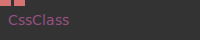

**Full Name:** `Ops.Html.CSS.CssClass`
**Description:** *Visit [documentation](https://cables.gl/op/Ops.Html.CSS.CssClass) for details*

**> Input Ports:**
- **CSS** (String): *See documentation*
- **Class Name** (String): *See documentation*

**< Output Ports:**
- *Visit [Ops.Html.CSS.CssClass documentation](https://cables.gl/op/Ops.Html.CSS.CssClass) for output port details*

**Example Patch:** [Open in Editor](https://cables.gl/op/Ops.Html.CSS.CssClass#example)
**Patches Using This Op:** *Search [cables.gl patches](https://cables.gl/patches) for "CssClass"*
**Docs:** [https://cables.gl/op/Ops.Html.CSS.CssClass](https://cables.gl/op/Ops.Html.CSS.CssClass)

---

### CssFile
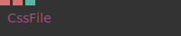

**Full Name:** `Ops.Html.CSS.CssFile`
**Description:** *Visit [documentation](https://cables.gl/op/Ops.Html.CSS.CssFile) for details*

**> Input Ports:**
- **CSS File** (String): *See documentation*
- **Media** (String): *See documentation*
- **Active** (Number: Boolean): *See documentation*

**< Output Ports:**
- *Visit [Ops.Html.CSS.CssFile documentation](https://cables.gl/op/Ops.Html.CSS.CssFile) for output port details*

**Example Patch:** [Open in Editor](https://cables.gl/op/Ops.Html.CSS.CssFile#example)
**Patches Using This Op:** *Search [cables.gl patches](https://cables.gl/patches) for "CssFile"*
**Docs:** [https://cables.gl/op/Ops.Html.CSS.CssFile](https://cables.gl/op/Ops.Html.CSS.CssFile)

---

### CSSFilter

**Full Name:** `Ops.Html.CSS.CSSFilter`
**Description:** *Visit [documentation](https://cables.gl/op/Ops.Html.CSS.CSSFilter) for details*

**> Input Ports:**
- **Element** (Object): *See documentation*
- **Method Index** (Number: Integer): *See documentation*
- **Value** (Number): *See documentation*

**< Output Ports:**
- *Visit [Ops.Html.CSS.CSSFilter documentation](https://cables.gl/op/Ops.Html.CSS.CSSFilter) for output port details*

**Example Patch:** [Open in Editor](https://cables.gl/op/Ops.Html.CSS.CSSFilter#example)
**Patches Using This Op:** *Search [cables.gl patches](https://cables.gl/patches) for "CSSFilter"*
**Docs:** [https://cables.gl/op/Ops.Html.CSS.CSSFilter](https://cables.gl/op/Ops.Html.CSS.CSSFilter)

---

### CSSProperty_v2

**Full Name:** `Ops.Html.CSS.CSSProperty_v2`
**Description:** *Visit [documentation](https://cables.gl/op/Ops.Html.CSS.CSSProperty_v2) for details*

**> Input Ports:**
- **Element** (Object): *See documentation*
- **Property** (String): *See documentation*
- **Value** (Number): *See documentation*
- **Value Suffix** (String): *See documentation*

**< Output Ports:**
- **HTML Element** (Object): *See documentation*

**Example Patch:** [Open in Editor](https://cables.gl/op/Ops.Html.CSS.CSSProperty_v2#example)
**Patches Using This Op:** *Search [cables.gl patches](https://cables.gl/patches) for "CSSProperty_v2"*
**Docs:** [https://cables.gl/op/Ops.Html.CSS.CSSProperty_v2](https://cables.gl/op/Ops.Html.CSS.CSSProperty_v2)

---

### CSSPropertyString

**Full Name:** `Ops.Html.CSS.CSSPropertyString`
**Description:** *Visit [documentation](https://cables.gl/op/Ops.Html.CSS.CSSPropertyString) for details*

**> Input Ports:**
- **Element** (Object): *See documentation*
- **Property** (String): *See documentation*
- **Value** (String): *See documentation*
- **Active** (Number: Boolean): *See documentation*

**< Output Ports:**
- **HTML Element** (Object): *See documentation*

**Example Patch:** [Open in Editor](https://cables.gl/op/Ops.Html.CSS.CSSPropertyString#example)
**Patches Using This Op:** *Search [cables.gl patches](https://cables.gl/patches) for "CSSPropertyString"*
**Docs:** [https://cables.gl/op/Ops.Html.CSS.CSSPropertyString](https://cables.gl/op/Ops.Html.CSS.CSSPropertyString)

---

### ElementClassList
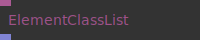

**Full Name:** `Ops.Html.CSS.ElementClassList`
**Description:** *Visit [documentation](https://cables.gl/op/Ops.Html.CSS.ElementClassList) for details*

**> Input Ports:**
- **HTML Element** (Object:Element): *See documentation*

**< Output Ports:**
- **Classes** (Array): *See documentation*

**Example Patch:** [Open in Editor](https://cables.gl/op/Ops.Html.CSS.ElementClassList#example)
**Patches Using This Op:** *Search [cables.gl patches](https://cables.gl/patches) for "ElementClassList"*
**Docs:** [https://cables.gl/op/Ops.Html.CSS.ElementClassList](https://cables.gl/op/Ops.Html.CSS.ElementClassList)

---

### ElementCss3DTransform

**Full Name:** `Ops.Html.CSS.ElementCss3DTransform`
**Description:** *Visit [documentation](https://cables.gl/op/Ops.Html.CSS.ElementCss3DTransform) for details*

**> Input Ports:**
- **Element** (Object): *See documentation*
- **X** (Number): *See documentation*
- **Y** (Number): *See documentation*
- **Z** (Number): *See documentation*
- **Rot X** (Number): *See documentation*
- **Rot Y** (Number): *See documentation*
- **Rot Z** (Number): *See documentation*
- **Perspective** (Number): *See documentation*
- **Backface-Visibility** (Number: Boolean): *See documentation*

**< Output Ports:**
- **HTML Element** (Object): *See documentation*

**Example Patch:** [Open in Editor](https://cables.gl/op/Ops.Html.CSS.ElementCss3DTransform#example)
**Patches Using This Op:** *Search [cables.gl patches](https://cables.gl/patches) for "ElementCss3DTransform"*
**Docs:** [https://cables.gl/op/Ops.Html.CSS.ElementCss3DTransform](https://cables.gl/op/Ops.Html.CSS.ElementCss3DTransform)

---

### ElementCssBorder
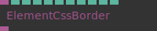

**Full Name:** `Ops.Html.CSS.ElementCssBorder`
**Description:** *Visit [documentation](https://cables.gl/op/Ops.Html.CSS.ElementCssBorder) for details*

**> Input Ports:**
- **Element** (Object): *See documentation*
- **Thickness** (Number): *See documentation*
- **Radius** (Number): *See documentation*
- **Color R** (Number): *See documentation*
- **Color G** (Number): *See documentation*
- **Color B** (Number): *See documentation*
- **Color A** (Number): *See documentation*
- **Top** (Number: Boolean): *See documentation*
- **Bottom** (Number: Boolean): *See documentation*
- **Left** (Number: Boolean): *See documentation*
- **Right** (Number: Boolean): *See documentation*

**< Output Ports:**
- **HTML Element** (Object): *See documentation*

**Example Patch:** [Open in Editor](https://cables.gl/op/Ops.Html.CSS.ElementCssBorder#example)
**Patches Using This Op:** *Search [cables.gl patches](https://cables.gl/patches) for "ElementCssBorder"*
**Docs:** [https://cables.gl/op/Ops.Html.CSS.ElementCssBorder](https://cables.gl/op/Ops.Html.CSS.ElementCssBorder)

---

### ElementCssColor
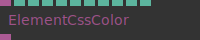

**Full Name:** `Ops.Html.CSS.ElementCssColor`
**Description:** *Visit [documentation](https://cables.gl/op/Ops.Html.CSS.ElementCssColor) for details*

**> Input Ports:**
- **Element** (Object:Element): *See documentation*
- **Set Color** (Number: Boolean): *See documentation*
- **Color R** (Number): *See documentation*
- **Color G** (Number): *See documentation*
- **Color B** (Number): *See documentation*
- **Color A** (Number): *See documentation*
- **Set Background** (Number: Boolean): *See documentation*
- **Background Color R** (Number): *See documentation*
- **Background Color G** (Number): *See documentation*
- **Background Color B** (Number): *See documentation*
- **Background Color A** (Number): *See documentation*

**< Output Ports:**
- **HTML Element** (Object): *See documentation*

**Example Patch:** [Open in Editor](https://cables.gl/op/Ops.Html.CSS.ElementCssColor#example)
**Patches Using This Op:** *Search [cables.gl patches](https://cables.gl/patches) for "ElementCssColor"*
**Docs:** [https://cables.gl/op/Ops.Html.CSS.ElementCssColor](https://cables.gl/op/Ops.Html.CSS.ElementCssColor)

---

### ElementCssPadding_v2
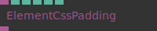

**Full Name:** `Ops.Html.CSS.ElementCssPadding_v2`
**Description:** *Visit [documentation](https://cables.gl/op/Ops.Html.CSS.ElementCssPadding_v2) for details*

**> Input Ports:**
- **Element** (Object:Element): *See documentation*
- **Padding** (Number): *See documentation*
- **Padding Top** (Number): *See documentation*
- **Padding Bottom** (Number): *See documentation*
- **Padding Left** (Number): *See documentation*
- **Padding Right** (Number): *See documentation*

**< Output Ports:**
- **HTML Element** (Object): *See documentation*

**Example Patch:** [Open in Editor](https://cables.gl/op/Ops.Html.CSS.ElementCssPadding_v2#example)
**Patches Using This Op:** *Search [cables.gl patches](https://cables.gl/patches) for "ElementCssPadding_v2"*
**Docs:** [https://cables.gl/op/Ops.Html.CSS.ElementCssPadding_v2](https://cables.gl/op/Ops.Html.CSS.ElementCssPadding_v2)

---

### ElementCssShadow
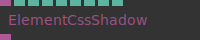

**Full Name:** `Ops.Html.CSS.ElementCssShadow`
**Description:** *Visit [documentation](https://cables.gl/op/Ops.Html.CSS.ElementCssShadow) for details*

**> Input Ports:**
- **Element** (Object): *See documentation*
- **X** (Number): *See documentation*
- **Y** (Number): *See documentation*
- **Blur** (Number): *See documentation*
- **Color R** (Number): *See documentation*
- **Color G** (Number): *See documentation*
- **Color B** (Number): *See documentation*
- **Color A** (Number): *See documentation*

**< Output Ports:**
- **HTML Element** (Object): *See documentation*

**Example Patch:** [Open in Editor](https://cables.gl/op/Ops.Html.CSS.ElementCssShadow#example)
**Patches Using This Op:** *Search [cables.gl patches](https://cables.gl/patches) for "ElementCssShadow"*
**Docs:** [https://cables.gl/op/Ops.Html.CSS.ElementCssShadow](https://cables.gl/op/Ops.Html.CSS.ElementCssShadow)

---

### ElementCssSize
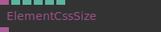

**Full Name:** `Ops.Html.CSS.ElementCssSize`
**Description:** *Visit [documentation](https://cables.gl/op/Ops.Html.CSS.ElementCssSize) for details*

**> Input Ports:**
- **Element** (Object): *See documentation*
- **Width** (Number): *See documentation*
- **Height** (Number): *See documentation*
- **Aspect** (Number): *See documentation*

**< Output Ports:**
- **HTML Element** (Object): *See documentation*

**Example Patch:** [Open in Editor](https://cables.gl/op/Ops.Html.CSS.ElementCssSize#example)
**Patches Using This Op:** *Search [cables.gl patches](https://cables.gl/patches) for "ElementCssSize"*
**Docs:** [https://cables.gl/op/Ops.Html.CSS.ElementCssSize](https://cables.gl/op/Ops.Html.CSS.ElementCssSize)

---

### ElementCssText

**Full Name:** `Ops.Html.CSS.ElementCssText`
**Description:** *Visit [documentation](https://cables.gl/op/Ops.Html.CSS.ElementCssText) for details*

**> Input Ports:**
- **Element** (Object:Element): *See documentation*
- **Font Family** (String): *See documentation*
- **Text Size** (Number): *See documentation*
- **Font Weight** (String): *See documentation*
- **Overflow Ellipsis** (Number: Boolean): *See documentation*
- **Letter Spacing** (Number): *See documentation*
- **Line Height** (Number): *See documentation*
- **Disable Text Select** (Number: Boolean): *See documentation*

**< Output Ports:**
- **HTML Element** (Object): *See documentation*

**Example Patch:** [Open in Editor](https://cables.gl/op/Ops.Html.CSS.ElementCssText#example)
**Patches Using This Op:** *Search [cables.gl patches](https://cables.gl/patches) for "ElementCssText"*
**Docs:** [https://cables.gl/op/Ops.Html.CSS.ElementCssText](https://cables.gl/op/Ops.Html.CSS.ElementCssText)

---

### ElementCssTransform_v2
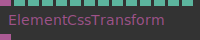

**Full Name:** `Ops.Html.CSS.ElementCssTransform_v2`
**Description:** *Visit [documentation](https://cables.gl/op/Ops.Html.CSS.ElementCssTransform_v2) for details*

**> Input Ports:**
- **Element** (Object:Element): *See documentation*
- **Translate Active** (Number: Boolean): *See documentation*
- **Translate X** (Number): *See documentation*
- **Translate Y** (Number): *See documentation*
- **Scale Active** (Number: Boolean): *See documentation*
- **Scale** (Number): *See documentation*
- **Rotate Active** (Number: Boolean): *See documentation*
- **Rot Z** (Number): *See documentation*
- **Set Origin** (Number: Boolean): *See documentation*
- **Z Index Active** (Number: Boolean): *See documentation*
- **Z Index** (Number): *See documentation*

**< Output Ports:**
- **Passthrough** (Object): *See documentation*

**Example Patch:** [Open in Editor](https://cables.gl/op/Ops.Html.CSS.ElementCssTransform_v2#example)
**Patches Using This Op:** *Search [cables.gl patches](https://cables.gl/patches) for "ElementCssTransform_v2"*
**Docs:** [https://cables.gl/op/Ops.Html.CSS.ElementCssTransform_v2](https://cables.gl/op/Ops.Html.CSS.ElementCssTransform_v2)

---

### ElmentCssScrollbar

**Full Name:** `Ops.Html.CSS.ElmentCssScrollbar`
**Description:** *Visit [documentation](https://cables.gl/op/Ops.Html.CSS.ElmentCssScrollbar) for details*

**> Input Ports:**
- **Element** (Object:Element): *See documentation*
- **Thin** (Number: Boolean): *See documentation*
- **Set Color** (Number: Boolean): *See documentation*
- **Color R** (Number): *See documentation*
- **Color G** (Number): *See documentation*
- **Color B** (Number): *See documentation*
- **Color A** (Number): *See documentation*
- **Background R** (Number): *See documentation*
- **Background G** (Number): *See documentation*
- **Background B** (Number): *See documentation*
- **Background A** (Number): *See documentation*

**< Output Ports:**
- **HTML Element** (Object): *See documentation*

**Example Patch:** [Open in Editor](https://cables.gl/op/Ops.Html.CSS.ElmentCssScrollbar#example)
**Patches Using This Op:** *Search [cables.gl patches](https://cables.gl/patches) for "ElmentCssScrollbar"*
**Docs:** [https://cables.gl/op/Ops.Html.CSS.ElmentCssScrollbar](https://cables.gl/op/Ops.Html.CSS.ElmentCssScrollbar)

---

### GetCssVariable

**Full Name:** `Ops.Html.CSS.GetCssVariable`
**Description:** *Visit [documentation](https://cables.gl/op/Ops.Html.CSS.GetCssVariable) for details*

**> Input Ports:**
- **Update** (Trigger): *See documentation*
- **Var Name** (String): *See documentation*

**< Output Ports:**
- **Result** (String): *See documentation*

**Example Patch:** [Open in Editor](https://cables.gl/op/Ops.Html.CSS.GetCssVariable#example)
**Patches Using This Op:** *Search [cables.gl patches](https://cables.gl/patches) for "GetCssVariable"*
**Docs:** [https://cables.gl/op/Ops.Html.CSS.GetCssVariable](https://cables.gl/op/Ops.Html.CSS.GetCssVariable)

---

### SetCssVariableColor
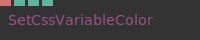

**Full Name:** `Ops.Html.CSS.SetCssVariableColor`
**Description:** *Visit [documentation](https://cables.gl/op/Ops.Html.CSS.SetCssVariableColor) for details*

**> Input Ports:**
- **Var Name** (String): *See documentation*
- **R** (Number): *See documentation*
- **G** (Number): *See documentation*
- **B** (Number): *See documentation*

**< Output Ports:**
- *Visit [Ops.Html.CSS.SetCssVariableColor documentation](https://cables.gl/op/Ops.Html.CSS.SetCssVariableColor) for output port details*

**Example Patch:** [Open in Editor](https://cables.gl/op/Ops.Html.CSS.SetCssVariableColor#example)
**Patches Using This Op:** *Search [cables.gl patches](https://cables.gl/patches) for "SetCssVariableColor"*
**Docs:** [https://cables.gl/op/Ops.Html.CSS.SetCssVariableColor](https://cables.gl/op/Ops.Html.CSS.SetCssVariableColor)

---

### SetCssVariableNumber
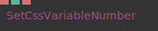

**Full Name:** `Ops.Html.CSS.SetCssVariableNumber`
**Description:** *Visit [documentation](https://cables.gl/op/Ops.Html.CSS.SetCssVariableNumber) for details*

**> Input Ports:**
- **Var Name** (String): *See documentation*
- **Value** (Number): *See documentation*
- **Suffix** (String): *See documentation*

**< Output Ports:**
- *Visit [Ops.Html.CSS.SetCssVariableNumber documentation](https://cables.gl/op/Ops.Html.CSS.SetCssVariableNumber) for output port details*

**Example Patch:** [Open in Editor](https://cables.gl/op/Ops.Html.CSS.SetCssVariableNumber#example)
**Patches Using This Op:** *Search [cables.gl patches](https://cables.gl/patches) for "SetCssVariableNumber"*
**Docs:** [https://cables.gl/op/Ops.Html.CSS.SetCssVariableNumber](https://cables.gl/op/Ops.Html.CSS.SetCssVariableNumber)

---

### SetCssVariableString
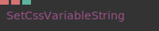

**Full Name:** `Ops.Html.CSS.SetCssVariableString`
**Description:** *Visit [documentation](https://cables.gl/op/Ops.Html.CSS.SetCssVariableString) for details*

**> Input Ports:**
- **Var Name** (String): *See documentation*
- **Value** (String): *See documentation*
- **Output Quoted String** (Number: Boolean): *See documentation*

**< Output Ports:**
- *Visit [Ops.Html.CSS.SetCssVariableString documentation](https://cables.gl/op/Ops.Html.CSS.SetCssVariableString) for output port details*

**Example Patch:** [Open in Editor](https://cables.gl/op/Ops.Html.CSS.SetCssVariableString#example)
**Patches Using This Op:** *Search [cables.gl patches](https://cables.gl/patches) for "SetCssVariableString"*
**Docs:** [https://cables.gl/op/Ops.Html.CSS.SetCssVariableString](https://cables.gl/op/Ops.Html.CSS.SetCssVariableString)

---

### SetCssVariableUrl
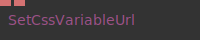

**Full Name:** `Ops.Html.CSS.SetCssVariableUrl`
**Description:** *Visit [documentation](https://cables.gl/op/Ops.Html.CSS.SetCssVariableUrl) for details*

**> Input Ports:**
- **Var Name** (String): *See documentation*
- **Value** (String): *See documentation*

**< Output Ports:**
- *Visit [Ops.Html.CSS.SetCssVariableUrl documentation](https://cables.gl/op/Ops.Html.CSS.SetCssVariableUrl) for output port details*

**Example Patch:** [Open in Editor](https://cables.gl/op/Ops.Html.CSS.SetCssVariableUrl#example)
**Patches Using This Op:** *Search [cables.gl patches](https://cables.gl/patches) for "SetCssVariableUrl"*
**Docs:** [https://cables.gl/op/Ops.Html.CSS.SetCssVariableUrl](https://cables.gl/op/Ops.Html.CSS.SetCssVariableUrl)

---

### SwitchClass
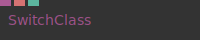

**Full Name:** `Ops.Html.CSS.SwitchClass`
**Description:** *Visit [documentation](https://cables.gl/op/Ops.Html.CSS.SwitchClass) for details*

**> Input Ports:**
- **HTML Element** (Object): *See documentation*
- **Classname** (String): *See documentation*
- **Active** (Number: Boolean): *See documentation*

**< Output Ports:**
- *Visit [Ops.Html.CSS.SwitchClass documentation](https://cables.gl/op/Ops.Html.CSS.SwitchClass) for output port details*

**Example Patch:** [Open in Editor](https://cables.gl/op/Ops.Html.CSS.SwitchClass#example)
**Patches Using This Op:** *Search [cables.gl patches](https://cables.gl/patches) for "SwitchClass"*
**Docs:** [https://cables.gl/op/Ops.Html.CSS.SwitchClass](https://cables.gl/op/Ops.Html.CSS.SwitchClass)

---

### TransformCSS3DElement
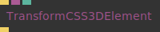

**Full Name:** `Ops.Html.CSS.TransformCSS3DElement`
**Description:** *Visit [documentation](https://cables.gl/op/Ops.Html.CSS.TransformCSS3DElement) for details*

**> Input Ports:**
- **Trigger** (Trigger): *See documentation*
- **DOMElement** (Object): *See documentation*
- **Origin Index** (Number: Integer): *See documentation*

**< Output Ports:**
- **Next** (Trigger): *See documentation*

**Example Patch:** [Open in Editor](https://cables.gl/op/Ops.Html.CSS.TransformCSS3DElement#example)
**Patches Using This Op:** *Search [cables.gl patches](https://cables.gl/patches) for "TransformCSS3DElement"*
**Docs:** [https://cables.gl/op/Ops.Html.CSS.TransformCSS3DElement](https://cables.gl/op/Ops.Html.CSS.TransformCSS3DElement)

---

### TransformElement
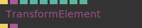

**Full Name:** `Ops.Html.CSS.TransformElement`
**Description:** *Visit [documentation](https://cables.gl/op/Ops.Html.CSS.TransformElement) for details*

**> Input Ports:**
- **Exec** (Trigger): *See documentation*
- **Element** (Object): *See documentation*
- **Scale** (Number): *See documentation*
- **Orthogonal** (Number: Boolean): *See documentation*
- **Rotate** (Number): *See documentation*
- **Hide Out Of View** (Number: Boolean): *See documentation*
- **Active** (Number: Boolean): *See documentation*

**< Output Ports:**
- **Next** (Trigger): *See documentation*
- **HTML Element** (Object): *See documentation*

**Example Patch:** [Open in Editor](https://cables.gl/op/Ops.Html.CSS.TransformElement#example)
**Patches Using This Op:** *Search [cables.gl patches](https://cables.gl/patches) for "TransformElement"*
**Docs:** [https://cables.gl/op/Ops.Html.CSS.TransformElement](https://cables.gl/op/Ops.Html.CSS.TransformElement)

---

## Ops.Html.Css

### ElementBackDropFilter

**Full Name:** `Ops.Html.Css.ElementBackDropFilter`
**Description:** *Visit [documentation](https://cables.gl/op/Ops.Html.Css.ElementBackDropFilter) for details*

**> Input Ports:**
- **Element** (Object): *See documentation*
- **Blur** (Number): *See documentation*
- **Contrast** (Number): *See documentation*
- **Brightness** (Number): *See documentation*
- **Hue** (Number): *See documentation*
- **Invert** (Number): *See documentation*
- **Saturate** (Number): *See documentation*
- **Sepia** (Number): *See documentation*

**< Output Ports:**
- **HTML Element** (Object): *See documentation*

**Example Patch:** [Open in Editor](https://cables.gl/op/Ops.Html.Css.ElementBackDropFilter#example)
**Patches Using This Op:** *Search [cables.gl patches](https://cables.gl/patches) for "ElementBackDropFilter"*
**Docs:** [https://cables.gl/op/Ops.Html.Css.ElementBackDropFilter](https://cables.gl/op/Ops.Html.Css.ElementBackDropFilter)

---

### ElementMargin

**Full Name:** `Ops.Html.Css.ElementMargin`
**Description:** *Visit [documentation](https://cables.gl/op/Ops.Html.Css.ElementMargin) for details*

**> Input Ports:**
- **Element** (Object:Element): *See documentation*
- **Margin** (Number): *See documentation*
- **Margin Top** (Number): *See documentation*
- **Margin Bottom** (Number): *See documentation*
- **Margin Left** (Number): *See documentation*
- **Margin Right** (Number): *See documentation*

**< Output Ports:**
- **HTML Element** (Object): *See documentation*

**Example Patch:** [Open in Editor](https://cables.gl/op/Ops.Html.Css.ElementMargin#example)
**Patches Using This Op:** *Search [cables.gl patches](https://cables.gl/patches) for "ElementMargin"*
**Docs:** [https://cables.gl/op/Ops.Html.Css.ElementMargin](https://cables.gl/op/Ops.Html.Css.ElementMargin)

---

## Ops.Html.Elements

### AudioMediaElement

**Full Name:** `Ops.Html.Elements.AudioMediaElement`
**Description:** *Visit [documentation](https://cables.gl/op/Ops.Html.Elements.AudioMediaElement) for details*

**> Input Ports:**
- **File** (String): *See documentation*
- **Play** (Number: Boolean): *See documentation*
- **Volume** (Number): *See documentation*
- **Loop** (Number: Boolean): *See documentation*

**< Output Ports:**
- **Playing** (Number): *See documentation*
- **Element** (Object): *See documentation*
- **Has Ended** (Trigger): *See documentation*

**Example Patch:** [Open in Editor](https://cables.gl/op/Ops.Html.Elements.AudioMediaElement#example)
**Patches Using This Op:** *Search [cables.gl patches](https://cables.gl/patches) for "AudioMediaElement"*
**Docs:** [https://cables.gl/op/Ops.Html.Elements.AudioMediaElement](https://cables.gl/op/Ops.Html.Elements.AudioMediaElement)

---

### Element_v2

**Full Name:** `Ops.Html.Elements.Element_v2`
**Description:** *Visit [documentation](https://cables.gl/op/Ops.Html.Elements.Element_v2) for details*

**> Input Ports:**
- **Text** (String): *See documentation*
- **Set Size** (Number: Boolean): *See documentation*
- **Width** (Number): *See documentation*
- **Height** (Number): *See documentation*
- **Inline Style** (String): *See documentation*
- **CSS Class** (String): *See documentation*
- **Disable CSS Props** (String): *See documentation*
- **Display Index** (Number: Integer): *See documentation*
- **Tag Name** (String): *See documentation*
- **Opacity** (Number): *See documentation*
- **Propagate Click-Events** (Number: Boolean): *See documentation*
- **Add To DOM** (Number: Boolean): *See documentation*

**< Output Ports:**
- **DOM Element** (Object): *See documentation*
- **Hovering** (booleanNumber): *See documentation*
- **Clicked** (Trigger): *See documentation*

**Example Patch:** [Open in Editor](https://cables.gl/op/Ops.Html.Elements.Element_v2#example)
**Patches Using This Op:** *Search [cables.gl patches](https://cables.gl/patches) for "Element_v2"*
**Docs:** [https://cables.gl/op/Ops.Html.Elements.Element_v2](https://cables.gl/op/Ops.Html.Elements.Element_v2)

---

### IFrame_v3

**Full Name:** `Ops.Html.Elements.IFrame_v3`
**Description:** *Visit [documentation](https://cables.gl/op/Ops.Html.Elements.IFrame_v3) for details*

**> Input Ports:**
- **URL** (String): *See documentation*
- **ID** (String): *See documentation*
- **Active** (Number: Boolean): *See documentation*
- **Style** (String): *See documentation*

**< Output Ports:**
- **Element** (Object): *See documentation*

**Example Patch:** [Open in Editor](https://cables.gl/op/Ops.Html.Elements.IFrame_v3#example)
**Patches Using This Op:** *Search [cables.gl patches](https://cables.gl/patches) for "IFrame_v3"*
**Docs:** [https://cables.gl/op/Ops.Html.Elements.IFrame_v3](https://cables.gl/op/Ops.Html.Elements.IFrame_v3)

---

### ImageElement_v3

**Full Name:** `Ops.Html.Elements.ImageElement_v3`
**Description:** *Visit [documentation](https://cables.gl/op/Ops.Html.Elements.ImageElement_v3) for details*

**> Input Ports:**
- **File** (String): *See documentation*
- **Class** (String): *See documentation*
- **Style** (String): *See documentation*
- **Alt Text** (String): *See documentation*

**< Output Ports:**
- **Image Element** (Object): *See documentation*
- **Width** (Number): *See documentation*
- **Height** (Number): *See documentation*
- **Loading** (booleanNumber): *See documentation*
- **Error** (booleanNumber): *See documentation*
- **Loaded** (Trigger): *See documentation*

**Example Patch:** [Open in Editor](https://cables.gl/op/Ops.Html.Elements.ImageElement_v3#example)
**Patches Using This Op:** *Search [cables.gl patches](https://cables.gl/patches) for "ImageElement_v3"*
**Docs:** [https://cables.gl/op/Ops.Html.Elements.ImageElement_v3](https://cables.gl/op/Ops.Html.Elements.ImageElement_v3)

---

### InputElement

**Full Name:** `Ops.Html.Elements.InputElement`
**Description:** *Visit [documentation](https://cables.gl/op/Ops.Html.Elements.InputElement) for details*

**> Input Ports:**
- **Default Value** (String): *See documentation*
- **Placeholder** (String): *See documentation*
- **Id** (String): *See documentation*
- **Class** (String): *See documentation*
- **Style** (String): *See documentation*
- **Autocomplete** (Number: Boolean): *See documentation*
- **Max Length** (Number: Integer): *See documentation*
- **Enter Key Prevent Default** (Number: Boolean): *See documentation*
- **Visible** (Number: Boolean): *See documentation*
- **Focus** (Trigger): *See documentation*
- **Blur** (Trigger): *See documentation*
- **Clear** (Trigger): *See documentation*
- **Select** (Trigger): *See documentation*

**< Output Ports:**
- **DOM Element** (Object): *See documentation*
- **Value** (String): *See documentation*
- **Hover** (booleanNumber): *See documentation*
- **Enter Pressed** (Trigger): *See documentation*
- **Escape Pressed** (Trigger): *See documentation*

**Example Patch:** [Open in Editor](https://cables.gl/op/Ops.Html.Elements.InputElement#example)
**Patches Using This Op:** *Search [cables.gl patches](https://cables.gl/patches) for "InputElement"*
**Docs:** [https://cables.gl/op/Ops.Html.Elements.InputElement](https://cables.gl/op/Ops.Html.Elements.InputElement)

---

### VideoElement

**Full Name:** `Ops.Html.Elements.VideoElement`
**Description:** *Visit [documentation](https://cables.gl/op/Ops.Html.Elements.VideoElement) for details*

**> Input Ports:**
- **File** (String): *See documentation*
- **ID** (String): *See documentation*
- **Play** (Number: Boolean): *See documentation*
- **Autoplay** (Number: Boolean): *See documentation*
- **Controls** (Number: Boolean): *See documentation*
- **Active** (Number: Boolean): *See documentation*
- **Loop** (Number: Boolean): *See documentation*
- **Muted** (Number: Boolean): *See documentation*
- **Style** (String): *See documentation*
- **Rewind** (Trigger): *See documentation*

**< Output Ports:**
- **Element** (Object): *See documentation*
- **Playing** (booleanNumber): *See documentation*
- **Can Play Through** (booleanNumber): *See documentation*
- **Time** (Number): *See documentation*
- **Ended** (Trigger): *See documentation*
- **Has Error** (booleanNumber): *See documentation*
- **Error Message** (String): *See documentation*
- **Video Width** (Number): *See documentation*
- **Video Height** (Number): *See documentation*

**Example Patch:** [Open in Editor](https://cables.gl/op/Ops.Html.Elements.VideoElement#example)
**Patches Using This Op:** *Search [cables.gl patches](https://cables.gl/patches) for "VideoElement"*
**Docs:** [https://cables.gl/op/Ops.Html.Elements.VideoElement](https://cables.gl/op/Ops.Html.Elements.VideoElement)

---

## Ops.Html.Event

### ElementEventListener_v2

**Full Name:** `Ops.Html.Event.ElementEventListener_v2`
**Description:** *Visit [documentation](https://cables.gl/op/Ops.Html.Event.ElementEventListener_v2) for details*

**> Input Ports:**
- **Element** (Object): *See documentation*
- **Event Name** (String): *See documentation*
- **Use Capture** (Number: Boolean): *See documentation*
- **Prevent Default** (Number: Boolean): *See documentation*
- **Stop Propagation** (Number: Boolean): *See documentation*

**< Output Ports:**
- **Element Passthrough** (Object): *See documentation*
- **Event Trigger** (Trigger): *See documentation*
- **Event Object** (Object): *See documentation*

**Example Patch:** [Open in Editor](https://cables.gl/op/Ops.Html.Event.ElementEventListener_v2#example)
**Patches Using This Op:** *Search [cables.gl patches](https://cables.gl/patches) for "ElementEventListener_v2"*
**Docs:** [https://cables.gl/op/Ops.Html.Event.ElementEventListener_v2](https://cables.gl/op/Ops.Html.Event.ElementEventListener_v2)

---

### ElementPointerEvents

**Full Name:** `Ops.Html.Event.ElementPointerEvents`
**Description:** *Visit [documentation](https://cables.gl/op/Ops.Html.Event.ElementPointerEvents) for details*

**> Input Ports:**
- **Dom Element** (Object): *See documentation*
- **Mouse Down Active** (Number: Boolean): *See documentation*
- **Mouse Up Active** (Number: Boolean): *See documentation*
- **Click Active** (Number: Boolean): *See documentation*
- **Mouse Move Active** (Number: Boolean): *See documentation*
- **Touch Start Active** (Number: Boolean): *See documentation*
- **Touch Move Active** (Number: Boolean): *See documentation*
- **Touch End Active** (Number: Boolean): *See documentation*
- **Touch Cancel Active** (Number: Boolean): *See documentation*

**< Output Ports:**
- **Event Object** (Object): *See documentation*
- **Mouse Down** (Trigger): *See documentation*
- **Mouse Up** (Trigger): *See documentation*
- **Click** (Trigger): *See documentation*
- **Mouse Move** (Trigger): *See documentation*
- **Touch Start** (Trigger): *See documentation*
- **Touch Move** (Trigger): *See documentation*
- **Touch End** (Trigger): *See documentation*
- **Touch Cancel** (Trigger): *See documentation*
- **Event Name** (Number): *See documentation*

**Example Patch:** [Open in Editor](https://cables.gl/op/Ops.Html.Event.ElementPointerEvents#example)
**Patches Using This Op:** *Search [cables.gl patches](https://cables.gl/patches) for "ElementPointerEvents"*
**Docs:** [https://cables.gl/op/Ops.Html.Event.ElementPointerEvents](https://cables.gl/op/Ops.Html.Event.ElementPointerEvents)

---

### ElementsArrayEventListener

**Full Name:** `Ops.Html.Event.ElementsArrayEventListener`
**Description:** *Visit [documentation](https://cables.gl/op/Ops.Html.Event.ElementsArrayEventListener) for details*

**> Input Ports:**
- **Elements** (Array): *See documentation*
- **Event Name** (String): *See documentation*
- **Use Capture** (Number: Boolean): *See documentation*
- **Prevent Default** (Number: Boolean): *See documentation*
- **Stop Propagation** (Number: Boolean): *See documentation*

**< Output Ports:**
- **Event Trigger** (Trigger): *See documentation*
- **Index** (Number): *See documentation*
- **Event Object** (Object): *See documentation*
- **Event Element** (Object): *See documentation*

**Example Patch:** [Open in Editor](https://cables.gl/op/Ops.Html.Event.ElementsArrayEventListener#example)
**Patches Using This Op:** *Search [cables.gl patches](https://cables.gl/patches) for "ElementsArrayEventListener"*
**Docs:** [https://cables.gl/op/Ops.Html.Event.ElementsArrayEventListener](https://cables.gl/op/Ops.Html.Event.ElementsArrayEventListener)

---

### PreventDefault

**Full Name:** `Ops.Html.Event.PreventDefault`
**Description:** *Visit [documentation](https://cables.gl/op/Ops.Html.Event.PreventDefault) for details*

**> Input Ports:**
- **Execute** (Trigger): *See documentation*
- **Event In** (Object): *See documentation*

**< Output Ports:**
- **Next** (Trigger): *See documentation*
- **Event Out** (Object): *See documentation*

**Example Patch:** [Open in Editor](https://cables.gl/op/Ops.Html.Event.PreventDefault#example)
**Patches Using This Op:** *Search [cables.gl patches](https://cables.gl/patches) for "PreventDefault"*
**Docs:** [https://cables.gl/op/Ops.Html.Event.PreventDefault](https://cables.gl/op/Ops.Html.Event.PreventDefault)

---

### StopPropagation

**Full Name:** `Ops.Html.Event.StopPropagation`
**Description:** *Visit [documentation](https://cables.gl/op/Ops.Html.Event.StopPropagation) for details*

**> Input Ports:**
- **Execute** (Trigger): *See documentation*
- **Event In** (Object): *See documentation*

**< Output Ports:**
- **Next** (Trigger): *See documentation*
- **Event Out** (Object): *See documentation*

**Example Patch:** [Open in Editor](https://cables.gl/op/Ops.Html.Event.StopPropagation#example)
**Patches Using This Op:** *Search [cables.gl patches](https://cables.gl/patches) for "StopPropagation"*
**Docs:** [https://cables.gl/op/Ops.Html.Event.StopPropagation](https://cables.gl/op/Ops.Html.Event.StopPropagation)

---

## Ops.Html.Utils

### CablesLink

**Full Name:** `Ops.Html.Utils.CablesLink`
**Description:** *Visit [documentation](https://cables.gl/op/Ops.Html.Utils.CablesLink) for details*

**> Input Ports:**
- **Size** (Number): *See documentation*
- **Opacity** (Number): *See documentation*

**< Output Ports:**
- *Visit [Ops.Html.Utils.CablesLink documentation](https://cables.gl/op/Ops.Html.Utils.CablesLink) for output port details*

**Example Patch:** [Open in Editor](https://cables.gl/op/Ops.Html.Utils.CablesLink#example)
**Patches Using This Op:** *Search [cables.gl patches](https://cables.gl/patches) for "CablesLink"*
**Docs:** [https://cables.gl/op/Ops.Html.Utils.CablesLink](https://cables.gl/op/Ops.Html.Utils.CablesLink)

---

### LoadingIndicator_v2

**Full Name:** `Ops.Html.Utils.LoadingIndicator_v2`
**Description:** *Visit [documentation](https://cables.gl/op/Ops.Html.Utils.LoadingIndicator_v2) for details*

**> Input Ports:**
- **Center Position** (Number: Boolean): *See documentation*

**< Output Ports:**
- **Elment** (Object): *See documentation*
- **Requests** (Array): *See documentation*

**Example Patch:** [Open in Editor](https://cables.gl/op/Ops.Html.Utils.LoadingIndicator_v2#example)
**Patches Using This Op:** *Search [cables.gl patches](https://cables.gl/patches) for "LoadingIndicator_v2"*
**Docs:** [https://cables.gl/op/Ops.Html.Utils.LoadingIndicator_v2](https://cables.gl/op/Ops.Html.Utils.LoadingIndicator_v2)

---

### Notification

**Full Name:** `Ops.Html.Utils.Notification`
**Description:** *Visit [documentation](https://cables.gl/op/Ops.Html.Utils.Notification) for details*

**> Input Ports:**
- **Trigger Animation** (Trigger): *See documentation*
- **Text** (String): *See documentation*
- **Class** (String): *See documentation*
- **Style** (String): *See documentation*
- **Active** (Number: Boolean): *See documentation*
- **Convert Line Breaks** (Number: Boolean): *See documentation*
- **Fade In** (Number): *See documentation*
- **Hold** (Number): *See documentation*
- **Fade Out** (Number): *See documentation*
- **Mode Index** (Number: Integer): *See documentation*
- **Side Index** (Number: Integer): *See documentation*
- **Starting Position** (Number): *See documentation*
- **Ending Position** (Number): *See documentation*

**< Output Ports:**
- **Finished Trigger** (Trigger): *See documentation*
- **Finished** (booleanNumber): *See documentation*
- **DOM Element** (Object): *See documentation*

**Example Patch:** [Open in Editor](https://cables.gl/op/Ops.Html.Utils.Notification#example)
**Patches Using This Op:** *Search [cables.gl patches](https://cables.gl/patches) for "Notification"*
**Docs:** [https://cables.gl/op/Ops.Html.Utils.Notification](https://cables.gl/op/Ops.Html.Utils.Notification)

---

### PlayButton

**Full Name:** `Ops.Html.Utils.PlayButton`
**Description:** *Visit [documentation](https://cables.gl/op/Ops.Html.Utils.PlayButton) for details*

**> Input Ports:**
- **Trigger** (Trigger): *See documentation*
- **Only If Audio Suspended** (Number: Boolean): *See documentation*
- **Reset** (Trigger): *See documentation*
- **Style Outer** (String): *See documentation*
- **Style Inner** (String): *See documentation*
- **Active** (Number: Boolean): *See documentation*

**< Output Ports:**
- **Next** (Trigger): *See documentation*
- **Not Clicked** (Trigger): *See documentation*
- **Audiocontext State** (String): *See documentation*
- **Element** (Object): *See documentation*
- **Clicked** (booleanNumber): *See documentation*
- **Clicked Trigger** (Trigger): *See documentation*

**Example Patch:** [Open in Editor](https://cables.gl/op/Ops.Html.Utils.PlayButton#example)
**Patches Using This Op:** *Search [cables.gl patches](https://cables.gl/patches) for "PlayButton"*
**Docs:** [https://cables.gl/op/Ops.Html.Utils.PlayButton](https://cables.gl/op/Ops.Html.Utils.PlayButton)

---

### PlayerControlPanel_v2

**Full Name:** `Ops.Html.Utils.PlayerControlPanel_v2`
**Description:** *Visit [documentation](https://cables.gl/op/Ops.Html.Utils.PlayerControlPanel_v2) for details*

**> Input Ports:**
- **Length** (Number): *See documentation*
- **Current** (Number): *See documentation*
- **Clamp** (Number: Boolean): *See documentation*
- **Is Playing** (Number: Boolean): *See documentation*
- **Visible** (Number: Boolean): *See documentation*
- **Show Time** (Number: Boolean): *See documentation*
- **Show Skip Buttons** (Number: Boolean): *See documentation*

**< Output Ports:**
- **Play Clicked** (Trigger): *See documentation*
- **Pause Clicked** (Trigger): *See documentation*
- **Rewind Clicked** (Trigger): *See documentation*
- **Skip Back Clicked** (Trigger): *See documentation*
- **Skip Forward Clicked** (Trigger): *See documentation*
- **Dragged** (Trigger): *See documentation*
- **Current Value** (Number): *See documentation*
- **Dragging** (booleanNumber): *See documentation*
- **DOM Element** (Object): *See documentation*

**Example Patch:** [Open in Editor](https://cables.gl/op/Ops.Html.Utils.PlayerControlPanel_v2#example)
**Patches Using This Op:** *Search [cables.gl patches](https://cables.gl/patches) for "PlayerControlPanel_v2"*
**Docs:** [https://cables.gl/op/Ops.Html.Utils.PlayerControlPanel_v2](https://cables.gl/op/Ops.Html.Utils.PlayerControlPanel_v2)

---

### QrCode

**Full Name:** `Ops.Html.Utils.QrCode`
**Description:** *Visit [documentation](https://cables.gl/op/Ops.Html.Utils.QrCode) for details*

**> Input Ports:**
- **Text** (String): *See documentation*

**< Output Ports:**
- **Image DataUrl** (String): *See documentation*
- **Element** (Object): *See documentation*

**Example Patch:** [Open in Editor](https://cables.gl/op/Ops.Html.Utils.QrCode#example)
**Patches Using This Op:** *Search [cables.gl patches](https://cables.gl/patches) for "QrCode"*
**Docs:** [https://cables.gl/op/Ops.Html.Utils.QrCode](https://cables.gl/op/Ops.Html.Utils.QrCode)

---

### YoutubePlayer

**Full Name:** `Ops.Html.Utils.YoutubePlayer`
**Description:** *Visit [documentation](https://cables.gl/op/Ops.Html.Utils.YoutubePlayer) for details*

**> Input Ports:**
- **Video Id** (String): *See documentation*
- **Active** (Number: Boolean): *See documentation*
- **Style** (String): *See documentation*
- **ElementID** (String): *See documentation*
- **Autoplay** (Number: Boolean): *See documentation*
- **Display Captions** (Number: Boolean): *See documentation*
- **Loop** (Number: Boolean): *See documentation*
- **Allow Fullscreen** (Number: Boolean): *See documentation*
- **Hide Controls** (Number: Boolean): *See documentation*
- **Start At Second** (Number: Integer): *See documentation*

**< Output Ports:**
- **Element** (Object): *See documentation*
- **Direct Link** (String): *See documentation*

**Example Patch:** [Open in Editor](https://cables.gl/op/Ops.Html.Utils.YoutubePlayer#example)
**Patches Using This Op:** *Search [cables.gl patches](https://cables.gl/patches) for "YoutubePlayer"*
**Docs:** [https://cables.gl/op/Ops.Html.Utils.YoutubePlayer](https://cables.gl/op/Ops.Html.Utils.YoutubePlayer)

---

## Ops.Json

### ArrayOfObjectsMultiPort_v2

**Full Name:** `Ops.Json.ArrayOfObjectsMultiPort_v2`
**Description:** *Visit [documentation](https://cables.gl/op/Ops.Json.ArrayOfObjectsMultiPort_v2) for details*

**> Input Ports:**
- **Objects_0** (Object): *See documentation*
- **Add Port** (Object): *See documentation*

**< Output Ports:**
- **Array** (Array): *See documentation*
- **Num Values** (Number): *See documentation*

**Example Patch:** [Open in Editor](https://cables.gl/op/Ops.Json.ArrayOfObjectsMultiPort_v2#example)
**Patches Using This Op:** *Search [cables.gl patches](https://cables.gl/patches) for "ArrayOfObjectsMultiPort_v2"*
**Docs:** [https://cables.gl/op/Ops.Json.ArrayOfObjectsMultiPort_v2](https://cables.gl/op/Ops.Json.ArrayOfObjectsMultiPort_v2)

---

### CopyObject

**Full Name:** `Ops.Json.CopyObject`
**Description:** *Visit [documentation](https://cables.gl/op/Ops.Json.CopyObject) for details*

**> Input Ports:**
- *Visit [Ops.Json.CopyObject documentation](https://cables.gl/op/Ops.Json.CopyObject) for input port details*

**< Output Ports:**
- **Valid** (booleanNumber): *See documentation*

**Example Patch:** [Open in Editor](https://cables.gl/op/Ops.Json.CopyObject#example)
**Patches Using This Op:** *Search [cables.gl patches](https://cables.gl/patches) for "CopyObject"*
**Docs:** [https://cables.gl/op/Ops.Json.CopyObject](https://cables.gl/op/Ops.Json.CopyObject)

---

### CsvArray

**Full Name:** `Ops.Json.CsvArray`
**Description:** *Visit [documentation](https://cables.gl/op/Ops.Json.CsvArray) for details*

**> Input Ports:**
- **File** (String): *See documentation*

**< Output Ports:**
- **Result** (Array): *See documentation*
- **Num Items** (Number): *See documentation*

**Example Patch:** [Open in Editor](https://cables.gl/op/Ops.Json.CsvArray#example)
**Patches Using This Op:** *Search [cables.gl patches](https://cables.gl/patches) for "CsvArray"*
**Docs:** [https://cables.gl/op/Ops.Json.CsvArray](https://cables.gl/op/Ops.Json.CsvArray)

---

### CsvColumnArray_v2

**Full Name:** `Ops.Json.CsvColumnArray_v2`
**Description:** *Visit [documentation](https://cables.gl/op/Ops.Json.CsvColumnArray_v2) for details*

**> Input Ports:**
- **Column Name** (String): *See documentation*
- **CSV Array** (Array): *See documentation*
- **Numbers** (Number: Boolean): *See documentation*

**< Output Ports:**
- **Result** (Array): *See documentation*

**Example Patch:** [Open in Editor](https://cables.gl/op/Ops.Json.CsvColumnArray_v2#example)
**Patches Using This Op:** *Search [cables.gl patches](https://cables.gl/patches) for "CsvColumnArray_v2"*
**Docs:** [https://cables.gl/op/Ops.Json.CsvColumnArray_v2](https://cables.gl/op/Ops.Json.CsvColumnArray_v2)

---

### EmptyObject

**Full Name:** `Ops.Json.EmptyObject`
**Description:** *Visit [documentation](https://cables.gl/op/Ops.Json.EmptyObject) for details*

**> Input Ports:**
- *Visit [Ops.Json.EmptyObject documentation](https://cables.gl/op/Ops.Json.EmptyObject) for input port details*

**< Output Ports:**
- **Result** (Object): *See documentation*

**Example Patch:** [Open in Editor](https://cables.gl/op/Ops.Json.EmptyObject#example)
**Patches Using This Op:** *Search [cables.gl patches](https://cables.gl/patches) for "EmptyObject"*
**Docs:** [https://cables.gl/op/Ops.Json.EmptyObject](https://cables.gl/op/Ops.Json.EmptyObject)

---

### FilterValidObject

**Full Name:** `Ops.Json.FilterValidObject`
**Description:** *Visit [documentation](https://cables.gl/op/Ops.Json.FilterValidObject) for details*

**> Input Ports:**
- **Object** (Object): *See documentation*

**< Output Ports:**
- **Last Valid Object** (Object): *See documentation*
- **Is Valid** (booleanNumber): *See documentation*

**Example Patch:** [Open in Editor](https://cables.gl/op/Ops.Json.FilterValidObject#example)
**Patches Using This Op:** *Search [cables.gl patches](https://cables.gl/patches) for "FilterValidObject"*
**Docs:** [https://cables.gl/op/Ops.Json.FilterValidObject](https://cables.gl/op/Ops.Json.FilterValidObject)

---

### GateObject

**Full Name:** `Ops.Json.GateObject`
**Description:** *Visit [documentation](https://cables.gl/op/Ops.Json.GateObject) for details*

**> Input Ports:**
- **Object In** (Object): *See documentation*
- **Pass Through** (Number: Boolean): *See documentation*
- **Only Valid Objects** (Number: Boolean): *See documentation*

**< Output Ports:**
- **Object Out** (Object): *See documentation*

**Example Patch:** [Open in Editor](https://cables.gl/op/Ops.Json.GateObject#example)
**Patches Using This Op:** *Search [cables.gl patches](https://cables.gl/patches) for "GateObject"*
**Docs:** [https://cables.gl/op/Ops.Json.GateObject](https://cables.gl/op/Ops.Json.GateObject)

---

### HttpFetchStream

**Full Name:** `Ops.Json.HttpFetchStream`
**Description:** *Visit [documentation](https://cables.gl/op/Ops.Json.HttpFetchStream) for details*

**> Input Ports:**
- **Fetch Response** (Object): *See documentation*

**< Output Ports:**
- **Result** (Object): *See documentation*
- **Received Result** (Trigger): *See documentation*
- **Started** (Trigger): *See documentation*

**Example Patch:** [Open in Editor](https://cables.gl/op/Ops.Json.HttpFetchStream#example)
**Patches Using This Op:** *Search [cables.gl patches](https://cables.gl/patches) for "HttpFetchStream"*
**Docs:** [https://cables.gl/op/Ops.Json.HttpFetchStream](https://cables.gl/op/Ops.Json.HttpFetchStream)

---

### HttpRequest_v4

**Full Name:** `Ops.Json.HttpRequest_v4`
**Description:** *Visit [documentation](https://cables.gl/op/Ops.Json.HttpRequest_v4) for details*

**> Input Ports:**
- **URL** (String): *See documentation*
- **HTTP Method Index** (Number: Integer): *See documentation*
- **Request Body** (String): *See documentation*
- **Content-Type** (String): *See documentation*
- **the content type of the body sent** (if any): *See documentation*
- **Send Credentials** (Number: Boolean): *See documentation*
- **Headers** (Object): *See documentation*
- **Auto Request** (Number: Boolean): *See documentation*
- **trigger the request on any value change** (or on pagereload): *See documentation*
- **Empty Output On Change** (Number: Boolean): *See documentation*
- **Retry On Error** (Number: Boolean): *See documentation*
- **Reload** (Trigger): *See documentation*

**< Output Ports:**
- **Response Json Object** (Object): *See documentation*
- **Response String** (String): *See documentation*
- **Response Data Url** (String): *See documentation*
- **Status Code** (Number): *See documentation*
- **Is Loading** (booleanNumber): *See documentation*
- **Has Error** (booleanNumber): *See documentation*
- **Error** (String): *See documentation*
- **Duration MS** (Number): *See documentation*
- **Fetch Response** (Object): *See documentation*
- **Loaded** (Trigger): *See documentation*

**Example Patch:** [Open in Editor](https://cables.gl/op/Ops.Json.HttpRequest_v4#example)
**Patches Using This Op:** *Search [cables.gl patches](https://cables.gl/patches) for "HttpRequest_v4"*
**Docs:** [https://cables.gl/op/Ops.Json.HttpRequest_v4](https://cables.gl/op/Ops.Json.HttpRequest_v4)

---

### Object

**Full Name:** `Ops.Json.Object`
**Description:** *Visit [documentation](https://cables.gl/op/Ops.Json.Object) for details*

**> Input Ports:**
- **Object** (Object): *See documentation*

**< Output Ports:**
- **Result** (Object): *See documentation*

**Example Patch:** [Open in Editor](https://cables.gl/op/Ops.Json.Object#example)
**Patches Using This Op:** *Search [cables.gl patches](https://cables.gl/patches) for "Object"*
**Docs:** [https://cables.gl/op/Ops.Json.Object](https://cables.gl/op/Ops.Json.Object)

---

### ObjectDeleteKey

**Full Name:** `Ops.Json.ObjectDeleteKey`
**Description:** *Visit [documentation](https://cables.gl/op/Ops.Json.ObjectDeleteKey) for details*

**> Input Ports:**
- **Object** (Object): *See documentation*
- **Key** (String): *See documentation*

**< Output Ports:**
- **Object Result** (Object): *See documentation*

**Example Patch:** [Open in Editor](https://cables.gl/op/Ops.Json.ObjectDeleteKey#example)
**Patches Using This Op:** *Search [cables.gl patches](https://cables.gl/patches) for "ObjectDeleteKey"*
**Docs:** [https://cables.gl/op/Ops.Json.ObjectDeleteKey](https://cables.gl/op/Ops.Json.ObjectDeleteKey)

---

### ObjectFilterContentByKey

**Full Name:** `Ops.Json.ObjectFilterContentByKey`
**Description:** *Visit [documentation](https://cables.gl/op/Ops.Json.ObjectFilterContentByKey) for details*

**> Input Ports:**
- **Object** (Object): *See documentation*
- **Name** (String): *See documentation*
- **Remove Null** (Number: Boolean): *See documentation*

**< Output Ports:**
- **Result** (Object): *See documentation*

**Example Patch:** [Open in Editor](https://cables.gl/op/Ops.Json.ObjectFilterContentByKey#example)
**Patches Using This Op:** *Search [cables.gl patches](https://cables.gl/patches) for "ObjectFilterContentByKey"*
**Docs:** [https://cables.gl/op/Ops.Json.ObjectFilterContentByKey](https://cables.gl/op/Ops.Json.ObjectFilterContentByKey)

---

### ObjectFunnel

**Full Name:** `Ops.Json.ObjectFunnel`
**Description:** *Visit [documentation](https://cables.gl/op/Ops.Json.ObjectFunnel) for details*

**> Input Ports:**
- **Object1** (Object): *See documentation*
- **Object2** (Object): *See documentation*
- **Object3** (Object): *See documentation*
- **Object4** (Object): *See documentation*
- **Object5** (Object): *See documentation*

**< Output Ports:**
- **Out Object** (Object): *See documentation*

**Example Patch:** [Open in Editor](https://cables.gl/op/Ops.Json.ObjectFunnel#example)
**Patches Using This Op:** *Search [cables.gl patches](https://cables.gl/patches) for "ObjectFunnel"*
**Docs:** [https://cables.gl/op/Ops.Json.ObjectFunnel](https://cables.gl/op/Ops.Json.ObjectFunnel)

---

### ObjectGetArray_v2

**Full Name:** `Ops.Json.ObjectGetArray_v2`
**Description:** *Visit [documentation](https://cables.gl/op/Ops.Json.ObjectGetArray_v2) for details*

**> Input Ports:**
- **Data** (Object): *See documentation*
- **Key** (String): *See documentation*

**< Output Ports:**
- **Result** (Array): *See documentation*
- **Length** (Number): *See documentation*

**Example Patch:** [Open in Editor](https://cables.gl/op/Ops.Json.ObjectGetArray_v2#example)
**Patches Using This Op:** *Search [cables.gl patches](https://cables.gl/patches) for "ObjectGetArray_v2"*
**Docs:** [https://cables.gl/op/Ops.Json.ObjectGetArray_v2](https://cables.gl/op/Ops.Json.ObjectGetArray_v2)

---

### ObjectGetNumber_v2

**Full Name:** `Ops.Json.ObjectGetNumber_v2`
**Description:** *Visit [documentation](https://cables.gl/op/Ops.Json.ObjectGetNumber_v2) for details*

**> Input Ports:**
- **Data** (Object): *See documentation*
- **Key** (String): *See documentation*

**< Output Ports:**
- **Result** (Number): *See documentation*
- **Found** (booleanNumber): *See documentation*

**Example Patch:** [Open in Editor](https://cables.gl/op/Ops.Json.ObjectGetNumber_v2#example)
**Patches Using This Op:** *Search [cables.gl patches](https://cables.gl/patches) for "ObjectGetNumber_v2"*
**Docs:** [https://cables.gl/op/Ops.Json.ObjectGetNumber_v2](https://cables.gl/op/Ops.Json.ObjectGetNumber_v2)

---

### ObjectGetObject_v2

**Full Name:** `Ops.Json.ObjectGetObject_v2`
**Description:** *Visit [documentation](https://cables.gl/op/Ops.Json.ObjectGetObject_v2) for details*

**> Input Ports:**
- **Object** (Object): *See documentation*
- **Key** (String): *See documentation*

**< Output Ports:**
- **Result** (Object): *See documentation*

**Example Patch:** [Open in Editor](https://cables.gl/op/Ops.Json.ObjectGetObject_v2#example)
**Patches Using This Op:** *Search [cables.gl patches](https://cables.gl/patches) for "ObjectGetObject_v2"*
**Docs:** [https://cables.gl/op/Ops.Json.ObjectGetObject_v2](https://cables.gl/op/Ops.Json.ObjectGetObject_v2)

---

### ObjectGetString_v2

**Full Name:** `Ops.Json.ObjectGetString_v2`
**Description:** *Visit [documentation](https://cables.gl/op/Ops.Json.ObjectGetString_v2) for details*

**> Input Ports:**
- **Data** (Object): *See documentation*
- **Key** (String): *See documentation*

**< Output Ports:**
- **Result** (String): *See documentation*
- **Found** (booleanNumber): *See documentation*

**Example Patch:** [Open in Editor](https://cables.gl/op/Ops.Json.ObjectGetString_v2#example)
**Patches Using This Op:** *Search [cables.gl patches](https://cables.gl/patches) for "ObjectGetString_v2"*
**Docs:** [https://cables.gl/op/Ops.Json.ObjectGetString_v2](https://cables.gl/op/Ops.Json.ObjectGetString_v2)

---

### ObjectIsNull

**Full Name:** `Ops.Json.ObjectIsNull`
**Description:** *Visit [documentation](https://cables.gl/op/Ops.Json.ObjectIsNull) for details*

**> Input Ports:**
- **Object** (Object): *See documentation*

**< Output Ports:**
- **Result** (Number): *See documentation*

**Example Patch:** [Open in Editor](https://cables.gl/op/Ops.Json.ObjectIsNull#example)
**Patches Using This Op:** *Search [cables.gl patches](https://cables.gl/patches) for "ObjectIsNull"*
**Docs:** [https://cables.gl/op/Ops.Json.ObjectIsNull](https://cables.gl/op/Ops.Json.ObjectIsNull)

---

### ObjectKeys

**Full Name:** `Ops.Json.ObjectKeys`
**Description:** *Visit [documentation](https://cables.gl/op/Ops.Json.ObjectKeys) for details*

**> Input Ports:**
- **Object** (Object): *See documentation*

**< Output Ports:**
- **Keys** (Array): *See documentation*
- **Num Keys** (Number): *See documentation*

**Example Patch:** [Open in Editor](https://cables.gl/op/Ops.Json.ObjectKeys#example)
**Patches Using This Op:** *Search [cables.gl patches](https://cables.gl/patches) for "ObjectKeys"*
**Docs:** [https://cables.gl/op/Ops.Json.ObjectKeys](https://cables.gl/op/Ops.Json.ObjectKeys)

---

### ObjectMerge

**Full Name:** `Ops.Json.ObjectMerge`
**Description:** *Visit [documentation](https://cables.gl/op/Ops.Json.ObjectMerge) for details*

**> Input Ports:**
- **Object 1** (Object): *See documentation*
- **Object 2** (Object): *See documentation*

**< Output Ports:**
- **Object Result** (Object): *See documentation*

**Example Patch:** [Open in Editor](https://cables.gl/op/Ops.Json.ObjectMerge#example)
**Patches Using This Op:** *Search [cables.gl patches](https://cables.gl/patches) for "ObjectMerge"*
**Docs:** [https://cables.gl/op/Ops.Json.ObjectMerge](https://cables.gl/op/Ops.Json.ObjectMerge)

---

### ObjectOr

**Full Name:** `Ops.Json.ObjectOr`
**Description:** *Visit [documentation](https://cables.gl/op/Ops.Json.ObjectOr) for details*

**> Input Ports:**
- **Object 1** (Object): *See documentation*
- **Object 2** (Object): *See documentation*
- **Object 3** (Object): *See documentation*
- **Object 4** (Object): *See documentation*
- **Object 5** (Object): *See documentation*
- **Object 6** (Object): *See documentation*
- **Object 7** (Object): *See documentation*
- **Object 8** (Object): *See documentation*

**< Output Ports:**
- **Result** (Object): *See documentation*

**Example Patch:** [Open in Editor](https://cables.gl/op/Ops.Json.ObjectOr#example)
**Patches Using This Op:** *Search [cables.gl patches](https://cables.gl/patches) for "ObjectOr"*
**Docs:** [https://cables.gl/op/Ops.Json.ObjectOr](https://cables.gl/op/Ops.Json.ObjectOr)

---

### ObjectRecorder

**Full Name:** `Ops.Json.ObjectRecorder`
**Description:** *Visit [documentation](https://cables.gl/op/Ops.Json.ObjectRecorder) for details*

**> Input Ports:**
- **Exec** (Trigger): *See documentation*
- **Reset** (Trigger): *See documentation*
- **Download** (Trigger): *See documentation*
- **Object** (Object): *See documentation*

**< Output Ports:**
- **Result** (Array): *See documentation*
- **Num Objects** (Number): *See documentation*

**Example Patch:** [Open in Editor](https://cables.gl/op/Ops.Json.ObjectRecorder#example)
**Patches Using This Op:** *Search [cables.gl patches](https://cables.gl/patches) for "ObjectRecorder"*
**Docs:** [https://cables.gl/op/Ops.Json.ObjectRecorder](https://cables.gl/op/Ops.Json.ObjectRecorder)

---

### ObjectSetArray_v2

**Full Name:** `Ops.Json.ObjectSetArray_v2`
**Description:** *Visit [documentation](https://cables.gl/op/Ops.Json.ObjectSetArray_v2) for details*

**> Input Ports:**
- **Object** (Object): *See documentation*
- **Key** (String): *See documentation*
- **Value** (Array): *See documentation*

**< Output Ports:**
- **Result Object** (Object): *See documentation*

**Example Patch:** [Open in Editor](https://cables.gl/op/Ops.Json.ObjectSetArray_v2#example)
**Patches Using This Op:** *Search [cables.gl patches](https://cables.gl/patches) for "ObjectSetArray_v2"*
**Docs:** [https://cables.gl/op/Ops.Json.ObjectSetArray_v2](https://cables.gl/op/Ops.Json.ObjectSetArray_v2)

---

### ObjectSetBool

**Full Name:** `Ops.Json.ObjectSetBool`
**Description:** *Visit [documentation](https://cables.gl/op/Ops.Json.ObjectSetBool) for details*

**> Input Ports:**
- **Object** (Object): *See documentation*
- **Key** (String): *See documentation*
- **Boolean** (Number: Boolean): *See documentation*

**< Output Ports:**
- **Result Object** (Object): *See documentation*

**Example Patch:** [Open in Editor](https://cables.gl/op/Ops.Json.ObjectSetBool#example)
**Patches Using This Op:** *Search [cables.gl patches](https://cables.gl/patches) for "ObjectSetBool"*
**Docs:** [https://cables.gl/op/Ops.Json.ObjectSetBool](https://cables.gl/op/Ops.Json.ObjectSetBool)

---

### ObjectSetColorArray

**Full Name:** `Ops.Json.ObjectSetColorArray`
**Description:** *Visit [documentation](https://cables.gl/op/Ops.Json.ObjectSetColorArray) for details*

**> Input Ports:**
- **Object** (Object): *See documentation*
- **Key** (String): *See documentation*
- **R** (Number): *See documentation*
- **G** (Number): *See documentation*
- **B** (Number): *See documentation*
- **A** (Number): *See documentation*

**< Output Ports:**
- **Result Object** (Object): *See documentation*
- **Out R** (Number): *See documentation*
- **Out G** (Number): *See documentation*
- **Out B** (Number): *See documentation*
- **Out A** (Number): *See documentation*

**Example Patch:** [Open in Editor](https://cables.gl/op/Ops.Json.ObjectSetColorArray#example)
**Patches Using This Op:** *Search [cables.gl patches](https://cables.gl/patches) for "ObjectSetColorArray"*
**Docs:** [https://cables.gl/op/Ops.Json.ObjectSetColorArray](https://cables.gl/op/Ops.Json.ObjectSetColorArray)

---

### ObjectSetNumber_v2

**Full Name:** `Ops.Json.ObjectSetNumber_v2`
**Description:** *Visit [documentation](https://cables.gl/op/Ops.Json.ObjectSetNumber_v2) for details*

**> Input Ports:**
- **Object** (Object): *See documentation*
- **Key** (String): *See documentation*
- **Number** (Number): *See documentation*

**< Output Ports:**
- **Result Object** (Object): *See documentation*

**Example Patch:** [Open in Editor](https://cables.gl/op/Ops.Json.ObjectSetNumber_v2#example)
**Patches Using This Op:** *Search [cables.gl patches](https://cables.gl/patches) for "ObjectSetNumber_v2"*
**Docs:** [https://cables.gl/op/Ops.Json.ObjectSetNumber_v2](https://cables.gl/op/Ops.Json.ObjectSetNumber_v2)

---

### ObjectSetObject_v2

**Full Name:** `Ops.Json.ObjectSetObject_v2`
**Description:** *Visit [documentation](https://cables.gl/op/Ops.Json.ObjectSetObject_v2) for details*

**> Input Ports:**
- **Object** (Object): *See documentation*
- **Key** (String): *See documentation*
- **Object Value** (Object): *See documentation*

**< Output Ports:**
- **Result Object** (Object): *See documentation*

**Example Patch:** [Open in Editor](https://cables.gl/op/Ops.Json.ObjectSetObject_v2#example)
**Patches Using This Op:** *Search [cables.gl patches](https://cables.gl/patches) for "ObjectSetObject_v2"*
**Docs:** [https://cables.gl/op/Ops.Json.ObjectSetObject_v2](https://cables.gl/op/Ops.Json.ObjectSetObject_v2)

---

### ObjectSetString_v2

**Full Name:** `Ops.Json.ObjectSetString_v2`
**Description:** *Visit [documentation](https://cables.gl/op/Ops.Json.ObjectSetString_v2) for details*

**> Input Ports:**
- **Object** (Object): *See documentation*
- **Key** (String): *See documentation*
- **Value** (String): *See documentation*

**< Output Ports:**
- **Result Object** (Object): *See documentation*

**Example Patch:** [Open in Editor](https://cables.gl/op/Ops.Json.ObjectSetString_v2#example)
**Patches Using This Op:** *Search [cables.gl patches](https://cables.gl/patches) for "ObjectSetString_v2"*
**Docs:** [https://cables.gl/op/Ops.Json.ObjectSetString_v2](https://cables.gl/op/Ops.Json.ObjectSetString_v2)

---

### ObjectStringify_v2

**Full Name:** `Ops.Json.ObjectStringify_v2`
**Description:** *Visit [documentation](https://cables.gl/op/Ops.Json.ObjectStringify_v2) for details*

**> Input Ports:**
- **Object** (Object): *See documentation*
- **Beautify** (Number: Boolean): *See documentation*

**< Output Ports:**
- **Result** (String): *See documentation*
- **Error** (booleanNumber): *See documentation*

**Example Patch:** [Open in Editor](https://cables.gl/op/Ops.Json.ObjectStringify_v2#example)
**Patches Using This Op:** *Search [cables.gl patches](https://cables.gl/patches) for "ObjectStringify_v2"*
**Docs:** [https://cables.gl/op/Ops.Json.ObjectStringify_v2](https://cables.gl/op/Ops.Json.ObjectStringify_v2)

---

### ObjectToArray

**Full Name:** `Ops.Json.ObjectToArray`
**Description:** *Visit [documentation](https://cables.gl/op/Ops.Json.ObjectToArray) for details*

**> Input Ports:**
- **Object** (Object): *See documentation*

**< Output Ports:**
- **Array** (Array): *See documentation*

**Example Patch:** [Open in Editor](https://cables.gl/op/Ops.Json.ObjectToArray#example)
**Patches Using This Op:** *Search [cables.gl patches](https://cables.gl/patches) for "ObjectToArray"*
**Docs:** [https://cables.gl/op/Ops.Json.ObjectToArray](https://cables.gl/op/Ops.Json.ObjectToArray)

---

### ObjectValuesAsArray

**Full Name:** `Ops.Json.ObjectValuesAsArray`
**Description:** *Visit [documentation](https://cables.gl/op/Ops.Json.ObjectValuesAsArray) for details*

**> Input Ports:**
- **Object** (Object): *See documentation*

**< Output Ports:**
- **Values** (Array): *See documentation*
- **Num Values** (Number): *See documentation*

**Example Patch:** [Open in Editor](https://cables.gl/op/Ops.Json.ObjectValuesAsArray#example)
**Patches Using This Op:** *Search [cables.gl patches](https://cables.gl/patches) for "ObjectValuesAsArray"*
**Docs:** [https://cables.gl/op/Ops.Json.ObjectValuesAsArray](https://cables.gl/op/Ops.Json.ObjectValuesAsArray)

---

### ParseObject_v2

**Full Name:** `Ops.Json.ParseObject_v2`
**Description:** *Visit [documentation](https://cables.gl/op/Ops.Json.ParseObject_v2) for details*

**> Input Ports:**
- **JSON String** (String): *See documentation*

**< Output Ports:**
- **Result** (Object): *See documentation*
- **Valid** (booleanNumber): *See documentation*

**Example Patch:** [Open in Editor](https://cables.gl/op/Ops.Json.ParseObject_v2#example)
**Patches Using This Op:** *Search [cables.gl patches](https://cables.gl/patches) for "ParseObject_v2"*
**Docs:** [https://cables.gl/op/Ops.Json.ParseObject_v2](https://cables.gl/op/Ops.Json.ParseObject_v2)

---

### RemoveDataUrlPrefix

**Full Name:** `Ops.Json.RemoveDataUrlPrefix`
**Description:** *Visit [documentation](https://cables.gl/op/Ops.Json.RemoveDataUrlPrefix) for details*

**> Input Ports:**
- **String Input** (String): *See documentation*

**< Output Ports:**
- **String Output** (String): *See documentation*

**Example Patch:** [Open in Editor](https://cables.gl/op/Ops.Json.RemoveDataUrlPrefix#example)
**Patches Using This Op:** *Search [cables.gl patches](https://cables.gl/patches) for "RemoveDataUrlPrefix"*
**Docs:** [https://cables.gl/op/Ops.Json.RemoveDataUrlPrefix](https://cables.gl/op/Ops.Json.RemoveDataUrlPrefix)

---

### RouteObject

**Full Name:** `Ops.Json.RouteObject`
**Description:** *Visit [documentation](https://cables.gl/op/Ops.Json.RouteObject) for details*

**> Input Ports:**
- **Index** (Number: Integer): *See documentation*
- **Object In** (Object): *See documentation*
- **Default Object** (Object): *See documentation*

**< Output Ports:**
- **Index 0 Object** (Object): *See documentation*
- **Index 1 Object** (Object): *See documentation*
- **Index 2 Object** (Object): *See documentation*
- **Index 3 Object** (Object): *See documentation*
- **Index 4 Object** (Object): *See documentation*
- **Index 5 Object** (Object): *See documentation*
- **Index 6 Object** (Object): *See documentation*
- **Index 7 Object** (Object): *See documentation*
- **Index 8 Object** (Object): *See documentation*
- **Index 9 Object** (Object): *See documentation*

**Example Patch:** [Open in Editor](https://cables.gl/op/Ops.Json.RouteObject#example)
**Patches Using This Op:** *Search [cables.gl patches](https://cables.gl/patches) for "RouteObject"*
**Docs:** [https://cables.gl/op/Ops.Json.RouteObject](https://cables.gl/op/Ops.Json.RouteObject)

---

### SaveJsonFile

**Full Name:** `Ops.Json.SaveJsonFile`
**Description:** *Visit [documentation](https://cables.gl/op/Ops.Json.SaveJsonFile) for details*

**> Input Ports:**
- **Download** (Trigger): *See documentation*
- **Filename** (String): *See documentation*
- **Object** (Object): *See documentation*

**< Output Ports:**
- *Visit [Ops.Json.SaveJsonFile documentation](https://cables.gl/op/Ops.Json.SaveJsonFile) for output port details*

**Example Patch:** [Open in Editor](https://cables.gl/op/Ops.Json.SaveJsonFile#example)
**Patches Using This Op:** *Search [cables.gl patches](https://cables.gl/patches) for "SaveJsonFile"*
**Docs:** [https://cables.gl/op/Ops.Json.SaveJsonFile](https://cables.gl/op/Ops.Json.SaveJsonFile)

---

### SequenceObjects_v2

**Full Name:** `Ops.Json.SequenceObjects_v2`
**Description:** *Visit [documentation](https://cables.gl/op/Ops.Json.SequenceObjects_v2) for details*

**> Input Ports:**
- **Number 0** (Object): *See documentation*
- **Number 1** (Object): *See documentation*
- **Number 2** (Object): *See documentation*
- **Number 3** (Object): *See documentation*
- **Number 4** (Object): *See documentation*
- **Number 5** (Object): *See documentation*
- **Number 6** (Object): *See documentation*
- **Number 7** (Object): *See documentation*
- **Number 8** (Object): *See documentation*
- **Number 9** (Object): *See documentation*
- **Number 10** (Object): *See documentation*
- **Number 11** (Object): *See documentation*
- **Number 12** (Object): *See documentation*
- **Number 13** (Object): *See documentation*
- **Number 14** (Object): *See documentation*
- **Number 15** (Object): *See documentation*

**< Output Ports:**
- **Output 0** (Object): *See documentation*
- **Output 1** (Object): *See documentation*
- **Output 2** (Object): *See documentation*
- **Output 3** (Object): *See documentation*
- **Output 4** (Object): *See documentation*
- **Output 5** (Object): *See documentation*
- **Output 6** (Object): *See documentation*
- **Output 7** (Object): *See documentation*
- **Output 8** (Object): *See documentation*
- **Output 9** (Object): *See documentation*
- **Output 10** (Object): *See documentation*
- **Output 11** (Object): *See documentation*
- **Output 12** (Object): *See documentation*
- **Output 13** (Object): *See documentation*
- **Output 14** (Object): *See documentation*
- **Output 15** (Object): *See documentation*

**Example Patch:** [Open in Editor](https://cables.gl/op/Ops.Json.SequenceObjects_v2#example)
**Patches Using This Op:** *Search [cables.gl patches](https://cables.gl/patches) for "SequenceObjects_v2"*
**Docs:** [https://cables.gl/op/Ops.Json.SequenceObjects_v2](https://cables.gl/op/Ops.Json.SequenceObjects_v2)

---

### SwitchObject

**Full Name:** `Ops.Json.SwitchObject`
**Description:** *Visit [documentation](https://cables.gl/op/Ops.Json.SwitchObject) for details*

**> Input Ports:**
- **Object Index** (Number: Integer): *See documentation*
- **Object Port 0** (Object): *See documentation*
- **Object Port 1** (Object): *See documentation*
- **Object Port 2** (Object): *See documentation*
- **Object Port 3** (Object): *See documentation*
- **Object Port 4** (Object): *See documentation*
- **Object Port 5** (Object): *See documentation*
- **Object Port 6** (Object): *See documentation*
- **Object Port 7** (Object): *See documentation*

**< Output Ports:**
- **Object Out** (Object): *See documentation*

**Example Patch:** [Open in Editor](https://cables.gl/op/Ops.Json.SwitchObject#example)
**Patches Using This Op:** *Search [cables.gl patches](https://cables.gl/patches) for "SwitchObject"*
**Docs:** [https://cables.gl/op/Ops.Json.SwitchObject](https://cables.gl/op/Ops.Json.SwitchObject)

---

### SwitchObjectMultiPort_v2

**Full Name:** `Ops.Json.SwitchObjectMultiPort_v2`
**Description:** *Visit [documentation](https://cables.gl/op/Ops.Json.SwitchObjectMultiPort_v2) for details*

**> Input Ports:**
- **Index** (Number: Integer): *See documentation*
- **Objects_0** (Object): *See documentation*
- **Add Port** (Object): *See documentation*

**< Output Ports:**
- **Object** (Object): *See documentation*
- **Num Values** (Number): *See documentation*

**Example Patch:** [Open in Editor](https://cables.gl/op/Ops.Json.SwitchObjectMultiPort_v2#example)
**Patches Using This Op:** *Search [cables.gl patches](https://cables.gl/patches) for "SwitchObjectMultiPort_v2"*
**Docs:** [https://cables.gl/op/Ops.Json.SwitchObjectMultiPort_v2](https://cables.gl/op/Ops.Json.SwitchObjectMultiPort_v2)

---

### TriggerObject

**Full Name:** `Ops.Json.TriggerObject`
**Description:** *Visit [documentation](https://cables.gl/op/Ops.Json.TriggerObject) for details*

**> Input Ports:**
- **Trigger** (Trigger): *See documentation*
- **Object** (Object): *See documentation*

**< Output Ports:**
- **Next** (Trigger): *See documentation*
- **Result** (Object): *See documentation*

**Example Patch:** [Open in Editor](https://cables.gl/op/Ops.Json.TriggerObject#example)
**Patches Using This Op:** *Search [cables.gl patches](https://cables.gl/patches) for "TriggerObject"*
**Docs:** [https://cables.gl/op/Ops.Json.TriggerObject](https://cables.gl/op/Ops.Json.TriggerObject)

---

### TriggerObjectSetNumber

**Full Name:** `Ops.Json.TriggerObjectSetNumber`
**Description:** *Visit [documentation](https://cables.gl/op/Ops.Json.TriggerObjectSetNumber) for details*

**> Input Ports:**
- **Trigger** (Trigger): *See documentation*
- **Object** (Object): *See documentation*
- **Key** (String): *See documentation*
- **Number** (Number): *See documentation*

**< Output Ports:**
- **Next** (Trigger): *See documentation*
- **Result** (Object): *See documentation*

**Example Patch:** [Open in Editor](https://cables.gl/op/Ops.Json.TriggerObjectSetNumber#example)
**Patches Using This Op:** *Search [cables.gl patches](https://cables.gl/patches) for "TriggerObjectSetNumber"*
**Docs:** [https://cables.gl/op/Ops.Json.TriggerObjectSetNumber](https://cables.gl/op/Ops.Json.TriggerObjectSetNumber)

---

### TriggerObjectSetString

**Full Name:** `Ops.Json.TriggerObjectSetString`
**Description:** *Visit [documentation](https://cables.gl/op/Ops.Json.TriggerObjectSetString) for details*

**> Input Ports:**
- **Trigger** (Trigger): *See documentation*
- **Object** (Object): *See documentation*
- **Key** (String): *See documentation*
- **String** (String): *See documentation*

**< Output Ports:**
- **Next** (Trigger): *See documentation*
- **Result** (Object): *See documentation*

**Example Patch:** [Open in Editor](https://cables.gl/op/Ops.Json.TriggerObjectSetString#example)
**Patches Using This Op:** *Search [cables.gl patches](https://cables.gl/patches) for "TriggerObjectSetString"*
**Docs:** [https://cables.gl/op/Ops.Json.TriggerObjectSetString](https://cables.gl/op/Ops.Json.TriggerObjectSetString)

---

## Ops.Math

### Abs

**Full Name:** `Ops.Math.Abs`
**Description:** *Visit [documentation](https://cables.gl/op/Ops.Math.Abs) for details*

**> Input Ports:**
- **Number** (Number): *See documentation*

**< Output Ports:**
- **Result** (Number): *See documentation*
- **The absolute value of Number** (always positive): *See documentation*

**Example Patch:** [Open in Editor](https://cables.gl/op/Ops.Math.Abs#example)
**Patches Using This Op:** *Search [cables.gl patches](https://cables.gl/patches) for "Abs"*
**Docs:** [https://cables.gl/op/Ops.Math.Abs](https://cables.gl/op/Ops.Math.Abs)

---

### Accumulator

**Full Name:** `Ops.Math.Accumulator`
**Description:** *Visit [documentation](https://cables.gl/op/Ops.Math.Accumulator) for details*

**> Input Ports:**
- **Trigger In** (Trigger): *See documentation*
- **Add To Number** (Number): *See documentation*
- **Multiplier To Add Number** (Number): *See documentation*
- **Default Value** (Number): *See documentation*
- **Set Default Value** (Trigger): *See documentation*

**< Output Ports:**
- **Current Value** (Number): *See documentation*

**Example Patch:** [Open in Editor](https://cables.gl/op/Ops.Math.Accumulator#example)
**Patches Using This Op:** *Search [cables.gl patches](https://cables.gl/patches) for "Accumulator"*
**Docs:** [https://cables.gl/op/Ops.Math.Accumulator](https://cables.gl/op/Ops.Math.Accumulator)

---

### AddUp

**Full Name:** `Ops.Math.AddUp`
**Description:** *Visit [documentation](https://cables.gl/op/Ops.Math.AddUp) for details*

**> Input Ports:**
- **Number** (Number): *See documentation*
- **Add** (Trigger): *See documentation*
- **Reset** (Trigger): *See documentation*

**< Output Ports:**
- **Result** (Number): *See documentation*

**Example Patch:** [Open in Editor](https://cables.gl/op/Ops.Math.AddUp#example)
**Patches Using This Op:** *Search [cables.gl patches](https://cables.gl/patches) for "AddUp"*
**Docs:** [https://cables.gl/op/Ops.Math.AddUp](https://cables.gl/op/Ops.Math.AddUp)

---

### AngleBetweenPoints

**Full Name:** `Ops.Math.AngleBetweenPoints`
**Description:** *Visit [documentation](https://cables.gl/op/Ops.Math.AngleBetweenPoints) for details*

**> Input Ports:**
- **Point 1 X** (Number): *See documentation*
- **Point 1 Y** (Number): *See documentation*
- **Point 2 X** (Number): *See documentation*
- **Point 2 Y** (Number): *See documentation*

**< Output Ports:**
- **Angle** (Number): *See documentation*

**Example Patch:** [Open in Editor](https://cables.gl/op/Ops.Math.AngleBetweenPoints#example)
**Patches Using This Op:** *Search [cables.gl patches](https://cables.gl/patches) for "AngleBetweenPoints"*
**Docs:** [https://cables.gl/op/Ops.Math.AngleBetweenPoints](https://cables.gl/op/Ops.Math.AngleBetweenPoints)

---

### Array3MultiplyMatrix

**Full Name:** `Ops.Math.Array3MultiplyMatrix`
**Description:** *Visit [documentation](https://cables.gl/op/Ops.Math.Array3MultiplyMatrix) for details*

**> Input Ports:**
- **Update** (Trigger): *See documentation*
- **Array** (Array): *See documentation*
- **Matrix** (Array): *See documentation*

**< Output Ports:**
- **Result** (Array): *See documentation*

**Example Patch:** [Open in Editor](https://cables.gl/op/Ops.Math.Array3MultiplyMatrix#example)
**Patches Using This Op:** *Search [cables.gl patches](https://cables.gl/patches) for "Array3MultiplyMatrix"*
**Docs:** [https://cables.gl/op/Ops.Math.Array3MultiplyMatrix](https://cables.gl/op/Ops.Math.Array3MultiplyMatrix)

---

### Array3To2dProjection

**Full Name:** `Ops.Math.Array3To2dProjection`
**Description:** *Visit [documentation](https://cables.gl/op/Ops.Math.Array3To2dProjection) for details*

**> Input Ports:**
- **Exec** (Trigger): *See documentation*
- **Array3x** (Array): *See documentation*
- **Fov** (Number): *See documentation*
- **W** (Number): *See documentation*
- **H** (Number): *See documentation*
- **Pos X** (Number): *See documentation*
- **Pos Y** (Number): *See documentation*
- **Mul** (Number): *See documentation*

**< Output Ports:**
- **Next** (Trigger): *See documentation*
- **Array2x** (Array): *See documentation*

**Example Patch:** [Open in Editor](https://cables.gl/op/Ops.Math.Array3To2dProjection#example)
**Patches Using This Op:** *Search [cables.gl patches](https://cables.gl/patches) for "Array3To2dProjection"*
**Docs:** [https://cables.gl/op/Ops.Math.Array3To2dProjection](https://cables.gl/op/Ops.Math.Array3To2dProjection)

---

### Atan2

**Full Name:** `Ops.Math.Atan2`
**Description:** *Visit [documentation](https://cables.gl/op/Ops.Math.Atan2) for details*

**> Input Ports:**
- **X** (Number): *See documentation*
- **Y** (Number): *See documentation*
- **Phase** (Number): *See documentation*
- **Frequency** (Number): *See documentation*

**< Output Ports:**
- **Result** (Number): *See documentation*

**Example Patch:** [Open in Editor](https://cables.gl/op/Ops.Math.Atan2#example)
**Patches Using This Op:** *Search [cables.gl patches](https://cables.gl/patches) for "Atan2"*
**Docs:** [https://cables.gl/op/Ops.Math.Atan2](https://cables.gl/op/Ops.Math.Atan2)

---

### Average

**Full Name:** `Ops.Math.Average`
**Description:** *Visit [documentation](https://cables.gl/op/Ops.Math.Average) for details*

**> Input Ports:**
- **Number** (Number): *See documentation*
- **Influence** (Number): *See documentation*

**< Output Ports:**
- **Result** (Number): *See documentation*

**Example Patch:** [Open in Editor](https://cables.gl/op/Ops.Math.Average#example)
**Patches Using This Op:** *Search [cables.gl patches](https://cables.gl/patches) for "Average"*
**Docs:** [https://cables.gl/op/Ops.Math.Average](https://cables.gl/op/Ops.Math.Average)

---

### ButterflyCurve

**Full Name:** `Ops.Math.ButterflyCurve`
**Description:** *Visit [documentation](https://cables.gl/op/Ops.Math.ButterflyCurve) for details*

**> Input Ports:**
- **Value** (Number): *See documentation*

**< Output Ports:**
- **X** (Number): *See documentation*
- **Y** (Number): *See documentation*

**Example Patch:** [Open in Editor](https://cables.gl/op/Ops.Math.ButterflyCurve#example)
**Patches Using This Op:** *Search [cables.gl patches](https://cables.gl/patches) for "ButterflyCurve"*
**Docs:** [https://cables.gl/op/Ops.Math.ButterflyCurve](https://cables.gl/op/Ops.Math.ButterflyCurve)

---

### Ceil

**Full Name:** `Ops.Math.Ceil`
**Description:** *Visit [documentation](https://cables.gl/op/Ops.Math.Ceil) for details*

**> Input Ports:**
- **Number** (Number): *See documentation*

**< Output Ports:**
- **Result** (Number): *See documentation*

**Example Patch:** [Open in Editor](https://cables.gl/op/Ops.Math.Ceil#example)
**Patches Using This Op:** *Search [cables.gl patches](https://cables.gl/patches) for "Ceil"*
**Docs:** [https://cables.gl/op/Ops.Math.Ceil](https://cables.gl/op/Ops.Math.Ceil)

---

### CircleCoordinates

**Full Name:** `Ops.Math.CircleCoordinates`
**Description:** *Visit [documentation](https://cables.gl/op/Ops.Math.CircleCoordinates) for details*

**> Input Ports:**
- **Position** (Number): *See documentation*
- **Radius** (Number): *See documentation*

**< Output Ports:**
- **X** (Number): *See documentation*
- **Y** (Number): *See documentation*

**Example Patch:** [Open in Editor](https://cables.gl/op/Ops.Math.CircleCoordinates#example)
**Patches Using This Op:** *Search [cables.gl patches](https://cables.gl/patches) for "CircleCoordinates"*
**Docs:** [https://cables.gl/op/Ops.Math.CircleCoordinates](https://cables.gl/op/Ops.Math.CircleCoordinates)

---

### Clamp

**Full Name:** `Ops.Math.Clamp`
**Description:** *Visit [documentation](https://cables.gl/op/Ops.Math.Clamp) for details*

**> Input Ports:**
- **Val** (Number): *See documentation*
- **Min** (Number): *See documentation*
- **Max** (Number): *See documentation*
- **Ignore Outside Values** (Number: Boolean): *See documentation*

**< Output Ports:**
- **Result** (Number): *See documentation*

**Example Patch:** [Open in Editor](https://cables.gl/op/Ops.Math.Clamp#example)
**Patches Using This Op:** *Search [cables.gl patches](https://cables.gl/patches) for "Clamp"*
**Docs:** [https://cables.gl/op/Ops.Math.Clamp](https://cables.gl/op/Ops.Math.Clamp)

---

### Cosine

**Full Name:** `Ops.Math.Cosine`
**Description:** *Visit [documentation](https://cables.gl/op/Ops.Math.Cosine) for details*

**> Input Ports:**
- **Value** (Number): *See documentation*
- **Phase** (Number): *See documentation*
- **Frequency** (Number): *See documentation*
- **Amplitude** (Number): *See documentation*
- **Asine** (Number: Boolean): *See documentation*

**< Output Ports:**
- **Result** (Number): *See documentation*

**Example Patch:** [Open in Editor](https://cables.gl/op/Ops.Math.Cosine#example)
**Patches Using This Op:** *Search [cables.gl patches](https://cables.gl/patches) for "Cosine"*
**Docs:** [https://cables.gl/op/Ops.Math.Cosine](https://cables.gl/op/Ops.Math.Cosine)

---

### Cross

**Full Name:** `Ops.Math.Cross`
**Description:** *Visit [documentation](https://cables.gl/op/Ops.Math.Cross) for details*

**> Input Ports:**
- **Exec** (Trigger): *See documentation*
- **X1** (Number): *See documentation*
- **Y1** (Number): *See documentation*
- **Z1** (Number): *See documentation*
- **X2** (Number): *See documentation*
- **Y2** (Number): *See documentation*
- **Z2** (Number): *See documentation*

**< Output Ports:**
- **Next** (Trigger): *See documentation*
- **X** (Number): *See documentation*
- **Y** (Number): *See documentation*
- **Z** (Number): *See documentation*

**Example Patch:** [Open in Editor](https://cables.gl/op/Ops.Math.Cross#example)
**Patches Using This Op:** *Search [cables.gl patches](https://cables.gl/patches) for "Cross"*
**Docs:** [https://cables.gl/op/Ops.Math.Cross](https://cables.gl/op/Ops.Math.Cross)

---

### Degrees

**Full Name:** `Ops.Math.Degrees`
**Description:** *Visit [documentation](https://cables.gl/op/Ops.Math.Degrees) for details*

**> Input Ports:**
- **Radians** (Number): *See documentation*

**< Output Ports:**
- **Result** (Number): *See documentation*

**Example Patch:** [Open in Editor](https://cables.gl/op/Ops.Math.Degrees#example)
**Patches Using This Op:** *Search [cables.gl patches](https://cables.gl/patches) for "Degrees"*
**Docs:** [https://cables.gl/op/Ops.Math.Degrees](https://cables.gl/op/Ops.Math.Degrees)

---

### DegreeToVector

**Full Name:** `Ops.Math.DegreeToVector`
**Description:** *Visit [documentation](https://cables.gl/op/Ops.Math.DegreeToVector) for details*

**> Input Ports:**
- **Degree** (Number): *See documentation*
- **The angle you want to convert** (in degrees): *See documentation*

**< Output Ports:**
- **X** (Number): *See documentation*
- **Y** (Number): *See documentation*

**Example Patch:** [Open in Editor](https://cables.gl/op/Ops.Math.DegreeToVector#example)
**Patches Using This Op:** *Search [cables.gl patches](https://cables.gl/patches) for "DegreeToVector"*
**Docs:** [https://cables.gl/op/Ops.Math.DegreeToVector](https://cables.gl/op/Ops.Math.DegreeToVector)

---

### Delta

**Full Name:** `Ops.Math.Delta`
**Description:** *Visit [documentation](https://cables.gl/op/Ops.Math.Delta) for details*

**> Input Ports:**
- **Value** (Number): *See documentation*
- **Change Always** (Number: Boolean): *See documentation*
- **Reset** (Trigger): *See documentation*

**< Output Ports:**
- **Delta** (Number): *See documentation*

**Example Patch:** [Open in Editor](https://cables.gl/op/Ops.Math.Delta#example)
**Patches Using This Op:** *Search [cables.gl patches](https://cables.gl/patches) for "Delta"*
**Docs:** [https://cables.gl/op/Ops.Math.Delta](https://cables.gl/op/Ops.Math.Delta)

---

### DeltaSum

**Full Name:** `Ops.Math.DeltaSum`
**Description:** *Visit [documentation](https://cables.gl/op/Ops.Math.DeltaSum) for details*

**> Input Ports:**
- **Delta Value** (Number): *See documentation*
- **Default Value** (Number): *See documentation*
- **Multiply** (Number): *See documentation*
- **Reset** (Trigger): *See documentation*
- **Limit** (Number: Boolean): *See documentation*
- **Min** (Number): *See documentation*
- **Max** (Number): *See documentation*
- **Rubberband** (Number): *See documentation*

**< Output Ports:**
- **Absolute Value** (Number): *See documentation*

**Example Patch:** [Open in Editor](https://cables.gl/op/Ops.Math.DeltaSum#example)
**Patches Using This Op:** *Search [cables.gl patches](https://cables.gl/patches) for "DeltaSum"*
**Docs:** [https://cables.gl/op/Ops.Math.DeltaSum](https://cables.gl/op/Ops.Math.DeltaSum)

---

### Difference

**Full Name:** `Ops.Math.Difference`
**Description:** *Visit [documentation](https://cables.gl/op/Ops.Math.Difference) for details*

**> Input Ports:**
- **Number A** (Number): *See documentation*
- **Number B** (Number): *See documentation*

**< Output Ports:**
- **Result** (Number): *See documentation*

**Example Patch:** [Open in Editor](https://cables.gl/op/Ops.Math.Difference#example)
**Patches Using This Op:** *Search [cables.gl patches](https://cables.gl/patches) for "Difference"*
**Docs:** [https://cables.gl/op/Ops.Math.Difference](https://cables.gl/op/Ops.Math.Difference)

---

### Distance2d

**Full Name:** `Ops.Math.Distance2d`
**Description:** *Visit [documentation](https://cables.gl/op/Ops.Math.Distance2d) for details*

**> Input Ports:**
- **X1** (Number): *See documentation*
- **Y1** (Number): *See documentation*
- **X2** (Number): *See documentation*
- **Y2** (Number): *See documentation*

**< Output Ports:**
- **Distance** (Number): *See documentation*

**Example Patch:** [Open in Editor](https://cables.gl/op/Ops.Math.Distance2d#example)
**Patches Using This Op:** *Search [cables.gl patches](https://cables.gl/patches) for "Distance2d"*
**Docs:** [https://cables.gl/op/Ops.Math.Distance2d](https://cables.gl/op/Ops.Math.Distance2d)

---

### Distance3d_v2

**Full Name:** `Ops.Math.Distance3d_v2`
**Description:** *Visit [documentation](https://cables.gl/op/Ops.Math.Distance3d_v2) for details*

**> Input Ports:**
- **Calc** (Trigger): *See documentation*
- **X1** (Number): *See documentation*
- **Y1** (Number): *See documentation*
- **Z1** (Number): *See documentation*
- **X2** (Number): *See documentation*
- **Y2** (Number): *See documentation*
- **Z2** (Number): *See documentation*

**< Output Ports:**
- **Next** (Trigger): *See documentation*
- **Distance** (Number): *See documentation*

**Example Patch:** [Open in Editor](https://cables.gl/op/Ops.Math.Distance3d_v2#example)
**Patches Using This Op:** *Search [cables.gl patches](https://cables.gl/patches) for "Distance3d_v2"*
**Docs:** [https://cables.gl/op/Ops.Math.Distance3d_v2](https://cables.gl/op/Ops.Math.Distance3d_v2)

---

### Divide

**Full Name:** `Ops.Math.Divide`
**Description:** *Visit [documentation](https://cables.gl/op/Ops.Math.Divide) for details*

**> Input Ports:**
- **Number1** (Number): *See documentation*
- **Number2** (Number): *See documentation*

**< Output Ports:**
- **Result** (Number): *See documentation*

**Example Patch:** [Open in Editor](https://cables.gl/op/Ops.Math.Divide#example)
**Patches Using This Op:** *Search [cables.gl patches](https://cables.gl/patches) for "Divide"*
**Docs:** [https://cables.gl/op/Ops.Math.Divide](https://cables.gl/op/Ops.Math.Divide)

---

### Ease

**Full Name:** `Ops.Math.Ease`
**Description:** *Visit [documentation](https://cables.gl/op/Ops.Math.Ease) for details*

**> Input Ports:**
- **Value** (Number): *See documentation*
- **Min** (Number): *See documentation*
- **Max** (Number): *See documentation*
- **Easing Index** (Number: Integer): *See documentation*

**< Output Ports:**
- **Result** (Number): *See documentation*

**Example Patch:** [Open in Editor](https://cables.gl/op/Ops.Math.Ease#example)
**Patches Using This Op:** *Search [cables.gl patches](https://cables.gl/patches) for "Ease"*
**Docs:** [https://cables.gl/op/Ops.Math.Ease](https://cables.gl/op/Ops.Math.Ease)

---

### Exp

**Full Name:** `Ops.Math.Exp`
**Description:** *Visit [documentation](https://cables.gl/op/Ops.Math.Exp) for details*

**> Input Ports:**
- **Number** (Number): *See documentation*

**< Output Ports:**
- **Result** (Number): *See documentation*

**Example Patch:** [Open in Editor](https://cables.gl/op/Ops.Math.Exp#example)
**Patches Using This Op:** *Search [cables.gl patches](https://cables.gl/patches) for "Exp"*
**Docs:** [https://cables.gl/op/Ops.Math.Exp](https://cables.gl/op/Ops.Math.Exp)

---

### FlipSign

**Full Name:** `Ops.Math.FlipSign`
**Description:** *Visit [documentation](https://cables.gl/op/Ops.Math.FlipSign) for details*

**> Input Ports:**
- **Value** (Number): *See documentation*

**< Output Ports:**
- **Result** (Number): *See documentation*

**Example Patch:** [Open in Editor](https://cables.gl/op/Ops.Math.FlipSign#example)
**Patches Using This Op:** *Search [cables.gl patches](https://cables.gl/patches) for "FlipSign"*
**Docs:** [https://cables.gl/op/Ops.Math.FlipSign](https://cables.gl/op/Ops.Math.FlipSign)

---

### Floor

**Full Name:** `Ops.Math.Floor`
**Description:** *Visit [documentation](https://cables.gl/op/Ops.Math.Floor) for details*

**> Input Ports:**
- **Number** (Number): *See documentation*

**< Output Ports:**
- **Result** (Number): *See documentation*

**Example Patch:** [Open in Editor](https://cables.gl/op/Ops.Math.Floor#example)
**Patches Using This Op:** *Search [cables.gl patches](https://cables.gl/patches) for "Floor"*
**Docs:** [https://cables.gl/op/Ops.Math.Floor](https://cables.gl/op/Ops.Math.Floor)

---

### Fract

**Full Name:** `Ops.Math.Fract`
**Description:** *Visit [documentation](https://cables.gl/op/Ops.Math.Fract) for details*

**> Input Ports:**
- **Value** (Number): *See documentation*

**< Output Ports:**
- **Result** (Number): *See documentation*

**Example Patch:** [Open in Editor](https://cables.gl/op/Ops.Math.Fract#example)
**Patches Using This Op:** *Search [cables.gl patches](https://cables.gl/patches) for "Fract"*
**Docs:** [https://cables.gl/op/Ops.Math.Fract](https://cables.gl/op/Ops.Math.Fract)

---

### GaussianRandomArray

**Full Name:** `Ops.Math.GaussianRandomArray`
**Description:** *Visit [documentation](https://cables.gl/op/Ops.Math.GaussianRandomArray) for details*

**> Input Ports:**
- **Num** (Number: Integer): *See documentation*
- **Deviation** (Number): *See documentation*
- **Random Seed** (Number): *See documentation*

**< Output Ports:**
- **Array** (Array): *See documentation*

**Example Patch:** [Open in Editor](https://cables.gl/op/Ops.Math.GaussianRandomArray#example)
**Patches Using This Op:** *Search [cables.gl patches](https://cables.gl/patches) for "GaussianRandomArray"*
**Docs:** [https://cables.gl/op/Ops.Math.GaussianRandomArray](https://cables.gl/op/Ops.Math.GaussianRandomArray)

---

### Incrementor

**Full Name:** `Ops.Math.Incrementor`
**Description:** *Visit [documentation](https://cables.gl/op/Ops.Math.Incrementor) for details*

**> Input Ports:**
- **Increment** (Trigger): *See documentation*
- **Decrement** (Trigger): *See documentation*
- **Limit** (Number: Boolean): *See documentation*
- **Length** (Number: Integer): *See documentation*
- **Default** (Number: Integer): *See documentation*
- **Reset** (Trigger): *See documentation*

**< Output Ports:**
- **Changed** (Trigger): *See documentation*
- **Value** (Number): *See documentation*
- **Restarted** (Trigger): *See documentation*

**Example Patch:** [Open in Editor](https://cables.gl/op/Ops.Math.Incrementor#example)
**Patches Using This Op:** *Search [cables.gl patches](https://cables.gl/patches) for "Incrementor"*
**Docs:** [https://cables.gl/op/Ops.Math.Incrementor](https://cables.gl/op/Ops.Math.Incrementor)

---

### IndexFraction

**Full Name:** `Ops.Math.IndexFraction`
**Description:** *Visit [documentation](https://cables.gl/op/Ops.Math.IndexFraction) for details*

**> Input Ports:**
- **Number** (Number): *See documentation*
- **Index** (Number: Integer): *See documentation*

**< Output Ports:**
- **Result** (Number): *See documentation*

**Example Patch:** [Open in Editor](https://cables.gl/op/Ops.Math.IndexFraction#example)
**Patches Using This Op:** *Search [cables.gl patches](https://cables.gl/patches) for "IndexFraction"*
**Docs:** [https://cables.gl/op/Ops.Math.IndexFraction](https://cables.gl/op/Ops.Math.IndexFraction)

---

### Interpolate

**Full Name:** `Ops.Math.Interpolate`
**Description:** *Visit [documentation](https://cables.gl/op/Ops.Math.Interpolate) for details*

**> Input Ports:**
- **Value 1** (Number): *See documentation*
- **Value 2** (Number): *See documentation*
- **Percentage** (Number): *See documentation*

**< Output Ports:**
- **Result** (Number): *See documentation*

**Example Patch:** [Open in Editor](https://cables.gl/op/Ops.Math.Interpolate#example)
**Patches Using This Op:** *Search [cables.gl patches](https://cables.gl/patches) for "Interpolate"*
**Docs:** [https://cables.gl/op/Ops.Math.Interpolate](https://cables.gl/op/Ops.Math.Interpolate)

---

### IsNumberRising

**Full Name:** `Ops.Math.IsNumberRising`
**Description:** *Visit [documentation](https://cables.gl/op/Ops.Math.IsNumberRising) for details*

**> Input Ports:**
- **Number** (Number): *See documentation*

**< Output Ports:**
- **Rising** (Number): *See documentation*

**Example Patch:** [Open in Editor](https://cables.gl/op/Ops.Math.IsNumberRising#example)
**Patches Using This Op:** *Search [cables.gl patches](https://cables.gl/patches) for "IsNumberRising"*
**Docs:** [https://cables.gl/op/Ops.Math.IsNumberRising](https://cables.gl/op/Ops.Math.IsNumberRising)

---

### Log

**Full Name:** `Ops.Math.Log`
**Description:** *Visit [documentation](https://cables.gl/op/Ops.Math.Log) for details*

**> Input Ports:**
- **Number** (Number): *See documentation*

**< Output Ports:**
- **Result** (Number): *See documentation*

**Example Patch:** [Open in Editor](https://cables.gl/op/Ops.Math.Log#example)
**Patches Using This Op:** *Search [cables.gl patches](https://cables.gl/patches) for "Log"*
**Docs:** [https://cables.gl/op/Ops.Math.Log](https://cables.gl/op/Ops.Math.Log)

---

### MapGeoCoordsSpherical

**Full Name:** `Ops.Math.MapGeoCoordsSpherical`
**Description:** *Visit [documentation](https://cables.gl/op/Ops.Math.MapGeoCoordsSpherical) for details*

**> Input Ports:**
- **Coordinates** (Array): *See documentation*
- **Radius** (Number): *See documentation*

**< Output Ports:**
- **Result** (Array): *See documentation*

**Example Patch:** [Open in Editor](https://cables.gl/op/Ops.Math.MapGeoCoordsSpherical#example)
**Patches Using This Op:** *Search [cables.gl patches](https://cables.gl/patches) for "MapGeoCoordsSpherical"*
**Docs:** [https://cables.gl/op/Ops.Math.MapGeoCoordsSpherical](https://cables.gl/op/Ops.Math.MapGeoCoordsSpherical)

---

### MapRange

**Full Name:** `Ops.Math.MapRange`
**Description:** *Visit [documentation](https://cables.gl/op/Ops.Math.MapRange) for details*

**> Input Ports:**
- **Value** (Number): *See documentation*
- **Old Min** (Number): *See documentation*
- **Old Max** (Number): *See documentation*
- **New Min** (Number): *See documentation*
- **New Max** (Number): *See documentation*
- **Easing Index** (Number: Integer): *See documentation*
- **Clamp** (Number: Boolean): *See documentation*

**< Output Ports:**
- **Result** (Number): *See documentation*

**Example Patch:** [Open in Editor](https://cables.gl/op/Ops.Math.MapRange#example)
**Patches Using This Op:** *Search [cables.gl patches](https://cables.gl/patches) for "MapRange"*
**Docs:** [https://cables.gl/op/Ops.Math.MapRange](https://cables.gl/op/Ops.Math.MapRange)

---

### Math

**Full Name:** `Ops.Math.Math`
**Description:** *Visit [documentation](https://cables.gl/op/Ops.Math.Math) for details*

**> Input Ports:**
- **Number 0** (Number): *See documentation*
- **Number 1** (Number): *See documentation*
- **Math Mode Index** (Number: Integer): *See documentation*

**< Output Ports:**
- **Result** (Number): *See documentation*

**Example Patch:** [Open in Editor](https://cables.gl/op/Ops.Math.Math#example)
**Patches Using This Op:** *Search [cables.gl patches](https://cables.gl/patches) for "Math"*
**Docs:** [https://cables.gl/op/Ops.Math.Math](https://cables.gl/op/Ops.Math.Math)

---

### MathExpression

**Full Name:** `Ops.Math.MathExpression`
**Description:** *Visit [documentation](https://cables.gl/op/Ops.Math.MathExpression) for details*

**> Input Ports:**
- **A** (Number): *See documentation*
- **B** (Number): *See documentation*
- **C** (Number): *See documentation*
- **D** (Number): *See documentation*
- **Expression** (String): *See documentation*

**< Output Ports:**
- **Result** (Number): *See documentation*
- **Expression Valid** (booleanNumber): *See documentation*

**Example Patch:** [Open in Editor](https://cables.gl/op/Ops.Math.MathExpression#example)
**Patches Using This Op:** *Search [cables.gl patches](https://cables.gl/patches) for "MathExpression"*
**Docs:** [https://cables.gl/op/Ops.Math.MathExpression](https://cables.gl/op/Ops.Math.MathExpression)

---

### Max

**Full Name:** `Ops.Math.Max`
**Description:** *Visit [documentation](https://cables.gl/op/Ops.Math.Max) for details*

**> Input Ports:**
- **Value** (Number): *See documentation*
- **Maximum** (Number): *See documentation*

**< Output Ports:**
- **Result** (Number): *See documentation*

**Example Patch:** [Open in Editor](https://cables.gl/op/Ops.Math.Max#example)
**Patches Using This Op:** *Search [cables.gl patches](https://cables.gl/patches) for "Max"*
**Docs:** [https://cables.gl/op/Ops.Math.Max](https://cables.gl/op/Ops.Math.Max)

---

### MaxSinceReset

**Full Name:** `Ops.Math.MaxSinceReset`
**Description:** *Visit [documentation](https://cables.gl/op/Ops.Math.MaxSinceReset) for details*

**> Input Ports:**
- **Value** (Number): *See documentation*
- **Reset** (Trigger): *See documentation*

**< Output Ports:**
- **Maximum** (Number): *See documentation*

**Example Patch:** [Open in Editor](https://cables.gl/op/Ops.Math.MaxSinceReset#example)
**Patches Using This Op:** *Search [cables.gl patches](https://cables.gl/patches) for "MaxSinceReset"*
**Docs:** [https://cables.gl/op/Ops.Math.MaxSinceReset](https://cables.gl/op/Ops.Math.MaxSinceReset)

---

### MercatorCoord

**Full Name:** `Ops.Math.MercatorCoord`
**Description:** *Visit [documentation](https://cables.gl/op/Ops.Math.MercatorCoord) for details*

**> Input Ports:**
- **Latitude** (Number): *See documentation*
- **Longitude** (Number): *See documentation*
- **MapWidth** (Number): *See documentation*
- **MapHeight** (Number): *See documentation*

**< Output Ports:**
- **X** (Number): *See documentation*
- **Y** (Number): *See documentation*

**Example Patch:** [Open in Editor](https://cables.gl/op/Ops.Math.MercatorCoord#example)
**Patches Using This Op:** *Search [cables.gl patches](https://cables.gl/patches) for "MercatorCoord"*
**Docs:** [https://cables.gl/op/Ops.Math.MercatorCoord](https://cables.gl/op/Ops.Math.MercatorCoord)

---

### MercatorCoordsArray

**Full Name:** `Ops.Math.MercatorCoordsArray`
**Description:** *Visit [documentation](https://cables.gl/op/Ops.Math.MercatorCoordsArray) for details*

**> Input Ports:**
- **LatLon Array** (Array): *See documentation*
- **MapWidth** (Number): *See documentation*
- **Center Lat** (Number): *See documentation*
- **Center Lon** (Number): *See documentation*

**< Output Ports:**
- **Result** (Array): *See documentation*

**Example Patch:** [Open in Editor](https://cables.gl/op/Ops.Math.MercatorCoordsArray#example)
**Patches Using This Op:** *Search [cables.gl patches](https://cables.gl/patches) for "MercatorCoordsArray"*
**Docs:** [https://cables.gl/op/Ops.Math.MercatorCoordsArray](https://cables.gl/op/Ops.Math.MercatorCoordsArray)

---

### Min_v3

**Full Name:** `Ops.Math.Min_v3`
**Description:** *Visit [documentation](https://cables.gl/op/Ops.Math.Min_v3) for details*

**> Input Ports:**
- **Value 1** (Number): *See documentation*
- **Value 2** (Number): *See documentation*

**< Output Ports:**
- **Result** (Number): *See documentation*

**Example Patch:** [Open in Editor](https://cables.gl/op/Ops.Math.Min_v3#example)
**Patches Using This Op:** *Search [cables.gl patches](https://cables.gl/patches) for "Min_v3"*
**Docs:** [https://cables.gl/op/Ops.Math.Min_v3](https://cables.gl/op/Ops.Math.Min_v3)

---

### MinSinceReset

**Full Name:** `Ops.Math.MinSinceReset`
**Description:** *Visit [documentation](https://cables.gl/op/Ops.Math.MinSinceReset) for details*

**> Input Ports:**
- **Value** (Number): *See documentation*
- **Reset** (Trigger): *See documentation*

**< Output Ports:**
- **Minimum** (Number): *See documentation*

**Example Patch:** [Open in Editor](https://cables.gl/op/Ops.Math.MinSinceReset#example)
**Patches Using This Op:** *Search [cables.gl patches](https://cables.gl/patches) for "MinSinceReset"*
**Docs:** [https://cables.gl/op/Ops.Math.MinSinceReset](https://cables.gl/op/Ops.Math.MinSinceReset)

---

### Modulo

**Full Name:** `Ops.Math.Modulo`
**Description:** *Visit [documentation](https://cables.gl/op/Ops.Math.Modulo) for details*

**> Input Ports:**
- **Number1** (Number): *See documentation*
- **Number2** (Number): *See documentation*
- **Pingpong** (Number: Boolean): *See documentation*

**< Output Ports:**
- **Result** (Number): *See documentation*

**Example Patch:** [Open in Editor](https://cables.gl/op/Ops.Math.Modulo#example)
**Patches Using This Op:** *Search [cables.gl patches](https://cables.gl/patches) for "Modulo"*
**Docs:** [https://cables.gl/op/Ops.Math.Modulo](https://cables.gl/op/Ops.Math.Modulo)

---

### MulMatrixXyz

**Full Name:** `Ops.Math.MulMatrixXyz`
**Description:** *Visit [documentation](https://cables.gl/op/Ops.Math.MulMatrixXyz) for details*

**> Input Ports:**
- **Update** (Trigger): *See documentation*
- **X** (Number): *See documentation*
- **Y** (Number): *See documentation*
- **Z** (Number): *See documentation*
- **Matrix** (Array): *See documentation*

**< Output Ports:**
- **Next** (Trigger): *See documentation*
- **Result X** (Number): *See documentation*
- **Result Y** (Number): *See documentation*
- **Result Z** (Number): *See documentation*

**Example Patch:** [Open in Editor](https://cables.gl/op/Ops.Math.MulMatrixXyz#example)
**Patches Using This Op:** *Search [cables.gl patches](https://cables.gl/patches) for "MulMatrixXyz"*
**Docs:** [https://cables.gl/op/Ops.Math.MulMatrixXyz](https://cables.gl/op/Ops.Math.MulMatrixXyz)

---

### Multiply

**Full Name:** `Ops.Math.Multiply`
**Description:** *Visit [documentation](https://cables.gl/op/Ops.Math.Multiply) for details*

**> Input Ports:**
- **Number1** (Number): *See documentation*
- **Number2** (Number): *See documentation*

**< Output Ports:**
- **Result** (Number): *See documentation*

**Example Patch:** [Open in Editor](https://cables.gl/op/Ops.Math.Multiply#example)
**Patches Using This Op:** *Search [cables.gl patches](https://cables.gl/patches) for "Multiply"*
**Docs:** [https://cables.gl/op/Ops.Math.Multiply](https://cables.gl/op/Ops.Math.Multiply)

---

### Multiply3Numbers

**Full Name:** `Ops.Math.Multiply3Numbers`
**Description:** *Visit [documentation](https://cables.gl/op/Ops.Math.Multiply3Numbers) for details*

**> Input Ports:**
- **R** (Number): *See documentation*
- **G** (Number): *See documentation*
- **B** (Number): *See documentation*
- **Multiply** (Number): *See documentation*

**< Output Ports:**
- **ResultR** (Number): *See documentation*
- **ResultG** (Number): *See documentation*
- **ResultB** (Number): *See documentation*

**Example Patch:** [Open in Editor](https://cables.gl/op/Ops.Math.Multiply3Numbers#example)
**Patches Using This Op:** *Search [cables.gl patches](https://cables.gl/patches) for "Multiply3Numbers"*
**Docs:** [https://cables.gl/op/Ops.Math.Multiply3Numbers](https://cables.gl/op/Ops.Math.Multiply3Numbers)

---

### Normalize

**Full Name:** `Ops.Math.Normalize`
**Description:** *Visit [documentation](https://cables.gl/op/Ops.Math.Normalize) for details*

**> Input Ports:**
- **X** (Number): *See documentation*
- **Y** (Number): *See documentation*
- **Z** (Number): *See documentation*

**< Output Ports:**
- **Result X** (Number): *See documentation*
- **Result Y** (Number): *See documentation*
- **Result Z** (Number): *See documentation*

**Example Patch:** [Open in Editor](https://cables.gl/op/Ops.Math.Normalize#example)
**Patches Using This Op:** *Search [cables.gl patches](https://cables.gl/patches) for "Normalize"*
**Docs:** [https://cables.gl/op/Ops.Math.Normalize](https://cables.gl/op/Ops.Math.Normalize)

---

### NumberDivisible

**Full Name:** `Ops.Math.NumberDivisible`
**Description:** *Visit [documentation](https://cables.gl/op/Ops.Math.NumberDivisible) for details*

**> Input Ports:**
- **Number** (Number): *See documentation*
- **Divisor** (Number): *See documentation*

**< Output Ports:**
- **Result** (Number): *See documentation*

**Example Patch:** [Open in Editor](https://cables.gl/op/Ops.Math.NumberDivisible#example)
**Patches Using This Op:** *Search [cables.gl patches](https://cables.gl/patches) for "NumberDivisible"*
**Docs:** [https://cables.gl/op/Ops.Math.NumberDivisible](https://cables.gl/op/Ops.Math.NumberDivisible)

---

### OneMinus

**Full Name:** `Ops.Math.OneMinus`
**Description:** *Visit [documentation](https://cables.gl/op/Ops.Math.OneMinus) for details*

**> Input Ports:**
- **Value** (Number): *See documentation*

**< Output Ports:**
- **Result** (Number): *See documentation*

**Example Patch:** [Open in Editor](https://cables.gl/op/Ops.Math.OneMinus#example)
**Patches Using This Op:** *Search [cables.gl patches](https://cables.gl/patches) for "OneMinus"*
**Docs:** [https://cables.gl/op/Ops.Math.OneMinus](https://cables.gl/op/Ops.Math.OneMinus)

---

### PerlinNoise_v2

**Full Name:** `Ops.Math.PerlinNoise_v2`
**Description:** *Visit [documentation](https://cables.gl/op/Ops.Math.PerlinNoise_v2) for details*

**> Input Ports:**
- **X** (Number): *See documentation*
- **Y** (Number): *See documentation*
- **Z** (Number): *See documentation*
- **Scale** (Number): *See documentation*
- **Seed** (Number): *See documentation*

**< Output Ports:**
- **Result** (Number): *See documentation*

**Example Patch:** [Open in Editor](https://cables.gl/op/Ops.Math.PerlinNoise_v2#example)
**Patches Using This Op:** *Search [cables.gl patches](https://cables.gl/patches) for "PerlinNoise_v2"*
**Docs:** [https://cables.gl/op/Ops.Math.PerlinNoise_v2](https://cables.gl/op/Ops.Math.PerlinNoise_v2)

---

### Pi

**Full Name:** `Ops.Math.Pi`
**Description:** *Visit [documentation](https://cables.gl/op/Ops.Math.Pi) for details*

**> Input Ports:**
- **Multiply Amount** (Number): *See documentation*

**< Output Ports:**
- **Pi** (Number): *See documentation*

**Example Patch:** [Open in Editor](https://cables.gl/op/Ops.Math.Pi#example)
**Patches Using This Op:** *Search [cables.gl patches](https://cables.gl/patches) for "Pi"*
**Docs:** [https://cables.gl/op/Ops.Math.Pi](https://cables.gl/op/Ops.Math.Pi)

---

### PointInRectangle2d

**Full Name:** `Ops.Math.PointInRectangle2d`
**Description:** *Visit [documentation](https://cables.gl/op/Ops.Math.PointInRectangle2d) for details*

**> Input Ports:**
- **X** (Number): *See documentation*
- **Y** (Number): *See documentation*
- **Rect Top** (Number): *See documentation*
- **Rect Left** (Number): *See documentation*
- **Rect Right** (Number): *See documentation*
- **Rect Bottom** (Number): *See documentation*

**< Output Ports:**
- **Result** (Number): *See documentation*
- **Pos X** (Number): *See documentation*
- **Pos Y** (Number): *See documentation*

**Example Patch:** [Open in Editor](https://cables.gl/op/Ops.Math.PointInRectangle2d#example)
**Patches Using This Op:** *Search [cables.gl patches](https://cables.gl/patches) for "PointInRectangle2d"*
**Docs:** [https://cables.gl/op/Ops.Math.PointInRectangle2d](https://cables.gl/op/Ops.Math.PointInRectangle2d)

---

### Pow

**Full Name:** `Ops.Math.Pow`
**Description:** *Visit [documentation](https://cables.gl/op/Ops.Math.Pow) for details*

**> Input Ports:**
- **Base** (Number): *See documentation*
- **Exponent** (Number): *See documentation*

**< Output Ports:**
- **Result** (Number): *See documentation*

**Example Patch:** [Open in Editor](https://cables.gl/op/Ops.Math.Pow#example)
**Patches Using This Op:** *Search [cables.gl patches](https://cables.gl/patches) for "Pow"*
**Docs:** [https://cables.gl/op/Ops.Math.Pow](https://cables.gl/op/Ops.Math.Pow)

---

### PowerOfTwoSize

**Full Name:** `Ops.Math.PowerOfTwoSize`
**Description:** *Visit [documentation](https://cables.gl/op/Ops.Math.PowerOfTwoSize) for details*

**> Input Ports:**
- **Width** (Number: Integer): *See documentation*
- **Height** (Number: Integer): *See documentation*
- **Strategy Index** (Number: Integer): *See documentation*

**< Output Ports:**
- **Width Result** (Number): *See documentation*
- **Height Result** (Number): *See documentation*

**Example Patch:** [Open in Editor](https://cables.gl/op/Ops.Math.PowerOfTwoSize#example)
**Patches Using This Op:** *Search [cables.gl patches](https://cables.gl/patches) for "PowerOfTwoSize"*
**Docs:** [https://cables.gl/op/Ops.Math.PowerOfTwoSize](https://cables.gl/op/Ops.Math.PowerOfTwoSize)

---

### Radians

**Full Name:** `Ops.Math.Radians`
**Description:** *Visit [documentation](https://cables.gl/op/Ops.Math.Radians) for details*

**> Input Ports:**
- **Degrees** (Number): *See documentation*

**< Output Ports:**
- **Result** (Number): *See documentation*

**Example Patch:** [Open in Editor](https://cables.gl/op/Ops.Math.Radians#example)
**Patches Using This Op:** *Search [cables.gl patches](https://cables.gl/patches) for "Radians"*
**Docs:** [https://cables.gl/op/Ops.Math.Radians](https://cables.gl/op/Ops.Math.Radians)

---

### RandomCounter

**Full Name:** `Ops.Math.RandomCounter`
**Description:** *Visit [documentation](https://cables.gl/op/Ops.Math.RandomCounter) for details*

**> Input Ports:**
- **Count** (Trigger): *See documentation*
- **Step Min** (Number): *See documentation*
- **Step Max** (Number): *See documentation*

**< Output Ports:**
- **Result** (Number): *See documentation*

**Example Patch:** [Open in Editor](https://cables.gl/op/Ops.Math.RandomCounter#example)
**Patches Using This Op:** *Search [cables.gl patches](https://cables.gl/patches) for "RandomCounter"*
**Docs:** [https://cables.gl/op/Ops.Math.RandomCounter](https://cables.gl/op/Ops.Math.RandomCounter)

---

### RandomNumbers_v3

**Full Name:** `Ops.Math.RandomNumbers_v3`
**Description:** *Visit [documentation](https://cables.gl/op/Ops.Math.RandomNumbers_v3) for details*

**> Input Ports:**
- **Seed** (Number): *See documentation*
- **Min** (Number): *See documentation*
- **Max** (Number): *See documentation*

**< Output Ports:**
- **X** (Number): *See documentation*
- **Y** (Number): *See documentation*
- **Z** (Number): *See documentation*
- **W** (Number): *See documentation*

**Example Patch:** [Open in Editor](https://cables.gl/op/Ops.Math.RandomNumbers_v3#example)
**Patches Using This Op:** *Search [cables.gl patches](https://cables.gl/patches) for "RandomNumbers_v3"*
**Docs:** [https://cables.gl/op/Ops.Math.RandomNumbers_v3](https://cables.gl/op/Ops.Math.RandomNumbers_v3)

---

### RandomNumbersFromString

**Full Name:** `Ops.Math.RandomNumbersFromString`
**Description:** *Visit [documentation](https://cables.gl/op/Ops.Math.RandomNumbersFromString) for details*

**> Input Ports:**
- **Input String** (String): *See documentation*
- **Random Number Count** (Number: Integer): *See documentation*

**< Output Ports:**
- **Random Value** (Number): *See documentation*
- **Random Numbers** (Array): *See documentation*

**Example Patch:** [Open in Editor](https://cables.gl/op/Ops.Math.RandomNumbersFromString#example)
**Patches Using This Op:** *Search [cables.gl patches](https://cables.gl/patches) for "RandomNumbersFromString"*
**Docs:** [https://cables.gl/op/Ops.Math.RandomNumbersFromString](https://cables.gl/op/Ops.Math.RandomNumbersFromString)

---

### RotationFromNormal

**Full Name:** `Ops.Math.RotationFromNormal`
**Description:** *Visit [documentation](https://cables.gl/op/Ops.Math.RotationFromNormal) for details*

**> Input Ports:**
- **Normal X** (Number): *See documentation*
- **Normal Y** (Number): *See documentation*
- **Normal Z** (Number): *See documentation*
- **Recalculate** (Trigger): *See documentation*

**< Output Ports:**
- **RotationMatrix** (Array): *See documentation*

**Example Patch:** [Open in Editor](https://cables.gl/op/Ops.Math.RotationFromNormal#example)
**Patches Using This Op:** *Search [cables.gl patches](https://cables.gl/patches) for "RotationFromNormal"*
**Docs:** [https://cables.gl/op/Ops.Math.RotationFromNormal](https://cables.gl/op/Ops.Math.RotationFromNormal)

---

### Round

**Full Name:** `Ops.Math.Round`
**Description:** *Visit [documentation](https://cables.gl/op/Ops.Math.Round) for details*

**> Input Ports:**
- **Number** (Number): *See documentation*
- **Decimal Places** (Number: Integer): *See documentation*

**< Output Ports:**
- **Result** (Number): *See documentation*

**Example Patch:** [Open in Editor](https://cables.gl/op/Ops.Math.Round#example)
**Patches Using This Op:** *Search [cables.gl patches](https://cables.gl/patches) for "Round"*
**Docs:** [https://cables.gl/op/Ops.Math.Round](https://cables.gl/op/Ops.Math.Round)

---

### RoundEven

**Full Name:** `Ops.Math.RoundEven`
**Description:** *Visit [documentation](https://cables.gl/op/Ops.Math.RoundEven) for details*

**> Input Ports:**
- **Number** (Number): *See documentation*
- **Mode Index** (Number: Integer): *See documentation*

**< Output Ports:**
- **Result** (Number): *See documentation*

**Example Patch:** [Open in Editor](https://cables.gl/op/Ops.Math.RoundEven#example)
**Patches Using This Op:** *Search [cables.gl patches](https://cables.gl/patches) for "RoundEven"*
**Docs:** [https://cables.gl/op/Ops.Math.RoundEven](https://cables.gl/op/Ops.Math.RoundEven)

---

### SchlickBias

**Full Name:** `Ops.Math.SchlickBias`
**Description:** *Visit [documentation](https://cables.gl/op/Ops.Math.SchlickBias) for details*

**> Input Ports:**
- **Value** (Number): *See documentation*
- **Gain** (Number): *See documentation*
- **Bias** (Number): *See documentation*

**< Output Ports:**
- **Result** (Number): *See documentation*

**Example Patch:** [Open in Editor](https://cables.gl/op/Ops.Math.SchlickBias#example)
**Patches Using This Op:** *Search [cables.gl patches](https://cables.gl/patches) for "SchlickBias"*
**Docs:** [https://cables.gl/op/Ops.Math.SchlickBias](https://cables.gl/op/Ops.Math.SchlickBias)

---

### Sign

**Full Name:** `Ops.Math.Sign`
**Description:** *Visit [documentation](https://cables.gl/op/Ops.Math.Sign) for details*

**> Input Ports:**
- **Value** (Number): *See documentation*
- **Remove Zero** (Number: Boolean): *See documentation*

**< Output Ports:**
- **Result** (Number): *See documentation*

**Example Patch:** [Open in Editor](https://cables.gl/op/Ops.Math.Sign#example)
**Patches Using This Op:** *Search [cables.gl patches](https://cables.gl/patches) for "Sign"*
**Docs:** [https://cables.gl/op/Ops.Math.Sign](https://cables.gl/op/Ops.Math.Sign)

---

### SimpleMovingAverage

**Full Name:** `Ops.Math.SimpleMovingAverage`
**Description:** *Visit [documentation](https://cables.gl/op/Ops.Math.SimpleMovingAverage) for details*

**> Input Ports:**
- **Value** (Number): *See documentation*
- **Number Of Values** (Number: Integer): *See documentation*

**< Output Ports:**
- **Result** (Number): *See documentation*

**Example Patch:** [Open in Editor](https://cables.gl/op/Ops.Math.SimpleMovingAverage#example)
**Patches Using This Op:** *Search [cables.gl patches](https://cables.gl/patches) for "SimpleMovingAverage"*
**Docs:** [https://cables.gl/op/Ops.Math.SimpleMovingAverage](https://cables.gl/op/Ops.Math.SimpleMovingAverage)

---

### Sine

**Full Name:** `Ops.Math.Sine`
**Description:** *Visit [documentation](https://cables.gl/op/Ops.Math.Sine) for details*

**> Input Ports:**
- **Value** (Number): *See documentation*
- **Phase** (Number): *See documentation*
- **Frequency** (Number): *See documentation*
- **Amplitude** (Number): *See documentation*
- **Asine** (Number: Boolean): *See documentation*

**< Output Ports:**
- **Result** (Number): *See documentation*

**Example Patch:** [Open in Editor](https://cables.gl/op/Ops.Math.Sine#example)
**Patches Using This Op:** *Search [cables.gl patches](https://cables.gl/patches) for "Sine"*
**Docs:** [https://cables.gl/op/Ops.Math.Sine](https://cables.gl/op/Ops.Math.Sine)

---

### Speed

**Full Name:** `Ops.Math.Speed`
**Description:** *Visit [documentation](https://cables.gl/op/Ops.Math.Speed) for details*

**> Input Ports:**
- **Update** (Trigger): *See documentation*
- **Value** (Number): *See documentation*

**< Output Ports:**
- **Speed** (Number): *See documentation*

**Example Patch:** [Open in Editor](https://cables.gl/op/Ops.Math.Speed#example)
**Patches Using This Op:** *Search [cables.gl patches](https://cables.gl/patches) for "Speed"*
**Docs:** [https://cables.gl/op/Ops.Math.Speed](https://cables.gl/op/Ops.Math.Speed)

---

### Sqrt

**Full Name:** `Ops.Math.Sqrt`
**Description:** *Visit [documentation](https://cables.gl/op/Ops.Math.Sqrt) for details*

**> Input Ports:**
- **Number** (Number): *See documentation*

**< Output Ports:**
- **Result** (Number): *See documentation*

**Example Patch:** [Open in Editor](https://cables.gl/op/Ops.Math.Sqrt#example)
**Patches Using This Op:** *Search [cables.gl patches](https://cables.gl/patches) for "Sqrt"*
**Docs:** [https://cables.gl/op/Ops.Math.Sqrt](https://cables.gl/op/Ops.Math.Sqrt)

---

### Subtract

**Full Name:** `Ops.Math.Subtract`
**Description:** *Visit [documentation](https://cables.gl/op/Ops.Math.Subtract) for details*

**> Input Ports:**
- **Number1** (Number): *See documentation*
- **Number2** (Number): *See documentation*

**< Output Ports:**
- **Result** (Number): *See documentation*

**Example Patch:** [Open in Editor](https://cables.gl/op/Ops.Math.Subtract#example)
**Patches Using This Op:** *Search [cables.gl patches](https://cables.gl/patches) for "Subtract"*
**Docs:** [https://cables.gl/op/Ops.Math.Subtract](https://cables.gl/op/Ops.Math.Subtract)

---

### Sum

**Full Name:** `Ops.Math.Sum`
**Description:** *Visit [documentation](https://cables.gl/op/Ops.Math.Sum) for details*

**> Input Ports:**
- **Number1** (Number): *See documentation*
- **Number2** (Number): *See documentation*

**< Output Ports:**
- **Result** (Number): *See documentation*

**Example Patch:** [Open in Editor](https://cables.gl/op/Ops.Math.Sum#example)
**Patches Using This Op:** *Search [cables.gl patches](https://cables.gl/patches) for "Sum"*
**Docs:** [https://cables.gl/op/Ops.Math.Sum](https://cables.gl/op/Ops.Math.Sum)

---

### Tangent

**Full Name:** `Ops.Math.Tangent`
**Description:** *Visit [documentation](https://cables.gl/op/Ops.Math.Tangent) for details*

**> Input Ports:**
- **Value** (Number): *See documentation*
- **Phase** (Number): *See documentation*
- **Frequency** (Number): *See documentation*
- **Amplitude** (Number): *See documentation*
- **Asine** (Number: Boolean): *See documentation*

**< Output Ports:**
- **Result** (Number): *See documentation*

**Example Patch:** [Open in Editor](https://cables.gl/op/Ops.Math.Tangent#example)
**Patches Using This Op:** *Search [cables.gl patches](https://cables.gl/patches) for "Tangent"*
**Docs:** [https://cables.gl/op/Ops.Math.Tangent](https://cables.gl/op/Ops.Math.Tangent)

---

### TriggerMathExpression

**Full Name:** `Ops.Math.TriggerMathExpression`
**Description:** *Visit [documentation](https://cables.gl/op/Ops.Math.TriggerMathExpression) for details*

**> Input Ports:**
- **Calculate** (Trigger): *See documentation*
- **Expression** (String): *See documentation*
- **X** (Number): *See documentation*
- **Y** (Number): *See documentation*
- **Z** (Number): *See documentation*
- **W** (Number): *See documentation*
- **A** (Number): *See documentation*
- **B** (Number): *See documentation*
- **C** (Number): *See documentation*
- **D** (Number): *See documentation*
- **I** (Number): *See documentation*

**< Output Ports:**
- **Next** (Trigger): *See documentation*
- **Result** (Number): *See documentation*
- **Expression Valid** (booleanNumber): *See documentation*

**Example Patch:** [Open in Editor](https://cables.gl/op/Ops.Math.TriggerMathExpression#example)
**Patches Using This Op:** *Search [cables.gl patches](https://cables.gl/patches) for "TriggerMathExpression"*
**Docs:** [https://cables.gl/op/Ops.Math.TriggerMathExpression](https://cables.gl/op/Ops.Math.TriggerMathExpression)

---

### TriggerRandomNumber_v3

**Full Name:** `Ops.Math.TriggerRandomNumber_v3`
**Description:** *Visit [documentation](https://cables.gl/op/Ops.Math.TriggerRandomNumber_v3) for details*

**> Input Ports:**
- **Generate** (Trigger): *See documentation*
- **Min** (Number): *See documentation*
- **Max** (Number): *See documentation*
- **Integer** (Number: Boolean): *See documentation*
- **No Consecutive Duplicates** (Number: Boolean): *See documentation*

**< Output Ports:**
- **Next** (Trigger): *See documentation*
- **Result** (Number): *See documentation*

**Example Patch:** [Open in Editor](https://cables.gl/op/Ops.Math.TriggerRandomNumber_v3#example)
**Patches Using This Op:** *Search [cables.gl patches](https://cables.gl/patches) for "TriggerRandomNumber_v3"*
**Docs:** [https://cables.gl/op/Ops.Math.TriggerRandomNumber_v3](https://cables.gl/op/Ops.Math.TriggerRandomNumber_v3)

---

### VectorLength

**Full Name:** `Ops.Math.VectorLength`
**Description:** *Visit [documentation](https://cables.gl/op/Ops.Math.VectorLength) for details*

**> Input Ports:**
- **X** (Number): *See documentation*
- **Y** (Number): *See documentation*
- **Z** (Number): *See documentation*

**< Output Ports:**
- **Length** (Number): *See documentation*

**Example Patch:** [Open in Editor](https://cables.gl/op/Ops.Math.VectorLength#example)
**Patches Using This Op:** *Search [cables.gl patches](https://cables.gl/patches) for "VectorLength"*
**Docs:** [https://cables.gl/op/Ops.Math.VectorLength](https://cables.gl/op/Ops.Math.VectorLength)

---

## Ops.Math.Compare

### Between

**Full Name:** `Ops.Math.Compare.Between`
**Description:** *Visit [documentation](https://cables.gl/op/Ops.Math.Compare.Between) for details*

**> Input Ports:**
- **Value** (Number): *See documentation*
- **Number1** (Number): *See documentation*
- **Number2** (Number): *See documentation*

**< Output Ports:**
- **Result** (Number): *See documentation*

**Example Patch:** [Open in Editor](https://cables.gl/op/Ops.Math.Compare.Between#example)
**Patches Using This Op:** *Search [cables.gl patches](https://cables.gl/patches) for "Between"*
**Docs:** [https://cables.gl/op/Ops.Math.Compare.Between](https://cables.gl/op/Ops.Math.Compare.Between)

---

### BetweenEquals

**Full Name:** `Ops.Math.Compare.BetweenEquals`
**Description:** *Visit [documentation](https://cables.gl/op/Ops.Math.Compare.BetweenEquals) for details*

**> Input Ports:**
- **Value** (Number): *See documentation*
- **Range 1** (Number): *See documentation*
- **Range 2** (Number): *See documentation*

**< Output Ports:**
- **Result** (Number): *See documentation*

**Example Patch:** [Open in Editor](https://cables.gl/op/Ops.Math.Compare.BetweenEquals#example)
**Patches Using This Op:** *Search [cables.gl patches](https://cables.gl/patches) for "BetweenEquals"*
**Docs:** [https://cables.gl/op/Ops.Math.Compare.BetweenEquals](https://cables.gl/op/Ops.Math.Compare.BetweenEquals)

---

### CompareNumbers

**Full Name:** `Ops.Math.Compare.CompareNumbers`
**Description:** *Visit [documentation](https://cables.gl/op/Ops.Math.Compare.CompareNumbers) for details*

**> Input Ports:**
- **Value In** (Number): *See documentation*
- **Comparison Mode Index** (Number: Integer): *See documentation*
- **Condition Value** (Number): *See documentation*
- **Max** (Number): *See documentation*

**< Output Ports:**
- **Result** (Number): *See documentation*

**Example Patch:** [Open in Editor](https://cables.gl/op/Ops.Math.Compare.CompareNumbers#example)
**Patches Using This Op:** *Search [cables.gl patches](https://cables.gl/patches) for "CompareNumbers"*
**Docs:** [https://cables.gl/op/Ops.Math.Compare.CompareNumbers](https://cables.gl/op/Ops.Math.Compare.CompareNumbers)

---

### Equals

**Full Name:** `Ops.Math.Compare.Equals`
**Description:** *Visit [documentation](https://cables.gl/op/Ops.Math.Compare.Equals) for details*

**> Input Ports:**
- **Number1** (Number): *See documentation*
- **Number2** (Number): *See documentation*

**< Output Ports:**
- **Result** (Number): *See documentation*

**Example Patch:** [Open in Editor](https://cables.gl/op/Ops.Math.Compare.Equals#example)
**Patches Using This Op:** *Search [cables.gl patches](https://cables.gl/patches) for "Equals"*
**Docs:** [https://cables.gl/op/Ops.Math.Compare.Equals](https://cables.gl/op/Ops.Math.Compare.Equals)

---

### GreaterOrEquals

**Full Name:** `Ops.Math.Compare.GreaterOrEquals`
**Description:** *Visit [documentation](https://cables.gl/op/Ops.Math.Compare.GreaterOrEquals) for details*

**> Input Ports:**
- **Number1** (Number): *See documentation*
- **Number2** (Number): *See documentation*

**< Output Ports:**
- **Result** (Number): *See documentation*

**Example Patch:** [Open in Editor](https://cables.gl/op/Ops.Math.Compare.GreaterOrEquals#example)
**Patches Using This Op:** *Search [cables.gl patches](https://cables.gl/patches) for "GreaterOrEquals"*
**Docs:** [https://cables.gl/op/Ops.Math.Compare.GreaterOrEquals](https://cables.gl/op/Ops.Math.Compare.GreaterOrEquals)

---

### GreaterThan

**Full Name:** `Ops.Math.Compare.GreaterThan`
**Description:** *Visit [documentation](https://cables.gl/op/Ops.Math.Compare.GreaterThan) for details*

**> Input Ports:**
- **Number1** (Number): *See documentation*
- **Number2** (Number): *See documentation*

**< Output Ports:**
- **Result** (booleanNumber): *See documentation*

**Example Patch:** [Open in Editor](https://cables.gl/op/Ops.Math.Compare.GreaterThan#example)
**Patches Using This Op:** *Search [cables.gl patches](https://cables.gl/patches) for "GreaterThan"*
**Docs:** [https://cables.gl/op/Ops.Math.Compare.GreaterThan](https://cables.gl/op/Ops.Math.Compare.GreaterThan)

---

### IfBetweenThen

**Full Name:** `Ops.Math.Compare.IfBetweenThen`
**Description:** *Visit [documentation](https://cables.gl/op/Ops.Math.Compare.IfBetweenThen) for details*

**> Input Ports:**
- **Exe** (Trigger): *See documentation*
- **Number** (Number): *See documentation*
- **Min** (Number): *See documentation*
- **Max** (Number): *See documentation*

**< Output Ports:**
- **Then** (Trigger): *See documentation*
- **Else** (Trigger): *See documentation*
- **Bs Between** (Number): *See documentation*

**Example Patch:** [Open in Editor](https://cables.gl/op/Ops.Math.Compare.IfBetweenThen#example)
**Patches Using This Op:** *Search [cables.gl patches](https://cables.gl/patches) for "IfBetweenThen"*
**Docs:** [https://cables.gl/op/Ops.Math.Compare.IfBetweenThen](https://cables.gl/op/Ops.Math.Compare.IfBetweenThen)

---

### IsEven

**Full Name:** `Ops.Math.Compare.IsEven`
**Description:** *Visit [documentation](https://cables.gl/op/Ops.Math.Compare.IsEven) for details*

**> Input Ports:**
- **Number1** (Number): *See documentation*

**< Output Ports:**
- **Result** (Number): *See documentation*

**Example Patch:** [Open in Editor](https://cables.gl/op/Ops.Math.Compare.IsEven#example)
**Patches Using This Op:** *Search [cables.gl patches](https://cables.gl/patches) for "IsEven"*
**Docs:** [https://cables.gl/op/Ops.Math.Compare.IsEven](https://cables.gl/op/Ops.Math.Compare.IsEven)

---

### LessThan

**Full Name:** `Ops.Math.Compare.LessThan`
**Description:** *Visit [documentation](https://cables.gl/op/Ops.Math.Compare.LessThan) for details*

**> Input Ports:**
- **Number1** (Number): *See documentation*
- **Number2** (Number): *See documentation*

**< Output Ports:**
- **Result** (booleanNumber): *See documentation*

**Example Patch:** [Open in Editor](https://cables.gl/op/Ops.Math.Compare.LessThan#example)
**Patches Using This Op:** *Search [cables.gl patches](https://cables.gl/patches) for "LessThan"*
**Docs:** [https://cables.gl/op/Ops.Math.Compare.LessThan](https://cables.gl/op/Ops.Math.Compare.LessThan)

---

## Ops.Net

### CorsProxy_v3

**Full Name:** `Ops.Net.CorsProxy_v3`
**Description:** *Visit [documentation](https://cables.gl/op/Ops.Net.CorsProxy_v3) for details*

**> Input Ports:**
- **URL** (String): *See documentation*
- **Use In Export** (Number: Boolean): *See documentation*
- **Active** (Number: Boolean): *See documentation*

**< Output Ports:**
- **CORS URL** (String): *See documentation*

**Example Patch:** [Open in Editor](https://cables.gl/op/Ops.Net.CorsProxy_v3#example)
**Patches Using This Op:** *Search [cables.gl patches](https://cables.gl/patches) for "CorsProxy_v3"*
**Docs:** [https://cables.gl/op/Ops.Net.CorsProxy_v3](https://cables.gl/op/Ops.Net.CorsProxy_v3)

---

## Ops.Net.WebSocket

### WebSocket_v2

**Full Name:** `Ops.Net.WebSocket.WebSocket_v2`
**Description:** *Visit [documentation](https://cables.gl/op/Ops.Net.WebSocket.WebSocket_v2) for details*

**> Input Ports:**
- **URL** (String): *See documentation*

**< Output Ports:**
- **Result** (Object): *See documentation*
- **Valid JSON** (booleanNumber): *See documentation*
- **Connection** (Object): *See documentation*
- **Connected** (booleanNumber): *See documentation*
- **Received Data** (Trigger): *See documentation*
- **Raw Data** (String): *See documentation*

**Example Patch:** [Open in Editor](https://cables.gl/op/Ops.Net.WebSocket.WebSocket_v2#example)
**Patches Using This Op:** *Search [cables.gl patches](https://cables.gl/patches) for "WebSocket_v2"*
**Docs:** [https://cables.gl/op/Ops.Net.WebSocket.WebSocket_v2](https://cables.gl/op/Ops.Net.WebSocket.WebSocket_v2)

---

### WebSocketSend

**Full Name:** `Ops.Net.WebSocket.WebSocketSend`
**Description:** *Visit [documentation](https://cables.gl/op/Ops.Net.WebSocket.WebSocketSend) for details*

**> Input Ports:**
- **Connection** (Object:Websocket): *See documentation*
- **Object** (Object): *See documentation*
- **Send** (Trigger): *See documentation*
- **Send String** (Number: Boolean): *See documentation*

**< Output Ports:**
- **Sent** (Number): *See documentation*

**Example Patch:** [Open in Editor](https://cables.gl/op/Ops.Net.WebSocket.WebSocketSend#example)
**Patches Using This Op:** *Search [cables.gl patches](https://cables.gl/patches) for "WebSocketSend"*
**Docs:** [https://cables.gl/op/Ops.Net.WebSocket.WebSocketSend](https://cables.gl/op/Ops.Net.WebSocket.WebSocketSend)

---

## Ops.Number

### DelayedNumber

**Full Name:** `Ops.Number.DelayedNumber`
**Description:** *Visit [documentation](https://cables.gl/op/Ops.Number.DelayedNumber) for details*

**> Input Ports:**
- **Update** (Trigger): *See documentation*
- **Value** (Number): *See documentation*
- **Delay** (Number): *See documentation*
- **Clear On Change** (Number: Boolean): *See documentation*
- **Easing Index** (Number: Integer): *See documentation*

**< Output Ports:**
- **Result** (Number): *See documentation*

**Example Patch:** [Open in Editor](https://cables.gl/op/Ops.Number.DelayedNumber#example)
**Patches Using This Op:** *Search [cables.gl patches](https://cables.gl/patches) for "DelayedNumber"*
**Docs:** [https://cables.gl/op/Ops.Number.DelayedNumber](https://cables.gl/op/Ops.Number.DelayedNumber)

---

### DelayNumberSimple

**Full Name:** `Ops.Number.DelayNumberSimple`
**Description:** *Visit [documentation](https://cables.gl/op/Ops.Number.DelayNumberSimple) for details*

**> Input Ports:**
- **Value** (Number): *See documentation*
- **Delay** (Number): *See documentation*

**< Output Ports:**
- **Out Value** (Number): *See documentation*

**Example Patch:** [Open in Editor](https://cables.gl/op/Ops.Number.DelayNumberSimple#example)
**Patches Using This Op:** *Search [cables.gl patches](https://cables.gl/patches) for "DelayNumberSimple"*
**Docs:** [https://cables.gl/op/Ops.Number.DelayNumberSimple](https://cables.gl/op/Ops.Number.DelayNumberSimple)

---

### FilterValidNumber

**Full Name:** `Ops.Number.FilterValidNumber`
**Description:** *Visit [documentation](https://cables.gl/op/Ops.Number.FilterValidNumber) for details*

**> Input Ports:**
- **Number** (Number): *See documentation*
- **Invalid When 0** (Number: Boolean): *See documentation*

**< Output Ports:**
- **Last Valid Number** (Number): *See documentation*
- **Is Valid** (booleanNumber): *See documentation*

**Example Patch:** [Open in Editor](https://cables.gl/op/Ops.Number.FilterValidNumber#example)
**Patches Using This Op:** *Search [cables.gl patches](https://cables.gl/patches) for "FilterValidNumber"*
**Docs:** [https://cables.gl/op/Ops.Number.FilterValidNumber](https://cables.gl/op/Ops.Number.FilterValidNumber)

---

### FreezeNumber

**Full Name:** `Ops.Number.FreezeNumber`
**Description:** *Visit [documentation](https://cables.gl/op/Ops.Number.FreezeNumber) for details*

**> Input Ports:**
- **Number** (Number): *See documentation*
- **Button** (Trigger): *See documentation*

**< Output Ports:**
- **Frozen Number** (Number): *See documentation*

**Example Patch:** [Open in Editor](https://cables.gl/op/Ops.Number.FreezeNumber#example)
**Patches Using This Op:** *Search [cables.gl patches](https://cables.gl/patches) for "FreezeNumber"*
**Docs:** [https://cables.gl/op/Ops.Number.FreezeNumber](https://cables.gl/op/Ops.Number.FreezeNumber)

---

### GateNumber

**Full Name:** `Ops.Number.GateNumber`
**Description:** *Visit [documentation](https://cables.gl/op/Ops.Number.GateNumber) for details*

**> Input Ports:**
- **Value In** (Number): *See documentation*
- **Pass Through** (Number: Boolean): *See documentation*
- **Custom Value** (Number): *See documentation*

**< Output Ports:**
- **Value Out** (Number): *See documentation*

**Example Patch:** [Open in Editor](https://cables.gl/op/Ops.Number.GateNumber#example)
**Patches Using This Op:** *Search [cables.gl patches](https://cables.gl/patches) for "GateNumber"*
**Docs:** [https://cables.gl/op/Ops.Number.GateNumber](https://cables.gl/op/Ops.Number.GateNumber)

---

### Integer

**Full Name:** `Ops.Number.Integer`
**Description:** *Visit [documentation](https://cables.gl/op/Ops.Number.Integer) for details*

**> Input Ports:**
- **Integer** (Number: Integer): *See documentation*

**< Output Ports:**
- **Number Out** (Number): *See documentation*

**Example Patch:** [Open in Editor](https://cables.gl/op/Ops.Number.Integer#example)
**Patches Using This Op:** *Search [cables.gl patches](https://cables.gl/patches) for "Integer"*
**Docs:** [https://cables.gl/op/Ops.Number.Integer](https://cables.gl/op/Ops.Number.Integer)

---

### MaximumSafeInteger

**Full Name:** `Ops.Number.MaximumSafeInteger`
**Description:** *Visit [documentation](https://cables.gl/op/Ops.Number.MaximumSafeInteger) for details*

**> Input Ports:**
- *Visit [Ops.Number.MaximumSafeInteger documentation](https://cables.gl/op/Ops.Number.MaximumSafeInteger) for input port details*

**< Output Ports:**
- **Max Int** (Number): *See documentation*

**Example Patch:** [Open in Editor](https://cables.gl/op/Ops.Number.MaximumSafeInteger#example)
**Patches Using This Op:** *Search [cables.gl patches](https://cables.gl/patches) for "MaximumSafeInteger"*
**Docs:** [https://cables.gl/op/Ops.Number.MaximumSafeInteger](https://cables.gl/op/Ops.Number.MaximumSafeInteger)

---

### MinimumSafeInteger

**Full Name:** `Ops.Number.MinimumSafeInteger`
**Description:** *Visit [documentation](https://cables.gl/op/Ops.Number.MinimumSafeInteger) for details*

**> Input Ports:**
- *Visit [Ops.Number.MinimumSafeInteger documentation](https://cables.gl/op/Ops.Number.MinimumSafeInteger) for input port details*

**< Output Ports:**
- **Min Int** (Number): *See documentation*

**Example Patch:** [Open in Editor](https://cables.gl/op/Ops.Number.MinimumSafeInteger#example)
**Patches Using This Op:** *Search [cables.gl patches](https://cables.gl/patches) for "MinimumSafeInteger"*
**Docs:** [https://cables.gl/op/Ops.Number.MinimumSafeInteger](https://cables.gl/op/Ops.Number.MinimumSafeInteger)

---

### Number

**Full Name:** `Ops.Number.Number`
**Description:** *Visit [documentation](https://cables.gl/op/Ops.Number.Number) for details*

**> Input Ports:**
- **Value** (Number): *See documentation*

**< Output Ports:**
- **Result** (Number): *See documentation*

**Example Patch:** [Open in Editor](https://cables.gl/op/Ops.Number.Number#example)
**Patches Using This Op:** *Search [cables.gl patches](https://cables.gl/patches) for "Number"*
**Docs:** [https://cables.gl/op/Ops.Number.Number](https://cables.gl/op/Ops.Number.Number)

---

### NumberSequence

**Full Name:** `Ops.Number.NumberSequence`
**Description:** *Visit [documentation](https://cables.gl/op/Ops.Number.NumberSequence) for details*

**> Input Ports:**
- **In Value** (Number): *See documentation*

**< Output Ports:**
- **In Value** (Number): *See documentation*
- **Value Changed** (Trigger): *See documentation*
- **Out Value 0** (Number): *See documentation*
- **Out Value 1** (Number): *See documentation*
- **Out Value 2** (Number): *See documentation*
- **Out Value 3** (Number): *See documentation*

**Example Patch:** [Open in Editor](https://cables.gl/op/Ops.Number.NumberSequence#example)
**Patches Using This Op:** *Search [cables.gl patches](https://cables.gl/patches) for "NumberSequence"*
**Docs:** [https://cables.gl/op/Ops.Number.NumberSequence](https://cables.gl/op/Ops.Number.NumberSequence)

---

### Preset

**Full Name:** `Ops.Number.Preset`
**Description:** *Visit [documentation](https://cables.gl/op/Ops.Number.Preset) for details*

**> Input Ports:**
- **Data** (String): *See documentation*
- **Sets** (String): *See documentation*
- **Presetid** (String): *See documentation*
- **Interpolation Index** (Number: Integer): *See documentation*
- **Interpolation** (String): *See documentation*
- **Preset A** (Number): *See documentation*
- **Preset B** (Number): *See documentation*
- **Fade** (Number): *See documentation*
- **Preset Index** (Number: Integer): *See documentation*
- **Preset** (Number: String): *See documentation*
- **Create New** (Trigger): *See documentation*
- **Update** (Trigger): *See documentation*
- **Move** (Trigger): *See documentation*
- **Delete** (Trigger): *See documentation*
- **Rename** (Trigger): *See documentation*

**< Output Ports:**
- **Create Variable** (Dynamic): *See documentation*
- **Num Presets** (Number): *See documentation*
- **Current Preset** (Number): *See documentation*
- **Dbg_data** (Array): *See documentation*
- **Dbg_sets** (Array): *See documentation*

**Example Patch:** [Open in Editor](https://cables.gl/op/Ops.Number.Preset#example)
**Patches Using This Op:** *Search [cables.gl patches](https://cables.gl/patches) for "Preset"*
**Docs:** [https://cables.gl/op/Ops.Number.Preset](https://cables.gl/op/Ops.Number.Preset)

---

### PreviousNumberStore

**Full Name:** `Ops.Number.PreviousNumberStore`
**Description:** *Visit [documentation](https://cables.gl/op/Ops.Number.PreviousNumberStore) for details*

**> Input Ports:**
- **Value** (Number): *See documentation*

**< Output Ports:**
- **Current Value** (Number): *See documentation*
- **Previous Value** (Number): *See documentation*

**Example Patch:** [Open in Editor](https://cables.gl/op/Ops.Number.PreviousNumberStore#example)
**Patches Using This Op:** *Search [cables.gl patches](https://cables.gl/patches) for "PreviousNumberStore"*
**Docs:** [https://cables.gl/op/Ops.Number.PreviousNumberStore](https://cables.gl/op/Ops.Number.PreviousNumberStore)

---

### RouteNumber

**Full Name:** `Ops.Number.RouteNumber`
**Description:** *Visit [documentation](https://cables.gl/op/Ops.Number.RouteNumber) for details*

**> Input Ports:**
- **Index** (Number: Integer): *See documentation*
- **Value** (Number): *See documentation*

**< Output Ports:**
- **Index** (Number: Integer): *See documentation*
- **Value** (Number): *See documentation*
- **Default VaonlyOnePortlue** (Number): *See documentation*
- **Set Inactive To Default** (Number: Boolean): *See documentation*
- **Index 0 Value** (Number): *See documentation*
- **Index 1 Value** (Number): *See documentation*
- **Index 2 Value** (Number): *See documentation*
- **Index 3 Value** (Number): *See documentation*
- **Index 4 Value** (Number): *See documentation*
- **Index 5 Value** (Number): *See documentation*
- **Index 6 Value** (Number): *See documentation*
- **Index 7 Value** (Number): *See documentation*
- **Index 8 Value** (Number): *See documentation*
- **Index 9 Value** (Number): *See documentation*

**Example Patch:** [Open in Editor](https://cables.gl/op/Ops.Number.RouteNumber#example)
**Patches Using This Op:** *Search [cables.gl patches](https://cables.gl/patches) for "RouteNumber"*
**Docs:** [https://cables.gl/op/Ops.Number.RouteNumber](https://cables.gl/op/Ops.Number.RouteNumber)

---

### SequenceNumbers

**Full Name:** `Ops.Number.SequenceNumbers`
**Description:** *Visit [documentation](https://cables.gl/op/Ops.Number.SequenceNumbers) for details*

**> Input Ports:**
- **Number 0** (Number): *See documentation*
- **Number 1** (Number): *See documentation*
- **Number 2** (Number): *See documentation*
- **Number 3** (Number): *See documentation*
- **Number 4** (Number): *See documentation*
- **Number 5** (Number): *See documentation*
- **Number 6** (Number): *See documentation*
- **Number 7** (Number): *See documentation*
- **Number 8** (Number): *See documentation*
- **Number 9** (Number): *See documentation*
- **Number 10** (Number): *See documentation*
- **Number 11** (Number): *See documentation*
- **Number 12** (Number): *See documentation*
- **Number 13** (Number): *See documentation*
- **Number 14** (Number): *See documentation*
- **Number 15** (Number): *See documentation*

**< Output Ports:**
- **Output 0** (Number): *See documentation*
- **Output 1** (Number): *See documentation*
- **Output 2** (Number): *See documentation*
- **Output 3** (Number): *See documentation*
- **Output 4** (Number): *See documentation*
- **Output 5** (Number): *See documentation*
- **Output 6** (Number): *See documentation*
- **Output 7** (Number): *See documentation*
- **Output 8** (Number): *See documentation*
- **Output 9** (Number): *See documentation*
- **Output 10** (Number): *See documentation*
- **Output 11** (Number): *See documentation*
- **Output 12** (Number): *See documentation*
- **Output 13** (Number): *See documentation*
- **Output 14** (Number): *See documentation*
- **Output 15** (Number): *See documentation*

**Example Patch:** [Open in Editor](https://cables.gl/op/Ops.Number.SequenceNumbers#example)
**Patches Using This Op:** *Search [cables.gl patches](https://cables.gl/patches) for "SequenceNumbers"*
**Docs:** [https://cables.gl/op/Ops.Number.SequenceNumbers](https://cables.gl/op/Ops.Number.SequenceNumbers)

---

### SumMultiPort_v2

**Full Name:** `Ops.Number.SumMultiPort_v2`
**Description:** *Visit [documentation](https://cables.gl/op/Ops.Number.SumMultiPort_v2) for details*

**> Input Ports:**
- **Numbers_0** (Number): *See documentation*
- **Add Port** (Number): *See documentation*

**< Output Ports:**
- **Number** (Number): *See documentation*
- **Num Values** (Number): *See documentation*

**Example Patch:** [Open in Editor](https://cables.gl/op/Ops.Number.SumMultiPort_v2#example)
**Patches Using This Op:** *Search [cables.gl patches](https://cables.gl/patches) for "SumMultiPort_v2"*
**Docs:** [https://cables.gl/op/Ops.Number.SumMultiPort_v2](https://cables.gl/op/Ops.Number.SumMultiPort_v2)

---

### SwitchNumber

**Full Name:** `Ops.Number.SwitchNumber`
**Description:** *Visit [documentation](https://cables.gl/op/Ops.Number.SwitchNumber) for details*

**> Input Ports:**
- **Index** (Number: Integer): *See documentation*
- **Value 0** (Number): *See documentation*
- **Value 1** (Number): *See documentation*
- **Value 2** (Number): *See documentation*
- **Value 3** (Number): *See documentation*
- **Value 4** (Number): *See documentation*
- **Value 5** (Number): *See documentation*
- **Value 6** (Number): *See documentation*
- **Value 7** (Number): *See documentation*
- **Value 8** (Number): *See documentation*
- **Value 9** (Number): *See documentation*
- **Value 10** (Number): *See documentation*
- **Value 11** (Number): *See documentation*
- **Value 12** (Number): *See documentation*
- **Value 13** (Number): *See documentation*
- **Value 14** (Number): *See documentation*
- **Value 15** (Number): *See documentation*

**< Output Ports:**
- **Result** (Number): *See documentation*

**Example Patch:** [Open in Editor](https://cables.gl/op/Ops.Number.SwitchNumber#example)
**Patches Using This Op:** *Search [cables.gl patches](https://cables.gl/patches) for "SwitchNumber"*
**Docs:** [https://cables.gl/op/Ops.Number.SwitchNumber](https://cables.gl/op/Ops.Number.SwitchNumber)

---

### SwitchNumberMultiPort_v2

**Full Name:** `Ops.Number.SwitchNumberMultiPort_v2`
**Description:** *Visit [documentation](https://cables.gl/op/Ops.Number.SwitchNumberMultiPort_v2) for details*

**> Input Ports:**
- **Index** (Number: Integer): *See documentation*
- **Numbers_0** (Number): *See documentation*
- **Add Port** (Number): *See documentation*

**< Output Ports:**
- **Number** (Number): *See documentation*
- **Num Values** (Number): *See documentation*

**Example Patch:** [Open in Editor](https://cables.gl/op/Ops.Number.SwitchNumberMultiPort_v2#example)
**Patches Using This Op:** *Search [cables.gl patches](https://cables.gl/patches) for "SwitchNumberMultiPort_v2"*
**Docs:** [https://cables.gl/op/Ops.Number.SwitchNumberMultiPort_v2](https://cables.gl/op/Ops.Number.SwitchNumberMultiPort_v2)

---

### SwitchNumberOnTrigger

**Full Name:** `Ops.Number.SwitchNumberOnTrigger`
**Description:** *Visit [documentation](https://cables.gl/op/Ops.Number.SwitchNumberOnTrigger) for details*

**> Input Ports:**
- **Trigger 0** (Trigger): *See documentation*
- **Value 0** (Number): *See documentation*
- **Trigger 1** (Trigger): *See documentation*
- **Value 1** (Number): *See documentation*
- **Trigger 2** (Trigger): *See documentation*
- **Value 2** (Number): *See documentation*
- **Trigger 3** (Trigger): *See documentation*
- **Value 3** (Number): *See documentation*
- **Trigger 4** (Trigger): *See documentation*
- **Value 4** (Number): *See documentation*
- **Trigger 5** (Trigger): *See documentation*
- **Value 5** (Number): *See documentation*
- **Trigger 6** (Trigger): *See documentation*
- **Value 6** (Number): *See documentation*
- **Trigger 7** (Trigger): *See documentation*
- **Value 7** (Number): *See documentation*
- **Default Value** (Number: String): *See documentation*

**< Output Ports:**
- **Value** (Number): *See documentation*
- **Last Value** (Number): *See documentation*
- **Triggered** (Trigger): *See documentation*

**Example Patch:** [Open in Editor](https://cables.gl/op/Ops.Number.SwitchNumberOnTrigger#example)
**Patches Using This Op:** *Search [cables.gl patches](https://cables.gl/patches) for "SwitchNumberOnTrigger"*
**Docs:** [https://cables.gl/op/Ops.Number.SwitchNumberOnTrigger](https://cables.gl/op/Ops.Number.SwitchNumberOnTrigger)

---

### Trigger3Numbers

**Full Name:** `Ops.Number.Trigger3Numbers`
**Description:** *Visit [documentation](https://cables.gl/op/Ops.Number.Trigger3Numbers) for details*

**> Input Ports:**
- **Exe** (Trigger): *See documentation*
- **Value X** (Number): *See documentation*
- **Value Y** (Number): *See documentation*
- **Value Z** (Number): *See documentation*

**< Output Ports:**
- **Exe** (Trigger): *See documentation*
- **Value X** (Number): *See documentation*
- **Value Y** (Number): *See documentation*
- **Value Z** (Number): *See documentation*
- **Result X** (Number): *See documentation*
- **Result Y** (Number): *See documentation*
- **Result Z** (Number): *See documentation*

**Example Patch:** [Open in Editor](https://cables.gl/op/Ops.Number.Trigger3Numbers#example)
**Patches Using This Op:** *Search [cables.gl patches](https://cables.gl/patches) for "Trigger3Numbers"*
**Docs:** [https://cables.gl/op/Ops.Number.Trigger3Numbers](https://cables.gl/op/Ops.Number.Trigger3Numbers)

---

### TriggerOnChangeNumber_v2

**Full Name:** `Ops.Number.TriggerOnChangeNumber_v2`
**Description:** *Visit [documentation](https://cables.gl/op/Ops.Number.TriggerOnChangeNumber_v2) for details*

**> Input Ports:**
- **Value** (Number): *See documentation*

**< Output Ports:**
- **Next** (Trigger): *See documentation*
- **Number** (Number): *See documentation*

**Example Patch:** [Open in Editor](https://cables.gl/op/Ops.Number.TriggerOnChangeNumber_v2#example)
**Patches Using This Op:** *Search [cables.gl patches](https://cables.gl/patches) for "TriggerOnChangeNumber_v2"*
**Docs:** [https://cables.gl/op/Ops.Number.TriggerOnChangeNumber_v2](https://cables.gl/op/Ops.Number.TriggerOnChangeNumber_v2)

---

## Ops.Sidebar

### Button_v2

**Full Name:** `Ops.Sidebar.Button_v2`
**Description:** *Visit [documentation](https://cables.gl/op/Ops.Sidebar.Button_v2) for details*

**> Input Ports:**
- **Link** (Object): *See documentation*
- **Text** (String): *See documentation*
- **Grey Out** (Number: Boolean): *See documentation*
- **Visible** (Number: Boolean): *See documentation*

**< Output Ports:**
- **Childs** (Object): *See documentation*
- **Pressed Trigger** (Trigger): *See documentation*

**Example Patch:** [Open in Editor](https://cables.gl/op/Ops.Sidebar.Button_v2#example)
**Patches Using This Op:** *Search [cables.gl patches](https://cables.gl/patches) for "Button_v2"*
**Docs:** [https://cables.gl/op/Ops.Sidebar.Button_v2](https://cables.gl/op/Ops.Sidebar.Button_v2)

---

### ColorPicker_v3

**Full Name:** `Ops.Sidebar.ColorPicker_v3`
**Description:** *Visit [documentation](https://cables.gl/op/Ops.Sidebar.ColorPicker_v3) for details*

**> Input Ports:**
- **Link** (Object): *See documentation*
- **Text** (String): *See documentation*
- **Input Red** (Number): *See documentation*
- **Input Green** (Number): *See documentation*
- **Input Blue** (Number): *See documentation*
- **Input Opacity** (Number): *See documentation*
- **Set Default** (Trigger): *See documentation*
- **Show Opacity** (Number: Boolean): *See documentation*

**< Output Ports:**
- **Children** (Object): *See documentation*
- **Red** (Number): *See documentation*
- **Green** (Number): *See documentation*
- **Blue** (Number): *See documentation*
- **Opacity** (Number): *See documentation*
- **Hex** (String): *See documentation*

**Example Patch:** [Open in Editor](https://cables.gl/op/Ops.Sidebar.ColorPicker_v3#example)
**Patches Using This Op:** *Search [cables.gl patches](https://cables.gl/patches) for "ColorPicker_v3"*
**Docs:** [https://cables.gl/op/Ops.Sidebar.ColorPicker_v3](https://cables.gl/op/Ops.Sidebar.ColorPicker_v3)

---

### DisplayValue_v2

**Full Name:** `Ops.Sidebar.DisplayValue_v2`
**Description:** *Visit [documentation](https://cables.gl/op/Ops.Sidebar.DisplayValue_v2) for details*

**> Input Ports:**
- **Link** (Object): *See documentation*
- **Text** (String): *See documentation*
- **Value** (String): *See documentation*

**< Output Ports:**
- **Childs** (Object): *See documentation*

**Example Patch:** [Open in Editor](https://cables.gl/op/Ops.Sidebar.DisplayValue_v2#example)
**Patches Using This Op:** *Search [cables.gl patches](https://cables.gl/patches) for "DisplayValue_v2"*
**Docs:** [https://cables.gl/op/Ops.Sidebar.DisplayValue_v2](https://cables.gl/op/Ops.Sidebar.DisplayValue_v2)

---

### DropDown_v2

**Full Name:** `Ops.Sidebar.DropDown_v2`
**Description:** *Visit [documentation](https://cables.gl/op/Ops.Sidebar.DropDown_v2) for details*

**> Input Ports:**
- **Link** (Object): *See documentation*
- **Text** (String): *See documentation*
- **Values** (Array): *See documentation*
- **Grey Out** (Number: Boolean): *See documentation*
- **Visible** (Number: Boolean): *See documentation*
- **Multiple Selection** (Number: Boolean): *See documentation*
- **Lines** (Number: Integer): *See documentation*
- **Set Default** (Trigger): *See documentation*

**< Output Ports:**
- **Children** (Object): *See documentation*
- **Result** (String): *See documentation*
- **Index** (Number): *See documentation*
- **Selected Values** (Array): *See documentation*

**Example Patch:** [Open in Editor](https://cables.gl/op/Ops.Sidebar.DropDown_v2#example)
**Patches Using This Op:** *Search [cables.gl patches](https://cables.gl/patches) for "DropDown_v2"*
**Docs:** [https://cables.gl/op/Ops.Sidebar.DropDown_v2](https://cables.gl/op/Ops.Sidebar.DropDown_v2)

---

### Group

**Full Name:** `Ops.Sidebar.Group`
**Description:** *Visit [documentation](https://cables.gl/op/Ops.Sidebar.Group) for details*

**> Input Ports:**
- **Link** (Object): *See documentation*
- **Text** (String): *See documentation*
- **Show Title** (Number: Boolean): *See documentation*
- **Default Minimized** (Number: Boolean): *See documentation*
- **Visible** (Number: Boolean): *See documentation*

**< Output Ports:**
- **Next** (Object): *See documentation*
- **Childs** (Object): *See documentation*

**Example Patch:** [Open in Editor](https://cables.gl/op/Ops.Sidebar.Group#example)
**Patches Using This Op:** *Search [cables.gl patches](https://cables.gl/patches) for "Group"*
**Docs:** [https://cables.gl/op/Ops.Sidebar.Group](https://cables.gl/op/Ops.Sidebar.Group)

---

### Incrementor_v3

**Full Name:** `Ops.Sidebar.Incrementor_v3`
**Description:** *Visit [documentation](https://cables.gl/op/Ops.Sidebar.Incrementor_v3) for details*

**> Input Ports:**
- **Link** (Object): *See documentation*
- **Label** (String): *See documentation*
- **Min** (Number): *See documentation*
- **Max** (Number): *See documentation*
- **Stepsize** (Number): *See documentation*
- **Default** (Number): *See documentation*
- **Grey Out** (Number: Boolean): *See documentation*
- **Increment** (Trigger): *See documentation*
- **Decrement** (Trigger): *See documentation*
- **Set Default** (Trigger): *See documentation*
- **Reset** (Trigger): *See documentation*

**< Output Ports:**
- **Childs** (Object): *See documentation*
- **Value** (Number): *See documentation*
- **Changed** (Trigger): *See documentation*

**Example Patch:** [Open in Editor](https://cables.gl/op/Ops.Sidebar.Incrementor_v3#example)
**Patches Using This Op:** *Search [cables.gl patches](https://cables.gl/patches) for "Incrementor_v3"*
**Docs:** [https://cables.gl/op/Ops.Sidebar.Incrementor_v3](https://cables.gl/op/Ops.Sidebar.Incrementor_v3)

---

### LocalFileToDataUrl

**Full Name:** `Ops.Sidebar.LocalFileToDataUrl`
**Description:** *Visit [documentation](https://cables.gl/op/Ops.Sidebar.LocalFileToDataUrl) for details*

**> Input Ports:**
- **Link** (Object): *See documentation*
- **Text** (String): *See documentation*
- **Button Text** (String): *See documentation*
- **Accept Files** (String): *See documentation*
- **Allow Multiple Files** (Number: Boolean): *See documentation*
- **Id** (Number: String): *See documentation*
- **Visible** (Number: Boolean): *See documentation*
- **Grey Out** (Number: Boolean): *See documentation*
- **Show Dialog** (Trigger): *See documentation*
- **Reset** (Trigger): *See documentation*

**< Output Ports:**
- **Childs** (Object): *See documentation*
- **Data URL** (String): *See documentation*
- **Filename** (String): *See documentation*
- **File Object** (Object): *See documentation*
- **Num Files** (Number): *See documentation*
- **Data URLs** (Array): *See documentation*
- **Filenames** (Array): *See documentation*
- **File Changed** (Trigger): *See documentation*

**Example Patch:** [Open in Editor](https://cables.gl/op/Ops.Sidebar.LocalFileToDataUrl#example)
**Patches Using This Op:** *Search [cables.gl patches](https://cables.gl/patches) for "LocalFileToDataUrl"*
**Docs:** [https://cables.gl/op/Ops.Sidebar.LocalFileToDataUrl](https://cables.gl/op/Ops.Sidebar.LocalFileToDataUrl)

---

### NumberInput_v2

**Full Name:** `Ops.Sidebar.NumberInput_v2`
**Description:** *Visit [documentation](https://cables.gl/op/Ops.Sidebar.NumberInput_v2) for details*

**> Input Ports:**
- **Link** (Object): *See documentation*
- **Text** (String): *See documentation*
- **Set Default** (Trigger): *See documentation*

**< Output Ports:**
- **Children** (Object): *See documentation*
- **Result** (Number): *See documentation*

**Example Patch:** [Open in Editor](https://cables.gl/op/Ops.Sidebar.NumberInput_v2#example)
**Patches Using This Op:** *Search [cables.gl patches](https://cables.gl/patches) for "NumberInput_v2"*
**Docs:** [https://cables.gl/op/Ops.Sidebar.NumberInput_v2](https://cables.gl/op/Ops.Sidebar.NumberInput_v2)

---

### Presets_v2

**Full Name:** `Ops.Sidebar.Presets_v2`
**Description:** *Visit [documentation](https://cables.gl/op/Ops.Sidebar.Presets_v2) for details*

**> Input Ports:**
- **Link** (Object): *See documentation*
- **Text** (String): *See documentation*
- **Add Preset** (Trigger): *See documentation*
- **Update Current Preset** (Trigger): *See documentation*
- **Preset Title 0** (String): *See documentation*
- **Preset 0** (Object): *See documentation*
- **Preset Title 1** (String): *See documentation*
- **Preset 1** (Object): *See documentation*
- **Preset Title 2** (String): *See documentation*
- **Preset 2** (Object): *See documentation*
- **Preset Title 3** (String): *See documentation*
- **Preset 3** (Object): *See documentation*
- **Preset Title 4** (String): *See documentation*
- **Preset 4** (Object): *See documentation*
- **Preset Title 5** (String): *See documentation*
- **Preset 5** (Object): *See documentation*
- **Preset Title 6** (String): *See documentation*
- **Preset 6** (Object): *See documentation*
- **Preset Title 7** (String): *See documentation*
- **Preset 7** (Object): *See documentation*

**< Output Ports:**
- **Children** (Object): *See documentation*
- **Index** (Number): *See documentation*

**Example Patch:** [Open in Editor](https://cables.gl/op/Ops.Sidebar.Presets_v2#example)
**Patches Using This Op:** *Search [cables.gl patches](https://cables.gl/patches) for "Presets_v2"*
**Docs:** [https://cables.gl/op/Ops.Sidebar.Presets_v2](https://cables.gl/op/Ops.Sidebar.Presets_v2)

---

### Sidebar

**Full Name:** `Ops.Sidebar.Sidebar`
**Description:** *Visit [documentation](https://cables.gl/op/Ops.Sidebar.Sidebar) for details*

**> Input Ports:**
- **Visible** (Number: Boolean): *See documentation*
- **Opacity** (Number): *See documentation*
- **Default Minimized** (Number: Boolean): *See documentation*
- **Minimized Opacity** (Number): *See documentation*
- **Show Undo Button** (Number: Boolean): *See documentation*
- **Show Minimize** (Number: Boolean): *See documentation*
- **Title** (String): *See documentation*
- **Side** (Number: Boolean): *See documentation*
- **Default CSS** (Number: Boolean): *See documentation*

**< Output Ports:**
- **Childs** (Object): *See documentation*
- **Opfened** (booleanNumber): *See documentation*

**Example Patch:** [Open in Editor](https://cables.gl/op/Ops.Sidebar.Sidebar#example)
**Patches Using This Op:** *Search [cables.gl patches](https://cables.gl/patches) for "Sidebar"*
**Docs:** [https://cables.gl/op/Ops.Sidebar.Sidebar](https://cables.gl/op/Ops.Sidebar.Sidebar)

---

### SidebarDateTime

**Full Name:** `Ops.Sidebar.SidebarDateTime`
**Description:** *Visit [documentation](https://cables.gl/op/Ops.Sidebar.SidebarDateTime) for details*

**> Input Ports:**
- **Link** (Object): *See documentation*
- **Text** (String): *See documentation*
- **Default** (String): *See documentation*
- **Min** (String): *See documentation*
- **Max** (String): *See documentation*
- **Type Index** (Number: Integer): *See documentation*
- **Grey Out** (Number: Boolean): *See documentation*
- **Visible** (Number: Boolean): *See documentation*

**< Output Ports:**
- **Children** (Object): *See documentation*
- **Result** (String): *See documentation*
- **Focus** (booleanNumber): *See documentation*

**Example Patch:** [Open in Editor](https://cables.gl/op/Ops.Sidebar.SidebarDateTime#example)
**Patches Using This Op:** *Search [cables.gl patches](https://cables.gl/patches) for "SidebarDateTime"*
**Docs:** [https://cables.gl/op/Ops.Sidebar.SidebarDateTime](https://cables.gl/op/Ops.Sidebar.SidebarDateTime)

---

### SidebarElement

**Full Name:** `Ops.Sidebar.SidebarElement`
**Description:** *Visit [documentation](https://cables.gl/op/Ops.Sidebar.SidebarElement) for details*

**> Input Ports:**
- **Link** (Object): *See documentation*
- **Child Element** (Object): *See documentation*
- **Border** (Number: Boolean): *See documentation*
- **Visible** (Number: Boolean): *See documentation*

**< Output Ports:**
- **Childs** (Object): *See documentation*

**Example Patch:** [Open in Editor](https://cables.gl/op/Ops.Sidebar.SidebarElement#example)
**Patches Using This Op:** *Search [cables.gl patches](https://cables.gl/patches) for "SidebarElement"*
**Docs:** [https://cables.gl/op/Ops.Sidebar.SidebarElement](https://cables.gl/op/Ops.Sidebar.SidebarElement)

---

### SideBarImage

**Full Name:** `Ops.Sidebar.SideBarImage`
**Description:** *Visit [documentation](https://cables.gl/op/Ops.Sidebar.SideBarImage) for details*

**> Input Ports:**
- **Link** (Object): *See documentation*
- **File** (String): *See documentation*

**< Output Ports:**
- **Childs** (Object): *See documentation*
- **Image Element** (Object): *See documentation*

**Example Patch:** [Open in Editor](https://cables.gl/op/Ops.Sidebar.SideBarImage#example)
**Patches Using This Op:** *Search [cables.gl patches](https://cables.gl/patches) for "SideBarImage"*
**Docs:** [https://cables.gl/op/Ops.Sidebar.SideBarImage](https://cables.gl/op/Ops.Sidebar.SideBarImage)

---

### SideBarStyle

**Full Name:** `Ops.Sidebar.SideBarStyle`
**Description:** *Visit [documentation](https://cables.gl/op/Ops.Sidebar.SideBarStyle) for details*

**> Input Ports:**
- **Link** (Object): *See documentation*
- **Width** (Number: Integer): *See documentation*
- **Round Corners** (Number): *See documentation*
- **Special Color** (String): *See documentation*

**< Output Ports:**
- **Childs** (Object): *See documentation*

**Example Patch:** [Open in Editor](https://cables.gl/op/Ops.Sidebar.SideBarStyle#example)
**Patches Using This Op:** *Search [cables.gl patches](https://cables.gl/patches) for "SideBarStyle"*
**Docs:** [https://cables.gl/op/Ops.Sidebar.SideBarStyle](https://cables.gl/op/Ops.Sidebar.SideBarStyle)

---

### SideBarSwitch

**Full Name:** `Ops.Sidebar.SideBarSwitch`
**Description:** *Visit [documentation](https://cables.gl/op/Ops.Sidebar.SideBarSwitch) for details*

**> Input Ports:**
- **Link** (Object): *See documentation*
- **Names** (Array): *See documentation*
- **Text** (String): *See documentation*
- **Set Default** (Trigger): *See documentation*
- **Grey Out** (Number: Boolean): *See documentation*
- **Default** (Number): *See documentation*

**< Output Ports:**
- **Childs** (Object): *See documentation*
- **Index** (Number): *See documentation*
- **String** (String): *See documentation*

**Example Patch:** [Open in Editor](https://cables.gl/op/Ops.Sidebar.SideBarSwitch#example)
**Patches Using This Op:** *Search [cables.gl patches](https://cables.gl/patches) for "SideBarSwitch"*
**Docs:** [https://cables.gl/op/Ops.Sidebar.SideBarSwitch](https://cables.gl/op/Ops.Sidebar.SideBarSwitch)

---

### SidebarText_v3

**Full Name:** `Ops.Sidebar.SidebarText_v3`
**Description:** *Visit [documentation](https://cables.gl/op/Ops.Sidebar.SidebarText_v3) for details*

**> Input Ports:**
- **Link** (Object): *See documentation*
- **Text** (String): *See documentation*
- **Id** (String): *See documentation*
- **Visible** (Number: Boolean): *See documentation*

**< Output Ports:**
- **Childs** (Object): *See documentation*

**Example Patch:** [Open in Editor](https://cables.gl/op/Ops.Sidebar.SidebarText_v3#example)
**Patches Using This Op:** *Search [cables.gl patches](https://cables.gl/patches) for "SidebarText_v3"*
**Docs:** [https://cables.gl/op/Ops.Sidebar.SidebarText_v3](https://cables.gl/op/Ops.Sidebar.SidebarText_v3)

---

### SidebarVariables

**Full Name:** `Ops.Sidebar.SidebarVariables`
**Description:** *Visit [documentation](https://cables.gl/op/Ops.Sidebar.SidebarVariables) for details*

**> Input Ports:**
- **Link** (Object): *See documentation*
- **Id** (Number: String): *See documentation*
- **Update** (Trigger): *See documentation*

**< Output Ports:**
- **Childs** (Object): *See documentation*

**Example Patch:** [Open in Editor](https://cables.gl/op/Ops.Sidebar.SidebarVariables#example)
**Patches Using This Op:** *Search [cables.gl patches](https://cables.gl/patches) for "SidebarVariables"*
**Docs:** [https://cables.gl/op/Ops.Sidebar.SidebarVariables](https://cables.gl/op/Ops.Sidebar.SidebarVariables)

---

### Slider_v3

**Full Name:** `Ops.Sidebar.Slider_v3`
**Description:** *Visit [documentation](https://cables.gl/op/Ops.Sidebar.Slider_v3) for details*

**> Input Ports:**
- **Link** (Object): *See documentation*
- **Text** (String): *See documentation*
- **Min** (Number): *See documentation*
- **Max** (Number): *See documentation*
- **Step** (Number): *See documentation*
- **Suffix** (String): *See documentation*
- **Grey Out** (Number: Boolean): *See documentation*
- **Visible** (Number: Boolean): *See documentation*
- **Set Default** (Trigger): *See documentation*
- **Reset** (Trigger): *See documentation*

**< Output Ports:**
- **Childs** (Object): *See documentation*
- **Result** (Number): *See documentation*

**Example Patch:** [Open in Editor](https://cables.gl/op/Ops.Sidebar.Slider_v3#example)
**Patches Using This Op:** *Search [cables.gl patches](https://cables.gl/patches) for "Slider_v3"*
**Docs:** [https://cables.gl/op/Ops.Sidebar.Slider_v3](https://cables.gl/op/Ops.Sidebar.Slider_v3)

---

### TextInput_v2

**Full Name:** `Ops.Sidebar.TextInput_v2`
**Description:** *Visit [documentation](https://cables.gl/op/Ops.Sidebar.TextInput_v2) for details*

**> Input Ports:**
- **Link** (Object): *See documentation*
- **Where to attach the sidebar item to** (Sidebar / Sidebar Group): *See documentation*
- **Text** (String): *See documentation*
- **Default** (String): *See documentation*
- **Placeholder** (String): *See documentation*
- **TextArea** (Number: Boolean): *See documentation*
- **Grey Out** (Number: Boolean): *See documentation*
- **Visible** (Number: Boolean): *See documentation*
- **Spellcheck** (Number: Boolean): *See documentation*
- **Enter Key Prevent Default** (Number: Boolean): *See documentation*
- **Clear** (Trigger): *See documentation*
- **Focus Input** (Trigger): *See documentation*

**< Output Ports:**
- **Children** (Object): *See documentation*
- **Result** (String): *See documentation*
- **Focus** (booleanNumber): *See documentation*
- **Keypress Enter** (Trigger): *See documentation*
- **Keypress ESC** (Trigger): *See documentation*

**Example Patch:** [Open in Editor](https://cables.gl/op/Ops.Sidebar.TextInput_v2#example)
**Patches Using This Op:** *Search [cables.gl patches](https://cables.gl/patches) for "TextInput_v2"*
**Docs:** [https://cables.gl/op/Ops.Sidebar.TextInput_v2](https://cables.gl/op/Ops.Sidebar.TextInput_v2)

---

### Toggle_v4

**Full Name:** `Ops.Sidebar.Toggle_v4`
**Description:** *Visit [documentation](https://cables.gl/op/Ops.Sidebar.Toggle_v4) for details*

**> Input Ports:**
- **Link** (Object): *See documentation*
- **Text** (String): *See documentation*
- **Set Default** (Trigger): *See documentation*
- **Grey Out** (Number: Boolean): *See documentation*
- **Visible** (Number: Boolean): *See documentation*

**< Output Ports:**
- **Childs** (Object): *See documentation*
- **Value** (booleanNumber): *See documentation*
- **Toggled** (Trigger): *See documentation*

**Example Patch:** [Open in Editor](https://cables.gl/op/Ops.Sidebar.Toggle_v4#example)
**Patches Using This Op:** *Search [cables.gl patches](https://cables.gl/patches) for "Toggle_v4"*
**Docs:** [https://cables.gl/op/Ops.Sidebar.Toggle_v4](https://cables.gl/op/Ops.Sidebar.Toggle_v4)

---

### XYPad

**Full Name:** `Ops.Sidebar.XYPad`
**Description:** *Visit [documentation](https://cables.gl/op/Ops.Sidebar.XYPad) for details*

**> Input Ports:**
- **Link** (Object): *See documentation*
- **Text** (String): *See documentation*
- **Input X** (Number): *See documentation*
- **Input Y** (Number): *See documentation*
- **Flip X** (Number: Boolean): *See documentation*
- **Flip Y** (Number: Boolean): *See documentation*
- **Set Default** (Trigger): *See documentation*
- **Visible** (Number: Boolean): *See documentation*

**< Output Ports:**
- **Children** (Object): *See documentation*
- **X** (Number): *See documentation*
- **Y** (Number): *See documentation*
- **HTML Element** (Object): *See documentation*

**Example Patch:** [Open in Editor](https://cables.gl/op/Ops.Sidebar.XYPad#example)
**Patches Using This Op:** *Search [cables.gl patches](https://cables.gl/patches) for "XYPad"*
**Docs:** [https://cables.gl/op/Ops.Sidebar.XYPad](https://cables.gl/op/Ops.Sidebar.XYPad)

---

## Ops.String

### AddLineBreaks_v2

**Full Name:** `Ops.String.AddLineBreaks_v2`
**Description:** *Visit [documentation](https://cables.gl/op/Ops.String.AddLineBreaks_v2) for details*

**> Input Ports:**
- **String** (String): *See documentation*
- **Max Characters Per Line** (Number: Integer): *See documentation*

**< Output Ports:**
- **Result** (String): *See documentation*

**Example Patch:** [Open in Editor](https://cables.gl/op/Ops.String.AddLineBreaks_v2#example)
**Patches Using This Op:** *Search [cables.gl patches](https://cables.gl/patches) for "AddLineBreaks_v2"*
**Docs:** [https://cables.gl/op/Ops.String.AddLineBreaks_v2](https://cables.gl/op/Ops.String.AddLineBreaks_v2)

---

### ArrayContainsString

**Full Name:** `Ops.String.ArrayContainsString`
**Description:** *Visit [documentation](https://cables.gl/op/Ops.String.ArrayContainsString) for details*

**> Input Ports:**
- **Array** (Array): *See documentation*
- **SearchValue** (String): *See documentation*

**< Output Ports:**
- **Found** (booleanNumber): *See documentation*
- **Index** (Number): *See documentation*

**Example Patch:** [Open in Editor](https://cables.gl/op/Ops.String.ArrayContainsString#example)
**Patches Using This Op:** *Search [cables.gl patches](https://cables.gl/patches) for "ArrayContainsString"*
**Docs:** [https://cables.gl/op/Ops.String.ArrayContainsString](https://cables.gl/op/Ops.String.ArrayContainsString)

---

### ArrayOfStrings

**Full Name:** `Ops.String.ArrayOfStrings`
**Description:** *Visit [documentation](https://cables.gl/op/Ops.String.ArrayOfStrings) for details*

**> Input Ports:**
- **String** (String): *See documentation*
- **Length** (Number: Integer): *See documentation*
- **Attach Number** (Number: Boolean): *See documentation*

**< Output Ports:**
- **Array** (Array): *See documentation*

**Example Patch:** [Open in Editor](https://cables.gl/op/Ops.String.ArrayOfStrings#example)
**Patches Using This Op:** *Search [cables.gl patches](https://cables.gl/patches) for "ArrayOfStrings"*
**Docs:** [https://cables.gl/op/Ops.String.ArrayOfStrings](https://cables.gl/op/Ops.String.ArrayOfStrings)

---

### CharacterRotate

**Full Name:** `Ops.String.CharacterRotate`
**Description:** *Visit [documentation](https://cables.gl/op/Ops.String.CharacterRotate) for details*

**> Input Ports:**
- **Update** (Trigger): *See documentation*
- **Reset** (Trigger): *See documentation*
- **Text** (String): *See documentation*
- **Random Seed** (Number): *See documentation*
- **Characters** (String): *See documentation*

**< Output Ports:**
- **Result** (String): *See documentation*

**Example Patch:** [Open in Editor](https://cables.gl/op/Ops.String.CharacterRotate#example)
**Patches Using This Op:** *Search [cables.gl patches](https://cables.gl/patches) for "CharacterRotate"*
**Docs:** [https://cables.gl/op/Ops.String.CharacterRotate](https://cables.gl/op/Ops.String.CharacterRotate)

---

### Concat_v2

**Full Name:** `Ops.String.Concat_v2`
**Description:** *Visit [documentation](https://cables.gl/op/Ops.String.Concat_v2) for details*

**> Input Ports:**
- **String1** (String): *See documentation*
- **String2** (String): *See documentation*
- **New Line** (Number: Boolean): *See documentation*
- **Active** (Number: Boolean): *See documentation*

**< Output Ports:**
- **Result** (String): *See documentation*

**Example Patch:** [Open in Editor](https://cables.gl/op/Ops.String.Concat_v2#example)
**Patches Using This Op:** *Search [cables.gl patches](https://cables.gl/patches) for "Concat_v2"*
**Docs:** [https://cables.gl/op/Ops.String.Concat_v2](https://cables.gl/op/Ops.String.Concat_v2)

---

### ConcatMulti_v2

**Full Name:** `Ops.String.ConcatMulti_v2`
**Description:** *Visit [documentation](https://cables.gl/op/Ops.String.ConcatMulti_v2) for details*

**> Input Ports:**
- **String 0** (String): *See documentation*
- **String 1** (String): *See documentation*
- **String 2** (String): *See documentation*
- **String 3** (String): *See documentation*
- **String 4** (String): *See documentation*
- **String 5** (String): *See documentation*
- **String 6** (String): *See documentation*
- **String 7** (String): *See documentation*

**< Output Ports:**
- **Concat String** (String): *See documentation*

**Example Patch:** [Open in Editor](https://cables.gl/op/Ops.String.ConcatMulti_v2#example)
**Patches Using This Op:** *Search [cables.gl patches](https://cables.gl/patches) for "ConcatMulti_v2"*
**Docs:** [https://cables.gl/op/Ops.String.ConcatMulti_v2](https://cables.gl/op/Ops.String.ConcatMulti_v2)

---

### ConcatMultiPort_v2

**Full Name:** `Ops.String.ConcatMultiPort_v2`
**Description:** *Visit [documentation](https://cables.gl/op/Ops.String.ConcatMultiPort_v2) for details*

**> Input Ports:**
- **Strings_0** (String): *See documentation*
- **Add Port** (String): *See documentation*

**< Output Ports:**
- **String** (String): *See documentation*
- **Num Strings** (Number): *See documentation*

**Example Patch:** [Open in Editor](https://cables.gl/op/Ops.String.ConcatMultiPort_v2#example)
**Patches Using This Op:** *Search [cables.gl patches](https://cables.gl/patches) for "ConcatMultiPort_v2"*
**Docs:** [https://cables.gl/op/Ops.String.ConcatMultiPort_v2](https://cables.gl/op/Ops.String.ConcatMultiPort_v2)

---

### CopyToClipboard

**Full Name:** `Ops.String.CopyToClipboard`
**Description:** *Visit [documentation](https://cables.gl/op/Ops.String.CopyToClipboard) for details*

**> Input Ports:**
- **Copy** (Trigger): *See documentation*
- **String** (String): *See documentation*

**< Output Ports:**
- **Success** (booleanNumber): *See documentation*

**Example Patch:** [Open in Editor](https://cables.gl/op/Ops.String.CopyToClipboard#example)
**Patches Using This Op:** *Search [cables.gl patches](https://cables.gl/patches) for "CopyToClipboard"*
**Docs:** [https://cables.gl/op/Ops.String.CopyToClipboard](https://cables.gl/op/Ops.String.CopyToClipboard)

---

### DelayStringSimple

**Full Name:** `Ops.String.DelayStringSimple`
**Description:** *Visit [documentation](https://cables.gl/op/Ops.String.DelayStringSimple) for details*

**> Input Ports:**
- **Value** (String): *See documentation*
- **Delay** (Number): *See documentation*

**< Output Ports:**
- **Out Value** (String): *See documentation*

**Example Patch:** [Open in Editor](https://cables.gl/op/Ops.String.DelayStringSimple#example)
**Patches Using This Op:** *Search [cables.gl patches](https://cables.gl/patches) for "DelayStringSimple"*
**Docs:** [https://cables.gl/op/Ops.String.DelayStringSimple](https://cables.gl/op/Ops.String.DelayStringSimple)

---

### EndsWith

**Full Name:** `Ops.String.EndsWith`
**Description:** *Visit [documentation](https://cables.gl/op/Ops.String.EndsWith) for details*

**> Input Ports:**
- **String** (String): *See documentation*
- **Search** (String): *See documentation*

**< Output Ports:**
- **Ends With** (booleanNumber): *See documentation*

**Example Patch:** [Open in Editor](https://cables.gl/op/Ops.String.EndsWith#example)
**Patches Using This Op:** *Search [cables.gl patches](https://cables.gl/patches) for "EndsWith"*
**Docs:** [https://cables.gl/op/Ops.String.EndsWith](https://cables.gl/op/Ops.String.EndsWith)

---

### FileUrlsToArrayMultiPort_v2

**Full Name:** `Ops.String.FileUrlsToArrayMultiPort_v2`
**Description:** *Visit [documentation](https://cables.gl/op/Ops.String.FileUrlsToArrayMultiPort_v2) for details*

**> Input Ports:**
- **Strings_0** (String): *See documentation*
- **Add Port** (String): *See documentation*

**< Output Ports:**
- **Result** (Array): *See documentation*
- **Num Values** (Number): *See documentation*

**Example Patch:** [Open in Editor](https://cables.gl/op/Ops.String.FileUrlsToArrayMultiPort_v2#example)
**Patches Using This Op:** *Search [cables.gl patches](https://cables.gl/patches) for "FileUrlsToArrayMultiPort_v2"*
**Docs:** [https://cables.gl/op/Ops.String.FileUrlsToArrayMultiPort_v2](https://cables.gl/op/Ops.String.FileUrlsToArrayMultiPort_v2)

---

### FilterValidString

**Full Name:** `Ops.String.FilterValidString`
**Description:** *Visit [documentation](https://cables.gl/op/Ops.String.FilterValidString) for details*

**> Input Ports:**
- **String** (String): *See documentation*
- **Invalid If Null** (Number: Boolean): *See documentation*
- **Invalid If Undefined** (Number: Boolean): *See documentation*
- **Invalid If Empty** (Number: Boolean): *See documentation*
- **Invalid If 0** (Number: Boolean): *See documentation*

**< Output Ports:**
- **Last Valid String** (String): *See documentation*
- **Is Valid** (Number): *See documentation*

**Example Patch:** [Open in Editor](https://cables.gl/op/Ops.String.FilterValidString#example)
**Patches Using This Op:** *Search [cables.gl patches](https://cables.gl/patches) for "FilterValidString"*
**Docs:** [https://cables.gl/op/Ops.String.FilterValidString](https://cables.gl/op/Ops.String.FilterValidString)

---

### FreezeString

**Full Name:** `Ops.String.FreezeString`
**Description:** *Visit [documentation](https://cables.gl/op/Ops.String.FreezeString) for details*

**> Input Ports:**
- **String** (String): *See documentation*
- **Button** (Trigger): *See documentation*

**< Output Ports:**
- **Frozen String** (String): *See documentation*

**Example Patch:** [Open in Editor](https://cables.gl/op/Ops.String.FreezeString#example)
**Patches Using This Op:** *Search [cables.gl patches](https://cables.gl/patches) for "FreezeString"*
**Docs:** [https://cables.gl/op/Ops.String.FreezeString](https://cables.gl/op/Ops.String.FreezeString)

---

### GateString

**Full Name:** `Ops.String.GateString`
**Description:** *Visit [documentation](https://cables.gl/op/Ops.String.GateString) for details*

**> Input Ports:**
- **String In** (String): *See documentation*
- **Pass Through** (Number: Boolean): *See documentation*
- **Custom Value** (String): *See documentation*

**< Output Ports:**
- **String Out** (String): *See documentation*

**Example Patch:** [Open in Editor](https://cables.gl/op/Ops.String.GateString#example)
**Patches Using This Op:** *Search [cables.gl patches](https://cables.gl/patches) for "GateString"*
**Docs:** [https://cables.gl/op/Ops.String.GateString](https://cables.gl/op/Ops.String.GateString)

---

### HandleBarsHtml_v2

**Full Name:** `Ops.String.HandleBarsHtml_v2`
**Description:** *Visit [documentation](https://cables.gl/op/Ops.String.HandleBarsHtml_v2) for details*

**> Input Ports:**
- **Template** (String): *See documentation*
- **Data** (Object): *See documentation*
- **Array** (Array): *See documentation*

**< Output Ports:**
- **Result** (String): *See documentation*
- **Errors** (String): *See documentation*

**Example Patch:** [Open in Editor](https://cables.gl/op/Ops.String.HandleBarsHtml_v2#example)
**Patches Using This Op:** *Search [cables.gl patches](https://cables.gl/patches) for "HandleBarsHtml_v2"*
**Docs:** [https://cables.gl/op/Ops.String.HandleBarsHtml_v2](https://cables.gl/op/Ops.String.HandleBarsHtml_v2)

---

### HtmlDecode

**Full Name:** `Ops.String.HtmlDecode`
**Description:** *Visit [documentation](https://cables.gl/op/Ops.String.HtmlDecode) for details*

**> Input Ports:**
- **String** (String): *See documentation*

**< Output Ports:**
- **Result** (String): *See documentation*

**Example Patch:** [Open in Editor](https://cables.gl/op/Ops.String.HtmlDecode#example)
**Patches Using This Op:** *Search [cables.gl patches](https://cables.gl/patches) for "HtmlDecode"*
**Docs:** [https://cables.gl/op/Ops.String.HtmlDecode](https://cables.gl/op/Ops.String.HtmlDecode)

---

### HtmlEncode

**Full Name:** `Ops.String.HtmlEncode`
**Description:** *Visit [documentation](https://cables.gl/op/Ops.String.HtmlEncode) for details*

**> Input Ports:**
- **String** (String): *See documentation*

**< Output Ports:**
- **Result** (String): *See documentation*

**Example Patch:** [Open in Editor](https://cables.gl/op/Ops.String.HtmlEncode#example)
**Patches Using This Op:** *Search [cables.gl patches](https://cables.gl/patches) for "HtmlEncode"*
**Docs:** [https://cables.gl/op/Ops.String.HtmlEncode](https://cables.gl/op/Ops.String.HtmlEncode)

---

### LeftPad_v2

**Full Name:** `Ops.String.LeftPad_v2`
**Description:** *Visit [documentation](https://cables.gl/op/Ops.String.LeftPad_v2) for details*

**> Input Ports:**
- **Value** (String): *See documentation*
- **Char** (String): *See documentation*
- **Num** (Number: Integer): *See documentation*

**< Output Ports:**
- **String** (String): *See documentation*

**Example Patch:** [Open in Editor](https://cables.gl/op/Ops.String.LeftPad_v2#example)
**Patches Using This Op:** *Search [cables.gl patches](https://cables.gl/patches) for "LeftPad_v2"*
**Docs:** [https://cables.gl/op/Ops.String.LeftPad_v2](https://cables.gl/op/Ops.String.LeftPad_v2)

---

### LimitLineBreaks_v2

**Full Name:** `Ops.String.LimitLineBreaks_v2`
**Description:** *Visit [documentation](https://cables.gl/op/Ops.String.LimitLineBreaks_v2) for details*

**> Input Ports:**
- **String** (String): *See documentation*
- **Num Lines** (Number: Integer): *See documentation*
- **Reverse** (Number: Boolean): *See documentation*
- **Force Num Lines** (Number: Boolean): *See documentation*

**< Output Ports:**
- **Result** (String): *See documentation*

**Example Patch:** [Open in Editor](https://cables.gl/op/Ops.String.LimitLineBreaks_v2#example)
**Patches Using This Op:** *Search [cables.gl patches](https://cables.gl/patches) for "LimitLineBreaks_v2"*
**Docs:** [https://cables.gl/op/Ops.String.LimitLineBreaks_v2](https://cables.gl/op/Ops.String.LimitLineBreaks_v2)

---

### LineBreak

**Full Name:** `Ops.String.LineBreak`
**Description:** *Visit [documentation](https://cables.gl/op/Ops.String.LineBreak) for details*

**> Input Ports:**
- **String** (String): *See documentation*

**< Output Ports:**
- **Result** (String): *See documentation*

**Example Patch:** [Open in Editor](https://cables.gl/op/Ops.String.LineBreak#example)
**Patches Using This Op:** *Search [cables.gl patches](https://cables.gl/patches) for "LineBreak"*
**Docs:** [https://cables.gl/op/Ops.String.LineBreak](https://cables.gl/op/Ops.String.LineBreak)

---

### LineBreaksHtml

**Full Name:** `Ops.String.LineBreaksHtml`
**Description:** *Visit [documentation](https://cables.gl/op/Ops.String.LineBreaksHtml) for details*

**> Input Ports:**
- **String** (String): *See documentation*
- **Add Num Breaks** (Number: Integer): *See documentation*

**< Output Ports:**
- **HTML** (String): *See documentation*

**Example Patch:** [Open in Editor](https://cables.gl/op/Ops.String.LineBreaksHtml#example)
**Patches Using This Op:** *Search [cables.gl patches](https://cables.gl/patches) for "LineBreaksHtml"*
**Docs:** [https://cables.gl/op/Ops.String.LineBreaksHtml](https://cables.gl/op/Ops.String.LineBreaksHtml)

---

### LoremIpsum

**Full Name:** `Ops.String.LoremIpsum`
**Description:** *Visit [documentation](https://cables.gl/op/Ops.String.LoremIpsum) for details*

**> Input Ports:**
- *Visit [Ops.String.LoremIpsum documentation](https://cables.gl/op/Ops.String.LoremIpsum) for input port details*

**< Output Ports:**
- **String** (String): *See documentation*
- **HTML String** (String): *See documentation*
- **Array** (Array): *See documentation*

**Example Patch:** [Open in Editor](https://cables.gl/op/Ops.String.LoremIpsum#example)
**Patches Using This Op:** *Search [cables.gl patches](https://cables.gl/patches) for "LoremIpsum"*
**Docs:** [https://cables.gl/op/Ops.String.LoremIpsum](https://cables.gl/op/Ops.String.LoremIpsum)

---

### Lowercase_v2

**Full Name:** `Ops.String.Lowercase_v2`
**Description:** *Visit [documentation](https://cables.gl/op/Ops.String.Lowercase_v2) for details*

**> Input Ports:**
- **String** (String): *See documentation*

**< Output Ports:**
- **Result** (String): *See documentation*

**Example Patch:** [Open in Editor](https://cables.gl/op/Ops.String.Lowercase_v2#example)
**Patches Using This Op:** *Search [cables.gl patches](https://cables.gl/patches) for "Lowercase_v2"*
**Docs:** [https://cables.gl/op/Ops.String.Lowercase_v2](https://cables.gl/op/Ops.String.Lowercase_v2)

---

### Md5

**Full Name:** `Ops.String.Md5`
**Description:** *Visit [documentation](https://cables.gl/op/Ops.String.Md5) for details*

**> Input Ports:**
- **String** (String): *See documentation*

**< Output Ports:**
- **MD5 Hash** (String): *See documentation*

**Example Patch:** [Open in Editor](https://cables.gl/op/Ops.String.Md5#example)
**Patches Using This Op:** *Search [cables.gl patches](https://cables.gl/patches) for "Md5"*
**Docs:** [https://cables.gl/op/Ops.String.Md5](https://cables.gl/op/Ops.String.Md5)

---

### NumberFormatter

**Full Name:** `Ops.String.NumberFormatter`
**Description:** *Visit [documentation](https://cables.gl/op/Ops.String.NumberFormatter) for details*

**> Input Ports:**
- **Input Number** (Number): *See documentation*
- **Locale String** (String): *See documentation*
- **Minimum Integer Digits** (Number: Integer): *See documentation*
- **Minimum Fraction Digits** (Number: Integer): *See documentation*
- **Maximum Fraction Digits** (Number: Integer): *See documentation*
- **Minimum Significant Digits** (Number: Integer): *See documentation*
- **Maximum Significant Digits** (Number: Integer): *See documentation*
- **Use Grouping** (Number: Boolean): *See documentation*
- **Currency Name** (String): *See documentation*

**< Output Ports:**
- **Formatted Number** (String): *See documentation*
- **Has Error** (booleanNumber): *See documentation*

**Example Patch:** [Open in Editor](https://cables.gl/op/Ops.String.NumberFormatter#example)
**Patches Using This Op:** *Search [cables.gl patches](https://cables.gl/patches) for "NumberFormatter"*
**Docs:** [https://cables.gl/op/Ops.String.NumberFormatter](https://cables.gl/op/Ops.String.NumberFormatter)

---

### NumberSwitchByString

**Full Name:** `Ops.String.NumberSwitchByString`
**Description:** *Visit [documentation](https://cables.gl/op/Ops.String.NumberSwitchByString) for details*

**> Input Ports:**
- **String** (String): *See documentation*
- **String 1** (String): *See documentation*
- **Number 1** (Number): *See documentation*
- **String 2** (String): *See documentation*
- **Number 2** (Number): *See documentation*
- **String 3** (String): *See documentation*
- **Number 3** (Number): *See documentation*
- **String 4** (String): *See documentation*
- **Number 4** (Number): *See documentation*
- **String 5** (String): *See documentation*
- **Number 5** (Number): *See documentation*
- **String 6** (String): *See documentation*
- **Number 6** (Number): *See documentation*
- **String 7** (String): *See documentation*
- **Number 7** (Number): *See documentation*
- **String 8** (String): *See documentation*
- **Number 8** (Number): *See documentation*
- **String 9** (String): *See documentation*
- **Number 9** (Number): *See documentation*
- **String 10** (String): *See documentation*
- **Number 10** (Number): *See documentation*

**< Output Ports:**
- **Result** (Number): *See documentation*

**Example Patch:** [Open in Editor](https://cables.gl/op/Ops.String.NumberSwitchByString#example)
**Patches Using This Op:** *Search [cables.gl patches](https://cables.gl/patches) for "NumberSwitchByString"*
**Docs:** [https://cables.gl/op/Ops.String.NumberSwitchByString](https://cables.gl/op/Ops.String.NumberSwitchByString)

---

### NumberToString_v2

**Full Name:** `Ops.String.NumberToString_v2`
**Description:** *Visit [documentation](https://cables.gl/op/Ops.String.NumberToString_v2) for details*

**> Input Ports:**
- **Number** (Number): *See documentation*
- **Decimal Places** (Number: Integer): *See documentation*

**< Output Ports:**
- **Result** (String): *See documentation*

**Example Patch:** [Open in Editor](https://cables.gl/op/Ops.String.NumberToString_v2#example)
**Patches Using This Op:** *Search [cables.gl patches](https://cables.gl/patches) for "NumberToString_v2"*
**Docs:** [https://cables.gl/op/Ops.String.NumberToString_v2](https://cables.gl/op/Ops.String.NumberToString_v2)

---

### NumTotalLineBreaks

**Full Name:** `Ops.String.NumTotalLineBreaks`
**Description:** *Visit [documentation](https://cables.gl/op/Ops.String.NumTotalLineBreaks) for details*

**> Input Ports:**
- **String** (String): *See documentation*

**< Output Ports:**
- **Total Lines** (Number): *See documentation*

**Example Patch:** [Open in Editor](https://cables.gl/op/Ops.String.NumTotalLineBreaks#example)
**Patches Using This Op:** *Search [cables.gl patches](https://cables.gl/patches) for "NumTotalLineBreaks"*
**Docs:** [https://cables.gl/op/Ops.String.NumTotalLineBreaks](https://cables.gl/op/Ops.String.NumTotalLineBreaks)

---

### OrString

**Full Name:** `Ops.String.OrString`
**Description:** *Visit [documentation](https://cables.gl/op/Ops.String.OrString) for details*

**> Input Ports:**
- **String 1** (String): *See documentation*
- **String 2** (String): *See documentation*
- **String 3** (String): *See documentation*
- **String 4** (String): *See documentation*
- **String 5** (String): *See documentation*
- **String 6** (String): *See documentation*
- **String 7** (String): *See documentation*
- **String 8** (String): *See documentation*

**< Output Ports:**
- **Result** (String): *See documentation*

**Example Patch:** [Open in Editor](https://cables.gl/op/Ops.String.OrString#example)
**Patches Using This Op:** *Search [cables.gl patches](https://cables.gl/patches) for "OrString"*
**Docs:** [https://cables.gl/op/Ops.String.OrString](https://cables.gl/op/Ops.String.OrString)

---

### ParseInt_v2

**Full Name:** `Ops.String.ParseInt_v2`
**Description:** *Visit [documentation](https://cables.gl/op/Ops.String.ParseInt_v2) for details*

**> Input Ports:**
- **String** (String): *See documentation*

**< Output Ports:**
- **Number** (Number): *See documentation*

**Example Patch:** [Open in Editor](https://cables.gl/op/Ops.String.ParseInt_v2#example)
**Patches Using This Op:** *Search [cables.gl patches](https://cables.gl/patches) for "ParseInt_v2"*
**Docs:** [https://cables.gl/op/Ops.String.ParseInt_v2](https://cables.gl/op/Ops.String.ParseInt_v2)

---

### RandomString_v3

**Full Name:** `Ops.String.RandomString_v3`
**Description:** *Visit [documentation](https://cables.gl/op/Ops.String.RandomString_v3) for details*

**> Input Ports:**
- **Chars** (String): *See documentation*
- **Length** (Number: Integer): *See documentation*
- **Seed** (Number): *See documentation*

**< Output Ports:**
- **Result** (String): *See documentation*

**Example Patch:** [Open in Editor](https://cables.gl/op/Ops.String.RandomString_v3#example)
**Patches Using This Op:** *Search [cables.gl patches](https://cables.gl/patches) for "RandomString_v3"*
**Docs:** [https://cables.gl/op/Ops.String.RandomString_v3](https://cables.gl/op/Ops.String.RandomString_v3)

---

### RightPad_v2

**Full Name:** `Ops.String.RightPad_v2`
**Description:** *Visit [documentation](https://cables.gl/op/Ops.String.RightPad_v2) for details*

**> Input Ports:**
- **Value** (String): *See documentation*
- **Char** (String): *See documentation*
- **Num** (Number: Integer): *See documentation*

**< Output Ports:**
- **String** (String): *See documentation*

**Example Patch:** [Open in Editor](https://cables.gl/op/Ops.String.RightPad_v2#example)
**Patches Using This Op:** *Search [cables.gl patches](https://cables.gl/patches) for "RightPad_v2"*
**Docs:** [https://cables.gl/op/Ops.String.RightPad_v2](https://cables.gl/op/Ops.String.RightPad_v2)

---

### RightPadNumber_v2

**Full Name:** `Ops.String.RightPadNumber_v2`
**Description:** *Visit [documentation](https://cables.gl/op/Ops.String.RightPadNumber_v2) for details*

**> Input Ports:**
- **Value** (Number): *See documentation*
- **Num** (Number: Integer): *See documentation*

**< Output Ports:**
- **String** (String): *See documentation*

**Example Patch:** [Open in Editor](https://cables.gl/op/Ops.String.RightPadNumber_v2#example)
**Patches Using This Op:** *Search [cables.gl patches](https://cables.gl/patches) for "RightPadNumber_v2"*
**Docs:** [https://cables.gl/op/Ops.String.RightPadNumber_v2](https://cables.gl/op/Ops.String.RightPadNumber_v2)

---

### RouteString

**Full Name:** `Ops.String.RouteString`
**Description:** *Visit [documentation](https://cables.gl/op/Ops.String.RouteString) for details*

**> Input Ports:**
- **Index** (Number: Integer): *See documentation*
- **String In** (String): *See documentation*
- **Default String** (String): *See documentation*
- **Set Inactive To Default** (Number: Boolean): *See documentation*

**< Output Ports:**
- **Index 0 String** (String): *See documentation*
- **Index 1 String** (String): *See documentation*
- **Index 2 String** (String): *See documentation*
- **Index 3 String** (String): *See documentation*
- **Index 4 String** (String): *See documentation*
- **Index 5 String** (String): *See documentation*
- **Index 6 String** (String): *See documentation*
- **Index 7 String** (String): *See documentation*
- **Index 8 String** (String): *See documentation*
- **Index 9 String** (String): *See documentation*

**Example Patch:** [Open in Editor](https://cables.gl/op/Ops.String.RouteString#example)
**Patches Using This Op:** *Search [cables.gl patches](https://cables.gl/patches) for "RouteString"*
**Docs:** [https://cables.gl/op/Ops.String.RouteString](https://cables.gl/op/Ops.String.RouteString)

---

### SaveTextFile

**Full Name:** `Ops.String.SaveTextFile`
**Description:** *Visit [documentation](https://cables.gl/op/Ops.String.SaveTextFile) for details*

**> Input Ports:**
- **Download** (Trigger): *See documentation*
- **Filename** (String): *See documentation*
- **Content String** (String): *See documentation*

**< Output Ports:**
- *Visit [Ops.String.SaveTextFile documentation](https://cables.gl/op/Ops.String.SaveTextFile) for output port details*

**Example Patch:** [Open in Editor](https://cables.gl/op/Ops.String.SaveTextFile#example)
**Patches Using This Op:** *Search [cables.gl patches](https://cables.gl/patches) for "SaveTextFile"*
**Docs:** [https://cables.gl/op/Ops.String.SaveTextFile](https://cables.gl/op/Ops.String.SaveTextFile)

---

### SequenceStrings

**Full Name:** `Ops.String.SequenceStrings`
**Description:** *Visit [documentation](https://cables.gl/op/Ops.String.SequenceStrings) for details*

**> Input Ports:**
- **String 0** (String): *See documentation*
- **String 1** (String): *See documentation*
- **String 2** (String): *See documentation*
- **String 3** (String): *See documentation*
- **String 4** (String): *See documentation*
- **String 5** (String): *See documentation*
- **String 6** (String): *See documentation*
- **String 7** (String): *See documentation*
- **String 8** (String): *See documentation*
- **String 9** (String): *See documentation*
- **String 10** (String): *See documentation*
- **String 11** (String): *See documentation*
- **String 12** (String): *See documentation*
- **String 13** (String): *See documentation*
- **String 14** (String): *See documentation*
- **String 15** (String): *See documentation*

**< Output Ports:**
- **Output 0** (String): *See documentation*
- **Output 1** (String): *See documentation*
- **Output 2** (String): *See documentation*
- **Output 3** (String): *See documentation*
- **Output 4** (String): *See documentation*
- **Output 5** (String): *See documentation*
- **Output 6** (String): *See documentation*
- **Output 7** (String): *See documentation*
- **Output 8** (String): *See documentation*
- **Output 9** (String): *See documentation*
- **Output 10** (String): *See documentation*
- **Output 11** (String): *See documentation*
- **Output 12** (String): *See documentation*
- **Output 13** (String): *See documentation*
- **Output 14** (String): *See documentation*
- **Output 15** (String): *See documentation*

**Example Patch:** [Open in Editor](https://cables.gl/op/Ops.String.SequenceStrings#example)
**Patches Using This Op:** *Search [cables.gl patches](https://cables.gl/patches) for "SequenceStrings"*
**Docs:** [https://cables.gl/op/Ops.String.SequenceStrings](https://cables.gl/op/Ops.String.SequenceStrings)

---

### StartsWith

**Full Name:** `Ops.String.StartsWith`
**Description:** *Visit [documentation](https://cables.gl/op/Ops.String.StartsWith) for details*

**> Input Ports:**
- **String** (String): *See documentation*
- **Search** (String): *See documentation*

**< Output Ports:**
- **Starts With** (booleanNumber): *See documentation*

**Example Patch:** [Open in Editor](https://cables.gl/op/Ops.String.StartsWith#example)
**Patches Using This Op:** *Search [cables.gl patches](https://cables.gl/patches) for "StartsWith"*
**Docs:** [https://cables.gl/op/Ops.String.StartsWith](https://cables.gl/op/Ops.String.StartsWith)

---

### String_v3

**Full Name:** `Ops.String.String_v3`
**Description:** *Visit [documentation](https://cables.gl/op/Ops.String.String_v3) for details*

**> Input Ports:**
- **Value** (String): *See documentation*

**< Output Ports:**
- **String** (String): *See documentation*

**Example Patch:** [Open in Editor](https://cables.gl/op/Ops.String.String_v3#example)
**Patches Using This Op:** *Search [cables.gl patches](https://cables.gl/patches) for "String_v3"*
**Docs:** [https://cables.gl/op/Ops.String.String_v3](https://cables.gl/op/Ops.String.String_v3)

---

### StringCompose_v3

**Full Name:** `Ops.String.StringCompose_v3`
**Description:** *Visit [documentation](https://cables.gl/op/Ops.String.StringCompose_v3) for details*

**> Input Ports:**
- **Format** (String): *See documentation*
- **String A** (String): *See documentation*
- **String B** (String): *See documentation*
- **String C** (String): *See documentation*
- **String D** (String): *See documentation*
- **String E** (String): *See documentation*
- **String F** (String): *See documentation*

**< Output Ports:**
- **Result** (String): *See documentation*

**Example Patch:** [Open in Editor](https://cables.gl/op/Ops.String.StringCompose_v3#example)
**Patches Using This Op:** *Search [cables.gl patches](https://cables.gl/patches) for "StringCompose_v3"*
**Docs:** [https://cables.gl/op/Ops.String.StringCompose_v3](https://cables.gl/op/Ops.String.StringCompose_v3)

---

### StringContains_v2

**Full Name:** `Ops.String.StringContains_v2`
**Description:** *Visit [documentation](https://cables.gl/op/Ops.String.StringContains_v2) for details*

**> Input Ports:**
- **String** (String): *See documentation*
- **SearchValue** (String): *See documentation*

**< Output Ports:**
- **Found** (Number): *See documentation*
- **Index** (Number): *See documentation*

**Example Patch:** [Open in Editor](https://cables.gl/op/Ops.String.StringContains_v2#example)
**Patches Using This Op:** *Search [cables.gl patches](https://cables.gl/patches) for "StringContains_v2"*
**Docs:** [https://cables.gl/op/Ops.String.StringContains_v2](https://cables.gl/op/Ops.String.StringContains_v2)

---

### StringEditor

**Full Name:** `Ops.String.StringEditor`
**Description:** *Visit [documentation](https://cables.gl/op/Ops.String.StringEditor) for details*

**> Input Ports:**
- **Value** (String): *See documentation*
- **Syntax Index** (Number: Integer): *See documentation*

**< Output Ports:**
- **Result** (String): *See documentation*

**Example Patch:** [Open in Editor](https://cables.gl/op/Ops.String.StringEditor#example)
**Patches Using This Op:** *Search [cables.gl patches](https://cables.gl/patches) for "StringEditor"*
**Docs:** [https://cables.gl/op/Ops.String.StringEditor](https://cables.gl/op/Ops.String.StringEditor)

---

### StringEquals_v2

**Full Name:** `Ops.String.StringEquals_v2`
**Description:** *Visit [documentation](https://cables.gl/op/Ops.String.StringEquals_v2) for details*

**> Input Ports:**
- **String 1** (String): *See documentation*
- **String 2** (String): *See documentation*

**< Output Ports:**
- **Result** (booleanNumber): *See documentation*

**Example Patch:** [Open in Editor](https://cables.gl/op/Ops.String.StringEquals_v2#example)
**Patches Using This Op:** *Search [cables.gl patches](https://cables.gl/patches) for "StringEquals_v2"*
**Docs:** [https://cables.gl/op/Ops.String.StringEquals_v2](https://cables.gl/op/Ops.String.StringEquals_v2)

---

### StringGetLineNumAtIndex

**Full Name:** `Ops.String.StringGetLineNumAtIndex`
**Description:** *Visit [documentation](https://cables.gl/op/Ops.String.StringGetLineNumAtIndex) for details*

**> Input Ports:**
- **String** (String): *See documentation*
- **Index** (Number: Integer): *See documentation*

**< Output Ports:**
- **Line** (Number): *See documentation*
- **Found** (Number): *See documentation*

**Example Patch:** [Open in Editor](https://cables.gl/op/Ops.String.StringGetLineNumAtIndex#example)
**Patches Using This Op:** *Search [cables.gl patches](https://cables.gl/patches) for "StringGetLineNumAtIndex"*
**Docs:** [https://cables.gl/op/Ops.String.StringGetLineNumAtIndex](https://cables.gl/op/Ops.String.StringGetLineNumAtIndex)

---

### StringIterator_v2

**Full Name:** `Ops.String.StringIterator_v2`
**Description:** *Visit [documentation](https://cables.gl/op/Ops.String.StringIterator_v2) for details*

**> Input Ports:**
- **Exec** (Trigger): *See documentation*
- **String** (String): *See documentation*

**< Output Ports:**
- **Next** (Trigger): *See documentation*
- **Character** (String): *See documentation*
- **Index** (Number): *See documentation*
- **Length** (Number): *See documentation*

**Example Patch:** [Open in Editor](https://cables.gl/op/Ops.String.StringIterator_v2#example)
**Patches Using This Op:** *Search [cables.gl patches](https://cables.gl/patches) for "StringIterator_v2"*
**Docs:** [https://cables.gl/op/Ops.String.StringIterator_v2](https://cables.gl/op/Ops.String.StringIterator_v2)

---

### StringLength_v2

**Full Name:** `Ops.String.StringLength_v2`
**Description:** *Visit [documentation](https://cables.gl/op/Ops.String.StringLength_v2) for details*

**> Input Ports:**
- **String** (String): *See documentation*

**< Output Ports:**
- **Result** (Number): *See documentation*

**Example Patch:** [Open in Editor](https://cables.gl/op/Ops.String.StringLength_v2#example)
**Patches Using This Op:** *Search [cables.gl patches](https://cables.gl/patches) for "StringLength_v2"*
**Docs:** [https://cables.gl/op/Ops.String.StringLength_v2](https://cables.gl/op/Ops.String.StringLength_v2)

---

### StringRemoveCharacters

**Full Name:** `Ops.String.StringRemoveCharacters`
**Description:** *Visit [documentation](https://cables.gl/op/Ops.String.StringRemoveCharacters) for details*

**> Input Ports:**
- **String** (String): *See documentation*
- **Characters** (String): *See documentation*
- **Replace** (String): *See documentation*

**< Output Ports:**
- **Result** (String): *See documentation*

**Example Patch:** [Open in Editor](https://cables.gl/op/Ops.String.StringRemoveCharacters#example)
**Patches Using This Op:** *Search [cables.gl patches](https://cables.gl/patches) for "StringRemoveCharacters"*
**Docs:** [https://cables.gl/op/Ops.String.StringRemoveCharacters](https://cables.gl/op/Ops.String.StringRemoveCharacters)

---

### StringReplace

**Full Name:** `Ops.String.StringReplace`
**Description:** *Visit [documentation](https://cables.gl/op/Ops.String.StringReplace) for details*

**> Input Ports:**
- **String** (String): *See documentation*
- **Search For** (String): *See documentation*
- **Replace** (String): *See documentation*
- **Replace What Index** (Number: Integer): *See documentation*

**< Output Ports:**
- **Result** (String): *See documentation*

**Example Patch:** [Open in Editor](https://cables.gl/op/Ops.String.StringReplace#example)
**Patches Using This Op:** *Search [cables.gl patches](https://cables.gl/patches) for "StringReplace"*
**Docs:** [https://cables.gl/op/Ops.String.StringReplace](https://cables.gl/op/Ops.String.StringReplace)

---

### StringSortLines

**Full Name:** `Ops.String.StringSortLines`
**Description:** *Visit [documentation](https://cables.gl/op/Ops.String.StringSortLines) for details*

**> Input Ports:**
- **String** (String): *See documentation*
- **Reverse** (Number: Boolean): *See documentation*

**< Output Ports:**
- **Result** (String): *See documentation*

**Example Patch:** [Open in Editor](https://cables.gl/op/Ops.String.StringSortLines#example)
**Patches Using This Op:** *Search [cables.gl patches](https://cables.gl/patches) for "StringSortLines"*
**Docs:** [https://cables.gl/op/Ops.String.StringSortLines](https://cables.gl/op/Ops.String.StringSortLines)

---

### StringsToArrayMultiPort_v2

**Full Name:** `Ops.String.StringsToArrayMultiPort_v2`
**Description:** *Visit [documentation](https://cables.gl/op/Ops.String.StringsToArrayMultiPort_v2) for details*

**> Input Ports:**
- **Strings_0** (String): *See documentation*
- **Add Port** (String): *See documentation*

**< Output Ports:**
- **Result** (Array): *See documentation*
- **Num Values** (Number): *See documentation*

**Example Patch:** [Open in Editor](https://cables.gl/op/Ops.String.StringsToArrayMultiPort_v2#example)
**Patches Using This Op:** *Search [cables.gl patches](https://cables.gl/patches) for "StringsToArrayMultiPort_v2"*
**Docs:** [https://cables.gl/op/Ops.String.StringsToArrayMultiPort_v2](https://cables.gl/op/Ops.String.StringsToArrayMultiPort_v2)

---

### StringSwitchByString

**Full Name:** `Ops.String.StringSwitchByString`
**Description:** *Visit [documentation](https://cables.gl/op/Ops.String.StringSwitchByString) for details*

**> Input Ports:**
- **String** (String): *See documentation*
- **Default** (String): *See documentation*
- **String 1** (String): *See documentation*
- **Result String 1** (String): *See documentation*
- **String 2** (String): *See documentation*
- **Result String 2** (String): *See documentation*
- **String 3** (String): *See documentation*
- **Result String 3** (String): *See documentation*
- **String 4** (String): *See documentation*
- **Result String 4** (String): *See documentation*
- **String 5** (String): *See documentation*
- **Result String 5** (String): *See documentation*
- **String 6** (String): *See documentation*
- **Result String 6** (String): *See documentation*
- **String 7** (String): *See documentation*
- **Result String 7** (String): *See documentation*
- **String 8** (String): *See documentation*
- **Result String 8** (String): *See documentation*
- **String 9** (String): *See documentation*
- **Result String 9** (String): *See documentation*
- **String 10** (String): *See documentation*
- **Result String 10** (String): *See documentation*

**< Output Ports:**
- **Result** (String): *See documentation*

**Example Patch:** [Open in Editor](https://cables.gl/op/Ops.String.StringSwitchByString#example)
**Patches Using This Op:** *Search [cables.gl patches](https://cables.gl/patches) for "StringSwitchByString"*
**Docs:** [https://cables.gl/op/Ops.String.StringSwitchByString](https://cables.gl/op/Ops.String.StringSwitchByString)

---

### StringToNumber

**Full Name:** `Ops.String.StringToNumber`
**Description:** *Visit [documentation](https://cables.gl/op/Ops.String.StringToNumber) for details*

**> Input Ports:**
- **String** (String): *See documentation*

**< Output Ports:**
- **Number** (Number): *See documentation*
- **Not A Number** (booleanNumber): *See documentation*

**Example Patch:** [Open in Editor](https://cables.gl/op/Ops.String.StringToNumber#example)
**Patches Using This Op:** *Search [cables.gl patches](https://cables.gl/patches) for "StringToNumber"*
**Docs:** [https://cables.gl/op/Ops.String.StringToNumber](https://cables.gl/op/Ops.String.StringToNumber)

---

### StringTrim_v2

**Full Name:** `Ops.String.StringTrim_v2`
**Description:** *Visit [documentation](https://cables.gl/op/Ops.String.StringTrim_v2) for details*

**> Input Ports:**
- **String** (String): *See documentation*

**< Output Ports:**
- **Result** (String): *See documentation*

**Example Patch:** [Open in Editor](https://cables.gl/op/Ops.String.StringTrim_v2#example)
**Patches Using This Op:** *Search [cables.gl patches](https://cables.gl/patches) for "StringTrim_v2"*
**Docs:** [https://cables.gl/op/Ops.String.StringTrim_v2](https://cables.gl/op/Ops.String.StringTrim_v2)

---

### StripHtml

**Full Name:** `Ops.String.StripHtml`
**Description:** *Visit [documentation](https://cables.gl/op/Ops.String.StripHtml) for details*

**> Input Ports:**
- **String** (String): *See documentation*

**< Output Ports:**
- **Result** (String): *See documentation*

**Example Patch:** [Open in Editor](https://cables.gl/op/Ops.String.StripHtml#example)
**Patches Using This Op:** *Search [cables.gl patches](https://cables.gl/patches) for "StripHtml"*
**Docs:** [https://cables.gl/op/Ops.String.StripHtml](https://cables.gl/op/Ops.String.StripHtml)

---

### SubString_v2

**Full Name:** `Ops.String.SubString_v2`
**Description:** *Visit [documentation](https://cables.gl/op/Ops.String.SubString_v2) for details*

**> Input Ports:**
- **String** (String): *See documentation*
- **Start** (Number: Integer): *See documentation*
- **End** (Number: Integer): *See documentation*
- **End Of String** (Number: Boolean): *See documentation*

**< Output Ports:**
- **Result** (String): *See documentation*

**Example Patch:** [Open in Editor](https://cables.gl/op/Ops.String.SubString_v2#example)
**Patches Using This Op:** *Search [cables.gl patches](https://cables.gl/patches) for "SubString_v2"*
**Docs:** [https://cables.gl/op/Ops.String.SubString_v2](https://cables.gl/op/Ops.String.SubString_v2)

---

### SwitchString

**Full Name:** `Ops.String.SwitchString`
**Description:** *Visit [documentation](https://cables.gl/op/Ops.String.SwitchString) for details*

**> Input Ports:**
- **Index** (Number: Integer): *See documentation*
- **String 0** (String): *See documentation*
- **String 1** (String): *See documentation*
- **String 2** (String): *See documentation*
- **String 3** (String): *See documentation*
- **String 4** (String): *See documentation*
- **String 5** (String): *See documentation*
- **String 6** (String): *See documentation*
- **String 7** (String): *See documentation*
- **String 8** (String): *See documentation*
- **String 9** (String): *See documentation*

**< Output Ports:**
- **Result** (String): *See documentation*

**Example Patch:** [Open in Editor](https://cables.gl/op/Ops.String.SwitchString#example)
**Patches Using This Op:** *Search [cables.gl patches](https://cables.gl/patches) for "SwitchString"*
**Docs:** [https://cables.gl/op/Ops.String.SwitchString](https://cables.gl/op/Ops.String.SwitchString)

---

### SwitchStringMultiPort_v2

**Full Name:** `Ops.String.SwitchStringMultiPort_v2`
**Description:** *Visit [documentation](https://cables.gl/op/Ops.String.SwitchStringMultiPort_v2) for details*

**> Input Ports:**
- **Index** (Number: Integer): *See documentation*
- **Strings_0** (String): *See documentation*
- **Add Port** (String): *See documentation*

**< Output Ports:**
- **String** (String): *See documentation*
- **Num Values** (Number): *See documentation*

**Example Patch:** [Open in Editor](https://cables.gl/op/Ops.String.SwitchStringMultiPort_v2#example)
**Patches Using This Op:** *Search [cables.gl patches](https://cables.gl/patches) for "SwitchStringMultiPort_v2"*
**Docs:** [https://cables.gl/op/Ops.String.SwitchStringMultiPort_v2](https://cables.gl/op/Ops.String.SwitchStringMultiPort_v2)

---

### Uppercase_v2

**Full Name:** `Ops.String.Uppercase_v2`
**Description:** *Visit [documentation](https://cables.gl/op/Ops.String.Uppercase_v2) for details*

**> Input Ports:**
- **String** (String): *See documentation*

**< Output Ports:**
- **Result** (String): *See documentation*

**Example Patch:** [Open in Editor](https://cables.gl/op/Ops.String.Uppercase_v2#example)
**Patches Using This Op:** *Search [cables.gl patches](https://cables.gl/patches) for "Uppercase_v2"*
**Docs:** [https://cables.gl/op/Ops.String.Uppercase_v2](https://cables.gl/op/Ops.String.Uppercase_v2)

---

### UUID

**Full Name:** `Ops.String.UUID`
**Description:** *Visit [documentation](https://cables.gl/op/Ops.String.UUID) for details*

**> Input Ports:**
- **Generate** (Trigger): *See documentation*

**< Output Ports:**
- **Id** (String): *See documentation*

**Example Patch:** [Open in Editor](https://cables.gl/op/Ops.String.UUID#example)
**Patches Using This Op:** *Search [cables.gl patches](https://cables.gl/patches) for "UUID"*
**Docs:** [https://cables.gl/op/Ops.String.UUID](https://cables.gl/op/Ops.String.UUID)

---

## Ops.String.Base64

### Base64Decode_v2

**Full Name:** `Ops.String.Base64.Base64Decode_v2`
**Description:** *Visit [documentation](https://cables.gl/op/Ops.String.Base64.Base64Decode_v2) for details*

**> Input Ports:**
- **String** (String): *See documentation*

**< Output Ports:**
- **Result** (String): *See documentation*

**Example Patch:** [Open in Editor](https://cables.gl/op/Ops.String.Base64.Base64Decode_v2#example)
**Patches Using This Op:** *Search [cables.gl patches](https://cables.gl/patches) for "Base64Decode_v2"*
**Docs:** [https://cables.gl/op/Ops.String.Base64.Base64Decode_v2](https://cables.gl/op/Ops.String.Base64.Base64Decode_v2)

---

### Base64Encode_v3

**Full Name:** `Ops.String.Base64.Base64Encode_v3`
**Description:** *Visit [documentation](https://cables.gl/op/Ops.String.Base64.Base64Encode_v3) for details*

**> Input Ports:**
- **String** (String): *See documentation*
- **MimeType** (String): *See documentation*

**< Output Ports:**
- **Result** (String): *See documentation*

**Example Patch:** [Open in Editor](https://cables.gl/op/Ops.String.Base64.Base64Encode_v3#example)
**Patches Using This Op:** *Search [cables.gl patches](https://cables.gl/patches) for "Base64Encode_v3"*
**Docs:** [https://cables.gl/op/Ops.String.Base64.Base64Encode_v3](https://cables.gl/op/Ops.String.Base64.Base64Encode_v3)

---

### DownloadBase64File

**Full Name:** `Ops.String.Base64.DownloadBase64File`
**Description:** *Visit [documentation](https://cables.gl/op/Ops.String.Base64.DownloadBase64File) for details*

**> Input Ports:**
- **Data URL** (String): *See documentation*
- **Filename** (String): *See documentation*
- **Download** (Trigger): *See documentation*

**< Output Ports:**
- **Next** (Trigger): *See documentation*

**Example Patch:** [Open in Editor](https://cables.gl/op/Ops.String.Base64.DownloadBase64File#example)
**Patches Using This Op:** *Search [cables.gl patches](https://cables.gl/patches) for "DownloadBase64File"*
**Docs:** [https://cables.gl/op/Ops.String.Base64.DownloadBase64File](https://cables.gl/op/Ops.String.Base64.DownloadBase64File)

---

## Ops.String.File

### FileInput_v2

**Full Name:** `Ops.String.File.FileInput_v2`
**Description:** *Visit [documentation](https://cables.gl/op/Ops.String.File.FileInput_v2) for details*

**> Input Ports:**
- **File** (String): *See documentation*

**< Output Ports:**
- **URL** (String): *See documentation*

**Example Patch:** [Open in Editor](https://cables.gl/op/Ops.String.File.FileInput_v2#example)
**Patches Using This Op:** *Search [cables.gl patches](https://cables.gl/patches) for "FileInput_v2"*
**Docs:** [https://cables.gl/op/Ops.String.File.FileInput_v2](https://cables.gl/op/Ops.String.File.FileInput_v2)

---

### SwitchFile_v2

**Full Name:** `Ops.String.File.SwitchFile_v2`
**Description:** *Visit [documentation](https://cables.gl/op/Ops.String.File.SwitchFile_v2) for details*

**> Input Ports:**
- **Index** (Number: Integer): *See documentation*
- **File 0** (String): *See documentation*
- **File 1** (String): *See documentation*
- **File 2** (String): *See documentation*
- **File 3** (String): *See documentation*
- **File 4** (String): *See documentation*
- **File 5** (String): *See documentation*
- **File 6** (String): *See documentation*
- **File 7** (String): *See documentation*
- **File 8** (String): *See documentation*
- **File 9** (String): *See documentation*
- **File 10** (String): *See documentation*
- **File 11** (String): *See documentation*
- **File 12** (String): *See documentation*
- **File 13** (String): *See documentation*
- **File 14** (String): *See documentation*
- **File 15** (String): *See documentation*

**< Output Ports:**
- **Result** (String): *See documentation*

**Example Patch:** [Open in Editor](https://cables.gl/op/Ops.String.File.SwitchFile_v2#example)
**Patches Using This Op:** *Search [cables.gl patches](https://cables.gl/patches) for "SwitchFile_v2"*
**Docs:** [https://cables.gl/op/Ops.String.File.SwitchFile_v2](https://cables.gl/op/Ops.String.File.SwitchFile_v2)

---

## Ops.Templates

### ExampleVizOp

**Full Name:** `Ops.Templates.ExampleVizOp`
**Description:** *Visit [documentation](https://cables.gl/op/Ops.Templates.ExampleVizOp) for details*

**> Input Ports:**
- **Number** (Number): *See documentation*

**< Output Ports:**
- *Visit [Ops.Templates.ExampleVizOp documentation](https://cables.gl/op/Ops.Templates.ExampleVizOp) for output port details*

**Example Patch:** [Open in Editor](https://cables.gl/op/Ops.Templates.ExampleVizOp#example)
**Patches Using This Op:** *Search [cables.gl patches](https://cables.gl/patches) for "ExampleVizOp"*
**Docs:** [https://cables.gl/op/Ops.Templates.ExampleVizOp](https://cables.gl/op/Ops.Templates.ExampleVizOp)

---

### MinimalMaterial

**Full Name:** `Ops.Templates.MinimalMaterial`
**Description:** *Visit [documentation](https://cables.gl/op/Ops.Templates.MinimalMaterial) for details*

**> Input Ports:**
- **Render** (Trigger): *See documentation*
- **Red** (Number): *See documentation*

**< Output Ports:**
- **Trigger** (Trigger): *See documentation*

**Example Patch:** [Open in Editor](https://cables.gl/op/Ops.Templates.MinimalMaterial#example)
**Patches Using This Op:** *Search [cables.gl patches](https://cables.gl/patches) for "MinimalMaterial"*
**Docs:** [https://cables.gl/op/Ops.Templates.MinimalMaterial](https://cables.gl/op/Ops.Templates.MinimalMaterial)

---

### PortsArrayExample

**Full Name:** `Ops.Templates.PortsArrayExample`
**Description:** *Visit [documentation](https://cables.gl/op/Ops.Templates.PortsArrayExample) for details*

**> Input Ports:**
- **Array In** (Array): *See documentation*

**< Output Ports:**
- **Array Out** (Array): *See documentation*

**Example Patch:** [Open in Editor](https://cables.gl/op/Ops.Templates.PortsArrayExample#example)
**Patches Using This Op:** *Search [cables.gl patches](https://cables.gl/patches) for "PortsArrayExample"*
**Docs:** [https://cables.gl/op/Ops.Templates.PortsArrayExample](https://cables.gl/op/Ops.Templates.PortsArrayExample)

---

### PortsBooleanExample

**Full Name:** `Ops.Templates.PortsBooleanExample`
**Description:** *Visit [documentation](https://cables.gl/op/Ops.Templates.PortsBooleanExample) for details*

**> Input Ports:**
- **Boolean In** (Number: Boolean): *See documentation*

**< Output Ports:**
- **Boolean Out** (Number): *See documentation*

**Example Patch:** [Open in Editor](https://cables.gl/op/Ops.Templates.PortsBooleanExample#example)
**Patches Using This Op:** *Search [cables.gl patches](https://cables.gl/patches) for "PortsBooleanExample"*
**Docs:** [https://cables.gl/op/Ops.Templates.PortsBooleanExample](https://cables.gl/op/Ops.Templates.PortsBooleanExample)

---

### PortsObjectExample

**Full Name:** `Ops.Templates.PortsObjectExample`
**Description:** *Visit [documentation](https://cables.gl/op/Ops.Templates.PortsObjectExample) for details*

**> Input Ports:**
- **Object In** (Object): *See documentation*

**< Output Ports:**
- **Object Out** (Object): *See documentation*

**Example Patch:** [Open in Editor](https://cables.gl/op/Ops.Templates.PortsObjectExample#example)
**Patches Using This Op:** *Search [cables.gl patches](https://cables.gl/patches) for "PortsObjectExample"*
**Docs:** [https://cables.gl/op/Ops.Templates.PortsObjectExample](https://cables.gl/op/Ops.Templates.PortsObjectExample)

---

### PortsStringExample

**Full Name:** `Ops.Templates.PortsStringExample`
**Description:** *Visit [documentation](https://cables.gl/op/Ops.Templates.PortsStringExample) for details*

**> Input Ports:**
- **String In** (String): *See documentation*

**< Output Ports:**
- **String Out** (String): *See documentation*

**Example Patch:** [Open in Editor](https://cables.gl/op/Ops.Templates.PortsStringExample#example)
**Patches Using This Op:** *Search [cables.gl patches](https://cables.gl/patches) for "PortsStringExample"*
**Docs:** [https://cables.gl/op/Ops.Templates.PortsStringExample](https://cables.gl/op/Ops.Templates.PortsStringExample)

---

### PortsTriggerExample

**Full Name:** `Ops.Templates.PortsTriggerExample`
**Description:** *Visit [documentation](https://cables.gl/op/Ops.Templates.PortsTriggerExample) for details*

**> Input Ports:**
- **Trigger In** (Trigger): *See documentation*
- **Press Me** (Trigger): *See documentation*

**< Output Ports:**
- **Trigger Out** (Trigger): *See documentation*

**Example Patch:** [Open in Editor](https://cables.gl/op/Ops.Templates.PortsTriggerExample#example)
**Patches Using This Op:** *Search [cables.gl patches](https://cables.gl/patches) for "PortsTriggerExample"*
**Docs:** [https://cables.gl/op/Ops.Templates.PortsTriggerExample](https://cables.gl/op/Ops.Templates.PortsTriggerExample)

---

### PortsValueExample

**Full Name:** `Ops.Templates.PortsValueExample`
**Description:** *Visit [documentation](https://cables.gl/op/Ops.Templates.PortsValueExample) for details*

**> Input Ports:**
- **Number In** (Number): *See documentation*

**< Output Ports:**
- **Value Out** (Number): *See documentation*

**Example Patch:** [Open in Editor](https://cables.gl/op/Ops.Templates.PortsValueExample#example)
**Patches Using This Op:** *Search [cables.gl patches](https://cables.gl/patches) for "PortsValueExample"*
**Docs:** [https://cables.gl/op/Ops.Templates.PortsValueExample](https://cables.gl/op/Ops.Templates.PortsValueExample)

---

### ShaderEffectExample

**Full Name:** `Ops.Templates.ShaderEffectExample`
**Description:** *Visit [documentation](https://cables.gl/op/Ops.Templates.ShaderEffectExample) for details*

**> Input Ports:**
- **Render** (Trigger): *See documentation*
- **Width** (Number): *See documentation*

**< Output Ports:**
- **Next** (Trigger): *See documentation*

**Example Patch:** [Open in Editor](https://cables.gl/op/Ops.Templates.ShaderEffectExample#example)
**Patches Using This Op:** *Search [cables.gl patches](https://cables.gl/patches) for "ShaderEffectExample"*
**Docs:** [https://cables.gl/op/Ops.Templates.ShaderEffectExample](https://cables.gl/op/Ops.Templates.ShaderEffectExample)

---

### UiTestOp

**Full Name:** `Ops.Templates.UiTestOp`
**Description:** *Visit [documentation](https://cables.gl/op/Ops.Templates.UiTestOp) for details*

**> Input Ports:**
- **Loading Task** (Number: Boolean): *See documentation*
- **Loading** (Number: Boolean): *See documentation*
- **Warning** (Number: Boolean): *See documentation*
- **Error** (Number: Boolean): *See documentation*
- **Hint** (Number: Boolean): *See documentation*
- **Not Working** (Number: Boolean): *See documentation*
- **Slider** (Number): *See documentation*
- **Gradient** (Number): *See documentation*
- **Resizable** (Number: Boolean): *See documentation*
- **Trigger** (Trigger): *See documentation*
- **Greyout** (Number: Boolean): *See documentation*
- **This Will Greyout** (Number): *See documentation*
- **Open Prompt** (Trigger): *See documentation*
- **Open Modal** (Trigger): *See documentation*
- **Open New Tab** (Trigger): *See documentation*

**< Output Ports:**
- **Something** (Number): *See documentation*

**Example Patch:** [Open in Editor](https://cables.gl/op/Ops.Templates.UiTestOp#example)
**Patches Using This Op:** *Search [cables.gl patches](https://cables.gl/patches) for "UiTestOp"*
**Docs:** [https://cables.gl/op/Ops.Templates.UiTestOp](https://cables.gl/op/Ops.Templates.UiTestOp)

---

## Ops.TimeLine

### Anim

**Full Name:** `Ops.TimeLine.Anim`
**Description:** *Visit [documentation](https://cables.gl/op/Ops.TimeLine.Anim) for details*

**> Input Ports:**
- **Value** (Number): *See documentation*
- **Clip** (Number: Boolean): *See documentation*
- **Clip Name** (String): *See documentation*

**< Output Ports:**
- **Anim** (Object): *See documentation*
- **Loop Length** (Number): *See documentation*
- **Length** (Number): *See documentation*

**Example Patch:** [Open in Editor](https://cables.gl/op/Ops.TimeLine.Anim#example)
**Patches Using This Op:** *Search [cables.gl patches](https://cables.gl/patches) for "Anim"*
**Docs:** [https://cables.gl/op/Ops.TimeLine.Anim](https://cables.gl/op/Ops.TimeLine.Anim)

---

### AnimGetKey

**Full Name:** `Ops.TimeLine.AnimGetKey`
**Description:** *Visit [documentation](https://cables.gl/op/Ops.TimeLine.AnimGetKey) for details*

**> Input Ports:**
- **Anim** (Object): *See documentation*
- **Time** (Number): *See documentation*

**< Output Ports:**
- **Index** (Number): *See documentation*
- **Key Value** (Number): *See documentation*
- **Key Time** (Number): *See documentation*

**Example Patch:** [Open in Editor](https://cables.gl/op/Ops.TimeLine.AnimGetKey#example)
**Patches Using This Op:** *Search [cables.gl patches](https://cables.gl/patches) for "AnimGetKey"*
**Docs:** [https://cables.gl/op/Ops.TimeLine.AnimGetKey](https://cables.gl/op/Ops.TimeLine.AnimGetKey)

---

### AnimGetValue

**Full Name:** `Ops.TimeLine.AnimGetValue`
**Description:** *Visit [documentation](https://cables.gl/op/Ops.TimeLine.AnimGetValue) for details*

**> Input Ports:**
- **Anim** (Object): *See documentation*
- **Time** (Number): *See documentation*

**< Output Ports:**
- **Value** (Number): *See documentation*
- **Loop** (Number): *See documentation*

**Example Patch:** [Open in Editor](https://cables.gl/op/Ops.TimeLine.AnimGetValue#example)
**Patches Using This Op:** *Search [cables.gl patches](https://cables.gl/patches) for "AnimGetValue"*
**Docs:** [https://cables.gl/op/Ops.TimeLine.AnimGetValue](https://cables.gl/op/Ops.TimeLine.AnimGetValue)

---

### AnimInfo

**Full Name:** `Ops.TimeLine.AnimInfo`
**Description:** *Visit [documentation](https://cables.gl/op/Ops.TimeLine.AnimInfo) for details*

**> Input Ports:**
- **Anim** (Object): *See documentation*

**< Output Ports:**
- **Total Keys** (Number): *See documentation*
- **Length Seconds** (Number): *See documentation*

**Example Patch:** [Open in Editor](https://cables.gl/op/Ops.TimeLine.AnimInfo#example)
**Patches Using This Op:** *Search [cables.gl patches](https://cables.gl/patches) for "AnimInfo"*
**Docs:** [https://cables.gl/op/Ops.TimeLine.AnimInfo](https://cables.gl/op/Ops.TimeLine.AnimInfo)

---

### AutoPlay

**Full Name:** `Ops.TimeLine.AutoPlay`

**Description:** *Visit [documentation](https://cables.gl/op/Ops.TimeLine.AutoPlay) for details*

**> Input Ports:**
- *Visit [Ops.TimeLine.AutoPlay documentation](https://cables.gl/op/Ops.TimeLine.AutoPlay) for input port details*

**< Output Ports:**
- *Visit [Ops.TimeLine.AutoPlay documentation](https://cables.gl/op/Ops.TimeLine.AutoPlay) for output port details*

**Example Patch:** [Open in Editor](https://cables.gl/op/Ops.TimeLine.AutoPlay#example)

**Patches Using This Op:** *Search [cables.gl patches](https://cables.gl/patches) for "AutoPlay"*

**Docs:** [https://cables.gl/op/Ops.TimeLine.AutoPlay](https://cables.gl/op/Ops.TimeLine.AutoPlay)

---

### DemoPrerender

**Full Name:** `Ops.TimeLine.DemoPrerender`
**Description:** *Visit [documentation](https://cables.gl/op/Ops.TimeLine.DemoPrerender) for details*

**> Input Ports:**
- **Render** (Trigger): *See documentation*
- **Manual Timestamps** (Array): *See documentation*
- **Record Events** (Number: Boolean): *See documentation*
- **Reset** (Trigger): *See documentation*
- **Clear** (Trigger): *See documentation*
- **ReRender On Resize** (Number: Boolean): *See documentation*

**< Output Ports:**
- **Next** (Trigger): *See documentation*
- **Prerendered Frame** (Trigger): *See documentation*
- **Progress** (Number): *See documentation*
- **Num Events** (Number): *See documentation*

**Example Patch:** [Open in Editor](https://cables.gl/op/Ops.TimeLine.DemoPrerender#example)
**Patches Using This Op:** *Search [cables.gl patches](https://cables.gl/patches) for "DemoPrerender"*
**Docs:** [https://cables.gl/op/Ops.TimeLine.DemoPrerender](https://cables.gl/op/Ops.TimeLine.DemoPrerender)

---

### GotoFrame

**Full Name:** `Ops.TimeLine.GotoFrame`
**Description:** *Visit [documentation](https://cables.gl/op/Ops.TimeLine.GotoFrame) for details*

**> Input Ports:**
- **Frame** (Number): *See documentation*

**< Output Ports:**
- *Visit [Ops.TimeLine.GotoFrame documentation](https://cables.gl/op/Ops.TimeLine.GotoFrame) for output port details*

**Example Patch:** [Open in Editor](https://cables.gl/op/Ops.TimeLine.GotoFrame#example)
**Patches Using This Op:** *Search [cables.gl patches](https://cables.gl/patches) for "GotoFrame"*
**Docs:** [https://cables.gl/op/Ops.TimeLine.GotoFrame](https://cables.gl/op/Ops.TimeLine.GotoFrame)

---

### PreRender

**Full Name:** `Ops.TimeLine.PreRender`
**Description:** *Visit [documentation](https://cables.gl/op/Ops.TimeLine.PreRender) for details*

**> Input Ports:**
- **Render** (Trigger): *See documentation*
- **Max Time** (Number: Integer): *See documentation*
- **Step** (Number: Integer): *See documentation*
- **Reset** (Trigger): *See documentation*

**< Output Ports:**
- **Next** (Trigger): *See documentation*
- **Render Progress** (Trigger): *See documentation*
- **Done** (Trigger): *See documentation*
- **Progress** (Number): *See documentation*

**Example Patch:** [Open in Editor](https://cables.gl/op/Ops.TimeLine.PreRender#example)
**Patches Using This Op:** *Search [cables.gl patches](https://cables.gl/patches) for "PreRender"*
**Docs:** [https://cables.gl/op/Ops.TimeLine.PreRender](https://cables.gl/op/Ops.TimeLine.PreRender)

---

### TimelineConfig

**Full Name:** `Ops.TimeLine.TimelineConfig`
**Description:** *Visit [documentation](https://cables.gl/op/Ops.TimeLine.TimelineConfig) for details*

**> Input Ports:**
- **FPS** (Number: Integer): *See documentation*
- **Restrict To Frames** (Number: Boolean): *See documentation*
- **Fade In Frames** (Number: Boolean): *See documentation*

**< Output Ports:**
- **Duration Seconds** (Number): *See documentation*

**Example Patch:** [Open in Editor](https://cables.gl/op/Ops.TimeLine.TimelineConfig#example)
**Patches Using This Op:** *Search [cables.gl patches](https://cables.gl/patches) for "TimelineConfig"*
**Docs:** [https://cables.gl/op/Ops.TimeLine.TimelineConfig](https://cables.gl/op/Ops.TimeLine.TimelineConfig)

---

### TimeLineControls

**Full Name:** `Ops.TimeLine.TimeLineControls`
**Description:** *Visit [documentation](https://cables.gl/op/Ops.TimeLine.TimeLineControls) for details*

**> Input Ports:**
- *Visit [Ops.TimeLine.TimeLineControls documentation](https://cables.gl/op/Ops.TimeLine.TimeLineControls) for input port details*

**< Output Ports:**
- **Time** (Number): *See documentation*

**Example Patch:** [Open in Editor](https://cables.gl/op/Ops.TimeLine.TimeLineControls#example)
**Patches Using This Op:** *Search [cables.gl patches](https://cables.gl/patches) for "TimeLineControls"*
**Docs:** [https://cables.gl/op/Ops.TimeLine.TimeLineControls](https://cables.gl/op/Ops.TimeLine.TimeLineControls)

---

### TimelineDebug

**Full Name:** `Ops.TimeLine.TimelineDebug`
**Description:** *Visit [documentation](https://cables.gl/op/Ops.TimeLine.TimelineDebug) for details*

**> Input Ports:**
- **Update** (Trigger): *See documentation*

**< Output Ports:**
- **Data** (Object): *See documentation*
- **Time Cursor** (Number): *See documentation*
- **Visible Duration** (Number): *See documentation*
- **Visible Time Start** (Number): *See documentation*
- **Loop Start** (Number): *See documentation*
- **Loop End** (Number): *See documentation*
- **Num Selected Keys** (Number): *See documentation*
- **Selected Values Min** (Number): *See documentation*
- **Selected Values Max** (Number): *See documentation*
- **Selected Times Min** (Number): *See documentation*
- **Selected Times Max** (Number): *See documentation*
- **Selected Keys** (Array): *See documentation*

**Example Patch:** [Open in Editor](https://cables.gl/op/Ops.TimeLine.TimelineDebug#example)
**Patches Using This Op:** *Search [cables.gl patches](https://cables.gl/patches) for "TimelineDebug"*
**Docs:** [https://cables.gl/op/Ops.TimeLine.TimelineDebug](https://cables.gl/op/Ops.TimeLine.TimelineDebug)

---

### TimeLineFrame

**Full Name:** `Ops.TimeLine.TimeLineFrame`
**Description:** *Visit [documentation](https://cables.gl/op/Ops.TimeLine.TimeLineFrame) for details*

**> Input Ports:**
- *Visit [Ops.TimeLine.TimeLineFrame documentation](https://cables.gl/op/Ops.TimeLine.TimeLineFrame) for input port details*

**< Output Ports:**
- **Time** (Number): *See documentation*

**Example Patch:** [Open in Editor](https://cables.gl/op/Ops.TimeLine.TimeLineFrame#example)
**Patches Using This Op:** *Search [cables.gl patches](https://cables.gl/patches) for "TimeLineFrame"*
**Docs:** [https://cables.gl/op/Ops.TimeLine.TimeLineFrame](https://cables.gl/op/Ops.TimeLine.TimeLineFrame)

---

### TimeLineLength

**Full Name:** `Ops.TimeLine.TimeLineLength`
**Description:** *Visit [documentation](https://cables.gl/op/Ops.TimeLine.TimeLineLength) for details*

**> Input Ports:**
- **Update** (Trigger): *See documentation*

**< Output Ports:**
- **Length** (Number): *See documentation*

**Example Patch:** [Open in Editor](https://cables.gl/op/Ops.TimeLine.TimeLineLength#example)
**Patches Using This Op:** *Search [cables.gl patches](https://cables.gl/patches) for "TimeLineLength"*
**Docs:** [https://cables.gl/op/Ops.TimeLine.TimeLineLength](https://cables.gl/op/Ops.TimeLine.TimeLineLength)

---

### TimeLineLoop

**Full Name:** `Ops.TimeLine.TimeLineLoop`
**Description:** *Visit [documentation](https://cables.gl/op/Ops.TimeLine.TimeLineLoop) for details*

**> Input Ports:**
- **Execute** (Trigger): *See documentation*
- **Duration** (Number): *See documentation*
- **How long the loop should be** (in seconds): *See documentation*

**< Output Ports:**
- **Trigger** (Trigger): *See documentation*

**Example Patch:** [Open in Editor](https://cables.gl/op/Ops.TimeLine.TimeLineLoop#example)
**Patches Using This Op:** *Search [cables.gl patches](https://cables.gl/patches) for "TimeLineLoop"*
**Docs:** [https://cables.gl/op/Ops.TimeLine.TimeLineLoop](https://cables.gl/op/Ops.TimeLine.TimeLineLoop)

---

### TimeLineOverwrite

**Full Name:** `Ops.TimeLine.TimeLineOverwrite`
**Description:** *Visit [documentation](https://cables.gl/op/Ops.TimeLine.TimeLineOverwrite) for details*

**> Input Ports:**
- **Exe** (Trigger): *See documentation*
- **New Time** (Number): *See documentation*

**< Output Ports:**
- **Trigger** (Trigger): *See documentation*

**Example Patch:** [Open in Editor](https://cables.gl/op/Ops.TimeLine.TimeLineOverwrite#example)
**Patches Using This Op:** *Search [cables.gl patches](https://cables.gl/patches) for "TimeLineOverwrite"*
**Docs:** [https://cables.gl/op/Ops.TimeLine.TimeLineOverwrite](https://cables.gl/op/Ops.TimeLine.TimeLineOverwrite)

---

### TimeLinePlay

**Full Name:** `Ops.TimeLine.TimeLinePlay`
**Description:** *Visit [documentation](https://cables.gl/op/Ops.TimeLine.TimeLinePlay) for details*

**> Input Ports:**
- **Play** (Trigger): *See documentation*
- **Pause** (Trigger): *See documentation*

**< Output Ports:**
- **Next** (Trigger): *See documentation*

**Example Patch:** [Open in Editor](https://cables.gl/op/Ops.TimeLine.TimeLinePlay#example)
**Patches Using This Op:** *Search [cables.gl patches](https://cables.gl/patches) for "TimeLinePlay"*
**Docs:** [https://cables.gl/op/Ops.TimeLine.TimeLinePlay](https://cables.gl/op/Ops.TimeLine.TimeLinePlay)

---

### TimeLinePlayer

**Full Name:** `Ops.TimeLine.TimeLinePlayer`
**Description:** *Visit [documentation](https://cables.gl/op/Ops.TimeLine.TimeLinePlayer) for details*

**> Input Ports:**
- **Play** (Trigger): *See documentation*
- **Pause** (Trigger): *See documentation*
- **Rewind** (Trigger): *See documentation*
- **Set Current Time** (Number): *See documentation*

**< Output Ports:**
- **Play Trigger** (Trigger): *See documentation*
- **Pause Trigger** (Trigger): *See documentation*
- **Rewind Trigger** (Trigger): *See documentation*
- **Is Playing** (booleanNumber): *See documentation*
- **Current Time** (Number): *See documentation*
- **Current Frame** (Number): *See documentation*
- **Current time in frames** (30fps): *See documentation*

**Example Patch:** [Open in Editor](https://cables.gl/op/Ops.TimeLine.TimeLinePlayer#example)
**Patches Using This Op:** *Search [cables.gl patches](https://cables.gl/patches) for "TimeLinePlayer"*
**Docs:** [https://cables.gl/op/Ops.TimeLine.TimeLinePlayer](https://cables.gl/op/Ops.TimeLine.TimeLinePlayer)

---

### TimeLineRewind

**Full Name:** `Ops.TimeLine.TimeLineRewind`
**Description:** *Visit [documentation](https://cables.gl/op/Ops.TimeLine.TimeLineRewind) for details*

**> Input Ports:**
- **Exe** (Trigger): *See documentation*

**< Output Ports:**
- **Next** (Trigger): *See documentation*

**Example Patch:** [Open in Editor](https://cables.gl/op/Ops.TimeLine.TimeLineRewind#example)
**Patches Using This Op:** *Search [cables.gl patches](https://cables.gl/patches) for "TimeLineRewind"*
**Docs:** [https://cables.gl/op/Ops.TimeLine.TimeLineRewind](https://cables.gl/op/Ops.TimeLine.TimeLineRewind)

---

### TimeLineSetTime

**Full Name:** `Ops.TimeLine.TimeLineSetTime`
**Description:** *Visit [documentation](https://cables.gl/op/Ops.TimeLine.TimeLineSetTime) for details*

**> Input Ports:**
- **Update** (Trigger): *See documentation*
- **Time** (Number): *See documentation*

**< Output Ports:**
- **Next** (Trigger): *See documentation*

**Example Patch:** [Open in Editor](https://cables.gl/op/Ops.TimeLine.TimeLineSetTime#example)
**Patches Using This Op:** *Search [cables.gl patches](https://cables.gl/patches) for "TimeLineSetTime"*
**Docs:** [https://cables.gl/op/Ops.TimeLine.TimeLineSetTime](https://cables.gl/op/Ops.TimeLine.TimeLineSetTime)

---

### TimeLineTime

**Full Name:** `Ops.TimeLine.TimeLineTime`
**Description:** *Visit [documentation](https://cables.gl/op/Ops.TimeLine.TimeLineTime) for details*

**> Input Ports:**
- *Visit [Ops.TimeLine.TimeLineTime documentation](https://cables.gl/op/Ops.TimeLine.TimeLineTime) for input port details*

**< Output Ports:**
- **Time** (Number): *See documentation*
- **The current time of the timeline** (in seconds): *See documentation*

**Example Patch:** [Open in Editor](https://cables.gl/op/Ops.TimeLine.TimeLineTime#example)
**Patches Using This Op:** *Search [cables.gl patches](https://cables.gl/patches) for "TimeLineTime"*
**Docs:** [https://cables.gl/op/Ops.TimeLine.TimeLineTime](https://cables.gl/op/Ops.TimeLine.TimeLineTime)

---

### TimeLineTogglePlay

**Full Name:** `Ops.TimeLine.TimeLineTogglePlay`
**Description:** *Visit [documentation](https://cables.gl/op/Ops.TimeLine.TimeLineTogglePlay) for details*

**> Input Ports:**
- **Play** (Number: Boolean): *See documentation*
- **Public** (20): MY IDENTITY PATTERN

**< Output Ports:**
- *Visit [Ops.TimeLine.TimeLineTogglePlay documentation](https://cables.gl/op/Ops.TimeLine.TimeLineTogglePlay) for output port details*

**Example Patch:** [Open in Editor](https://cables.gl/op/Ops.TimeLine.TimeLineTogglePlay#example)
**Patches Using This Op:** *Search [cables.gl patches](https://cables.gl/patches) for "TimeLineTogglePlay"*
**Docs:** [https://cables.gl/op/Ops.TimeLine.TimeLineTogglePlay](https://cables.gl/op/Ops.TimeLine.TimeLineTogglePlay)

---

### TimelineValue

**Full Name:** `Ops.TimeLine.TimelineValue`
**Description:** *Visit [documentation](https://cables.gl/op/Ops.TimeLine.TimelineValue) for details*

**> Input Ports:**
- **Time** (Number): *See documentation*
- **Value** (Number): *See documentation*
- **Unit Index** (Number: Integer): *See documentation*

**< Output Ports:**
- **Result** (Number): *See documentation*
- **Anim Array** (Array): *See documentation*
- **Anim Finished** (booleanNumber): *See documentation*

**Example Patch:** [Open in Editor](https://cables.gl/op/Ops.TimeLine.TimelineValue#example)
**Patches Using This Op:** *Search [cables.gl patches](https://cables.gl/patches) for "TimelineValue"*
**Docs:** [https://cables.gl/op/Ops.TimeLine.TimelineValue](https://cables.gl/op/Ops.TimeLine.TimelineValue)

---

## Ops.TimeLine.Viz

### TimeLineBPM

**Full Name:** `Ops.TimeLine.Viz.TimeLineBPM`
**Description:** *Visit [documentation](https://cables.gl/op/Ops.TimeLine.Viz.TimeLineBPM) for details*

**> Input Ports:**
- **BPM** (Number): *See documentation*
- **Offset** (Number): *See documentation*

**< Output Ports:**
- *Visit [Ops.TimeLine.Viz.TimeLineBPM documentation](https://cables.gl/op/Ops.TimeLine.Viz.TimeLineBPM) for output port details*

**Example Patch:** [Open in Editor](https://cables.gl/op/Ops.TimeLine.Viz.TimeLineBPM#example)
**Patches Using This Op:** *Search [cables.gl patches](https://cables.gl/patches) for "TimeLineBPM"*
**Docs:** [https://cables.gl/op/Ops.TimeLine.Viz.TimeLineBPM](https://cables.gl/op/Ops.TimeLine.Viz.TimeLineBPM)

---

### TimeLineImage

**Full Name:** `Ops.TimeLine.Viz.TimeLineImage`
**Description:** *Visit [documentation](https://cables.gl/op/Ops.TimeLine.Viz.TimeLineImage) for details*

**> Input Ports:**
- **File** (String): *See documentation*
- **Slot** (Number: Integer): *See documentation*
- **Opacity** (Number): *See documentation*
- **Start** (Number): *See documentation*
- **End** (Number): *See documentation*

**< Output Ports:**
- *Visit [Ops.TimeLine.Viz.TimeLineImage documentation](https://cables.gl/op/Ops.TimeLine.Viz.TimeLineImage) for output port details*

**Example Patch:** [Open in Editor](https://cables.gl/op/Ops.TimeLine.Viz.TimeLineImage#example)
**Patches Using This Op:** *Search [cables.gl patches](https://cables.gl/patches) for "TimeLineImage"*
**Docs:** [https://cables.gl/op/Ops.TimeLine.Viz.TimeLineImage](https://cables.gl/op/Ops.TimeLine.Viz.TimeLineImage)

---

## Ops.Trigger

### DelayedTrigger

**Full Name:** `Ops.Trigger.DelayedTrigger`
**Description:** *Visit [documentation](https://cables.gl/op/Ops.Trigger.DelayedTrigger) for details*

**> Input Ports:**
- **Exe** (Trigger): *See documentation*
- **Delay** (Number): *See documentation*
- **Cancel** (Trigger): *See documentation*

**< Output Ports:**
- **Next** (Trigger): *See documentation*
- **Delaying** (booleanNumber): *See documentation*

**Example Patch:** [Open in Editor](https://cables.gl/op/Ops.Trigger.DelayedTrigger#example)
**Patches Using This Op:** *Search [cables.gl patches](https://cables.gl/patches) for "DelayedTrigger"*
**Docs:** [https://cables.gl/op/Ops.Trigger.DelayedTrigger](https://cables.gl/op/Ops.Trigger.DelayedTrigger)

---

### GateTrigger

**Full Name:** `Ops.Trigger.GateTrigger`
**Description:** *Visit [documentation](https://cables.gl/op/Ops.Trigger.GateTrigger) for details*

**> Input Ports:**
- **Execute** (Trigger): *See documentation*
- **Pass Through** (Number: Boolean): *See documentation*

**< Output Ports:**
- **Trigger Out** (Trigger): *See documentation*

**Example Patch:** [Open in Editor](https://cables.gl/op/Ops.Trigger.GateTrigger#example)
**Patches Using This Op:** *Search [cables.gl patches](https://cables.gl/patches) for "GateTrigger"*
**Docs:** [https://cables.gl/op/Ops.Trigger.GateTrigger](https://cables.gl/op/Ops.Trigger.GateTrigger)

---

### Interval

**Full Name:** `Ops.Trigger.Interval`
**Description:** *Visit [documentation](https://cables.gl/op/Ops.Trigger.Interval) for details*

**> Input Ports:**
- **Interval** (Number): *See documentation*
- **Active** (Number: Boolean): *See documentation*

**< Output Ports:**
- **Trigger** (Trigger): *See documentation*

**Example Patch:** [Open in Editor](https://cables.gl/op/Ops.Trigger.Interval#example)
**Patches Using This Op:** *Search [cables.gl patches](https://cables.gl/patches) for "Interval"*
**Docs:** [https://cables.gl/op/Ops.Trigger.Interval](https://cables.gl/op/Ops.Trigger.Interval)

---

### IsTriggered

**Full Name:** `Ops.Trigger.IsTriggered`
**Description:** *Visit [documentation](https://cables.gl/op/Ops.Trigger.IsTriggered) for details*

**> Input Ports:**
- **Trigger** (Trigger): *See documentation*

**< Output Ports:**
- **Next** (Trigger): *See documentation*
- **Was Triggered** (Number): *See documentation*

**Example Patch:** [Open in Editor](https://cables.gl/op/Ops.Trigger.IsTriggered#example)
**Patches Using This Op:** *Search [cables.gl patches](https://cables.gl/patches) for "IsTriggered"*
**Docs:** [https://cables.gl/op/Ops.Trigger.IsTriggered](https://cables.gl/op/Ops.Trigger.IsTriggered)

---

### NthTrigger_v2

**Full Name:** `Ops.Trigger.NthTrigger_v2`
**Description:** *Visit [documentation](https://cables.gl/op/Ops.Trigger.NthTrigger_v2) for details*

**> Input Ports:**
- **Execute** (Trigger): *See documentation*
- **Nth** (Number): *See documentation*

**< Output Ports:**
- **Next** (Trigger): *See documentation*

**Example Patch:** [Open in Editor](https://cables.gl/op/Ops.Trigger.NthTrigger_v2#example)
**Patches Using This Op:** *Search [cables.gl patches](https://cables.gl/patches) for "NthTrigger_v2"*
**Docs:** [https://cables.gl/op/Ops.Trigger.NthTrigger_v2](https://cables.gl/op/Ops.Trigger.NthTrigger_v2)

---

### NumberByTrigger

**Full Name:** `Ops.Trigger.NumberByTrigger`
**Description:** *Visit [documentation](https://cables.gl/op/Ops.Trigger.NumberByTrigger) for details*

**> Input Ports:**
- *Visit [Ops.Trigger.NumberByTrigger documentation](https://cables.gl/op/Ops.Trigger.NumberByTrigger) for input port details*

**< Output Ports:**
- **Number** (Number): *See documentation*
- **Triggered** (Trigger): *See documentation*

**Example Patch:** [Open in Editor](https://cables.gl/op/Ops.Trigger.NumberByTrigger#example)
**Patches Using This Op:** *Search [cables.gl patches](https://cables.gl/patches) for "NumberByTrigger"*
**Docs:** [https://cables.gl/op/Ops.Trigger.NumberByTrigger](https://cables.gl/op/Ops.Trigger.NumberByTrigger)

---

### NumberByTriggerMultiPort_v2

**Full Name:** `Ops.Trigger.NumberByTriggerMultiPort_v2`
**Description:** *Visit [documentation](https://cables.gl/op/Ops.Trigger.NumberByTriggerMultiPort_v2) for details*

**> Input Ports:**
- **Trigger_0** (Trigger): *See documentation*
- **Add Port** (Trigger): *See documentation*

**< Output Ports:**
- **Next** (Trigger): *See documentation*
- **Number Triggered** (Number): *See documentation*

**Example Patch:** [Open in Editor](https://cables.gl/op/Ops.Trigger.NumberByTriggerMultiPort_v2#example)
**Patches Using This Op:** *Search [cables.gl patches](https://cables.gl/patches) for "NumberByTriggerMultiPort_v2"*
**Docs:** [https://cables.gl/op/Ops.Trigger.NumberByTriggerMultiPort_v2](https://cables.gl/op/Ops.Trigger.NumberByTriggerMultiPort_v2)

---

### ProbabilityTrigger

**Full Name:** `Ops.Trigger.ProbabilityTrigger`
**Description:** *Visit [documentation](https://cables.gl/op/Ops.Trigger.ProbabilityTrigger) for details*

**> Input Ports:**
- **Trigger In** (Trigger): *See documentation*
- **Probability** (Number): *See documentation*

**< Output Ports:**
- **Trigger Output** (Trigger): *See documentation*
- **Inverse Trigger Output** (Trigger): *See documentation*

**Example Patch:** [Open in Editor](https://cables.gl/op/Ops.Trigger.ProbabilityTrigger#example)
**Patches Using This Op:** *Search [cables.gl patches](https://cables.gl/patches) for "ProbabilityTrigger"*
**Docs:** [https://cables.gl/op/Ops.Trigger.ProbabilityTrigger](https://cables.gl/op/Ops.Trigger.ProbabilityTrigger)

---

### RandomTrigger

**Full Name:** `Ops.Trigger.RandomTrigger`
**Description:** *Visit [documentation](https://cables.gl/op/Ops.Trigger.RandomTrigger) for details*

**> Input Ports:**
- **Render** (Trigger): *See documentation*
- **Num Times** (Number): *See documentation*
- **Seed** (Number): *See documentation*
- **Only Once** (Number: Boolean): *See documentation*

**< Output Ports:**
- **Render** (Trigger): *See documentation*
- **Num Times** (Number): *See documentation*
- **Seed** (Number): *See documentation*
- **Only Once** (Number: Boolean): *See documentation*
- **Index** (Number): *See documentation*
- **Trigger 0** (Trigger): *See documentation*
- **Trigger 1** (Trigger): *See documentation*
- **Trigger 2** (Trigger): *See documentation*
- **Trigger 3** (Trigger): *See documentation*
- **Trigger 4** (Trigger): *See documentation*
- **Trigger 5** (Trigger): *See documentation*
- **Trigger 6** (Trigger): *See documentation*
- **Trigger 7** (Trigger): *See documentation*

**Example Patch:** [Open in Editor](https://cables.gl/op/Ops.Trigger.RandomTrigger#example)
**Patches Using This Op:** *Search [cables.gl patches](https://cables.gl/patches) for "RandomTrigger"*
**Docs:** [https://cables.gl/op/Ops.Trigger.RandomTrigger](https://cables.gl/op/Ops.Trigger.RandomTrigger)

---

### Repeat2d

**Full Name:** `Ops.Trigger.Repeat2d`
**Description:** *Visit [documentation](https://cables.gl/op/Ops.Trigger.Repeat2d) for details*

**> Input Ports:**
- **Exe** (Trigger): *See documentation*
- **Num X** (Number: Integer): *See documentation*
- **Num Y** (Number: Integer): *See documentation*
- **Mul** (Number): *See documentation*
- **Center** (Number: Boolean): *See documentation*
- **Centers X and Y around the origin** (0/0): *See documentation*

**< Output Ports:**
- **Trigger** (Trigger): *See documentation*
- **X** (Number): *See documentation*
- **Y** (Number): *See documentation*
- **Index** (Number): *See documentation*
- **Total Iterations** (Number): *See documentation*

**Example Patch:** [Open in Editor](https://cables.gl/op/Ops.Trigger.Repeat2d#example)
**Patches Using This Op:** *Search [cables.gl patches](https://cables.gl/patches) for "Repeat2d"*
**Docs:** [https://cables.gl/op/Ops.Trigger.Repeat2d](https://cables.gl/op/Ops.Trigger.Repeat2d)

---

### Repeat_v2

**Full Name:** `Ops.Trigger.Repeat_v2`
**Description:** *Visit [documentation](https://cables.gl/op/Ops.Trigger.Repeat_v2) for details*

**> Input Ports:**
- **Execute** (Trigger): *See documentation*
- **Repeats** (Number: Integer): *See documentation*

**< Output Ports:**
- **Next** (Trigger): *See documentation*
- **Index** (Number): *See documentation*

**Example Patch:** [Open in Editor](https://cables.gl/op/Ops.Trigger.Repeat_v2#example)
**Patches Using This Op:** *Search [cables.gl patches](https://cables.gl/patches) for "Repeat_v2"*
**Docs:** [https://cables.gl/op/Ops.Trigger.Repeat_v2](https://cables.gl/op/Ops.Trigger.Repeat_v2)

---

### RouteTrigger

**Full Name:** `Ops.Trigger.RouteTrigger`
**Description:** *Visit [documentation](https://cables.gl/op/Ops.Trigger.RouteTrigger) for details*

**> Input Ports:**
- **Execute** (Trigger): *See documentation*
- **Switch Value** (Number: Integer): *See documentation*

**< Output Ports:**
- **Next Trigger** (Trigger): *See documentation*
- **Switched Value** (Number): *See documentation*
- **Trigger 0** (Trigger): *See documentation*
- **Trigger 1** (Trigger): *See documentation*
- **Trigger 2** (Trigger): *See documentation*
- **Trigger 3** (Trigger): *See documentation*
- **Trigger 4** (Trigger): *See documentation*
- **Trigger 5** (Trigger): *See documentation*
- **Trigger 6** (Trigger): *See documentation*
- **Trigger 7** (Trigger): *See documentation*
- **Trigger 8** (Trigger): *See documentation*
- **Trigger 9** (Trigger): *See documentation*
- **Trigger 10** (Trigger): *See documentation*
- **Trigger 11** (Trigger): *See documentation*
- **Trigger 12** (Trigger): *See documentation*
- **Trigger 13** (Trigger): *See documentation*
- **Trigger 14** (Trigger): *See documentation*
- **Trigger 15** (Trigger): *See documentation*
- **Trigger 16** (Trigger): *See documentation*
- **Trigger 17** (Trigger): *See documentation*
- **Trigger 18** (Trigger): *See documentation*
- **Trigger 19** (Trigger): *See documentation*
- **Trigger 20** (Trigger): *See documentation*
- **Trigger 21** (Trigger): *See documentation*
- **Trigger 22** (Trigger): *See documentation*
- **Trigger 23** (Trigger): *See documentation*
- **Default Trigger** (Trigger): *See documentation*
- **Highest Index** (Number): *See documentation*

**Example Patch:** [Open in Editor](https://cables.gl/op/Ops.Trigger.RouteTrigger#example)
**Patches Using This Op:** *Search [cables.gl patches](https://cables.gl/patches) for "RouteTrigger"*
**Docs:** [https://cables.gl/op/Ops.Trigger.RouteTrigger](https://cables.gl/op/Ops.Trigger.RouteTrigger)

---

### RouteTriggerAnimated

**Full Name:** `Ops.Trigger.RouteTriggerAnimated`
**Description:** *Visit [documentation](https://cables.gl/op/Ops.Trigger.RouteTriggerAnimated) for details*

**> Input Ports:**
- **Index** (Number: Integer): *See documentation*
- **Exe** (Trigger): *See documentation*
- **Duration** (Number): *See documentation*

**< Output Ports:**
- **Qutsn94pc** (Trigger): *See documentation*
- **Hvyzlh9o8** (Trigger): *See documentation*
- **T8dvyjuoq** (Trigger): *See documentation*
- **A0w7orgi8** (Trigger): *See documentation*
- **R8h4qx4z8** (Trigger): *See documentation*
- **Cr80a86xi** (Trigger): *See documentation*

**Example Patch:** [Open in Editor](https://cables.gl/op/Ops.Trigger.RouteTriggerAnimated#example)
**Patches Using This Op:** *Search [cables.gl patches](https://cables.gl/patches) for "RouteTriggerAnimated"*
**Docs:** [https://cables.gl/op/Ops.Trigger.RouteTriggerAnimated](https://cables.gl/op/Ops.Trigger.RouteTriggerAnimated)

---

### RouteTriggerMultiPort_v2

**Full Name:** `Ops.Trigger.RouteTriggerMultiPort_v2`
**Description:** *Visit [documentation](https://cables.gl/op/Ops.Trigger.RouteTriggerMultiPort_v2) for details*

**> Input Ports:**
- **Execute** (Trigger): *See documentation*
- **Switch Value** (Number: Integer): *See documentation*

**< Output Ports:**
- **Execute** (Trigger): *See documentation*
- **Switch Value** (Number: Integer): *See documentation*
- **Total Connections** (Number): *See documentation*
- **Connected Op Names** (Array): *See documentation*
- **Trigger_0** (Trigger): *See documentation*
- **Trigger_1** (Trigger): *See documentation*
- **Trigger_2** (Trigger): *See documentation*
- **Trigger_3** (Trigger): *See documentation*
- **Trigger_4** (Trigger): *See documentation*
- **Trigger_5** (Trigger): *See documentation*
- **Trigger_6** (Trigger): *See documentation*
- **Trigger_7** (Trigger): *See documentation*
- **Trigger_8** (Trigger): *See documentation*
- **Trigger_9** (Trigger): *See documentation*
- **Trigger_10** (Trigger): *See documentation*
- **Trigger_11** (Trigger): *See documentation*
- **Trigger_12** (Trigger): *See documentation*
- **Trigger_13** (Trigger): *See documentation*
- **Trigger_14** (Trigger): *See documentation*
- **Trigger_15** (Trigger): *See documentation*
- **Trigger_16** (Trigger): *See documentation*
- **Trigger_17** (Trigger): *See documentation*

**Example Patch:** [Open in Editor](https://cables.gl/op/Ops.Trigger.RouteTriggerMultiPort_v2#example)
**Patches Using This Op:** *Search [cables.gl patches](https://cables.gl/patches) for "RouteTriggerMultiPort_v2"*
**Docs:** [https://cables.gl/op/Ops.Trigger.RouteTriggerMultiPort_v2](https://cables.gl/op/Ops.Trigger.RouteTriggerMultiPort_v2)

---

### RouteTriggerString_v2

**Full Name:** `Ops.Trigger.RouteTriggerString_v2`
**Description:** *Visit [documentation](https://cables.gl/op/Ops.Trigger.RouteTriggerString_v2) for details*

**> Input Ports:**
- **Execute** (Trigger): *See documentation*
- **Switch Value** (String): *See documentation*
- **String 0** (String): *See documentation*
- **String 1** (String): *See documentation*
- **String 2** (String): *See documentation*
- **String 3** (String): *See documentation*
- **String 4** (String): *See documentation*
- **String 5** (String): *See documentation*
- **String 6** (String): *See documentation*
- **String 7** (String): *See documentation*
- **String 8** (String): *See documentation*
- **String 9** (String): *See documentation*
- **String 10** (String): *See documentation*
- **String 11** (String): *See documentation*
- **String 12** (String): *See documentation*
- **String 13** (String): *See documentation*
- **String 14** (String): *See documentation*
- **String 15** (String): *See documentation*
- **String 16** (String): *See documentation*
- **String 17** (String): *See documentation*
- **String 18** (String): *See documentation*
- **String 19** (String): *See documentation*
- **String 20** (String): *See documentation*
- **String 21** (String): *See documentation*
- **String 22** (String): *See documentation*
- **String 23** (String): *See documentation*

**< Output Ports:**
- **Next Trigger** (Trigger): *See documentation*
- **Switched Index** (Number): *See documentation*
- **Trigger 0** (Trigger): *See documentation*
- **Trigger 1** (Trigger): *See documentation*
- **Trigger 2** (Trigger): *See documentation*
- **Trigger 3** (Trigger): *See documentation*
- **Trigger 4** (Trigger): *See documentation*
- **Trigger 5** (Trigger): *See documentation*
- **Trigger 6** (Trigger): *See documentation*
- **Trigger 7** (Trigger): *See documentation*
- **Trigger 8** (Trigger): *See documentation*
- **Trigger 9** (Trigger): *See documentation*
- **Trigger 10** (Trigger): *See documentation*
- **Trigger 11** (Trigger): *See documentation*
- **Trigger 12** (Trigger): *See documentation*
- **Trigger 13** (Trigger): *See documentation*
- **Trigger 14** (Trigger): *See documentation*
- **Trigger 15** (Trigger): *See documentation*
- **Trigger 16** (Trigger): *See documentation*
- **Trigger 17** (Trigger): *See documentation*
- **Trigger 18** (Trigger): *See documentation*
- **Trigger 19** (Trigger): *See documentation*
- **Trigger 20** (Trigger): *See documentation*
- **Trigger 21** (Trigger): *See documentation*
- **Trigger 22** (Trigger): *See documentation*
- **Trigger 23** (Trigger): *See documentation*

**Example Patch:** [Open in Editor](https://cables.gl/op/Ops.Trigger.RouteTriggerString_v2#example)
**Patches Using This Op:** *Search [cables.gl patches](https://cables.gl/patches) for "RouteTriggerString_v2"*
**Docs:** [https://cables.gl/op/Ops.Trigger.RouteTriggerString_v2](https://cables.gl/op/Ops.Trigger.RouteTriggerString_v2)

---

### Sequence

**Full Name:** `Ops.Trigger.Sequence`
**Description:** *Visit [documentation](https://cables.gl/op/Ops.Trigger.Sequence) for details*

**> Input Ports:**
- **Exe** (Trigger): *See documentation*
- **Exe 0** (Trigger): *See documentation*
- **Exe 1** (Trigger): *See documentation*
- **Exe 2** (Trigger): *See documentation*
- **Exe 3** (Trigger): *See documentation*
- **Exe 4** (Trigger): *See documentation*
- **Exe 5** (Trigger): *See documentation*
- **Exe 6** (Trigger): *See documentation*
- **Exe 7** (Trigger): *See documentation*
- **Exe 8** (Trigger): *See documentation*
- **Exe 9** (Trigger): *See documentation*
- **Exe 10** (Trigger): *See documentation*
- **Exe 11** (Trigger): *See documentation*
- **Exe 12** (Trigger): *See documentation*
- **Exe 13** (Trigger): *See documentation*
- **Exe 14** (Trigger): *See documentation*

**< Output Ports:**
- **Trigger 0** (Trigger): *See documentation*
- **Trigger 1** (Trigger): *See documentation*
- **Trigger 2** (Trigger): *See documentation*
- **Trigger 3** (Trigger): *See documentation*
- **Trigger 4** (Trigger): *See documentation*
- **Trigger 5** (Trigger): *See documentation*
- **Trigger 6** (Trigger): *See documentation*
- **Trigger 7** (Trigger): *See documentation*
- **Trigger 8** (Trigger): *See documentation*
- **Trigger 9** (Trigger): *See documentation*
- **Trigger 10** (Trigger): *See documentation*
- **Trigger 11** (Trigger): *See documentation*
- **Trigger 12** (Trigger): *See documentation*
- **Trigger 13** (Trigger): *See documentation*
- **Trigger 14** (Trigger): *See documentation*
- **Trigger 15** (Trigger): *See documentation*

**Example Patch:** [Open in Editor](https://cables.gl/op/Ops.Trigger.Sequence#example)
**Patches Using This Op:** *Search [cables.gl patches](https://cables.gl/patches) for "Sequence"*
**Docs:** [https://cables.gl/op/Ops.Trigger.Sequence](https://cables.gl/op/Ops.Trigger.Sequence)

---

### SequenceMultiPort_v2

**Full Name:** `Ops.Trigger.SequenceMultiPort_v2`
**Description:** *Visit [documentation](https://cables.gl/op/Ops.Trigger.SequenceMultiPort_v2) for details*

**> Input Ports:**
- **Input_0** (Trigger): *See documentation*
- **Add Port** (Trigger): *See documentation*

**< Output Ports:**
- **Output_0** (Trigger): *See documentation*
- **Output_1** (Trigger): *See documentation*

**Example Patch:** [Open in Editor](https://cables.gl/op/Ops.Trigger.SequenceMultiPort_v2#example)
**Patches Using This Op:** *Search [cables.gl patches](https://cables.gl/patches) for "SequenceMultiPort_v2"*
**Docs:** [https://cables.gl/op/Ops.Trigger.SequenceMultiPort_v2](https://cables.gl/op/Ops.Trigger.SequenceMultiPort_v2)

---

### SwitchTrigger

**Full Name:** `Ops.Trigger.SwitchTrigger`
**Description:** *Visit [documentation](https://cables.gl/op/Ops.Trigger.SwitchTrigger) for details*

**> Input Ports:**
- **Trigger Index** (Number: Integer): *See documentation*
- **Trigger In 0** (Trigger): *See documentation*
- **Trigger In 1** (Trigger): *See documentation*
- **Trigger In 2** (Trigger): *See documentation*
- **Trigger In 3** (Trigger): *See documentation*
- **Trigger In 4** (Trigger): *See documentation*
- **Trigger In 5** (Trigger): *See documentation*
- **Trigger In 6** (Trigger): *See documentation*
- **Trigger In 7** (Trigger): *See documentation*
- **Trigger In 8** (Trigger): *See documentation*
- **Trigger In 9** (Trigger): *See documentation*
- **Trigger In 10** (Trigger): *See documentation*
- **Trigger In 11** (Trigger): *See documentation*
- **Trigger In 12** (Trigger): *See documentation*
- **Trigger In 13** (Trigger): *See documentation*
- **Trigger In 14** (Trigger): *See documentation*
- **Trigger In 15** (Trigger): *See documentation*

**< Output Ports:**
- **Trigger Out** (Trigger): *See documentation*

**Example Patch:** [Open in Editor](https://cables.gl/op/Ops.Trigger.SwitchTrigger#example)
**Patches Using This Op:** *Search [cables.gl patches](https://cables.gl/patches) for "SwitchTrigger"*
**Docs:** [https://cables.gl/op/Ops.Trigger.SwitchTrigger](https://cables.gl/op/Ops.Trigger.SwitchTrigger)

---

### Threshold

**Full Name:** `Ops.Trigger.Threshold`
**Description:** *Visit [documentation](https://cables.gl/op/Ops.Trigger.Threshold) for details*

**> Input Ports:**
- **Threshold** (Number): *See documentation*

**< Output Ports:**
- *Visit [Ops.Trigger.Threshold documentation](https://cables.gl/op/Ops.Trigger.Threshold) for output port details*

**Example Patch:** [Open in Editor](https://cables.gl/op/Ops.Trigger.Threshold#example)
**Patches Using This Op:** *Search [cables.gl patches](https://cables.gl/patches) for "Threshold"*
**Docs:** [https://cables.gl/op/Ops.Trigger.Threshold](https://cables.gl/op/Ops.Trigger.Threshold)

---

### TimedSequence

**Full Name:** `Ops.Trigger.TimedSequence`
**Description:** *Visit [documentation](https://cables.gl/op/Ops.Trigger.TimedSequence) for details*

**> Input Ports:**
- **Exe** (Trigger): *See documentation*
- **Current** (Number: Integer): *See documentation*
- **OverwriteTime** (Number: Boolean): *See documentation*
- **IgnoreInSubPatch** (Number: Boolean): *See documentation*

**< Output Ports:**
- **TriggerAlways** (Trigger): *See documentation*
- **Names** (Array): *See documentation*
- **CurrentKeyTime** (Number): *See documentation*
- **Current** (Number): *See documentation*
- **Trigger 0** (Trigger): *See documentation*
- **Trigger 1** (Trigger): *See documentation*
- **Trigger 2** (Trigger): *See documentation*
- **Trigger 3** (Trigger): *See documentation*
- **Trigger 4** (Trigger): *See documentation*
- **Trigger 5** (Trigger): *See documentation*
- **Trigger 6** (Trigger): *See documentation*
- **Trigger 7** (Trigger): *See documentation*
- **Trigger 8** (Trigger): *See documentation*
- **Trigger 9** (Trigger): *See documentation*
- **Trigger 10** (Trigger): *See documentation*
- **Trigger 11** (Trigger): *See documentation*
- **Trigger 12** (Trigger): *See documentation*
- **Trigger 13** (Trigger): *See documentation*
- **Trigger 14** (Trigger): *See documentation*
- **Trigger 15** (Trigger): *See documentation*
- **Trigger 16** (Trigger): *See documentation*
- **Trigger 17** (Trigger): *See documentation*
- **Trigger 18** (Trigger): *See documentation*
- **Trigger 19** (Trigger): *See documentation*
- **Trigger 20** (Trigger): *See documentation*
- **Trigger 21** (Trigger): *See documentation*
- **Trigger 22** (Trigger): *See documentation*
- **Trigger 23** (Trigger): *See documentation*
- **Trigger 24** (Trigger): *See documentation*
- **Trigger 25** (Trigger): *See documentation*
- **Trigger 26** (Trigger): *See documentation*
- **Trigger 27** (Trigger): *See documentation*
- **Trigger 28** (Trigger): *See documentation*
- **Trigger 29** (Trigger): *See documentation*
- **Trigger 30** (Trigger): *See documentation*
- **Trigger 31** (Trigger): *See documentation*

**Example Patch:** [Open in Editor](https://cables.gl/op/Ops.Trigger.TimedSequence#example)
**Patches Using This Op:** *Search [cables.gl patches](https://cables.gl/patches) for "TimedSequence"*
**Docs:** [https://cables.gl/op/Ops.Trigger.TimedSequence](https://cables.gl/op/Ops.Trigger.TimedSequence)

---

### TimeSinceTrigger

**Full Name:** `Ops.Trigger.TimeSinceTrigger`
**Description:** *Visit [documentation](https://cables.gl/op/Ops.Trigger.TimeSinceTrigger) for details*

**> Input Ports:**
- **Exe** (Trigger): *See documentation*
- **Trigger** (Trigger): *See documentation*
- **Reset** (Trigger): *See documentation*

**< Output Ports:**
- **Next** (Trigger): *See documentation*
- **Time** (Number): *See documentation*

**Example Patch:** [Open in Editor](https://cables.gl/op/Ops.Trigger.TimeSinceTrigger#example)
**Patches Using This Op:** *Search [cables.gl patches](https://cables.gl/patches) for "TimeSinceTrigger"*
**Docs:** [https://cables.gl/op/Ops.Trigger.TimeSinceTrigger](https://cables.gl/op/Ops.Trigger.TimeSinceTrigger)

---

### TriggerButton

**Full Name:** `Ops.Trigger.TriggerButton`
**Description:** *Visit [documentation](https://cables.gl/op/Ops.Trigger.TriggerButton) for details*

**> Input Ports:**
- **Trigger** (Trigger): *See documentation*

**< Output Ports:**
- **Next** (Trigger): *See documentation*

**Example Patch:** [Open in Editor](https://cables.gl/op/Ops.Trigger.TriggerButton#example)
**Patches Using This Op:** *Search [cables.gl patches](https://cables.gl/patches) for "TriggerButton"*
**Docs:** [https://cables.gl/op/Ops.Trigger.TriggerButton](https://cables.gl/op/Ops.Trigger.TriggerButton)

---

### TriggerCounter

**Full Name:** `Ops.Trigger.TriggerCounter`
**Description:** *Visit [documentation](https://cables.gl/op/Ops.Trigger.TriggerCounter) for details*

**> Input Ports:**
- **Exe** (Trigger): *See documentation*
- **Reset** (Trigger): *See documentation*

**< Output Ports:**
- **Trigger** (Trigger): *See documentation*
- **TimesTriggered** (Number): *See documentation*

**Example Patch:** [Open in Editor](https://cables.gl/op/Ops.Trigger.TriggerCounter#example)
**Patches Using This Op:** *Search [cables.gl patches](https://cables.gl/patches) for "TriggerCounter"*
**Docs:** [https://cables.gl/op/Ops.Trigger.TriggerCounter](https://cables.gl/op/Ops.Trigger.TriggerCounter)

---

### TriggerCounterLoop

**Full Name:** `Ops.Trigger.TriggerCounterLoop`
**Description:** *Visit [documentation](https://cables.gl/op/Ops.Trigger.TriggerCounterLoop) for details*

**> Input Ports:**
- **Trigger In** (Trigger): *See documentation*
- **Reset** (Trigger): *See documentation*
- **Loop Min** (Number: Integer): *See documentation*
- **Loop Max** (Number: Integer): *See documentation*

**< Output Ports:**
- **Trigger Out** (Trigger): *See documentation*
- **Current Count** (Number): *See documentation*

**Example Patch:** [Open in Editor](https://cables.gl/op/Ops.Trigger.TriggerCounterLoop#example)
**Patches Using This Op:** *Search [cables.gl patches](https://cables.gl/patches) for "TriggerCounterLoop"*
**Docs:** [https://cables.gl/op/Ops.Trigger.TriggerCounterLoop](https://cables.gl/op/Ops.Trigger.TriggerCounterLoop)

---

### TriggerDistributeByValue

**Full Name:** `Ops.Trigger.TriggerDistributeByValue`
**Description:** *Visit [documentation](https://cables.gl/op/Ops.Trigger.TriggerDistributeByValue) for details*

**> Input Ports:**
- **Exe** (Trigger): *See documentation*
- **Number** (Number): *See documentation*
- **Max** (Number): *See documentation*
- **Num Outputs** (Number): *See documentation*

**< Output Ports:**
- **Num** (Number): *See documentation*
- **Trigger 0** (Trigger): *See documentation*
- **Trigger 1** (Trigger): *See documentation*
- **Trigger 2** (Trigger): *See documentation*
- **Trigger 3** (Trigger): *See documentation*
- **Trigger 4** (Trigger): *See documentation*
- **Trigger 5** (Trigger): *See documentation*
- **Trigger 6** (Trigger): *See documentation*
- **Trigger 7** (Trigger): *See documentation*
- **Trigger 8** (Trigger): *See documentation*
- **Trigger 9** (Trigger): *See documentation*
- **Trigger 10** (Trigger): *See documentation*
- **Trigger 11** (Trigger): *See documentation*
- **Trigger 12** (Trigger): *See documentation*
- **Trigger 13** (Trigger): *See documentation*
- **Trigger 14** (Trigger): *See documentation*
- **Trigger 15** (Trigger): *See documentation*
- **Trigger 16** (Trigger): *See documentation*
- **Trigger 17** (Trigger): *See documentation*
- **Trigger 18** (Trigger): *See documentation*
- **Trigger 19** (Trigger): *See documentation*

**Example Patch:** [Open in Editor](https://cables.gl/op/Ops.Trigger.TriggerDistributeByValue#example)
**Patches Using This Op:** *Search [cables.gl patches](https://cables.gl/patches) for "TriggerDistributeByValue"*
**Docs:** [https://cables.gl/op/Ops.Trigger.TriggerDistributeByValue](https://cables.gl/op/Ops.Trigger.TriggerDistributeByValue)

---

### TriggerExtender

**Full Name:** `Ops.Trigger.TriggerExtender`
**Description:** *Visit [documentation](https://cables.gl/op/Ops.Trigger.TriggerExtender) for details*

**> Input Ports:**
- **Execute** (Trigger): *See documentation*

**< Output Ports:**
- **Next** (Trigger): *See documentation*

**Example Patch:** [Open in Editor](https://cables.gl/op/Ops.Trigger.TriggerExtender#example)
**Patches Using This Op:** *Search [cables.gl patches](https://cables.gl/patches) for "TriggerExtender"*
**Docs:** [https://cables.gl/op/Ops.Trigger.TriggerExtender](https://cables.gl/op/Ops.Trigger.TriggerExtender)

---

### TriggerIfDecreased

**Full Name:** `Ops.Trigger.TriggerIfDecreased`
**Description:** *Visit [documentation](https://cables.gl/op/Ops.Trigger.TriggerIfDecreased) for details*

**> Input Ports:**
- **Value** (Number): *See documentation*

**< Output Ports:**
- **Trigger** (Trigger): *See documentation*

**Example Patch:** [Open in Editor](https://cables.gl/op/Ops.Trigger.TriggerIfDecreased#example)
**Patches Using This Op:** *Search [cables.gl patches](https://cables.gl/patches) for "TriggerIfDecreased"*
**Docs:** [https://cables.gl/op/Ops.Trigger.TriggerIfDecreased](https://cables.gl/op/Ops.Trigger.TriggerIfDecreased)

---

### TriggerIfIncreased

**Full Name:** `Ops.Trigger.TriggerIfIncreased`
**Description:** *Visit [documentation](https://cables.gl/op/Ops.Trigger.TriggerIfIncreased) for details*

**> Input Ports:**
- **Value** (Number): *See documentation*

**< Output Ports:**
- **Trigger** (Trigger): *See documentation*

**Example Patch:** [Open in Editor](https://cables.gl/op/Ops.Trigger.TriggerIfIncreased#example)
**Patches Using This Op:** *Search [cables.gl patches](https://cables.gl/patches) for "TriggerIfIncreased"*
**Docs:** [https://cables.gl/op/Ops.Trigger.TriggerIfIncreased](https://cables.gl/op/Ops.Trigger.TriggerIfIncreased)

---

### TriggerLimiter

**Full Name:** `Ops.Trigger.TriggerLimiter`
**Description:** *Visit [documentation](https://cables.gl/op/Ops.Trigger.TriggerLimiter) for details*

**> Input Ports:**
- **In Trigger** (Trigger): *See documentation*
- **Milliseconds** (Number): *See documentation*

**< Output Ports:**
- **Out Trigger** (Trigger): *See documentation*
- **Progress** (Number): *See documentation*

**Example Patch:** [Open in Editor](https://cables.gl/op/Ops.Trigger.TriggerLimiter#example)
**Patches Using This Op:** *Search [cables.gl patches](https://cables.gl/patches) for "TriggerLimiter"*
**Docs:** [https://cables.gl/op/Ops.Trigger.TriggerLimiter](https://cables.gl/op/Ops.Trigger.TriggerLimiter)

---

### TriggerNumber

**Full Name:** `Ops.Trigger.TriggerNumber`
**Description:** *Visit [documentation](https://cables.gl/op/Ops.Trigger.TriggerNumber) for details*

**> Input Ports:**
- **Set** (Trigger): *See documentation*
- **Number** (Number): *See documentation*

**< Output Ports:**
- **Next** (Trigger): *See documentation*
- **Out Value** (Number): *See documentation*

**Example Patch:** [Open in Editor](https://cables.gl/op/Ops.Trigger.TriggerNumber#example)
**Patches Using This Op:** *Search [cables.gl patches](https://cables.gl/patches) for "TriggerNumber"*
**Docs:** [https://cables.gl/op/Ops.Trigger.TriggerNumber](https://cables.gl/op/Ops.Trigger.TriggerNumber)

---

### TriggerOnce

**Full Name:** `Ops.Trigger.TriggerOnce`
**Description:** *Visit [documentation](https://cables.gl/op/Ops.Trigger.TriggerOnce) for details*

**> Input Ports:**
- **Exec** (Trigger): *See documentation*
- **Reset** (Trigger): *See documentation*

**< Output Ports:**
- **Next** (Trigger): *See documentation*
- **Was Triggered** (Number): *See documentation*

**Example Patch:** [Open in Editor](https://cables.gl/op/Ops.Trigger.TriggerOnce#example)
**Patches Using This Op:** *Search [cables.gl patches](https://cables.gl/patches) for "TriggerOnce"*
**Docs:** [https://cables.gl/op/Ops.Trigger.TriggerOnce](https://cables.gl/op/Ops.Trigger.TriggerOnce)

---

### TriggerOnChangeArray_v2

**Full Name:** `Ops.Trigger.TriggerOnChangeArray_v2`
**Description:** *Visit [documentation](https://cables.gl/op/Ops.Trigger.TriggerOnChangeArray_v2) for details*

**> Input Ports:**
- **Array** (Array): *See documentation*

**< Output Ports:**
- **Changed** (Trigger): *See documentation*
- **Result** (Array): *See documentation*

**Example Patch:** [Open in Editor](https://cables.gl/op/Ops.Trigger.TriggerOnChangeArray_v2#example)
**Patches Using This Op:** *Search [cables.gl patches](https://cables.gl/patches) for "TriggerOnChangeArray_v2"*
**Docs:** [https://cables.gl/op/Ops.Trigger.TriggerOnChangeArray_v2](https://cables.gl/op/Ops.Trigger.TriggerOnChangeArray_v2)

---

### TriggerOnChangeObject_v2

**Full Name:** `Ops.Trigger.TriggerOnChangeObject_v2`
**Description:** *Visit [documentation](https://cables.gl/op/Ops.Trigger.TriggerOnChangeObject_v2) for details*

**> Input Ports:**
- **Object** (Object): *See documentation*

**< Output Ports:**
- **Changed** (Trigger): *See documentation*
- **Result** (Object): *See documentation*

**Example Patch:** [Open in Editor](https://cables.gl/op/Ops.Trigger.TriggerOnChangeObject_v2#example)
**Patches Using This Op:** *Search [cables.gl patches](https://cables.gl/patches) for "TriggerOnChangeObject_v2"*
**Docs:** [https://cables.gl/op/Ops.Trigger.TriggerOnChangeObject_v2](https://cables.gl/op/Ops.Trigger.TriggerOnChangeObject_v2)

---

### TriggerOnChangeString_v2

**Full Name:** `Ops.Trigger.TriggerOnChangeString_v2`
**Description:** *Visit [documentation](https://cables.gl/op/Ops.Trigger.TriggerOnChangeString_v2) for details*

**> Input Ports:**
- **String** (String): *See documentation*

**< Output Ports:**
- **Changed** (Trigger): *See documentation*
- **Result** (String): *See documentation*

**Example Patch:** [Open in Editor](https://cables.gl/op/Ops.Trigger.TriggerOnChangeString_v2#example)
**Patches Using This Op:** *Search [cables.gl patches](https://cables.gl/patches) for "TriggerOnChangeString_v2"*
**Docs:** [https://cables.gl/op/Ops.Trigger.TriggerOnChangeString_v2](https://cables.gl/op/Ops.Trigger.TriggerOnChangeString_v2)

---

### TriggerOnChangeTexture

**Full Name:** `Ops.Trigger.TriggerOnChangeTexture`
**Description:** *Visit [documentation](https://cables.gl/op/Ops.Trigger.TriggerOnChangeTexture) for details*

**> Input Ports:**
- **Texture** (Object:Texture): *See documentation*

**< Output Ports:**
- **Changed** (Trigger): *See documentation*
- **Result** (Object): *See documentation*

**Example Patch:** [Open in Editor](https://cables.gl/op/Ops.Trigger.TriggerOnChangeTexture#example)
**Patches Using This Op:** *Search [cables.gl patches](https://cables.gl/patches) for "TriggerOnChangeTexture"*
**Docs:** [https://cables.gl/op/Ops.Trigger.TriggerOnChangeTexture](https://cables.gl/op/Ops.Trigger.TriggerOnChangeTexture)

---

### TriggerReceive

**Full Name:** `Ops.Trigger.TriggerReceive`
**Description:** *Visit [documentation](https://cables.gl/op/Ops.Trigger.TriggerReceive) for details*

**> Input Ports:**
- *Visit [Ops.Trigger.TriggerReceive documentation](https://cables.gl/op/Ops.Trigger.TriggerReceive) for input port details*

**< Output Ports:**
- **Triggered** (Trigger): *See documentation*

**Example Patch:** [Open in Editor](https://cables.gl/op/Ops.Trigger.TriggerReceive#example)
**Patches Using This Op:** *Search [cables.gl patches](https://cables.gl/patches) for "TriggerReceive"*
**Docs:** [https://cables.gl/op/Ops.Trigger.TriggerReceive](https://cables.gl/op/Ops.Trigger.TriggerReceive)

---

### TriggerReceiveFilter

**Full Name:** `Ops.Trigger.TriggerReceiveFilter`
**Description:** *Visit [documentation](https://cables.gl/op/Ops.Trigger.TriggerReceiveFilter) for details*

**> Input Ports:**
- **Prefix** (String): *See documentation*

**< Output Ports:**
- **Trigger Out** (Trigger): *See documentation*
- **Trigger Name** (String): *See documentation*

**Example Patch:** [Open in Editor](https://cables.gl/op/Ops.Trigger.TriggerReceiveFilter#example)
**Patches Using This Op:** *Search [cables.gl patches](https://cables.gl/patches) for "TriggerReceiveFilter"*
**Docs:** [https://cables.gl/op/Ops.Trigger.TriggerReceiveFilter](https://cables.gl/op/Ops.Trigger.TriggerReceiveFilter)

---

### TriggerSend

**Full Name:** `Ops.Trigger.TriggerSend`
**Description:** *Visit [documentation](https://cables.gl/op/Ops.Trigger.TriggerSend) for details*

**> Input Ports:**
- **Trigger** (Trigger): *See documentation*

**< Output Ports:**
- **Next** (Trigger): *See documentation*

**Example Patch:** [Open in Editor](https://cables.gl/op/Ops.Trigger.TriggerSend#example)
**Patches Using This Op:** *Search [cables.gl patches](https://cables.gl/patches) for "TriggerSend"*
**Docs:** [https://cables.gl/op/Ops.Trigger.TriggerSend](https://cables.gl/op/Ops.Trigger.TriggerSend)

---

### TriggerSendNamed

**Full Name:** `Ops.Trigger.TriggerSendNamed`
**Description:** *Visit [documentation](https://cables.gl/op/Ops.Trigger.TriggerSendNamed) for details*

**> Input Ports:**
- **Trigger** (Trigger): *See documentation*
- **Named Trigger** (String): *See documentation*

**< Output Ports:**
- *Visit [Ops.Trigger.TriggerSendNamed documentation](https://cables.gl/op/Ops.Trigger.TriggerSendNamed) for output port details*

**Example Patch:** [Open in Editor](https://cables.gl/op/Ops.Trigger.TriggerSendNamed#example)
**Patches Using This Op:** *Search [cables.gl patches](https://cables.gl/patches) for "TriggerSendNamed"*
**Docs:** [https://cables.gl/op/Ops.Trigger.TriggerSendNamed](https://cables.gl/op/Ops.Trigger.TriggerSendNamed)

---

### TriggersPerSecond

**Full Name:** `Ops.Trigger.TriggersPerSecond`
**Description:** *Visit [documentation](https://cables.gl/op/Ops.Trigger.TriggersPerSecond) for details*

**> Input Ports:**
- **Exe** (Trigger): *See documentation*

**< Output Ports:**
- **Cps** (Number): *See documentation*

**Example Patch:** [Open in Editor](https://cables.gl/op/Ops.Trigger.TriggersPerSecond#example)
**Patches Using This Op:** *Search [cables.gl patches](https://cables.gl/patches) for "TriggersPerSecond"*
**Docs:** [https://cables.gl/op/Ops.Trigger.TriggersPerSecond](https://cables.gl/op/Ops.Trigger.TriggersPerSecond)

---

### TriggerString

**Full Name:** `Ops.Trigger.TriggerString`
**Description:** *Visit [documentation](https://cables.gl/op/Ops.Trigger.TriggerString) for details*

**> Input Ports:**
- **Trigger** (Trigger): *See documentation*
- **String** (String): *See documentation*

**< Output Ports:**
- **Next** (Trigger): *See documentation*
- **Result** (String): *See documentation*

**Example Patch:** [Open in Editor](https://cables.gl/op/Ops.Trigger.TriggerString#example)
**Patches Using This Op:** *Search [cables.gl patches](https://cables.gl/patches) for "TriggerString"*
**Docs:** [https://cables.gl/op/Ops.Trigger.TriggerString](https://cables.gl/op/Ops.Trigger.TriggerString)

---

### ValueBecameZeroTrigger

**Full Name:** `Ops.Trigger.ValueBecameZeroTrigger`
**Description:** *Visit [documentation](https://cables.gl/op/Ops.Trigger.ValueBecameZeroTrigger) for details*

**> Input Ports:**
- **Value** (Number): *See documentation*

**< Output Ports:**
- **Became Zero Trigger** (Trigger): *See documentation*

**Example Patch:** [Open in Editor](https://cables.gl/op/Ops.Trigger.ValueBecameZeroTrigger#example)
**Patches Using This Op:** *Search [cables.gl patches](https://cables.gl/patches) for "ValueBecameZeroTrigger"*
**Docs:** [https://cables.gl/op/Ops.Trigger.ValueBecameZeroTrigger](https://cables.gl/op/Ops.Trigger.ValueBecameZeroTrigger)

---

## Ops.Ui

### Area

**Full Name:** `Ops.Ui.Area`
**Description:** *Visit [documentation](https://cables.gl/op/Ops.Ui.Area) for details*

**> Input Ports:**
- **Delete** (Trigger): *See documentation*

**< Output Ports:**
- *Visit [Ops.Ui.Area documentation](https://cables.gl/op/Ops.Ui.Area) for output port details*

**Example Patch:** [Open in Editor](https://cables.gl/op/Ops.Ui.Area#example)
**Patches Using This Op:** *Search [cables.gl patches](https://cables.gl/patches) for "Area"*
**Docs:** [https://cables.gl/op/Ops.Ui.Area](https://cables.gl/op/Ops.Ui.Area)

---

### CablesEditorEvents

**Full Name:** `Ops.Ui.CablesEditorEvents`
**Description:** *Visit [documentation](https://cables.gl/op/Ops.Ui.CablesEditorEvents) for details*

**> Input Ports:**
- **Set Changed Patch** (Trigger): *See documentation*

**< Output Ports:**
- **Saving Patch** (Trigger): *See documentation*
- **PortValueEdited** (Trigger): *See documentation*

**Example Patch:** [Open in Editor](https://cables.gl/op/Ops.Ui.CablesEditorEvents#example)
**Patches Using This Op:** *Search [cables.gl patches](https://cables.gl/patches) for "CablesEditorEvents"*
**Docs:** [https://cables.gl/op/Ops.Ui.CablesEditorEvents](https://cables.gl/op/Ops.Ui.CablesEditorEvents)

---

### Comment_v2

**Full Name:** `Ops.Ui.Comment_v2`

**Description:** *Visit [documentation](https://cables.gl/op/Ops.Ui.Comment_v2) for details*

**> Input Ports:**
- *Visit [Ops.Ui.Comment_v2 documentation](https://cables.gl/op/Ops.Ui.Comment_v2) for input port details*

**< Output Ports:**
- *Visit [Ops.Ui.Comment_v2 documentation](https://cables.gl/op/Ops.Ui.Comment_v2) for output port details*

**Example Patch:** [Open in Editor](https://cables.gl/op/Ops.Ui.Comment_v2#example)

**Patches Using This Op:** *Search [cables.gl patches](https://cables.gl/patches) for "Comment_v2"*

**Docs:** [https://cables.gl/op/Ops.Ui.Comment_v2](https://cables.gl/op/Ops.Ui.Comment_v2)

---

### GetCablesDefaultTheme

**Full Name:** `Ops.Ui.GetCablesDefaultTheme`
**Description:** *Visit [documentation](https://cables.gl/op/Ops.Ui.GetCablesDefaultTheme) for details*

**> Input Ports:**
- *Visit [Ops.Ui.GetCablesDefaultTheme documentation](https://cables.gl/op/Ops.Ui.GetCablesDefaultTheme) for input port details*

**< Output Ports:**
- **Theme** (Object): *See documentation*

**Example Patch:** [Open in Editor](https://cables.gl/op/Ops.Ui.GetCablesDefaultTheme#example)
**Patches Using This Op:** *Search [cables.gl patches](https://cables.gl/patches) for "GetCablesDefaultTheme"*
**Docs:** [https://cables.gl/op/Ops.Ui.GetCablesDefaultTheme](https://cables.gl/op/Ops.Ui.GetCablesDefaultTheme)

---

### MaximizeRenderer

**Full Name:** `Ops.Ui.MaximizeRenderer`
**Description:** *Visit [documentation](https://cables.gl/op/Ops.Ui.MaximizeRenderer) for details*

**> Input Ports:**
- **Toggle Maximized** (Trigger): *See documentation*

**< Output Ports:**
- **Maximized** (booleanNumber): *See documentation*

**Example Patch:** [Open in Editor](https://cables.gl/op/Ops.Ui.MaximizeRenderer#example)
**Patches Using This Op:** *Search [cables.gl patches](https://cables.gl/patches) for "MaximizeRenderer"*
**Docs:** [https://cables.gl/op/Ops.Ui.MaximizeRenderer](https://cables.gl/op/Ops.Ui.MaximizeRenderer)

---

### PatchInput

**Full Name:** `Ops.Ui.PatchInput`
**Description:** *Visit [documentation](https://cables.gl/op/Ops.Ui.PatchInput) for details*

**> Input Ports:**
- *Visit [Ops.Ui.PatchInput documentation](https://cables.gl/op/Ops.Ui.PatchInput) for input port details*

**< Output Ports:**
- **Create Port** (Dynamic): *See documentation*

**Example Patch:** [Open in Editor](https://cables.gl/op/Ops.Ui.PatchInput#example)
**Patches Using This Op:** *Search [cables.gl patches](https://cables.gl/patches) for "PatchInput"*
**Docs:** [https://cables.gl/op/Ops.Ui.PatchInput](https://cables.gl/op/Ops.Ui.PatchInput)

---

### PatchOutput

**Full Name:** `Ops.Ui.PatchOutput`
**Description:** *Visit [documentation](https://cables.gl/op/Ops.Ui.PatchOutput) for details*

**> Input Ports:**
- **Create Port** (Dynamic): *See documentation*

**< Output Ports:**
- *Visit [Ops.Ui.PatchOutput documentation](https://cables.gl/op/Ops.Ui.PatchOutput) for output port details*

**Example Patch:** [Open in Editor](https://cables.gl/op/Ops.Ui.PatchOutput#example)
**Patches Using This Op:** *Search [cables.gl patches](https://cables.gl/patches) for "PatchOutput"*
**Docs:** [https://cables.gl/op/Ops.Ui.PatchOutput](https://cables.gl/op/Ops.Ui.PatchOutput)

---

### SetCablesTheme

**Full Name:** `Ops.Ui.SetCablesTheme`
**Description:** *Visit [documentation](https://cables.gl/op/Ops.Ui.SetCablesTheme) for details*

**> Input Ports:**
- **Theme** (Object): *See documentation*

**< Output Ports:**
- **Missing** (Object): *See documentation*

**Example Patch:** [Open in Editor](https://cables.gl/op/Ops.Ui.SetCablesTheme#example)
**Patches Using This Op:** *Search [cables.gl patches](https://cables.gl/patches) for "SetCablesTheme"*
**Docs:** [https://cables.gl/op/Ops.Ui.SetCablesTheme](https://cables.gl/op/Ops.Ui.SetCablesTheme)

---

### SubPatch

**Full Name:** `Ops.Ui.SubPatch`
**Description:** *Visit [documentation](https://cables.gl/op/Ops.Ui.SubPatch) for details*

**> Input Ports:**
- **Create Port** (Dynamic): *See documentation*
- **DataStr** (Number): *See documentation*
- **PatchId** (Number): *See documentation*

**< Output Ports:**
- **Create Port Out** (Dynamic): *See documentation*

**Example Patch:** [Open in Editor](https://cables.gl/op/Ops.Ui.SubPatch#example)
**Patches Using This Op:** *Search [cables.gl patches](https://cables.gl/patches) for "SubPatch"*
**Docs:** [https://cables.gl/op/Ops.Ui.SubPatch](https://cables.gl/op/Ops.Ui.SubPatch)

---

### Subpatch2Template

**Full Name:** `Ops.Ui.Subpatch2Template`
**Description:** *Visit [documentation](https://cables.gl/op/Ops.Ui.Subpatch2Template) for details*

**> Input Ports:**
- **PatchId** (String): *See documentation*
- **Public** (3): 1

**< Output Ports:**
- *Visit [Ops.Ui.Subpatch2Template documentation](https://cables.gl/op/Ops.Ui.Subpatch2Template) for output port details*

**Example Patch:** [Open in Editor](https://cables.gl/op/Ops.Ui.Subpatch2Template#example)
**Patches Using This Op:** *Search [cables.gl patches](https://cables.gl/patches) for "Subpatch2Template"*
**Docs:** [https://cables.gl/op/Ops.Ui.Subpatch2Template](https://cables.gl/op/Ops.Ui.Subpatch2Template)

---

### SubPatchInput

**Full Name:** `Ops.Ui.SubPatchInput`
**Description:** *Visit [documentation](https://cables.gl/op/Ops.Ui.SubPatchInput) for details*

**> Input Ports:**
- *Visit [Ops.Ui.SubPatchInput documentation](https://cables.gl/op/Ops.Ui.SubPatchInput) for input port details*

**< Output Ports:**
- **A1jf8yr1w** (Number): *See documentation*

**Example Patch:** [Open in Editor](https://cables.gl/op/Ops.Ui.SubPatchInput#example)
**Patches Using This Op:** *Search [cables.gl patches](https://cables.gl/patches) for "SubPatchInput"*
**Docs:** [https://cables.gl/op/Ops.Ui.SubPatchInput](https://cables.gl/op/Ops.Ui.SubPatchInput)

---

### SubPatchOutput

**Full Name:** `Ops.Ui.SubPatchOutput`

**Description:** *Visit [documentation](https://cables.gl/op/Ops.Ui.SubPatchOutput) for details*

**> Input Ports:**
- *Visit [Ops.Ui.SubPatchOutput documentation](https://cables.gl/op/Ops.Ui.SubPatchOutput) for input port details*

**< Output Ports:**
- *Visit [Ops.Ui.SubPatchOutput documentation](https://cables.gl/op/Ops.Ui.SubPatchOutput) for output port details*

**Example Patch:** [Open in Editor](https://cables.gl/op/Ops.Ui.SubPatchOutput#example)

**Patches Using This Op:** *Search [cables.gl patches](https://cables.gl/patches) for "SubPatchOutput"*

**Docs:** [https://cables.gl/op/Ops.Ui.SubPatchOutput](https://cables.gl/op/Ops.Ui.SubPatchOutput)

---

### VizArrayChart

**Full Name:** `Ops.Ui.VizArrayChart`
**Description:** *Visit [documentation](https://cables.gl/op/Ops.Ui.VizArrayChart) for details*

**> Input Ports:**
- **Array Numbers** (Array): *See documentation*
- **Titles** (Array): *See documentation*

**< Output Ports:**
- *Visit [Ops.Ui.VizArrayChart documentation](https://cables.gl/op/Ops.Ui.VizArrayChart) for output port details*

**Example Patch:** [Open in Editor](https://cables.gl/op/Ops.Ui.VizArrayChart#example)
**Patches Using This Op:** *Search [cables.gl patches](https://cables.gl/patches) for "VizArrayChart"*
**Docs:** [https://cables.gl/op/Ops.Ui.VizArrayChart](https://cables.gl/op/Ops.Ui.VizArrayChart)

---

### VizArrayGraph

**Full Name:** `Ops.Ui.VizArrayGraph`
**Description:** *Visit [documentation](https://cables.gl/op/Ops.Ui.VizArrayGraph) for details*

**> Input Ports:**
- **Array Numbers** (Array): *See documentation*
- **Curve** (Number: Boolean): *See documentation*

**< Output Ports:**
- **Passthrough Array** (Array): *See documentation*

**Example Patch:** [Open in Editor](https://cables.gl/op/Ops.Ui.VizArrayGraph#example)
**Patches Using This Op:** *Search [cables.gl patches](https://cables.gl/patches) for "VizArrayGraph"*
**Docs:** [https://cables.gl/op/Ops.Ui.VizArrayGraph](https://cables.gl/op/Ops.Ui.VizArrayGraph)

---

### VizArrayTable_v2

**Full Name:** `Ops.Ui.VizArrayTable_v2`
**Description:** *Visit [documentation](https://cables.gl/op/Ops.Ui.VizArrayTable_v2) for details*

**> Input Ports:**
- **Array** (Array): *See documentation*
- **Stride** (Number: Integer): *See documentation*
- **Scroll** (Number): *See documentation*

**< Output Ports:**
- **Passthrough Array** (Array): *See documentation*

**Example Patch:** [Open in Editor](https://cables.gl/op/Ops.Ui.VizArrayTable_v2#example)
**Patches Using This Op:** *Search [cables.gl patches](https://cables.gl/patches) for "VizArrayTable_v2"*
**Docs:** [https://cables.gl/op/Ops.Ui.VizArrayTable_v2](https://cables.gl/op/Ops.Ui.VizArrayTable_v2)

---

### VizBool

**Full Name:** `Ops.Ui.VizBool`
**Description:** *Visit [documentation](https://cables.gl/op/Ops.Ui.VizBool) for details*

**> Input Ports:**
- **Boolean** (Number: Boolean): *See documentation*

**< Output Ports:**
- **Bool** (booleanNumber): *See documentation*

**Example Patch:** [Open in Editor](https://cables.gl/op/Ops.Ui.VizBool#example)
**Patches Using This Op:** *Search [cables.gl patches](https://cables.gl/patches) for "VizBool"*
**Docs:** [https://cables.gl/op/Ops.Ui.VizBool](https://cables.gl/op/Ops.Ui.VizBool)

---

### VizGraph

**Full Name:** `Ops.Ui.VizGraph`
**Description:** *Visit [documentation](https://cables.gl/op/Ops.Ui.VizGraph) for details*

**> Input Ports:**
- **Number 1** (Number): *See documentation*
- **Number 2** (Number): *See documentation*
- **Number 3** (Number): *See documentation*
- **Number 4** (Number): *See documentation*
- **Number 5** (Number): *See documentation*
- **Number 6** (Number): *See documentation*
- **Number 7** (Number): *See documentation*
- **Number 8** (Number): *See documentation*
- **Fill Graph** (Number: Boolean): *See documentation*
- **Reset** (Trigger): *See documentation*

**< Output Ports:**
- *Visit [Ops.Ui.VizGraph documentation](https://cables.gl/op/Ops.Ui.VizGraph) for output port details*

**Example Patch:** [Open in Editor](https://cables.gl/op/Ops.Ui.VizGraph#example)
**Patches Using This Op:** *Search [cables.gl patches](https://cables.gl/patches) for "VizGraph"*
**Docs:** [https://cables.gl/op/Ops.Ui.VizGraph](https://cables.gl/op/Ops.Ui.VizGraph)

---

### VizImageUrl

**Full Name:** `Ops.Ui.VizImageUrl`
**Description:** *Visit [documentation](https://cables.gl/op/Ops.Ui.VizImageUrl) for details*

**> Input Ports:**
- **File** (String): *See documentation*

**< Output Ports:**
- **Width** (Number): *See documentation*
- **Height** (Number): *See documentation*
- **Loading** (booleanNumber): *See documentation*

**Example Patch:** [Open in Editor](https://cables.gl/op/Ops.Ui.VizImageUrl#example)
**Patches Using This Op:** *Search [cables.gl patches](https://cables.gl/patches) for "VizImageUrl"*
**Docs:** [https://cables.gl/op/Ops.Ui.VizImageUrl](https://cables.gl/op/Ops.Ui.VizImageUrl)

---

### VizLogger

**Full Name:** `Ops.Ui.VizLogger`
**Description:** *Visit [documentation](https://cables.gl/op/Ops.Ui.VizLogger) for details*

**> Input Ports:**
- **Number** (Number): *See documentation*
- **String** (String): *See documentation*
- **Object** (Object): *See documentation*
- **Clear** (Trigger): *See documentation*

**< Output Ports:**
- *Visit [Ops.Ui.VizLogger documentation](https://cables.gl/op/Ops.Ui.VizLogger) for output port details*

**Example Patch:** [Open in Editor](https://cables.gl/op/Ops.Ui.VizLogger#example)
**Patches Using This Op:** *Search [cables.gl patches](https://cables.gl/patches) for "VizLogger"*
**Docs:** [https://cables.gl/op/Ops.Ui.VizLogger](https://cables.gl/op/Ops.Ui.VizLogger)

---

### VizNumber

**Full Name:** `Ops.Ui.VizNumber`
**Description:** *Visit [documentation](https://cables.gl/op/Ops.Ui.VizNumber) for details*

**> Input Ports:**
- **Number** (Number): *See documentation*

**< Output Ports:**
- **Result** (Number): *See documentation*

**Example Patch:** [Open in Editor](https://cables.gl/op/Ops.Ui.VizNumber#example)
**Patches Using This Op:** *Search [cables.gl patches](https://cables.gl/patches) for "VizNumber"*
**Docs:** [https://cables.gl/op/Ops.Ui.VizNumber](https://cables.gl/op/Ops.Ui.VizNumber)

---

### VizNumberBar

**Full Name:** `Ops.Ui.VizNumberBar`
**Description:** *Visit [documentation](https://cables.gl/op/Ops.Ui.VizNumberBar) for details*

**> Input Ports:**
- **Number** (Number): *See documentation*

**< Output Ports:**
- **Passthrough** (Number): *See documentation*

**Example Patch:** [Open in Editor](https://cables.gl/op/Ops.Ui.VizNumberBar#example)
**Patches Using This Op:** *Search [cables.gl patches](https://cables.gl/patches) for "VizNumberBar"*
**Docs:** [https://cables.gl/op/Ops.Ui.VizNumberBar](https://cables.gl/op/Ops.Ui.VizNumberBar)

---

### VizObject

**Full Name:** `Ops.Ui.VizObject`
**Description:** *Visit [documentation](https://cables.gl/op/Ops.Ui.VizObject) for details*

**> Input Ports:**
- **Object** (Object): *See documentation*
- **ZoomText** (Number: Boolean): *See documentation*
- **Line Numbers** (Number: Boolean): *See documentation*
- **Experimental Stringify** (Number: Boolean): *See documentation*
- **Sort Keys** (Number: Boolean): *See documentation*
- **Font Size** (Number): *See documentation*
- **Scroll** (Number): *See documentation*

**< Output Ports:**
- *Visit [Ops.Ui.VizObject documentation](https://cables.gl/op/Ops.Ui.VizObject) for output port details*

**Example Patch:** [Open in Editor](https://cables.gl/op/Ops.Ui.VizObject#example)
**Patches Using This Op:** *Search [cables.gl patches](https://cables.gl/patches) for "VizObject"*
**Docs:** [https://cables.gl/op/Ops.Ui.VizObject](https://cables.gl/op/Ops.Ui.VizObject)

---

### VizString

**Full Name:** `Ops.Ui.VizString`
**Description:** *Visit [documentation](https://cables.gl/op/Ops.Ui.VizString) for details*

**> Input Ports:**
- **String** (String): *See documentation*
- **ZoomText** (Number: Boolean): *See documentation*
- **Line Numbers** (Number: Boolean): *See documentation*
- **Whitespace** (Number: Boolean): *See documentation*
- **Wrap Lines** (Number: Boolean): *See documentation*
- **Syntax Index** (Number: Integer): *See documentation*
- **Font Size** (Number): *See documentation*
- **Scroll** (Number): *See documentation*

**< Output Ports:**
- **Passthrough String** (String): *See documentation*

**Example Patch:** [Open in Editor](https://cables.gl/op/Ops.Ui.VizString#example)
**Patches Using This Op:** *Search [cables.gl patches](https://cables.gl/patches) for "VizString"*
**Docs:** [https://cables.gl/op/Ops.Ui.VizString](https://cables.gl/op/Ops.Ui.VizString)

---

### VizTexture

**Full Name:** `Ops.Ui.VizTexture`
**Description:** *Visit [documentation](https://cables.gl/op/Ops.Ui.VizTexture) for details*

**> Input Ports:**
- **Texture In** (Object:Texture): *See documentation*
- **Show Info** (Number: Boolean): *See documentation*
- **Show Color** (Number: Boolean): *See documentation*
- **X** (Number): *See documentation*
- **Y** (Number): *See documentation*

**< Output Ports:**
- **Texture Out** (Object): *See documentation*
- **Info** (String): *See documentation*

**Example Patch:** [Open in Editor](https://cables.gl/op/Ops.Ui.VizTexture#example)
**Patches Using This Op:** *Search [cables.gl patches](https://cables.gl/patches) for "VizTexture"*
**Docs:** [https://cables.gl/op/Ops.Ui.VizTexture](https://cables.gl/op/Ops.Ui.VizTexture)

---

### VizTextureTable

**Full Name:** `Ops.Ui.VizTextureTable`
**Description:** *Visit [documentation](https://cables.gl/op/Ops.Ui.VizTextureTable) for details*

**> Input Ports:**
- **Texture** (Object:Texture): *See documentation*
- **Row Start** (Number: Integer): *See documentation*

**< Output Ports:**
- *Visit [Ops.Ui.VizTextureTable documentation](https://cables.gl/op/Ops.Ui.VizTextureTable) for output port details*

**Example Patch:** [Open in Editor](https://cables.gl/op/Ops.Ui.VizTextureTable#example)
**Patches Using This Op:** *Search [cables.gl patches](https://cables.gl/patches) for "VizTextureTable"*
**Docs:** [https://cables.gl/op/Ops.Ui.VizTextureTable](https://cables.gl/op/Ops.Ui.VizTextureTable)

---

### VizTrigger

**Full Name:** `Ops.Ui.VizTrigger`
**Description:** *Visit [documentation](https://cables.gl/op/Ops.Ui.VizTrigger) for details*

**> Input Ports:**
- **Trigger** (Trigger): *See documentation*
- **Reset** (Trigger): *See documentation*
- **Count Overlay** (Number: Boolean): *See documentation*

**< Output Ports:**
- **Count** (Number): *See documentation*
- **Next** (Trigger): *See documentation*

**Example Patch:** [Open in Editor](https://cables.gl/op/Ops.Ui.VizTrigger#example)
**Patches Using This Op:** *Search [cables.gl patches](https://cables.gl/patches) for "VizTrigger"*
**Docs:** [https://cables.gl/op/Ops.Ui.VizTrigger](https://cables.gl/op/Ops.Ui.VizTrigger)

---

## Ops.Ui.Debug

### PatchUiCoords

**Full Name:** `Ops.Ui.Debug.PatchUiCoords`
**Description:** *Visit [documentation](https://cables.gl/op/Ops.Ui.Debug.PatchUiCoords) for details*

**> Input Ports:**
- *Visit [Ops.Ui.Debug.PatchUiCoords documentation](https://cables.gl/op/Ops.Ui.Debug.PatchUiCoords) for input port details*

**< Output Ports:**
- **X** (Number): *See documentation*
- **Y** (Number): *See documentation*

**Example Patch:** [Open in Editor](https://cables.gl/op/Ops.Ui.Debug.PatchUiCoords#example)
**Patches Using This Op:** *Search [cables.gl patches](https://cables.gl/patches) for "PatchUiCoords"*
**Docs:** [https://cables.gl/op/Ops.Ui.Debug.PatchUiCoords](https://cables.gl/op/Ops.Ui.Debug.PatchUiCoords)

---

## Ops.Ui.Routing

### RouteArray

**Full Name:** `Ops.Ui.Routing.RouteArray`
**Description:** *Visit [documentation](https://cables.gl/op/Ops.Ui.Routing.RouteArray) for details*

**> Input Ports:**
- **Array In** (Array): *See documentation*

**< Output Ports:**
- **Array Out** (Array): *See documentation*

**Example Patch:** [Open in Editor](https://cables.gl/op/Ops.Ui.Routing.RouteArray#example)
**Patches Using This Op:** *Search [cables.gl patches](https://cables.gl/patches) for "RouteArray"*
**Docs:** [https://cables.gl/op/Ops.Ui.Routing.RouteArray](https://cables.gl/op/Ops.Ui.Routing.RouteArray)

---

### RouteNumber

**Full Name:** `Ops.Ui.Routing.RouteNumber`
**Description:** *Visit [documentation](https://cables.gl/op/Ops.Ui.Routing.RouteNumber) for details*

**> Input Ports:**
- **Value** (Number): *See documentation*

**< Output Ports:**
- **Result** (Number): *See documentation*

**Example Patch:** [Open in Editor](https://cables.gl/op/Ops.Ui.Routing.RouteNumber#example)
**Patches Using This Op:** *Search [cables.gl patches](https://cables.gl/patches) for "RouteNumber"*
**Docs:** [https://cables.gl/op/Ops.Ui.Routing.RouteNumber](https://cables.gl/op/Ops.Ui.Routing.RouteNumber)

---

### RouteObject

**Full Name:** `Ops.Ui.Routing.RouteObject`
**Description:** *Visit [documentation](https://cables.gl/op/Ops.Ui.Routing.RouteObject) for details*

**> Input Ports:**
- **Array In** (Object): *See documentation*

**< Output Ports:**
- **Array Out** (Object): *See documentation*

**Example Patch:** [Open in Editor](https://cables.gl/op/Ops.Ui.Routing.RouteObject#example)
**Patches Using This Op:** *Search [cables.gl patches](https://cables.gl/patches) for "RouteObject"*
**Docs:** [https://cables.gl/op/Ops.Ui.Routing.RouteObject](https://cables.gl/op/Ops.Ui.Routing.RouteObject)

---

### RouteString

**Full Name:** `Ops.Ui.Routing.RouteString`
**Description:** *Visit [documentation](https://cables.gl/op/Ops.Ui.Routing.RouteString) for details*

**> Input Ports:**
- **Value** (String): *See documentation*

**< Output Ports:**
- **String** (String): *See documentation*

**Example Patch:** [Open in Editor](https://cables.gl/op/Ops.Ui.Routing.RouteString#example)
**Patches Using This Op:** *Search [cables.gl patches](https://cables.gl/patches) for "RouteString"*
**Docs:** [https://cables.gl/op/Ops.Ui.Routing.RouteString](https://cables.gl/op/Ops.Ui.Routing.RouteString)

---

### RouteTrigger

**Full Name:** `Ops.Ui.Routing.RouteTrigger`
**Description:** *Visit [documentation](https://cables.gl/op/Ops.Ui.Routing.RouteTrigger) for details*

**> Input Ports:**
- **Trigger** (Trigger): *See documentation*

**< Output Ports:**
- **Next** (Trigger): *See documentation*

**Example Patch:** [Open in Editor](https://cables.gl/op/Ops.Ui.Routing.RouteTrigger#example)
**Patches Using This Op:** *Search [cables.gl patches](https://cables.gl/patches) for "RouteTrigger"*
**Docs:** [https://cables.gl/op/Ops.Ui.Routing.RouteTrigger](https://cables.gl/op/Ops.Ui.Routing.RouteTrigger)

---

## Ops.Vars

### TriggerVarGetArray

**Full Name:** `Ops.Vars.TriggerVarGetArray`
**Description:** *Visit [documentation](https://cables.gl/op/Ops.Vars.TriggerVarGetArray) for details*

**> Input Ports:**
- **Update** (Trigger): *See documentation*

**< Output Ports:**
- **Next** (Trigger): *See documentation*
- **Value** (Array): *See documentation*

**Example Patch:** [Open in Editor](https://cables.gl/op/Ops.Vars.TriggerVarGetArray#example)
**Patches Using This Op:** *Search [cables.gl patches](https://cables.gl/patches) for "TriggerVarGetArray"*
**Docs:** [https://cables.gl/op/Ops.Vars.TriggerVarGetArray](https://cables.gl/op/Ops.Vars.TriggerVarGetArray)

---

### TriggerVarGetNumber

**Full Name:** `Ops.Vars.TriggerVarGetNumber`
**Description:** *Visit [documentation](https://cables.gl/op/Ops.Vars.TriggerVarGetNumber) for details*

**> Input Ports:**
- **Update** (Trigger): *See documentation*

**< Output Ports:**
- **Next** (Trigger): *See documentation*
- **Value** (Number): *See documentation*

**Example Patch:** [Open in Editor](https://cables.gl/op/Ops.Vars.TriggerVarGetNumber#example)
**Patches Using This Op:** *Search [cables.gl patches](https://cables.gl/patches) for "TriggerVarGetNumber"*
**Docs:** [https://cables.gl/op/Ops.Vars.TriggerVarGetNumber](https://cables.gl/op/Ops.Vars.TriggerVarGetNumber)

---

### TriggerVarGetObject

**Full Name:** `Ops.Vars.TriggerVarGetObject`
**Description:** *Visit [documentation](https://cables.gl/op/Ops.Vars.TriggerVarGetObject) for details*

**> Input Ports:**
- **Update** (Trigger): *See documentation*

**< Output Ports:**
- **Next** (Trigger): *See documentation*
- **Value** (Object): *See documentation*

**Example Patch:** [Open in Editor](https://cables.gl/op/Ops.Vars.TriggerVarGetObject#example)
**Patches Using This Op:** *Search [cables.gl patches](https://cables.gl/patches) for "TriggerVarGetObject"*
**Docs:** [https://cables.gl/op/Ops.Vars.TriggerVarGetObject](https://cables.gl/op/Ops.Vars.TriggerVarGetObject)

---

### TriggerVarGetString

**Full Name:** `Ops.Vars.TriggerVarGetString`
**Description:** *Visit [documentation](https://cables.gl/op/Ops.Vars.TriggerVarGetString) for details*

**> Input Ports:**
- **Update** (Trigger): *See documentation*

**< Output Ports:**
- **Next** (Trigger): *See documentation*
- **Value** (String): *See documentation*

**Example Patch:** [Open in Editor](https://cables.gl/op/Ops.Vars.TriggerVarGetString#example)
**Patches Using This Op:** *Search [cables.gl patches](https://cables.gl/patches) for "TriggerVarGetString"*
**Docs:** [https://cables.gl/op/Ops.Vars.TriggerVarGetString](https://cables.gl/op/Ops.Vars.TriggerVarGetString)

---

### VarGetArray_v2

**Full Name:** `Ops.Vars.VarGetArray_v2`
**Description:** *Visit [documentation](https://cables.gl/op/Ops.Vars.VarGetArray_v2) for details*

**> Input Ports:**
- *Visit [Ops.Vars.VarGetArray_v2 documentation](https://cables.gl/op/Ops.Vars.VarGetArray_v2) for input port details*

**< Output Ports:**
- **Value** (Array): *See documentation*

**Example Patch:** [Open in Editor](https://cables.gl/op/Ops.Vars.VarGetArray_v2#example)
**Patches Using This Op:** *Search [cables.gl patches](https://cables.gl/patches) for "VarGetArray_v2"*
**Docs:** [https://cables.gl/op/Ops.Vars.VarGetArray_v2](https://cables.gl/op/Ops.Vars.VarGetArray_v2)

---

### VarGetNumber_v2

**Full Name:** `Ops.Vars.VarGetNumber_v2`
**Description:** *Visit [documentation](https://cables.gl/op/Ops.Vars.VarGetNumber_v2) for details*

**> Input Ports:**
- *Visit [Ops.Vars.VarGetNumber_v2 documentation](https://cables.gl/op/Ops.Vars.VarGetNumber_v2) for input port details*

**< Output Ports:**
- **Value** (Number): *See documentation*

**Example Patch:** [Open in Editor](https://cables.gl/op/Ops.Vars.VarGetNumber_v2#example)
**Patches Using This Op:** *Search [cables.gl patches](https://cables.gl/patches) for "VarGetNumber_v2"*
**Docs:** [https://cables.gl/op/Ops.Vars.VarGetNumber_v2](https://cables.gl/op/Ops.Vars.VarGetNumber_v2)

---

### VarGetObject_v2

**Full Name:** `Ops.Vars.VarGetObject_v2`
**Description:** *Visit [documentation](https://cables.gl/op/Ops.Vars.VarGetObject_v2) for details*

**> Input Ports:**
- **Variable** (Number: String): *See documentation*

**< Output Ports:**
- **Value** (Object): *See documentation*

**Example Patch:** [Open in Editor](https://cables.gl/op/Ops.Vars.VarGetObject_v2#example)
**Patches Using This Op:** *Search [cables.gl patches](https://cables.gl/patches) for "VarGetObject_v2"*
**Docs:** [https://cables.gl/op/Ops.Vars.VarGetObject_v2](https://cables.gl/op/Ops.Vars.VarGetObject_v2)

---

### VarGetString

**Full Name:** `Ops.Vars.VarGetString`
**Description:** *Visit [documentation](https://cables.gl/op/Ops.Vars.VarGetString) for details*

**> Input Ports:**
- *Visit [Ops.Vars.VarGetString documentation](https://cables.gl/op/Ops.Vars.VarGetString) for input port details*

**< Output Ports:**
- **Value** (String): *See documentation*

**Example Patch:** [Open in Editor](https://cables.gl/op/Ops.Vars.VarGetString#example)
**Patches Using This Op:** *Search [cables.gl patches](https://cables.gl/patches) for "VarGetString"*
**Docs:** [https://cables.gl/op/Ops.Vars.VarGetString](https://cables.gl/op/Ops.Vars.VarGetString)

---

### VarGetTexture_v2

**Full Name:** `Ops.Vars.VarGetTexture_v2`
**Description:** *Visit [documentation](https://cables.gl/op/Ops.Vars.VarGetTexture_v2) for details*

**> Input Ports:**
- *Visit [Ops.Vars.VarGetTexture_v2 documentation](https://cables.gl/op/Ops.Vars.VarGetTexture_v2) for input port details*

**< Output Ports:**
- **Value** (Object): *See documentation*

**Example Patch:** [Open in Editor](https://cables.gl/op/Ops.Vars.VarGetTexture_v2#example)
**Patches Using This Op:** *Search [cables.gl patches](https://cables.gl/patches) for "VarGetTexture_v2"*
**Docs:** [https://cables.gl/op/Ops.Vars.VarGetTexture_v2](https://cables.gl/op/Ops.Vars.VarGetTexture_v2)

---

### VariablesAsObject

**Full Name:** `Ops.Vars.VariablesAsObject`
**Description:** *Visit [documentation](https://cables.gl/op/Ops.Vars.VariablesAsObject) for details*

**> Input Ports:**
- **Execute** (Trigger): *See documentation*
- **Filter Prefix** (String): *See documentation*

**< Output Ports:**
- **Result** (Object): *See documentation*

**Example Patch:** [Open in Editor](https://cables.gl/op/Ops.Vars.VariablesAsObject#example)
**Patches Using This Op:** *Search [cables.gl patches](https://cables.gl/patches) for "VariablesAsObject"*
**Docs:** [https://cables.gl/op/Ops.Vars.VariablesAsObject](https://cables.gl/op/Ops.Vars.VariablesAsObject)

---

### VarSetArray_v2

**Full Name:** `Ops.Vars.VarSetArray_v2`
**Description:** *Visit [documentation](https://cables.gl/op/Ops.Vars.VarSetArray_v2) for details*

**> Input Ports:**
- **Value** (Array): *See documentation*

**< Output Ports:**
- *Visit [Ops.Vars.VarSetArray_v2 documentation](https://cables.gl/op/Ops.Vars.VarSetArray_v2) for output port details*

**Example Patch:** [Open in Editor](https://cables.gl/op/Ops.Vars.VarSetArray_v2#example)
**Patches Using This Op:** *Search [cables.gl patches](https://cables.gl/patches) for "VarSetArray_v2"*
**Docs:** [https://cables.gl/op/Ops.Vars.VarSetArray_v2](https://cables.gl/op/Ops.Vars.VarSetArray_v2)

---

### VarSetNumber_v2

**Full Name:** `Ops.Vars.VarSetNumber_v2`
**Description:** *Visit [documentation](https://cables.gl/op/Ops.Vars.VarSetNumber_v2) for details*

**> Input Ports:**
- **Value** (Number): *See documentation*

**< Output Ports:**
- *Visit [Ops.Vars.VarSetNumber_v2 documentation](https://cables.gl/op/Ops.Vars.VarSetNumber_v2) for output port details*

**Example Patch:** [Open in Editor](https://cables.gl/op/Ops.Vars.VarSetNumber_v2#example)
**Patches Using This Op:** *Search [cables.gl patches](https://cables.gl/patches) for "VarSetNumber_v2"*
**Docs:** [https://cables.gl/op/Ops.Vars.VarSetNumber_v2](https://cables.gl/op/Ops.Vars.VarSetNumber_v2)

---

### VarSetObject_v2

**Full Name:** `Ops.Vars.VarSetObject_v2`
**Description:** *Visit [documentation](https://cables.gl/op/Ops.Vars.VarSetObject_v2) for details*

**> Input Ports:**
- **Value** (Object): *See documentation*

**< Output Ports:**
- *Visit [Ops.Vars.VarSetObject_v2 documentation](https://cables.gl/op/Ops.Vars.VarSetObject_v2) for output port details*

**Example Patch:** [Open in Editor](https://cables.gl/op/Ops.Vars.VarSetObject_v2#example)
**Patches Using This Op:** *Search [cables.gl patches](https://cables.gl/patches) for "VarSetObject_v2"*
**Docs:** [https://cables.gl/op/Ops.Vars.VarSetObject_v2](https://cables.gl/op/Ops.Vars.VarSetObject_v2)

---

### VarSetString_v2

**Full Name:** `Ops.Vars.VarSetString_v2`
**Description:** *Visit [documentation](https://cables.gl/op/Ops.Vars.VarSetString_v2) for details*

**> Input Ports:**
- **Value** (String): *See documentation*

**< Output Ports:**
- *Visit [Ops.Vars.VarSetString_v2 documentation](https://cables.gl/op/Ops.Vars.VarSetString_v2) for output port details*

**Example Patch:** [Open in Editor](https://cables.gl/op/Ops.Vars.VarSetString_v2#example)
**Patches Using This Op:** *Search [cables.gl patches](https://cables.gl/patches) for "VarSetString_v2"*
**Docs:** [https://cables.gl/op/Ops.Vars.VarSetString_v2](https://cables.gl/op/Ops.Vars.VarSetString_v2)

---

### VarSetTexture_v2

**Full Name:** `Ops.Vars.VarSetTexture_v2`
**Description:** *Visit [documentation](https://cables.gl/op/Ops.Vars.VarSetTexture_v2) for details*

**> Input Ports:**
- **Value** (Object:Texture): *See documentation*

**< Output Ports:**
- *Visit [Ops.Vars.VarSetTexture_v2 documentation](https://cables.gl/op/Ops.Vars.VarSetTexture_v2) for output port details*

**Example Patch:** [Open in Editor](https://cables.gl/op/Ops.Vars.VarSetTexture_v2#example)
**Patches Using This Op:** *Search [cables.gl patches](https://cables.gl/patches) for "VarSetTexture_v2"*
**Docs:** [https://cables.gl/op/Ops.Vars.VarSetTexture_v2](https://cables.gl/op/Ops.Vars.VarSetTexture_v2)

---

### VarTriggerArray

**Full Name:** `Ops.Vars.VarTriggerArray`
**Description:** *Visit [documentation](https://cables.gl/op/Ops.Vars.VarTriggerArray) for details*

**> Input Ports:**
- **Trigger** (Trigger): *See documentation*
- **Value** (Array): *See documentation*

**< Output Ports:**
- **Next** (Trigger): *See documentation*

**Example Patch:** [Open in Editor](https://cables.gl/op/Ops.Vars.VarTriggerArray#example)
**Patches Using This Op:** *Search [cables.gl patches](https://cables.gl/patches) for "VarTriggerArray"*
**Docs:** [https://cables.gl/op/Ops.Vars.VarTriggerArray](https://cables.gl/op/Ops.Vars.VarTriggerArray)

---

### VarTriggerNumber

**Full Name:** `Ops.Vars.VarTriggerNumber`
**Description:** *Visit [documentation](https://cables.gl/op/Ops.Vars.VarTriggerNumber) for details*

**> Input Ports:**
- **Trigger** (Trigger): *See documentation*
- **Value** (Number): *See documentation*

**< Output Ports:**
- **Next** (Trigger): *See documentation*

**Example Patch:** [Open in Editor](https://cables.gl/op/Ops.Vars.VarTriggerNumber#example)
**Patches Using This Op:** *Search [cables.gl patches](https://cables.gl/patches) for "VarTriggerNumber"*
**Docs:** [https://cables.gl/op/Ops.Vars.VarTriggerNumber](https://cables.gl/op/Ops.Vars.VarTriggerNumber)

---

### VarTriggerObject

**Full Name:** `Ops.Vars.VarTriggerObject`
**Description:** *Visit [documentation](https://cables.gl/op/Ops.Vars.VarTriggerObject) for details*

**> Input Ports:**
- **Trigger** (Trigger): *See documentation*
- **Value** (Object): *See documentation*

**< Output Ports:**
- **Next** (Trigger): *See documentation*

**Example Patch:** [Open in Editor](https://cables.gl/op/Ops.Vars.VarTriggerObject#example)
**Patches Using This Op:** *Search [cables.gl patches](https://cables.gl/patches) for "VarTriggerObject"*
**Docs:** [https://cables.gl/op/Ops.Vars.VarTriggerObject](https://cables.gl/op/Ops.Vars.VarTriggerObject)

---

### VarTriggerString

**Full Name:** `Ops.Vars.VarTriggerString`
**Description:** *Visit [documentation](https://cables.gl/op/Ops.Vars.VarTriggerString) for details*

**> Input Ports:**
- **Trigger** (Trigger): *See documentation*
- **Value** (String): *See documentation*

**< Output Ports:**
- **Next** (Trigger): *See documentation*

**Example Patch:** [Open in Editor](https://cables.gl/op/Ops.Vars.VarTriggerString#example)
**Patches Using This Op:** *Search [cables.gl patches](https://cables.gl/patches) for "VarTriggerString"*
**Docs:** [https://cables.gl/op/Ops.Vars.VarTriggerString](https://cables.gl/op/Ops.Vars.VarTriggerString)

---

### VarTriggerTexture

**Full Name:** `Ops.Vars.VarTriggerTexture`
**Description:** *Visit [documentation](https://cables.gl/op/Ops.Vars.VarTriggerTexture) for details*

**> Input Ports:**
- **Trigger** (Trigger): *See documentation*
- **Value** (Object:Texture): *See documentation*

**< Output Ports:**
- **Next** (Trigger): *See documentation*

**Example Patch:** [Open in Editor](https://cables.gl/op/Ops.Vars.VarTriggerTexture#example)
**Patches Using This Op:** *Search [cables.gl patches](https://cables.gl/patches) for "VarTriggerTexture"*
**Docs:** [https://cables.gl/op/Ops.Vars.VarTriggerTexture](https://cables.gl/op/Ops.Vars.VarTriggerTexture)

---

## Ops.WebAudio

### AnalyzerTexture_v2

**Full Name:** `Ops.WebAudio.AnalyzerTexture_v2`
**Description:** *Visit [documentation](https://cables.gl/op/Ops.WebAudio.AnalyzerTexture_v2) for details*

**> Input Ports:**
- **Refresh** (Trigger): *See documentation*
- **FFT Array** (Array): *See documentation*
- **Mirror Active** (Number: Boolean): *See documentation*
- **Mirror Width** (Number): *See documentation*
- **Texture Size Index** (Number: Integer): *See documentation*

**< Output Ports:**
- **Texture Out** (Object): *See documentation*
- **Position** (Number): *See documentation*

**Example Patch:** [Open in Editor](https://cables.gl/op/Ops.WebAudio.AnalyzerTexture_v2#example)
**Patches Using This Op:** *Search [cables.gl patches](https://cables.gl/patches) for "AnalyzerTexture_v2"*
**Docs:** [https://cables.gl/op/Ops.WebAudio.AnalyzerTexture_v2](https://cables.gl/op/Ops.WebAudio.AnalyzerTexture_v2)

---

### AudioAnalyzer_v2

**Full Name:** `Ops.WebAudio.AudioAnalyzer_v2`
**Description:** *Visit [documentation](https://cables.gl/op/Ops.WebAudio.AudioAnalyzer_v2) for details*

**> Input Ports:**
- **Trigger In** (Trigger): *See documentation*
- **Audio In** (Object:AudioNode): *See documentation*
- **FFT Size Index** (Number: Integer): *See documentation*
- **Smoothing** (Number): *See documentation*
- **Range** (in dBFS): *See documentation*
- **Min** (Number): *See documentation*
- **Max** (Number): *See documentation*

**< Output Ports:**
- **Trigger Out** (Trigger): *See documentation*
- **Audio Out** (Object): *See documentation*
- **FFT Array** (Array): *See documentation*
- **Waveform Array** (Array): *See documentation*
- **Frequencies By Index Array** (Array): *See documentation*
- **Array Length** (Number): *See documentation*
- **Average Volume** (Number): *See documentation*
- **Average Volume Time-Domain** (Number): *See documentation*
- **RMS Volume** (Number): *See documentation*

**Example Patch:** [Open in Editor](https://cables.gl/op/Ops.WebAudio.AudioAnalyzer_v2#example)
**Patches Using This Op:** *Search [cables.gl patches](https://cables.gl/patches) for "AudioAnalyzer_v2"*
**Docs:** [https://cables.gl/op/Ops.WebAudio.AudioAnalyzer_v2](https://cables.gl/op/Ops.WebAudio.AudioAnalyzer_v2)

---

### AudioBuffer_v3

**Full Name:** `Ops.WebAudio.AudioBuffer_v3`
**Description:** *Visit [documentation](https://cables.gl/op/Ops.WebAudio.AudioBuffer_v3) for details*

**> Input Ports:**
- **URL** (String): *See documentation*
- **Create Loading Task** (Number: Boolean): *See documentation*
- **Active** (Number: Boolean): *See documentation*

**< Output Ports:**
- **Audio Buffer** (Object): *See documentation*
- **Finished Loading** (booleanNumber): *See documentation*
- **Sample Rate** (Number): *See documentation*
- **Length** (Number): *See documentation*
- **Duration** (Number): *See documentation*
- **Number Of Channels** (Number): *See documentation*
- **IsLoading** (booleanNumber): *See documentation*

**Example Patch:** [Open in Editor](https://cables.gl/op/Ops.WebAudio.AudioBuffer_v3#example)
**Patches Using This Op:** *Search [cables.gl patches](https://cables.gl/patches) for "AudioBuffer_v3"*
**Docs:** [https://cables.gl/op/Ops.WebAudio.AudioBuffer_v3](https://cables.gl/op/Ops.WebAudio.AudioBuffer_v3)

---

### AudioBufferChannelRouter

**Full Name:** `Ops.WebAudio.AudioBufferChannelRouter`
**Description:** *Visit [documentation](https://cables.gl/op/Ops.WebAudio.AudioBufferChannelRouter) for details*

**> Input Ports:**
- **Audio Buffer** (Object:AudioBuffer): *See documentation*
- **Channel In** (Number: Integer): *See documentation*
- **Channel Out** (Number: Integer): *See documentation*
- **Clear Others** (Number: Boolean): *See documentation*
- **Channel Offset** (Number: Boolean): *See documentation*

**< Output Ports:**
- **Audio Buffer Out** (Object): *See documentation*
- **Output Channels** (Number): *See documentation*

**Example Patch:** [Open in Editor](https://cables.gl/op/Ops.WebAudio.AudioBufferChannelRouter#example)
**Patches Using This Op:** *Search [cables.gl patches](https://cables.gl/patches) for "AudioBufferChannelRouter"*
**Docs:** [https://cables.gl/op/Ops.WebAudio.AudioBufferChannelRouter](https://cables.gl/op/Ops.WebAudio.AudioBufferChannelRouter)

---

### AudioBufferPlayer_v2

**Full Name:** `Ops.WebAudio.AudioBufferPlayer_v2`
**Description:** *Visit [documentation](https://cables.gl/op/Ops.WebAudio.AudioBufferPlayer_v2) for details*

**> Input Ports:**
- **Audio Buffer** (Object:AudioBuffer): *See documentation*
- **Loop** (Number: Boolean): *See documentation*
- **Restart** (Trigger): *See documentation*
- **Offset** (Number): *See documentation*
- **Playback Rate** (Number): *See documentation*
- **Detune** (Number): *See documentation*

**< Output Ports:**
- **Audio Out** (Object): *See documentation*
- **Is Playing** (booleanNumber): *See documentation*
- **Loading** (booleanNumber): *See documentation*

**Example Patch:** [Open in Editor](https://cables.gl/op/Ops.WebAudio.AudioBufferPlayer_v2#example)
**Patches Using This Op:** *Search [cables.gl patches](https://cables.gl/patches) for "AudioBufferPlayer_v2"*
**Docs:** [https://cables.gl/op/Ops.WebAudio.AudioBufferPlayer_v2](https://cables.gl/op/Ops.WebAudio.AudioBufferPlayer_v2)

---

### AudioBufferToSplineArray

**Full Name:** `Ops.WebAudio.AudioBufferToSplineArray`
**Description:** *Visit [documentation](https://cables.gl/op/Ops.WebAudio.AudioBufferToSplineArray) for details*

**> Input Ports:**
- **Render** (Trigger): *See documentation*
- **Audio Buffer** (Object:AudioBuffer): *See documentation*
- **Width** (Number): *See documentation*
- **Height** (Number): *See documentation*
- **Samples Per Pixel** (Number: Integer): *See documentation*

**< Output Ports:**
- **Next** (Trigger): *See documentation*
- **Array Out** (Array): *See documentation*

**Example Patch:** [Open in Editor](https://cables.gl/op/Ops.WebAudio.AudioBufferToSplineArray#example)
**Patches Using This Op:** *Search [cables.gl patches](https://cables.gl/patches) for "AudioBufferToSplineArray"*
**Docs:** [https://cables.gl/op/Ops.WebAudio.AudioBufferToSplineArray](https://cables.gl/op/Ops.WebAudio.AudioBufferToSplineArray)

---

### AudioPanner

**Full Name:** `Ops.WebAudio.AudioPanner`
**Description:** *Visit [documentation](https://cables.gl/op/Ops.WebAudio.AudioPanner) for details*

**> Input Ports:**
- **Audio In** (Object:AudioNode): *See documentation*
- **Pan** (Number): *See documentation*

**< Output Ports:**
- **Audio Out** (Object): *See documentation*

**Example Patch:** [Open in Editor](https://cables.gl/op/Ops.WebAudio.AudioPanner#example)
**Patches Using This Op:** *Search [cables.gl patches](https://cables.gl/patches) for "AudioPanner"*
**Docs:** [https://cables.gl/op/Ops.WebAudio.AudioPanner](https://cables.gl/op/Ops.WebAudio.AudioPanner)

---

### AudioRecorder

**Full Name:** `Ops.WebAudio.AudioRecorder`
**Description:** *Visit [documentation](https://cables.gl/op/Ops.WebAudio.AudioRecorder) for details*

**> Input Ports:**
- **Audio In** (Object:AudioNode): *See documentation*
- **Start Recording** (Trigger): *See documentation*
- **Stop Recording** (Trigger): *See documentation*
- **Input Gain** (Number): *See documentation*
- **Start Playback** (Trigger): *See documentation*
- **Stop Playback** (Trigger): *See documentation*
- **Clear Buffer** (Trigger): *See documentation*
- **Playback Gain** (Number): *See documentation*
- **Loop Playback** (Number: Boolean): *See documentation*

**< Output Ports:**
- **Audio Out** (Object): *See documentation*
- **Recorded Audio Out** (Object): *See documentation*
- **Is Recording** (booleanNumber): *See documentation*
- **Is Playing Back** (booleanNumber): *See documentation*
- **State** (String): *See documentation*
- **AudioBuffer Out** (Object): *See documentation*
- **Data URL** (String): *See documentation*

**Example Patch:** [Open in Editor](https://cables.gl/op/Ops.WebAudio.AudioRecorder#example)
**Patches Using This Op:** *Search [cables.gl patches](https://cables.gl/patches) for "AudioRecorder"*
**Docs:** [https://cables.gl/op/Ops.WebAudio.AudioRecorder](https://cables.gl/op/Ops.WebAudio.AudioRecorder)

---

### BiquadFilter_v2

**Full Name:** `Ops.WebAudio.BiquadFilter_v2`
**Description:** *Visit [documentation](https://cables.gl/op/Ops.WebAudio.BiquadFilter_v2) for details*

**> Input Ports:**
- **Audio In** (Object:AudioNode): *See documentation*
- **Type Index** (Number: Integer): *See documentation*
- **Frequency** (Number): *See documentation*
- **Q** (Number): *See documentation*
- **Gain** (Number): *See documentation*
- **Detune** (in cents): *See documentation*
- **Frequency Array** (Array): *See documentation*

**< Output Ports:**
- **Audio Out** (Object): *See documentation*
- **Magnitude Response Array** (Array): *See documentation*
- **Phase Response Array** (Array): *See documentation*
- **Response Arrays Length** (Number): *See documentation*

**Example Patch:** [Open in Editor](https://cables.gl/op/Ops.WebAudio.BiquadFilter_v2#example)
**Patches Using This Op:** *Search [cables.gl patches](https://cables.gl/patches) for "BiquadFilter_v2"*
**Docs:** [https://cables.gl/op/Ops.WebAudio.BiquadFilter_v2](https://cables.gl/op/Ops.WebAudio.BiquadFilter_v2)

---

### ClockSequencer

**Full Name:** `Ops.WebAudio.ClockSequencer`
**Description:** *Visit [documentation](https://cables.gl/op/Ops.WebAudio.ClockSequencer) for details*

**> Input Ports:**
- **BPM** (Number: Integer): *See documentation*
- **beats per minute** (tempo): *See documentation*
- **Start** (Trigger): *See documentation*
- **Stop** (Trigger): *See documentation*
- **Reset** (Trigger): *See documentation*

**< Output Ports:**
- **Sequencer Running** (booleanNumber): *See documentation*
- **BPM Out** (Number): *See documentation*
- **Start Out** (Trigger): *See documentation*
- **Stop Out** (Trigger): *See documentation*
- **Reset Out** (Trigger): *See documentation*

**Example Patch:** [Open in Editor](https://cables.gl/op/Ops.WebAudio.ClockSequencer#example)
**Patches Using This Op:** *Search [cables.gl patches](https://cables.gl/patches) for "ClockSequencer"*
**Docs:** [https://cables.gl/op/Ops.WebAudio.ClockSequencer](https://cables.gl/op/Ops.WebAudio.ClockSequencer)

---

### ClockSequencerPattern

**Full Name:** `Ops.WebAudio.ClockSequencerPattern`
**Description:** *Visit [documentation](https://cables.gl/op/Ops.WebAudio.ClockSequencerPattern) for details*

**> Input Ports:**
- **Clock Trigger Input** (Trigger): *See documentation*
- **Sequence Array** (Array): *See documentation*
- **Steps Index** (Number: Integer): *See documentation*
- **Steps** (Number: String): *See documentation*
- **Reset** (Trigger): *See documentation*

**< Output Ports:**
- **Sequence Trigger Output** (Trigger): *See documentation*
- **Sequenced Value** (Number): *See documentation*
- **Current Step** (Number): *See documentation*

**Example Patch:** [Open in Editor](https://cables.gl/op/Ops.WebAudio.ClockSequencerPattern#example)
**Patches Using This Op:** *Search [cables.gl patches](https://cables.gl/patches) for "ClockSequencerPattern"*
**Docs:** [https://cables.gl/op/Ops.WebAudio.ClockSequencerPattern](https://cables.gl/op/Ops.WebAudio.ClockSequencerPattern)

---

### Convolver_v2

**Full Name:** `Ops.WebAudio.Convolver_v2`
**Description:** *Visit [documentation](https://cables.gl/op/Ops.WebAudio.Convolver_v2) for details*

**> Input Ports:**
- **Audio In** (Object:AudioNode): *See documentation*
- **Impulse Response** (String): *See documentation*
- **Normalize** (Number: Boolean): *See documentation*
- **IR Gain** (Number): *See documentation*
- **Output Gain** (Number): *See documentation*

**< Output Ports:**
- **Audio Out** (Object): *See documentation*
- **Wet Out** (Object): *See documentation*

**Example Patch:** [Open in Editor](https://cables.gl/op/Ops.WebAudio.Convolver_v2#example)
**Patches Using This Op:** *Search [cables.gl patches](https://cables.gl/patches) for "Convolver_v2"*
**Docs:** [https://cables.gl/op/Ops.WebAudio.Convolver_v2](https://cables.gl/op/Ops.WebAudio.Convolver_v2)

---

### CutFilter

**Full Name:** `Ops.WebAudio.CutFilter`
**Description:** *Visit [documentation](https://cables.gl/op/Ops.WebAudio.CutFilter) for details*

**> Input Ports:**
- **Audio In** (Object:AudioNode): *See documentation*
- **Highpass Active** (Number: Boolean): *See documentation*
- **Low Frequency** (Number): *See documentation*
- **Low Q** (Number): *See documentation*
- **Lowpass Active** (Number: Boolean): *See documentation*
- **High Frequency** (Number): *See documentation*
- **High Q** (Number): *See documentation*

**< Output Ports:**
- **Audio Out** (Object): *See documentation*

**Example Patch:** [Open in Editor](https://cables.gl/op/Ops.WebAudio.CutFilter#example)
**Patches Using This Op:** *Search [cables.gl patches](https://cables.gl/patches) for "CutFilter"*
**Docs:** [https://cables.gl/op/Ops.WebAudio.CutFilter](https://cables.gl/op/Ops.WebAudio.CutFilter)

---

### Delay

**Full Name:** `Ops.WebAudio.Delay`
**Description:** *Visit [documentation](https://cables.gl/op/Ops.WebAudio.Delay) for details*

**> Input Ports:**
- **Audio In** (Object:AudioNode): *See documentation*
- **Feedback** (Number): *See documentation*
- **BPM Based Delay Time** (Number: Boolean): *See documentation*
- **BPM** (Number): *See documentation*
- **Highpass Frequency** (Number): *See documentation*
- **Highpass Q** (Number): *See documentation*
- **Lowpass Frequency** (Number): *See documentation*
- **Lowpass Q** (Number): *See documentation*
- **LFO Intensity** (Number): *See documentation*
- **LFO Waveform Index** (Number: Integer): *See documentation*

**< Output Ports:**
- **Mix Out** (Object): *See documentation*
- **Wet Out** (Object): *See documentation*

**Example Patch:** [Open in Editor](https://cables.gl/op/Ops.WebAudio.Delay#example)
**Patches Using This Op:** *Search [cables.gl patches](https://cables.gl/patches) for "Delay"*
**Docs:** [https://cables.gl/op/Ops.WebAudio.Delay](https://cables.gl/op/Ops.WebAudio.Delay)

---

### FFTAreaAverage_v3

**Full Name:** `Ops.WebAudio.FFTAreaAverage_v3`
**Description:** *Visit [documentation](https://cables.gl/op/Ops.WebAudio.FFTAreaAverage_v3) for details*

**> Input Ports:**
- **Refresh** (Trigger): *See documentation*
- **FFT Array** (Array): *See documentation*
- **X Position** (Number): *See documentation*
- **Y Position** (Number): *See documentation*
- **Width** (Number): *See documentation*
- **Height** (Number): *See documentation*
- **Create Texture** (Number: Boolean): *See documentation*

**< Output Ports:**
- **Texture Out** (Object): *See documentation*
- **Area Average Volume** (Number): *See documentation*

**Example Patch:** [Open in Editor](https://cables.gl/op/Ops.WebAudio.FFTAreaAverage_v3#example)
**Patches Using This Op:** *Search [cables.gl patches](https://cables.gl/patches) for "FFTAreaAverage_v3"*
**Docs:** [https://cables.gl/op/Ops.WebAudio.FFTAreaAverage_v3](https://cables.gl/op/Ops.WebAudio.FFTAreaAverage_v3)

---

### Gain

**Full Name:** `Ops.WebAudio.Gain`
**Description:** *Visit [documentation](https://cables.gl/op/Ops.WebAudio.Gain) for details*

**> Input Ports:**
- **Audio In** (Object:AudioNode): *See documentation*
- **Gain** (Number): *See documentation*
- **Mute** (Number: Boolean): *See documentation*

**< Output Ports:**
- **Audio Out** (Object): *See documentation*

**Example Patch:** [Open in Editor](https://cables.gl/op/Ops.WebAudio.Gain#example)
**Patches Using This Op:** *Search [cables.gl patches](https://cables.gl/patches) for "Gain"*
**Docs:** [https://cables.gl/op/Ops.WebAudio.Gain](https://cables.gl/op/Ops.WebAudio.Gain)

---

### KeyPiano

**Full Name:** `Ops.WebAudio.KeyPiano`
**Description:** *Visit [documentation](https://cables.gl/op/Ops.WebAudio.KeyPiano) for details*

**> Input Ports:**
- **C Note On** (Trigger): *See documentation*
- **C Note Off** (Trigger): *See documentation*
- **Cis Note On** (Trigger): *See documentation*
- **Cis Note Off** (Trigger): *See documentation*
- **D Note On** (Trigger): *See documentation*
- **D Note Off** (Trigger): *See documentation*
- **Dis Note On** (Trigger): *See documentation*
- **Dis Note Off** (Trigger): *See documentation*
- **E Note On** (Trigger): *See documentation*
- **E Note Off** (Trigger): *See documentation*
- **F Note On** (Trigger): *See documentation*
- **F Note Off** (Trigger): *See documentation*
- **Fis Note On** (Trigger): *See documentation*
- **Fis Note Off** (Trigger): *See documentation*
- **G Note On** (Trigger): *See documentation*
- **G Note Off** (Trigger): *See documentation*
- **Gis Note Ons** (Trigger): *See documentation*
- **Gis Note Off** (Trigger): *See documentation*
- **A Note On** (Trigger): *See documentation*
- **A Note Off** (Trigger): *See documentation*
- **Ais Note On** (Trigger): *See documentation*
- **Ais Note Off** (Trigger): *See documentation*
- **B Note On** (Trigger): *See documentation*
- **B Note Off** (Trigger): *See documentation*
- **Octave** (Number): *See documentation*

**< Output Ports:**
- **Frequency** (Number): *See documentation*
- **Is Pressed** (Number): *See documentation*

**Example Patch:** [Open in Editor](https://cables.gl/op/Ops.WebAudio.KeyPiano#example)
**Patches Using This Op:** *Search [cables.gl patches](https://cables.gl/patches) for "KeyPiano"*
**Docs:** [https://cables.gl/op/Ops.WebAudio.KeyPiano](https://cables.gl/op/Ops.WebAudio.KeyPiano)

---

### MicrophoneIn_v2

**Full Name:** `Ops.WebAudio.MicrophoneIn_v2`
**Description:** *Visit [documentation](https://cables.gl/op/Ops.WebAudio.MicrophoneIn_v2) for details*

**> Input Ports:**
- **Audio Input Index** (Number: Integer): *See documentation*
- **Volume** (Number): *See documentation*
- **Mute** (Number: Boolean): *See documentation*
- **Start** (Trigger): *See documentation*

**< Output Ports:**
- **Audio Out** (Object): *See documentation*
- **Listening** (booleanNumber): *See documentation*
- **List Of Input Devices** (Array): *See documentation*

**Example Patch:** [Open in Editor](https://cables.gl/op/Ops.WebAudio.MicrophoneIn_v2#example)
**Patches Using This Op:** *Search [cables.gl patches](https://cables.gl/patches) for "MicrophoneIn_v2"*
**Docs:** [https://cables.gl/op/Ops.WebAudio.MicrophoneIn_v2](https://cables.gl/op/Ops.WebAudio.MicrophoneIn_v2)

---

### MidiValueToFrequency

**Full Name:** `Ops.WebAudio.MidiValueToFrequency`
**Description:** *Visit [documentation](https://cables.gl/op/Ops.WebAudio.MidiValueToFrequency) for details*

**> Input Ports:**
- **MIDI Value** (Number): *See documentation*
- **Tuning** (Number): *See documentation*

**< Output Ports:**
- **Frequency** (Number): *See documentation*

**Example Patch:** [Open in Editor](https://cables.gl/op/Ops.WebAudio.MidiValueToFrequency#example)
**Patches Using This Op:** *Search [cables.gl patches](https://cables.gl/patches) for "MidiValueToFrequency"*
**Docs:** [https://cables.gl/op/Ops.WebAudio.MidiValueToFrequency](https://cables.gl/op/Ops.WebAudio.MidiValueToFrequency)

---

### Mixer

**Full Name:** `Ops.WebAudio.Mixer`
**Description:** *Visit [documentation](https://cables.gl/op/Ops.WebAudio.Mixer) for details*

**> Input Ports:**
- **Audio In 0** (Object:AudioNode): *See documentation*
- **Audio In 1** (Object:AudioNode): *See documentation*
- **Audio In 2** (Object:AudioNode): *See documentation*
- **Audio In 3** (Object:AudioNode): *See documentation*
- **Audio In 4** (Object:AudioNode): *See documentation*
- **Audio In 5** (Object:AudioNode): *See documentation*
- **Audio In 6** (Object:AudioNode): *See documentation*
- **Audio In 7** (Object:AudioNode): *See documentation*
- **In 0 Gain** (Number): *See documentation*
- **In 1 Gain** (Number): *See documentation*
- **In 2 Gain** (Number): *See documentation*
- **In 3 Gain** (Number): *See documentation*
- **In 4 Gain** (Number): *See documentation*
- **In 5 Gain** (Number): *See documentation*
- **In 6 Gain** (Number): *See documentation*
- **In 7 Gain** (Number): *See documentation*
- **In 0 Pan** (Number): *See documentation*
- **In 1 Pan** (Number): *See documentation*
- **In 2 Pan** (Number): *See documentation*
- **In 3 Pan** (Number): *See documentation*
- **In 4 Pan** (Number): *See documentation*
- **In 5 Pan** (Number): *See documentation*
- **In 6 Pan** (Number): *See documentation*
- **In 7 Pan** (Number): *See documentation*
- **Output Gain** (Number): *See documentation*

**< Output Ports:**
- **Audio Out** (Object): *See documentation*

**Example Patch:** [Open in Editor](https://cables.gl/op/Ops.WebAudio.Mixer#example)
**Patches Using This Op:** *Search [cables.gl patches](https://cables.gl/patches) for "Mixer"*
**Docs:** [https://cables.gl/op/Ops.WebAudio.Mixer](https://cables.gl/op/Ops.WebAudio.Mixer)

---

### MusicalScales

**Full Name:** `Ops.WebAudio.MusicalScales`
**Description:** *Visit [documentation](https://cables.gl/op/Ops.WebAudio.MusicalScales) for details*

**> Input Ports:**
- **Root Note Index** (Number: Integer): *See documentation*
- **Root Note** (Number: String): *See documentation*
- **Scale Type Index** (Number: Integer): *See documentation*
- **Scale Type** (Number: String): *See documentation*
- **Include Upper Root Note** (Number: Boolean): *See documentation*
- **Octave** (Number: Integer): *See documentation*
- **the octave of the scale** (only for string & midi note outputs): *See documentation*
- **Append Octave To Names** (Number: Boolean): *See documentation*

**< Output Ports:**
- **Note Names Array** (Array): *See documentation*
- **Note Step Number Array** (Array): *See documentation*
- **Midi Note Array** (Array): *See documentation*
- **Current Scale** (String): *See documentation*

**Example Patch:** [Open in Editor](https://cables.gl/op/Ops.WebAudio.MusicalScales#example)
**Patches Using This Op:** *Search [cables.gl patches](https://cables.gl/patches) for "MusicalScales"*
**Docs:** [https://cables.gl/op/Ops.WebAudio.MusicalScales](https://cables.gl/op/Ops.WebAudio.MusicalScales)

---

### Output_v2

**Full Name:** `Ops.WebAudio.Output_v2`
**Description:** *Visit [documentation](https://cables.gl/op/Ops.WebAudio.Output_v2) for details*

**> Input Ports:**
- **Audio In** (Object:AudioNode): *See documentation*
- **Volume** (Number): *See documentation*
- **Mute** (Number: Boolean): *See documentation*
- **Show Audio Suspended Button** (Number: Boolean): *See documentation*

**< Output Ports:**
- **Current Volume** (Number): *See documentation*
- **Number Of Channels** (Number): *See documentation*
- **Context State** (String): *See documentation*

**Example Patch:** [Open in Editor](https://cables.gl/op/Ops.WebAudio.Output_v2#example)
**Patches Using This Op:** *Search [cables.gl patches](https://cables.gl/patches) for "Output_v2"*
**Docs:** [https://cables.gl/op/Ops.WebAudio.Output_v2](https://cables.gl/op/Ops.WebAudio.Output_v2)

---

### ThreeBandEqualizer

**Full Name:** `Ops.WebAudio.ThreeBandEqualizer`
**Description:** *Visit [documentation](https://cables.gl/op/Ops.WebAudio.ThreeBandEqualizer) for details*

**> Input Ports:**
- **Audio In** (Object:AudioNode): *See documentation*
- **Low Filter Type Index** (Number: Integer): *See documentation*
- **Low Filter Type** (Number: String): *See documentation*
- **Low Frequency** (Number): *See documentation*
- **Low Q** (Number): *See documentation*
- **Low Gain** (Number): *See documentation*
- **Mid Filter Type Index** (Number: Integer): *See documentation*
- **Mid Filter Type** (Number: String): *See documentation*
- **Mid Frequency** (Number): *See documentation*
- **Mid Q** (Number): *See documentation*
- **Mid Gain** (Number): *See documentation*
- **High Filter Type Index** (Number: Integer): *See documentation*
- **High Filter Type** (Number: String): *See documentation*
- **High Frequency** (Number): *See documentation*
- **High Q** (Number): *See documentation*
- **High Gain** (Number): *See documentation*

**< Output Ports:**
- **Audio Out** (Object): *See documentation*

**Example Patch:** [Open in Editor](https://cables.gl/op/Ops.WebAudio.ThreeBandEqualizer#example)
**Patches Using This Op:** *Search [cables.gl patches](https://cables.gl/patches) for "ThreeBandEqualizer"*
**Docs:** [https://cables.gl/op/Ops.WebAudio.ThreeBandEqualizer](https://cables.gl/op/Ops.WebAudio.ThreeBandEqualizer)

---

### WaveformMesh

**Full Name:** `Ops.WebAudio.WaveformMesh`
**Description:** *Visit [documentation](https://cables.gl/op/Ops.WebAudio.WaveformMesh) for details*

**> Input Ports:**
- **Render** (Trigger): *See documentation*
- **Audio Buffer** (Object:AudioBuffer): *See documentation*
- **Render Active** (Number: Boolean): *See documentation*
- **Show Bottom Half** (Number: Boolean): *See documentation*
- **Center Origin** (Number: Boolean): *See documentation*
- **Width** (Number): *See documentation*
- **Samples Per Pixel** (Number: Integer): *See documentation*
- **Calculate Tex Coords** (Number: Boolean): *See documentation*

**< Output Ports:**
- **Spline Points** (Array): *See documentation*
- **Next** (Trigger): *See documentation*
- **Geometry** (Object): *See documentation*

**Example Patch:** [Open in Editor](https://cables.gl/op/Ops.WebAudio.WaveformMesh#example)
**Patches Using This Op:** *Search [cables.gl patches](https://cables.gl/patches) for "WaveformMesh"*
**Docs:** [https://cables.gl/op/Ops.WebAudio.WaveformMesh](https://cables.gl/op/Ops.WebAudio.WaveformMesh)

---

### Waveshaper

**Full Name:** `Ops.WebAudio.Waveshaper`
**Description:** *Visit [documentation](https://cables.gl/op/Ops.WebAudio.Waveshaper) for details*

**> Input Ports:**
- **Audio In** (Object:AudioNode): *See documentation*
- **Oversampling Index** (Number: Integer): *See documentation*
- **Distortion Amount** (Number: Integer): *See documentation*
- **Waveshape Array In** (Array): *See documentation*
- **array input for the waveshaper** (custom distortion transfer function): *See documentation*
- **Output Gain** (Number): *See documentation*

**< Output Ports:**
- **Audio Out** (Object): *See documentation*
- **Curve Out** (Array): *See documentation*
- **distortion curve array output** (one-dimensional): *See documentation*
- **Curve Length** (Number): *See documentation*

**Example Patch:** [Open in Editor](https://cables.gl/op/Ops.WebAudio.Waveshaper#example)
**Patches Using This Op:** *Search [cables.gl patches](https://cables.gl/patches) for "Waveshaper"*
**Docs:** [https://cables.gl/op/Ops.WebAudio.Waveshaper](https://cables.gl/op/Ops.WebAudio.Waveshaper)

---

## Ops.Website

### Cookie

**Full Name:** `Ops.Website.Cookie`
**Description:** *Visit [documentation](https://cables.gl/op/Ops.Website.Cookie) for details*

**> Input Ports:**
- *Visit [Ops.Website.Cookie documentation](https://cables.gl/op/Ops.Website.Cookie) for input port details*

**< Output Ports:**
- **Cookie** (Object): *See documentation*
- **Cookie String** (String): *See documentation*

**Example Patch:** [Open in Editor](https://cables.gl/op/Ops.Website.Cookie#example)
**Patches Using This Op:** *Search [cables.gl patches](https://cables.gl/patches) for "Cookie"*
**Docs:** [https://cables.gl/op/Ops.Website.Cookie](https://cables.gl/op/Ops.Website.Cookie)

---

### FilenameInfo

**Full Name:** `Ops.Website.FilenameInfo`
**Description:** *Visit [documentation](https://cables.gl/op/Ops.Website.FilenameInfo) for details*

**> Input Ports:**
- **URL** (String): *See documentation*

**< Output Ports:**
- **Protocol** (String): *See documentation*
- **Host** (String): *See documentation*
- **Full Path** (String): *See documentation*
- **Filename** (String): *See documentation*
- **Basename** (String): *See documentation*
- **Suffix** (String): *See documentation*
- **Is URL** (String): *See documentation*
- **QueryParams** (String): *See documentation*

**Example Patch:** [Open in Editor](https://cables.gl/op/Ops.Website.FilenameInfo#example)
**Patches Using This Op:** *Search [cables.gl patches](https://cables.gl/patches) for "FilenameInfo"*
**Docs:** [https://cables.gl/op/Ops.Website.FilenameInfo](https://cables.gl/op/Ops.Website.FilenameInfo)

---

### ForceHttps

**Full Name:** `Ops.Website.ForceHttps`

**Description:** *Visit [documentation](https://cables.gl/op/Ops.Website.ForceHttps) for details*

**> Input Ports:**
- *Visit [Ops.Website.ForceHttps documentation](https://cables.gl/op/Ops.Website.ForceHttps) for input port details*

**< Output Ports:**
- *Visit [Ops.Website.ForceHttps documentation](https://cables.gl/op/Ops.Website.ForceHttps) for output port details*

**Example Patch:** [Open in Editor](https://cables.gl/op/Ops.Website.ForceHttps#example)

**Patches Using This Op:** *Search [cables.gl patches](https://cables.gl/patches) for "ForceHttps"*

**Docs:** [https://cables.gl/op/Ops.Website.ForceHttps](https://cables.gl/op/Ops.Website.ForceHttps)

---

### InfoURL

**Full Name:** `Ops.Website.InfoURL`
**Description:** *Visit [documentation](https://cables.gl/op/Ops.Website.InfoURL) for details*

**> Input Ports:**
- *Visit [Ops.Website.InfoURL documentation](https://cables.gl/op/Ops.Website.InfoURL) for input port details*

**< Output Ports:**
- **URL** (String): *See documentation*
- **Host** (String): *See documentation*
- **Hash** (String): *See documentation*
- **Pathname** (String): *See documentation*
- **Protocol** (String): *See documentation*
- **Port** (String): *See documentation*
- **Hash Changed** (Trigger): *See documentation*

**Example Patch:** [Open in Editor](https://cables.gl/op/Ops.Website.InfoURL#example)
**Patches Using This Op:** *Search [cables.gl patches](https://cables.gl/patches) for "InfoURL"*
**Docs:** [https://cables.gl/op/Ops.Website.InfoURL](https://cables.gl/op/Ops.Website.InfoURL)

---

### InIframe

**Full Name:** `Ops.Website.InIframe`
**Description:** *Visit [documentation](https://cables.gl/op/Ops.Website.InIframe) for details*

**> Input Ports:**
- *Visit [Ops.Website.InIframe documentation](https://cables.gl/op/Ops.Website.InIframe) for input port details*

**< Output Ports:**
- **In Iframe** (booleanNumber): *See documentation*

**Example Patch:** [Open in Editor](https://cables.gl/op/Ops.Website.InIframe#example)
**Patches Using This Op:** *Search [cables.gl patches](https://cables.gl/patches) for "InIframe"*
**Docs:** [https://cables.gl/op/Ops.Website.InIframe](https://cables.gl/op/Ops.Website.InIframe)

---

### LocalStorageNumber

**Full Name:** `Ops.Website.LocalStorageNumber`
**Description:** *Visit [documentation](https://cables.gl/op/Ops.Website.LocalStorageNumber) for details*

**> Input Ports:**
- **Key** (String): *See documentation*
- **Number** (Number): *See documentation*
- **Store** (Trigger): *See documentation*

**< Output Ports:**
- **Stored Number** (Number): *See documentation*
- **Storage Support** (Number): *See documentation*

**Example Patch:** [Open in Editor](https://cables.gl/op/Ops.Website.LocalStorageNumber#example)
**Patches Using This Op:** *Search [cables.gl patches](https://cables.gl/patches) for "LocalStorageNumber"*
**Docs:** [https://cables.gl/op/Ops.Website.LocalStorageNumber](https://cables.gl/op/Ops.Website.LocalStorageNumber)

---

### LocalStorageString

**Full Name:** `Ops.Website.LocalStorageString`
**Description:** *Visit [documentation](https://cables.gl/op/Ops.Website.LocalStorageString) for details*

**> Input Ports:**
- **Key** (String): *See documentation*
- **String** (String): *See documentation*
- **Store** (Trigger): *See documentation*

**< Output Ports:**
- **Stored String** (String): *See documentation*
- **Storage Support** (booleanNumber): *See documentation*

**Example Patch:** [Open in Editor](https://cables.gl/op/Ops.Website.LocalStorageString#example)
**Patches Using This Op:** *Search [cables.gl patches](https://cables.gl/patches) for "LocalStorageString"*
**Docs:** [https://cables.gl/op/Ops.Website.LocalStorageString](https://cables.gl/op/Ops.Website.LocalStorageString)

---

### LocationHashRoute

**Full Name:** `Ops.Website.LocationHashRoute`
**Description:** *Visit [documentation](https://cables.gl/op/Ops.Website.LocationHashRoute) for details*

**> Input Ports:**
- **Route** (String): *See documentation*
- **pattern for url and variables** (i.e. /scene/:id): *See documentation*

**< Output Ports:**
- **Values** (Object): *See documentation*
- **Changed** (Trigger): *See documentation*
- **Matching** (booleanNumber): *See documentation*

**Example Patch:** [Open in Editor](https://cables.gl/op/Ops.Website.LocationHashRoute#example)
**Patches Using This Op:** *Search [cables.gl patches](https://cables.gl/patches) for "LocationHashRoute"*
**Docs:** [https://cables.gl/op/Ops.Website.LocationHashRoute](https://cables.gl/op/Ops.Website.LocationHashRoute)

---

### SetLocationHash

**Full Name:** `Ops.Website.SetLocationHash`
**Description:** *Visit [documentation](https://cables.gl/op/Ops.Website.SetLocationHash) for details*

**> Input Ports:**
- **Hash** (String): *See documentation*
- **Update** (Trigger): *See documentation*
- **Active** (Number: Boolean): *See documentation*
- **Silent** (Number: Boolean): *See documentation*
- **Allow Empty** (Number: Boolean): *See documentation*

**< Output Ports:**
- *Visit [Ops.Website.SetLocationHash documentation](https://cables.gl/op/Ops.Website.SetLocationHash) for output port details*

**Example Patch:** [Open in Editor](https://cables.gl/op/Ops.Website.SetLocationHash#example)
**Patches Using This Op:** *Search [cables.gl patches](https://cables.gl/patches) for "SetLocationHash"*
**Docs:** [https://cables.gl/op/Ops.Website.SetLocationHash](https://cables.gl/op/Ops.Website.SetLocationHash)

---

### UrlQueryParams_v2

**Full Name:** `Ops.Website.UrlQueryParams_v2`
**Description:** *Visit [documentation](https://cables.gl/op/Ops.Website.UrlQueryParams_v2) for details*

**> Input Ports:**
- **Parameter** (String): *See documentation*
- **Default** (String): *See documentation*

**< Output Ports:**
- **Result** (String): *See documentation*

**Example Patch:** [Open in Editor](https://cables.gl/op/Ops.Website.UrlQueryParams_v2#example)
**Patches Using This Op:** *Search [cables.gl patches](https://cables.gl/patches) for "UrlQueryParams_v2"*
**Docs:** [https://cables.gl/op/Ops.Website.UrlQueryParams_v2](https://cables.gl/op/Ops.Website.UrlQueryParams_v2)

---

