# All Operators Reference

This chapter provides a comprehensive reference for all operators (ops) available in cables.gl. Each op is documented with its input/output ports, description, and links to examples and documentation.

**Note:** This reference is based on the [cables.gl ops documentation](https://cables.gl/ops/). For the most up-to-date information, visit the official documentation.

## How to Use This Reference

- **Op Name**: The full namespace and name of the operator
- **Description**: What the op does
- **Input Ports**: All input ports with their types and descriptions
- **Output Ports**: All output ports with their types and descriptions
- **Example Patch**: Link to open an example in the cables.gl editor
- **Patches Using This Op**: Community patches that demonstrate usage
- **Documentation**: Link to the official op documentation page

---

## Ops.Anim

*Animations*

### AnimNumber
**Full Name:** `Ops.Anim.AnimNumber`

**Description:** Always animates to the current value

**Input Ports:**
- **exe (Trigger)**: Trigger in
- **Value (Number)**: The value you want to alter
- **duration (Number)**: How long it takes for the value to reach the current value
- **easing index (Number: integer)**: *Check documentation*

**Output Ports:**
- **Next (Trigger)**: Trigger out
- **result (Number)**: Calculated result!
- **Finished (Trigger)**: Sends a trigger out when the value is reached

**Example Patch:** [Open in Editor](https://cables.gl/op/Ops.Anim.AnimNumber#example)

**Patches Using This Op:**
- *Search [cables.gl patches](https://cables.gl/patches) for "AnimNumber"*

**Documentation:** [https://cables.gl/op/Ops.Anim.AnimNumber](https://cables.gl/op/Ops.Anim.AnimNumber)

---

### Bang

**Full Name:** `Ops.Anim.Bang`

**Description:** Trigger a simple bang animation going from 1 to 0

**Input Ports:**
- **update (Trigger)**: Trigger the op
- **Bang (Trigger)**: Trigger once to start animation from 1 to 0
- **Duration (Number)**: The amount of time it takes to get from 1 to 0
- **Invert (Number: boolean)**: *Check documentation*
- **Trigger Out (Trigger)**: Value (Number)The animated number
- **Trigger Out (Trigger)**: *Check documentation*
- **Value (Number)**: The animated number

**Output Ports:**
- **Trigger Out (Trigger)**: Value (Number)The animated number

**Example Patch:** [Open in Editor](https://cables.gl/op/Ops.Anim.Bang#example)

**Patches Using This Op:**
- *Search [cables.gl patches](https://cables.gl/patches) for "Bang"*

**Documentation:** [https://cables.gl/op/Ops.Anim.Bang](https://cables.gl/op/Ops.Anim.Bang)

---

### BoolAnim

**Full Name:** `Ops.Anim.BoolAnim`

**Description:** Animate between two numbers based on a boolean value

**Input Ports:**
- **exe (Trigger)**: Trigger the op
- **bool (Number: boolean)**: Required to trigger an animation
- **Animationeasing index (Number: integer)**: duration (Number)How long it takes for the animation to occur
- **Direction index (Number: integer)**: Valuesvalue false (Number)The value to animate to when Bool input evaluates to false
- **value true (Number)**: The value to animate to when Bool input evaluates to true

**Output Ports:**
- **trigger (Trigger)**: Trigger out
- **value (Number)**: The current value of the animation
- **finished (booleanNumber)**: Finished Trigger (Trigger)Outputs a trigger when the animation has finished
- **finished (booleanNumber)**: *Check documentation*
- **Finished Trigger (Trigger)**: Outputs a trigger when the animation has finished

**Example Patch:** [Open in Editor](https://cables.gl/op/Ops.Anim.BoolAnim#example)

**Patches Using This Op:**
- *Search [cables.gl patches](https://cables.gl/patches) for "BoolAnim"*

**Documentation:** [https://cables.gl/op/Ops.Anim.BoolAnim](https://cables.gl/op/Ops.Anim.BoolAnim)

---

### Crossfade

**Full Name:** `Ops.Anim.Crossfade`

**Description:** Crossfade between 2 values

**Input Ports:**
- **Crossfade (Number)**: crossfade
- **RangeOut Min (Number)**: minimum out value
- **Out Max (Number)**: maximum out value
- **EasingEasing index (Number: integer)**: *Check documentation*
- **Documentation (markdown)**: *Check documentation*
- **Out Min (Number)**: minimum out value
- **Easing index (Number: integer)**: *Check documentation*
- **A (Number)**: A output
- **B (Number)**: B output

**Output Ports:**
- **A (Number)**: A output
- **B (Number)**: B output

**Example Patch:** [Open in Editor](https://cables.gl/op/Ops.Anim.Crossfade#example)

**Patches Using This Op:**
- *Search [cables.gl patches](https://cables.gl/patches) for "Crossfade"*

**Documentation:** [https://cables.gl/op/Ops.Anim.Crossfade](https://cables.gl/op/Ops.Anim.Crossfade)

---

### FrameRangeAnim

**Full Name:** `Ops.Anim.FrameRangeAnim`

**Description:** Parses string containing ranges of frames and play as coherent animation

**Input Ports:**
- **Time (Number)**: Frames (String)frame range (ex. "0-10")
- **Loop (Number: boolean)**: Rewind (Trigger)
- **Documentation (markdown)**: *Check documentation*
- **Time (Number)**: *Check documentation*
- **Frames (String)**: frame range (ex. "0-10")
- **frame range (ex. "0-10")**: *Check documentation*
- **Loop (Number: boolean)**: *Check documentation*
- **Rewind (Trigger)**: *Check documentation*

**Output Ports:**
- **result time (Number)**: Expanded Frames (Array)Finished (booleanNumber)Finished Trigger (Trigger)Anim Length (Number)Progress (Number)
- **result time (Number)**: *Check documentation*
- **Expanded Frames (Array)**: *Check documentation*
- **Finished (booleanNumber)**: *Check documentation*
- **Finished Trigger (Trigger)**: *Check documentation*
- **Anim Length (Number)**: *Check documentation*
- **Progress (Number)**: *Check documentation*

**Example Patch:** [Open in Editor](https://cables.gl/op/Ops.Anim.FrameRangeAnim#example)

**Patches Using This Op:**
- *Search [cables.gl patches](https://cables.gl/patches) for "FrameRangeAnim"*

**Documentation:** [https://cables.gl/op/Ops.Anim.FrameRangeAnim](https://cables.gl/op/Ops.Anim.FrameRangeAnim)

---

### FrameRangeAnimSwitcher

**Full Name:** `Ops.Anim.FrameRangeAnimSwitcher`

**Description:** Switch between multiple anim ranges of a keyframed 3d scene

**Input Ports:**
- **Index (Number: integer)**: Duration (Number)easing index (Number: integer)Value 0 (Number)Value 1 (Number)Value 2 (Number)Value 3 (Number)Value 4 (Number)Value 5 (Number)Value 6 (Number)Value 7 (Number)Value 8 (Number)Value 9 (Number)
- **INPUT PORTSIndex (Number: integer)**: Duration (Number)easing index (Number: integer)Value 0 (Number)Value 1 (Number)Value 2 (Number)Value 3 (Number)Value 4 (Number)Value 5 (Number)Value 6 (Number)Value 7 (Number)Value 8 (Number)Value 9 (Number)
- **Time 1 (Number)**: Time Fade (Number)Time 2 (Number)
- **Time 1 (Number)**: *Check documentation*
- **Time Fade (Number)**: *Check documentation*
- **Time 2 (Number)**: *Check documentation*

**Output Ports:**
- **Time 1 (Number)**: Time Fade (Number)Time 2 (Number)

**Example Patch:** [Open in Editor](https://cables.gl/op/Ops.Anim.FrameRangeAnimSwitcher#example)

**Patches Using This Op:**
- *Search [cables.gl patches](https://cables.gl/patches) for "FrameRangeAnimSwitcher"*

**Documentation:** [https://cables.gl/op/Ops.Anim.FrameRangeAnimSwitcher](https://cables.gl/op/Ops.Anim.FrameRangeAnimSwitcher)

---

### InOutInAnim

**Full Name:** `Ops.Anim.InOutInAnim`

**Description:** Animates after a trigger from 1 to 0 to 1

**Input Ports:**
- **Update (Trigger)**: In AnimDuration In (Number)Easing In index (Number: integer)Value In (Number)Hold duration (Number)Out AnimDuration Out (Number)Easing Out index (Number: integer)Value Out (Number)Start (Trigger)
- **INPUT PORTSUpdate (Trigger)**: In AnimDuration In (Number)Easing In index (Number: integer)Value In (Number)Hold duration (Number)Out AnimDuration Out (Number)Easing Out index (Number: integer)Value Out (Number)Start (Trigger)
- **OUTPUT PORTSNext (Trigger)**: Result (Number)Started (Trigger)Middle (Trigger)finished (Trigger)
- **Next (Trigger)**: Result (Number)Started (Trigger)Middle (Trigger)finished (Trigger)

**Output Ports:**
- **Next (Trigger)**: Result (Number)Started (Trigger)Middle (Trigger)finished (Trigger)
- **Next (Trigger)**: *Check documentation*
- **Result (Number)**: *Check documentation*
- **Started (Trigger)**: *Check documentation*
- **Middle (Trigger)**: *Check documentation*
- **finished (Trigger)**: *Check documentation*

**Example Patch:** [Open in Editor](https://cables.gl/op/Ops.Anim.InOutInAnim#example)

**Patches Using This Op:**
- *Search [cables.gl patches](https://cables.gl/patches) for "InOutInAnim"*

**Documentation:** [https://cables.gl/op/Ops.Anim.InOutInAnim](https://cables.gl/op/Ops.Anim.InOutInAnim)

---

### LFO

**Full Name:** `Ops.Anim.LFO`

**Description:** Low-frequency oscillation for animations

**Input Ports:**
- **Time (Number)**: Frequency (Number)Type index (Number: integer)Phase (Number)Range Min (Number)Range Max (Number)
- **INPUT PORTSTime (Number)**: Frequency (Number)Type index (Number: integer)Phase (Number)Range Min (Number)Range Max (Number)
- **Time (Number)**: *Check documentation*
- **Frequency (Number)**: *Check documentation*
- **Type index (Number: integer)**: *Check documentation*
- **Phase (Number)**: *Check documentation*
- **Range Min (Number)**: *Check documentation*
- **Range Max (Number)**: *Check documentation*
- **OUTPUT PORTSResult (Number)**: *Check documentation*
- **Result (Number)**: *Check documentation*

**Output Ports:**
- **Result (Number)**: *Check documentation*
- **Documentation (markdown)**: Use this op to generate different different oscillation patterns based upon a timer signal. Standard output is -1 to 1.
- **Documentation (markdown)**: *Check documentation*
- **Youtube ids (comma seperated)**: *Check documentation*
- **INPUT PORTSTime (Number)**: Frequency (Number)Type index (Number: integer)Phase (Number)Range Min (Number)Range Max (Number)OUTPUT PORTSResult (Number)

**Example Patch:** [Open in Editor](https://cables.gl/op/Ops.Anim.LFO#example)

**Patches Using This Op:**
- *Search [cables.gl patches](https://cables.gl/patches) for "LFO"*

**Documentation:** [https://cables.gl/op/Ops.Anim.LFO](https://cables.gl/op/Ops.Anim.LFO)

---

### RandomAnim

**Full Name:** `Ops.Anim.RandomAnim`

**Description:** Animates between random values defined by a min and max value

**Input Ports:**
- **exe (Trigger)**: Trigger the op
- **Valuemin (Number)**: Minimum random value that can be generated
- **max (Number)**: Maximum random value that can be generated
- **Timingduration (Number)**: How long it takes to animate from the random min and max values
- **pause between (Number)**: Define a pause between each random animation cycle
- **easing index (Number: integer)**: *Check documentation*

**Output Ports:**
- **Next (Trigger)**: Trigger out
- **result (Number)**: The random animated value
- **Looped (Trigger)**: Trigger out each time the animation reaches its end

**Example Patch:** [Open in Editor](https://cables.gl/op/Ops.Anim.RandomAnim#example)

**Patches Using This Op:**
- *Search [cables.gl patches](https://cables.gl/patches) for "RandomAnim"*

**Documentation:** [https://cables.gl/op/Ops.Anim.RandomAnim](https://cables.gl/op/Ops.Anim.RandomAnim)

---

### SimpleAnim

**Full Name:** `Ops.Anim.SimpleAnim`

**Description:** Simple animation between two values

**Input Ports:**
- **exe (Trigger)**: Trigger the op
- **reset (Trigger)**: Trigger the animation
- **rewind (Trigger)**: Rewinds animation to start but only after its finished
- **start (Number)**: starting animation value
- **end (Number)**: ending animation value
- **duration (Number)**: Duration to get from start to end value
- **loop (Number: boolean)**: enable to loop animation back and forth
- **Wait for Reset (Number: boolean)**: easing index (Number: integer)

**Output Ports:**
- **Next (Trigger)**: Trigger out
- **result (Number)**: The animated value out
- **finished (Number)**: Outputs true when animation is finished
- **Finished Trigger (Trigger)**: Outputs a trigger when animation is finished

**Example Patch:** [Open in Editor](https://cables.gl/op/Ops.Anim.SimpleAnim#example)

**Patches Using This Op:**
- *Search [cables.gl patches](https://cables.gl/patches) for "SimpleAnim"*

**Documentation:** [https://cables.gl/op/Ops.Anim.SimpleAnim](https://cables.gl/op/Ops.Anim.SimpleAnim)

---

### SineAnim

**Full Name:** `Ops.Anim.SineAnim`

**Description:** Animation in the form of a sine/cosine curve (sinus/cos)

**Input Ports:**
- **exe (Trigger)**: Executes the op
- **Mode index (Number: integer)**: phase (Number)Can be used to shift the animation, e.g. if you use two SineAnim-ops which should not be in sync. Should be an angle in radians.
- **frequency (Number)**: Make it bigger than 1 to speed the animation up
- **amplitude (Number)**: How small / big the values can become, setting it to 2 e.g. results in an output between -2 and 2

**Output Ports:**
- **Trigger out (Trigger)**: Trigger out
- **result (Number)**: A value cycling between -Amplitude and Amplitude

**Example Patch:** [Open in Editor](https://cables.gl/op/Ops.Anim.SineAnim#example)

**Patches Using This Op:**
- *Search [cables.gl patches](https://cables.gl/patches) for "SineAnim"*

**Documentation:** [https://cables.gl/op/Ops.Anim.SineAnim](https://cables.gl/op/Ops.Anim.SineAnim)

---

### Smooth

**Full Name:** `Ops.Anim.Smooth`

**Description:** Smooths out jumps in values (AverageInterpolation)

**Input Ports:**
- **Update (Trigger)**: Trigger the op
- **Value (Number)**: The value to smooth
- **Dec factor (Number)**: Amount of smoothing applied to values that increase from the previous number
- **Dec factor (Number)**: Amount of smoothing applied to values that decrease from the previous number

**Output Ports:**
- **Next (Trigger)**: Trigger out
- **Result (Number)**: The smoothed result

**Example Patch:** [Open in Editor](https://cables.gl/op/Ops.Anim.Smooth#example)

**Patches Using This Op:**
- *Search [cables.gl patches](https://cables.gl/patches) for "Smooth"*

**Documentation:** [https://cables.gl/op/Ops.Anim.Smooth](https://cables.gl/op/Ops.Anim.Smooth)

---

### Snap

**Full Name:** `Ops.Anim.Snap`

**Description:** Snap at certain points (e.g. while scrolling)

**Input Ports:**
- **Delta (Number)**: Snap at Values (Array)Snap Distance (Number)Snap Distance Release (Number)Slowdown (Number)slows down value increase while near a snappoint
- **Block Input after snap (Number)**: will pause for x seconds when reached a snap point
- **Reset (Trigger)**: Min (Number)Max (Number)Value Mul (Number)Enabled (Number: boolean)
- **Delta (Number)**: *Check documentation*
- **Snap Distance (Number)**: *Check documentation*
- **Slowdown (Number)**: slows down value increase while near a snappoint
- **Reset (Trigger)**: *Check documentation*
- **Min (Number)**: *Check documentation*
- **Max (Number)**: *Check documentation*
- **Value Mul (Number)**: *Check documentation*
- **Enabled (Number: boolean)**: *Check documentation*
- **OUTPUT PORTSResult (Number)**: Distance (Number)Snapped (Number)was snapped (Number)
- **Result (Number)**: Distance (Number)Snapped (Number)was snapped (Number)

**Output Ports:**
- **Result (Number)**: Distance (Number)Snapped (Number)was snapped (Number)
- **Result (Number)**: *Check documentation*
- **Distance (Number)**: *Check documentation*
- **Snapped (Number)**: *Check documentation*
- **was snapped (Number)**: *Check documentation*

**Example Patch:** [Open in Editor](https://cables.gl/op/Ops.Anim.Snap#example)

**Patches Using This Op:**
- *Search [cables.gl patches](https://cables.gl/patches) for "Snap"*

**Documentation:** [https://cables.gl/op/Ops.Anim.Snap](https://cables.gl/op/Ops.Anim.Snap)

---

### Spring

**Full Name:** `Ops.Anim.Spring`

**Description:** Spring simulation based on input target value.

**Input Ports:**
- **exe (Trigger)**: value (Number)damping (Number)stiffness (Number)
- **Summary (oneliner)**: *Check documentation*
- **Documentation (markdown)**: *Check documentation*
- **Youtube ids (comma seperated)**: *Check documentation*
- **INPUT PORTSexe (Trigger)**: value (Number)damping (Number)stiffness (Number)OUTPUT PORTStrigger (Trigger)result (Number)
- **INPUT PORTSexe (Trigger)**: value (Number)damping (Number)stiffness (Number)
- **exe (Trigger)**: *Check documentation*
- **value (Number)**: *Check documentation*
- **damping (Number)**: *Check documentation*
- **stiffness (Number)**: *Check documentation*
- **OUTPUT PORTStrigger (Trigger)**: result (Number)
- **trigger (Trigger)**: result (Number)
- **trigger (Trigger)**: *Check documentation*
- **result (Number)**: *Check documentation*

**Output Ports:**
- **trigger (Trigger)**: result (Number)

**Example Patch:** [Open in Editor](https://cables.gl/op/Ops.Anim.Spring#example)

**Patches Using This Op:**
- *Search [cables.gl patches](https://cables.gl/patches) for "Spring"*

**Documentation:** [https://cables.gl/op/Ops.Anim.Spring](https://cables.gl/op/Ops.Anim.Spring)

---

### StringTypeAnimation

**Full Name:** `Ops.Anim.StringTypeAnimation`

**Description:** Animates a text/string, like it is being typed out by a person

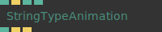

**Input Ports:**
- **text (String)**: The text/string which will typed out
- **Restart (Trigger)**: When triggered causes the string to be typed out again
- **Speed (Number)**: Determines the speed that the typing occurs at
- **Speed Variation (Number)**: Creates variations in the typed speed
- **Show Cursor (Number: boolean)**: *Check documentation*

**Output Ports:**
- **Result (String)**: The typed out string
- **Changed (Trigger)**: Triggers out each time a letter is typed
- **Finished (Trigger)**: Trigger out when animation is finished

**Example Patch:** [Open in Editor](https://cables.gl/op/Ops.Anim.StringTypeAnimation#example)

**Patches Using This Op:**
- *Search [cables.gl patches](https://cables.gl/patches) for "StringTypeAnimation"*

**Documentation:** [https://cables.gl/op/Ops.Anim.StringTypeAnimation](https://cables.gl/op/Ops.Anim.StringTypeAnimation)

---

### TimeDelta

**Full Name:** `Ops.Anim.TimeDelta`

**Description:** Measure the time difference between two triggers

**Input Ports:**
- **exe (Trigger)**: Trigger the op
- **Smooth (Number: boolean)**: Seconds (Number: boolean)See difference in time as seconds or milliseconds
- **Smooth (Number: boolean)**: *Check documentation*
- **Seconds (Number: boolean)**: See difference in time as seconds or milliseconds

**Output Ports:**
- **trigger (Trigger)**: Trigger out
- **result (Number)**: The difference in time as a number

**Example Patch:** [Open in Editor](https://cables.gl/op/Ops.Anim.TimeDelta#example)

**Patches Using This Op:**
- *Search [cables.gl patches](https://cables.gl/patches) for "TimeDelta"*

**Documentation:** [https://cables.gl/op/Ops.Anim.TimeDelta](https://cables.gl/op/Ops.Anim.TimeDelta)

---

### Timer

**Full Name:** `Ops.Anim.Timer`

**Description:** A timer that can be started, paused and reset by triggering

**Input Ports:**
- **ControlsSpeed (Number)**: Multiply time by this amount
- **Play (Number: boolean)**: Starts timer when set to true
- **Reset (Trigger)**: Resets timer to 0
- **Sync to timeline (Number: boolean)**: *Check documentation*
- **Speed (Number)**: Multiply time by this amount
- **OUTPUT PORTSTime (Number)**: Time elapsed
- **Time (Number)**: Time elapsed

**Output Ports:**
- **Time (Number)**: Time elapsed

**Example Patch:** [Open in Editor](https://cables.gl/op/Ops.Anim.Timer#example)

**Patches Using This Op:**
- *Search [cables.gl patches](https://cables.gl/patches) for "Timer"*

**Documentation:** [https://cables.gl/op/Ops.Anim.Timer](https://cables.gl/op/Ops.Anim.Timer)

---

## Ops.Array

*Process and manipulate collections (arrays) of data*

### AnglesBetweenPoints

**Full Name:** `Ops.Array.AnglesBetweenPoints`

**Description:** Outputs the angle between points in 3D space (degree)

**Input Ports:**
- **Points (Array)**: Theta (Number)Phi (Number)
- **INPUT PORTSPoints (Array)**: Theta (Number)Phi (Number)
- **Points (Array)**: *Check documentation*
- **Theta (Number)**: *Check documentation*
- **Phi (Number)**: *Check documentation*
- **OUTPUT PORTSRotations (Array)**: *Check documentation*
- **Rotations (Array)**: *Check documentation*

**Output Ports:**
- **Rotations (Array)**: *Check documentation*
- **Summary (oneliner)**: *Check documentation*
- **Documentation (markdown)**: This op will take an incoming array of point locations in 3D space (groups of X,Y,Z coordinates) and output an array of angles between the points.
- **Documentation (markdown)**: *Check documentation*
- **Youtube ids (comma seperated)**: *Check documentation*
- **INPUT PORTSPoints (Array)**: Theta (Number)Phi (Number)OUTPUT PORTSRotations (Array)

**Example Patch:** [Open in Editor](https://cables.gl/op/Ops.Array.AnglesBetweenPoints#example)

**Patches Using This Op:**
- *Search [cables.gl patches](https://cables.gl/patches) for "AnglesBetweenPoints"*

**Documentation:** [https://cables.gl/op/Ops.Array.AnglesBetweenPoints](https://cables.gl/op/Ops.Array.AnglesBetweenPoints)

---

### AnimArray

**Full Name:** `Ops.Array.AnimArray`

**Description:** Animate values in an array to another array

**Input Ports:**
- **Update (Trigger)**: Next Array (Array)Duration (Number)easing index (Number: integer)
- **INPUT PORTSUpdate (Trigger)**: Next Array (Array)Duration (Number)easing index (Number: integer)
- **Update (Trigger)**: *Check documentation*
- **Next Array (Array)**: *Check documentation*
- **Duration (Number)**: *Check documentation*
- **easing index (Number: integer)**: *Check documentation*
- **OUTPUT PORTSNext (Trigger)**: Matrix (Array)
- **Next (Trigger)**: Matrix (Array)
- **Next (Trigger)**: *Check documentation*
- **Matrix (Array)**: *Check documentation*

**Output Ports:**
- **Next (Trigger)**: Matrix (Array)

**Example Patch:** [Open in Editor](https://cables.gl/op/Ops.Array.AnimArray#example)

**Patches Using This Op:**
- *Search [cables.gl patches](https://cables.gl/patches) for "AnimArray"*

**Documentation:** [https://cables.gl/op/Ops.Array.AnimArray](https://cables.gl/op/Ops.Array.AnimArray)

---

### Array

**Full Name:** `Ops.Array.Array`

**Description:** Can generate 3 kinds of arrays: Number - 1,2,3,4 - Normalized

**Input Ports:**
- **Array length (Number: integer)**: The length of the array
- **Mode select index (Number: integer)**: Default Value (Number)Varies depending on selected mode - see docs for more details
- **Reverse (Number: boolean)**: *Check documentation*
- **Array (Array)**: Array out

**Output Ports:**
- **Array (Array)**: Array out
- **Array length out (Number)**: *Check documentation*

**Example Patch:** [Open in Editor](https://cables.gl/op/Ops.Array.Array#example)

**Patches Using This Op:**
- *Search [cables.gl patches](https://cables.gl/patches) for "Array"*

**Documentation:** [https://cables.gl/op/Ops.Array.Array](https://cables.gl/op/Ops.Array.Array)

---

### Array1toX

**Full Name:** `Ops.Array.Array1toX`

**Description:** Convert an array1 to array2,3,4 by choosing content for new axis

**Input Ports:**
- **Array1x (Array)**: Format index (Number: integer) AB  ABC  ABCD A index (Number: integer) Input  index  0-1  -1-1  0  1 B index (Number: integer) Input  index  0-1  -1-1  0  1 C index (Number: integer) Input  index  0-1  -1-1  0  1 D index (Number: integer) Input  index  0-1  -1-1  0  1
- **INPUT PORTSArray1x (Array)**: Format index (Number: integer) AB  ABC  ABCD A index (Number: integer) Input  index  0-1  -1-1  0  1 B index (Number: integer) Input  index  0-1  -1-1  0  1 C index (Number: integer) Input  index  0-1  -1-1  0  1 D index (Number: integer) Input  index  0-1  -1-1  0  1
- **Array1x (Array)**: *Check documentation*
- **Format index (Number: integer)**: AB  ABC  ABCD
- **A index (Number: integer)**: Input  index  0-1  -1-1  0  1
- **B index (Number: integer)**: Input  index  0-1  -1-1  0  1
- **C index (Number: integer)**: Input  index  0-1  -1-1  0  1
- **D index (Number: integer)**: Input  index  0-1  -1-1  0  1
- **OUTPUT PORTSArray3x (Array)**: Total points (Number)Array length (Number)
- **Array3x (Array)**: Total points (Number)Array length (Number)
- **Array3x (Array)**: *Check documentation*
- **Total points (Number)**: *Check documentation*
- **Array length (Number)**: *Check documentation*

**Output Ports:**
- **Array3x (Array)**: Total points (Number)Array length (Number)

**Example Patch:** [Open in Editor](https://cables.gl/op/Ops.Array.Array1toX#example)

**Patches Using This Op:**
- *Search [cables.gl patches](https://cables.gl/patches) for "Array1toX"*

**Documentation:** [https://cables.gl/op/Ops.Array.Array1toX](https://cables.gl/op/Ops.Array.Array1toX)

---

### Array2To3

**Full Name:** `Ops.Array.Array2To3`

**Description:** Inserts zeroes every third item

**Input Ports:**
- **Array2x (Array)**: *Check documentation*
- **INPUT PORTSArray2x (Array)**: *Check documentation*
- **OUTPUT PORTSArray3x (Array)**: Total points (Number)Array length (Number)
- **Array3x (Array)**: Total points (Number)Array length (Number)
- **Array3x (Array)**: *Check documentation*
- **Total points (Number)**: *Check documentation*
- **Array length (Number)**: *Check documentation*

**Output Ports:**
- **Array3x (Array)**: Total points (Number)Array length (Number)

**Example Patch:** [Open in Editor](https://cables.gl/op/Ops.Array.Array2To3#example)

**Patches Using This Op:**
- *Search [cables.gl patches](https://cables.gl/patches) for "Array2To3"*

**Documentation:** [https://cables.gl/op/Ops.Array.Array2To3](https://cables.gl/op/Ops.Array.Array2To3)

---

### Array3

**Full Name:** `Ops.Array.Array3`

**Description:** Create an array of num triplets set to default values xyz

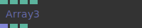

**Input Ports:**
- **Num Triplets (Number: integer)**: X (Number)Y (Number)Z (Number)
- **Num Triplets (Number: integer)**: *Check documentation*
- **X (Number)**: *Check documentation*
- **Y (Number)**: *Check documentation*
- **Z (Number)**: *Check documentation*
- **OUTPUT PORTSArray (Array)**: Total points (Number)Array length (Number)
- **Array (Array)**: Total points (Number)Array length (Number)
- **Array (Array)**: *Check documentation*
- **Total points (Number)**: *Check documentation*
- **Array length (Number)**: *Check documentation*

**Output Ports:**
- **Array (Array)**: Total points (Number)Array length (Number)

**Example Patch:** [Open in Editor](https://cables.gl/op/Ops.Array.Array3#example)

**Patches Using This Op:**
- *Search [cables.gl patches](https://cables.gl/patches) for "Array3"*

**Documentation:** [https://cables.gl/op/Ops.Array.Array3](https://cables.gl/op/Ops.Array.Array3)

---

### Array3GetAverage

**Full Name:** `Ops.Array.Array3GetAverage`

**Description:** Average x,y,z values of an array3x

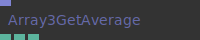

**Input Ports:**
- **Array (Array)**: The xyz array to analyze
- **INPUT PORTSArray (Array)**: The xyz array to analyze

**Output Ports:**
- **Average X (Number)**: The average of the x component
- **Average Y (Number)**: The average of the y component
- **Average Z (Number)**: The average of the z component

**Example Patch:** [Open in Editor](https://cables.gl/op/Ops.Array.Array3GetAverage#example)

**Patches Using This Op:**
- *Search [cables.gl patches](https://cables.gl/patches) for "Array3GetAverage"*

**Documentation:** [https://cables.gl/op/Ops.Array.Array3GetAverage](https://cables.gl/op/Ops.Array.Array3GetAverage)

---

### Array3GetNumbers

**Full Name:** `Ops.Array.Array3GetNumbers`

**Description:** Get 3 values XYZ from an array

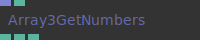

**Input Ports:**
- **Array (Array)**: The array to get the values from
- **Index (Number: integer)**: The index to look up

**Output Ports:**
- **X (Number)**: The X component from the index look up
- **Y (Number)**: The Y component from the index look up
- **Z (Number)**: The Z component from the index look up

**Example Patch:** [Open in Editor](https://cables.gl/op/Ops.Array.Array3GetNumbers#example)

**Patches Using This Op:**
- *Search [cables.gl patches](https://cables.gl/patches) for "Array3GetNumbers"*

**Documentation:** [https://cables.gl/op/Ops.Array.Array3GetNumbers](https://cables.gl/op/Ops.Array.Array3GetNumbers)

---

### Array3InterpolateDistributed

**Full Name:** `Ops.Array.Array3InterpolateDistributed`

**Description:** Interpolate between two arrays

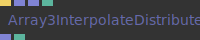

**Input Ports:**
- **Update (Trigger)**: Array 1 (Array)Array 2 (Array)Progress (Number)
- **INPUT PORTSUpdate (Trigger)**: Array 1 (Array)Array 2 (Array)Progress (Number)
- **Update (Trigger)**: *Check documentation*
- **Array 1 (Array)**: *Check documentation*
- **Array 2 (Array)**: *Check documentation*
- **Progress (Number)**: *Check documentation*
- **OUTPUT PORTSResult (Array)**: Array length (Number)
- **Result (Array)**: Array length (Number)
- **Result (Array)**: *Check documentation*
- **Array length (Number)**: *Check documentation*

**Output Ports:**
- **Result (Array)**: Array length (Number)

**Example Patch:** [Open in Editor](https://cables.gl/op/Ops.Array.Array3InterpolateDistributed#example)

**Patches Using This Op:**
- *Search [cables.gl patches](https://cables.gl/patches) for "Array3InterpolateDistributed"*

**Documentation:** [https://cables.gl/op/Ops.Array.Array3InterpolateDistributed](https://cables.gl/op/Ops.Array.Array3InterpolateDistributed)

---

### Array3Iterator

**Full Name:** `Ops.Array.Array3Iterator`

**Description:** Iterate over an array in steps of three and outputs three values

**Input Ports:**
- **Execute (Trigger)**: Starts the iteration
- **Array (Array)**: The array to iterate over
- **Step (Number)**: If bigger then 1, values will be skipped, e.g. when Step is 2 every other triplet will be skipped

**Output Ports:**
- **Trigger (Trigger)**: Triggers for every iteration step (triplet in the array)
- **Index (Number)**: The index of the triplet
- **Value 1 (Number)**: First value of the current triplet (e.g. x)
- **Value 2 (Number)**: Second value of the current triplet (e.g. y)
- **Value 3 (Number)**: Third value of the current triplet (e.g. z)
- **Summary (oneliner)**: *Check documentation*
- **Documentation (markdown)**: *Check documentation*
- **Youtube ids (comma seperated)**: *Check documentation*

**Example Patch:** [Open in Editor](https://cables.gl/op/Ops.Array.Array3Iterator#example)

**Patches Using This Op:**
- *Search [cables.gl patches](https://cables.gl/patches) for "Array3Iterator"*

**Documentation:** [https://cables.gl/op/Ops.Array.Array3Iterator](https://cables.gl/op/Ops.Array.Array3Iterator)

---

### Array3Multiply

**Full Name:** `Ops.Array.Array3Multiply`

**Description:** Multiply every XYZ member of array3x

**Input Ports:**
- **Array3x (Array)**: 3x array in
- **Mul X (Number)**: Multiply x component by this number
- **Mul Y (Number)**: Multiply y component by this number
- **Mul Z (Number)**: Multiply z component by this number
- **OUTPUT PORTSResult (Array)**: Calculated array output
- **Result (Array)**: Calculated array output

**Output Ports:**
- **Result (Array)**: Calculated array output

**Example Patch:** [Open in Editor](https://cables.gl/op/Ops.Array.Array3Multiply#example)

**Patches Using This Op:**
- *Search [cables.gl patches](https://cables.gl/patches) for "Array3Multiply"*

**Documentation:** [https://cables.gl/op/Ops.Array.Array3Multiply](https://cables.gl/op/Ops.Array.Array3Multiply)

---

### Array3PushNumbers

**Full Name:** `Ops.Array.Array3PushNumbers`

**Description:** Push three numbers to the end of an array

**Input Ports:**
- **Execute (Trigger)**: Array (Array)Value 1 (Number)Value 2 (Number)Value 3 (Number)Reset (Trigger)
- **INPUT PORTSExecute (Trigger)**: Array (Array)Value 1 (Number)Value 2 (Number)Value 3 (Number)Reset (Trigger)
- **Execute (Trigger)**: *Check documentation*
- **Array (Array)**: *Check documentation*
- **Value 1 (Number)**: *Check documentation*
- **Value 2 (Number)**: *Check documentation*
- **Value 3 (Number)**: *Check documentation*
- **Reset (Trigger)**: *Check documentation*
- **OUTPUT PORTSNext (Trigger)**: Result Array (Array)
- **Next (Trigger)**: Result Array (Array)
- **Next (Trigger)**: *Check documentation*
- **Result Array (Array)**: *Check documentation*

**Output Ports:**
- **Next (Trigger)**: Result Array (Array)

**Example Patch:** [Open in Editor](https://cables.gl/op/Ops.Array.Array3PushNumbers#example)

**Patches Using This Op:**
- *Search [cables.gl patches](https://cables.gl/patches) for "Array3PushNumbers"*

**Documentation:** [https://cables.gl/op/Ops.Array.Array3PushNumbers](https://cables.gl/op/Ops.Array.Array3PushNumbers)

---

### Array3RandomSelection

**Full Name:** `Ops.Array.Array3RandomSelection`

**Description:** Extract definable amount of random xyz points from an array

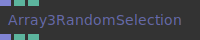

**Input Ports:**
- **Array (Array)**: The array in to extract random values from
- **Elements (Number: integer)**: How many xyz elements to extract
- **Seed (Number)**: Random number seed. 0 is always different on a reload. Set to a number to keep a fixed seed.

**Output Ports:**
- **Result (Array)**: A new array with a length determined by the elements paramater.
- **Total points (Number)**: Array length (Number)
- **Total points (Number)**: *Check documentation*
- **Array length (Number)**: *Check documentation*

**Example Patch:** [Open in Editor](https://cables.gl/op/Ops.Array.Array3RandomSelection#example)

**Patches Using This Op:**
- *Search [cables.gl patches](https://cables.gl/patches) for "Array3RandomSelection"*

**Documentation:** [https://cables.gl/op/Ops.Array.Array3RandomSelection](https://cables.gl/op/Ops.Array.Array3RandomSelection)

---

### Array3SetNumber

**Full Name:** `Ops.Array.Array3SetNumber`

**Description:** Set three numbers at index in an array

**Input Ports:**
- **Array (Array)**: Array in
- **Index (Number: integer)**: index to update with the value
- **Value X (Number)**: Value Y (Number)Value Z (Number)
- **Value X (Number)**: *Check documentation*
- **Value Y (Number)**: *Check documentation*
- **Value Z (Number)**: *Check documentation*
- **OUTPUT PORTSResult (Array)**: Modified array out
- **Result (Array)**: Modified array out

**Output Ports:**
- **Result (Array)**: Modified array out

**Example Patch:** [Open in Editor](https://cables.gl/op/Ops.Array.Array3SetNumber#example)

**Patches Using This Op:**
- *Search [cables.gl patches](https://cables.gl/patches) for "Array3SetNumber"*

**Documentation:** [https://cables.gl/op/Ops.Array.Array3SetNumber](https://cables.gl/op/Ops.Array.Array3SetNumber)

---

### Array3Sum

**Full Name:** `Ops.Array.Array3Sum`

**Description:** Add number to every XYZ member of array3x

**Input Ports:**
- **Array3x (Array)**: 3x array in
- **Add X (Number)**: Add Y (Number)Add Z (Number)
- **Add X (Number)**: *Check documentation*
- **Add Y (Number)**: *Check documentation*
- **Add Z (Number)**: *Check documentation*
- **OUTPUT PORTSResult (Array)**: Calculated array output
- **Result (Array)**: Calculated array output

**Output Ports:**
- **Result (Array)**: Calculated array output

**Example Patch:** [Open in Editor](https://cables.gl/op/Ops.Array.Array3Sum#example)

**Patches Using This Op:**
- *Search [cables.gl patches](https://cables.gl/patches) for "Array3Sum"*

**Documentation:** [https://cables.gl/op/Ops.Array.Array3Sum](https://cables.gl/op/Ops.Array.Array3Sum)

---

### Array3To2

**Full Name:** `Ops.Array.Array3To2`

**Description:** Remove every 3rd item of an array

**Input Ports:**
- **Array3x (Array)**: The XYZ array in
- **INPUT PORTSArray3x (Array)**: The XYZ array in
- **OUTPUT PORTSArray2x (Array)**: the XY array out
- **Array2x (Array)**: the XY array out

**Output Ports:**
- **Array2x (Array)**: the XY array out

**Example Patch:** [Open in Editor](https://cables.gl/op/Ops.Array.Array3To2#example)

**Patches Using This Op:**
- *Search [cables.gl patches](https://cables.gl/patches) for "Array3To2"*

**Documentation:** [https://cables.gl/op/Ops.Array.Array3To2](https://cables.gl/op/Ops.Array.Array3To2)

---

### Array3To4

**Full Name:** `Ops.Array.Array3To4`

**Description:** Convert an array3 to an array4 by filling it up with 1

**Input Ports:**
- **Array3x (Array)**: *Check documentation*
- **INPUT PORTSArray3x (Array)**: *Check documentation*
- **OUTPUT PORTSArray4x (Array)**: Total points (Number)Array length (Number)
- **Array4x (Array)**: Total points (Number)Array length (Number)
- **Array4x (Array)**: *Check documentation*
- **Total points (Number)**: *Check documentation*
- **Array length (Number)**: *Check documentation*

**Output Ports:**
- **Array4x (Array)**: Total points (Number)Array length (Number)

**Example Patch:** [Open in Editor](https://cables.gl/op/Ops.Array.Array3To4#example)

**Patches Using This Op:**
- *Search [cables.gl patches](https://cables.gl/patches) for "Array3To4"*

**Documentation:** [https://cables.gl/op/Ops.Array.Array3To4](https://cables.gl/op/Ops.Array.Array3To4)

---

### Array3VectorLength

**Full Name:** `Ops.Array.Array3VectorLength`

**Description:** Return the length of a vector from an array 3

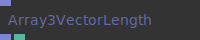

**Input Ports:**
- **Array in (Array)**: Array in
- **Array out (Array)**: Array out
- **Array lengths (Number)**: *Check documentation*

**Output Ports:**
- **Array out (Array)**: Array out
- **Array lengths (Number)**: *Check documentation*

**Example Patch:** [Open in Editor](https://cables.gl/op/Ops.Array.Array3VectorLength#example)

**Patches Using This Op:**
- *Search [cables.gl patches](https://cables.gl/patches) for "Array3VectorLength"*

**Documentation:** [https://cables.gl/op/Ops.Array.Array3VectorLength](https://cables.gl/op/Ops.Array.Array3VectorLength)

---

### Array4

**Full Name:** `Ops.Array.Array4`

**Description:** Create an array of num quadruples set to default values xyz

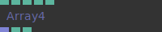

**Input Ports:**
- **Num Quadruplets (Number: integer)**: X (Number)Y (Number)Z (Number)W (Number)
- **Num Quadruplets (Number: integer)**: *Check documentation*
- **X (Number)**: *Check documentation*
- **Y (Number)**: *Check documentation*
- **Z (Number)**: *Check documentation*
- **W (Number)**: *Check documentation*
- **OUTPUT PORTSArray (Array)**: Total Quadruplets (Number)Array length (Number)
- **Array (Array)**: Total Quadruplets (Number)Array length (Number)

**Output Ports:**
- **Array (Array)**: Total Quadruplets (Number)Array length (Number)
- **Array (Array)**: *Check documentation*
- **Total Quadruplets (Number)**: *Check documentation*
- **Array length (Number)**: *Check documentation*

**Example Patch:** [Open in Editor](https://cables.gl/op/Ops.Array.Array4#example)

**Patches Using This Op:**
- *Search [cables.gl patches](https://cables.gl/patches) for "Array4"*

**Documentation:** [https://cables.gl/op/Ops.Array.Array4](https://cables.gl/op/Ops.Array.Array4)

---

### Array4GetNumbers

**Full Name:** `Ops.Array.Array4GetNumbers`

**Description:** Get 4 values from an array

**Input Ports:**
- **Array (Array)**: The array to get the values from
- **Index (Number: integer)**: The index to look up

**Output Ports:**
- **X (Number)**: The X component from the index look up
- **Y (Number)**: The Y component from the index look up
- **Z (Number)**: The Z component from the index look up
- **W (Number)**: *Check documentation*

**Example Patch:** [Open in Editor](https://cables.gl/op/Ops.Array.Array4GetNumbers#example)

**Patches Using This Op:**
- *Search [cables.gl patches](https://cables.gl/patches) for "Array4GetNumbers"*

**Documentation:** [https://cables.gl/op/Ops.Array.Array4GetNumbers](https://cables.gl/op/Ops.Array.Array4GetNumbers)

---

### Array4SetNumber

**Full Name:** `Ops.Array.Array4SetNumber`

**Description:** Set four numbers at index in an array

**Input Ports:**
- **Array (Array)**: Array in
- **Index (Number: integer)**: index to update with the value
- **Value X (Number)**: Value Y (Number)Value Z (Number)Value W (Number)
- **Value X (Number)**: *Check documentation*
- **Value Y (Number)**: *Check documentation*
- **Value Z (Number)**: *Check documentation*
- **Value W (Number)**: *Check documentation*
- **OUTPUT PORTSResult (Array)**: Modified array out
- **Result (Array)**: Modified array out

**Output Ports:**
- **Result (Array)**: Modified array out

**Example Patch:** [Open in Editor](https://cables.gl/op/Ops.Array.Array4SetNumber#example)

**Patches Using This Op:**
- *Search [cables.gl patches](https://cables.gl/patches) for "Array4SetNumber"*

**Documentation:** [https://cables.gl/op/Ops.Array.Array4SetNumber](https://cables.gl/op/Ops.Array.Array4SetNumber)

---

### Array4toArray3

**Full Name:** `Ops.Array.Array4toArray3`

**Description:** Convert an array4 to array3 by dropping every 4th number

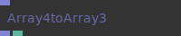

**Input Ports:**
- **Array (Array)**: *Check documentation*
- **INPUT PORTSArray (Array)**: *Check documentation*
- **OUTPUT PORTSResult (Array)**: Array length (Number)
- **Result (Array)**: Array length (Number)
- **Result (Array)**: *Check documentation*
- **Array length (Number)**: *Check documentation*

**Output Ports:**
- **Result (Array)**: Array length (Number)

**Example Patch:** [Open in Editor](https://cables.gl/op/Ops.Array.Array4toArray3#example)

**Patches Using This Op:**
- *Search [cables.gl patches](https://cables.gl/patches) for "Array4toArray3"*

**Documentation:** [https://cables.gl/op/Ops.Array.Array4toArray3](https://cables.gl/op/Ops.Array.Array4toArray3)

---

### ArrayAbs

**Full Name:** `Ops.Array.ArrayAbs`

**Description:** Converts array contents to absolute values

**Input Ports:**
- **In (Array)**: The array to process
- **INPUT PORTSIn (Array)**: The array to process
- **OUTPUT PORTSResult (Array)**: The modified array out
- **Result (Array)**: The modified array out

**Output Ports:**
- **Result (Array)**: The modified array out

**Example Patch:** [Open in Editor](https://cables.gl/op/Ops.Array.ArrayAbs#example)

**Patches Using This Op:**
- *Search [cables.gl patches](https://cables.gl/patches) for "ArrayAbs"*

**Documentation:** [https://cables.gl/op/Ops.Array.ArrayAbs](https://cables.gl/op/Ops.Array.ArrayAbs)

---

### ArrayAppendArray

**Full Name:** `Ops.Array.ArrayAppendArray`

**Description:** Append an array to an existing array

**Input Ports:**
- **Join (Trigger)**: Append array to existing array
- **Array (Array)**: ArrayIn
- **Reset (Trigger)**: Reset the array
- **Result (Array)**: Array out
- **Array length (Number)**: *Check documentation*

**Output Ports:**
- **Result (Array)**: Array out
- **Array length (Number)**: *Check documentation*

**Example Patch:** [Open in Editor](https://cables.gl/op/Ops.Array.ArrayAppendArray#example)

**Patches Using This Op:**
- *Search [cables.gl patches](https://cables.gl/patches) for "ArrayAppendArray"*

**Documentation:** [https://cables.gl/op/Ops.Array.ArrayAppendArray](https://cables.gl/op/Ops.Array.ArrayAppendArray)

---

### ArrayBuffer

**Full Name:** `Ops.Array.ArrayBuffer`

**Description:** Store values in an array / fifo array buffer

**Input Ports:**
- **exec (Trigger)**: Trigger the op
- **Value (Number)**: The value to write into the new indexes of the array
- **Max Length (Number: integer)**: The maximum length of the array
- **Reset (Trigger)**: *Check documentation*

**Output Ports:**
- **Trigger out (Trigger)**: Result (Array)The fifo array out
- **Array length (Number)**: *Check documentation*
- **Trigger out (Trigger)**: *Check documentation*
- **Result (Array)**: The fifo array out

**Example Patch:** [Open in Editor](https://cables.gl/op/Ops.Array.ArrayBuffer#example)

**Patches Using This Op:**
- *Search [cables.gl patches](https://cables.gl/patches) for "ArrayBuffer"*

**Documentation:** [https://cables.gl/op/Ops.Array.ArrayBuffer](https://cables.gl/op/Ops.Array.ArrayBuffer)

---

### ArrayBuffer3

**Full Name:** `Ops.Array.ArrayBuffer3`

**Description:** Circular buffer for xyz values

**Input Ports:**
- **exec (Trigger)**: Trigger in
- **Max Num Elements (Number)**: Maximum length of array
- **Value X (Number)**: Number 0 to write to X component of array
- **Value Y (Number)**: Number 1 to write to Y component of array
- **Value Z (Number)**: Number 2 to write to Z component of array
- **Reset (Trigger)**: Reset array

**Output Ports:**
- **Trigger out (Trigger)**: Result (Array)Array out
- **Array length (Number)**: *Check documentation*
- **Trigger out (Trigger)**: *Check documentation*
- **Result (Array)**: Array out

**Example Patch:** [Open in Editor](https://cables.gl/op/Ops.Array.ArrayBuffer3#example)

**Patches Using This Op:**
- *Search [cables.gl patches](https://cables.gl/patches) for "ArrayBuffer3"*

**Documentation:** [https://cables.gl/op/Ops.Array.ArrayBuffer3](https://cables.gl/op/Ops.Array.ArrayBuffer3)

---

### ArrayCeil

**Full Name:** `Ops.Array.ArrayCeil`

**Description:** Round numbers up

**Input Ports:**
- **In (Array)**: Array in
- **INPUT PORTSIn (Array)**: Array in
- **OUTPUT PORTSResult (Array)**: Array out
- **Result (Array)**: Array out

**Output Ports:**
- **Result (Array)**: Array out

**Example Patch:** [Open in Editor](https://cables.gl/op/Ops.Array.ArrayCeil#example)

**Patches Using This Op:**
- *Search [cables.gl patches](https://cables.gl/patches) for "ArrayCeil"*

**Documentation:** [https://cables.gl/op/Ops.Array.ArrayCeil](https://cables.gl/op/Ops.Array.ArrayCeil)

---

### ArrayChunk

**Full Name:** `Ops.Array.ArrayChunk`

**Description:** Extracts x elements from an array

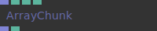

**Input Ports:**
- **Input Array (Array)**: The array to get a chunk out of
- **Begin Index (Number: integer)**: The index where the chunk should begin
- **Chunk Size (Number: integer)**: How big the chunk should be, if there are not enough elements at the end of the Input Array the chunk will be smaller
- **Circular (Number: boolean)**: If true, values from the beginning will be taken when end reached
- **Documentation (markdown)**: *Check documentation*
- **Youtube ids (comma seperated)**: *Check documentation*

**Output Ports:**
- **Output Array (Array)**: Included Chunk Size elements or less
- **Array length (Number)**: *Check documentation*

**Example Patch:** [Open in Editor](https://cables.gl/op/Ops.Array.ArrayChunk#example)

**Patches Using This Op:**
- *Search [cables.gl patches](https://cables.gl/patches) for "ArrayChunk"*

**Documentation:** [https://cables.gl/op/Ops.Array.ArrayChunk](https://cables.gl/op/Ops.Array.ArrayChunk)

---

### ArrayChunkDuplicate

**Full Name:** `Ops.Array.ArrayChunkDuplicate`

**Description:** Repeat chunks of an array multiple times

**Input Ports:**
- **Array (Array)**: Chunk Size (Number: integer)Repeats (Number: integer)
- **INPUT PORTSArray (Array)**: Chunk Size (Number: integer)Repeats (Number: integer)
- **Array (Array)**: *Check documentation*
- **Chunk Size (Number: integer)**: *Check documentation*
- **Repeats (Number: integer)**: *Check documentation*
- **OUTPUT PORTSResult (Array)**: *Check documentation*
- **Result (Array)**: *Check documentation*

**Output Ports:**
- **Result (Array)**: *Check documentation*

**Example Patch:** [Open in Editor](https://cables.gl/op/Ops.Array.ArrayChunkDuplicate#example)

**Patches Using This Op:**
- *Search [cables.gl patches](https://cables.gl/patches) for "ArrayChunkDuplicate"*

**Documentation:** [https://cables.gl/op/Ops.Array.ArrayChunkDuplicate](https://cables.gl/op/Ops.Array.ArrayChunkDuplicate)

---

### ArrayClamp

**Full Name:** `Ops.Array.ArrayClamp`

**Description:** Clamp the values of an array to a min and max value

**Input Ports:**
- **Array In (Array)**: Array in
- **Min (Number)**: Minimum value to clamp to
- **Max (Number)**: Maximum value to clamp to
- **Array Out (Array)**: Clamped array out

**Output Ports:**
- **Array Out (Array)**: Clamped array out

**Example Patch:** [Open in Editor](https://cables.gl/op/Ops.Array.ArrayClamp#example)

**Patches Using This Op:**
- *Search [cables.gl patches](https://cables.gl/patches) for "ArrayClamp"*

**Documentation:** [https://cables.gl/op/Ops.Array.ArrayClamp](https://cables.gl/op/Ops.Array.ArrayClamp)

---

### ArrayContains

**Full Name:** `Ops.Array.ArrayContains`

**Description:** Check if an array contains a number

**Input Ports:**
- **Array (Array)**: Array in that will be searched through
- **SearchValue (Number)**: the string to look for

**Output Ports:**
- **Found (booleanNumber)**: Returns true if string is in array otherwise false
- **Index (Number)**: The index number where the string was found in the array

**Example Patch:** [Open in Editor](https://cables.gl/op/Ops.Array.ArrayContains#example)

**Patches Using This Op:**
- *Search [cables.gl patches](https://cables.gl/patches) for "ArrayContains"*

**Documentation:** [https://cables.gl/op/Ops.Array.ArrayContains](https://cables.gl/op/Ops.Array.ArrayContains)

---

### ArrayDivide

**Full Name:** `Ops.Array.ArrayDivide`

**Description:** Divide all values in an array by one number

**Input Ports:**
- **Array In (Array)**: The array to divide
- **Value (Number)**: The number that all array values are divided by
- **Mode index (Number: integer)**: Array/x  x/Array
- **Array Out (Array)**: Divided array out

**Output Ports:**
- **Array Out (Array)**: Divided array out

**Example Patch:** [Open in Editor](https://cables.gl/op/Ops.Array.ArrayDivide#example)

**Patches Using This Op:**
- *Search [cables.gl patches](https://cables.gl/patches) for "ArrayDivide"*

**Documentation:** [https://cables.gl/op/Ops.Array.ArrayDivide](https://cables.gl/op/Ops.Array.ArrayDivide)

---

### ArrayFindStrings

**Full Name:** `Ops.Array.ArrayFindStrings`

**Description:** Return all the indexes of a string in an array

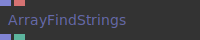

**Input Ports:**
- **Array (Array)**: Array to search through
- **SearchValue (String)**: value to find

**Output Ports:**
- **Index (Array)**: indexes that the string was found at
- **Found (booleanNumber)**: outputs a boolean if found

**Example Patch:** [Open in Editor](https://cables.gl/op/Ops.Array.ArrayFindStrings#example)

**Patches Using This Op:**
- *Search [cables.gl patches](https://cables.gl/patches) for "ArrayFindStrings"*

**Documentation:** [https://cables.gl/op/Ops.Array.ArrayFindStrings](https://cables.gl/op/Ops.Array.ArrayFindStrings)

---

### ArrayFloor

**Full Name:** `Ops.Array.ArrayFloor`

**Description:** Round numbers down

**Input Ports:**
- **In (Array)**: Array In
- **INPUT PORTSIn (Array)**: Array In
- **OUTPUT PORTSResult (Array)**: Array out
- **Result (Array)**: Array out

**Output Ports:**
- **Result (Array)**: Array out

**Example Patch:** [Open in Editor](https://cables.gl/op/Ops.Array.ArrayFloor#example)

**Patches Using This Op:**
- *Search [cables.gl patches](https://cables.gl/patches) for "ArrayFloor"*

**Documentation:** [https://cables.gl/op/Ops.Array.ArrayFloor](https://cables.gl/op/Ops.Array.ArrayFloor)

---

### ArrayFract

**Full Name:** `Ops.Array.ArrayFract`

**Description:** Return the fractional remainder of all values in an array

**Input Ports:**
- **In (Array)**: Array in
- **INPUT PORTSIn (Array)**: Array in
- **OUTPUT PORTSResult (Array)**: Array out
- **Result (Array)**: Array out

**Output Ports:**
- **Result (Array)**: Array out

**Example Patch:** [Open in Editor](https://cables.gl/op/Ops.Array.ArrayFract#example)

**Patches Using This Op:**
- *Search [cables.gl patches](https://cables.gl/patches) for "ArrayFract"*

**Documentation:** [https://cables.gl/op/Ops.Array.ArrayFract](https://cables.gl/op/Ops.Array.ArrayFract)

---

### ArrayFromNumbers

**Full Name:** `Ops.Array.ArrayFromNumbers`

**Description:** Simple way to create small arrays of numbers

**Input Ports:**
- **Update (Trigger)**: operator must be updated any time you change values in it, or connected to the mainloop op
- **Limit (Number: integer)**: range is 1-30
- **Slider (Number: boolean)**: Index 0 (Number)Index 1 (Number)Index 2 (Number)Index 3 (Number)Index 4 (Number)Index 5 (Number)Index 6 (Number)Index 7 (Number)Index 8 (Number)Index 9 (Number)Index 10 (Number)Index 11 (Number)Index 12 (Number)Index 13 (Number)Index 14 (Number)Index 15 (Number)Index 16 (Number)Index 17 (Number)Index 18 (Number)Index 19 (Number)Index 20 (Number)Index 21 (Number)Index 22 (Number)Index 23 (Number)Index 24 (Number)Index 25 (Number)Index 26 (Number)Index 27 (Number)Index 28 (Number)Index 29 (Number)
- **OUTPUT PORTSNext (Trigger)**: Array (Array)
- **Next (Trigger)**: Array (Array)
- **Next (Trigger)**: *Check documentation*
- **Array (Array)**: *Check documentation*

**Output Ports:**
- **Next (Trigger)**: Array (Array)

**Example Patch:** [Open in Editor](https://cables.gl/op/Ops.Array.ArrayFromNumbers#example)

**Patches Using This Op:**
- *Search [cables.gl patches](https://cables.gl/patches) for "ArrayFromNumbers"*

**Documentation:** [https://cables.gl/op/Ops.Array.ArrayFromNumbers](https://cables.gl/op/Ops.Array.ArrayFromNumbers)

---

### ArrayGetArray

**Full Name:** `Ops.Array.ArrayGetArray`

**Description:** Get an array from an array of arrays

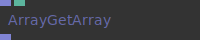

**Input Ports:**
- **Array of Arrays (Array)**: must contain an array of only arrays
- **Index (Number: integer)**: *Check documentation*
- **Result Array (Array)**: *Check documentation*

**Output Ports:**
- **Result Array (Array)**: *Check documentation*

**Example Patch:** [Open in Editor](https://cables.gl/op/Ops.Array.ArrayGetArray#example)

**Patches Using This Op:**
- *Search [cables.gl patches](https://cables.gl/patches) for "ArrayGetArray"*

**Documentation:** [https://cables.gl/op/Ops.Array.ArrayGetArray](https://cables.gl/op/Ops.Array.ArrayGetArray)

---

### ArrayGetNumber

**Full Name:** `Ops.Array.ArrayGetNumber`

**Description:** Return a value from an array

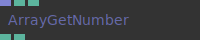

**Input Ports:**
- **array (Array)**: The array-data, e.g. [100, 200, 300]
- **index (Number: integer)**: The index of the array you want to get, 0 is the first element
- **Value Invalid Index (Number)**: *Check documentation*

**Output Ports:**
- **value (Number)**: The value of the array at position Index
- **Valid Index (booleanNumber)**: *Check documentation*

**Example Patch:** [Open in Editor](https://cables.gl/op/Ops.Array.ArrayGetNumber#example)

**Patches Using This Op:**
- *Search [cables.gl patches](https://cables.gl/patches) for "ArrayGetNumber"*

**Documentation:** [https://cables.gl/op/Ops.Array.ArrayGetNumber](https://cables.gl/op/Ops.Array.ArrayGetNumber)

---

### ArrayGetObject

**Full Name:** `Ops.Array.ArrayGetObject`

**Description:** Get an object from an array

**Input Ports:**
- **array (Array)**: must contain only objects
- **index (Number: integer)**: The index of the array containing the object
- **OUTPUT PORTSvalue (Object)**: The object out from the index
- **value (Object)**: The object out from the index

**Output Ports:**
- **value (Object)**: The object out from the index

**Example Patch:** [Open in Editor](https://cables.gl/op/Ops.Array.ArrayGetObject#example)

**Patches Using This Op:**
- *Search [cables.gl patches](https://cables.gl/patches) for "ArrayGetObject"*

**Documentation:** [https://cables.gl/op/Ops.Array.ArrayGetObject](https://cables.gl/op/Ops.Array.ArrayGetObject)

---

### ArrayGetString

**Full Name:** `Ops.Array.ArrayGetString`

**Description:** Get a string from an array at [index]

**Input Ports:**
- **Array (Array)**: Index (Number: integer)
- **INPUT PORTSArray (Array)**: Index (Number: integer)
- **Array (Array)**: *Check documentation*
- **Index (Number: integer)**: *Check documentation*
- **OUTPUT PORTSResult (String)**: Found (booleanNumber)
- **Result (String)**: Found (booleanNumber)
- **Result (String)**: *Check documentation*
- **Found (booleanNumber)**: *Check documentation*

**Output Ports:**
- **Result (String)**: Found (booleanNumber)

**Example Patch:** [Open in Editor](https://cables.gl/op/Ops.Array.ArrayGetString#example)

**Patches Using This Op:**
- *Search [cables.gl patches](https://cables.gl/patches) for "ArrayGetString"*

**Documentation:** [https://cables.gl/op/Ops.Array.ArrayGetString](https://cables.gl/op/Ops.Array.ArrayGetString)

---

### ArrayGetTexture

**Full Name:** `Ops.Array.ArrayGetTexture`

**Description:** Get texture from array at index

**Input Ports:**
- **array (Array)**: index (Number: integer)
- **INPUT PORTSarray (Array)**: index (Number: integer)
- **array (Array)**: *Check documentation*
- **index (Number: integer)**: *Check documentation*
- **OUTPUT PORTSvalue (Object)**: *Check documentation*
- **value (Object)**: *Check documentation*

**Output Ports:**
- **value (Object)**: *Check documentation*

**Example Patch:** [Open in Editor](https://cables.gl/op/Ops.Array.ArrayGetTexture#example)

**Patches Using This Op:**
- *Search [cables.gl patches](https://cables.gl/patches) for "ArrayGetTexture"*

**Documentation:** [https://cables.gl/op/Ops.Array.ArrayGetTexture](https://cables.gl/op/Ops.Array.ArrayGetTexture)

---

### ArrayGetValuesByIndexArray

**Full Name:** `Ops.Array.ArrayGetValuesByIndexArray`

**Description:** Pick values from input array at given indices and stride

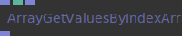

**Input Ports:**
- **Array (Array)**: Input array with all values
- **Array Stride index (Number: integer)**: 1,2,3,4
- **Indices (Array)**: List of indices to pick
- **Summary (oneliner)**: *Check documentation*
- **Documentation (markdown)**: *Check documentation*
- **Youtube ids (comma seperated)**: *Check documentation*
- **OUTPUT PORTSResults (Array)**: *Check documentation*
- **Results (Array)**: *Check documentation*

**Output Ports:**
- **Results (Array)**: *Check documentation*

**Example Patch:** [Open in Editor](https://cables.gl/op/Ops.Array.ArrayGetValuesByIndexArray#example)

**Patches Using This Op:**
- *Search [cables.gl patches](https://cables.gl/patches) for "ArrayGetValuesByIndexArray"*

**Documentation:** [https://cables.gl/op/Ops.Array.ArrayGetValuesByIndexArray](https://cables.gl/op/Ops.Array.ArrayGetValuesByIndexArray)

---

### ArrayIndexBetween

**Full Name:** `Ops.Array.ArrayIndexBetween`

**Description:** Output index where value is greater than number and smaller then next number

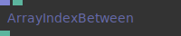

**Input Ports:**
- **Array (Array)**: Value (Number)
- **INPUT PORTSArray (Array)**: Value (Number)
- **Array (Array)**: *Check documentation*
- **Value (Number)**: *Check documentation*
- **OUTPUT PORTSIndex (Number)**: *Check documentation*
- **Index (Number)**: *Check documentation*

**Output Ports:**
- **Index (Number)**: *Check documentation*
- **Summary (oneliner)**: *Check documentation*
- **Documentation (markdown)**: *Check documentation*
- **Youtube ids (comma seperated)**: *Check documentation*
- **INPUT PORTSArray (Array)**: Value (Number)OUTPUT PORTSIndex (Number)

**Example Patch:** [Open in Editor](https://cables.gl/op/Ops.Array.ArrayIndexBetween#example)

**Patches Using This Op:**
- *Search [cables.gl patches](https://cables.gl/patches) for "ArrayIndexBetween"*

**Documentation:** [https://cables.gl/op/Ops.Array.ArrayIndexBetween](https://cables.gl/op/Ops.Array.ArrayIndexBetween)

---

### ArrayIndexMinMax

**Full Name:** `Ops.Array.ArrayIndexMinMax`

**Description:** Find lowest/highest numbers in an array

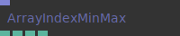

**Input Ports:**
- **Array (Array)**: *Check documentation*
- **INPUT PORTSArray (Array)**: *Check documentation*
- **OUTPUT PORTSMax (Number)**: Index Max (Number)Min (Number)Index Min (Number)
- **Max (Number)**: Index Max (Number)Min (Number)Index Min (Number)

**Output Ports:**
- **Max (Number)**: Index Max (Number)Min (Number)Index Min (Number)
- **Max (Number)**: *Check documentation*
- **Index Max (Number)**: *Check documentation*
- **Min (Number)**: *Check documentation*
- **Index Min (Number)**: *Check documentation*

**Example Patch:** [Open in Editor](https://cables.gl/op/Ops.Array.ArrayIndexMinMax#example)

**Patches Using This Op:**
- *Search [cables.gl patches](https://cables.gl/patches) for "ArrayIndexMinMax"*

**Documentation:** [https://cables.gl/op/Ops.Array.ArrayIndexMinMax](https://cables.gl/op/Ops.Array.ArrayIndexMinMax)

---

### ArrayIteratorArray

**Full Name:** `Ops.Array.ArrayIteratorArray`

**Description:** Iterate over an array of arrays

**Input Ports:**
- **exe (Trigger)**: array (Array)
- **INPUT PORTSexe (Trigger)**: array (Array)
- **exe (Trigger)**: *Check documentation*
- **array (Array)**: *Check documentation*
- **OUTPUT PORTStrigger (Trigger)**: index (Number)Result (Array)
- **trigger (Trigger)**: index (Number)Result (Array)
- **trigger (Trigger)**: *Check documentation*
- **index (Number)**: *Check documentation*
- **Result (Array)**: *Check documentation*

**Output Ports:**
- **trigger (Trigger)**: index (Number)Result (Array)

**Example Patch:** [Open in Editor](https://cables.gl/op/Ops.Array.ArrayIteratorArray#example)

**Patches Using This Op:**
- *Search [cables.gl patches](https://cables.gl/patches) for "ArrayIteratorArray"*

**Documentation:** [https://cables.gl/op/Ops.Array.ArrayIteratorArray](https://cables.gl/op/Ops.Array.ArrayIteratorArray)

---

### ArrayIteratorNumbers

**Full Name:** `Ops.Array.ArrayIteratorNumbers`

**Description:** Loop over every element of an array

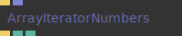

**Input Ports:**
- **exe (Trigger)**: Trigger the op
- **array (Array)**: The array to iterate over

**Output Ports:**
- **trigger (Trigger)**: Triggers all child ops array.length times
- **index (Number)**: Index of the array 0 to array.length
- **value (Number)**: Value of the current index in the array

**Example Patch:** [Open in Editor](https://cables.gl/op/Ops.Array.ArrayIteratorNumbers#example)

**Patches Using This Op:**
- *Search [cables.gl patches](https://cables.gl/patches) for "ArrayIteratorNumbers"*

**Documentation:** [https://cables.gl/op/Ops.Array.ArrayIteratorNumbers](https://cables.gl/op/Ops.Array.ArrayIteratorNumbers)

---

### ArrayIteratorObjects

**Full Name:** `Ops.Array.ArrayIteratorObjects`

**Description:** Iterate over an array of objects

**Input Ports:**
- **exe (Trigger)**: Trigger the op
- **array (Array)**: Array in containing objects

**Output Ports:**
- **trigger (Trigger)**: Trigger out
- **finished (Trigger)**: index (Number)Index out of current object
- **value (Object)**: The object out
- **finished (Trigger)**: *Check documentation*
- **index (Number)**: Index out of current object

**Example Patch:** [Open in Editor](https://cables.gl/op/Ops.Array.ArrayIteratorObjects#example)

**Patches Using This Op:**
- *Search [cables.gl patches](https://cables.gl/patches) for "ArrayIteratorObjects"*

**Documentation:** [https://cables.gl/op/Ops.Array.ArrayIteratorObjects](https://cables.gl/op/Ops.Array.ArrayIteratorObjects)

---

### ArrayIteratorStrings

**Full Name:** `Ops.Array.ArrayIteratorStrings`

**Description:** Loop over every element of an array

**Input Ports:**
- **Exe (Trigger)**: trigger
- **Array (Array)**: the array to iteratie over

**Output Ports:**
- **Trigger (Trigger)**: next trigger
- **Index (Number)**: the index of the current element
- **Value (String)**: the value of the current element

**Example Patch:** [Open in Editor](https://cables.gl/op/Ops.Array.ArrayIteratorStrings#example)

**Patches Using This Op:**
- *Search [cables.gl patches](https://cables.gl/patches) for "ArrayIteratorStrings"*

**Documentation:** [https://cables.gl/op/Ops.Array.ArrayIteratorStrings](https://cables.gl/op/Ops.Array.ArrayIteratorStrings)

---

### ArrayIteratorTextures

**Full Name:** `Ops.Array.ArrayIteratorTextures`

**Description:** Iterate over an array of objects

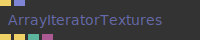

**Input Ports:**
- **exe (Trigger)**: Trigger the op
- **array (Array)**: Array in containing objects

**Output Ports:**
- **trigger (Trigger)**: Trigger out
- **finished (Trigger)**: index (Number)Index out of current object
- **value (Object)**: The object out
- **finished (Trigger)**: *Check documentation*
- **index (Number)**: Index out of current object

**Example Patch:** [Open in Editor](https://cables.gl/op/Ops.Array.ArrayIteratorTextures#example)

**Patches Using This Op:**
- *Search [cables.gl patches](https://cables.gl/patches) for "ArrayIteratorTextures"*

**Documentation:** [https://cables.gl/op/Ops.Array.ArrayIteratorTextures](https://cables.gl/op/Ops.Array.ArrayIteratorTextures)

---

### ArrayLength

**Full Name:** `Ops.Array.ArrayLength`

**Description:** Number of items in an array

**Input Ports:**
- **array (Array)**: Array in
- **INPUT PORTSarray (Array)**: Array in
- **OUTPUT PORTSlength (Number)**: The length of the array/ amount of items in the array returned as a number

**Output Ports:**
- **length (Number)**: The length of the array/ amount of items in the array returned as a number

**Example Patch:** [Open in Editor](https://cables.gl/op/Ops.Array.ArrayLength#example)

**Patches Using This Op:**
- *Search [cables.gl patches](https://cables.gl/patches) for "ArrayLength"*

**Documentation:** [https://cables.gl/op/Ops.Array.ArrayLength](https://cables.gl/op/Ops.Array.ArrayLength)

---

### ArrayLogic

**Full Name:** `Ops.Array.ArrayLogic`

**Description:** Performs logical comparison operations on a single array of numbers

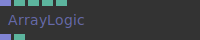

**Input Ports:**
- **array 0 (Array)**: Array in
- **Comparison mode index (Number: integer)**: Number for comparison (Number)The number used to apply a logical comparison operator to all the numbers in the array
- **value if true (Number)**: value if false (Number)
- **Array result (Array)**: Array out
- **Array length (Number)**: *Check documentation*

**Output Ports:**
- **Array result (Array)**: Array out
- **Array length (Number)**: *Check documentation*
- **Documentation (markdown)**: *Check documentation*
- **Youtube ids (comma seperated)**: *Check documentation*

**Example Patch:** [Open in Editor](https://cables.gl/op/Ops.Array.ArrayLogic#example)

**Patches Using This Op:**
- *Search [cables.gl patches](https://cables.gl/patches) for "ArrayLogic"*

**Documentation:** [https://cables.gl/op/Ops.Array.ArrayLogic](https://cables.gl/op/Ops.Array.ArrayLogic)

---

### ArrayLogicArray

**Full Name:** `Ops.Array.ArrayLogicArray`

**Description:** Performs logical comparison operations on two arrays

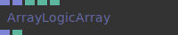

**Input Ports:**
- **array 0 (Array)**: Array 0 in
- **array 1 (Array)**: Array 1 in
- **value if true (Number)**: default 1 - set your own value if it evaluates to true
- **value if false (Number)**: default 0 - set your own value if it evaluates to false
- **Comparison mode index (Number: integer)**: *Check documentation*

**Output Ports:**
- **Array result (Array)**: Array out
- **Array length (Number)**: Length of array out

**Example Patch:** [Open in Editor](https://cables.gl/op/Ops.Array.ArrayLogicArray#example)

**Patches Using This Op:**
- *Search [cables.gl patches](https://cables.gl/patches) for "ArrayLogicArray"*

**Documentation:** [https://cables.gl/op/Ops.Array.ArrayLogicArray](https://cables.gl/op/Ops.Array.ArrayLogicArray)

---

### ArrayLogicBetween

**Full Name:** `Ops.Array.ArrayLogicBetween`

**Description:** If value of array is between min and max then the value is 1 else 0

**Input Ports:**
- **Array (Array)**: Min (Number)Max (Number)pass value when true (Number: boolean)When enabled values between are passed through instead of being 1
- **INPUT PORTSArray (Array)**: Min (Number)Max (Number)pass value when true (Number: boolean)When enabled values between are passed through instead of being 1
- **Array (Array)**: *Check documentation*
- **Min (Number)**: *Check documentation*
- **Max (Number)**: *Check documentation*
- **OUTPUT PORTSResult (Array)**: *Check documentation*
- **Result (Array)**: *Check documentation*

**Output Ports:**
- **Result (Array)**: *Check documentation*

**Example Patch:** [Open in Editor](https://cables.gl/op/Ops.Array.ArrayLogicBetween#example)

**Patches Using This Op:**
- *Search [cables.gl patches](https://cables.gl/patches) for "ArrayLogicBetween"*

**Documentation:** [https://cables.gl/op/Ops.Array.ArrayLogicBetween](https://cables.gl/op/Ops.Array.ArrayLogicBetween)

---

### ArrayLookup

**Full Name:** `Ops.Array.ArrayLookup`

**Description:** Create an array that is filled with values looked up by index from another array

**Input Ports:**
- **Indices (Array)**: Values (Array)Stride (Number: integer)
- **INPUT PORTSIndices (Array)**: Values (Array)Stride (Number: integer)
- **Indices (Array)**: *Check documentation*
- **Values (Array)**: *Check documentation*
- **Stride (Number: integer)**: *Check documentation*
- **OUTPUT PORTSResult (Array)**: *Check documentation*
- **Result (Array)**: *Check documentation*

**Output Ports:**
- **Result (Array)**: *Check documentation*

**Example Patch:** [Open in Editor](https://cables.gl/op/Ops.Array.ArrayLookup#example)

**Patches Using This Op:**
- *Search [cables.gl patches](https://cables.gl/patches) for "ArrayLookup"*

**Documentation:** [https://cables.gl/op/Ops.Array.ArrayLookup](https://cables.gl/op/Ops.Array.ArrayLookup)

---

### ArrayMath

**Full Name:** `Ops.Array.ArrayMath`

**Description:** Pick from multiple mathematical modes which can all be applied to a single array

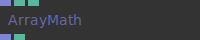

**Input Ports:**
- **array 0 (Array)**: Array in
- **Number for math (Number)**: The number used for the math operation on all values in the array
- **Math function index (Number: integer)**: *Check documentation*
- **Array result (Array)**: Array out
- **Array length (Number)**: *Check documentation*

**Output Ports:**
- **Array result (Array)**: Array out
- **Array length (Number)**: *Check documentation*

**Example Patch:** [Open in Editor](https://cables.gl/op/Ops.Array.ArrayMath#example)

**Patches Using This Op:**
- *Search [cables.gl patches](https://cables.gl/patches) for "ArrayMath"*

**Documentation:** [https://cables.gl/op/Ops.Array.ArrayMath](https://cables.gl/op/Ops.Array.ArrayMath)

---

### ArrayMathArray

**Full Name:** `Ops.Array.ArrayMathArray`

**Description:** Perform a math operations on two arrays

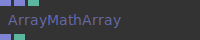

**Input Ports:**
- **array 0 (Array)**: Array in
- **array 1 (Array)**: Array in
- **Math function index (Number: integer)**: *Check documentation*

**Output Ports:**
- **Array result (Array)**: Calculated array out
- **Array length (Number)**: *Check documentation*

**Example Patch:** [Open in Editor](https://cables.gl/op/Ops.Array.ArrayMathArray#example)

**Patches Using This Op:**
- *Search [cables.gl patches](https://cables.gl/patches) for "ArrayMathArray"*

**Documentation:** [https://cables.gl/op/Ops.Array.ArrayMathArray](https://cables.gl/op/Ops.Array.ArrayMathArray)

---

### ArrayMathExpression

**Full Name:** `Ops.Array.ArrayMathExpression`

**Description:** Calculate a user-defined mathematical expression

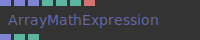

**Input Ports:**
- **ParametersA (Array)**: first input array - use a in your expression
- **B (Array)**: second input array - use b in your expression
- **C (Array)**: third input array - use c in your expression
- **X (Number)**: first number input - use x in your expression
- **Y (Number)**: second number input - use y in your expression
- **Z (Number)**: third number input - use z in your expression
- **ExpressionExpression (String)**: the mathematical expression to be calculated
- **Documentation (markdown)**: *Check documentation*
- **Youtube ids (comma seperated)**: *Check documentation*
- **A (Array)**: first input array - use a in your expression
- **Expression (String)**: the mathematical expression to be calculated

**Output Ports:**
- **Result Array (Array)**: the resulting array
- **Array Length (Number)**: the resulting array's length
- **Expression Valid (booleanNumber)**: true if the expression is valid, false otherwise

**Example Patch:** [Open in Editor](https://cables.gl/op/Ops.Array.ArrayMathExpression#example)

**Patches Using This Op:**
- *Search [cables.gl patches](https://cables.gl/patches) for "ArrayMathExpression"*

**Documentation:** [https://cables.gl/op/Ops.Array.ArrayMathExpression](https://cables.gl/op/Ops.Array.ArrayMathExpression)

---

### ArrayMathExpressionTrigger

**Full Name:** `Ops.Array.ArrayMathExpressionTrigger`

**Description:** Calculate a user-defined mathematical expression

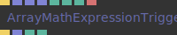

**Input Ports:**
- **Update (Trigger)**: ParametersA (Array)first input array - use a in your expression
- **B (Array)**: second input array - use b in your expression
- **C (Array)**: third input array - use c in your expression
- **X (Number)**: first number input - use x in your expression
- **Y (Number)**: second number input - use y in your expression
- **Z (Number)**: third number input - use z in your expression
- **ExpressionExpression (String)**: the mathematical expression to be calculated
- **Documentation (markdown)**: *Check documentation*
- **Youtube ids (comma seperated)**: *Check documentation*
- **Update (Trigger)**: *Check documentation*
- **A (Array)**: first input array - use a in your expression
- **Expression (String)**: the mathematical expression to be calculated

**Output Ports:**
- **Next (Trigger)**: Result Array (Array)the resulting array
- **Array Length (Number)**: the resulting array's length
- **Expression Valid (booleanNumber)**: true if the expression is valid, false otherwise
- **Next (Trigger)**: *Check documentation*
- **Result Array (Array)**: the resulting array

**Example Patch:** [Open in Editor](https://cables.gl/op/Ops.Array.ArrayMathExpressionTrigger#example)

**Patches Using This Op:**
- *Search [cables.gl patches](https://cables.gl/patches) for "ArrayMathExpressionTrigger"*

**Documentation:** [https://cables.gl/op/Ops.Array.ArrayMathExpressionTrigger](https://cables.gl/op/Ops.Array.ArrayMathExpressionTrigger)

---

### ArrayMax

**Full Name:** `Ops.Array.ArrayMax`

**Description:** Apply a max operation to all values in an array

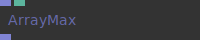

**Input Ports:**
- **Array In (Array)**: Array in
- **Value (Number)**: The value to test
- **Array Out (Array)**: Array out

**Output Ports:**
- **Array Out (Array)**: Array out

**Example Patch:** [Open in Editor](https://cables.gl/op/Ops.Array.ArrayMax#example)

**Patches Using This Op:**
- *Search [cables.gl patches](https://cables.gl/patches) for "ArrayMax"*

**Documentation:** [https://cables.gl/op/Ops.Array.ArrayMax](https://cables.gl/op/Ops.Array.ArrayMax)

---

### ArrayMerge

**Full Name:** `Ops.Array.ArrayMerge`

**Description:** Merge multiple arrays - in consecutive order

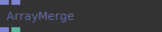

**Input Ports:**
- **Array 0 (Array)**: Array 1 (Array)Array 2 (Array)Array 3 (Array)Array 4 (Array)Array 5 (Array)Array 6 (Array)Array 7 (Array)
- **Array 0 (Array)**: *Check documentation*
- **Array 1 (Array)**: *Check documentation*
- **Array 2 (Array)**: *Check documentation*
- **Array 3 (Array)**: *Check documentation*
- **Array 4 (Array)**: *Check documentation*
- **Array 5 (Array)**: *Check documentation*
- **Array 6 (Array)**: *Check documentation*
- **Array 7 (Array)**: *Check documentation*
- **OUTPUT PORTSResult (Array)**: Array length (Number)
- **Result (Array)**: Array length (Number)
- **Result (Array)**: *Check documentation*
- **Array length (Number)**: *Check documentation*

**Output Ports:**
- **Result (Array)**: Array length (Number)

**Example Patch:** [Open in Editor](https://cables.gl/op/Ops.Array.ArrayMerge#example)

**Patches Using This Op:**
- *Search [cables.gl patches](https://cables.gl/patches) for "ArrayMerge"*

**Documentation:** [https://cables.gl/op/Ops.Array.ArrayMerge](https://cables.gl/op/Ops.Array.ArrayMerge)

---

### ArrayMergeTrigger

**Full Name:** `Ops.Array.ArrayMergeTrigger`

**Description:** Merge / concatenate arrays by trigger

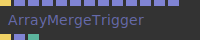

**Input Ports:**
- **Merge (Trigger)**: Array 0 (Array)Array 1 (Array)Array 2 (Array)Array 3 (Array)Array 4 (Array)Array 5 (Array)Array 6 (Array)Array 7 (Array)Array 8 (Array)Array 9 (Array)Array 10 (Array)Array 11 (Array)
- **INPUT PORTSMerge (Trigger)**: Array 0 (Array)Array 1 (Array)Array 2 (Array)Array 3 (Array)Array 4 (Array)Array 5 (Array)Array 6 (Array)Array 7 (Array)Array 8 (Array)Array 9 (Array)Array 10 (Array)Array 11 (Array)
- **OUTPUT PORTSNext (Trigger)**: Result (Array)Array length (Number)
- **Next (Trigger)**: Result (Array)Array length (Number)
- **Next (Trigger)**: *Check documentation*
- **Result (Array)**: *Check documentation*
- **Array length (Number)**: *Check documentation*

**Output Ports:**
- **Next (Trigger)**: Result (Array)Array length (Number)

**Example Patch:** [Open in Editor](https://cables.gl/op/Ops.Array.ArrayMergeTrigger#example)

**Patches Using This Op:**
- *Search [cables.gl patches](https://cables.gl/patches) for "ArrayMergeTrigger"*

**Documentation:** [https://cables.gl/op/Ops.Array.ArrayMergeTrigger](https://cables.gl/op/Ops.Array.ArrayMergeTrigger)

---

### ArrayMin

**Full Name:** `Ops.Array.ArrayMin`

**Description:** Apply a min operation to all values in an array

**Input Ports:**
- **Array In (Array)**: The array in
- **Value (Number)**: The value to test the min operation with
- **Array Out (Array)**: Array out returning the minimum value

**Output Ports:**
- **Array Out (Array)**: Array out returning the minimum value

**Example Patch:** [Open in Editor](https://cables.gl/op/Ops.Array.ArrayMin#example)

**Patches Using This Op:**
- *Search [cables.gl patches](https://cables.gl/patches) for "ArrayMin"*

**Documentation:** [https://cables.gl/op/Ops.Array.ArrayMin](https://cables.gl/op/Ops.Array.ArrayMin)

---

### ArrayModulo

**Full Name:** `Ops.Array.ArrayModulo`

**Description:** Apply a modulo operation to all values in an array

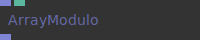

**Input Ports:**
- **Array In (Array)**: Value (Number)
- **Array In (Array)**: *Check documentation*
- **Value (Number)**: *Check documentation*
- **Array Out (Array)**: *Check documentation*

**Output Ports:**
- **Array Out (Array)**: *Check documentation*

**Example Patch:** [Open in Editor](https://cables.gl/op/Ops.Array.ArrayModulo#example)

**Patches Using This Op:**
- *Search [cables.gl patches](https://cables.gl/patches) for "ArrayModulo"*

**Documentation:** [https://cables.gl/op/Ops.Array.ArrayModulo](https://cables.gl/op/Ops.Array.ArrayModulo)

---

### ArrayMultiply

**Full Name:** `Ops.Array.ArrayMultiply`

**Description:** Multiply every number in an array

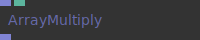

**Input Ports:**
- **In (Array)**: Value (Number)
- **INPUT PORTSIn (Array)**: Value (Number)
- **In (Array)**: *Check documentation*
- **Value (Number)**: *Check documentation*
- **OUTPUT PORTSResult (Array)**: *Check documentation*
- **Result (Array)**: *Check documentation*

**Output Ports:**
- **Result (Array)**: *Check documentation*

**Example Patch:** [Open in Editor](https://cables.gl/op/Ops.Array.ArrayMultiply#example)

**Patches Using This Op:**
- *Search [cables.gl patches](https://cables.gl/patches) for "ArrayMultiply"*

**Documentation:** [https://cables.gl/op/Ops.Array.ArrayMultiply](https://cables.gl/op/Ops.Array.ArrayMultiply)

---

### ArrayNumberRamp

**Full Name:** `Ops.Array.ArrayNumberRamp`

**Description:** Create an array that contains X numbers between start and end values

**Input Ports:**
- **Start Value (Number)**: End Value (Number)Entries (Number: integer)
- **Start Value (Number)**: *Check documentation*
- **End Value (Number)**: *Check documentation*
- **Entries (Number: integer)**: *Check documentation*
- **OUTPUT PORTSResult (Array)**: *Check documentation*
- **Result (Array)**: *Check documentation*

**Output Ports:**
- **Result (Array)**: *Check documentation*

**Example Patch:** [Open in Editor](https://cables.gl/op/Ops.Array.ArrayNumberRamp#example)

**Patches Using This Op:**
- *Search [cables.gl patches](https://cables.gl/patches) for "ArrayNumberRamp"*

**Documentation:** [https://cables.gl/op/Ops.Array.ArrayNumberRamp](https://cables.gl/op/Ops.Array.ArrayNumberRamp)

---

### ArrayOfArrays

**Full Name:** `Ops.Array.ArrayOfArrays`

**Description:** Create an array filled with other arrays

**Input Ports:**
- **Update (Trigger)**: combine all arrays
- **Array 0 (Array)**: Array 1 (Array)Array 2 (Array)Array 3 (Array)Array 4 (Array)Array 5 (Array)Array 6 (Array)Array 7 (Array)Array 8 (Array)Array 9 (Array)
- **Array 0 (Array)**: *Check documentation*
- **Array 1 (Array)**: *Check documentation*
- **Array 2 (Array)**: *Check documentation*
- **Array 3 (Array)**: *Check documentation*
- **Array 4 (Array)**: *Check documentation*
- **Array 5 (Array)**: *Check documentation*
- **Array 6 (Array)**: *Check documentation*
- **Array 7 (Array)**: *Check documentation*
- **Array 8 (Array)**: *Check documentation*
- **Array 9 (Array)**: *Check documentation*
- **OUTPUT PORTSResult (Array)**: array of arrays out
- **Result (Array)**: array of arrays out

**Output Ports:**
- **Result (Array)**: array of arrays out

**Example Patch:** [Open in Editor](https://cables.gl/op/Ops.Array.ArrayOfArrays#example)

**Patches Using This Op:**
- *Search [cables.gl patches](https://cables.gl/patches) for "ArrayOfArrays"*

**Documentation:** [https://cables.gl/op/Ops.Array.ArrayOfArrays](https://cables.gl/op/Ops.Array.ArrayOfArrays)

---

### ArrayOfObjectsFilterByKeyValue

**Full Name:** `Ops.Array.ArrayOfObjectsFilterByKeyValue`

**Description:** Filter key-value pairs in objects in an array of objects

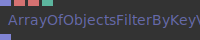

**Input Ports:**
- **Array (Array)**: Array input
- **Filter Key (String)**: key to use
- **Filter Value (String)**: value to use
- **Method index (Number: integer)**: equals  startsWith  endsWith  includes Invert Filter (Number: boolean)invert result (discard all objects that have key-value pair)
- **Method index (Number: integer)**: equals  startsWith  endsWith  includes
- **Invert Filter (Number: boolean)**: invert result (discard all objects that have key-value pair)
- **invert result (discard all objects that have key-value pair)**: *Check documentation*
- **OUTPUT PORTSarrayOut (Array)**: output array
- **arrayOut (Array)**: output array

**Output Ports:**
- **arrayOut (Array)**: output array

**Example Patch:** [Open in Editor](https://cables.gl/op/Ops.Array.ArrayOfObjectsFilterByKeyValue#example)

**Patches Using This Op:**
- *Search [cables.gl patches](https://cables.gl/patches) for "ArrayOfObjectsFilterByKeyValue"*

**Documentation:** [https://cables.gl/op/Ops.Array.ArrayOfObjectsFilterByKeyValue](https://cables.gl/op/Ops.Array.ArrayOfObjectsFilterByKeyValue)

---

### ArrayOfObjectsFilterKeys

**Full Name:** `Ops.Array.ArrayOfObjectsFilterKeys`

**Description:** Remove key-value pairs from objects in an array of objects

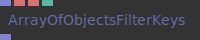

**Input Ports:**
- **Array (Array)**: array of objects input
- **Keys (String)**: keys to keep in the objects
- **Seperator (String)**: the character to seperate the keys
- **Invert Filter (Number: boolean)**: inverts the operation, drops all specified keys
- **Array Out (Array)**: the resulting array of objects

**Output Ports:**
- **Array Out (Array)**: the resulting array of objects

**Example Patch:** [Open in Editor](https://cables.gl/op/Ops.Array.ArrayOfObjectsFilterKeys#example)

**Patches Using This Op:**
- *Search [cables.gl patches](https://cables.gl/patches) for "ArrayOfObjectsFilterKeys"*

**Documentation:** [https://cables.gl/op/Ops.Array.ArrayOfObjectsFilterKeys](https://cables.gl/op/Ops.Array.ArrayOfObjectsFilterKeys)

---

### ArrayOfObjectsToString

**Full Name:** `Ops.Array.ArrayOfObjectsToString`

**Description:** Convert an array of objects into readable string format

**Input Ports:**
- **Array In (Array)**: array of objects input
- **OUTPUT PORTSString (String)**: string output
- **String (String)**: string output

**Output Ports:**
- **String (String)**: string output

**Example Patch:** [Open in Editor](https://cables.gl/op/Ops.Array.ArrayOfObjectsToString#example)

**Patches Using This Op:**
- *Search [cables.gl patches](https://cables.gl/patches) for "ArrayOfObjectsToString"*

**Documentation:** [https://cables.gl/op/Ops.Array.ArrayOfObjectsToString](https://cables.gl/op/Ops.Array.ArrayOfObjectsToString)

---

### ArrayPack

**Full Name:** `Ops.Array.ArrayPack`

**Description:** Pack multiple arrays into a new array

**Input Ports:**
- **Array 0 (Array)**: Array 1 (Array)Array 2 (Array)Array 3 (Array)Array 4 (Array)Array 5 (Array)Array 6 (Array)Array 7 (Array)
- **Array 0 (Array)**: *Check documentation*
- **Array 1 (Array)**: *Check documentation*
- **Array 2 (Array)**: *Check documentation*
- **Array 3 (Array)**: *Check documentation*
- **Array 4 (Array)**: *Check documentation*
- **Array 5 (Array)**: *Check documentation*
- **Array 6 (Array)**: *Check documentation*
- **Array 7 (Array)**: *Check documentation*
- **OUTPUT PORTSResult (Array)**: *Check documentation*
- **Result (Array)**: *Check documentation*

**Output Ports:**
- **Result (Array)**: *Check documentation*

**Example Patch:** [Open in Editor](https://cables.gl/op/Ops.Array.ArrayPack#example)

**Patches Using This Op:**
- *Search [cables.gl patches](https://cables.gl/patches) for "ArrayPack"*

**Documentation:** [https://cables.gl/op/Ops.Array.ArrayPack](https://cables.gl/op/Ops.Array.ArrayPack)

---

### ArrayPack2

**Full Name:** `Ops.Array.ArrayPack2`

**Description:** Pack two individual arrays into a new array

**Input Ports:**
- **Trigger in (Trigger)**: Trigger in
- **Array 1 (Array)**: array 1 in
- **Array 2 (Array)**: array 2 in

**Output Ports:**
- **Trigger out (Trigger)**: Trigger out
- **Array out (Array)**: Packed array
- **Array length (Number)**: Length of array

**Example Patch:** [Open in Editor](https://cables.gl/op/Ops.Array.ArrayPack2#example)

**Patches Using This Op:**
- *Search [cables.gl patches](https://cables.gl/patches) for "ArrayPack2"*

**Documentation:** [https://cables.gl/op/Ops.Array.ArrayPack2](https://cables.gl/op/Ops.Array.ArrayPack2)

---

### ArrayPack2Simple

**Full Name:** `Ops.Array.ArrayPack2Simple`

**Description:** Pack 2 individual arrays into an array2

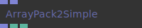

**Input Ports:**
- **Array 1 (Array)**: Array 2 (Array)
- **Array 1 (Array)**: *Check documentation*
- **Array 2 (Array)**: *Check documentation*
- **Array out (Array)**: Num Points (Number)Array length (Number)
- **Array out (Array)**: *Check documentation*
- **Num Points (Number)**: *Check documentation*
- **Array length (Number)**: *Check documentation*

**Output Ports:**
- **Array out (Array)**: Num Points (Number)Array length (Number)

**Example Patch:** [Open in Editor](https://cables.gl/op/Ops.Array.ArrayPack2Simple#example)

**Patches Using This Op:**
- *Search [cables.gl patches](https://cables.gl/patches) for "ArrayPack2Simple"*

**Documentation:** [https://cables.gl/op/Ops.Array.ArrayPack2Simple](https://cables.gl/op/Ops.Array.ArrayPack2Simple)

---

### ArrayPack3

**Full Name:** `Ops.Array.ArrayPack3`

**Description:** Pack 3 individual arrays into a xyz array

**Input Ports:**
- **Trigger in (Trigger)**: Trigger the op
- **Array 1 (Array)**: x array
- **Array 2 (Array)**: y array
- **Array 3 (Array)**: z array

**Output Ports:**
- **Trigger out (Trigger)**: Trigger out
- **Array out (Array)**: The combined xyz array
- **Num Points (Number)**: Amount of xyz points in the array
- **Array length (Number)**: *Check documentation*

**Example Patch:** [Open in Editor](https://cables.gl/op/Ops.Array.ArrayPack3#example)

**Patches Using This Op:**
- *Search [cables.gl patches](https://cables.gl/patches) for "ArrayPack3"*

**Documentation:** [https://cables.gl/op/Ops.Array.ArrayPack3](https://cables.gl/op/Ops.Array.ArrayPack3)

---

### ArrayPack3Simple

**Full Name:** `Ops.Array.ArrayPack3Simple`

**Description:** Pack 3 individual arrays into an array3

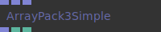

**Input Ports:**
- **Array 1 (Array)**: Array 2 (Array)Array 3 (Array)
- **Array 1 (Array)**: *Check documentation*
- **Array 2 (Array)**: *Check documentation*
- **Array 3 (Array)**: *Check documentation*
- **Array out (Array)**: Num Points (Number)Array length (Number)
- **Array out (Array)**: *Check documentation*
- **Num Points (Number)**: *Check documentation*
- **Array length (Number)**: *Check documentation*

**Output Ports:**
- **Array out (Array)**: Num Points (Number)Array length (Number)

**Example Patch:** [Open in Editor](https://cables.gl/op/Ops.Array.ArrayPack3Simple#example)

**Patches Using This Op:**
- *Search [cables.gl patches](https://cables.gl/patches) for "ArrayPack3Simple"*

**Documentation:** [https://cables.gl/op/Ops.Array.ArrayPack3Simple](https://cables.gl/op/Ops.Array.ArrayPack3Simple)

---

### ArrayPack4

**Full Name:** `Ops.Array.ArrayPack4`

**Description:** Pack 4 arrays into one array

**Input Ports:**
- **Trigger in (Trigger)**: Array 1 (Array)Array 2 (Array)Array 3 (Array)Array 4 (Array)
- **Trigger in (Trigger)**: *Check documentation*
- **Array 1 (Array)**: *Check documentation*
- **Array 2 (Array)**: *Check documentation*
- **Array 3 (Array)**: *Check documentation*
- **Array 4 (Array)**: *Check documentation*
- **Trigger out (Trigger)**: Array out (Array)Array length (Number)

**Output Ports:**
- **Trigger out (Trigger)**: Array out (Array)Array length (Number)
- **Trigger out (Trigger)**: *Check documentation*
- **Array out (Array)**: *Check documentation*
- **Array length (Number)**: *Check documentation*

**Example Patch:** [Open in Editor](https://cables.gl/op/Ops.Array.ArrayPack4#example)

**Patches Using This Op:**
- *Search [cables.gl patches](https://cables.gl/patches) for "ArrayPack4"*

**Documentation:** [https://cables.gl/op/Ops.Array.ArrayPack4](https://cables.gl/op/Ops.Array.ArrayPack4)

---

### ArrayPack4Simple

**Full Name:** `Ops.Array.ArrayPack4Simple`

**Description:** Pack 3 individual arrays into an array3

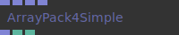

**Input Ports:**
- **Array 1 (Array)**: Array 2 (Array)Array 3 (Array)Array 4 (Array)
- **Array 1 (Array)**: *Check documentation*
- **Array 2 (Array)**: *Check documentation*
- **Array 3 (Array)**: *Check documentation*
- **Array 4 (Array)**: *Check documentation*
- **Array out (Array)**: Num Points (Number)Array length (Number)
- **Array out (Array)**: *Check documentation*
- **Num Points (Number)**: *Check documentation*
- **Array length (Number)**: *Check documentation*

**Output Ports:**
- **Array out (Array)**: Num Points (Number)Array length (Number)

**Example Patch:** [Open in Editor](https://cables.gl/op/Ops.Array.ArrayPack4Simple#example)

**Patches Using This Op:**
- *Search [cables.gl patches](https://cables.gl/patches) for "ArrayPack4Simple"*

**Documentation:** [https://cables.gl/op/Ops.Array.ArrayPack4Simple](https://cables.gl/op/Ops.Array.ArrayPack4Simple)

---

### ArrayPow

**Full Name:** `Ops.Array.ArrayPow`

**Description:** Apply a Pow function to an array

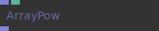

**Input Ports:**
- **Array in (Array)**: The array to apply the pow function to
- **Pow factor (Number)**: Values below 0 are not accepted. 1 = Array in is unaltered
- **Array out (Array)**: The modified array out

**Output Ports:**
- **Array out (Array)**: The modified array out

**Example Patch:** [Open in Editor](https://cables.gl/op/Ops.Array.ArrayPow#example)

**Patches Using This Op:**
- *Search [cables.gl patches](https://cables.gl/patches) for "ArrayPow"*

**Documentation:** [https://cables.gl/op/Ops.Array.ArrayPow](https://cables.gl/op/Ops.Array.ArrayPow)

---

### ArrayPushString

**Full Name:** `Ops.Array.ArrayPushString`

**Description:** Push/Append a string to the end of an array

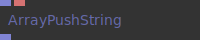

**Input Ports:**
- **Array (Array)**: String (String)
- **INPUT PORTSArray (Array)**: String (String)
- **Array (Array)**: *Check documentation*
- **String (String)**: *Check documentation*
- **OUTPUT PORTSResult (Array)**: *Check documentation*
- **Result (Array)**: *Check documentation*

**Output Ports:**
- **Result (Array)**: *Check documentation*

**Example Patch:** [Open in Editor](https://cables.gl/op/Ops.Array.ArrayPushString#example)

**Patches Using This Op:**
- *Search [cables.gl patches](https://cables.gl/patches) for "ArrayPushString"*

**Documentation:** [https://cables.gl/op/Ops.Array.ArrayPushString](https://cables.gl/op/Ops.Array.ArrayPushString)

---

### ArrayQuantizer

**Full Name:** `Ops.Array.ArrayQuantizer`

**Description:** Quantize input to nearest number in array

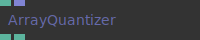

**Input Ports:**
- **Value (Number)**: input number
- **Constraints Array Input (Array)**: array of numbers to which the input should be quantized (so called constraints)
- **Summary (oneliner)**: *Check documentation*
- **Documentation (markdown)**: *Check documentation*
- **Youtube ids (comma seperated)**: *Check documentation*

**Output Ports:**
- **Quantized Value (Number)**: the quantized number
- **Quantization Error (Number)**: the difference between the quantized and unquantized number

**Example Patch:** [Open in Editor](https://cables.gl/op/Ops.Array.ArrayQuantizer#example)

**Patches Using This Op:**
- *Search [cables.gl patches](https://cables.gl/patches) for "ArrayQuantizer"*

**Documentation:** [https://cables.gl/op/Ops.Array.ArrayQuantizer](https://cables.gl/op/Ops.Array.ArrayQuantizer)

---

### ArrayRandomSelection

**Full Name:** `Ops.Array.ArrayRandomSelection`

**Description:** Extract a definable amount of values from an array

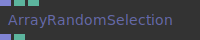

**Input Ports:**
- **Array (Array)**: The array in to extract random values from
- **Elements (Number: integer)**: Amount of elements to extract
- **Seed (Number)**: Random number seed. 0 is always different on a reload. Set to a number to keep a fixed seed.
- **Result (Array)**: Array Out
- **Array length (Number)**: *Check documentation*

**Output Ports:**
- **Result (Array)**: Array Out
- **Array length (Number)**: *Check documentation*

**Example Patch:** [Open in Editor](https://cables.gl/op/Ops.Array.ArrayRandomSelection#example)

**Patches Using This Op:**
- *Search [cables.gl patches](https://cables.gl/patches) for "ArrayRandomSelection"*

**Documentation:** [https://cables.gl/op/Ops.Array.ArrayRandomSelection](https://cables.gl/op/Ops.Array.ArrayRandomSelection)

---

### ArrayRemoveFalsy

**Full Name:** `Ops.Array.ArrayRemoveFalsy`

**Description:** Remove falsy items from an array

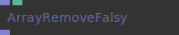

**Input Ports:**
- **Array (Array)**: Remove Falsy (Number: boolean)
- **INPUT PORTSArray (Array)**: Remove Falsy (Number: boolean)
- **Array (Array)**: *Check documentation*
- **Remove Falsy (Number: boolean)**: *Check documentation*
- **Result Array (Array)**: *Check documentation*

**Output Ports:**
- **Result Array (Array)**: *Check documentation*

**Example Patch:** [Open in Editor](https://cables.gl/op/Ops.Array.ArrayRemoveFalsy#example)

**Patches Using This Op:**
- *Search [cables.gl patches](https://cables.gl/patches) for "ArrayRemoveFalsy"*

**Documentation:** [https://cables.gl/op/Ops.Array.ArrayRemoveFalsy](https://cables.gl/op/Ops.Array.ArrayRemoveFalsy)

---

### ArrayReverse

**Full Name:** `Ops.Array.ArrayReverse`

**Description:** Reverse an array

**Input Ports:**
- **Input (Array)**: Active (Number: boolean)
- **INPUT PORTSInput (Array)**: Active (Number: boolean)
- **Input (Array)**: *Check documentation*
- **Active (Number: boolean)**: *Check documentation*
- **OUTPUT PORTSResult (Array)**: *Check documentation*
- **Result (Array)**: *Check documentation*

**Output Ports:**
- **Result (Array)**: *Check documentation*

**Example Patch:** [Open in Editor](https://cables.gl/op/Ops.Array.ArrayReverse#example)

**Patches Using This Op:**
- *Search [cables.gl patches](https://cables.gl/patches) for "ArrayReverse"*

**Documentation:** [https://cables.gl/op/Ops.Array.ArrayReverse](https://cables.gl/op/Ops.Array.ArrayReverse)

---

### ArrayRound

**Full Name:** `Ops.Array.ArrayRound`

**Description:** Round numbers up

**Input Ports:**
- **In (Array)**: Array in
- **Method index (Number: integer)**: Decimal Places (Number: integer)
- **Method index (Number: integer)**: *Check documentation*
- **Decimal Places (Number: integer)**: *Check documentation*
- **OUTPUT PORTSResult (Array)**: Array out
- **Result (Array)**: Array out

**Output Ports:**
- **Result (Array)**: Array out

**Example Patch:** [Open in Editor](https://cables.gl/op/Ops.Array.ArrayRound#example)

**Patches Using This Op:**
- *Search [cables.gl patches](https://cables.gl/patches) for "ArrayRound"*

**Documentation:** [https://cables.gl/op/Ops.Array.ArrayRound](https://cables.gl/op/Ops.Array.ArrayRound)

---

### ArraySetNumber

**Full Name:** `Ops.Array.ArraySetNumber`

**Description:** Set a number at index in an array

**Input Ports:**
- **Array (Array)**: Array in
- **Index (Number: integer)**: index to update with the value
- **Number (Number)**: number that will be set to the selected index
- **OUTPUT PORTSResult (Array)**: Modified array out
- **Result (Array)**: Modified array out

**Output Ports:**
- **Result (Array)**: Modified array out

**Example Patch:** [Open in Editor](https://cables.gl/op/Ops.Array.ArraySetNumber#example)

**Patches Using This Op:**
- *Search [cables.gl patches](https://cables.gl/patches) for "ArraySetNumber"*

**Documentation:** [https://cables.gl/op/Ops.Array.ArraySetNumber](https://cables.gl/op/Ops.Array.ArraySetNumber)

---

### ArraySetString

**Full Name:** `Ops.Array.ArraySetString`

**Description:** Set a string at index in an array

**Input Ports:**
- **Array (Array)**: Array in
- **Index (Number: integer)**: index to update with the value
- **Value (String)**: *Check documentation*
- **OUTPUT PORTSResult (Array)**: Modified array out
- **Result (Array)**: Modified array out

**Output Ports:**
- **Result (Array)**: Modified array out

**Example Patch:** [Open in Editor](https://cables.gl/op/Ops.Array.ArraySetString#example)

**Patches Using This Op:**
- *Search [cables.gl patches](https://cables.gl/patches) for "ArraySetString"*

**Documentation:** [https://cables.gl/op/Ops.Array.ArraySetString](https://cables.gl/op/Ops.Array.ArraySetString)

---

### ArraySin

**Full Name:** `Ops.Array.ArraySin`

**Description:** Perform a sin or cos operation on the contents of an array

**Input Ports:**
- **array in (Array)**: Math function index (Number: integer)Phase (Number)Frequency (Number)Amplitude (Number)
- **array in (Array)**: *Check documentation*
- **Phase (Number)**: *Check documentation*
- **Frequency (Number)**: *Check documentation*
- **Amplitude (Number)**: *Check documentation*
- **Array result (Array)**: *Check documentation*

**Output Ports:**
- **Array result (Array)**: *Check documentation*

**Example Patch:** [Open in Editor](https://cables.gl/op/Ops.Array.ArraySin#example)

**Patches Using This Op:**
- *Search [cables.gl patches](https://cables.gl/patches) for "ArraySin"*

**Documentation:** [https://cables.gl/op/Ops.Array.ArraySin](https://cables.gl/op/Ops.Array.ArraySin)

---

### ArraySmoothStep

**Full Name:** `Ops.Array.ArraySmoothStep`

**Description:** Apply a smoothstep function to the contents of an array

**Input Ports:**
- **Array In (Array)**: The array in to modify
- **Min (Number)**: min interpolation point
- **Max (Number)**: max interpolation point
- **Array out (Array)**: The modified array

**Output Ports:**
- **Array out (Array)**: The modified array

**Example Patch:** [Open in Editor](https://cables.gl/op/Ops.Array.ArraySmoothStep#example)

**Patches Using This Op:**
- *Search [cables.gl patches](https://cables.gl/patches) for "ArraySmoothStep"*

**Documentation:** [https://cables.gl/op/Ops.Array.ArraySmoothStep](https://cables.gl/op/Ops.Array.ArraySmoothStep)

---

### ArraySort

**Full Name:** `Ops.Array.ArraySort`

**Description:** Sort an array

**Input Ports:**
- **Colors (Array)**: Sort index (Number: integer) No  Luminance  Hue  Saturation  Lightness Input Format index (Number: integer) RGBA  RGB
- **INPUT PORTSColors (Array)**: Sort index (Number: integer) No  Luminance  Hue  Saturation  Lightness Input Format index (Number: integer) RGBA  RGB
- **Colors (Array)**: *Check documentation*
- **Sort index (Number: integer)**: No  Luminance  Hue  Saturation  Lightness
- **New Colors (Array)**: *Check documentation*

**Output Ports:**
- **New Colors (Array)**: *Check documentation*

**Example Patch:** [Open in Editor](https://cables.gl/op/Ops.Array.ArraySort#example)

**Patches Using This Op:**
- *Search [cables.gl patches](https://cables.gl/patches) for "ArraySort"*

**Documentation:** [https://cables.gl/op/Ops.Array.ArraySort](https://cables.gl/op/Ops.Array.ArraySort)

---

### ArraySplit

**Full Name:** `Ops.Array.ArraySplit`

**Description:** Split an array into multiple arrays

**Input Ports:**
- *Visit [Ops.Array.ArraySplit documentation](https://cables.gl/op/Ops.Array.ArraySplit) for complete input port details*

**Output Ports:**
- *Visit [Ops.Array.ArraySplit documentation](https://cables.gl/op/Ops.Array.ArraySplit) for complete output port details*

**Example Patch:** [Open in Editor](https://cables.gl/op/Ops.Array.ArraySplit#example)

**Patches Using This Op:**
- *Search [cables.gl patches](https://cables.gl/patches) for "ArraySplit"*

**Documentation:** [https://cables.gl/op/Ops.Array.ArraySplit](https://cables.gl/op/Ops.Array.ArraySplit)

---

### ArraySubtract

**Full Name:** `Ops.Array.ArraySubtract`

**Description:** Subtract a number from all values in an array

**Input Ports:**
- **Array In (Array)**: Array in
- **Value (Number)**: The number to subtract from all numbers in the array
- **Mode index (Number: integer)**: Array-x  x-Array
- **Array Out (Array)**: Array out

**Output Ports:**
- **Array Out (Array)**: Array out

**Example Patch:** [Open in Editor](https://cables.gl/op/Ops.Array.ArraySubtract#example)

**Patches Using This Op:**
- *Search [cables.gl patches](https://cables.gl/patches) for "ArraySubtract"*

**Documentation:** [https://cables.gl/op/Ops.Array.ArraySubtract](https://cables.gl/op/Ops.Array.ArraySubtract)

---

### ArraySum

**Full Name:** `Ops.Array.ArraySum`

**Description:** Sum all values in an array

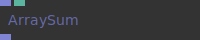

**Input Ports:**
- **In (Array)**: Array in
- **Value (Number)**: The number to add to all numbers in the array
- **OUTPUT PORTSResult (Array)**: Array out
- **Result (Array)**: Array out

**Output Ports:**
- **Result (Array)**: Array out

**Example Patch:** [Open in Editor](https://cables.gl/op/Ops.Array.ArraySum#example)

**Patches Using This Op:**
- *Search [cables.gl patches](https://cables.gl/patches) for "ArraySum"*

**Documentation:** [https://cables.gl/op/Ops.Array.ArraySum](https://cables.gl/op/Ops.Array.ArraySum)

---

### ArrayToObject

**Full Name:** `Ops.Array.ArrayToObject`

**Description:** Convert an array to an object

**Input Ports:**
- *Visit [Ops.Array.ArrayToObject documentation](https://cables.gl/op/Ops.Array.ArrayToObject) for complete input port details*

**Output Ports:**
- *Visit [Ops.Array.ArrayToObject documentation](https://cables.gl/op/Ops.Array.ArrayToObject) for complete output port details*

**Example Patch:** [Open in Editor](https://cables.gl/op/Ops.Array.ArrayToObject#example)

**Patches Using This Op:**
- *Search [cables.gl patches](https://cables.gl/patches) for "ArrayToObject"*

**Documentation:** [https://cables.gl/op/Ops.Array.ArrayToObject](https://cables.gl/op/Ops.Array.ArrayToObject)

---

### ArrayToString

**Full Name:** `Ops.Array.ArrayToString`

**Description:** Convert an array to a string

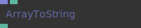

**Input Ports:**
- **Array (Array)**: Seperator (String)New Line (Number: boolean)
- **INPUT PORTSArray (Array)**: Seperator (String)New Line (Number: boolean)
- **Array (Array)**: *Check documentation*
- **Seperator (String)**: *Check documentation*
- **New Line (Number: boolean)**: *Check documentation*
- **OUTPUT PORTSResult (String)**: *Check documentation*
- **Result (String)**: *Check documentation*

**Output Ports:**
- **Result (String)**: *Check documentation*

**Example Patch:** [Open in Editor](https://cables.gl/op/Ops.Array.ArrayToString#example)

**Patches Using This Op:**
- *Search [cables.gl patches](https://cables.gl/patches) for "ArrayToString"*

**Documentation:** [https://cables.gl/op/Ops.Array.ArrayToString](https://cables.gl/op/Ops.Array.ArrayToString)

---

### ArrayUnique

**Full Name:** `Ops.Array.ArrayUnique`

**Description:** Remove duplicate values from an array

**Input Ports:**
- **array (Array)**: input array
- **Format index (Number: integer)**: choose between 3 different unique modes: x, xy, xyz
- **Format (String)**: choose between 3 different unique modes: x, xy, xyz

**Output Ports:**
- **arrayOut (Array)**: deduped array output
- **Array Length Out (Number)**: length of the new array

**Example Patch:** [Open in Editor](https://cables.gl/op/Ops.Array.ArrayUnique#example)

**Patches Using This Op:**
- *Search [cables.gl patches](https://cables.gl/patches) for "ArrayUnique"*

**Documentation:** [https://cables.gl/op/Ops.Array.ArrayUnique](https://cables.gl/op/Ops.Array.ArrayUnique)

---

### ArrayUnpack

**Full Name:** `Ops.Array.ArrayUnpack`

**Description:** Unpack an array into multiple arrays

**Input Ports:**
- **Array in xyz (Array)**: Array in

**Output Ports:**
- **Array 1 out (Array)**: X component out
- **Array 2 out (Array)**: Y component out
- **Array lengths (Number)**: Length of arrays

**Example Patch:** [Open in Editor](https://cables.gl/op/Ops.Array.ArrayUnpack#example)

**Patches Using This Op:**
- *Search [cables.gl patches](https://cables.gl/patches) for "ArrayUnpack"*

**Documentation:** [https://cables.gl/op/Ops.Array.ArrayUnpack](https://cables.gl/op/Ops.Array.ArrayUnpack)

---

### ArrayUnpack2

**Full Name:** `Ops.Array.ArrayUnpack2`

**Description:** Unpack an array2 into two individual arrays

**Input Ports:**
- **Array in xyz (Array)**: Array in

**Output Ports:**
- **Array 1 out (Array)**: X component out
- **Array 2 out (Array)**: Y component out
- **Array lengths (Number)**: Length of arrays

**Example Patch:** [Open in Editor](https://cables.gl/op/Ops.Array.ArrayUnpack2#example)

**Patches Using This Op:**
- *Search [cables.gl patches](https://cables.gl/patches) for "ArrayUnpack2"*

**Documentation:** [https://cables.gl/op/Ops.Array.ArrayUnpack2](https://cables.gl/op/Ops.Array.ArrayUnpack2)

---

### ArrayUnpack3

**Full Name:** `Ops.Array.ArrayUnpack3`

**Description:** Unpack an array3 into three individual arrays

**Input Ports:**
- **Array in xyz (Array)**: The array to unpack

**Output Ports:**
- **Array 1 out (Array)**: array x out
- **Array 2 out (Array)**: array y out
- **Array 3 out (Array)**: array z out
- **Array lengths (Number)**: *Check documentation*

**Example Patch:** [Open in Editor](https://cables.gl/op/Ops.Array.ArrayUnpack3#example)

**Patches Using This Op:**
- *Search [cables.gl patches](https://cables.gl/patches) for "ArrayUnpack3"*

**Documentation:** [https://cables.gl/op/Ops.Array.ArrayUnpack3](https://cables.gl/op/Ops.Array.ArrayUnpack3)

---

### ArrayUnpack4

**Full Name:** `Ops.Array.ArrayUnpack4`

**Description:** Unpack an array4 into four individual arrays

**Input Ports:**
- **Array in xyzw (Array)**: Array in xyzw

**Output Ports:**
- **Array 1 out (Array)**: array x out
- **Array 2 out (Array)**: array y out
- **Array 3 out (Array)**: array z out
- **Array 4 out (Array)**: array w out
- **Array lengths (Number)**: *Check documentation*

**Example Patch:** [Open in Editor](https://cables.gl/op/Ops.Array.ArrayUnpack4#example)

**Patches Using This Op:**
- *Search [cables.gl patches](https://cables.gl/patches) for "ArrayUnpack4"*

**Documentation:** [https://cables.gl/op/Ops.Array.ArrayUnpack4](https://cables.gl/op/Ops.Array.ArrayUnpack4)

---

### ArrayZip

**Full Name:** `Ops.Array.ArrayZip`

**Description:** Zip two arrays together

**Input Ports:**
- *Visit [Ops.Array.ArrayZip documentation](https://cables.gl/op/Ops.Array.ArrayZip) for complete input port details*

**Output Ports:**
- *Visit [Ops.Array.ArrayZip documentation](https://cables.gl/op/Ops.Array.ArrayZip) for complete output port details*

**Example Patch:** [Open in Editor](https://cables.gl/op/Ops.Array.ArrayZip#example)

**Patches Using This Op:**
- *Search [cables.gl patches](https://cables.gl/patches) for "ArrayZip"*

**Documentation:** [https://cables.gl/op/Ops.Array.ArrayZip](https://cables.gl/op/Ops.Array.ArrayZip)

---

## Quick Reference: All Op Namespaces

- **Ops.Anim** - Animations
- **Ops.Array** - Process and manipulate collections (arrays) of data
- **Ops.Audio** - Audio operations
- **Ops.Boolean** - Boolean logic operations
- **Ops.Cables** - Cables-specific operations
- **Ops.Color** - Color manipulation
- **Ops.Data** - Data operations
- **Ops.Date** - Date and time operations
- **Ops.Debug** - Debugging tools
- **Ops.Devices** - Device input/output
- **Ops.Extension** - Extension operations
- **Ops.Gl** - WebGL operations
- **Ops.Graphics** - Graphics operations
- **Ops.Html** - HTML operations
- **Ops.Json** - JSON operations
- **Ops.Math** - Mathematical operations
- **Ops.Net** - Network operations
- **Ops.Number** - Number operations
- **Ops.Sidebar** - Sidebar interface operations
- **Ops.String** - String operations
- **Ops.Templates** - Template operations
- **Ops.TimeLine** - Timeline operations
- **Ops.Trigger** - Trigger operations
- **Ops.Ui** - User interface operations
- **Ops.Vars** - Variable operations
- **Ops.WebAudio** - Web Audio API operations
- **Ops.Website** - Website operations

For the complete, up-to-date list of all ops, visit: [https://cables.gl/ops/](https://cables.gl/ops/)

---

## Ops.Boolean

*Boolean Logic Operations*

### And

**Full Name:** `Ops.Boolean.And`

**Description:** *Visit [documentation](https://cables.gl/op/Ops.Boolean.And) for details*

**Input Ports:**
- *Visit [Ops.Boolean.And documentation](https://cables.gl/op/Ops.Boolean.And) for complete input port details*

**Output Ports:**
- *Visit [Ops.Boolean.And documentation](https://cables.gl/op/Ops.Boolean.And) for complete output port details*

**Example Patch:** [Open in Editor](https://cables.gl/op/Ops.Boolean.And#example)

**Patches Using This Op:**
- *Search [cables.gl patches](https://cables.gl/patches) for "And"*

**Documentation:** [https://cables.gl/op/Ops.Boolean.And](https://cables.gl/op/Ops.Boolean.And)

---

### BoolToNumber

**Full Name:** `Ops.Boolean.BoolToNumber`

**Description:** *Visit [documentation](https://cables.gl/op/Ops.Boolean.BoolToNumber) for details*

**Input Ports:**
- *Visit [Ops.Boolean.BoolToNumber documentation](https://cables.gl/op/Ops.Boolean.BoolToNumber) for complete input port details*

**Output Ports:**
- *Visit [Ops.Boolean.BoolToNumber documentation](https://cables.gl/op/Ops.Boolean.BoolToNumber) for complete output port details*

**Example Patch:** [Open in Editor](https://cables.gl/op/Ops.Boolean.BoolToNumber#example)

**Patches Using This Op:**
- *Search [cables.gl patches](https://cables.gl/patches) for "BoolToNumber"*

**Documentation:** [https://cables.gl/op/Ops.Boolean.BoolToNumber](https://cables.gl/op/Ops.Boolean.BoolToNumber)

---

### BoolToString

**Full Name:** `Ops.Boolean.BoolToString`

**Description:** *Visit [documentation](https://cables.gl/op/Ops.Boolean.BoolToString) for details*

**Input Ports:**
- *Visit [Ops.Boolean.BoolToString documentation](https://cables.gl/op/Ops.Boolean.BoolToString) for complete input port details*

**Output Ports:**
- *Visit [Ops.Boolean.BoolToString documentation](https://cables.gl/op/Ops.Boolean.BoolToString) for complete output port details*

**Example Patch:** [Open in Editor](https://cables.gl/op/Ops.Boolean.BoolToString#example)

**Patches Using This Op:**
- *Search [cables.gl patches](https://cables.gl/patches) for "BoolToString"*

**Documentation:** [https://cables.gl/op/Ops.Boolean.BoolToString](https://cables.gl/op/Ops.Boolean.BoolToString)

---

### BoolToTrigger

**Full Name:** `Ops.Boolean.BoolToTrigger`

**Description:** *Visit [documentation](https://cables.gl/op/Ops.Boolean.BoolToTrigger) for details*

**Input Ports:**
- *Visit [Ops.Boolean.BoolToTrigger documentation](https://cables.gl/op/Ops.Boolean.BoolToTrigger) for complete input port details*

**Output Ports:**
- *Visit [Ops.Boolean.BoolToTrigger documentation](https://cables.gl/op/Ops.Boolean.BoolToTrigger) for complete output port details*

**Example Patch:** [Open in Editor](https://cables.gl/op/Ops.Boolean.BoolToTrigger#example)

**Patches Using This Op:**
- *Search [cables.gl patches](https://cables.gl/patches) for "BoolToTrigger"*

**Documentation:** [https://cables.gl/op/Ops.Boolean.BoolToTrigger](https://cables.gl/op/Ops.Boolean.BoolToTrigger)

---

### BooleanVariable

**Full Name:** `Ops.Boolean.BooleanVariable`

**Description:** *Visit [documentation](https://cables.gl/op/Ops.Boolean.BooleanVariable) for details*

**Input Ports:**
- *Visit [Ops.Boolean.BooleanVariable documentation](https://cables.gl/op/Ops.Boolean.BooleanVariable) for complete input port details*

**Output Ports:**
- *Visit [Ops.Boolean.BooleanVariable documentation](https://cables.gl/op/Ops.Boolean.BooleanVariable) for complete output port details*

**Example Patch:** [Open in Editor](https://cables.gl/op/Ops.Boolean.BooleanVariable#example)

**Patches Using This Op:**
- *Search [cables.gl patches](https://cables.gl/patches) for "BooleanVariable"*

**Documentation:** [https://cables.gl/op/Ops.Boolean.BooleanVariable](https://cables.gl/op/Ops.Boolean.BooleanVariable)

---

### Equals

**Full Name:** `Ops.Boolean.Equals`

**Description:** *Visit [documentation](https://cables.gl/op/Ops.Boolean.Equals) for details*

**Input Ports:**
- *Visit [Ops.Boolean.Equals documentation](https://cables.gl/op/Ops.Boolean.Equals) for complete input port details*

**Output Ports:**
- *Visit [Ops.Boolean.Equals documentation](https://cables.gl/op/Ops.Boolean.Equals) for complete output port details*

**Example Patch:** [Open in Editor](https://cables.gl/op/Ops.Boolean.Equals#example)

**Patches Using This Op:**
- *Search [cables.gl patches](https://cables.gl/patches) for "Equals"*

**Documentation:** [https://cables.gl/op/Ops.Boolean.Equals](https://cables.gl/op/Ops.Boolean.Equals)

---

### GreaterThan

**Full Name:** `Ops.Boolean.GreaterThan`

**Description:** *Visit [documentation](https://cables.gl/op/Ops.Boolean.GreaterThan) for details*

**Input Ports:**
- *Visit [Ops.Boolean.GreaterThan documentation](https://cables.gl/op/Ops.Boolean.GreaterThan) for complete input port details*

**Output Ports:**
- *Visit [Ops.Boolean.GreaterThan documentation](https://cables.gl/op/Ops.Boolean.GreaterThan) for complete output port details*

**Example Patch:** [Open in Editor](https://cables.gl/op/Ops.Boolean.GreaterThan#example)

**Patches Using This Op:**
- *Search [cables.gl patches](https://cables.gl/patches) for "GreaterThan"*

**Documentation:** [https://cables.gl/op/Ops.Boolean.GreaterThan](https://cables.gl/op/Ops.Boolean.GreaterThan)

---

### IfElse

**Full Name:** `Ops.Boolean.IfElse`

**Description:** *Visit [documentation](https://cables.gl/op/Ops.Boolean.IfElse) for details*

**Input Ports:**
- *Visit [Ops.Boolean.IfElse documentation](https://cables.gl/op/Ops.Boolean.IfElse) for complete input port details*

**Output Ports:**
- *Visit [Ops.Boolean.IfElse documentation](https://cables.gl/op/Ops.Boolean.IfElse) for complete output port details*

**Example Patch:** [Open in Editor](https://cables.gl/op/Ops.Boolean.IfElse#example)

**Patches Using This Op:**
- *Search [cables.gl patches](https://cables.gl/patches) for "IfElse"*

**Documentation:** [https://cables.gl/op/Ops.Boolean.IfElse](https://cables.gl/op/Ops.Boolean.IfElse)

---

### LessThan

**Full Name:** `Ops.Boolean.LessThan`

**Description:** *Visit [documentation](https://cables.gl/op/Ops.Boolean.LessThan) for details*

**Input Ports:**
- *Visit [Ops.Boolean.LessThan documentation](https://cables.gl/op/Ops.Boolean.LessThan) for complete input port details*

**Output Ports:**
- *Visit [Ops.Boolean.LessThan documentation](https://cables.gl/op/Ops.Boolean.LessThan) for complete output port details*

**Example Patch:** [Open in Editor](https://cables.gl/op/Ops.Boolean.LessThan#example)

**Patches Using This Op:**
- *Search [cables.gl patches](https://cables.gl/patches) for "LessThan"*

**Documentation:** [https://cables.gl/op/Ops.Boolean.LessThan](https://cables.gl/op/Ops.Boolean.LessThan)

---

### Not

**Full Name:** `Ops.Boolean.Not`

**Description:** *Visit [documentation](https://cables.gl/op/Ops.Boolean.Not) for details*

**Input Ports:**
- *Visit [Ops.Boolean.Not documentation](https://cables.gl/op/Ops.Boolean.Not) for complete input port details*

**Output Ports:**
- *Visit [Ops.Boolean.Not documentation](https://cables.gl/op/Ops.Boolean.Not) for complete output port details*

**Example Patch:** [Open in Editor](https://cables.gl/op/Ops.Boolean.Not#example)

**Patches Using This Op:**
- *Search [cables.gl patches](https://cables.gl/patches) for "Not"*

**Documentation:** [https://cables.gl/op/Ops.Boolean.Not](https://cables.gl/op/Ops.Boolean.Not)

---

### NumberToBool

**Full Name:** `Ops.Boolean.NumberToBool`

**Description:** *Visit [documentation](https://cables.gl/op/Ops.Boolean.NumberToBool) for details*

**Input Ports:**
- *Visit [Ops.Boolean.NumberToBool documentation](https://cables.gl/op/Ops.Boolean.NumberToBool) for complete input port details*

**Output Ports:**
- *Visit [Ops.Boolean.NumberToBool documentation](https://cables.gl/op/Ops.Boolean.NumberToBool) for complete output port details*

**Example Patch:** [Open in Editor](https://cables.gl/op/Ops.Boolean.NumberToBool#example)

**Patches Using This Op:**
- *Search [cables.gl patches](https://cables.gl/patches) for "NumberToBool"*

**Documentation:** [https://cables.gl/op/Ops.Boolean.NumberToBool](https://cables.gl/op/Ops.Boolean.NumberToBool)

---

### Or

**Full Name:** `Ops.Boolean.Or`

**Description:** *Visit [documentation](https://cables.gl/op/Ops.Boolean.Or) for details*

**Input Ports:**
- *Visit [Ops.Boolean.Or documentation](https://cables.gl/op/Ops.Boolean.Or) for complete input port details*

**Output Ports:**
- *Visit [Ops.Boolean.Or documentation](https://cables.gl/op/Ops.Boolean.Or) for complete output port details*

**Example Patch:** [Open in Editor](https://cables.gl/op/Ops.Boolean.Or#example)

**Patches Using This Op:**
- *Search [cables.gl patches](https://cables.gl/patches) for "Or"*

**Documentation:** [https://cables.gl/op/Ops.Boolean.Or](https://cables.gl/op/Ops.Boolean.Or)

---

### Toggle

**Full Name:** `Ops.Boolean.Toggle`

**Description:** *Visit [documentation](https://cables.gl/op/Ops.Boolean.Toggle) for details*

**Input Ports:**
- *Visit [Ops.Boolean.Toggle documentation](https://cables.gl/op/Ops.Boolean.Toggle) for complete input port details*

**Output Ports:**
- *Visit [Ops.Boolean.Toggle documentation](https://cables.gl/op/Ops.Boolean.Toggle) for complete output port details*

**Example Patch:** [Open in Editor](https://cables.gl/op/Ops.Boolean.Toggle#example)

**Patches Using This Op:**
- *Search [cables.gl patches](https://cables.gl/patches) for "Toggle"*

**Documentation:** [https://cables.gl/op/Ops.Boolean.Toggle](https://cables.gl/op/Ops.Boolean.Toggle)

---

### TriggerBoolChange

**Full Name:** `Ops.Boolean.TriggerBoolChange`

**Description:** *Visit [documentation](https://cables.gl/op/Ops.Boolean.TriggerBoolChange) for details*

**Input Ports:**
- *Visit [Ops.Boolean.TriggerBoolChange documentation](https://cables.gl/op/Ops.Boolean.TriggerBoolChange) for complete input port details*

**Output Ports:**
- *Visit [Ops.Boolean.TriggerBoolChange documentation](https://cables.gl/op/Ops.Boolean.TriggerBoolChange) for complete output port details*

**Example Patch:** [Open in Editor](https://cables.gl/op/Ops.Boolean.TriggerBoolChange#example)

**Patches Using This Op:**
- *Search [cables.gl patches](https://cables.gl/patches) for "TriggerBoolChange"*

**Documentation:** [https://cables.gl/op/Ops.Boolean.TriggerBoolChange](https://cables.gl/op/Ops.Boolean.TriggerBoolChange)

---

### TriggerOnFalse

**Full Name:** `Ops.Boolean.TriggerOnFalse`

**Description:** *Visit [documentation](https://cables.gl/op/Ops.Boolean.TriggerOnFalse) for details*

**Input Ports:**
- *Visit [Ops.Boolean.TriggerOnFalse documentation](https://cables.gl/op/Ops.Boolean.TriggerOnFalse) for complete input port details*

**Output Ports:**
- *Visit [Ops.Boolean.TriggerOnFalse documentation](https://cables.gl/op/Ops.Boolean.TriggerOnFalse) for complete output port details*

**Example Patch:** [Open in Editor](https://cables.gl/op/Ops.Boolean.TriggerOnFalse#example)

**Patches Using This Op:**
- *Search [cables.gl patches](https://cables.gl/patches) for "TriggerOnFalse"*

**Documentation:** [https://cables.gl/op/Ops.Boolean.TriggerOnFalse](https://cables.gl/op/Ops.Boolean.TriggerOnFalse)

---

### TriggerOnTrue

**Full Name:** `Ops.Boolean.TriggerOnTrue`

**Description:** *Visit [documentation](https://cables.gl/op/Ops.Boolean.TriggerOnTrue) for details*

**Input Ports:**
- *Visit [Ops.Boolean.TriggerOnTrue documentation](https://cables.gl/op/Ops.Boolean.TriggerOnTrue) for complete input port details*

**Output Ports:**
- *Visit [Ops.Boolean.TriggerOnTrue documentation](https://cables.gl/op/Ops.Boolean.TriggerOnTrue) for complete output port details*

**Example Patch:** [Open in Editor](https://cables.gl/op/Ops.Boolean.TriggerOnTrue#example)

**Patches Using This Op:**
- *Search [cables.gl patches](https://cables.gl/patches) for "TriggerOnTrue"*

**Documentation:** [https://cables.gl/op/Ops.Boolean.TriggerOnTrue](https://cables.gl/op/Ops.Boolean.TriggerOnTrue)

---

## Ops.Color

*Color Manipulation and Conversion*

### ColorFromHex

**Full Name:** `Ops.Color.ColorFromHex`

**Description:** *Visit [documentation](https://cables.gl/op/Ops.Color.ColorFromHex) for details*

**Input Ports:**
- *Visit [Ops.Color.ColorFromHex documentation](https://cables.gl/op/Ops.Color.ColorFromHex) for complete input port details*

**Output Ports:**
- *Visit [Ops.Color.ColorFromHex documentation](https://cables.gl/op/Ops.Color.ColorFromHex) for complete output port details*

**Example Patch:** [Open in Editor](https://cables.gl/op/Ops.Color.ColorFromHex#example)

**Patches Using This Op:**
- *Search [cables.gl patches](https://cables.gl/patches) for "ColorFromHex"*

**Documentation:** [https://cables.gl/op/Ops.Color.ColorFromHex](https://cables.gl/op/Ops.Color.ColorFromHex)

---

### ColorPalette

**Full Name:** `Ops.Color.ColorPalette`

**Description:** *Visit [documentation](https://cables.gl/op/Ops.Color.ColorPalette) for details*

**Input Ports:**
- *Visit [Ops.Color.ColorPalette documentation](https://cables.gl/op/Ops.Color.ColorPalette) for complete input port details*

**Output Ports:**
- *Visit [Ops.Color.ColorPalette documentation](https://cables.gl/op/Ops.Color.ColorPalette) for complete output port details*

**Example Patch:** [Open in Editor](https://cables.gl/op/Ops.Color.ColorPalette#example)

**Patches Using This Op:**
- *Search [cables.gl patches](https://cables.gl/patches) for "ColorPalette"*

**Documentation:** [https://cables.gl/op/Ops.Color.ColorPalette](https://cables.gl/op/Ops.Color.ColorPalette)

---

### ColorToArray

**Full Name:** `Ops.Color.ColorToArray`

**Description:** *Visit [documentation](https://cables.gl/op/Ops.Color.ColorToArray) for details*

**Input Ports:**
- *Visit [Ops.Color.ColorToArray documentation](https://cables.gl/op/Ops.Color.ColorToArray) for complete input port details*

**Output Ports:**
- *Visit [Ops.Color.ColorToArray documentation](https://cables.gl/op/Ops.Color.ColorToArray) for complete output port details*

**Example Patch:** [Open in Editor](https://cables.gl/op/Ops.Color.ColorToArray#example)

**Patches Using This Op:**
- *Search [cables.gl patches](https://cables.gl/patches) for "ColorToArray"*

**Documentation:** [https://cables.gl/op/Ops.Color.ColorToArray](https://cables.gl/op/Ops.Color.ColorToArray)

---

### HexToRgb

**Full Name:** `Ops.Color.HexToRgb`

**Description:** *Visit [documentation](https://cables.gl/op/Ops.Color.HexToRgb) for details*

**Input Ports:**
- *Visit [Ops.Color.HexToRgb documentation](https://cables.gl/op/Ops.Color.HexToRgb) for complete input port details*

**Output Ports:**
- *Visit [Ops.Color.HexToRgb documentation](https://cables.gl/op/Ops.Color.HexToRgb) for complete output port details*

**Example Patch:** [Open in Editor](https://cables.gl/op/Ops.Color.HexToRgb#example)

**Patches Using This Op:**
- *Search [cables.gl patches](https://cables.gl/patches) for "HexToRgb"*

**Documentation:** [https://cables.gl/op/Ops.Color.HexToRgb](https://cables.gl/op/Ops.Color.HexToRgb)

---

### Hsl

**Full Name:** `Ops.Color.Hsl`

**Description:** *Visit [documentation](https://cables.gl/op/Ops.Color.Hsl) for details*

**Input Ports:**
- *Visit [Ops.Color.Hsl documentation](https://cables.gl/op/Ops.Color.Hsl) for complete input port details*

**Output Ports:**
- *Visit [Ops.Color.Hsl documentation](https://cables.gl/op/Ops.Color.Hsl) for complete output port details*

**Example Patch:** [Open in Editor](https://cables.gl/op/Ops.Color.Hsl#example)

**Patches Using This Op:**
- *Search [cables.gl patches](https://cables.gl/patches) for "Hsl"*

**Documentation:** [https://cables.gl/op/Ops.Color.Hsl](https://cables.gl/op/Ops.Color.Hsl)

---

### HslToRgb

**Full Name:** `Ops.Color.HslToRgb`

**Description:** *Visit [documentation](https://cables.gl/op/Ops.Color.HslToRgb) for details*

**Input Ports:**
- *Visit [Ops.Color.HslToRgb documentation](https://cables.gl/op/Ops.Color.HslToRgb) for complete input port details*

**Output Ports:**
- *Visit [Ops.Color.HslToRgb documentation](https://cables.gl/op/Ops.Color.HslToRgb) for complete output port details*

**Example Patch:** [Open in Editor](https://cables.gl/op/Ops.Color.HslToRgb#example)

**Patches Using This Op:**
- *Search [cables.gl patches](https://cables.gl/patches) for "HslToRgb"*

**Documentation:** [https://cables.gl/op/Ops.Color.HslToRgb](https://cables.gl/op/Ops.Color.HslToRgb)

---

### Rgb

**Full Name:** `Ops.Color.Rgb`

**Description:** *Visit [documentation](https://cables.gl/op/Ops.Color.Rgb) for details*

**Input Ports:**
- *Visit [Ops.Color.Rgb documentation](https://cables.gl/op/Ops.Color.Rgb) for complete input port details*

**Output Ports:**
- *Visit [Ops.Color.Rgb documentation](https://cables.gl/op/Ops.Color.Rgb) for complete output port details*

**Example Patch:** [Open in Editor](https://cables.gl/op/Ops.Color.Rgb#example)

**Patches Using This Op:**
- *Search [cables.gl patches](https://cables.gl/patches) for "Rgb"*

**Documentation:** [https://cables.gl/op/Ops.Color.Rgb](https://cables.gl/op/Ops.Color.Rgb)

---

### RgbToHex

**Full Name:** `Ops.Color.RgbToHex`

**Description:** *Visit [documentation](https://cables.gl/op/Ops.Color.RgbToHex) for details*

**Input Ports:**
- *Visit [Ops.Color.RgbToHex documentation](https://cables.gl/op/Ops.Color.RgbToHex) for complete input port details*

**Output Ports:**
- *Visit [Ops.Color.RgbToHex documentation](https://cables.gl/op/Ops.Color.RgbToHex) for complete output port details*

**Example Patch:** [Open in Editor](https://cables.gl/op/Ops.Color.RgbToHex#example)

**Patches Using This Op:**
- *Search [cables.gl patches](https://cables.gl/patches) for "RgbToHex"*

**Documentation:** [https://cables.gl/op/Ops.Color.RgbToHex](https://cables.gl/op/Ops.Color.RgbToHex)

---

### RgbToHsl

**Full Name:** `Ops.Color.RgbToHsl`

**Description:** *Visit [documentation](https://cables.gl/op/Ops.Color.RgbToHsl) for details*

**Input Ports:**
- *Visit [Ops.Color.RgbToHsl documentation](https://cables.gl/op/Ops.Color.RgbToHsl) for complete input port details*

**Output Ports:**
- *Visit [Ops.Color.RgbToHsl documentation](https://cables.gl/op/Ops.Color.RgbToHsl) for complete output port details*

**Example Patch:** [Open in Editor](https://cables.gl/op/Ops.Color.RgbToHsl#example)

**Patches Using This Op:**
- *Search [cables.gl patches](https://cables.gl/patches) for "RgbToHsl"*

**Documentation:** [https://cables.gl/op/Ops.Color.RgbToHsl](https://cables.gl/op/Ops.Color.RgbToHsl)

---

## Ops.Dev

*Development and Debugging Tools*

### Console

**Full Name:** `Ops.Dev.Console`

**Description:** *Visit [documentation](https://cables.gl/op/Ops.Dev.Console) for details*

**Input Ports:**
- *Visit [Ops.Dev.Console documentation](https://cables.gl/op/Ops.Dev.Console) for complete input port details*

**Output Ports:**
- *Visit [Ops.Dev.Console documentation](https://cables.gl/op/Ops.Dev.Console) for complete output port details*

**Example Patch:** [Open in Editor](https://cables.gl/op/Ops.Dev.Console#example)

**Patches Using This Op:**
- *Search [cables.gl patches](https://cables.gl/patches) for "Console"*

**Documentation:** [https://cables.gl/op/Ops.Dev.Console](https://cables.gl/op/Ops.Dev.Console)

---

### Debug

**Full Name:** `Ops.Dev.Debug`

**Description:** *Visit [documentation](https://cables.gl/op/Ops.Dev.Debug) for details*

**Input Ports:**
- *Visit [Ops.Dev.Debug documentation](https://cables.gl/op/Ops.Dev.Debug) for complete input port details*

**Output Ports:**
- *Visit [Ops.Dev.Debug documentation](https://cables.gl/op/Ops.Dev.Debug) for complete output port details*

**Example Patch:** [Open in Editor](https://cables.gl/op/Ops.Dev.Debug#example)

**Patches Using This Op:**
- *Search [cables.gl patches](https://cables.gl/patches) for "Debug"*

**Documentation:** [https://cables.gl/op/Ops.Dev.Debug](https://cables.gl/op/Ops.Dev.Debug)

---

### Performance

**Full Name:** `Ops.Dev.Performance`

**Description:** *Visit [documentation](https://cables.gl/op/Ops.Dev.Performance) for details*

**Input Ports:**
- *Visit [Ops.Dev.Performance documentation](https://cables.gl/op/Ops.Dev.Performance) for complete input port details*

**Output Ports:**
- *Visit [Ops.Dev.Performance documentation](https://cables.gl/op/Ops.Dev.Performance) for complete output port details*

**Example Patch:** [Open in Editor](https://cables.gl/op/Ops.Dev.Performance#example)

**Patches Using This Op:**
- *Search [cables.gl patches](https://cables.gl/patches) for "Performance"*

**Documentation:** [https://cables.gl/op/Ops.Dev.Performance](https://cables.gl/op/Ops.Dev.Performance)

---

### Stats

**Full Name:** `Ops.Dev.Stats`

**Description:** *Visit [documentation](https://cables.gl/op/Ops.Dev.Stats) for details*

**Input Ports:**
- *Visit [Ops.Dev.Stats documentation](https://cables.gl/op/Ops.Dev.Stats) for complete input port details*

**Output Ports:**
- *Visit [Ops.Dev.Stats documentation](https://cables.gl/op/Ops.Dev.Stats) for complete output port details*

**Example Patch:** [Open in Editor](https://cables.gl/op/Ops.Dev.Stats#example)

**Patches Using This Op:**
- *Search [cables.gl patches](https://cables.gl/patches) for "Stats"*

**Documentation:** [https://cables.gl/op/Ops.Dev.Stats](https://cables.gl/op/Ops.Dev.Stats)

---

### Tester

**Full Name:** `Ops.Dev.Tester`

**Description:** *Visit [documentation](https://cables.gl/op/Ops.Dev.Tester) for details*

**Input Ports:**
- *Visit [Ops.Dev.Tester documentation](https://cables.gl/op/Ops.Dev.Tester) for complete input port details*

**Output Ports:**
- *Visit [Ops.Dev.Tester documentation](https://cables.gl/op/Ops.Dev.Tester) for complete output port details*

**Example Patch:** [Open in Editor](https://cables.gl/op/Ops.Dev.Tester#example)

**Patches Using This Op:**
- *Search [cables.gl patches](https://cables.gl/patches) for "Tester"*

**Documentation:** [https://cables.gl/op/Ops.Dev.Tester](https://cables.gl/op/Ops.Dev.Tester)

---

## Ops.Devices

*Input Device Handling*

### Gamepad

**Full Name:** `Ops.Devices.Gamepad`

**Description:** *Visit [documentation](https://cables.gl/op/Ops.Devices.Gamepad) for details*

**Input Ports:**
- *Visit [Ops.Devices.Gamepad documentation](https://cables.gl/op/Ops.Devices.Gamepad) for complete input port details*

**Output Ports:**
- *Visit [Ops.Devices.Gamepad documentation](https://cables.gl/op/Ops.Devices.Gamepad) for complete output port details*

**Example Patch:** [Open in Editor](https://cables.gl/op/Ops.Devices.Gamepad#example)

**Patches Using This Op:**
- *Search [cables.gl patches](https://cables.gl/patches) for "Gamepad"*

**Documentation:** [https://cables.gl/op/Ops.Devices.Gamepad](https://cables.gl/op/Ops.Devices.Gamepad)

---

### KeyPress

**Full Name:** `Ops.Devices.KeyPress`

**Description:** *Visit [documentation](https://cables.gl/op/Ops.Devices.KeyPress) for details*

**Input Ports:**
- *Visit [Ops.Devices.KeyPress documentation](https://cables.gl/op/Ops.Devices.KeyPress) for complete input port details*

**Output Ports:**
- *Visit [Ops.Devices.KeyPress documentation](https://cables.gl/op/Ops.Devices.KeyPress) for complete output port details*

**Example Patch:** [Open in Editor](https://cables.gl/op/Ops.Devices.KeyPress#example)

**Patches Using This Op:**
- *Search [cables.gl patches](https://cables.gl/patches) for "KeyPress"*

**Documentation:** [https://cables.gl/op/Ops.Devices.KeyPress](https://cables.gl/op/Ops.Devices.KeyPress)

---

### KeyPressLearn

**Full Name:** `Ops.Devices.KeyPressLearn`

**Description:** *Visit [documentation](https://cables.gl/op/Ops.Devices.KeyPressLearn) for details*

**Input Ports:**
- *Visit [Ops.Devices.KeyPressLearn documentation](https://cables.gl/op/Ops.Devices.KeyPressLearn) for complete input port details*

**Output Ports:**
- *Visit [Ops.Devices.KeyPressLearn documentation](https://cables.gl/op/Ops.Devices.KeyPressLearn) for complete output port details*

**Example Patch:** [Open in Editor](https://cables.gl/op/Ops.Devices.KeyPressLearn#example)

**Patches Using This Op:**
- *Search [cables.gl patches](https://cables.gl/patches) for "KeyPressLearn"*

**Documentation:** [https://cables.gl/op/Ops.Devices.KeyPressLearn](https://cables.gl/op/Ops.Devices.KeyPressLearn)

---

### Keyboard

**Full Name:** `Ops.Devices.Keyboard`

**Description:** *Visit [documentation](https://cables.gl/op/Ops.Devices.Keyboard) for details*

**Input Ports:**
- *Visit [Ops.Devices.Keyboard documentation](https://cables.gl/op/Ops.Devices.Keyboard) for complete input port details*

**Output Ports:**
- *Visit [Ops.Devices.Keyboard documentation](https://cables.gl/op/Ops.Devices.Keyboard) for complete output port details*

**Example Patch:** [Open in Editor](https://cables.gl/op/Ops.Devices.Keyboard#example)

**Patches Using This Op:**
- *Search [cables.gl patches](https://cables.gl/patches) for "Keyboard"*

**Documentation:** [https://cables.gl/op/Ops.Devices.Keyboard](https://cables.gl/op/Ops.Devices.Keyboard)

---

### Mouse

**Full Name:** `Ops.Devices.Mouse`

**Description:** *Visit [documentation](https://cables.gl/op/Ops.Devices.Mouse) for details*

**Input Ports:**
- *Visit [Ops.Devices.Mouse documentation](https://cables.gl/op/Ops.Devices.Mouse) for complete input port details*

**Output Ports:**
- *Visit [Ops.Devices.Mouse documentation](https://cables.gl/op/Ops.Devices.Mouse) for complete output port details*

**Example Patch:** [Open in Editor](https://cables.gl/op/Ops.Devices.Mouse#example)

**Patches Using This Op:**
- *Search [cables.gl patches](https://cables.gl/patches) for "Mouse"*

**Documentation:** [https://cables.gl/op/Ops.Devices.Mouse](https://cables.gl/op/Ops.Devices.Mouse)

---

### MouseButton

**Full Name:** `Ops.Devices.MouseButton`

**Description:** *Visit [documentation](https://cables.gl/op/Ops.Devices.MouseButton) for details*

**Input Ports:**
- *Visit [Ops.Devices.MouseButton documentation](https://cables.gl/op/Ops.Devices.MouseButton) for complete input port details*

**Output Ports:**
- *Visit [Ops.Devices.MouseButton documentation](https://cables.gl/op/Ops.Devices.MouseButton) for complete output port details*

**Example Patch:** [Open in Editor](https://cables.gl/op/Ops.Devices.MouseButton#example)

**Patches Using This Op:**
- *Search [cables.gl patches](https://cables.gl/patches) for "MouseButton"*

**Documentation:** [https://cables.gl/op/Ops.Devices.MouseButton](https://cables.gl/op/Ops.Devices.MouseButton)

---

### MousePosition

**Full Name:** `Ops.Devices.MousePosition`

**Description:** *Visit [documentation](https://cables.gl/op/Ops.Devices.MousePosition) for details*

**Input Ports:**
- *Visit [Ops.Devices.MousePosition documentation](https://cables.gl/op/Ops.Devices.MousePosition) for complete input port details*

**Output Ports:**
- *Visit [Ops.Devices.MousePosition documentation](https://cables.gl/op/Ops.Devices.MousePosition) for complete output port details*

**Example Patch:** [Open in Editor](https://cables.gl/op/Ops.Devices.MousePosition#example)

**Patches Using This Op:**
- *Search [cables.gl patches](https://cables.gl/patches) for "MousePosition"*

**Documentation:** [https://cables.gl/op/Ops.Devices.MousePosition](https://cables.gl/op/Ops.Devices.MousePosition)

---

### Touch

**Full Name:** `Ops.Devices.Touch`

**Description:** *Visit [documentation](https://cables.gl/op/Ops.Devices.Touch) for details*

**Input Ports:**
- *Visit [Ops.Devices.Touch documentation](https://cables.gl/op/Ops.Devices.Touch) for complete input port details*

**Output Ports:**
- *Visit [Ops.Devices.Touch documentation](https://cables.gl/op/Ops.Devices.Touch) for complete output port details*

**Example Patch:** [Open in Editor](https://cables.gl/op/Ops.Devices.Touch#example)

**Patches Using This Op:**
- *Search [cables.gl patches](https://cables.gl/patches) for "Touch"*

**Documentation:** [https://cables.gl/op/Ops.Devices.Touch](https://cables.gl/op/Ops.Devices.Touch)

---

## Ops.Gl

*Core WebGL Rendering*

### MainLoop

**Full Name:** `Ops.Gl.MainLoop`

**Description:** *Visit [documentation](https://cables.gl/op/Ops.Gl.MainLoop) for details*

**Input Ports:**
- *Visit [Ops.Gl.MainLoop documentation](https://cables.gl/op/Ops.Gl.MainLoop) for complete input port details*

**Output Ports:**
- *Visit [Ops.Gl.MainLoop documentation](https://cables.gl/op/Ops.Gl.MainLoop) for complete output port details*

**Example Patch:** [Open in Editor](https://cables.gl/op/Ops.Gl.MainLoop#example)

**Patches Using This Op:**
- *Search [cables.gl patches](https://cables.gl/patches) for "MainLoop"*

**Documentation:** [https://cables.gl/op/Ops.Gl.MainLoop](https://cables.gl/op/Ops.Gl.MainLoop)

---

### Render

**Full Name:** `Ops.Gl.Render`

**Description:** *Visit [documentation](https://cables.gl/op/Ops.Gl.Render) for details*

**Input Ports:**
- *Visit [Ops.Gl.Render documentation](https://cables.gl/op/Ops.Gl.Render) for complete input port details*

**Output Ports:**
- *Visit [Ops.Gl.Render documentation](https://cables.gl/op/Ops.Gl.Render) for complete output port details*

**Example Patch:** [Open in Editor](https://cables.gl/op/Ops.Gl.Render#example)

**Patches Using This Op:**
- *Search [cables.gl patches](https://cables.gl/patches) for "Render"*

**Documentation:** [https://cables.gl/op/Ops.Gl.Render](https://cables.gl/op/Ops.Gl.Render)

---

### RenderToTexture

**Full Name:** `Ops.Gl.RenderToTexture`

**Description:** *Visit [documentation](https://cables.gl/op/Ops.Gl.RenderToTexture) for details*

**Input Ports:**
- *Visit [Ops.Gl.RenderToTexture documentation](https://cables.gl/op/Ops.Gl.RenderToTexture) for complete input port details*

**Output Ports:**
- *Visit [Ops.Gl.RenderToTexture documentation](https://cables.gl/op/Ops.Gl.RenderToTexture) for complete output port details*

**Example Patch:** [Open in Editor](https://cables.gl/op/Ops.Gl.RenderToTexture#example)

**Patches Using This Op:**
- *Search [cables.gl patches](https://cables.gl/patches) for "RenderToTexture"*

**Documentation:** [https://cables.gl/op/Ops.Gl.RenderToTexture](https://cables.gl/op/Ops.Gl.RenderToTexture)

---

### Shader

**Full Name:** `Ops.Gl.Shader`

**Description:** *Visit [documentation](https://cables.gl/op/Ops.Gl.Shader) for details*

**Input Ports:**
- *Visit [Ops.Gl.Shader documentation](https://cables.gl/op/Ops.Gl.Shader) for complete input port details*

**Output Ports:**
- *Visit [Ops.Gl.Shader documentation](https://cables.gl/op/Ops.Gl.Shader) for complete output port details*

**Example Patch:** [Open in Editor](https://cables.gl/op/Ops.Gl.Shader#example)

**Patches Using This Op:**
- *Search [cables.gl patches](https://cables.gl/patches) for "Shader"*

**Documentation:** [https://cables.gl/op/Ops.Gl.Shader](https://cables.gl/op/Ops.Gl.Shader)

---

### ShaderEffects

**Full Name:** `Ops.Gl.ShaderEffects`

**Description:** *Visit [documentation](https://cables.gl/op/Ops.Gl.ShaderEffects) for details*

**Input Ports:**
- *Visit [Ops.Gl.ShaderEffects documentation](https://cables.gl/op/Ops.Gl.ShaderEffects) for complete input port details*

**Output Ports:**
- *Visit [Ops.Gl.ShaderEffects documentation](https://cables.gl/op/Ops.Gl.ShaderEffects) for complete output port details*

**Example Patch:** [Open in Editor](https://cables.gl/op/Ops.Gl.ShaderEffects#example)

**Patches Using This Op:**
- *Search [cables.gl patches](https://cables.gl/patches) for "ShaderEffects"*

**Documentation:** [https://cables.gl/op/Ops.Gl.ShaderEffects](https://cables.gl/op/Ops.Gl.ShaderEffects)

---

## Ops.Gl.Matrix

*Matrix Transformations and Camera Controls*

### ArrayToMatrices4

**Full Name:** `Ops.Gl.Matrix.ArrayToMatrices4`

**Description:** *Visit [documentation](https://cables.gl/op/Ops.Gl.Matrix.ArrayToMatrices4) for details*

**Input Ports:**
- *Visit [Ops.Gl.Matrix.ArrayToMatrices4 documentation](https://cables.gl/op/Ops.Gl.Matrix.ArrayToMatrices4) for complete input port details*

**Output Ports:**
- *Visit [Ops.Gl.Matrix.ArrayToMatrices4 documentation](https://cables.gl/op/Ops.Gl.Matrix.ArrayToMatrices4) for complete output port details*

**Example Patch:** [Open in Editor](https://cables.gl/op/Ops.Gl.Matrix.ArrayToMatrices4#example)

**Patches Using This Op:**
- *Search [cables.gl patches](https://cables.gl/patches) for "ArrayToMatrices4"*

**Documentation:** [https://cables.gl/op/Ops.Gl.Matrix.ArrayToMatrices4](https://cables.gl/op/Ops.Gl.Matrix.ArrayToMatrices4)

---

### Billboarding

**Full Name:** `Ops.Gl.Matrix.Billboarding`

**Description:** *Visit [documentation](https://cables.gl/op/Ops.Gl.Matrix.Billboarding) for details*

**Input Ports:**
- *Visit [Ops.Gl.Matrix.Billboarding documentation](https://cables.gl/op/Ops.Gl.Matrix.Billboarding) for complete input port details*

**Output Ports:**
- *Visit [Ops.Gl.Matrix.Billboarding documentation](https://cables.gl/op/Ops.Gl.Matrix.Billboarding) for complete output port details*

**Example Patch:** [Open in Editor](https://cables.gl/op/Ops.Gl.Matrix.Billboarding#example)

**Patches Using This Op:**
- *Search [cables.gl patches](https://cables.gl/patches) for "Billboarding"*

**Documentation:** [https://cables.gl/op/Ops.Gl.Matrix.Billboarding](https://cables.gl/op/Ops.Gl.Matrix.Billboarding)

---

### Camera

**Full Name:** `Ops.Gl.Matrix.Camera`

**Description:** *Visit [documentation](https://cables.gl/op/Ops.Gl.Matrix.Camera) for details*

**Input Ports:**
- *Visit [Ops.Gl.Matrix.Camera documentation](https://cables.gl/op/Ops.Gl.Matrix.Camera) for complete input port details*

**Output Ports:**
- *Visit [Ops.Gl.Matrix.Camera documentation](https://cables.gl/op/Ops.Gl.Matrix.Camera) for complete output port details*

**Example Patch:** [Open in Editor](https://cables.gl/op/Ops.Gl.Matrix.Camera#example)

**Patches Using This Op:**
- *Search [cables.gl patches](https://cables.gl/patches) for "Camera"*

**Documentation:** [https://cables.gl/op/Ops.Gl.Matrix.Camera](https://cables.gl/op/Ops.Gl.Matrix.Camera)

---

### Compose

**Full Name:** `Ops.Gl.Matrix.Compose`

**Description:** *Visit [documentation](https://cables.gl/op/Ops.Gl.Matrix.Compose) for details*

**Input Ports:**
- *Visit [Ops.Gl.Matrix.Compose documentation](https://cables.gl/op/Ops.Gl.Matrix.Compose) for complete input port details*

**Output Ports:**
- *Visit [Ops.Gl.Matrix.Compose documentation](https://cables.gl/op/Ops.Gl.Matrix.Compose) for complete output port details*

**Example Patch:** [Open in Editor](https://cables.gl/op/Ops.Gl.Matrix.Compose#example)

**Patches Using This Op:**
- *Search [cables.gl patches](https://cables.gl/patches) for "Compose"*

**Documentation:** [https://cables.gl/op/Ops.Gl.Matrix.Compose](https://cables.gl/op/Ops.Gl.Matrix.Compose)

---

### LookAt

**Full Name:** `Ops.Gl.Matrix.LookAt`

**Description:** *Visit [documentation](https://cables.gl/op/Ops.Gl.Matrix.LookAt) for details*

**Input Ports:**
- *Visit [Ops.Gl.Matrix.LookAt documentation](https://cables.gl/op/Ops.Gl.Matrix.LookAt) for complete input port details*

**Output Ports:**
- *Visit [Ops.Gl.Matrix.LookAt documentation](https://cables.gl/op/Ops.Gl.Matrix.LookAt) for complete output port details*

**Example Patch:** [Open in Editor](https://cables.gl/op/Ops.Gl.Matrix.LookAt#example)

**Patches Using This Op:**
- *Search [cables.gl patches](https://cables.gl/patches) for "LookAt"*

**Documentation:** [https://cables.gl/op/Ops.Gl.Matrix.LookAt](https://cables.gl/op/Ops.Gl.Matrix.LookAt)

---

### ModelMatrix

**Full Name:** `Ops.Gl.Matrix.ModelMatrix`

**Description:** *Visit [documentation](https://cables.gl/op/Ops.Gl.Matrix.ModelMatrix) for details*

**Input Ports:**
- *Visit [Ops.Gl.Matrix.ModelMatrix documentation](https://cables.gl/op/Ops.Gl.Matrix.ModelMatrix) for complete input port details*

**Output Ports:**
- *Visit [Ops.Gl.Matrix.ModelMatrix documentation](https://cables.gl/op/Ops.Gl.Matrix.ModelMatrix) for complete output port details*

**Example Patch:** [Open in Editor](https://cables.gl/op/Ops.Gl.Matrix.ModelMatrix#example)

**Patches Using This Op:**
- *Search [cables.gl patches](https://cables.gl/patches) for "ModelMatrix"*

**Documentation:** [https://cables.gl/op/Ops.Gl.Matrix.ModelMatrix](https://cables.gl/op/Ops.Gl.Matrix.ModelMatrix)

---

### OrbitControls

**Full Name:** `Ops.Gl.Matrix.OrbitControls`

**Description:** *Visit [documentation](https://cables.gl/op/Ops.Gl.Matrix.OrbitControls) for details*

**Input Ports:**
- *Visit [Ops.Gl.Matrix.OrbitControls documentation](https://cables.gl/op/Ops.Gl.Matrix.OrbitControls) for complete input port details*

**Output Ports:**
- *Visit [Ops.Gl.Matrix.OrbitControls documentation](https://cables.gl/op/Ops.Gl.Matrix.OrbitControls) for complete output port details*

**Example Patch:** [Open in Editor](https://cables.gl/op/Ops.Gl.Matrix.OrbitControls#example)

**Patches Using This Op:**
- *Search [cables.gl patches](https://cables.gl/patches) for "OrbitControls"*

**Documentation:** [https://cables.gl/op/Ops.Gl.Matrix.OrbitControls](https://cables.gl/op/Ops.Gl.Matrix.OrbitControls)

---

### Orthogonal

**Full Name:** `Ops.Gl.Matrix.Orthogonal`

**Description:** *Visit [documentation](https://cables.gl/op/Ops.Gl.Matrix.Orthogonal) for details*

**Input Ports:**
- *Visit [Ops.Gl.Matrix.Orthogonal documentation](https://cables.gl/op/Ops.Gl.Matrix.Orthogonal) for complete input port details*

**Output Ports:**
- *Visit [Ops.Gl.Matrix.Orthogonal documentation](https://cables.gl/op/Ops.Gl.Matrix.Orthogonal) for complete output port details*

**Example Patch:** [Open in Editor](https://cables.gl/op/Ops.Gl.Matrix.Orthogonal#example)

**Patches Using This Op:**
- *Search [cables.gl patches](https://cables.gl/patches) for "Orthogonal"*

**Documentation:** [https://cables.gl/op/Ops.Gl.Matrix.Orthogonal](https://cables.gl/op/Ops.Gl.Matrix.Orthogonal)

---

### Perspective

**Full Name:** `Ops.Gl.Matrix.Perspective`

**Description:** *Visit [documentation](https://cables.gl/op/Ops.Gl.Matrix.Perspective) for details*

**Input Ports:**
- *Visit [Ops.Gl.Matrix.Perspective documentation](https://cables.gl/op/Ops.Gl.Matrix.Perspective) for complete input port details*

**Output Ports:**
- *Visit [Ops.Gl.Matrix.Perspective documentation](https://cables.gl/op/Ops.Gl.Matrix.Perspective) for complete output port details*

**Example Patch:** [Open in Editor](https://cables.gl/op/Ops.Gl.Matrix.Perspective#example)

**Patches Using This Op:**
- *Search [cables.gl patches](https://cables.gl/patches) for "Perspective"*

**Documentation:** [https://cables.gl/op/Ops.Gl.Matrix.Perspective](https://cables.gl/op/Ops.Gl.Matrix.Perspective)

---

### ProjectionMatrix

**Full Name:** `Ops.Gl.Matrix.ProjectionMatrix`

**Description:** *Visit [documentation](https://cables.gl/op/Ops.Gl.Matrix.ProjectionMatrix) for details*

**Input Ports:**
- *Visit [Ops.Gl.Matrix.ProjectionMatrix documentation](https://cables.gl/op/Ops.Gl.Matrix.ProjectionMatrix) for complete input port details*

**Output Ports:**
- *Visit [Ops.Gl.Matrix.ProjectionMatrix documentation](https://cables.gl/op/Ops.Gl.Matrix.ProjectionMatrix) for complete output port details*

**Example Patch:** [Open in Editor](https://cables.gl/op/Ops.Gl.Matrix.ProjectionMatrix#example)

**Patches Using This Op:**
- *Search [cables.gl patches](https://cables.gl/patches) for "ProjectionMatrix"*

**Documentation:** [https://cables.gl/op/Ops.Gl.Matrix.ProjectionMatrix](https://cables.gl/op/Ops.Gl.Matrix.ProjectionMatrix)

---

### Rotate

**Full Name:** `Ops.Gl.Matrix.Rotate`

**Description:** *Visit [documentation](https://cables.gl/op/Ops.Gl.Matrix.Rotate) for details*

**Input Ports:**
- *Visit [Ops.Gl.Matrix.Rotate documentation](https://cables.gl/op/Ops.Gl.Matrix.Rotate) for complete input port details*

**Output Ports:**
- *Visit [Ops.Gl.Matrix.Rotate documentation](https://cables.gl/op/Ops.Gl.Matrix.Rotate) for complete output port details*

**Example Patch:** [Open in Editor](https://cables.gl/op/Ops.Gl.Matrix.Rotate#example)

**Patches Using This Op:**
- *Search [cables.gl patches](https://cables.gl/patches) for "Rotate"*

**Documentation:** [https://cables.gl/op/Ops.Gl.Matrix.Rotate](https://cables.gl/op/Ops.Gl.Matrix.Rotate)

---

### Scale

**Full Name:** `Ops.Gl.Matrix.Scale`

**Description:** *Visit [documentation](https://cables.gl/op/Ops.Gl.Matrix.Scale) for details*

**Input Ports:**
- *Visit [Ops.Gl.Matrix.Scale documentation](https://cables.gl/op/Ops.Gl.Matrix.Scale) for complete input port details*

**Output Ports:**
- *Visit [Ops.Gl.Matrix.Scale documentation](https://cables.gl/op/Ops.Gl.Matrix.Scale) for complete output port details*

**Example Patch:** [Open in Editor](https://cables.gl/op/Ops.Gl.Matrix.Scale#example)

**Patches Using This Op:**
- *Search [cables.gl patches](https://cables.gl/patches) for "Scale"*

**Documentation:** [https://cables.gl/op/Ops.Gl.Matrix.Scale](https://cables.gl/op/Ops.Gl.Matrix.Scale)

---

### Transform

**Full Name:** `Ops.Gl.Matrix.Transform`

**Description:** *Visit [documentation](https://cables.gl/op/Ops.Gl.Matrix.Transform) for details*

**Input Ports:**
- *Visit [Ops.Gl.Matrix.Transform documentation](https://cables.gl/op/Ops.Gl.Matrix.Transform) for complete input port details*

**Output Ports:**
- *Visit [Ops.Gl.Matrix.Transform documentation](https://cables.gl/op/Ops.Gl.Matrix.Transform) for complete output port details*

**Example Patch:** [Open in Editor](https://cables.gl/op/Ops.Gl.Matrix.Transform#example)

**Patches Using This Op:**
- *Search [cables.gl patches](https://cables.gl/patches) for "Transform"*

**Documentation:** [https://cables.gl/op/Ops.Gl.Matrix.Transform](https://cables.gl/op/Ops.Gl.Matrix.Transform)

---

### Translate

**Full Name:** `Ops.Gl.Matrix.Translate`

**Description:** *Visit [documentation](https://cables.gl/op/Ops.Gl.Matrix.Translate) for details*

**Input Ports:**
- *Visit [Ops.Gl.Matrix.Translate documentation](https://cables.gl/op/Ops.Gl.Matrix.Translate) for complete input port details*

**Output Ports:**
- *Visit [Ops.Gl.Matrix.Translate documentation](https://cables.gl/op/Ops.Gl.Matrix.Translate) for complete output port details*

**Example Patch:** [Open in Editor](https://cables.gl/op/Ops.Gl.Matrix.Translate#example)

**Patches Using This Op:**
- *Search [cables.gl patches](https://cables.gl/patches) for "Translate"*

**Documentation:** [https://cables.gl/op/Ops.Gl.Matrix.Translate](https://cables.gl/op/Ops.Gl.Matrix.Translate)

---

### ViewMatrix

**Full Name:** `Ops.Gl.Matrix.ViewMatrix`

**Description:** *Visit [documentation](https://cables.gl/op/Ops.Gl.Matrix.ViewMatrix) for details*

**Input Ports:**
- *Visit [Ops.Gl.Matrix.ViewMatrix documentation](https://cables.gl/op/Ops.Gl.Matrix.ViewMatrix) for complete input port details*

**Output Ports:**
- *Visit [Ops.Gl.Matrix.ViewMatrix documentation](https://cables.gl/op/Ops.Gl.Matrix.ViewMatrix) for complete output port details*

**Example Patch:** [Open in Editor](https://cables.gl/op/Ops.Gl.Matrix.ViewMatrix#example)

**Patches Using This Op:**
- *Search [cables.gl patches](https://cables.gl/patches) for "ViewMatrix"*

**Documentation:** [https://cables.gl/op/Ops.Gl.Matrix.ViewMatrix](https://cables.gl/op/Ops.Gl.Matrix.ViewMatrix)

---

## Ops.Gl.Meshes

*3D Mesh Primitives*

### Circle

**Full Name:** `Ops.Gl.Meshes.Circle`

**Description:** *Visit [documentation](https://cables.gl/op/Ops.Gl.Meshes.Circle) for details*

**Input Ports:**
- *Visit [Ops.Gl.Meshes.Circle documentation](https://cables.gl/op/Ops.Gl.Meshes.Circle) for complete input port details*

**Output Ports:**
- *Visit [Ops.Gl.Meshes.Circle documentation](https://cables.gl/op/Ops.Gl.Meshes.Circle) for complete output port details*

**Example Patch:** [Open in Editor](https://cables.gl/op/Ops.Gl.Meshes.Circle#example)

**Patches Using This Op:**
- *Search [cables.gl patches](https://cables.gl/patches) for "Circle"*

**Documentation:** [https://cables.gl/op/Ops.Gl.Meshes.Circle](https://cables.gl/op/Ops.Gl.Meshes.Circle)

---

### Cube

**Full Name:** `Ops.Gl.Meshes.Cube`

**Description:** *Visit [documentation](https://cables.gl/op/Ops.Gl.Meshes.Cube) for details*

**Input Ports:**
- *Visit [Ops.Gl.Meshes.Cube documentation](https://cables.gl/op/Ops.Gl.Meshes.Cube) for complete input port details*

**Output Ports:**
- *Visit [Ops.Gl.Meshes.Cube documentation](https://cables.gl/op/Ops.Gl.Meshes.Cube) for complete output port details*

**Example Patch:** [Open in Editor](https://cables.gl/op/Ops.Gl.Meshes.Cube#example)

**Patches Using This Op:**
- *Search [cables.gl patches](https://cables.gl/patches) for "Cube"*

**Documentation:** [https://cables.gl/op/Ops.Gl.Meshes.Cube](https://cables.gl/op/Ops.Gl.Meshes.Cube)

---

### Cylinder

**Full Name:** `Ops.Gl.Meshes.Cylinder`

**Description:** *Visit [documentation](https://cables.gl/op/Ops.Gl.Meshes.Cylinder) for details*

**Input Ports:**
- *Visit [Ops.Gl.Meshes.Cylinder documentation](https://cables.gl/op/Ops.Gl.Meshes.Cylinder) for complete input port details*

**Output Ports:**
- *Visit [Ops.Gl.Meshes.Cylinder documentation](https://cables.gl/op/Ops.Gl.Meshes.Cylinder) for complete output port details*

**Example Patch:** [Open in Editor](https://cables.gl/op/Ops.Gl.Meshes.Cylinder#example)

**Patches Using This Op:**
- *Search [cables.gl patches](https://cables.gl/patches) for "Cylinder"*

**Documentation:** [https://cables.gl/op/Ops.Gl.Meshes.Cylinder](https://cables.gl/op/Ops.Gl.Meshes.Cylinder)

---

### FullscreenRectangle

**Full Name:** `Ops.Gl.Meshes.FullscreenRectangle`

**Description:** *Visit [documentation](https://cables.gl/op/Ops.Gl.Meshes.FullscreenRectangle) for details*

**Input Ports:**
- *Visit [Ops.Gl.Meshes.FullscreenRectangle documentation](https://cables.gl/op/Ops.Gl.Meshes.FullscreenRectangle) for complete input port details*

**Output Ports:**
- *Visit [Ops.Gl.Meshes.FullscreenRectangle documentation](https://cables.gl/op/Ops.Gl.Meshes.FullscreenRectangle) for complete output port details*

**Example Patch:** [Open in Editor](https://cables.gl/op/Ops.Gl.Meshes.FullscreenRectangle#example)

**Patches Using This Op:**
- *Search [cables.gl patches](https://cables.gl/patches) for "FullscreenRectangle"*

**Documentation:** [https://cables.gl/op/Ops.Gl.Meshes.FullscreenRectangle](https://cables.gl/op/Ops.Gl.Meshes.FullscreenRectangle)

---

### Plane

**Full Name:** `Ops.Gl.Meshes.Plane`

**Description:** *Visit [documentation](https://cables.gl/op/Ops.Gl.Meshes.Plane) for details*

**Input Ports:**
- *Visit [Ops.Gl.Meshes.Plane documentation](https://cables.gl/op/Ops.Gl.Meshes.Plane) for complete input port details*

**Output Ports:**
- *Visit [Ops.Gl.Meshes.Plane documentation](https://cables.gl/op/Ops.Gl.Meshes.Plane) for complete output port details*

**Example Patch:** [Open in Editor](https://cables.gl/op/Ops.Gl.Meshes.Plane#example)

**Patches Using This Op:**
- *Search [cables.gl patches](https://cables.gl/patches) for "Plane"*

**Documentation:** [https://cables.gl/op/Ops.Gl.Meshes.Plane](https://cables.gl/op/Ops.Gl.Meshes.Plane)

---

### Rectangle

**Full Name:** `Ops.Gl.Meshes.Rectangle`

**Description:** *Visit [documentation](https://cables.gl/op/Ops.Gl.Meshes.Rectangle) for details*

**Input Ports:**
- *Visit [Ops.Gl.Meshes.Rectangle documentation](https://cables.gl/op/Ops.Gl.Meshes.Rectangle) for complete input port details*

**Output Ports:**
- *Visit [Ops.Gl.Meshes.Rectangle documentation](https://cables.gl/op/Ops.Gl.Meshes.Rectangle) for complete output port details*

**Example Patch:** [Open in Editor](https://cables.gl/op/Ops.Gl.Meshes.Rectangle#example)

**Patches Using This Op:**
- *Search [cables.gl patches](https://cables.gl/patches) for "Rectangle"*

**Documentation:** [https://cables.gl/op/Ops.Gl.Meshes.Rectangle](https://cables.gl/op/Ops.Gl.Meshes.Rectangle)

---

### Sphere

**Full Name:** `Ops.Gl.Meshes.Sphere`

**Description:** *Visit [documentation](https://cables.gl/op/Ops.Gl.Meshes.Sphere) for details*

**Input Ports:**
- *Visit [Ops.Gl.Meshes.Sphere documentation](https://cables.gl/op/Ops.Gl.Meshes.Sphere) for complete input port details*

**Output Ports:**
- *Visit [Ops.Gl.Meshes.Sphere documentation](https://cables.gl/op/Ops.Gl.Meshes.Sphere) for complete output port details*

**Example Patch:** [Open in Editor](https://cables.gl/op/Ops.Gl.Meshes.Sphere#example)

**Patches Using This Op:**
- *Search [cables.gl patches](https://cables.gl/patches) for "Sphere"*

**Documentation:** [https://cables.gl/op/Ops.Gl.Meshes.Sphere](https://cables.gl/op/Ops.Gl.Meshes.Sphere)

---

### Torus

**Full Name:** `Ops.Gl.Meshes.Torus`

**Description:** *Visit [documentation](https://cables.gl/op/Ops.Gl.Meshes.Torus) for details*

**Input Ports:**
- *Visit [Ops.Gl.Meshes.Torus documentation](https://cables.gl/op/Ops.Gl.Meshes.Torus) for complete input port details*

**Output Ports:**
- *Visit [Ops.Gl.Meshes.Torus documentation](https://cables.gl/op/Ops.Gl.Meshes.Torus) for complete output port details*

**Example Patch:** [Open in Editor](https://cables.gl/op/Ops.Gl.Meshes.Torus#example)

**Patches Using This Op:**
- *Search [cables.gl patches](https://cables.gl/patches) for "Torus"*

**Documentation:** [https://cables.gl/op/Ops.Gl.Meshes.Torus](https://cables.gl/op/Ops.Gl.Meshes.Torus)

---

## Ops.Gl.Phong

*Phong Lighting and Materials*

### AmbientLight

**Full Name:** `Ops.Gl.Phong.AmbientLight`

**Description:** *Visit [documentation](https://cables.gl/op/Ops.Gl.Phong.AmbientLight) for details*

**Input Ports:**
- *Visit [Ops.Gl.Phong.AmbientLight documentation](https://cables.gl/op/Ops.Gl.Phong.AmbientLight) for complete input port details*

**Output Ports:**
- *Visit [Ops.Gl.Phong.AmbientLight documentation](https://cables.gl/op/Ops.Gl.Phong.AmbientLight) for complete output port details*

**Example Patch:** [Open in Editor](https://cables.gl/op/Ops.Gl.Phong.AmbientLight#example)

**Patches Using This Op:**
- *Search [cables.gl patches](https://cables.gl/patches) for "AmbientLight"*

**Documentation:** [https://cables.gl/op/Ops.Gl.Phong.AmbientLight](https://cables.gl/op/Ops.Gl.Phong.AmbientLight)

---

### DirectionalLight

**Full Name:** `Ops.Gl.Phong.DirectionalLight`

**Description:** *Visit [documentation](https://cables.gl/op/Ops.Gl.Phong.DirectionalLight) for details*

**Input Ports:**
- *Visit [Ops.Gl.Phong.DirectionalLight documentation](https://cables.gl/op/Ops.Gl.Phong.DirectionalLight) for complete input port details*

**Output Ports:**
- *Visit [Ops.Gl.Phong.DirectionalLight documentation](https://cables.gl/op/Ops.Gl.Phong.DirectionalLight) for complete output port details*

**Example Patch:** [Open in Editor](https://cables.gl/op/Ops.Gl.Phong.DirectionalLight#example)

**Patches Using This Op:**
- *Search [cables.gl patches](https://cables.gl/patches) for "DirectionalLight"*

**Documentation:** [https://cables.gl/op/Ops.Gl.Phong.DirectionalLight](https://cables.gl/op/Ops.Gl.Phong.DirectionalLight)

---

### Light

**Full Name:** `Ops.Gl.Phong.Light`

**Description:** *Visit [documentation](https://cables.gl/op/Ops.Gl.Phong.Light) for details*

**Input Ports:**
- *Visit [Ops.Gl.Phong.Light documentation](https://cables.gl/op/Ops.Gl.Phong.Light) for complete input port details*

**Output Ports:**
- *Visit [Ops.Gl.Phong.Light documentation](https://cables.gl/op/Ops.Gl.Phong.Light) for complete output port details*

**Example Patch:** [Open in Editor](https://cables.gl/op/Ops.Gl.Phong.Light#example)

**Patches Using This Op:**
- *Search [cables.gl patches](https://cables.gl/patches) for "Light"*

**Documentation:** [https://cables.gl/op/Ops.Gl.Phong.Light](https://cables.gl/op/Ops.Gl.Phong.Light)

---

### Material

**Full Name:** `Ops.Gl.Phong.Material`

**Description:** *Visit [documentation](https://cables.gl/op/Ops.Gl.Phong.Material) for details*

**Input Ports:**
- *Visit [Ops.Gl.Phong.Material documentation](https://cables.gl/op/Ops.Gl.Phong.Material) for complete input port details*

**Output Ports:**
- *Visit [Ops.Gl.Phong.Material documentation](https://cables.gl/op/Ops.Gl.Phong.Material) for complete output port details*

**Example Patch:** [Open in Editor](https://cables.gl/op/Ops.Gl.Phong.Material#example)

**Patches Using This Op:**
- *Search [cables.gl patches](https://cables.gl/patches) for "Material"*

**Documentation:** [https://cables.gl/op/Ops.Gl.Phong.Material](https://cables.gl/op/Ops.Gl.Phong.Material)

---

### PhongMaterial

**Full Name:** `Ops.Gl.Phong.PhongMaterial`

**Description:** *Visit [documentation](https://cables.gl/op/Ops.Gl.Phong.PhongMaterial) for details*

**Input Ports:**
- *Visit [Ops.Gl.Phong.PhongMaterial documentation](https://cables.gl/op/Ops.Gl.Phong.PhongMaterial) for complete input port details*

**Output Ports:**
- *Visit [Ops.Gl.Phong.PhongMaterial documentation](https://cables.gl/op/Ops.Gl.Phong.PhongMaterial) for complete output port details*

**Example Patch:** [Open in Editor](https://cables.gl/op/Ops.Gl.Phong.PhongMaterial#example)

**Patches Using This Op:**
- *Search [cables.gl patches](https://cables.gl/patches) for "PhongMaterial"*

**Documentation:** [https://cables.gl/op/Ops.Gl.Phong.PhongMaterial](https://cables.gl/op/Ops.Gl.Phong.PhongMaterial)

---

### PointLight

**Full Name:** `Ops.Gl.Phong.PointLight`

**Description:** *Visit [documentation](https://cables.gl/op/Ops.Gl.Phong.PointLight) for details*

**Input Ports:**
- *Visit [Ops.Gl.Phong.PointLight documentation](https://cables.gl/op/Ops.Gl.Phong.PointLight) for complete input port details*

**Output Ports:**
- *Visit [Ops.Gl.Phong.PointLight documentation](https://cables.gl/op/Ops.Gl.Phong.PointLight) for complete output port details*

**Example Patch:** [Open in Editor](https://cables.gl/op/Ops.Gl.Phong.PointLight#example)

**Patches Using This Op:**
- *Search [cables.gl patches](https://cables.gl/patches) for "PointLight"*

**Documentation:** [https://cables.gl/op/Ops.Gl.Phong.PointLight](https://cables.gl/op/Ops.Gl.Phong.PointLight)

---

### SpotLight

**Full Name:** `Ops.Gl.Phong.SpotLight`

**Description:** *Visit [documentation](https://cables.gl/op/Ops.Gl.Phong.SpotLight) for details*

**Input Ports:**
- *Visit [Ops.Gl.Phong.SpotLight documentation](https://cables.gl/op/Ops.Gl.Phong.SpotLight) for complete input port details*

**Output Ports:**
- *Visit [Ops.Gl.Phong.SpotLight documentation](https://cables.gl/op/Ops.Gl.Phong.SpotLight) for complete output port details*

**Example Patch:** [Open in Editor](https://cables.gl/op/Ops.Gl.Phong.SpotLight#example)

**Patches Using This Op:**
- *Search [cables.gl patches](https://cables.gl/patches) for "SpotLight"*

**Documentation:** [https://cables.gl/op/Ops.Gl.Phong.SpotLight](https://cables.gl/op/Ops.Gl.Phong.SpotLight)

---

## Ops.Gl.Shader

*Shader Materials*

### BasicMaterial

**Full Name:** `Ops.Gl.Shader.BasicMaterial`

**Description:** *Visit [documentation](https://cables.gl/op/Ops.Gl.Shader.BasicMaterial) for details*

**Input Ports:**
- *Visit [Ops.Gl.Shader.BasicMaterial documentation](https://cables.gl/op/Ops.Gl.Shader.BasicMaterial) for complete input port details*

**Output Ports:**
- *Visit [Ops.Gl.Shader.BasicMaterial documentation](https://cables.gl/op/Ops.Gl.Shader.BasicMaterial) for complete output port details*

**Example Patch:** [Open in Editor](https://cables.gl/op/Ops.Gl.Shader.BasicMaterial#example)

**Patches Using This Op:**
- *Search [cables.gl patches](https://cables.gl/patches) for "BasicMaterial"*

**Documentation:** [https://cables.gl/op/Ops.Gl.Shader.BasicMaterial](https://cables.gl/op/Ops.Gl.Shader.BasicMaterial)

---

### FlatShading

**Full Name:** `Ops.Gl.Shader.FlatShading`

**Description:** *Visit [documentation](https://cables.gl/op/Ops.Gl.Shader.FlatShading) for details*

**Input Ports:**
- *Visit [Ops.Gl.Shader.FlatShading documentation](https://cables.gl/op/Ops.Gl.Shader.FlatShading) for complete input port details*

**Output Ports:**
- *Visit [Ops.Gl.Shader.FlatShading documentation](https://cables.gl/op/Ops.Gl.Shader.FlatShading) for complete output port details*

**Example Patch:** [Open in Editor](https://cables.gl/op/Ops.Gl.Shader.FlatShading#example)

**Patches Using This Op:**
- *Search [cables.gl patches](https://cables.gl/patches) for "FlatShading"*

**Documentation:** [https://cables.gl/op/Ops.Gl.Shader.FlatShading](https://cables.gl/op/Ops.Gl.Shader.FlatShading)

---

### Lighting

**Full Name:** `Ops.Gl.Shader.Lighting`

**Description:** *Visit [documentation](https://cables.gl/op/Ops.Gl.Shader.Lighting) for details*

**Input Ports:**
- *Visit [Ops.Gl.Shader.Lighting documentation](https://cables.gl/op/Ops.Gl.Shader.Lighting) for complete input port details*

**Output Ports:**
- *Visit [Ops.Gl.Shader.Lighting documentation](https://cables.gl/op/Ops.Gl.Shader.Lighting) for complete output port details*

**Example Patch:** [Open in Editor](https://cables.gl/op/Ops.Gl.Shader.Lighting#example)

**Patches Using This Op:**
- *Search [cables.gl patches](https://cables.gl/patches) for "Lighting"*

**Documentation:** [https://cables.gl/op/Ops.Gl.Shader.Lighting](https://cables.gl/op/Ops.Gl.Shader.Lighting)

---

### MatCapMaterial

**Full Name:** `Ops.Gl.Shader.MatCapMaterial`

**Description:** *Visit [documentation](https://cables.gl/op/Ops.Gl.Shader.MatCapMaterial) for details*

**Input Ports:**
- *Visit [Ops.Gl.Shader.MatCapMaterial documentation](https://cables.gl/op/Ops.Gl.Shader.MatCapMaterial) for complete input port details*

**Output Ports:**
- *Visit [Ops.Gl.Shader.MatCapMaterial documentation](https://cables.gl/op/Ops.Gl.Shader.MatCapMaterial) for complete output port details*

**Example Patch:** [Open in Editor](https://cables.gl/op/Ops.Gl.Shader.MatCapMaterial#example)

**Patches Using This Op:**
- *Search [cables.gl patches](https://cables.gl/patches) for "MatCapMaterial"*

**Documentation:** [https://cables.gl/op/Ops.Gl.Shader.MatCapMaterial](https://cables.gl/op/Ops.Gl.Shader.MatCapMaterial)

---

### NormalMaterial

**Full Name:** `Ops.Gl.Shader.NormalMaterial`

**Description:** *Visit [documentation](https://cables.gl/op/Ops.Gl.Shader.NormalMaterial) for details*

**Input Ports:**
- *Visit [Ops.Gl.Shader.NormalMaterial documentation](https://cables.gl/op/Ops.Gl.Shader.NormalMaterial) for complete input port details*

**Output Ports:**
- *Visit [Ops.Gl.Shader.NormalMaterial documentation](https://cables.gl/op/Ops.Gl.Shader.NormalMaterial) for complete output port details*

**Example Patch:** [Open in Editor](https://cables.gl/op/Ops.Gl.Shader.NormalMaterial#example)

**Patches Using This Op:**
- *Search [cables.gl patches](https://cables.gl/patches) for "NormalMaterial"*

**Documentation:** [https://cables.gl/op/Ops.Gl.Shader.NormalMaterial](https://cables.gl/op/Ops.Gl.Shader.NormalMaterial)

---

### PhongMaterial

**Full Name:** `Ops.Gl.Shader.PhongMaterial`

**Description:** *Visit [documentation](https://cables.gl/op/Ops.Gl.Shader.PhongMaterial) for details*

**Input Ports:**
- *Visit [Ops.Gl.Shader.PhongMaterial documentation](https://cables.gl/op/Ops.Gl.Shader.PhongMaterial) for complete input port details*

**Output Ports:**
- *Visit [Ops.Gl.Shader.PhongMaterial documentation](https://cables.gl/op/Ops.Gl.Shader.PhongMaterial) for complete output port details*

**Example Patch:** [Open in Editor](https://cables.gl/op/Ops.Gl.Shader.PhongMaterial#example)

**Patches Using This Op:**
- *Search [cables.gl patches](https://cables.gl/patches) for "PhongMaterial"*

**Documentation:** [https://cables.gl/op/Ops.Gl.Shader.PhongMaterial](https://cables.gl/op/Ops.Gl.Shader.PhongMaterial)

---

### PointMaterial

**Full Name:** `Ops.Gl.Shader.PointMaterial`

**Description:** *Visit [documentation](https://cables.gl/op/Ops.Gl.Shader.PointMaterial) for details*

**Input Ports:**
- *Visit [Ops.Gl.Shader.PointMaterial documentation](https://cables.gl/op/Ops.Gl.Shader.PointMaterial) for complete input port details*

**Output Ports:**
- *Visit [Ops.Gl.Shader.PointMaterial documentation](https://cables.gl/op/Ops.Gl.Shader.PointMaterial) for complete output port details*

**Example Patch:** [Open in Editor](https://cables.gl/op/Ops.Gl.Shader.PointMaterial#example)

**Patches Using This Op:**
- *Search [cables.gl patches](https://cables.gl/patches) for "PointMaterial"*

**Documentation:** [https://cables.gl/op/Ops.Gl.Shader.PointMaterial](https://cables.gl/op/Ops.Gl.Shader.PointMaterial)

---

## Ops.Gl.Textures

*Texture Loading and Management*

### Texture

**Full Name:** `Ops.Gl.Textures.Texture`

**Description:** *Visit [documentation](https://cables.gl/op/Ops.Gl.Textures.Texture) for details*

**Input Ports:**
- *Visit [Ops.Gl.Textures.Texture documentation](https://cables.gl/op/Ops.Gl.Textures.Texture) for complete input port details*

**Output Ports:**
- *Visit [Ops.Gl.Textures.Texture documentation](https://cables.gl/op/Ops.Gl.Textures.Texture) for complete output port details*

**Example Patch:** [Open in Editor](https://cables.gl/op/Ops.Gl.Textures.Texture#example)

**Patches Using This Op:**
- *Search [cables.gl patches](https://cables.gl/patches) for "Texture"*

**Documentation:** [https://cables.gl/op/Ops.Gl.Textures.Texture](https://cables.gl/op/Ops.Gl.Textures.Texture)

---

### TextureCanvas

**Full Name:** `Ops.Gl.Textures.TextureCanvas`

**Description:** *Visit [documentation](https://cables.gl/op/Ops.Gl.Textures.TextureCanvas) for details*

**Input Ports:**
- *Visit [Ops.Gl.Textures.TextureCanvas documentation](https://cables.gl/op/Ops.Gl.Textures.TextureCanvas) for complete input port details*

**Output Ports:**
- *Visit [Ops.Gl.Textures.TextureCanvas documentation](https://cables.gl/op/Ops.Gl.Textures.TextureCanvas) for complete output port details*

**Example Patch:** [Open in Editor](https://cables.gl/op/Ops.Gl.Textures.TextureCanvas#example)

**Patches Using This Op:**
- *Search [cables.gl patches](https://cables.gl/patches) for "TextureCanvas"*

**Documentation:** [https://cables.gl/op/Ops.Gl.Textures.TextureCanvas](https://cables.gl/op/Ops.Gl.Textures.TextureCanvas)

---

### TextureVideo

**Full Name:** `Ops.Gl.Textures.TextureVideo`

**Description:** *Visit [documentation](https://cables.gl/op/Ops.Gl.Textures.TextureVideo) for details*

**Input Ports:**
- *Visit [Ops.Gl.Textures.TextureVideo documentation](https://cables.gl/op/Ops.Gl.Textures.TextureVideo) for complete input port details*

**Output Ports:**
- *Visit [Ops.Gl.Textures.TextureVideo documentation](https://cables.gl/op/Ops.Gl.Textures.TextureVideo) for complete output port details*

**Example Patch:** [Open in Editor](https://cables.gl/op/Ops.Gl.Textures.TextureVideo#example)

**Patches Using This Op:**
- *Search [cables.gl patches](https://cables.gl/patches) for "TextureVideo"*

**Documentation:** [https://cables.gl/op/Ops.Gl.Textures.TextureVideo](https://cables.gl/op/Ops.Gl.Textures.TextureVideo)

---

## Ops.Html

*HTML DOM Manipulation*

### AppendChild

**Full Name:** `Ops.Html.AppendChild`

**Description:** *Visit [documentation](https://cables.gl/op/Ops.Html.AppendChild) for details*

**Input Ports:**
- *Visit [Ops.Html.AppendChild documentation](https://cables.gl/op/Ops.Html.AppendChild) for complete input port details*

**Output Ports:**
- *Visit [Ops.Html.AppendChild documentation](https://cables.gl/op/Ops.Html.AppendChild) for complete output port details*

**Example Patch:** [Open in Editor](https://cables.gl/op/Ops.Html.AppendChild#example)

**Patches Using This Op:**
- *Search [cables.gl patches](https://cables.gl/patches) for "AppendChild"*

**Documentation:** [https://cables.gl/op/Ops.Html.AppendChild](https://cables.gl/op/Ops.Html.AppendChild)

---

### CSS

**Full Name:** `Ops.Html.CSS`

**Description:** *Visit [documentation](https://cables.gl/op/Ops.Html.CSS) for details*

**Input Ports:**
- *Visit [Ops.Html.CSS documentation](https://cables.gl/op/Ops.Html.CSS) for complete input port details*

**Output Ports:**
- *Visit [Ops.Html.CSS documentation](https://cables.gl/op/Ops.Html.CSS) for complete output port details*

**Example Patch:** [Open in Editor](https://cables.gl/op/Ops.Html.CSS#example)

**Patches Using This Op:**
- *Search [cables.gl patches](https://cables.gl/patches) for "CSS"*

**Documentation:** [https://cables.gl/op/Ops.Html.CSS](https://cables.gl/op/Ops.Html.CSS)

---

### DivElement

**Full Name:** `Ops.Html.DivElement`

**Description:** *Visit [documentation](https://cables.gl/op/Ops.Html.DivElement) for details*

**Input Ports:**
- *Visit [Ops.Html.DivElement documentation](https://cables.gl/op/Ops.Html.DivElement) for complete input port details*

**Output Ports:**
- *Visit [Ops.Html.DivElement documentation](https://cables.gl/op/Ops.Html.DivElement) for complete output port details*

**Example Patch:** [Open in Editor](https://cables.gl/op/Ops.Html.DivElement#example)

**Patches Using This Op:**
- *Search [cables.gl patches](https://cables.gl/patches) for "DivElement"*

**Documentation:** [https://cables.gl/op/Ops.Html.DivElement](https://cables.gl/op/Ops.Html.DivElement)

---

### ElementById

**Full Name:** `Ops.Html.ElementById`

**Description:** *Visit [documentation](https://cables.gl/op/Ops.Html.ElementById) for details*

**Input Ports:**
- *Visit [Ops.Html.ElementById documentation](https://cables.gl/op/Ops.Html.ElementById) for complete input port details*

**Output Ports:**
- *Visit [Ops.Html.ElementById documentation](https://cables.gl/op/Ops.Html.ElementById) for complete output port details*

**Example Patch:** [Open in Editor](https://cables.gl/op/Ops.Html.ElementById#example)

**Patches Using This Op:**
- *Search [cables.gl patches](https://cables.gl/patches) for "ElementById"*

**Documentation:** [https://cables.gl/op/Ops.Html.ElementById](https://cables.gl/op/Ops.Html.ElementById)

---

### ElementChilds

**Full Name:** `Ops.Html.ElementChilds`

**Description:** *Visit [documentation](https://cables.gl/op/Ops.Html.ElementChilds) for details*

**Input Ports:**
- *Visit [Ops.Html.ElementChilds documentation](https://cables.gl/op/Ops.Html.ElementChilds) for complete input port details*

**Output Ports:**
- *Visit [Ops.Html.ElementChilds documentation](https://cables.gl/op/Ops.Html.ElementChilds) for complete output port details*

**Example Patch:** [Open in Editor](https://cables.gl/op/Ops.Html.ElementChilds#example)

**Patches Using This Op:**
- *Search [cables.gl patches](https://cables.gl/patches) for "ElementChilds"*

**Documentation:** [https://cables.gl/op/Ops.Html.ElementChilds](https://cables.gl/op/Ops.Html.ElementChilds)

---

### HtmlElement

**Full Name:** `Ops.Html.HtmlElement`

**Description:** *Visit [documentation](https://cables.gl/op/Ops.Html.HtmlElement) for details*

**Input Ports:**
- *Visit [Ops.Html.HtmlElement documentation](https://cables.gl/op/Ops.Html.HtmlElement) for complete input port details*

**Output Ports:**
- *Visit [Ops.Html.HtmlElement documentation](https://cables.gl/op/Ops.Html.HtmlElement) for complete output port details*

**Example Patch:** [Open in Editor](https://cables.gl/op/Ops.Html.HtmlElement#example)

**Patches Using This Op:**
- *Search [cables.gl patches](https://cables.gl/patches) for "HtmlElement"*

**Documentation:** [https://cables.gl/op/Ops.Html.HtmlElement](https://cables.gl/op/Ops.Html.HtmlElement)

---

### InnerHTML

**Full Name:** `Ops.Html.InnerHTML`

**Description:** *Visit [documentation](https://cables.gl/op/Ops.Html.InnerHTML) for details*

**Input Ports:**
- *Visit [Ops.Html.InnerHTML documentation](https://cables.gl/op/Ops.Html.InnerHTML) for complete input port details*

**Output Ports:**
- *Visit [Ops.Html.InnerHTML documentation](https://cables.gl/op/Ops.Html.InnerHTML) for complete output port details*

**Example Patch:** [Open in Editor](https://cables.gl/op/Ops.Html.InnerHTML#example)

**Patches Using This Op:**
- *Search [cables.gl patches](https://cables.gl/patches) for "InnerHTML"*

**Documentation:** [https://cables.gl/op/Ops.Html.InnerHTML](https://cables.gl/op/Ops.Html.InnerHTML)

---

### SetStyle

**Full Name:** `Ops.Html.SetStyle`

**Description:** *Visit [documentation](https://cables.gl/op/Ops.Html.SetStyle) for details*

**Input Ports:**
- *Visit [Ops.Html.SetStyle documentation](https://cables.gl/op/Ops.Html.SetStyle) for complete input port details*

**Output Ports:**
- *Visit [Ops.Html.SetStyle documentation](https://cables.gl/op/Ops.Html.SetStyle) for complete output port details*

**Example Patch:** [Open in Editor](https://cables.gl/op/Ops.Html.SetStyle#example)

**Patches Using This Op:**
- *Search [cables.gl patches](https://cables.gl/patches) for "SetStyle"*

**Documentation:** [https://cables.gl/op/Ops.Html.SetStyle](https://cables.gl/op/Ops.Html.SetStyle)

---

## Ops.Json

*JSON Parsing and HTTP Requests*

### HttpRequest

**Full Name:** `Ops.Json.HttpRequest`

**Description:** *Visit [documentation](https://cables.gl/op/Ops.Json.HttpRequest) for details*

**Input Ports:**
- *Visit [Ops.Json.HttpRequest documentation](https://cables.gl/op/Ops.Json.HttpRequest) for complete input port details*

**Output Ports:**
- *Visit [Ops.Json.HttpRequest documentation](https://cables.gl/op/Ops.Json.HttpRequest) for complete output port details*

**Example Patch:** [Open in Editor](https://cables.gl/op/Ops.Json.HttpRequest#example)

**Patches Using This Op:**
- *Search [cables.gl patches](https://cables.gl/patches) for "HttpRequest"*

**Documentation:** [https://cables.gl/op/Ops.Json.HttpRequest](https://cables.gl/op/Ops.Json.HttpRequest)

---

### JsonPath

**Full Name:** `Ops.Json.JsonPath`

**Description:** *Visit [documentation](https://cables.gl/op/Ops.Json.JsonPath) for details*

**Input Ports:**
- *Visit [Ops.Json.JsonPath documentation](https://cables.gl/op/Ops.Json.JsonPath) for complete input port details*

**Output Ports:**
- *Visit [Ops.Json.JsonPath documentation](https://cables.gl/op/Ops.Json.JsonPath) for complete output port details*

**Example Patch:** [Open in Editor](https://cables.gl/op/Ops.Json.JsonPath#example)

**Patches Using This Op:**
- *Search [cables.gl patches](https://cables.gl/patches) for "JsonPath"*

**Documentation:** [https://cables.gl/op/Ops.Json.JsonPath](https://cables.gl/op/Ops.Json.JsonPath)

---

### ObjectGetArray

**Full Name:** `Ops.Json.ObjectGetArray`

**Description:** *Visit [documentation](https://cables.gl/op/Ops.Json.ObjectGetArray) for details*

**Input Ports:**
- *Visit [Ops.Json.ObjectGetArray documentation](https://cables.gl/op/Ops.Json.ObjectGetArray) for complete input port details*

**Output Ports:**
- *Visit [Ops.Json.ObjectGetArray documentation](https://cables.gl/op/Ops.Json.ObjectGetArray) for complete output port details*

**Example Patch:** [Open in Editor](https://cables.gl/op/Ops.Json.ObjectGetArray#example)

**Patches Using This Op:**
- *Search [cables.gl patches](https://cables.gl/patches) for "ObjectGetArray"*

**Documentation:** [https://cables.gl/op/Ops.Json.ObjectGetArray](https://cables.gl/op/Ops.Json.ObjectGetArray)

---

### ObjectGetNumber

**Full Name:** `Ops.Json.ObjectGetNumber`

**Description:** *Visit [documentation](https://cables.gl/op/Ops.Json.ObjectGetNumber) for details*

**Input Ports:**
- *Visit [Ops.Json.ObjectGetNumber documentation](https://cables.gl/op/Ops.Json.ObjectGetNumber) for complete input port details*

**Output Ports:**
- *Visit [Ops.Json.ObjectGetNumber documentation](https://cables.gl/op/Ops.Json.ObjectGetNumber) for complete output port details*

**Example Patch:** [Open in Editor](https://cables.gl/op/Ops.Json.ObjectGetNumber#example)

**Patches Using This Op:**
- *Search [cables.gl patches](https://cables.gl/patches) for "ObjectGetNumber"*

**Documentation:** [https://cables.gl/op/Ops.Json.ObjectGetNumber](https://cables.gl/op/Ops.Json.ObjectGetNumber)

---

### ObjectGetString

**Full Name:** `Ops.Json.ObjectGetString`

**Description:** *Visit [documentation](https://cables.gl/op/Ops.Json.ObjectGetString) for details*

**Input Ports:**
- *Visit [Ops.Json.ObjectGetString documentation](https://cables.gl/op/Ops.Json.ObjectGetString) for complete input port details*

**Output Ports:**
- *Visit [Ops.Json.ObjectGetString documentation](https://cables.gl/op/Ops.Json.ObjectGetString) for complete output port details*

**Example Patch:** [Open in Editor](https://cables.gl/op/Ops.Json.ObjectGetString#example)

**Patches Using This Op:**
- *Search [cables.gl patches](https://cables.gl/patches) for "ObjectGetString"*

**Documentation:** [https://cables.gl/op/Ops.Json.ObjectGetString](https://cables.gl/op/Ops.Json.ObjectGetString)

---

### ParseJson

**Full Name:** `Ops.Json.ParseJson`

**Description:** *Visit [documentation](https://cables.gl/op/Ops.Json.ParseJson) for details*

**Input Ports:**
- *Visit [Ops.Json.ParseJson documentation](https://cables.gl/op/Ops.Json.ParseJson) for complete input port details*

**Output Ports:**
- *Visit [Ops.Json.ParseJson documentation](https://cables.gl/op/Ops.Json.ParseJson) for complete output port details*

**Example Patch:** [Open in Editor](https://cables.gl/op/Ops.Json.ParseJson#example)

**Patches Using This Op:**
- *Search [cables.gl patches](https://cables.gl/patches) for "ParseJson"*

**Documentation:** [https://cables.gl/op/Ops.Json.ParseJson](https://cables.gl/op/Ops.Json.ParseJson)

---

### StringifyJson

**Full Name:** `Ops.Json.StringifyJson`

**Description:** *Visit [documentation](https://cables.gl/op/Ops.Json.StringifyJson) for details*

**Input Ports:**
- *Visit [Ops.Json.StringifyJson documentation](https://cables.gl/op/Ops.Json.StringifyJson) for complete input port details*

**Output Ports:**
- *Visit [Ops.Json.StringifyJson documentation](https://cables.gl/op/Ops.Json.StringifyJson) for complete output port details*

**Example Patch:** [Open in Editor](https://cables.gl/op/Ops.Json.StringifyJson#example)

**Patches Using This Op:**
- *Search [cables.gl patches](https://cables.gl/patches) for "StringifyJson"*

**Documentation:** [https://cables.gl/op/Ops.Json.StringifyJson](https://cables.gl/op/Ops.Json.StringifyJson)

---

## Ops.Math

*Mathematical Operations*

### Abs

**Full Name:** `Ops.Math.Abs`

**Description:** *Visit [documentation](https://cables.gl/op/Ops.Math.Abs) for details*

**Input Ports:**
- *Visit [Ops.Math.Abs documentation](https://cables.gl/op/Ops.Math.Abs) for complete input port details*

**Output Ports:**
- *Visit [Ops.Math.Abs documentation](https://cables.gl/op/Ops.Math.Abs) for complete output port details*

**Example Patch:** [Open in Editor](https://cables.gl/op/Ops.Math.Abs#example)

**Patches Using This Op:**
- *Search [cables.gl patches](https://cables.gl/patches) for "Abs"*

**Documentation:** [https://cables.gl/op/Ops.Math.Abs](https://cables.gl/op/Ops.Math.Abs)

---

### Acos

**Full Name:** `Ops.Math.Acos`

**Description:** *Visit [documentation](https://cables.gl/op/Ops.Math.Acos) for details*

**Input Ports:**
- *Visit [Ops.Math.Acos documentation](https://cables.gl/op/Ops.Math.Acos) for complete input port details*

**Output Ports:**
- *Visit [Ops.Math.Acos documentation](https://cables.gl/op/Ops.Math.Acos) for complete output port details*

**Example Patch:** [Open in Editor](https://cables.gl/op/Ops.Math.Acos#example)

**Patches Using This Op:**
- *Search [cables.gl patches](https://cables.gl/patches) for "Acos"*

**Documentation:** [https://cables.gl/op/Ops.Math.Acos](https://cables.gl/op/Ops.Math.Acos)

---

### Add

**Full Name:** `Ops.Math.Add`

**Description:** *Visit [documentation](https://cables.gl/op/Ops.Math.Add) for details*

**Input Ports:**
- *Visit [Ops.Math.Add documentation](https://cables.gl/op/Ops.Math.Add) for complete input port details*

**Output Ports:**
- *Visit [Ops.Math.Add documentation](https://cables.gl/op/Ops.Math.Add) for complete output port details*

**Example Patch:** [Open in Editor](https://cables.gl/op/Ops.Math.Add#example)

**Patches Using This Op:**
- *Search [cables.gl patches](https://cables.gl/patches) for "Add"*

**Documentation:** [https://cables.gl/op/Ops.Math.Add](https://cables.gl/op/Ops.Math.Add)

---

### Asin

**Full Name:** `Ops.Math.Asin`

**Description:** *Visit [documentation](https://cables.gl/op/Ops.Math.Asin) for details*

**Input Ports:**
- *Visit [Ops.Math.Asin documentation](https://cables.gl/op/Ops.Math.Asin) for complete input port details*

**Output Ports:**
- *Visit [Ops.Math.Asin documentation](https://cables.gl/op/Ops.Math.Asin) for complete output port details*

**Example Patch:** [Open in Editor](https://cables.gl/op/Ops.Math.Asin#example)

**Patches Using This Op:**
- *Search [cables.gl patches](https://cables.gl/patches) for "Asin"*

**Documentation:** [https://cables.gl/op/Ops.Math.Asin](https://cables.gl/op/Ops.Math.Asin)

---

### Atan

**Full Name:** `Ops.Math.Atan`

**Description:** *Visit [documentation](https://cables.gl/op/Ops.Math.Atan) for details*

**Input Ports:**
- *Visit [Ops.Math.Atan documentation](https://cables.gl/op/Ops.Math.Atan) for complete input port details*

**Output Ports:**
- *Visit [Ops.Math.Atan documentation](https://cables.gl/op/Ops.Math.Atan) for complete output port details*

**Example Patch:** [Open in Editor](https://cables.gl/op/Ops.Math.Atan#example)

**Patches Using This Op:**
- *Search [cables.gl patches](https://cables.gl/patches) for "Atan"*

**Documentation:** [https://cables.gl/op/Ops.Math.Atan](https://cables.gl/op/Ops.Math.Atan)

---

### Atan2

**Full Name:** `Ops.Math.Atan2`

**Description:** *Visit [documentation](https://cables.gl/op/Ops.Math.Atan2) for details*

**Input Ports:**
- *Visit [Ops.Math.Atan2 documentation](https://cables.gl/op/Ops.Math.Atan2) for complete input port details*

**Output Ports:**
- *Visit [Ops.Math.Atan2 documentation](https://cables.gl/op/Ops.Math.Atan2) for complete output port details*

**Example Patch:** [Open in Editor](https://cables.gl/op/Ops.Math.Atan2#example)

**Patches Using This Op:**
- *Search [cables.gl patches](https://cables.gl/patches) for "Atan2"*

**Documentation:** [https://cables.gl/op/Ops.Math.Atan2](https://cables.gl/op/Ops.Math.Atan2)

---

### Ceil

**Full Name:** `Ops.Math.Ceil`

**Description:** *Visit [documentation](https://cables.gl/op/Ops.Math.Ceil) for details*

**Input Ports:**
- *Visit [Ops.Math.Ceil documentation](https://cables.gl/op/Ops.Math.Ceil) for complete input port details*

**Output Ports:**
- *Visit [Ops.Math.Ceil documentation](https://cables.gl/op/Ops.Math.Ceil) for complete output port details*

**Example Patch:** [Open in Editor](https://cables.gl/op/Ops.Math.Ceil#example)

**Patches Using This Op:**
- *Search [cables.gl patches](https://cables.gl/patches) for "Ceil"*

**Documentation:** [https://cables.gl/op/Ops.Math.Ceil](https://cables.gl/op/Ops.Math.Ceil)

---

### Clamp

**Full Name:** `Ops.Math.Clamp`

**Description:** *Visit [documentation](https://cables.gl/op/Ops.Math.Clamp) for details*

**Input Ports:**
- *Visit [Ops.Math.Clamp documentation](https://cables.gl/op/Ops.Math.Clamp) for complete input port details*

**Output Ports:**
- *Visit [Ops.Math.Clamp documentation](https://cables.gl/op/Ops.Math.Clamp) for complete output port details*

**Example Patch:** [Open in Editor](https://cables.gl/op/Ops.Math.Clamp#example)

**Patches Using This Op:**
- *Search [cables.gl patches](https://cables.gl/patches) for "Clamp"*

**Documentation:** [https://cables.gl/op/Ops.Math.Clamp](https://cables.gl/op/Ops.Math.Clamp)

---

### Compare

**Full Name:** `Ops.Math.Compare`

**Description:** *Visit [documentation](https://cables.gl/op/Ops.Math.Compare) for details*

**Input Ports:**
- *Visit [Ops.Math.Compare documentation](https://cables.gl/op/Ops.Math.Compare) for complete input port details*

**Output Ports:**
- *Visit [Ops.Math.Compare documentation](https://cables.gl/op/Ops.Math.Compare) for complete output port details*

**Example Patch:** [Open in Editor](https://cables.gl/op/Ops.Math.Compare#example)

**Patches Using This Op:**
- *Search [cables.gl patches](https://cables.gl/patches) for "Compare"*

**Documentation:** [https://cables.gl/op/Ops.Math.Compare](https://cables.gl/op/Ops.Math.Compare)

---

### Cos

**Full Name:** `Ops.Math.Cos`

**Description:** *Visit [documentation](https://cables.gl/op/Ops.Math.Cos) for details*

**Input Ports:**
- *Visit [Ops.Math.Cos documentation](https://cables.gl/op/Ops.Math.Cos) for complete input port details*

**Output Ports:**
- *Visit [Ops.Math.Cos documentation](https://cables.gl/op/Ops.Math.Cos) for complete output port details*

**Example Patch:** [Open in Editor](https://cables.gl/op/Ops.Math.Cos#example)

**Patches Using This Op:**
- *Search [cables.gl patches](https://cables.gl/patches) for "Cos"*

**Documentation:** [https://cables.gl/op/Ops.Math.Cos](https://cables.gl/op/Ops.Math.Cos)

---

### Degrees

**Full Name:** `Ops.Math.Degrees`

**Description:** *Visit [documentation](https://cables.gl/op/Ops.Math.Degrees) for details*

**Input Ports:**
- *Visit [Ops.Math.Degrees documentation](https://cables.gl/op/Ops.Math.Degrees) for complete input port details*

**Output Ports:**
- *Visit [Ops.Math.Degrees documentation](https://cables.gl/op/Ops.Math.Degrees) for complete output port details*

**Example Patch:** [Open in Editor](https://cables.gl/op/Ops.Math.Degrees#example)

**Patches Using This Op:**
- *Search [cables.gl patches](https://cables.gl/patches) for "Degrees"*

**Documentation:** [https://cables.gl/op/Ops.Math.Degrees](https://cables.gl/op/Ops.Math.Degrees)

---

### Divide

**Full Name:** `Ops.Math.Divide`

**Description:** *Visit [documentation](https://cables.gl/op/Ops.Math.Divide) for details*

**Input Ports:**
- *Visit [Ops.Math.Divide documentation](https://cables.gl/op/Ops.Math.Divide) for complete input port details*

**Output Ports:**
- *Visit [Ops.Math.Divide documentation](https://cables.gl/op/Ops.Math.Divide) for complete output port details*

**Example Patch:** [Open in Editor](https://cables.gl/op/Ops.Math.Divide#example)

**Patches Using This Op:**
- *Search [cables.gl patches](https://cables.gl/patches) for "Divide"*

**Documentation:** [https://cables.gl/op/Ops.Math.Divide](https://cables.gl/op/Ops.Math.Divide)

---

### E

**Full Name:** `Ops.Math.E`

**Description:** *Visit [documentation](https://cables.gl/op/Ops.Math.E) for details*

**Input Ports:**
- *Visit [Ops.Math.E documentation](https://cables.gl/op/Ops.Math.E) for complete input port details*

**Output Ports:**
- *Visit [Ops.Math.E documentation](https://cables.gl/op/Ops.Math.E) for complete output port details*

**Example Patch:** [Open in Editor](https://cables.gl/op/Ops.Math.E#example)

**Patches Using This Op:**
- *Search [cables.gl patches](https://cables.gl/patches) for "E"*

**Documentation:** [https://cables.gl/op/Ops.Math.E](https://cables.gl/op/Ops.Math.E)

---

### Floor

**Full Name:** `Ops.Math.Floor`

**Description:** *Visit [documentation](https://cables.gl/op/Ops.Math.Floor) for details*

**Input Ports:**
- *Visit [Ops.Math.Floor documentation](https://cables.gl/op/Ops.Math.Floor) for complete input port details*

**Output Ports:**
- *Visit [Ops.Math.Floor documentation](https://cables.gl/op/Ops.Math.Floor) for complete output port details*

**Example Patch:** [Open in Editor](https://cables.gl/op/Ops.Math.Floor#example)

**Patches Using This Op:**
- *Search [cables.gl patches](https://cables.gl/patches) for "Floor"*

**Documentation:** [https://cables.gl/op/Ops.Math.Floor](https://cables.gl/op/Ops.Math.Floor)

---

### Fract

**Full Name:** `Ops.Math.Fract`

**Description:** *Visit [documentation](https://cables.gl/op/Ops.Math.Fract) for details*

**Input Ports:**
- *Visit [Ops.Math.Fract documentation](https://cables.gl/op/Ops.Math.Fract) for complete input port details*

**Output Ports:**
- *Visit [Ops.Math.Fract documentation](https://cables.gl/op/Ops.Math.Fract) for complete output port details*

**Example Patch:** [Open in Editor](https://cables.gl/op/Ops.Math.Fract#example)

**Patches Using This Op:**
- *Search [cables.gl patches](https://cables.gl/patches) for "Fract"*

**Documentation:** [https://cables.gl/op/Ops.Math.Fract](https://cables.gl/op/Ops.Math.Fract)

---

### Log

**Full Name:** `Ops.Math.Log`

**Description:** *Visit [documentation](https://cables.gl/op/Ops.Math.Log) for details*

**Input Ports:**
- *Visit [Ops.Math.Log documentation](https://cables.gl/op/Ops.Math.Log) for complete input port details*

**Output Ports:**
- *Visit [Ops.Math.Log documentation](https://cables.gl/op/Ops.Math.Log) for complete output port details*

**Example Patch:** [Open in Editor](https://cables.gl/op/Ops.Math.Log#example)

**Patches Using This Op:**
- *Search [cables.gl patches](https://cables.gl/patches) for "Log"*

**Documentation:** [https://cables.gl/op/Ops.Math.Log](https://cables.gl/op/Ops.Math.Log)

---

### Max

**Full Name:** `Ops.Math.Max`

**Description:** *Visit [documentation](https://cables.gl/op/Ops.Math.Max) for details*

**Input Ports:**
- *Visit [Ops.Math.Max documentation](https://cables.gl/op/Ops.Math.Max) for complete input port details*

**Output Ports:**
- *Visit [Ops.Math.Max documentation](https://cables.gl/op/Ops.Math.Max) for complete output port details*

**Example Patch:** [Open in Editor](https://cables.gl/op/Ops.Math.Max#example)

**Patches Using This Op:**
- *Search [cables.gl patches](https://cables.gl/patches) for "Max"*

**Documentation:** [https://cables.gl/op/Ops.Math.Max](https://cables.gl/op/Ops.Math.Max)

---

### Min

**Full Name:** `Ops.Math.Min`

**Description:** *Visit [documentation](https://cables.gl/op/Ops.Math.Min) for details*

**Input Ports:**
- *Visit [Ops.Math.Min documentation](https://cables.gl/op/Ops.Math.Min) for complete input port details*

**Output Ports:**
- *Visit [Ops.Math.Min documentation](https://cables.gl/op/Ops.Math.Min) for complete output port details*

**Example Patch:** [Open in Editor](https://cables.gl/op/Ops.Math.Min#example)

**Patches Using This Op:**
- *Search [cables.gl patches](https://cables.gl/patches) for "Min"*

**Documentation:** [https://cables.gl/op/Ops.Math.Min](https://cables.gl/op/Ops.Math.Min)

---

### Modulo

**Full Name:** `Ops.Math.Modulo`

**Description:** *Visit [documentation](https://cables.gl/op/Ops.Math.Modulo) for details*

**Input Ports:**
- *Visit [Ops.Math.Modulo documentation](https://cables.gl/op/Ops.Math.Modulo) for complete input port details*

**Output Ports:**
- *Visit [Ops.Math.Modulo documentation](https://cables.gl/op/Ops.Math.Modulo) for complete output port details*

**Example Patch:** [Open in Editor](https://cables.gl/op/Ops.Math.Modulo#example)

**Patches Using This Op:**
- *Search [cables.gl patches](https://cables.gl/patches) for "Modulo"*

**Documentation:** [https://cables.gl/op/Ops.Math.Modulo](https://cables.gl/op/Ops.Math.Modulo)

---

### Multiply

**Full Name:** `Ops.Math.Multiply`

**Description:** *Visit [documentation](https://cables.gl/op/Ops.Math.Multiply) for details*

**Input Ports:**
- *Visit [Ops.Math.Multiply documentation](https://cables.gl/op/Ops.Math.Multiply) for complete input port details*

**Output Ports:**
- *Visit [Ops.Math.Multiply documentation](https://cables.gl/op/Ops.Math.Multiply) for complete output port details*

**Example Patch:** [Open in Editor](https://cables.gl/op/Ops.Math.Multiply#example)

**Patches Using This Op:**
- *Search [cables.gl patches](https://cables.gl/patches) for "Multiply"*

**Documentation:** [https://cables.gl/op/Ops.Math.Multiply](https://cables.gl/op/Ops.Math.Multiply)

---

### Negate

**Full Name:** `Ops.Math.Negate`

**Description:** *Visit [documentation](https://cables.gl/op/Ops.Math.Negate) for details*

**Input Ports:**
- *Visit [Ops.Math.Negate documentation](https://cables.gl/op/Ops.Math.Negate) for complete input port details*

**Output Ports:**
- *Visit [Ops.Math.Negate documentation](https://cables.gl/op/Ops.Math.Negate) for complete output port details*

**Example Patch:** [Open in Editor](https://cables.gl/op/Ops.Math.Negate#example)

**Patches Using This Op:**
- *Search [cables.gl patches](https://cables.gl/patches) for "Negate"*

**Documentation:** [https://cables.gl/op/Ops.Math.Negate](https://cables.gl/op/Ops.Math.Negate)

---

### Normalize

**Full Name:** `Ops.Math.Normalize`

**Description:** *Visit [documentation](https://cables.gl/op/Ops.Math.Normalize) for details*

**Input Ports:**
- *Visit [Ops.Math.Normalize documentation](https://cables.gl/op/Ops.Math.Normalize) for complete input port details*

**Output Ports:**
- *Visit [Ops.Math.Normalize documentation](https://cables.gl/op/Ops.Math.Normalize) for complete output port details*

**Example Patch:** [Open in Editor](https://cables.gl/op/Ops.Math.Normalize#example)

**Patches Using This Op:**
- *Search [cables.gl patches](https://cables.gl/patches) for "Normalize"*

**Documentation:** [https://cables.gl/op/Ops.Math.Normalize](https://cables.gl/op/Ops.Math.Normalize)

---

### PI

**Full Name:** `Ops.Math.PI`

**Description:** *Visit [documentation](https://cables.gl/op/Ops.Math.PI) for details*

**Input Ports:**
- *Visit [Ops.Math.PI documentation](https://cables.gl/op/Ops.Math.PI) for complete input port details*

**Output Ports:**
- *Visit [Ops.Math.PI documentation](https://cables.gl/op/Ops.Math.PI) for complete output port details*

**Example Patch:** [Open in Editor](https://cables.gl/op/Ops.Math.PI#example)

**Patches Using This Op:**
- *Search [cables.gl patches](https://cables.gl/patches) for "PI"*

**Documentation:** [https://cables.gl/op/Ops.Math.PI](https://cables.gl/op/Ops.Math.PI)

---

### Pow

**Full Name:** `Ops.Math.Pow`

**Description:** *Visit [documentation](https://cables.gl/op/Ops.Math.Pow) for details*

**Input Ports:**
- *Visit [Ops.Math.Pow documentation](https://cables.gl/op/Ops.Math.Pow) for complete input port details*

**Output Ports:**
- *Visit [Ops.Math.Pow documentation](https://cables.gl/op/Ops.Math.Pow) for complete output port details*

**Example Patch:** [Open in Editor](https://cables.gl/op/Ops.Math.Pow#example)

**Patches Using This Op:**
- *Search [cables.gl patches](https://cables.gl/patches) for "Pow"*

**Documentation:** [https://cables.gl/op/Ops.Math.Pow](https://cables.gl/op/Ops.Math.Pow)

---

### Radians

**Full Name:** `Ops.Math.Radians`

**Description:** *Visit [documentation](https://cables.gl/op/Ops.Math.Radians) for details*

**Input Ports:**
- *Visit [Ops.Math.Radians documentation](https://cables.gl/op/Ops.Math.Radians) for complete input port details*

**Output Ports:**
- *Visit [Ops.Math.Radians documentation](https://cables.gl/op/Ops.Math.Radians) for complete output port details*

**Example Patch:** [Open in Editor](https://cables.gl/op/Ops.Math.Radians#example)

**Patches Using This Op:**
- *Search [cables.gl patches](https://cables.gl/patches) for "Radians"*

**Documentation:** [https://cables.gl/op/Ops.Math.Radians](https://cables.gl/op/Ops.Math.Radians)

---

### Random

**Full Name:** `Ops.Math.Random`

**Description:** *Visit [documentation](https://cables.gl/op/Ops.Math.Random) for details*

**Input Ports:**
- *Visit [Ops.Math.Random documentation](https://cables.gl/op/Ops.Math.Random) for complete input port details*

**Output Ports:**
- *Visit [Ops.Math.Random documentation](https://cables.gl/op/Ops.Math.Random) for complete output port details*

**Example Patch:** [Open in Editor](https://cables.gl/op/Ops.Math.Random#example)

**Patches Using This Op:**
- *Search [cables.gl patches](https://cables.gl/patches) for "Random"*

**Documentation:** [https://cables.gl/op/Ops.Math.Random](https://cables.gl/op/Ops.Math.Random)

---

### RandomNumber

**Full Name:** `Ops.Math.RandomNumber`

**Description:** *Visit [documentation](https://cables.gl/op/Ops.Math.RandomNumber) for details*

**Input Ports:**
- *Visit [Ops.Math.RandomNumber documentation](https://cables.gl/op/Ops.Math.RandomNumber) for complete input port details*

**Output Ports:**
- *Visit [Ops.Math.RandomNumber documentation](https://cables.gl/op/Ops.Math.RandomNumber) for complete output port details*

**Example Patch:** [Open in Editor](https://cables.gl/op/Ops.Math.RandomNumber#example)

**Patches Using This Op:**
- *Search [cables.gl patches](https://cables.gl/patches) for "RandomNumber"*

**Documentation:** [https://cables.gl/op/Ops.Math.RandomNumber](https://cables.gl/op/Ops.Math.RandomNumber)

---

### RandomNumbers

**Full Name:** `Ops.Math.RandomNumbers`

**Description:** *Visit [documentation](https://cables.gl/op/Ops.Math.RandomNumbers) for details*

**Input Ports:**
- *Visit [Ops.Math.RandomNumbers documentation](https://cables.gl/op/Ops.Math.RandomNumbers) for complete input port details*

**Output Ports:**
- *Visit [Ops.Math.RandomNumbers documentation](https://cables.gl/op/Ops.Math.RandomNumbers) for complete output port details*

**Example Patch:** [Open in Editor](https://cables.gl/op/Ops.Math.RandomNumbers#example)

**Patches Using This Op:**
- *Search [cables.gl patches](https://cables.gl/patches) for "RandomNumbers"*

**Documentation:** [https://cables.gl/op/Ops.Math.RandomNumbers](https://cables.gl/op/Ops.Math.RandomNumbers)

---

### Round

**Full Name:** `Ops.Math.Round`

**Description:** *Visit [documentation](https://cables.gl/op/Ops.Math.Round) for details*

**Input Ports:**
- *Visit [Ops.Math.Round documentation](https://cables.gl/op/Ops.Math.Round) for complete input port details*

**Output Ports:**
- *Visit [Ops.Math.Round documentation](https://cables.gl/op/Ops.Math.Round) for complete output port details*

**Example Patch:** [Open in Editor](https://cables.gl/op/Ops.Math.Round#example)

**Patches Using This Op:**
- *Search [cables.gl patches](https://cables.gl/patches) for "Round"*

**Documentation:** [https://cables.gl/op/Ops.Math.Round](https://cables.gl/op/Ops.Math.Round)

---

### Sign

**Full Name:** `Ops.Math.Sign`

**Description:** *Visit [documentation](https://cables.gl/op/Ops.Math.Sign) for details*

**Input Ports:**
- *Visit [Ops.Math.Sign documentation](https://cables.gl/op/Ops.Math.Sign) for complete input port details*

**Output Ports:**
- *Visit [Ops.Math.Sign documentation](https://cables.gl/op/Ops.Math.Sign) for complete output port details*

**Example Patch:** [Open in Editor](https://cables.gl/op/Ops.Math.Sign#example)

**Patches Using This Op:**
- *Search [cables.gl patches](https://cables.gl/patches) for "Sign"*

**Documentation:** [https://cables.gl/op/Ops.Math.Sign](https://cables.gl/op/Ops.Math.Sign)

---

### Sin

**Full Name:** `Ops.Math.Sin`

**Description:** *Visit [documentation](https://cables.gl/op/Ops.Math.Sin) for details*

**Input Ports:**
- *Visit [Ops.Math.Sin documentation](https://cables.gl/op/Ops.Math.Sin) for complete input port details*

**Output Ports:**
- *Visit [Ops.Math.Sin documentation](https://cables.gl/op/Ops.Math.Sin) for complete output port details*

**Example Patch:** [Open in Editor](https://cables.gl/op/Ops.Math.Sin#example)

**Patches Using This Op:**
- *Search [cables.gl patches](https://cables.gl/patches) for "Sin"*

**Documentation:** [https://cables.gl/op/Ops.Math.Sin](https://cables.gl/op/Ops.Math.Sin)

---

### Sqrt

**Full Name:** `Ops.Math.Sqrt`

**Description:** *Visit [documentation](https://cables.gl/op/Ops.Math.Sqrt) for details*

**Input Ports:**
- *Visit [Ops.Math.Sqrt documentation](https://cables.gl/op/Ops.Math.Sqrt) for complete input port details*

**Output Ports:**
- *Visit [Ops.Math.Sqrt documentation](https://cables.gl/op/Ops.Math.Sqrt) for complete output port details*

**Example Patch:** [Open in Editor](https://cables.gl/op/Ops.Math.Sqrt#example)

**Patches Using This Op:**
- *Search [cables.gl patches](https://cables.gl/patches) for "Sqrt"*

**Documentation:** [https://cables.gl/op/Ops.Math.Sqrt](https://cables.gl/op/Ops.Math.Sqrt)

---

### Subtract

**Full Name:** `Ops.Math.Subtract`

**Description:** *Visit [documentation](https://cables.gl/op/Ops.Math.Subtract) for details*

**Input Ports:**
- *Visit [Ops.Math.Subtract documentation](https://cables.gl/op/Ops.Math.Subtract) for complete input port details*

**Output Ports:**
- *Visit [Ops.Math.Subtract documentation](https://cables.gl/op/Ops.Math.Subtract) for complete output port details*

**Example Patch:** [Open in Editor](https://cables.gl/op/Ops.Math.Subtract#example)

**Patches Using This Op:**
- *Search [cables.gl patches](https://cables.gl/patches) for "Subtract"*

**Documentation:** [https://cables.gl/op/Ops.Math.Subtract](https://cables.gl/op/Ops.Math.Subtract)

---

### Sum

**Full Name:** `Ops.Math.Sum`

**Description:** *Visit [documentation](https://cables.gl/op/Ops.Math.Sum) for details*

**Input Ports:**
- *Visit [Ops.Math.Sum documentation](https://cables.gl/op/Ops.Math.Sum) for complete input port details*

**Output Ports:**
- *Visit [Ops.Math.Sum documentation](https://cables.gl/op/Ops.Math.Sum) for complete output port details*

**Example Patch:** [Open in Editor](https://cables.gl/op/Ops.Math.Sum#example)

**Patches Using This Op:**
- *Search [cables.gl patches](https://cables.gl/patches) for "Sum"*

**Documentation:** [https://cables.gl/op/Ops.Math.Sum](https://cables.gl/op/Ops.Math.Sum)

---

### Tan

**Full Name:** `Ops.Math.Tan`

**Description:** *Visit [documentation](https://cables.gl/op/Ops.Math.Tan) for details*

**Input Ports:**
- *Visit [Ops.Math.Tan documentation](https://cables.gl/op/Ops.Math.Tan) for complete input port details*

**Output Ports:**
- *Visit [Ops.Math.Tan documentation](https://cables.gl/op/Ops.Math.Tan) for complete output port details*

**Example Patch:** [Open in Editor](https://cables.gl/op/Ops.Math.Tan#example)

**Patches Using This Op:**
- *Search [cables.gl patches](https://cables.gl/patches) for "Tan"*

**Documentation:** [https://cables.gl/op/Ops.Math.Tan](https://cables.gl/op/Ops.Math.Tan)

---

### TriggerRandom

**Full Name:** `Ops.Math.TriggerRandom`

**Description:** *Visit [documentation](https://cables.gl/op/Ops.Math.TriggerRandom) for details*

**Input Ports:**
- *Visit [Ops.Math.TriggerRandom documentation](https://cables.gl/op/Ops.Math.TriggerRandom) for complete input port details*

**Output Ports:**
- *Visit [Ops.Math.TriggerRandom documentation](https://cables.gl/op/Ops.Math.TriggerRandom) for complete output port details*

**Example Patch:** [Open in Editor](https://cables.gl/op/Ops.Math.TriggerRandom#example)

**Patches Using This Op:**
- *Search [cables.gl patches](https://cables.gl/patches) for "TriggerRandom"*

**Documentation:** [https://cables.gl/op/Ops.Math.TriggerRandom](https://cables.gl/op/Ops.Math.TriggerRandom)

---

## Ops.Number

*Number Operations and Variables*

### Compare

**Full Name:** `Ops.Number.Compare`

**Description:** *Visit [documentation](https://cables.gl/op/Ops.Number.Compare) for details*

**Input Ports:**
- *Visit [Ops.Number.Compare documentation](https://cables.gl/op/Ops.Number.Compare) for complete input port details*

**Output Ports:**
- *Visit [Ops.Number.Compare documentation](https://cables.gl/op/Ops.Number.Compare) for complete output port details*

**Example Patch:** [Open in Editor](https://cables.gl/op/Ops.Number.Compare#example)

**Patches Using This Op:**
- *Search [cables.gl patches](https://cables.gl/patches) for "Compare"*

**Documentation:** [https://cables.gl/op/Ops.Number.Compare](https://cables.gl/op/Ops.Number.Compare)

---

### Equals

**Full Name:** `Ops.Number.Equals`

**Description:** *Visit [documentation](https://cables.gl/op/Ops.Number.Equals) for details*

**Input Ports:**
- *Visit [Ops.Number.Equals documentation](https://cables.gl/op/Ops.Number.Equals) for complete input port details*

**Output Ports:**
- *Visit [Ops.Number.Equals documentation](https://cables.gl/op/Ops.Number.Equals) for complete output port details*

**Example Patch:** [Open in Editor](https://cables.gl/op/Ops.Number.Equals#example)

**Patches Using This Op:**
- *Search [cables.gl patches](https://cables.gl/patches) for "Equals"*

**Documentation:** [https://cables.gl/op/Ops.Number.Equals](https://cables.gl/op/Ops.Number.Equals)

---

### GreaterThan

**Full Name:** `Ops.Number.GreaterThan`

**Description:** *Visit [documentation](https://cables.gl/op/Ops.Number.GreaterThan) for details*

**Input Ports:**
- *Visit [Ops.Number.GreaterThan documentation](https://cables.gl/op/Ops.Number.GreaterThan) for complete input port details*

**Output Ports:**
- *Visit [Ops.Number.GreaterThan documentation](https://cables.gl/op/Ops.Number.GreaterThan) for complete output port details*

**Example Patch:** [Open in Editor](https://cables.gl/op/Ops.Number.GreaterThan#example)

**Patches Using This Op:**
- *Search [cables.gl patches](https://cables.gl/patches) for "GreaterThan"*

**Documentation:** [https://cables.gl/op/Ops.Number.GreaterThan](https://cables.gl/op/Ops.Number.GreaterThan)

---

### LessThan

**Full Name:** `Ops.Number.LessThan`

**Description:** *Visit [documentation](https://cables.gl/op/Ops.Number.LessThan) for details*

**Input Ports:**
- *Visit [Ops.Number.LessThan documentation](https://cables.gl/op/Ops.Number.LessThan) for complete input port details*

**Output Ports:**
- *Visit [Ops.Number.LessThan documentation](https://cables.gl/op/Ops.Number.LessThan) for complete output port details*

**Example Patch:** [Open in Editor](https://cables.gl/op/Ops.Number.LessThan#example)

**Patches Using This Op:**
- *Search [cables.gl patches](https://cables.gl/patches) for "LessThan"*

**Documentation:** [https://cables.gl/op/Ops.Number.LessThan](https://cables.gl/op/Ops.Number.LessThan)

---

### Number

**Full Name:** `Ops.Number.Number`

**Description:** *Visit [documentation](https://cables.gl/op/Ops.Number.Number) for details*

**Input Ports:**
- *Visit [Ops.Number.Number documentation](https://cables.gl/op/Ops.Number.Number) for complete input port details*

**Output Ports:**
- *Visit [Ops.Number.Number documentation](https://cables.gl/op/Ops.Number.Number) for complete output port details*

**Example Patch:** [Open in Editor](https://cables.gl/op/Ops.Number.Number#example)

**Patches Using This Op:**
- *Search [cables.gl patches](https://cables.gl/patches) for "Number"*

**Documentation:** [https://cables.gl/op/Ops.Number.Number](https://cables.gl/op/Ops.Number.Number)

---

### NumberByTrigger

**Full Name:** `Ops.Number.NumberByTrigger`

**Description:** *Visit [documentation](https://cables.gl/op/Ops.Number.NumberByTrigger) for details*

**Input Ports:**
- *Visit [Ops.Number.NumberByTrigger documentation](https://cables.gl/op/Ops.Number.NumberByTrigger) for complete input port details*

**Output Ports:**
- *Visit [Ops.Number.NumberByTrigger documentation](https://cables.gl/op/Ops.Number.NumberByTrigger) for complete output port details*

**Example Patch:** [Open in Editor](https://cables.gl/op/Ops.Number.NumberByTrigger#example)

**Patches Using This Op:**
- *Search [cables.gl patches](https://cables.gl/patches) for "NumberByTrigger"*

**Documentation:** [https://cables.gl/op/Ops.Number.NumberByTrigger](https://cables.gl/op/Ops.Number.NumberByTrigger)

---

### NumberVariable

**Full Name:** `Ops.Number.NumberVariable`

**Description:** *Visit [documentation](https://cables.gl/op/Ops.Number.NumberVariable) for details*

**Input Ports:**
- *Visit [Ops.Number.NumberVariable documentation](https://cables.gl/op/Ops.Number.NumberVariable) for complete input port details*

**Output Ports:**
- *Visit [Ops.Number.NumberVariable documentation](https://cables.gl/op/Ops.Number.NumberVariable) for complete output port details*

**Example Patch:** [Open in Editor](https://cables.gl/op/Ops.Number.NumberVariable#example)

**Patches Using This Op:**
- *Search [cables.gl patches](https://cables.gl/patches) for "NumberVariable"*

**Documentation:** [https://cables.gl/op/Ops.Number.NumberVariable](https://cables.gl/op/Ops.Number.NumberVariable)

---

### RandomNumber

**Full Name:** `Ops.Number.RandomNumber`

**Description:** *Visit [documentation](https://cables.gl/op/Ops.Number.RandomNumber) for details*

**Input Ports:**
- *Visit [Ops.Number.RandomNumber documentation](https://cables.gl/op/Ops.Number.RandomNumber) for complete input port details*

**Output Ports:**
- *Visit [Ops.Number.RandomNumber documentation](https://cables.gl/op/Ops.Number.RandomNumber) for complete output port details*

**Example Patch:** [Open in Editor](https://cables.gl/op/Ops.Number.RandomNumber#example)

**Patches Using This Op:**
- *Search [cables.gl patches](https://cables.gl/patches) for "RandomNumber"*

**Documentation:** [https://cables.gl/op/Ops.Number.RandomNumber](https://cables.gl/op/Ops.Number.RandomNumber)

---

### SetNumber

**Full Name:** `Ops.Number.SetNumber`

**Description:** *Visit [documentation](https://cables.gl/op/Ops.Number.SetNumber) for details*

**Input Ports:**
- *Visit [Ops.Number.SetNumber documentation](https://cables.gl/op/Ops.Number.SetNumber) for complete input port details*

**Output Ports:**
- *Visit [Ops.Number.SetNumber documentation](https://cables.gl/op/Ops.Number.SetNumber) for complete output port details*

**Example Patch:** [Open in Editor](https://cables.gl/op/Ops.Number.SetNumber#example)

**Patches Using This Op:**
- *Search [cables.gl patches](https://cables.gl/patches) for "SetNumber"*

**Documentation:** [https://cables.gl/op/Ops.Number.SetNumber](https://cables.gl/op/Ops.Number.SetNumber)

---

### SwitchNumber

**Full Name:** `Ops.Number.SwitchNumber`

**Description:** *Visit [documentation](https://cables.gl/op/Ops.Number.SwitchNumber) for details*

**Input Ports:**
- *Visit [Ops.Number.SwitchNumber documentation](https://cables.gl/op/Ops.Number.SwitchNumber) for complete input port details*

**Output Ports:**
- *Visit [Ops.Number.SwitchNumber documentation](https://cables.gl/op/Ops.Number.SwitchNumber) for complete output port details*

**Example Patch:** [Open in Editor](https://cables.gl/op/Ops.Number.SwitchNumber#example)

**Patches Using This Op:**
- *Search [cables.gl patches](https://cables.gl/patches) for "SwitchNumber"*

**Documentation:** [https://cables.gl/op/Ops.Number.SwitchNumber](https://cables.gl/op/Ops.Number.SwitchNumber)

---

### TriggerNumber

**Full Name:** `Ops.Number.TriggerNumber`

**Description:** *Visit [documentation](https://cables.gl/op/Ops.Number.TriggerNumber) for details*

**Input Ports:**
- *Visit [Ops.Number.TriggerNumber documentation](https://cables.gl/op/Ops.Number.TriggerNumber) for complete input port details*

**Output Ports:**
- *Visit [Ops.Number.TriggerNumber documentation](https://cables.gl/op/Ops.Number.TriggerNumber) for complete output port details*

**Example Patch:** [Open in Editor](https://cables.gl/op/Ops.Number.TriggerNumber#example)

**Patches Using This Op:**
- *Search [cables.gl patches](https://cables.gl/patches) for "TriggerNumber"*

**Documentation:** [https://cables.gl/op/Ops.Number.TriggerNumber](https://cables.gl/op/Ops.Number.TriggerNumber)

---

## Ops.Object

*Object Manipulation*

### Object

**Full Name:** `Ops.Object.Object`

**Description:** *Visit [documentation](https://cables.gl/op/Ops.Object.Object) for details*

**Input Ports:**
- *Visit [Ops.Object.Object documentation](https://cables.gl/op/Ops.Object.Object) for complete input port details*

**Output Ports:**
- *Visit [Ops.Object.Object documentation](https://cables.gl/op/Ops.Object.Object) for complete output port details*

**Example Patch:** [Open in Editor](https://cables.gl/op/Ops.Object.Object#example)

**Patches Using This Op:**
- *Search [cables.gl patches](https://cables.gl/patches) for "Object"*

**Documentation:** [https://cables.gl/op/Ops.Object.Object](https://cables.gl/op/Ops.Object.Object)

---

### ObjectGetArray

**Full Name:** `Ops.Object.ObjectGetArray`

**Description:** *Visit [documentation](https://cables.gl/op/Ops.Object.ObjectGetArray) for details*

**Input Ports:**
- *Visit [Ops.Object.ObjectGetArray documentation](https://cables.gl/op/Ops.Object.ObjectGetArray) for complete input port details*

**Output Ports:**
- *Visit [Ops.Object.ObjectGetArray documentation](https://cables.gl/op/Ops.Object.ObjectGetArray) for complete output port details*

**Example Patch:** [Open in Editor](https://cables.gl/op/Ops.Object.ObjectGetArray#example)

**Patches Using This Op:**
- *Search [cables.gl patches](https://cables.gl/patches) for "ObjectGetArray"*

**Documentation:** [https://cables.gl/op/Ops.Object.ObjectGetArray](https://cables.gl/op/Ops.Object.ObjectGetArray)

---

### ObjectGetNumber

**Full Name:** `Ops.Object.ObjectGetNumber`

**Description:** *Visit [documentation](https://cables.gl/op/Ops.Object.ObjectGetNumber) for details*

**Input Ports:**
- *Visit [Ops.Object.ObjectGetNumber documentation](https://cables.gl/op/Ops.Object.ObjectGetNumber) for complete input port details*

**Output Ports:**
- *Visit [Ops.Object.ObjectGetNumber documentation](https://cables.gl/op/Ops.Object.ObjectGetNumber) for complete output port details*

**Example Patch:** [Open in Editor](https://cables.gl/op/Ops.Object.ObjectGetNumber#example)

**Patches Using This Op:**
- *Search [cables.gl patches](https://cables.gl/patches) for "ObjectGetNumber"*

**Documentation:** [https://cables.gl/op/Ops.Object.ObjectGetNumber](https://cables.gl/op/Ops.Object.ObjectGetNumber)

---

### ObjectGetString

**Full Name:** `Ops.Object.ObjectGetString`

**Description:** *Visit [documentation](https://cables.gl/op/Ops.Object.ObjectGetString) for details*

**Input Ports:**
- *Visit [Ops.Object.ObjectGetString documentation](https://cables.gl/op/Ops.Object.ObjectGetString) for complete input port details*

**Output Ports:**
- *Visit [Ops.Object.ObjectGetString documentation](https://cables.gl/op/Ops.Object.ObjectGetString) for complete output port details*

**Example Patch:** [Open in Editor](https://cables.gl/op/Ops.Object.ObjectGetString#example)

**Patches Using This Op:**
- *Search [cables.gl patches](https://cables.gl/patches) for "ObjectGetString"*

**Documentation:** [https://cables.gl/op/Ops.Object.ObjectGetString](https://cables.gl/op/Ops.Object.ObjectGetString)

---

### ObjectMerge

**Full Name:** `Ops.Object.ObjectMerge`

**Description:** *Visit [documentation](https://cables.gl/op/Ops.Object.ObjectMerge) for details*

**Input Ports:**
- *Visit [Ops.Object.ObjectMerge documentation](https://cables.gl/op/Ops.Object.ObjectMerge) for complete input port details*

**Output Ports:**
- *Visit [Ops.Object.ObjectMerge documentation](https://cables.gl/op/Ops.Object.ObjectMerge) for complete output port details*

**Example Patch:** [Open in Editor](https://cables.gl/op/Ops.Object.ObjectMerge#example)

**Patches Using This Op:**
- *Search [cables.gl patches](https://cables.gl/patches) for "ObjectMerge"*

**Documentation:** [https://cables.gl/op/Ops.Object.ObjectMerge](https://cables.gl/op/Ops.Object.ObjectMerge)

---

### ObjectSetNumber

**Full Name:** `Ops.Object.ObjectSetNumber`

**Description:** *Visit [documentation](https://cables.gl/op/Ops.Object.ObjectSetNumber) for details*

**Input Ports:**
- *Visit [Ops.Object.ObjectSetNumber documentation](https://cables.gl/op/Ops.Object.ObjectSetNumber) for complete input port details*

**Output Ports:**
- *Visit [Ops.Object.ObjectSetNumber documentation](https://cables.gl/op/Ops.Object.ObjectSetNumber) for complete output port details*

**Example Patch:** [Open in Editor](https://cables.gl/op/Ops.Object.ObjectSetNumber#example)

**Patches Using This Op:**
- *Search [cables.gl patches](https://cables.gl/patches) for "ObjectSetNumber"*

**Documentation:** [https://cables.gl/op/Ops.Object.ObjectSetNumber](https://cables.gl/op/Ops.Object.ObjectSetNumber)

---

### ObjectSetString

**Full Name:** `Ops.Object.ObjectSetString`

**Description:** *Visit [documentation](https://cables.gl/op/Ops.Object.ObjectSetString) for details*

**Input Ports:**
- *Visit [Ops.Object.ObjectSetString documentation](https://cables.gl/op/Ops.Object.ObjectSetString) for complete input port details*

**Output Ports:**
- *Visit [Ops.Object.ObjectSetString documentation](https://cables.gl/op/Ops.Object.ObjectSetString) for complete output port details*

**Example Patch:** [Open in Editor](https://cables.gl/op/Ops.Object.ObjectSetString#example)

**Patches Using This Op:**
- *Search [cables.gl patches](https://cables.gl/patches) for "ObjectSetString"*

**Documentation:** [https://cables.gl/op/Ops.Object.ObjectSetString](https://cables.gl/op/Ops.Object.ObjectSetString)

---

## Ops.Sequence

*Sequence and Iteration*

### Sequence

**Full Name:** `Ops.Sequence.Sequence`

**Description:** *Visit [documentation](https://cables.gl/op/Ops.Sequence.Sequence) for details*

**Input Ports:**
- *Visit [Ops.Sequence.Sequence documentation](https://cables.gl/op/Ops.Sequence.Sequence) for complete input port details*

**Output Ports:**
- *Visit [Ops.Sequence.Sequence documentation](https://cables.gl/op/Ops.Sequence.Sequence) for complete output port details*

**Example Patch:** [Open in Editor](https://cables.gl/op/Ops.Sequence.Sequence#example)

**Patches Using This Op:**
- *Search [cables.gl patches](https://cables.gl/patches) for "Sequence"*

**Documentation:** [https://cables.gl/op/Ops.Sequence.Sequence](https://cables.gl/op/Ops.Sequence.Sequence)

---

### SequenceRepeater

**Full Name:** `Ops.Sequence.SequenceRepeater`

**Description:** *Visit [documentation](https://cables.gl/op/Ops.Sequence.SequenceRepeater) for details*

**Input Ports:**
- *Visit [Ops.Sequence.SequenceRepeater documentation](https://cables.gl/op/Ops.Sequence.SequenceRepeater) for complete input port details*

**Output Ports:**
- *Visit [Ops.Sequence.SequenceRepeater documentation](https://cables.gl/op/Ops.Sequence.SequenceRepeater) for complete output port details*

**Example Patch:** [Open in Editor](https://cables.gl/op/Ops.Sequence.SequenceRepeater#example)

**Patches Using This Op:**
- *Search [cables.gl patches](https://cables.gl/patches) for "SequenceRepeater"*

**Documentation:** [https://cables.gl/op/Ops.Sequence.SequenceRepeater](https://cables.gl/op/Ops.Sequence.SequenceRepeater)

---

### SequenceSetIndex

**Full Name:** `Ops.Sequence.SequenceSetIndex`

**Description:** *Visit [documentation](https://cables.gl/op/Ops.Sequence.SequenceSetIndex) for details*

**Input Ports:**
- *Visit [Ops.Sequence.SequenceSetIndex documentation](https://cables.gl/op/Ops.Sequence.SequenceSetIndex) for complete input port details*

**Output Ports:**
- *Visit [Ops.Sequence.SequenceSetIndex documentation](https://cables.gl/op/Ops.Sequence.SequenceSetIndex) for complete output port details*

**Example Patch:** [Open in Editor](https://cables.gl/op/Ops.Sequence.SequenceSetIndex#example)

**Patches Using This Op:**
- *Search [cables.gl patches](https://cables.gl/patches) for "SequenceSetIndex"*

**Documentation:** [https://cables.gl/op/Ops.Sequence.SequenceSetIndex](https://cables.gl/op/Ops.Sequence.SequenceSetIndex)

---

### SequenceTimer

**Full Name:** `Ops.Sequence.SequenceTimer`

**Description:** *Visit [documentation](https://cables.gl/op/Ops.Sequence.SequenceTimer) for details*

**Input Ports:**
- *Visit [Ops.Sequence.SequenceTimer documentation](https://cables.gl/op/Ops.Sequence.SequenceTimer) for complete input port details*

**Output Ports:**
- *Visit [Ops.Sequence.SequenceTimer documentation](https://cables.gl/op/Ops.Sequence.SequenceTimer) for complete output port details*

**Example Patch:** [Open in Editor](https://cables.gl/op/Ops.Sequence.SequenceTimer#example)

**Patches Using This Op:**
- *Search [cables.gl patches](https://cables.gl/patches) for "SequenceTimer"*

**Documentation:** [https://cables.gl/op/Ops.Sequence.SequenceTimer](https://cables.gl/op/Ops.Sequence.SequenceTimer)

---

## Ops.Sidebar

*Sidebar UI Elements*

### Sidebar

**Full Name:** `Ops.Sidebar.Sidebar`

**Description:** *Visit [documentation](https://cables.gl/op/Ops.Sidebar.Sidebar) for details*

**Input Ports:**
- *Visit [Ops.Sidebar.Sidebar documentation](https://cables.gl/op/Ops.Sidebar.Sidebar) for complete input port details*

**Output Ports:**
- *Visit [Ops.Sidebar.Sidebar documentation](https://cables.gl/op/Ops.Sidebar.Sidebar) for complete output port details*

**Example Patch:** [Open in Editor](https://cables.gl/op/Ops.Sidebar.Sidebar#example)

**Patches Using This Op:**
- *Search [cables.gl patches](https://cables.gl/patches) for "Sidebar"*

**Documentation:** [https://cables.gl/op/Ops.Sidebar.Sidebar](https://cables.gl/op/Ops.Sidebar.Sidebar)

---

### SidebarButton

**Full Name:** `Ops.Sidebar.SidebarButton`

**Description:** *Visit [documentation](https://cables.gl/op/Ops.Sidebar.SidebarButton) for details*

**Input Ports:**
- *Visit [Ops.Sidebar.SidebarButton documentation](https://cables.gl/op/Ops.Sidebar.SidebarButton) for complete input port details*

**Output Ports:**
- *Visit [Ops.Sidebar.SidebarButton documentation](https://cables.gl/op/Ops.Sidebar.SidebarButton) for complete output port details*

**Example Patch:** [Open in Editor](https://cables.gl/op/Ops.Sidebar.SidebarButton#example)

**Patches Using This Op:**
- *Search [cables.gl patches](https://cables.gl/patches) for "SidebarButton"*

**Documentation:** [https://cables.gl/op/Ops.Sidebar.SidebarButton](https://cables.gl/op/Ops.Sidebar.SidebarButton)

---

### SidebarText

**Full Name:** `Ops.Sidebar.SidebarText`

**Description:** *Visit [documentation](https://cables.gl/op/Ops.Sidebar.SidebarText) for details*

**Input Ports:**
- *Visit [Ops.Sidebar.SidebarText documentation](https://cables.gl/op/Ops.Sidebar.SidebarText) for complete input port details*

**Output Ports:**
- *Visit [Ops.Sidebar.SidebarText documentation](https://cables.gl/op/Ops.Sidebar.SidebarText) for complete output port details*

**Example Patch:** [Open in Editor](https://cables.gl/op/Ops.Sidebar.SidebarText#example)

**Patches Using This Op:**
- *Search [cables.gl patches](https://cables.gl/patches) for "SidebarText"*

**Documentation:** [https://cables.gl/op/Ops.Sidebar.SidebarText](https://cables.gl/op/Ops.Sidebar.SidebarText)

---

### SidebarToggle

**Full Name:** `Ops.Sidebar.SidebarToggle`

**Description:** *Visit [documentation](https://cables.gl/op/Ops.Sidebar.SidebarToggle) for details*

**Input Ports:**
- *Visit [Ops.Sidebar.SidebarToggle documentation](https://cables.gl/op/Ops.Sidebar.SidebarToggle) for complete input port details*

**Output Ports:**
- *Visit [Ops.Sidebar.SidebarToggle documentation](https://cables.gl/op/Ops.Sidebar.SidebarToggle) for complete output port details*

**Example Patch:** [Open in Editor](https://cables.gl/op/Ops.Sidebar.SidebarToggle#example)

**Patches Using This Op:**
- *Search [cables.gl patches](https://cables.gl/patches) for "SidebarToggle"*

**Documentation:** [https://cables.gl/op/Ops.Sidebar.SidebarToggle](https://cables.gl/op/Ops.Sidebar.SidebarToggle)

---

## Ops.String

*String Operations*

### Concat

**Full Name:** `Ops.String.Concat`

**Description:** *Visit [documentation](https://cables.gl/op/Ops.String.Concat) for details*

**Input Ports:**
- *Visit [Ops.String.Concat documentation](https://cables.gl/op/Ops.String.Concat) for complete input port details*

**Output Ports:**
- *Visit [Ops.String.Concat documentation](https://cables.gl/op/Ops.String.Concat) for complete output port details*

**Example Patch:** [Open in Editor](https://cables.gl/op/Ops.String.Concat#example)

**Patches Using This Op:**
- *Search [cables.gl patches](https://cables.gl/patches) for "Concat"*

**Documentation:** [https://cables.gl/op/Ops.String.Concat](https://cables.gl/op/Ops.String.Concat)

---

### Contains

**Full Name:** `Ops.String.Contains`

**Description:** *Visit [documentation](https://cables.gl/op/Ops.String.Contains) for details*

**Input Ports:**
- *Visit [Ops.String.Contains documentation](https://cables.gl/op/Ops.String.Contains) for complete input port details*

**Output Ports:**
- *Visit [Ops.String.Contains documentation](https://cables.gl/op/Ops.String.Contains) for complete output port details*

**Example Patch:** [Open in Editor](https://cables.gl/op/Ops.String.Contains#example)

**Patches Using This Op:**
- *Search [cables.gl patches](https://cables.gl/patches) for "Contains"*

**Documentation:** [https://cables.gl/op/Ops.String.Contains](https://cables.gl/op/Ops.String.Contains)

---

### Equals

**Full Name:** `Ops.String.Equals`

**Description:** *Visit [documentation](https://cables.gl/op/Ops.String.Equals) for details*

**Input Ports:**
- *Visit [Ops.String.Equals documentation](https://cables.gl/op/Ops.String.Equals) for complete input port details*

**Output Ports:**
- *Visit [Ops.String.Equals documentation](https://cables.gl/op/Ops.String.Equals) for complete output port details*

**Example Patch:** [Open in Editor](https://cables.gl/op/Ops.String.Equals#example)

**Patches Using This Op:**
- *Search [cables.gl patches](https://cables.gl/patches) for "Equals"*

**Documentation:** [https://cables.gl/op/Ops.String.Equals](https://cables.gl/op/Ops.String.Equals)

---

### Length

**Full Name:** `Ops.String.Length`

**Description:** *Visit [documentation](https://cables.gl/op/Ops.String.Length) for details*

**Input Ports:**
- *Visit [Ops.String.Length documentation](https://cables.gl/op/Ops.String.Length) for complete input port details*

**Output Ports:**
- *Visit [Ops.String.Length documentation](https://cables.gl/op/Ops.String.Length) for complete output port details*

**Example Patch:** [Open in Editor](https://cables.gl/op/Ops.String.Length#example)

**Patches Using This Op:**
- *Search [cables.gl patches](https://cables.gl/patches) for "Length"*

**Documentation:** [https://cables.gl/op/Ops.String.Length](https://cables.gl/op/Ops.String.Length)

---

### NumberToString

**Full Name:** `Ops.String.NumberToString`

**Description:** *Visit [documentation](https://cables.gl/op/Ops.String.NumberToString) for details*

**Input Ports:**
- *Visit [Ops.String.NumberToString documentation](https://cables.gl/op/Ops.String.NumberToString) for complete input port details*

**Output Ports:**
- *Visit [Ops.String.NumberToString documentation](https://cables.gl/op/Ops.String.NumberToString) for complete output port details*

**Example Patch:** [Open in Editor](https://cables.gl/op/Ops.String.NumberToString#example)

**Patches Using This Op:**
- *Search [cables.gl patches](https://cables.gl/patches) for "NumberToString"*

**Documentation:** [https://cables.gl/op/Ops.String.NumberToString](https://cables.gl/op/Ops.String.NumberToString)

---

### ParseFloat

**Full Name:** `Ops.String.ParseFloat`

**Description:** *Visit [documentation](https://cables.gl/op/Ops.String.ParseFloat) for details*

**Input Ports:**
- *Visit [Ops.String.ParseFloat documentation](https://cables.gl/op/Ops.String.ParseFloat) for complete input port details*

**Output Ports:**
- *Visit [Ops.String.ParseFloat documentation](https://cables.gl/op/Ops.String.ParseFloat) for complete output port details*

**Example Patch:** [Open in Editor](https://cables.gl/op/Ops.String.ParseFloat#example)

**Patches Using This Op:**
- *Search [cables.gl patches](https://cables.gl/patches) for "ParseFloat"*

**Documentation:** [https://cables.gl/op/Ops.String.ParseFloat](https://cables.gl/op/Ops.String.ParseFloat)

---

### ParseInt

**Full Name:** `Ops.String.ParseInt`

**Description:** *Visit [documentation](https://cables.gl/op/Ops.String.ParseInt) for details*

**Input Ports:**
- *Visit [Ops.String.ParseInt documentation](https://cables.gl/op/Ops.String.ParseInt) for complete input port details*

**Output Ports:**
- *Visit [Ops.String.ParseInt documentation](https://cables.gl/op/Ops.String.ParseInt) for complete output port details*

**Example Patch:** [Open in Editor](https://cables.gl/op/Ops.String.ParseInt#example)

**Patches Using This Op:**
- *Search [cables.gl patches](https://cables.gl/patches) for "ParseInt"*

**Documentation:** [https://cables.gl/op/Ops.String.ParseInt](https://cables.gl/op/Ops.String.ParseInt)

---

### Replace

**Full Name:** `Ops.String.Replace`

**Description:** *Visit [documentation](https://cables.gl/op/Ops.String.Replace) for details*

**Input Ports:**
- *Visit [Ops.String.Replace documentation](https://cables.gl/op/Ops.String.Replace) for complete input port details*

**Output Ports:**
- *Visit [Ops.String.Replace documentation](https://cables.gl/op/Ops.String.Replace) for complete output port details*

**Example Patch:** [Open in Editor](https://cables.gl/op/Ops.String.Replace#example)

**Patches Using This Op:**
- *Search [cables.gl patches](https://cables.gl/patches) for "Replace"*

**Documentation:** [https://cables.gl/op/Ops.String.Replace](https://cables.gl/op/Ops.String.Replace)

---

### Split

**Full Name:** `Ops.String.Split`

**Description:** *Visit [documentation](https://cables.gl/op/Ops.String.Split) for details*

**Input Ports:**
- *Visit [Ops.String.Split documentation](https://cables.gl/op/Ops.String.Split) for complete input port details*

**Output Ports:**
- *Visit [Ops.String.Split documentation](https://cables.gl/op/Ops.String.Split) for complete output port details*

**Example Patch:** [Open in Editor](https://cables.gl/op/Ops.String.Split#example)

**Patches Using This Op:**
- *Search [cables.gl patches](https://cables.gl/patches) for "Split"*

**Documentation:** [https://cables.gl/op/Ops.String.Split](https://cables.gl/op/Ops.String.Split)

---

### String

**Full Name:** `Ops.String.String`

**Description:** *Visit [documentation](https://cables.gl/op/Ops.String.String) for details*

**Input Ports:**
- *Visit [Ops.String.String documentation](https://cables.gl/op/Ops.String.String) for complete input port details*

**Output Ports:**
- *Visit [Ops.String.String documentation](https://cables.gl/op/Ops.String.String) for complete output port details*

**Example Patch:** [Open in Editor](https://cables.gl/op/Ops.String.String#example)

**Patches Using This Op:**
- *Search [cables.gl patches](https://cables.gl/patches) for "String"*

**Documentation:** [https://cables.gl/op/Ops.String.String](https://cables.gl/op/Ops.String.String)

---

### StringCompose

**Full Name:** `Ops.String.StringCompose`

**Description:** *Visit [documentation](https://cables.gl/op/Ops.String.StringCompose) for details*

**Input Ports:**
- *Visit [Ops.String.StringCompose documentation](https://cables.gl/op/Ops.String.StringCompose) for complete input port details*

**Output Ports:**
- *Visit [Ops.String.StringCompose documentation](https://cables.gl/op/Ops.String.StringCompose) for complete output port details*

**Example Patch:** [Open in Editor](https://cables.gl/op/Ops.String.StringCompose#example)

**Patches Using This Op:**
- *Search [cables.gl patches](https://cables.gl/patches) for "StringCompose"*

**Documentation:** [https://cables.gl/op/Ops.String.StringCompose](https://cables.gl/op/Ops.String.StringCompose)

---

### StringVariable

**Full Name:** `Ops.String.StringVariable`

**Description:** *Visit [documentation](https://cables.gl/op/Ops.String.StringVariable) for details*

**Input Ports:**
- *Visit [Ops.String.StringVariable documentation](https://cables.gl/op/Ops.String.StringVariable) for complete input port details*

**Output Ports:**
- *Visit [Ops.String.StringVariable documentation](https://cables.gl/op/Ops.String.StringVariable) for complete output port details*

**Example Patch:** [Open in Editor](https://cables.gl/op/Ops.String.StringVariable#example)

**Patches Using This Op:**
- *Search [cables.gl patches](https://cables.gl/patches) for "StringVariable"*

**Documentation:** [https://cables.gl/op/Ops.String.StringVariable](https://cables.gl/op/Ops.String.StringVariable)

---

### Substring

**Full Name:** `Ops.String.Substring`

**Description:** *Visit [documentation](https://cables.gl/op/Ops.String.Substring) for details*

**Input Ports:**
- *Visit [Ops.String.Substring documentation](https://cables.gl/op/Ops.String.Substring) for complete input port details*

**Output Ports:**
- *Visit [Ops.String.Substring documentation](https://cables.gl/op/Ops.String.Substring) for complete output port details*

**Example Patch:** [Open in Editor](https://cables.gl/op/Ops.String.Substring#example)

**Patches Using This Op:**
- *Search [cables.gl patches](https://cables.gl/patches) for "Substring"*

**Documentation:** [https://cables.gl/op/Ops.String.Substring](https://cables.gl/op/Ops.String.Substring)

---

### ToLowerCase

**Full Name:** `Ops.String.ToLowerCase`

**Description:** *Visit [documentation](https://cables.gl/op/Ops.String.ToLowerCase) for details*

**Input Ports:**
- *Visit [Ops.String.ToLowerCase documentation](https://cables.gl/op/Ops.String.ToLowerCase) for complete input port details*

**Output Ports:**
- *Visit [Ops.String.ToLowerCase documentation](https://cables.gl/op/Ops.String.ToLowerCase) for complete output port details*

**Example Patch:** [Open in Editor](https://cables.gl/op/Ops.String.ToLowerCase#example)

**Patches Using This Op:**
- *Search [cables.gl patches](https://cables.gl/patches) for "ToLowerCase"*

**Documentation:** [https://cables.gl/op/Ops.String.ToLowerCase](https://cables.gl/op/Ops.String.ToLowerCase)

---

### ToUpperCase

**Full Name:** `Ops.String.ToUpperCase`

**Description:** *Visit [documentation](https://cables.gl/op/Ops.String.ToUpperCase) for details*

**Input Ports:**
- *Visit [Ops.String.ToUpperCase documentation](https://cables.gl/op/Ops.String.ToUpperCase) for complete input port details*

**Output Ports:**
- *Visit [Ops.String.ToUpperCase documentation](https://cables.gl/op/Ops.String.ToUpperCase) for complete output port details*

**Example Patch:** [Open in Editor](https://cables.gl/op/Ops.String.ToUpperCase#example)

**Patches Using This Op:**
- *Search [cables.gl patches](https://cables.gl/patches) for "ToUpperCase"*

**Documentation:** [https://cables.gl/op/Ops.String.ToUpperCase](https://cables.gl/op/Ops.String.ToUpperCase)

---

### TriggerString

**Full Name:** `Ops.String.TriggerString`

**Description:** *Visit [documentation](https://cables.gl/op/Ops.String.TriggerString) for details*

**Input Ports:**
- *Visit [Ops.String.TriggerString documentation](https://cables.gl/op/Ops.String.TriggerString) for complete input port details*

**Output Ports:**
- *Visit [Ops.String.TriggerString documentation](https://cables.gl/op/Ops.String.TriggerString) for complete output port details*

**Example Patch:** [Open in Editor](https://cables.gl/op/Ops.String.TriggerString#example)

**Patches Using This Op:**
- *Search [cables.gl patches](https://cables.gl/patches) for "TriggerString"*

**Documentation:** [https://cables.gl/op/Ops.String.TriggerString](https://cables.gl/op/Ops.String.TriggerString)

---

## Ops.Trigger

*Trigger Flow Control*

### GateTrigger

**Full Name:** `Ops.Trigger.GateTrigger`

**Description:** *Visit [documentation](https://cables.gl/op/Ops.Trigger.GateTrigger) for details*

**Input Ports:**
- *Visit [Ops.Trigger.GateTrigger documentation](https://cables.gl/op/Ops.Trigger.GateTrigger) for complete input port details*

**Output Ports:**
- *Visit [Ops.Trigger.GateTrigger documentation](https://cables.gl/op/Ops.Trigger.GateTrigger) for complete output port details*

**Example Patch:** [Open in Editor](https://cables.gl/op/Ops.Trigger.GateTrigger#example)

**Patches Using This Op:**
- *Search [cables.gl patches](https://cables.gl/patches) for "GateTrigger"*

**Documentation:** [https://cables.gl/op/Ops.Trigger.GateTrigger](https://cables.gl/op/Ops.Trigger.GateTrigger)

---

### Repeat

**Full Name:** `Ops.Trigger.Repeat`

**Description:** *Visit [documentation](https://cables.gl/op/Ops.Trigger.Repeat) for details*

**Input Ports:**
- *Visit [Ops.Trigger.Repeat documentation](https://cables.gl/op/Ops.Trigger.Repeat) for complete input port details*

**Output Ports:**
- *Visit [Ops.Trigger.Repeat documentation](https://cables.gl/op/Ops.Trigger.Repeat) for complete output port details*

**Example Patch:** [Open in Editor](https://cables.gl/op/Ops.Trigger.Repeat#example)

**Patches Using This Op:**
- *Search [cables.gl patches](https://cables.gl/patches) for "Repeat"*

**Documentation:** [https://cables.gl/op/Ops.Trigger.Repeat](https://cables.gl/op/Ops.Trigger.Repeat)

---

### RouteBoolean

**Full Name:** `Ops.Trigger.RouteBoolean`

**Description:** *Visit [documentation](https://cables.gl/op/Ops.Trigger.RouteBoolean) for details*

**Input Ports:**
- *Visit [Ops.Trigger.RouteBoolean documentation](https://cables.gl/op/Ops.Trigger.RouteBoolean) for complete input port details*

**Output Ports:**
- *Visit [Ops.Trigger.RouteBoolean documentation](https://cables.gl/op/Ops.Trigger.RouteBoolean) for complete output port details*

**Example Patch:** [Open in Editor](https://cables.gl/op/Ops.Trigger.RouteBoolean#example)

**Patches Using This Op:**
- *Search [cables.gl patches](https://cables.gl/patches) for "RouteBoolean"*

**Documentation:** [https://cables.gl/op/Ops.Trigger.RouteBoolean](https://cables.gl/op/Ops.Trigger.RouteBoolean)

---

### RouteNumber

**Full Name:** `Ops.Trigger.RouteNumber`

**Description:** *Visit [documentation](https://cables.gl/op/Ops.Trigger.RouteNumber) for details*

**Input Ports:**
- *Visit [Ops.Trigger.RouteNumber documentation](https://cables.gl/op/Ops.Trigger.RouteNumber) for complete input port details*

**Output Ports:**
- *Visit [Ops.Trigger.RouteNumber documentation](https://cables.gl/op/Ops.Trigger.RouteNumber) for complete output port details*

**Example Patch:** [Open in Editor](https://cables.gl/op/Ops.Trigger.RouteNumber#example)

**Patches Using This Op:**
- *Search [cables.gl patches](https://cables.gl/patches) for "RouteNumber"*

**Documentation:** [https://cables.gl/op/Ops.Trigger.RouteNumber](https://cables.gl/op/Ops.Trigger.RouteNumber)

---

### RouteString

**Full Name:** `Ops.Trigger.RouteString`

**Description:** *Visit [documentation](https://cables.gl/op/Ops.Trigger.RouteString) for details*

**Input Ports:**
- *Visit [Ops.Trigger.RouteString documentation](https://cables.gl/op/Ops.Trigger.RouteString) for complete input port details*

**Output Ports:**
- *Visit [Ops.Trigger.RouteString documentation](https://cables.gl/op/Ops.Trigger.RouteString) for complete output port details*

**Example Patch:** [Open in Editor](https://cables.gl/op/Ops.Trigger.RouteString#example)

**Patches Using This Op:**
- *Search [cables.gl patches](https://cables.gl/patches) for "RouteString"*

**Documentation:** [https://cables.gl/op/Ops.Trigger.RouteString](https://cables.gl/op/Ops.Trigger.RouteString)

---

### Sequence

**Full Name:** `Ops.Trigger.Sequence`

**Description:** *Visit [documentation](https://cables.gl/op/Ops.Trigger.Sequence) for details*

**Input Ports:**
- *Visit [Ops.Trigger.Sequence documentation](https://cables.gl/op/Ops.Trigger.Sequence) for complete input port details*

**Output Ports:**
- *Visit [Ops.Trigger.Sequence documentation](https://cables.gl/op/Ops.Trigger.Sequence) for complete output port details*

**Example Patch:** [Open in Editor](https://cables.gl/op/Ops.Trigger.Sequence#example)

**Patches Using This Op:**
- *Search [cables.gl patches](https://cables.gl/patches) for "Sequence"*

**Documentation:** [https://cables.gl/op/Ops.Trigger.Sequence](https://cables.gl/op/Ops.Trigger.Sequence)

---

### TriggerCounter

**Full Name:** `Ops.Trigger.TriggerCounter`

**Description:** *Visit [documentation](https://cables.gl/op/Ops.Trigger.TriggerCounter) for details*

**Input Ports:**
- *Visit [Ops.Trigger.TriggerCounter documentation](https://cables.gl/op/Ops.Trigger.TriggerCounter) for complete input port details*

**Output Ports:**
- *Visit [Ops.Trigger.TriggerCounter documentation](https://cables.gl/op/Ops.Trigger.TriggerCounter) for complete output port details*

**Example Patch:** [Open in Editor](https://cables.gl/op/Ops.Trigger.TriggerCounter#example)

**Patches Using This Op:**
- *Search [cables.gl patches](https://cables.gl/patches) for "TriggerCounter"*

**Documentation:** [https://cables.gl/op/Ops.Trigger.TriggerCounter](https://cables.gl/op/Ops.Trigger.TriggerCounter)

---

### TriggerDelay

**Full Name:** `Ops.Trigger.TriggerDelay`

**Description:** *Visit [documentation](https://cables.gl/op/Ops.Trigger.TriggerDelay) for details*

**Input Ports:**
- *Visit [Ops.Trigger.TriggerDelay documentation](https://cables.gl/op/Ops.Trigger.TriggerDelay) for complete input port details*

**Output Ports:**
- *Visit [Ops.Trigger.TriggerDelay documentation](https://cables.gl/op/Ops.Trigger.TriggerDelay) for complete output port details*

**Example Patch:** [Open in Editor](https://cables.gl/op/Ops.Trigger.TriggerDelay#example)

**Patches Using This Op:**
- *Search [cables.gl patches](https://cables.gl/patches) for "TriggerDelay"*

**Documentation:** [https://cables.gl/op/Ops.Trigger.TriggerDelay](https://cables.gl/op/Ops.Trigger.TriggerDelay)

---

### TriggerFilter

**Full Name:** `Ops.Trigger.TriggerFilter`

**Description:** *Visit [documentation](https://cables.gl/op/Ops.Trigger.TriggerFilter) for details*

**Input Ports:**
- *Visit [Ops.Trigger.TriggerFilter documentation](https://cables.gl/op/Ops.Trigger.TriggerFilter) for complete input port details*

**Output Ports:**
- *Visit [Ops.Trigger.TriggerFilter documentation](https://cables.gl/op/Ops.Trigger.TriggerFilter) for complete output port details*

**Example Patch:** [Open in Editor](https://cables.gl/op/Ops.Trigger.TriggerFilter#example)

**Patches Using This Op:**
- *Search [cables.gl patches](https://cables.gl/patches) for "TriggerFilter"*

**Documentation:** [https://cables.gl/op/Ops.Trigger.TriggerFilter](https://cables.gl/op/Ops.Trigger.TriggerFilter)

---

### TriggerLimiter

**Full Name:** `Ops.Trigger.TriggerLimiter`

**Description:** *Visit [documentation](https://cables.gl/op/Ops.Trigger.TriggerLimiter) for details*

**Input Ports:**
- *Visit [Ops.Trigger.TriggerLimiter documentation](https://cables.gl/op/Ops.Trigger.TriggerLimiter) for complete input port details*

**Output Ports:**
- *Visit [Ops.Trigger.TriggerLimiter documentation](https://cables.gl/op/Ops.Trigger.TriggerLimiter) for complete output port details*

**Example Patch:** [Open in Editor](https://cables.gl/op/Ops.Trigger.TriggerLimiter#example)

**Patches Using This Op:**
- *Search [cables.gl patches](https://cables.gl/patches) for "TriggerLimiter"*

**Documentation:** [https://cables.gl/op/Ops.Trigger.TriggerLimiter](https://cables.gl/op/Ops.Trigger.TriggerLimiter)

---

### TriggerOnce

**Full Name:** `Ops.Trigger.TriggerOnce`

**Description:** *Visit [documentation](https://cables.gl/op/Ops.Trigger.TriggerOnce) for details*

**Input Ports:**
- *Visit [Ops.Trigger.TriggerOnce documentation](https://cables.gl/op/Ops.Trigger.TriggerOnce) for complete input port details*

**Output Ports:**
- *Visit [Ops.Trigger.TriggerOnce documentation](https://cables.gl/op/Ops.Trigger.TriggerOnce) for complete output port details*

**Example Patch:** [Open in Editor](https://cables.gl/op/Ops.Trigger.TriggerOnce#example)

**Patches Using This Op:**
- *Search [cables.gl patches](https://cables.gl/patches) for "TriggerOnce"*

**Documentation:** [https://cables.gl/op/Ops.Trigger.TriggerOnce](https://cables.gl/op/Ops.Trigger.TriggerOnce)

---

### TriggerReceive

**Full Name:** `Ops.Trigger.TriggerReceive`

**Description:** *Visit [documentation](https://cables.gl/op/Ops.Trigger.TriggerReceive) for details*

**Input Ports:**
- *Visit [Ops.Trigger.TriggerReceive documentation](https://cables.gl/op/Ops.Trigger.TriggerReceive) for complete input port details*

**Output Ports:**
- *Visit [Ops.Trigger.TriggerReceive documentation](https://cables.gl/op/Ops.Trigger.TriggerReceive) for complete output port details*

**Example Patch:** [Open in Editor](https://cables.gl/op/Ops.Trigger.TriggerReceive#example)

**Patches Using This Op:**
- *Search [cables.gl patches](https://cables.gl/patches) for "TriggerReceive"*

**Documentation:** [https://cables.gl/op/Ops.Trigger.TriggerReceive](https://cables.gl/op/Ops.Trigger.TriggerReceive)

---

### TriggerSend

**Full Name:** `Ops.Trigger.TriggerSend`

**Description:** *Visit [documentation](https://cables.gl/op/Ops.Trigger.TriggerSend) for details*

**Input Ports:**
- *Visit [Ops.Trigger.TriggerSend documentation](https://cables.gl/op/Ops.Trigger.TriggerSend) for complete input port details*

**Output Ports:**
- *Visit [Ops.Trigger.TriggerSend documentation](https://cables.gl/op/Ops.Trigger.TriggerSend) for complete output port details*

**Example Patch:** [Open in Editor](https://cables.gl/op/Ops.Trigger.TriggerSend#example)

**Patches Using This Op:**
- *Search [cables.gl patches](https://cables.gl/patches) for "TriggerSend"*

**Documentation:** [https://cables.gl/op/Ops.Trigger.TriggerSend](https://cables.gl/op/Ops.Trigger.TriggerSend)

---

### TriggerSwitch

**Full Name:** `Ops.Trigger.TriggerSwitch`

**Description:** *Visit [documentation](https://cables.gl/op/Ops.Trigger.TriggerSwitch) for details*

**Input Ports:**
- *Visit [Ops.Trigger.TriggerSwitch documentation](https://cables.gl/op/Ops.Trigger.TriggerSwitch) for complete input port details*

**Output Ports:**
- *Visit [Ops.Trigger.TriggerSwitch documentation](https://cables.gl/op/Ops.Trigger.TriggerSwitch) for complete output port details*

**Example Patch:** [Open in Editor](https://cables.gl/op/Ops.Trigger.TriggerSwitch#example)

**Patches Using This Op:**
- *Search [cables.gl patches](https://cables.gl/patches) for "TriggerSwitch"*

**Documentation:** [https://cables.gl/op/Ops.Trigger.TriggerSwitch](https://cables.gl/op/Ops.Trigger.TriggerSwitch)

---

## Ops.Ui

*User Interface Elements*

### Button

**Full Name:** `Ops.Ui.Button`

**Description:** *Visit [documentation](https://cables.gl/op/Ops.Ui.Button) for details*

**Input Ports:**
- *Visit [Ops.Ui.Button documentation](https://cables.gl/op/Ops.Ui.Button) for complete input port details*

**Output Ports:**
- *Visit [Ops.Ui.Button documentation](https://cables.gl/op/Ops.Ui.Button) for complete output port details*

**Example Patch:** [Open in Editor](https://cables.gl/op/Ops.Ui.Button#example)

**Patches Using This Op:**
- *Search [cables.gl patches](https://cables.gl/patches) for "Button"*

**Documentation:** [https://cables.gl/op/Ops.Ui.Button](https://cables.gl/op/Ops.Ui.Button)

---

### ButtonBar

**Full Name:** `Ops.Ui.ButtonBar`

**Description:** *Visit [documentation](https://cables.gl/op/Ops.Ui.ButtonBar) for details*

**Input Ports:**
- *Visit [Ops.Ui.ButtonBar documentation](https://cables.gl/op/Ops.Ui.ButtonBar) for complete input port details*

**Output Ports:**
- *Visit [Ops.Ui.ButtonBar documentation](https://cables.gl/op/Ops.Ui.ButtonBar) for complete output port details*

**Example Patch:** [Open in Editor](https://cables.gl/op/Ops.Ui.ButtonBar#example)

**Patches Using This Op:**
- *Search [cables.gl patches](https://cables.gl/patches) for "ButtonBar"*

**Documentation:** [https://cables.gl/op/Ops.Ui.ButtonBar](https://cables.gl/op/Ops.Ui.ButtonBar)

---

### Checkbox

**Full Name:** `Ops.Ui.Checkbox`

**Description:** *Visit [documentation](https://cables.gl/op/Ops.Ui.Checkbox) for details*

**Input Ports:**
- *Visit [Ops.Ui.Checkbox documentation](https://cables.gl/op/Ops.Ui.Checkbox) for complete input port details*

**Output Ports:**
- *Visit [Ops.Ui.Checkbox documentation](https://cables.gl/op/Ops.Ui.Checkbox) for complete output port details*

**Example Patch:** [Open in Editor](https://cables.gl/op/Ops.Ui.Checkbox#example)

**Patches Using This Op:**
- *Search [cables.gl patches](https://cables.gl/patches) for "Checkbox"*

**Documentation:** [https://cables.gl/op/Ops.Ui.Checkbox](https://cables.gl/op/Ops.Ui.Checkbox)

---

### ColorPicker

**Full Name:** `Ops.Ui.ColorPicker`

**Description:** *Visit [documentation](https://cables.gl/op/Ops.Ui.ColorPicker) for details*

**Input Ports:**
- *Visit [Ops.Ui.ColorPicker documentation](https://cables.gl/op/Ops.Ui.ColorPicker) for complete input port details*

**Output Ports:**
- *Visit [Ops.Ui.ColorPicker documentation](https://cables.gl/op/Ops.Ui.ColorPicker) for complete output port details*

**Example Patch:** [Open in Editor](https://cables.gl/op/Ops.Ui.ColorPicker#example)

**Patches Using This Op:**
- *Search [cables.gl patches](https://cables.gl/patches) for "ColorPicker"*

**Documentation:** [https://cables.gl/op/Ops.Ui.ColorPicker](https://cables.gl/op/Ops.Ui.ColorPicker)

---

### DropDown

**Full Name:** `Ops.Ui.DropDown`

**Description:** *Visit [documentation](https://cables.gl/op/Ops.Ui.DropDown) for details*

**Input Ports:**
- *Visit [Ops.Ui.DropDown documentation](https://cables.gl/op/Ops.Ui.DropDown) for complete input port details*

**Output Ports:**
- *Visit [Ops.Ui.DropDown documentation](https://cables.gl/op/Ops.Ui.DropDown) for complete output port details*

**Example Patch:** [Open in Editor](https://cables.gl/op/Ops.Ui.DropDown#example)

**Patches Using This Op:**
- *Search [cables.gl patches](https://cables.gl/patches) for "DropDown"*

**Documentation:** [https://cables.gl/op/Ops.Ui.DropDown](https://cables.gl/op/Ops.Ui.DropDown)

---

### File

**Full Name:** `Ops.Ui.File`

**Description:** *Visit [documentation](https://cables.gl/op/Ops.Ui.File) for details*

**Input Ports:**
- *Visit [Ops.Ui.File documentation](https://cables.gl/op/Ops.Ui.File) for complete input port details*

**Output Ports:**
- *Visit [Ops.Ui.File documentation](https://cables.gl/op/Ops.Ui.File) for complete output port details*

**Example Patch:** [Open in Editor](https://cables.gl/op/Ops.Ui.File#example)

**Patches Using This Op:**
- *Search [cables.gl patches](https://cables.gl/patches) for "File"*

**Documentation:** [https://cables.gl/op/Ops.Ui.File](https://cables.gl/op/Ops.Ui.File)

---

### Info

**Full Name:** `Ops.Ui.Info`

**Description:** *Visit [documentation](https://cables.gl/op/Ops.Ui.Info) for details*

**Input Ports:**
- *Visit [Ops.Ui.Info documentation](https://cables.gl/op/Ops.Ui.Info) for complete input port details*

**Output Ports:**
- *Visit [Ops.Ui.Info documentation](https://cables.gl/op/Ops.Ui.Info) for complete output port details*

**Example Patch:** [Open in Editor](https://cables.gl/op/Ops.Ui.Info#example)

**Patches Using This Op:**
- *Search [cables.gl patches](https://cables.gl/patches) for "Info"*

**Documentation:** [https://cables.gl/op/Ops.Ui.Info](https://cables.gl/op/Ops.Ui.Info)

---

### Label

**Full Name:** `Ops.Ui.Label`

**Description:** *Visit [documentation](https://cables.gl/op/Ops.Ui.Label) for details*

**Input Ports:**
- *Visit [Ops.Ui.Label documentation](https://cables.gl/op/Ops.Ui.Label) for complete input port details*

**Output Ports:**
- *Visit [Ops.Ui.Label documentation](https://cables.gl/op/Ops.Ui.Label) for complete output port details*

**Example Patch:** [Open in Editor](https://cables.gl/op/Ops.Ui.Label#example)

**Patches Using This Op:**
- *Search [cables.gl patches](https://cables.gl/patches) for "Label"*

**Documentation:** [https://cables.gl/op/Ops.Ui.Label](https://cables.gl/op/Ops.Ui.Label)

---

### Number

**Full Name:** `Ops.Ui.Number`

**Description:** *Visit [documentation](https://cables.gl/op/Ops.Ui.Number) for details*

**Input Ports:**
- *Visit [Ops.Ui.Number documentation](https://cables.gl/op/Ops.Ui.Number) for complete input port details*

**Output Ports:**
- *Visit [Ops.Ui.Number documentation](https://cables.gl/op/Ops.Ui.Number) for complete output port details*

**Example Patch:** [Open in Editor](https://cables.gl/op/Ops.Ui.Number#example)

**Patches Using This Op:**
- *Search [cables.gl patches](https://cables.gl/patches) for "Number"*

**Documentation:** [https://cables.gl/op/Ops.Ui.Number](https://cables.gl/op/Ops.Ui.Number)

---

### Slider

**Full Name:** `Ops.Ui.Slider`

**Description:** *Visit [documentation](https://cables.gl/op/Ops.Ui.Slider) for details*

**Input Ports:**
- *Visit [Ops.Ui.Slider documentation](https://cables.gl/op/Ops.Ui.Slider) for complete input port details*

**Output Ports:**
- *Visit [Ops.Ui.Slider documentation](https://cables.gl/op/Ops.Ui.Slider) for complete output port details*

**Example Patch:** [Open in Editor](https://cables.gl/op/Ops.Ui.Slider#example)

**Patches Using This Op:**
- *Search [cables.gl patches](https://cables.gl/patches) for "Slider"*

**Documentation:** [https://cables.gl/op/Ops.Ui.Slider](https://cables.gl/op/Ops.Ui.Slider)

---

### Text

**Full Name:** `Ops.Ui.Text`

**Description:** *Visit [documentation](https://cables.gl/op/Ops.Ui.Text) for details*

**Input Ports:**
- *Visit [Ops.Ui.Text documentation](https://cables.gl/op/Ops.Ui.Text) for complete input port details*

**Output Ports:**
- *Visit [Ops.Ui.Text documentation](https://cables.gl/op/Ops.Ui.Text) for complete output port details*

**Example Patch:** [Open in Editor](https://cables.gl/op/Ops.Ui.Text#example)

**Patches Using This Op:**
- *Search [cables.gl patches](https://cables.gl/patches) for "Text"*

**Documentation:** [https://cables.gl/op/Ops.Ui.Text](https://cables.gl/op/Ops.Ui.Text)

---

### TextArea

**Full Name:** `Ops.Ui.TextArea`

**Description:** *Visit [documentation](https://cables.gl/op/Ops.Ui.TextArea) for details*

**Input Ports:**
- *Visit [Ops.Ui.TextArea documentation](https://cables.gl/op/Ops.Ui.TextArea) for complete input port details*

**Output Ports:**
- *Visit [Ops.Ui.TextArea documentation](https://cables.gl/op/Ops.Ui.TextArea) for complete output port details*

**Example Patch:** [Open in Editor](https://cables.gl/op/Ops.Ui.TextArea#example)

**Patches Using This Op:**
- *Search [cables.gl patches](https://cables.gl/patches) for "TextArea"*

**Documentation:** [https://cables.gl/op/Ops.Ui.TextArea](https://cables.gl/op/Ops.Ui.TextArea)

---

### Toggle

**Full Name:** `Ops.Ui.Toggle`

**Description:** *Visit [documentation](https://cables.gl/op/Ops.Ui.Toggle) for details*

**Input Ports:**
- *Visit [Ops.Ui.Toggle documentation](https://cables.gl/op/Ops.Ui.Toggle) for complete input port details*

**Output Ports:**
- *Visit [Ops.Ui.Toggle documentation](https://cables.gl/op/Ops.Ui.Toggle) for complete output port details*

**Example Patch:** [Open in Editor](https://cables.gl/op/Ops.Ui.Toggle#example)

**Patches Using This Op:**
- *Search [cables.gl patches](https://cables.gl/patches) for "Toggle"*

**Documentation:** [https://cables.gl/op/Ops.Ui.Toggle](https://cables.gl/op/Ops.Ui.Toggle)

---

### VizLayer

**Full Name:** `Ops.Ui.VizLayer`

**Description:** *Visit [documentation](https://cables.gl/op/Ops.Ui.VizLayer) for details*

**Input Ports:**
- *Visit [Ops.Ui.VizLayer documentation](https://cables.gl/op/Ops.Ui.VizLayer) for complete input port details*

**Output Ports:**
- *Visit [Ops.Ui.VizLayer documentation](https://cables.gl/op/Ops.Ui.VizLayer) for complete output port details*

**Example Patch:** [Open in Editor](https://cables.gl/op/Ops.Ui.VizLayer#example)

**Patches Using This Op:**
- *Search [cables.gl patches](https://cables.gl/patches) for "VizLayer"*

**Documentation:** [https://cables.gl/op/Ops.Ui.VizLayer](https://cables.gl/op/Ops.Ui.VizLayer)

---

### VizPort

**Full Name:** `Ops.Ui.VizPort`

**Description:** *Visit [documentation](https://cables.gl/op/Ops.Ui.VizPort) for details*

**Input Ports:**
- *Visit [Ops.Ui.VizPort documentation](https://cables.gl/op/Ops.Ui.VizPort) for complete input port details*

**Output Ports:**
- *Visit [Ops.Ui.VizPort documentation](https://cables.gl/op/Ops.Ui.VizPort) for complete output port details*

**Example Patch:** [Open in Editor](https://cables.gl/op/Ops.Ui.VizPort#example)

**Patches Using This Op:**
- *Search [cables.gl patches](https://cables.gl/patches) for "VizPort"*

**Documentation:** [https://cables.gl/op/Ops.Ui.VizPort](https://cables.gl/op/Ops.Ui.VizPort)

---

## Ops.Vars

*Global Variables*

### VarGet

**Full Name:** `Ops.Vars.VarGet`

**Description:** *Visit [documentation](https://cables.gl/op/Ops.Vars.VarGet) for details*

**Input Ports:**
- *Visit [Ops.Vars.VarGet documentation](https://cables.gl/op/Ops.Vars.VarGet) for complete input port details*

**Output Ports:**
- *Visit [Ops.Vars.VarGet documentation](https://cables.gl/op/Ops.Vars.VarGet) for complete output port details*

**Example Patch:** [Open in Editor](https://cables.gl/op/Ops.Vars.VarGet#example)

**Patches Using This Op:**
- *Search [cables.gl patches](https://cables.gl/patches) for "VarGet"*

**Documentation:** [https://cables.gl/op/Ops.Vars.VarGet](https://cables.gl/op/Ops.Vars.VarGet)

---

### VarGetArray

**Full Name:** `Ops.Vars.VarGetArray`

**Description:** *Visit [documentation](https://cables.gl/op/Ops.Vars.VarGetArray) for details*

**Input Ports:**
- *Visit [Ops.Vars.VarGetArray documentation](https://cables.gl/op/Ops.Vars.VarGetArray) for complete input port details*

**Output Ports:**
- *Visit [Ops.Vars.VarGetArray documentation](https://cables.gl/op/Ops.Vars.VarGetArray) for complete output port details*

**Example Patch:** [Open in Editor](https://cables.gl/op/Ops.Vars.VarGetArray#example)

**Patches Using This Op:**
- *Search [cables.gl patches](https://cables.gl/patches) for "VarGetArray"*

**Documentation:** [https://cables.gl/op/Ops.Vars.VarGetArray](https://cables.gl/op/Ops.Vars.VarGetArray)

---

### VarGetNumber

**Full Name:** `Ops.Vars.VarGetNumber`

**Description:** *Visit [documentation](https://cables.gl/op/Ops.Vars.VarGetNumber) for details*

**Input Ports:**
- *Visit [Ops.Vars.VarGetNumber documentation](https://cables.gl/op/Ops.Vars.VarGetNumber) for complete input port details*

**Output Ports:**
- *Visit [Ops.Vars.VarGetNumber documentation](https://cables.gl/op/Ops.Vars.VarGetNumber) for complete output port details*

**Example Patch:** [Open in Editor](https://cables.gl/op/Ops.Vars.VarGetNumber#example)

**Patches Using This Op:**
- *Search [cables.gl patches](https://cables.gl/patches) for "VarGetNumber"*

**Documentation:** [https://cables.gl/op/Ops.Vars.VarGetNumber](https://cables.gl/op/Ops.Vars.VarGetNumber)

---

### VarGetObject

**Full Name:** `Ops.Vars.VarGetObject`

**Description:** *Visit [documentation](https://cables.gl/op/Ops.Vars.VarGetObject) for details*

**Input Ports:**
- *Visit [Ops.Vars.VarGetObject documentation](https://cables.gl/op/Ops.Vars.VarGetObject) for complete input port details*

**Output Ports:**
- *Visit [Ops.Vars.VarGetObject documentation](https://cables.gl/op/Ops.Vars.VarGetObject) for complete output port details*

**Example Patch:** [Open in Editor](https://cables.gl/op/Ops.Vars.VarGetObject#example)

**Patches Using This Op:**
- *Search [cables.gl patches](https://cables.gl/patches) for "VarGetObject"*

**Documentation:** [https://cables.gl/op/Ops.Vars.VarGetObject](https://cables.gl/op/Ops.Vars.VarGetObject)

---

### VarGetString

**Full Name:** `Ops.Vars.VarGetString`

**Description:** *Visit [documentation](https://cables.gl/op/Ops.Vars.VarGetString) for details*

**Input Ports:**
- *Visit [Ops.Vars.VarGetString documentation](https://cables.gl/op/Ops.Vars.VarGetString) for complete input port details*

**Output Ports:**
- *Visit [Ops.Vars.VarGetString documentation](https://cables.gl/op/Ops.Vars.VarGetString) for complete output port details*

**Example Patch:** [Open in Editor](https://cables.gl/op/Ops.Vars.VarGetString#example)

**Patches Using This Op:**
- *Search [cables.gl patches](https://cables.gl/patches) for "VarGetString"*

**Documentation:** [https://cables.gl/op/Ops.Vars.VarGetString](https://cables.gl/op/Ops.Vars.VarGetString)

---

### VarGetTexture

**Full Name:** `Ops.Vars.VarGetTexture`

**Description:** *Visit [documentation](https://cables.gl/op/Ops.Vars.VarGetTexture) for details*

**Input Ports:**
- *Visit [Ops.Vars.VarGetTexture documentation](https://cables.gl/op/Ops.Vars.VarGetTexture) for complete input port details*

**Output Ports:**
- *Visit [Ops.Vars.VarGetTexture documentation](https://cables.gl/op/Ops.Vars.VarGetTexture) for complete output port details*

**Example Patch:** [Open in Editor](https://cables.gl/op/Ops.Vars.VarGetTexture#example)

**Patches Using This Op:**
- *Search [cables.gl patches](https://cables.gl/patches) for "VarGetTexture"*

**Documentation:** [https://cables.gl/op/Ops.Vars.VarGetTexture](https://cables.gl/op/Ops.Vars.VarGetTexture)

---

### VarSet

**Full Name:** `Ops.Vars.VarSet`

**Description:** *Visit [documentation](https://cables.gl/op/Ops.Vars.VarSet) for details*

**Input Ports:**
- *Visit [Ops.Vars.VarSet documentation](https://cables.gl/op/Ops.Vars.VarSet) for complete input port details*

**Output Ports:**
- *Visit [Ops.Vars.VarSet documentation](https://cables.gl/op/Ops.Vars.VarSet) for complete output port details*

**Example Patch:** [Open in Editor](https://cables.gl/op/Ops.Vars.VarSet#example)

**Patches Using This Op:**
- *Search [cables.gl patches](https://cables.gl/patches) for "VarSet"*

**Documentation:** [https://cables.gl/op/Ops.Vars.VarSet](https://cables.gl/op/Ops.Vars.VarSet)

---

### VarSetArray

**Full Name:** `Ops.Vars.VarSetArray`

**Description:** *Visit [documentation](https://cables.gl/op/Ops.Vars.VarSetArray) for details*

**Input Ports:**
- *Visit [Ops.Vars.VarSetArray documentation](https://cables.gl/op/Ops.Vars.VarSetArray) for complete input port details*

**Output Ports:**
- *Visit [Ops.Vars.VarSetArray documentation](https://cables.gl/op/Ops.Vars.VarSetArray) for complete output port details*

**Example Patch:** [Open in Editor](https://cables.gl/op/Ops.Vars.VarSetArray#example)

**Patches Using This Op:**
- *Search [cables.gl patches](https://cables.gl/patches) for "VarSetArray"*

**Documentation:** [https://cables.gl/op/Ops.Vars.VarSetArray](https://cables.gl/op/Ops.Vars.VarSetArray)

---

### VarSetNumber

**Full Name:** `Ops.Vars.VarSetNumber`

**Description:** *Visit [documentation](https://cables.gl/op/Ops.Vars.VarSetNumber) for details*

**Input Ports:**
- *Visit [Ops.Vars.VarSetNumber documentation](https://cables.gl/op/Ops.Vars.VarSetNumber) for complete input port details*

**Output Ports:**
- *Visit [Ops.Vars.VarSetNumber documentation](https://cables.gl/op/Ops.Vars.VarSetNumber) for complete output port details*

**Example Patch:** [Open in Editor](https://cables.gl/op/Ops.Vars.VarSetNumber#example)

**Patches Using This Op:**
- *Search [cables.gl patches](https://cables.gl/patches) for "VarSetNumber"*

**Documentation:** [https://cables.gl/op/Ops.Vars.VarSetNumber](https://cables.gl/op/Ops.Vars.VarSetNumber)

---

### VarSetObject

**Full Name:** `Ops.Vars.VarSetObject`

**Description:** *Visit [documentation](https://cables.gl/op/Ops.Vars.VarSetObject) for details*

**Input Ports:**
- *Visit [Ops.Vars.VarSetObject documentation](https://cables.gl/op/Ops.Vars.VarSetObject) for complete input port details*

**Output Ports:**
- *Visit [Ops.Vars.VarSetObject documentation](https://cables.gl/op/Ops.Vars.VarSetObject) for complete output port details*

**Example Patch:** [Open in Editor](https://cables.gl/op/Ops.Vars.VarSetObject#example)

**Patches Using This Op:**
- *Search [cables.gl patches](https://cables.gl/patches) for "VarSetObject"*

**Documentation:** [https://cables.gl/op/Ops.Vars.VarSetObject](https://cables.gl/op/Ops.Vars.VarSetObject)

---

### VarSetString

**Full Name:** `Ops.Vars.VarSetString`

**Description:** *Visit [documentation](https://cables.gl/op/Ops.Vars.VarSetString) for details*

**Input Ports:**
- *Visit [Ops.Vars.VarSetString documentation](https://cables.gl/op/Ops.Vars.VarSetString) for complete input port details*

**Output Ports:**
- *Visit [Ops.Vars.VarSetString documentation](https://cables.gl/op/Ops.Vars.VarSetString) for complete output port details*

**Example Patch:** [Open in Editor](https://cables.gl/op/Ops.Vars.VarSetString#example)

**Patches Using This Op:**
- *Search [cables.gl patches](https://cables.gl/patches) for "VarSetString"*

**Documentation:** [https://cables.gl/op/Ops.Vars.VarSetString](https://cables.gl/op/Ops.Vars.VarSetString)

---

### VarSetTexture

**Full Name:** `Ops.Vars.VarSetTexture`

**Description:** *Visit [documentation](https://cables.gl/op/Ops.Vars.VarSetTexture) for details*

**Input Ports:**
- *Visit [Ops.Vars.VarSetTexture documentation](https://cables.gl/op/Ops.Vars.VarSetTexture) for complete input port details*

**Output Ports:**
- *Visit [Ops.Vars.VarSetTexture documentation](https://cables.gl/op/Ops.Vars.VarSetTexture) for complete output port details*

**Example Patch:** [Open in Editor](https://cables.gl/op/Ops.Vars.VarSetTexture#example)

**Patches Using This Op:**
- *Search [cables.gl patches](https://cables.gl/patches) for "VarSetTexture"*

**Documentation:** [https://cables.gl/op/Ops.Vars.VarSetTexture](https://cables.gl/op/Ops.Vars.VarSetTexture)

---

### VarTrigger

**Full Name:** `Ops.Vars.VarTrigger`

**Description:** *Visit [documentation](https://cables.gl/op/Ops.Vars.VarTrigger) for details*

**Input Ports:**
- *Visit [Ops.Vars.VarTrigger documentation](https://cables.gl/op/Ops.Vars.VarTrigger) for complete input port details*

**Output Ports:**
- *Visit [Ops.Vars.VarTrigger documentation](https://cables.gl/op/Ops.Vars.VarTrigger) for complete output port details*

**Example Patch:** [Open in Editor](https://cables.gl/op/Ops.Vars.VarTrigger#example)

**Patches Using This Op:**
- *Search [cables.gl patches](https://cables.gl/patches) for "VarTrigger"*

**Documentation:** [https://cables.gl/op/Ops.Vars.VarTrigger](https://cables.gl/op/Ops.Vars.VarTrigger)

---

## Ops.WebAudio

*Web Audio API*

### AudioAnalyzer

**Full Name:** `Ops.WebAudio.AudioAnalyzer`

**Description:** *Visit [documentation](https://cables.gl/op/Ops.WebAudio.AudioAnalyzer) for details*

**Input Ports:**
- *Visit [Ops.WebAudio.AudioAnalyzer documentation](https://cables.gl/op/Ops.WebAudio.AudioAnalyzer) for complete input port details*

**Output Ports:**
- *Visit [Ops.WebAudio.AudioAnalyzer documentation](https://cables.gl/op/Ops.WebAudio.AudioAnalyzer) for complete output port details*

**Example Patch:** [Open in Editor](https://cables.gl/op/Ops.WebAudio.AudioAnalyzer#example)

**Patches Using This Op:**
- *Search [cables.gl patches](https://cables.gl/patches) for "AudioAnalyzer"*

**Documentation:** [https://cables.gl/op/Ops.WebAudio.AudioAnalyzer](https://cables.gl/op/Ops.WebAudio.AudioAnalyzer)

---

### AudioBuffer

**Full Name:** `Ops.WebAudio.AudioBuffer`

**Description:** *Visit [documentation](https://cables.gl/op/Ops.WebAudio.AudioBuffer) for details*

**Input Ports:**
- *Visit [Ops.WebAudio.AudioBuffer documentation](https://cables.gl/op/Ops.WebAudio.AudioBuffer) for complete input port details*

**Output Ports:**
- *Visit [Ops.WebAudio.AudioBuffer documentation](https://cables.gl/op/Ops.WebAudio.AudioBuffer) for complete output port details*

**Example Patch:** [Open in Editor](https://cables.gl/op/Ops.WebAudio.AudioBuffer#example)

**Patches Using This Op:**
- *Search [cables.gl patches](https://cables.gl/patches) for "AudioBuffer"*

**Documentation:** [https://cables.gl/op/Ops.WebAudio.AudioBuffer](https://cables.gl/op/Ops.WebAudio.AudioBuffer)

---

### AudioBufferPlayer

**Full Name:** `Ops.WebAudio.AudioBufferPlayer`

**Description:** *Visit [documentation](https://cables.gl/op/Ops.WebAudio.AudioBufferPlayer) for details*

**Input Ports:**
- *Visit [Ops.WebAudio.AudioBufferPlayer documentation](https://cables.gl/op/Ops.WebAudio.AudioBufferPlayer) for complete input port details*

**Output Ports:**
- *Visit [Ops.WebAudio.AudioBufferPlayer documentation](https://cables.gl/op/Ops.WebAudio.AudioBufferPlayer) for complete output port details*

**Example Patch:** [Open in Editor](https://cables.gl/op/Ops.WebAudio.AudioBufferPlayer#example)

**Patches Using This Op:**
- *Search [cables.gl patches](https://cables.gl/patches) for "AudioBufferPlayer"*

**Documentation:** [https://cables.gl/op/Ops.WebAudio.AudioBufferPlayer](https://cables.gl/op/Ops.WebAudio.AudioBufferPlayer)

---

### Convolver

**Full Name:** `Ops.WebAudio.Convolver`

**Description:** *Visit [documentation](https://cables.gl/op/Ops.WebAudio.Convolver) for details*

**Input Ports:**
- *Visit [Ops.WebAudio.Convolver documentation](https://cables.gl/op/Ops.WebAudio.Convolver) for complete input port details*

**Output Ports:**
- *Visit [Ops.WebAudio.Convolver documentation](https://cables.gl/op/Ops.WebAudio.Convolver) for complete output port details*

**Example Patch:** [Open in Editor](https://cables.gl/op/Ops.WebAudio.Convolver#example)

**Patches Using This Op:**
- *Search [cables.gl patches](https://cables.gl/patches) for "Convolver"*

**Documentation:** [https://cables.gl/op/Ops.WebAudio.Convolver](https://cables.gl/op/Ops.WebAudio.Convolver)

---

### Delay

**Full Name:** `Ops.WebAudio.Delay`

**Description:** *Visit [documentation](https://cables.gl/op/Ops.WebAudio.Delay) for details*

**Input Ports:**
- *Visit [Ops.WebAudio.Delay documentation](https://cables.gl/op/Ops.WebAudio.Delay) for complete input port details*

**Output Ports:**
- *Visit [Ops.WebAudio.Delay documentation](https://cables.gl/op/Ops.WebAudio.Delay) for complete output port details*

**Example Patch:** [Open in Editor](https://cables.gl/op/Ops.WebAudio.Delay#example)

**Patches Using This Op:**
- *Search [cables.gl patches](https://cables.gl/patches) for "Delay"*

**Documentation:** [https://cables.gl/op/Ops.WebAudio.Delay](https://cables.gl/op/Ops.WebAudio.Delay)

---

### Distortion

**Full Name:** `Ops.WebAudio.Distortion`

**Description:** *Visit [documentation](https://cables.gl/op/Ops.WebAudio.Distortion) for details*

**Input Ports:**
- *Visit [Ops.WebAudio.Distortion documentation](https://cables.gl/op/Ops.WebAudio.Distortion) for complete input port details*

**Output Ports:**
- *Visit [Ops.WebAudio.Distortion documentation](https://cables.gl/op/Ops.WebAudio.Distortion) for complete output port details*

**Example Patch:** [Open in Editor](https://cables.gl/op/Ops.WebAudio.Distortion#example)

**Patches Using This Op:**
- *Search [cables.gl patches](https://cables.gl/patches) for "Distortion"*

**Documentation:** [https://cables.gl/op/Ops.WebAudio.Distortion](https://cables.gl/op/Ops.WebAudio.Distortion)

---

### Filter

**Full Name:** `Ops.WebAudio.Filter`

**Description:** *Visit [documentation](https://cables.gl/op/Ops.WebAudio.Filter) for details*

**Input Ports:**
- *Visit [Ops.WebAudio.Filter documentation](https://cables.gl/op/Ops.WebAudio.Filter) for complete input port details*

**Output Ports:**
- *Visit [Ops.WebAudio.Filter documentation](https://cables.gl/op/Ops.WebAudio.Filter) for complete output port details*

**Example Patch:** [Open in Editor](https://cables.gl/op/Ops.WebAudio.Filter#example)

**Patches Using This Op:**
- *Search [cables.gl patches](https://cables.gl/patches) for "Filter"*

**Documentation:** [https://cables.gl/op/Ops.WebAudio.Filter](https://cables.gl/op/Ops.WebAudio.Filter)

---

### Gain

**Full Name:** `Ops.WebAudio.Gain`

**Description:** *Visit [documentation](https://cables.gl/op/Ops.WebAudio.Gain) for details*

**Input Ports:**
- *Visit [Ops.WebAudio.Gain documentation](https://cables.gl/op/Ops.WebAudio.Gain) for complete input port details*

**Output Ports:**
- *Visit [Ops.WebAudio.Gain documentation](https://cables.gl/op/Ops.WebAudio.Gain) for complete output port details*

**Example Patch:** [Open in Editor](https://cables.gl/op/Ops.WebAudio.Gain#example)

**Patches Using This Op:**
- *Search [cables.gl patches](https://cables.gl/patches) for "Gain"*

**Documentation:** [https://cables.gl/op/Ops.WebAudio.Gain](https://cables.gl/op/Ops.WebAudio.Gain)

---

### Microphone

**Full Name:** `Ops.WebAudio.Microphone`

**Description:** *Visit [documentation](https://cables.gl/op/Ops.WebAudio.Microphone) for details*

**Input Ports:**
- *Visit [Ops.WebAudio.Microphone documentation](https://cables.gl/op/Ops.WebAudio.Microphone) for complete input port details*

**Output Ports:**
- *Visit [Ops.WebAudio.Microphone documentation](https://cables.gl/op/Ops.WebAudio.Microphone) for complete output port details*

**Example Patch:** [Open in Editor](https://cables.gl/op/Ops.WebAudio.Microphone#example)

**Patches Using This Op:**
- *Search [cables.gl patches](https://cables.gl/patches) for "Microphone"*

**Documentation:** [https://cables.gl/op/Ops.WebAudio.Microphone](https://cables.gl/op/Ops.WebAudio.Microphone)

---

### MixStereo

**Full Name:** `Ops.WebAudio.MixStereo`

**Description:** *Visit [documentation](https://cables.gl/op/Ops.WebAudio.MixStereo) for details*

**Input Ports:**
- *Visit [Ops.WebAudio.MixStereo documentation](https://cables.gl/op/Ops.WebAudio.MixStereo) for complete input port details*

**Output Ports:**
- *Visit [Ops.WebAudio.MixStereo documentation](https://cables.gl/op/Ops.WebAudio.MixStereo) for complete output port details*

**Example Patch:** [Open in Editor](https://cables.gl/op/Ops.WebAudio.MixStereo#example)

**Patches Using This Op:**
- *Search [cables.gl patches](https://cables.gl/patches) for "MixStereo"*

**Documentation:** [https://cables.gl/op/Ops.WebAudio.MixStereo](https://cables.gl/op/Ops.WebAudio.MixStereo)

---

### Oscillator

**Full Name:** `Ops.WebAudio.Oscillator`

**Description:** *Visit [documentation](https://cables.gl/op/Ops.WebAudio.Oscillator) for details*

**Input Ports:**
- *Visit [Ops.WebAudio.Oscillator documentation](https://cables.gl/op/Ops.WebAudio.Oscillator) for complete input port details*

**Output Ports:**
- *Visit [Ops.WebAudio.Oscillator documentation](https://cables.gl/op/Ops.WebAudio.Oscillator) for complete output port details*

**Example Patch:** [Open in Editor](https://cables.gl/op/Ops.WebAudio.Oscillator#example)

**Patches Using This Op:**
- *Search [cables.gl patches](https://cables.gl/patches) for "Oscillator"*

**Documentation:** [https://cables.gl/op/Ops.WebAudio.Oscillator](https://cables.gl/op/Ops.WebAudio.Oscillator)

---

### Output

**Full Name:** `Ops.WebAudio.Output`

**Description:** *Visit [documentation](https://cables.gl/op/Ops.WebAudio.Output) for details*

**Input Ports:**
- *Visit [Ops.WebAudio.Output documentation](https://cables.gl/op/Ops.WebAudio.Output) for complete input port details*

**Output Ports:**
- *Visit [Ops.WebAudio.Output documentation](https://cables.gl/op/Ops.WebAudio.Output) for complete output port details*

**Example Patch:** [Open in Editor](https://cables.gl/op/Ops.WebAudio.Output#example)

**Patches Using This Op:**
- *Search [cables.gl patches](https://cables.gl/patches) for "Output"*

**Documentation:** [https://cables.gl/op/Ops.WebAudio.Output](https://cables.gl/op/Ops.WebAudio.Output)

---

### PannerCone

**Full Name:** `Ops.WebAudio.PannerCone`

**Description:** *Visit [documentation](https://cables.gl/op/Ops.WebAudio.PannerCone) for details*

**Input Ports:**
- *Visit [Ops.WebAudio.PannerCone documentation](https://cables.gl/op/Ops.WebAudio.PannerCone) for complete input port details*

**Output Ports:**
- *Visit [Ops.WebAudio.PannerCone documentation](https://cables.gl/op/Ops.WebAudio.PannerCone) for complete output port details*

**Example Patch:** [Open in Editor](https://cables.gl/op/Ops.WebAudio.PannerCone#example)

**Patches Using This Op:**
- *Search [cables.gl patches](https://cables.gl/patches) for "PannerCone"*

**Documentation:** [https://cables.gl/op/Ops.WebAudio.PannerCone](https://cables.gl/op/Ops.WebAudio.PannerCone)

---

### PannerPosition

**Full Name:** `Ops.WebAudio.PannerPosition`

**Description:** *Visit [documentation](https://cables.gl/op/Ops.WebAudio.PannerPosition) for details*

**Input Ports:**
- *Visit [Ops.WebAudio.PannerPosition documentation](https://cables.gl/op/Ops.WebAudio.PannerPosition) for complete input port details*

**Output Ports:**
- *Visit [Ops.WebAudio.PannerPosition documentation](https://cables.gl/op/Ops.WebAudio.PannerPosition) for complete output port details*

**Example Patch:** [Open in Editor](https://cables.gl/op/Ops.WebAudio.PannerPosition#example)

**Patches Using This Op:**
- *Search [cables.gl patches](https://cables.gl/patches) for "PannerPosition"*

**Documentation:** [https://cables.gl/op/Ops.WebAudio.PannerPosition](https://cables.gl/op/Ops.WebAudio.PannerPosition)

---

### Reverb

**Full Name:** `Ops.WebAudio.Reverb`

**Description:** *Visit [documentation](https://cables.gl/op/Ops.WebAudio.Reverb) for details*

**Input Ports:**
- *Visit [Ops.WebAudio.Reverb documentation](https://cables.gl/op/Ops.WebAudio.Reverb) for complete input port details*

**Output Ports:**
- *Visit [Ops.WebAudio.Reverb documentation](https://cables.gl/op/Ops.WebAudio.Reverb) for complete output port details*

**Example Patch:** [Open in Editor](https://cables.gl/op/Ops.WebAudio.Reverb#example)

**Patches Using This Op:**
- *Search [cables.gl patches](https://cables.gl/patches) for "Reverb"*

**Documentation:** [https://cables.gl/op/Ops.WebAudio.Reverb](https://cables.gl/op/Ops.WebAudio.Reverb)

---

### SamplePlayer

**Full Name:** `Ops.WebAudio.SamplePlayer`

**Description:** *Visit [documentation](https://cables.gl/op/Ops.WebAudio.SamplePlayer) for details*

**Input Ports:**
- *Visit [Ops.WebAudio.SamplePlayer documentation](https://cables.gl/op/Ops.WebAudio.SamplePlayer) for complete input port details*

**Output Ports:**
- *Visit [Ops.WebAudio.SamplePlayer documentation](https://cables.gl/op/Ops.WebAudio.SamplePlayer) for complete output port details*

**Example Patch:** [Open in Editor](https://cables.gl/op/Ops.WebAudio.SamplePlayer#example)

**Patches Using This Op:**
- *Search [cables.gl patches](https://cables.gl/patches) for "SamplePlayer"*

**Documentation:** [https://cables.gl/op/Ops.WebAudio.SamplePlayer](https://cables.gl/op/Ops.WebAudio.SamplePlayer)

---

### SoundFile

**Full Name:** `Ops.WebAudio.SoundFile`

**Description:** *Visit [documentation](https://cables.gl/op/Ops.WebAudio.SoundFile) for details*

**Input Ports:**
- *Visit [Ops.WebAudio.SoundFile documentation](https://cables.gl/op/Ops.WebAudio.SoundFile) for complete input port details*

**Output Ports:**
- *Visit [Ops.WebAudio.SoundFile documentation](https://cables.gl/op/Ops.WebAudio.SoundFile) for complete output port details*

**Example Patch:** [Open in Editor](https://cables.gl/op/Ops.WebAudio.SoundFile#example)

**Patches Using This Op:**
- *Search [cables.gl patches](https://cables.gl/patches) for "SoundFile"*

**Documentation:** [https://cables.gl/op/Ops.WebAudio.SoundFile](https://cables.gl/op/Ops.WebAudio.SoundFile)

---

### Spectrum

**Full Name:** `Ops.WebAudio.Spectrum`

**Description:** *Visit [documentation](https://cables.gl/op/Ops.WebAudio.Spectrum) for details*

**Input Ports:**
- *Visit [Ops.WebAudio.Spectrum documentation](https://cables.gl/op/Ops.WebAudio.Spectrum) for complete input port details*

**Output Ports:**
- *Visit [Ops.WebAudio.Spectrum documentation](https://cables.gl/op/Ops.WebAudio.Spectrum) for complete output port details*

**Example Patch:** [Open in Editor](https://cables.gl/op/Ops.WebAudio.Spectrum#example)

**Patches Using This Op:**
- *Search [cables.gl patches](https://cables.gl/patches) for "Spectrum"*

**Documentation:** [https://cables.gl/op/Ops.WebAudio.Spectrum](https://cables.gl/op/Ops.WebAudio.Spectrum)

---

