# Ops.Anim

*Part of the [All Operators Reference](13-_AllOps.md)*

---

## Ops.Anim

### AnimNumber

**Full Name:** `Ops.Anim.AnimNumber`
**Description:** Always animates to the current value

**> Input Ports:**
- **Exe** (Trigger): *See documentation*
- **Value** (Number): *See documentation*
- **Duration** (Number): *See documentation*
- **Easing Index** (Number: Integer): *See documentation*

**< Output Ports:**
- **Next** (Trigger): *See documentation*
- **Result** (Number): *See documentation*
- **Finished** (Trigger): *See documentation*

**Example Patch:** [Open in Editor](https://cables.gl/edit/lntUQx)
**Patches Using This Op:** *Search [cables.gl patches](https://cables.gl/patches) for "AnimNumber"*
**Docs:** [https://cables.gl/op/Ops.Anim.AnimNumber](https://cables.gl/op/Ops.Anim.AnimNumber)

---

### Bang
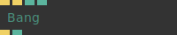

**Full Name:** `Ops.Anim.Bang`
**Description:** Trigger a simple bang animation going from 1 to 0

**> Input Ports:**
- **Update** (Trigger): *See documentation*
- **Bang** (Trigger): *See documentation*
- **Duration** (Number): *See documentation*
- **Invert** (Number: Boolean): *See documentation*

**< Output Ports:**
- **Trigger Out** (Trigger): *See documentation*
- **Value** (Number): *See documentation*

**Example Patch:** [Open in Editor](https://cables.gl/edit/TctR5r)
**Patches Using This Op:** *Search [cables.gl patches](https://cables.gl/patches) for "Bang"*
**Docs:** [https://cables.gl/op/Ops.Anim.Bang](https://cables.gl/op/Ops.Anim.Bang)

---

### BoolAnim
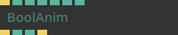

**Full Name:** `Ops.Anim.BoolAnim`
**Description:** Animate between two numbers based on a boolean value

**> Input Ports:**
- **Exe** (Trigger): *See documentation*
- **Bool** (Number: Boolean): *See documentation*
- **Easing Index** (Number: Integer): *See documentation*
- **Duration** (Number): *See documentation*
- **Direction Index** (Number: Integer): *See documentation*
- **Value False** (Number): *See documentation*
- **Value True** (Number): *See documentation*

**< Output Ports:**
- **Trigger** (Trigger): *See documentation*
- **Value** (Number): *See documentation*
- **Finished** (booleanNumber): *See documentation*
- **Finished Trigger** (Trigger): *See documentation*

**Example Patch:** [Open in Editor](https://cables.gl/edit/ofPcTo)
**Patches Using This Op:** *Search [cables.gl patches](https://cables.gl/patches) for "BoolAnim"*
**Docs:** [https://cables.gl/op/Ops.Anim.BoolAnim](https://cables.gl/op/Ops.Anim.BoolAnim)

---

### Crossfade
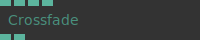

**Full Name:** `Ops.Anim.Crossfade`
**Description:** Crossfade between 2 values

**> Input Ports:**
- **Crossfade** (Number): *See documentation*
- **Out Min** (Number): *See documentation*
- **Out Max** (Number): *See documentation*
- **Easing Index** (Number: Integer): *See documentation*

**< Output Ports:**
- **A** (Number): *See documentation*
- **B** (Number): *See documentation*

**Example Patch:** [Open in Editor](https://cables.gl/edit/U_a2d-)
**Patches Using This Op:** *Search [cables.gl patches](https://cables.gl/patches) for "Crossfade"*
**Docs:** [https://cables.gl/op/Ops.Anim.Crossfade](https://cables.gl/op/Ops.Anim.Crossfade)

---

### FrameRangeAnim_v2

**Full Name:** `Ops.Anim.FrameRangeAnim_v2`
**Description:** Parses string containing ranges of frames and play as coherent animation

**> Input Ports:**
- **Time** (Number): *See documentation*
- **Frames** (String): *See documentation*
- **frame range** (ex. "0-10"): *See documentation*
- **Loop** (Number: Boolean): *See documentation*
- **Rewind** (Trigger): *See documentation*

**< Output Ports:**
- **Result Time** (Number): *See documentation*
- **Expanded Frames** (Array): *See documentation*
- **Finished** (booleanNumber): *See documentation*
- **Finished Trigger** (Trigger): *See documentation*
- **Anim Length** (Number): *See documentation*
- **Progress** (Number): *See documentation*

**Example Patch:** [Open in Editor](https://cables.gl/op/Ops.Anim.FrameRangeAnim_v2#example)
**Patches Using This Op:** *Search [cables.gl patches](https://cables.gl/patches) for "FrameRangeAnim_v2"*
**Docs:** [https://cables.gl/op/Ops.Anim.FrameRangeAnim_v2](https://cables.gl/op/Ops.Anim.FrameRangeAnim_v2)

---

### FrameRangeAnimSwitcher
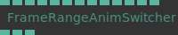

**Full Name:** `Ops.Anim.FrameRangeAnimSwitcher`
**Description:** Switch between multiple anim ranges of a keyframed 3d scene

**> Input Ports:**
- **Index** (Number: Integer): *See documentation*
- **Duration** (Number): *See documentation*
- **Easing Index** (Number: Integer): *See documentation*
- **Value 0** (Number): *See documentation*
- **Value 1** (Number): *See documentation*
- **Value 2** (Number): *See documentation*
- **Value 3** (Number): *See documentation*
- **Value 4** (Number): *See documentation*
- **Value 5** (Number): *See documentation*
- **Value 6** (Number): *See documentation*
- **Value 7** (Number): *See documentation*
- **Value 8** (Number): *See documentation*
- **Value 9** (Number): *See documentation*

**< Output Ports:**
- **Time 1** (Number): *See documentation*
- **Time Fade** (Number): *See documentation*
- **Time 2** (Number): *See documentation*

**Example Patch:** [Open in Editor](https://cables.gl/op/Ops.Anim.FrameRangeAnimSwitcher#example)
**Patches Using This Op:** *Search [cables.gl patches](https://cables.gl/patches) for "FrameRangeAnimSwitcher"*
**Docs:** [https://cables.gl/op/Ops.Anim.FrameRangeAnimSwitcher](https://cables.gl/op/Ops.Anim.FrameRangeAnimSwitcher)

---

### InOutInAnim
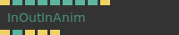

**Full Name:** `Ops.Anim.InOutInAnim`
**Description:** Animates after a trigger from 1 to 0 to 1

**> Input Ports:**
- **Update** (Trigger): *See documentation*
- **Duration In** (Number): *See documentation*
- **Easing In Index** (Number: Integer): *See documentation*
- **Value In** (Number): *See documentation*
- **Hold Duration** (Number): *See documentation*
- **Duration Out** (Number): *See documentation*
- **Easing Out Index** (Number: Integer): *See documentation*
- **Value Out** (Number): *See documentation*
- **Start** (Trigger): *See documentation*

**< Output Ports:**
- **Next** (Trigger): *See documentation*
- **Result** (Number): *See documentation*
- **Started** (Trigger): *See documentation*
- **Middle** (Trigger): *See documentation*
- **Finished** (Trigger): *See documentation*

**Example Patch:** [Open in Editor](https://cables.gl/edit/HwVRrT)
**Patches Using This Op:** *Search [cables.gl patches](https://cables.gl/patches) for "InOutInAnim"*
**Docs:** [https://cables.gl/op/Ops.Anim.InOutInAnim](https://cables.gl/op/Ops.Anim.InOutInAnim)

---

### LFO_v3

**Full Name:** `Ops.Anim.LFO_v3`
**Description:** Low-frequency oscillation for animations

**> Input Ports:**
- **Time** (Number): *See documentation*
- **Frequency** (Number): *See documentation*
- **Type Index** (Number: Integer): *See documentation*
- **Phase** (Number): *See documentation*
- **Range Min** (Number): *See documentation*
- **Range Max** (Number): *See documentation*

**< Output Ports:**
- **Result** (Number): *See documentation*

**Example Patch:** [Open in Editor](https://cables.gl/edit/9EOrS8)
**Patches Using This Op:** *Search [cables.gl patches](https://cables.gl/patches) for "LFO_v3"*
**Docs:** [https://cables.gl/op/Ops.Anim.LFO_v3](https://cables.gl/op/Ops.Anim.LFO_v3)

---

### RandomAnim_v2
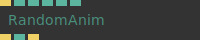

**Full Name:** `Ops.Anim.RandomAnim_v2`
**Description:** Animates between random values defined by a min and max value

**> Input Ports:**
- **Exe** (Trigger): *See documentation*
- **Min** (Number): *See documentation*
- **Max** (Number): *See documentation*
- **Duration** (Number): *See documentation*
- **Pause Between** (Number): *See documentation*
- **Easing Index** (Number: Integer): *See documentation*

**< Output Ports:**
- **Next** (Trigger): *See documentation*
- **Result** (Number): *See documentation*
- **Looped** (Trigger): *See documentation*

**Example Patch:** [Open in Editor](https://cables.gl/edit/nCSoG8)
**Patches Using This Op:** *Search [cables.gl patches](https://cables.gl/patches) for "RandomAnim_v2"*
**Docs:** [https://cables.gl/op/Ops.Anim.RandomAnim_v2](https://cables.gl/op/Ops.Anim.RandomAnim_v2)

---

### SimpleAnim
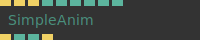

**Full Name:** `Ops.Anim.SimpleAnim`
**Description:** Simple animation between two values

**> Input Ports:**
- **Exe** (Trigger): *See documentation*
- **Reset** (Trigger): *See documentation*
- **Rewind** (Trigger): *See documentation*
- **Start** (Number): *See documentation*
- **End** (Number): *See documentation*
- **Duration** (Number): *See documentation*
- **Loop** (Number: Boolean): *See documentation*
- **Wait For Reset** (Number: Boolean): *See documentation*
- **Easing Index** (Number: Integer): *See documentation*

**< Output Ports:**
- **Next** (Trigger): *See documentation*
- **Result** (Number): *See documentation*
- **Finished** (Number): *See documentation*
- **Finished Trigger** (Trigger): *See documentation*

**Example Patch:** [Open in Editor](https://cables.gl/edit/dOlV9L)
**Patches Using This Op:** *Search [cables.gl patches](https://cables.gl/patches) for "SimpleAnim"*
**Docs:** [https://cables.gl/op/Ops.Anim.SimpleAnim](https://cables.gl/op/Ops.Anim.SimpleAnim)

---

### SineAnim
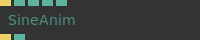

**Full Name:** `Ops.Anim.SineAnim`
**Description:** Animation in the form of a sine/cosine curve (sinus/cos)

**> Input Ports:**
- **Exe** (Trigger): *See documentation*
- **Mode Index** (Number: Integer): *See documentation*
- **Phase** (Number): *See documentation*
- **Frequency** (Number): *See documentation*
- **Amplitude** (Number): *See documentation*

**< Output Ports:**
- **Trigger Out** (Trigger): *See documentation*
- **Result** (Number): *See documentation*

**Example Patch:** [Open in Editor](https://cables.gl/edit/3bbUfp)
**Patches Using This Op:** *Search [cables.gl patches](https://cables.gl/patches) for "SineAnim"*
**Docs:** [https://cables.gl/op/Ops.Anim.SineAnim](https://cables.gl/op/Ops.Anim.SineAnim)

---

### Smooth
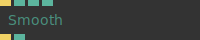

**Full Name:** `Ops.Anim.Smooth`
**Description:** Smooths out jumps in values (AverageInterpolation)

**> Input Ports:**
- **Update** (Trigger): *See documentation*
- **Value** (Number): *See documentation*
- **Dec Factor** (Number): *See documentation*

**< Output Ports:**
- **Next** (Trigger): *See documentation*
- **Result** (Number): *See documentation*

**Example Patch:** [Open in Editor](https://cables.gl/edit/c9gqda)
**Patches Using This Op:** *Search [cables.gl patches](https://cables.gl/patches) for "Smooth"*
**Docs:** [https://cables.gl/op/Ops.Anim.Smooth](https://cables.gl/op/Ops.Anim.Smooth)

---

### Snap
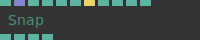

**Full Name:** `Ops.Anim.Snap`
**Description:** Snap at certain points (e.g. while scrolling)

**> Input Ports:**
- **Delta** (Number): *See documentation*
- **Snap At Values** (Array): *See documentation*
- **Snap Distance** (Number): *See documentation*
- **Snap Distance Release** (Number): *See documentation*
- **Slowdown** (Number): *See documentation*
- **Block Input After Snap** (Number): *See documentation*
- **Reset** (Trigger): *See documentation*
- **Min** (Number): *See documentation*
- **Max** (Number): *See documentation*
- **Value Mul** (Number): *See documentation*
- **Enabled** (Number: Boolean): *See documentation*

**< Output Ports:**
- **Result** (Number): *See documentation*
- **Distance** (Number): *See documentation*
- **Snapped** (Number): *See documentation*
- **Was Snapped** (Number): *See documentation*

**Example Patch:** [Open in Editor](https://cables.gl/edit/7B11U6)
**Patches Using This Op:** *Search [cables.gl patches](https://cables.gl/patches) for "Snap"*
**Docs:** [https://cables.gl/op/Ops.Anim.Snap](https://cables.gl/op/Ops.Anim.Snap)

---

### Spring
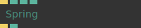

**Full Name:** `Ops.Anim.Spring`
**Description:** Spring simulation based on input target value.

**> Input Ports:**
- **Exe** (Trigger): *See documentation*
- **Value** (Number): *See documentation*
- **Damping** (Number): *See documentation*
- **Stiffness** (Number): *See documentation*

**< Output Ports:**
- **Trigger** (Trigger): *See documentation*
- **Result** (Number): *See documentation*

**Example Patch:** [Open in Editor](https://cables.gl/edit/bsbM2y)
**Patches Using This Op:** *Search [cables.gl patches](https://cables.gl/patches) for "Spring"*
**Docs:** [https://cables.gl/op/Ops.Anim.Spring](https://cables.gl/op/Ops.Anim.Spring)

---

### StringTypeAnimation_v2
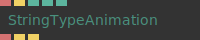

**Full Name:** `Ops.Anim.StringTypeAnimation_v2`
**Description:** Animates a text/string, like it is being typed out by a person

**> Input Ports:**
- **Text** (String): *See documentation*
- **Restart** (Trigger): *See documentation*
- **Speed** (Number): *See documentation*
- **Speed Variation** (Number): *See documentation*
- **Show Cursor** (Number: Boolean): *See documentation*

**< Output Ports:**
- **Result** (String): *See documentation*
- **Changed** (Trigger): *See documentation*
- **Finished** (Trigger): *See documentation*

**Example Patch:** [Open in Editor](https://cables.gl/edit/8dB2eH)
**Patches Using This Op:** *Search [cables.gl patches](https://cables.gl/patches) for "StringTypeAnimation_v2"*
**Docs:** [https://cables.gl/op/Ops.Anim.StringTypeAnimation_v2](https://cables.gl/op/Ops.Anim.StringTypeAnimation_v2)

---

### TimeDelta
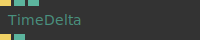

**Full Name:** `Ops.Anim.TimeDelta`
**Description:** Measure the time difference between two triggers

**> Input Ports:**
- **Exe** (Trigger): *See documentation*
- **Smooth** (Number: Boolean): *See documentation*
- **Seconds** (Number: Boolean): *See documentation*

**< Output Ports:**
- **Trigger** (Trigger): *See documentation*
- **Result** (Number): *See documentation*

**Example Patch:** [Open in Editor](https://cables.gl/edit/omrKQm)
**Patches Using This Op:** *Search [cables.gl patches](https://cables.gl/patches) for "TimeDelta"*
**Docs:** [https://cables.gl/op/Ops.Anim.TimeDelta](https://cables.gl/op/Ops.Anim.TimeDelta)

---

### Timer_v2
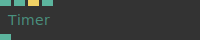

**Full Name:** `Ops.Anim.Timer_v2`
**Description:** A timer that can be started, paused and reset by triggering

**> Input Ports:**
- **Speed** (Number): *See documentation*
- **Play** (Number: Boolean): *See documentation*
- **Reset** (Trigger): *See documentation*
- **Sync To Timeline** (Number: Boolean): *See documentation*

**< Output Ports:**
- **Time** (Number): *See documentation*

**Example Patch:** [Open in Editor](https://cables.gl/edit/YTuOQm)
**Patches Using This Op:** *Search [cables.gl patches](https://cables.gl/patches) for "Timer_v2"*
**Docs:** [https://cables.gl/op/Ops.Anim.Timer_v2](https://cables.gl/op/Ops.Anim.Timer_v2)

---

