# Ops.Array


```{=latex}
\OpsSubsubNoSubsectionNumbering\setcounter{subsubsection}{0}
```
### AnglesBetweenPoints


**Full Name:** `Ops.Array.AnglesBetweenPoints`

Outputs the angle between points in 3D space (degree).

**`\inputsymbol`{=latex} Inputs**

- **Points** (Array)
- **Theta** (Number)
- **Phi** (Number)

**`\outputsymbol`{=latex} Output**

- **Rotations** (Array)

**Example Patch:** [cables.gl/edit/Y2_BIR](https://cables.gl/edit/Y2_BIR)

**Doc:** [cables.gl/op/Ops.Array.AnglesBetweenPoints](https://cables.gl/op/Ops.Array.AnglesBetweenPoints)

### AnimArray_v2


**Full Name:** `Ops.Array.AnimArray_v2`

Animate values in an array to another array.

**`\inputsymbol`{=latex} Inputs**

- **Update** (Trigger)
- **Next Array** (Array)
- **Duration** (Number)
- **Easing Index** (Number: Integer)

**`\outputsymbol`{=latex} Output**

- **Next** (Trigger)
- **Matrix** (Array)

**Example Patch:** [cables.gl/edit/OwvgkJ](https://cables.gl/edit/OwvgkJ)

**Doc:** [cables.gl/op/Ops.Array.AnimArray_v2](https://cables.gl/op/Ops.Array.AnimArray_v2)

### Array1toX_v2
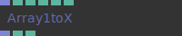

**Full Name:** `Ops.Array.Array1toX_v2`

convert an array1 to array2,3,4 by choosing content for new axis.

**`\inputsymbol`{=latex} Inputs**

- **Array1x** (Array)

**`\outputsymbol`{=latex} Output**

- **Array3x** (Array)
- **Total Points** (Number)
- **Array Length** (Number)

**Example Patch:** [cables.gl/edit/omZrLu](https://cables.gl/edit/omZrLu)

**Doc:** [cables.gl/op/Ops.Array.Array1toX_v2](https://cables.gl/op/Ops.Array.Array1toX_v2)

### Array2To3


**Full Name:** `Ops.Array.Array2To3`

Inserts zeroes every third item.

**`\inputsymbol`{=latex} Inputs**

- **Array2x** (Array)

**`\outputsymbol`{=latex} Output**

- **Array3x** (Array)
- **Total Points** (Number)
- **Array Length** (Number)

**Example Patch:** [cables.gl/edit/xAg8P6](https://cables.gl/edit/xAg8P6)

**Doc:** [cables.gl/op/Ops.Array.Array2To3](https://cables.gl/op/Ops.Array.Array2To3)

### Array3


**Full Name:** `Ops.Array.Array3`

Create an array of num triplets set to default values xyz.

**`\inputsymbol`{=latex} Inputs**

- **Num Triplets** (Number: Integer)
- **X** (Number)
- **Y** (Number)
- **Z** (Number)

**`\outputsymbol`{=latex} Output**

- **Array** (Array)
- **Total Points** (Number)
- **Array Length** (Number)

**Example Patch:** [cables.gl/edit/lmn5Og](https://cables.gl/edit/lmn5Og)

**Doc:** [cables.gl/op/Ops.Array.Array3](https://cables.gl/op/Ops.Array.Array3)

### Array3GetAverage


**Full Name:** `Ops.Array.Array3GetAverage`

Average x,y,z values of an array3x.

**`\inputsymbol`{=latex} Inputs**

- **Array** (Array)

**`\outputsymbol`{=latex} Output**

- **Average X** (Number)
- **Average Y** (Number)
- **Average Z** (Number)

**Example Patch:** [cables.gl/edit/lmn5Og](https://cables.gl/edit/lmn5Og)

**Doc:** [cables.gl/op/Ops.Array.Array3GetAverage](https://cables.gl/op/Ops.Array.Array3GetAverage)

### Array3GetNumbers


**Full Name:** `Ops.Array.Array3GetNumbers`

Get 3 values XYZ from an array.

**`\inputsymbol`{=latex} Inputs**

- **Array** (Array)
- **Index** (Number: Integer)

**`\outputsymbol`{=latex} Output**

- **X** (Number)
- **Y** (Number)
- **Z** (Number)

**Example Patch:** [cables.gl/edit/5LhTLJ](https://cables.gl/edit/5LhTLJ)

**Doc:** [cables.gl/op/Ops.Array.Array3GetNumbers](https://cables.gl/op/Ops.Array.Array3GetNumbers)

### Array3InterpolateDistributed


**Full Name:** `Ops.Array.Array3InterpolateDistributed`

Interpolate between two arrays.

**`\inputsymbol`{=latex} Inputs**

- **Update** (Trigger)
- **Array 1** (Array)
- **Array 2** (Array)
- **Progress** (Number)

**`\outputsymbol`{=latex} Output**

- **Result** (Array)
- **Array Length** (Number)

**Example Patch:** [cables.gl/edit/2UuCa6](https://cables.gl/edit/2UuCa6)

**Doc:** [cables.gl/op/Ops.Array.Array3InterpolateDistributed](https://cables.gl/op/Ops.Array.Array3InterpolateDistributed)

### Array3Iterator


**Full Name:** `Ops.Array.Array3Iterator`

Iterate over an array in steps of three and outputs three values.

**`\inputsymbol`{=latex} Inputs**

- **Execute** (Trigger)
- **Array** (Array)
- **Step** (Number)

**`\outputsymbol`{=latex} Output**

- **Trigger** (Trigger)
- **Triggers for every iteration step** (triplet in the array)
- **Index** (Number)
- **Value 1** (Number)
- **First value of the current triplet** (e.g. x)
- **Value 2** (Number)
- **Second value of the current triplet** (e.g. y)
- **Value 3** (Number)
- **Third value of the current triplet** (e.g. z)

**Example Patch:** [cables.gl/edit/Ubwk3u](https://cables.gl/edit/Ubwk3u)

**Doc:** [cables.gl/op/Ops.Array.Array3Iterator](https://cables.gl/op/Ops.Array.Array3Iterator)

### Array3Multiply


**Full Name:** `Ops.Array.Array3Multiply`

Multiply every XYZ member of array3x.

**`\inputsymbol`{=latex} Inputs**

- **Array3x** (Array)
- **Mul X** (Number)
- **Mul Y** (Number)
- **Mul Z** (Number)

**`\outputsymbol`{=latex} Output**

- **Result** (Array)

**Example Patch:** [cables.gl/edit/8FxmVJ](https://cables.gl/edit/8FxmVJ)

**Doc:** [cables.gl/op/Ops.Array.Array3Multiply](https://cables.gl/op/Ops.Array.Array3Multiply)

### Array3PushNumbers_v2
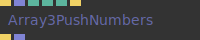

**Full Name:** `Ops.Array.Array3PushNumbers_v2`

Push three numbers to the end of an array (was ArrayPushValue3x).

**`\inputsymbol`{=latex} Inputs**

- **Execute** (Trigger)
- **Array** (Array)
- **Value 1** (Number)
- **Value 2** (Number)
- **Value 3** (Number)
- **Reset** (Trigger)

**`\outputsymbol`{=latex} Output**

- **Next** (Trigger)
- **Result Array** (Array)

**Example Patch:** [cables.gl/edit/uOzMH7](https://cables.gl/edit/uOzMH7)

**Doc:** [cables.gl/op/Ops.Array.Array3PushNumbers_v2](https://cables.gl/op/Ops.Array.Array3PushNumbers_v2)

### Array3RandomSelection


**Full Name:** `Ops.Array.Array3RandomSelection`

Extract definable amount of random xyz points from an array.

**`\inputsymbol`{=latex} Inputs**

- **Array** (Array)
- **Elements** (Number: Integer)
- **Seed** (Number)

**`\outputsymbol`{=latex} Output**

- **Result** (Array)
- **Total Points** (Number)
- **Array Length** (Number)

**Example Patch:** [cables.gl/edit/1qNz98](https://cables.gl/edit/1qNz98)

**Doc:** [cables.gl/op/Ops.Array.Array3RandomSelection](https://cables.gl/op/Ops.Array.Array3RandomSelection)

### Array3SetNumber


**Full Name:** `Ops.Array.Array3SetNumber`

Set three numbers at index in an array.

**`\inputsymbol`{=latex} Inputs**

- **Array** (Array)
- **Index** (Number: Integer)
- **Value X** (Number)
- **Value Y** (Number)
- **Value Z** (Number)

**`\outputsymbol`{=latex} Output**

- **Result** (Array)

**Example Patch:** [cables.gl/edit/t44fQc](https://cables.gl/edit/t44fQc)

**Doc:** [cables.gl/op/Ops.Array.Array3SetNumber](https://cables.gl/op/Ops.Array.Array3SetNumber)

### Array3Sum


**Full Name:** `Ops.Array.Array3Sum`

Add number to every XYZ member of array3x.

**`\inputsymbol`{=latex} Inputs**

- **Array3x** (Array)
- **Add X** (Number)
- **Add Y** (Number)
- **Add Z** (Number)

**`\outputsymbol`{=latex} Output**

- **Result** (Array)

**Example Patch:** [cables.gl/edit/D-pQHj](https://cables.gl/edit/D-pQHj)

**Doc:** [cables.gl/op/Ops.Array.Array3Sum](https://cables.gl/op/Ops.Array.Array3Sum)

### Array3To2


**Full Name:** `Ops.Array.Array3To2`

Remove every 3rd item of an array - changes array length.

**`\inputsymbol`{=latex} Inputs**

- **Array3x** (Array)

**`\outputsymbol`{=latex} Output**

- **Array2x** (Array)

**Example Patch:** [cables.gl/edit/lmn5Og](https://cables.gl/edit/lmn5Og)

**Doc:** [cables.gl/op/Ops.Array.Array3To2](https://cables.gl/op/Ops.Array.Array3To2)

### Array3To4


**Full Name:** `Ops.Array.Array3To4`

Convert an array3 to an array4 by filling it up with 1.

**`\inputsymbol`{=latex} Inputs**

- **Array3x** (Array)

**`\outputsymbol`{=latex} Output**

- **Array4x** (Array)
- **Total Points** (Number)
- **Array Length** (Number)

**Example Patch:** [cables.gl/edit/h_Dbm4](https://cables.gl/edit/h_Dbm4)

**Doc:** [cables.gl/op/Ops.Array.Array3To4](https://cables.gl/op/Ops.Array.Array3To4)

### Array3VectorLength


**Full Name:** `Ops.Array.Array3VectorLength`

Return the length of a vector from an array 3.

**`\inputsymbol`{=latex} Inputs**

- **Array In** (Array)

**`\outputsymbol`{=latex} Output**

- **Array Out** (Array)
- **Array Lengths** (Number)

**Example Patch:** [cables.gl/edit/L9tsRJ](https://cables.gl/edit/L9tsRJ)

**Doc:** [cables.gl/op/Ops.Array.Array3VectorLength](https://cables.gl/op/Ops.Array.Array3VectorLength)

### Array4


**Full Name:** `Ops.Array.Array4`

Create an array of num quadruples set to default values xyz.

**`\inputsymbol`{=latex} Inputs**

- **Num Quadruplets** (Number: Integer)
- **X** (Number)
- **Y** (Number)
- **Z** (Number)
- **W** (Number)

**`\outputsymbol`{=latex} Output**

- **Array** (Array)
- **Total Quadruplets** (Number)
- **Array Length** (Number)

**Example Patch:** [cables.gl/edit/HjHdQc](https://cables.gl/edit/HjHdQc)

**Doc:** [cables.gl/op/Ops.Array.Array4](https://cables.gl/op/Ops.Array.Array4)

### Array4GetNumbers


**Full Name:** `Ops.Array.Array4GetNumbers`

Get 4 values from an array.

**`\inputsymbol`{=latex} Inputs**

- **Array** (Array)
- **Index** (Number: Integer)

**`\outputsymbol`{=latex} Output**

- **X** (Number)
- **Y** (Number)
- **Z** (Number)
- **W** (Number)

**Example Patch:** [cables.gl/edit/tI0COg](https://cables.gl/edit/tI0COg)

**Doc:** [cables.gl/op/Ops.Array.Array4GetNumbers](https://cables.gl/op/Ops.Array.Array4GetNumbers)

### Array4SetNumber


**Full Name:** `Ops.Array.Array4SetNumber`

Set four numbers at index in an array.

**`\inputsymbol`{=latex} Inputs**

- **Array** (Array)
- **Index** (Number: Integer)
- **Value X** (Number)
- **Value Y** (Number)
- **Value Z** (Number)
- **Value W** (Number)

**`\outputsymbol`{=latex} Output**

- **Result** (Array)

**Example Patch:** [cables.gl/edit/HjHdQc](https://cables.gl/edit/HjHdQc)

**Doc:** [cables.gl/op/Ops.Array.Array4SetNumber](https://cables.gl/op/Ops.Array.Array4SetNumber)

### Array4toArray3


**Full Name:** `Ops.Array.Array4toArray3`

Convert an array4 to array3 by dropping every 4th number.

**`\inputsymbol`{=latex} Inputs**

- **Array** (Array)

**`\outputsymbol`{=latex} Output**

- **Result** (Array)
- **Array Length** (Number)

**Example Patch:** [cables.gl/edit/SZdOet](https://cables.gl/edit/SZdOet)

**Doc:** [cables.gl/op/Ops.Array.Array4toArray3](https://cables.gl/op/Ops.Array.Array4toArray3)

### Array_v3
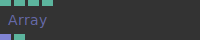

**Full Name:** `Ops.Array.Array_v3`

Can generate 3 kinds of arrays: Number - 1,2,3,4 - Normalized - (ContinuousNumberArray).

**`\inputsymbol`{=latex} Inputs**

- **Array Length** (Number: Integer)
- **Mode Select Index** (Number: Integer)
- **Default Value** (Number)
- **Reverse** (Number: Boolean)

**`\outputsymbol`{=latex} Output**

- **Array** (Array)
- **Array Length Out** (Number)

**Example Patch:** [cables.gl/edit/P4qAz6](https://cables.gl/edit/P4qAz6)

**Doc:** [cables.gl/op/Ops.Array.Array_v3](https://cables.gl/op/Ops.Array.Array_v3)

### ArrayAbs


**Full Name:** `Ops.Array.ArrayAbs`

Converts array contents to absolute values - converts all negative numbers to positive numbers.

**`\inputsymbol`{=latex} Inputs**

- **In** (Array)

**`\outputsymbol`{=latex} Output**

- **Result** (Array)

**Example Patch:** [cables.gl/edit/Jdij7z](https://cables.gl/edit/Jdij7z)

**Doc:** [cables.gl/op/Ops.Array.ArrayAbs](https://cables.gl/op/Ops.Array.ArrayAbs)

### ArrayAppendArray


**Full Name:** `Ops.Array.ArrayAppendArray`

Append an array to an existing array.

**`\inputsymbol`{=latex} Inputs**

- **Join** (Trigger)
- **Array** (Array)
- **Reset** (Trigger)

**`\outputsymbol`{=latex} Output**

- **Result** (Array)
- **Array Length** (Number)

**Example Patch:** [cables.gl/edit/quYUvH](https://cables.gl/edit/quYUvH)

**Doc:** [cables.gl/op/Ops.Array.ArrayAppendArray](https://cables.gl/op/Ops.Array.ArrayAppendArray)

### ArrayBuffer


**Full Name:** `Ops.Array.ArrayBuffer`

Store values in an array / fifo array buffer.

**`\inputsymbol`{=latex} Inputs**

- **Exec** (Trigger)
- **Value** (Number)
- **Max Length** (Number: Integer)
- **Reset** (Trigger)

**`\outputsymbol`{=latex} Output**

- **Trigger Out** (Trigger)
- **Result** (Array)
- **Array Length** (Number)

**Example Patch:** [cables.gl/edit/_ZPEnB](https://cables.gl/edit/_ZPEnB)

**Doc:** [cables.gl/op/Ops.Array.ArrayBuffer](https://cables.gl/op/Ops.Array.ArrayBuffer)

### ArrayBuffer3


**Full Name:** `Ops.Array.ArrayBuffer3`

Circular buffer for xyz values.

**`\inputsymbol`{=latex} Inputs**

- **Exec** (Trigger)
- **Max Num Elements** (Number)
- **Value X** (Number)
- **Value Y** (Number)
- **Value Z** (Number)
- **Reset** (Trigger)

**`\outputsymbol`{=latex} Output**

- **Trigger Out** (Trigger)
- **Result** (Array)
- **Array Length** (Number)

**Example Patch:** [cables.gl/edit/TNwIZC](https://cables.gl/edit/TNwIZC)

**Doc:** [cables.gl/op/Ops.Array.ArrayBuffer3](https://cables.gl/op/Ops.Array.ArrayBuffer3)

### ArrayCeil


**Full Name:** `Ops.Array.ArrayCeil`

Round numbers up.

**`\inputsymbol`{=latex} Inputs**

- **In** (Array)

**`\outputsymbol`{=latex} Output**

- **Result** (Array)

**Example Patch:** [cables.gl/edit/7xdJrG](https://cables.gl/edit/7xdJrG)

**Doc:** [cables.gl/op/Ops.Array.ArrayCeil](https://cables.gl/op/Ops.Array.ArrayCeil)

### ArrayChunk


**Full Name:** `Ops.Array.ArrayChunk`

Extracts x elements from an array.

**`\inputsymbol`{=latex} Inputs**

- **Input Array** (Array)
- **Begin Index** (Number: Integer)
- **Chunk Size** (Number: Integer)
- **Circular** (Number: Boolean)

**`\outputsymbol`{=latex} Output**

- **Output Array** (Array)
- **Array Length** (Number)

**Example Patch:** [cables.gl/edit/yGR5GA](https://cables.gl/edit/yGR5GA)

**Doc:** [cables.gl/op/Ops.Array.ArrayChunk](https://cables.gl/op/Ops.Array.ArrayChunk)

### ArrayChunkDuplicate


**Full Name:** `Ops.Array.ArrayChunkDuplicate`

Repeat chunks of an array multiple times.

**`\inputsymbol`{=latex} Inputs**

- **Array** (Array)
- **Chunk Size** (Number: Integer)
- **Repeats** (Number: Integer)

**`\outputsymbol`{=latex} Output**

- **Result** (Array)

**Example Patch:** [cables.gl/edit/Vu22bf](https://cables.gl/edit/Vu22bf)

**Doc:** [cables.gl/op/Ops.Array.ArrayChunkDuplicate](https://cables.gl/op/Ops.Array.ArrayChunkDuplicate)

### ArrayClamp


**Full Name:** `Ops.Array.ArrayClamp`

Clamp the values of an array to a min and max value.

**`\inputsymbol`{=latex} Inputs**

- **Array In** (Array)
- **Min** (Number)
- **Max** (Number)

**`\outputsymbol`{=latex} Output**

- **Array Out** (Array)

**Example Patch:** [cables.gl/edit/tyxvSP](https://cables.gl/edit/tyxvSP)

**Doc:** [cables.gl/op/Ops.Array.ArrayClamp](https://cables.gl/op/Ops.Array.ArrayClamp)

### ArrayContains_v2
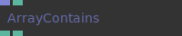

**Full Name:** `Ops.Array.ArrayContains_v2`

Check if an array contains a number (find,search,indexOf).

**`\inputsymbol`{=latex} Inputs**

- **Array** (Array)
- **SearchValue** (Number)

**`\outputsymbol`{=latex} Output**

- **Found** (booleanNumber)
- **Index** (Number)

**Example Patch:** [cables.gl/edit/8pZ8GA](https://cables.gl/edit/8pZ8GA)

**Doc:** [cables.gl/op/Ops.Array.ArrayContains_v2](https://cables.gl/op/Ops.Array.ArrayContains_v2)

### ArrayDivide


**Full Name:** `Ops.Array.ArrayDivide`

Divide all values in an array by one number.

**`\inputsymbol`{=latex} Inputs**

- **Array In** (Array)
- **Value** (Number)

**`\outputsymbol`{=latex} Output**

- **Array Out** (Array)

**Example Patch:** [cables.gl/edit/uIYNcn](https://cables.gl/edit/uIYNcn)

**Doc:** [cables.gl/op/Ops.Array.ArrayDivide](https://cables.gl/op/Ops.Array.ArrayDivide)

### ArrayFindStrings


**Full Name:** `Ops.Array.ArrayFindStrings`

Return all the indexes of a string in an array.

**`\inputsymbol`{=latex} Inputs**

- **Array** (Array)
- **SearchValue** (String)

**`\outputsymbol`{=latex} Output**

- **Index** (Array)
- **Found** (booleanNumber)

**Example Patch:** [cables.gl/edit/p9sBjH](https://cables.gl/edit/p9sBjH)

**Doc:** [cables.gl/op/Ops.Array.ArrayFindStrings](https://cables.gl/op/Ops.Array.ArrayFindStrings)

### ArrayFloor


**Full Name:** `Ops.Array.ArrayFloor`

Round numbers down.

**`\inputsymbol`{=latex} Inputs**

- **In** (Array)

**`\outputsymbol`{=latex} Output**

- **Result** (Array)

**Example Patch:** [cables.gl/edit/7xdJrG](https://cables.gl/edit/7xdJrG)

**Doc:** [cables.gl/op/Ops.Array.ArrayFloor](https://cables.gl/op/Ops.Array.ArrayFloor)

### ArrayFract


**Full Name:** `Ops.Array.ArrayFract`

Return the fractional remainder of all values in an array.

**`\inputsymbol`{=latex} Inputs**

- **In** (Array)

**`\outputsymbol`{=latex} Output**

- **Result** (Array)

**Example Patch:** [cables.gl/edit/uVzImG](https://cables.gl/edit/uVzImG)

**Doc:** [cables.gl/op/Ops.Array.ArrayFract](https://cables.gl/op/Ops.Array.ArrayFract)

### ArrayFromNumbers


**Full Name:** `Ops.Array.ArrayFromNumbers`

Simple way to create small arrays of numbers.

**`\inputsymbol`{=latex} Inputs**

- **Update** (Trigger)
- **Limit** (Number: Integer)
- **Slider** (Number: Boolean)
- **Index 0** (Number)
- **Index 1** (Number)
- **Index 2** (Number)
- **Index 3** (Number)
- **Index 4** (Number)
- **Index 5** (Number)
- **Index 6** (Number)
- **Index 7** (Number)
- **Index 8** (Number)
- **Index 9** (Number)
- **Index 10** (Number)
- **Index 11** (Number)
- **Index 12** (Number)
- **Index 13** (Number)
- **Index 14** (Number)
- **Index 15** (Number)
- **Index 16** (Number)
- **Index 17** (Number)
- **Index 18** (Number)
- **Index 19** (Number)
- **Index 20** (Number)
- **Index 21** (Number)
- **Index 22** (Number)
- **Index 23** (Number)
- **Index 24** (Number)
- **Index 25** (Number)
- **Index 26** (Number)
- **Index 27** (Number)
- **Index 28** (Number)
- **Index 29** (Number)

**`\outputsymbol`{=latex} Output**

- **Next** (Trigger)
- **Array** (Array)

**Example Patch:** [cables.gl/edit/ZNPh2B](https://cables.gl/edit/ZNPh2B)

**Doc:** [cables.gl/op/Ops.Array.ArrayFromNumbers](https://cables.gl/op/Ops.Array.ArrayFromNumbers)

### ArrayGetArray


**Full Name:** `Ops.Array.ArrayGetArray`

Get an array from an array of arrays.

**`\inputsymbol`{=latex} Inputs**

- **Array Of Arrays** (Array)
- **Index** (Number: Integer)

**`\outputsymbol`{=latex} Output**

- **Result Array** (Array)

**Example Patch:** [cables.gl/edit/yU2Pet](https://cables.gl/edit/yU2Pet)

**Doc:** [cables.gl/op/Ops.Array.ArrayGetArray](https://cables.gl/op/Ops.Array.ArrayGetArray)

### ArrayGetNumber


**Full Name:** `Ops.Array.ArrayGetNumber`

Return a value from an array.

**`\inputsymbol`{=latex} Inputs**

- **Array** (Array)
- **Index** (Number: Integer)
- **Value Invalid Index** (Number)

**`\outputsymbol`{=latex} Output**

- **Value** (Number)
- **Valid Index** (booleanNumber)

**Example Patch:** [cables.gl/edit/38AIji](https://cables.gl/edit/38AIji)

**Doc:** [cables.gl/op/Ops.Array.ArrayGetNumber](https://cables.gl/op/Ops.Array.ArrayGetNumber)

### ArrayGetObject


**Full Name:** `Ops.Array.ArrayGetObject`

Get an object from an array.

**`\inputsymbol`{=latex} Inputs**

- **Array** (Array)
- **Index** (Number: Integer)

**`\outputsymbol`{=latex} Output**

- **Value** (Object)

**Example Patch:** [cables.gl/edit/7npL_M](https://cables.gl/edit/7npL_M)

**Doc:** [cables.gl/op/Ops.Array.ArrayGetObject](https://cables.gl/op/Ops.Array.ArrayGetObject)

### ArrayGetString_v2
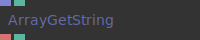

**Full Name:** `Ops.Array.ArrayGetString_v2`

Get a string from an array at [index].

**`\inputsymbol`{=latex} Inputs**

- **Array** (Array)
- **Index** (Number: Integer)

**`\outputsymbol`{=latex} Output**

- **Result** (String)
- **Found** (booleanNumber)

**Example Patch:** [cables.gl/edit/aHNk8i](https://cables.gl/edit/aHNk8i)

**Doc:** [cables.gl/op/Ops.Array.ArrayGetString_v2](https://cables.gl/op/Ops.Array.ArrayGetString_v2)

### ArrayGetTexture


**Full Name:** `Ops.Array.ArrayGetTexture`

Get texture from array at index.

**`\inputsymbol`{=latex} Inputs**

- **Array** (Array)
- **Index** (Number: Integer)

**`\outputsymbol`{=latex} Output**

- **Value** (Object)

**Example Patch:** [cables.gl/edit/jFv097](https://cables.gl/edit/jFv097)

**Doc:** [cables.gl/op/Ops.Array.ArrayGetTexture](https://cables.gl/op/Ops.Array.ArrayGetTexture)

### ArrayGetValuesByIndexArray


**Full Name:** `Ops.Array.ArrayGetValuesByIndexArray`

Pick values from input array at given indices and stride.

**`\inputsymbol`{=latex} Inputs**

- **Array** (Array)
- **Array Stride Index** (Number: Integer)
- **Indices** (Array)

**`\outputsymbol`{=latex} Output**

- **Results** (Array)

**Example Patch:** [cables.gl/edit/bOBgTq](https://cables.gl/edit/bOBgTq)

**Doc:** [cables.gl/op/Ops.Array.ArrayGetValuesByIndexArray](https://cables.gl/op/Ops.Array.ArrayGetValuesByIndexArray)

### ArrayIndexBetween


**Full Name:** `Ops.Array.ArrayIndexBetween`

Output index where value is greater than number and smaller then next number.

**`\inputsymbol`{=latex} Inputs**

- **Array** (Array)
- **Value** (Number)

**`\outputsymbol`{=latex} Output**

- **Index** (Number)

**Example Patch:** [cables.gl/edit/kH4xLu](https://cables.gl/edit/kH4xLu)

**Doc:** [cables.gl/op/Ops.Array.ArrayIndexBetween](https://cables.gl/op/Ops.Array.ArrayIndexBetween)

### ArrayIndexMinMax


**Full Name:** `Ops.Array.ArrayIndexMinMax`

Find lowest/highest numbers in an array.

**`\inputsymbol`{=latex} Inputs**

- **Array** (Array)

**`\outputsymbol`{=latex} Output**

- **Max** (Number)
- **Index Max** (Number)
- **Min** (Number)
- **Index Min** (Number)

**Example Patch:** [cables.gl/edit/gamucI](https://cables.gl/edit/gamucI)

**Doc:** [cables.gl/op/Ops.Array.ArrayIndexMinMax](https://cables.gl/op/Ops.Array.ArrayIndexMinMax)

### ArrayIteratorArray


**Full Name:** `Ops.Array.ArrayIteratorArray`

Iterate over an array of arrays.

**`\inputsymbol`{=latex} Inputs**

- **Exe** (Trigger)
- **Array** (Array)

**`\outputsymbol`{=latex} Output**

- **Trigger** (Trigger)
- **Index** (Number)
- **Result** (Array)

**Example Patch:** [cables.gl/edit/xFKQet](https://cables.gl/edit/xFKQet)

**Doc:** [cables.gl/op/Ops.Array.ArrayIteratorArray](https://cables.gl/op/Ops.Array.ArrayIteratorArray)

### ArrayIteratorNumbers


**Full Name:** `Ops.Array.ArrayIteratorNumbers`

Loop over every element of an array.

**`\inputsymbol`{=latex} Inputs**

- **Exe** (Trigger)
- **Array** (Array)

**`\outputsymbol`{=latex} Output**

- **Trigger** (Trigger)
- **Index** (Number)
- **Value** (Number)

**Example Patch:** [cables.gl/edit/Ubwk3u](https://cables.gl/edit/Ubwk3u)

**Doc:** [cables.gl/op/Ops.Array.ArrayIteratorNumbers](https://cables.gl/op/Ops.Array.ArrayIteratorNumbers)

### ArrayIteratorObjects


**Full Name:** `Ops.Array.ArrayIteratorObjects`

Iterate over an array of objects.

**`\inputsymbol`{=latex} Inputs**

- **Exe** (Trigger)
- **Array** (Array)

**`\outputsymbol`{=latex} Output**

- **Trigger** (Trigger)
- **Finished** (Trigger)
- **Index** (Number)
- **Value** (Object)

**Example Patch:** [cables.gl/edit/UlL2G1](https://cables.gl/edit/UlL2G1)

**Doc:** [cables.gl/op/Ops.Array.ArrayIteratorObjects](https://cables.gl/op/Ops.Array.ArrayIteratorObjects)

### ArrayIteratorStrings


**Full Name:** `Ops.Array.ArrayIteratorStrings`

Loop over every element of an array.

**`\inputsymbol`{=latex} Inputs**

- **Exe** (Trigger)
- **Array** (Array)

**`\outputsymbol`{=latex} Output**

- **Trigger** (Trigger)
- **Index** (Number)
- **Value** (String)

**Example Patch:** [cables.gl/edit/53WCcI](https://cables.gl/edit/53WCcI)

**Doc:** [cables.gl/op/Ops.Array.ArrayIteratorStrings](https://cables.gl/op/Ops.Array.ArrayIteratorStrings)

### ArrayIteratorTextures


**Full Name:** `Ops.Array.ArrayIteratorTextures`

Iterate over an array of objects.

**`\inputsymbol`{=latex} Inputs**

- **Exe** (Trigger)
- **Array** (Array)

**`\outputsymbol`{=latex} Output**

- **Trigger** (Trigger)
- **Finished** (Trigger)
- **Index** (Number)
- **Value** (Object)

**Example Patch:** [cables.gl/edit/vS5fjz](https://cables.gl/edit/vS5fjz)

**Doc:** [cables.gl/op/Ops.Array.ArrayIteratorTextures](https://cables.gl/op/Ops.Array.ArrayIteratorTextures)

### ArrayLength_v2
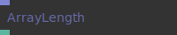

**Full Name:** `Ops.Array.ArrayLength_v2`

Number of items in an array.

**`\inputsymbol`{=latex} Inputs**

- **Array** (Array)

**`\outputsymbol`{=latex} Output**

- **Length** (Number)

**Example Patch:** [cables.gl/edit/P4qAz6](https://cables.gl/edit/P4qAz6)

**Doc:** [cables.gl/op/Ops.Array.ArrayLength_v2](https://cables.gl/op/Ops.Array.ArrayLength_v2)

### ArrayLogic


**Full Name:** `Ops.Array.ArrayLogic`

Performs logical comparison operations on a single array of numbers.

**`\inputsymbol`{=latex} Inputs**

- **Array 0** (Array)
- **Comparison Mode Index** (Number: Integer)
- **Number For Comparison** (Number)
- **Value If True** (Number)
- **Value If False** (Number)

**`\outputsymbol`{=latex} Output**

- **Array Result** (Array)
- **Array Length** (Number)

**Example Patch:** [cables.gl/edit/D3DmbJ](https://cables.gl/edit/D3DmbJ)

**Doc:** [cables.gl/op/Ops.Array.ArrayLogic](https://cables.gl/op/Ops.Array.ArrayLogic)

### ArrayLogicArray


**Full Name:** `Ops.Array.ArrayLogicArray`

Performs logical comparison operations on two arrays.

**`\inputsymbol`{=latex} Inputs**

- **Array 0** (Array)
- **Array 1** (Array)
- **Value If True** (Number)
- **Value If False** (Number)
- **Comparison Mode Index** (Number: Integer)

**`\outputsymbol`{=latex} Output**

- **Array Result** (Array)
- **Array Length** (Number)

**Example Patch:** [cables.gl/edit/T_-NmJ](https://cables.gl/edit/T_-NmJ)

**Doc:** [cables.gl/op/Ops.Array.ArrayLogicArray](https://cables.gl/op/Ops.Array.ArrayLogicArray)

### ArrayLogicBetween_v2
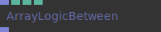

**Full Name:** `Ops.Array.ArrayLogicBetween_v2`

If value of array is between min and max then the value is 1 else 0.

**`\inputsymbol`{=latex} Inputs**

- **Array** (Array)
- **Min** (Number)
- **Max** (Number)
- **Pass Value When True** (Number: Boolean)

**`\outputsymbol`{=latex} Output**

- **Result** (Array)

**Example Patch:** [cables.gl/edit/jTqRet](https://cables.gl/edit/jTqRet)

**Doc:** [cables.gl/op/Ops.Array.ArrayLogicBetween_v2](https://cables.gl/op/Ops.Array.ArrayLogicBetween_v2)

### ArrayLookup


**Full Name:** `Ops.Array.ArrayLookup`

Create an array that is filled with values looked up by index from another array.

**`\inputsymbol`{=latex} Inputs**

- **Indices** (Array)
- **Values** (Array)
- **Stride** (Number: Integer)

**`\outputsymbol`{=latex} Output**

- **Result** (Array)

**Example Patch:** [cables.gl/edit/cwJBEe](https://cables.gl/edit/cwJBEe)

**Doc:** [cables.gl/op/Ops.Array.ArrayLookup](https://cables.gl/op/Ops.Array.ArrayLookup)

### ArrayMath


**Full Name:** `Ops.Array.ArrayMath`

Pick from multiple mathematical modes which can all be applied to a single array.

**`\inputsymbol`{=latex} Inputs**

- **Array 0** (Array)
- **Number For Math** (Number)
- **Math Function Index** (Number: Integer)

**`\outputsymbol`{=latex} Output**

- **Array Result** (Array)
- **Array Length** (Number)

**Example Patch:** [cables.gl/edit/7E1hqH](https://cables.gl/edit/7E1hqH)

**Doc:** [cables.gl/op/Ops.Array.ArrayMath](https://cables.gl/op/Ops.Array.ArrayMath)

### ArrayMathArray


**Full Name:** `Ops.Array.ArrayMathArray`

Perform a math operations on two arrays.

**`\inputsymbol`{=latex} Inputs**

- **Array 0** (Array)
- **Array 1** (Array)
- **Math Function Index** (Number: Integer)

**`\outputsymbol`{=latex} Output**

- **Array Result** (Array)
- **Array Length** (Number)

**Example Patch:** [cables.gl/edit/uIYNcn](https://cables.gl/edit/uIYNcn)

**Doc:** [cables.gl/op/Ops.Array.ArrayMathArray](https://cables.gl/op/Ops.Array.ArrayMathArray)

### ArrayMathExpression


**Full Name:** `Ops.Array.ArrayMathExpression`

Calculate a user-defined mathematical expression.

**`\inputsymbol`{=latex} Inputs**

- **A** (Array)
- **B** (Array)
- **C** (Array)
- **X** (Number)
- **Y** (Number)
- **Z** (Number)
- **Expression** (String)

**`\outputsymbol`{=latex} Output**

- **Result Array** (Array)
- **Array Length** (Number)
- **Expression Valid** (booleanNumber)

**Example Patch:** [cables.gl/edit/_o2Mue](https://cables.gl/edit/_o2Mue)

**Doc:** [cables.gl/op/Ops.Array.ArrayMathExpression](https://cables.gl/op/Ops.Array.ArrayMathExpression)

### ArrayMathExpressionTrigger


**Full Name:** `Ops.Array.ArrayMathExpressionTrigger`

Calculate a user-defined mathematical expression.

**`\inputsymbol`{=latex} Inputs**

- **Update** (Trigger)
- **A** (Array)
- **B** (Array)
- **C** (Array)
- **X** (Number)
- **Y** (Number)
- **Z** (Number)
- **Expression** (String)

**`\outputsymbol`{=latex} Output**

- **Next** (Trigger)
- **Result Array** (Array)
- **Array Length** (Number)
- **Expression Valid** (booleanNumber)

**Example Patch:** [cables.gl/edit/_o2Mue](https://cables.gl/edit/_o2Mue)

**Doc:** [cables.gl/op/Ops.Array.ArrayMathExpressionTrigger](https://cables.gl/op/Ops.Array.ArrayMathExpressionTrigger)

### ArrayMax


**Full Name:** `Ops.Array.ArrayMax`

Apply a max operation to all values in an array.

**`\inputsymbol`{=latex} Inputs**

- **Array In** (Array)
- **Value** (Number)

**`\outputsymbol`{=latex} Output**

- **Array Out** (Array)

**Example Patch:** [cables.gl/edit/bc0xTn](https://cables.gl/edit/bc0xTn)

**Doc:** [cables.gl/op/Ops.Array.ArrayMax](https://cables.gl/op/Ops.Array.ArrayMax)

### ArrayMerge_v3
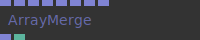

**Full Name:** `Ops.Array.ArrayMerge_v3`

Merge multiple arrays - in consecutive order.

**`\inputsymbol`{=latex} Inputs**

- **Array 0** (Array)
- **Array 1** (Array)
- **Array 2** (Array)
- **Array 3** (Array)
- **Array 4** (Array)
- **Array 5** (Array)
- **Array 6** (Array)
- **Array 7** (Array)

**`\outputsymbol`{=latex} Output**

- **Result** (Array)
- **Array Length** (Number)

**Example Patch:** [cables.gl/edit/P7siGA](https://cables.gl/edit/P7siGA)

**Doc:** [cables.gl/op/Ops.Array.ArrayMerge_v3](https://cables.gl/op/Ops.Array.ArrayMerge_v3)

### ArrayMergeTrigger


**Full Name:** `Ops.Array.ArrayMergeTrigger`

Merge / concatenate arrays by trigger.

**`\inputsymbol`{=latex} Inputs**

- **Merge** (Trigger)
- **Array 0** (Array)
- **Array 1** (Array)
- **Array 2** (Array)
- **Array 3** (Array)
- **Array 4** (Array)
- **Array 5** (Array)
- **Array 6** (Array)
- **Array 7** (Array)
- **Array 8** (Array)
- **Array 9** (Array)
- **Array 10** (Array)
- **Array 11** (Array)

**`\outputsymbol`{=latex} Output**

- **Next** (Trigger)
- **Result** (Array)
- **Array Length** (Number)

**Example Patch:** [cables.gl/op/Ops.Array.ArrayMergeTrigger#example](https://cables.gl/op/Ops.Array.ArrayMergeTrigger#example)

**Doc:** [cables.gl/op/Ops.Array.ArrayMergeTrigger](https://cables.gl/op/Ops.Array.ArrayMergeTrigger)

### ArrayMin


**Full Name:** `Ops.Array.ArrayMin`

Apply a min operation to all values in an array.

**`\inputsymbol`{=latex} Inputs**

- **Array In** (Array)
- **Value** (Number)

**`\outputsymbol`{=latex} Output**

- **Array Out** (Array)

**Example Patch:** [cables.gl/edit/bc0xTn](https://cables.gl/edit/bc0xTn)

**Doc:** [cables.gl/op/Ops.Array.ArrayMin](https://cables.gl/op/Ops.Array.ArrayMin)

### ArrayModulo


**Full Name:** `Ops.Array.ArrayModulo`

Apply a modulo operation to all values in an array.

**`\inputsymbol`{=latex} Inputs**

- **Array In** (Array)
- **Value** (Number)

**`\outputsymbol`{=latex} Output**

- **Array Out** (Array)

**Example Patch:** [cables.gl/edit/uIYNcn](https://cables.gl/edit/uIYNcn)

**Doc:** [cables.gl/op/Ops.Array.ArrayModulo](https://cables.gl/op/Ops.Array.ArrayModulo)

### ArrayMultiply


**Full Name:** `Ops.Array.ArrayMultiply`

Multiply every number in an array.

**`\inputsymbol`{=latex} Inputs**

- **In** (Array)
- **Value** (Number)

**`\outputsymbol`{=latex} Output**

- **Result** (Array)

**Example Patch:** [cables.gl/edit/xmNqci](https://cables.gl/edit/xmNqci)

**Doc:** [cables.gl/op/Ops.Array.ArrayMultiply](https://cables.gl/op/Ops.Array.ArrayMultiply)

### ArrayNumberRamp_v2
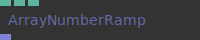

**Full Name:** `Ops.Array.ArrayNumberRamp_v2`

Create an array that contains X numbers between start and end values.

**`\inputsymbol`{=latex} Inputs**

- **Start Value** (Number)
- **End Value** (Number)
- **Entries** (Number: Integer)

**`\outputsymbol`{=latex} Output**

- **Result** (Array)

**Example Patch:** [cables.gl/edit/LfNG9t](https://cables.gl/edit/LfNG9t)

**Doc:** [cables.gl/op/Ops.Array.ArrayNumberRamp_v2](https://cables.gl/op/Ops.Array.ArrayNumberRamp_v2)

### ArrayOfArrays


**Full Name:** `Ops.Array.ArrayOfArrays`

Create an array filled with other arrays.

**`\inputsymbol`{=latex} Inputs**

- **Update** (Trigger)
- **Array 0** (Array)
- **Array 1** (Array)
- **Array 2** (Array)
- **Array 3** (Array)
- **Array 4** (Array)
- **Array 5** (Array)
- **Array 6** (Array)
- **Array 7** (Array)
- **Array 8** (Array)
- **Array 9** (Array)

**`\outputsymbol`{=latex} Output**

- **Result** (Array)

**Example Patch:** [cables.gl/edit/iId8ve](https://cables.gl/edit/iId8ve)

**Doc:** [cables.gl/op/Ops.Array.ArrayOfArrays](https://cables.gl/op/Ops.Array.ArrayOfArrays)

### ArrayOfObjectsFilterByKeyValue_v3
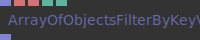

**Full Name:** `Ops.Array.ArrayOfObjectsFilterByKeyValue_v3`

Filter key-value pairs in objects in an array of objects.

**`\inputsymbol`{=latex} Inputs**

- **Array** (Array)
- **Filter Key** (String)
- **Filter Value** (String)
- **Invert Filter** (Number: Boolean)
- **invert result** (discard all objects that have key-value pair)

**`\outputsymbol`{=latex} Output**

- **ArrayOut** (Array)

**Example Patch:** [cables.gl/edit/HFRsU5](https://cables.gl/edit/HFRsU5)

**Doc:** [cables.gl/op/Ops.Array.ArrayOfObjectsFilterByKeyValue_v3](https://cables.gl/op/Ops.Array.ArrayOfObjectsFilterByKeyValue_v3)

### ArrayOfObjectsFilterKeys


**Full Name:** `Ops.Array.ArrayOfObjectsFilterKeys`

Remove key-value pairs from objects in an array of objects.

**`\inputsymbol`{=latex} Inputs**

- **Array** (Array)
- **Keys** (String)
- **Seperator** (String)
- **Invert Filter** (Number: Boolean)

**`\outputsymbol`{=latex} Output**

- **Array Out** (Array)

**Example Patch:** [cables.gl/edit/HFRsU5](https://cables.gl/edit/HFRsU5)

**Doc:** [cables.gl/op/Ops.Array.ArrayOfObjectsFilterKeys](https://cables.gl/op/Ops.Array.ArrayOfObjectsFilterKeys)

### ArrayOfObjectsToString


**Full Name:** `Ops.Array.ArrayOfObjectsToString`

Convert an array of objects into readable string format.

**`\inputsymbol`{=latex} Inputs**

- **Array In** (Array)

**`\outputsymbol`{=latex} Output**

- **String** (String)

**Example Patch:** [cables.gl/edit/HFRsU5](https://cables.gl/edit/HFRsU5)

**Doc:** [cables.gl/op/Ops.Array.ArrayOfObjectsToString](https://cables.gl/op/Ops.Array.ArrayOfObjectsToString)

### ArrayPack


**Full Name:** `Ops.Array.ArrayPack`

Pack multiple arrays into a new array.

**`\inputsymbol`{=latex} Inputs**

- **Array 0** (Array)
- **Array 1** (Array)
- **Array 2** (Array)
- **Array 3** (Array)
- **Array 4** (Array)
- **Array 5** (Array)
- **Array 6** (Array)
- **Array 7** (Array)

**`\outputsymbol`{=latex} Output**

- **Result** (Array)

**Example Patch:** [cables.gl/edit/fT3AeT](https://cables.gl/edit/fT3AeT)

**Doc:** [cables.gl/op/Ops.Array.ArrayPack](https://cables.gl/op/Ops.Array.ArrayPack)

### ArrayPack2


**Full Name:** `Ops.Array.ArrayPack2`

Pack two individual arrays into a new array.

**`\inputsymbol`{=latex} Inputs**

- **Trigger In** (Trigger)
- **Array 1** (Array)
- **Array 2** (Array)

**`\outputsymbol`{=latex} Output**

- **Trigger Out** (Trigger)
- **Array Out** (Array)
- **Array Length** (Number)

**Example Patch:** [cables.gl/edit/WaPiSP](https://cables.gl/edit/WaPiSP)

**Doc:** [cables.gl/op/Ops.Array.ArrayPack2](https://cables.gl/op/Ops.Array.ArrayPack2)

### ArrayPack2Simple


**Full Name:** `Ops.Array.ArrayPack2Simple`

Pack 2 individual arrays into an array2 - without needing a trigger.

**`\inputsymbol`{=latex} Inputs**

- **Array 1** (Array)
- **Array 2** (Array)

**`\outputsymbol`{=latex} Output**

- **Array Out** (Array)
- **Num Points** (Number)
- **Array Length** (Number)

**Example Patch:** [cables.gl/edit/Udb6eG](https://cables.gl/edit/Udb6eG)

**Doc:** [cables.gl/op/Ops.Array.ArrayPack2Simple](https://cables.gl/op/Ops.Array.ArrayPack2Simple)

### ArrayPack3


**Full Name:** `Ops.Array.ArrayPack3`

Pack 3 individual arrays into a xyz array.

**`\inputsymbol`{=latex} Inputs**

- **Trigger In** (Trigger)
- **Array 1** (Array)
- **Array 2** (Array)
- **Array 3** (Array)

**`\outputsymbol`{=latex} Output**

- **Trigger Out** (Trigger)
- **Array Out** (Array)
- **Num Points** (Number)
- **Array Length** (Number)

**Example Patch:** [cables.gl/edit/As6p8i](https://cables.gl/edit/As6p8i)

**Doc:** [cables.gl/op/Ops.Array.ArrayPack3](https://cables.gl/op/Ops.Array.ArrayPack3)

### ArrayPack3Simple


**Full Name:** `Ops.Array.ArrayPack3Simple`

Pack 3 individual arrays into an array3 - without needing a trigger.

**`\inputsymbol`{=latex} Inputs**

- **Array 1** (Array)
- **Array 2** (Array)
- **Array 3** (Array)

**`\outputsymbol`{=latex} Output**

- **Array Out** (Array)
- **Num Points** (Number)
- **Array Length** (Number)

**Example Patch:** [cables.gl/edit/Hx09v4](https://cables.gl/edit/Hx09v4)

**Doc:** [cables.gl/op/Ops.Array.ArrayPack3Simple](https://cables.gl/op/Ops.Array.ArrayPack3Simple)

### ArrayPack4


**Full Name:** `Ops.Array.ArrayPack4`

Pack 4 arrays into one array.

**`\inputsymbol`{=latex} Inputs**

- **Trigger In** (Trigger)
- **Array 1** (Array)
- **Array 2** (Array)
- **Array 3** (Array)
- **Array 4** (Array)

**`\outputsymbol`{=latex} Output**

- **Trigger Out** (Trigger)
- **Array Out** (Array)
- **Array Length** (Number)

**Example Patch:** [cables.gl/edit/zgbOqH](https://cables.gl/edit/zgbOqH)

**Doc:** [cables.gl/op/Ops.Array.ArrayPack4](https://cables.gl/op/Ops.Array.ArrayPack4)

### ArrayPack4Simple


**Full Name:** `Ops.Array.ArrayPack4Simple`

Pack 3 individual arrays into an array3 - without needing a trigger.

**`\inputsymbol`{=latex} Inputs**

- **Array 1** (Array)
- **Array 2** (Array)
- **Array 3** (Array)
- **Array 4** (Array)

**`\outputsymbol`{=latex} Output**

- **Array Out** (Array)
- **Num Points** (Number)
- **Array Length** (Number)

**Example Patch:** [cables.gl/edit/Hx09v4](https://cables.gl/edit/Hx09v4)

**Doc:** [cables.gl/op/Ops.Array.ArrayPack4Simple](https://cables.gl/op/Ops.Array.ArrayPack4Simple)

### ArrayPow


**Full Name:** `Ops.Array.ArrayPow`

Values below 0 are not accepted. 1 = Array in is unaltered.

**`\inputsymbol`{=latex} Inputs**

- **Array In** (Array)
- **Pow Factor** (Number)

**`\outputsymbol`{=latex} Output**

- **Array Out** (Array)

**Example Patch:** [cables.gl/edit/nakc7z](https://cables.gl/edit/nakc7z)

**Doc:** [cables.gl/op/Ops.Array.ArrayPow](https://cables.gl/op/Ops.Array.ArrayPow)

### ArrayPushString


**Full Name:** `Ops.Array.ArrayPushString`

Push/Append a string to the end of an array.

**`\inputsymbol`{=latex} Inputs**

- **Array** (Array)
- **String** (String)

**`\outputsymbol`{=latex} Output**

- **Result** (Array)

**Example Patch:** [cables.gl/op/Ops.Array.ArrayPushString#example](https://cables.gl/op/Ops.Array.ArrayPushString#example)

**Doc:** [cables.gl/op/Ops.Array.ArrayPushString](https://cables.gl/op/Ops.Array.ArrayPushString)

### ArrayQuantizer


**Full Name:** `Ops.Array.ArrayQuantizer`

Quantize input to nearest number in array.

**`\inputsymbol`{=latex} Inputs**

- **Value** (Number)
- **Constraints Array Input** (Array)

**`\outputsymbol`{=latex} Output**

- **Quantized Value** (Number)
- **Quantization Error** (Number)

**Example Patch:** [cables.gl/edit/0yr3cu](https://cables.gl/edit/0yr3cu)

**Doc:** [cables.gl/op/Ops.Array.ArrayQuantizer](https://cables.gl/op/Ops.Array.ArrayQuantizer)

### ArrayRandomSelection


**Full Name:** `Ops.Array.ArrayRandomSelection`

Extract a definable amount of values from an array.

**`\inputsymbol`{=latex} Inputs**

- **Array** (Array)
- **Elements** (Number: Integer)
- **Seed** (Number)

**`\outputsymbol`{=latex} Output**

- **Result** (Array)
- **Array Length** (Number)

**Example Patch:** [cables.gl/edit/ZYDYpH](https://cables.gl/edit/ZYDYpH)

**Doc:** [cables.gl/op/Ops.Array.ArrayRandomSelection](https://cables.gl/op/Ops.Array.ArrayRandomSelection)

### ArrayRemoveFalsy


**Full Name:** `Ops.Array.ArrayRemoveFalsy`

Remove falsy items from an array.

**`\inputsymbol`{=latex} Inputs**

- **Array** (Array)
- **Remove Falsy** (Number: Boolean)

**`\outputsymbol`{=latex} Output**

- **Result Array** (Array)

**Example Patch:** [cables.gl/edit/s6p6iO](https://cables.gl/edit/s6p6iO)

**Doc:** [cables.gl/op/Ops.Array.ArrayRemoveFalsy](https://cables.gl/op/Ops.Array.ArrayRemoveFalsy)

### ArrayReverse


**Full Name:** `Ops.Array.ArrayReverse`

Reverse an array.

**`\inputsymbol`{=latex} Inputs**

- **Active** (Number: Boolean)

**`\outputsymbol`{=latex} Output**

- **Result** (Array)

**Example Patch:** [cables.gl/edit/UGUp8i](https://cables.gl/edit/UGUp8i)

**Doc:** [cables.gl/op/Ops.Array.ArrayReverse](https://cables.gl/op/Ops.Array.ArrayReverse)

### ArrayRound


**Full Name:** `Ops.Array.ArrayRound`

Round numbers up.

**`\inputsymbol`{=latex} Inputs**

- **In** (Array)
- **Method Index** (Number: Integer)
- **Decimal Places** (Number: Integer)

**`\outputsymbol`{=latex} Output**

- **Result** (Array)

**Example Patch:** [cables.gl/edit/7xdJrG](https://cables.gl/edit/7xdJrG)

**Doc:** [cables.gl/op/Ops.Array.ArrayRound](https://cables.gl/op/Ops.Array.ArrayRound)

### ArraySetNumber_v3
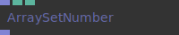

**Full Name:** `Ops.Array.ArraySetNumber_v3`

Set a number at index in an array.

**`\inputsymbol`{=latex} Inputs**

- **Array** (Array)
- **Index** (Number: Integer)
- **Number** (Number)

**`\outputsymbol`{=latex} Output**

- **Result** (Array)

**Example Patch:** [cables.gl/edit/bJrH16](https://cables.gl/edit/bJrH16)

**Doc:** [cables.gl/op/Ops.Array.ArraySetNumber_v3](https://cables.gl/op/Ops.Array.ArraySetNumber_v3)

### ArraySetString


**Full Name:** `Ops.Array.ArraySetString`

Set a string at index in an array.

**`\inputsymbol`{=latex} Inputs**

- **Array** (Array)
- **Index** (Number: Integer)
- **Value** (String)

**`\outputsymbol`{=latex} Output**

- **Result** (Array)

**Example Patch:** [cables.gl/edit/b0vNrh](https://cables.gl/edit/b0vNrh)

**Doc:** [cables.gl/op/Ops.Array.ArraySetString](https://cables.gl/op/Ops.Array.ArraySetString)

### ArraySin


**Full Name:** `Ops.Array.ArraySin`

Perform a sin or cos operation on the contents of an array.

**`\inputsymbol`{=latex} Inputs**

- **Array In** (Array)
- **Math Function Index** (Number: Integer)
- **Phase** (Number)
- **Frequency** (Number)
- **Amplitude** (Number)

**`\outputsymbol`{=latex} Output**

- **Array Result** (Array)

**Example Patch:** [cables.gl/edit/x1Hqrq](https://cables.gl/edit/x1Hqrq)

**Doc:** [cables.gl/op/Ops.Array.ArraySin](https://cables.gl/op/Ops.Array.ArraySin)

### ArraySmoothStep


**Full Name:** `Ops.Array.ArraySmoothStep`

The fancy way of saying it is Perform Hermite interpolation between two values.

**`\inputsymbol`{=latex} Inputs**

- **Array In** (Array)
- **Min** (Number)
- **Max** (Number)

**`\outputsymbol`{=latex} Output**

- **Array Out** (Array)

**Example Patch:** [cables.gl/edit/Cyvm7z](https://cables.gl/edit/Cyvm7z)

**Doc:** [cables.gl/op/Ops.Array.ArraySmoothStep](https://cables.gl/op/Ops.Array.ArraySmoothStep)

### ArraySqrt
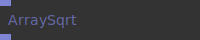

**Full Name:** `Ops.Array.ArraySqrt`

Return the square root of all values in the array.

**`\inputsymbol`{=latex} Inputs**

- **In** (Array)

**`\outputsymbol`{=latex} Output**

- **Result** (Array)

**Example Patch:** [cables.gl/edit/g7ulSP](https://cables.gl/edit/g7ulSP)

**Doc:** [cables.gl/op/Ops.Array.ArraySqrt](https://cables.gl/op/Ops.Array.ArraySqrt)

### ArraysToArrayMultiPort
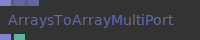

**Full Name:** `Ops.Array.ArraysToArrayMultiPort`

Create an array from multiple string.

**`\inputsymbol`{=latex} Inputs**

- **Arrays_0** (Array)
- **Arrays_1** (Array)
- **Add Port** (Array)

**`\outputsymbol`{=latex} Output**

- **Result** (Array)
- **Num Values** (Number)

**Example Patch:** [cables.gl/op/Ops.Array.ArraysToArrayMultiPort#example](https://cables.gl/op/Ops.Array.ArraysToArrayMultiPort#example)

**Doc:** [cables.gl/op/Ops.Array.ArraysToArrayMultiPort](https://cables.gl/op/Ops.Array.ArraysToArrayMultiPort)

### ArraySubtract


**Full Name:** `Ops.Array.ArraySubtract`

Subtract one number from all values in an array.

**`\inputsymbol`{=latex} Inputs**

- **Array In** (Array)
- **Value** (Number)

**`\outputsymbol`{=latex} Output**

- **Array Out** (Array)

**Example Patch:** [cables.gl/edit/uIYNcn](https://cables.gl/edit/uIYNcn)

**Doc:** [cables.gl/op/Ops.Array.ArraySubtract](https://cables.gl/op/Ops.Array.ArraySubtract)

### ArraySum


**Full Name:** `Ops.Array.ArraySum`

Add one number to all values in an array.

**`\inputsymbol`{=latex} Inputs**

- **In** (Array)
- **Value** (Number)

**`\outputsymbol`{=latex} Output**

- **Result** (Array)

**Example Patch:** [cables.gl/edit/uIYNcn](https://cables.gl/edit/uIYNcn)

**Doc:** [cables.gl/op/Ops.Array.ArraySum](https://cables.gl/op/Ops.Array.ArraySum)

### ArraySumPrevious
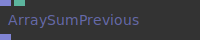

**Full Name:** `Ops.Array.ArraySumPrevious`

Sum up every number in an array with the sum of the previous.

**`\inputsymbol`{=latex} Inputs**

- **Array** (Array)
- **Padding** (Number)

**`\outputsymbol`{=latex} Output**

- **Result** (Array)

**Example Patch:** [cables.gl/edit/udsvLu](https://cables.gl/edit/udsvLu)

**Doc:** [cables.gl/op/Ops.Array.ArraySumPrevious](https://cables.gl/op/Ops.Array.ArraySumPrevious)

### ArraySumUp
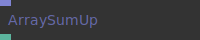

**Full Name:** `Ops.Array.ArraySumUp`

Sum of every number in an array.

**`\inputsymbol`{=latex} Inputs**

- **Array** (Array)

**`\outputsymbol`{=latex} Output**

- **Sum** (Number)

**Example Patch:** [cables.gl/edit/U4M4J5](https://cables.gl/edit/U4M4J5)

**Doc:** [cables.gl/op/Ops.Array.ArraySumUp](https://cables.gl/op/Ops.Array.ArraySumUp)

### ArraySwizzle
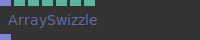

**Full Name:** `Ops.Array.ArraySwizzle`

Manage/re-order components of an array (stride).

**`\inputsymbol`{=latex} Inputs**

- **Array** (Array)

**`\outputsymbol`{=latex} Output**

- **Result** (Array)

**Example Patch:** [cables.gl/edit/MFv6cy](https://cables.gl/edit/MFv6cy)

**Doc:** [cables.gl/op/Ops.Array.ArraySwizzle](https://cables.gl/op/Ops.Array.ArraySwizzle)

### ArrayToArrays
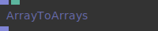

**Full Name:** `Ops.Array.ArrayToArrays`

Split an array up into an array of arrays.

**`\inputsymbol`{=latex} Inputs**

- **Array** (Array)
- **Stride** (Number: Integer)

**`\outputsymbol`{=latex} Output**

- **Result** (Array)

**Example Patch:** [cables.gl/edit/Bpx7ck](https://cables.gl/edit/Bpx7ck)

**Doc:** [cables.gl/op/Ops.Array.ArrayToArrays](https://cables.gl/op/Ops.Array.ArrayToArrays)

### ArrayToByteBuffer
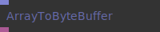

**Full Name:** `Ops.Array.ArrayToByteBuffer`

Convert an array to a byte buffer (Uint8ClampedArray).

**`\inputsymbol`{=latex} Inputs**

- **Array** (Array)

**`\outputsymbol`{=latex} Output**

- **Buffer** (Object)

**Example Patch:** [cables.gl/op/Ops.Array.ArrayToByteBuffer#example](https://cables.gl/op/Ops.Array.ArrayToByteBuffer#example)

**Doc:** [cables.gl/op/Ops.Array.ArrayToByteBuffer](https://cables.gl/op/Ops.Array.ArrayToByteBuffer)

### ArrayToString_v3
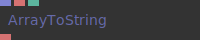

**Full Name:** `Ops.Array.ArrayToString_v3`

Join array values to a string (concat).

**`\inputsymbol`{=latex} Inputs**

- **Array** (Array)
- **Seperator** (String)
- **New Line** (Number: Boolean)

**`\outputsymbol`{=latex} Output**

- **Result** (String)

**Example Patch:** [cables.gl/edit/U4M4J5](https://cables.gl/edit/U4M4J5)

**Doc:** [cables.gl/op/Ops.Array.ArrayToString_v3](https://cables.gl/op/Ops.Array.ArrayToString_v3)

### ArrayTrigger
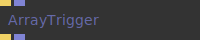

**Full Name:** `Ops.Array.ArrayTrigger`

Trigger an array.

**`\inputsymbol`{=latex} Inputs**

- **Exec** (Trigger)
- **Array** (Array)

**`\outputsymbol`{=latex} Output**

- **Trigger Out** (Trigger)
- **Result** (Array)

**Example Patch:** [cables.gl/op/Ops.Array.ArrayTrigger#example](https://cables.gl/op/Ops.Array.ArrayTrigger#example)

**Doc:** [cables.gl/op/Ops.Array.ArrayTrigger](https://cables.gl/op/Ops.Array.ArrayTrigger)

### ArrayUnique


**Full Name:** `Ops.Array.ArrayUnique`

Filter an array for duplicate items and returns all unique items in a new array.

**`\inputsymbol`{=latex} Inputs**

- **Array** (Array)
- **Format Index** (Number: Integer)
- **Format** (String)

**`\outputsymbol`{=latex} Output**

- **ArrayOut** (Array)
- **Array Length Out** (Number)

**Example Patch:** [cables.gl/edit/vIQlS-](https://cables.gl/edit/vIQlS-)

**Doc:** [cables.gl/op/Ops.Array.ArrayUnique](https://cables.gl/op/Ops.Array.ArrayUnique)

### ArrayUniqueItemInfo
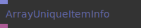

**Full Name:** `Ops.Array.ArrayUniqueItemInfo`

Return information about the count of "duplicates" in an array, as an object.

**`\inputsymbol`{=latex} Inputs**

- **Array** (Array)

**`\outputsymbol`{=latex} Output**

- **ObjectOut** (Object)

**Example Patch:** [cables.gl/edit/72VpS-](https://cables.gl/edit/72VpS-)

**Doc:** [cables.gl/op/Ops.Array.ArrayUniqueItemInfo](https://cables.gl/op/Ops.Array.ArrayUniqueItemInfo)

### ArrayUnpack2


**Full Name:** `Ops.Array.ArrayUnpack2`

Unpack an xy array into separate arrays.

**`\inputsymbol`{=latex} Inputs**

- **Array In Xyz** (Array)

**`\outputsymbol`{=latex} Output**

- **Array 1 Out** (Array)
- **Array 2 Out** (Array)
- **Array Lengths** (Number)

**Example Patch:** [cables.gl/edit/N00tci](https://cables.gl/edit/N00tci)

**Doc:** [cables.gl/op/Ops.Array.ArrayUnpack2](https://cables.gl/op/Ops.Array.ArrayUnpack2)

### ArrayUnpack3


**Full Name:** `Ops.Array.ArrayUnpack3`

Split an xyz array into 3 individual arrays.

**`\inputsymbol`{=latex} Inputs**

- **Array In Xyz** (Array)

**`\outputsymbol`{=latex} Output**

- **Array 1 Out** (Array)
- **Array 2 Out** (Array)
- **Array 3 Out** (Array)
- **Array Lengths** (Number)

**Example Patch:** [cables.gl/edit/lmn5Og](https://cables.gl/edit/lmn5Og)

**Doc:** [cables.gl/op/Ops.Array.ArrayUnpack3](https://cables.gl/op/Ops.Array.ArrayUnpack3)

### ArrayUnpack4


**Full Name:** `Ops.Array.ArrayUnpack4`

Split an xyzw array into 4 individual arrays.

**`\inputsymbol`{=latex} Inputs**

- **Array In Xyzw** (Array)

**`\outputsymbol`{=latex} Output**

- **Array 1 Out** (Array)
- **Array 2 Out** (Array)
- **Array 3 Out** (Array)
- **Array 4 Out** (Array)
- **Array Lengths** (Number)

**Example Patch:** [cables.gl/edit/vl1N_M](https://cables.gl/edit/vl1N_M)

**Doc:** [cables.gl/op/Ops.Array.ArrayUnpack4](https://cables.gl/op/Ops.Array.ArrayUnpack4)

### ArrayUnshiftString
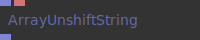

**Full Name:** `Ops.Array.ArrayUnshiftString`

Insert/add/unshift a string to the beginning of an array.

**`\inputsymbol`{=latex} Inputs**

- **Array** (Array)
- **String** (String)

**`\outputsymbol`{=latex} Output**

- **Result** (Array)

**Example Patch:** [cables.gl/edit/Ckkk7M](https://cables.gl/edit/Ckkk7M)

**Doc:** [cables.gl/op/Ops.Array.ArrayUnshiftString](https://cables.gl/op/Ops.Array.ArrayUnshiftString)

### AverageArray
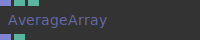

**Full Name:** `Ops.Array.AverageArray`

Smooth/average values in an array.

**`\inputsymbol`{=latex} Inputs**

- **Array** (Array)
- **Iterations** (Number: Integer)
- **Mode Index** (Number: Integer)

**`\outputsymbol`{=latex} Output**

- **Smoothed Array** (Array)
- **Array Length** (Number)

**Example Patch:** [cables.gl/edit/t8uSdn](https://cables.gl/edit/t8uSdn)

**Doc:** [cables.gl/op/Ops.Array.AverageArray](https://cables.gl/op/Ops.Array.AverageArray)

### BoolStateArray
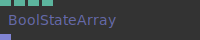

**Full Name:** `Ops.Array.BoolStateArray`

Array filled with `0`, only one can be `1`.

**`\inputsymbol`{=latex} Inputs**

- **Array Length** (Number)
- **Active Index** (Number)
- **Inactive Value** (Number)
- **Active Value** (Number)

**`\outputsymbol`{=latex} Output**

- **State Array** (Array)

**Example Patch:** [cables.gl/edit/9oowlJ](https://cables.gl/edit/9oowlJ)

**Doc:** [cables.gl/op/Ops.Array.BoolStateArray](https://cables.gl/op/Ops.Array.BoolStateArray)

### CopyArray
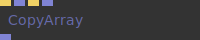

**Full Name:** `Ops.Array.CopyArray`

Copy an array with a trigger, reset to use a default array.

**`\inputsymbol`{=latex} Inputs**

- **Exec** (Trigger)
- **Array** (Array)
- **Reset** (Trigger)
- **Default** (Array)

**`\outputsymbol`{=latex} Output**

- **Result** (Array)

**Example Patch:** [cables.gl/edit/JqSoH-](https://cables.gl/edit/JqSoH-)

**Doc:** [cables.gl/op/Ops.Array.CopyArray](https://cables.gl/op/Ops.Array.CopyArray)

### CopyArraySimple
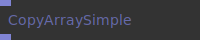

**Full Name:** `Ops.Array.CopyArraySimple`

Create a copy of an array.

**`\inputsymbol`{=latex} Inputs**

- *Visit [Ops.Array.CopyArraySimple documentation](https://cables.gl/op/Ops.Array.CopyArraySimple) for input port details*

**`\outputsymbol`{=latex} Output**

- **Result** (Array)

**Example Patch:** [cables.gl/op/Ops.Array.CopyArraySimple#example](https://cables.gl/op/Ops.Array.CopyArraySimple#example)

**Doc:** [cables.gl/op/Ops.Array.CopyArraySimple](https://cables.gl/op/Ops.Array.CopyArraySimple)

### CropArray
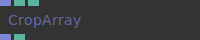

**Full Name:** `Ops.Array.CropArray`

The array to crop.

**`\inputsymbol`{=latex} Inputs**

- **Source Array** (Array)
- **Start Index** (Number: Integer)
- **New Length** (Number: Integer)

**`\outputsymbol`{=latex} Output**

- **Cropped Array** (Array)
- **Array Length** (Number)

**Example Patch:** [cables.gl/edit/UuuJH-](https://cables.gl/edit/UuuJH-)

**Doc:** [cables.gl/op/Ops.Array.CropArray](https://cables.gl/op/Ops.Array.CropArray)

### CutArray
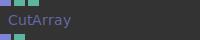

**Full Name:** `Ops.Array.CutArray`

Remove elements from an array from the beginning and/or the end.

**`\inputsymbol`{=latex} Inputs**

- **Source Array** (Array)
- **Remove From Start** (Number: Integer)
- **Remove From End** (Number: Integer)

**`\outputsymbol`{=latex} Output**

- **Cut Array** (Array)
- **Array Length** (Number)

**Example Patch:** [cables.gl/edit/VbqZTh](https://cables.gl/edit/VbqZTh)

**Doc:** [cables.gl/op/Ops.Array.CutArray](https://cables.gl/op/Ops.Array.CutArray)

### EaseArray
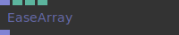

**Full Name:** `Ops.Array.EaseArray`

Apply easing curve to numbers in an array.

**`\inputsymbol`{=latex} Inputs**

- **Array** (Array)
- **Min** (Number)
- **Max** (Number)
- **Easing Index** (Number: Integer)

**`\outputsymbol`{=latex} Output**

- **Result Array** (Array)

**Example Patch:** [cables.gl/edit/Mbwkf6](https://cables.gl/edit/Mbwkf6)

**Doc:** [cables.gl/op/Ops.Array.EaseArray](https://cables.gl/op/Ops.Array.EaseArray)

### EmptyArray


**Full Name:** `Ops.Array.EmptyArray`

*Visit [documentation](https://cables.gl/op/Ops.Array.EmptyArray) for details*.

**`\inputsymbol`{=latex} Inputs**

- *Visit [Ops.Array.EmptyArray documentation](https://cables.gl/op/Ops.Array.EmptyArray) for input port details*

**`\outputsymbol`{=latex} Output**

- **Result** (Array)

**Example Patch:** [cables.gl/op/Ops.Array.EmptyArray#example](https://cables.gl/op/Ops.Array.EmptyArray#example)

**Doc:** [cables.gl/op/Ops.Array.EmptyArray](https://cables.gl/op/Ops.Array.EmptyArray)

### FillArrayRandomDuplicates_v2
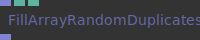

**Full Name:** `Ops.Array.FillArrayRandomDuplicates_v2`

Fill an array with random duplicates.

**`\inputsymbol`{=latex} Inputs**

- **Array** (Array)
- **Num Elements** (Number: Integer)
- **Random Seed** (Number)

**`\outputsymbol`{=latex} Output**

- **Result** (Array)

**Example Patch:** [cables.gl/edit/z4S3dz](https://cables.gl/edit/z4S3dz)

**Doc:** [cables.gl/op/Ops.Array.FillArrayRandomDuplicates_v2](https://cables.gl/op/Ops.Array.FillArrayRandomDuplicates_v2)

### FilterArray
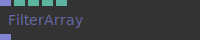

**Full Name:** `Ops.Array.FilterArray`

Compare elements from an array and remove not matching ones.

**`\inputsymbol`{=latex} Inputs**

- **Array** (Array)
- **Stride Index** (Number: Integer)
- **the type of the array** (Array3, Array2, ...)
- **Compare Element Index** (Number: Integer)
- **which element to compare** (see stride)
- **Filter Method Index** (Number: Integer)
- **Compare To** (Number)

**`\outputsymbol`{=latex} Output**

- **Result** (Array)

**Example Patch:** [cables.gl/edit/Z2dVoX](https://cables.gl/edit/Z2dVoX)

**Doc:** [cables.gl/op/Ops.Array.FilterArray](https://cables.gl/op/Ops.Array.FilterArray)

### FilterValidArray
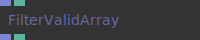

**Full Name:** `Ops.Array.FilterValidArray`

Filter valid arrays.

**`\inputsymbol`{=latex} Inputs**

- **Array** (Array)
- **Invalid When Length Is 0** (Number: Boolean)

**`\outputsymbol`{=latex} Output**

- **Last Valid Array** (Array)
- **Is Valid** (booleanNumber)

**Example Patch:** [cables.gl/op/Ops.Array.FilterValidArray#example](https://cables.gl/op/Ops.Array.FilterValidArray#example)

**Doc:** [cables.gl/op/Ops.Array.FilterValidArray](https://cables.gl/op/Ops.Array.FilterValidArray)

### FlattenArray
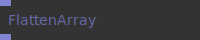

**Full Name:** `Ops.Array.FlattenArray`

Create a new array with all sub-array elements concatenated into it.

**`\inputsymbol`{=latex} Inputs**

- **Array** (Array)

**`\outputsymbol`{=latex} Output**

- **Result** (Array)

**Example Patch:** [cables.gl/edit/x6HFeT](https://cables.gl/edit/x6HFeT)

**Doc:** [cables.gl/op/Ops.Array.FlattenArray](https://cables.gl/op/Ops.Array.FlattenArray)

### FreezeArray


**Full Name:** `Ops.Array.FreezeArray`

Capture the current input and copy it to the output, even after a reload.

**`\inputsymbol`{=latex} Inputs**

- **Number** (Array)
- **Button** (Trigger)

**`\outputsymbol`{=latex} Output**

- **Frozen Array** (Array)

**Example Patch:** [cables.gl/edit/MuPepX](https://cables.gl/edit/MuPepX)

**Doc:** [cables.gl/op/Ops.Array.FreezeArray](https://cables.gl/op/Ops.Array.FreezeArray)

### GateArray_v2
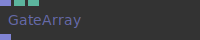

**Full Name:** `Ops.Array.GateArray_v2`

Only allow an array through if pass through is true.

**`\inputsymbol`{=latex} Inputs**

- **Array In** (Array)
- **Pass Through** (Number: Boolean)

**`\outputsymbol`{=latex} Output**

- **Array Out** (Array)

**Example Patch:** [cables.gl/edit/gOaDAH](https://cables.gl/edit/gOaDAH)

**Doc:** [cables.gl/op/Ops.Array.GateArray_v2](https://cables.gl/op/Ops.Array.GateArray_v2)

### GetValuesFromArrayOfObjects
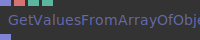

**Full Name:** `Ops.Array.GetValuesFromArrayOfObjects`

Get an array of values by key of objects in an array.

**`\inputsymbol`{=latex} Inputs**

- **Array** (Array)
- **Key** (String)
- **Numbers Only** (Number: Boolean)

**`\outputsymbol`{=latex} Output**

- **Result** (Array)

**Example Patch:** [cables.gl/edit/KQGGeT](https://cables.gl/edit/KQGGeT)

**Doc:** [cables.gl/op/Ops.Array.GetValuesFromArrayOfObjects](https://cables.gl/op/Ops.Array.GetValuesFromArrayOfObjects)

### HSBtoRGBArray


**Full Name:** `Ops.Array.HSBtoRGBArray`

Generate an RGBA array from up to 4 arrays (HSBA).

**`\inputsymbol`{=latex} Inputs**

- **Trigger Input** (Trigger)
- **In Hue Array** (Array)
- **In Saturation Array** (Array)
- **In Brightness Array** (Array)
- **In Alpha Array** (Array)

**`\outputsymbol`{=latex} Output**

- **Trigger Output** (Trigger)
- **Result Array** (Array)
- **Array Length** (Number)
- **RGBA Tuple Length** (Number)

**Example Patch:** [cables.gl/edit/jFyRM-](https://cables.gl/edit/jFyRM-)

**Doc:** [cables.gl/op/Ops.Array.HSBtoRGBArray](https://cables.gl/op/Ops.Array.HSBtoRGBArray)

### InfoArray
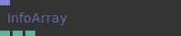

**Full Name:** `Ops.Array.InfoArray`

Min, Max and Average value from an array.

**`\inputsymbol`{=latex} Inputs**

- **Array** (Array)

**`\outputsymbol`{=latex} Output**

- **Min** (Number)
- **Max** (Number)
- **Average** (Number)

**Example Patch:** [cables.gl/edit/qySZQx](https://cables.gl/edit/qySZQx)

**Doc:** [cables.gl/op/Ops.Array.InfoArray](https://cables.gl/op/Ops.Array.InfoArray)

### InfoArray2
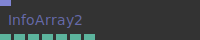

**Full Name:** `Ops.Array.InfoArray2`

Min, Max and Average values of an array2.

**`\inputsymbol`{=latex} Inputs**

- **Array** (Array)

**`\outputsymbol`{=latex} Output**

- **Num Items** (Number)
- **Min X** (Number)
- **Max X** (Number)
- **Average X** (Number)
- **Min Y** (Number)
- **Max Y** (Number)
- **Average Y** (Number)

**Example Patch:** [cables.gl/op/Ops.Array.InfoArray2#example](https://cables.gl/op/Ops.Array.InfoArray2#example)

**Doc:** [cables.gl/op/Ops.Array.InfoArray2](https://cables.gl/op/Ops.Array.InfoArray2)

### InfoArray3
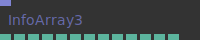

**Full Name:** `Ops.Array.InfoArray3`

Min, Max and Average values of an array3.

**`\inputsymbol`{=latex} Inputs**

- **Array** (Array)

**`\outputsymbol`{=latex} Output**

- **Num Items** (Number)
- **Min X** (Number)
- **Min Y** (Number)
- **Min Z** (Number)
- **Max X** (Number)
- **Max Y** (Number)
- **Max Z** (Number)
- **Average X** (Number)
- **Average Y** (Number)
- **Average Z** (Number)
- **Center X** (Number)
- **Center Y** (Number)
- **Center Z** (Number)

**Example Patch:** [cables.gl/edit/tg7cRx](https://cables.gl/edit/tg7cRx)

**Doc:** [cables.gl/op/Ops.Array.InfoArray3](https://cables.gl/op/Ops.Array.InfoArray3)

### InterpolateArrays
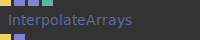

**Full Name:** `Ops.Array.InterpolateArrays`

Interpolate between two arrays (lerp) - linear interpolation.

**`\inputsymbol`{=latex} Inputs**

- **Exe** (Trigger)
- **Array 1** (Array)
- **Array 2** (Array)
- **Perc** (Number)

**`\outputsymbol`{=latex} Output**

- **Next** (Trigger)
- **Result** (Array)

**Example Patch:** [cables.gl/edit/qU2GB3](https://cables.gl/edit/qU2GB3)

**Doc:** [cables.gl/op/Ops.Array.InterpolateArrays](https://cables.gl/op/Ops.Array.InterpolateArrays)

### InterpolateArraysRange
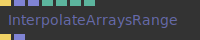

**Full Name:** `Ops.Array.InterpolateArraysRange`

Interpolate between two arrays, only a few numbers at the same time.

**`\inputsymbol`{=latex} Inputs**

- **Exe** (Trigger)
- **Array 1** (Array)
- **Array 2** (Array)
- **Pos** (Number)
- **Width** (Number)
- **Easing Index** (Number: Integer)
- **Reverse** (Number: Boolean)

**`\outputsymbol`{=latex} Output**

- **Next** (Trigger)
- **Result** (Array)

**Example Patch:** [cables.gl/edit/3GIOe6](https://cables.gl/edit/3GIOe6)

**Doc:** [cables.gl/op/Ops.Array.InterpolateArraysRange](https://cables.gl/op/Ops.Array.InterpolateArraysRange)

### InterpolateNumbersArray
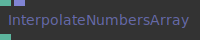

**Full Name:** `Ops.Array.InterpolateNumbersArray`

Interpolate between all values of an array.

**`\inputsymbol`{=latex} Inputs**

- **Index Position** (Number)
- **Array** (Array)

**`\outputsymbol`{=latex} Output**

- **Result** (Number)

**Example Patch:** [cables.gl/edit/dbUc-L](https://cables.gl/edit/dbUc-L)

**Doc:** [cables.gl/op/Ops.Array.InterpolateNumbersArray](https://cables.gl/op/Ops.Array.InterpolateNumbersArray)

### InterpolateNumbersArray3
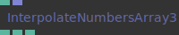

**Full Name:** `Ops.Array.InterpolateNumbersArray3`

Get interpolated values between the indices of an array3x.

**`\inputsymbol`{=latex} Inputs**

- **Index Position** (Number)
- **Array** (Array)

**`\outputsymbol`{=latex} Output**

- **X** (Number)
- **Y** (Number)
- **Z** (Number)

**Example Patch:** [cables.gl/edit/Oqy2n7](https://cables.gl/edit/Oqy2n7)

**Doc:** [cables.gl/op/Ops.Array.InterpolateNumbersArray3](https://cables.gl/op/Ops.Array.InterpolateNumbersArray3)

### LissajouseSpline
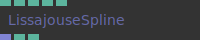

**Full Name:** `Ops.Array.LissajouseSpline`

Generate spline using lissajous formulas.

**`\inputsymbol`{=latex} Inputs**

- **Formula Index** (Number: Integer)
- **A** (Number: Integer)
- **B** (Number: Integer)
- **C** (Number: Integer)
- **D** (Number: Integer)

**`\outputsymbol`{=latex} Output**

- **Result** (Array)
- **Total Points** (Number)
- **Array Length** (Number)

**Example Patch:** [cables.gl/edit/Wa8TS3](https://cables.gl/edit/Wa8TS3)

**Doc:** [cables.gl/op/Ops.Array.LissajouseSpline](https://cables.gl/op/Ops.Array.LissajouseSpline)

### LoopArray3
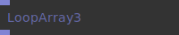

**Full Name:** `Ops.Array.LoopArray3`

Make the 1st and last point of an array the same, good for closing splines and shapes.

**`\inputsymbol`{=latex} Inputs**

- **Array In** (Array)

**`\outputsymbol`{=latex} Output**

- **Array Out** (Array)

**Example Patch:** [cables.gl/edit/-x_dxN](https://cables.gl/edit/-x_dxN)

**Doc:** [cables.gl/op/Ops.Array.LoopArray3](https://cables.gl/op/Ops.Array.LoopArray3)

### MapRangeArray
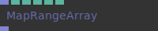

**Full Name:** `Ops.Array.MapRangeArray`

Map values in an array from one range into another.

**`\inputsymbol`{=latex} Inputs**

- **Array** (Array)
- **Old Min** (Number)
- **Old Max** (Number)
- **New Min** (Number)
- **New Max** (Number)
- **Easing Index** (Number: Integer)

**`\outputsymbol`{=latex} Output**

- **Result** (Array)

**Example Patch:** [cables.gl/edit/ZQI6sU](https://cables.gl/edit/ZQI6sU)

**Doc:** [cables.gl/op/Ops.Array.MapRangeArray](https://cables.gl/op/Ops.Array.MapRangeArray)

### NumbersToArrayMultiPort_v2
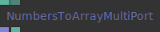

**Full Name:** `Ops.Array.NumbersToArrayMultiPort_v2`

Create an array from multiple number inputs.

**`\inputsymbol`{=latex} Inputs**

- **Numbers_0** (Number)
- **Add Port** (Number)

**`\outputsymbol`{=latex} Output**

- **Result** (Array)
- **Num Values** (Number)

**Example Patch:** [cables.gl/edit/mCTLrh](https://cables.gl/edit/mCTLrh)

**Doc:** [cables.gl/op/Ops.Array.NumbersToArrayMultiPort_v2](https://cables.gl/op/Ops.Array.NumbersToArrayMultiPort_v2)

### ObjectIteratorKeys
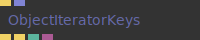

**Full Name:** `Ops.Array.ObjectIteratorKeys`

Iterate over an array of objects.

**`\inputsymbol`{=latex} Inputs**

- **Exe** (Trigger)
- **Array** (Array)

**`\outputsymbol`{=latex} Output**

- **Trigger** (Trigger)
- **Finished** (Trigger)
- **Index** (Number)
- **Value** (Object)

**Example Patch:** [cables.gl/op/Ops.Array.ObjectIteratorKeys#example](https://cables.gl/op/Ops.Array.ObjectIteratorKeys#example)

**Doc:** [cables.gl/op/Ops.Array.ObjectIteratorKeys](https://cables.gl/op/Ops.Array.ObjectIteratorKeys)

### PaletteLibrary
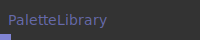

**Full Name:** `Ops.Array.PaletteLibrary`

Contains a collection of color palettes in groups of 5 in an array.

**`\inputsymbol`{=latex} Inputs**

- *Visit [Ops.Array.PaletteLibrary documentation](https://cables.gl/op/Ops.Array.PaletteLibrary) for input port details*

**`\outputsymbol`{=latex} Output**

- **Palette Array Out** (Array)

**Example Patch:** [cables.gl/edit/zpLrSP](https://cables.gl/edit/zpLrSP)

**Doc:** [cables.gl/op/Ops.Array.PaletteLibrary](https://cables.gl/op/Ops.Array.PaletteLibrary)

### PerlinArray
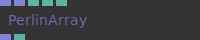

**Full Name:** `Ops.Array.PerlinArray`

Create an array filled with Perlin noise values.

**`\inputsymbol`{=latex} Inputs**

- **Array In X** (Array)
- **Array Time** (Array)
- **Time In Y** (Number)
- **Seed 0-1** (Number)
- **Frequency** (Number)

**`\outputsymbol`{=latex} Output**

- **Array Out** (Array)
- **Array Length Out** (Number)

**Example Patch:** [cables.gl/edit/Vm8fhL](https://cables.gl/edit/Vm8fhL)

**Doc:** [cables.gl/op/Ops.Array.PerlinArray](https://cables.gl/op/Ops.Array.PerlinArray)

### Phyllotaxis


**Full Name:** `Ops.Array.Phyllotaxis`

Coordinate generation like arrangement of leaves in some plants.

**`\inputsymbol`{=latex} Inputs**

- **Render** (Trigger)
- **Num** (Number: Integer)
- **Scale** (Number)
- **Param** (Number)

**`\outputsymbol`{=latex} Output**

- **Coordinates** (Array)

**Example Patch:** [cables.gl/edit/1Pu9Tb](https://cables.gl/edit/1Pu9Tb)

**Doc:** [cables.gl/op/Ops.Array.Phyllotaxis](https://cables.gl/op/Ops.Array.Phyllotaxis)

### RandomNumbersArray_v4
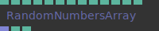

**Full Name:** `Ops.Array.RandomNumbersArray_v4`

Create a random array of 1 to 4 dimensions.

**`\inputsymbol`{=latex} Inputs**

- **Num Values** (Number: Integer)
- **Mode Index** (Number: Integer)
- **Random Seed** (Number)
- **Integer** (Number: Boolean)
- **Min A** (Number)
- **Max A** (Number)
- **Min B** (Number)
- **Max B** (Number)
- **Min C** (Number)
- **Max C** (Number)
- **Min D** (Number)
- **Max D** (Number)

**`\outputsymbol`{=latex} Output**

- **Array Out** (Array)
- **Chunks Amount** (Number)
- **Array Length** (Number)

**Example Patch:** [cables.gl/edit/jmm7N-](https://cables.gl/edit/jmm7N-)

**Doc:** [cables.gl/op/Ops.Array.RandomNumbersArray_v4](https://cables.gl/op/Ops.Array.RandomNumbersArray_v4)

### RandomWordsArray


**Full Name:** `Ops.Array.RandomWordsArray`

Generate an array filled with random english words.

**`\inputsymbol`{=latex} Inputs**

- **Random Seed** (Number)
- **Content Index** (Number: Integer)

**`\outputsymbol`{=latex} Output**

- **Words** (Array)

**Example Patch:** [cables.gl/edit/VHW78i](https://cables.gl/edit/VHW78i)

**Doc:** [cables.gl/op/Ops.Array.RandomWordsArray](https://cables.gl/op/Ops.Array.RandomWordsArray)

### ReduceArray3_v3


**Full Name:** `Ops.Array.ReduceArray3_v3`

Remove points from an array, e.g. xth points, random, duplicates.

**`\inputsymbol`{=latex} Inputs**

- **Array** (Array)
- **Remove Index** (Number: Integer)
- **Every Xth Item** (Number: Integer)
- **Threshold** (Number)
- **Seed** (Number)

**`\outputsymbol`{=latex} Output**

- **Result Array** (Array)

**Example Patch:** [cables.gl/edit/vgRDeT](https://cables.gl/edit/vgRDeT)

**Doc:** [cables.gl/op/Ops.Array.ReduceArray3_v3](https://cables.gl/op/Ops.Array.ReduceArray3_v3)

### ReverseArray3


**Full Name:** `Ops.Array.ReverseArray3`

Reverse an array with value triplets [x, y, z, ...].

**`\inputsymbol`{=latex} Inputs**

- **Array** (Array)
- **The Array you want to reverse** (containing triplets)

**`\outputsymbol`{=latex} Output**

- **Reversed Array** (Array)

**Example Patch:** [cables.gl/edit/1QJiVJ](https://cables.gl/edit/1QJiVJ)

**Doc:** [cables.gl/op/Ops.Array.ReverseArray3](https://cables.gl/op/Ops.Array.ReverseArray3)

### RingBuffer


**Full Name:** `Ops.Array.RingBuffer`

Array of fixed size, index is automatically incremented and restarts after reaching the end.

**`\inputsymbol`{=latex} Inputs**

- **Value** (Number)
- **Write** (Trigger)
- **Length** (Number: Integer)
- **Reset Index** (Trigger)

**`\outputsymbol`{=latex} Output**

- **Result** (Array)
- **Index** (Number)

**Example Patch:** [cables.gl/edit/NwwS97](https://cables.gl/edit/NwwS97)

**Doc:** [cables.gl/op/Ops.Array.RingBuffer](https://cables.gl/op/Ops.Array.RingBuffer)

### RotateArray


**Full Name:** `Ops.Array.RotateArray`

Shift array contents based upon rotate amount.

**`\inputsymbol`{=latex} Inputs**

- **Array In** (Array)
- **Rotate Amount** (Number: Integer)

**`\outputsymbol`{=latex} Output**

- **ArrayOut** (Array)

**Example Patch:** [cables.gl/edit/r7Av7z](https://cables.gl/edit/r7Av7z)

**Doc:** [cables.gl/op/Ops.Array.RotateArray](https://cables.gl/op/Ops.Array.RotateArray)

### RouteArray


**Full Name:** `Ops.Array.RouteArray`

Route an array to an output port.

**`\inputsymbol`{=latex} Inputs**

- **Index** (Number: Integer)
- **Array In** (Array)
- **Default Array** (Array)

**`\outputsymbol`{=latex} Output**

- **Index 0 Array** (Array)
- **Index 1 Array** (Array)
- **Index 2 Array** (Array)
- **Index 3 Array** (Array)
- **Index 4 Array** (Array)
- **Index 5 Array** (Array)
- **Index 6 Array** (Array)
- **Index 7 Array** (Array)
- **Index 8 Array** (Array)
- **Index 9 Array** (Array)

**Example Patch:** [cables.gl/edit/pDYxX8](https://cables.gl/edit/pDYxX8)

**Doc:** [cables.gl/op/Ops.Array.RouteArray](https://cables.gl/op/Ops.Array.RouteArray)

### SetNumberArray


**Full Name:** `Ops.Array.SetNumberArray`

Change the number of an array at an index.

**`\inputsymbol`{=latex} Inputs**

- **Exe** (Trigger)
- **Array** (Array)
- **Index** (Number: Integer)
- **Value** (Number)

**`\outputsymbol`{=latex} Output**

- **Next** (Trigger)
- **Values** (Array)

**Example Patch:** [cables.gl/edit/WRrXSn](https://cables.gl/edit/WRrXSn)

**Doc:** [cables.gl/op/Ops.Array.SetNumberArray](https://cables.gl/op/Ops.Array.SetNumberArray)

### SetNumbersArray3


**Full Name:** `Ops.Array.SetNumbersArray3`

Set three values at position index in an array.

**`\inputsymbol`{=latex} Inputs**

- **Exe** (Trigger)
- **Array** (Array)
- **Index** (Number: Integer)
- **Value 1** (Number)
- **Value 2** (Number)
- **Value 3** (Number)

**`\outputsymbol`{=latex} Output**

- **Values** (Array)

**Example Patch:** [cables.gl/edit/El3nlJ](https://cables.gl/edit/El3nlJ)

**Doc:** [cables.gl/op/Ops.Array.SetNumbersArray3](https://cables.gl/op/Ops.Array.SetNumbersArray3)

### ShuffleArray3_v3


**Full Name:** `Ops.Array.ShuffleArray3_v3`

Shuffle/Randomize the order of an array of triplets.

**`\inputsymbol`{=latex} Inputs**

- **Array3** (Array)
- **Seed** (Number)

**`\outputsymbol`{=latex} Output**

- **Result** (Array)

**Example Patch:** [cables.gl/edit/tbdwsh](https://cables.gl/edit/tbdwsh)

**Doc:** [cables.gl/op/Ops.Array.ShuffleArray3_v3](https://cables.gl/op/Ops.Array.ShuffleArray3_v3)

### ShuffleArray_v3


**Full Name:** `Ops.Array.ShuffleArray_v3`

Randomize the order of elements inside an array.

**`\inputsymbol`{=latex} Inputs**

- **Array3** (Array)
- **Seed** (Number)

**`\outputsymbol`{=latex} Output**

- **Result** (Array)

**Example Patch:** [cables.gl/edit/doUssh](https://cables.gl/edit/doUssh)

**Doc:** [cables.gl/op/Ops.Array.ShuffleArray_v3](https://cables.gl/op/Ops.Array.ShuffleArray_v3)

### SimplexArray


**Full Name:** `Ops.Array.SimplexArray`

Create an array filled with Simplex noise values (Range: -1, 1).

**`\inputsymbol`{=latex} Inputs**

- **Array In X** (Array)
- **Array Time** (Array)
- **Time In Y** (Number)
- **Seed 0-1** (Number)
- **Frequency** (Number)

**`\outputsymbol`{=latex} Output**

- **Array Out** (Array)
- **Array Length Out** (Number)

**Example Patch:** [cables.gl/edit/rNAlhL](https://cables.gl/edit/rNAlhL)

**Doc:** [cables.gl/op/Ops.Array.SimplexArray](https://cables.gl/op/Ops.Array.SimplexArray)

### SmoothArray


**Full Name:** `Ops.Array.SmoothArray`

Smooth out changes in values of an array.

**`\inputsymbol`{=latex} Inputs**

- **Execute** (Trigger)
- **Array In** (Array)
- **Inc Factor** (Number)
- **Dec Factor** (Number)

**`\outputsymbol`{=latex} Output**

- **Next** (Trigger)
- **Array Out** (Array)

**Example Patch:** [cables.gl/edit/BgtGZK](https://cables.gl/edit/BgtGZK)

**Doc:** [cables.gl/op/Ops.Array.SmoothArray](https://cables.gl/op/Ops.Array.SmoothArray)

### SortArray


**Full Name:** `Ops.Array.SortArray`

Sort an array of numbers with one of two modes - ascending or descending.

**`\inputsymbol`{=latex} Inputs**

- **Array To Sort** (Array)

**`\outputsymbol`{=latex} Output**

- **Sorted Array** (Array)

**Example Patch:** [cables.gl/edit/M2f7RJ](https://cables.gl/edit/M2f7RJ)

**Doc:** [cables.gl/op/Ops.Array.SortArray](https://cables.gl/op/Ops.Array.SortArray)

### SortArray3


**Full Name:** `Ops.Array.SortArray3`

Sort an array with the lowest values of the selected component.

**`\inputsymbol`{=latex} Inputs**

- **Array** (Array)
- **What Index** (Number: Integer)

**`\outputsymbol`{=latex} Output**

- **Result** (Array)
- **The sorted array** (new array)

**Example Patch:** [cables.gl/edit/QS8qVJ](https://cables.gl/edit/QS8qVJ)

**Doc:** [cables.gl/op/Ops.Array.SortArray3](https://cables.gl/op/Ops.Array.SortArray3)

### SortArrayOfOjects


**Full Name:** `Ops.Array.SortArrayOfOjects`

Sort an array of objects by the values of a key.

**`\inputsymbol`{=latex} Inputs**

- **Array** (Array)
- **Key** (String)
- **Reverse** (Number: Boolean)

**`\outputsymbol`{=latex} Output**

- **Result** (Array)

**Example Patch:** [cables.gl/edit/shtaz1](https://cables.gl/edit/shtaz1)

**Doc:** [cables.gl/op/Ops.Array.SortArrayOfOjects](https://cables.gl/op/Ops.Array.SortArrayOfOjects)

### SortArrayWithIndices_v2


**Full Name:** `Ops.Array.SortArrayWithIndices_v2`

Sort an array of numbers and also get sorted indices.

**`\inputsymbol`{=latex} Inputs**

- **Array To Sort** (Array)
- **Sorting Mode Index** (Number: Integer)

**`\outputsymbol`{=latex} Output**

- **Sorted Array** (Array)
- **Sorted Indices** (Array)

**Example Patch:** [cables.gl/op/Ops.Array.SortArrayWithIndices_v2#example](https://cables.gl/op/Ops.Array.SortArrayWithIndices_v2#example)

**Doc:** [cables.gl/op/Ops.Array.SortArrayWithIndices_v2](https://cables.gl/op/Ops.Array.SortArrayWithIndices_v2)

### SplineLengthArray3


**Full Name:** `Ops.Array.SplineLengthArray3`

Return a number with the total distance between the points/items in an array3.

**`\inputsymbol`{=latex} Inputs**

- **Array3x** (Array)
- **Calculate** (Trigger)

**`\outputsymbol`{=latex} Output**

- **Length** (Number)

**Example Patch:** [cables.gl/edit/uOzMH7](https://cables.gl/edit/uOzMH7)

**Doc:** [cables.gl/op/Ops.Array.SplineLengthArray3](https://cables.gl/op/Ops.Array.SplineLengthArray3)

### SplinesToLineStripArray


**Full Name:** `Ops.Array.SplinesToLineStripArray`

Convert an array of splines to one "line stripped" array.

**`\inputsymbol`{=latex} Inputs**

- **Array** (Array)

**`\outputsymbol`{=latex} Output**

- **Result** (Array)

**Example Patch:** [cables.gl/edit/_UiSmX](https://cables.gl/edit/_UiSmX)

**Doc:** [cables.gl/op/Ops.Array.SplinesToLineStripArray](https://cables.gl/op/Ops.Array.SplinesToLineStripArray)

### StringToArray_v2


**Full Name:** `Ops.Array.StringToArray_v2`

Parse a string into an array (create, split string, stringToArray).

**`\inputsymbol`{=latex} Inputs**

- **Text** (String)
- **Separator** (String)
- **Numbers** (Number: Boolean)
- **Trim** (Number: Boolean)
- **Split Lines** (Number: Boolean)

**`\outputsymbol`{=latex} Output**

- **Array** (Array)
- **Parsed** (Trigger)
- **Length** (Number)

**Example Patch:** [cables.gl/edit/U4M4J5](https://cables.gl/edit/U4M4J5)

**Doc:** [cables.gl/op/Ops.Array.StringToArray_v2](https://cables.gl/op/Ops.Array.StringToArray_v2)

### StringToCharArray


**Full Name:** `Ops.Array.StringToCharArray`

Turn a string into an array of single characters or ASCII numbers.

**`\inputsymbol`{=latex} Inputs**

- **String** (String)
- **Convert To Numbers** (Number: Boolean)

**`\outputsymbol`{=latex} Output**

- **Array Out** (Array)

**Example Patch:** [cables.gl/edit/30a1rn](https://cables.gl/edit/30a1rn)

**Doc:** [cables.gl/op/Ops.Array.StringToCharArray](https://cables.gl/op/Ops.Array.StringToCharArray)

### StringToLineNumberArray


**Full Name:** `Ops.Array.StringToLineNumberArray`

Output an array containing a line number for every character.

**`\inputsymbol`{=latex} Inputs**

- **String** (String)

**`\outputsymbol`{=latex} Output**

- **Result** (Array)

**Example Patch:** [cables.gl/op/Ops.Array.StringToLineNumberArray#example](https://cables.gl/op/Ops.Array.StringToLineNumberArray#example)

**Doc:** [cables.gl/op/Ops.Array.StringToLineNumberArray](https://cables.gl/op/Ops.Array.StringToLineNumberArray)

### SubdivideArray1


**Full Name:** `Ops.Array.SubdivideArray1`

For subdividing splines, smoothing lines using cubic bezier interpolation.

**`\inputsymbol`{=latex} Inputs**

- **Points** (Array)
- **Num Subdivs** (Number: Integer)
- **Smooth** (Number: Boolean)

**`\outputsymbol`{=latex} Output**

- **Result** (Array)

**Example Patch:** [cables.gl/edit/RJiCqH](https://cables.gl/edit/RJiCqH)

**Doc:** [cables.gl/op/Ops.Array.SubdivideArray1](https://cables.gl/op/Ops.Array.SubdivideArray1)

### SwitchArray


**Full Name:** `Ops.Array.SwitchArray`

Switch between multiple arrays.

**`\inputsymbol`{=latex} Inputs**

- **Index** (Number: Integer)
- **Array 0** (Array)
- **Array 1** (Array)
- **Array 2** (Array)
- **Array 3** (Array)
- **Array 4** (Array)
- **Array 5** (Array)
- **Array 6** (Array)
- **Array 7** (Array)
- **Array 8** (Array)
- **Array 9** (Array)

**`\outputsymbol`{=latex} Output**

- **Result** (Array)

**Example Patch:** [cables.gl/edit/4J2o8i](https://cables.gl/edit/4J2o8i)

**Doc:** [cables.gl/op/Ops.Array.SwitchArray](https://cables.gl/op/Ops.Array.SwitchArray)

### SwitchArrayMultiPort_v2


**Full Name:** `Ops.Array.SwitchArrayMultiPort_v2`

Switch between multiple input arrays.

**`\inputsymbol`{=latex} Inputs**

- **Index** (Number: Integer)
- **Arrays_0** (Array)
- **Add Port** (Array)

**`\outputsymbol`{=latex} Output**

- **Number** (Array)
- **Num Values** (Number)

**Example Patch:** [cables.gl/edit/L7sKrh](https://cables.gl/edit/L7sKrh)

**Doc:** [cables.gl/op/Ops.Array.SwitchArrayMultiPort_v2](https://cables.gl/op/Ops.Array.SwitchArrayMultiPort_v2)

### SwitchArrayOnTrigger


**Full Name:** `Ops.Array.SwitchArrayOnTrigger`

Switch between multiple arrays on trigger.

**`\inputsymbol`{=latex} Inputs**

- **Trigger 1** (Trigger)
- **Array 1** (Array)
- **Trigger 2** (Trigger)
- **Array 2** (Array)
- **Trigger 3** (Trigger)
- **Array 3** (Array)
- **Trigger 4** (Trigger)
- **Array 4** (Array)
- **Trigger 5** (Trigger)
- **Array 5** (Array)
- **Trigger 6** (Trigger)
- **Array 6** (Array)
- **Trigger 7** (Trigger)
- **Array 7** (Array)
- **Trigger 8** (Trigger)
- **Array 8** (Array)

**`\outputsymbol`{=latex} Output**

- **Out Array** (Array)

**Example Patch:** [cables.gl/op/Ops.Array.SwitchArrayOnTrigger#example](https://cables.gl/op/Ops.Array.SwitchArrayOnTrigger#example)

**Doc:** [cables.gl/op/Ops.Array.SwitchArrayOnTrigger](https://cables.gl/op/Ops.Array.SwitchArrayOnTrigger)

### TextureBufferArray


**Full Name:** `Ops.Array.TextureBufferArray`

Store various textures in an array, starts at the beginning again when end reached.

**`\inputsymbol`{=latex} Inputs**

- **Write** (Trigger)
- **Texture** (Object:Texture)
- **Num** (Number: Integer)
- **The size of the ring buffer** (how many textures it can hold)
- **Order** (Number: Boolean)
- **Clear** (Number: Boolean)

**`\outputsymbol`{=latex} Output**

- **Result** (Array)

**Example Patch:** [cables.gl/op/Ops.Array.TextureBufferArray#example](https://cables.gl/op/Ops.Array.TextureBufferArray#example)

**Doc:** [cables.gl/op/Ops.Array.TextureBufferArray](https://cables.gl/op/Ops.Array.TextureBufferArray)

### WeaveArrays


**Full Name:** `Ops.Array.WeaveArrays`

Weave two arrays together (combine, join, merge).

**`\inputsymbol`{=latex} Inputs**

- **Array 1** (Array)
- **Array 2** (Array)
- **Chunk Size** (Number)

**`\outputsymbol`{=latex} Output**

- **Combined Array** (Array)

**Example Patch:** [cables.gl/edit/HSGq8i](https://cables.gl/edit/HSGq8i)

**Doc:** [cables.gl/op/Ops.Array.WeaveArrays](https://cables.gl/op/Ops.Array.WeaveArrays)


