# Ops.Array.PointArray


```{=latex}
\OpsSubsubNoSubsectionNumbering\setcounter{subsubsection}{0}
```
### Array3AreaRemove
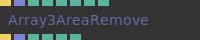

**Full Name:** `Ops.Array.PointArray.Array3AreaRemove`

Remove points from an array3 with different shapes.

**`\inputsymbol`{=latex} Inputs**

- **In Trigger** (Trigger)
- **In Array** (Array)
- **Mode Index** (Number: Integer)
- **Size** (Number)
- **Invert** (Number: Boolean)
- **X** (Number)
- **Y** (Number)
- **Z** (Number)

**`\outputsymbol`{=latex} Output**

- **Out Trigger** (Trigger)
- **Out Array** (Array)
- **Array Length** (Number)
- **Out X** (Number)
- **Out Y** (Number)
- **Out Z** (Number)

**Example:** [cables.gl/edit/sfikWi](https://cables.gl/edit/sfikWi)

**Doc:** [cables.gl/op/Ops.Array.PointArray.Array3AreaRemove](https://cables.gl/op/Ops.Array.PointArray.Array3AreaRemove)

### Array3PointEditor
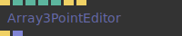

**Full Name:** `Ops.Array.PointArray.Array3PointEditor`

Visually edit positions in an array of point coordinates.

**`\inputsymbol`{=latex} Inputs**

- **Execute** (Trigger)
- **Total Points** (Number: Integer)
- **Edit** (Number: Boolean)
- **Index** (Number: Integer)
- **Copy From Index** (Number: Integer)
- **Copy Coordinates** (Trigger)
- **Reset** (Trigger)

**`\outputsymbol`{=latex} Output**

- **Next** (Trigger)
- **Coordinates** (Array)

**Example:** [cables.gl/edit/2Bhet7](https://cables.gl/edit/2Bhet7)

**Doc:** [cables.gl/op/Ops.Array.PointArray.Array3PointEditor](https://cables.gl/op/Ops.Array.PointArray.Array3PointEditor)

### Array3RepeatTransform
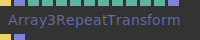

**Full Name:** `Ops.Array.PointArray.Array3RepeatTransform`

Repeat an array by transforming it x times.

**`\inputsymbol`{=latex} Inputs**

- **Trigger** (Trigger)
- **Array** (Array)
- **Times** (Number: Integer)
- **Translate X** (Number)
- **Translate Y** (Number)
- **Translate Z** (Number)
- **Scale X** (Number)
- **Scale Y** (Number)
- **Scale Z** (Number)
- **Rotation X** (Number)
- **Rotation Y** (Number)
- **Rotation Z** (Number)
- **Position Array** (Array)

**`\outputsymbol`{=latex} Output**

- **Next** (Trigger)
- **Result** (Array)

**Example:** [cables.gl/edit/9nSWVj](https://cables.gl/edit/9nSWVj)

**Doc:** [cables.gl/op/Ops.Array.PointArray.Array3RepeatTransform](https://cables.gl/op/Ops.Array.PointArray.Array3RepeatTransform)

### Array3VectorDistance
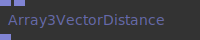

**Full Name:** `Ops.Array.PointArray.Array3VectorDistance`

Return the distance between 2 points from an array.

**`\inputsymbol`{=latex} Inputs**

- **Array In 1** (Array)
- **Array In 2** (Array)

**`\outputsymbol`{=latex} Output**

- **Array Out** (Array)

**Example:** [cables.gl/edit/Tbb8xN](https://cables.gl/edit/Tbb8xN)

**Doc:** [cables.gl/op/Ops.Array.PointArray.Array3VectorDistance](https://cables.gl/op/Ops.Array.PointArray.Array3VectorDistance)

### ArraySpray
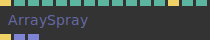

**Full Name:** `Ops.Array.PointArray.ArraySpray`

Particle spray simulation.

**`\inputsymbol`{=latex} Inputs**

- **Exe** (Trigger)
- **Time** (Number)
- **Num** (Number)
- **Size X** (Number)
- **Size Y** (Number)
- **Size Z** (Number)
- **Movement X** (Number)
- **Movement Y** (Number)
- **Movement Z** (Number)
- **Center X** (Number: Boolean)
- **Center Y** (Number: Boolean)
- **Center Z** (Number: Boolean)
- **Reset** (Trigger)
- **Lifetime** (Number)
- **Lifetime Minimum** (Number)

**`\outputsymbol`{=latex} Output**

- **Trigger Out** (Trigger)
- **Positions** (Array)
- **Lifetime** (Array)

**Example:** [cables.gl/edit/hY5lAw](https://cables.gl/edit/hY5lAw)

**Doc:** [cables.gl/op/Ops.Array.PointArray.ArraySpray](https://cables.gl/op/Ops.Array.PointArray.ArraySpray)

### CircularPoints_v2
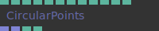

**Full Name:** `Ops.Array.PointArray.CircularPoints_v2`

Create arrays for circular shapes, helix, circle, etc.

**`\inputsymbol`{=latex} Inputs**

- **Radius** (Number)
- **Round Segments** (Number)
- **Rounds** (Number)
- **Radius Add Round** (Number)
- **Radius Add Point** (Number)
- **Offset** (Number)
- **Point Offset XY** (Number)
- **Point Offset Z** (Number)
- **Offset Rotation** (Number)
- **Loop** (Number: Boolean)

**`\outputsymbol`{=latex} Output**

- **Points** (Array)
- **Rotation** (Array)
- **Total Points** (Number)
- **Array Lengths** (Number)

**Example:** [cables.gl/edit/V34dYh](https://cables.gl/edit/V34dYh)

**Doc:** [cables.gl/op/Ops.Array.PointArray.CircularPoints_v2](https://cables.gl/op/Ops.Array.PointArray.CircularPoints_v2)

### FillPointArrayDuplicates


**Full Name:** `Ops.Array.PointArray.FillPointArrayDuplicates`

Fill an XYZ array with existing duplicate points until it reaches the length.

**`\inputsymbol`{=latex} Inputs**

- **Array** (Array)
- **Num Elements** (Number: Integer)
- **Calculate** (Trigger)

**`\outputsymbol`{=latex} Output**

- **Result** (Array)

**Example:** [cables.gl/op/Ops.Array.PointArray.FillPointArrayDuplicates#example](https://cables.gl/op/Ops.Array.PointArray.FillPointArrayDuplicates#example)

**Doc:** [cables.gl/op/Ops.Array.PointArray.FillPointArrayDuplicates](https://cables.gl/op/Ops.Array.PointArray.FillPointArrayDuplicates)

### PointsCube
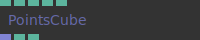

**Full Name:** `Ops.Array.PointArray.PointsCube`

Generate a 3d point field with controllable amount of xyz points (was PointsField3d).

**`\inputsymbol`{=latex} Inputs**

- **Num X** (Number: Integer)
- **Num Y** (Number: Integer)
- **Num Z** (Number: Integer)
- **Mul** (Number)
- **Center** (Number: Boolean)

**`\outputsymbol`{=latex} Output**

- **Array Out** (Array)
- **Total Points** (Number)
- **Array Length** (Number)

**Example:** [cables.gl/edit/_SC2JB](https://cables.gl/edit/_SC2JB)

**Doc:** [cables.gl/op/Ops.Array.PointArray.PointsCube](https://cables.gl/op/Ops.Array.PointArray.PointsCube)

### PointsHexagonGrid
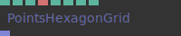

**Full Name:** `Ops.Array.PointArray.PointsHexagonGrid`

Generate coordinates for a hexagon grid, outputs array3x.

**`\inputsymbol`{=latex} Inputs**

- **Rows** (Number: Integer)
- **Colums** (Number: Integer)
- **Hex Facing Index** (Number: Integer)
- **Hex Facing** (String)
- **Flip Corners** (Number: Boolean)
- **Tile X Offset** (Number)
- **Tile Y Offset** (Number)
- **Multiplier** (Number)

**`\outputsymbol`{=latex} Output**

- **Array Out** (Array)

**Example:** [cables.gl/edit/GLLdrn](https://cables.gl/edit/GLLdrn)

**Doc:** [cables.gl/op/Ops.Array.PointArray.PointsHexagonGrid](https://cables.gl/op/Ops.Array.PointArray.PointsHexagonGrid)

### PointsPlane_v2
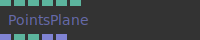

**Full Name:** `Ops.Array.PointArray.PointsPlane_v2`

Generate coordinates for a rectangular field / grid of points.

**`\inputsymbol`{=latex} Inputs**

- **Rows** (Number: Integer)
- **Columns** (Number: Integer)
- **Width** (Number)
- **Height** (Number)
- **Row Offset** (Number)
- **Center** (Number: Boolean)

**`\outputsymbol`{=latex} Output**

- **Result** (Array)
- **Total Points** (Number)
- **Array Length** (Number)
- **Row Numbers** (Array)
- **Column Numbers** (Array)

**Example:** [cables.gl/edit/icchV5](https://cables.gl/edit/icchV5)

**Doc:** [cables.gl/op/Ops.Array.PointArray.PointsPlane_v2](https://cables.gl/op/Ops.Array.PointArray.PointsPlane_v2)

### PointsRectangle_v2
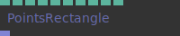

**Full Name:** `Ops.Array.PointArray.PointsRectangle_v2`

Generate an array of XYZ coordinates of an rectangle.

**`\inputsymbol`{=latex} Inputs**

- **Line Strip** (Number: Boolean)
- **Segments** (Number: Integer)
- **Width** (Number)
- **Height** (Number)
- **Border Radius** (Number)
- **Loop** (Number: Boolean)
- **Top Left** (Number: Boolean)
- **Top Right** (Number: Boolean)
- **Bottom Left** (Number: Boolean)
- **Bottom Right** (Number: Boolean)

**`\outputsymbol`{=latex} Output**

- **Points** (Array)

**Example:** [cables.gl/edit/l1KQN8](https://cables.gl/edit/l1KQN8)

**Doc:** [cables.gl/op/Ops.Array.PointArray.PointsRectangle_v2](https://cables.gl/op/Ops.Array.PointArray.PointsRectangle_v2)

### PointsRectangleRounded_v2
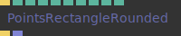

**Full Name:** `Ops.Array.PointArray.PointsRectangleRounded_v2`

Generate an array of points of a rectangle with rounded corners.

**`\inputsymbol`{=latex} Inputs**

- **Render** (Trigger)
- **Segments** (Number: Integer)
- **Width** (Number)
- **Height** (Number)
- **Border Radius** (Number)
- **Top Left** (Number: Boolean)
- **Top Right** (Number: Boolean)
- **Bottom Left** (Number: Boolean)
- **Bottom Right** (Number: Boolean)
- **Draw** (Number: Boolean)

**`\outputsymbol`{=latex} Output**

- **Trigger** (Trigger)
- **Points** (Array)

**Example:** [cables.gl/edit/A7nLgQ](https://cables.gl/edit/A7nLgQ)

**Doc:** [cables.gl/op/Ops.Array.PointArray.PointsRectangleRounded_v2](https://cables.gl/op/Ops.Array.PointArray.PointsRectangleRounded_v2)

### PointsSphereRandom
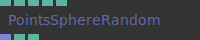

**Full Name:** `Ops.Array.PointArray.PointsSphereRandom`

Generate a point field mapped to the surface of a sphere.

**`\inputsymbol`{=latex} Inputs**

- **Amount Of Points** (Number: Integer)
- **Sphere Size** (Number)
- **Random Seed** (Number)
- **Random Distance From Sphere** (Number)
- **Distribution Index** (Number: Integer)

**`\outputsymbol`{=latex} Output**

- **Array Out** (Array)
- **Total Points** (Number)
- **Array Length** (Number)

**Example:** [cables.gl/edit/yBeQUy](https://cables.gl/edit/yBeQUy)

**Doc:** [cables.gl/op/Ops.Array.PointArray.PointsSphereRandom](https://cables.gl/op/Ops.Array.PointArray.PointsSphereRandom)

### RedistributeSplinePoints
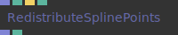

**Full Name:** `Ops.Array.PointArray.RedistributeSplinePoints`

Recalculate a spline / change number of points of a spline.

**`\inputsymbol`{=latex} Inputs**

- **Array3x** (Array)
- **Num Points** (Number: Integer)
- **Calculate** (Trigger)
- **Normalized** (Number: Boolean)

**`\outputsymbol`{=latex} Output**

- **Result** (Array)
- **Spline Length** (Number)

**Example:** [cables.gl/op/Ops.Array.PointArray.RedistributeSplinePoints#example](https://cables.gl/op/Ops.Array.PointArray.RedistributeSplinePoints#example)

**Doc:** [cables.gl/op/Ops.Array.PointArray.RedistributeSplinePoints](https://cables.gl/op/Ops.Array.PointArray.RedistributeSplinePoints)

### SortArray3ByDistance
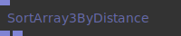

**Full Name:** `Ops.Array.PointArray.SortArray3ByDistance`

Sort an array3, by the distance of each point to the previous point.

**`\inputsymbol`{=latex} Inputs**

- **Array** (Array)

**`\outputsymbol`{=latex} Output**

- **Result** (Array)
- **Result Index** (Array)

**Example:** [cables.gl/edit/7C6DlJ](https://cables.gl/edit/7C6DlJ)

**Doc:** [cables.gl/op/Ops.Array.PointArray.SortArray3ByDistance](https://cables.gl/op/Ops.Array.PointArray.SortArray3ByDistance)

### SplinePositionAtDistanceArray3
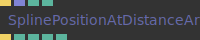

**Full Name:** `Ops.Array.PointArray.SplinePositionAtDistanceArray3`

Get position in array3/spline at distance from start.

**`\inputsymbol`{=latex} Inputs**

- **Calculate** (Trigger)
- **Array3x** (Array)
- **Distance** (Number)
- **Normalized** (Number: Boolean)

**`\outputsymbol`{=latex} Output**

- **Next** (Trigger)
- **X** (Number)
- **Y** (Number)
- **Z** (Number)
- **Spline Length** (Number)

**Example:** [cables.gl/edit/6XhHR7](https://cables.gl/edit/6XhHR7)

**Doc:** [cables.gl/op/Ops.Array.PointArray.SplinePositionAtDistanceArray3](https://cables.gl/op/Ops.Array.PointArray.SplinePositionAtDistanceArray3)

### SubdivideArray3_v2


**Full Name:** `Ops.Array.PointArray.SubdivideArray3_v2`

For subdividing splines, smoothing lines using cubic bezier interpolation.

**`\inputsymbol`{=latex} Inputs**

- **Points** (Array)
- **Num Subdivs** (Number: Integer)
- **Smooth** (Number: Boolean)
- **Loop** (Number: Boolean)

**`\outputsymbol`{=latex} Output**

- **Result** (Array)

**Example:** [cables.gl/edit/uywtvc](https://cables.gl/edit/uywtvc)

**Doc:** [cables.gl/op/Ops.Array.PointArray.SubdivideArray3_v2](https://cables.gl/op/Ops.Array.PointArray.SubdivideArray3_v2)

### TransformArray3
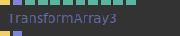

**Full Name:** `Ops.Array.PointArray.TransformArray3`

Transform (translate, rotate, scale) positions in an array3x.

**`\inputsymbol`{=latex} Inputs**

- **Transform** (Trigger)
- **Array** (Array)
- **Translate X** (Number)
- **Translate Y** (Number)
- **Translate Z** (Number)
- **Scale X** (Number)
- **Scale Y** (Number)
- **Scale Z** (Number)
- **Rotation X** (Number)
- **Rotation Y** (Number)
- **Rotation Z** (Number)

**`\outputsymbol`{=latex} Output**

- **Next** (Trigger)
- **Result** (Array)

**Example:** [cables.gl/edit/NenSet](https://cables.gl/edit/NenSet)

**Doc:** [cables.gl/op/Ops.Array.PointArray.TransformArray3](https://cables.gl/op/Ops.Array.PointArray.TransformArray3)


