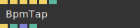

# Ops.Audio

*Part of the [All Operators Reference](13-_AllOps.md)*

---

## Ops.Audio

### BpmTap

**Full Name:** `Ops.Audio.BpmTap`
**Description:** Let’s you tap in a beat, useful to synchronise visuals to music (VJ, sync, sound)

**> Input Ports:**
- **Exe** (Trigger): *See documentation*
- **Tap** (Trigger): *See documentation*
- **Sync** (Trigger): *See documentation*
- **NudgeLeft** (Trigger): *See documentation*
- **NudgeRight** (Trigger): *See documentation*
- **Active** (Number: Boolean): *See documentation*

**< Output Ports:**
- **Beat** (Trigger): *See documentation*
- **Bpm** (Number): *See documentation*
- **The resulting BPM** (beats per minute): *See documentation*
- **States** (Array): *See documentation*
- **Beat Index** (Number): *See documentation*

**Example Patch:** [Open in Editor](https://cables.gl/edit/vwdfqX)
**Patches Using This Op:** *Search [cables.gl patches](https://cables.gl/patches) for "BpmTap"*
**Docs:** [https://cables.gl/op/Ops.Audio.BpmTap](https://cables.gl/op/Ops.Audio.BpmTap)

---

### MidiJson

**Full Name:** `Ops.Audio.MidiJson`
**Description:** read MIDI information at time x

**> Input Ports:**
- **MidiJson** (Object): *See documentation*
- **Time** (Number): *See documentation*

**< Output Ports:**
- **Beat** (Number): *See documentation*
- **Track Names** (Array): *See documentation*
- **Names** (Array): *See documentation*
- **Progress** (Array): *See documentation*
- **Velocity** (Array): *See documentation*
- **Num Tracks** (Number): *See documentation*
- **BPM** (Number): *See documentation*
- **Data** (Object): *See documentation*

**Example Patch:** [Open in Editor](https://cables.gl/edit/yJPMCV)
**Patches Using This Op:** *Search [cables.gl patches](https://cables.gl/patches) for "MidiJson"*
**Docs:** [https://cables.gl/op/Ops.Audio.MidiJson](https://cables.gl/op/Ops.Audio.MidiJson)

---

### MidiJsonNote_v2

**Full Name:** `Ops.Audio.MidiJsonNote_v2`
**Description:** Filter MidiJson for notes

**> Input Ports:**
- **Data** (Object): *See documentation*
- **Note** (String): *See documentation*
- **Channel** (Number: String): *See documentation*
- **Beat Start** (Number: Integer): *See documentation*
- **Beat End** (Number: Integer): *See documentation*

**< Output Ports:**
- **Count** (Number): *See documentation*
- **Progress** (Number): *See documentation*
- **Time Since Last** (Number): *See documentation*
- **Trigger** (Trigger): *See documentation*
- **Reseted** (Trigger): *See documentation*

**Example Patch:** [Open in Editor](https://cables.gl/op/Ops.Audio.MidiJsonNote_v2#example)
**Patches Using This Op:** *Search [cables.gl patches](https://cables.gl/patches) for "MidiJsonNote_v2"*
**Docs:** [https://cables.gl/op/Ops.Audio.MidiJsonNote_v2](https://cables.gl/op/Ops.Audio.MidiJsonNote_v2)

---

