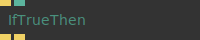
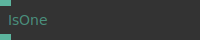
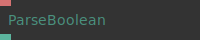
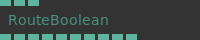
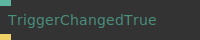
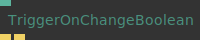

# Ops.Boolean

*Part of the [All Operators Reference](13-_AllOps.md)*

---

## Ops.Boolean

### And

**Full Name:** `Ops.Boolean.And`
**Description:** *Visit [documentation](https://cables.gl/op/Ops.Boolean.And) for details*

**> Input Ports:**
- **Bool 1** (Number: Boolean)
- **Bool 2** (Number: Boolean)

**< Output Ports:**
- **Result** (Number)

**Example Patch:** [Open in Editor](https://cables.gl/op/Ops.Boolean.And#example)
**Patches Using This Op:** *Search [cables.gl patches](https://cables.gl/patches) for "And"*
**Docs:** [https://cables.gl/op/Ops.Boolean.And](https://cables.gl/op/Ops.Boolean.And)

---

### AndMultiPort_v2

**Full Name:** `Ops.Boolean.AndMultiPort_v2`
**Description:** *Visit [documentation](https://cables.gl/op/Ops.Boolean.AndMultiPort_v2) for details*

**> Input Ports:**
- **Booleans_0** (Number: Boolean)
- **Add Port** (Number: Boolean)

**< Output Ports:**
- **Result** (Number)

**Example Patch:** [Open in Editor](https://cables.gl/op/Ops.Boolean.AndMultiPort_v2#example)
**Patches Using This Op:** *Search [cables.gl patches](https://cables.gl/patches) for "AndMultiPort_v2"*
**Docs:** [https://cables.gl/op/Ops.Boolean.AndMultiPort_v2](https://cables.gl/op/Ops.Boolean.AndMultiPort_v2)

---

### BoolByTrigger

**Full Name:** `Ops.Boolean.BoolByTrigger`
**Description:** *Visit [documentation](https://cables.gl/op/Ops.Boolean.BoolByTrigger) for details*

**> Input Ports:**
- **True** (Trigger)
- **False** (Trigger)

**< Output Ports:**
- **Result** (Number)

**Example Patch:** [Open in Editor](https://cables.gl/op/Ops.Boolean.BoolByTrigger#example)
**Patches Using This Op:** *Search [cables.gl patches](https://cables.gl/patches) for "BoolByTrigger"*
**Docs:** [https://cables.gl/op/Ops.Boolean.BoolByTrigger](https://cables.gl/op/Ops.Boolean.BoolByTrigger)

---

### Boolean

**Full Name:** `Ops.Boolean.Boolean`
**Description:** *Visit [documentation](https://cables.gl/op/Ops.Boolean.Boolean) for details*

**> Input Ports:**
- **Value** (Number: Boolean)

**< Output Ports:**
- **Result** (booleanNumber)

**Example Patch:** [Open in Editor](https://cables.gl/op/Ops.Boolean.Boolean#example)
**Patches Using This Op:** *Search [cables.gl patches](https://cables.gl/patches) for "Boolean"*
**Docs:** [https://cables.gl/op/Ops.Boolean.Boolean](https://cables.gl/op/Ops.Boolean.Boolean)

---

### BoolToColor

**Full Name:** `Ops.Boolean.BoolToColor`
**Description:** *Visit [documentation](https://cables.gl/op/Ops.Boolean.BoolToColor) for details*

**> Input Ports:**
- **Boolean** (Number: Boolean)
- **R True** (Number)
- **G True** (Number)
- **B True** (Number)
- **A True** (Number)
- **R False** (Number)
- **G False** (Number)
- **B False** (Number)
- **A False** (Number)

**< Output Ports:**
- **R** (Number)
- **G** (Number)
- **B** (Number)
- **A** (Number)

**Example Patch:** [Open in Editor](https://cables.gl/op/Ops.Boolean.BoolToColor#example)
**Patches Using This Op:** *Search [cables.gl patches](https://cables.gl/patches) for "BoolToColor"*
**Docs:** [https://cables.gl/op/Ops.Boolean.BoolToColor](https://cables.gl/op/Ops.Boolean.BoolToColor)

---

### BoolToNumber_v2

**Full Name:** `Ops.Boolean.BoolToNumber_v2`
**Description:** *Visit [documentation](https://cables.gl/op/Ops.Boolean.BoolToNumber_v2) for details*

**> Input Ports:**
- **Use Value 1** (Number: Boolean)
- **Value 0** (Number)
- **Value 1** (Number)

**< Output Ports:**
- **Out Value** (Number)

**Example Patch:** [Open in Editor](https://cables.gl/op/Ops.Boolean.BoolToNumber_v2#example)
**Patches Using This Op:** *Search [cables.gl patches](https://cables.gl/patches) for "BoolToNumber_v2"*
**Docs:** [https://cables.gl/op/Ops.Boolean.BoolToNumber_v2](https://cables.gl/op/Ops.Boolean.BoolToNumber_v2)

---

### BoolToString

**Full Name:** `Ops.Boolean.BoolToString`
**Description:** *Visit [documentation](https://cables.gl/op/Ops.Boolean.BoolToString) for details*

**> Input Ports:**
- **Boolean** (Number: Boolean)
- **False** (String)
- **True** (String)

**< Output Ports:**
- **String** (String)

**Example Patch:** [Open in Editor](https://cables.gl/op/Ops.Boolean.BoolToString#example)
**Patches Using This Op:** *Search [cables.gl patches](https://cables.gl/patches) for "BoolToString"*
**Docs:** [https://cables.gl/op/Ops.Boolean.BoolToString](https://cables.gl/op/Ops.Boolean.BoolToString)

---

### DelayBooleanSimple

**Full Name:** `Ops.Boolean.DelayBooleanSimple`
**Description:** *Visit [documentation](https://cables.gl/op/Ops.Boolean.DelayBooleanSimple) for details*

**> Input Ports:**
- **Value** (Number)
- **Delay True** (Number)
- **Delay False** (Number)

**< Output Ports:**
- **Out Value** (Number)

**Example Patch:** [Open in Editor](https://cables.gl/op/Ops.Boolean.DelayBooleanSimple#example)
**Patches Using This Op:** *Search [cables.gl patches](https://cables.gl/patches) for "DelayBooleanSimple"*
**Docs:** [https://cables.gl/op/Ops.Boolean.DelayBooleanSimple](https://cables.gl/op/Ops.Boolean.DelayBooleanSimple)

---

### IfFalseThen

**Full Name:** `Ops.Boolean.IfFalseThen`
**Description:** *Visit [documentation](https://cables.gl/op/Ops.Boolean.IfFalseThen) for details*

**> Input Ports:**
- **Exe** (Trigger)
- **Boolean** (Number: Boolean)

**< Output Ports:**
- **Exe** (Trigger)
- **Boolean** (Number: Boolean)
- **Then** (Trigger)
- **Else** (Trigger)

**Example Patch:** [Open in Editor](https://cables.gl/op/Ops.Boolean.IfFalseThen#example)
**Patches Using This Op:** *Search [cables.gl patches](https://cables.gl/patches) for "IfFalseThen"*
**Docs:** [https://cables.gl/op/Ops.Boolean.IfFalseThen](https://cables.gl/op/Ops.Boolean.IfFalseThen)

---

### IfTrueThen_v2

**Full Name:** `Ops.Boolean.IfTrueThen_v2`
**Description:** *Visit [documentation](https://cables.gl/op/Ops.Boolean.IfTrueThen_v2) for details*

**> Input Ports:**
- **Exe** (Trigger)
- **Boolean** (Number: Boolean)

**< Output Ports:**
- **Then** (Trigger)
- **Else** (Trigger)

**Example Patch:** [Open in Editor](https://cables.gl/op/Ops.Boolean.IfTrueThen_v2#example)
**Patches Using This Op:** *Search [cables.gl patches](https://cables.gl/patches) for "IfTrueThen_v2"*
**Docs:** [https://cables.gl/op/Ops.Boolean.IfTrueThen_v2](https://cables.gl/op/Ops.Boolean.IfTrueThen_v2)

---

### IsOne

**Full Name:** `Ops.Boolean.IsOne`
**Description:** *Visit [documentation](https://cables.gl/op/Ops.Boolean.IsOne) for details*

**> Input Ports:**
- **Value** (Number)

**< Output Ports:**
- **Result** (Number)

**Example Patch:** [Open in Editor](https://cables.gl/op/Ops.Boolean.IsOne#example)
**Patches Using This Op:** *Search [cables.gl patches](https://cables.gl/patches) for "IsOne"*
**Docs:** [https://cables.gl/op/Ops.Boolean.IsOne](https://cables.gl/op/Ops.Boolean.IsOne)

---

### IsZero

**Full Name:** `Ops.Boolean.IsZero`
**Description:** *Visit [documentation](https://cables.gl/op/Ops.Boolean.IsZero) for details*

**> Input Ports:**
- **Value** (Number)

**< Output Ports:**
- **Result** (Number)

**Example Patch:** [Open in Editor](https://cables.gl/op/Ops.Boolean.IsZero#example)
**Patches Using This Op:** *Search [cables.gl patches](https://cables.gl/patches) for "IsZero"*
**Docs:** [https://cables.gl/op/Ops.Boolean.IsZero](https://cables.gl/op/Ops.Boolean.IsZero)

---

### MonoFlop

**Full Name:** `Ops.Boolean.MonoFlop`
**Description:** *Visit [documentation](https://cables.gl/op/Ops.Boolean.MonoFlop) for details*

**> Input Ports:**
- **Trigger** (Trigger)
- **Duration** (Number)
- **Value True** (Number)
- **Value False** (Number)
- **Reset** (Trigger)

**< Output Ports:**
- **Activated** (Trigger)
- **Ended** (Trigger)
- **Result** (Number)

**Example Patch:** [Open in Editor](https://cables.gl/op/Ops.Boolean.MonoFlop#example)
**Patches Using This Op:** *Search [cables.gl patches](https://cables.gl/patches) for "MonoFlop"*
**Docs:** [https://cables.gl/op/Ops.Boolean.MonoFlop](https://cables.gl/op/Ops.Boolean.MonoFlop)

---

### Not

**Full Name:** `Ops.Boolean.Not`
**Description:** *Visit [documentation](https://cables.gl/op/Ops.Boolean.Not) for details*

**> Input Ports:**
- **Boolean** (Number: Boolean)

**< Output Ports:**
- **Result** (Number)

**Example Patch:** [Open in Editor](https://cables.gl/op/Ops.Boolean.Not#example)
**Patches Using This Op:** *Search [cables.gl patches](https://cables.gl/patches) for "Not"*
**Docs:** [https://cables.gl/op/Ops.Boolean.Not](https://cables.gl/op/Ops.Boolean.Not)

---

### Or

**Full Name:** `Ops.Boolean.Or`
**Description:** *Visit [documentation](https://cables.gl/op/Ops.Boolean.Or) for details*

**> Input Ports:**
- **Bool 1** (Number: Boolean)
- **Bool 2** (Number: Boolean)
- **Bool 3** (Number: Boolean)
- **Bool 4** (Number: Boolean)
- **Bool 5** (Number: Boolean)
- **Bool 6** (Number: Boolean)
- **Bool 7** (Number: Boolean)
- **Bool 8** (Number: Boolean)
- **Bool 9** (Number: Boolean)
- **Bool 10** (Number: Boolean)

**< Output Ports:**
- **Result** (booleanNumber)

**Example Patch:** [Open in Editor](https://cables.gl/op/Ops.Boolean.Or#example)
**Patches Using This Op:** *Search [cables.gl patches](https://cables.gl/patches) for "Or"*
**Docs:** [https://cables.gl/op/Ops.Boolean.Or](https://cables.gl/op/Ops.Boolean.Or)

---

### OrNumber_v2

**Full Name:** `Ops.Boolean.OrNumber_v2`
**Description:** *Visit [documentation](https://cables.gl/op/Ops.Boolean.OrNumber_v2) for details*

**> Input Ports:**
- **Number** (Number)
- **Number 2** (Number)
- **Number 3** (Number)
- **Number 4** (Number)
- **Number 5** (Number)
- **Number 6** (Number)
- **Number 7** (Number)
- **Number 8** (Number)

**< Output Ports:**
- **Result** (Number)

**Example Patch:** [Open in Editor](https://cables.gl/op/Ops.Boolean.OrNumber_v2#example)
**Patches Using This Op:** *Search [cables.gl patches](https://cables.gl/patches) for "OrNumber_v2"*
**Docs:** [https://cables.gl/op/Ops.Boolean.OrNumber_v2](https://cables.gl/op/Ops.Boolean.OrNumber_v2)

---

### ParseBoolean_v2

**Full Name:** `Ops.Boolean.ParseBoolean_v2`
**Description:** *Visit [documentation](https://cables.gl/op/Ops.Boolean.ParseBoolean_v2) for details*

**> Input Ports:**
- **String** (String)

**< Output Ports:**
- **Result** (booleanNumber)

**Example Patch:** [Open in Editor](https://cables.gl/op/Ops.Boolean.ParseBoolean_v2#example)
**Patches Using This Op:** *Search [cables.gl patches](https://cables.gl/patches) for "ParseBoolean_v2"*
**Docs:** [https://cables.gl/op/Ops.Boolean.ParseBoolean_v2](https://cables.gl/op/Ops.Boolean.ParseBoolean_v2)

---

### RouteBoolean

**Full Name:** `Ops.Boolean.RouteBoolean`
**Description:** *Visit [documentation](https://cables.gl/op/Ops.Boolean.RouteBoolean) for details*

**> Input Ports:**
- **Index** (Number: Integer)
- **Boolean In** (Number: Boolean)
- **Default Boolean** (Number: Boolean)

**< Output Ports:**
- **Index 0 Boolean** (booleanNumber)
- **Index 1 Boolean** (booleanNumber)
- **Index 2 Boolean** (booleanNumber)
- **Index 3 Boolean** (booleanNumber)
- **Index 4 Boolean** (booleanNumber)
- **Index 5 Boolean** (booleanNumber)
- **Index 6 Boolean** (booleanNumber)
- **Index 7 Boolean** (booleanNumber)
- **Index 8 Boolean** (booleanNumber)
- **Index 9 Boolean** (booleanNumber)

**Example Patch:** [Open in Editor](https://cables.gl/op/Ops.Boolean.RouteBoolean#example)
**Patches Using This Op:** *Search [cables.gl patches](https://cables.gl/patches) for "RouteBoolean"*
**Docs:** [https://cables.gl/op/Ops.Boolean.RouteBoolean](https://cables.gl/op/Ops.Boolean.RouteBoolean)

---

### ToggleBool_v2

**Full Name:** `Ops.Boolean.ToggleBool_v2`
**Description:** *Visit [documentation](https://cables.gl/op/Ops.Boolean.ToggleBool_v2) for details*

**> Input Ports:**
- **Trigger** (Trigger)
- **Reset** (Trigger)
- **Default** (Number: Boolean)

**< Output Ports:**
- **Next** (Trigger)
- **Result** (booleanNumber)

**Example Patch:** [Open in Editor](https://cables.gl/op/Ops.Boolean.ToggleBool_v2#example)
**Patches Using This Op:** *Search [cables.gl patches](https://cables.gl/patches) for "ToggleBool_v2"*
**Docs:** [https://cables.gl/op/Ops.Boolean.ToggleBool_v2](https://cables.gl/op/Ops.Boolean.ToggleBool_v2)

---

### TriggerChangedFalse

**Full Name:** `Ops.Boolean.TriggerChangedFalse`
**Description:** *Visit [documentation](https://cables.gl/op/Ops.Boolean.TriggerChangedFalse) for details*

**> Input Ports:**
- **Value** (Number: Boolean)

**< Output Ports:**
- **Next** (Trigger)

**Example Patch:** [Open in Editor](https://cables.gl/op/Ops.Boolean.TriggerChangedFalse#example)
**Patches Using This Op:** *Search [cables.gl patches](https://cables.gl/patches) for "TriggerChangedFalse"*
**Docs:** [https://cables.gl/op/Ops.Boolean.TriggerChangedFalse](https://cables.gl/op/Ops.Boolean.TriggerChangedFalse)

---

### TriggerChangedTrue

**Full Name:** `Ops.Boolean.TriggerChangedTrue`
**Description:** *Visit [documentation](https://cables.gl/op/Ops.Boolean.TriggerChangedTrue) for details*

**> Input Ports:**
- **Value** (Number: Boolean)

**< Output Ports:**
- **Next** (Trigger)

**Example Patch:** [Open in Editor](https://cables.gl/op/Ops.Boolean.TriggerChangedTrue#example)
**Patches Using This Op:** *Search [cables.gl patches](https://cables.gl/patches) for "TriggerChangedTrue"*
**Docs:** [https://cables.gl/op/Ops.Boolean.TriggerChangedTrue](https://cables.gl/op/Ops.Boolean.TriggerChangedTrue)

---

### TriggerOnChangeBoolean_v2

**Full Name:** `Ops.Boolean.TriggerOnChangeBoolean_v2`
**Description:** *Visit [documentation](https://cables.gl/op/Ops.Boolean.TriggerOnChangeBoolean_v2) for details*

**> Input Ports:**
- **Value** (Number: Boolean)

**< Output Ports:**
- **True** (Trigger)
- **False** (Trigger)

**Example Patch:** [Open in Editor](https://cables.gl/op/Ops.Boolean.TriggerOnChangeBoolean_v2#example)
**Patches Using This Op:** *Search [cables.gl patches](https://cables.gl/patches) for "TriggerOnChangeBoolean_v2"*
**Docs:** [https://cables.gl/op/Ops.Boolean.TriggerOnChangeBoolean_v2](https://cables.gl/op/Ops.Boolean.TriggerOnChangeBoolean_v2)

---

