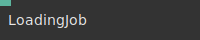

# Ops.Cables

*Part of the [All Operators Reference](13-_AllOps.md)*

---

## Ops.Cables

### AssetPathURL


**Full Name:** `Ops.Cables.AssetPathURL`
**Description:** outputs the path to the assets

**> Input Ports:**
- **Filename** (String)

**< Output Ports:**
- **Path** (String)

**Example Patch:** [Open in Editor](https://cables.gl/edit/mwhthf)
**Patches Using This Op:** *Search [cables.gl patches](https://cables.gl/patches) for "AssetPathURL"*
**Docs:** [https://cables.gl/op/Ops.Cables.AssetPathURL](https://cables.gl/op/Ops.Cables.AssetPathURL)

---

### CablesInfo


**Full Name:** `Ops.Cables.CablesInfo`
**Description:** Output the cables URL of the current editor environment

**> Input Ports:**
- *Visit [Ops.Cables.CablesInfo documentation](https://cables.gl/op/Ops.Cables.CablesInfo) for input port details*

**< Output Ports:**
- **URL** (String)

**Example Patch:** [Open in Editor](https://cables.gl/edit/vaK7iO)
**Patches Using This Op:** *Search [cables.gl patches](https://cables.gl/patches) for "CablesInfo"*
**Docs:** [https://cables.gl/op/Ops.Cables.CablesInfo](https://cables.gl/op/Ops.Cables.CablesInfo)

---

### CallBack_v2


**Full Name:** `Ops.Cables.CallBack_v2`
**Description:** Useful when a cables patch is embedded into a website. All parameters (`Value 1`, `Value 2`, `Value 3` will be send as a parameter array. So e.g. if `Callback Name` is `foo` cables would call: ``` CABLES.patch.config.foo([Value 1, Value 2, Value 3]) ```

**> Input Ports:**
- **Exe** (Trigger)
- **Callback Name** (String)
- **Parameter 1** (String)
- **Parameter 2** (String)
- **Parameter 3** (String)
- **Public** (7): LANDINGPORTAFOLIO
- **LOGICX BED** (PUBLIC): wirmachenbunt - Published Sep 30, 2021 at 12:25

**< Output Ports:**
- *Visit [Ops.Cables.CallBack_v2 documentation](https://cables.gl/op/Ops.Cables.CallBack_v2) for output port details*

**Example Patch:** [Open in Editor](https://cables.gl/op/Ops.Cables.CallBack_v2#example)
**Patches Using This Op:** *Search [cables.gl patches](https://cables.gl/patches) for "CallBack_v2"*
**Docs:** [https://cables.gl/op/Ops.Cables.CallBack_v2](https://cables.gl/op/Ops.Cables.CallBack_v2)

---

### FPS_v2


**Full Name:** `Ops.Cables.FPS_v2`
**Description:** output current frames per second

**> Input Ports:**
- *Visit [Ops.Cables.FPS_v2 documentation](https://cables.gl/op/Ops.Cables.FPS_v2) for input port details*

**< Output Ports:**
- **FPS** (Number)
- **MS** (Number)

**Example Patch:** [Open in Editor](https://cables.gl/edit/KhFA8i)
**Patches Using This Op:** *Search [cables.gl patches](https://cables.gl/patches) for "FPS_v2"*
**Docs:** [https://cables.gl/op/Ops.Cables.FPS_v2](https://cables.gl/op/Ops.Cables.FPS_v2)

---

### Function_v2


**Full Name:** `Ops.Cables.Function_v2`
**Description:** trigger from external function when embedded into a website

**> Input Ports:**
- **Function Name** (String)
- **Trigger** (Trigger)
- **Default Parameter 1** (String)
- **Default Parameter 2** (String)
- **Default Parameter 3** (String)

**< Output Ports:**
- **Next** (Trigger)
- **Parameter 1** (String)
- **Parameter 2** (String)
- **Parameter 3** (String)

**Example Patch:** [Open in Editor](https://cables.gl/op/Ops.Cables.Function_v2#example)
**Patches Using This Op:** *Search [cables.gl patches](https://cables.gl/patches) for "Function_v2"*
**Docs:** [https://cables.gl/op/Ops.Cables.Function_v2](https://cables.gl/op/Ops.Cables.Function_v2)

---

### GetOpName


**Full Name:** `Ops.Cables.GetOpName`
**Description:** Get op name by id

**> Input Ports:**
- **OpId** (String)

**< Output Ports:**
- **Found** (booleanNumber)
- **Name** (String)
- **Shortname** (String)
- **Version** (Number)

**Example Patch:** [Open in Editor](https://cables.gl/edit/Hmk7iO)
**Patches Using This Op:** *Search [cables.gl patches](https://cables.gl/patches) for "GetOpName"*
**Docs:** [https://cables.gl/op/Ops.Cables.GetOpName](https://cables.gl/op/Ops.Cables.GetOpName)

---

### GetSubPatchName


**Full Name:** `Ops.Cables.GetSubPatchName`
**Description:** Outputs the current subpatch op name

**> Input Ports:**
- *Visit [Ops.Cables.GetSubPatchName documentation](https://cables.gl/op/Ops.Cables.GetSubPatchName) for input port details*

**< Output Ports:**
- **Name** (String)
- **ShortName** (String)

**Example Patch:** [Open in Editor](https://cables.gl/edit/20tMrh)
**Patches Using This Op:** *Search [cables.gl patches](https://cables.gl/patches) for "GetSubPatchName"*
**Docs:** [https://cables.gl/op/Ops.Cables.GetSubPatchName](https://cables.gl/op/Ops.Cables.GetSubPatchName)

---

### LoadingJob


**Full Name:** `Ops.Cables.LoadingJob`
**Description:** Create a loading job while input is true

**> Input Ports:**
- **Loading Active** (Number: Boolean)

**< Output Ports:**
- *Visit [Ops.Cables.LoadingJob documentation](https://cables.gl/op/Ops.Cables.LoadingJob) for output port details*

**Example Patch:** [Open in Editor](https://cables.gl/edit/bzn9z1)
**Patches Using This Op:** *Search [cables.gl patches](https://cables.gl/patches) for "LoadingJob"*
**Docs:** [https://cables.gl/op/Ops.Cables.LoadingJob](https://cables.gl/op/Ops.Cables.LoadingJob)

---

### LoadingStatus_v2


**Full Name:** `Ops.Cables.LoadingStatus_v2`
**Description:** trigger events / get information about asset-loading status

**> Input Ports:**
- **Exe** (Trigger)
- **Play Timeline** (Number: Boolean)

**< Output Ports:**
- **Next** (Trigger)
- **Finished Initial Loading** (booleanNumber)
- **Loading** (booleanNumber)
- **Progress** (Number)
- **Jobs** (Array)
- **Trigger Loading Finished** (Trigger)

**Example Patch:** [Open in Editor](https://cables.gl/edit/5FQ08W)
**Patches Using This Op:** *Search [cables.gl patches](https://cables.gl/patches) for "LoadingStatus_v2"*
**Docs:** [https://cables.gl/op/Ops.Cables.LoadingStatus_v2](https://cables.gl/op/Ops.Cables.LoadingStatus_v2)

---

### PatchInfo_v2


**Full Name:** `Ops.Cables.PatchInfo_v2`
**Description:** read patch config when embedding on another page

**> Input Ports:**
- *Visit [Ops.Cables.PatchInfo_v2 documentation](https://cables.gl/op/Ops.Cables.PatchInfo_v2) for input port details*

**< Output Ports:**
- **Config** (Object)
- **Name** (String)
- **Patch Id** (String)
- **Namespace** (String)
- **Last Saved** (Number)
- **Last Exported** (Number)

**Example Patch:** [Open in Editor](https://cables.gl/edit/3hkdqX)
**Patches Using This Op:** *Search [cables.gl patches](https://cables.gl/patches) for "PatchInfo_v2"*
**Docs:** [https://cables.gl/op/Ops.Cables.PatchInfo_v2](https://cables.gl/op/Ops.Cables.PatchInfo_v2)

---

### UIMode


**Full Name:** `Ops.Cables.UIMode`
**Description:** Outputs `true` if patch is executed in the cables editor (UI)

**> Input Ports:**
- *Visit [Ops.Cables.UIMode documentation](https://cables.gl/op/Ops.Cables.UIMode) for input port details*

**< Output Ports:**
- **UI** (booleanNumber)
- **Overlay Mode** (booleanNumber)
- **Remote Viewer** (booleanNumber)
- **Is Standalone** (booleanNumber)
- **Canvas Mode** (Number)
- **Patch Field Visible** (booleanNumber)

**Example Patch:** [Open in Editor](https://cables.gl/edit/vyqgR3)
**Patches Using This Op:** *Search [cables.gl patches](https://cables.gl/patches) for "UIMode"*
**Docs:** [https://cables.gl/op/Ops.Cables.UIMode](https://cables.gl/op/Ops.Cables.UIMode)

---

### UploadAsset


**Full Name:** `Ops.Cables.UploadAsset`
**Description:** Upload a file into the cables patch assets using a base64 string

**> Input Ports:**
- **Filename** (String)
- **Base64 String** (String)
- **Upload** (Trigger)

**< Output Ports:**
- **Result** (String)
- **Error** (booleanNumber)
- **Finished** (Trigger)

**Example Patch:** [Open in Editor](https://cables.gl/edit/6vDCsh)
**Patches Using This Op:** *Search [cables.gl patches](https://cables.gl/patches) for "UploadAsset"*
**Docs:** [https://cables.gl/op/Ops.Cables.UploadAsset](https://cables.gl/op/Ops.Cables.UploadAsset)

---

### UploadScreenshot


**Full Name:** `Ops.Cables.UploadScreenshot`
**Description:** Upload an image as screentshot in cables

**> Input Ports:**
- **Trigger** (Trigger)
- **DataUrl** (String)

**< Output Ports:**
- **Result** (Number)

**Example Patch:** [Open in Editor](https://cables.gl/op/Ops.Cables.UploadScreenshot#example)
**Patches Using This Op:** *Search [cables.gl patches](https://cables.gl/patches) for "UploadScreenshot"*
**Docs:** [https://cables.gl/op/Ops.Cables.UploadScreenshot](https://cables.gl/op/Ops.Cables.UploadScreenshot)

---

