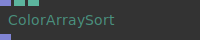
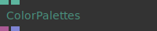
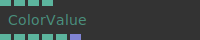
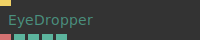
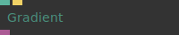
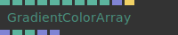
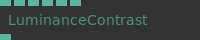
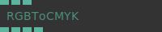
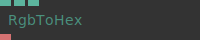
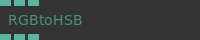

# Ops.Color


```{=latex}
\OpsSubsubNoSubsectionNumbering\setcounter{subsubsection}{0}
```
### ColorArraySort


**Full Name:** `Ops.Color.ColorArraySort`

Sort an array of colors by saturation/lightness etc.

**`\inputsymbol`{=latex} Inputs**

- **Colors** (Array)

**`\outputsymbol`{=latex} Output**

- **New Colors** (Array)

**Example:** [cables.gl/edit/zKfluu](https://cables.gl/edit/zKfluu)

**Doc:** [cables.gl/op/Ops.Color.ColorArraySort](https://cables.gl/op/Ops.Color.ColorArraySort)

### ColorPalettes


**Full Name:** `Ops.Color.ColorPalettes`

Contains a collection of nice color palettes output to texture or array via index.

**`\inputsymbol`{=latex} Inputs**

- **Index** (Number: Integer)
- **Smooth** (Number: Boolean)

**`\outputsymbol`{=latex} Output**

- **Texture** (Object)
- **Color Array** (Array)
- **The color array containing 5 colors** (15 values in total, 3 values per color – r, g and b)

**Example:** [cables.gl/edit/xRvD98](https://cables.gl/edit/xRvD98)

**Doc:** [cables.gl/op/Ops.Color.ColorPalettes](https://cables.gl/op/Ops.Color.ColorPalettes)

### ColorValue


**Full Name:** `Ops.Color.ColorValue`

Use a color value on multiple places.

**`\inputsymbol`{=latex} Inputs**

- **R** (Number)
- **G** (Number)
- **B** (Number)
- **A** (Number)

**`\outputsymbol`{=latex} Output**

- **Outr** (Number)
- **Outg** (Number)
- **Outb** (Number)
- **Outa** (Number)
- **Hex** (Number)
- **Array** (Array)

**Example:** [cables.gl/edit/19KZet](https://cables.gl/edit/19KZet)

**Doc:** [cables.gl/op/Ops.Color.ColorValue](https://cables.gl/op/Ops.Color.ColorValue)

### EyeDropper


**Full Name:** `Ops.Color.EyeDropper`

Native color picker.

**`\inputsymbol`{=latex} Inputs**

- **Open** (Trigger)

**`\outputsymbol`{=latex} Output**

- **Hex** (String)
- **R** (Number)
- **G** (Number)
- **B** (Number)
- **Supported** (booleanNumber)

**Example:** [cables.gl/edit/kYsAkv](https://cables.gl/edit/kYsAkv)

**Doc:** [cables.gl/op/Ops.Color.EyeDropper](https://cables.gl/op/Ops.Color.EyeDropper)

### Gradient


**Full Name:** `Ops.Color.Gradient`

gradient editor,outputs an objects with gradient information.

**`\inputsymbol`{=latex} Inputs**

- **Gradient** (Number)
- **Randomize Colors** (Trigger)

**`\outputsymbol`{=latex} Output**

- **Gradient Object** (Object)

**Example:** [cables.gl/edit/QB7br5](https://cables.gl/edit/QB7br5)

**Doc:** [cables.gl/op/Ops.Color.Gradient](https://cables.gl/op/Ops.Color.Gradient)

### GradientColorArray


**Full Name:** `Ops.Color.GradientColorArray`

texture containing a colour gradient that can be altered with an editor.

**`\inputsymbol`{=latex} Inputs**

- **Gradient** (Number)
- **Direction Index** (Number: Integer)
- **Smoothstep** (Number: Boolean)
- **Step** (Number: Boolean)
- **Flip** (Number: Boolean)
- **SRGB** (Number: Boolean)
- **Oklab** (Number: Boolean)
- **Size** (Number: Integer)
- **Dither** (Number)
- **Gradient Array** (Array)
- **Randomize Colors** (Trigger)

**`\outputsymbol`{=latex} Output**

- **Color Array** (Array)
- **Width** (Number)
- **Height** (Number)
- **Colors** (Array)
- **Colors Pos** (Array)

**Example:** [cables.gl/edit/xAdV8x](https://cables.gl/edit/xAdV8x)

**Doc:** [cables.gl/op/Ops.Color.GradientColorArray](https://cables.gl/op/Ops.Color.GradientColorArray)

### HexToRGB_v2


**Full Name:** `Ops.Color.HexToRGB_v2`

Converts a hex color like `#ff0000` to number values.

**`\inputsymbol`{=latex} Inputs**

- **Hex** (String)
- **Bytes** (Number: Boolean)

**`\outputsymbol`{=latex} Output**

- **R** (Number)
- **G** (Number)
- **B** (Number)
- **RGB Array** (Array)

**Example:** [cables.gl/edit/IBX1ft](https://cables.gl/edit/IBX1ft)

**Doc:** [cables.gl/op/Ops.Color.HexToRGB_v2](https://cables.gl/op/Ops.Color.HexToRGB_v2)

### HSLtoRGB


**Full Name:** `Ops.Color.HSLtoRGB`

Convert HSL to RGB.

**`\inputsymbol`{=latex} Inputs**

- **Hue** (Number)
- **Saturation** (Number)
- **Lightness** (Number)

**`\outputsymbol`{=latex} Output**

- **R** (Number)
- **G** (Number)
- **B** (Number)

**Example:** [cables.gl/edit/3fOpvs](https://cables.gl/edit/3fOpvs)

**Doc:** [cables.gl/op/Ops.Color.HSLtoRGB](https://cables.gl/op/Ops.Color.HSLtoRGB)

### LuminanceContrast


**Full Name:** `Ops.Color.LuminanceContrast`

Calculate the luminance contrast between two colors.

**`\inputsymbol`{=latex} Inputs**

- **R 1** (Number)
- **G 1** (Number)
- **B 1** (Number)
- **R 2** (Number)
- **G 2** (Number)
- **B 2** (Number)

**`\outputsymbol`{=latex} Output**

- **Contrast** (Number)

**Example:** [cables.gl/edit/lFzrvs](https://cables.gl/edit/lFzrvs)

**Doc:** [cables.gl/op/Ops.Color.LuminanceContrast](https://cables.gl/op/Ops.Color.LuminanceContrast)

### RGBLuminance


**Full Name:** `Ops.Color.RGBLuminance`

Calculate the luminance of a RGB color.

**`\inputsymbol`{=latex} Inputs**

- **R** (Number)
- **G** (Number)
- **B** (Number)

**`\outputsymbol`{=latex} Output**

- **Luminance** (Number)

**Example:** [cables.gl/edit/Du0rvs](https://cables.gl/edit/Du0rvs)

**Doc:** [cables.gl/op/Ops.Color.RGBLuminance](https://cables.gl/op/Ops.Color.RGBLuminance)

### RGBToCMYK


**Full Name:** `Ops.Color.RGBToCMYK`

Output the CMYK value of a RGB color.

**`\inputsymbol`{=latex} Inputs**

- **R** (Number)
- **G** (Number)
- **B** (Number)

**`\outputsymbol`{=latex} Output**

- **C** (Number)
- **M** (Number)
- **Y** (Number)
- **K** (Number)

**Example:** [cables.gl/edit/Du0rvs](https://cables.gl/edit/Du0rvs)

**Doc:** [cables.gl/op/Ops.Color.RGBToCMYK](https://cables.gl/op/Ops.Color.RGBToCMYK)

### RgbToHex


**Full Name:** `Ops.Color.RgbToHex`

convert RGB float values to HEX color String.

**`\inputsymbol`{=latex} Inputs**

- **R** (Number)
- **G** (Number)
- **B** (Number)

**`\outputsymbol`{=latex} Output**

- **Result** (String)

**Example:** [cables.gl/edit/Up7r8i](https://cables.gl/edit/Up7r8i)

**Doc:** [cables.gl/op/Ops.Color.RgbToHex](https://cables.gl/op/Ops.Color.RgbToHex)

### RGBtoHSB


**Full Name:** `Ops.Color.RGBtoHSB`

convert RGB color to HSB Hue, Saturation, Brightness.

**`\inputsymbol`{=latex} Inputs**

- **R** (Number)
- **G** (Number)
- **B** (Number)

**`\outputsymbol`{=latex} Output**

- **Hue** (Number)
- **Saturation** (Number)
- **Brightness** (Number)

**Example:** [cables.gl/edit/Up7r8i](https://cables.gl/edit/Up7r8i)

**Doc:** [cables.gl/op/Ops.Color.RGBtoHSB](https://cables.gl/op/Ops.Color.RGBtoHSB)

### RGBtoHSL


**Full Name:** `Ops.Color.RGBtoHSL`

Convert RGB color to HSL values.

**`\inputsymbol`{=latex} Inputs**

- **R** (Number)
- **G** (Number)
- **B** (Number)

**`\outputsymbol`{=latex} Output**

- **Hue** (Number)
- **Saturation** (Number)
- **Lightness** (Number)

**Example:** [cables.gl/edit/Du0rvs](https://cables.gl/edit/Du0rvs)

**Doc:** [cables.gl/op/Ops.Color.RGBtoHSL](https://cables.gl/op/Ops.Color.RGBtoHSL)


