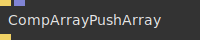
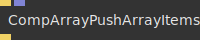
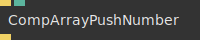
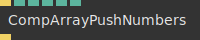
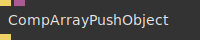
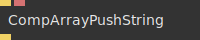
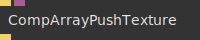
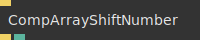

# Ops.Data.Compose.Array


```{=latex}
\OpsSubsubNoSubsectionNumbering\setcounter{subsubsection}{0}
```
### CompArray


**Full Name:** `Ops.Data.Compose.Array.CompArray`

Compose an Array.

**`\inputsymbol`{=latex} Inputs**

- **Update** (Trigger)
- **Active** (Number: Boolean)
- **Clear** (Number: Boolean)
- **Reset** (Trigger)

**`\outputsymbol`{=latex} Output**

- **Next** (Trigger)
- **Result** (Array)

**Example Patch:** [cables.gl/edit/RLvmjz](https://cables.gl/edit/RLvmjz)

**Doc:** [cables.gl/op/Ops.Data.Compose.Array.CompArray](https://cables.gl/op/Ops.Data.Compose.Array.CompArray)

### CompArrayPopNumber


**Full Name:** `Ops.Data.Compose.Array.CompArrayPopNumber`

pop/remove the last number from an array.

**`\inputsymbol`{=latex} Inputs**

- **Update** (Trigger)

**`\outputsymbol`{=latex} Output**

- **Next** (Trigger)
- **Result** (Number)

**Example Patch:** [cables.gl/op/Ops.Data.Compose.Array.CompArrayPopNumber#example](https://cables.gl/op/Ops.Data.Compose.Array.CompArrayPopNumber#example)

**Doc:** [cables.gl/op/Ops.Data.Compose.Array.CompArrayPopNumber](https://cables.gl/op/Ops.Data.Compose.Array.CompArrayPopNumber)

### CompArrayPushArray


**Full Name:** `Ops.Data.Compose.Array.CompArrayPushArray`

push/append an array to an array.

**`\inputsymbol`{=latex} Inputs**

- **Update** (Trigger)
- **Array** (Array)

**`\outputsymbol`{=latex} Output**

- **Next** (Trigger)

**Example Patch:** [cables.gl/op/Ops.Data.Compose.Array.CompArrayPushArray#example](https://cables.gl/op/Ops.Data.Compose.Array.CompArrayPushArray#example)

**Doc:** [cables.gl/op/Ops.Data.Compose.Array.CompArrayPushArray](https://cables.gl/op/Ops.Data.Compose.Array.CompArrayPushArray)

### CompArrayPushArrayItems


**Full Name:** `Ops.Data.Compose.Array.CompArrayPushArrayItems`

push/append an array to an array.

**`\inputsymbol`{=latex} Inputs**

- **Update** (Trigger)
- **Array** (Array)

**`\outputsymbol`{=latex} Output**

- **Next** (Trigger)

**Example Patch:** [cables.gl/edit/ADSKWn](https://cables.gl/edit/ADSKWn)

**Doc:** [cables.gl/op/Ops.Data.Compose.Array.CompArrayPushArrayItems](https://cables.gl/op/Ops.Data.Compose.Array.CompArrayPushArrayItems)

### CompArrayPushNumber


**Full Name:** `Ops.Data.Compose.Array.CompArrayPushNumber`

push/append a number to an array.

**`\inputsymbol`{=latex} Inputs**

- **Update** (Trigger)
- **Number** (Number)

**`\outputsymbol`{=latex} Output**

- **Next** (Trigger)

**Example Patch:** [cables.gl/edit/RLvmjz](https://cables.gl/edit/RLvmjz)

**Doc:** [cables.gl/op/Ops.Data.Compose.Array.CompArrayPushNumber](https://cables.gl/op/Ops.Data.Compose.Array.CompArrayPushNumber)

### CompArrayPushNumbers


**Full Name:** `Ops.Data.Compose.Array.CompArrayPushNumbers`

push/append multiple numbers to an array.

**`\inputsymbol`{=latex} Inputs**

- **Update** (Trigger)
- **X** (Number)
- **Y** (Number)
- **Z** (Number)
- **W** (Number)

**`\outputsymbol`{=latex} Output**

- **Next** (Trigger)

**Example Patch:** [cables.gl/op/Ops.Data.Compose.Array.CompArrayPushNumbers#example](https://cables.gl/op/Ops.Data.Compose.Array.CompArrayPushNumbers#example)

**Doc:** [cables.gl/op/Ops.Data.Compose.Array.CompArrayPushNumbers](https://cables.gl/op/Ops.Data.Compose.Array.CompArrayPushNumbers)

### CompArrayPushObject


**Full Name:** `Ops.Data.Compose.Array.CompArrayPushObject`

push/append an object to an array.

**`\inputsymbol`{=latex} Inputs**

- **Update** (Trigger)
- **Object** (Object)

**`\outputsymbol`{=latex} Output**

- **Next** (Trigger)

**Example Patch:** [cables.gl/edit/SCFZJK](https://cables.gl/edit/SCFZJK)

**Doc:** [cables.gl/op/Ops.Data.Compose.Array.CompArrayPushObject](https://cables.gl/op/Ops.Data.Compose.Array.CompArrayPushObject)

### CompArrayPushString


**Full Name:** `Ops.Data.Compose.Array.CompArrayPushString`

push/append a string to an array.

**`\inputsymbol`{=latex} Inputs**

- **Update** (Trigger)
- **String** (String)

**`\outputsymbol`{=latex} Output**

- **Next** (Trigger)

**Example Patch:** [cables.gl/op/Ops.Data.Compose.Array.CompArrayPushString#example](https://cables.gl/op/Ops.Data.Compose.Array.CompArrayPushString#example)

**Doc:** [cables.gl/op/Ops.Data.Compose.Array.CompArrayPushString](https://cables.gl/op/Ops.Data.Compose.Array.CompArrayPushString)

### CompArrayPushTexture


**Full Name:** `Ops.Data.Compose.Array.CompArrayPushTexture`

push/append a texture to an array.

**`\inputsymbol`{=latex} Inputs**

- **Update** (Trigger)
- **Object** (Object)

**`\outputsymbol`{=latex} Output**

- **Next** (Trigger)

**Example Patch:** [cables.gl/op/Ops.Data.Compose.Array.CompArrayPushTexture#example](https://cables.gl/op/Ops.Data.Compose.Array.CompArrayPushTexture#example)

**Doc:** [cables.gl/op/Ops.Data.Compose.Array.CompArrayPushTexture](https://cables.gl/op/Ops.Data.Compose.Array.CompArrayPushTexture)

### CompArraySetNumber


**Full Name:** `Ops.Data.Compose.Array.CompArraySetNumber`

set a number to an array at index.

**`\inputsymbol`{=latex} Inputs**

- **Update** (Trigger)
- **Index** (Number)
- **Number** (Number)

**`\outputsymbol`{=latex} Output**

- **Next** (Trigger)

**Example Patch:** [cables.gl/op/Ops.Data.Compose.Array.CompArraySetNumber#example](https://cables.gl/op/Ops.Data.Compose.Array.CompArraySetNumber#example)

**Doc:** [cables.gl/op/Ops.Data.Compose.Array.CompArraySetNumber](https://cables.gl/op/Ops.Data.Compose.Array.CompArraySetNumber)

### CompArraySetObject


**Full Name:** `Ops.Data.Compose.Array.CompArraySetObject`

push/append a number to an array.

**`\inputsymbol`{=latex} Inputs**

- **Update** (Trigger)
- **Index** (Number)
- **Object** (Object)

**`\outputsymbol`{=latex} Output**

- **Next** (Trigger)

**Example Patch:** [cables.gl/op/Ops.Data.Compose.Array.CompArraySetObject#example](https://cables.gl/op/Ops.Data.Compose.Array.CompArraySetObject#example)

**Doc:** [cables.gl/op/Ops.Data.Compose.Array.CompArraySetObject](https://cables.gl/op/Ops.Data.Compose.Array.CompArraySetObject)

### CompArrayShiftNumber


**Full Name:** `Ops.Data.Compose.Array.CompArrayShiftNumber`

shift/remove the first number from an array.

**`\inputsymbol`{=latex} Inputs**

- **Update** (Trigger)

**`\outputsymbol`{=latex} Output**

- **Next** (Trigger)
- **Result** (Number)

**Example Patch:** [cables.gl/op/Ops.Data.Compose.Array.CompArrayShiftNumber#example](https://cables.gl/op/Ops.Data.Compose.Array.CompArrayShiftNumber#example)

**Doc:** [cables.gl/op/Ops.Data.Compose.Array.CompArrayShiftNumber](https://cables.gl/op/Ops.Data.Compose.Array.CompArrayShiftNumber)

### CompArraySnapshot


**Full Name:** `Ops.Data.Compose.Array.CompArraySnapshot`

get a copy of the current state of an array.

**`\inputsymbol`{=latex} Inputs**

- **Update** (Trigger)

**`\outputsymbol`{=latex} Output**

- **Next** (Trigger)
- **Result** (Array)

**Example Patch:** [cables.gl/op/Ops.Data.Compose.Array.CompArraySnapshot#example](https://cables.gl/op/Ops.Data.Compose.Array.CompArraySnapshot#example)

**Doc:** [cables.gl/op/Ops.Data.Compose.Array.CompArraySnapshot](https://cables.gl/op/Ops.Data.Compose.Array.CompArraySnapshot)


