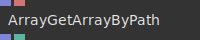
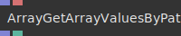
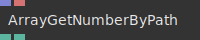
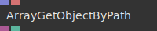
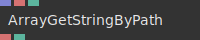
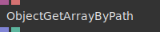
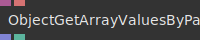
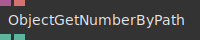
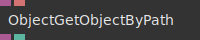
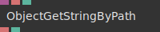

# Ops.Data.JsonPath

---

## Ops.Data.JsonPath

### ArrayGetArrayByPath

**Full Name:** `Ops.Data.JsonPath.ArrayGetArrayByPath`

**Description:** returns the array at the position defined by a path

**`\inputsymbol`{=latex} Inputs**

- **Array** (Array)
- **Path** (String)
- **path to array** (i.e. data.numbers)

**`\outputsymbol`{=latex} Output**

- **Found** (booleanNumber)

**Example Patch:** [Open in Editor](https://cables.gl/edit/uqXSWr)

**Docs:** [https://cables.gl/op/Ops.Data.JsonPath.ArrayGetArrayByPath](https://cables.gl/op/Ops.Data.JsonPath.ArrayGetArrayByPath)

### ArrayGetArrayValuesByPath

**Full Name:** `Ops.Data.JsonPath.ArrayGetArrayValuesByPath`

**Description:** Outputs all the values of the properties of an array of objects given a path

**`\inputsymbol`{=latex} Inputs**

- **Array** (Array)
- **Path** (String)
- **path to first array field** (i.e. "data.0.firstName")

**`\outputsymbol`{=latex} Output**

- **Found** (booleanNumber)

**Example Patch:** [Open in Editor](https://cables.gl/edit/Y3pXWr)

**Docs:** [https://cables.gl/op/Ops.Data.JsonPath.ArrayGetArrayValuesByPath](https://cables.gl/op/Ops.Data.JsonPath.ArrayGetArrayValuesByPath)

### ArrayGetNumberByPath

**Full Name:** `Ops.Data.JsonPath.ArrayGetNumberByPath`

**Description:** finds a number at a position in an array defined by path

**`\inputsymbol`{=latex} Inputs**

- **Array** (Array)
- **Path** (String)
- **the past** (i.e. person.age)

**`\outputsymbol`{=latex} Output**

- **Found** (booleanNumber)

**Example Patch:** [Open in Editor](https://cables.gl/edit/7kSVWr)

**Docs:** [https://cables.gl/op/Ops.Data.JsonPath.ArrayGetNumberByPath](https://cables.gl/op/Ops.Data.JsonPath.ArrayGetNumberByPath)

### ArrayGetObjectByPath

**Full Name:** `Ops.Data.JsonPath.ArrayGetObjectByPath`

**Description:** Returns the object at the position defined by a path

**`\inputsymbol`{=latex} Inputs**

- **Array** (Array)
- **Path** (String)

**`\outputsymbol`{=latex} Output**

- **Found** (booleanNumber)

**Example Patch:** [Open in Editor](https://cables.gl/edit/AapUWr)

**Docs:** [https://cables.gl/op/Ops.Data.JsonPath.ArrayGetObjectByPath](https://cables.gl/op/Ops.Data.JsonPath.ArrayGetObjectByPath)

### ArrayGetStringByPath_v2

**Full Name:** `Ops.Data.JsonPath.ArrayGetStringByPath_v2`

**Description:** Finds a string at a position in an array defined by path

**`\inputsymbol`{=latex} Inputs**

- **Array** (Array)
- **Path** (String)
- **the path** (i.e. data.names)
- **Return Path If Missing** (Number: Boolean)

**`\outputsymbol`{=latex} Output**

- **Found** (booleanNumber)

**Example Patch:** [Open in Editor](https://cables.gl/edit/rs0XWr)

**Docs:** [https://cables.gl/op/Ops.Data.JsonPath.ArrayGetStringByPath_v2](https://cables.gl/op/Ops.Data.JsonPath.ArrayGetStringByPath_v2)

### ObjectGetArrayByPath

**Full Name:** `Ops.Data.JsonPath.ObjectGetArrayByPath`

**Description:** returns the array at the position defined by a path

**`\inputsymbol`{=latex} Inputs**

- **Object** (Object)
- **Path** (String)
- **path to array** (i.e. data.numbers)

**`\outputsymbol`{=latex} Output**

- **Found** (booleanNumber)

**Example Patch:** [Open in Editor](https://cables.gl/edit/oghmln)

**Docs:** [https://cables.gl/op/Ops.Data.JsonPath.ObjectGetArrayByPath](https://cables.gl/op/Ops.Data.JsonPath.ObjectGetArrayByPath)

### ObjectGetArrayValuesByPath

**Full Name:** `Ops.Data.JsonPath.ObjectGetArrayValuesByPath`

**Description:** Outputs all the values of the properties of an array of objects given a path

**`\inputsymbol`{=latex} Inputs**

- **Object** (Object)
- **Path** (String)
- **path to first array field** (i.e. "data.0.firstName")

**`\outputsymbol`{=latex} Output**

- **Found** (booleanNumber)

**Example Patch:** [Open in Editor](https://cables.gl/edit/fBcgln)

**Docs:** [https://cables.gl/op/Ops.Data.JsonPath.ObjectGetArrayValuesByPath](https://cables.gl/op/Ops.Data.JsonPath.ObjectGetArrayValuesByPath)

### ObjectGetNumberByPath

**Full Name:** `Ops.Data.JsonPath.ObjectGetNumberByPath`

**Description:** finds a number at a position in an object defined by path

**`\inputsymbol`{=latex} Inputs**

- **Object** (Object)
- **Path** (String)
- **the past** (i.e. person.age)

**`\outputsymbol`{=latex} Output**

- **Found** (booleanNumber)

**Example Patch:** [Open in Editor](https://cables.gl/edit/RrYnln)

**Docs:** [https://cables.gl/op/Ops.Data.JsonPath.ObjectGetNumberByPath](https://cables.gl/op/Ops.Data.JsonPath.ObjectGetNumberByPath)

### ObjectGetObjectByPath

**Full Name:** `Ops.Data.JsonPath.ObjectGetObjectByPath`

**Description:** Returns the object at the position defined by a path

**`\inputsymbol`{=latex} Inputs**

- **Object** (Object)
- **Path** (String)

**`\outputsymbol`{=latex} Output**

- **Found** (booleanNumber)

**Example Patch:** [Open in Editor](https://cables.gl/edit/-Zlrln)

**Docs:** [https://cables.gl/op/Ops.Data.JsonPath.ObjectGetObjectByPath](https://cables.gl/op/Ops.Data.JsonPath.ObjectGetObjectByPath)

### ObjectGetStringByPath_v2

**Full Name:** `Ops.Data.JsonPath.ObjectGetStringByPath_v2`

**Description:** Finds a string at a position in an object defined by path

**`\inputsymbol`{=latex} Inputs**

- **Object** (Object)
- **Path** (String)
- **the path** (i.e. data.names)
- **Output Path If Missing** (Number: Boolean)

**`\outputsymbol`{=latex} Output**

- **Found** (booleanNumber)

**Example Patch:** [Open in Editor](https://cables.gl/edit/eJIqln)

**Docs:** [https://cables.gl/op/Ops.Data.JsonPath.ObjectGetStringByPath_v2](https://cables.gl/op/Ops.Data.JsonPath.ObjectGetStringByPath_v2)

