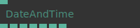
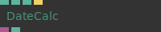
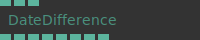
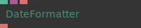
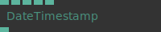
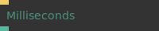
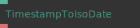

# Ops.Date

---

## Ops.Date

### DateAndTime

**Full Name:** `Ops.Date.DateAndTime`

**Description:** Returns current date and time and timestamp

**`\inputsymbol`{=latex} Inputs**

- **Update Rate** (Number)
- **How often the op should update the output** (in milliseconds)

**`\outputsymbol`{=latex} Output**

- **Year** (Number)
- **Month** (Number)
- **Day** (Number)
- **Hours** (Number)
- **Minutes** (Number)
- **Seconds** (Number)
- **Timestamp** (Number)

**Example Patch:** [Open in Editor](https://cables.gl/edit/GuzKSD)

**Docs:** [https://cables.gl/op/Ops.Date.DateAndTime](https://cables.gl/op/Ops.Date.DateAndTime)

### DateCalc

**Full Name:** `Ops.Date.DateCalc`

**Description:** Perform date calculations

**`\inputsymbol`{=latex} Inputs**

- **Timestamp** (Number)
- **Difference** (Number: Integer)
- **Type Index** (Number: Integer)
- **Update** (Trigger)
- **Update time value** (not needed if an timestamp input is used)

**`\outputsymbol`{=latex} Output**

- **Date** (Object)
- **Timestamp** (Number)

**Example Patch:** [Open in Editor](https://cables.gl/edit/mzfGGl)

**Docs:** [https://cables.gl/op/Ops.Date.DateCalc](https://cables.gl/op/Ops.Date.DateCalc)

### DateDifference

**Full Name:** `Ops.Date.DateDifference`

**Description:** Calculates the difference between two timestamps

**`\inputsymbol`{=latex} Inputs**

- **Timestamp 1** (Number)
- **Timestamp 2** (Number)
- **Stop At 0** (Number: Boolean)

**`\outputsymbol`{=latex} Output**

- **Year** (Number)
- **Month** (Number)
- **Day** (Number)
- **Hours** (Number)
- **Minutes** (Number)
- **Seconds** (Number)
- **Milliseconds** (Number)
- **Diff** (Number)

**Example Patch:** [Open in Editor](https://cables.gl/edit/d1NUet)

**Docs:** [https://cables.gl/op/Ops.Date.DateDifference](https://cables.gl/op/Ops.Date.DateDifference)

### DateFormatter

**Full Name:** `Ops.Date.DateFormatter`

**Description:** String representation of a date

**`\inputsymbol`{=latex} Inputs**

- **Timestamp** (Number)
- **Date** (Object)
- **Format** (String)

**`\outputsymbol`{=latex} Output**

- **StringDate** (String)

**Example Patch:** [Open in Editor](https://cables.gl/edit/mzfGGl)

**Docs:** [https://cables.gl/op/Ops.Date.DateFormatter](https://cables.gl/op/Ops.Date.DateFormatter)

### DateIsoToTimestamp

**Full Name:** `Ops.Date.DateIsoToTimestamp`

**Description:** parses a date and time in iso format and outputs a millisecond timestamp

**`\inputsymbol`{=latex} Inputs**

- **Datetime** (String)

**`\outputsymbol`{=latex} Output**

- **Timestamp** (Number)

**Example Patch:** [Open in Editor](https://cables.gl/edit/nsSRrU)

**Docs:** [https://cables.gl/op/Ops.Date.DateIsoToTimestamp](https://cables.gl/op/Ops.Date.DateIsoToTimestamp)

### DateTimestamp

**Full Name:** `Ops.Date.DateTimestamp`

**Description:** Calculates the timestamp of a date by year / month / day / hour / minute

**`\inputsymbol`{=latex} Inputs**

- **Year** (Number: Integer)
- **Month** (Number: Integer)
- **Day** (Number: Integer)
- **Hour** (Number: Integer)
- **Minute** (Number: Integer)

**`\outputsymbol`{=latex} Output**

- **Timestamp** (Number)

**Example Patch:** [Open in Editor](https://cables.gl/op/Ops.Date.DateTimestamp#example)

**Docs:** [https://cables.gl/op/Ops.Date.DateTimestamp](https://cables.gl/op/Ops.Date.DateTimestamp)

### Milliseconds

**Full Name:** `Ops.Date.Milliseconds`

**Description:** Value since the time origin in milliseconds (performance.now())

**`\inputsymbol`{=latex} Inputs**

- **Update** (Trigger)

**`\outputsymbol`{=latex} Output**

- **Result** (Number)

**Example Patch:** [Open in Editor](https://cables.gl/edit/dJzVbI)

**Docs:** [https://cables.gl/op/Ops.Date.Milliseconds](https://cables.gl/op/Ops.Date.Milliseconds)

### TimestampToIsoDate

**Full Name:** `Ops.Date.TimestampToIsoDate`

**Description:** convert a timestamp to an ISO date string

**`\inputsymbol`{=latex} Inputs**

- **Timestamp** (Number)

**`\outputsymbol`{=latex} Output**

- **ISO Date** (String)

**Example Patch:** [Open in Editor](https://cables.gl/edit/MqNl8i)

**Docs:** [https://cables.gl/op/Ops.Date.TimestampToIsoDate](https://cables.gl/op/Ops.Date.TimestampToIsoDate)

