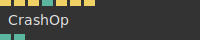
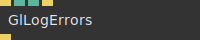
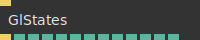

# Ops.Debug

*Part of the [All Operators Reference](13-_AllOps.md)*

---

## Ops.Debug

### Console

**Full Name:** `Ops.Debug.Console`
**Description:** *Visit [documentation](https://cables.gl/op/Ops.Debug.Console) for details*

**> Input Ports:**
- **Visible** (Number: Boolean)
- **Clear** (Trigger)

**< Output Ports:**
- **Element** (Object)

**Example Patch:** [Open in Editor](https://cables.gl/op/Ops.Debug.Console#example)
**Patches Using This Op:** *Search [cables.gl patches](https://cables.gl/patches) for "Console"*
**Docs:** [https://cables.gl/op/Ops.Debug.Console](https://cables.gl/op/Ops.Debug.Console)

---

### ConsoleLog

**Full Name:** `Ops.Debug.ConsoleLog`
**Description:** *Visit [documentation](https://cables.gl/op/Ops.Debug.ConsoleLog) for details*

**> Input Ports:**
- **Number** (Number)
- **String** (String)

**< Output Ports:**
- *Visit [Ops.Debug.ConsoleLog documentation](https://cables.gl/op/Ops.Debug.ConsoleLog) for output port details*

**Example Patch:** [Open in Editor](https://cables.gl/op/Ops.Debug.ConsoleLog#example)
**Patches Using This Op:** *Search [cables.gl patches](https://cables.gl/patches) for "ConsoleLog"*
**Docs:** [https://cables.gl/op/Ops.Debug.ConsoleLog](https://cables.gl/op/Ops.Debug.ConsoleLog)

---

### CrashOp

**Full Name:** `Ops.Debug.CrashOp`
**Description:** *Visit [documentation](https://cables.gl/op/Ops.Debug.CrashOp) for details*

**> Input Ports:**
- **Async Crash** (Trigger)
- **Undefined Crash** (Trigger)
- **Throw Exception** (Trigger)
- **Float** (Number)
- **Array Exception** (Trigger)
- **Promise Fail** (Trigger)
- **Shader Error** (Trigger)

**< Output Ports:**
- **NaN** (Number)
- **Infinity** (Number)

**Example Patch:** [Open in Editor](https://cables.gl/op/Ops.Debug.CrashOp#example)
**Patches Using This Op:** *Search [cables.gl patches](https://cables.gl/patches) for "CrashOp"*
**Docs:** [https://cables.gl/op/Ops.Debug.CrashOp](https://cables.gl/op/Ops.Debug.CrashOp)

---

### GlLogErrors

**Full Name:** `Ops.Debug.GlLogErrors`
**Description:** *Visit [documentation](https://cables.gl/op/Ops.Debug.GlLogErrors) for details*

**> Input Ports:**
- **Exec** (Trigger)
- **Limit Error Logs Num** (Number: Integer)
- **Stop Trigger After Limit** (Number: Boolean)
- **Show Gl History** (Trigger)

**< Output Ports:**
- **Next** (Trigger)

**Example Patch:** [Open in Editor](https://cables.gl/op/Ops.Debug.GlLogErrors#example)
**Patches Using This Op:** *Search [cables.gl patches](https://cables.gl/patches) for "GlLogErrors"*
**Docs:** [https://cables.gl/op/Ops.Debug.GlLogErrors](https://cables.gl/op/Ops.Debug.GlLogErrors)

---

### GlStates

**Full Name:** `Ops.Debug.GlStates`
**Description:** *Visit [documentation](https://cables.gl/op/Ops.Debug.GlStates) for details*

**> Input Ports:**
- **Update** (Trigger)

**< Output Ports:**
- **Next** (Trigger)
- **GlGetError** (Number)
- **Depthtest** (Number)
- **Stack Depthtest** (Number)
- **Depth Writing** (Number)
- **Stack Depth Writing** (Number)
- **DepthFunc** (Number)
- **Stack DepthFunc** (Number)
- **Blend** (Number)
- **Blend Stack** (Number)
- **Cull Mode** (Number)
- **Face Culling** (Number)
- **Is Shadowpass** (booleanNumber)

**Example Patch:** [Open in Editor](https://cables.gl/op/Ops.Debug.GlStates#example)
**Patches Using This Op:** *Search [cables.gl patches](https://cables.gl/patches) for "GlStates"*
**Docs:** [https://cables.gl/op/Ops.Debug.GlStates](https://cables.gl/op/Ops.Debug.GlStates)

---

### ProfileGL

**Full Name:** `Ops.Debug.ProfileGL`
**Description:** *Visit [documentation](https://cables.gl/op/Ops.Debug.ProfileGL) for details*

**> Input Ports:**
- **Exec** (Trigger)
- **Debug One Frame** (Trigger)

**< Output Ports:**
- **Next** (Trigger)

**Example Patch:** [Open in Editor](https://cables.gl/op/Ops.Debug.ProfileGL#example)
**Patches Using This Op:** *Search [cables.gl patches](https://cables.gl/patches) for "ProfileGL"*
**Docs:** [https://cables.gl/op/Ops.Debug.ProfileGL](https://cables.gl/op/Ops.Debug.ProfileGL)

---

### StopWatch

**Full Name:** `Ops.Debug.StopWatch`
**Description:** *Visit [documentation](https://cables.gl/op/Ops.Debug.StopWatch) for details*

**> Input Ports:**
- **Exec** (Trigger)

**< Output Ports:**
- **Next** (Trigger)
- **Time Used** (Number)
- **Times** (Array)

**Example Patch:** [Open in Editor](https://cables.gl/op/Ops.Debug.StopWatch#example)
**Patches Using This Op:** *Search [cables.gl patches](https://cables.gl/patches) for "StopWatch"*
**Docs:** [https://cables.gl/op/Ops.Debug.StopWatch](https://cables.gl/op/Ops.Debug.StopWatch)

---

