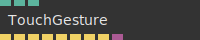
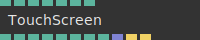

# Ops.Devices


```{=latex}
\OpsSubsubNoSubsectionNumbering\setcounter{subsubsection}{0}
```
### TouchGesture


**Full Name:** `Ops.Devices.TouchGesture`

detect touch gestures like swipe and pan.

**`\inputsymbol`{=latex} Inputs**

- **Active** (Number: Boolean)
- **Vertical Swipe** (Number: Boolean)
- **Vertical Pan** (Number: Boolean)

**`\outputsymbol`{=latex} Output**

- **Press** (Trigger)
- **Press Up** (Trigger)
- **Pan Left** (Trigger)
- **Pan Right** (Trigger)
- **Swipe Left** (Trigger)
- **Swipe Right** (Trigger)
- **Swipe Up** (Trigger)
- **Swipe Down** (Trigger)
- **Event** (Object)

**Example:** [cables.gl/op/Ops.Devices.TouchGesture#example](https://cables.gl/op/Ops.Devices.TouchGesture#example)

**Doc:** [cables.gl/op/Ops.Devices.TouchGesture](https://cables.gl/op/Ops.Devices.TouchGesture)

### TouchScreen


**Full Name:** `Ops.Devices.TouchScreen`

touch screen input: e.g. position of fingers.

**`\inputsymbol`{=latex} Inputs**

- **Disable Scaling** (Number: Boolean)
- **Disable Scroll** (Number: Boolean)
- **HDPI Coordinates** (Number: Boolean)
- **Active** (Number: Boolean)
- **Normalize Coordinates** (Number: Boolean)
- **Flip Y** (Number: Boolean)

**`\outputsymbol`{=latex} Output**

- **Touched** (Number)
- **Fingers** (Number)
- **Finger 1 X** (Number)
- **Finger 1 Y** (Number)
- **Finger 1 Force** (Number)
- **Finger 2 X** (Number)
- **Finger 2 Y** (Number)
- **Finger 2 Force** (Number)
- **Events** (Array)
- **Touch Start** (Trigger)
- **Touch End** (Trigger)

**Example:** [cables.gl/op/Ops.Devices.TouchScreen#example](https://cables.gl/op/Ops.Devices.TouchScreen#example)

**Doc:** [cables.gl/op/Ops.Devices.TouchScreen](https://cables.gl/op/Ops.Devices.TouchScreen)


