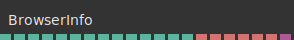
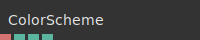
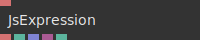
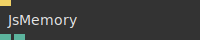
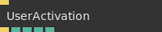
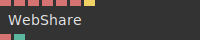

# Ops.Devices.Browser

---

```{=latex}
\stepcounter{subsection}\setcounter{subsubsection}{0}
```
### BrowserInfo_v3


**Full Name:** `Ops.Devices.Browser.BrowserInfo_v3`

**Description:** Reports the browser being used

**`\inputsymbol`{=latex} Inputs**

- *Visit [Ops.Devices.Browser.BrowserInfo_v3 documentation](https://cables.gl/op/Ops.Devices.Browser.BrowserInfo_v3) for input port details*

**`\outputsymbol`{=latex} Output**

- **Is Mobile** (booleanNumber)
- **Is Touchscreen** (booleanNumber)
- **Is IE** (booleanNumber)
- **Is Edge** (booleanNumber)
- **Is Chrome** (booleanNumber)
- **Is Firefox** (booleanNumber)
- **Is Opera** (booleanNumber)
- **Is Safari** (booleanNumber)
- **True if the browser is Safari** (iOS & macOS & OS X)
- **Is Windows** (booleanNumber)
- **Is Linux** (booleanNumber)
- **Is Mac** (booleanNumber)
- **Is IOS** (booleanNumber)
- **Is Android** (booleanNumber)
- **Is Electron** (booleanNumber)
- **Operating System** (String)
- **Browser Name** (String)
- **Browser Version** (String)
- **OS Version** (String)
- **Language** (String)
- **User Agent** (String)
- **Platform Object** (Object)

**Example Patch:** [Open in Editor](https://cables.gl/edit/YOJiIk)

**Docs:** [https://cables.gl/op/Ops.Devices.Browser.BrowserInfo_v3](https://cables.gl/op/Ops.Devices.Browser.BrowserInfo_v3)

### ColorScheme


**Full Name:** `Ops.Devices.Browser.ColorScheme`

**Description:** Get light/dark color scheme preference of the browser

**`\inputsymbol`{=latex} Inputs**

- *Visit [Ops.Devices.Browser.ColorScheme documentation](https://cables.gl/op/Ops.Devices.Browser.ColorScheme) for input port details*

**`\outputsymbol`{=latex} Output**

- **Color Scheme** (String)
- **Dark Mode** (booleanNumber)
- **Light Mode** (booleanNumber)
- **Supported** (booleanNumber)

**Example Patch:** [Open in Editor](https://cables.gl/edit/An48HJ)

**Docs:** [https://cables.gl/op/Ops.Devices.Browser.ColorScheme](https://cables.gl/op/Ops.Devices.Browser.ColorScheme)

### History


**Full Name:** `Ops.Devices.Browser.History`

**Description:** Move back or forward in the browser navigation history

**`\inputsymbol`{=latex} Inputs**

- **Back** (Trigger)
- **Forward** (Trigger)

**`\outputsymbol`{=latex} Output**

- *Visit [Ops.Devices.Browser.History documentation](https://cables.gl/op/Ops.Devices.Browser.History) for output port details*

**Example Patch:** [Open in Editor](https://cables.gl/op/Ops.Devices.Browser.History#example)

**Docs:** [https://cables.gl/op/Ops.Devices.Browser.History](https://cables.gl/op/Ops.Devices.Browser.History)

### JsExpression


**Full Name:** `Ops.Devices.Browser.JsExpression`

**Description:** evaluate a javascript expression

**`\inputsymbol`{=latex} Inputs**

- **JS Expression** (String)

**`\outputsymbol`{=latex} Output**

- **Result String** (String)
- **Result Number** (Number)
- **Result Array** (Array)
- **Result Object** (Object)
- **Error** (booleanNumber)

**Example Patch:** [Open in Editor](https://cables.gl/edit/gpp4O8)

**Docs:** [https://cables.gl/op/Ops.Devices.Browser.JsExpression](https://cables.gl/op/Ops.Devices.Browser.JsExpression)

### JsMemory


**Full Name:** `Ops.Devices.Browser.JsMemory`

**Description:** browser js memory consumption

**`\inputsymbol`{=latex} Inputs**

- **Update** (Trigger)

**`\outputsymbol`{=latex} Output**

- **Used Heap Size** (Number)
- **Total Heap Size** (Number)

**Example Patch:** [Open in Editor](https://cables.gl/edit/_UyS0f)

**Docs:** [https://cables.gl/op/Ops.Devices.Browser.JsMemory](https://cables.gl/op/Ops.Devices.Browser.JsMemory)

### UserActivation


**Full Name:** `Ops.Devices.Browser.UserActivation`

**Description:** detect if the user interacted with or activated the page

**`\inputsymbol`{=latex} Inputs**

- **Update** (Trigger)

**`\outputsymbol`{=latex} Output**

- **Next** (Trigger)
- **User Is Or Was Active** (booleanNumber)
- **User Has Been Active** (booleanNumber)
- **User Is Active** (booleanNumber)
- **Supported** (booleanNumber)

**Example Patch:** [Open in Editor](https://cables.gl/edit/3S26Qc)

**Docs:** [https://cables.gl/op/Ops.Devices.Browser.UserActivation](https://cables.gl/op/Ops.Devices.Browser.UserActivation)

### WebShare


**Full Name:** `Ops.Devices.Browser.WebShare`

**Description:** Opens a sharing dialog to share text and images

**`\inputsymbol`{=latex} Inputs**

- **Text** (String)
- **URL** (String)
- **Base64 File** (String)
- **Data URL** (String)
- **Filetype** (String)
- **Filename** (String)
- **Share** (Trigger)

**`\outputsymbol`{=latex} Output**

- **Status** (String)
- **Supported** (Number)

**Example Patch:** [Open in Editor](https://cables.gl/edit/pQ49m4)

**Docs:** [https://cables.gl/op/Ops.Devices.Browser.WebShare](https://cables.gl/op/Ops.Devices.Browser.WebShare)


