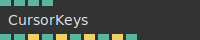
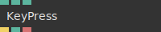
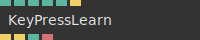
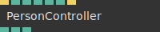

# Ops.Devices.Keyboard

*Part of the [All Operators Reference](13-_AllOps.md)*

---

## Ops.Devices.Keyboard

### CursorKeys

**Full Name:** `Ops.Devices.Keyboard.CursorKeys`
**Description:** get the state of your keyboards arrow keys

**> Input Ports:**
- **Canvas Only** (Number: Boolean): *See documentation*
- **Cursor Keys** (Number: Boolean): *See documentation*
- **WASD** (Number: Boolean): *See documentation*
- **Active** (Number: Boolean): *See documentation*

**< Output Ports:**
- **Degree** (Number): *See documentation*
- **Up** (booleanNumber): *See documentation*
- **Up Pressed** (Trigger): *See documentation*
- **Down** (booleanNumber): *See documentation*
- **Down Pressed** (Trigger): *See documentation*
- **Left** (booleanNumber): *See documentation*
- **Left Pressed** (Trigger): *See documentation*
- **Right** (booleanNumber): *See documentation*
- **Right Pressed** (Trigger): *See documentation*
- **Any Button Pressed** (Number): *See documentation*

**Example Patch:** [Open in Editor](https://cables.gl/edit/m5V6VB)
**Patches Using This Op:** *Search [cables.gl patches](https://cables.gl/patches) for "CursorKeys"*
**Docs:** [https://cables.gl/op/Ops.Devices.Keyboard.CursorKeys](https://cables.gl/op/Ops.Devices.Keyboard.CursorKeys)

---

### KeyPress_v2

**Full Name:** `Ops.Devices.Keyboard.KeyPress_v2`
**Description:** Triggers when a key is pressed

**> Input Ports:**
- **Area Index** (Number: Integer): *See documentation*
- **Prevent Default** (Number: Boolean): *See documentation*
- **Enabled** (Number: Boolean): *See documentation*

**< Output Ports:**
- **On Press** (Trigger): *See documentation*
- **Key Code** (Number): *See documentation*
- **Key** (String): *See documentation*

**Example Patch:** [Open in Editor](https://cables.gl/edit/lmGgPZ)
**Patches Using This Op:** *Search [cables.gl patches](https://cables.gl/patches) for "KeyPress_v2"*
**Docs:** [https://cables.gl/op/Ops.Devices.Keyboard.KeyPress_v2](https://cables.gl/op/Ops.Devices.Keyboard.KeyPress_v2)

---

### KeyPressLearn

**Full Name:** `Ops.Devices.Keyboard.KeyPressLearn`
**Description:** Triggers when certain key is pressed or released

**> Input Ports:**
- **Key Code** (Number: Integer): *See documentation*
- **Canvas Only** (Number: Boolean): *See documentation*
- **Mod Key Index** (Number: Integer): *See documentation*
- **Enabled** (Number: Boolean): *See documentation*
- **Prevent Default** (Number: Boolean): *See documentation*
- **Learn** (Trigger): *See documentation*

**< Output Ports:**
- **On Press** (Trigger): *See documentation*
- **On Release** (Trigger): *See documentation*
- **Pressed** (booleanNumber): *See documentation*
- **Key** (String): *See documentation*

**Example Patch:** [Open in Editor](https://cables.gl/edit/ZRY-x3)
**Patches Using This Op:** *Search [cables.gl patches](https://cables.gl/patches) for "KeyPressLearn"*
**Docs:** [https://cables.gl/op/Ops.Devices.Keyboard.KeyPressLearn](https://cables.gl/op/Ops.Devices.Keyboard.KeyPressLearn)

---

### PersonController

**Full Name:** `Ops.Devices.Keyboard.PersonController`
**Description:** simple controller example op for game characters

**> Input Ports:**
- **Exe** (Trigger): *See documentation*
- **Speed** (Number): *See documentation*
- **North** (Number: Boolean): *See documentation*
- **East** (Number: Boolean): *See documentation*
- **South** (Number: Boolean): *See documentation*
- **West** (Number: Boolean): *See documentation*
- **Reset** (Trigger): *See documentation*

**< Output Ports:**
- **X** (Number): *See documentation*
- **Y** (Number): *See documentation*
- **Dir** (Number): *See documentation*

**Example Patch:** [Open in Editor](https://cables.gl/edit/m5V6VB)
**Patches Using This Op:** *Search [cables.gl patches](https://cables.gl/patches) for "PersonController"*
**Docs:** [https://cables.gl/op/Ops.Devices.Keyboard.PersonController](https://cables.gl/op/Ops.Devices.Keyboard.PersonController)

---

### QWERTYtoMidi

**Full Name:** `Ops.Devices.Keyboard.QWERTYtoMidi`
**Description:** Emulates a MIDI keyboard using your regular keyboard

**> Input Ports:**
- **Canvas Only** (Number: Boolean): *See documentation*

**< Output Ports:**
- **Note Number** (Number): *See documentation*
- **Velocity** (Number): *See documentation*
- **Channel** (Number): *See documentation*
- **Command** (Number): *See documentation*

**Example Patch:** [Open in Editor](https://cables.gl/edit/PfZk-4)
**Patches Using This Op:** *Search [cables.gl patches](https://cables.gl/patches) for "QWERTYtoMidi"*
**Docs:** [https://cables.gl/op/Ops.Devices.Keyboard.QWERTYtoMidi](https://cables.gl/op/Ops.Devices.Keyboard.QWERTYtoMidi)

---

