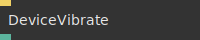
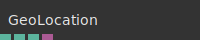
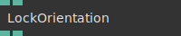
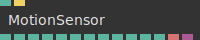
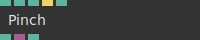
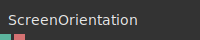
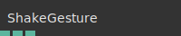

# Ops.Devices.Mobile


```{=latex}
\OpsSubsubNoSubsectionNumbering\setcounter{subsubsection}{0}
```
### DeviceVibrate


**Full Name:** `Ops.Devices.Mobile.DeviceVibrate`

vibrating a mobile device.

**`\inputsymbol`{=latex} Inputs**

- **Vibrate** (Trigger)

**`\outputsymbol`{=latex} Output**

- **Supported** (Number)

**Example Patch:** [cables.gl/edit/H4NGFU](https://cables.gl/edit/H4NGFU)

**Doc:** [cables.gl/op/Ops.Devices.Mobile.DeviceVibrate](https://cables.gl/op/Ops.Devices.Mobile.DeviceVibrate)

### GeoLocation


**Full Name:** `Ops.Devices.Mobile.GeoLocation`

tries to get the geo coordinates from the mobile device/browser.

**`\outputsymbol`{=latex} Output**

- **Browser Support** (booleanNumber)
- **Latitude** (Number)
- **Longitude** (Number)
- **Data** (Object)

**Example Patch:** [cables.gl/edit/kIZ3Ms](https://cables.gl/edit/kIZ3Ms)

**Doc:** [cables.gl/op/Ops.Devices.Mobile.GeoLocation](https://cables.gl/op/Ops.Devices.Mobile.GeoLocation)

### LockOrientation


**Full Name:** `Ops.Devices.Mobile.LockOrientation`

locks orientation to landscape or portrait mode.

**`\inputsymbol`{=latex} Inputs**

- **Portrait** (Number: Boolean)
- **Landscape** (Number: Boolean)

**`\outputsymbol`{=latex} Output**

- **Supported** (Number)
- **Locked** (Number)

**Example Patch:** [cables.gl/op/Ops.Devices.Mobile.LockOrientation#example](https://cables.gl/op/Ops.Devices.Mobile.LockOrientation#example)

**Doc:** [cables.gl/op/Ops.Devices.Mobile.LockOrientation](https://cables.gl/op/Ops.Devices.Mobile.LockOrientation)

### MotionSensor_v2


**Full Name:** `Ops.Devices.Mobile.MotionSensor_v2`

get values from the device motion sensor mobile.

**`\inputsymbol`{=latex} Inputs**

- **Mul Orientation** (Number)
- **Request Permissions** (Trigger)

**`\outputsymbol`{=latex} Output**

- **Orientation Alpha** (Number)
- **Orientation Beta** (Number)
- **Orientation Gamma** (Number)
- **Acceleration X** (Number)
- **Acceleration Y** (Number)
- **Acceleration Z** (Number)
- **Acceleration X No Gravity** (Number)
- **Acceleration Y No Gravity** (Number)
- **Acceleration Z No Gravity** (Number)
- **Rotation Rate Alpha** (Number)
- **Rotation Rate Beta** (Number)
- **Rotation Rate Gamma** (Number)
- **Permissions** (String)
- **Object** (Object)

**Example Patch:** [cables.gl/edit/dZ8wQ0](https://cables.gl/edit/dZ8wQ0)

**Doc:** [cables.gl/op/Ops.Devices.Mobile.MotionSensor_v2](https://cables.gl/op/Ops.Devices.Mobile.MotionSensor_v2)

### Pinch


**Full Name:** `Ops.Devices.Mobile.Pinch`

detect two finger pinch gestures on touchscreens.

**`\inputsymbol`{=latex} Inputs**

- **Enabled** (Number: Boolean)
- **Min Scale** (Number)
- **Max Scale** (Number)
- **Reset Scale** (Trigger)
- **Limit** (Number: Boolean)

**`\outputsymbol`{=latex} Output**

- **Scale** (Number)
- **Event Details** (Object)
- **Delta** (Number)

**Example Patch:** [cables.gl/op/Ops.Devices.Mobile.Pinch#example](https://cables.gl/op/Ops.Devices.Mobile.Pinch#example)

**Doc:** [cables.gl/op/Ops.Devices.Mobile.Pinch](https://cables.gl/op/Ops.Devices.Mobile.Pinch)

### ScreenOrientation_v2


**Full Name:** `Ops.Devices.Mobile.ScreenOrientation_v2`

get orientation of the physical screen.

**`\outputsymbol`{=latex} Output**

- **Angle** (Number)
- **Type** (String)

**Example Patch:** [cables.gl/edit/Zc398i](https://cables.gl/edit/Zc398i)

**Doc:** [cables.gl/op/Ops.Devices.Mobile.ScreenOrientation_v2](https://cables.gl/op/Ops.Devices.Mobile.ScreenOrientation_v2)

### ShakeGesture


**Full Name:** `Ops.Devices.Mobile.ShakeGesture`

Reads the accelerometer data from a mobile device.

**`\outputsymbol`{=latex} Output**

- **Acceleration X** (Number)
- **Acceleration Y** (Number)
- **Acceleration Z** (Number)

**Example Patch:** [cables.gl/op/Ops.Devices.Mobile.ShakeGesture#example](https://cables.gl/op/Ops.Devices.Mobile.ShakeGesture#example)

**Doc:** [cables.gl/op/Ops.Devices.Mobile.ShakeGesture](https://cables.gl/op/Ops.Devices.Mobile.ShakeGesture)


