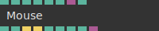
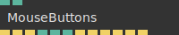
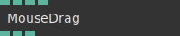
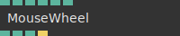
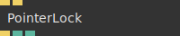

# Ops.Devices.Mouse

*Part of the [All Operators Reference](13-_AllOps.md)*

---

## Ops.Devices.Mouse

### Mouse_v4

**Full Name:** `Ops.Devices.Mouse.Mouse_v4`
**Description:** *Visit [documentation](https://cables.gl/op/Ops.Devices.Mouse.Mouse_v4) for details*

**> Input Ports:**
- **Area Index** (Number: Integer)
- **Flip Y** (Number: Boolean)
- **Right Click Prevent Default** (Number: Boolean)
- **Passive Events** (Number: Boolean)
- **Element** (Object)
- **Active** (Number: Boolean)

**< Output Ports:**
- **X** (Number)
- **Y** (Number)
- **Click** (Trigger)
- **Click Right** (Trigger)
- **Button Is Down** (booleanNumber)
- **Mouse Is Hovering** (booleanNumber)
- **Movement X** (Number)
- **Movement Y** (Number)
- **Event** (Object)

**Example Patch:** [Open in Editor](https://cables.gl/op/Ops.Devices.Mouse.Mouse_v4#example)
**Patches Using This Op:** *Search [cables.gl patches](https://cables.gl/patches) for "Mouse_v4"*
**Docs:** [https://cables.gl/op/Ops.Devices.Mouse.Mouse_v4](https://cables.gl/op/Ops.Devices.Mouse.Mouse_v4)

---

### MouseButtons

**Full Name:** `Ops.Devices.Mouse.MouseButtons`
**Description:** *Visit [documentation](https://cables.gl/op/Ops.Devices.Mouse.MouseButtons) for details*

**> Input Ports:**
- **Area Index** (Number: Integer)
- **Active** (Number: Boolean)

**< Output Ports:**
- **Click Left** (Trigger)
- **Click Right** (Trigger)
- **Double Click** (Trigger)
- **Button Pressed Left** (Number)
- **Button Pressed Middle** (Number)
- **Button Pressed Right** (Number)
- **Mouse Down Left** (Trigger)
- **Mouse Down Middle** (Trigger)
- **Mouse Down Right** (Trigger)
- **Mouse Up Left** (Trigger)
- **Mouse Up Middle** (Trigger)
- **Mouse Up Right** (Trigger)

**Example Patch:** [Open in Editor](https://cables.gl/op/Ops.Devices.Mouse.MouseButtons#example)
**Patches Using This Op:** *Search [cables.gl patches](https://cables.gl/patches) for "MouseButtons"*
**Docs:** [https://cables.gl/op/Ops.Devices.Mouse.MouseButtons](https://cables.gl/op/Ops.Devices.Mouse.MouseButtons)

---

### MouseDrag

**Full Name:** `Ops.Devices.Mouse.MouseDrag`
**Description:** *Visit [documentation](https://cables.gl/op/Ops.Devices.Mouse.MouseDrag) for details*

**> Input Ports:**
- **Active** (Number: Boolean)
- **Speed** (Number)
- **Input Type Index** (Number: Integer)
- **Area Index** (Number: Integer)

**< Output Ports:**
- **Delta X** (Number)
- **Delta Y** (Number)
- **Is Dragging** (Number)

**Example Patch:** [Open in Editor](https://cables.gl/op/Ops.Devices.Mouse.MouseDrag#example)
**Patches Using This Op:** *Search [cables.gl patches](https://cables.gl/patches) for "MouseDrag"*
**Docs:** [https://cables.gl/op/Ops.Devices.Mouse.MouseDrag](https://cables.gl/op/Ops.Devices.Mouse.MouseDrag)

---

### MouseWheel_v2

**Full Name:** `Ops.Devices.Mouse.MouseWheel_v2`
**Description:** *Visit [documentation](https://cables.gl/op/Ops.Devices.Mouse.MouseWheel_v2) for details*

**> Input Ports:**
- **Speed** (Number)
- **Prevent Scroll** (Number: Boolean)
- **Flip Direction** (Number: Boolean)
- **Simple Delta** (Number: Boolean)
- **Active** (Number: Boolean)

**< Output Ports:**
- **Delta** (Number)
- **Delta X** (Number)
- **Browser Event Delta** (Number)
- **Wheel Action** (Trigger)

**Example Patch:** [Open in Editor](https://cables.gl/op/Ops.Devices.Mouse.MouseWheel_v2#example)
**Patches Using This Op:** *Search [cables.gl patches](https://cables.gl/patches) for "MouseWheel_v2"*
**Docs:** [https://cables.gl/op/Ops.Devices.Mouse.MouseWheel_v2](https://cables.gl/op/Ops.Devices.Mouse.MouseWheel_v2)

---

### PointerLock

**Full Name:** `Ops.Devices.Mouse.PointerLock`
**Description:** *Visit [documentation](https://cables.gl/op/Ops.Devices.Mouse.PointerLock) for details*

**> Input Ports:**
- **Render** (Trigger)
- **Start** (Trigger)

**< Output Ports:**
- **Next** (Trigger)
- **Supported** (booleanNumber)
- **Is Locked** (booleanNumber)

**Example Patch:** [Open in Editor](https://cables.gl/op/Ops.Devices.Mouse.PointerLock#example)
**Patches Using This Op:** *Search [cables.gl patches](https://cables.gl/patches) for "PointerLock"*
**Docs:** [https://cables.gl/op/Ops.Devices.Mouse.PointerLock](https://cables.gl/op/Ops.Devices.Mouse.PointerLock)

---

