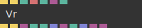
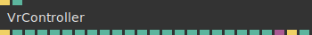

# Ops.Devices.WebXr.Vr

*Part of the [All Operators Reference](13-_AllOps.md)*

---

## Ops.Devices.WebXr.Vr

### Vr

**Full Name:** `Ops.Devices.WebXr.Vr.Vr`
**Description:** rendering on webxr virtual reality immersive devices

**> Input Ports:**
- **Mainloop** (Trigger): *See documentation*
- **Stop** (Trigger): *See documentation*
- **Show Button** (Number: Boolean): *See documentation*
- **Button Style** (String): *See documentation*
- **Render To Texture** (Number: Boolean): *See documentation*
- **Shader** (Object:Shader): *See documentation*

**< Output Ports:**
- **Next** (Trigger): *See documentation*
- **Render After Eyes** (Trigger): *See documentation*
- **Viewer Pose** (Object): *See documentation*
- **Eye Index** (Number): *See documentation*
- **VR Support** (booleanNumber): *See documentation*
- **Matrix** (Array): *See documentation*
- **DOM Overlay Ele** (Object): *See documentation*
- **In Session** (booleanNumber): *See documentation*
- **Ms Per Eye** (Array): *See documentation*
- **Texture** (Object): *See documentation*
- **Texture Depth** (Object): *See documentation*

**Example Patch:** [Open in Editor](https://cables.gl/edit/IzKYx5)
**Patches Using This Op:** *Search [cables.gl patches](https://cables.gl/patches) for "Vr"*
**Docs:** [https://cables.gl/op/Ops.Devices.WebXr.Vr.Vr](https://cables.gl/op/Ops.Devices.WebXr.Vr.Vr)

---

### VrController

**Full Name:** `Ops.Devices.WebXr.Vr.VrController`
**Description:** tracking of vr hand controller

**> Input Ports:**
- **Update** (Trigger): *See documentation*
- **Handedness Index** (Number: Integer): *See documentation*

**< Output Ports:**
- **Next** (Trigger): *See documentation*
- **Axis 1** (Number): *See documentation*
- **Axis 2** (Number): *See documentation*
- **Axis 3** (Number): *See documentation*
- **Axis 4** (Number): *See documentation*
- **Button 1 Pressed** (Number): *See documentation*
- **Button 2 Pressed** (Number): *See documentation*
- **Button 3 Pressed** (Number): *See documentation*
- **Button 4 Pressed** (Number): *See documentation*
- **Button 5 Pressed** (Number): *See documentation*
- **Button 6 Pressed** (Number): *See documentation*
- **Button 7 Pressed** (Number): *See documentation*
- **Button 1 Touched** (Number): *See documentation*
- **Button 2 Touched** (Number): *See documentation*
- **Button 3 Touched** (Number): *See documentation*
- **Button 4 Touched** (Number): *See documentation*
- **Button 5 Touched** (Number): *See documentation*
- **Button 6 Touched** (Number): *See documentation*
- **Button 7 Touched** (Number): *See documentation*
- **Position X** (Number): *See documentation*
- **Position Y** (Number): *See documentation*
- **Position Z** (Number): *See documentation*
- **Gamepad Values** (Object): *See documentation*
- **Transformed Position** (Trigger): *See documentation*
- **Found** (Number): *See documentation*

**Example Patch:** [Open in Editor](https://cables.gl/edit/IzKYx5)
**Patches Using This Op:** *Search [cables.gl patches](https://cables.gl/patches) for "VrController"*
**Docs:** [https://cables.gl/op/Ops.Devices.WebXr.Vr.VrController](https://cables.gl/op/Ops.Devices.WebXr.Vr.VrController)

---

