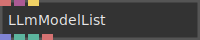
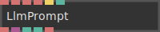

# Ops.Extension.Ai


```{=latex}
\OpsSubsubNoSubsectionNumbering\setcounter{subsubsection}{0}
```
### LLmModelList


**Full Name:** `Ops.Extension.Ai.LLmModelList`

*Visit [documentation](https://cables.gl/op/Ops.Extension.Ai.LLmModelList) for details*.

**`\inputsymbol`{=latex} Inputs**

- **String1** (String)
- **Headers** (Object)
- **Reload** (Trigger)

**`\outputsymbol`{=latex} Output**

- **Z2gtag4y7** (Array)
- **Jcju8npa2** (booleanNumber)
- **Ozg9pnd1z** (String)

**Example Patch:** [cables.gl/op/Ops.Extension.Ai.LLmModelList#example](https://cables.gl/op/Ops.Extension.Ai.LLmModelList#example)

**Doc:** [cables.gl/op/Ops.Extension.Ai.LLmModelList](https://cables.gl/op/Ops.Extension.Ai.LLmModelList)

### LlmPrompt


**Full Name:** `Ops.Extension.Ai.LlmPrompt`

*Visit [documentation](https://cables.gl/op/Ops.Extension.Ai.LlmPrompt) for details*.

**`\inputsymbol`{=latex} Inputs**

- **Prompt** (String)
- **Value** (String)
- **API URL** (String)
- **Authentication** (String)
- **Run** (Trigger)
- **Auto Request** (Number: Boolean)

**`\outputsymbol`{=latex} Output**

- **I4feefw9n** (Object)
- **Klu6r35ga** (booleanNumber)
- **Xs18z73z0** (booleanNumber)
- **Aosval1gx** (String)

**Example Patch:** [cables.gl/op/Ops.Extension.Ai.LlmPrompt#example](https://cables.gl/op/Ops.Extension.Ai.LlmPrompt#example)

**Doc:** [cables.gl/op/Ops.Extension.Ai.LlmPrompt](https://cables.gl/op/Ops.Extension.Ai.LlmPrompt)


