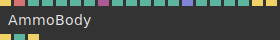
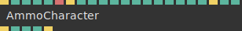
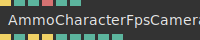
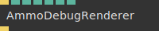
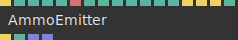
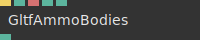

# Ops.Extension.AmmoPhysics

*Part of the [All Operators Reference](13-_AllOps.md)*

---

## Ops.Extension.AmmoPhysics

### AmmoBody

**Full Name:** `Ops.Extension.AmmoPhysics.AmmoBody`
**Description:** *Visit [documentation](https://cables.gl/op/Ops.Extension.AmmoPhysics.AmmoBody) for details*

**> Input Ports:**
- **Update** (Trigger)
- **Name** (String)
- **Mass** (Number)
- **Friction** (Number)
- **Rolling Friction** (Number)
- **Restitution** (Number)
- **Shape Index** (Number: Integer)
- **Geometry** (Object:Geometry)
- **Simplify Max Triangles** (Number: Integer)
- **Radius** (Number)
- **Size X** (Number)
- **Size Y** (Number)
- **Size Z** (Number)
- **Positions** (Array)
- **Append Index To Name** (Number: Boolean)
- **Never Deactivate** (Number: Boolean)
- **Ghost Object** (Number: Boolean)
- **Active** (Number: Boolean)
- **Reset** (Trigger)
- **Activate** (Trigger)

**< Output Ports:**
- **Next** (Trigger)
- **Ray Hit** (booleanNumber)
- **Transformed** (Trigger)

**Example Patch:** [Open in Editor](https://cables.gl/op/Ops.Extension.AmmoPhysics.AmmoBody#example)
**Patches Using This Op:** *Search [cables.gl patches](https://cables.gl/patches) for "AmmoBody"*
**Docs:** [https://cables.gl/op/Ops.Extension.AmmoPhysics.AmmoBody](https://cables.gl/op/Ops.Extension.AmmoPhysics.AmmoBody)

---

### AmmoBodyCollision

**Full Name:** `Ops.Extension.AmmoPhysics.AmmoBodyCollision`
**Description:** *Visit [documentation](https://cables.gl/op/Ops.Extension.AmmoPhysics.AmmoBodyCollision) for details*

**> Input Ports:**
- **Update** (Trigger)
- **Name 1** (String)
- **Match Name 1 Index** (Number: Integer)
- **Name 2** (String)
- **name of physics object** (optional)
- **Match Name 2 Index** (Number: Integer)
- **match name 2** (if set)

**< Output Ports:**
- **Next** (Trigger)
- **Colliding** (Number)
- **collision detected** (Boolean)
- **Num Collisions** (Number)
- **Collisions** (Array)

**Example Patch:** [Open in Editor](https://cables.gl/op/Ops.Extension.AmmoPhysics.AmmoBodyCollision#example)
**Patches Using This Op:** *Search [cables.gl patches](https://cables.gl/patches) for "AmmoBodyCollision"*
**Docs:** [https://cables.gl/op/Ops.Extension.AmmoPhysics.AmmoBodyCollision](https://cables.gl/op/Ops.Extension.AmmoPhysics.AmmoBodyCollision)

---

### AmmoCharacter

**Full Name:** `Ops.Extension.AmmoPhysics.AmmoCharacter`
**Description:** *Visit [documentation](https://cables.gl/op/Ops.Extension.AmmoPhysics.AmmoCharacter) for details*

**> Input Ports:**
- **Update** (Trigger)
- **Radius** (Number)
- **View Index** (Number: Integer)
- **Height** (Number)
- **Mass** (Number)
- **Name** (String)
- **Activate** (Trigger)
- **Move X-** (Number: Boolean)
- **Move Y-** (Number: Boolean)
- **Move Z-** (Number: Boolean)
- **Dir X** (Number)
- **X axis rotation value** (from AmmoCharacterFpsCamera for example)
- **Dir Y** (Number)
- **Y axis ratation value** (from AmmoCharacterFpsCamera for example)
- **Dir Z** (Number)
- **Z axis rotation value** (from AmmoCharacterFpsCamera for example)
- **Set Pos X** (Number)
- **Set Pos Y** (Number)
- **Set Pos Z** (Number)
- **Reset** (Trigger)
- **Speed** (Number)
- **Add Velocity Y** (Number)

**< Output Ports:**
- **Next** (Trigger)
- **Position X** (Number)
- **Position Y** (Number)
- **Position Z** (Number)
- **Transformed** (Trigger)

**Example Patch:** [Open in Editor](https://cables.gl/op/Ops.Extension.AmmoPhysics.AmmoCharacter#example)
**Patches Using This Op:** *Search [cables.gl patches](https://cables.gl/patches) for "AmmoCharacter"*
**Docs:** [https://cables.gl/op/Ops.Extension.AmmoPhysics.AmmoCharacter](https://cables.gl/op/Ops.Extension.AmmoPhysics.AmmoCharacter)

---

### AmmoCharacterFpsCamera

**Full Name:** `Ops.Extension.AmmoPhysics.AmmoCharacterFpsCamera`
**Description:** *Visit [documentation](https://cables.gl/op/Ops.Extension.AmmoPhysics.AmmoCharacterFpsCamera) for details*

**> Input Ports:**
- **Render** (Trigger)
- **Enable Pointer Lock** (Number: Boolean)
- **Height** (Number)
- **Character Name** (String)
- **Mouse Speed** (Number)
- **Active** (Number: Boolean)

**< Output Ports:**
- **Trigger** (Trigger)
- **IsLocked** (Number)
- **has the mouse cursor been locked** (Boolean)
- **Mouse Left** (Trigger)
- **Mouse Right** (Trigger)
- **Dir X** (Number)
- **Dir Y** (Number)
- **Dir Z** (Number)
- **Rot X** (Number)
- **Rot Y** (Number)

**Example Patch:** [Open in Editor](https://cables.gl/op/Ops.Extension.AmmoPhysics.AmmoCharacterFpsCamera#example)
**Patches Using This Op:** *Search [cables.gl patches](https://cables.gl/patches) for "AmmoCharacterFpsCamera"*
**Docs:** [https://cables.gl/op/Ops.Extension.AmmoPhysics.AmmoCharacterFpsCamera](https://cables.gl/op/Ops.Extension.AmmoPhysics.AmmoCharacterFpsCamera)

---

### AmmoDebugRenderer

**Full Name:** `Ops.Extension.AmmoPhysics.AmmoDebugRenderer`
**Description:** *Visit [documentation](https://cables.gl/op/Ops.Extension.AmmoPhysics.AmmoDebugRenderer) for details*

**> Input Ports:**
- **Render** (Trigger)
- **Draw Wireframe** (Number: Boolean)
- **Draw AABB** (Number: Boolean)
- **Draw Contact Points** (Number: Boolean)
- **Draw Constraints** (Number: Boolean)
- **Depth** (Number: Boolean)
- **Active** (Number: Boolean)

**< Output Ports:**
- **Next** (Trigger)

**Example Patch:** [Open in Editor](https://cables.gl/op/Ops.Extension.AmmoPhysics.AmmoDebugRenderer#example)
**Patches Using This Op:** *Search [cables.gl patches](https://cables.gl/patches) for "AmmoDebugRenderer"*
**Docs:** [https://cables.gl/op/Ops.Extension.AmmoPhysics.AmmoDebugRenderer](https://cables.gl/op/Ops.Extension.AmmoPhysics.AmmoDebugRenderer)

---

### AmmoEmitter

**Full Name:** `Ops.Extension.AmmoPhysics.AmmoEmitter`
**Description:** *Visit [documentation](https://cables.gl/op/Ops.Extension.AmmoPhysics.AmmoEmitter) for details*

**> Input Ports:**
- **Exec** (Trigger)
- **Limit Bodies** (Number: Integer)
- **Radius** (Number)
- **Mass** (Number)
- **Add Index To Name** (Number: Boolean)
- **Name** (String)
- **Friction** (Number)
- **Rolling Friction** (Number)
- **Restitution** (Number)
- **Dir X** (Number)
- **Dir Y** (Number)
- **Dir Z** (Number)
- **Speed** (Number)
- **Spawn One** (Trigger)
- **Remove All** (Trigger)
- **Activate All** (Trigger)

**< Output Ports:**
- **Next** (Trigger)
- **Total Bodies** (Number)
- **Positions** (Array)
- **Rotations Quats** (Array)

**Example Patch:** [Open in Editor](https://cables.gl/op/Ops.Extension.AmmoPhysics.AmmoEmitter#example)
**Patches Using This Op:** *Search [cables.gl patches](https://cables.gl/patches) for "AmmoEmitter"*
**Docs:** [https://cables.gl/op/Ops.Extension.AmmoPhysics.AmmoEmitter](https://cables.gl/op/Ops.Extension.AmmoPhysics.AmmoEmitter)

---

### AmmoRaycast

**Full Name:** `Ops.Extension.AmmoPhysics.AmmoRaycast`

**Description:** *Visit [documentation](https://cables.gl/op/Ops.Extension.AmmoPhysics.AmmoRaycast) for details*

**> Input Ports:**
- **Update** (Trigger)
- **Screen X** (Number)
- **Normalize screencoordinates on X Axis** (0-1)
- **Screen Y** (Number)
- **Normalize screencoordinates on Y Axis** (0-1)
- **Ray Points** (Array)
- **Active** (Number: Boolean)
- **Change Cursor** (Number: Boolean)

**< Output Ports:**
- **Next** (Trigger)
- **Has Hit** (booleanNumber)
- **Hit Body Name** (String)
- **Hit X** (Number)
- **Hit Y** (Number)
- **Hit Z** (Number)

**Example Patch:** [Open in Editor](https://cables.gl/op/Ops.Extension.AmmoPhysics.AmmoRaycast#example)

**Patches Using This Op:** *Search [cables.gl patches](https://cables.gl/patches) for "AmmoRaycast"*

**Docs:** [https://cables.gl/op/Ops.Extension.AmmoPhysics.AmmoRaycast](https://cables.gl/op/Ops.Extension.AmmoPhysics.AmmoRaycast)

---

### AmmoWorld

**Full Name:** `Ops.Extension.AmmoPhysics.AmmoWorld`
**Description:** *Visit [documentation](https://cables.gl/op/Ops.Extension.AmmoPhysics.AmmoWorld) for details*

**> Input Ports:**
- **Update** (Trigger)
- **Simulate** (Number: Boolean)
- **Auto Remove Inactive** (Number: Boolean)
- **Gravity X** (Number)
- **Gravity Y** (Number)
- **Gravity Z** (Number)
- **Activate All** (Trigger)
- **Reset** (Trigger)

**< Output Ports:**
- **Next** (Trigger)
- **Total Bodies** (Number)
- **Debug Points** (Array)
- **Bodies Meta** (Array)
- **Collisions** (Array)

**Example Patch:** [Open in Editor](https://cables.gl/op/Ops.Extension.AmmoPhysics.AmmoWorld#example)
**Patches Using This Op:** *Search [cables.gl patches](https://cables.gl/patches) for "AmmoWorld"*
**Docs:** [https://cables.gl/op/Ops.Extension.AmmoPhysics.AmmoWorld](https://cables.gl/op/Ops.Extension.AmmoPhysics.AmmoWorld)

---

### GltfAmmoBodies

**Full Name:** `Ops.Extension.AmmoPhysics.GltfAmmoBodies`
**Description:** *Visit [documentation](https://cables.gl/op/Ops.Extension.AmmoPhysics.GltfAmmoBodies) for details*

**> Input Ports:**
- **Exec** (Trigger)
- **Shape Index** (Number: Integer)
- **Filter Meshes** (String)
- **Mass Kg** (Number)
- **Active** (Number: Boolean)

**< Output Ports:**
- **Meshes** (Number)

**Example Patch:** [Open in Editor](https://cables.gl/op/Ops.Extension.AmmoPhysics.GltfAmmoBodies#example)
**Patches Using This Op:** *Search [cables.gl patches](https://cables.gl/patches) for "GltfAmmoBodies"*
**Docs:** [https://cables.gl/op/Ops.Extension.AmmoPhysics.GltfAmmoBodies](https://cables.gl/op/Ops.Extension.AmmoPhysics.GltfAmmoBodies)

---

