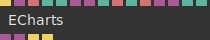
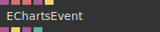

# Ops.Extension.ECharts


```{=latex}
\OpsSubsubNoSubsectionNumbering\setcounter{subsubsection}{0}
```
### ECharts


**Full Name:** `Ops.Extension.ECharts.ECharts`

wrapper for echarts-library.

**`\inputsymbol`{=latex} Inputs**

- **Create** (Trigger)
- **Parent DOM Element** (Object)
- **Id** (String)
- **Width** (Number: Integer)
- **Height** (Number: Integer)
- **Chart Object** (Object)
- **Merge Options** (Object)
- **Renderer Index** (Number: Integer)
- **Renderer** (String)
- **Theme Index** (Number: Integer)
- **Theme** (String)
- **Custom Theme Obj** (Object)
- **Init Extra Options** (Object)
- **Style** (Number: String)
- **Visible** (Number: Boolean)

**`\outputsymbol`{=latex} Output**

- **DOM Element** (Object)
- **ECharts Instance** (Object)
- **Chart Updated** (Trigger)
- **Theme Changed** (Trigger)

**Example:** [cables.gl/edit/iY6lbI](https://cables.gl/edit/iY6lbI)

**Doc:** [cables.gl/op/Ops.Extension.ECharts.ECharts](https://cables.gl/op/Ops.Extension.ECharts.ECharts)

### EChartsEvent


**Full Name:** `Ops.Extension.ECharts.EChartsEvent`

capture echart-library-events.

**`\inputsymbol`{=latex} Inputs**

- **ECharts Instance** (Object)
- **Event Name** (String)
- **Query String** (String)
- **Query Object** (Object)
- **Refresh Event Binding** (Trigger)

**`\outputsymbol`{=latex} Output**

- **Out Chart** (Object)
- **Trigger** (Trigger)
- **Event Params** (Object)

**Example:** [cables.gl/edit/iY6lbI](https://cables.gl/edit/iY6lbI)

**Doc:** [cables.gl/op/Ops.Extension.ECharts.EChartsEvent](https://cables.gl/op/Ops.Extension.ECharts.EChartsEvent)


