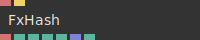

# Ops.Extension.FxHash


```{=latex}
\OpsSubsubNoSubsectionNumbering\setcounter{subsubsection}{0}
```
### FxHash


**Full Name:** `Ops.Extension.FxHash.FxHash`

FxHash simulator / generator of seeded random numbers.

**`\inputsymbol`{=latex} Inputs**

- **Hash** (String)
- **Randomize Hash** (Trigger)

**`\outputsymbol`{=latex} Output**

- **Fxhash** (String)
- **Fxrand 1** (Number)
- **Fxrand 2** (Number)
- **Fxrand 3** (Number)
- **Fxrand 4** (Number)
- **Random Numbers** (Array)
- **Fxhash Environment** (booleanNumber)

**Example:** [cables.gl/edit/dnDl82](https://cables.gl/edit/dnDl82)

**Doc:** [cables.gl/op/Ops.Extension.FxHash.FxHash](https://cables.gl/op/Ops.Extension.FxHash.FxHash)


