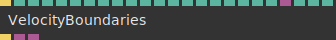

# Ops.Extension.GlParticles


```{=latex}
\OpsSubsubNoSubsectionNumbering\setcounter{subsubsection}{0}
```
### VelocityBoundaries


**Full Name:** `Ops.Extension.GlParticles.VelocityBoundaries`

*Visit [documentation](https://cables.gl/op/Ops.Extension.GlParticles.VelocityBoundaries) for details*.

**`\inputsymbol`{=latex} Inputs**

- **Render** (Trigger)
- **Area Index** (Number: Integer)
- **Method Index** (Number: Integer)
- **Invert Area** (Number: Boolean)
- **Strength** (Number)
- **Size** (Number)
- **Falloff** (Number)
- **Boncyness** (Number)
- **Collision Fade** (Number)
- **Dir Randomness** (Number)
- **InForceOutwards** (Number)
- **X** (Number)
- **Y** (Number)
- **Z** (Number)
- **Velocity Dir X** (Number)
- **Velocity Dir Y** (Number)
- **Velocity Dir Z** (Number)
- **Size X** (Number)
- **Size Y** (Number)
- **Size Z** (Number)
- **Multiply** (Object:Texture)
- **Age Start** (Number)
- **Age End** (Number)
- **Age Fade** (Number)

**`\outputsymbol`{=latex} Output**

- **Trigger** (Trigger)
- **Velocity** (Object)
- **Collision** (Object)

**Example:** [cables.gl/op/Ops.Extension.GlParticles.VelocityBoundaries#example](https://cables.gl/op/Ops.Extension.GlParticles.VelocityBoundaries#example)

**Doc:** [cables.gl/op/Ops.Extension.GlParticles.VelocityBoundaries](https://cables.gl/op/Ops.Extension.GlParticles.VelocityBoundaries)


