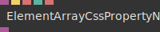
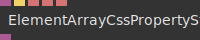

# Ops.Extension.HtmlElementArray

---

## Ops.Extension.HtmlElementArray

### DivElements

**Full Name:** `Ops.Extension.HtmlElementArray.DivElements`

**Description:** create an array of div elements

**`\inputsymbol`{=latex} Inputs**

- **Class** (String)
- **Parent** (Object:Element)
- **Num** (Number: Integer)
- **Active** (Number: Boolean)
- **Text** (Array)
- **Reset Hover** (Trigger)

**`\outputsymbol`{=latex} Output**

- **Elements** (Array)
- **Index Clicked** (Number)
- **Element Clicked** (Trigger)
- **Pointer Up** (Trigger)
- **Index Hovered** (Number)

**Example Patch:** [Open in Editor](https://cables.gl/edit/lYLMwk)

**Docs:** [https://cables.gl/op/Ops.Extension.HtmlElementArray.DivElements](https://cables.gl/op/Ops.Extension.HtmlElementArray.DivElements)

### ElementArrayCssPropertyNumber

**Full Name:** `Ops.Extension.HtmlElementArray.ElementArrayCssPropertyNumber`

**Description:** Set css style properties of a html element

**`\inputsymbol`{=latex} Inputs**

- **Element** (Object)
- **Update** (Trigger)
- **Property** (String)
- **Value** (Number)
- **Value Suffix** (String)

**`\outputsymbol`{=latex} Output**

- **HTML Element** (Object)

**Example Patch:** [Open in Editor](https://cables.gl/op/Ops.Extension.HtmlElementArray.ElementArrayCssPropertyNumber#example)

**Docs:** [https://cables.gl/op/Ops.Extension.HtmlElementArray.ElementArrayCssPropertyNumber](https://cables.gl/op/Ops.Extension.HtmlElementArray.ElementArrayCssPropertyNumber)

### ElementArrayCssPropertyString

**Full Name:** `Ops.Extension.HtmlElementArray.ElementArrayCssPropertyString`

**Description:** set css properties

**`\inputsymbol`{=latex} Inputs**

- **Element** (Object)
- **Update** (Trigger)
- **Property** (String)
- **Value** (String)
- **Value Suffix** (String)

**`\outputsymbol`{=latex} Output**

- **HTML Element** (Object)

**Example Patch:** [Open in Editor](https://cables.gl/op/Ops.Extension.HtmlElementArray.ElementArrayCssPropertyString#example)

**Docs:** [https://cables.gl/op/Ops.Extension.HtmlElementArray.ElementArrayCssPropertyString](https://cables.gl/op/Ops.Extension.HtmlElementArray.ElementArrayCssPropertyString)

