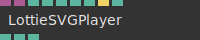
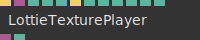

# Ops.Extension.Lottie

---

## Ops.Extension.Lottie

### LottieSVGPlayer

**Full Name:** `Ops.Extension.Lottie.LottieSVGPlayer`

**Description:** Play Bodymovin/Lottie animations as SVG in a HTML element

**`\inputsymbol`{=latex} Inputs**

- **HTML Element** (Object:Element)
- **JSON Data** (Object)
- **Render Frame** (Number)
- **Loop** (Number: Boolean)
- **Play** (Number: Boolean)
- **Play Backward** (Number: Boolean)
- **Rewind** (Trigger)
- **Active** (Number: Boolean)

**`\outputsymbol`{=latex} Output**

- **Completed** (booleanNumber)
- **Progress** (Number)
- **Total Frames** (Number)

**Example Patch:** [Open in Editor](https://cables.gl/edit/3ezRZH)

**Docs:** [https://cables.gl/op/Ops.Extension.Lottie.LottieSVGPlayer](https://cables.gl/op/Ops.Extension.Lottie.LottieSVGPlayer)

### LottieTexturePlayer_v2

**Full Name:** `Ops.Extension.Lottie.LottieTexturePlayer_v2`

**Description:** Play a Lottie animation in a texture

**`\inputsymbol`{=latex} Inputs**

- **Exe** (Trigger)
- **JSON Data** (Object)
- **Play Mode Index** (Number: Integer)
- **Frame** (Number)
- **Play** (Number: Boolean)
- **Rewind** (Trigger)
- **Speed** (Number)
- **Texture Width** (Number: Integer)
- **Texture Height** (Number: Integer)
- **Filter Index** (Number: Integer)
- **Wrap Index** (Number: Integer)
- **Scale Index** (Number: Integer)

**`\outputsymbol`{=latex} Output**

- **Texture** (Object)
- **Total Frames** (Number)

**Example Patch:** [Open in Editor](https://cables.gl/edit/zW0RFn)

**Docs:** [https://cables.gl/op/Ops.Extension.Lottie.LottieTexturePlayer_v2](https://cables.gl/op/Ops.Extension.Lottie.LottieTexturePlayer_v2)

