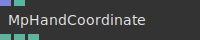
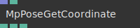

# Ops.Extension.Mediapipe

---

## Ops.Extension.Mediapipe

### FaceMesh

**Full Name:** `Ops.Extension.Mediapipe.FaceMesh`

**Description:** Generate an animated geometry from MpFaceTracking Point Coordinates

**`\inputsymbol`{=latex} Input Ports:**

- **Geom** (Object)
- **Points** (Array)

**`\outputsymbol`{=latex} Output Ports:**

- **Result Geom** (Object)

**Example Patch:** [Open in Editor](https://cables.gl/edit/by9Tq4)

**Docs:** [https://cables.gl/op/Ops.Extension.Mediapipe.FaceMesh](https://cables.gl/op/Ops.Extension.Mediapipe.FaceMesh)

### MpFaceTracking

**Full Name:** `Ops.Extension.Mediapipe.MpFaceTracking`

**Description:** Get face mesh from webcam/video using mediapipe library

**`\inputsymbol`{=latex} Input Ports:**

- **Element** (Object)
- **Refine LandMarks** (Number: Boolean)

**`\outputsymbol`{=latex} Output Ports:**

- **Points** (Array)
- **Found** (Number)
- **Result** (Object)

**Example Patch:** [Open in Editor](https://cables.gl/edit/wznlp4)

**Docs:** [https://cables.gl/op/Ops.Extension.Mediapipe.MpFaceTracking](https://cables.gl/op/Ops.Extension.Mediapipe.MpFaceTracking)

### MpHand

**Full Name:** `Ops.Extension.Mediapipe.MpHand`

**Description:** Get points and lines for left/right hand from mediapipe

**`\inputsymbol`{=latex} Input Ports:**

- **Hands Result** (Object)
- **Hand Index** (Number: Integer)
- **Min Score** (Number)

**`\outputsymbol`{=latex} Output Ports:**

- **Points** (Array)
- **Lines** (Array)
- **Data** (Object)
- **Found Hand** (Number)
- **Score** (Number)

**Example Patch:** [Open in Editor](https://cables.gl/edit/a5xfp4)

**Docs:** [https://cables.gl/op/Ops.Extension.Mediapipe.MpHand](https://cables.gl/op/Ops.Extension.Mediapipe.MpHand)

### MpHandCoordinate

**Full Name:** `Ops.Extension.Mediapipe.MpHandCoordinate`

**Description:** Get individual coordinates of fingers or wrist from an array of mediapipe data

**`\inputsymbol`{=latex} Input Ports:**

- **Hand Points** (Array)
- **Joint Index** (Number: Integer)

**`\outputsymbol`{=latex} Output Ports:**

- **X** (Number)
- **Y** (Number)
- **Z** (Number)

**Example Patch:** [Open in Editor](https://cables.gl/edit/a5xfp4)

**Docs:** [https://cables.gl/op/Ops.Extension.Mediapipe.MpHandCoordinate](https://cables.gl/op/Ops.Extension.Mediapipe.MpHandCoordinate)

### MpHandTracking

**Full Name:** `Ops.Extension.Mediapipe.MpHandTracking`

**Description:** Get hand data from mediapipe library, use with MpHand

**`\inputsymbol`{=latex} Input Ports:**

- **Element** (Object:Element)
- **Min Confidence Detect** (Number)
- **Min Confidence Tracking** (Number)

**`\outputsymbol`{=latex} Output Ports:**

- **Result** (Object)
- **Found Hands** (Number)

**Example Patch:** [Open in Editor](https://cables.gl/edit/a5xfp4)

**Docs:** [https://cables.gl/op/Ops.Extension.Mediapipe.MpHandTracking](https://cables.gl/op/Ops.Extension.Mediapipe.MpHandTracking)

### MpPoseGetCoordinate

**Full Name:** `Ops.Extension.Mediapipe.MpPoseGetCoordinate`

**Description:** Get coordinates of specific body parts from mediapipe data

**`\inputsymbol`{=latex} Input Ports:**

- **Landmarks** (Array)
- **Landmark Index** (Number: Integer)

**`\outputsymbol`{=latex} Output Ports:**

- **X** (Number)
- **Y** (Number)
- **Z** (Number)

**Example Patch:** [Open in Editor](https://cables.gl/edit/uepop4)

**Docs:** [https://cables.gl/op/Ops.Extension.Mediapipe.MpPoseGetCoordinate](https://cables.gl/op/Ops.Extension.Mediapipe.MpPoseGetCoordinate)

### MpPoseTracking

**Full Name:** `Ops.Extension.Mediapipe.MpPoseTracking`

**Description:** Get pose-data (points/landmarks/lines) from webcam using mediapipe library

**`\inputsymbol`{=latex} Input Ports:**

- **Element** (Object:Element)
- **Smooth Landmarks** (Number: Boolean)
- **Min Detection Confidence** (Number)
- **Min Tracking Confidence** (Number)
- **Enable Segmentation** (Number: Boolean)
- **Update Texture** (Trigger)
- **Smooth Segmentation** (Number: Boolean)
- **Flip X** (Number: Boolean)
- **Flip Y** (Number: Boolean)

**`\outputsymbol`{=latex} Output Ports:**

- **Points** (Array)
- **Segmentation Mask** (Object)
- **Landmarks** (Array)
- **Lines** (Array)
- **Found** (Number)

**Example Patch:** [Open in Editor](https://cables.gl/edit/uepop4)

**Docs:** [https://cables.gl/op/Ops.Extension.Mediapipe.MpPoseTracking](https://cables.gl/op/Ops.Extension.Mediapipe.MpPoseTracking)

