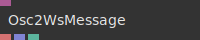

# Ops.Extension.Osc2Ws


```{=latex}
\OpsSubsubNoSubsectionNumbering\setcounter{subsubsection}{0}
```
### Osc2WsArray


**Full Name:** `Ops.Extension.Osc2Ws.Osc2WsArray`

**Description:** Outputs an array of data from a user defined OSC address

**`\inputsymbol`{=latex} Inputs**

- **Message** (Object)
- **Address** (String)
- **Learn** (Trigger)

**`\outputsymbol`{=latex} Output**

- **Result Message** (Object)
- **Array Out** (Array)
- **Array Length** (Number)
- **Received** (Trigger)

**Example Patch:** [Open in Editor](https://cables.gl/edit/F77YvQ)

**Docs:** [https://cables.gl/op/Ops.Extension.Osc2Ws.Osc2WsArray](https://cables.gl/op/Ops.Extension.Osc2Ws.Osc2WsArray)

### Osc2WsMessage


**Full Name:** `Ops.Extension.Osc2Ws.Osc2WsMessage`

**Description:** Shows the current active address of an incoming OSC message

**`\inputsymbol`{=latex} Inputs**

- **Message** (Object)

**`\outputsymbol`{=latex} Output**

- **Adress** (String)
- **Arguments** (Array)
- **Total Arguments** (Number)

**Example Patch:** [Open in Editor](https://cables.gl/edit/F77YvQ)

**Docs:** [https://cables.gl/op/Ops.Extension.Osc2Ws.Osc2WsMessage](https://cables.gl/op/Ops.Extension.Osc2Ws.Osc2WsMessage)

### Osc2WsNumber


**Full Name:** `Ops.Extension.Osc2Ws.Osc2WsNumber`

**Description:** Outputs a single number from a user defined OSC address

**`\inputsymbol`{=latex} Inputs**

- **Message** (Object)
- **Address** (String)
- **Learn** (Trigger)

**`\outputsymbol`{=latex} Output**

- **Result Message** (Object)
- **Value** (Number)
- **Received** (Trigger)

**Example Patch:** [Open in Editor](https://cables.gl/edit/F77YvQ)

**Docs:** [https://cables.gl/op/Ops.Extension.Osc2Ws.Osc2WsNumber](https://cables.gl/op/Ops.Extension.Osc2Ws.Osc2WsNumber)

### Osc2WsNumbers


**Full Name:** `Ops.Extension.Osc2Ws.Osc2WsNumbers`

**Description:** Outputs up to 4 numbers from a user defined OSC address

**`\inputsymbol`{=latex} Inputs**

- **Message In** (Object)
- **Osc Address** (String)
- **Learn** (Trigger)

**`\outputsymbol`{=latex} Output**

- **Message Through** (Object)
- **Received** (Trigger)
- **Number 0** (Number)
- **Number 1** (Number)
- **Number 2** (Number)
- **Number 3** (Number)

**Example Patch:** [Open in Editor](https://cables.gl/edit/F77YvQ)

**Docs:** [https://cables.gl/op/Ops.Extension.Osc2Ws.Osc2WsNumbers](https://cables.gl/op/Ops.Extension.Osc2Ws.Osc2WsNumbers)


