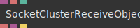
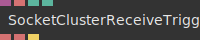
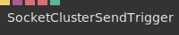
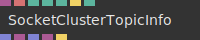

# Ops.Extension.SocketCluster


```{=latex}
\OpsSubsubNoSubsectionNumbering\setcounter{subsubsection}{0}
```
### SocketClusterClient_v2


**Full Name:** `Ops.Extension.SocketCluster.SocketClusterClient_v2`

connect to a socketcluster server and manage the connection.

**`\inputsymbol`{=latex} Inputs**

- **Channel** (String)
- **Server Hostname** (String)
- **Server Port** (Number)
- **Use SSL** (Number: Boolean)
- **enable encryption** (needs to be supported by server)
- **Server Path** (String)
- **Allow Send** (Number: Boolean)
- **Allow Multiple Senders** (Number: Boolean)
- **Additional Serverdata** (Object)
- **additional data send with every message** (can be used for auth-token)
- **Active** (Number: Boolean)

**`\outputsymbol`{=latex} Output**

- **Ready** (booleanNumber)
- **Socket** (Object)
- **Own Client Id** (String)
- **Can Send** (booleanNumber)
- **Error** (String)

**Example Patch:** [cables.gl/edit/EJvr0a](https://cables.gl/edit/EJvr0a)

**Doc:** [cables.gl/op/Ops.Extension.SocketCluster.SocketClusterClient_v2](https://cables.gl/op/Ops.Extension.SocketCluster.SocketClusterClient_v2)

### SocketClusterReceiveObject


**Full Name:** `Ops.Extension.SocketCluster.SocketClusterReceiveObject`

Receives object from the socketcluster socket/topic.

**`\inputsymbol`{=latex} Inputs**

- **Socket** (Object:Socketcluster)
- **Topic** (String)
- **Receive Own Data** (Number: Boolean)

**`\outputsymbol`{=latex} Output**

- **Client Id** (String)
- **Data** (Object)
- **Received** (Trigger)

**Example Patch:** [cables.gl/edit/EJvr0a](https://cables.gl/edit/EJvr0a)

**Doc:** [cables.gl/op/Ops.Extension.SocketCluster.SocketClusterReceiveObject](https://cables.gl/op/Ops.Extension.SocketCluster.SocketClusterReceiveObject)

### SocketClusterReceiveTrigger


**Full Name:** `Ops.Extension.SocketCluster.SocketClusterReceiveTrigger`

Receives trigger from the socketcluster socket/topic.

**`\inputsymbol`{=latex} Inputs**

- **Socket** (Object:Socketcluster)
- **Topic** (String)
- **Receive Own Data** (Number: Boolean)
- **Use Named Trigger** (Number: Boolean)

**`\outputsymbol`{=latex} Output**

- **Client Id** (String)
- **Trigger Name** (String)
- **Received** (Trigger)

**Example Patch:** [cables.gl/edit/mecjP3](https://cables.gl/edit/mecjP3)

**Doc:** [cables.gl/op/Ops.Extension.SocketCluster.SocketClusterReceiveTrigger](https://cables.gl/op/Ops.Extension.SocketCluster.SocketClusterReceiveTrigger)

### SocketClusterSendObject


**Full Name:** `Ops.Extension.SocketCluster.SocketClusterSendObject`

sends an object via socketcluster/websocket.

**`\inputsymbol`{=latex} Inputs**

- **Socket** (Object:Socketcluster)
- **Topic** (String)
- **Data** (Object)
- **Send** (Trigger)

**`\outputsymbol`{=latex} Output**

- **Sent Data** (Trigger)

**Example Patch:** [cables.gl/edit/EJvr0a](https://cables.gl/edit/EJvr0a)

**Doc:** [cables.gl/op/Ops.Extension.SocketCluster.SocketClusterSendObject](https://cables.gl/op/Ops.Extension.SocketCluster.SocketClusterSendObject)

### SocketClusterSendTrigger


**Full Name:** `Ops.Extension.SocketCluster.SocketClusterSendTrigger`

sends a trigger via socketcluster/websocket.

**`\inputsymbol`{=latex} Inputs**

- **Data** (Trigger)
- **Socket** (Object:Socketcluster)
- **Topic** (String)
- **Trigger Name** (String)
- **the name of the trigger** (created with TriggerSend)

**`\outputsymbol`{=latex} Output**

- *Visit [Ops.Extension.SocketCluster.SocketClusterSendTrigger documentation](https://cables.gl/op/Ops.Extension.SocketCluster.SocketClusterSendTrigger) for output port details*

**Example Patch:** [cables.gl/edit/mecjP3](https://cables.gl/edit/mecjP3)

**Doc:** [cables.gl/op/Ops.Extension.SocketCluster.SocketClusterSendTrigger](https://cables.gl/op/Ops.Extension.SocketCluster.SocketClusterSendTrigger)

### SocketClusterTopicInfo_v2


**Full Name:** `Ops.Extension.SocketCluster.SocketClusterTopicInfo_v2`

get info for clients listening on a socketcluster topic.

**`\inputsymbol`{=latex} Inputs**

- **Socket** (Object:Socketcluster)
- **Topic** (String)
- **Timeout Seconds** (Number: Integer)
- **Soft Timeout Seconds** (Number: Integer)
- **Retain Messages** (Number: Integer)
- **Update** (Trigger)
- **Receive My Data** (Number: Boolean)

**`\outputsymbol`{=latex} Output**

- **Active Clients** (Array)
- **Will Time Out** (Object)
- **Timed Out Clients** (Array)
- **Messages** (Object)
- **Updated** (Trigger)

**Example Patch:** [cables.gl/edit/EJvr0a](https://cables.gl/edit/EJvr0a)

**Doc:** [cables.gl/op/Ops.Extension.SocketCluster.SocketClusterTopicInfo_v2](https://cables.gl/op/Ops.Extension.SocketCluster.SocketClusterTopicInfo_v2)


