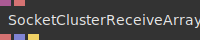
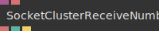
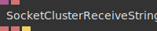
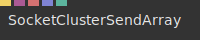
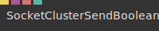
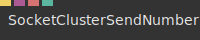
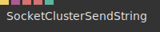

# Ops.Extension.SocketCluster.Deprecated

---

## Ops.Extension.SocketCluster.Deprecated

### SocketClusterReceiveArray

**Full Name:** `Ops.Extension.SocketCluster.Deprecated.SocketClusterReceiveArray`

**Description:** receive an array from the socketcluster topic

**`\inputsymbol`{=latex} Input Ports:**

- **Socket** (Object)
- **Topic** (String)

**`\outputsymbol`{=latex} Output Ports:**

- **Client Id** (String)
- **Data** (Array)
- **Received** (Trigger)

**Example Patch:** [Open in Editor](https://cables.gl/op/Ops.Extension.SocketCluster.Deprecated.SocketClusterReceiveArray#example)

**Docs:** [https://cables.gl/op/Ops.Extension.SocketCluster.Deprecated.SocketClusterReceiveArray](https://cables.gl/op/Ops.Extension.SocketCluster.Deprecated.SocketClusterReceiveArray)

### SocketClusterReceiveBoolean

**Full Name:** `Ops.Extension.SocketCluster.Deprecated.SocketClusterReceiveBoolean`

**Description:** Receive boolean value from the socketcluster socket/topic

**`\inputsymbol`{=latex} Input Ports:**

- **Socket** (Object)
- **Topic** (String)

**`\outputsymbol`{=latex} Output Ports:**

- **Client Id** (String)
- **Data** (booleanNumber)
- **Received** (Trigger)

**Example Patch:** [Open in Editor](https://cables.gl/op/Ops.Extension.SocketCluster.Deprecated.SocketClusterReceiveBoolean#example)

**Docs:** [https://cables.gl/op/Ops.Extension.SocketCluster.Deprecated.SocketClusterReceiveBoolean](https://cables.gl/op/Ops.Extension.SocketCluster.Deprecated.SocketClusterReceiveBoolean)

### SocketClusterReceiveNumber

**Full Name:** `Ops.Extension.SocketCluster.Deprecated.SocketClusterReceiveNumber`

**Description:** receive number from the socketcluster socket/topic

**`\inputsymbol`{=latex} Input Ports:**

- **Socket** (Object)
- **Topic** (String)

**`\outputsymbol`{=latex} Output Ports:**

- **Client Id** (String)
- **Data** (Number)
- **Received** (Trigger)

**Example Patch:** [Open in Editor](https://cables.gl/op/Ops.Extension.SocketCluster.Deprecated.SocketClusterReceiveNumber#example)

**Docs:** [https://cables.gl/op/Ops.Extension.SocketCluster.Deprecated.SocketClusterReceiveNumber](https://cables.gl/op/Ops.Extension.SocketCluster.Deprecated.SocketClusterReceiveNumber)

### SocketClusterReceiveString

**Full Name:** `Ops.Extension.SocketCluster.Deprecated.SocketClusterReceiveString`

**Description:** receives string from the socketcluster socket/topic

**`\inputsymbol`{=latex} Input Ports:**

- **Socket** (Object:Socketcluster)
- **Topic** (String)

**`\outputsymbol`{=latex} Output Ports:**

- **Data** (String)
- **Client Id** (String)
- **Received** (Trigger)

**Example Patch:** [Open in Editor](https://cables.gl/op/Ops.Extension.SocketCluster.Deprecated.SocketClusterReceiveString#example)

**Docs:** [https://cables.gl/op/Ops.Extension.SocketCluster.Deprecated.SocketClusterReceiveString](https://cables.gl/op/Ops.Extension.SocketCluster.Deprecated.SocketClusterReceiveString)

### SocketClusterSendArray

**Full Name:** `Ops.Extension.SocketCluster.Deprecated.SocketClusterSendArray`

**Description:** sends an array via socketcluster/websocket

**`\inputsymbol`{=latex} Input Ports:**

- **Send** (Trigger)
- **Socket** (Object:Socketcluster)
- **Topic** (String)
- **Data** (Array)
- **Public** (2): MOUSE MOVEMENT SEND

**`\outputsymbol`{=latex} Output Ports:**

- *Visit [Ops.Extension.SocketCluster.Deprecated.SocketClusterSendArray documentation](https://cables.gl/op/Ops.Extension.SocketCluster.Deprecated.SocketClusterSendArray) for output port details*

**Example Patch:** [Open in Editor](https://cables.gl/op/Ops.Extension.SocketCluster.Deprecated.SocketClusterSendArray#example)

**Docs:** [https://cables.gl/op/Ops.Extension.SocketCluster.Deprecated.SocketClusterSendArray](https://cables.gl/op/Ops.Extension.SocketCluster.Deprecated.SocketClusterSendArray)

### SocketClusterSendBoolean

**Full Name:** `Ops.Extension.SocketCluster.Deprecated.SocketClusterSendBoolean`

**Description:** Sends boolean value via socketcluster/websocket

**`\inputsymbol`{=latex} Input Ports:**

- **Send** (Trigger)
- **Socket** (Object)
- **Topic** (String)
- **Data** (Number: Boolean)

**`\outputsymbol`{=latex} Output Ports:**

- *Visit [Ops.Extension.SocketCluster.Deprecated.SocketClusterSendBoolean documentation](https://cables.gl/op/Ops.Extension.SocketCluster.Deprecated.SocketClusterSendBoolean) for output port details*

**Example Patch:** [Open in Editor](https://cables.gl/op/Ops.Extension.SocketCluster.Deprecated.SocketClusterSendBoolean#example)

**Docs:** [https://cables.gl/op/Ops.Extension.SocketCluster.Deprecated.SocketClusterSendBoolean](https://cables.gl/op/Ops.Extension.SocketCluster.Deprecated.SocketClusterSendBoolean)

### SocketClusterSendNumber

**Full Name:** `Ops.Extension.SocketCluster.Deprecated.SocketClusterSendNumber`

**Description:** sends a number via socketcluster/websocket

**`\inputsymbol`{=latex} Input Ports:**

- **Send** (Trigger)
- **Socket** (Object)
- **Topic** (String)
- **Data** (Number)

**`\outputsymbol`{=latex} Output Ports:**

- *Visit [Ops.Extension.SocketCluster.Deprecated.SocketClusterSendNumber documentation](https://cables.gl/op/Ops.Extension.SocketCluster.Deprecated.SocketClusterSendNumber) for output port details*

**Example Patch:** [Open in Editor](https://cables.gl/op/Ops.Extension.SocketCluster.Deprecated.SocketClusterSendNumber#example)

**Docs:** [https://cables.gl/op/Ops.Extension.SocketCluster.Deprecated.SocketClusterSendNumber](https://cables.gl/op/Ops.Extension.SocketCluster.Deprecated.SocketClusterSendNumber)

### SocketClusterSendString

**Full Name:** `Ops.Extension.SocketCluster.Deprecated.SocketClusterSendString`

**Description:** sends a string via socketcluster/websocket

**`\inputsymbol`{=latex} Input Ports:**

- **Send** (Trigger)
- **Socket** (Object:Socketcluster)
- **Topic** (String)
- **Data** (String)

**`\outputsymbol`{=latex} Output Ports:**

- *Visit [Ops.Extension.SocketCluster.Deprecated.SocketClusterSendString documentation](https://cables.gl/op/Ops.Extension.SocketCluster.Deprecated.SocketClusterSendString) for output port details*

**Example Patch:** [Open in Editor](https://cables.gl/op/Ops.Extension.SocketCluster.Deprecated.SocketClusterSendString#example)

**Docs:** [https://cables.gl/op/Ops.Extension.SocketCluster.Deprecated.SocketClusterSendString](https://cables.gl/op/Ops.Extension.SocketCluster.Deprecated.SocketClusterSendString)

