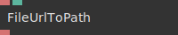
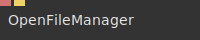
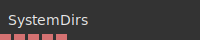
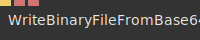

# Ops.Extension.Standalone.Files

*Part of the [All Operators Reference](13-_AllOps.md)*

---

## Ops.Extension.Standalone.Files

### CreateFile

**Full Name:** `Ops.Extension.Standalone.Files.CreateFile`
**Description:** Create a new empty file on your local harddrive

**> Input Ports:**
- **Default Path** (String): *See documentation*
- **Create File** (Trigger): *See documentation*

**< Output Ports:**
- **Path** (String): *See documentation*
- **Next** (Trigger): *See documentation*

**Example Patch:** [Open in Editor](https://cables.gl/edit/dhvNAs)
**Patches Using This Op:** *Search [cables.gl patches](https://cables.gl/patches) for "CreateFile"*
**Docs:** [https://cables.gl/op/Ops.Extension.Standalone.Files.CreateFile](https://cables.gl/op/Ops.Extension.Standalone.Files.CreateFile)

---

### Exist

**Full Name:** `Ops.Extension.Standalone.Files.Exist`
**Description:** Check if a file exists on the local file system

**> Input Ports:**
- **Path** (String): *See documentation*
- **Execute** (Trigger): *See documentation*

**< Output Ports:**
- **Exists** (booleanNumber): *See documentation*

**Example Patch:** [Open in Editor](https://cables.gl/edit/XlQrun)
**Patches Using This Op:** *Search [cables.gl patches](https://cables.gl/patches) for "Exist"*
**Docs:** [https://cables.gl/op/Ops.Extension.Standalone.Files.Exist](https://cables.gl/op/Ops.Extension.Standalone.Files.Exist)

---

### FileUrlToPath

**Full Name:** `Ops.Extension.Standalone.Files.FileUrlToPath`
**Description:** convert file-url to path

**> Input Ports:**
- **FileUrl** (String): *See documentation*

**< Output Ports:**
- **Path** (String): *See documentation*

**Example Patch:** [Open in Editor](https://cables.gl/edit/upnVAs)
**Patches Using This Op:** *Search [cables.gl patches](https://cables.gl/patches) for "FileUrlToPath"*
**Docs:** [https://cables.gl/op/Ops.Extension.Standalone.Files.FileUrlToPath](https://cables.gl/op/Ops.Extension.Standalone.Files.FileUrlToPath)

---

### Makedir

**Full Name:** `Ops.Extension.Standalone.Files.Makedir`
**Description:** Create a directory on the local file system

**> Input Ports:**
- **Path** (String): *See documentation*
- **Create** (Trigger): *See documentation*

**< Output Ports:**
- **Next** (Trigger): *See documentation*

**Example Patch:** [Open in Editor](https://cables.gl/edit/q5evun)
**Patches Using This Op:** *Search [cables.gl patches](https://cables.gl/patches) for "Makedir"*
**Docs:** [https://cables.gl/op/Ops.Extension.Standalone.Files.Makedir](https://cables.gl/op/Ops.Extension.Standalone.Files.Makedir)

---

### OpenFileManager

**Full Name:** `Ops.Extension.Standalone.Files.OpenFileManager`
**Description:** Open the native file manager application using that path

**> Input Ports:**
- **Path** (String): *See documentation*
- **Open File Manager** (Trigger): *See documentation*

**< Output Ports:**
- *Visit [Ops.Extension.Standalone.Files.OpenFileManager documentation](https://cables.gl/op/Ops.Extension.Standalone.Files.OpenFileManager) for output port details*

**Example Patch:** [Open in Editor](https://cables.gl/op/Ops.Extension.Standalone.Files.OpenFileManager#example)
**Patches Using This Op:** *Search [cables.gl patches](https://cables.gl/patches) for "OpenFileManager"*
**Docs:** [https://cables.gl/op/Ops.Extension.Standalone.Files.OpenFileManager](https://cables.gl/op/Ops.Extension.Standalone.Files.OpenFileManager)

---

### PathToFileUrl

**Full Name:** `Ops.Extension.Standalone.Files.PathToFileUrl`
**Description:** convert local path to file-url

**> Input Ports:**
- **Path** (String): *See documentation*

**< Output Ports:**
- **FileUrl** (String): *See documentation*

**Example Patch:** [Open in Editor](https://cables.gl/edit/pekPAs)
**Patches Using This Op:** *Search [cables.gl patches](https://cables.gl/patches) for "PathToFileUrl"*
**Docs:** [https://cables.gl/op/Ops.Extension.Standalone.Files.PathToFileUrl](https://cables.gl/op/Ops.Extension.Standalone.Files.PathToFileUrl)

---

### ReadDir

**Full Name:** `Ops.Extension.Standalone.Files.ReadDir`
**Description:** Read all entries in a directory

**> Input Ports:**
- **Path** (String): *See documentation*
- **Reload** (Trigger): *See documentation*

**< Output Ports:**
- **Entries** (Array): *See documentation*
- **Has Error** (booleanNumber): *See documentation*
- **Error** (String): *See documentation*

**Example Patch:** [Open in Editor](https://cables.gl/edit/I6buun)
**Patches Using This Op:** *Search [cables.gl patches](https://cables.gl/patches) for "ReadDir"*
**Docs:** [https://cables.gl/op/Ops.Extension.Standalone.Files.ReadDir](https://cables.gl/op/Ops.Extension.Standalone.Files.ReadDir)

---

### ResolvePath

**Full Name:** `Ops.Extension.Standalone.Files.ResolvePath`
**Description:** Resolves a paths into an absolute path

**> Input Ports:**
- **Path** (String): *See documentation*

**< Output Ports:**
- **Result** (String): *See documentation*

**Example Patch:** [Open in Editor](https://cables.gl/op/Ops.Extension.Standalone.Files.ResolvePath#example)
**Patches Using This Op:** *Search [cables.gl patches](https://cables.gl/patches) for "ResolvePath"*
**Docs:** [https://cables.gl/op/Ops.Extension.Standalone.Files.ResolvePath](https://cables.gl/op/Ops.Extension.Standalone.Files.ResolvePath)

---

### SelectDir

**Full Name:** `Ops.Extension.Standalone.Files.SelectDir`
**Description:** Choose a directory on your hard drive

**> Input Ports:**
- **Default Path** (String): *See documentation*
- **Select Directory** (Trigger): *See documentation*

**< Output Ports:**
- **Path** (String): *See documentation*
- **Next** (Trigger): *See documentation*

**Example Patch:** [Open in Editor](https://cables.gl/op/Ops.Extension.Standalone.Files.SelectDir#example)
**Patches Using This Op:** *Search [cables.gl patches](https://cables.gl/patches) for "SelectDir"*
**Docs:** [https://cables.gl/op/Ops.Extension.Standalone.Files.SelectDir](https://cables.gl/op/Ops.Extension.Standalone.Files.SelectDir)

---

### SelectFile

**Full Name:** `Ops.Extension.Standalone.Files.SelectFile`
**Description:** Choose a file on your hard drive

**> Input Ports:**
- **Default Path** (String): *See documentation*
- **Select File** (Trigger): *See documentation*

**< Output Ports:**
- **Path** (String): *See documentation*
- **Next** (Trigger): *See documentation*

**Example Patch:** [Open in Editor](https://cables.gl/edit/M58UAs)
**Patches Using This Op:** *Search [cables.gl patches](https://cables.gl/patches) for "SelectFile"*
**Docs:** [https://cables.gl/op/Ops.Extension.Standalone.Files.SelectFile](https://cables.gl/op/Ops.Extension.Standalone.Files.SelectFile)

---

### Stat

**Full Name:** `Ops.Extension.Standalone.Files.Stat`
**Description:** Get statistics about a file on the local file system

**> Input Ports:**
- **Path** (String): *See documentation*

**< Output Ports:**
- **Stats** (Object): *See documentation*
- **Is Directory** (booleanNumber): *See documentation*
- **Is File** (booleanNumber): *See documentation*
- **Has Error** (booleanNumber): *See documentation*
- **Error** (String): *See documentation*

**Example Patch:** [Open in Editor](https://cables.gl/op/Ops.Extension.Standalone.Files.Stat#example)
**Patches Using This Op:** *Search [cables.gl patches](https://cables.gl/patches) for "Stat"*
**Docs:** [https://cables.gl/op/Ops.Extension.Standalone.Files.Stat](https://cables.gl/op/Ops.Extension.Standalone.Files.Stat)

---

### SystemDirs

**Full Name:** `Ops.Extension.Standalone.Files.SystemDirs`
**Description:** Get Default System Directories Paths

**> Input Ports:**
- *Visit [Ops.Extension.Standalone.Files.SystemDirs documentation](https://cables.gl/op/Ops.Extension.Standalone.Files.SystemDirs) for input port details*

**< Output Ports:**
- **Home** (String): *See documentation*
- **Downloads** (String): *See documentation*
- **Documents** (String): *See documentation*
- **Desktop** (String): *See documentation*
- **Exe** (String): *See documentation*

**Example Patch:** [Open in Editor](https://cables.gl/edit/7hftun)
**Patches Using This Op:** *Search [cables.gl patches](https://cables.gl/patches) for "SystemDirs"*
**Docs:** [https://cables.gl/op/Ops.Extension.Standalone.Files.SystemDirs](https://cables.gl/op/Ops.Extension.Standalone.Files.SystemDirs)

---

### Watch

**Full Name:** `Ops.Extension.Standalone.Files.Watch`
**Description:** Watch a directory, get a trigger when a file changes

**> Input Ports:**
- **Path** (String): *See documentation*
- **Read** (Trigger): *See documentation*

**< Output Ports:**
- **Event Type** (String): *See documentation*
- **Event Filename** (String): *See documentation*
- **Event Happened** (Trigger): *See documentation*
- **Content** (String): *See documentation*
- **Has Error** (booleanNumber): *See documentation*
- **Error** (String): *See documentation*

**Example Patch:** [Open in Editor](https://cables.gl/edit/PT9Aun)
**Patches Using This Op:** *Search [cables.gl patches](https://cables.gl/patches) for "Watch"*
**Docs:** [https://cables.gl/op/Ops.Extension.Standalone.Files.Watch](https://cables.gl/op/Ops.Extension.Standalone.Files.Watch)

---

### WriteBinaryFileFromBase64

**Full Name:** `Ops.Extension.Standalone.Files.WriteBinaryFileFromBase64`
**Description:** Create a binary file on the local file system from a base64 string

**> Input Ports:**
- **Trigger** (Trigger): *See documentation*
- **Base64** (String): *See documentation*
- **Filename** (String): *See documentation*

**< Output Ports:**
- *Visit [Ops.Extension.Standalone.Files.WriteBinaryFileFromBase64 documentation](https://cables.gl/op/Ops.Extension.Standalone.Files.WriteBinaryFileFromBase64) for output port details*

**Example Patch:** [Open in Editor](https://cables.gl/op/Ops.Extension.Standalone.Files.WriteBinaryFileFromBase64#example)
**Patches Using This Op:** *Search [cables.gl patches](https://cables.gl/patches) for "WriteBinaryFileFromBase64"*
**Docs:** [https://cables.gl/op/Ops.Extension.Standalone.Files.WriteBinaryFileFromBase64](https://cables.gl/op/Ops.Extension.Standalone.Files.WriteBinaryFileFromBase64)

---

### WriteTextFile

**Full Name:** `Ops.Extension.Standalone.Files.WriteTextFile`
**Description:** Write a string to a text file on the local file system

**> Input Ports:**
- **Filename** (String): *See documentation*
- **Content** (String): *See documentation*
- **Write** (Trigger): *See documentation*

**< Output Ports:**
- **Next** (Trigger): *See documentation*
- **Has Error** (booleanNumber): *See documentation*
- **Error** (String): *See documentation*

**Example Patch:** [Open in Editor](https://cables.gl/edit/PT9Aun)
**Patches Using This Op:** *Search [cables.gl patches](https://cables.gl/patches) for "WriteTextFile"*
**Docs:** [https://cables.gl/op/Ops.Extension.Standalone.Files.WriteTextFile](https://cables.gl/op/Ops.Extension.Standalone.Files.WriteTextFile)

---

