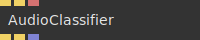
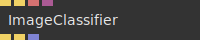
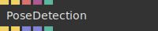

# Ops.Extension.TeachableMachines

---

## Ops.Extension.TeachableMachines

### AudioClassifier

**Full Name:** `Ops.Extension.TeachableMachines.AudioClassifier`

**Description:** Use the Teachable Machines audio classifier for your microphone. Insert the uploaded model URL.

**`\inputsymbol`{=latex} Inputs**

- **Trigger In** (Trigger)
- **Initialize** (Trigger)
- **Model URL** (String)

**`\outputsymbol`{=latex} Output**

- **Trigger** (Trigger)
- **Initialized** (Trigger)
- **Classifier** (Array)

**Example Patch:** [Open in Editor](https://cables.gl/edit/-kzrrn)

**Docs:** [https://cables.gl/op/Ops.Extension.TeachableMachines.AudioClassifier](https://cables.gl/op/Ops.Extension.TeachableMachines.AudioClassifier)

### ImageClassifier_v2

**Full Name:** `Ops.Extension.TeachableMachines.ImageClassifier_v2`

**Description:** Use the Teachable Machines image classifier. Insert the uploaded model URL.

**`\inputsymbol`{=latex} Inputs**

- **Trigger In** (Trigger)
- **Initialize** (Trigger)
- **Model URL** (String)
- **Webcam Element** (Object)

**`\outputsymbol`{=latex} Output**

- **Trigger** (Trigger)
- **Initialized** (Trigger)
- **Classifier** (Array)

**Example Patch:** [Open in Editor](https://cables.gl/edit/raewrn)

**Docs:** [https://cables.gl/op/Ops.Extension.TeachableMachines.ImageClassifier_v2](https://cables.gl/op/Ops.Extension.TeachableMachines.ImageClassifier_v2)

### PoseDetection_v2

**Full Name:** `Ops.Extension.TeachableMachines.PoseDetection_v2`

**Description:** Use the Teachable Machines pose detection with your webcam. Insert the uploaded model URL.

**`\inputsymbol`{=latex} Inputs**

- **Render** (Trigger)
- **Initialize** (Trigger)
- **Model URL** (String)
- **Webcam Element** (Object)
- **Flip Image** (Number: Boolean)

**`\outputsymbol`{=latex} Output**

- **Trigger** (Trigger)
- **Initialized** (Trigger)
- **Classifier** (Array)
- **Pose Positions** (Array)
- **Image Flipped** (Number)

**Example Patch:** [Open in Editor](https://cables.gl/edit/xOStrn)

**Docs:** [https://cables.gl/op/Ops.Extension.TeachableMachines.PoseDetection_v2](https://cables.gl/op/Ops.Extension.TeachableMachines.PoseDetection_v2)

