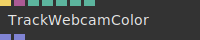

# Ops.Extension.Trackingjs

*Part of the [All Operators Reference](13-_AllOps.md)*

---

## Ops.Extension.Trackingjs

### TrackWebcamColor

**Full Name:** `Ops.Extension.Trackingjs.TrackWebcamColor`
**Description:** Track a position of a specific color in the current webcam stream

**> Input Ports:**
- **Update** (Trigger)
- **Video Element** (Object)
- **Threshold** (Number)
- **Resize Video** (Number)
- **R** (Number)
- **G** (Number)
- **B** (Number)

**< Output Ports:**
- **Positions** (Array)
- **Sizes** (Array)

**Example Patch:** [Open in Editor](https://cables.gl/edit/vSwLsT)
**Patches Using This Op:** *Search [cables.gl patches](https://cables.gl/patches) for "TrackWebcamColor"*
**Docs:** [https://cables.gl/op/Ops.Extension.Trackingjs.TrackWebcamColor](https://cables.gl/op/Ops.Extension.Trackingjs.TrackWebcamColor)

---

