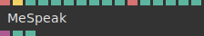
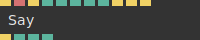
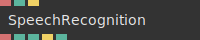

# Ops.Extension.Voice


```{=latex}
\OpsSubsubNoSubsectionNumbering\setcounter{subsubsection}{0}
```
### MeSpeak


**Full Name:** `Ops.Extension.Voice.MeSpeak`

**Description:** uses mespeak.js to convert text-to-speech

**`\inputsymbol`{=latex} Inputs**

- **Text** (String)
- **Say** (Trigger)
- **Amplitude** (Number)
- **Pitch** (Number)
- **Voice Index** (Number: Integer)
- **Word Gap** (Number: Integer)
- **Variants Index** (Number: Integer)
- **Line-Break Length** (Number: Integer)
- **Capitals** (Number: Integer)
- **Punctuation** (String)
- **No Stop** (Number: Boolean)
- **UTF16** (Number: Boolean)
- **SSML** (Number: Boolean)
- **Log Console** (Number: Boolean)
- **Pan** (Number)

**`\outputsymbol`{=latex} Output**

- **Audio Out** (Object)
- **Speaking** (booleanNumber)
- **Voice Loaded** (booleanNumber)

**Example Patch:** [Open in Editor](https://cables.gl/op/Ops.Extension.Voice.MeSpeak#example)

**Docs:** [https://cables.gl/op/Ops.Extension.Voice.MeSpeak](https://cables.gl/op/Ops.Extension.Voice.MeSpeak)

### Say_v2


**Full Name:** `Ops.Extension.Voice.Say_v2`

**Description:** Text-to-Speech, speaks different languages (speech synthesis)

**`\inputsymbol`{=latex} Inputs**

- **Update State** (Trigger)
- **Text** (String)
- **Say** (Trigger)
- **Voice** (Number: Select Box)
- **Pitch** (Number)
- **Rate** (Number)
- **Volume** (Number)
- **Say On Text Change** (Number: Boolean)
- **Pause** (Trigger)
- **Resume** (Trigger)
- **Cancel** (Trigger)

**`\outputsymbol`{=latex} Output**

- **Next** (Trigger)
- **Speaking** (Number)
- **Pending** (Number)
- **Paused** (Number)

**Example Patch:** [Open in Editor](https://cables.gl/edit/WubOWc)

**Docs:** [https://cables.gl/op/Ops.Extension.Voice.Say_v2](https://cables.gl/op/Ops.Extension.Voice.Say_v2)

### SpeechRecognition


**Full Name:** `Ops.Extension.Voice.SpeechRecognition`

**Description:** speech to text recognition

**`\inputsymbol`{=latex} Inputs**

- **Language** (String)
- **Active** (Number: Boolean)
- **Start** (Trigger)

**`\outputsymbol`{=latex} Output**

- **Result** (String)
- **Confidence** (Number)
- **Supported** (booleanNumber)
- **New Result** (Trigger)
- **Started** (booleanNumber)

**Example Patch:** [Open in Editor](https://cables.gl/edit/9p7kw4)

**Docs:** [https://cables.gl/op/Ops.Extension.Voice.SpeechRecognition](https://cables.gl/op/Ops.Extension.Voice.SpeechRecognition)


