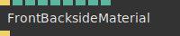

# Ops.Extension.WebGpu

*Part of the [All Operators Reference](13-_AllOps.md)*

---

## Ops.Extension.WebGpu

### ArrayToGpuBuffer

**Full Name:** `Ops.Extension.WebGpu.ArrayToGpuBuffer`
**Description:** Upload an array to the GPU as a GpuBuffer

**> Input Ports:**
- **Arr** (Array): *See documentation*

**< Output Ports:**
- **GPUBuffer** (Object): *See documentation*

**Example Patch:** [Open in Editor](https://cables.gl/edit/VShX3I)
**Patches Using This Op:** *Search [cables.gl patches](https://cables.gl/patches) for "ArrayToGpuBuffer"*
**Docs:** [https://cables.gl/op/Ops.Extension.WebGpu.ArrayToGpuBuffer](https://cables.gl/op/Ops.Extension.WebGpu.ArrayToGpuBuffer)

---

### ArrayToTexture

**Full Name:** `Ops.Extension.WebGpu.ArrayToTexture`
**Description:** Convert an array of numbers to a webgpu texture

**> Input Ports:**
- **Update** (Trigger): *See documentation*
- **Array** (Array): *See documentation*
- **Wrap Index** (Number: Integer): *See documentation*
- **Width** (Number: Integer): *See documentation*
- **Height** (Number: Integer): *See documentation*

**< Output Ports:**
- **Next** (Trigger): *See documentation*
- **Texture** (Object): *See documentation*

**Example Patch:** [Open in Editor](https://cables.gl/edit/hYt34I)
**Patches Using This Op:** *Search [cables.gl patches](https://cables.gl/patches) for "ArrayToTexture"*
**Docs:** [https://cables.gl/op/Ops.Extension.WebGpu.ArrayToTexture](https://cables.gl/op/Ops.Extension.WebGpu.ArrayToTexture)

---

### AttributeAsColorMaterial

**Full Name:** `Ops.Extension.WebGpu.AttributeAsColorMaterial`
**Description:** Render mesh attribultes as color

**> Input Ports:**
- **Render** (Trigger): *See documentation*

**< Output Ports:**
- **Next** (Trigger): *See documentation*

**Example Patch:** [Open in Editor](https://cables.gl/edit/FM4hQB)
**Patches Using This Op:** *Search [cables.gl patches](https://cables.gl/patches) for "AttributeAsColorMaterial"*
**Docs:** [https://cables.gl/op/Ops.Extension.WebGpu.AttributeAsColorMaterial](https://cables.gl/op/Ops.Extension.WebGpu.AttributeAsColorMaterial)

---

### BasicMaterial

**Full Name:** `Ops.Extension.WebGpu.BasicMaterial`
**Description:** A simple material without shading

**> Input Ports:**
- **Render** (Trigger): *See documentation*
- **R** (Number): *See documentation*
- **G** (Number): *See documentation*
- **B** (Number): *See documentation*
- **A** (Number): *See documentation*
- **Colorize Texture** (Number: Boolean): *See documentation*
- **DiffuseRepeatX** (Number): *See documentation*
- **DiffuseRepeatY** (Number): *See documentation*
- **Tex Offset X** (Number): *See documentation*
- **Tex Offset Y** (Number): *See documentation*
- **Texture** (Object:Texture): *See documentation*
- **Mask** (Object:Texture): *See documentation*

**< Output Ports:**
- **Next** (Trigger): *See documentation*

**Example Patch:** [Open in Editor](https://cables.gl/edit/J0HjQB)
**Patches Using This Op:** *Search [cables.gl patches](https://cables.gl/patches) for "BasicMaterial"*
**Docs:** [https://cables.gl/op/Ops.Extension.WebGpu.BasicMaterial](https://cables.gl/op/Ops.Extension.WebGpu.BasicMaterial)

---

### ColorTexture

**Full Name:** `Ops.Extension.WebGpu.ColorTexture`
**Description:** A texture containing only one color

**> Input Ports:**
- **Render** (Trigger): *See documentation*
- **R** (Number): *See documentation*
- **G** (Number): *See documentation*
- **B** (Number): *See documentation*
- **A** (Number): *See documentation*

**< Output Ports:**
- **Next** (Trigger): *See documentation*
- **Texture_out** (Object): *See documentation*

**Example Patch:** [Open in Editor](https://cables.gl/edit/13IW3I)
**Patches Using This Op:** *Search [cables.gl patches](https://cables.gl/patches) for "ColorTexture"*
**Docs:** [https://cables.gl/op/Ops.Extension.WebGpu.ColorTexture](https://cables.gl/op/Ops.Extension.WebGpu.ColorTexture)

---

### CompCompute

**Full Name:** `Ops.Extension.WebGpu.CompCompute`
**Description:** Compose a compute shader

**> Input Ports:**
- **Compute** (Trigger): *See documentation*
- **Source** (String): *See documentation*
- **Workgroups 1** (Number: Integer): *See documentation*
- **Workgroups 2** (Number: Integer): *See documentation*
- **Workgroups 3** (Number: Integer): *See documentation*
- **Force Update** (Trigger): *See documentation*

**< Output Ports:**
- **Next** (Trigger): *See documentation*
- **Code** (String): *See documentation*
- **Buffer** (Object): *See documentation*
- **Length** (Number): *See documentation*

**Example Patch:** [Open in Editor](https://cables.gl/edit/1ff0dH)
**Patches Using This Op:** *Search [cables.gl patches](https://cables.gl/patches) for "CompCompute"*
**Docs:** [https://cables.gl/op/Ops.Extension.WebGpu.CompCompute](https://cables.gl/op/Ops.Extension.WebGpu.CompCompute)

---

### ComputeStorageInput

**Full Name:** `Ops.Extension.WebGpu.ComputeStorageInput`
**Description:** Compute shader GPU buffer storage input

**> Input Ports:**
- **Trigger** (Trigger): *See documentation*
- **Name** (String): *See documentation*
- **Buffer** (Object): *See documentation*

**< Output Ports:**
- **Next** (Trigger): *See documentation*

**Example Patch:** [Open in Editor](https://cables.gl/op/Ops.Extension.WebGpu.ComputeStorageInput#example)
**Patches Using This Op:** *Search [cables.gl patches](https://cables.gl/patches) for "ComputeStorageInput"*
**Docs:** [https://cables.gl/op/Ops.Extension.WebGpu.ComputeStorageInput](https://cables.gl/op/Ops.Extension.WebGpu.ComputeStorageInput)

---

### ComputeStorageOutput

**Full Name:** `Ops.Extension.WebGpu.ComputeStorageOutput`
**Description:** Compute shader GPU buffer storage output

**> Input Ports:**
- **Trigger** (Trigger): *See documentation*
- **Name** (String): *See documentation*
- **Length** (Number: Integer): *See documentation*

**< Output Ports:**
- **Next** (Trigger): *See documentation*
- **Buffer** (Object): *See documentation*
- **Buffer Length** (Number): *See documentation*

**Example Patch:** [Open in Editor](https://cables.gl/edit/1ff0dH)
**Patches Using This Op:** *Search [cables.gl patches](https://cables.gl/patches) for "ComputeStorageOutput"*
**Docs:** [https://cables.gl/op/Ops.Extension.WebGpu.ComputeStorageOutput](https://cables.gl/op/Ops.Extension.WebGpu.ComputeStorageOutput)

---

### ComputeUniform

**Full Name:** `Ops.Extension.WebGpu.ComputeUniform`
**Description:** Add a uniform input to a compute shader composition

**> Input Ports:**
- **Trigger** (Trigger): *See documentation*
- **Name** (String): *See documentation*
- **X** (Number): *See documentation*
- **Y** (Number): *See documentation*
- **Z** (Number): *See documentation*
- **W** (Number): *See documentation*

**< Output Ports:**
- **Next** (Trigger): *See documentation*

**Example Patch:** [Open in Editor](https://cables.gl/op/Ops.Extension.WebGpu.ComputeUniform#example)
**Patches Using This Op:** *Search [cables.gl patches](https://cables.gl/patches) for "ComputeUniform"*
**Docs:** [https://cables.gl/op/Ops.Extension.WebGpu.ComputeUniform](https://cables.gl/op/Ops.Extension.WebGpu.ComputeUniform)

---

### DefaultTextures

**Full Name:** `Ops.Extension.WebGpu.DefaultTextures`
**Description:** Outputs textures

**> Input Ports:**
- *Visit [Ops.Extension.WebGpu.DefaultTextures documentation](https://cables.gl/op/Ops.Extension.WebGpu.DefaultTextures) for input port details*

**< Output Ports:**
- **Result** (Object): *See documentation*

**Example Patch:** [Open in Editor](https://cables.gl/edit/nQEVKB)
**Patches Using This Op:** *Search [cables.gl patches](https://cables.gl/patches) for "DefaultTextures"*
**Docs:** [https://cables.gl/op/Ops.Extension.WebGpu.DefaultTextures](https://cables.gl/op/Ops.Extension.WebGpu.DefaultTextures)

---

### FaceCulling

**Full Name:** `Ops.Extension.WebGpu.FaceCulling`
**Description:** cull (do not draw) back or front facing faces/triangles

**> Input Ports:**
- **Render** (Trigger): *See documentation*

**< Output Ports:**
- **Trigger** (Trigger): *See documentation*

**Example Patch:** [Open in Editor](https://cables.gl/edit/zKLQ3I)
**Patches Using This Op:** *Search [cables.gl patches](https://cables.gl/patches) for "FaceCulling"*
**Docs:** [https://cables.gl/op/Ops.Extension.WebGpu.FaceCulling](https://cables.gl/op/Ops.Extension.WebGpu.FaceCulling)

---

### FrontBacksideMaterial

**Full Name:** `Ops.Extension.WebGpu.FrontBacksideMaterial`
**Description:** Show direction of faces as color

**> Input Ports:**
- **Render** (Trigger): *See documentation*
- **R** (Number): *See documentation*
- **G** (Number): *See documentation*
- **B** (Number): *See documentation*
- **A** (Number): *See documentation*
- **R 2** (Number): *See documentation*
- **G 2** (Number): *See documentation*
- **B 2** (Number): *See documentation*
- **A 2** (Number): *See documentation*

**< Output Ports:**
- **Next** (Trigger): *See documentation*

**Example Patch:** [Open in Editor](https://cables.gl/edit/1Jm1LB)
**Patches Using This Op:** *Search [cables.gl patches](https://cables.gl/patches) for "FrontBacksideMaterial"*
**Docs:** [https://cables.gl/op/Ops.Extension.WebGpu.FrontBacksideMaterial](https://cables.gl/op/Ops.Extension.WebGpu.FrontBacksideMaterial)

---

### FullScreenRect

**Full Name:** `Ops.Extension.WebGpu.FullScreenRect`
**Description:** Render a rectangle that fills the whole canvas

**> Input Ports:**
- **Render** (Trigger): *See documentation*
- **Flip Y** (Number: Boolean): *See documentation*
- **Flip X** (Number: Boolean): *See documentation*
- **Texture** (Object:Texture): *See documentation*

**< Output Ports:**
- **Trigger** (Trigger): *See documentation*

**Example Patch:** [Open in Editor](https://cables.gl/edit/PNx2LB)
**Patches Using This Op:** *Search [cables.gl patches](https://cables.gl/patches) for "FullScreenRect"*
**Docs:** [https://cables.gl/op/Ops.Extension.WebGpu.FullScreenRect](https://cables.gl/op/Ops.Extension.WebGpu.FullScreenRect)

---

### GpuBufferToArray

**Full Name:** `Ops.Extension.WebGpu.GpuBufferToArray`
**Description:** Convert a GpuBuffer to a CPU Array

**> Input Ports:**
- **Trigger** (Trigger): *See documentation*
- **Pos Buffer** (Object): *See documentation*

**< Output Ports:**
- **Result** (Array): *See documentation*

**Example Patch:** [Open in Editor](https://cables.gl/edit/bQQYKB)
**Patches Using This Op:** *Search [cables.gl patches](https://cables.gl/patches) for "GpuBufferToArray"*
**Docs:** [https://cables.gl/op/Ops.Extension.WebGpu.GpuBufferToArray](https://cables.gl/op/Ops.Extension.WebGpu.GpuBufferToArray)

---

### MatCapMaterial

**Full Name:** `Ops.Extension.WebGpu.MatCapMaterial`
**Description:** Image based material that uses a matcap environment texture

**> Input Ports:**
- **Render** (Trigger): *See documentation*
- **R** (Number): *See documentation*
- **G** (Number): *See documentation*
- **B** (Number): *See documentation*
- **A** (Number): *See documentation*
- **Colorize Texture** (Number: Boolean): *See documentation*
- **DiffuseRepeatX** (Number): *See documentation*
- **DiffuseRepeatY** (Number): *See documentation*
- **Tex Offset X** (Number): *See documentation*
- **Tex Offset Y** (Number): *See documentation*
- **Matcap** (Object:Texture): *See documentation*
- **Diffuse** (Object:Texture): *See documentation*

**< Output Ports:**
- **Next** (Trigger): *See documentation*

**Example Patch:** [Open in Editor](https://cables.gl/edit/WwXZKB)
**Patches Using This Op:** *Search [cables.gl patches](https://cables.gl/patches) for "MatCapMaterial"*
**Docs:** [https://cables.gl/op/Ops.Extension.WebGpu.MatCapMaterial](https://cables.gl/op/Ops.Extension.WebGpu.MatCapMaterial)

---

### MeshInstancer

**Full Name:** `Ops.Extension.WebGpu.MeshInstancer`
**Description:** Draw the same mesh many times very fast

**> Input Ports:**
- **Render** (Trigger): *See documentation*
- **Geometry** (Object:Geometry): *See documentation*
- **Pos Buffer** (Object): *See documentation*
- **Scale Buffer** (Object): *See documentation*
- **Num Instances** (Number: Integer): *See documentation*
- **Reset** (Trigger): *See documentation*
- **Test** (Trigger): *See documentation*

**< Output Ports:**
- **Next** (Trigger): *See documentation*
- **Total Instances** (Number): *See documentation*

**Example Patch:** [Open in Editor](https://cables.gl/edit/bQQYKB)
**Patches Using This Op:** *Search [cables.gl patches](https://cables.gl/patches) for "MeshInstancer"*
**Docs:** [https://cables.gl/op/Ops.Extension.WebGpu.MeshInstancer](https://cables.gl/op/Ops.Extension.WebGpu.MeshInstancer)

---

### Pipeline

**Full Name:** `Ops.Extension.WebGpu.Pipeline`
**Description:** show content of last used pipeline for debugging

**> Input Ports:**
- **Trigger** (Trigger): *See documentation*
- **Force Rebuild** (Trigger): *See documentation*

**< Output Ports:**
- **Next** (Trigger): *See documentation*
- **Pipeline** (Object): *See documentation*
- **Shader Info** (Object): *See documentation*
- **Shader Source** (String): *See documentation*
- **Compile Count** (Number): *See documentation*
- **Shader Id** (String): *See documentation*
- **Defines** (Array): *See documentation*

**Example Patch:** [Open in Editor](https://cables.gl/op/Ops.Extension.WebGpu.Pipeline#example)
**Patches Using This Op:** *Search [cables.gl patches](https://cables.gl/patches) for "Pipeline"*
**Docs:** [https://cables.gl/op/Ops.Extension.WebGpu.Pipeline](https://cables.gl/op/Ops.Extension.WebGpu.Pipeline)

---

### RenderToTexture

**Full Name:** `Ops.Extension.WebGpu.RenderToTexture`
**Description:** render into a texture

**> Input Ports:**
- **Trigger** (Trigger): *See documentation*
- **Texture Width** (Number: Integer): *See documentation*
- **Texture Height** (Number: Integer): *See documentation*
- **Clear** (Number: Boolean): *See documentation*

**< Output Ports:**
- **Next** (Trigger): *See documentation*
- **Texture** (Object): *See documentation*

**Example Patch:** [Open in Editor](https://cables.gl/edit/pyXXKB)
**Patches Using This Op:** *Search [cables.gl patches](https://cables.gl/patches) for "RenderToTexture"*
**Docs:** [https://cables.gl/op/Ops.Extension.WebGpu.RenderToTexture](https://cables.gl/op/Ops.Extension.WebGpu.RenderToTexture)

---

### SaselHund

**Full Name:** `Ops.Extension.WebGpu.SaselHund`

**Description:** *Visit [documentation](https://cables.gl/op/Ops.Extension.WebGpu.SaselHund) for details*

**> Input Ports:**
- *Visit [Ops.Extension.WebGpu.SaselHund documentation](https://cables.gl/op/Ops.Extension.WebGpu.SaselHund) for input port details*

**< Output Ports:**
- *Visit [Ops.Extension.WebGpu.SaselHund documentation](https://cables.gl/op/Ops.Extension.WebGpu.SaselHund) for output port details*

**Example Patch:** [Open in Editor](https://cables.gl/op/Ops.Extension.WebGpu.SaselHund#example)

**Patches Using This Op:** *Search [cables.gl patches](https://cables.gl/patches) for "SaselHund"*

**Docs:** [https://cables.gl/op/Ops.Extension.WebGpu.SaselHund](https://cables.gl/op/Ops.Extension.WebGpu.SaselHund)

---

### Texture

**Full Name:** `Ops.Extension.WebGpu.Texture`
**Description:** Load an image file as a texture

**> Input Ports:**
- **File** (String): *See documentation*
- **Wrap Index** (Number: Integer): *See documentation*

**< Output Ports:**
- **Texture** (Object): *See documentation*
- **Width** (Number): *See documentation*
- **Height** (Number): *See documentation*
- **Pixelformat** (Number): *See documentation*

**Example Patch:** [Open in Editor](https://cables.gl/edit/08iWKB)
**Patches Using This Op:** *Search [cables.gl patches](https://cables.gl/patches) for "Texture"*
**Docs:** [https://cables.gl/op/Ops.Extension.WebGpu.Texture](https://cables.gl/op/Ops.Extension.WebGpu.Texture)

---

### VizTexture

**Full Name:** `Ops.Extension.WebGpu.VizTexture`
**Description:** Vizualize a webgpu texture on the patchfield

**> Input Ports:**
- **Texture In** (Object:Texture): *See documentation*

**< Output Ports:**
- *Visit [Ops.Extension.WebGpu.VizTexture documentation](https://cables.gl/op/Ops.Extension.WebGpu.VizTexture) for output port details*

**Example Patch:** [Open in Editor](https://cables.gl/edit/tk5uLB)
**Patches Using This Op:** *Search [cables.gl patches](https://cables.gl/patches) for "VizTexture"*
**Docs:** [https://cables.gl/op/Ops.Extension.WebGpu.VizTexture](https://cables.gl/op/Ops.Extension.WebGpu.VizTexture)

---

### WebGpuCanvas

**Full Name:** `Ops.Extension.WebGpu.WebGpuCanvas`
**Description:** Create a canvas for WebGPU

**> Input Ports:**
- **Active** (Number: Boolean): *See documentation*
- **Catch Errors** (Number: Boolean): *See documentation*
- **Stop On Errors** (Number: Boolean): *See documentation*
- **Profile** (Number: Boolean): *See documentation*

**< Output Ports:**
- **Next** (Trigger): *See documentation*
- **Next2** (Trigger): *See documentation*
- **Supported** (booleanNumber): *See documentation*
- **MS Frame** (Number): *See documentation*
- **Canvas** (Object): *See documentation*
- **Canvas Prev** (Object): *See documentation*
- **Profiler Data** (Object): *See documentation*

**Example Patch:** [Open in Editor](https://cables.gl/edit/ALyYKB)
**Patches Using This Op:** *Search [cables.gl patches](https://cables.gl/patches) for "WebGpuCanvas"*
**Docs:** [https://cables.gl/op/Ops.Extension.WebGpu.WebGpuCanvas](https://cables.gl/op/Ops.Extension.WebGpu.WebGpuCanvas)

---

### WebGpuInfo

**Full Name:** `Ops.Extension.WebGpu.WebGpuInfo`
**Description:** Output information about WebGPU adapter and implementation

**> Input Ports:**
- **Trigger** (Trigger): *See documentation*

**< Output Ports:**
- **Next** (Trigger): *See documentation*
- **Limits** (Object): *See documentation*
- **Vendor** (String): *See documentation*
- **Architecture** (String): *See documentation*
- **Presentation Format** (String): *See documentation*

**Example Patch:** [Open in Editor](https://cables.gl/edit/UTES3I)
**Patches Using This Op:** *Search [cables.gl patches](https://cables.gl/patches) for "WebGpuInfo"*
**Docs:** [https://cables.gl/op/Ops.Extension.WebGpu.WebGpuInfo](https://cables.gl/op/Ops.Extension.WebGpu.WebGpuInfo)

---

