# Ops.Gl


```{=latex}
\OpsSubsubNoSubsectionNumbering\setcounter{subsubsection}{0}
```
### ArrayToTexture_v2
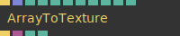

**Full Name:** `Ops.Gl.ArrayToTexture_v2`

create a texture from an array of number values.

**`\inputsymbol`{=latex} Inputs**

- **Update** (Trigger)
- **Array** (Array)
- **Width** (Number: Integer)
- **Height** (Number: Integer)
- **Fill Up** (Number: Boolean)
- **Flip** (Number: Boolean)
- **Pixel Format Index** (Number: Integer)
- **Wrap Index** (Number: Integer)

**`\outputsymbol`{=latex} Output**

- **Next** (Trigger)
- **Texture Out** (Object)
- **Tex Width** (Number)
- **Tex Height** (Number)

**Example Patch:** [cables.gl/edit/cOlh_C](https://cables.gl/edit/cOlh_C)

**Doc:** [cables.gl/op/Ops.Gl.ArrayToTexture_v2](https://cables.gl/op/Ops.Gl.ArrayToTexture_v2)

### BlendMode
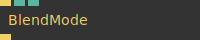

**Full Name:** `Ops.Gl.BlendMode`

change how colors are mixed (blending/mixing modes).

**`\inputsymbol`{=latex} Inputs**

- **Render** (Trigger)
- **Blendmode Index** (Number: Integer)
- **Premultiplied** (Number: Boolean)

**`\outputsymbol`{=latex} Output**

- **Next** (Trigger)

**Example Patch:** [cables.gl/edit/x1-Fvc](https://cables.gl/edit/x1-Fvc)

**Doc:** [cables.gl/op/Ops.Gl.BlendMode](https://cables.gl/op/Ops.Gl.BlendMode)

### CanvasFocus
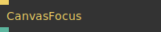

**Full Name:** `Ops.Gl.CanvasFocus`

is canvas focussed ?.

**`\inputsymbol`{=latex} Inputs**

- **Focus** (Trigger)

**`\outputsymbol`{=latex} Output**

- **Has Focus** (booleanNumber)

**Example Patch:** [cables.gl/edit/vGwM7f](https://cables.gl/edit/vGwM7f)

**Doc:** [cables.gl/op/Ops.Gl.CanvasFocus](https://cables.gl/op/Ops.Gl.CanvasFocus)

### CanvasInfo_v3
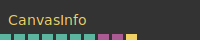

**Full Name:** `Ops.Gl.CanvasInfo_v3`

the size of the canvas in pixels, aspect ratio and pixel density.

**`\outputsymbol`{=latex} Output**

- **CSS Width** (Number)
- **CSS Height** (Number)
- **Pixel Ratio** (Number)
- **Pixel Width** (Number)
- **Pixel Height** (Number)
- **Aspect Ratio** (Number)
- **Landscape** (booleanNumber)
- **Canvas** (Object)
- **Canvas Parent** (Object)
- **Resized** (Trigger)

**Example Patch:** [cables.gl/edit/2yaD8i](https://cables.gl/edit/2yaD8i)

**Doc:** [cables.gl/op/Ops.Gl.CanvasInfo_v3](https://cables.gl/op/Ops.Gl.CanvasInfo_v3)

### CanvasToTexture
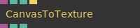

**Full Name:** `Ops.Gl.CanvasToTexture`

convert a canvas to texture.

**`\inputsymbol`{=latex} Inputs**

- **Canvas** (Object)
- **Filter Index** (Number: Integer)
- **Wrap Index** (Number: Integer)
- **Force Update** (Trigger)

**`\outputsymbol`{=latex} Output**

- **Texture** (Object)
- **Width** (Number)
- **Height** (Number)

**Example Patch:** [cables.gl/edit/QjlEo-](https://cables.gl/edit/QjlEo-)

**Doc:** [cables.gl/op/Ops.Gl.CanvasToTexture](https://cables.gl/op/Ops.Gl.CanvasToTexture)

### ClearColor


**Full Name:** `Ops.Gl.ClearColor`

sets all cleared pixels to one colour. Use to change the background colour.

**`\inputsymbol`{=latex} Inputs**

- **Render** (Trigger)
- **R** (Number)
- **G** (Number)
- **B** (Number)
- **A** (Number)

**`\outputsymbol`{=latex} Output**

- **Trigger** (Trigger)

**Example Patch:** [cables.gl/edit/_UEjvr](https://cables.gl/edit/_UEjvr)

**Doc:** [cables.gl/op/Ops.Gl.ClearColor](https://cables.gl/op/Ops.Gl.ClearColor)

### ClearDepth
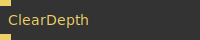

**Full Name:** `Ops.Gl.ClearDepth`

Clears the depth buffer (zbuffer, z buffer).

**`\inputsymbol`{=latex} Inputs**

- **Render** (Trigger)

**`\outputsymbol`{=latex} Output**

- **Trigger** (Trigger)

**Example Patch:** [cables.gl/edit/rEesag](https://cables.gl/edit/rEesag)

**Doc:** [cables.gl/op/Ops.Gl.ClearDepth](https://cables.gl/op/Ops.Gl.ClearDepth)

### ColorMask
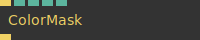

**Full Name:** `Ops.Gl.ColorMask`

enable/disable RGBA color channels of your entire scene.

**`\inputsymbol`{=latex} Inputs**

- **Execute** (Trigger)
- **Red** (Number: Boolean)
- **Green** (Number: Boolean)
- **Blue** (Number: Boolean)
- **Alpha** (Number: Boolean)

**`\outputsymbol`{=latex} Output**

- **Next** (Trigger)

**Example Patch:** [cables.gl/edit/MqQSR7](https://cables.gl/edit/MqQSR7)

**Doc:** [cables.gl/op/Ops.Gl.ColorMask](https://cables.gl/op/Ops.Gl.ColorMask)

### ColorPick
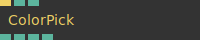

**Full Name:** `Ops.Gl.ColorPick`

pick a color at x,y coordinates of canvas.

**`\inputsymbol`{=latex} Inputs**

- **Render** (Trigger)
- **X** (Number)
- **Y** (Number)

**`\outputsymbol`{=latex} Output**

- **R** (Number)
- **G** (Number)
- **B** (Number)
- **A** (Number)

**Example Patch:** [cables.gl/edit/YEjkgg](https://cables.gl/edit/YEjkgg)

**Doc:** [cables.gl/op/Ops.Gl.ColorPick](https://cables.gl/op/Ops.Gl.ColorPick)

### DirectionalTranslate
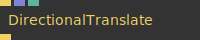

**Full Name:** `Ops.Gl.DirectionalTranslate`

translate away from a point in space.

**`\inputsymbol`{=latex} Inputs**

- **Exec** (Trigger)
- **Center Model Matrix** (Array)
- **Amount** (Number)

**`\outputsymbol`{=latex} Output**

- **Next** (Trigger)

**Example Patch:** [cables.gl/edit/5gL9On](https://cables.gl/edit/5gL9On)

**Doc:** [cables.gl/op/Ops.Gl.DirectionalTranslate](https://cables.gl/op/Ops.Gl.DirectionalTranslate)

### DownloadTexture_v3
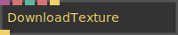

**Full Name:** `Ops.Gl.DownloadTexture_v3`

Download a texture as an image file.

**`\inputsymbol`{=latex} Inputs**

- **Texture** (Object:Texture)
- **Quality** (Number)
- **Filename** (String)
- **Download** (Trigger)

**`\outputsymbol`{=latex} Output**

- **Jcrmz8mnz** (Trigger)

**Example Patch:** [cables.gl/edit/15LaTs](https://cables.gl/edit/15LaTs)

**Doc:** [cables.gl/op/Ops.Gl.DownloadTexture_v3](https://cables.gl/op/Ops.Gl.DownloadTexture_v3)

### DrawTextureMapping
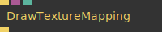

**Full Name:** `Ops.Gl.DrawTextureMapping`

draw texture mapping coordinates.

**`\inputsymbol`{=latex} Inputs**

- **Render** (Trigger)
- **Geometry** (Object:Geometry)
- **Num Points** (Number)

**`\outputsymbol`{=latex} Output**

- **Next** (Trigger)

**Example Patch:** [cables.gl/edit/Nu7dJ5](https://cables.gl/edit/Nu7dJ5)

**Doc:** [cables.gl/op/Ops.Gl.DrawTextureMapping](https://cables.gl/op/Ops.Gl.DrawTextureMapping)

### ElementInBrowserViewport
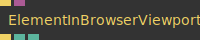

**Full Name:** `Ops.Gl.ElementInBrowserViewport`

check if webgl canvas element is in the current browser viewport.

**`\inputsymbol`{=latex} Inputs**

- **Update** (Trigger)
- **Element** (Object:Element)

**`\outputsymbol`{=latex} Output**

- **Next** (Trigger)
- **Fully Visible** (booleanNumber)
- **Partly Visible** (booleanNumber)

**Example Patch:** [cables.gl/op/Ops.Gl.ElementInBrowserViewport#example](https://cables.gl/op/Ops.Gl.ElementInBrowserViewport#example)

**Doc:** [cables.gl/op/Ops.Gl.ElementInBrowserViewport](https://cables.gl/op/Ops.Gl.ElementInBrowserViewport)

### ExternalCanvas
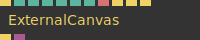

**Full Name:** `Ops.Gl.ExternalCanvas`

Open a new window that shows a copy of the patch canvas.

**`\inputsymbol`{=latex} Inputs**

- **Update** (Trigger)
- **Pos X** (Number: Integer)
- **Pos Y** (Number: Integer)
- **Width** (Number: Integer)
- **Height** (Number: Integer)
- **Smoothing** (Number: Boolean)
- **Stretch** (Number: Boolean)
- **Title** (String)
- **Open Window** (Trigger)
- **Fullscreen** (Trigger)
- **Close** (Trigger)

**`\outputsymbol`{=latex} Output**

- **Next** (Trigger)
- **Element** (Object)

**Example Patch:** [cables.gl/edit/HnG3fB](https://cables.gl/edit/HnG3fB)

**Doc:** [cables.gl/op/Ops.Gl.ExternalCanvas](https://cables.gl/op/Ops.Gl.ExternalCanvas)

### FaceCulling_v2
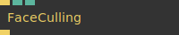

**Full Name:** `Ops.Gl.FaceCulling_v2`

Disable the rendering of front or back facing triangles with culling.

**`\inputsymbol`{=latex} Inputs**

- **Render** (Trigger)
- **Active** (Number: Boolean)

**`\outputsymbol`{=latex} Output**

- **Trigger** (Trigger)

**Example Patch:** [cables.gl/edit/mPwnD-](https://cables.gl/edit/mPwnD-)

**Doc:** [cables.gl/op/Ops.Gl.FaceCulling_v2](https://cables.gl/op/Ops.Gl.FaceCulling_v2)

### FontMSDF_v2
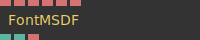

**Full Name:** `Ops.Gl.FontMSDF_v2`

Load MSDF Font data and texture to use.

**`\inputsymbol`{=latex} Inputs**

- **Font Name** (String)
- **Font Data** (String)
- **Font Image** (String)
- **Font Image 1** (String)
- **Font Image 2** (String)
- **Font Image 3** (String)

**`\outputsymbol`{=latex} Output**

- **Loaded** (booleanNumber)
- **Total Chars** (Number)
- **Chars** (String)

**Example Patch:** [cables.gl/edit/9COr26](https://cables.gl/edit/9COr26)

**Doc:** [cables.gl/op/Ops.Gl.FontMSDF_v2](https://cables.gl/op/Ops.Gl.FontMSDF_v2)

### ForceCanvasSize
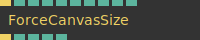

**Full Name:** `Ops.Gl.ForceCanvasSize`

Resize canvas element to a specific pixel size or aspect ratio.

**`\inputsymbol`{=latex} Inputs**

- **Trigger** (Trigger)
- **Active** (Number: Boolean)
- **Center In Parent** (Number: Boolean)
- **Scale To Fit Parent** (Number: Boolean)
- **Set Width** (Number: Integer)
- **Set Height** (Number: Integer)
- **Aspect Ratio Index** (Number: Integer)
- **Ratio** (Number)
- **Fill Parent Index** (Number: Integer)

**`\outputsymbol`{=latex} Output**

- **Next** (Trigger)
- **Width** (Number)
- **Height** (Number)
- **Margin Left** (Number)
- **Margin Top** (Number)

**Example Patch:** [cables.gl/edit/f9UbD-](https://cables.gl/edit/f9UbD-)

**Doc:** [cables.gl/op/Ops.Gl.ForceCanvasSize](https://cables.gl/op/Ops.Gl.ForceCanvasSize)

### GateTexture
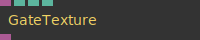

**Full Name:** `Ops.Gl.GateTexture`

Will only allow an Object to to be output if the the pass through parameter evaluates to true.

**`\inputsymbol`{=latex} Inputs**

- **Object In** (Object:Texture)
- **Pass Through** (Number: Boolean)
- **Only Valid Textures** (Number: Boolean)

**`\outputsymbol`{=latex} Output**

- **Object Out** (Object)

**Example Patch:** [cables.gl/op/Ops.Gl.GateTexture#example](https://cables.gl/op/Ops.Gl.GateTexture#example)

**Doc:** [cables.gl/op/Ops.Gl.GateTexture](https://cables.gl/op/Ops.Gl.GateTexture)

### GlBlendFunc
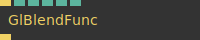

**Full Name:** `Ops.Gl.GlBlendFunc`

set gl blendmodes directly.

**`\inputsymbol`{=latex} Inputs**

- **Exec** (Trigger)
- **Src RGB Index** (Number: Integer)
- **Dst RGB Index** (Number: Integer)
- **Src Alpha Index** (Number: Integer)
- **Dst Alpha Index** (Number: Integer)
- **Blend Equation Index** (Number: Integer)

**`\outputsymbol`{=latex} Output**

- **Next** (Trigger)

**Example Patch:** [cables.gl/edit/24qZz7](https://cables.gl/edit/24qZz7)

**Doc:** [cables.gl/op/Ops.Gl.GlBlendFunc](https://cables.gl/op/Ops.Gl.GlBlendFunc)

### GlInfo_v2
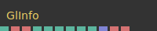

**Full Name:** `Ops.Gl.GlInfo_v2`

information about the webgl context.

**`\outputsymbol`{=latex} Output**

- **WebGl Version Short** (Number)
- **WebGl Version** (String)
- **GLSL Version** (String)
- **Max Frag Uniforms** (Number)
- **Max Vert Uniforms** (Number)
- **Max Texture Size** (Number)
- **Max Texture Units** (Number)
- **Max Varying Vectors** (Number)
- **Max MSAA Samples** (Number)
- **Extensions** (Array)
- **Vendor** (String)
- **Renderer** (String)

**Example Patch:** [cables.gl/edit/0zHu8i](https://cables.gl/edit/0zHu8i)

**Doc:** [cables.gl/op/Ops.Gl.GlInfo_v2](https://cables.gl/op/Ops.Gl.GlInfo_v2)

### GlPrimitive
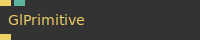

**Full Name:** `Ops.Gl.GlPrimitive`

force rendering of meshes using points,lines or triangles.

**`\inputsymbol`{=latex} Inputs**

- **Execute** (Trigger)
- **Primitive Index** (Number: Integer)

**`\outputsymbol`{=latex} Output**

- **Next** (Trigger)

**Example Patch:** [cables.gl/edit/a5Mz8i](https://cables.gl/edit/a5Mz8i)

**Doc:** [cables.gl/op/Ops.Gl.GlPrimitive](https://cables.gl/op/Ops.Gl.GlPrimitive)

### GradientTexture
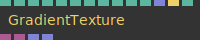

**Full Name:** `Ops.Gl.GradientTexture`

texture containing a colour gradient that can be altered with an editor.

**`\inputsymbol`{=latex} Inputs**

- **Gradient** (Number)
- **Direction Index** (Number: Integer)
- **Smoothstep** (Number: Boolean)
- **Step** (Number: Boolean)
- **Flip** (Number: Boolean)
- **SRGB** (Number: Boolean)
- **Oklab** (Number: Boolean)
- **Size** (Number: Integer)
- **Wrap Index** (Number: Integer)
- **Dither** (Number)
- **Gradient Array** (Array)
- **Randomize Colors** (Trigger)

**`\outputsymbol`{=latex} Output**

- **Texture** (Object)
- **Alpha Mask** (Object)
- **Colors** (Array)
- **Colors Pos** (Array)

**Example Patch:** [cables.gl/edit/_wQNDW](https://cables.gl/edit/_wQNDW)

**Doc:** [cables.gl/op/Ops.Gl.GradientTexture](https://cables.gl/op/Ops.Gl.GradientTexture)

### GridTransform
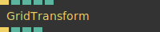

**Full Name:** `Ops.Gl.GridTransform`

transform and arrange elements into a grid.

**`\inputsymbol`{=latex} Inputs**

- **Render** (Trigger)
- **Num X** (Number: Integer)
- **Num Y** (Number: Integer)
- **Space X** (Number)
- **Space Y** (Number)

**`\outputsymbol`{=latex} Output**

- **Next** (Trigger)
- **Index** (Number)
- **X Index** (Number)
- **Y Index** (Number)

**Example Patch:** [cables.gl/edit/J-XMNQ](https://cables.gl/edit/J-XMNQ)

**Doc:** [cables.gl/op/Ops.Gl.GridTransform](https://cables.gl/op/Ops.Gl.GridTransform)

### Identity
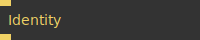

**Full Name:** `Ops.Gl.Identity`

reset all transforms (modelmatrix).

**`\inputsymbol`{=latex} Inputs**

- **Exe** (Trigger)

**`\outputsymbol`{=latex} Output**

- **Trigger** (Trigger)

**Example Patch:** [cables.gl/edit/KUVJ8i](https://cables.gl/edit/KUVJ8i)

**Doc:** [cables.gl/op/Ops.Gl.Identity](https://cables.gl/op/Ops.Gl.Identity)

### IdentityViewMatrix
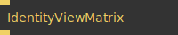

**Full Name:** `Ops.Gl.IdentityViewMatrix`

reset the view matrix (cameras etc.).

**`\inputsymbol`{=latex} Inputs**

- **Exe** (Trigger)

**`\outputsymbol`{=latex} Output**

- **Trigger** (Trigger)

**Example Patch:** [cables.gl/edit/H01Ici](https://cables.gl/edit/H01Ici)

**Doc:** [cables.gl/op/Ops.Gl.IdentityViewMatrix](https://cables.gl/op/Ops.Gl.IdentityViewMatrix)

### ImageSequenceAnim_v2


**Full Name:** `Ops.Gl.ImageSequenceAnim_v2`

play a image sprite animation.

**`\inputsymbol`{=latex} Inputs**

- **Time** (Number)
- **FPS** (Number)
- **Num X** (Number)
- **Num Y** (Number)
- **Max Frames** (Number: Integer)
- **Flip Y** (Number: Boolean)

**`\outputsymbol`{=latex} Output**

- **Repeat X** (Number)
- **Repeat Y** (Number)
- **Offset X** (Number)
- **Offset Y** (Number)
- **Frame** (Number)
- **Progress** (Number)

**Example Patch:** [cables.gl/edit/n0iMSq](https://cables.gl/edit/n0iMSq)

**Doc:** [cables.gl/op/Ops.Gl.ImageSequenceAnim_v2](https://cables.gl/op/Ops.Gl.ImageSequenceAnim_v2)

### InteractiveRectangle_v2
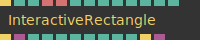

**Full Name:** `Ops.Gl.InteractiveRectangle_v2`

An area which is interactive.

**`\inputsymbol`{=latex} Inputs**

- **Trigger In** (Trigger)
- **Width** (Number)
- **Height** (Number)
- **ID** (String)
- **Class** (String)
- **Pivot X Index** (Number: Integer)
- **Pivot Y Index** (Number: Integer)
- **Axis Index** (Number: Integer)
- **Is Interactive** (Number: Boolean)
- **Render Rectangle** (Number: Boolean)
- **Show Boundings** (Number: Boolean)
- **Cursor Index** (Number: Integer)
- **Active** (Number: Boolean)

**`\outputsymbol`{=latex} Output**

- **Trigger Out** (Trigger)
- **Geometry** (Object)
- **Pointer Hover** (booleanNumber)
- **Pointer Down** (booleanNumber)
- **Pointer X** (Number)
- **Pointer Y** (Number)
- **Top** (Number)
- **Left** (Number)
- **Right** (Number)
- **Bottom** (Number)
- **Left Click** (Trigger)
- **Dom Element** (Object)

**Example Patch:** [cables.gl/edit/P_SED0](https://cables.gl/edit/P_SED0)

**Doc:** [cables.gl/op/Ops.Gl.InteractiveRectangle_v2](https://cables.gl/op/Ops.Gl.InteractiveRectangle_v2)

### LayerSequence
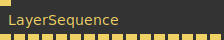

**Full Name:** `Ops.Gl.LayerSequence`

Render Multiple Layers in a specific order.

**`\inputsymbol`{=latex} Inputs**

- **Exe** (Trigger)

**`\outputsymbol`{=latex} Output**

- **Trigger 0** (Trigger)
- **Trigger 1** (Trigger)
- **Trigger 2** (Trigger)
- **Trigger 3** (Trigger)
- **Trigger 4** (Trigger)
- **Trigger 5** (Trigger)
- **Trigger 6** (Trigger)
- **Trigger 7** (Trigger)
- **Trigger 8** (Trigger)
- **Trigger 9** (Trigger)
- **Trigger 10** (Trigger)
- **Trigger 11** (Trigger)
- **Trigger 12** (Trigger)
- **Trigger 13** (Trigger)
- **Trigger 14** (Trigger)
- **Trigger 15** (Trigger)

**Example Patch:** [cables.gl/edit/VH4Oxj](https://cables.gl/edit/VH4Oxj)

**Doc:** [cables.gl/op/Ops.Gl.LayerSequence](https://cables.gl/op/Ops.Gl.LayerSequence)

### LineFont_v2
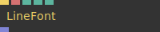

**Full Name:** `Ops.Gl.LineFont_v2`

A Simple way to write text on the screen.

**`\inputsymbol`{=latex} Inputs**

- **Render** (Trigger)
- **Text** (String)
- **Letter Spacing** (Number)

**`\outputsymbol`{=latex} Output**

- **Lines** (Array)

**Example Patch:** [cables.gl/edit/1JzPLu](https://cables.gl/edit/1JzPLu)

**Doc:** [cables.gl/op/Ops.Gl.LineFont_v2](https://cables.gl/op/Ops.Gl.LineFont_v2)

### MainLoop_v2
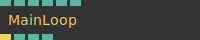

**Full Name:** `Ops.Gl.MainLoop_v2`

Trigger other ops once every frame to create smooth animations.

**`\inputsymbol`{=latex} Inputs**

- **FPS Limit** (Number)
- **Reduce FPS Unfocussed** (Number: Boolean)
- **Transparent** (Number: Boolean)
- **Active** (Number: Boolean)
- **Focus Canvas** (Number: Boolean)

**`\outputsymbol`{=latex} Output**

- **Trigger** (Trigger)
- **Width** (Number)
- **Height** (Number)
- **Pixel Density** (Number)

**Example Patch:** [cables.gl/edit/uZxfQc](https://cables.gl/edit/uZxfQc)

**Doc:** [cables.gl/op/Ops.Gl.MainLoop_v2](https://cables.gl/op/Ops.Gl.MainLoop_v2)

### MediaRecorder_v2
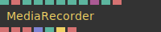

**Full Name:** `Ops.Gl.MediaRecorder_v2`

Record the renderer-output to video.

**`\inputsymbol`{=latex} Inputs**

- **Recording** (Number: Boolean)
- **Filename** (String)
- **Download Video** (Number: Boolean)
- **Mimetype Index** (Number: Integer)
- **MBit** (Number)
- **Max FPS** (Number)
- **Force FPS** (Number)
- **Audio In** (Object:AudioNode)
- **Video Canvas Id** (String)

**`\outputsymbol`{=latex} Output**

- **State** (String)
- **Error** (String)
- **Final Mimetype** (String)
- **Valid Mimetypes** (Array)
- **Duration** (Number)
- **Finished Recording** (Trigger)
- **Video DataUrl** (String)

**Example Patch:** [cables.gl/edit/ioiDIR](https://cables.gl/edit/ioiDIR)

**Doc:** [cables.gl/op/Ops.Gl.MediaRecorder_v2](https://cables.gl/op/Ops.Gl.MediaRecorder_v2)

### MeshInstancer_v4
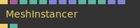

**Full Name:** `Ops.Gl.MeshInstancer_v4`

Draw the same mesh multiple times on the GPU.

**`\inputsymbol`{=latex} Inputs**

- **Exe** (Trigger)
- **Geom** (Object:Geometry)
- **Scale** (Number)
- **Limit Instances** (Number: Boolean)
- **Limit** (Number: Integer)
- **Positions** (Array)
- **Scale Array** (Array)
- **Rotations** (Array)
- **Colors** (Array)
- **TexCoords** (Array)

**`\outputsymbol`{=latex} Output**

- **Trigger Out** (Trigger)
- **Num** (Number)

**Example Patch:** [cables.gl/edit/oOsjJ5](https://cables.gl/edit/oOsjJ5)

**Doc:** [cables.gl/op/Ops.Gl.MeshInstancer_v4](https://cables.gl/op/Ops.Gl.MeshInstancer_v4)

### MeshMorph
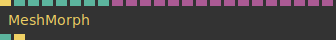

**Full Name:** `Ops.Gl.MeshMorph`

morph from one geometry to another.

**`\inputsymbol`{=latex} Inputs**

- **Render** (Trigger)
- **Geometry** (Number: Integer)
- **Duration** (Number)
- **Index** (Number)
- **Index 2** (Number)
- **Fade** (Number)
- **Easing Index** (Number: Integer)
- **Geometry 0** (Object)
- **Geometry 1** (Object)
- **Geometry 2** (Object)
- **Geometry 3** (Object)
- **Geometry 4** (Object)
- **Geometry 5** (Object)
- **Geometry 6** (Object)
- **Geometry 7** (Object)
- **Geometry 8** (Object)
- **Geometry 9** (Object)
- **Geometry 10** (Object)
- **Geometry 11** (Object)
- **Geometry 12** (Object)
- **Geometry 13** (Object)
- **Geometry 14** (Object)
- **Geometry 15** (Object)

**`\outputsymbol`{=latex} Output**

- **Finished** (booleanNumber)
- **Trigger** (Trigger)

**Example Patch:** [cables.gl/edit/PdhglN](https://cables.gl/edit/PdhglN)

**Doc:** [cables.gl/op/Ops.Gl.MeshMorph](https://cables.gl/op/Ops.Gl.MeshMorph)

### NormalizeScreenCoordinates
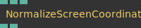

**Full Name:** `Ops.Gl.NormalizeScreenCoordinates`

convert screen pixel coordinates to range 0-1.

**`\inputsymbol`{=latex} Inputs**

- **X** (Number)
- **Y** (Number)

**`\outputsymbol`{=latex} Output**

- **Result X** (Number)
- **Result Y** (Number)

**Example Patch:** [cables.gl/op/Ops.Gl.NormalizeScreenCoordinates#example](https://cables.gl/op/Ops.Gl.NormalizeScreenCoordinates#example)

**Doc:** [cables.gl/op/Ops.Gl.NormalizeScreenCoordinates](https://cables.gl/op/Ops.Gl.NormalizeScreenCoordinates)

### OrTexture
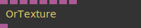

**Full Name:** `Ops.Gl.OrTexture`

outputs the first valid texture of the.

**`\inputsymbol`{=latex} Inputs**

- **Texture 1** (Object:Texture)
- **Texture 2** (Object:Texture)
- **Texture 3** (Object:Texture)
- **Texture 4** (Object:Texture)
- **Texture 5** (Object:Texture)
- **Texture 6** (Object:Texture)
- **Texture 7** (Object:Texture)
- **Texture 8** (Object:Texture)

**`\outputsymbol`{=latex} Output**

- **Result** (Object)

**Example Patch:** [cables.gl/edit/oKRY7i](https://cables.gl/edit/oKRY7i)

**Doc:** [cables.gl/op/Ops.Gl.OrTexture](https://cables.gl/op/Ops.Gl.OrTexture)

### Orthogonal_v2
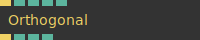

**Full Name:** `Ops.Gl.Orthogonal_v2`

Orthogonal projection / objects in distance don't appear smaller (isometric).

**`\inputsymbol`{=latex} Inputs**

- **Render** (Trigger)
- **Bounds** (Number)
- **Axis Index** (Number: Integer)
- **Frustum Near** (Number)
- **Frustum Far** (Number)

**`\outputsymbol`{=latex} Output**

- **Trigger** (Trigger)
- **Ratio** (Number)
- **Width** (Number)
- **Height** (Number)

**Example Patch:** [cables.gl/edit/94Aycg](https://cables.gl/edit/94Aycg)

**Doc:** [cables.gl/op/Ops.Gl.Orthogonal_v2](https://cables.gl/op/Ops.Gl.Orthogonal_v2)

### OverwriteViewportSize
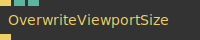

**Full Name:** `Ops.Gl.OverwriteViewportSize`

Force a manually set viewport size for connected ops.

**`\inputsymbol`{=latex} Inputs**

- **Exec** (Trigger)
- **Width** (Number: Integer)
- **Height** (Number: Integer)

**`\outputsymbol`{=latex} Output**

- **Next** (Trigger)

**Example Patch:** [cables.gl/op/Ops.Gl.OverwriteViewportSize#example](https://cables.gl/op/Ops.Gl.OverwriteViewportSize#example)

**Doc:** [cables.gl/op/Ops.Gl.OverwriteViewportSize](https://cables.gl/op/Ops.Gl.OverwriteViewportSize)

### Performance
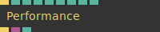

**Full Name:** `Ops.Gl.Performance`

Show WebGl Performance Statistics.

**`\inputsymbol`{=latex} Inputs**

- **Exe** (Trigger)
- **Active** (Number: Boolean)
- **Visible** (Number: Boolean)
- **Measure GPU** (Number: Boolean)
- **Open** (Number: Boolean)
- **Smooth Graph** (Number: Boolean)
- **Scale** (Number)
- **Size** (Number)

**`\outputsymbol`{=latex} Output**

- **Childs** (Trigger)
- **Canvas** (Object)
- **FPS** (Number)

**Example Patch:** [cables.gl/edit/zFR8z5](https://cables.gl/edit/zFR8z5)

**Doc:** [cables.gl/op/Ops.Gl.Performance](https://cables.gl/op/Ops.Gl.Performance)

### PerformanceMeasure
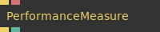

**Full Name:** `Ops.Gl.PerformanceMeasure`

Measure the time used to execute all child ops.

**`\inputsymbol`{=latex} Inputs**

- **Execute** (Trigger)
- **Name** (String)

**`\outputsymbol`{=latex} Output**

- **Childs** (Trigger)
- **Time Used** (Number)

**Example Patch:** [cables.gl/op/Ops.Gl.PerformanceMeasure#example](https://cables.gl/op/Ops.Gl.PerformanceMeasure#example)

**Doc:** [cables.gl/op/Ops.Gl.PerformanceMeasure](https://cables.gl/op/Ops.Gl.PerformanceMeasure)

### Perspective


**Full Name:** `Ops.Gl.Perspective`

Adjust FOV, field of view, and frustum clipping.

**`\inputsymbol`{=latex} Inputs**

- **Render** (Trigger)
- **FOV Degrees** (Number)
- **Frustum Near** (Number)
- **Frustum Far** (Number)
- **Auto Aspect Ratio** (Number: Boolean)
- **Aspect Ratio** (Number)

**`\outputsymbol`{=latex} Output**

- **Trigger** (Trigger)
- **Aspect** (Number)

**Example Patch:** [cables.gl/edit/RJXV7i](https://cables.gl/edit/RJXV7i)

**Doc:** [cables.gl/op/Ops.Gl.Perspective](https://cables.gl/op/Ops.Gl.Perspective)

### PixelProjection_v3


**Full Name:** `Ops.Gl.PixelProjection_v3`

Remaps world co-ordinates to a pixel co-ordinate system.

**`\inputsymbol`{=latex} Inputs**

- **Render** (Trigger)
- **Width** (Number)
- **Height** (Number)
- **Frustum Near** (Number)
- **Frustum Far** (Number)
- **Flip X** (Number: Boolean)
- **Flip Y** (Number: Boolean)
- **Zero Y** (Number: Boolean)

**`\outputsymbol`{=latex} Output**

- **Trigger** (Trigger)
- **Size Width** (Number)
- **Size Height** (Number)

**Example Patch:** [cables.gl/edit/fsOPNS](https://cables.gl/edit/fsOPNS)

**Doc:** [cables.gl/op/Ops.Gl.PixelProjection_v3](https://cables.gl/op/Ops.Gl.PixelProjection_v3)

### PointCollector
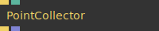

**Full Name:** `Ops.Gl.PointCollector`

save points/coordinates in an array.

**`\inputsymbol`{=latex} Inputs**

- **Render** (Trigger)
- **Absolute** (Number: Boolean)

**`\outputsymbol`{=latex} Output**

- **Trigger** (Trigger)
- **Points** (Array)

**Example Patch:** [cables.gl/op/Ops.Gl.PointCollector#example](https://cables.gl/op/Ops.Gl.PointCollector#example)

**Doc:** [cables.gl/op/Ops.Gl.PointCollector](https://cables.gl/op/Ops.Gl.PointCollector)

### PointCollectorCollect
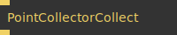

**Full Name:** `Ops.Gl.PointCollectorCollect`

collect world space coordinates into an array.

**`\inputsymbol`{=latex} Inputs**

- **Render** (Trigger)

**`\outputsymbol`{=latex} Output**

- **Trigger** (Trigger)

**Example Patch:** [cables.gl/op/Ops.Gl.PointCollectorCollect#example](https://cables.gl/op/Ops.Gl.PointCollectorCollect#example)

**Doc:** [cables.gl/op/Ops.Gl.PointCollectorCollect](https://cables.gl/op/Ops.Gl.PointCollectorCollect)

### PointCollectorScreenCoords
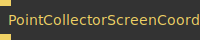

**Full Name:** `Ops.Gl.PointCollectorScreenCoords`

collect screen pixel coordinates into an array.

**`\inputsymbol`{=latex} Inputs**

- **Render** (Trigger)

**`\outputsymbol`{=latex} Output**

- **Trigger** (Trigger)

**Example Patch:** [cables.gl/op/Ops.Gl.PointCollectorScreenCoords#example](https://cables.gl/op/Ops.Gl.PointCollectorScreenCoords#example)

**Doc:** [cables.gl/op/Ops.Gl.PointCollectorScreenCoords](https://cables.gl/op/Ops.Gl.PointCollectorScreenCoords)

### RandomCluster
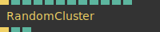

**Full Name:** `Ops.Gl.RandomCluster`

Transforms objects randomly in space.

**`\inputsymbol`{=latex} Inputs**

- **Exe** (Trigger)
- **Num** (Number: Integer)
- **Random Seed** (Number)
- **Round** (Number: Boolean)
- **Size** (Number)
- **ScaleX** (Number)
- **ScaleY** (Number)
- **ScaleZ** (Number)
- **Rotate X** (Number)
- **Rotate Y** (Number)
- **Rotate Z** (Number)
- **Scroll X** (Number)

**`\outputsymbol`{=latex} Output**

- **Trigger** (Trigger)
- **Index** (Number)
- **Rnd** (Number)

**Example Patch:** [cables.gl/edit/Ah6Rj6](https://cables.gl/edit/Ah6Rj6)

**Doc:** [cables.gl/op/Ops.Gl.RandomCluster](https://cables.gl/op/Ops.Gl.RandomCluster)

### RenderAnim_v2
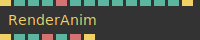

**Full Name:** `Ops.Gl.RenderAnim_v2`

record, render an animation and save as webm video file or png image sequence.

**`\inputsymbol`{=latex} Inputs**

- **Render** (Trigger)
- **File Type Index** (Number: Integer)
- **ZIP Multiple Files** (Number: Boolean)
- **Download Files** (Number: Boolean)
- **Filename** (String)
- **Quality** (Number)
- **Duration** (Number: Integer)
- **FPS** (Number: Integer)
- **Transparency** (Number: Boolean)
- **Use Canvas Size** (Number: Boolean)
- **Texture Width** (Number: Integer)
- **Texture Height** (Number: Integer)
- **Start** (Trigger)

**`\outputsymbol`{=latex} Output**

- **Next** (Trigger)
- **Progress** (Number)
- **Frame** (Number)
- **Status** (String)
- **Started** (booleanNumber)
- **Data URL** (String)
- **Finished** (Trigger)

**Example Patch:** [cables.gl/edit/bQhm8i](https://cables.gl/edit/bQhm8i)

**Doc:** [cables.gl/op/Ops.Gl.RenderAnim_v2](https://cables.gl/op/Ops.Gl.RenderAnim_v2)

### RenderGeometry_v2
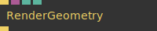

**Full Name:** `Ops.Gl.RenderGeometry_v2`

Render a geometry as mesh.

**`\inputsymbol`{=latex} Inputs**

- **Render** (Trigger)
- **Geometry** (Object:Geometry)
- **Add Vertex Numbers** (Number: Boolean)
- **Render Mesh** (Number: Boolean)

**`\outputsymbol`{=latex} Output**

- **Trigger** (Trigger)

**Example Patch:** [cables.gl/edit/w6QYlH](https://cables.gl/edit/w6QYlH)

**Doc:** [cables.gl/op/Ops.Gl.RenderGeometry_v2](https://cables.gl/op/Ops.Gl.RenderGeometry_v2)

### RenderToTexture_v3


**Full Name:** `Ops.Gl.RenderToTexture_v3`

Render into an Image.

**`\inputsymbol`{=latex} Inputs**

- **Render** (Trigger)
- **Texture Width** (Number: Integer)
- **Texture Height** (Number: Integer)
- **Auto Aspect** (Number: Boolean)
- **Pixel Format Index** (Number: Integer)
- **Depth** (Number: Boolean)
- **Clear** (Number: Boolean)

**`\outputsymbol`{=latex} Output**

- **Trigger** (Trigger)
- **Texture** (Object)
- **TextureDepth** (Object)

**Example Patch:** [cables.gl/edit/G2_my7](https://cables.gl/edit/G2_my7)

**Doc:** [cables.gl/op/Ops.Gl.RenderToTexture_v3](https://cables.gl/op/Ops.Gl.RenderToTexture_v3)

### RenderToTextures_v3
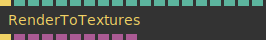

**Full Name:** `Ops.Gl.RenderToTextures_v3`

render to multiple textures at the same time.

**`\inputsymbol`{=latex} Inputs**

- **Render** (Trigger)
- **Texture Width** (Number: Integer)
- **Texture Height** (Number: Integer)
- **Auto Aspect** (Number: Boolean)
- **Pixel Format Index** (Number: Integer)
- **Wrap Index** (Number: Integer)
- **Clear** (Number: Boolean)
- **Texture 0 Index** (Number: Integer)
- **Texture 1 Index** (Number: Integer)
- **Texture 2 Index** (Number: Integer)
- **Texture 3 Index** (Number: Integer)
- **Texture 4 Index** (Number: Integer)
- **Texture 5 Index** (Number: Integer)
- **Texture 6 Index** (Number: Integer)
- **Texture 7 Index** (Number: Integer)

**`\outputsymbol`{=latex} Output**

- **Next** (Trigger)
- **Result Texture 0** (Object)
- **Result Texture 1** (Object)
- **Result Texture 2** (Object)
- **Result Texture 3** (Object)
- **Result Texture 4** (Object)
- **Result Texture 5** (Object)
- **Result Texture 6** (Object)
- **Result Texture 7** (Object)
- **TextureDepth** (Object)

**Example Patch:** [cables.gl/edit/muH2jG](https://cables.gl/edit/muH2jG)

**Doc:** [cables.gl/op/Ops.Gl.RenderToTextures_v3](https://cables.gl/op/Ops.Gl.RenderToTextures_v3)

### ResetTransform
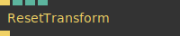

**Full Name:** `Ops.Gl.ResetTransform`

reset current transforms to initial value (identity).

**`\inputsymbol`{=latex} Inputs**

- **Exe** (Trigger)
- **Reset Model Transform** (Number: Boolean)
- **Reset View Transform** (Number: Boolean)
- **Default View** (Number: Boolean)

**`\outputsymbol`{=latex} Output**

- **Trigger** (Trigger)

**Example Patch:** [cables.gl/edit/kY3J8i](https://cables.gl/edit/kY3J8i)

**Doc:** [cables.gl/op/Ops.Gl.ResetTransform](https://cables.gl/op/Ops.Gl.ResetTransform)

### SaveScreenShot_v3


**Full Name:** `Ops.Gl.SaveScreenShot_v3`

Download the current screen content as png file.

**`\inputsymbol`{=latex} Inputs**

- **Filename** (String)
- **Use Canvas Size** (Number: Boolean)
- **Screenshot** (Trigger)
- **Width** (Number: Integer)
- **Height** (Number: Integer)

**`\outputsymbol`{=latex} Output**

- **Finished** (Trigger)

**Example Patch:** [cables.gl/edit/OB0Qmi](https://cables.gl/edit/OB0Qmi)

**Doc:** [cables.gl/op/Ops.Gl.SaveScreenShot_v3](https://cables.gl/op/Ops.Gl.SaveScreenShot_v3)

### ShowNormals_v2
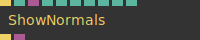

**Full Name:** `Ops.Gl.ShowNormals_v2`

visualize normals, tangents or bitangents.

**`\inputsymbol`{=latex} Inputs**

- **Render** (Trigger)
- **Draw** (Number: Boolean)
- **Geometry** (Object:Geometry)
- **Length** (Number)
- **Colorize** (Number: Boolean)
- **R** (Number)
- **G** (Number)
- **B** (Number)
- **A** (Number)

**`\outputsymbol`{=latex} Output**

- **Trigger** (Trigger)
- **Line Geom** (Object)

**Example Patch:** [cables.gl/edit/4NeG02](https://cables.gl/edit/4NeG02)

**Doc:** [cables.gl/op/Ops.Gl.ShowNormals_v2](https://cables.gl/op/Ops.Gl.ShowNormals_v2)

### SurfaceScatter_v2
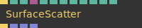

**Full Name:** `Ops.Gl.SurfaceScatter_v2`

Scatter an object on the surface of a mesh with different distribution methods.

**`\inputsymbol`{=latex} Inputs**

- **Render** (Trigger)
- **Draw** (Number: Boolean)
- **Num** (Number: Integer)
- **Geom Surface** (Object)
- **Distribution Index** (Number: Integer)
- **Selection Index** (Number: Integer)
- **Random Seed** (Number)
- **Size Min** (Number)
- **Size Max** (Number)
- **Limit** (Number: Boolean)
- **Limit Num** (Number: Integer)
- **Random Rotate** (Number: Boolean)

**`\outputsymbol`{=latex} Output**

- **Next** (Trigger)
- **Positions** (Array)
- **Scale** (Array)
- **Quaternions** (Array)

**Example Patch:** [cables.gl/edit/cfUzre](https://cables.gl/edit/cfUzre)

**Doc:** [cables.gl/op/Ops.Gl.SurfaceScatter_v2](https://cables.gl/op/Ops.Gl.SurfaceScatter_v2)

### TextMeshMSDF_v2
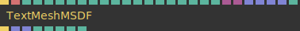

**Full Name:** `Ops.Gl.TextMeshMSDF_v2`

draw text using the FontMSDF operator.

**`\inputsymbol`{=latex} Inputs**

- **Render** (Trigger)
- **Text** (String)
- **Scale** (Number)
- **Letter Spacing** (Number)
- **Line Height** (Number)
- **R** (Number)
- **G** (Number)
- **B** (Number)
- **A** (Number)
- **SDF** (Number: Boolean)
- **Smoothing** (Number)
- **Border** (Number: Boolean)
- **Border Width** (Number)
- **Smoothness** (Number)
- **Border R** (Number)
- **Border G** (Number)
- **Border B** (Number)
- **Shadow** (Number: Boolean)
- **Texture Color** (Object:Texture)
- **Texture Mask** (Object:Texture)
- **Positions** (Array)
- **Scalings** (Array)
- **Rotations** (Array)
- **Colors** (Array)
- **Premultiply** (Number: Boolean)

**`\outputsymbol`{=latex} Output**

- **Next** (Trigger)
- **Positions Original** (Array)
- **Scales** (Array)
- **Num Lines** (Number)
- **Width** (Number)
- **Height** (Number)
- **Start Y** (Number)
- **Num Chars** (Number)

**Example Patch:** [cables.gl/edit/9COr26](https://cables.gl/edit/9COr26)

**Doc:** [cables.gl/op/Ops.Gl.TextMeshMSDF_v2](https://cables.gl/op/Ops.Gl.TextMeshMSDF_v2)

### Texture_v2
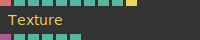

**Full Name:** `Ops.Gl.Texture_v2`

Load an image as a texture.

**`\inputsymbol`{=latex} Inputs**

- **File** (String)
- **Wrap Index** (Number: Integer)
- **Flip** (Number: Boolean)
- **Active** (Number: Boolean)
- **Save Memory** (Number: Boolean)
- **Add Cachebuster** (Number: Boolean)
- **Reload** (Trigger)

**`\outputsymbol`{=latex} Output**

- **Texture** (Object)
- **Width** (Number)
- **Height** (Number)
- **Aspect Ratio** (Number)
- **Loaded** (booleanNumber)
- **Loading** (booleanNumber)

**Example Patch:** [cables.gl/edit/iRKrD-](https://cables.gl/edit/iRKrD-)

**Doc:** [cables.gl/op/Ops.Gl.Texture_v2](https://cables.gl/op/Ops.Gl.Texture_v2)

### TextureArray
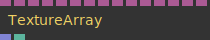

**Full Name:** `Ops.Gl.TextureArray`

create an array of textures.

**`\inputsymbol`{=latex} Inputs**

- **Texture 0** (Object:Texture)
- **Texture 1** (Object:Texture)
- **Texture 2** (Object:Texture)
- **Texture 3** (Object:Texture)
- **Texture 4** (Object:Texture)
- **Texture 5** (Object:Texture)
- **Texture 6** (Object:Texture)
- **Texture 7** (Object:Texture)
- **Texture 8** (Object:Texture)
- **Texture 9** (Object:Texture)
- **Texture 10** (Object:Texture)
- **Texture 11** (Object:Texture)
- **Texture 12** (Object:Texture)
- **Texture 13** (Object:Texture)
- **Texture 14** (Object:Texture)

**`\outputsymbol`{=latex} Output**

- **Array** (Array)
- **Count** (Number)

**Example Patch:** [cables.gl/edit/vS5fjz](https://cables.gl/edit/vS5fjz)

**Doc:** [cables.gl/op/Ops.Gl.TextureArray](https://cables.gl/op/Ops.Gl.TextureArray)

### TextureArrayLoader_v2


**Full Name:** `Ops.Gl.TextureArrayLoader_v2`

load multiple images into an array.

**`\inputsymbol`{=latex} Inputs**

- **Url** (String)
- **Left Pad** (Number: Boolean)
- **Index Start** (Number: Integer)
- **Index End** (Number: Integer)
- **Filter Index** (Number: Integer)
- **Wrap Index** (Number: Integer)
- **Flip** (Number: Boolean)
- **UnpackPreMultipliedAlpha** (Number: Boolean)

**`\outputsymbol`{=latex} Output**

- **TextureArray** (Array)
- **Width** (Number)
- **Height** (Number)
- **Loading** (booleanNumber)
- **Aspect Ratio** (Number)

**Example Patch:** [cables.gl/edit/OeGdjT](https://cables.gl/edit/OeGdjT)

**Doc:** [cables.gl/op/Ops.Gl.TextureArrayLoader_v2](https://cables.gl/op/Ops.Gl.TextureArrayLoader_v2)

### TextureArrayLoaderFromArray_v3


**Full Name:** `Ops.Gl.TextureArrayLoaderFromArray_v3`

load multiple texture from filenames given as an array.

**`\inputsymbol`{=latex} Inputs**

- **Urls** (Array)
- **Filter Index** (Number: Integer)
- **Wrap Index** (Number: Integer)
- **Flip** (Number: Boolean)
- **UnpackPreMultipliedAlpha** (Number: Boolean)
- **Caching** (Number: Boolean)
- **Asset In Patch** (Number: Boolean)

**`\outputsymbol`{=latex} Output**

- **TextureArray** (Array)
- **Width** (Number)
- **Height** (Number)
- **Loading** (booleanNumber)
- **Aspect Ratio** (Number)

**Example Patch:** [cables.gl/edit/jFv097](https://cables.gl/edit/jFv097)

**Doc:** [cables.gl/op/Ops.Gl.TextureArrayLoaderFromArray_v3](https://cables.gl/op/Ops.Gl.TextureArrayLoaderFromArray_v3)

### TextureColorPick


**Full Name:** `Ops.Gl.TextureColorPick`

get the color of a pixel in a texture.

**`\inputsymbol`{=latex} Inputs**

- **Update** (Trigger)
- **X** (Number: Integer)
- **Y** (Number: Integer)
- **Texture** (Object:Texture)
- **Active** (Number: Boolean)

**`\outputsymbol`{=latex} Output**

- **Trigger** (Trigger)
- **Red** (Number)
- **Green** (Number)
- **Blue** (Number)
- **Alpha** (Number)

**Example Patch:** [cables.gl/edit/bzVSwn](https://cables.gl/edit/bzVSwn)

**Doc:** [cables.gl/op/Ops.Gl.TextureColorPick](https://cables.gl/op/Ops.Gl.TextureColorPick)

### TextureToArray_v4


**Full Name:** `Ops.Gl.TextureToArray_v4`

extract colors from a texture.

**`\inputsymbol`{=latex} Inputs**

- **Update** (Trigger)
- **Texture** (Object)

**`\outputsymbol`{=latex} Output**

- **Trigger** (Trigger)
- **Colors** (Array)
- **Floating Point** (booleanNumber)
- **Num Pixel** (Number)

**Example Patch:** [cables.gl/edit/uZkd3x](https://cables.gl/edit/uZkd3x)

**Doc:** [cables.gl/op/Ops.Gl.TextureToArray_v4](https://cables.gl/op/Ops.Gl.TextureToArray_v4)

### TextureToPointArray3


**Full Name:** `Ops.Gl.TextureToPointArray3`

generate an array3 of grid positions from a texture.

**`\inputsymbol`{=latex} Inputs**

- **Update** (Trigger)
- **Center** (Number: Boolean)
- **Threshold Remove** (Number)
- **Z Multiply** (Number)
- **Texture** (Object)
- **Width** (Number)
- **Height** (Number)

**`\outputsymbol`{=latex} Output**

- **Trigger** (Trigger)
- **Points** (Array)
- **Total Points** (Number)
- **Min Z** (Number)
- **Max Z** (Number)

**Example Patch:** [cables.gl/edit/U8IO1k](https://cables.gl/edit/U8IO1k)

**Doc:** [cables.gl/op/Ops.Gl.TextureToPointArray3](https://cables.gl/op/Ops.Gl.TextureToPointArray3)

### TextureToRandomPoints


**Full Name:** `Ops.Gl.TextureToRandomPoints`

Create points by sampling texture.

**`\inputsymbol`{=latex} Inputs**

- **Update** (Trigger)
- **Num Points** (Number: Integer)
- **Seed** (Number)
- **Z Position Index** (Number: Integer)
- **Z Multiply** (Number)
- **Texture** (Object)

**`\outputsymbol`{=latex} Output**

- **Trigger** (Trigger)
- **Points** (Array)
- **NumPoints** (Number)

**Example Patch:** [cables.gl/edit/LAoKVJ](https://cables.gl/edit/LAoKVJ)

**Doc:** [cables.gl/op/Ops.Gl.TextureToRandomPoints](https://cables.gl/op/Ops.Gl.TextureToRandomPoints)

### TriggerOnCanvasResize


**Full Name:** `Ops.Gl.TriggerOnCanvasResize`

will trigger when canvas was resized.

**`\outputsymbol`{=latex} Output**

- **Resized** (Trigger)

**Example Patch:** [cables.gl/op/Ops.Gl.TriggerOnCanvasResize#example](https://cables.gl/op/Ops.Gl.TriggerOnCanvasResize#example)

**Doc:** [cables.gl/op/Ops.Gl.TriggerOnCanvasResize](https://cables.gl/op/Ops.Gl.TriggerOnCanvasResize)

### ValidTexture


**Full Name:** `Ops.Gl.ValidTexture`

output current input texture or a default texture.

**`\inputsymbol`{=latex} Inputs**

- **Texture** (Object:Texture)

**`\outputsymbol`{=latex} Output**

- **Result** (Object)

**Example Patch:** [cables.gl/op/Ops.Gl.ValidTexture#example](https://cables.gl/op/Ops.Gl.ValidTexture#example)

**Doc:** [cables.gl/op/Ops.Gl.ValidTexture](https://cables.gl/op/Ops.Gl.ValidTexture)

### ViewPortSize


**Full Name:** `Ops.Gl.ViewPortSize`

Outputs current viewport size.

**`\inputsymbol`{=latex} Inputs**

- **Exec** (Trigger)

**`\outputsymbol`{=latex} Output**

- **Next** (Trigger)
- **X** (Number)
- **Y** (Number)
- **Width** (Number)
- **Height** (Number)

**Example Patch:** [cables.gl/op/Ops.Gl.ViewPortSize#example](https://cables.gl/op/Ops.Gl.ViewPortSize#example)

**Doc:** [cables.gl/op/Ops.Gl.ViewPortSize](https://cables.gl/op/Ops.Gl.ViewPortSize)


