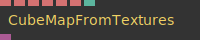
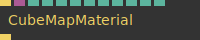
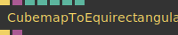
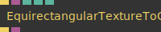
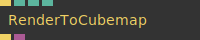
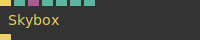

# Ops.Gl.CubeMap


```{=latex}
\OpsSubsubNoSubsectionNumbering\setcounter{subsubsection}{0}
```
### CubeMapFromTextures_v2


**Full Name:** `Ops.Gl.CubeMap.CubeMapFromTextures_v2`

generate a cubemap from 6 textures.

**`\inputsymbol`{=latex} Inputs**

- **Posx** (String)
- **Negx** (String)
- **Posy** (String)
- **Negy** (String)
- **Posz** (String)
- **Negz** (String)
- **Flip Y** (Number: Boolean)

**`\outputsymbol`{=latex} Output**

- **Cubemap** (Object)

**Example Patch:** [cables.gl/edit/-QPf26](https://cables.gl/edit/-QPf26)

**Doc:** [cables.gl/op/Ops.Gl.CubeMap.CubeMapFromTextures_v2](https://cables.gl/op/Ops.Gl.CubeMap.CubeMapFromTextures_v2)

### CubeMapMaterial_v2


**Full Name:** `Ops.Gl.CubeMap.CubeMapMaterial_v2`

use a cubemap or equirectangular texture as a material.

**`\inputsymbol`{=latex} Inputs**

- **Render** (Trigger)
- **Cubemap** (Object)
- **Use Reflection** (Number: Boolean)
- **Blur** (Number)
- **Rotation** (Number)
- **Flip X** (Number: Boolean)
- **Flip Y** (Number: Boolean)
- **Flip Z** (Number: Boolean)
- **Colorize** (Number: Boolean)
- **R** (Number)
- **G** (Number)
- **B** (Number)

**`\outputsymbol`{=latex} Output**

- **Trigger** (Trigger)

**Example Patch:** [cables.gl/edit/u5y0Z5](https://cables.gl/edit/u5y0Z5)

**Doc:** [cables.gl/op/Ops.Gl.CubeMap.CubeMapMaterial_v2](https://cables.gl/op/Ops.Gl.CubeMap.CubeMapMaterial_v2)

### CubemapToEquirectangularTexture_v2


**Full Name:** `Ops.Gl.CubeMap.CubemapToEquirectangularTexture_v2`

visualize cubemap as folded texture or equirectangular texture.

**`\inputsymbol`{=latex} Inputs**

- **In Trigger** (Trigger)
- **Cubemap** (Object)
- **Projection Index** (Number: Integer)
- **Format Index** (Number: Integer)
- **Filter Index** (Number: Integer)
- **Width** (Number: Integer)
- **Height** (Number: Integer)

**`\outputsymbol`{=latex} Output**

- **Out Trigger** (Trigger)
- **Result** (Object)

**Example Patch:** [cables.gl/edit/pNZHYa](https://cables.gl/edit/pNZHYa)

**Doc:** [cables.gl/op/Ops.Gl.CubeMap.CubemapToEquirectangularTexture_v2](https://cables.gl/op/Ops.Gl.CubeMap.CubemapToEquirectangularTexture_v2)

### EquirectangularTextureToCubemap


**Full Name:** `Ops.Gl.CubeMap.EquirectangularTextureToCubemap`

convert an equirectangular map to a cubemap.

**`\inputsymbol`{=latex} Inputs**

- **Trigger In** (Trigger)
- **Equirectangular Map** (Object:Texture)
- **Cubemap Size Index** (Number: Integer)
- **Advanced** (Number: Boolean)
- **Filter Index** (Number: Integer)

**`\outputsymbol`{=latex} Output**

- **Trigger Out** (Trigger)
- **Cubemap Projection** (Object)

**Example Patch:** [cables.gl/edit/O1NBYa](https://cables.gl/edit/O1NBYa)

**Doc:** [cables.gl/op/Ops.Gl.CubeMap.EquirectangularTextureToCubemap](https://cables.gl/op/Ops.Gl.CubeMap.EquirectangularTextureToCubemap)

### RenderToCubemap_v3


**Full Name:** `Ops.Gl.CubeMap.RenderToCubemap_v3`

render a scene into a cubemap.

**`\inputsymbol`{=latex} Inputs**

- **Render** (Trigger)
- **Size Index** (Number: Integer)
- **Pixel Format Index** (Number: Integer)
- **MSAA Index** (Number: Integer)

**`\outputsymbol`{=latex} Output**

- **Next** (Trigger)
- **Cubemap** (Object)

**Example Patch:** [cables.gl/edit/Z3KuUQ](https://cables.gl/edit/Z3KuUQ)

**Doc:** [cables.gl/op/Ops.Gl.CubeMap.RenderToCubemap_v3](https://cables.gl/op/Ops.Gl.CubeMap.RenderToCubemap_v3)

### Skybox


**Full Name:** `Ops.Gl.CubeMap.Skybox`

render an equirectangular map or a cubemap as scene background.

**`\inputsymbol`{=latex} Inputs**

- **Trigger In** (Trigger)
- **Render** (Number: Boolean)
- **Skybox** (Object:Texture)
- **Rotate** (Number)
- **RGBE Format** (Number: Boolean)
- **Exposure** (Number)
- **Gamma** (Number)

**`\outputsymbol`{=latex} Output**

- **Trigger Out** (Trigger)

**Example Patch:** [cables.gl/edit/40hoYa](https://cables.gl/edit/40hoYa)

**Doc:** [cables.gl/op/Ops.Gl.CubeMap.Skybox](https://cables.gl/op/Ops.Gl.CubeMap.Skybox)


