# Ops.Gl.GLTF

*Part of the [All Operators Reference](13-_AllOps.md)*

---

## Ops.Gl.GLTF

### GltfAnimationArray
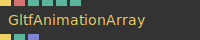

**Full Name:** `Ops.Gl.GLTF.GltfAnimationArray`
**Description:** Convert an animation into an array of coordinates

**> Input Ports:**
- **Render** (Trigger)
- **Node Name** (String)
- **Steps** (Number: Integer)
- **Full Animation** (Number: Boolean)
- **Start** (Number)
- **Length** (Number)

**< Output Ports:**
- **Next** (Trigger)
- **Found** (booleanNumber)
- **Positions** (Array)

**Example Patch:** [Open in Editor](https://cables.gl/edit/py-JK0)
**Patches Using This Op:** *Search [cables.gl patches](https://cables.gl/patches) for "GltfAnimationArray"*
**Docs:** [https://cables.gl/op/Ops.Gl.GLTF.GltfAnimationArray](https://cables.gl/op/Ops.Gl.GLTF.GltfAnimationArray)

---

### GltfCameraViewMatrix
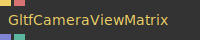

**Full Name:** `Ops.Gl.GLTF.GltfCameraViewMatrix`
**Description:** get view matrix from a gltf camera

**> Input Ports:**
- **Update** (Trigger)
- **Node Name** (String)

**< Output Ports:**
- **Matrix** (Array)
- **Found** (booleanNumber)

**Example Patch:** [Open in Editor](https://cables.gl/edit/klpdcI)
**Patches Using This Op:** *Search [cables.gl patches](https://cables.gl/patches) for "GltfCameraViewMatrix"*
**Docs:** [https://cables.gl/op/Ops.Gl.GLTF.GltfCameraViewMatrix](https://cables.gl/op/Ops.Gl.GLTF.GltfCameraViewMatrix)

---

### GltfDracoCompression
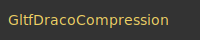

**Full Name:** `Ops.Gl.GLTF.GltfDracoCompression`
**Description:** gltf draco compression library

**> Input Ports:**
- *Visit [Ops.Gl.GLTF.GltfDracoCompression documentation](https://cables.gl/op/Ops.Gl.GLTF.GltfDracoCompression) for input port details*

**< Output Ports:**
- *Visit [Ops.Gl.GLTF.GltfDracoCompression documentation](https://cables.gl/op/Ops.Gl.GLTF.GltfDracoCompression) for output port details*

**Example Patch:** [Open in Editor](https://cables.gl/edit/WFva2K)
**Patches Using This Op:** *Search [cables.gl patches](https://cables.gl/patches) for "GltfDracoCompression"*
**Docs:** [https://cables.gl/op/Ops.Gl.GLTF.GltfDracoCompression](https://cables.gl/op/Ops.Gl.GLTF.GltfDracoCompression)

---

### GltfGeometry

**Full Name:** `Ops.Gl.GLTF.GltfGeometry`
**Description:** expose geometry from gltf meshes, also possible to expose submaterial geometries

**> Input Ports:**
- **Update** (Trigger)
- **Name** (String)
- **Submesh** (Number: Integer)

**< Output Ports:**
- **Next** (Trigger)
- **Geometry** (Object)
- **Found** (booleanNumber)

**Example Patch:** [Open in Editor](https://cables.gl/edit/XKXmf6)
**Patches Using This Op:** *Search [cables.gl patches](https://cables.gl/patches) for "GltfGeometry"*
**Docs:** [https://cables.gl/op/Ops.Gl.GLTF.GltfGeometry](https://cables.gl/op/Ops.Gl.GLTF.GltfGeometry)

---

### GltfHierarchy

**Full Name:** `Ops.Gl.GLTF.GltfHierarchy`
**Description:** export array of positions from a hierarchy of a branch structure in a gltf, e.g. a skeleton bones

**> Input Ports:**
- **Trigger** (Trigger)
- **Node Name** (String)

**< Output Ports:**
- **Next** (Trigger)
- **Bones Lines** (Array)

**Example Patch:** [Open in Editor](https://cables.gl/edit/3t_mJR)
**Patches Using This Op:** *Search [cables.gl patches](https://cables.gl/patches) for "GltfHierarchy"*
**Docs:** [https://cables.gl/op/Ops.Gl.GLTF.GltfHierarchy](https://cables.gl/op/Ops.Gl.GLTF.GltfHierarchy)

---

### GltfInfo
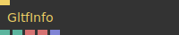

**Full Name:** `Ops.Gl.GLTF.GltfInfo`
**Description:** output some infos about the current parent GLTF scene

**> Input Ports:**
- **Exec** (Trigger)

**< Output Ports:**
- **Num Nodes** (Number)
- **Num Cams** (Number)
- **FileUrl** (String)
- **FileName** (String)
- **Camera Names** (Array)

**Example Patch:** [Open in Editor](https://cables.gl/edit/Z7tacy)
**Patches Using This Op:** *Search [cables.gl patches](https://cables.gl/patches) for "GltfInfo"*
**Docs:** [https://cables.gl/op/Ops.Gl.GLTF.GltfInfo](https://cables.gl/op/Ops.Gl.GLTF.GltfInfo)

---

### GltfMeshSequence_v2
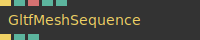

**Full Name:** `Ops.Gl.GLTF.GltfMeshSequence_v2`
**Description:** switch between meshes e.g. like a stop motion animation

**> Input Ports:**
- **Render** (Trigger)
- **Index** (Number: Integer)
- **Node Name** (String)
- **Transformation** (Number: Boolean)
- **Ignore Material** (Number: Boolean)

**< Output Ports:**
- **Next** (Trigger)
- **Found** (Number)
- **Current Index** (Number)

**Example Patch:** [Open in Editor](https://cables.gl/edit/FiJsxn)
**Patches Using This Op:** *Search [cables.gl patches](https://cables.gl/patches) for "GltfMeshSequence_v2"*
**Docs:** [https://cables.gl/op/Ops.Gl.GLTF.GltfMeshSequence_v2](https://cables.gl/op/Ops.Gl.GLTF.GltfMeshSequence_v2)

---

### GltfMorphTargets
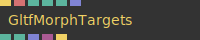

**Full Name:** `Ops.Gl.GLTF.GltfMorphTargets`
**Description:** render weighted morph targets/shape keys from a gltf file

**> Input Ports:**
- **Render** (Trigger)
- **Node Name** (String)
- **Scene Time** (Number: Boolean)
- **Time** (Number)
- **Submesh** (Number: Integer)
- **Target Weights** (Array)

**< Output Ports:**
- **Found Node** (booleanNumber)
- **Found Skin** (booleanNumber)
- **Target Names** (Array)
- **MorphTargets Tex** (Object)
- **Next** (Trigger)

**Example Patch:** [Open in Editor](https://cables.gl/edit/zon4xF)
**Patches Using This Op:** *Search [cables.gl patches](https://cables.gl/patches) for "GltfMorphTargets"*
**Docs:** [https://cables.gl/op/Ops.Gl.GLTF.GltfMorphTargets](https://cables.gl/op/Ops.Gl.GLTF.GltfMorphTargets)

---

### GltfNode_v2

**Full Name:** `Ops.Gl.GLTF.GltfNode_v2`
**Description:** Control a single node from the GLTFscene op

**> Input Ports:**
- **Render** (Trigger)
- **Node Name** (String)
- **Transformation** (Number: Boolean)
- **Draw Mesh** (Number: Boolean)
- **Draw Childs** (Number: Boolean)
- **Ignore Material** (Number: Boolean)
- **Use Scene Time** (Number: Boolean)
- **Time** (Number)

**< Output Ports:**
- **Next** (Trigger)
- **Geometry** (Object)
- **Found** (booleanNumber)

**Example Patch:** [Open in Editor](https://cables.gl/op/Ops.Gl.GLTF.GltfNode_v2#example)
**Patches Using This Op:** *Search [cables.gl patches](https://cables.gl/patches) for "GltfNode_v2"*
**Docs:** [https://cables.gl/op/Ops.Gl.GLTF.GltfNode_v2](https://cables.gl/op/Ops.Gl.GLTF.GltfNode_v2)

---

### GltfNodeSineAnim

**Full Name:** `Ops.Gl.GLTF.GltfNodeSineAnim`
**Description:** sine animate gltf nodes by a filter

**> Input Ports:**
- **Update** (Trigger)
- **Filter** (String)
- **Time** (Number)
- **Offset** (Number)
- **Amplitude** (Number)
- **Axis X** (Number)
- **Axis Y** (Number)
- **Axis Z** (Number)

**< Output Ports:**
- **Next** (Trigger)
- **Found** (Number)

**Example Patch:** [Open in Editor](https://cables.gl/edit/w1SPcI)
**Patches Using This Op:** *Search [cables.gl patches](https://cables.gl/patches) for "GltfNodeSineAnim"*
**Docs:** [https://cables.gl/op/Ops.Gl.GLTF.GltfNodeSineAnim](https://cables.gl/op/Ops.Gl.GLTF.GltfNodeSineAnim)

---

### GltfNodeTransform_v2
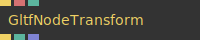

**Full Name:** `Ops.Gl.GLTF.GltfNodeTransform_v2`
**Description:** Get the transform from the GLTFscene op

**> Input Ports:**
- **Render** (Trigger)
- **Node Name** (String)
- **Set Matrix** (Number: Boolean)

**< Output Ports:**
- **Next** (Trigger)
- **Found** (booleanNumber)
- **Matrix** (Array)

**Example Patch:** [Open in Editor](https://cables.gl/edit/yrOJve)
**Patches Using This Op:** *Search [cables.gl patches](https://cables.gl/patches) for "GltfNodeTransform_v2"*
**Docs:** [https://cables.gl/op/Ops.Gl.GLTF.GltfNodeTransform_v2](https://cables.gl/op/Ops.Gl.GLTF.GltfNodeTransform_v2)

---

### GltfNodeTransforms_v3
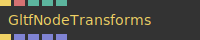

**Full Name:** `Ops.Gl.GLTF.GltfNodeTransforms_v3`
**Description:** output all transformations of nodes starting with [search]

**> Input Ports:**
- **Render** (Trigger)
- **Search** (String)
- **Order Index** (Number: Integer)
- **Space Index** (Number: Integer)
- **Time** (Number)

**< Output Ports:**
- **Next** (Trigger)
- **Positions** (Array)
- **Scale** (Array)
- **Rotation** (Array)
- **Names** (Array)

**Example Patch:** [Open in Editor](https://cables.gl/op/Ops.Gl.GLTF.GltfNodeTransforms_v3#example)
**Patches Using This Op:** *Search [cables.gl patches](https://cables.gl/patches) for "GltfNodeTransforms_v3"*
**Docs:** [https://cables.gl/op/Ops.Gl.GLTF.GltfNodeTransforms_v3](https://cables.gl/op/Ops.Gl.GLTF.GltfNodeTransforms_v3)

---

### GltfScene_v4
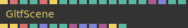

**Full Name:** `Ops.Gl.GLTF.GltfScene_v4`
**Description:** Load GLTF/GLB 3d files

**> Input Ports:**
- **Render** (Trigger)
- **Glb File** (String)
- **Draw** (Number: Boolean)
- **Camera Index** (Number: Integer)
- **Animation** (String)
- **Show Structure** (Trigger)
- **Rescale** (Number: Boolean)
- **Rescale Size** (Number)
- **Time** (Number)
- **Sync To Timeline** (Number: Boolean)
- **Loop** (Number: Boolean)
- **Materials** (Object)
- **Hide Nodes** (Array)
- **Use Material Properties** (Number: Boolean)
- **Active** (Number: Boolean)

**< Output Ports:**
- **Render Before** (Trigger)
- **Next** (Trigger)
- **Generator** (String)
- **GLTF Version** (Number)
- **GLTF Extensions Used** (Array)
- **Anim Length** (Number)
- **Anim Time** (Number)
- **Json** (Object)
- **Anims** (Array)
- **BoundingPoints** (Array)
- **Bounds** (Object)
- **Finished** (Trigger)
- **Loading** (booleanNumber)

**Example Patch:** [Open in Editor](https://cables.gl/edit/XmL8GY)
**Patches Using This Op:** *Search [cables.gl patches](https://cables.gl/patches) for "GltfScene_v4"*
**Docs:** [https://cables.gl/op/Ops.Gl.GLTF.GltfScene_v4](https://cables.gl/op/Ops.Gl.GLTF.GltfScene_v4)

---

### GltfSetMaterial
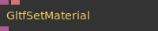

**Full Name:** `Ops.Gl.GLTF.GltfSetMaterial`
**Description:** Assigns a material to a node inside of the gltfScene op

**> Input Ports:**
- **Shader** (Object:Shader)
- **Material Name** (String)

**< Output Ports:**
- **Material** (Object)

**Example Patch:** [Open in Editor](https://cables.gl/edit/Mk3Dv2)
**Patches Using This Op:** *Search [cables.gl patches](https://cables.gl/patches) for "GltfSetMaterial"*
**Docs:** [https://cables.gl/op/Ops.Gl.GLTF.GltfSetMaterial](https://cables.gl/op/Ops.Gl.GLTF.GltfSetMaterial)

---

### GltfSkin
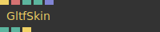

**Full Name:** `Ops.Gl.GLTF.GltfSkin`
**Description:** render a skinned mesh (bone/rigging/rigged animation)

**> Input Ports:**
- **Render** (Trigger)
- **Node Name** (String)
- **Scene Time** (Number: Boolean)
- **Time** (Number)
- **Blend Anims** (Array)

**< Output Ports:**
- **Found Node** (booleanNumber)
- **Found Skin** (booleanNumber)
- **Next** (Trigger)

**Example Patch:** [Open in Editor](https://cables.gl/edit/TWBC-N)
**Patches Using This Op:** *Search [cables.gl patches](https://cables.gl/patches) for "GltfSkin"*
**Docs:** [https://cables.gl/op/Ops.Gl.GLTF.GltfSkin](https://cables.gl/op/Ops.Gl.GLTF.GltfSkin)

---

### GltfTexture
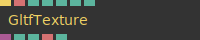

**Full Name:** `Ops.Gl.GLTF.GltfTexture`
**Description:** Load textures from inside a .glb file

**> Input Ports:**
- **Render** (Trigger)
- **Name** (String)
- **Filter Index** (Number: Integer)
- **Wrap Index** (Number: Integer)
- **Anisotropic Index** (Number: Integer)
- **Flip** (Number: Boolean)
- **Pre Multiplied Alpha** (Number: Boolean)

**< Output Ports:**
- **Texture** (Object)
- **Width** (Number)
- **Height** (Number)
- **Type** (String)
- **Found** (booleanNumber)

**Example Patch:** [Open in Editor](https://cables.gl/edit/PBGKve)
**Patches Using This Op:** *Search [cables.gl patches](https://cables.gl/patches) for "GltfTexture"*
**Docs:** [https://cables.gl/op/Ops.Gl.GLTF.GltfTexture](https://cables.gl/op/Ops.Gl.GLTF.GltfTexture)

---

### GltfTransformNode
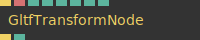

**Full Name:** `Ops.Gl.GLTF.GltfTransformNode`
**Description:** set transformation of a gltf node

**> Input Ports:**
- **Render** (Trigger)
- **Node Name** (String)
- **Translate X** (Number)
- **Translate Y** (Number)
- **Translate Z** (Number)
- **Rotation X** (Number)
- **Rotation Y** (Number)
- **Rotation Z** (Number)

**< Output Ports:**
- **Next** (Trigger)
- **Found** (booleanNumber)

**Example Patch:** [Open in Editor](https://cables.gl/op/Ops.Gl.GLTF.GltfTransformNode#example)
**Patches Using This Op:** *Search [cables.gl patches](https://cables.gl/patches) for "GltfTransformNode"*
**Docs:** [https://cables.gl/op/Ops.Gl.GLTF.GltfTransformNode](https://cables.gl/op/Ops.Gl.GLTF.GltfTransformNode)

---

### GltfVertexAnim
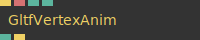

**Full Name:** `Ops.Gl.GLTF.GltfVertexAnim`
**Description:** play gltf vertex anim directly with its own timing

**> Input Ports:**
- **Render** (Trigger)
- **Node Name** (String)
- **Scene Time** (Number: Boolean)
- **Time** (Number)

**< Output Ports:**
- **Found Node** (Number)
- **Next** (Trigger)

**Example Patch:** [Open in Editor](https://cables.gl/op/Ops.Gl.GLTF.GltfVertexAnim#example)
**Patches Using This Op:** *Search [cables.gl patches](https://cables.gl/patches) for "GltfVertexAnim"*
**Docs:** [https://cables.gl/op/Ops.Gl.GLTF.GltfVertexAnim](https://cables.gl/op/Ops.Gl.GLTF.GltfVertexAnim)

---

