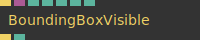
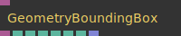

# Ops.Gl.Geometry

---

```{=latex}
\OpsSubsubNoSubsectionNumbering\setcounter{subsubsection}{0}
```
### BoundingBoxVisible


**Full Name:** `Ops.Gl.Geometry.BoundingBoxVisible`

**Description:** Test if a boundingbox could be visible in the current viewport

**`\inputsymbol`{=latex} Inputs**

- **Exec** (Trigger)
- **Boundings** (Object)
- **Active** (Number: Boolean)
- **Draw** (Number: Boolean)
- **Width** (Number)
- **Height** (Number)
- **Length** (Number)

**`\outputsymbol`{=latex} Output**

- **Next** (Trigger)
- **Visible** (booleanNumber)

**Example Patch:** [Open in Editor](https://cables.gl/edit/DAhGve)

**Docs:** [https://cables.gl/op/Ops.Gl.Geometry.BoundingBoxVisible](https://cables.gl/op/Ops.Gl.Geometry.BoundingBoxVisible)

### GeometryBoundingBox


**Full Name:** `Ops.Gl.Geometry.GeometryBoundingBox`

**Description:** Calculate a bounding box from a geometry

**`\inputsymbol`{=latex} Inputs**

- **Geometry** (Object)

**`\outputsymbol`{=latex} Output**

- **Boundings** (Object)
- **Min X** (Number)
- **Min Y** (Number)
- **Min Z** (Number)
- **Max X** (Number)
- **Max Y** (Number)
- **Max Z** (Number)
- **MaxMin Points** (Array)

**Example Patch:** [Open in Editor](https://cables.gl/edit/DAhGve)

**Docs:** [https://cables.gl/op/Ops.Gl.Geometry.GeometryBoundingBox](https://cables.gl/op/Ops.Gl.Geometry.GeometryBoundingBox)


