# Ops.Gl.ImageCompose

---

## Ops.Gl.ImageCompose

### Alpha
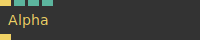

**Full Name:** `Ops.Gl.ImageCompose.Alpha`

**Description:** Modify current alpha/opacity

**`\inputsymbol`{=latex} Input Ports:**

- **Render** (Trigger)
- **Amount** (Number)
- **Clamp** (Number: Boolean)

**`\outputsymbol`{=latex} Output Ports:**

- **Next** (Trigger)

**Example Patch:** [Open in Editor](https://cables.gl/edit/y6f1ei)

**Docs:** [https://cables.gl/op/Ops.Gl.ImageCompose.Alpha](https://cables.gl/op/Ops.Gl.ImageCompose.Alpha)

### AlphaMask_v2
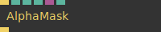

**Full Name:** `Ops.Gl.ImageCompose.AlphaMask_v2`

**Description:** Set alphachannel of current imagecompose via a texture mask

**`\inputsymbol`{=latex} Input Ports:**

- **Render** (Trigger)
- **Amount** (Number)
- **Invert** (Number: Boolean)
- **Image** (Object:Texture)
- **Method Index** (Number: Integer)

**`\outputsymbol`{=latex} Output Ports:**

- **Trigger** (Trigger)

**Example Patch:** [Open in Editor](https://cables.gl/op/Ops.Gl.ImageCompose.AlphaMask_v2#example)

**Docs:** [https://cables.gl/op/Ops.Gl.ImageCompose.AlphaMask_v2](https://cables.gl/op/Ops.Gl.ImageCompose.AlphaMask_v2)

### BarrelDistortion_v3
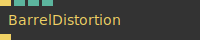

**Full Name:** `Ops.Gl.ImageCompose.BarrelDistortion_v3`

**Description:** Simulate fisheye effect

**`\inputsymbol`{=latex} Input Ports:**

- **Render** (Trigger)
- **Blend Mode Index** (Number: Integer)
- **Amount** (Number)
- **Intensity** (Number)

**`\outputsymbol`{=latex} Output Ports:**

- **Trigger** (Trigger)

**Example Patch:** [Open in Editor](https://cables.gl/edit/qIOrS-)

**Docs:** [https://cables.gl/op/Ops.Gl.ImageCompose.BarrelDistortion_v3](https://cables.gl/op/Ops.Gl.ImageCompose.BarrelDistortion_v3)

### Blur
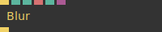

**Full Name:** `Ops.Gl.ImageCompose.Blur`

**Description:** Blur the pixels of an image

**`\inputsymbol`{=latex} Input Ports:**

- **Render** (Trigger)
- **Amount** (Number)
- **Direction Index** (Number: Integer)
- **Direction** (String)
- **Fast** (Number: Boolean)
- **Mask** (Object:Texture)

**`\outputsymbol`{=latex} Output Ports:**

- **Trigger** (Trigger)

**Example Patch:** [Open in Editor](https://cables.gl/edit/1T9f7g)

**Docs:** [https://cables.gl/op/Ops.Gl.ImageCompose.Blur](https://cables.gl/op/Ops.Gl.ImageCompose.Blur)

### Border_v2
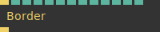

**Full Name:** `Ops.Gl.ImageCompose.Border_v2`

**Description:** Draws a Border (rectangular frame) around the current ImageCompose

**`\inputsymbol`{=latex} Input Ports:**

- **Render** (Trigger)
- **Width** (Number)
- **Blend Mode Index** (Number: Integer)
- **Alpha Mask Index** (Number: Integer)
- **Amount** (Number)
- **Smooth** (Number: Boolean)
- **R** (Number)
- **G** (Number)
- **B** (Number)
- **Side A** (Number)
- **Side B** (Number)
- **Side C** (Number)
- **Side D** (Number)

**`\outputsymbol`{=latex} Output Ports:**

- **Trigger** (Trigger)

**Example Patch:** [Open in Editor](https://cables.gl/edit/ctPnT6)

**Docs:** [https://cables.gl/op/Ops.Gl.ImageCompose.Border_v2](https://cables.gl/op/Ops.Gl.ImageCompose.Border_v2)

### BrightnessContrast
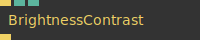

**Full Name:** `Ops.Gl.ImageCompose.BrightnessContrast`

**Description:** adjust image brightness and contrast

**`\inputsymbol`{=latex} Input Ports:**

- **Render** (Trigger)
- **Contrast** (Number)
- **Brightness** (Number)

**`\outputsymbol`{=latex} Output Ports:**

- **Trigger** (Trigger)

**Example Patch:** [Open in Editor](https://cables.gl/edit/8p4mT6)

**Docs:** [https://cables.gl/op/Ops.Gl.ImageCompose.BrightnessContrast](https://cables.gl/op/Ops.Gl.ImageCompose.BrightnessContrast)

### BulgePinch
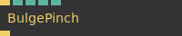

**Full Name:** `Ops.Gl.ImageCompose.BulgePinch`

**Description:** bulge and pinch an image (deform,stretch,distort)

**`\inputsymbol`{=latex} Input Ports:**

- **Render** (Trigger)
- **Radius** (Number)
- **Strength** (Number)
- **Center X** (Number)
- **Center Y** (Number)

**`\outputsymbol`{=latex} Output Ports:**

- **Trigger** (Trigger)

**Example Patch:** [Open in Editor](https://cables.gl/edit/2lC9W6)

**Docs:** [https://cables.gl/op/Ops.Gl.ImageCompose.BulgePinch](https://cables.gl/op/Ops.Gl.ImageCompose.BulgePinch)

### CheckerBoard_v2
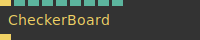

**Full Name:** `Ops.Gl.ImageCompose.CheckerBoard_v2`

**Description:** Draw a checkerboard pattern

**`\inputsymbol`{=latex} Input Ports:**

- **Render** (Trigger)
- **Blend Mode Index** (Number: Integer)
- **Alpha Mask Index** (Number: Integer)
- **Amount** (Number)
- **Square** (Number: Boolean)
- **Num X** (Number)
- **Num Y** (Number)
- **Rotate** (Number)
- **Centered** (Number: Boolean)

**`\outputsymbol`{=latex} Output Ports:**

- **Trigger** (Trigger)

**Example Patch:** [Open in Editor](https://cables.gl/edit/J4KL_4)

**Docs:** [https://cables.gl/op/Ops.Gl.ImageCompose.CheckerBoard_v2](https://cables.gl/op/Ops.Gl.ImageCompose.CheckerBoard_v2)

### ChromaticAberration_v2
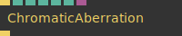

**Full Name:** `Ops.Gl.ImageCompose.ChromaticAberration_v2`

**Description:** simulating lens effect by shifting rgb channels

**`\inputsymbol`{=latex} Input Ports:**

- **Render** (Trigger)
- **Blend Mode Index** (Number: Integer)
- **Amount** (Number)
- **Pixel** (Number)
- **Lens Distort** (Number)
- **Smooth** (Number: Boolean)
- **Mask** (Object:Texture)

**`\outputsymbol`{=latex} Output Ports:**

- **Trigger** (Trigger)

**Example Patch:** [Open in Editor](https://cables.gl/edit/X0WkT6)

**Docs:** [https://cables.gl/op/Ops.Gl.ImageCompose.ChromaticAberration_v2](https://cables.gl/op/Ops.Gl.ImageCompose.ChromaticAberration_v2)

### CircleTexture_v4
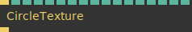

**Full Name:** `Ops.Gl.ImageCompose.CircleTexture_v4`

**Description:** Draw 2d circle into texture

**`\inputsymbol`{=latex} Input Ports:**

- **Render** (Trigger)
- **Amount** (Number)
- **Blend Mode Index** (Number: Integer)
- **Alpha Mask Index** (Number: Integer)
- **Size** (Number)
- **Inner** (Number)
- **Stretch X** (Number)
- **Stretch Y** (Number)
- **Pos X** (Number)
- **Pos Y** (Number)
- **FallOff Index** (Number: Integer)
- **Fade Out** (Number)
- **Warn Overflow** (Number: Boolean)
- **R** (Number)
- **G** (Number)
- **B** (Number)
- **A** (Number)

**`\outputsymbol`{=latex} Output Ports:**

- **Next** (Trigger)

**Example Patch:** [Open in Editor](https://cables.gl/edit/asslT6)

**Docs:** [https://cables.gl/op/Ops.Gl.ImageCompose.CircleTexture_v4](https://cables.gl/op/Ops.Gl.ImageCompose.CircleTexture_v4)

### ClampTexture_v2
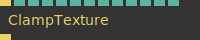

**Full Name:** `Ops.Gl.ImageCompose.ClampTexture_v2`

**Description:** Clamps a texture to min and max values - Also has remap modes

**`\inputsymbol`{=latex} Input Ports:**

- **Render** (Trigger)
- **Blend Mode Index** (Number: Integer)
- **Amount** (Number)
- **Mode Index** (Number: Integer)
- **R** (Number: Boolean)
- **R Min** (Number)
- **R Max** (Number)
- **G** (Number: Boolean)
- **G Min** (Number)
- **G Max** (Number)
- **B** (Number: Boolean)
- **B Min** (Number)
- **B Max** (Number)

**`\outputsymbol`{=latex} Output Ports:**

- **Trigger** (Trigger)

**Example Patch:** [Open in Editor](https://cables.gl/edit/eYNP7-)

**Docs:** [https://cables.gl/op/Ops.Gl.ImageCompose.ClampTexture_v2](https://cables.gl/op/Ops.Gl.ImageCompose.ClampTexture_v2)

### Clarity
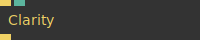

**Full Name:** `Ops.Gl.ImageCompose.Clarity`

**Description:** Increase contrast in midtones

**`\inputsymbol`{=latex} Input Ports:**

- **Render** (Trigger)
- **Amount** (Number)

**`\outputsymbol`{=latex} Output Ports:**

- **Trigger** (Trigger)

**Example Patch:** [Open in Editor](https://cables.gl/op/Ops.Gl.ImageCompose.Clarity#example)

**Docs:** [https://cables.gl/op/Ops.Gl.ImageCompose.Clarity](https://cables.gl/op/Ops.Gl.ImageCompose.Clarity)

### Color_v2
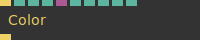

**Full Name:** `Ops.Gl.ImageCompose.Color_v2`

**Description:** fill image using a color (overlay)

**`\inputsymbol`{=latex} Input Ports:**

- **Render** (Trigger)
- **Blend Mode Index** (Number: Integer)
- **Amount** (Number)
- **Alpha Mask Index** (Number: Integer)
- **Mask** (Object:Texture)
- **Mask Invert** (Number: Boolean)
- **R** (Number)
- **G** (Number)
- **B** (Number)
- **A** (Number)

**`\outputsymbol`{=latex} Output Ports:**

- **Trigger** (Trigger)

**Example Patch:** [Open in Editor](https://cables.gl/edit/AnqmT6)

**Docs:** [https://cables.gl/op/Ops.Gl.ImageCompose.Color_v2](https://cables.gl/op/Ops.Gl.ImageCompose.Color_v2)

### ColorBalance_v2
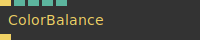

**Full Name:** `Ops.Gl.ImageCompose.ColorBalance_v2`

**Description:** change intensity of r,g,b channels

**`\inputsymbol`{=latex} Input Ports:**

- **Render** (Trigger)
- **Tone Index** (Number: Integer)
- **R** (Number)
- **G** (Number)
- **B** (Number)

**`\outputsymbol`{=latex} Output Ports:**

- **Trigger** (Trigger)

**Example Patch:** [Open in Editor](https://cables.gl/edit/FGVncy)

**Docs:** [https://cables.gl/op/Ops.Gl.ImageCompose.ColorBalance_v2](https://cables.gl/op/Ops.Gl.ImageCompose.ColorBalance_v2)

### ColorChannel_v2
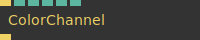

**Full Name:** `Ops.Gl.ImageCompose.ColorChannel_v2`

**Description:** enable disable RGB color channels

**`\inputsymbol`{=latex} Input Ports:**

- **Render** (Trigger)
- **ChannelR** (Number: Boolean)
- **ChannelG** (Number: Boolean)
- **ChannelB** (Number: Boolean)
- **ChannelA** (Number: Boolean)
- **Mono** (Number: Boolean)

**`\outputsymbol`{=latex} Output Ports:**

- **Trigger** (Trigger)

**Example Patch:** [Open in Editor](https://cables.gl/op/Ops.Gl.ImageCompose.ColorChannel_v2#example)

**Docs:** [https://cables.gl/op/Ops.Gl.ImageCompose.ColorChannel_v2](https://cables.gl/op/Ops.Gl.ImageCompose.ColorChannel_v2)

### ColorMap_v2
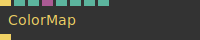

**Full Name:** `Ops.Gl.ImageCompose.ColorMap_v2`

**Description:** colorize a black and white image using a gradient texture

**`\inputsymbol`{=latex} Input Ports:**

- **Render** (Trigger)
- **Blend Mode Index** (Number: Integer)
- **Amount** (Number)
- **Gradient** (Object:Texture)
- **Method Index** (Number: Integer)
- **Min** (Number)
- **Max** (Number)
- **Position** (Number)

**`\outputsymbol`{=latex} Output Ports:**

- **Trigger** (Trigger)

**Example Patch:** [Open in Editor](https://cables.gl/edit/E7Dou7)

**Docs:** [https://cables.gl/op/Ops.Gl.ImageCompose.ColorMap_v2](https://cables.gl/op/Ops.Gl.ImageCompose.ColorMap_v2)

### Denoise

**Full Name:** `Ops.Gl.ImageCompose.Denoise`

**Description:** Denoise texture effect - used to smooth out noisy images

**`\inputsymbol`{=latex} Input Ports:**

- **Render** (Trigger)
- **Exponent** (Number)

**`\outputsymbol`{=latex} Output Ports:**

- **Trigger** (Trigger)

**Example Patch:** [Open in Editor](https://cables.gl/edit/4vWud8)

**Docs:** [https://cables.gl/op/Ops.Gl.ImageCompose.Denoise](https://cables.gl/op/Ops.Gl.ImageCompose.Denoise)

### DepthTexture_v2
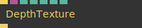

**Full Name:** `Ops.Gl.ImageCompose.DepthTexture_v2`

**Description:** draw the content of a depth texture

**`\inputsymbol`{=latex} Input Ports:**

- **Render** (Trigger)
- **Image** (Object:Texture)
- **Blend Mode Index** (Number: Integer)
- **Amount** (Number)
- **Farplane** (Number)
- **Nearplane** (Number)
- **Invert** (Number: Boolean)

**`\outputsymbol`{=latex} Output Ports:**

- **Trigger** (Trigger)

**Example Patch:** [Open in Editor](https://cables.gl/edit/tmLbW6)

**Docs:** [https://cables.gl/op/Ops.Gl.ImageCompose.DepthTexture_v2](https://cables.gl/op/Ops.Gl.ImageCompose.DepthTexture_v2)

### DepthTextureFocus_v2
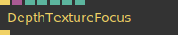

**Full Name:** `Ops.Gl.ImageCompose.DepthTextureFocus_v2`

**Description:** draws a gradient from white to black back to white over distance of the scene

**`\inputsymbol`{=latex} Input Ports:**

- **Render** (Trigger)
- **Depth Texture** (Object)
- **Focus** (Number)
- **focus distance** (in world space)
- **Width** (Number)
- **width of the focus** (in world space)
- **Invert** (Number: Boolean)
- **Nearplane** (Number)
- **Farplane** (Number)

**`\outputsymbol`{=latex} Output Ports:**

- **Trigger** (Trigger)

**Example Patch:** [Open in Editor](https://cables.gl/edit/6Z8zJm)

**Docs:** [https://cables.gl/op/Ops.Gl.ImageCompose.DepthTextureFocus_v2](https://cables.gl/op/Ops.Gl.ImageCompose.DepthTextureFocus_v2)

### Desaturate
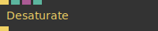

**Full Name:** `Ops.Gl.ImageCompose.Desaturate`

**Description:** Remove colors from image / greyscale

**`\inputsymbol`{=latex} Input Ports:**

- **Render** (Trigger)
- **Amount** (Number)
- **Mask** (Object)
- **Invert Mask** (Number: Boolean)

**`\outputsymbol`{=latex} Output Ports:**

- **Trigger** (Trigger)

**Example Patch:** [Open in Editor](https://cables.gl/edit/g1kmT6)

**Docs:** [https://cables.gl/op/Ops.Gl.ImageCompose.Desaturate](https://cables.gl/op/Ops.Gl.ImageCompose.Desaturate)

### Dither_v2
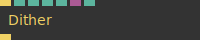

**Full Name:** `Ops.Gl.ImageCompose.Dither_v2`

**Description:** convert color to black and white patterns

**`\inputsymbol`{=latex} Input Ports:**

- **Render** (Trigger)
- **Blend Mode Index** (Number: Integer)
- **Amount** (Number)
- **Threshold** (Number)
- **Strength** (Number)
- **Mask** (Object:Texture)

**`\outputsymbol`{=latex} Output Ports:**

- **Trigger** (Trigger)

**Example Patch:** [Open in Editor](https://cables.gl/edit/eECnT6)

**Docs:** [https://cables.gl/op/Ops.Gl.ImageCompose.Dither_v2](https://cables.gl/op/Ops.Gl.ImageCompose.Dither_v2)

### DrawImage_v3
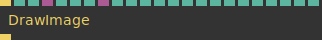

**Full Name:** `Ops.Gl.ImageCompose.DrawImage_v3`

**Description:** Draws an image into a composition

**`\inputsymbol`{=latex} Input Ports:**

- **Render** (Trigger)
- **BlendMode Index** (Number: Integer)
- **Amount** (Number)
- **Image** (Object:Texture)
- **Premultiplied** (Number: Boolean)
- **Alpha Mask** (Number: Boolean)
- **RemoveAlphaSrc** (Number: Boolean)
- **Mask** (Object:Texture)
- **Mask Src Index** (Number: Integer)
- **Invert Alpha Channel** (Number: Boolean)
- **Aspect Ratio** (Number: Boolean)
- **Stretch Axis Index** (Number: Integer)
- **Position** (Number)
- **Crop** (Number: Boolean)
- **Flip X** (Number: Boolean)
- **Flip Y** (Number: Boolean)
- **Transform** (Number: Boolean)
- **Scale X** (Number)
- **Scale Y** (Number)
- **Position X** (Number)
- **Position Y** (Number)
- **Rotation** (Number)
- **Clip Repeat** (Number: Boolean)

**`\outputsymbol`{=latex} Output Ports:**

- **Trigger** (Trigger)

**Example Patch:** [Open in Editor](https://cables.gl/edit/k6ttde)

**Docs:** [https://cables.gl/op/Ops.Gl.ImageCompose.DrawImage_v3](https://cables.gl/op/Ops.Gl.ImageCompose.DrawImage_v3)

### EdgeDetection_v4

**Full Name:** `Ops.Gl.ImageCompose.EdgeDetection_v4`

**Description:** Draw only the edges of an image

**`\inputsymbol`{=latex} Input Ports:**

- **Render** (Trigger)
- **Blend Mode Index** (Number: Integer)
- **Amount** (Number)
- **Strength** (Number)
- **Width** (Number)
- **Mul Color** (Number)

**`\outputsymbol`{=latex} Output Ports:**

- **Trigger** (Trigger)

**Example Patch:** [Open in Editor](https://cables.gl/edit/dK8td8)

**Docs:** [https://cables.gl/op/Ops.Gl.ImageCompose.EdgeDetection_v4](https://cables.gl/op/Ops.Gl.ImageCompose.EdgeDetection_v4)

### Emboss
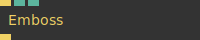

**Full Name:** `Ops.Gl.ImageCompose.Emboss`

**Description:** Emboss / bevel effect

**`\inputsymbol`{=latex} Input Ports:**

- **Render** (Trigger)
- **Strength** (Number)
- **Clear** (Number: Boolean)

**`\outputsymbol`{=latex} Output Ports:**

- **Trigger** (Trigger)

**Example Patch:** [Open in Editor](https://cables.gl/edit/xsRcay)

**Docs:** [https://cables.gl/op/Ops.Gl.ImageCompose.Emboss](https://cables.gl/op/Ops.Gl.ImageCompose.Emboss)

### FastBlur_v2
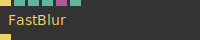

**Full Name:** `Ops.Gl.ImageCompose.FastBlur_v2`

**Description:** Blurs a texture - simple and fast

**`\inputsymbol`{=latex} Input Ports:**

- **Render** (Trigger)
- **Passes** (Number: Integer)
- **Clamp** (Number: Boolean)
- **Direction Index** (Number: Integer)
- **Mask** (Object:Texture)
- **Mask Invert** (Number: Boolean)

**`\outputsymbol`{=latex} Output Ports:**

- **Trigger** (Trigger)

**Example Patch:** [Open in Editor](https://cables.gl/edit/wl2T7i)

**Docs:** [https://cables.gl/op/Ops.Gl.ImageCompose.FastBlur_v2](https://cables.gl/op/Ops.Gl.ImageCompose.FastBlur_v2)

### Flip
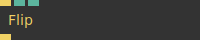

**Full Name:** `Ops.Gl.ImageCompose.Flip`

**Description:** flip the image on x or y axis

**`\inputsymbol`{=latex} Input Ports:**

- **Render** (Trigger)
- **X** (Number: Boolean)
- **Y** (Number: Boolean)

**`\outputsymbol`{=latex} Output Ports:**

- **Trigger** (Trigger)

**Example Patch:** [Open in Editor](https://cables.gl/edit/179Jjr)

**Docs:** [https://cables.gl/op/Ops.Gl.ImageCompose.Flip](https://cables.gl/op/Ops.Gl.ImageCompose.Flip)

### Float32ToRgbeTexture
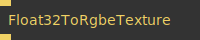

**Full Name:** `Ops.Gl.ImageCompose.Float32ToRgbeTexture`

**Description:** Convert a Float32 bit/HDR texture to RGBE format (only positive numbers)

**`\inputsymbol`{=latex} Input Ports:**

- **Render** (Trigger)

**`\outputsymbol`{=latex} Output Ports:**

- **Trigger** (Trigger)

**Example Patch:** [Open in Editor](https://cables.gl/edit/dXLhW2)

**Docs:** [https://cables.gl/op/Ops.Gl.ImageCompose.Float32ToRgbeTexture](https://cables.gl/op/Ops.Gl.ImageCompose.Float32ToRgbeTexture)

### Fog_v4
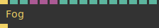

**Full Name:** `Ops.Gl.ImageCompose.Fog_v4`

**Description:** add post processing fog (nebula) to a scene

**`\inputsymbol`{=latex} Input Ports:**

- **Render** (Trigger)
- **BlendMode Index** (Number: Integer)
- **Amount** (Number)
- **Depth Texture** (Object:Texture)
- **Gradient Texture** (Object:Texture)
- **Background Texture** (Object:Texture)
- **Fog Start** (Number)
- **Fog End** (Number)
- **Fog Density** (Number)
- **Ignore Infinity** (Number: Boolean)
- **Nearplane** (Number)
- **Farplane** (Number)
- **Fog R** (Number)
- **Fog G** (Number)
- **Fog B** (Number)
- **Fog A** (Number)

**`\outputsymbol`{=latex} Output Ports:**

- **Trigger** (Trigger)

**Example Patch:** [Open in Editor](https://cables.gl/edit/I6pZnO)

**Docs:** [https://cables.gl/op/Ops.Gl.ImageCompose.Fog_v4](https://cables.gl/op/Ops.Gl.ImageCompose.Fog_v4)

### FXAA
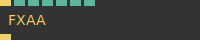

**Full Name:** `Ops.Gl.ImageCompose.FXAA`

**Description:** post processing antialiasing

**`\inputsymbol`{=latex} Input Ports:**

- **Render** (Trigger)
- **Span Index** (Number: Integer)
- **ReduceMin** (Number)
- **ReduceMul** (Number)
- **Use Viewport Size** (Number: Boolean)
- **Width** (Number: Integer)
- **Height** (Number: Integer)

**`\outputsymbol`{=latex} Output Ports:**

- **Trigger** (Trigger)

**Example Patch:** [Open in Editor](https://cables.gl/edit/c5uYnO)

**Docs:** [https://cables.gl/op/Ops.Gl.ImageCompose.FXAA](https://cables.gl/op/Ops.Gl.ImageCompose.FXAA)

### GammaCorrection_v2
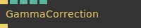

**Full Name:** `Ops.Gl.ImageCompose.GammaCorrection_v2`

**Description:** Allows for Gamma correction of a texture

**`\inputsymbol`{=latex} Input Ports:**

- **Render** (Trigger)
- **Blend Mode Index** (Number: Integer)
- **Amount** (Number)
- **Multiply Texture** (Number)
- **Gamma Correction** (Number)

**`\outputsymbol`{=latex} Output Ports:**

- **Trigger** (Trigger)

**Example Patch:** [Open in Editor](https://cables.gl/edit/WugPbx)

**Docs:** [https://cables.gl/op/Ops.Gl.ImageCompose.GammaCorrection_v2](https://cables.gl/op/Ops.Gl.ImageCompose.GammaCorrection_v2)

### Gradient_v2
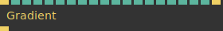

**Full Name:** `Ops.Gl.ImageCompose.Gradient_v2`

**Description:** Draws a simple gradient between three colors

**`\inputsymbol`{=latex} Input Ports:**

- **Render** (Trigger)
- **Blend Mode Index** (Number: Integer)
- **Alpha Mask Index** (Number: Integer)
- **Amount** (Number)
- **Width** (Number)
- **Type Index** (Number: Integer)
- **Pos** (Number)
- **Smoothstep** (Number: Boolean)
- **SRGB** (Number: Boolean)
- **Color Space Index** (Number: Integer)
- **R** (Number)
- **G** (Number)
- **B** (Number)
- **R2** (Number)
- **G2** (Number)
- **B2** (Number)
- **R3** (Number)
- **G3** (Number)
- **B3** (Number)
- **Randomize** (Trigger)

**`\outputsymbol`{=latex} Output Ports:**

- **Next** (Trigger)

**Example Patch:** [Open in Editor](https://cables.gl/edit/dlSpQ6)

**Docs:** [https://cables.gl/op/Ops.Gl.ImageCompose.Gradient_v2](https://cables.gl/op/Ops.Gl.ImageCompose.Gradient_v2)

### GridTexture_v2
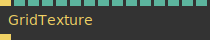

**Full Name:** `Ops.Gl.ImageCompose.GridTexture_v2`

**Description:** Creates a grid texture

**`\inputsymbol`{=latex} Input Ports:**

- **Render** (Trigger)
- **Blend Mode Index** (Number: Integer)
- **Alpha Mask Index** (Number: Integer)
- **Amount** (Number)
- **Line Thickness X** (Number)
- **Line Thickness Y** (Number)
- **Cells X** (Number)
- **Cells Y** (Number)
- **Rotate** (Number)
- **Offset X** (Number)
- **Offset Y** (Number)
- **Invert Color** (Number: Boolean)
- **Line Red** (Number)
- **Line Green** (Number)
- **Line Blue** (Number)

**`\outputsymbol`{=latex} Output Ports:**

- **Trigger** (Trigger)

**Example Patch:** [Open in Editor](https://cables.gl/edit/pG_qUH)

**Docs:** [https://cables.gl/op/Ops.Gl.ImageCompose.GridTexture_v2](https://cables.gl/op/Ops.Gl.ImageCompose.GridTexture_v2)

### GrowPixels_v2
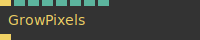

**Full Name:** `Ops.Gl.ImageCompose.GrowPixels_v2`

**Description:** Make one pixel lines thicker via postprocessing

**`\inputsymbol`{=latex} Input Ports:**

- **Render** (Trigger)
- **Blend Mode Index** (Number: Integer)
- **Amount** (Number)
- **Strength** (Number)
- **Iterations** (Number: Integer)
- **R** (Number)
- **G** (Number)
- **B** (Number)

**`\outputsymbol`{=latex} Output Ports:**

- **Trigger** (Trigger)

**Example Patch:** [Open in Editor](https://cables.gl/edit/3WSXCU)

**Docs:** [https://cables.gl/op/Ops.Gl.ImageCompose.GrowPixels_v2](https://cables.gl/op/Ops.Gl.ImageCompose.GrowPixels_v2)

### Hue
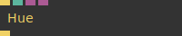

**Full Name:** `Ops.Gl.ImageCompose.Hue`

**Description:** Adjust Hue of current ImageCompose

**`\inputsymbol`{=latex} Input Ports:**

- **Render** (Trigger)
- **Hue** (Number)
- **Mask** (Object:Texture)
- **Offset** (Object:Texture)

**`\outputsymbol`{=latex} Output Ports:**

- **Trigger** (Trigger)

**Example Patch:** [Open in Editor](https://cables.gl/edit/kubmT6)

**Docs:** [https://cables.gl/op/Ops.Gl.ImageCompose.Hue](https://cables.gl/op/Ops.Gl.ImageCompose.Hue)

### ImageCompose_v4
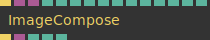

**Full Name:** `Ops.Gl.ImageCompose.ImageCompose_v4`

**Description:** Compose Images and effects as layers to generate new Images

**`\inputsymbol`{=latex} Input Ports:**

- **Render** (Trigger)
- **Base Texture** (Object:Texture)
- **UV Texture** (Object:Texture)
- **Width** (Number: Integer)
- **Height** (Number: Integer)
- **Wrap Index** (Number: Integer)
- **Pixel Format Index** (Number: Integer)
- **Clear** (Number: Boolean)
- **R** (Number)
- **G** (Number)
- **B** (Number)
- **A** (Number)

**`\outputsymbol`{=latex} Output Ports:**

- **Next** (Trigger)
- **Texture_out** (Object)
- **Aspect Ratio** (Number)
- **Texture Width** (Number)
- **Texture Height** (Number)

**Example Patch:** [Open in Editor](https://cables.gl/edit/dNv2r1)

**Docs:** [https://cables.gl/op/Ops.Gl.ImageCompose.ImageCompose_v4](https://cables.gl/op/Ops.Gl.ImageCompose.ImageCompose_v4)

### ImageComposeAspectRatio
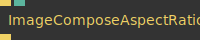

**Full Name:** `Ops.Gl.ImageCompose.ImageComposeAspectRatio`

**Description:** Adjust aspect ratio of an image compose branch

**`\inputsymbol`{=latex} Input Ports:**

- **Update** (Trigger)
- **Aspect** (Number)

**`\outputsymbol`{=latex} Output Ports:**

- **Next** (Trigger)

**Example Patch:** [Open in Editor](https://cables.gl/edit/iwX7v4)

**Docs:** [https://cables.gl/op/Ops.Gl.ImageCompose.ImageComposeAspectRatio](https://cables.gl/op/Ops.Gl.ImageCompose.ImageComposeAspectRatio)

### ImageComposeSnapshot
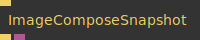

**Full Name:** `Ops.Gl.ImageCompose.ImageComposeSnapshot`

**Description:** capture the current state of an imageCompose branch by copying the texture

**`\inputsymbol`{=latex} Input Ports:**

- **Update** (Trigger)

**`\outputsymbol`{=latex} Output Ports:**

- **Trigger** (Trigger)
- **Texture** (Object)

**Example Patch:** [Open in Editor](https://cables.gl/edit/Dc1a-W)

**Docs:** [https://cables.gl/op/Ops.Gl.ImageCompose.ImageComposeSnapshot](https://cables.gl/op/Ops.Gl.ImageCompose.ImageComposeSnapshot)

### Interlace
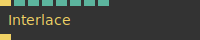

**Full Name:** `Ops.Gl.ImageCompose.Interlace`

**Description:** Tv scanlines effect

**`\inputsymbol`{=latex} Input Ports:**

- **Render** (Trigger)
- **Amount** (Number)
- **Lumi Scale** (Number)
- **X Or Y** (Number: Boolean)
- **Line Size** (Number)
- **Displacement** (Number)
- **Add** (Number)
- **Scroll** (Number)

**`\outputsymbol`{=latex} Output Ports:**

- **Trigger** (Trigger)

**Example Patch:** [Open in Editor](https://cables.gl/edit/MCpnT6)

**Docs:** [https://cables.gl/op/Ops.Gl.ImageCompose.Interlace](https://cables.gl/op/Ops.Gl.ImageCompose.Interlace)

### Invert_v2
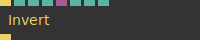

**Full Name:** `Ops.Gl.ImageCompose.Invert_v2`

**Description:** Invert image colors

**`\inputsymbol`{=latex} Input Ports:**

- **Render** (Trigger)
- **Blend Mode Index** (Number: Integer)
- **Amount** (Number)
- **Mask Invert** (Number: Boolean)
- **Mask** (Object:Texture)
- **Invert R** (Number: Boolean)
- **Invert G** (Number: Boolean)
- **Invert B** (Number: Boolean)

**`\outputsymbol`{=latex} Output Ports:**

- **Trigger** (Trigger)

**Example Patch:** [Open in Editor](https://cables.gl/edit/Ld3nT6)

**Docs:** [https://cables.gl/op/Ops.Gl.ImageCompose.Invert_v2](https://cables.gl/op/Ops.Gl.ImageCompose.Invert_v2)

### Kaleidoscope_v2
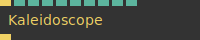

**Full Name:** `Ops.Gl.ImageCompose.Kaleidoscope_v2`

**Description:** Kaleidoscope effect

**`\inputsymbol`{=latex} Input Ports:**

- **Render** (Trigger)
- **Blend Mode Index** (Number: Integer)
- **Amount** (Number)
- **Sides** (Number)
- **Angle** (Number)
- **Slide X** (Number)
- **Slide Y** (Number)
- **Center X** (Number)
- **Center Y** (Number)
- **Aspect Ratio** (Number: Boolean)

**`\outputsymbol`{=latex} Output Ports:**

- **Next** (Trigger)

**Example Patch:** [Open in Editor](https://cables.gl/edit/n4DaW6)

**Docs:** [https://cables.gl/op/Ops.Gl.ImageCompose.Kaleidoscope_v2](https://cables.gl/op/Ops.Gl.ImageCompose.Kaleidoscope_v2)

### LensDirt_v2
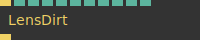

**Full Name:** `Ops.Gl.ImageCompose.LensDirt_v2`

**Description:** Creates a lens dirt like texture

**`\inputsymbol`{=latex} Input Ports:**

- **Render** (Trigger)
- **Blend Mode Index** (Number: Integer)
- **Amount** (Number)
- **Alpha Mask Index** (Number: Integer)
- **Offset X** (Number)
- **Offset Y** (Number)
- **Zoom** (Number)
- **Iterations** (Number: Integer)
- **Seed** (Number: Integer)
- **Spot Edge** (Number)
- **Gamma** (Number)

**`\outputsymbol`{=latex} Output Ports:**

- **Trigger** (Trigger)

**Example Patch:** [Open in Editor](https://cables.gl/edit/vwgWMX)

**Docs:** [https://cables.gl/op/Ops.Gl.ImageCompose.LensDirt_v2](https://cables.gl/op/Ops.Gl.ImageCompose.LensDirt_v2)

### LensScratches_v2
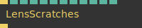

**Full Name:** `Ops.Gl.ImageCompose.LensScratches_v2`

**Description:** Creates a procedural texture simulating scratches on a lens

**`\inputsymbol`{=latex} Input Ports:**

- **Render** (Trigger)
- **Blend Mode Index** (Number: Integer)
- **Amount** (Number)
- **Alpha Mask Index** (Number: Integer)
- **Offset X** (Number)
- **Offset Y** (Number)
- **Wavyness** (Number)
- **Scale** (Number)
- **Layers** (Number: Integer)
- **AA Iterations** (Number)
- **Frequency** (Number)
- **Frequency Step Size** (Number)

**`\outputsymbol`{=latex} Output Ports:**

- **Trigger** (Trigger)

**Example Patch:** [Open in Editor](https://cables.gl/edit/ucr5NX)

**Docs:** [https://cables.gl/op/Ops.Gl.ImageCompose.LensScratches_v2](https://cables.gl/op/Ops.Gl.ImageCompose.LensScratches_v2)

### Levels_v2

**Full Name:** `Ops.Gl.ImageCompose.Levels_v2`

**Description:** adjust levels to correct the tonal range of an image

**`\inputsymbol`{=latex} Input Ports:**

- **Render** (Trigger)
- **In Min** (Number)
- **Midpoint** (Number)
- **In Max** (Number)
- **Out Min** (Number)
- **Out Max** (Number)

**`\outputsymbol`{=latex} Output Ports:**

- **Next** (Trigger)

**Example Patch:** [Open in Editor](https://cables.gl/edit/F8M9W6)

**Docs:** [https://cables.gl/op/Ops.Gl.ImageCompose.Levels_v2](https://cables.gl/op/Ops.Gl.ImageCompose.Levels_v2)

### LumaKey_v3
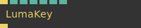

**Full Name:** `Ops.Gl.ImageCompose.LumaKey_v3`

**Description:** Remove darkest or brightest parts of the image

**`\inputsymbol`{=latex} Input Ports:**

- **Render** (Trigger)
- **Invert** (Number: Boolean)
- **Black White** (Number: Boolean)
- **Remove Alpha** (Number: Boolean)
- **Remap** (Number: Boolean)
- **Threshold Low** (Number)
- **Threshold High** (Number)

**`\outputsymbol`{=latex} Output Ports:**

- **Trigger** (Trigger)

**Example Patch:** [Open in Editor](https://cables.gl/edit/ukO5qe)

**Docs:** [https://cables.gl/op/Ops.Gl.ImageCompose.LumaKey_v3](https://cables.gl/op/Ops.Gl.ImageCompose.LumaKey_v3)

### LUTMap
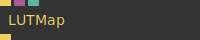

**Full Name:** `Ops.Gl.ImageCompose.LUTMap`

**Description:** apply color filter/effects by using a lookup texture

**`\inputsymbol`{=latex} Input Ports:**

- **Render** (Trigger)
- **LUT Image** (Object:Texture)
- **Amount** (Number)

**`\outputsymbol`{=latex} Output Ports:**

- **Trigger** (Trigger)

**Example Patch:** [Open in Editor](https://cables.gl/edit/2_nZX7)

**Docs:** [https://cables.gl/op/Ops.Gl.ImageCompose.LUTMap](https://cables.gl/op/Ops.Gl.ImageCompose.LUTMap)

### Mirror
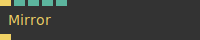

**Full Name:** `Ops.Gl.ImageCompose.Mirror`

**Description:** mirroring image effect

**`\inputsymbol`{=latex} Input Ports:**

- **Render** (Trigger)
- **Axis Index** (Number: Integer)
- **Width** (Number)
- **Offset** (Number)
- **Flip** (Number: Boolean)

**`\outputsymbol`{=latex} Output Ports:**

- **Trigger** (Trigger)

**Example Patch:** [Open in Editor](https://cables.gl/edit/MVFoT6)

**Docs:** [https://cables.gl/op/Ops.Gl.ImageCompose.Mirror](https://cables.gl/op/Ops.Gl.ImageCompose.Mirror)

### Mix
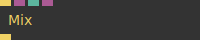

**Full Name:** `Ops.Gl.ImageCompose.Mix`

**Description:** simple mix/fade of two input images

**`\inputsymbol`{=latex} Input Ports:**

- **Render** (Trigger)
- **Texture 1** (Object:Texture)
- **Fade** (Number)
- **Texture 2** (Object:Texture)

**`\outputsymbol`{=latex} Output Ports:**

- **Trigger** (Trigger)

**Example Patch:** [Open in Editor](https://cables.gl/edit/CDaQK2)

**Docs:** [https://cables.gl/op/Ops.Gl.ImageCompose.Mix](https://cables.gl/op/Ops.Gl.ImageCompose.Mix)

### MultiDrawImage
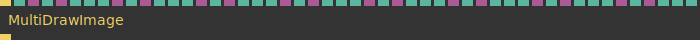

**Full Name:** `Ops.Gl.ImageCompose.MultiDrawImage`

**Description:** draw multiple images at once

**`\inputsymbol`{=latex} Input Ports:**

- **Render** (Trigger)
- **Mask Invert** (Number: Boolean)
- **Texture 1** (Object:Texture)
- **Blendmode 1 Index** (Number: Integer)
- **Mask 1** (Object:Texture)
- **Mask Source 1 Index** (Number: Integer)
- **Opacity 1 Index** (Number: Integer)
- **Amount 1** (Number)
- **Texture 2** (Object:Texture)
- **Blendmode 2 Index** (Number: Integer)
- **Mask 2** (Object:Texture)
- **Mask Source 2 Index** (Number: Integer)
- **Opacity 2 Index** (Number: Integer)
- **Amount 2** (Number)
- **Texture 3** (Object:Texture)
- **Blendmode 3 Index** (Number: Integer)
- **Mask 3** (Object:Texture)
- **Mask Source 3 Index** (Number: Integer)
- **Opacity 3 Index** (Number: Integer)
- **Amount 3** (Number)
- **Texture 4** (Object:Texture)
- **Blendmode 4 Index** (Number: Integer)
- **Mask 4** (Object:Texture)
- **Mask Source 4 Index** (Number: Integer)
- **Opacity 4 Index** (Number: Integer)
- **Amount 4** (Number)
- **Texture 5** (Object:Texture)
- **Blendmode 5 Index** (Number: Integer)
- **Mask 5** (Object:Texture)
- **Mask Source 5 Index** (Number: Integer)
- **Opacity 5 Index** (Number: Integer)
- **Amount 5** (Number)
- **Texture 6** (Object:Texture)
- **Blendmode 6 Index** (Number: Integer)
- **Mask 6** (Object:Texture)
- **Mask Source 6 Index** (Number: Integer)
- **Opacity 6 Index** (Number: Integer)
- **Amount 6** (Number)
- **Texture 7** (Object:Texture)
- **Blendmode 7 Index** (Number: Integer)
- **Mask 7** (Object:Texture)
- **Mask Source 7 Index** (Number: Integer)
- **Opacity 7 Index** (Number: Integer)
- **Amount 7** (Number)
- **Texture 8** (Object:Texture)
- **Blendmode 8 Index** (Number: Integer)
- **Mask 8** (Object:Texture)
- **Mask Source 8 Index** (Number: Integer)
- **Opacity 8 Index** (Number: Integer)
- **Amount 8** (Number)

**`\outputsymbol`{=latex} Output Ports:**

- **Trigger** (Trigger)

**Example Patch:** [Open in Editor](https://cables.gl/edit/dr8EeE)

**Docs:** [https://cables.gl/op/Ops.Gl.ImageCompose.MultiDrawImage](https://cables.gl/op/Ops.Gl.ImageCompose.MultiDrawImage)

### OnePassBlur
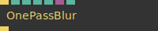

**Full Name:** `Ops.Gl.ImageCompose.OnePassBlur`

**Description:** *Visit [documentation](https://cables.gl/op/Ops.Gl.ImageCompose.OnePassBlur) for details*

**`\inputsymbol`{=latex} Input Ports:**

- **Render** (Trigger)
- **Blend Mode Index** (Number: Integer)
- **Amount** (Number)
- **Radius** (Number)
- **Mask** (Object:Texture)
- **Mask Invert** (Number: Boolean)

**`\outputsymbol`{=latex} Output Ports:**

- **Next** (Trigger)

**Example Patch:** [Open in Editor](https://cables.gl/edit/xHp9eG)

**Docs:** [https://cables.gl/op/Ops.Gl.ImageCompose.OnePassBlur](https://cables.gl/op/Ops.Gl.ImageCompose.OnePassBlur)

### PatternLookup
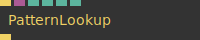

**Full Name:** `Ops.Gl.ImageCompose.PatternLookup`

**Description:** map a pattern to value levels of your texture

**`\inputsymbol`{=latex} Input Ports:**

- **Render** (Trigger)
- **Multiplier** (Object)
- **Blend Mode** (Number: String)
- **Amount** (Number)
- **Width** (Number)
- **Height** (Number)

**`\outputsymbol`{=latex} Output Ports:**

- **Trigger** (Trigger)

**Example Patch:** [Open in Editor](https://cables.gl/edit/lj31ZO)

**Docs:** [https://cables.gl/op/Ops.Gl.ImageCompose.PatternLookup](https://cables.gl/op/Ops.Gl.ImageCompose.PatternLookup)

### Pixelate_v2
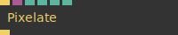

**Full Name:** `Ops.Gl.ImageCompose.Pixelate_v2`

**Description:** Pixelate an image

**`\inputsymbol`{=latex} Input Ports:**

- **Render** (Trigger)
- **Multiplier** (Object:Texture)
- **Blend Mode Index** (Number: Integer)
- **Amount** (Number)
- **Width** (Number)
- **Height** (Number)

**`\outputsymbol`{=latex} Output Ports:**

- **Trigger** (Trigger)

**Example Patch:** [Open in Editor](https://cables.gl/edit/1w_9W6)

**Docs:** [https://cables.gl/op/Ops.Gl.ImageCompose.Pixelate_v2](https://cables.gl/op/Ops.Gl.ImageCompose.Pixelate_v2)

### PixelColor
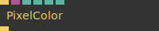

**Full Name:** `Ops.Gl.ImageCompose.PixelColor`

**Description:** fill image with one color picked at a position

**`\inputsymbol`{=latex} Input Ports:**

- **Render** (Trigger)
- **Source Texture** (Object:Texture)
- **Blend Mode Index** (Number: Integer)
- **Amount** (Number)
- **Pos X** (Number)
- **Pos Y** (Number)

**`\outputsymbol`{=latex} Output Ports:**

- **Trigger** (Trigger)

**Example Patch:** [Open in Editor](https://cables.gl/edit/qbiIbk)

**Docs:** [https://cables.gl/op/Ops.Gl.ImageCompose.PixelColor](https://cables.gl/op/Ops.Gl.ImageCompose.PixelColor)

### PixelDifference
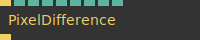

**Full Name:** `Ops.Gl.ImageCompose.PixelDifference`

**Description:** visualize the difference of neighbouring pixels (slope)

**`\inputsymbol`{=latex} Input Ports:**

- **Render** (Trigger)
- **Strength** (Number)
- **Step** (Number)
- **Red Index** (Number: Integer)
- **Red Flip** (Number: Boolean)
- **Green Index** (Number: Integer)
- **Green Flip** (Number: Boolean)
- **Blue Index** (Number: Integer)
- **Blue Flip** (Number: Boolean)

**`\outputsymbol`{=latex} Output Ports:**

- **Trigger** (Trigger)

**Example Patch:** [Open in Editor](https://cables.gl/edit/LEMBZ4)

**Docs:** [https://cables.gl/op/Ops.Gl.ImageCompose.PixelDifference](https://cables.gl/op/Ops.Gl.ImageCompose.PixelDifference)

### PixelDisplacement_v4

**Full Name:** `Ops.Gl.ImageCompose.PixelDisplacement_v4`

**Description:** Changes color lookup for every pixel using a displacement map

**`\inputsymbol`{=latex} Input Ports:**

- **Render** (Trigger)
- **DisplaceTex** (Object:Texture)
- **Blend Mode Index** (Number: Integer)
- **Amount** (Number)
- **Amount X** (Number)
- **Amount Y** (Number)
- **Input Index** (Number: Integer)

**`\outputsymbol`{=latex} Output Ports:**

- **Trigger** (Trigger)

**Example Patch:** [Open in Editor](https://cables.gl/edit/Qxb9W6)

**Docs:** [https://cables.gl/op/Ops.Gl.ImageCompose.PixelDisplacement_v4](https://cables.gl/op/Ops.Gl.ImageCompose.PixelDisplacement_v4)

### Plasma_v2

**Full Name:** `Ops.Gl.ImageCompose.Plasma_v2`

**Description:** Renders a plasma effect

**`\inputsymbol`{=latex} Input Ports:**

- **Render** (Trigger)
- **Blend Mode Index** (Number: Integer)
- **Alpha Mask Index** (Number: Integer)
- **Amount** (Number)
- **Width** (Number)
- **Height** (Number)
- **Aspect** (Number: Boolean)
- **Mul** (Number)
- **X** (Number)
- **Y** (Number)
- **Time** (Number)
- **Greyscale** (Number: Boolean)
- **Offset** (Object:Texture)
- **Offset Multiply** (Number)
- **Offset X Index** (Number: Integer)
- **Offset Y Index** (Number: Integer)
- **Offset Time Index** (Number: Integer)
- **Mask** (Object:Texture)

**`\outputsymbol`{=latex} Output Ports:**

- **Trigger** (Trigger)

**Example Patch:** [Open in Editor](https://cables.gl/edit/dD6aW6)

**Docs:** [https://cables.gl/op/Ops.Gl.ImageCompose.Plasma_v2](https://cables.gl/op/Ops.Gl.ImageCompose.Plasma_v2)

### PolarCoords

**Full Name:** `Ops.Gl.ImageCompose.PolarCoords`

**Description:** display texture using polar/radial coordinate system

**`\inputsymbol`{=latex} Input Ports:**

- **Render** (Trigger)
- **Radius Inner** (Number)
- **Radius Outer** (Number)
- **Crop** (Number: Boolean)

**`\outputsymbol`{=latex} Output Ports:**

- **Trigger** (Trigger)

**Example Patch:** [Open in Editor](https://cables.gl/edit/cM2nB2)

**Docs:** [https://cables.gl/op/Ops.Gl.ImageCompose.PolarCoords](https://cables.gl/op/Ops.Gl.ImageCompose.PolarCoords)

### Posterize_v2

**Full Name:** `Ops.Gl.ImageCompose.Posterize_v2`

**Description:** reduce number of colors

**`\inputsymbol`{=latex} Input Ports:**

- **Render** (Trigger)
- **Blend Mode Index** (Number: Integer)
- **Amount** (Number)
- **Levels** (Number)

**`\outputsymbol`{=latex} Output Ports:**

- **Trigger** (Trigger)

**Example Patch:** [Open in Editor](https://cables.gl/edit/_MMoT6)

**Docs:** [https://cables.gl/op/Ops.Gl.ImageCompose.Posterize_v2](https://cables.gl/op/Ops.Gl.ImageCompose.Posterize_v2)

### PseudoLensFlares

**Full Name:** `Ops.Gl.ImageCompose.PseudoLensFlares`

**Description:** simulate lens flare effect

**`\inputsymbol`{=latex} Input Ports:**

- **Render** (Trigger)
- **Ghosts** (Number)
- **Num Ghosts** (Number: Integer)
- **Dispersal** (Number)
- **Halo** (Number)
- **Halo Width** (Number)
- **Color Lookup** (Object)

**`\outputsymbol`{=latex} Output Ports:**

- **Trigger** (Trigger)

**Example Patch:** [Open in Editor](https://cables.gl/edit/P8heur)

**Docs:** [https://cables.gl/op/Ops.Gl.ImageCompose.PseudoLensFlares](https://cables.gl/op/Ops.Gl.ImageCompose.PseudoLensFlares)

### RandomNumberTexture

**Full Name:** `Ops.Gl.ImageCompose.RandomNumberTexture`

**Description:** Set random numbers into an imagecompose

**`\inputsymbol`{=latex} Input Ports:**

- **Render** (Trigger)
- **Blend Mode Index** (Number: Integer)
- **Amount** (Number)
- **Seed** (Number)
- **Min R** (Number)
- **Max R** (Number)
- **Min G** (Number)
- **Max G** (Number)
- **Min B** (Number)
- **Max B** (Number)
- **Min A** (Number)
- **Max A** (Number)
- **Multiply** (Object:Texture)

**`\outputsymbol`{=latex} Output Ports:**

- **Next** (Trigger)

**Example Patch:** [Open in Editor](https://cables.gl/edit/j_I1TG)

**Docs:** [https://cables.gl/op/Ops.Gl.ImageCompose.RandomNumberTexture](https://cables.gl/op/Ops.Gl.ImageCompose.RandomNumberTexture)

### RectangleTexture_v5

**Full Name:** `Ops.Gl.ImageCompose.RectangleTexture_v5`

**Description:** draws a 2d rectangle into a texture.

**`\inputsymbol`{=latex} Input Ports:**

- **Render** (Trigger)
- **Amount** (Number)
- **Blend Mode Index** (Number: Integer)
- **Center** (Number: Boolean)
- **X** (Number)
- **Y** (Number)
- **Inner** (Number)
- **Width** (Number)
- **Height** (Number)
- **Rotate** (Number)
- **Roundness** (Number)
- **R** (Number)
- **G** (Number)
- **B** (Number)
- **A** (Number)
- **Map Texture** (Object:Texture)
- **Start X** (Number)
- **Start Y** (Number)
- **Map Width** (Number)
- **Map Height** (Number)
- **Mask** (Object:Texture)

**`\outputsymbol`{=latex} Output Ports:**

- **Trigger** (Trigger)

**Example Patch:** [Open in Editor](https://cables.gl/edit/IPPT7i)

**Docs:** [https://cables.gl/op/Ops.Gl.ImageCompose.RectangleTexture_v5](https://cables.gl/op/Ops.Gl.ImageCompose.RectangleTexture_v5)

### RemoveAlpha

**Full Name:** `Ops.Gl.ImageCompose.RemoveAlpha`

**Description:** Remove alpha information from image

**`\inputsymbol`{=latex} Input Ports:**

- **Render** (Trigger)

**`\outputsymbol`{=latex} Output Ports:**

- **Trigger** (Trigger)

**Example Patch:** [Open in Editor](https://cables.gl/op/Ops.Gl.ImageCompose.RemoveAlpha#example)

**Docs:** [https://cables.gl/op/Ops.Gl.ImageCompose.RemoveAlpha](https://cables.gl/op/Ops.Gl.ImageCompose.RemoveAlpha)

### RepeatTexture_v2

**Full Name:** `Ops.Gl.ImageCompose.RepeatTexture_v2`

**Description:** *Visit [documentation](https://cables.gl/op/Ops.Gl.ImageCompose.RepeatTexture_v2) for details*

**`\inputsymbol`{=latex} Input Ports:**

- **Render** (Trigger)
- **Blend Mode Index** (Number: Integer)
- **Amount** (Number)
- **X** (Number)
- **Y** (Number)
- **Clear** (Number: Boolean)
- **Multiply** (Object:Texture)

**`\outputsymbol`{=latex} Output Ports:**

- **Trigger** (Trigger)

**Example Patch:** [Open in Editor](https://cables.gl/edit/S6JnT6)

**Docs:** [https://cables.gl/op/Ops.Gl.ImageCompose.RepeatTexture_v2](https://cables.gl/op/Ops.Gl.ImageCompose.RepeatTexture_v2)

### RgbMultiply

**Full Name:** `Ops.Gl.ImageCompose.RgbMultiply`

**Description:** multiply image colors by color channel

**`\inputsymbol`{=latex} Input Ports:**

- **Render** (Trigger)
- **R** (Number)
- **G** (Number)
- **B** (Number)

**`\outputsymbol`{=latex} Output Ports:**

- **Trigger** (Trigger)

**Example Patch:** [Open in Editor](https://cables.gl/edit/3l_8W6)

**Docs:** [https://cables.gl/op/Ops.Gl.ImageCompose.RgbMultiply](https://cables.gl/op/Ops.Gl.ImageCompose.RgbMultiply)

### RGBOffset_v2

**Full Name:** `Ops.Gl.ImageCompose.RGBOffset_v2`

**Description:** Offsets the xy components of an RGB texture

**`\inputsymbol`{=latex} Input Ports:**

- **Render** (Trigger)
- **Blend Mode Index** (Number: Integer)
- **Amount** (Number)
- **Red Offset X** (Number)
- **Red Offset Y** (Number)
- **Red Amount** (Number)
- **amount of red** (fade, hide, show)
- **Green Offset X** (Number)
- **Green Offset Y** (Number)
- **Green Amount** (Number)
- **amount of green** (fade, hide, show)
- **Blue Offset X** (Number)
- **Blue Offset Y** (Number)
- **Blue Amount** (Number)
- **amount of blue** (fade, hide, show)

**`\outputsymbol`{=latex} Output Ports:**

- **Trigger** (Trigger)

**Example Patch:** [Open in Editor](https://cables.gl/edit/pzC9rn)

**Docs:** [https://cables.gl/op/Ops.Gl.ImageCompose.RGBOffset_v2](https://cables.gl/op/Ops.Gl.ImageCompose.RGBOffset_v2)

### RgbToHsvTexture

**Full Name:** `Ops.Gl.ImageCompose.RgbToHsvTexture`

**Description:** Convert a RGB Texture to Hue/Saturation/Lightness values as RGB colors

**`\inputsymbol`{=latex} Input Ports:**

- **Render** (Trigger)
- **Output RGB Index** (Number: Integer)

**`\outputsymbol`{=latex} Output Ports:**

- **Trigger** (Trigger)

**Example Patch:** [Open in Editor](https://cables.gl/edit/V7z4v4)

**Docs:** [https://cables.gl/op/Ops.Gl.ImageCompose.RgbToHsvTexture](https://cables.gl/op/Ops.Gl.ImageCompose.RgbToHsvTexture)

### RotateTexture_v2

**Full Name:** `Ops.Gl.ImageCompose.RotateTexture_v2`

**Description:** Rotates a texture

**`\inputsymbol`{=latex} Input Ports:**

- **Render** (Trigger)
- **Multiplier** (Object:Texture)
- **Blend Mode Index** (Number: Integer)
- **Amount** (Number)
- **Rotate** (Number)
- **Crop** (Number: Boolean)
- **Clear** (Number: Boolean)

**`\outputsymbol`{=latex} Output Ports:**

- **Trigger** (Trigger)

**Example Patch:** [Open in Editor](https://cables.gl/edit/flURFr)

**Docs:** [https://cables.gl/op/Ops.Gl.ImageCompose.RotateTexture_v2](https://cables.gl/op/Ops.Gl.ImageCompose.RotateTexture_v2)

### RoundCorners

**Full Name:** `Ops.Gl.ImageCompose.RoundCorners`

**Description:** Draw round corners around image (border)

**`\inputsymbol`{=latex} Input Ports:**

- **Render** (Trigger)
- **Radius** (Number)
- **R** (Number)
- **G** (Number)
- **B** (Number)
- **A** (Number)

**`\outputsymbol`{=latex} Output Ports:**

- **Next** (Trigger)

**Example Patch:** [Open in Editor](https://cables.gl/edit/iYLmJ5)

**Docs:** [https://cables.gl/op/Ops.Gl.ImageCompose.RoundCorners](https://cables.gl/op/Ops.Gl.ImageCompose.RoundCorners)

### ScaleTexture_v3

**Full Name:** `Ops.Gl.ImageCompose.ScaleTexture_v3`

**Description:** Scales a texture

**`\inputsymbol`{=latex} Input Ports:**

- **Render** (Trigger)
- **Multiplier** (Object:Texture)
- **Blend Mode Index** (Number: Integer)
- **Amount** (Number)
- **Scale X** (Number)
- **Scale Y** (Number)
- **Offset X** (Number)
- **Offset Y** (Number)
- **Center X** (Number)
- **Center Y** (Number)
- **Clear** (Number: Boolean)

**`\outputsymbol`{=latex} Output Ports:**

- **Trigger** (Trigger)

**Example Patch:** [Open in Editor](https://cables.gl/edit/kj_Zbx)

**Docs:** [https://cables.gl/op/Ops.Gl.ImageCompose.ScaleTexture_v3](https://cables.gl/op/Ops.Gl.ImageCompose.ScaleTexture_v3)

### ScrollTexture

**Full Name:** `Ops.Gl.ImageCompose.ScrollTexture`

**Description:** *Visit [documentation](https://cables.gl/op/Ops.Gl.ImageCompose.ScrollTexture) for details*

**`\inputsymbol`{=latex} Input Ports:**

- **Render** (Trigger)
- **AmountX** (Number)
- **AmountY** (Number)
- **Mask** (Object:Texture)
- **Repeat** (Number: Boolean)

**`\outputsymbol`{=latex} Output Ports:**

- **Trigger** (Trigger)

**Example Patch:** [Open in Editor](https://cables.gl/edit/DutaW6)

**Docs:** [https://cables.gl/op/Ops.Gl.ImageCompose.ScrollTexture](https://cables.gl/op/Ops.Gl.ImageCompose.ScrollTexture)

### Shapes2d_v2

**Full Name:** `Ops.Gl.ImageCompose.Shapes2d_v2`

**Description:** Generates different 2d shapes to use as a texture

**`\inputsymbol`{=latex} Input Ports:**

- **Render** (Trigger)
- **Blend Mode Index** (Number: Integer)
- **Alpha Mask Index** (Number: Integer)
- **Amount** (Number)
- **Shape Index** (Number: Integer)
- **Mirror X** (Number: Boolean)
- **Mirror Y** (Number: Boolean)
- **Offset X** (Number)
- **Offset Y** (Number)
- **FillShape** (Number: Boolean)
- **Line Thickness** (Number)
- **Invert Color** (Number: Boolean)
- **Width** (Number)
- **Height** (Number)
- **Rotate** (Number)
- **R** (Number)
- **G** (Number)
- **B** (Number)
- **A** (Number)

**`\outputsymbol`{=latex} Output Ports:**

- **Trigger** (Trigger)

**Example Patch:** [Open in Editor](https://cables.gl/edit/XBGbPO)

**Docs:** [https://cables.gl/op/Ops.Gl.ImageCompose.Shapes2d_v2](https://cables.gl/op/Ops.Gl.ImageCompose.Shapes2d_v2)

### Sharpen

**Full Name:** `Ops.Gl.ImageCompose.Sharpen`

**Description:** Adjust image sharpness

**`\inputsymbol`{=latex} Input Ports:**

- **Render** (Trigger)
- **Amount** (Number)

**`\outputsymbol`{=latex} Output Ports:**

- **Trigger** (Trigger)

**Example Patch:** [Open in Editor](https://cables.gl/edit/Q6uJjr)

**Docs:** [https://cables.gl/op/Ops.Gl.ImageCompose.Sharpen](https://cables.gl/op/Ops.Gl.ImageCompose.Sharpen)

### SkewStretchImage_v2

**Full Name:** `Ops.Gl.ImageCompose.SkewStretchImage_v2`

**Description:** skew / stretch an image by rendering scaled sides

**`\inputsymbol`{=latex} Input Ports:**

- **Render** (Trigger)
- **Blend Mode Index** (Number: Integer)
- **Amount** (Number)
- **Clamp** (Number: Boolean)
- **Stretch Top** (Number)
- **Stretch Bottom** (Number)
- **Stretch Left** (Number)
- **Stretch Right** (Number)

**`\outputsymbol`{=latex} Output Ports:**

- **Trigger** (Trigger)

**Example Patch:** [Open in Editor](https://cables.gl/edit/M2UA7k)

**Docs:** [https://cables.gl/op/Ops.Gl.ImageCompose.SkewStretchImage_v2](https://cables.gl/op/Ops.Gl.ImageCompose.SkewStretchImage_v2)

### Stripes_v4

**Full Name:** `Ops.Gl.ImageCompose.Stripes_v4`

**Description:** Create a texture of stripes /lines

**`\inputsymbol`{=latex} Input Ports:**

- **Render** (Trigger)
- **Blend Mode Index** (Number: Integer)
- **Amount** (Number)
- **Alpha Mask Index** (Number: Integer)
- **Num** (Number)
- **Width** (Number)
- **Rotate** (Number)
- **Offset** (Number)
- **Gradients** (Number: Boolean)
- **Circular** (Number: Boolean)
- **Invert** (Number: Boolean)
- **R** (Number)
- **G** (Number)
- **B** (Number)

**`\outputsymbol`{=latex} Output Ports:**

- **Trigger** (Trigger)

**Example Patch:** [Open in Editor](https://cables.gl/edit/dYhlT6)

**Docs:** [https://cables.gl/op/Ops.Gl.ImageCompose.Stripes_v4](https://cables.gl/op/Ops.Gl.ImageCompose.Stripes_v4)

### TexMathModulo

**Full Name:** `Ops.Gl.ImageCompose.TexMathModulo`

**Description:** modulo pixel color values

**`\inputsymbol`{=latex} Input Ports:**

- **Render** (Trigger)
- **Blend Mode Index** (Number: Integer)
- **Mask Invert** (Number: Boolean)
- **Mask** (Object:Texture)
- **Amount** (Number)
- **Modulo** (Number)

**`\outputsymbol`{=latex} Output Ports:**

- **Trigger** (Trigger)

**Example Patch:** [Open in Editor](https://cables.gl/edit/FOpoxm)

**Docs:** [https://cables.gl/op/Ops.Gl.ImageCompose.TexMathModulo](https://cables.gl/op/Ops.Gl.ImageCompose.TexMathModulo)

### TextureDifference

**Full Name:** `Ops.Gl.ImageCompose.TextureDifference`

**Description:** render the difference of two textures

**`\inputsymbol`{=latex} Input Ports:**

- **Render** (Trigger)
- **Texture 1** (Object:Texture)
- **Texture 2** (Object:Texture)

**`\outputsymbol`{=latex} Output Ports:**

- **Next** (Trigger)

**Example Patch:** [Open in Editor](https://cables.gl/edit/zCDlTi)

**Docs:** [https://cables.gl/op/Ops.Gl.ImageCompose.TextureDifference](https://cables.gl/op/Ops.Gl.ImageCompose.TextureDifference)

### ToNormalMap_v2

**Full Name:** `Ops.Gl.ImageCompose.ToNormalMap_v2`

**Description:** Convert a black and white map to a normal map

**`\inputsymbol`{=latex} Input Ports:**

- **Render** (Trigger)
- **Strength** (Number)
- **Step Multiplier** (Number)

**`\outputsymbol`{=latex} Output Ports:**

- **Trigger** (Trigger)

**Example Patch:** [Open in Editor](https://cables.gl/edit/L62oT6)

**Docs:** [https://cables.gl/op/Ops.Gl.ImageCompose.ToNormalMap_v2](https://cables.gl/op/Ops.Gl.ImageCompose.ToNormalMap_v2)

### Twirl_v4

**Full Name:** `Ops.Gl.ImageCompose.Twirl_v4`

**Description:** Creates a twirl/swirl/spiral effect in a texture

**`\inputsymbol`{=latex} Input Ports:**

- **Render** (Trigger)
- **Blend Mode Index** (Number: Integer)
- **Amount** (Number)
- **Twist Amount** (Number)
- **Radius** (Number)
- **Center X** (Number)
- **Center Y** (Number)

**`\outputsymbol`{=latex} Output Ports:**

- **Next** (Trigger)

**Example Patch:** [Open in Editor](https://cables.gl/edit/2_pmJ5)

**Docs:** [https://cables.gl/op/Ops.Gl.ImageCompose.Twirl_v4](https://cables.gl/op/Ops.Gl.ImageCompose.Twirl_v4)

### Vibrance

**Full Name:** `Ops.Gl.ImageCompose.Vibrance`

**Description:** adjust vibrance/saturation

**`\inputsymbol`{=latex} Input Ports:**

- **Render** (Trigger)
- **Amount** (Number)

**`\outputsymbol`{=latex} Output Ports:**

- **Trigger** (Trigger)

**Example Patch:** [Open in Editor](https://cables.gl/edit/52iaW6)

**Docs:** [https://cables.gl/op/Ops.Gl.ImageCompose.Vibrance](https://cables.gl/op/Ops.Gl.ImageCompose.Vibrance)

### Vignette_v3

**Full Name:** `Ops.Gl.ImageCompose.Vignette_v3`

**Description:** Simulating an old camera effect of fading away the edges of the image

**`\inputsymbol`{=latex} Input Ports:**

- **Render** (Trigger)
- **Blend Mode Index** (Number: Integer)
- **Alpha Mask Index** (Number: Integer)
- **Amount** (Number)
- **Strength** (Number)
- **Radius** (Number)
- **Sharp** (Number)
- **Aspect** (Number)
- **R** (Number)
- **G** (Number)
- **B** (Number)
- **Alpha** (Number: Boolean)

**`\outputsymbol`{=latex} Output Ports:**

- **Trigger** (Trigger)

**Example Patch:** [Open in Editor](https://cables.gl/edit/WDPlT6)

**Docs:** [https://cables.gl/op/Ops.Gl.ImageCompose.Vignette_v3](https://cables.gl/op/Ops.Gl.ImageCompose.Vignette_v3)

### Waveform_v3

**Full Name:** `Ops.Gl.ImageCompose.Waveform_v3`

**Description:** Generates 4 different waveform textures. Sine, sawtooth,Triangle, Square.

**`\inputsymbol`{=latex} Input Ports:**

- **Render** (Trigger)
- **Blend Mode Index** (Number: Integer)
- **Amount** (Number)
- **Alpha Mask Index** (Number: Integer)
- **Waveform Index** (Number: Integer)
- **Amplitude** (Number)
- **Frequency** (Number)
- **Line Width** (Number)
- **Line Glow** (Number)
- **Invert Color** (Number: Boolean)
- **Solid Fill** (Number: Boolean)
- **Offset X** (Number)
- **Offset Y** (Number)
- **Rotate** (Number)
- **R** (Number)
- **G** (Number)
- **B** (Number)

**`\outputsymbol`{=latex} Output Ports:**

- **Trigger** (Trigger)

**Example Patch:** [Open in Editor](https://cables.gl/edit/9aF_26)

**Docs:** [https://cables.gl/op/Ops.Gl.ImageCompose.Waveform_v3](https://cables.gl/op/Ops.Gl.ImageCompose.Waveform_v3)

### WaveformGradient_v4

**Full Name:** `Ops.Gl.ImageCompose.WaveformGradient_v4`

**Description:** Generate different texture waveforms. Sine, sawtooth and triangle.

**`\inputsymbol`{=latex} Input Ports:**

- **Render** (Trigger)
- **Blend Mode Index** (Number: Integer)
- **Alpha Mask Index** (Number: Integer)
- **Amount** (Number)
- **Mode Index** (Number: Integer)
- **Frequency** (Number)
- **Pow Factor** (Number)
- **Offset** (Number)
- **Rotate** (Number)
- **R** (Number)
- **G** (Number)
- **B** (Number)

**`\outputsymbol`{=latex} Output Ports:**

- **Trigger** (Trigger)

**Example Patch:** [Open in Editor](https://cables.gl/edit/Hfw7yu)

**Docs:** [https://cables.gl/op/Ops.Gl.ImageCompose.WaveformGradient_v4](https://cables.gl/op/Ops.Gl.ImageCompose.WaveformGradient_v4)

### Wobble_v2

**Full Name:** `Ops.Gl.ImageCompose.Wobble_v2`

**Description:** waving wobble motion effect

**`\inputsymbol`{=latex} Input Ports:**

- **Render** (Trigger)
- **Time** (Number)
- **SpeedX** (Number)
- **SpeedY** (Number)
- **RepeatX** (Number)
- **RepeatY** (Number)
- **Multiply** (Number)
- **Amount Map** (Object:Texture)
- **Source Amount Map Index** (Number: Integer)
- **Invert Amount Map** (Number: Boolean)

**`\outputsymbol`{=latex} Output Ports:**

- **Trigger** (Trigger)

**Example Patch:** [Open in Editor](https://cables.gl/edit/wpgXXG)

**Docs:** [https://cables.gl/op/Ops.Gl.ImageCompose.Wobble_v2](https://cables.gl/op/Ops.Gl.ImageCompose.Wobble_v2)

### ZoomBlur_v2

**Full Name:** `Ops.Gl.ImageCompose.ZoomBlur_v2`

**Description:** Directional blur effect

**`\inputsymbol`{=latex} Input Ports:**

- **Render** (Trigger)
- **Strength** (Number)
- **Samples** (Number: Integer)
- **X** (Number)
- **Y** (Number)
- **Strength Map** (Object:Texture)
- **Source Strength Map Index** (Number: Integer)
- **Invert Strength Map** (Number: Boolean)

**`\outputsymbol`{=latex} Output Ports:**

- **Trigger** (Trigger)

**Example Patch:** [Open in Editor](https://cables.gl/edit/qjtoT6)

**Docs:** [https://cables.gl/op/Ops.Gl.ImageCompose.ZoomBlur_v2](https://cables.gl/op/Ops.Gl.ImageCompose.ZoomBlur_v2)

