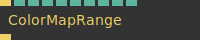
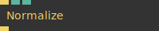
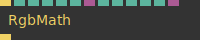
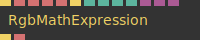
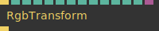
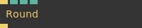
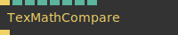

# Ops.Gl.ImageCompose.Math

*Part of the [All Operators Reference](13-_AllOps.md)*

---

## Ops.Gl.ImageCompose.Math

### ColorMapRange

**Full Name:** `Ops.Gl.ImageCompose.Math.ColorMapRange`
**Description:** Map the range of color number values to another

**> Input Ports:**

- **Render** (Trigger)
- **Old Min** (Number)
- **Old Max** (Number)
- **New Min** (Number)
- **New Max** (Number)
- **Clamp** (Number: Boolean)
- **R** (Number: Boolean)
- **G** (Number: Boolean)
- **B** (Number: Boolean)
- **A** (Number: Boolean)

**< Output Ports:**

- **Trigger** (Trigger)

**Example Patch:** [Open in Editor](https://cables.gl/edit/TgoiV6)
**Patches Using This Op:** *Search [cables.gl patches](https://cables.gl/patches) for "ColorMapRange"*
**Docs:** [https://cables.gl/op/Ops.Gl.ImageCompose.Math.ColorMapRange](https://cables.gl/op/Ops.Gl.ImageCompose.Math.ColorMapRange)

---

### Normalize

**Full Name:** `Ops.Gl.ImageCompose.Math.Normalize`
**Description:** normalize texture rgb values

**> Input Ports:**

- **Render** (Trigger)
- **Fade** (Number)
- **Size** (Number)

**< Output Ports:**

- **Trigger** (Trigger)

**Example Patch:** [Open in Editor](https://cables.gl/edit/7c4jW2)
**Patches Using This Op:** *Search [cables.gl patches](https://cables.gl/patches) for "Normalize"*
**Docs:** [https://cables.gl/op/Ops.Gl.ImageCompose.Math.Normalize](https://cables.gl/op/Ops.Gl.ImageCompose.Math.Normalize)

---

### RgbeToFloat32Texture

**Full Name:** `Ops.Gl.ImageCompose.Math.RgbeToFloat32Texture`
**Description:** Convert a RGBE texture to HDR/floating point texture

**> Input Ports:**

- **Render** (Trigger)
- **Blend Mode Index** (Number: Integer)
- **Amount** (Number)
- **Mode Index** (Number: Integer)
- **Min** (Number)
- **Max** (Number)

**< Output Ports:**

- **Trigger** (Trigger)

**Example Patch:** [Open in Editor](https://cables.gl/edit/adsLpX)
**Patches Using This Op:** *Search [cables.gl patches](https://cables.gl/patches) for "RgbeToFloat32Texture"*
**Docs:** [https://cables.gl/op/Ops.Gl.ImageCompose.Math.RgbeToFloat32Texture](https://cables.gl/op/Ops.Gl.ImageCompose.Math.RgbeToFloat32Texture)

---

### RgbMath

**Full Name:** `Ops.Gl.ImageCompose.Math.RgbMath`
**Description:** This OP enables you to use precise values to modify the pixels in your texture. For example adjusting texture values that are modifying your geometry or array values, or even your post processing compositions.

**> Input Ports:**

- **Render** (Trigger)
- **Operation Index** (Number: Integer)
- **R Active** (Number: Boolean)
- **G Active** (Number: Boolean)
- **B Active** (Number: Boolean)
- **A Active** (Number: Boolean)
- **Texture** (Object:Texture)
- **R** (Number)
- **G** (Number)
- **B** (Number)
- **A** (Number)
- **Multiply Texture** (Number)
- **Mask** (Object:Texture)

**< Output Ports:**

- **Trigger** (Trigger)

**Example Patch:** [Open in Editor](https://cables.gl/edit/H3cEpX)
**Patches Using This Op:** *Search [cables.gl patches](https://cables.gl/patches) for "RgbMath"*
**Docs:** [https://cables.gl/op/Ops.Gl.ImageCompose.Math.RgbMath](https://cables.gl/op/Ops.Gl.ImageCompose.Math.RgbMath)

---

### RgbMathExpression

**Full Name:** `Ops.Gl.ImageCompose.Math.RgbMathExpression`
**Description:** Execute a glsl code math expression in a image compose

**> Input Ports:**

- **Render** (Trigger)
- **Update Shader** (Trigger)
- **X** (Number)
- **Y** (Number)
- **Z** (Number)
- **W** (Number)
- **TexA** (Object:Texture)
- **TexB** (Object:Texture)
- **TexC** (Object:Texture)

**< Output Ports:**

- **Trigger** (Trigger)
- **Code** (String)

**Example Patch:** [Open in Editor](https://cables.gl/edit/tG4xFs)
**Patches Using This Op:** *Search [cables.gl patches](https://cables.gl/patches) for "RgbMathExpression"*
**Docs:** [https://cables.gl/op/Ops.Gl.ImageCompose.Math.RgbMathExpression](https://cables.gl/op/Ops.Gl.ImageCompose.Math.RgbMathExpression)

---

### RgbTransform

**Full Name:** `Ops.Gl.ImageCompose.Math.RgbTransform`
**Description:** transform RGB values interpreted as XYZ coordinates

**> Input Ports:**

- **Render** (Trigger)
- **Translate** (Number: Boolean)
- **Pos X** (Number)
- **Pos Y** (Number)
- **Pos Z** (Number)
- **Scale** (Number: Boolean)
- **Scale X** (Number)
- **Scale Y** (Number)
- **Scale Z** (Number)
- **Rotate** (Number: Boolean)
- **Rotation X** (Number)
- **Rotation Y** (Number)
- **Rotation Z** (Number)
- **Mask** (Object:Texture)

**< Output Ports:**

- **Trigger** (Trigger)

**Example Patch:** [Open in Editor](https://cables.gl/edit/UJvMbk)
**Patches Using This Op:** *Search [cables.gl patches](https://cables.gl/patches) for "RgbTransform"*
**Docs:** [https://cables.gl/op/Ops.Gl.ImageCompose.Math.RgbTransform](https://cables.gl/op/Ops.Gl.ImageCompose.Math.RgbTransform)

---

### Round

**Full Name:** `Ops.Gl.ImageCompose.Math.Round`
**Description:** Round number values of texture color channels

**> Input Ports:**

- **Render** (Trigger)
- **Amount** (Number)
- **Multiplier** (Number)

**< Output Ports:**

- **Trigger** (Trigger)

**Example Patch:** [Open in Editor](https://cables.gl/op/Ops.Gl.ImageCompose.Math.Round#example)
**Patches Using This Op:** *Search [cables.gl patches](https://cables.gl/patches) for "Round"*
**Docs:** [https://cables.gl/op/Ops.Gl.ImageCompose.Math.Round](https://cables.gl/op/Ops.Gl.ImageCompose.Math.Round)

---

### TexMathCompare

**Full Name:** `Ops.Gl.ImageCompose.Math.TexMathCompare`
**Description:** compare and pass through of color channel values

**> Input Ports:**

- **Render** (Trigger)
- **Comparison Index** (Number: Integer)
- **Result Index** (Number: Integer)
- **Number** (Number)
- **R Active** (Number: Boolean)
- **G Active** (Number: Boolean)
- **B Active** (Number: Boolean)
- **A Active** (Number: Boolean)

**< Output Ports:**

- **Trigger** (Trigger)

**Example Patch:** [Open in Editor](https://cables.gl/edit/RjKQWp)
**Patches Using This Op:** *Search [cables.gl patches](https://cables.gl/patches) for "TexMathCompare"*
**Docs:** [https://cables.gl/op/Ops.Gl.ImageCompose.Math.TexMathCompare](https://cables.gl/op/Ops.Gl.ImageCompose.Math.TexMathCompare)

---

