# Ops.Gl.ImageCompose.Noise


```{=latex}
\OpsSubsubNoSubsectionNumbering\setcounter{subsubsection}{0}
```
### CellularNoise_v2
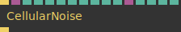

**Full Name:** `Ops.Gl.ImageCompose.Noise.CellularNoise_v2`

*Visit [documentation](https://cables.gl/op/Ops.Gl.ImageCompose.Noise.CellularNoise_v2) for details*.

**`\inputsymbol`{=latex} Inputs**

- **Render** (Trigger)
- **Mask** (Object:Texture)
- **Blend Mode Index** (Number: Integer)
- **Alpha Mask Index** (Number: Integer)
- **Amount** (Number)
- **X** (Number)
- **Y** (Number)
- **Z** (Number)
- **Scale** (Number)
- **Harmonics Index** (Number: Integer)
- **Tileable** (Number: Boolean)
- **Offset** (Object:Texture)
- **Offset Multiply** (Number)
- **Offset X Index** (Number: Integer)
- **Offset Y Index** (Number: Integer)
- **Offset Z Index** (Number: Integer)

**`\outputsymbol`{=latex} Output**

- **Trigger** (Trigger)

**Example:** [cables.gl/edit/9DZmT6](https://cables.gl/edit/9DZmT6)

**Doc:** [cables.gl/op/Ops.Gl.ImageCompose.Noise.CellularNoise_v2](https://cables.gl/op/Ops.Gl.ImageCompose.Noise.CellularNoise_v2)

### FBMNoise_v2


**Full Name:** `Ops.Gl.ImageCompose.Noise.FBMNoise_v2`

fractional brownian motion noise.

**`\inputsymbol`{=latex} Inputs**

- **Render** (Trigger)
- **Blend Mode Index** (Number: Integer)
- **Amount** (Number)
- **Alpha Mask Index** (Number: Integer)
- **R** (Number)
- **G** (Number)
- **B** (Number)
- **Scale** (Number)
- **Anim** (Number)
- **ScrollX** (Number)
- **ScrollY** (Number)
- **Repeat** (Number)
- **Aspect** (Number)
- **Layer 1** (Number: Boolean)
- **Layer 2** (Number: Boolean)
- **Layer 3** (Number: Boolean)
- **Layer 4** (Number: Boolean)
- **Tileable** (Number: Boolean)

**`\outputsymbol`{=latex} Output**

- **Trigger** (Trigger)

**Example:** [cables.gl/edit/DmWmT6](https://cables.gl/edit/DmWmT6)

**Doc:** [cables.gl/op/Ops.Gl.ImageCompose.Noise.FBMNoise_v2](https://cables.gl/op/Ops.Gl.ImageCompose.Noise.FBMNoise_v2)

### GaborNoise
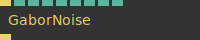

**Full Name:** `Ops.Gl.ImageCompose.Noise.GaborNoise`

Render "gabor noise" into a texture.

**`\inputsymbol`{=latex} Inputs**

- **Render** (Trigger)
- **Blend Mode Index** (Number: Integer)
- **Amount** (Number)
- **Phase** (Number)
- **Scale** (Number)
- **X** (Number)
- **Y** (Number)

**`\outputsymbol`{=latex} Output**

- **Next** (Trigger)

**Example:** [cables.gl/edit/PWDdQm](https://cables.gl/edit/PWDdQm)

**Doc:** [cables.gl/op/Ops.Gl.ImageCompose.Noise.GaborNoise](https://cables.gl/op/Ops.Gl.ImageCompose.Noise.GaborNoise)

### GlitchNoise_v2
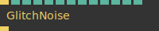

**Full Name:** `Ops.Gl.ImageCompose.Noise.GlitchNoise_v2`

Creates a black and white glitched texture to use for displacement.

**`\inputsymbol`{=latex} Inputs**

- **Render** (Trigger)
- **Amount** (Number)
- **Blend Mode Index** (Number: Integer)
- **Alpha Mask Index** (Number: Integer)
- **Seed** (Number)
- **Frequency** (Number)
- **Strength** (Number)
- **Block Size Small X** (Number)
- **Block Size Small Y** (Number)
- **Block Size Large X** (Number)
- **Block Size Large Y** (Number)
- **Scroll X** (Number)
- **Scroll Y** (Number)

**`\outputsymbol`{=latex} Output**

- **Trigger** (Trigger)

**Example:** [cables.gl/edit/cknm0r](https://cables.gl/edit/cknm0r)

**Doc:** [cables.gl/op/Ops.Gl.ImageCompose.Noise.GlitchNoise_v2](https://cables.gl/op/Ops.Gl.ImageCompose.Noise.GlitchNoise_v2)

### HexagonNoise_v2
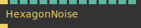

**Full Name:** `Ops.Gl.ImageCompose.Noise.HexagonNoise_v2`

Creates a hexagonal noise.

**`\inputsymbol`{=latex} Inputs**

- **Render** (Trigger)
- **Blend Mode Index** (Number: Integer)
- **Amount** (Number)
- **Alpha Mask Index** (Number: Integer)
- **Loop** (Number: Boolean)
- **RGB** (Number: Boolean)
- **Minimum Value** (Number)
- **Maximum Value** (Number)
- **Scale** (Number)
- **Orientation** (Number: Boolean)
- **X** (Number)
- **Y** (Number)
- **Z** (Number)
- **Seed** (Number)

**`\outputsymbol`{=latex} Output**

- **Next** (Trigger)

**Example:** [cables.gl/edit/plbB53](https://cables.gl/edit/plbB53)

**Doc:** [cables.gl/op/Ops.Gl.ImageCompose.Noise.HexagonNoise_v2](https://cables.gl/op/Ops.Gl.ImageCompose.Noise.HexagonNoise_v2)

### LayerNoise_v3
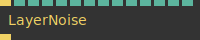

**Full Name:** `Ops.Gl.ImageCompose.Noise.LayerNoise_v3`

Multilayer perlin noise variation.

**`\inputsymbol`{=latex} Inputs**

- **Render** (Trigger)
- **Blend Mode Index** (Number: Integer)
- **Amount** (Number)
- **Alpha Mask Index** (Number: Integer)
- **Mode Index** (Number: Integer)
- **RGBA** (Number: Boolean)
- **Scale** (Number)
- **Layers** (Number: Integer)
- **Factor** (Number)
- **Exponent** (Number)
- **ScrollX** (Number)
- **ScrollY** (Number)
- **ScrollZ** (Number)
- **Tileable** (Number: Boolean)

**`\outputsymbol`{=latex} Output**

- **Trigger** (Trigger)

**Example:** [cables.gl/edit/NSYy0t](https://cables.gl/edit/NSYy0t)

**Doc:** [cables.gl/op/Ops.Gl.ImageCompose.Noise.LayerNoise_v3](https://cables.gl/op/Ops.Gl.ImageCompose.Noise.LayerNoise_v3)

### Noise_v2
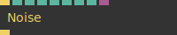

**Full Name:** `Ops.Gl.ImageCompose.Noise.Noise_v2`

White noise pixel effect.

**`\inputsymbol`{=latex} Inputs**

- **Render** (Trigger)
- **Blend Mode Index** (Number: Integer)
- **Amount** (Number)
- **Threshold** (Number)
- **Animated** (Number: Boolean)
- **RGB** (Number: Boolean)
- **Normalize** (Number: Boolean)
- **Multiply** (Object:Texture)

**`\outputsymbol`{=latex} Output**

- **Next** (Trigger)

**Example:** [cables.gl/edit/PdHmT6](https://cables.gl/edit/PdHmT6)

**Doc:** [cables.gl/op/Ops.Gl.ImageCompose.Noise.Noise_v2](https://cables.gl/op/Ops.Gl.ImageCompose.Noise.Noise_v2)

### PerlinNoise_v2
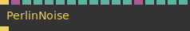

**Full Name:** `Ops.Gl.ImageCompose.Noise.PerlinNoise_v2`

Draw perlin noise into an image.

**`\inputsymbol`{=latex} Inputs**

- **Render** (Trigger)
- **Mask** (Object:Texture)
- **Blend Mode Index** (Number: Integer)
- **Alpha Mask Index** (Number: Integer)
- **Amount** (Number)
- **Color Index** (Number: Integer)
- **Scale** (Number)
- **Multiply** (Number)
- **Harmonics Index** (Number: Integer)
- **X** (Number)
- **Y** (Number)
- **Z** (Number)
- **Offset** (Object:Texture)
- **Offset Multiply** (Number)
- **Offset X Index** (Number: Integer)
- **Offset Y Index** (Number: Integer)
- **Offset Z Index** (Number: Integer)

**`\outputsymbol`{=latex} Output**

- **Trigger** (Trigger)

**Example:** [cables.gl/edit/zfzmT6](https://cables.gl/edit/zfzmT6)

**Doc:** [cables.gl/op/Ops.Gl.ImageCompose.Noise.PerlinNoise_v2](https://cables.gl/op/Ops.Gl.ImageCompose.Noise.PerlinNoise_v2)

### PixelNoise_v3


**Full Name:** `Ops.Gl.ImageCompose.Noise.PixelNoise_v3`

Amount of blend mode to apply.

**`\inputsymbol`{=latex} Inputs**

- **Render** (Trigger)
- **Blend Mode Index** (Number: Integer)
- **Alpha Mask Index** (Number: Integer)
- **Amount** (Number)
- **Loop** (Number: Boolean)
- **RGB** (Number: Boolean)
- **Minimum Value** (Number)
- **Maximum Value** (Number)
- **Num X** (Number)
- **Num Y** (Number)
- **X** (Number)
- **Y** (Number)
- **Z** (Number)
- **Seed** (Number)
- **Centered** (Number: Boolean)

**`\outputsymbol`{=latex} Output**

- **Next** (Trigger)

**Example:** [cables.gl/edit/pdjoOb](https://cables.gl/edit/pdjoOb)

**Doc:** [cables.gl/op/Ops.Gl.ImageCompose.Noise.PixelNoise_v3](https://cables.gl/op/Ops.Gl.ImageCompose.Noise.PixelNoise_v3)

### PolkaDotNoise_v2
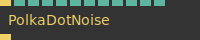

**Full Name:** `Ops.Gl.ImageCompose.Noise.PolkaDotNoise_v2`

*Visit [documentation](https://cables.gl/op/Ops.Gl.ImageCompose.Noise.PolkaDotNoise_v2) for details*.

**`\inputsymbol`{=latex} Inputs**

- **Render** (Trigger)
- **Blend Mode Index** (Number: Integer)
- **Amount** (Number)
- **Alpha Mask Index** (Number: Integer)
- **Square Look** (Number: Boolean)
- **Threshold** (Number)
- **Radius Low** (Number)
- **Radius High** (Number)
- **Scale** (Number)
- **X** (Number)
- **Y** (Number)
- **Z** (Number)

**`\outputsymbol`{=latex} Output**

- **Next** (Trigger)

**Example:** [cables.gl/edit/pKNTub](https://cables.gl/edit/pKNTub)

**Doc:** [cables.gl/op/Ops.Gl.ImageCompose.Noise.PolkaDotNoise_v2](https://cables.gl/op/Ops.Gl.ImageCompose.Noise.PolkaDotNoise_v2)

### Shardnoise
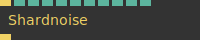

**Full Name:** `Ops.Gl.ImageCompose.Noise.Shardnoise`

Render "shard noise" into a texture.

**`\inputsymbol`{=latex} Inputs**

- **Render** (Trigger)
- **Blend Mode Index** (Number: Integer)
- **Amount** (Number)
- **Sharpness** (Number)
- **Scale** (Number)
- **Round** (Number: Boolean)
- **X** (Number)
- **Y** (Number)
- **Z** (Number)

**`\outputsymbol`{=latex} Output**

- **Next** (Trigger)

**Example:** [cables.gl/edit/GSZtvs](https://cables.gl/edit/GSZtvs)

**Doc:** [cables.gl/op/Ops.Gl.ImageCompose.Noise.Shardnoise](https://cables.gl/op/Ops.Gl.ImageCompose.Noise.Shardnoise)

### SimplexNoise_v2
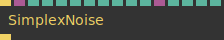

**Full Name:** `Ops.Gl.ImageCompose.Noise.SimplexNoise_v2`

simplex noise generator.

**`\inputsymbol`{=latex} Inputs**

- **Render** (Trigger)
- **Mask** (Object:Texture)
- **Blend Mode Index** (Number: Integer)
- **Amount** (Number)
- **Alpha Mask Index** (Number: Integer)
- **Smoothness** (Number)
- **Harmonics Index** (Number: Integer)
- **Scale** (Number)
- **X** (Number)
- **Y** (Number)
- **Time** (Number)
- **Offset** (Object:Texture)
- **Offset Multiply** (Number)
- **Offset X Index** (Number: Integer)
- **Offset Y Index** (Number: Integer)
- **Offset Z Index** (Number: Integer)

**`\outputsymbol`{=latex} Output**

- **Trigger** (Trigger)

**Example:** [cables.gl/edit/c3vmUf](https://cables.gl/edit/c3vmUf)

**Doc:** [cables.gl/op/Ops.Gl.ImageCompose.Noise.SimplexNoise_v2](https://cables.gl/op/Ops.Gl.ImageCompose.Noise.SimplexNoise_v2)

### TriangleNoise_v2
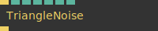

**Full Name:** `Ops.Gl.ImageCompose.Noise.TriangleNoise_v2`

noise made from triangles.

**`\inputsymbol`{=latex} Inputs**

- **Render** (Trigger)
- **Blend Mode Index** (Number: Integer)
- **Amount** (Number)
- **Alpha Mask Index** (Number: Integer)
- **Scale** (Number)
- **Angle** (Number)
- **Add** (Number)

**`\outputsymbol`{=latex} Output**

- **Next** (Trigger)

**Example:** [cables.gl/edit/wvkJyC](https://cables.gl/edit/wvkJyC)

**Doc:** [cables.gl/op/Ops.Gl.ImageCompose.Noise.TriangleNoise_v2](https://cables.gl/op/Ops.Gl.ImageCompose.Noise.TriangleNoise_v2)

### ValueNoise_v2
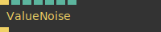

**Full Name:** `Ops.Gl.ImageCompose.Noise.ValueNoise_v2`

*Visit [documentation](https://cables.gl/op/Ops.Gl.ImageCompose.Noise.ValueNoise_v2) for details*.

**`\inputsymbol`{=latex} Inputs**

- **Render** (Trigger)
- **Blend Mode Index** (Number: Integer)
- **Amount** (Number)
- **Scale** (Number)
- **X** (Number)
- **Y** (Number)
- **Z** (Number)

**`\outputsymbol`{=latex} Output**

- **Trigger** (Trigger)

**Example:** [cables.gl/edit/SgTmT6](https://cables.gl/edit/SgTmT6)

**Doc:** [cables.gl/op/Ops.Gl.ImageCompose.Noise.ValueNoise_v2](https://cables.gl/op/Ops.Gl.ImageCompose.Noise.ValueNoise_v2)

### Voronoise_v2
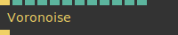

**Full Name:** `Ops.Gl.ImageCompose.Noise.Voronoise_v2`

Voronoi Noise function.

**`\inputsymbol`{=latex} Inputs**

- **Render** (Trigger)
- **Blend Mode Index** (Number: Integer)
- **Amount** (Number)
- **Alpha Mask Index** (Number: Integer)
- **Time** (Number)
- **Movement** (Number)
- **Num** (Number)
- **Seed** (Number)
- **Fill Index** (Number: Integer)
- **Draw Isolines** (Number: Boolean)
- **Draw Distance** (Number: Boolean)
- **Draw Center** (Number)

**`\outputsymbol`{=latex} Output**

- **Trigger** (Trigger)

**Example:** [cables.gl/edit/3zb6Us](https://cables.gl/edit/3zb6Us)

**Doc:** [cables.gl/op/Ops.Gl.ImageCompose.Noise.Voronoise_v2](https://cables.gl/op/Ops.Gl.ImageCompose.Noise.Voronoise_v2)

### WorleyNoise_v2


**Full Name:** `Ops.Gl.ImageCompose.Noise.WorleyNoise_v2`

*Visit [documentation](https://cables.gl/op/Ops.Gl.ImageCompose.Noise.WorleyNoise_v2) for details*.

**`\inputsymbol`{=latex} Inputs**

- **Render** (Trigger)
- **Blend Mode Index** (Number: Integer)
- **Alpha Mask Index** (Number: Integer)
- **Amount** (Number)
- **X** (Number)
- **Y** (Number)
- **Z** (Number)
- **Scale** (Number)
- **Harmonics Index** (Number: Integer)
- **Invert** (Number: Boolean)
- **RangeA** (Number)
- **RangeB** (Number)
- **Tileable** (Number: Boolean)
- **Amount Map** (Object:Texture)
- **Source Strength Map Index** (Number: Integer)
- **Invert Strength Map** (Number: Boolean)
- **Offset** (Object:Texture)
- **Offset Multiply** (Number)
- **Offset X Index** (Number: Integer)
- **Offset Y Index** (Number: Integer)
- **Offset Z Index** (Number: Integer)

**`\outputsymbol`{=latex} Output**

- **Trigger** (Trigger)

**Example:** [cables.gl/edit/sivDJd](https://cables.gl/edit/sivDJd)

**Doc:** [cables.gl/op/Ops.Gl.ImageCompose.Noise.WorleyNoise_v2](https://cables.gl/op/Ops.Gl.ImageCompose.Noise.WorleyNoise_v2)


