# Ops.Gl.Matrix

---

```{=latex}
\stepcounter{subsection}\setcounter{subsubsection}{0}
```
### AnimMatrix
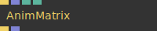

**Full Name:** `Ops.Gl.Matrix.AnimMatrix`

**Description:** animate values in a matrix to a new matrix

**`\inputsymbol`{=latex} Inputs**

- **Update** (Trigger)
- **Next Matrix** (Array)
- **Duration** (Number)
- **Easing Index** (Number: Integer)

**`\outputsymbol`{=latex} Output**

- **Next** (Trigger)
- **Matrix** (Array)

**Example Patch:** [Open in Editor](https://cables.gl/edit/99cg1x)

**Docs:** [https://cables.gl/op/Ops.Gl.Matrix.AnimMatrix](https://cables.gl/op/Ops.Gl.Matrix.AnimMatrix)

### ArrayPathFollow
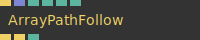

**Full Name:** `Ops.Gl.Matrix.ArrayPathFollow`

**Description:** interpolate position on a spline/array3x

**`\inputsymbol`{=latex} Inputs**

- **Exe** (Trigger)
- **Array** (Array)
- **Time** (Number)
- **Duration** (Number)
- **Offset** (Number)
- **Look Ahead** (Number)

**`\outputsymbol`{=latex} Output**

- **Trigger** (Trigger)
- **Transform Lookat** (Trigger)
- **Index** (Number)

**Example Patch:** [Open in Editor](https://cables.gl/edit/lL9_EF)

**Docs:** [https://cables.gl/op/Ops.Gl.Matrix.ArrayPathFollow](https://cables.gl/op/Ops.Gl.Matrix.ArrayPathFollow)

### ArrayPathFollowParticles_v2
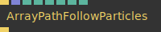

**Full Name:** `Ops.Gl.Matrix.ArrayPathFollowParticles_v2`

**Description:** render lots of particles following a path/spline/array3x

**`\inputsymbol`{=latex} Inputs**

- **Exec** (Trigger)
- **Points** (Array)
- **Num Particles** (Number)
- **Length** (Number)
- **Spread** (Number)
- **Offset** (Number)
- **Max Distance** (Number)
- **RandomSpeed** (Number: Boolean)

**`\outputsymbol`{=latex} Output**

- **Next** (Trigger)

**Example Patch:** [Open in Editor](https://cables.gl/edit/4wT0J6)

**Docs:** [https://cables.gl/op/Ops.Gl.Matrix.ArrayPathFollowParticles_v2](https://cables.gl/op/Ops.Gl.Matrix.ArrayPathFollowParticles_v2)

### Billboard
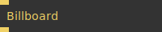

**Full Name:** `Ops.Gl.Matrix.Billboard`

**Description:** rotate an object to always face the camera

**`\inputsymbol`{=latex} Inputs**

- **Exec** (Trigger)

**`\outputsymbol`{=latex} Output**

- **Next** (Trigger)

**Example Patch:** [Open in Editor](https://cables.gl/edit/GVpkrq)

**Docs:** [https://cables.gl/op/Ops.Gl.Matrix.Billboard](https://cables.gl/op/Ops.Gl.Matrix.Billboard)

### Camera_v2


**Full Name:** `Ops.Gl.Matrix.Camera_v2`

**Description:** Transforms and projects the scene from the point of view of the camera.

**`\inputsymbol`{=latex} Inputs**

- **Render** (Trigger)
- **Identity** (Number: Boolean)
- **Projection Mode Index** (Number: Integer)
- **Frustum Near** (Number)
- **Frustum Far** (Number)
- **Fov** (Number)
- **Auto Aspect Ratio** (Number: Boolean)
- **Aspect Ratio** (Number)
- **Eye X** (Number)
- **Eye Y** (Number)
- **Eye Z** (Number)
- **Center X** (Number)
- **Center Y** (Number)
- **Center Z** (Number)
- **Truck** (Number)
- **Move sideways** (in local x axis)
- **Boom** (Number)
- **Dolly** (Number)
- **Tilt** (Number)
- **Pan** (Number)
- **Roll** (Number)

**`\outputsymbol`{=latex} Output**

- **Trigger** (Trigger)
- **Aspect** (Number)
- **Look At Array** (Array)

**Example Patch:** [Open in Editor](https://cables.gl/edit/PSw73e)

**Docs:** [https://cables.gl/op/Ops.Gl.Matrix.Camera_v2](https://cables.gl/op/Ops.Gl.Matrix.Camera_v2)

### CameraInfo


**Full Name:** `Ops.Gl.Matrix.CameraInfo`

**Description:** get camera attributes from current camera/orbit controls

**`\inputsymbol`{=latex} Inputs**

- **Render** (Trigger)
- **Camera Type Index** (Number: Integer)

**`\outputsymbol`{=latex} Output**

- **Trigger** (Trigger)
- **X** (Number)
- **Y** (Number)
- **Z** (Number)
- **Right X** (Number)
- **Right Y** (Number)
- **Right Z** (Number)
- **Up X** (Number)
- **Up Y** (Number)
- **Up Z** (Number)
- **Forward X** (Number)
- **Forward Y** (Number)
- **Forward Z** (Number)
- **Near Frustum** (Number)
- **Far Frustum** (Number)
- **Bottom Frustum** (Number)
- **Top Frustum** (Number)
- **Left Frustum** (Number)
- **Right Frustum** (Number)
- **FOV** (Number)
- **Aspect Ratio** (Number)

**Example Patch:** [Open in Editor](https://cables.gl/edit/YfJ4S-)

**Docs:** [https://cables.gl/op/Ops.Gl.Matrix.CameraInfo](https://cables.gl/op/Ops.Gl.Matrix.CameraInfo)

### CameraPosition
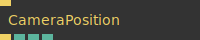

**Full Name:** `Ops.Gl.Matrix.CameraPosition`

**Description:** get the current position of viewmatrix/camera eye

**`\inputsymbol`{=latex} Inputs**

- **Render** (Trigger)

**`\outputsymbol`{=latex} Output**

- **Trigger** (Trigger)
- **X** (Number)
- **Y** (Number)
- **Z** (Number)

**Example Patch:** [Open in Editor](https://cables.gl/edit/JwL86R)

**Docs:** [https://cables.gl/op/Ops.Gl.Matrix.CameraPosition](https://cables.gl/op/Ops.Gl.Matrix.CameraPosition)

### Coordinates
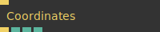

**Full Name:** `Ops.Gl.Matrix.Coordinates`

**Description:** current xyz coordinates (modelmatrix)

**`\inputsymbol`{=latex} Inputs**

- **Render** (Trigger)

**`\outputsymbol`{=latex} Output**

- **Trigger** (Trigger)
- **X** (Number)
- **Y** (Number)
- **Z** (Number)

**Example Patch:** [Open in Editor](https://cables.gl/edit/2AtI98)

**Docs:** [https://cables.gl/op/Ops.Gl.Matrix.Coordinates](https://cables.gl/op/Ops.Gl.Matrix.Coordinates)

### DeviceOrientationCamera
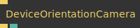

**Full Name:** `Ops.Gl.Matrix.DeviceOrientationCamera`

**Description:** gyroscope motionsensor camera

**`\inputsymbol`{=latex} Inputs**

- **Render** (Trigger)

**`\outputsymbol`{=latex} Output**

- **Next** (Trigger)
- **Window Orientation** (Number)

**Example Patch:** [Open in Editor](https://cables.gl/edit/dZ8wQ0)

**Docs:** [https://cables.gl/op/Ops.Gl.Matrix.DeviceOrientationCamera](https://cables.gl/op/Ops.Gl.Matrix.DeviceOrientationCamera)

### GetMatrixScaling
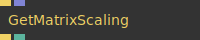

**Full Name:** `Ops.Gl.Matrix.GetMatrixScaling`

**Description:** Get the scalar scaling of a matrix

**`\inputsymbol`{=latex} Inputs**

- **Render** (Trigger)
- **Matrix** (Array)

**`\outputsymbol`{=latex} Output**

- **Trigger** (Trigger)
- **Scaling** (Number)

**Example Patch:** [Open in Editor](https://cables.gl/op/Ops.Gl.Matrix.GetMatrixScaling#example)

**Docs:** [https://cables.gl/op/Ops.Gl.Matrix.GetMatrixScaling](https://cables.gl/op/Ops.Gl.Matrix.GetMatrixScaling)

### GetModelMatrix
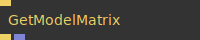

**Full Name:** `Ops.Gl.Matrix.GetModelMatrix`

**Description:** Get current modelmatrix

**`\inputsymbol`{=latex} Inputs**

- **Render** (Trigger)

**`\outputsymbol`{=latex} Output**

- **Trigger** (Trigger)
- **Matrix** (Array)

**Example Patch:** [Open in Editor](https://cables.gl/edit/HkYpci)

**Docs:** [https://cables.gl/op/Ops.Gl.Matrix.GetModelMatrix](https://cables.gl/op/Ops.Gl.Matrix.GetModelMatrix)

### GetProjectionMatrix
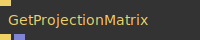

**Full Name:** `Ops.Gl.Matrix.GetProjectionMatrix`

**Description:** get current projectionmatrix

**`\inputsymbol`{=latex} Inputs**

- **Render** (Trigger)

**`\outputsymbol`{=latex} Output**

- **Trigger** (Trigger)
- **Matrix** (Array)

**Example Patch:** [Open in Editor](https://cables.gl/edit/573_4S)

**Docs:** [https://cables.gl/op/Ops.Gl.Matrix.GetProjectionMatrix](https://cables.gl/op/Ops.Gl.Matrix.GetProjectionMatrix)

### GetViewMatrix


**Full Name:** `Ops.Gl.Matrix.GetViewMatrix`

**Description:** get current viewmatrix

**`\inputsymbol`{=latex} Inputs**

- **Render** (Trigger)

**`\outputsymbol`{=latex} Output**

- **Trigger** (Trigger)
- **Matrix** (Array)

**Example Patch:** [Open in Editor](https://cables.gl/edit/hDWuci)

**Docs:** [https://cables.gl/op/Ops.Gl.Matrix.GetViewMatrix](https://cables.gl/op/Ops.Gl.Matrix.GetViewMatrix)

### InterpolateMatrix
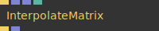

**Full Name:** `Ops.Gl.Matrix.InterpolateMatrix`

**Description:** interpolate between two matrices

**`\inputsymbol`{=latex} Inputs**

- **Exe** (Trigger)
- **Array 1** (Array)
- **Array 2** (Array)
- **Perc** (Number)

**`\outputsymbol`{=latex} Output**

- **Next** (Trigger)
- **Result** (Array)

**Example Patch:** [Open in Editor](https://cables.gl/op/Ops.Gl.Matrix.InterpolateMatrix#example)

**Docs:** [https://cables.gl/op/Ops.Gl.Matrix.InterpolateMatrix](https://cables.gl/op/Ops.Gl.Matrix.InterpolateMatrix)

### InvertMatrix
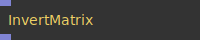

**Full Name:** `Ops.Gl.Matrix.InvertMatrix`

**Description:** outputs an inverted matrix

**`\inputsymbol`{=latex} Inputs**

- **Matrix** (Array)

**`\outputsymbol`{=latex} Output**

- **Result** (Array)

**Example Patch:** [Open in Editor](https://cables.gl/edit/G51FhI)

**Docs:** [https://cables.gl/op/Ops.Gl.Matrix.InvertMatrix](https://cables.gl/op/Ops.Gl.Matrix.InvertMatrix)

### LookatCamera


**Full Name:** `Ops.Gl.Matrix.LookatCamera`

**Description:** transforms view to look from eye to center

**`\inputsymbol`{=latex} Inputs**

- **Render** (Trigger)
- **EyeX** (Number)
- **EyeY** (Number)
- **EyeZ** (Number)
- **CenterX** (Number)
- **CenterY** (Number)
- **CenterZ** (Number)
- **UpX** (Number)
- **UpY** (Number)
- **UpZ** (Number)

**`\outputsymbol`{=latex} Output**

- **Trigger** (Trigger)
- **Array** (Array)

**Example Patch:** [Open in Editor](https://cables.gl/edit/_JlGz6)

**Docs:** [https://cables.gl/op/Ops.Gl.Matrix.LookatCamera](https://cables.gl/op/Ops.Gl.Matrix.LookatCamera)

### MatrixTranslation
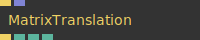

**Full Name:** `Ops.Gl.Matrix.MatrixTranslation`

**Description:** get translation of a matrix

**`\inputsymbol`{=latex} Inputs**

- **Render** (Trigger)
- **Matrix** (Array)

**`\outputsymbol`{=latex} Output**

- **Trigger** (Trigger)
- **X** (Number)
- **Y** (Number)
- **Z** (Number)

**Example Patch:** [Open in Editor](https://cables.gl/edit/Zz52On)

**Docs:** [https://cables.gl/op/Ops.Gl.Matrix.MatrixTranslation](https://cables.gl/op/Ops.Gl.Matrix.MatrixTranslation)

### MultiplyModelMatrix
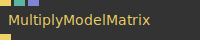

**Full Name:** `Ops.Gl.Matrix.MultiplyModelMatrix`

**Description:** multiply model matrix

**`\inputsymbol`{=latex} Inputs**

- **Render** (Trigger)
- **Identity** (Number: Boolean)
- **Matrix** (Array)

**`\outputsymbol`{=latex} Output**

- **Trigger** (Trigger)

**Example Patch:** [Open in Editor](https://cables.gl/edit/HkYpci)

**Docs:** [https://cables.gl/op/Ops.Gl.Matrix.MultiplyModelMatrix](https://cables.gl/op/Ops.Gl.Matrix.MultiplyModelMatrix)

### MulViewMatrix
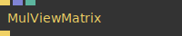

**Full Name:** `Ops.Gl.Matrix.MulViewMatrix`

**Description:** multiply view matrix

**`\inputsymbol`{=latex} Inputs**

- **Render** (Trigger)
- **Matrix** (Array)
- **Identity** (Number: Boolean)

**`\outputsymbol`{=latex} Output**

- **Trigger** (Trigger)

**Example Patch:** [Open in Editor](https://cables.gl/edit/hDWuci)

**Docs:** [https://cables.gl/op/Ops.Gl.Matrix.MulViewMatrix](https://cables.gl/op/Ops.Gl.Matrix.MulViewMatrix)

### Quaternion
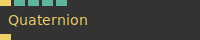

**Full Name:** `Ops.Gl.Matrix.Quaternion`

**Description:** multiplies current modelmatrix with a quaternion

**`\inputsymbol`{=latex} Inputs**

- **Render** (Trigger)
- **X** (Number)
- **Y** (Number)
- **Z** (Number)
- **W** (Number)

**`\outputsymbol`{=latex} Output**

- **Trigger** (Trigger)

**Example Patch:** [Open in Editor](https://cables.gl/op/Ops.Gl.Matrix.Quaternion#example)

**Docs:** [https://cables.gl/op/Ops.Gl.Matrix.Quaternion](https://cables.gl/op/Ops.Gl.Matrix.Quaternion)

### QuaternionCamera
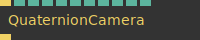

**Full Name:** `Ops.Gl.Matrix.QuaternionCamera`

**Description:** Set up a camera, rotated by a quaternion

**`\inputsymbol`{=latex} Inputs**

- **Render** (Trigger)
- **EyeX** (Number)
- **EyeY** (Number)
- **EyeZ** (Number)
- **QuatX** (Number)
- **QuatY** (Number)
- **QuatZ** (Number)
- **QuatW** (Number)
- **UpX** (Number)
- **UpY** (Number)
- **UpZ** (Number)

**`\outputsymbol`{=latex} Output**

- **Trigger** (Trigger)

**Example Patch:** [Open in Editor](https://cables.gl/op/Ops.Gl.Matrix.QuaternionCamera#example)

**Docs:** [https://cables.gl/op/Ops.Gl.Matrix.QuaternionCamera](https://cables.gl/op/Ops.Gl.Matrix.QuaternionCamera)

### RandomGridPlacement
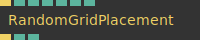

**Full Name:** `Ops.Gl.Matrix.RandomGridPlacement`

**Description:** place random objects on a grid

**`\inputsymbol`{=latex} Inputs**

- **Exe** (Trigger)
- **Max Depth** (Number)
- **Possibility** (Number)
- **Seed** (Number)
- **Scale** (Number)
- **Width** (Number)
- **Height** (Number)

**`\outputsymbol`{=latex} Output**

- **Next** (Trigger)
- **Index** (Number)
- **Depth** (Number)

**Example Patch:** [Open in Editor](https://cables.gl/edit/FsZFVB)

**Docs:** [https://cables.gl/op/Ops.Gl.Matrix.RandomGridPlacement](https://cables.gl/op/Ops.Gl.Matrix.RandomGridPlacement)

### RandomGridPlacementArrays
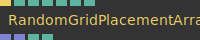

**Full Name:** `Ops.Gl.Matrix.RandomGridPlacementArrays`

**Description:** Place random objects on a grid

**`\inputsymbol`{=latex} Inputs**

- **Exe** (Trigger)
- **Max Depth** (Number)
- **Possibility** (Number)
- **Seed** (Number)
- **Scale** (Number)
- **Width** (Number)
- **Height** (Number)

**`\outputsymbol`{=latex} Output**

- **Positions** (Array)
- **Scalings** (Array)
- **Array Length** (Number)
- **Total Points** (Number)

**Example Patch:** [Open in Editor](https://cables.gl/edit/PYUHNP)

**Docs:** [https://cables.gl/op/Ops.Gl.Matrix.RandomGridPlacementArrays](https://cables.gl/op/Ops.Gl.Matrix.RandomGridPlacementArrays)

### Scale
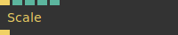

**Full Name:** `Ops.Gl.Matrix.Scale`

**Description:** Scale all child objects (scaleXYZ)

**`\inputsymbol`{=latex} Inputs**

- **Render** (Trigger)
- **Scale** (Number)
- **X** (Number)
- **Y** (Number)
- **Z** (Number)

**`\outputsymbol`{=latex} Output**

- **Trigger** (Trigger)

**Example Patch:** [Open in Editor](https://cables.gl/edit/au9U7i)

**Docs:** [https://cables.gl/op/Ops.Gl.Matrix.Scale](https://cables.gl/op/Ops.Gl.Matrix.Scale)

### ScaleXYZViewMatrix
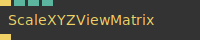

**Full Name:** `Ops.Gl.Matrix.ScaleXYZViewMatrix`

**Description:** scale xyz of viewmatrix

**`\inputsymbol`{=latex} Inputs**

- **Render** (Trigger)
- **X** (Number)
- **Y** (Number)
- **Z** (Number)

**`\outputsymbol`{=latex} Output**

- **Trigger** (Trigger)

**Example Patch:** [Open in Editor](https://cables.gl/edit/aSB6On)

**Docs:** [https://cables.gl/op/Ops.Gl.Matrix.ScaleXYZViewMatrix](https://cables.gl/op/Ops.Gl.Matrix.ScaleXYZViewMatrix)

### ScreenCoordinates_v2
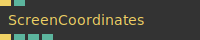

**Full Name:** `Ops.Gl.Matrix.ScreenCoordinates_v2`

**Description:** screen/pixel coordinates of the current transform

**`\inputsymbol`{=latex} Inputs**

- **Execute** (Trigger)
- **Pixel Unit Index** (Number: Integer)

**`\outputsymbol`{=latex} Output**

- **Trigger** (Trigger)
- **X** (Number)
- **Y** (Number)
- **Visible** (Number)

**Example Patch:** [Open in Editor](https://cables.gl/edit/-GNBD-)

**Docs:** [https://cables.gl/op/Ops.Gl.Matrix.ScreenCoordinates_v2](https://cables.gl/op/Ops.Gl.Matrix.ScreenCoordinates_v2)

### ScreenPosTo3d_v3
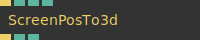

**Full Name:** `Ops.Gl.Matrix.ScreenPosTo3d_v3`

**Description:** convert screen coordinates to a 3d position

**`\inputsymbol`{=latex} Inputs**

- **Exec** (Trigger)
- **X** (Number)
- **Y** (Number)
- **Input Type Index** (Number: Integer)

**`\outputsymbol`{=latex} Output**

- **Trigger Out** (Trigger)
- **Result X** (Number)
- **Result Y** (Number)

**Example Patch:** [Open in Editor](https://cables.gl/edit/mDiCq6)

**Docs:** [https://cables.gl/op/Ops.Gl.Matrix.ScreenPosTo3d_v3](https://cables.gl/op/Ops.Gl.Matrix.ScreenPosTo3d_v3)

### SetProjectionMatrix
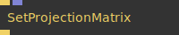

**Full Name:** `Ops.Gl.Matrix.SetProjectionMatrix`

**Description:** set a projection matrix

**`\inputsymbol`{=latex} Inputs**

- **Exe** (Trigger)
- **Matrix** (Array)

**`\outputsymbol`{=latex} Output**

- **Next** (Trigger)

**Example Patch:** [Open in Editor](https://cables.gl/edit/573_4S)

**Docs:** [https://cables.gl/op/Ops.Gl.Matrix.SetProjectionMatrix](https://cables.gl/op/Ops.Gl.Matrix.SetProjectionMatrix)

### Shear
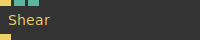

**Full Name:** `Ops.Gl.Matrix.Shear`

**Description:** displaces each point of a mesh in fixed direction

**`\inputsymbol`{=latex} Inputs**

- **Render** (Trigger)
- **ShearX** (Number)
- **ShearY** (Number)

**`\outputsymbol`{=latex} Output**

- **Trigger** (Trigger)

**Example Patch:** [Open in Editor](https://cables.gl/edit/PmTYnO)

**Docs:** [https://cables.gl/op/Ops.Gl.Matrix.Shear](https://cables.gl/op/Ops.Gl.Matrix.Shear)

### TransformMatrix
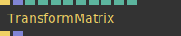

**Full Name:** `Ops.Gl.Matrix.TransformMatrix`

**Description:** transform a matrix (mat4)

**`\inputsymbol`{=latex} Inputs**

- **Transform** (Trigger)
- **Matrix** (Array)
- **Translate X** (Number)
- **Translate Y** (Number)
- **Translate Z** (Number)
- **Scale X** (Number)
- **Scale Y** (Number)
- **Scale Z** (Number)
- **Rotation X** (Number)
- **Rotation Y** (Number)
- **Rotation Z** (Number)

**`\outputsymbol`{=latex} Output**

- **Next** (Trigger)
- **Result** (Array)

**Example Patch:** [Open in Editor](https://cables.gl/edit/A0W1Jx)

**Docs:** [https://cables.gl/op/Ops.Gl.Matrix.TransformMatrix](https://cables.gl/op/Ops.Gl.Matrix.TransformMatrix)

### TransformMul
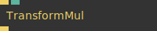

**Full Name:** `Ops.Gl.Matrix.TransformMul`

**Description:** multiply current modelmatrix

**`\inputsymbol`{=latex} Inputs**

- **Render** (Trigger)
- **Mul** (Number)

**`\outputsymbol`{=latex} Output**

- **Trigger** (Trigger)

**Example Patch:** [Open in Editor](https://cables.gl/op/Ops.Gl.Matrix.TransformMul#example)

**Docs:** [https://cables.gl/op/Ops.Gl.Matrix.TransformMul](https://cables.gl/op/Ops.Gl.Matrix.TransformMul)

### Translate
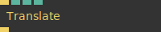

**Full Name:** `Ops.Gl.Matrix.Translate`

**Description:** Translate objects (move / position in 3D space)

**`\inputsymbol`{=latex} Inputs**

- **Render** (Trigger)
- **X** (Number)
- **Y** (Number)
- **Z** (Number)

**`\outputsymbol`{=latex} Output**

- **Trigger** (Trigger)

**Example Patch:** [Open in Editor](https://cables.gl/op/Ops.Gl.Matrix.Translate#example)

**Docs:** [https://cables.gl/op/Ops.Gl.Matrix.Translate](https://cables.gl/op/Ops.Gl.Matrix.Translate)

### TranslateView
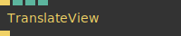

**Full Name:** `Ops.Gl.Matrix.TranslateView`

**Description:** translate the view/camera matrix

**`\inputsymbol`{=latex} Inputs**

- **Render** (Trigger)
- **X** (Number)
- **Y** (Number)
- **Z** (Number)

**`\outputsymbol`{=latex} Output**

- **Trigger** (Trigger)

**Example Patch:** [Open in Editor](https://cables.gl/op/Ops.Gl.Matrix.TranslateView#example)

**Docs:** [https://cables.gl/op/Ops.Gl.Matrix.TranslateView](https://cables.gl/op/Ops.Gl.Matrix.TranslateView)

### VectorTranslate
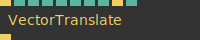

**Full Name:** `Ops.Gl.Matrix.VectorTranslate`

**Description:** Translate any geometry underneath it using vectors and speed.

**`\inputsymbol`{=latex} Inputs**

- **Exec** (Trigger)
- **Speed** (Number)
- **Vector X** (Number)
- **Vector Y** (Number)
- **Vector Z** (Number)
- **Reset Position X** (Number)
- **Reset Position Y** (Number)
- **Reset Position Z** (Number)
- **Reset** (Trigger)
- **Max** (Number)

**`\outputsymbol`{=latex} Output**

- **Next** (Trigger)

**Example Patch:** [Open in Editor](https://cables.gl/op/Ops.Gl.Matrix.VectorTranslate#example)

**Docs:** [https://cables.gl/op/Ops.Gl.Matrix.VectorTranslate](https://cables.gl/op/Ops.Gl.Matrix.VectorTranslate)

### WASDCamera_v2


**Full Name:** `Ops.Gl.Matrix.WASDCamera_v2`

**Description:** simple camera you control with W,A,S,D keys like in a FPS game

**`\inputsymbol`{=latex} Inputs**

- **Render** (Trigger)
- **Enable Pointer Lock** (Number: Boolean)
- **Speed** (Number)
- **Mouse Speed** (Number)
- **Allow Flying** (Number: Boolean)
- **Active** (Number: Boolean)
- **Move X-** (Number: Boolean)
- **Move Y-** (Number: Boolean)
- **Reset** (Trigger)

**`\outputsymbol`{=latex} Output**

- **Trigger** (Trigger)
- **IsLocked** (booleanNumber)
- **PosX** (Number)
- **PosY** (Number)
- **PosZ** (Number)
- **Mouse Left** (Trigger)
- **Mouse Right** (Trigger)
- **Dir X** (Number)
- **Dir Y** (Number)
- **Dir Z** (Number)

**Example Patch:** [Open in Editor](https://cables.gl/edit/oLCaao)

**Docs:** [https://cables.gl/op/Ops.Gl.Matrix.WASDCamera_v2](https://cables.gl/op/Ops.Gl.Matrix.WASDCamera_v2)


