# Ops.Gl.Meshes

---

## Ops.Gl.Meshes

### ComposingGridOverlay
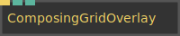

**Full Name:** `Ops.Gl.Meshes.ComposingGridOverlay`

**Description:** Rule of thirds image composition helper

**`\inputsymbol`{=latex} Inputs**

- **Render** (Trigger)
- **Scale** (Number)
- **Show Center** (Number: Boolean)

**`\outputsymbol`{=latex} Output**

- *Visit [Ops.Gl.Meshes.ComposingGridOverlay documentation](https://cables.gl/op/Ops.Gl.Meshes.ComposingGridOverlay) for output port details*

**Example Patch:** [Open in Editor](https://cables.gl/edit/G8mQQ2)

**Docs:** [https://cables.gl/op/Ops.Gl.Meshes.ComposingGridOverlay](https://cables.gl/op/Ops.Gl.Meshes.ComposingGridOverlay)

### Cone

**Full Name:** `Ops.Gl.Meshes.Cone`

**Description:** number of horizontal segments

**`\inputsymbol`{=latex} Inputs**

- **Render** (Trigger)
- **Slices** (Number)
- **Stacks** (Number)
- **Radius** (Number)
- **Height** (Number)
- **Active** (Number: Boolean)

**`\outputsymbol`{=latex} Output**

- **Trigger** (Trigger)
- **Geometry** (Object)

**Example Patch:** [Open in Editor](https://cables.gl/edit/fGA7W6)

**Docs:** [https://cables.gl/op/Ops.Gl.Meshes.Cone](https://cables.gl/op/Ops.Gl.Meshes.Cone)

### Corner

**Full Name:** `Ops.Gl.Meshes.Corner`

**Description:** render a rectangular corner

**`\inputsymbol`{=latex} Inputs**

- **Render** (Trigger)
- **Width** (Number)
- **Height** (Number)
- **Thickness** (Number)
- **Draw** (Number: Boolean)
- **Pivot X Index** (Number: Integer)
- **Pivot Y Index** (Number: Integer)

**`\outputsymbol`{=latex} Output**

- **Trigger** (Trigger)
- **Geometry** (Object)

**Example Patch:** [Open in Editor](https://cables.gl/edit/KWolQ6)

**Docs:** [https://cables.gl/op/Ops.Gl.Meshes.Corner](https://cables.gl/op/Ops.Gl.Meshes.Corner)

### Cylinder_v2

**Full Name:** `Ops.Gl.Meshes.Cylinder_v2`

**Description:** draw parameterizable cylinder (aka tube,pipe,round,circle)

**`\inputsymbol`{=latex} Inputs**

- **Render** (Trigger)
- **Render Mesh** (Number: Boolean)
- **Segments** (Number: Integer)
- **Stacks** (Number: Integer)
- **Length** (Number)
- **Outer Radius** (Number)
- **Inner Radius** (Number)
- **Flip Mapping** (Number: Boolean)
- **Caps** (Number: Boolean)
- **Flat Normals** (Number: Boolean)

**`\outputsymbol`{=latex} Output**

- **Next** (Trigger)
- **Geometry** (Object)

**Example Patch:** [Open in Editor](https://cables.gl/edit/GxagQ6)

**Docs:** [https://cables.gl/op/Ops.Gl.Meshes.Cylinder_v2](https://cables.gl/op/Ops.Gl.Meshes.Cylinder_v2)

### FloorGrid
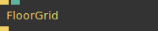

**Full Name:** `Ops.Gl.Meshes.FloorGrid`

**Description:** draw a grid on the floor

**`\inputsymbol`{=latex} Inputs**

- **Render** (Trigger)
- **Active** (Number: Boolean)

**`\outputsymbol`{=latex} Output**

- **Next** (Trigger)

**Example Patch:** [Open in Editor](https://cables.gl/edit/LiwB16)

**Docs:** [https://cables.gl/op/Ops.Gl.Meshes.FloorGrid](https://cables.gl/op/Ops.Gl.Meshes.FloorGrid)

### FreeFormPlane

**Full Name:** `Ops.Gl.Meshes.FreeFormPlane`

**Description:** A freely deformable plane, rectangle, polygon

**`\inputsymbol`{=latex} Inputs**

- **Render** (Trigger)
- **X 1** (Number)
- **Y 1** (Number)
- **Z 1** (Number)
- **X 2** (Number)
- **Y 2** (Number)
- **Z 2** (Number)
- **X 3** (Number)
- **Y 3** (Number)
- **Z 3** (Number)
- **X 4** (Number)
- **Y 4** (Number)
- **Z 4** (Number)
- **Tc X 1** (Number)
- **Tc Y 1** (Number)
- **Tc X 2** (Number)
- **Tc Y 2** (Number)
- **Tc X 3** (Number)
- **Tc Y 3** (Number)
- **Tc X 4** (Number)
- **Tc Y 4** (Number)

**`\outputsymbol`{=latex} Output**

- **Trigger** (Trigger)
- **Geometry** (Object)

**Example Patch:** [Open in Editor](https://cables.gl/edit/Q92nQ6)

**Docs:** [https://cables.gl/op/Ops.Gl.Meshes.FreeFormPlane](https://cables.gl/op/Ops.Gl.Meshes.FreeFormPlane)

### FullscreenRectangle_v2
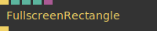

**Full Name:** `Ops.Gl.Meshes.FullscreenRectangle_v2`

**Description:** Draws a rectangle using the full WebGL canvas size

**`\inputsymbol`{=latex} Inputs**

- **Render** (Trigger)
- **Flip Y** (Number: Boolean)
- **Flip X** (Number: Boolean)
- **Texture** (Object:Texture)

**`\outputsymbol`{=latex} Output**

- **Trigger** (Trigger)

**Example Patch:** [Open in Editor](https://cables.gl/edit/uKkIeG)

**Docs:** [https://cables.gl/op/Ops.Gl.Meshes.FullscreenRectangle_v2](https://cables.gl/op/Ops.Gl.Meshes.FullscreenRectangle_v2)

### GeometryToTexture_v3
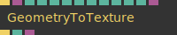

**Full Name:** `Ops.Gl.Meshes.GeometryToTexture_v3`

**Description:** Convert vertices of a geometry to a data texture

**`\inputsymbol`{=latex} Inputs**

- **Render** (Trigger)
- **Geometry** (Object:Geometry)
- **Continously Update** (Number: Boolean)
- **Order Index** (Number: Integer)
- **Content Index** (Number: Integer)
- **New Size** (Number)
- **Tex Width** (Number: Integer)
- **Filter Index** (Number: Integer)
- **Wrap Index** (Number: Integer)
- **Pixel Format Index** (Number: Integer)
- **Color Texture** (Object:Texture)

**`\outputsymbol`{=latex} Output**

- **Next** (Trigger)
- **Total Vertices** (Number)
- **Texture** (Object)

**Example Patch:** [Open in Editor](https://cables.gl/edit/bhWkpX)

**Docs:** [https://cables.gl/op/Ops.Gl.Meshes.GeometryToTexture_v3](https://cables.gl/op/Ops.Gl.Meshes.GeometryToTexture_v3)

### Grid
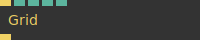

**Full Name:** `Ops.Gl.Meshes.Grid`

**Description:** Draw a simple grid of lines

**`\inputsymbol`{=latex} Inputs**

- **Render** (Trigger)
- **Num** (Number: Integer)
- **Spacing** (Number)
- **Center** (Number: Boolean)
- **Axis Index** (Number: Integer)

**`\outputsymbol`{=latex} Output**

- **Next** (Trigger)

**Example Patch:** [Open in Editor](https://cables.gl/edit/VxPlQ6)

**Docs:** [https://cables.gl/op/Ops.Gl.Meshes.Grid](https://cables.gl/op/Ops.Gl.Meshes.Grid)

### HeightMap

**Full Name:** `Ops.Gl.Meshes.HeightMap`

**Description:** generate a rectangular mesh where the height is defined by the luminance of an image

**`\inputsymbol`{=latex} Inputs**

- **Render** (Trigger)
- **File** (String)
- **Extrude** (Number)
- **Width** (Number)
- **Height** (Number)
- **Rows** (Number: Integer)
- **Columns** (Number: Integer)
- **TexCoords Slice** (Number: Boolean)
- **Flat** (Number: Boolean)

**`\outputsymbol`{=latex} Output**

- **Trigger** (Trigger)
- **Geometry** (Object)

**Example Patch:** [Open in Editor](https://cables.gl/edit/bRlSDe)

**Docs:** [https://cables.gl/op/Ops.Gl.Meshes.HeightMap](https://cables.gl/op/Ops.Gl.Meshes.HeightMap)

### Helix

**Full Name:** `Ops.Gl.Meshes.Helix`

**Description:** generates a helix, spiral spline

**`\inputsymbol`{=latex} Inputs**

- **Render** (Trigger)
- **Draw** (Number: Boolean)
- **Segments** (Number)
- **Frequency** (Number)
- **Radius** (Number)
- **Radius End** (Number)
- **Height** (Number)

**`\outputsymbol`{=latex} Output**

- **Next** (Trigger)
- **Points** (Array)

**Example Patch:** [Open in Editor](https://cables.gl/edit/CW8-I6)

**Docs:** [https://cables.gl/op/Ops.Gl.Meshes.Helix](https://cables.gl/op/Ops.Gl.Meshes.Helix)

### Icosahedron_v2
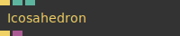

**Full Name:** `Ops.Gl.Meshes.Icosahedron_v2`

**Description:** Renders a icosahedron (polyhedron with 20 faces)

**`\inputsymbol`{=latex} Inputs**

- **Render** (Trigger)
- **Smooth** (Number: Boolean)
- **Render Mesh** (Number: Boolean)

**`\outputsymbol`{=latex} Output**

- **Trigger** (Trigger)
- **Geometry** (Object)

**Example Patch:** [Open in Editor](https://cables.gl/edit/Ie6iQ6)

**Docs:** [https://cables.gl/op/Ops.Gl.Meshes.Icosahedron_v2](https://cables.gl/op/Ops.Gl.Meshes.Icosahedron_v2)

### Line
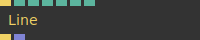

**Full Name:** `Ops.Gl.Meshes.Line`

**Description:** Draw a line between two points

**`\inputsymbol`{=latex} Inputs**

- **Render** (Trigger)
- **X 1** (Number)
- **Y 1** (Number)
- **Z 1** (Number)
- **X 2** (Number)
- **Y 2** (Number)
- **Z 2** (Number)

**`\outputsymbol`{=latex} Output**

- **Next** (Trigger)
- **Array** (Array)

**Example Patch:** [Open in Editor](https://cables.gl/edit/D_eE98)

**Docs:** [https://cables.gl/op/Ops.Gl.Meshes.Line](https://cables.gl/op/Ops.Gl.Meshes.Line)

### LinesArray
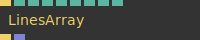

**Full Name:** `Ops.Gl.Meshes.LinesArray`

**Description:** an array of lines

**`\inputsymbol`{=latex} Inputs**

- **Render** (Trigger)
- **Width** (Number)
- **Height** (Number)
- **Logarithmic** (Number: Boolean)
- **Pivot X Index** (Number: Integer)
- **Pivot Y Index** (Number: Integer)
- **Num Columns** (Number: Integer)
- **Num Rows** (Number: Integer)
- **Axis Index** (Number: Integer)

**`\outputsymbol`{=latex} Output**

- **Trigger** (Trigger)
- **Point Arrays** (Array)

**Example Patch:** [Open in Editor](https://cables.gl/edit/oXke6r)

**Docs:** [https://cables.gl/op/Ops.Gl.Meshes.LinesArray](https://cables.gl/op/Ops.Gl.Meshes.LinesArray)

### MeshInstancerFromTexture_v3
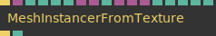

**Full Name:** `Ops.Gl.Meshes.MeshInstancerFromTexture_v3`

**Description:** Draw the same mesh multiple times on the GPU

**`\inputsymbol`{=latex} Inputs**

- **Exe** (Trigger)
- **Geometry** (Object:Geometry)
- **Scale** (Number)
- **Limit Instances** (Number: Boolean)
- **Num Instances** (Number: Integer)
- **Position Texture** (Object:Texture)
- **Rotation Texture** (Object:Texture)
- **Scale Texture** (Object:Texture)
- **Color Texture** (Object:Texture)
- **TexCoord Texture** (Object:Texture)
- **Ignore Alpha Less Than** (Number)
- **Multiply Pos X** (Number)
- **Multiply Pos Y** (Number)
- **Multiply Pos Z** (Number)

**`\outputsymbol`{=latex} Output**

- **Trigger Out** (Trigger)
- **Num** (Number)

**Example Patch:** [Open in Editor](https://cables.gl/edit/H3cEpX)

**Docs:** [https://cables.gl/op/Ops.Gl.Meshes.MeshInstancerFromTexture_v3](https://cables.gl/op/Ops.Gl.Meshes.MeshInstancerFromTexture_v3)

### ParametricSurface
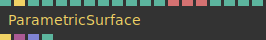

**Full Name:** `Ops.Gl.Meshes.ParametricSurface`

**Description:** Creates a 3d mesh from a 2d area expressions

**`\inputsymbol`{=latex} Inputs**

- **Shapes Index** (Number: Integer)
- **Render** (Trigger)
- **U Segments** (Number: Integer)
- **V Segments** (Number: Integer)
- **Multiple Of PI - U** (Number: Boolean)
- **UMin** (Number)
- **UMax** (Number)
- **Displace U** (Number)
- **Multiple Of PI - V** (Number: Boolean)
- **VMin** (Number)
- **VMax** (Number)
- **Displace V** (Number)
- **X Function** (String)
- **Y Function** (String)
- **Z Function** (String)
- **Scale X** (Number)
- **Scale Y** (Number)
- **Scale Z** (Number)
- **Draw** (Number: Boolean)

**`\outputsymbol`{=latex} Output**

- **Trigger** (Trigger)
- **Geometry** (Object)
- **Position** (Array)
- **outputs the vertices of the surface** (as an xyz-Array)
- **Position Amount** (Number)

**Example Patch:** [Open in Editor](https://cables.gl/edit/TnUBsL)

**Docs:** [https://cables.gl/op/Ops.Gl.Meshes.ParametricSurface](https://cables.gl/op/Ops.Gl.Meshes.ParametricSurface)

### PointCloudFromArray_v2
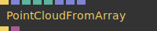

**Full Name:** `Ops.Gl.Meshes.PointCloudFromArray_v2`

**Description:** visualize an array of coordinates as points

**`\inputsymbol`{=latex} Inputs**

- **Exe** (Trigger)
- **Positions** (Array)
- **Num Points** (Number: Integer)
- **Scramble Texcoords** (Number: Boolean)
- **Seed** (Number)
- **Texture Coordinates** (Array)
- **Point Sizes** (Array)
- **Vertex Colors** (Array)

**`\outputsymbol`{=latex} Output**

- **Trigger Out** (Trigger)
- **Geometry** (Object)

**Example Patch:** [Open in Editor](https://cables.gl/edit/v8G4Wz)

**Docs:** [https://cables.gl/op/Ops.Gl.Meshes.PointCloudFromArray_v2](https://cables.gl/op/Ops.Gl.Meshes.PointCloudFromArray_v2)

### PointCloudFromTexture

**Full Name:** `Ops.Gl.Meshes.PointCloudFromTexture`

**Description:** Visualize a RGB texture as XYZ coordinates as points

**`\inputsymbol`{=latex} Inputs**

- **Render** (Trigger)
- **Num Points** (Number: Integer)
- **Texture** (Object:Texture)
- **Point Size** (Object:Texture)
- **Normalize** (Number: Boolean)
- **Remove Point At 0** (Number: Boolean)
- **Ignore Alpha 0** (Number: Boolean)

**`\outputsymbol`{=latex} Output**

- **Trigger** (Trigger)
- **Total Points** (Number)

**Example Patch:** [Open in Editor](https://cables.gl/edit/bhWkpX)

**Docs:** [https://cables.gl/op/Ops.Gl.Meshes.PointCloudFromTexture](https://cables.gl/op/Ops.Gl.Meshes.PointCloudFromTexture)

### Polyhedron_v2
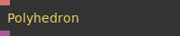

**Full Name:** `Ops.Gl.Meshes.Polyhedron_v2`

**Description:** Generate polyhedron meshes

**`\inputsymbol`{=latex} Inputs**

- **Receipt** (String)

**`\outputsymbol`{=latex} Output**

- **Geometry** (Object)

**Example Patch:** [Open in Editor](https://cables.gl/edit/VRG6Q6)

**Docs:** [https://cables.gl/op/Ops.Gl.Meshes.Polyhedron_v2](https://cables.gl/op/Ops.Gl.Meshes.Polyhedron_v2)

### Pyramid_v2
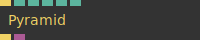

**Full Name:** `Ops.Gl.Meshes.Pyramid_v2`

**Description:** render a pyramid mesh

**`\inputsymbol`{=latex} Inputs**

- **Render** (Trigger)
- **Width** (Number)
- **Length** (Number)
- **Height** (Number)
- **Smooth** (Number: Boolean)
- **Draw** (Number: Boolean)

**`\outputsymbol`{=latex} Output**

- **Trigger** (Trigger)
- **Geometry** (Object)

**Example Patch:** [Open in Editor](https://cables.gl/edit/Y09mQ6)

**Docs:** [https://cables.gl/op/Ops.Gl.Meshes.Pyramid_v2](https://cables.gl/op/Ops.Gl.Meshes.Pyramid_v2)

### QuadWarpTexture
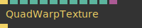

**Full Name:** `Ops.Gl.Meshes.QuadWarpTexture`

**Description:** Warp a texture mapped quad (projection mapping)

**`\inputsymbol`{=latex} Inputs**

- **Render** (Trigger)
- **A X** (Number)
- **A Y** (Number)
- **B X** (Number)
- **B Y** (Number)
- **C X** (Number)
- **C Y** (Number)
- **D X** (Number)
- **D Y** (Number)
- **Flip Y** (Number: Boolean)
- **Flip X** (Number: Boolean)
- **Texture** (Object)

**`\outputsymbol`{=latex} Output**

- **Trigger** (Trigger)

**Example Patch:** [Open in Editor](https://cables.gl/edit/T2A7zp)

**Docs:** [https://cables.gl/op/Ops.Gl.Meshes.QuadWarpTexture](https://cables.gl/op/Ops.Gl.Meshes.QuadWarpTexture)

### Rectangle9Slice
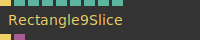

**Full Name:** `Ops.Gl.Meshes.Rectangle9Slice`

**Description:** nine slice image format texture mapped rectangle

**`\inputsymbol`{=latex} Inputs**

- **Render** (Trigger)
- **Width** (Number)
- **Height** (Number)
- **Border Width** (Number)
- **Scale X** (Number)
- **Scale Y** (Number)
- **Draw** (Number: Boolean)
- **Pivot X Index** (Number: Integer)
- **Pivot Y Index** (Number: Integer)

**`\outputsymbol`{=latex} Output**

- **Trigger** (Trigger)
- **Geometry** (Object)

**Example Patch:** [Open in Editor](https://cables.gl/edit/WkQpIG)

**Docs:** [https://cables.gl/op/Ops.Gl.Meshes.Rectangle9Slice](https://cables.gl/op/Ops.Gl.Meshes.Rectangle9Slice)

### RectangleFrame_v2
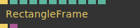

**Full Name:** `Ops.Gl.Meshes.RectangleFrame_v2`

**Description:** Draws a rectangle frame

**`\inputsymbol`{=latex} Inputs**

- **Render** (Trigger)
- **Width** (Number)
- **Height** (Number)
- **Thickness** (Number)
- **Draw Top** (Number: Boolean)
- **Draw Bottom** (Number: Boolean)
- **Draw Left** (Number: Boolean)
- **Draw Right** (Number: Boolean)
- **Active** (Number: Boolean)

**`\outputsymbol`{=latex} Output**

- **Trigger** (Trigger)
- **Geometry** (Object)

**Example Patch:** [Open in Editor](https://cables.gl/edit/HLViQ6)

**Docs:** [https://cables.gl/op/Ops.Gl.Meshes.RectangleFrame_v2](https://cables.gl/op/Ops.Gl.Meshes.RectangleFrame_v2)

### RectangleRounded_v2
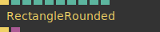

**Full Name:** `Ops.Gl.Meshes.RectangleRounded_v2`

**Description:** Draws a rectangle with rounded corners

**`\inputsymbol`{=latex} Inputs**

- **Render** (Trigger)
- **Segments** (Number: Integer)
- **Width** (Number)
- **Height** (Number)
- **Border Radius** (Number)
- **Top Left** (Number: Boolean)
- **Top Right** (Number: Boolean)
- **Bottom Left** (Number: Boolean)
- **Bottom Right** (Number: Boolean)
- **Draw** (Number: Boolean)

**`\outputsymbol`{=latex} Output**

- **Trigger** (Trigger)
- **Geometry** (Object)

**Example Patch:** [Open in Editor](https://cables.gl/edit/1la6mJ)

**Docs:** [https://cables.gl/op/Ops.Gl.Meshes.RectangleRounded_v2](https://cables.gl/op/Ops.Gl.Meshes.RectangleRounded_v2)

### SimpleSpline_v2

**Full Name:** `Ops.Gl.Meshes.SimpleSpline_v2`

**Description:** Draws a simple spline only one pixel wide

**`\inputsymbol`{=latex} Inputs**

- **Render** (Trigger)
- **Points** (Array)
- **Num Points** (Number: Integer)
- **Line Strip** (Number: Boolean)
- **TexCoords Array** (Array)
- **Vertex Colors** (Array)

**`\outputsymbol`{=latex} Output**

- **Geometry** (Object)
- **Next** (Trigger)

**Example Patch:** [Open in Editor](https://cables.gl/edit/qRD7W6)

**Docs:** [https://cables.gl/op/Ops.Gl.Meshes.SimpleSpline_v2](https://cables.gl/op/Ops.Gl.Meshes.SimpleSpline_v2)

### SimpleWireframe
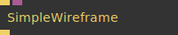

**Full Name:** `Ops.Gl.Meshes.SimpleWireframe`

**Description:** Simple Wireframe Line Renderer

**`\inputsymbol`{=latex} Inputs**

- **Render** (Trigger)
- **Geometry** (Object:Geometry)

**`\outputsymbol`{=latex} Output**

- **Next** (Trigger)

**Example Patch:** [Open in Editor](https://cables.gl/edit/gt0cay)

**Docs:** [https://cables.gl/op/Ops.Gl.Meshes.SimpleWireframe](https://cables.gl/op/Ops.Gl.Meshes.SimpleWireframe)

### SplineMesh_v2
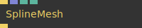

**Full Name:** `Ops.Gl.Meshes.SplineMesh_v2`

**Description:** draw splines/lines

**`\inputsymbol`{=latex} Inputs**

- **Render** (Trigger)
- **Points** (Array)
- **Tesselate Edges** (Number: Boolean)
- **Render Mesh** (Number: Boolean)

**`\outputsymbol`{=latex} Output**

- **Next** (Trigger)

**Example Patch:** [Open in Editor](https://cables.gl/edit/3l5Uu-)

**Docs:** [https://cables.gl/op/Ops.Gl.Meshes.SplineMesh_v2](https://cables.gl/op/Ops.Gl.Meshes.SplineMesh_v2)

### SplineMeshMaterial_v2
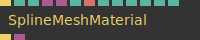

**Full Name:** `Ops.Gl.Meshes.SplineMeshMaterial_v2`

**Description:** material for splinemesh

**`\inputsymbol`{=latex} Inputs**

- **Render** (Trigger)
- **Width** (Number)
- **Width Perspective** (Number: Boolean)
- **Texture** (Object:Texture)
- **Texture Mask** (Object:Texture)
- **Mapping Index** (Number: Integer)
- **Mapping** (String)
- **Colorize Texture** (Number: Boolean)
- **Offset** (Number)
- **R** (Number)
- **G** (Number)
- **B** (Number)
- **A** (Number)

**`\outputsymbol`{=latex} Output**

- **Trigger** (Trigger)
- **Shader** (Object)

**Example Patch:** [Open in Editor](https://cables.gl/edit/tnUJta)

**Docs:** [https://cables.gl/op/Ops.Gl.Meshes.SplineMeshMaterial_v2](https://cables.gl/op/Ops.Gl.Meshes.SplineMeshMaterial_v2)

### TextMesh_v2

**Full Name:** `Ops.Gl.Meshes.TextMesh_v2`

**Description:** Draws text in 3d space using one of the font ops

**`\inputsymbol`{=latex} Inputs**

- **Render** (Trigger)
- **Text** (String)
- **Scale Text** (Number)
- **Line Scale** (Number)
- **Font** (String)
- **Align Index** (Number: Integer)
- **Vertical Align Index** (Number: Integer)
- **Line Height** (Number)
- **Letter Spacing** (Number)
- **Texture Color** (Object:Texture)
- **Texture Mask** (Object:Texture)
- **R** (Number)
- **G** (Number)
- **B** (Number)
- **A** (Number)

**`\outputsymbol`{=latex} Output**

- **Next** (Trigger)
- **Total Lines** (Number)
- **Width** (Number)
- **Font Available** (booleanNumber)

**Example Patch:** [Open in Editor](https://cables.gl/edit/LzDnH-)

**Docs:** [https://cables.gl/op/Ops.Gl.Meshes.TextMesh_v2](https://cables.gl/op/Ops.Gl.Meshes.TextMesh_v2)

### Torus_v3

**Full Name:** `Ops.Gl.Meshes.Torus_v3`

**Description:** Draw a torus (doughnut, donut, ring mesh)

**`\inputsymbol`{=latex} Inputs**

- **Render** (Trigger)
- **Sides** (Number)
- **Rings** (Number)
- **InnerRadius** (Number)
- **OuterRadius** (Number)
- **Render Mesh** (Number: Boolean)

**`\outputsymbol`{=latex} Output**

- **Trigger** (Trigger)
- **Geometry** (Object)

**Example Patch:** [Open in Editor](https://cables.gl/edit/ECMhQ6)

**Docs:** [https://cables.gl/op/Ops.Gl.Meshes.Torus_v3](https://cables.gl/op/Ops.Gl.Meshes.Torus_v3)

### TriangleSphere
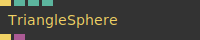

**Full Name:** `Ops.Gl.Meshes.TriangleSphere`

**Description:** A sphere mesh with uniform distributed vertices

**`\inputsymbol`{=latex} Inputs**

- **Render** (Trigger)
- **Iterations** (Number)
- **Flat** (Number: Boolean)
- **Draw** (Number: Boolean)

**`\outputsymbol`{=latex} Output**

- **Next** (Trigger)
- **Geometry** (Object)

**Example Patch:** [Open in Editor](https://cables.gl/edit/T43V0D)

**Docs:** [https://cables.gl/op/Ops.Gl.Meshes.TriangleSphere](https://cables.gl/op/Ops.Gl.Meshes.TriangleSphere)

