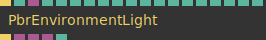
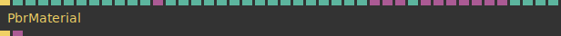

# Ops.Gl.Pbr


```{=latex}
\OpsSubsubNoSubsectionNumbering\setcounter{subsubsection}{0}
```
### PbrEnvironmentLight


**Full Name:** `Ops.Gl.Pbr.PbrEnvironmentLight`

**Description:** PBR image based lighting setup

**`\inputsymbol`{=latex} Inputs**

- **Render** (Trigger)
- **Intensity** (Number)
- **RGBE Environment Map** (Object:Texture)
- **Size Irradiance Map Index** (Number: Integer)
- **Size Pre-Filtered Environment Index** (Number: Integer)
- **Size IBL LUT Index** (Number: Integer)
- **Force 8bit IBL** (Number: Boolean)
- **Rotation** (Number)
- **Use Parallax Correction** (Number: Boolean)
- **Center X** (Number)
- **Center Y** (Number)
- **Center Z** (Number)
- **Box Min X** (Number)
- **Box Min Y** (Number)
- **Box Min Z** (Number)
- **Box Max X** (Number)
- **Box Max Y** (Number)
- **Box Max Z** (Number)

**`\outputsymbol`{=latex} Output**

- **Render** (Trigger)
- **Intensity** (Number)
- **RGBE Environment Map** (Object:Texture)
- **Size Irradiance Map Index** (Number: Integer)
- **Size Pre-Filtered Environment Index** (Number: Integer)
- **Size IBL LUT Index** (Number: Integer)
- **Force 8bit IBL** (Number: Boolean)
- **Rotation** (Number)
- **Use Parallax Correction** (Number: Boolean)
- **Center X** (Number)
- **Center Y** (Number)
- **Center Z** (Number)
- **Box Min X** (Number)
- **Box Min Y** (Number)
- **Box Min Z** (Number)
- **Box Max X** (Number)
- **Box Max Y** (Number)
- **Box Max Z** (Number)
- **Next** (Trigger)
- **IBL LUT** (Object)
- **for PBR Material** (not required)
- **Number Of Pre-Filtered Mip Levels** (Number)

**Example Patch:** [Open in Editor](https://cables.gl/edit/9z9kFK)

**Docs:** [https://cables.gl/op/Ops.Gl.Pbr.PbrEnvironmentLight](https://cables.gl/op/Ops.Gl.Pbr.PbrEnvironmentLight)

### PbrMaterial


**Full Name:** `Ops.Gl.Pbr.PbrMaterial`

**Description:** PBR/Physical Based Rendering Material for realistic materials

**`\inputsymbol`{=latex} Inputs**

- **Render** (Trigger)
- **R** (Number)
- **G** (Number)
- **B** (Number)
- **A** (Number)
- **Roughness** (Number)
- **Metalness** (Number)
- **Use Clear Coat** (Number: Boolean)
- **Clear Coat Intensity** (Number)
- **Clear Coat Roughness** (Number)
- **Use Normal Map For Clear Coat** (Number: Boolean)
- **Clear Coat Normal Map** (Object:Texture)
- **Use Thin Film** (Number: Boolean)
- **Thin Film Intensity** (Number)
- **Thin Film IOR** (Number)
- **Thickness Tex Min** (Number)
- **Thickness Tex Max** (Number)
- **Exposure** (Number)
- **Emission Intensity** (Number)
- **Disable Geometric Roughness** (Number: Boolean)
- **Use Roughness From Normal Map** (Number: Boolean)
- **Use Vertex Colours** (Number: Boolean)
- **Height Intensity** (Number)
- **Faster Heightmapping** (Number: Boolean)
- **Double Sided** (Number: Boolean)
- **IBL LUT** (Object:Texture)
- **Diffuse Irradiance** (Object:Texture)
- **Pre-Filtered Envmap** (Object:Texture)
- **Num Mip Levels** (Number: Integer)
- **Albedo** (Object:Texture)
- **AORM** (Object:Texture)
- **Normal Map** (Object:Texture)
- **Emission** (Object:Texture)
- **Height** (Object:Texture)
- **Lightmap** (Object:Texture)
- **Thin Film** (Object:Texture)
- **Diffuse Intensity** (Number)
- **Specular Intensity** (Number)
- **Lightmap Is RGBE** (Number: Boolean)
- **Lightmap Intensity** (Number)

**`\outputsymbol`{=latex} Output**

- **Next** (Trigger)
- **Shader** (Object)

**Example Patch:** [Open in Editor](https://cables.gl/edit/9z9kFK)

**Docs:** [https://cables.gl/op/Ops.Gl.Pbr.PbrMaterial](https://cables.gl/op/Ops.Gl.Pbr.PbrMaterial)


