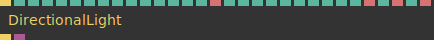
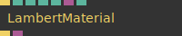

# Ops.Gl.Phong

---

```{=latex}
\OpsSubsubNoSubsectionNumbering\setcounter{subsubsection}{0}
```
### AmbientLight_v4


**Full Name:** `Ops.Gl.Phong.AmbientLight_v4`

**Description:** ambient light for phong material shading

**`\inputsymbol`{=latex} Inputs**

- **Trigger In** (Trigger)
- **R** (Number)
- **G** (Number)
- **B** (Number)
- **Intensity** (Number)

**`\outputsymbol`{=latex} Output**

- **Trigger Out** (Trigger)

**Example Patch:** [Open in Editor](https://cables.gl/edit/g3ioXU)

**Docs:** [https://cables.gl/op/Ops.Gl.Phong.AmbientLight_v4](https://cables.gl/op/Ops.Gl.Phong.AmbientLight_v4)

### DirectionalLight_v5


**Full Name:** `Ops.Gl.Phong.DirectionalLight_v5`

**Description:** Directional light for phong shading

**`\inputsymbol`{=latex} Inputs**

- **Trigger In** (Trigger)
- **Cast Light** (Number: Boolean)
- **Intensity** (Number)
- **X** (Number)
- **Y** (Number)
- **Z** (Number)
- **R** (Number)
- **G** (Number)
- **B** (Number)
- **Specular R** (Number)
- **Specular G** (Number)
- **Specular B** (Number)
- **Cast Shadow** (Number: Boolean)
- **Rendering Active** (Number: Boolean)
- **Map Size Index** (Number: Integer)
- **Map Size** (String)
- **Shadow Strength** (Number)
- **LR-BottomTop** (Number)
- **Near** (Number)
- **Far** (Number)
- **Bias** (Number)
- **Polygon Offset** (Number: Integer)
- **Normal Offset** (Number)
- **Blur Amount** (Number)
- **Enable Advanced** (Number: Boolean)
- **MSAA Index** (Number: Integer)
- **MSAA** (String)
- **Texture Filter Index** (Number: Integer)
- **Texture Filter** (String)
- **Anisotropic Index** (Number: Integer)
- **Anisotropic** (String)

**`\outputsymbol`{=latex} Output**

- **Trigger Out** (Trigger)
- **Shadow Map** (Object)

**Example Patch:** [Open in Editor](https://cables.gl/edit/nEWpXU)

**Docs:** [https://cables.gl/op/Ops.Gl.Phong.DirectionalLight_v5](https://cables.gl/op/Ops.Gl.Phong.DirectionalLight_v5)

### LambertMaterial_v2


**Full Name:** `Ops.Gl.Phong.LambertMaterial_v2`

**Description:** a simple shaded material

**`\inputsymbol`{=latex} Inputs**

- **Execute** (Trigger)
- **Diffuse R** (Number)
- **Diffuse G** (Number)
- **Diffuse B** (Number)
- **Diffuse A** (Number)
- **Diffuse Texture** (Object:Texture)
- **Colorize Texture** (Number: Boolean)

**`\outputsymbol`{=latex} Output**

- **Next** (Trigger)
- **Shader** (Object)

**Example Patch:** [Open in Editor](https://cables.gl/edit/PAvm26)

**Docs:** [https://cables.gl/op/Ops.Gl.Phong.LambertMaterial_v2](https://cables.gl/op/Ops.Gl.Phong.LambertMaterial_v2)

### PhongMaterial_v6


**Full Name:** `Ops.Gl.Phong.PhongMaterial_v6`

**Description:** A shaded material for lighting objects

**`\inputsymbol`{=latex} Inputs**

- **Trigger In** (Trigger)
- **R** (Number)
- **G** (Number)
- **B** (Number)
- **A** (Number)
- **Albedo** (Number)
- **Roughness** (Number)
- **Fresnel Intensity** (Number)
- **Fresnel Width** (Number)
- **Fresnel Exponent** (Number)
- **Fresnel R** (Number)
- **Fresnel G** (Number)
- **Fresnel B** (Number)
- **Emissive Active** (Number: Boolean)
- **Color Intensity** (Number)
- **Emissive R** (Number)
- **Emissive G** (Number)
- **Emissive B** (Number)
- **Shininess** (Number)
- **Specular Amount** (Number)
- **Diffuse Texture** (Object:Texture)
- **Specular Texture** (Object:Texture)
- **Normal Map** (Object:Texture)
- **AO Texture** (Object:Texture)
- **Emissive Texture** (Object:Texture)
- **Emissive Mask** (Object:Texture)
- **Opacity Texture** (Object:Texture)
- **Environment Map** (Object:Texture)
- **Env Map Mask** (Object:Texture)
- **Diffuse Repeat X** (Number)
- **Diffuse Repeat Y** (Number)
- **Texture Offset X** (Number)
- **texture pixel offset on the C axis** (applied to all textures)
- **Texture Offset Y** (Number)
- **texture pixel offset on the Y axis** (applied to all textures)
- **Specular Intensity** (Number)
- **Normal Map Intensity** (Number)
- **AO Intensity** (Number)
- **Emissive Intensity** (Number)
- **Emissive Mask Intensity** (Number)
- **Env Map Intensity** (Number)
- **Env Mask Intensity** (Number)

**`\outputsymbol`{=latex} Output**

- **Trigger Out** (Trigger)
- **Shader** (Object)

**Example Patch:** [Open in Editor](https://cables.gl/edit/L3HqYa)

**Docs:** [https://cables.gl/op/Ops.Gl.Phong.PhongMaterial_v6](https://cables.gl/op/Ops.Gl.Phong.PhongMaterial_v6)

### PointLight_v5


**Full Name:** `Ops.Gl.Phong.PointLight_v5`

**Description:** Point light for phong shading

**`\inputsymbol`{=latex} Inputs**

- **Trigger In** (Trigger)
- **Cast Light** (Number: Boolean)
- **Intensity** (Number)
- **Radius** (Number)
- **X** (Number)
- **Y** (Number)
- **Z** (Number)
- **R** (Number)
- **G** (Number)
- **B** (Number)
- **Specular R** (Number)
- **Specular G** (Number)
- **Specular B** (Number)
- **Falloff** (Number)
- **Cast Shadow** (Number: Boolean)
- **Rendering Active** (Number: Boolean)
- **Shadow Strength** (Number)
- **Near** (Number)
- **Far** (Number)
- **Bias** (Number)
- **Polygon Offset** (Number: Integer)

**`\outputsymbol`{=latex} Output**

- **Trigger Out** (Trigger)
- **Cubemap** (Object)
- **World Position X** (Number)
- **World Position Y** (Number)
- **World Position Z** (Number)

**Example Patch:** [Open in Editor](https://cables.gl/edit/MybtXU)

**Docs:** [https://cables.gl/op/Ops.Gl.Phong.PointLight_v5](https://cables.gl/op/Ops.Gl.Phong.PointLight_v5)

### ResetLights


**Full Name:** `Ops.Gl.Phong.ResetLights`

**Description:** reset lights for everything triggered after

**`\inputsymbol`{=latex} Inputs**

- **Trigger In** (Trigger)
- **Reset Lights** (Number: Boolean)

**`\outputsymbol`{=latex} Output**

- **Trigger Out** (Trigger)

**Example Patch:** [Open in Editor](https://cables.gl/edit/eU7obI)

**Docs:** [https://cables.gl/op/Ops.Gl.Phong.ResetLights](https://cables.gl/op/Ops.Gl.Phong.ResetLights)

### SpotLight_v5


**Full Name:** `Ops.Gl.Phong.SpotLight_v5`

**Description:** spot light that emits a cone of light

**`\inputsymbol`{=latex} Inputs**

- **Trigger In** (Trigger)
- **Cast Light** (Number: Boolean)
- **Intensity** (Number)
- **Radius** (Number)
- **X** (Number)
- **Y** (Number)
- **Z** (Number)
- **Point At X** (Number)
- **Point At Y** (Number)
- **Point At Z** (Number)
- **R** (Number)
- **G** (Number)
- **B** (Number)
- **Specular R** (Number)
- **Specular G** (Number)
- **Specular B** (Number)
- **Cone Angle** (Number)
- **Inner Cone Angle** (Number)
- **Spot Exponent** (Number)
- **Falloff** (Number)
- **Cast Shadow** (Number: Boolean)
- **Rendering Active** (Number: Boolean)
- **Shadow Strength** (Number)

**`\outputsymbol`{=latex} Output**

- **Trigger Out** (Trigger)
- **Shadow Map** (Object)
- **World Position X** (Number)
- **World Position Y** (Number)
- **World Position Z** (Number)

**Example Patch:** [Open in Editor](https://cables.gl/edit/D5evXU)

**Docs:** [https://cables.gl/op/Ops.Gl.Phong.SpotLight_v5](https://cables.gl/op/Ops.Gl.Phong.SpotLight_v5)


