# Ops.Gl.Shader

---

```{=latex}
\OpsSubsubNoSubsectionNumbering\setcounter{subsubsection}{0}
```
### AttributeAsColorMaterial
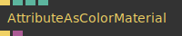

**Full Name:** `Ops.Gl.Shader.AttributeAsColorMaterial`

**Description:** render mesh normals as colors

**`\inputsymbol`{=latex} Inputs**

- **Render** (Trigger)
- **Absolute** (Number: Boolean)
- **World Space** (Number: Boolean)

**`\outputsymbol`{=latex} Output**

- **Trigger** (Trigger)
- **Shader** (Object)

**Example Patch:** [Open in Editor](https://cables.gl/edit/bZEZGc)

**Docs:** [https://cables.gl/op/Ops.Gl.Shader.AttributeAsColorMaterial](https://cables.gl/op/Ops.Gl.Shader.AttributeAsColorMaterial)

### BasicMaterial_v3
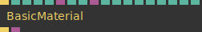

**Full Name:** `Ops.Gl.Shader.BasicMaterial_v3`

**Description:** A material without shading

**`\inputsymbol`{=latex} Inputs**

- **Render** (Trigger)
- **R** (Number)
- **G** (Number)
- **B** (Number)
- **A** (Number)
- **Texture** (Object:Texture)
- **ColorizeTexture** (Number: Boolean)
- **Vertex Colors** (Number: Boolean)
- **TextureOpacity** (Object:Texture)
- **Opacity TexCoords Transform** (Number: Boolean)
- **Discard Transparent Pixels** (Number: Boolean)
- **DiffuseRepeatX** (Number)
- **DiffuseRepeatY** (Number)
- **Tex Offset X** (Number)
- **Tex Offset Y** (Number)
- **Crop TexCoords** (Number: Boolean)
- **Billboard** (Number: Boolean)

**`\outputsymbol`{=latex} Output**

- **Trigger** (Trigger)
- **Shader** (Object)

**Example Patch:** [Open in Editor](https://cables.gl/edit/SKCL88)

**Docs:** [https://cables.gl/op/Ops.Gl.Shader.BasicMaterial_v3](https://cables.gl/op/Ops.Gl.Shader.BasicMaterial_v3)

### ChromaKeyMaterial


**Full Name:** `Ops.Gl.Shader.ChromaKeyMaterial`

**Description:** display texture and replace a color with transparency

**`\inputsymbol`{=latex} Inputs**

- **Render** (Trigger)
- **Texture** (Object)
- **Mode Index** (Number: Integer)
- **WeightMul** (Number)
- **R** (Number)
- **G** (Number)
- **B** (Number)
- **White** (Number)
- **DiffuseRepeatX** (Number)
- **DiffuseRepeatY** (Number)
- **Tex Offset X** (Number)
- **Tex Offset Y** (Number)

**`\outputsymbol`{=latex} Output**

- **Trigger** (Trigger)

**Example Patch:** [Open in Editor](https://cables.gl/edit/aDqoTq)

**Docs:** [https://cables.gl/op/Ops.Gl.Shader.ChromaKeyMaterial](https://cables.gl/op/Ops.Gl.Shader.ChromaKeyMaterial)

### CustomShader_v2


**Full Name:** `Ops.Gl.Shader.CustomShader_v2`

**Description:** Write your own custom shader

**`\inputsymbol`{=latex} Inputs**

- **Render** (Trigger)
- **Fragment Code** (String)
- **Vertex Code** (String)
- **Use As Material** (Number: Boolean)
- **W** (Number)
- **H** (Number)
- **GPosition** (Object)
- **GNormal** (Object)
- **TexNoise** (Object)
- **Samples** (Array)
- **Projection** (Array)

**`\outputsymbol`{=latex} Output**

- **Trigger** (Trigger)
- **Shader** (Object)
- **Has Errors** (booleanNumber)

**Example Patch:** [Open in Editor](https://cables.gl/edit/vWyGud)

**Docs:** [https://cables.gl/op/Ops.Gl.Shader.CustomShader_v2](https://cables.gl/op/Ops.Gl.Shader.CustomShader_v2)

### ErrorMaterial
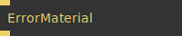

**Full Name:** `Ops.Gl.Shader.ErrorMaterial`

**Description:** draw meshes using the cables error material shader

**`\inputsymbol`{=latex} Inputs**

- **Render** (Trigger)

**`\outputsymbol`{=latex} Output**

- **Trigger** (Trigger)

**Example Patch:** [Open in Editor](https://cables.gl/op/Ops.Gl.Shader.ErrorMaterial#example)

**Docs:** [https://cables.gl/op/Ops.Gl.Shader.ErrorMaterial](https://cables.gl/op/Ops.Gl.Shader.ErrorMaterial)

### FrontBacksideMaterial
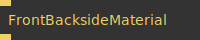

**Full Name:** `Ops.Gl.Shader.FrontBacksideMaterial`

**Description:** visualize which faces are facing the camera

**`\inputsymbol`{=latex} Inputs**

- **Render** (Trigger)

**`\outputsymbol`{=latex} Output**

- **Next** (Trigger)

**Example Patch:** [Open in Editor](https://cables.gl/edit/Lm6p9r)

**Docs:** [https://cables.gl/op/Ops.Gl.Shader.FrontBacksideMaterial](https://cables.gl/op/Ops.Gl.Shader.FrontBacksideMaterial)

### GetShader


**Full Name:** `Ops.Gl.Shader.GetShader`

**Description:** get current set shader

**`\inputsymbol`{=latex} Inputs**

- **Update** (Trigger)

**`\outputsymbol`{=latex} Output**

- **Next** (Trigger)
- **Shader** (Object)

**Example Patch:** [Open in Editor](https://cables.gl/edit/BweOVl)

**Docs:** [https://cables.gl/op/Ops.Gl.Shader.GetShader](https://cables.gl/op/Ops.Gl.Shader.GetShader)

### MatCapMaterial_v3
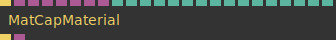

**Full Name:** `Ops.Gl.Shader.MatCapMaterial_v3`

**Description:** Easy to use image based lighting Material

**`\inputsymbol`{=latex} Inputs**

- **Render** (Trigger)
- **MatCap** (Object:Texture)
- **Diffuse** (Object:Texture)
- **Normal** (Object:Texture)
- **Specular Mask** (Object:Texture)
- **Specular MatCap** (Object:Texture)
- **AO Texture** (Object:Texture)
- **Opacity Texture** (Object:Texture)
- **R** (Number)
- **G** (Number)
- **B** (Number)
- **Opacity** (Number)
- **AO Intensity** (Number)
- **Normal Map Intensity** (Number)
- **Repeat X** (Number)
- **Repeat Y** (Number)
- **Offset X** (Number)
- **Offset Y** (Number)
- **Double Sided** (Number: Boolean)
- **Screen Space Normals** (Number: Boolean)
- **check to use screen space normals** (flat shading)
- **Calc Normal Tangents** (Number: Boolean)
- **Opacity TexCoords Transform** (Number: Boolean)
- **Discard Transparent Pixels** (Number: Boolean)

**`\outputsymbol`{=latex} Output**

- **Next** (Trigger)
- **Shader** (Object)

**Example Patch:** [Open in Editor](https://cables.gl/edit/gWkghi)

**Docs:** [https://cables.gl/op/Ops.Gl.Shader.MatCapMaterial_v3](https://cables.gl/op/Ops.Gl.Shader.MatCapMaterial_v3)

### MinifyGlsl


**Full Name:** `Ops.Gl.Shader.MinifyGlsl`

**Description:** Minify GLSL shader source code

**`\inputsymbol`{=latex} Inputs**

- **Shader Source** (String)

**`\outputsymbol`{=latex} Output**

- **Minified Shader Source** (String)

**Example Patch:** [Open in Editor](https://cables.gl/edit/t5H1Qc)

**Docs:** [https://cables.gl/op/Ops.Gl.Shader.MinifyGlsl](https://cables.gl/op/Ops.Gl.Shader.MinifyGlsl)

### PointMaterial_v6
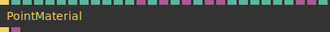

**Full Name:** `Ops.Gl.Shader.PointMaterial_v6`

**Description:** Draw all vertices as points / circles

**`\inputsymbol`{=latex} Inputs**

- **Render** (Trigger)
- **PointSize** (Number)
- **Size In Pixels** (Number: Boolean)
- **Random Size** (Number)
- **Round** (Number: Boolean)
- **Round Antialias** (Number: Boolean)
- **Scale By Distance** (Number: Boolean)
- **R** (Number)
- **G** (Number)
- **B** (Number)
- **A** (Number)
- **Vertex Colors** (Number: Boolean)
- **Texture** (Object:Texture)
- **Colorize Texture** (Number: Boolean)
- **Texture Mask** (Object:Texture)
- **Texture Colorize** (Object:Texture)
- **Colorize Randomize** (Number: Boolean)
- **Texture Opacity** (Object:Texture)
- **Texture Point Size** (Object:Texture)
- **Texture Point Size Mul** (Number)
- **Flip Texture** (Number: Boolean)
- **Atlas Cross Fade** (Number: Boolean)
- **Atlas Repeat X** (Number)
- **Atlas Lookup** (Object:Texture)
- **Rotate Texture** (Object:Texture)
- **Min Point Size** (Number)

**`\outputsymbol`{=latex} Output**

- **Trigger** (Trigger)
- **Shader** (Object)

**Example Patch:** [Open in Editor](https://cables.gl/edit/O9yRO6)

**Docs:** [https://cables.gl/op/Ops.Gl.Shader.PointMaterial_v6](https://cables.gl/op/Ops.Gl.Shader.PointMaterial_v6)

### PositionAsColorMaterial
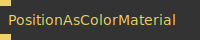

**Full Name:** `Ops.Gl.Shader.PositionAsColorMaterial`

**Description:** draw meshes using XYZ position coordinates as RGB color

**`\inputsymbol`{=latex} Inputs**

- **Render** (Trigger)

**`\outputsymbol`{=latex} Output**

- **Trigger** (Trigger)

**Example Patch:** [Open in Editor](https://cables.gl/edit/qbiIbk)

**Docs:** [https://cables.gl/op/Ops.Gl.Shader.PositionAsColorMaterial](https://cables.gl/op/Ops.Gl.Shader.PositionAsColorMaterial)

### SetShader
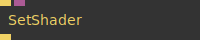

**Full Name:** `Ops.Gl.Shader.SetShader`

**Description:** Reuse another shader at different points in the patch.

**`\inputsymbol`{=latex} Inputs**

- **Render** (Trigger)
- **Shader** (Object)

**`\outputsymbol`{=latex} Output**

- **Trigger** (Trigger)

**Example Patch:** [Open in Editor](https://cables.gl/edit/BweOVl)

**Docs:** [https://cables.gl/op/Ops.Gl.Shader.SetShader](https://cables.gl/op/Ops.Gl.Shader.SetShader)

### SetUniformFloat_v2


**Full Name:** `Ops.Gl.Shader.SetUniformFloat_v2`

**Description:** set a uniform value of the current shader

**`\inputsymbol`{=latex} Inputs**

- **Render** (Trigger)
- **Uniform Index** (Number: Integer)
- **X** (Number)
- **Y** (Number)
- **Z** (Number)
- **W** (Number)

**`\outputsymbol`{=latex} Output**

- **Next** (Trigger)
- **Type** (String)
- **Found** (booleanNumber)

**Example Patch:** [Open in Editor](https://cables.gl/edit/5W7X2f)

**Docs:** [https://cables.gl/op/Ops.Gl.Shader.SetUniformFloat_v2](https://cables.gl/op/Ops.Gl.Shader.SetUniformFloat_v2)

### SetUniformTexture_v2


**Full Name:** `Ops.Gl.Shader.SetUniformTexture_v2`

**Description:** set a uniform value of the current shader

**`\inputsymbol`{=latex} Inputs**

- **Render** (Trigger)
- **Uniform Index** (Number: Integer)
- **Texture** (Object:Texture)

**`\outputsymbol`{=latex} Output**

- **Next** (Trigger)
- **Found** (booleanNumber)

**Example Patch:** [Open in Editor](https://cables.gl/edit/5W7X2f)

**Docs:** [https://cables.gl/op/Ops.Gl.Shader.SetUniformTexture_v2](https://cables.gl/op/Ops.Gl.Shader.SetUniformTexture_v2)

### ShaderDefine
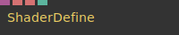

**Full Name:** `Ops.Gl.Shader.ShaderDefine`

**Description:** Set shader defines

**`\inputsymbol`{=latex} Inputs**

- **Shader** (Object)
- **Name** (String)
- **Value** (String)
- **Active** (Number: Boolean)
- **Public** (4): 1

**`\outputsymbol`{=latex} Output**

- *Visit [Ops.Gl.Shader.ShaderDefine documentation](https://cables.gl/op/Ops.Gl.Shader.ShaderDefine) for output port details*

**Example Patch:** [Open in Editor](https://cables.gl/op/Ops.Gl.Shader.ShaderDefine#example)

**Docs:** [https://cables.gl/op/Ops.Gl.Shader.ShaderDefine](https://cables.gl/op/Ops.Gl.Shader.ShaderDefine)

### ShaderInfo
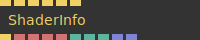

**Full Name:** `Ops.Gl.Shader.ShaderInfo`

**Description:** view current shader source code

**`\inputsymbol`{=latex} Inputs**

- **Exec** (Trigger)
- **Show Fragment** (Trigger)
- **Show Vertex** (Trigger)
- **Show Modules** (Trigger)
- **Show Uniforms** (Trigger)
- **State Info** (Trigger)

**`\outputsymbol`{=latex} Output**

- **Next** (Trigger)
- **Source Frag** (String)
- **Source Vert** (String)
- **Name** (String)
- **Id** (String)
- **NeedsBarycentric** (booleanNumber)
- **Num Uniforms** (Number)
- **Num Attributes** (Number)
- **Arributes Names** (Array)
- **Num Defines** (Array)

**Example Patch:** [Open in Editor](https://cables.gl/op/Ops.Gl.Shader.ShaderInfo#example)

**Docs:** [https://cables.gl/op/Ops.Gl.Shader.ShaderInfo](https://cables.gl/op/Ops.Gl.Shader.ShaderInfo)

### ShaderInfoUniforms_v2


**Full Name:** `Ops.Gl.Shader.ShaderInfoUniforms_v2`

**Description:** read back all uniforms values of the current bound shader

**`\inputsymbol`{=latex} Inputs**

- **Exec** (Trigger)

**`\outputsymbol`{=latex} Output**

- **Next** (Trigger)
- **Uniforms** (Array)

**Example Patch:** [Open in Editor](https://cables.gl/op/Ops.Gl.Shader.ShaderInfoUniforms_v2#example)

**Docs:** [https://cables.gl/op/Ops.Gl.Shader.ShaderInfoUniforms_v2](https://cables.gl/op/Ops.Gl.Shader.ShaderInfoUniforms_v2)

### ShaderToTexture_v2
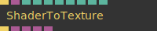

**Full Name:** `Ops.Gl.Shader.ShaderToTexture_v2`

**Description:** render a shader into a texture

**`\inputsymbol`{=latex} Inputs**

- **Render** (Trigger)
- **Shader** (Object:Shader)
- **Width** (Number: Integer)
- **Height** (Number: Integer)
- **Filter Index** (Number: Integer)
- **Wrap Index** (Number: Integer)
- **Pixel Format Index** (Number: Integer)

**`\outputsymbol`{=latex} Output**

- **Next** (Trigger)
- **Texture** (Object)
- **Texture 2** (Object)
- **Texture 3** (Object)
- **Texture 4** (Object)

**Example Patch:** [Open in Editor](https://cables.gl/edit/vWyGud)

**Docs:** [https://cables.gl/op/Ops.Gl.Shader.ShaderToTexture_v2](https://cables.gl/op/Ops.Gl.Shader.ShaderToTexture_v2)

### VertexColorMaterial
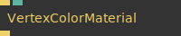

**Full Name:** `Ops.Gl.Shader.VertexColorMaterial`

**Description:** Draw a mesh, showing only its vertex colors

**`\inputsymbol`{=latex} Inputs**

- **Render** (Trigger)
- **Opacity** (Number)

**`\outputsymbol`{=latex} Output**

- **Trigger** (Trigger)

**Example Patch:** [Open in Editor](https://cables.gl/edit/6MsLhR)

**Docs:** [https://cables.gl/op/Ops.Gl.Shader.VertexColorMaterial](https://cables.gl/op/Ops.Gl.Shader.VertexColorMaterial)

### VertexNumberMaterial
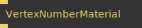

**Full Name:** `Ops.Gl.Shader.VertexNumberMaterial`

**Description:** visually debug vertices of your 3D geometry

**`\inputsymbol`{=latex} Inputs**

- **Render** (Trigger)

**`\outputsymbol`{=latex} Output**

- **Trigger** (Trigger)

**Example Patch:** [Open in Editor](https://cables.gl/edit/x2PmHf)

**Docs:** [https://cables.gl/op/Ops.Gl.Shader.VertexNumberMaterial](https://cables.gl/op/Ops.Gl.Shader.VertexNumberMaterial)

### WireframeMaterial_v2


**Full Name:** `Ops.Gl.Shader.WireframeMaterial_v2`

**Description:** Renders following meshes as wireframes

**`\inputsymbol`{=latex} Inputs**

- **Render** (Trigger)
- **Enable Depth Testing** (Number: Boolean)
- **Width** (Number)
- **AntiAlias** (Number)
- **Diffuse R** (Number)
- **Diffuse G** (Number)
- **Diffuse B** (Number)
- **Diffuse A** (Number)
- **Fill** (Number: Boolean)
- **Fill R** (Number)
- **Fill G** (Number)
- **Fill B** (Number)
- **Fill A** (Number)

**`\outputsymbol`{=latex} Output**

- **Trigger** (Trigger)

**Example Patch:** [Open in Editor](https://cables.gl/edit/bRlSDe)

**Docs:** [https://cables.gl/op/Ops.Gl.Shader.WireframeMaterial_v2](https://cables.gl/op/Ops.Gl.Shader.WireframeMaterial_v2)


