# Ops.Gl.ShaderEffects

---

## Ops.Gl.ShaderEffects

### AreaDiscardPixel_v2

**Full Name:** `Ops.Gl.ShaderEffects.AreaDiscardPixel_v2`

**Description:** do not draw pixels inside a defined 3d area

**> Input Ports:**

- **Render** (Trigger)
- **Invert** (Number: Boolean)
- **Area Index** (Number: Integer)
- **Area** (Number: String)
- **Size** (Number)
- **Size X** (Number)
- **Size Y** (Number)
- **Size Z** (Number)
- **Repeat** (Number: Boolean)
- **Repeat Distance** (Number)
- **X** (Number)
- **Y** (Number)
- **Z** (Number)
- **WorldSpace** (Number: Boolean)

**< Output Ports:**

- **Trigger** (Trigger)

**Example Patch:** [Open in Editor](https://cables.gl/edit/GQiw18)

**Patches Using This Op:** *Search [cables.gl patches](https://cables.gl/patches) for "AreaDiscardPixel_v2"*

**Docs:** [https://cables.gl/op/Ops.Gl.ShaderEffects.AreaDiscardPixel_v2](https://cables.gl/op/Ops.Gl.ShaderEffects.AreaDiscardPixel_v2)

### AreaRotate_v2

**Full Name:** `Ops.Gl.ShaderEffects.AreaRotate_v2`

**Description:** rotate vertices in an area around a center point

**> Input Ports:**

- **Render** (Trigger)
- **Size** (Number)
- **Strength** (Number)
- **Smooth** (Number: Boolean)
- **X** (Number)
- **Y** (Number)
- **Z** (Number)

**< Output Ports:**

- **Trigger** (Trigger)

**Example Patch:** [Open in Editor](https://cables.gl/edit/7mss1Q)

**Patches Using This Op:** *Search [cables.gl patches](https://cables.gl/patches) for "AreaRotate_v2"*

**Docs:** [https://cables.gl/op/Ops.Gl.ShaderEffects.AreaRotate_v2](https://cables.gl/op/Ops.Gl.ShaderEffects.AreaRotate_v2)

### AreaScaler_v3

**Full Name:** `Ops.Gl.ShaderEffects.AreaScaler_v3`

**Description:** Scales the size of meshes within the area of influence

**> Input Ports:**

- **Render** (Trigger)
- **Area Size** (Number)
- **Source Index** (Number: Integer)
- **Strength** (Number)
- **Smoothstep** (Number: Boolean)
- **Min Size Original** (Number: Boolean)
- **Clamp Size** (Number: Boolean)
- **Clamp Min** (Number)
- **Clamp Max** (Number)
- **Pos X** (Number)
- **Pos Y** (Number)
- **Pos Z** (Number)

**< Output Ports:**

- **Next** (Trigger)

**Example Patch:** [Open in Editor](https://cables.gl/edit/LXN7D-)

**Patches Using This Op:** *Search [cables.gl patches](https://cables.gl/patches) for "AreaScaler_v3"*

**Docs:** [https://cables.gl/op/Ops.Gl.ShaderEffects.AreaScaler_v3](https://cables.gl/op/Ops.Gl.ShaderEffects.AreaScaler_v3)

### AreaTranslateFBMNoise
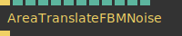

**Full Name:** `Ops.Gl.ShaderEffects.AreaTranslateFBMNoise`

**Description:** Area size of noise

**> Input Ports:**

- **Render** (Trigger)
- **Mode Index** (Number: Integer)
- **Size** (Number)
- **Strength** (Number)
- **Smooth** (Number: Boolean)
- **X** (Number)
- **Y** (Number)
- **Z** (Number)
- **Noise Scale** (Number)
- **Noise X** (Number)
- **Noise Y** (Number)
- **Noise Z** (Number)

**< Output Ports:**

- **Trigger** (Trigger)

**Example Patch:** [Open in Editor](https://cables.gl/edit/hDcUC-)

**Patches Using This Op:** *Search [cables.gl patches](https://cables.gl/patches) for "AreaTranslateFBMNoise"*

**Docs:** [https://cables.gl/op/Ops.Gl.ShaderEffects.AreaTranslateFBMNoise](https://cables.gl/op/Ops.Gl.ShaderEffects.AreaTranslateFBMNoise)

### AreaTranslateMeshes_v3
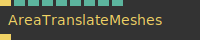

**Full Name:** `Ops.Gl.ShaderEffects.AreaTranslateMeshes_v3`

**Description:** Change the position of all meshes inside of the area of influence

**> Input Ports:**

- **Render** (Trigger)
- **Size** (Number)
- **Strength** (Number)
- **X** (Number)
- **Y** (Number)
- **Z** (Number)
- **Multiply X** (Number)
- **Multiply Y** (Number)
- **Multiply Z** (Number)

**< Output Ports:**

- **Trigger** (Trigger)

**Example Patch:** [Open in Editor](https://cables.gl/edit/yWVQC-)

**Patches Using This Op:** *Search [cables.gl patches](https://cables.gl/patches) for "AreaTranslateMeshes_v3"*

**Docs:** [https://cables.gl/op/Ops.Gl.ShaderEffects.AreaTranslateMeshes_v3](https://cables.gl/op/Ops.Gl.ShaderEffects.AreaTranslateMeshes_v3)

### Bend_v2
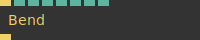

**Full Name:** `Ops.Gl.ShaderEffects.Bend_v2`

**Description:** bend objects along an axis

**> Input Ports:**

- **Render** (Trigger)
- **Amount** (Number)
- **RotX** (Number)
- **RotY** (Number)
- **RotZ** (Number)
- **Scale** (Number)
- **Offset** (Number)
- **Limited** (Number: Boolean)

**< Output Ports:**

- **Trigger** (Trigger)

**Example Patch:** [Open in Editor](https://cables.gl/edit/HtcN9Z)

**Patches Using This Op:** *Search [cables.gl patches](https://cables.gl/patches) for "Bend_v2"*

**Docs:** [https://cables.gl/op/Ops.Gl.ShaderEffects.Bend_v2](https://cables.gl/op/Ops.Gl.ShaderEffects.Bend_v2)

### ClampVertexPosition_v2

**Full Name:** `Ops.Gl.ShaderEffects.ClampVertexPosition_v2`

**Description:** clamp/restrict the vertex position to min/max values per axis

**> Input Ports:**

- **Render** (Trigger)
- **Axis Index** (Number: Integer)
- **Min** (Number)
- **Max** (Number)
- **Update Normals** (Number: Boolean)

**< Output Ports:**

- **Trigger** (Trigger)

**Example Patch:** [Open in Editor](https://cables.gl/edit/RP4O73)

**Patches Using This Op:** *Search [cables.gl patches](https://cables.gl/patches) for "ClampVertexPosition_v2"*

**Docs:** [https://cables.gl/op/Ops.Gl.ShaderEffects.ClampVertexPosition_v2](https://cables.gl/op/Ops.Gl.ShaderEffects.ClampVertexPosition_v2)

### ColorArea_v5

**Full Name:** `Ops.Gl.ShaderEffects.ColorArea_v5`

**Description:** Colorize all meshes around current position

**> Input Ports:**

- **Render** (Trigger)
- **Area Index** (Number: Integer)
- **Size** (Number)
- **Roundness** (Number)
- **Amount** (Number)
- **Falloff** (Number)
- **Invert** (Number: Boolean)
- **R** (Number)
- **G** (Number)
- **B** (Number)
- **X** (Number)
- **Y** (Number)
- **Z** (Number)
- **Change Size** (Number: Boolean)
- **Size X** (Number)
- **Size Y** (Number)
- **Size Z** (Number)
- **Texture** (Object:Texture)
- **Priority** (Number: Boolean)

**< Output Ports:**

- **Next** (Trigger)

**Example Patch:** [Open in Editor](https://cables.gl/edit/0Ti2gT)

**Patches Using This Op:** *Search [cables.gl patches](https://cables.gl/patches) for "ColorArea_v5"*

**Docs:** [https://cables.gl/op/Ops.Gl.ShaderEffects.ColorArea_v5](https://cables.gl/op/Ops.Gl.ShaderEffects.ColorArea_v5)

### DeformArea
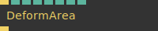

**Full Name:** `Ops.Gl.ShaderEffects.DeformArea`

**Description:** deform a spherical area of a mesh

**> Input Ports:**

- **Render** (Trigger)
- **Size** (Number)
- **Strength** (Number)
- **Smooth** (Number: Boolean)
- **WorldSpace** (Number: Boolean)
- **X** (Number)
- **Y** (Number)
- **Z** (Number)

**< Output Ports:**

- **Trigger** (Trigger)

**Example Patch:** [Open in Editor](https://cables.gl/edit/CQ0wmo)

**Patches Using This Op:** *Search [cables.gl patches](https://cables.gl/patches) for "DeformArea"*

**Docs:** [https://cables.gl/op/Ops.Gl.ShaderEffects.DeformArea](https://cables.gl/op/Ops.Gl.ShaderEffects.DeformArea)

### DiscardMaterialAlpha
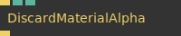

**Full Name:** `Ops.Gl.ShaderEffects.DiscardMaterialAlpha`

**Description:** discard transparent pixels in material textures

**> Input Ports:**

- **Render** (Trigger)
- **Method Index** (Number: Integer)
- **Threshold** (Number)

**< Output Ports:**

- **Trigger** (Trigger)

**Example Patch:** [Open in Editor](https://cables.gl/edit/3r_lf6)

**Patches Using This Op:** *Search [cables.gl patches](https://cables.gl/patches) for "DiscardMaterialAlpha"*

**Docs:** [https://cables.gl/op/Ops.Gl.ShaderEffects.DiscardMaterialAlpha](https://cables.gl/op/Ops.Gl.ShaderEffects.DiscardMaterialAlpha)

### ExplodeDividedMesh_v2
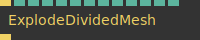

**Full Name:** `Ops.Gl.ShaderEffects.ExplodeDividedMesh_v2`

**Description:** explode a (divided) mesh in the direction of faces normals

**> Input Ports:**

- **Render** (Trigger)
- **Distance** (Number)
- **Size** (Number)
- **Absolute** (Number: Boolean)
- **Add X** (Number)
- **Add Y** (Number)
- **Add Z** (Number)
- **Mul X** (Number)
- **Mul Y** (Number)
- **Mul Z** (Number)
- **X** (Number)
- **Y** (Number)
- **Z** (Number)

**< Output Ports:**

- **Next** (Trigger)

**Example Patch:** [Open in Editor](https://cables.gl/edit/sYIxm1)

**Patches Using This Op:** *Search [cables.gl patches](https://cables.gl/patches) for "ExplodeDividedMesh_v2"*

**Docs:** [https://cables.gl/op/Ops.Gl.ShaderEffects.ExplodeDividedMesh_v2](https://cables.gl/op/Ops.Gl.ShaderEffects.ExplodeDividedMesh_v2)

### FogEffect
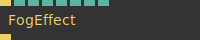

**Full Name:** `Ops.Gl.ShaderEffects.FogEffect`

**Description:** Fog as a shadereffect applied to a material

**> Input Ports:**

- **Render** (Trigger)
- **Mode Index** (Number: Integer)
- **Start** (Number)
- **End** (Number)
- **Amount** (Number)
- **R** (Number)
- **G** (Number)
- **B** (Number)

**< Output Ports:**

- **Trigger** (Trigger)

**Example Patch:** [Open in Editor](https://cables.gl/edit/3L3of6)

**Patches Using This Op:** *Search [cables.gl patches](https://cables.gl/patches) for "FogEffect"*

**Docs:** [https://cables.gl/op/Ops.Gl.ShaderEffects.FogEffect](https://cables.gl/op/Ops.Gl.ShaderEffects.FogEffect)

### FresnelGlow

**Full Name:** `Ops.Gl.ShaderEffects.FresnelGlow`

**Description:** add fresnel glow to any material

**> Input Ports:**

- **Trigger In** (Trigger)
- **Active** (Number: Boolean)
- **R** (Number)
- **G** (Number)
- **B** (Number)
- **Fresnel Intensity** (Number)
- **Fresnel Exponent** (Number)

**< Output Ports:**

- **Trigger Out** (Trigger)

**Example Patch:** [Open in Editor](https://cables.gl/edit/e02kYa)

**Patches Using This Op:** *Search [cables.gl patches](https://cables.gl/patches) for "FresnelGlow"*

**Docs:** [https://cables.gl/op/Ops.Gl.ShaderEffects.FresnelGlow](https://cables.gl/op/Ops.Gl.ShaderEffects.FresnelGlow)

### InstancedDisplacementMap_v2

**Full Name:** `Ops.Gl.ShaderEffects.InstancedDisplacementMap_v2`

**Description:** displace positions of instanced meshes using a texture

**> Input Ports:**

- **Trigger** (Trigger)
- **Texture** (Object:Texture)
- **Source Index** (Number: Integer)
- **Mode Index** (Number: Integer)
- **Strength** (Number)
- **Min** (Number)
- **Scale** (Number)
- **Clamp** (Number: Boolean)
- **Colorize** (Number: Boolean)
- **Debug Bounds** (Number: Boolean)
- **Normalize** (Number: Boolean)
- **Offset X** (Number)
- **Offset Y** (Number)
- **Abs** (Number: Boolean)
- **Channel Index** (Number: Integer)
- **X** (Number: Boolean)
- **Y** (Number: Boolean)
- **Z** (Number: Boolean)

**< Output Ports:**

- **Next** (Trigger)

**Example Patch:** [Open in Editor](https://cables.gl/edit/yQJfFj)

**Patches Using This Op:** *Search [cables.gl patches](https://cables.gl/patches) for "InstancedDisplacementMap_v2"*

**Docs:** [https://cables.gl/op/Ops.Gl.ShaderEffects.InstancedDisplacementMap_v2](https://cables.gl/op/Ops.Gl.ShaderEffects.InstancedDisplacementMap_v2)

### InstancedPerlinPosition_v2
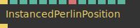

**Full Name:** `Ops.Gl.ShaderEffects.InstancedPerlinPosition_v2`

**Description:** displace position of instanced object by perlin noise value

**> Input Ports:**

- **Render** (Trigger)
- **Strength** (Number)
- **Scroll X** (Number)
- **Scroll Y** (Number)
- **Scroll Z** (Number)
- **Scale** (Number)
- **Method Index** (Number: Integer)
- **Method** (String)
- **Mul X** (Number)
- **Mul Y** (Number)
- **Mul Z** (Number)
- **Min Scale** (Number)
- **WorldSpace** (Number: Boolean)

**< Output Ports:**

- **Next** (Trigger)

**Example Patch:** [Open in Editor](https://cables.gl/edit/33bSY7)

**Patches Using This Op:** *Search [cables.gl patches](https://cables.gl/patches) for "InstancedPerlinPosition_v2"*

**Docs:** [https://cables.gl/op/Ops.Gl.ShaderEffects.InstancedPerlinPosition_v2](https://cables.gl/op/Ops.Gl.ShaderEffects.InstancedPerlinPosition_v2)

### InstancedTextureColorize
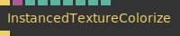

**Full Name:** `Ops.Gl.ShaderEffects.InstancedTextureColorize`

**Description:** colorize instanced meshes using a texture

**> Input Ports:**

- **Trigger** (Trigger)
- **Texture** (Object:Texture)
- **Strength** (Number)
- **Scale** (Number)
- **Clamp** (Number: Boolean)
- **Debug Bounds** (Number: Boolean)
- **Offset X** (Number)
- **Offset Y** (Number)
- **Method Index** (Number: Integer)

**< Output Ports:**

- **Next** (Trigger)

**Example Patch:** [Open in Editor](https://cables.gl/edit/yQJfFj)

**Patches Using This Op:** *Search [cables.gl patches](https://cables.gl/patches) for "InstancedTextureColorize"*

**Docs:** [https://cables.gl/op/Ops.Gl.ShaderEffects.InstancedTextureColorize](https://cables.gl/op/Ops.Gl.ShaderEffects.InstancedTextureColorize)

### LimitMeshByTexCoord
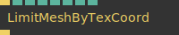

**Full Name:** `Ops.Gl.ShaderEffects.LimitMeshByTexCoord`

**Description:** discard pixel if texture coordinate is below threshold

**> Input Ports:**

- **Render** (Trigger)
- **Axis Index** (Number: Integer)
- **Treshhold** (Number)
- **Sine Animation** (Number: Boolean)
- **Time** (Number)
- **Sine Source Index** (Number: Integer)
- **Frequency** (Number)
- **Amplitude** (Number)

**< Output Ports:**

- **Trigger** (Trigger)

**Example Patch:** [Open in Editor](https://cables.gl/edit/pHfgJ5)

**Patches Using This Op:** *Search [cables.gl patches](https://cables.gl/patches) for "LimitMeshByTexCoord"*

**Docs:** [https://cables.gl/op/Ops.Gl.ShaderEffects.LimitMeshByTexCoord](https://cables.gl/op/Ops.Gl.ShaderEffects.LimitMeshByTexCoord)

### MeshPixelNoise_v2

**Full Name:** `Ops.Gl.ShaderEffects.MeshPixelNoise_v2`

**Description:** 3d space noise for mesh materials

**> Input Ports:**

- **Render** (Trigger)
- **Scale** (Number)
- **Amount** (Number)
- **Blendmode Index** (Number: Integer)
- **Blendmode** (String)
- **WorldSpace** (Number: Boolean)
- **R** (Number)
- **G** (Number)
- **B** (Number)
- **X** (Number)
- **Y** (Number)
- **Z** (Number)

**< Output Ports:**

- **Trigger** (Trigger)

**Example Patch:** [Open in Editor](https://cables.gl/edit/V7rjQ6)

**Patches Using This Op:** *Search [cables.gl patches](https://cables.gl/patches) for "MeshPixelNoise_v2"*

**Docs:** [https://cables.gl/op/Ops.Gl.ShaderEffects.MeshPixelNoise_v2](https://cables.gl/op/Ops.Gl.ShaderEffects.MeshPixelNoise_v2)

### ModuloVertexPosition
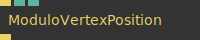

**Full Name:** `Ops.Gl.ShaderEffects.ModuloVertexPosition`

**Description:** vertex shader modulo operation on vertex position

**> Input Ports:**

- **Render** (Trigger)
- **Axis Index** (Number: Integer)
- **Modulo** (Number)

**< Output Ports:**

- **Trigger** (Trigger)

**Example Patch:** [Open in Editor](https://cables.gl/edit/lMCl_8)

**Patches Using This Op:** *Search [cables.gl patches](https://cables.gl/patches) for "ModuloVertexPosition"*

**Docs:** [https://cables.gl/op/Ops.Gl.ShaderEffects.ModuloVertexPosition](https://cables.gl/op/Ops.Gl.ShaderEffects.ModuloVertexPosition)

### PerlinAreaDeform_v4

**Full Name:** `Ops.Gl.ShaderEffects.PerlinAreaDeform_v4`

**Description:** Displace vertices using perlin noise animation

**> Input Ports:**

- **Render** (Trigger)
- **Scale** (Number)
- **Size** (Number)
- **Strength** (Number)
- **Calc Normals** (Number: Boolean)
- **Flip Normals** (Number: Boolean)
- **Falloff** (Number)
- **Output Index** (Number: Integer)
- **Source Index** (Number: Integer)
- **X** (Number)
- **Y** (Number)
- **Z** (Number)
- **Scroll X** (Number)
- **Scroll Y** (Number)
- **Scroll Z** (Number)
- **WorldSpace** (Number: Boolean)

**< Output Ports:**

- **Trigger** (Trigger)

**Example Patch:** [Open in Editor](https://cables.gl/edit/8RexP8)

**Patches Using This Op:** *Search [cables.gl patches](https://cables.gl/patches) for "PerlinAreaDeform_v4"*

**Docs:** [https://cables.gl/op/Ops.Gl.ShaderEffects.PerlinAreaDeform_v4](https://cables.gl/op/Ops.Gl.ShaderEffects.PerlinAreaDeform_v4)

### ScaleByNormal_v2
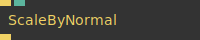

**Full Name:** `Ops.Gl.ShaderEffects.ScaleByNormal_v2`

**Description:** Scale vertices of an object in the direction of face normals

**> Input Ports:**

- **Render** (Trigger)
- **Strength** (Number)

**< Output Ports:**

- **Trigger** (Trigger)

**Example Patch:** [Open in Editor](https://cables.gl/edit/Ft2xm1)

**Patches Using This Op:** *Search [cables.gl patches](https://cables.gl/patches) for "ScaleByNormal_v2"*

**Docs:** [https://cables.gl/op/Ops.Gl.ShaderEffects.ScaleByNormal_v2](https://cables.gl/op/Ops.Gl.ShaderEffects.ScaleByNormal_v2)

### Shadow_v3
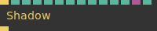

**Full Name:** `Ops.Gl.ShaderEffects.Shadow_v3`

**Description:** add shadow capabilities to any material

**> Input Ports:**

- **Trigger In** (Trigger)
- **Cast Shadow** (Number: Boolean)
- **Receive Shadow** (Number: Boolean)
- **Sample Distribution** (Number: Integer)
- **R** (Number)
- **G** (Number)
- **B** (Number)
- **Discard Transparent** (Number: Boolean)
- **Opacity Threshold** (Number)
- **Opacity Texture** (Object:Texture)
- **Cull Backfacing** (Number: Boolean)

**< Output Ports:**

- **Trigger Out** (Trigger)

**Example Patch:** [Open in Editor](https://cables.gl/edit/auVl18)

**Patches Using This Op:** *Search [cables.gl patches](https://cables.gl/patches) for "Shadow_v3"*

**Docs:** [https://cables.gl/op/Ops.Gl.ShaderEffects.Shadow_v3](https://cables.gl/op/Ops.Gl.ShaderEffects.Shadow_v3)

### SplineDeform_v2

**Full Name:** `Ops.Gl.ShaderEffects.SplineDeform_v2`

**Description:** Deform a mesh along a spline

**> Input Ports:**

- **Render** (Trigger)
- **Size** (Number)
- **Offset** (Number)
- **Points** (Array)

**< Output Ports:**

- **Next** (Trigger)

**Example Patch:** [Open in Editor](https://cables.gl/edit/F-UNZ4)

**Patches Using This Op:** *Search [cables.gl patches](https://cables.gl/patches) for "SplineDeform_v2"*

**Docs:** [https://cables.gl/op/Ops.Gl.ShaderEffects.SplineDeform_v2](https://cables.gl/op/Ops.Gl.ShaderEffects.SplineDeform_v2)

### TextureProjection_v2

**Full Name:** `Ops.Gl.ShaderEffects.TextureProjection_v2`

**Description:** texture projection on meshes

**> Input Ports:**

- **Render** (Trigger)
- **Texture** (Object:Texture)
- **BlendMode Index** (Number: Integer)
- **Amount** (Number)
- **Scale** (Number)
- **Use Texture Alpha** (Number: Boolean)
- **Pos X** (Number)
- **Pos Y** (Number)
- **Rot X** (Number)
- **Rot Y** (Number)
- **Rot Z** (Number)
- **Mapping Index** (Number: Integer)
- **Discard** (Number: Boolean)
- **WorldSpace** (Number: Boolean)

**< Output Ports:**

- **Trigger** (Trigger)

**Example Patch:** [Open in Editor](https://cables.gl/edit/fJHt0e)

**Patches Using This Op:** *Search [cables.gl patches](https://cables.gl/patches) for "TextureProjection_v2"*

**Docs:** [https://cables.gl/op/Ops.Gl.ShaderEffects.TextureProjection_v2](https://cables.gl/op/Ops.Gl.ShaderEffects.TextureProjection_v2)

### TransformTextureCoordinates
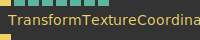

**Full Name:** `Ops.Gl.ShaderEffects.TransformTextureCoordinates`

**Description:** Transform and repeat texture coordinates of a mesh via vertex shader

**> Input Ports:**

- **Render** (Trigger)
- **Translate X** (Number)
- **Translate Y** (Number)
- **Repeat X** (Number)
- **Repeat Y** (Number)
- **Flip X** (Number: Boolean)
- **Flip Y** (Number: Boolean)
- **Rotation** (Number)

**< Output Ports:**

- **Trigger** (Trigger)

**Example Patch:** [Open in Editor](https://cables.gl/edit/YzNrx8)

**Patches Using This Op:** *Search [cables.gl patches](https://cables.gl/patches) for "TransformTextureCoordinates"*

**Docs:** [https://cables.gl/op/Ops.Gl.ShaderEffects.TransformTextureCoordinates](https://cables.gl/op/Ops.Gl.ShaderEffects.TransformTextureCoordinates)

### TransformVertex
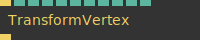

**Full Name:** `Ops.Gl.ShaderEffects.TransformVertex`

**Description:** transform vertices of a mesh via vertex shader

**> Input Ports:**

- **Render** (Trigger)
- **Translate X** (Number)
- **Translate Y** (Number)
- **Translate Z** (Number)
- **Scale X** (Number)
- **Scale Y** (Number)
- **Scale Z** (Number)
- **Rotation X** (Number)
- **Rotation Y** (Number)
- **Rotation Z** (Number)
- **Transform Normals** (Number: Boolean)

**< Output Ports:**

- **Trigger** (Trigger)

**Example Patch:** [Open in Editor](https://cables.gl/edit/u1iOhI)

**Patches Using This Op:** *Search [cables.gl patches](https://cables.gl/patches) for "TransformVertex"*

**Docs:** [https://cables.gl/op/Ops.Gl.ShaderEffects.TransformVertex](https://cables.gl/op/Ops.Gl.ShaderEffects.TransformVertex)

### Twist_v3
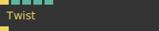

**Full Name:** `Ops.Gl.ShaderEffects.Twist_v3`

**Description:** twist a mesh around an axis

**> Input Ports:**

- **Render** (Trigger)
- **Degree** (Number)
- **Height** (Number)
- **Axis Index** (Number: Integer)
- **Axis** (Number: String)

**< Output Ports:**

- **Trigger** (Trigger)

**Example Patch:** [Open in Editor](https://cables.gl/edit/VYPlJ5)

**Patches Using This Op:** *Search [cables.gl patches](https://cables.gl/patches) for "Twist_v3"*

**Docs:** [https://cables.gl/op/Ops.Gl.ShaderEffects.Twist_v3](https://cables.gl/op/Ops.Gl.ShaderEffects.Twist_v3)

### UseVertexColor

**Full Name:** `Ops.Gl.ShaderEffects.UseVertexColor`

**Description:** Use vertex color as basecolor/diffuse color

**> Input Ports:**

- **Render** (Trigger)

**< Output Ports:**

- **Next** (Trigger)

**Example Patch:** [Open in Editor](https://cables.gl/edit/ep1Umu)

**Patches Using This Op:** *Search [cables.gl patches](https://cables.gl/patches) for "UseVertexColor"*

**Docs:** [https://cables.gl/op/Ops.Gl.ShaderEffects.UseVertexColor](https://cables.gl/op/Ops.Gl.ShaderEffects.UseVertexColor)

### VertexArea

**Full Name:** `Ops.Gl.ShaderEffects.VertexArea`

**Description:** transform an area of a mesh

**> Input Ports:**

- **Render** (Trigger)
- **Area Index** (Number: Integer)
- **Visualize Area** (Number: Boolean)
- **WorldSpace** (Number: Boolean)
- **X** (Number)
- **Y** (Number)
- **Z** (Number)
- **Radius** (Number)
- **Area Size X** (Number)
- **Area Size Y** (Number)
- **Area Size Z** (Number)
- **Translate X** (Number)
- **Translate Y** (Number)
- **Translate Z** (Number)
- **Scale X** (Number)
- **Scale Y** (Number)
- **Scale Z** (Number)

**< Output Ports:**

- **Trigger** (Trigger)

**Example Patch:** [Open in Editor](https://cables.gl/op/Ops.Gl.ShaderEffects.VertexArea#example)

**Patches Using This Op:** *Search [cables.gl patches](https://cables.gl/patches) for "VertexArea"*

**Docs:** [https://cables.gl/op/Ops.Gl.ShaderEffects.VertexArea](https://cables.gl/op/Ops.Gl.ShaderEffects.VertexArea)

### VertexColorAsAlpha

**Full Name:** `Ops.Gl.ShaderEffects.VertexColorAsAlpha`

**Description:** Use mesh vertexcolor as Alpha/Opacity

**> Input Ports:**

- **Render** (Trigger)
- **Input Index** (Number: Integer)
- **Invert** (Number: Boolean)

**< Output Ports:**

- **Next** (Trigger)

**Example Patch:** [Open in Editor](https://cables.gl/edit/ChcFXk)

**Patches Using This Op:** *Search [cables.gl patches](https://cables.gl/patches) for "VertexColorAsAlpha"*

**Docs:** [https://cables.gl/op/Ops.Gl.ShaderEffects.VertexColorAsAlpha](https://cables.gl/op/Ops.Gl.ShaderEffects.VertexColorAsAlpha)

### VertexDisplacementMap_v5

**Full Name:** `Ops.Gl.ShaderEffects.VertexDisplacementMap_v5`

**Description:** Displace the vertices of a mesh with the pixels brightness values from a texture

**> Input Ports:**

- **Render** (Trigger)
- **Extrude** (Number)
- **Texture** (Object:Texture)
- **Offset X** (Number)
- **Offset Y** (Number)
- **Scale** (Number)
- **Calc Normals** (Number: Boolean)
- **Discard Zero Values** (Number: Boolean)
- **Colorize** (Number: Boolean)
- **Colorize Min** (Number)
- **Colorize Max** (Number)

**< Output Ports:**

- **Trigger** (Trigger)

**Example Patch:** [Open in Editor](https://cables.gl/edit/aSWlLu)

**Patches Using This Op:** *Search [cables.gl patches](https://cables.gl/patches) for "VertexDisplacementMap_v5"*

**Docs:** [https://cables.gl/op/Ops.Gl.ShaderEffects.VertexDisplacementMap_v5](https://cables.gl/op/Ops.Gl.ShaderEffects.VertexDisplacementMap_v5)

### VertexNumberLimit_v2
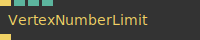

**Full Name:** `Ops.Gl.ShaderEffects.VertexNumberLimit_v2`

**Description:** only draw the first X vertices of a mesh

**> Input Ports:**

- **Render** (Trigger)
- **Min** (Number: Integer)
- **Max** (Number: Integer)
- **Invert** (Number: Boolean)

**< Output Ports:**

- **Next** (Trigger)

**Example Patch:** [Open in Editor](https://cables.gl/edit/gLrrJV)

**Patches Using This Op:** *Search [cables.gl patches](https://cables.gl/patches) for "VertexNumberLimit_v2"*

**Docs:** [https://cables.gl/op/Ops.Gl.ShaderEffects.VertexNumberLimit_v2](https://cables.gl/op/Ops.Gl.ShaderEffects.VertexNumberLimit_v2)

### VertexPositionFromTexture_v2
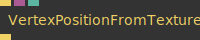

**Full Name:** `Ops.Gl.ShaderEffects.VertexPositionFromTexture_v2`

**Description:** set vertex positions of a mesh from a texture

**> Input Ports:**

- **Render** (Trigger)
- **Texture** (Object:Texture)
- **Mode Index** (Number: Integer)

**< Output Ports:**

- **Trigger** (Trigger)

**Example Patch:** [Open in Editor](https://cables.gl/edit/LDfZgL)

**Patches Using This Op:** *Search [cables.gl patches](https://cables.gl/patches) for "VertexPositionFromTexture_v2"*

**Docs:** [https://cables.gl/op/Ops.Gl.ShaderEffects.VertexPositionFromTexture_v2](https://cables.gl/op/Ops.Gl.ShaderEffects.VertexPositionFromTexture_v2)

### VertexWobble_v2

**Full Name:** `Ops.Gl.ShaderEffects.VertexWobble_v2`

**Description:** sine wave vertex displacement

**> Input Ports:**

- **Render** (Trigger)
- **Source Index** (Number: Integer)
- **Amount** (Number)
- **Time** (Number)
- **Scale** (Number)
- **AxisX** (Number: Boolean)
- **AxisY** (Number: Boolean)
- **AxisZ** (Number: Boolean)
- **Area Index** (Number: Integer)
- **Size** (Number)
- **Falloff** (Number)
- **X** (Number)
- **Y** (Number)
- **Z** (Number)
- **WorldSpace** (Number: Boolean)
- **Invert** (Number: Boolean)

**< Output Ports:**

- **Trigger** (Trigger)

**Example Patch:** [Open in Editor](https://cables.gl/edit/0PxhuO)

**Patches Using This Op:** *Search [cables.gl patches](https://cables.gl/patches) for "VertexWobble_v2"*

**Docs:** [https://cables.gl/op/Ops.Gl.ShaderEffects.VertexWobble_v2](https://cables.gl/op/Ops.Gl.ShaderEffects.VertexWobble_v2)

