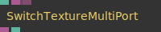
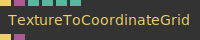

# Ops.Gl.Textures

*Part of the [All Operators Reference](13-_AllOps.md)*

---

## Ops.Gl.Textures

### Base64ToTexture

**Full Name:** `Ops.Gl.Textures.Base64ToTexture`
**Description:** *Visit [documentation](https://cables.gl/op/Ops.Gl.Textures.Base64ToTexture) for details*

**> Input Ports:**
- **Wrap Index** (Number: Integer)
- **Pre Multiplied Alpha** (Number: Boolean)

**< Output Ports:**
- **Texture** (Object)
- **Has Error** (booleanNumber)
- **Loading** (booleanNumber)

**Example Patch:** [Open in Editor](https://cables.gl/op/Ops.Gl.Textures.Base64ToTexture#example)
**Patches Using This Op:** *Search [cables.gl patches](https://cables.gl/patches) for "Base64ToTexture"*
**Docs:** [https://cables.gl/op/Ops.Gl.Textures.Base64ToTexture](https://cables.gl/op/Ops.Gl.Textures.Base64ToTexture)

---

### ColorTexture

**Full Name:** `Ops.Gl.Textures.ColorTexture`
**Description:** *Visit [documentation](https://cables.gl/op/Ops.Gl.Textures.ColorTexture) for details*

**> Input Ports:**
- **R** (Number)
- **G** (Number)
- **B** (Number)
- **A** (Number)

**< Output Ports:**
- **Texture_out** (Object)

**Example Patch:** [Open in Editor](https://cables.gl/op/Ops.Gl.Textures.ColorTexture#example)
**Patches Using This Op:** *Search [cables.gl patches](https://cables.gl/patches) for "ColorTexture"*
**Docs:** [https://cables.gl/op/Ops.Gl.Textures.ColorTexture](https://cables.gl/op/Ops.Gl.Textures.ColorTexture)

---

### CombineTextures

**Full Name:** `Ops.Gl.Textures.CombineTextures`
**Description:** *Visit [documentation](https://cables.gl/op/Ops.Gl.Textures.CombineTextures) for details*

**> Input Ports:**
- **Execute** (Trigger)
- **Filter Index** (Number: Integer)
- **Wrap Index** (Number: Integer)
- **Pixel Format Index** (Number: Integer)
- **Size Index** (Number: Integer)
- **R** (Object:Texture)
- **R Source Index** (Number: Integer)
- **R Value Index** (Number: Integer)
- **R Default** (Number)
- **G** (Object:Texture)
- **G Source Index** (Number: Integer)
- **G Value Index** (Number: Integer)
- **G Default** (Number)
- **B** (Object:Texture)
- **B Source Index** (Number: Integer)
- **B Value Index** (Number: Integer)
- **B Default** (Number)
- **A** (Object:Texture)
- **A Source Index** (Number: Integer)
- **A Value Index** (Number: Integer)
- **A Default** (Number)

**< Output Ports:**
- **Next** (Trigger)
- **Texture** (Object)

**Example Patch:** [Open in Editor](https://cables.gl/op/Ops.Gl.Textures.CombineTextures#example)
**Patches Using This Op:** *Search [cables.gl patches](https://cables.gl/patches) for "CombineTextures"*
**Docs:** [https://cables.gl/op/Ops.Gl.Textures.CombineTextures](https://cables.gl/op/Ops.Gl.Textures.CombineTextures)

---

### CopyTexture_v3

**Full Name:** `Ops.Gl.Textures.CopyTexture_v3`
**Description:** *Visit [documentation](https://cables.gl/op/Ops.Gl.Textures.CopyTexture_v3) for details*

**> Input Ports:**
- **Render** (Trigger)
- **Texture** (Object:Texture)
- **Alpha Mask** (Object:Texture)
- **Use Original Size** (Number: Boolean)
- **Width** (Number: Integer)
- **Height** (Number: Integer)
- **Pixel Format Index** (Number: Integer)
- **Wrap Index** (Number: Integer)
- **Invert A** (Number: Boolean)
- **Flip X** (Number: Boolean)
- **Flip Y** (Number: Boolean)

**< Output Ports:**
- **Trigger** (Trigger)
- **Texture_out** (Object)
- **Aspect Ratio** (Number)

**Example Patch:** [Open in Editor](https://cables.gl/op/Ops.Gl.Textures.CopyTexture_v3#example)
**Patches Using This Op:** *Search [cables.gl patches](https://cables.gl/patches) for "CopyTexture_v3"*
**Docs:** [https://cables.gl/op/Ops.Gl.Textures.CopyTexture_v3](https://cables.gl/op/Ops.Gl.Textures.CopyTexture_v3)

---

### EmptyTexture

**Full Name:** `Ops.Gl.Textures.EmptyTexture`
**Description:** *Visit [documentation](https://cables.gl/op/Ops.Gl.Textures.EmptyTexture) for details*

**> Input Ports:**
- **Width** (Number)
- **Height** (Number)

**< Output Ports:**
- **Texture** (Object)

**Example Patch:** [Open in Editor](https://cables.gl/op/Ops.Gl.Textures.EmptyTexture#example)
**Patches Using This Op:** *Search [cables.gl patches](https://cables.gl/patches) for "EmptyTexture"*
**Docs:** [https://cables.gl/op/Ops.Gl.Textures.EmptyTexture](https://cables.gl/op/Ops.Gl.Textures.EmptyTexture)

---

### ExrTexture

**Full Name:** `Ops.Gl.Textures.ExrTexture`
**Description:** *Visit [documentation](https://cables.gl/op/Ops.Gl.Textures.ExrTexture) for details*

**> Input Ports:**
- **EXR File** (String)
- **Remove Alpha** (Number: Boolean)
- **Flip** (Number: Boolean)

**< Output Ports:**
- **Texture** (Object)
- **Width** (Number)
- **Height** (Number)
- **Channels** (String)
- **Loading** (booleanNumber)

**Example Patch:** [Open in Editor](https://cables.gl/op/Ops.Gl.Textures.ExrTexture#example)
**Patches Using This Op:** *Search [cables.gl patches](https://cables.gl/patches) for "ExrTexture"*
**Docs:** [https://cables.gl/op/Ops.Gl.Textures.ExrTexture](https://cables.gl/op/Ops.Gl.Textures.ExrTexture)

---

### GraphTexture

**Full Name:** `Ops.Gl.Textures.GraphTexture`
**Description:** *Visit [documentation](https://cables.gl/op/Ops.Gl.Textures.GraphTexture) for details*

**> Input Ports:**
- **Trigger** (Trigger)
- **Value** (Number)
- **Index** (Number: Integer)
- **Reset** (Trigger)
- **Color Random Seed** (Number)
- **Texture Width** (Number: Integer)
- **Texture Height** (Number: Integer)

**< Output Ports:**
- **Texture** (Object)

**Example Patch:** [Open in Editor](https://cables.gl/op/Ops.Gl.Textures.GraphTexture#example)
**Patches Using This Op:** *Search [cables.gl patches](https://cables.gl/patches) for "GraphTexture"*
**Docs:** [https://cables.gl/op/Ops.Gl.Textures.GraphTexture](https://cables.gl/op/Ops.Gl.Textures.GraphTexture)

---

### Histogram

**Full Name:** `Ops.Gl.Textures.Histogram`
**Description:** *Visit [documentation](https://cables.gl/op/Ops.Gl.Textures.Histogram) for details*

**> Input Ports:**
- **Trigger** (Trigger)
- **Texture** (Object:Texture)

**< Output Ports:**
- **Histogram Texture** (Object)
- **Histogram Data** (Object)

**Example Patch:** [Open in Editor](https://cables.gl/op/Ops.Gl.Textures.Histogram#example)
**Patches Using This Op:** *Search [cables.gl patches](https://cables.gl/patches) for "Histogram"*
**Docs:** [https://cables.gl/op/Ops.Gl.Textures.Histogram](https://cables.gl/op/Ops.Gl.Textures.Histogram)

---

### MontageTextures_v2

**Full Name:** `Ops.Gl.Textures.MontageTextures_v2`
**Description:** *Visit [documentation](https://cables.gl/op/Ops.Gl.Textures.MontageTextures_v2) for details*

**> Input Ports:**
- **Execute** (Trigger)
- **Flip Order** (Number: Boolean)
- **Width** (Number: Integer)
- **Height** (Number: Integer)
- **Wrap Index** (Number: Integer)
- **Pixel Format Index** (Number: Integer)
- **Texture 0** (Object:Texture)
- **Texture 1** (Object:Texture)
- **Texture 2** (Object:Texture)
- **Texture 3** (Object:Texture)
- **Texture 4** (Object:Texture)
- **Texture 5** (Object:Texture)
- **Texture 6** (Object:Texture)
- **Texture 7** (Object:Texture)
- **Texture 8** (Object:Texture)
- **Texture 9** (Object:Texture)
- **Texture 10** (Object:Texture)
- **Texture 11** (Object:Texture)
- **Texture 12** (Object:Texture)
- **Texture 13** (Object:Texture)
- **Texture 14** (Object:Texture)
- **Texture 15** (Object:Texture)

**< Output Ports:**
- **Next** (Trigger)
- **Texture** (Object)
- **Columns** (Number)
- **Rows** (Number)

**Example Patch:** [Open in Editor](https://cables.gl/op/Ops.Gl.Textures.MontageTextures_v2#example)
**Patches Using This Op:** *Search [cables.gl patches](https://cables.gl/patches) for "MontageTextures_v2"*
**Docs:** [https://cables.gl/op/Ops.Gl.Textures.MontageTextures_v2](https://cables.gl/op/Ops.Gl.Textures.MontageTextures_v2)

---

### NoiseTexture

**Full Name:** `Ops.Gl.Textures.NoiseTexture`
**Description:** *Visit [documentation](https://cables.gl/op/Ops.Gl.Textures.NoiseTexture) for details*

**> Input Ports:**
- **Width** (Number: Integer)
- **Height** (Number: Integer)
- **Wrap Index** (Number: Integer)
- **Color** (Number: Boolean)
- **Pixel Format Index** (Number: Integer)
- **Integer** (Number: Boolean)
- **Seed** (Number)
- **Channel R** (Number: Boolean)
- **Min R** (Number)
- **Max R** (Number)
- **Channel G** (Number: Boolean)
- **Min G** (Number)
- **Max G** (Number)
- **Channel B** (Number: Boolean)
- **Min B** (Number)
- **Max B** (Number)
- **Channel A** (Number: Boolean)
- **Min A** (Number)
- **Max A** (Number)

**< Output Ports:**
- **Texture** (Object)
- **Total Pixel** (Number)

**Example Patch:** [Open in Editor](https://cables.gl/op/Ops.Gl.Textures.NoiseTexture#example)
**Patches Using This Op:** *Search [cables.gl patches](https://cables.gl/patches) for "NoiseTexture"*
**Docs:** [https://cables.gl/op/Ops.Gl.Textures.NoiseTexture](https://cables.gl/op/Ops.Gl.Textures.NoiseTexture)

---

### PaletteTexture

**Full Name:** `Ops.Gl.Textures.PaletteTexture`
**Description:** *Visit [documentation](https://cables.gl/op/Ops.Gl.Textures.PaletteTexture) for details*

**> Input Ports:**
- **Palette Array** (Array)
- **Smooth** (Number: Boolean)

**< Output Ports:**
- **Color Array** (Array)
- **Texture** (Object)

**Example Patch:** [Open in Editor](https://cables.gl/op/Ops.Gl.Textures.PaletteTexture#example)
**Patches Using This Op:** *Search [cables.gl patches](https://cables.gl/patches) for "PaletteTexture"*
**Docs:** [https://cables.gl/op/Ops.Gl.Textures.PaletteTexture](https://cables.gl/op/Ops.Gl.Textures.PaletteTexture)

---

### SequenceTextures

**Full Name:** `Ops.Gl.Textures.SequenceTextures`
**Description:** *Visit [documentation](https://cables.gl/op/Ops.Gl.Textures.SequenceTextures) for details*

**> Input Ports:**
- **Texture 0** (Object:Texture)
- **Texture 1** (Object:Texture)
- **Texture 2** (Object:Texture)
- **Texture 3** (Object:Texture)
- **Texture 4** (Object:Texture)
- **Texture 5** (Object:Texture)
- **Texture 6** (Object:Texture)
- **Texture 7** (Object:Texture)
- **Texture 8** (Object:Texture)
- **Texture 9** (Object:Texture)
- **Texture 10** (Object:Texture)
- **Texture 11** (Object:Texture)
- **Texture 12** (Object:Texture)
- **Texture 13** (Object:Texture)
- **Texture 14** (Object:Texture)
- **Texture 15** (Object:Texture)

**< Output Ports:**
- **Output 0** (Object)
- **Output 1** (Object)
- **Output 2** (Object)
- **Output 3** (Object)
- **Output 4** (Object)
- **Output 5** (Object)
- **Output 6** (Object)
- **Output 7** (Object)
- **Output 8** (Object)
- **Output 9** (Object)
- **Output 10** (Object)
- **Output 11** (Object)
- **Output 12** (Object)
- **Output 13** (Object)
- **Output 14** (Object)
- **Output 15** (Object)

**Example Patch:** [Open in Editor](https://cables.gl/op/Ops.Gl.Textures.SequenceTextures#example)
**Patches Using This Op:** *Search [cables.gl patches](https://cables.gl/patches) for "SequenceTextures"*
**Docs:** [https://cables.gl/op/Ops.Gl.Textures.SequenceTextures](https://cables.gl/op/Ops.Gl.Textures.SequenceTextures)

---

### SSAO

**Full Name:** `Ops.Gl.Textures.SSAO`
**Description:** *Visit [documentation](https://cables.gl/op/Ops.Gl.Textures.SSAO) for details*

**> Input Ports:**
- **Execute** (Trigger)
- **Depth Texture** (Object:Texture)
- **Radius** (Number)
- **Max Dist** (Number)
- **Begin** (Number)
- **End** (Number)
- **Strength** (Number)
- **Base** (Number)
- **Filter Index** (Number: Integer)

**< Output Ports:**
- **Next** (Trigger)
- **SSAO** (Object)

**Example Patch:** [Open in Editor](https://cables.gl/op/Ops.Gl.Textures.SSAO#example)
**Patches Using This Op:** *Search [cables.gl patches](https://cables.gl/patches) for "SSAO"*
**Docs:** [https://cables.gl/op/Ops.Gl.Textures.SSAO](https://cables.gl/op/Ops.Gl.Textures.SSAO)

---

### SwitchTextureMultiPort_v2

**Full Name:** `Ops.Gl.Textures.SwitchTextureMultiPort_v2`
**Description:** *Visit [documentation](https://cables.gl/op/Ops.Gl.Textures.SwitchTextureMultiPort_v2) for details*

**> Input Ports:**
- **Index** (Number: Integer)
- **Textures_0** (Object)
- **Add Port** (Object)

**< Output Ports:**
- **Texture** (Object)
- **Num Textures** (Number)

**Example Patch:** [Open in Editor](https://cables.gl/op/Ops.Gl.Textures.SwitchTextureMultiPort_v2#example)
**Patches Using This Op:** *Search [cables.gl patches](https://cables.gl/patches) for "SwitchTextureMultiPort_v2"*
**Docs:** [https://cables.gl/op/Ops.Gl.Textures.SwitchTextureMultiPort_v2](https://cables.gl/op/Ops.Gl.Textures.SwitchTextureMultiPort_v2)

---

### SwitchTextures_v2

**Full Name:** `Ops.Gl.Textures.SwitchTextures_v2`
**Description:** *Visit [documentation](https://cables.gl/op/Ops.Gl.Textures.SwitchTextures_v2) for details*

**> Input Ports:**
- **Exec** (Trigger)
- **Num** (Number: Integer)
- **Default Texture Transparent** (Number: Boolean)
- **Texture0** (Object:Texture)
- **Texture1** (Object:Texture)
- **Texture2** (Object:Texture)
- **Texture3** (Object:Texture)
- **Texture4** (Object:Texture)
- **Texture5** (Object:Texture)
- **Texture6** (Object:Texture)
- **Texture7** (Object:Texture)
- **Texture8** (Object:Texture)
- **Texture9** (Object:Texture)
- **Texture10** (Object:Texture)
- **Texture11** (Object:Texture)
- **Texture12** (Object:Texture)
- **Texture13** (Object:Texture)
- **Texture14** (Object:Texture)
- **Texture15** (Object:Texture)

**< Output Ports:**
- **Next** (Trigger)
- **Texture** (Object)

**Example Patch:** [Open in Editor](https://cables.gl/op/Ops.Gl.Textures.SwitchTextures_v2#example)
**Patches Using This Op:** *Search [cables.gl patches](https://cables.gl/patches) for "SwitchTextures_v2"*
**Docs:** [https://cables.gl/op/Ops.Gl.Textures.SwitchTextures_v2](https://cables.gl/op/Ops.Gl.Textures.SwitchTextures_v2)

---

### TextTexture_v6

**Full Name:** `Ops.Gl.Textures.TextTexture_v6`
**Description:** *Visit [documentation](https://cables.gl/op/Ops.Gl.Textures.TextTexture_v6) for details*

**> Input Ports:**
- **Render** (Trigger)
- **Text** (String)
- **Draw Mesh** (Number: Boolean)
- **Scale Mesh** (Number)
- **Width** (Number: Integer)
- **Height** (Number: Integer)
- **Auto Height** (Number: Boolean)
- **Auto Line Breaks** (Number: Boolean)
- **Font** (String)
- **Weight** (String)
- **FontSize** (Number)
- **Letter Spacing** (Number)
- **Line Height Add** (Number)
- **Padding Y Top** (Number: Integer)
- **Padding Y Bottom** (Number: Integer)
- **Padding X** (Number: Integer)
- **Wrap Index** (Number: Integer)
- **Reuse Texture** (Number: Boolean)
- **Show Debug** (Number: Boolean)
- **Redraw On Font Load** (Number: Boolean)
- **R** (Number)
- **G** (Number)
- **B** (Number)
- **Opacity** (Number)
- **Background R** (Number)
- **Background G** (Number)
- **Background B** (Number)
- **Background A** (Number)
- **Force Redraw** (Trigger)

**< Output Ports:**
- **Next** (Trigger)
- **Ratio** (Number)
- **Texture** (Object)
- **Canvas** (Object)
- **Aspect** (Number)
- **Num Lines** (Number)

**Example Patch:** [Open in Editor](https://cables.gl/op/Ops.Gl.Textures.TextTexture_v6#example)
**Patches Using This Op:** *Search [cables.gl patches](https://cables.gl/patches) for "TextTexture_v6"*
**Docs:** [https://cables.gl/op/Ops.Gl.Textures.TextTexture_v6](https://cables.gl/op/Ops.Gl.Textures.TextTexture_v6)

---

### TextureArrayInfo

**Full Name:** `Ops.Gl.Textures.TextureArrayInfo`
**Description:** *Visit [documentation](https://cables.gl/op/Ops.Gl.Textures.TextureArrayInfo) for details*

**> Input Ports:**
- **Texture Array** (Array)

**< Output Ports:**
- **Names** (Array)
- **Widths** (Array)
- **Heights** (Array)

**Example Patch:** [Open in Editor](https://cables.gl/op/Ops.Gl.Textures.TextureArrayInfo#example)
**Patches Using This Op:** *Search [cables.gl patches](https://cables.gl/patches) for "TextureArrayInfo"*
**Docs:** [https://cables.gl/op/Ops.Gl.Textures.TextureArrayInfo](https://cables.gl/op/Ops.Gl.Textures.TextureArrayInfo)

---

### TextureInfo_v2

**Full Name:** `Ops.Gl.Textures.TextureInfo_v2`
**Description:** *Visit [documentation](https://cables.gl/op/Ops.Gl.Textures.TextureInfo_v2) for details*

**> Input Ports:**
- **Texture** (Object:Texture)

**< Output Ports:**
- **Name** (String)
- **PixelFormat** (String)
- **Width** (Number)
- **Height** (Number)
- **Ratio** (Number)
- **Filter** (Number)
- **Wrap** (Number)
- **Flipped** (booleanNumber)
- **HDR** (booleanNumber)
- **Is Empty Default Texture** (booleanNumber)
- **Is Default Texture** (booleanNumber)
- **Is Cubemap** (booleanNumber)
- **Id** (Number)

**Example Patch:** [Open in Editor](https://cables.gl/op/Ops.Gl.Textures.TextureInfo_v2#example)
**Patches Using This Op:** *Search [cables.gl patches](https://cables.gl/patches) for "TextureInfo_v2"*
**Docs:** [https://cables.gl/op/Ops.Gl.Textures.TextureInfo_v2](https://cables.gl/op/Ops.Gl.Textures.TextureInfo_v2)

---

### TextureSVG_v2

**Full Name:** `Ops.Gl.Textures.TextureSVG_v2`
**Description:** *Visit [documentation](https://cables.gl/op/Ops.Gl.Textures.TextureSVG_v2) for details*

**> Input Ports:**
- **File** (String)
- **Texture Width** (Number: Integer)
- **Texture Height** (Number: Integer)
- **Wrap Index** (Number: Integer)
- **Filter Index** (Number: Integer)

**< Output Ports:**
- **Texture** (Object)
- **Loaded** (booleanNumber)

**Example Patch:** [Open in Editor](https://cables.gl/op/Ops.Gl.Textures.TextureSVG_v2#example)
**Patches Using This Op:** *Search [cables.gl patches](https://cables.gl/patches) for "TextureSVG_v2"*
**Docs:** [https://cables.gl/op/Ops.Gl.Textures.TextureSVG_v2](https://cables.gl/op/Ops.Gl.Textures.TextureSVG_v2)

---

### TextureToBase64_v5

**Full Name:** `Ops.Gl.Textures.TextureToBase64_v5`
**Description:** *Visit [documentation](https://cables.gl/op/Ops.Gl.Textures.TextureToBase64_v5) for details*

**> Input Ports:**
- **Trigger** (Trigger)
- **Texture** (Object:Texture)
- **Quality** (Number)
- **Output DataUrl** (Number: Boolean)

**< Output Ports:**
- **Next** (Trigger)
- **Binary Size** (Number)
- **Base64 String** (String)
- **Loading** (booleanNumber)
- **Finished** (Trigger)

**Example Patch:** [Open in Editor](https://cables.gl/op/Ops.Gl.Textures.TextureToBase64_v5#example)
**Patches Using This Op:** *Search [cables.gl patches](https://cables.gl/patches) for "TextureToBase64_v5"*
**Docs:** [https://cables.gl/op/Ops.Gl.Textures.TextureToBase64_v5](https://cables.gl/op/Ops.Gl.Textures.TextureToBase64_v5)

---

### TextureToCoordinateGrid

**Full Name:** `Ops.Gl.Textures.TextureToCoordinateGrid`
**Description:** *Visit [documentation](https://cables.gl/op/Ops.Gl.Textures.TextureToCoordinateGrid) for details*

**> Input Ports:**
- **Execute** (Trigger)
- **Texture** (Object:Texture)
- **Aspect** (Number)
- **Threshold** (Number)
- **Repeats** (Number: Integer)
- **Repeats Spacing** (Number)

**< Output Ports:**
- **Next** (Trigger)
- **HDR Texture** (Object)

**Example Patch:** [Open in Editor](https://cables.gl/op/Ops.Gl.Textures.TextureToCoordinateGrid#example)
**Patches Using This Op:** *Search [cables.gl patches](https://cables.gl/patches) for "TextureToCoordinateGrid"*
**Docs:** [https://cables.gl/op/Ops.Gl.Textures.TextureToCoordinateGrid](https://cables.gl/op/Ops.Gl.Textures.TextureToCoordinateGrid)

---

### VideoTexture_v3

**Full Name:** `Ops.Gl.Textures.VideoTexture_v3`
**Description:** *Visit [documentation](https://cables.gl/op/Ops.Gl.Textures.VideoTexture_v3) for details*

**> Input Ports:**
- **Update** (Trigger)
- **File** (String)
- **Play** (Number: Boolean)
- **Loop** (Number: Boolean)
- **Volume** (Number)
- **Mute** (Number: Boolean)
- **Update FPS** (Number)
- **Wrap Index** (Number: Integer)
- **Flip** (Number: Boolean)
- **Speed** (Number)
- **Set Time** (Number)
- **Rewind** (Trigger)
- **Preload** (Number: Boolean)
- **Show Interaction Needed Button** (Number: Boolean)

**< Output Ports:**
- **Next** (Trigger)
- **Texture** (Object)
- **Duration** (Number)
- **Progress** (Number)
- **Interaction Needed** (booleanNumber)
- **CurrentTime** (Number)
- **Loading** (booleanNumber)
- **Playing** (booleanNumber)
- **Can Play Through** (booleanNumber)
- **Width** (Number)
- **Height** (Number)
- **Aspect Ratio** (Number)
- **Has Error** (booleanNumber)
- **Auto FPS** (booleanNumber)
- **Error Message** (String)

**Example Patch:** [Open in Editor](https://cables.gl/op/Ops.Gl.Textures.VideoTexture_v3#example)
**Patches Using This Op:** *Search [cables.gl patches](https://cables.gl/patches) for "VideoTexture_v3"*
**Docs:** [https://cables.gl/op/Ops.Gl.Textures.VideoTexture_v3](https://cables.gl/op/Ops.Gl.Textures.VideoTexture_v3)

---

### WebcamTexture_v3

**Full Name:** `Ops.Gl.Textures.WebcamTexture_v3`
**Description:** *Visit [documentation](https://cables.gl/op/Ops.Gl.Textures.WebcamTexture_v3) for details*

**> Input Ports:**
- **Render** (Trigger)
- **Active** (Number: Boolean)
- **Generate Texture** (Number: Boolean)
- **Webcam Input Index** (Number: Integer)
- **Requested Width** (Number: Integer)
- **Requested Height** (Number: Integer)
- **Flip X** (Number: Boolean)
- **Flip Y** (Number: Boolean)
- **Show HTML Element** (Number: Boolean)
- **CSS** (String)
- **Element Flip X** (Number: Boolean)
- **Element Flip Y** (Number: Boolean)

**< Output Ports:**
- **Next** (Trigger)
- **Texture** (Object)
- **Ratio** (Number)
- **Available** (booleanNumber)
- **Size Width** (Number)
- **Size Height** (Number)
- **Error** (String)
- **HTML Element** (Object)
- **Available Devices** (Array)
- **Active Device** (String)
- **Texture Updated** (Trigger)

**Example Patch:** [Open in Editor](https://cables.gl/op/Ops.Gl.Textures.WebcamTexture_v3#example)
**Patches Using This Op:** *Search [cables.gl patches](https://cables.gl/patches) for "WebcamTexture_v3"*
**Docs:** [https://cables.gl/op/Ops.Gl.Textures.WebcamTexture_v3](https://cables.gl/op/Ops.Gl.Textures.WebcamTexture_v3)

---

